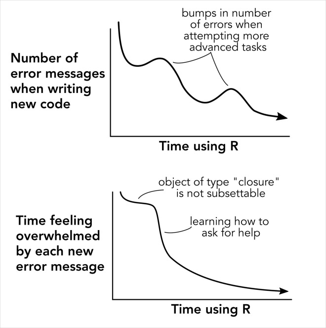

```{css, echo=FALSE}
# CSS for including pauses in printed PDF output (see bottom of lecture)
@media print {
  .has-continuation {
    display: block !important;
  }
}
```

```{r setup, include=FALSE}
# xaringanExtra::use_scribble() ## Draw on slides. Requires dev version of xaringanExtra.

options(htmltools.dir.version = FALSE)
library(knitr)
opts_chunk$set(
  fig.align="center",  
  fig.height=4, #fig.width=6,
  # out.width="748px", #out.length="520.75px",
  dpi=300, #fig.path='Figs/',
  message=FALSE,
  cache=T#, echo=F, warning=F, message=F
  )
pacman::p_load(tidyverse,arrow,datasauRus,gganimate,jsonlite,hrbrthemes,fontawesome)
theme_set(theme_minimal())
```

# Table of contents

1. [Prologue](#prologue)

2. [What is data science?](#what_is_data_science)

3. [Syllabus highlights](#syllabus)

4. [Getting started](#started)

5. [R for data science](#r4ds)

6. [Data visualization with ggplot2](#ggplot2)

---
class: inverse, center, middle
name: prologue

# Prologue

<html><div style='float:left'></div><hr color='#EB811B' size=1px width=796px></html>

---
# Introductions

### Course

`r fa('globe')` https://github.com/big-data-and-economics

You'll soon receive access to this GitHub organization, where we submit assignments, upload presentations, etc.

--

### Me

`r fa('address-book')` [Kyle Coombs](https://kylecoombs.com/)

`r fa('envelope')` [kcoombs@bates.edu](mailto:kcoombs@bates.edu)

`r fa('graduation-cap')` Assistant Professor (economics)

`r fa('map-marker')` From Scotia, New York

`r fa('home')` Live in Maine and Massachusetts

`r fa('book')` Research fields: Public and Labor, interested in applied econometrics and data science

---
# Why this course?

Fill in the gaps left by traditional econometrics and methods classes.

- Practical skills that tools that will benefit your thesis and future career.
- Neglected skills like how to actually find datasets in the wild and clean them.
- Apply skills to analyze empirical questions on economic and social problems. 

Data science skills are largely distinct from (and complementary to) the core 'metrics familiar to economists.

- Acquiring data; scraping; maintaining databases; etc. 
- Data viz, cleaning and wrangling; programming; cloud computation; relational databases; machine learning; etc.

--

> *"In short, we will cover things that I wish someone had taught me when I was starting out in college."*


---

# Caveat

- This course will be **_hard._** You will need to:
  - Teach yourself new skills I cannot cover in 12 weeks
  - Be entrepreneurial: If you find a better way to do something, do (and share) it!
  - Be patient: You will encounter bugs and errors, and you will need to learn how to fix them

- This course will also be **_rewarding_**
  - You can avoid the mistakes you make here on your thesis and in your career
  - You will learn skills that employers, pre-doc programs, and grad schools want
  - You will learn how to be a better researcher and citizen
    - Seriously, a little data science goes a long way in helping you see through BS

---
class: inverse, center, middle
name: what_is_data_science

# What is Data Science?

---
# What is Data Science?

- .hi[Data science (DS):] The scientific discipline that deals with transforming data into useful information ("insights") using a variety of stats/ML techniques

    - Facebook: Collects data on search history, friendship links, site clicks, occupation, etc.

    - Chetty et al. (2022) used FB data to estimate SES and social network ([Social Capital Atlas](https://www.socialcapital.org/))

- The rise of data science has come because of the so-called "Big" Data revolution

    - The rise of the internet in the late-1990s and 2000s $\Rightarrow \,\uparrow$ opportunities for companies and governments to collect data on consumers & citizens

    - Spread of mobile devices & social media from late 2000s until now generated even more data
    
#### Pillars of data science

- Programming (automation of data collection, manipulation, cleaning, visualization, and modeling)
- Visualization & exploration
- Causal inference (to be able to make a policy prescription)
- Machine learning (to select models, compress data, predict outcomes)

...Assuming one has the appropriate foundation of basic calculus and statistics

---
# Data are weird!

```{r datasaurus_dozen,echo=FALSE,warning=FALSE,cache=T}
datasaurus_dozen <- datasaurus_dozen %>% 
  mutate(dataset_counter = as.integer(factor(dataset, levels = unique(dataset))))

ggplot(datasaurus_dozen, aes(x = x, y = y))+
    geom_point()+
    geom_smooth(method = "lm", se = FALSE) +
    theme_bw() +
    theme(legend.position = "none") +
    transition_states(dataset, transition_length=1, state_length=30) +
    ease_aes('linear') +
    labs(title='Sample: {closest_state}') + 
    # footnote data saurus dozen 
    labs(caption = "Data from the Datasaurus Dozen. Each dataset has the same summary statistics, but looks very different.")
```


---
# The data science workflow

.center[
```{r img2, echo=F, out.width="85%"}
knitr::include_graphics('https://d33wubrfki0l68.cloudfront.net/571b056757d68e6df81a3e3853f54d3c76ad6efc/32d37/diagrams/data-science.png')
```

Source: [R for Data Science](http://r4ds.had.co.nz/introduction.html)
]

---
# "Big" Data
.center[
```{r img3, echo=F, out.width="90%"}
knitr::include_graphics('pics/frisch.jpg')
```
]

---
# "Big" Data
.center[
```{r img, echo=F, out.width="90%"}
knitr::include_graphics('pics/frisch.jpg')
```
]

Source: Frisch, Ragnar. 1933. "Editor's Note" _Econometrica_ 1(1): 1-4

---
class: inverse, center, middle
name: syllabus

# Syllabus highlights

<html><div style='float:left'></div><hr color='#EB811B' size=1px width=796px></html>

(Read the full document [here](https://github.com/big-data-and-economics/syllabus/blob/main/syllabus.pdf).)

---
# Course organization

This course is run out of a GitHub organization, [Data Science for Economists](https://github.com/big-data-and-economics/).

Relevant repositories:

- [Course materials](https://github.com/big-data-and-economics/big-data-class-materials): has syllabus, lectures, grade breakdown, etc.
- [Presentations](https://github.com/big-data-and-economics/presentations-winter2025): shared repository where you will submit your presentations
- [Exercises](https://github.com/big-data-and-economics/exercises): has in-class exercises -- you'll "fork" this and work in your own version
- [Discussion](https://github.com/orgs/big-data-and-economics/discussions): for asking and answering
- Problem set repositories: specific repositories for problem sets
 questions


---
# Jargon

- There is a jargon in this class that won't make sense at first, I'll try to flag it as it comes

- Here's a few terms:

.hi[Local machine:] Your personal (or any) computer that isn't a server accessed via the internet

.hi[Version Control:] Keep track of different iterations of a project/code

.hi[Repository:] The location on GitHub of all project files and (commented) file revision history

.hi[GUI:] A Graphical User Interface -- where you point-and-click to do things, like RStudio

.hi[Command line:] Removes the "graphical" from GUI, instead you type all commands to navigate a computer and execute programs

  - R operates via the Command line, RStudio is a GUI
  - On Mac, this is called Terminal which uses Bash (Linux) commands
  - If you installed Git for Windows, you got *Git Bash*, which uses Bash (Linux) commands
  - You can also install Windows Subsystem for Linux to run Linux on a Windows machine

.hi[Script:] A file that contains code that can be executed by a computer, i.e. `.R`, `.Rmd`, `.do`, `.py`, etc.

---
# Like any coding language, R is hard

```{r r-challenges, echo=F,out.width="55%",fig.cap="Taken from Lawlor et al. (2022)"}

```

---
# Tips for success in this class

- **Start early:** This is a fast-paced class; you will need to start early to get help when you need it

- **Ask and answer questions (respectfully) on GitHub Discussions:** 
  - I will direct all emails about non-personal matters to GitHub Discussions
  - Perhaps a classmate can answer (ideal) OR I can answer once for everyone (also valuable)

- **Try to understand the task before you code:** 
  - This is not a class where you can just copy code from the internet and paste it in. 
  - This is a class where you know if you have the right answer _if_ you understand the task

- **Try stuff and see if it worked:** Check if the code does what you want before you submit

- **Comment your code:**
  - Helps you remember what you were doing
  - Helps me understand what you were trying (like showing your work in a math class)

- **Let me know about bugs/errors early**: Technical demos break. Flagging them helps me, your peers, and future cohorts.

- **Listen and try things as I demonstrate them**: If you need me to slow down, ask

---
# Stuck while coding?

You're gonna write a lot of code for this class, which means you're gonna troubleshoot a lot of bugs.

- Some of these will be bugs of your own making, some will be bugs of open source tools

- A major learning objective in this class is to learn when to ask for help and how to ask for help

1. Try to describe in plain words/simple pictures what you want code to do before you write it

2. Break this description into smaller steps (1: Read in data, 2: Drop rows with NA County, etc.)

3. Write code "modularly" (in pieces) to do each step, then you can troubleshoot piece-by-piece

4. The `help` documentation for R functions is the best place to start for troubleshooting

5. [Google is your friend.](http://xkcd.com/627/) Google is your friend. Google is your friend.<sup>1</sup>

6. Search [stackoverflow](http://stackoverflow.com/) and include the `[r]` tag or your package, e.g. `[ggplot]`, `[data.table]`

7. Ask for help from classmates, our CAT, and me on GitHub Discussions/Issues or OH

- If you ask for help in OH, I will ask if you tried for the first six steps. If you haven't, I will ask you to try them first.

.footnote[<sup>1</sup> Generative AI ([ChatGPT](https://chat.openai.com/) and [GitHub CoPilot](https://github.com/features/copilot)) is a bit of a frenemy.]

---
# Avoid: "Unhelpfully seeking help"

> "If someone has the wit and knowledge to answer your question, they probably have other things they would like to do. Making your message clear, concise and user-friendly gives you the best hope of at least one of those strangers diverting their attention away from their life towards your problem."

> - [The R Inferno Circle 9](https://www.burns-stat.com/pages/Tutor/R_inferno.pdf)

In short, write a minimal reproducible example (MREs) of your bug. See this [stackoverflow thread](http://stackoverflow.com/questions/5963269/how-to-make-a-great-r-reproducible-example/5963610#5963610) for a primer. 

- We'll come back to MREs soon! 

Lots of helpful (and a little rude) guides in the [University of British Columba Stat 545 course](https://stat545.stat.ubc.ca/notes/notes-a01/)

---
# Class outline

### Three units:


#### 1. Data science basics
.pull-left[
- Version control with Git and GitHub
- R language basics
- Data cleaning and wrangling
]
.pull-right[
- Data acquisition and loading
- Data visualization
- Spatial analysis
]

#### 2. Causal Inference
.pull-left[
- Regression analysis
- Regression discontinuity design
]
.pull-right[
- Panel data and fixed effects
- Difference-in-difference design
]


#### 3. Scaling up: Big data, ML, and cloud computation
.pull-left[
- Functions and iteration
- Parallel programming
]
.pull-right[
- Machine Learning techniques
- Text analysis
]

---
class: inverse, center, middle
name: started

# Getting started

<html><div style='float:left'></div><hr color='#EB811B' size=1px width=796px></html>

---
# Software installation and registration

1. Download [R](https://www.r-project.org/).

2. Download [RStudio](https://www.rstudio.com/products/rstudio/download/preview/).

3. Download [Git](https://git-scm.com/downloads).

4. Create an account on [GitHub](https://github.com/) and register for a student/educator [discount](https://education.github.com/discount_requests/new).
  - I will use GitHub to disseminate and submit assignments, receive feedback, etc. 

5. Make a folder on your computer for this class. Any and all repositories for this class should be cloned into this folder.

--

If you had trouble completing any of these steps, please raise your hand.
- My go-to place for installation guidance and troubleshooting is Jenny Bryan's http://happygitwithr.com.

---
# Some OS-specific extras

I'll detail further software requirements as and when the need arises. However, to help smooth some software installation issues further down the road, please also do the following (depending on your OS):

- **Windows:** I recommend that you install [Rtools](https://cran.r-project.org/bin/windows/Rtools/), [Chocolately](https://chocolatey.org/) and [Windows Subsystem for Linux](https://learn.microsoft.com/en-us/windows/wsl/install).
- **Mac:** Install [Homebrew](https://brew.sh/). I also recommend that you configure/open your C++ toolchain (see [here](https://github.com/rmacoslib/r-macos-rtools#installer-package-for-macos-r-toolchain-).)
- **Linux:** None (you should be good to go).

---
# Checklist

☑ Do you have the most recent version of R?
  ```{r, cache=FALSE}
  version$version.string
  ```
☑ Do you have the most recent version of RStudio?
  ```{r eval=FALSE}
  RStudio.Version()$version
  ## Requires an interactive session but should return something like "[1] ‘2024.12.0.46’"
  ```

☑ Have you updated all of your R packages? 
  ```{r eval=FALSE}
  update.packages(ask = FALSE, checkBuilt = TRUE)
  ```

---
# Checklist (cont.)

Navigate to the terminal tab in the RStudio console.

☑ Which version of Git have you installed?
  ```{bash, cache=FALSE}
  git --version
  ```

☑ Did you introduce yourself to Git? (Substitute in your details.)
  ```{bash eval=FALSE}
  git config --global user.name 'kgcsport'
  git config --global user.email 'kcoombs@bates.edu'
  git config --global --list
  ```

☑ Did you register an account in GitHub? 

---
# Checklist (cont.)

Open up your computers and navigate to the in-class exercise repository: https://github.com/big-data-and-economics/exercises 

1. Fork the repository to your own GitHub account in the upper-right corner of the page.
2. Navigate to `Settings > Collaborator and teams`
3. Click `Add people` to add my username (@kgcsport) to your forked repository
4. Click on `01-intro-to-r` and download the `intro-to-r.R` script to a folder for this class on your computer.
5. This is the in-class exercise for today, submission instructions are in the folder

--

We will make sure that everything is working properly with your R and GitHub setup next lecture.

For the rest of today's lecture, I want to go over some very basic R concepts.

Open `intro-to-r.R` and fill in the code under each comment (marked `#`) as we go.

--

PS — Just so you know where we're headed: We'll return to these R concepts (and delve much deeper) after a brief, but important detour to the lands of coding best practices and Git(Hub).

---
class: inverse, center, middle
name: r4ds

# R for data science
<html><div style='float:left'></div><hr color='#EB811B' size=1px width=796px></html>

---
name: whyr
# Why R and RStudio? 

### Data science positivism

- Alongside Python, R has become the *de facto* language for data science.
  - See: [*The Impressive Growth of R*](https://stackoverflow.blog/2017/10/10/impressive-growth-r/), [*The Popularity of Data Science Software*](http://r4stats.com/articles/popularity/)
- Open-source (free!) with a global user-base spanning academia and industry.
  - "Do you want to be a profit source or a cost center?"

### Bridge to applied economics and other tools

- Already has all of the statistics and econometrics support, and is amazingly adaptable as a “glue” language to other
programming languages and APIs.
- The RStudio IDE and ecosystem allow for further, seemless integration.

### Path dependency

- It's also the language that I know best.
- (Learning multiple languages is a good idea, though.)

---
# Do $\uparrow$ in GDP cause life expectancy to $\uparrow$? 

- Let's use R to try to look at a key question in economics:
  - Does increasing the economic pie (GDP) lead to longer lives (life expectancy)?

- We can use the gapminder dataset to explore this question
- The [gapminder](https://github.com/jennybc/gapminder) dataset contains panel data on life expectancy, population size, and GDP per capita for 142 countries since the 1950s
- Any predictions about what we'll learn? 

---
class: inverse, center, middle
name: ggplot2

# ggplot2
<html><div style='float:left'></div><hr color='#EB811B' size=1px width=796px></html>

---
# Install and load

For the remainder of this lecture, we're going to play around with [ggplot2](https://ggplot2.tidyverse.org/) to explore our question about GDP and life expectancy. 

If you don't have them already, install the `ggplot2` and `gapminder` packages via either:
- **Console:** Enter `install.packages(c("ggplot2", "gapminder"), dependencies=T)`.
- **RStudio:** Click the "Packages" tab in the bottom-right window pane. Then click "Install" and search for these two packages.
  


---
# Install and load (cont.)

Once the packages are installed, load them into your R session with the `library()` function.
```{r pkg_load}
library(ggplot2)
library(gapminder) ## We're just using this package for the gapminder data
```

Notice too that you don't need quotes around the package names any more. Reason: R now recognises these packages as defined objects with given names. 

--

PS — A convenient way to combine the package installation and loading steps is with the [pacman package's](https://github.com/trinker/pacman) `p_load()` function. If you run `pacman::p_load(ggplot, gapminder)` it will first look to see whether it needs to install either package before loading them. Clever.
- We'll get to this later, but if you want to run a function from an (installed) package without loading it, you can use the `PACKAGE::package_function()` syntax.

---
# Exploratory analysis

- What initial exploratory questions do we have? Shout them out! 

--

- Here's what I want to know:

  1. How are the data organized? 
  2. What are the unique countries in the dataset?
  3. What does the relationship between GDP per capita and life expectancy look like?

- We'll tackle the third today since it is the most visually interesting

---
# ChatGPT example

I need a volunteer. Please type a ChatGPT prompt into my computer that:

>  Writes R code that loads the gapminder data, display some key checks, then make a scatterplot of GDP per capita and life expectancy

--

**Potential prompt:**

Write an R script that does the following:

(a) Reads in the gapminder dataset using the library gapminder.

(b) Prints out the first 10 rows of the gapminder dataset.

(c) Lists which countries are in the sample (i.e. list unique values of the county variable)

(d) Plots a scatterplot of the gdpPercap by lifeExp using the gapminder dataset using ggplot. 

---
# ChatGPT example (continued)

**Assistant:**

Certainly! Here's an R script that accomplishes these tasks using the gapminder dataset:

.scroll-box-8[
```{r gapminder-chatgpt,eval=FALSE}
# Load necessary libraries
library(gapminder)
library(ggplot2)

# Step (a) - Read in the gapminder dataset
data("gapminder")
gapminder_df <- gapminder

# Step (b) - Print first 10 rows
print(head(gapminder_df, 10))

# Step (c) - List unique countries
unique_countries <- unique(gapminder_df$country)
print(unique_countries)

# Step (d) - Plot scatterplot of gdpPercap by lifeExp
ggplot(gapminder_df, aes(x = gdpPercap, y = lifeExp)) +
  geom_point() +
  labs(x = "GDP per Capita", y = "Life Expectancy") +
  ggtitle("Relationship between GDP per Capita and Life Expectancy")
```
]

This script assumes that the gapminder package is installed and loaded. It reads in the gapminder dataset, prints the first 10 rows, lists unique countries present in the dataset, and then creates a scatterplot of gdpPercap (GDP per Capita) against lifeExp (Life Expectancy) using ggplot2. Adjust the plot aesthetics as needed to suit your preferences.
***

Exported on 1/8/2024.

Tips on using generative AI for coding:

- [Turing Institute](https://www.turing.ac.uk/blog/using-generative-ai-write-code-guide-researchers)
- [Github Copilot in RStudio](https://github.blog/developer-skills/github/how-to-use-github-copilot-in-your-ide-tips-tricks-and-best-practices/)
- [General Copilot tips](https://docs.github.com/en/copilot/using-github-copilot/best-practices-for-using-github-copilot)

---
# How's the code run? 
```{r gapminder-chatgpt-eval1,echo=FALSE}
# Load necessary libraries
library(gapminder)
library(ggplot2)

# Step (a) - Read in the gapminder dataset
data("gapminder")
gapminder_df <- gapminder

# Step (b) - Print first 10 rows
print(head(gapminder_df, 10))

# Step (c) - List unique countries
unique_countries <- unique(gapminder_df$country)
print(unique_countries)

# Step (d) - Plot scatterplot of gdpPercap by lifeExp
# ggplot(gapminder_df, aes(x = gdpPercap, y = lifeExp)) +
#   geom_point() +
#   labs(x = "GDP per Capita", y = "Life Expectancy") +
#   ggtitle("Relationship between GDP per Capita and Life Expectancy")
```

---
# How's the code run? (cont.)
```{r gapminder-chatgpt-eval2,echo=FALSE}
# Load necessary libraries
library(gapminder)
library(ggplot2)

# Step (a) - Read in the gapminder dataset
data("gapminder")
gapminder_df <- gapminder

# Step (b) - Print first 10 rows
#print(head(gapminder_df, 10))

# Step (c) - List unique countries
unique_countries <- unique(gapminder_df$country)
#print(unique_countries)

# Step (d) - Plot scatterplot of gdpPercap by lifeExp
ggplot(gapminder_df, aes(x = gdpPercap, y = lifeExp)) +
  geom_point() +
  labs(x = "GDP per Capita", y = "Life Expectancy") +
  ggtitle("Relationship between GDP per Capita and Life Expectancy")
```

---
# Elements of ggplot2

[Hadley Wickham's](http://hadley.nz/) ggplot2 is one of the most popular packages in the entire R canon. 
- It also happens to be built upon some deep visualization theory: i.e. Leland Wilkinson's [*The Grammar of Graphics*](https://www.amazon.com/Grammar-Graphics-Statistics-Computing/dp/0387245448).

There's a lot to say about ggplot2's implementation of this "grammar of graphics" approach, but the three key elements are:

1. Your plot ("the visualization") is linked to your variables ("the data") through various **aesthetic mappings**.

2. Once the aesthetic mappings are defined, you can represent your data in different ways by choosing different **geoms** (i.e. "geometric objects" like points, lines or bars).

3. You build your plot in **layers**.

--

</br>

That's kind of abstract. Let's break down the elements of ggplot2 in turn with some actual plots.

- As a shortcut, we'll use AI to write the basic code for us then we'll fill in the blanks.

---
# 1. Aesthetic mappings

```{r, aesthetics0}
ggplot(data = gapminder, mapping = aes(x = gdpPercap, y = lifeExp)) + 
  geom_point()
```
---
# 1. Aesthetic mappings (cont.)

```{r aesthetics1, eval=FALSE}
ggplot(data = gapminder, mapping = aes(x = gdpPercap, y = lifeExp)) + 
  geom_point()
```

Focus on the top line, which contains the initialising `ggplot()` function call. This function accepts various arguments, including:
- Where the data come from (i.e. `data = gapminder`).
- What the aesthetic mappings are (i.e. `mapping = aes(x = gdpPercap, y = lifeExp)`).

--

The aesthetic mappings here are pretty simple: They just define an x-axis (GDP per capita) and a y-axis (life expectancy).
- To get a sense of the power and flexibility that comes with this approach, however, consider what happens if we add more aesthetics to the plot call...

---
# 1. Aesthetic mappings (cont.)

- Can you vary the color of the dots by continent? Size by population? Try to think how you'd do that...

```{r aesthetics2, eval=FALSE}
ggplot(data = gapminder, mapping = aes(x = gdpPercap, y = lifeExp)) + 
  geom_point()
```

---
# 1. Aesthetic mappings (cont.)

```{r aesthetics3, dev='svg'}
ggplot(data = gapminder, aes(x = gdpPercap, y = lifeExp, size = pop, col = continent)) + 
  geom_point(alpha = 0.3) ## "alpha" controls transparency. Takes a value between 0 and 1.
```

--

- I've dropped the "mapping =" part of the ggplot call. `ggplot2` knows the order of the arguments.

---
# 1. Aesthetic mappings (cont.)

We can specify aesthetic mappings in the geom layer too.
```{r aesthetics4, dev='svg'}
ggplot(data = gapminder, aes(x = gdpPercap, y = lifeExp)) + ## Applicable to all geoms
  geom_point(aes(size = pop, col = continent), alpha = 0.3) ## Applicable to this geom only
```

---
# 1. Aesthetic mappings (cont.)

Oops. What went wrong here?
```{r aesthetics_mistake, warning=FALSE,dev='svg'}
ggplot(data = gapminder, aes(x = gdpPercap, y = lifeExp)) + 
  geom_point(aes(size = "big", col="black"), alpha = 0.3)
```

--

**Answer:** Aesthetics must be mapped to variables, not descriptions!

---
# 1. Aesthetic mappings (cont.)

At this point, instead of repeating the same ggplot2 call every time, it will prove convenient to define an intermediate plot object that we can re-use.

```{r p, dev='svg'}
p = ggplot(data = gapminder, aes(x = gdpPercap, y = lifeExp))
p
```

---
# 2. Geoms

Once your variable relationships have been defined by the aesthetic mappings, you can invoke and combine different geoms to generate different visualizations.

```{r geoms1, dev='svg',warning=FALSE}
p + 
  geom_point(alpha = 0.3)  +
  geom_smooth(method = "loess") # A smoothed "locally estimated scatterplot smoothing" line
```

---
# 2. Geoms (cont.)

Aesthetics can be applied differentially across geoms. Here I add a "locally estimated scatterplot smoothing" or loess line to the plot.

```{r geoms2, dev='svg'}
p + 
  geom_point(aes(size = pop, col = continent), alpha = 0.3)  +
  geom_smooth(method = "loess") 
```

---
# 2. Geoms (cont.)

The previous plot illustrates the power (or effect) that comes from assigning aesthetics "globally" vs in the individual geom layers. Compare to the code chunk below...

```{r geoms3, eval=FALSE}
ggplot(data = gapminder, aes(x = gdpPercap, y = lifeExp, size = pop, col = continent)) +
  geom_point(alpha = 0.3)  +
  geom_smooth(method = "loess") 
```

---
# 2. Geoms (cont.)

The previous plot provides a good illustration of the power (or effect) of assigning aesthetic mappings "globally" vs by geom layer.
- Compare: What happens if you run the below code chunk?

```{r geoms3-eval, warning=FALSE}
ggplot(data = gapminder, aes(x = gdpPercap, y = lifeExp, size = pop, col = continent)) +
  geom_point(alpha = 0.3)  +
  geom_smooth(method = "loess") 
```

---
# 3. Build your plot in layers

We've already seen how we can chain (or "layer") consecutive plot elements using the `+` connector.
- The fact that we can create and re-use an intermediate plot object (e.g. "p") is testament to this.

But it bears repeating: You can build out some truly impressive complexity and transformation of your visualization through this simple layering process.
- You don't have to transform your original data; ggplot2 takes care of all of that.
- For example (see next slide for figure).

- **Bonus:** Maybe this will help make sense of the non-linear relationship between GDP per capita and life expectancy?

---
# 3. Build your plot in layers (cont.)

```{r layers1}
p2 =
  p +
  geom_point(aes(size = pop, col = continent), alpha = 0.3) +
  scale_color_brewer(name = "Continent", palette = "Set1") + ## Different colour scale
  scale_size(name = "Population", labels = scales::comma) + ## Different point (i.e. legend) scale
  scale_x_log10(labels = scales::dollar) + ## Switch to logarithmic scale on x-axis. Use dollar units.
  labs(x = "Log (GDP per capita)", y = "Life Expectancy") + ## Better axis titles
  theme_minimal() ## Try a minimal (b&w) plot theme
```

- Before executing, what will this do? 

- The comments help, as will Google and ChatGPT, but the function names are somewhat intuitive too.

---
# 3. Build your plot in layers (cont.)

```{r layers2,  echo=FALSE, dev='svg'}
p2
```

---
# What else?

We have barely scratched the surface of ggplot2's functionality... let alone talked about all the packages built around it. 
- Here's are an additional example to whet your appetite<sup>1</sup>

#### Animation! (See the next slide for the resulting GIF.)

```{r gganim1, eval=FALSE}
# library(gganimate)
ggplot(gapminder, aes(gdpPercap, lifeExp, size = pop, colour = country)) +
  geom_point(alpha = 0.7, show.legend = FALSE) +
  scale_colour_manual(values = country_colors) +
  scale_size(range = c(2, 12)) +
  scale_x_log10(labels = scales::dollar) +
  facet_wrap(~continent) +
  # Here comes the gganimate specific bits
  labs(title = 'Year: {frame_time}', x = 'Log (GDP per capita)', y = 'Life expectancy') +
  transition_time(year) +
  ease_aes('linear')
```

- What is different about this code? 

.footnote[<sup>1</sup> Note: Note that you will need to install and load some additional packages if you want to recreate the next two figures on your own machine.]

---
# What else? (cont.)

```{r gganim2, echo=FALSE}
ggplot(gapminder, aes(gdpPercap, lifeExp, size = pop, colour = country)) +
  geom_point(alpha = 0.7, show.legend = FALSE) +
  scale_colour_manual(values = country_colors) +
  scale_size(range = c(2, 12)) +
  scale_x_log10(labels = scales::dollar) +
  facet_wrap(~continent) + 
  # Here comes the gganimate specific bits
  labs(title = 'Year: {frame_time}', x = 'Log (GDP per capita)', y = 'Life expectancy') +
  transition_time(year) +
  ease_aes('linear')
```

--

Note that this animated plot provides a much more intuitive understanding of the underlying data. Just as [Hans Rosling](https://www.ted.com/talks/hans_rosling_the_best_stats_you_ve_ever_seen) intended.

---
# But is it causal?

- We can't answer this question with a simple plot.
- We also can't answer this question with a very fancy plot. 
- What do we need?
  > - A model
  > - A causal identification strategy
  > - More granular (bigger) data

---
class: inverse, center, middle

# Next lecture: Deep dive into Git(Hub).
<html><div style='float:left'></div><hr color='#EB811B' size=1px width=796px></html>

```{r gen_pdf, include = FALSE, cache = FALSE, eval = TRUE}
# If broken in the future, check the fix here: https://stackoverflow.com/questions/78928374/how-to-solve-pagedown-chrome-print-failed-to-generate-output-due-to-fail-to-open
infile = list.files(pattern = '.html')
pagedown::chrome_print(input = infile, timeout = 100)
```

---
name: appendix
class: inverse, center, middle

# Appendix 

---
# Some R basics

1. Everything is an object.

2. Everything has a name.

3. You do things using functions.

4. Functions come pre-written in packages (i.e. "libraries"), although you can — and should — write your own functions too.

--

</br>

Points 1. and 2. can be summarised as an [object-oriented programming](https://en.wikipedia.org/wiki/Object-oriented_programming) (OOP) approach.
  - This may sound super abstract now, but we'll see *lots* of examples over the coming weeks that will make things clear.

---
# R vs Stata

If you're coming from Stata, some additional things worth emphasizing:

- Multiple objects (e.g. data frames) can exist happily in the same workspace. 
   - No more `keep`, `preserve`, `restore` hackery. (Though, props to [Stata 16](https://www.stata.com/new-in-stata/multiple-datasets-in-memory/).)
   - This is a direct consequence of the OOP approach.

- You will load packages at the start of every new R session. Make peace with this.
  - "Base" R comes with tons of useful in-built functions. It also provides all the tools necessary for you to write your own functions. 
  - However, many of R's best data science functions and tools come from external packages written by other users.

- R easily and infinitely parallelizes. For free.
  - Compare the cost of a [Stata/MP](https://www.stata.com/statamp/) license, nevermind the fact that you effectively pay per core...

- You don't need to `tsset or xtset` your data. (Although you can too.)