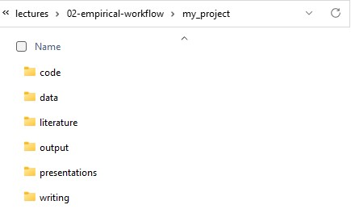
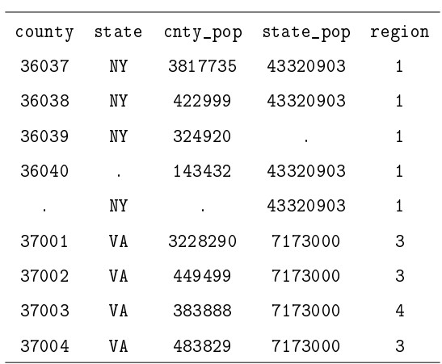
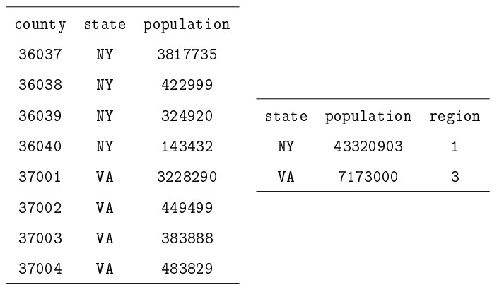

```{css, echo=FALSE}
# CSS for including pauses in printed PDF output (see bottom of lecture)
@media print {
  .has-continuation {
    display: block !important;
  }
}
```

```{r setup, include=FALSE}
# xaringanExtra::use_scribble() ## Draw on slides. Requires dev version of xaringanExtra.

options(htmltools.dir.version = FALSE)
library(knitr)
opts_chunk$set(
  fig.align="center",  
  fig.height=4, #fig.width=6,
  # out.width="748px", #out.length="520.75px",
  dpi=300, #fig.path='Figs/',
  cache=T#, echo=F, warning=F, message=F
  )
library(tidyverse)
library(hrbrthemes)
library(fontawesome)
library(RefManageR)
library(aqp)
BibOptions(check.entries = FALSE,
           bib.style = "authoryear",
           style = "markdown",
           hyperlink = FALSE,
           dashed = TRUE)
#biblio <- ReadBib("../../References/References.bib", check = FALSE)
```

# Table of contents

1. [Prologue](#prologue)

2. [Clean Code](#clean_code)

3. [Principles](#principles)

4. [Appendix: FAQ](#faq)

---
class: inverse, center, middle
name: prologue

# Prologue

<html><div style='float:right'></div><hr color='#EB811B' size=1px width=796px></html>
<div align="center">

</div>
Source: [xkcd](http://xkcd.com/1513/)

---
# Forgot to mention

- .hi[Office Hours:]
    - My office hours are 9am-10am on Tuesdays and 3pm-4pm on Wednesdays
    - My office is 276 Pettengill 
    - I'm also available by [appointment](https://calendar.app.google/XF36Ujpg9NcJbSD58) on Zoom

- .hi[Problem Set 0:] due on Sunday, September 17th at 11:59pm

- .hi[Presentations:] Everyone does two, sign-up in the [Presentations github repository](https://classroom.github.com/a/jWcBRDZJ)

- .hi[Problem Set 0:] due on Sunday, September 17th at 11:59pm

- .hi[Problem Set 1:] due on Sunday, September 24th at 11:59pm

- .hi[Project Proposal:] due on Sunday, September 24th at 11:59pm

---

# Play along at home

- Sync your forks of the class repository

- Pull the latest changes from the class repository to your computer

- Open lectures/02-empirical-workflow.Rmd and you can follow along with the slides
  - Specifically, you can run the code live while I walk through it on the slides

---

# Attribution

- Today's material comes from these sources:

1. [Clean Code](https://raw.githack.com/OU-PhD-Econometrics/fall-2022/master/LectureNotes/01a-CleanCode/01aslides.html) by Tyler Ransom

2. [*Code and Data for the Social Sciences: A Practitioner's Guide*](https://web.stanford.edu/~gentzkow/research/CodeAndData.pdf), by Gentzkow and Shapiro

3. [Causal Inference and Research Design](https://github.com/scunning1975/mixtape) by Scott Cunningham

4. [Jenny Bryan's UseR 2018 keynote address](https://www.youtube.com/watch?v=7oyiPBjLAWY)

Also a small contribution from [here](https://garywoodfine.com/what-is-clean-code/) and other sundry internet pages

---
# Jargon

- There is a jargon in this class that won't make sense at first, I'll try to flag it as it comes
    - If I don't flag a term, look it up on ChatGPT 
    - If it still doesn't make sense, ask me -- could be I'm using it idiosyncratically

- Here's a few terms:
    - **Local machine:** Your personal (or any) computer that isn't a server accessed via the internet
    - **Version Control:** Keep track of different iterations of a project/code
    - **Repository:** The location on GitHub of all project files and (commented) file revision history
    - **GUI:** A Graphical User Interface -- what you're used to pointing and clicking to navigate a computer and execute programs
    - **Command line:** Removes the "graphical" from GUI, instead you type all commands to navigate a computer and execute programs 
        - R operates via the Command line, RStudio is a GUI
        - On Mac, this is called Terminal
        - Windows has Powershell, but it Powershell uses quite user-unfriendly commands
        - If you installed Git for Windows, you got *Git Bash*, which uses Bash (Linux) commands
        - You can also install Windows Subsystem for Linux to run Linux on a Windows machine

---
class: inverse, center, middle
name: clean_code

# Clean Code

---
# Reducing empirical chaos

## Sad story

- Once upon a time there was a boy who was writing a job market paper on unemployment insurance during the pandemic
- This boy presented the findings a half dozen times, spoke to the media some, and generally thought he had cool results
- Several people suggested he look at a handful of other outcome series and try changing his analysis unit frequency from monthly to weekly
- He also knew that he needed to restrict his sample to reduce noise

---
# The horror! 

- But then after making these changes and re-running his code that took two days, his new sample dropped by 50 percent! 
- He was, understandably, terrified.
- The young boy spent a week looking for the fix weeding through six different versions of the .do, .R, .dta, .csv, .sh, .py files with suffixes like *_v1* and *_test* and *_test2* and *_final_I_swear* and *_okay_i_lied*
- Finally he discovered the phrase:
```{r drop1, eval=FALSE}
df %>% filter(insample_new==0)
```
**instead of**
```{r drop2, eval=FALSE}
df %>% filter(insample_new==1)
```
- The boy was very frustrated and decided to work on these slides while re-running his code.

---
# What is Clean Code?

- .hi[Clean Code:] Code that is easy to understand, easy to modify, and hence easy to debug

- Clean code saves you and your collaborators time

---

# Why clean code matters: Scientific progress

- Good science is based on careful observations

- Science progresses through iteratively testing hypotheses and making predictions

- Scientific progress is impeded if 

    - mistaken previous results are erroneously given authority
    
    - previous hypothesis tests are not reproducible
    
    - previous methods and results are not transparent 

- Thus, for science that involves computer code, clean code is a must


---

# Why clean code matters: Personal and team sanity

- You will always make a mistake while coding

- What makes good programmers great is their ability to quickly identify and correct mistakes

- Developing a habit of clean coding from the outset of your career will help you more quickly identify and correct mistakes

- It will save you a lot of stress in the long-run

- It will make your collaborative relationships more pleasant


---

# Why clean code is under-produced

- If clean code is so beneficial and important, why isn't there more of it?

<br>

1. .hi[Competitive pressure] to produce research/products as quickly as possible
    
2. .hi[End user] (journal editor, reviewer, reader, dean) .hi[doesn't care what the code looks like], just that the product works
    
3. In the moment, clean code .hi[takes longer to produce] while seemingly conferring no benefit

---
class: inverse, center, middle
name: principles

# How does one produce clean code? Principles

---

# How does one produce clean code? Principles

- Automation

- Version control

- Organization of data and software files

- Abstraction

- Documentation

- Time / task management

- Test-driven development (unit testing, profiling, refactoring)

- Pair programming

---

# Automation

- Gentzkow & Shapiro's two rules for automation:

1. Automate everything that can be automated

2. Write a single script that executes all code from beginning to end

- There are two reasons automation is so important

    - Reproducibility (helps with debugging and revisions)
    
    - Efficiency (having a code base saves you time in the future)

- A single script that shows the sequence of steps taken is the equivalent to "showing your work"

---

# Version control

- We've discussed Git and GitHub in a previous slide deck

- Version control provides a principled way for you to easily undo changes, test out new specifications, and more

---

# File organization

1. Separate directories by function

2. Separate files into inputs and outputs

3. Make directories portable

- To see how professionals do this, check out the source code for R's [dplyr](https://github.com/tidyverse/dplyr) package

    - There are separate directories for source code (`/src`), documentation (`/man`), code tests (`/test`), data (`/data`), examples (`/vignettes`), and more
    
- When you use version control, it forces you to make directories portable (otherwise a collaborator will not be able to run your code)

    - use __relative__ file paths, not absolute file paths

---
# Don't be like this 

<html><div style='float:right'></div><hr color='#EB811B' size=1px width=796px></html>
<div align="center">

</div>
Source: [xkcd](http://xkcd.com/1459/)

---
# How I organize research projects

- I have a folder called (`my_project`) 
- Within that folder I have subfolders:
    1. `data` for all data files
        a. `raw` for raw data files
        b. `clean` or `work` for cleaned data files
        c. `temp` for temporary data files
    2. `code` for all code files, and sometimes:
        a. `code/analysis` for code files that build/clean code
        a. `code/build` for code files that do analysis
    3. `output` for all output files
        a. `output/figures` for code files that make figures
        b. `output/tables` for code files that make tables
    4. `literature` or `articles` for all relevant literature
    5. `writing` for all writing files
        a. `writing/notes` for notes
        b. `writing/drafts` for drafts
        c. `writing/edits` for edits
    6. `presentations` for all presentations
        a. `presentations/slides` for slides
        b. `presentations/notes` for notes
- I'll further organize as needed
- See GitHub folder for this lecture as an example 
    - I also include a script `make_directory.sh` that automates this process
---
# How I organize research projects

```{bash, cache=FALSE}
tree my_project
```

---
# How I organize research projects

<div align="center">

</div>

Source: My computer

---
# What is the value of directories? 

- All of the files in a directory are related to each other
- Can reference a file within the `data/raw` folder, from the `code/build` folder, using a relative path: `../data/raw/my_data.csv`
    - `..` means "go up one directory", then down into `data/raw`
- Can save objects of strings of path directories to use later using the `paste()` function

```{r path_string}
my_project <- 'my_project'
data <- paste(my_project,'data',sep='/')
data_raw <- paste(data,'raw',sep='/')
data_clean <- paste(data,'clean',sep='/')
data_temp <- paste(data,'temp',sep='/')
code <- paste(my_project,'code',sep='/')
code_analysis <- paste(code,'analysis',sep='/')
code_build <- paste(code,'build',sep='/')

print(paste(data_raw,'my_data.csv',sep='/'))
read.csv(paste(data_raw,'my_data.csv',sep='/'))
```

- This is a good way to make sure that your code is portable
- If you move your project to a different computer, you can just change the `my_project` variable and all the other paths will update automatically

---
# Alternative to all the pastes is here()

- Better yet is the [here](https://cran.r-project.org/web/packages/here/vignettes/here.html)
    - `here()` will find the root directory of your project and then you can navigate from there

```{r here}
#install.packages('here')
library(here)
here::i_am('my_project/code/build/.placeholder')
```

```{r here_data}
here('data/raw','my_data.csv')
```

- Can be less clunky than `paste()` and `sep='/'`

---
# How to write scripts 

## Keep them modular
- Each script should do one thing and one thing only
- e.g. It takes an input in, it returns an output

    - Taking in a raw file and returning a cleaned version
    - Taking in two files and merging them
    - Taking in a cleaned file and returning a figure
 
## Have a main script that runs all scripts in order

- This is the script that you run to reproduce your results
- You will rarely run it all at once, but it will be a nice way to organize your thoughts
- This is a further benefit of a well-organized directory -- you can easily see what scripts you need to run in what order
- Use `source('rscript.R')` to run an external script

---
# Main script

```{r main_script, eval=FALSE}
#File: main.R
#By: Kyle Coombs
#What: Runs the project from start to finish in Python
#Date: 2023/09/12

#Install packages with housekeeping. Also put together paths.
source('housekeeping.R')
#User written functions can be sourced -- or you could write a package, your call
source(paste0(build,'clean_functions.R'))
source(paste0(analysis,'analysis_functions.R'))

#Import files
df1 <- read_csv(paste0(raw,'file1.csv'))
df2 <- read_parquet(paste0(raw,'file2.parquet'))
df3 <- read_dta(paste0(raw,'file3.dta'))

#Clean files
cleaned_df1  <- clean_df1(df1)
cleaned_df2  <- clean_df2(df2)
cleaned_df3  <- cf.clean_df3(df3)

#Merge files 1 to 2
merged_df1_df2 = merge(cleaned_df1, cleaned_df2, on=c('merge','vars'))

#Append file 1 to 
append_df1_df2_df3 = rbind(merged_df1_df2, cleaned_df2)

#Analysis
sum_stats=summary_stats(append_df1_df2_df3,stats=c('mean','median','max'))
reg_results=basic_regression(append_df1_df2_df3)

#Tables will likely be made with a host of R packages
make_sum_figures(sum_stats)
make_figures(reg_results)
make_sum_tables(sum_stats)
make_tables(reg_results)
```

---
# Alternate main script
```{r main_script2, eval=FALSE}
#File: main.R
#By: Kyle Coombs
#What: Runs the project from start to finish in Python
#Date: 2023/09/12

#Install packages with housekeeping. Also put together paths.
source('housekeeping.R')
#User written functions can be sourced -- or you could write a package, your call
source(paste0(build,'clean_functions.R'))
source(paste0(analysis,'analysis_functions.R'))

#Import files
source(paste0(build,'import_census.R'))
source(paste0(build,'import_admin_data.R'))

#Clean files
source(paste0(build,'clean_census.R'))
source(paste0(build,'clean_admin_data.R'))

#Merge files 1 to 2
source(paste0(build,'merge_census_admin.R'))

#Analysis
source('analysis/summary_stats.R')
source('analysis/basic_regression.R')

#Tables will likely be made with a host of R packages
source('analysis/make_sum_figures.R')
source('analysis/make_reg_figures.R')
source('analysis/make_sum_tables.R')
source('analysis/make_reg_tables.R')
```

---

# Data organization

- The key idea is to practice .hi[relational data base management]

- A relational database consists of many smaller data sets

- Each data set is tabular and has a unique, non-missing key

- Data sets "relate" to each other based on these keys

- You can implement these practices in any modern statistical analysis software (R, Stata, SAS, Python, Julia, SQL, ...)

- Gentzkow & Shapiro recommend not merging data sets until as far into your code pipeline as possible

---
# What problems would this create?


<div align="center">

</div>

Source: [Code and Data for the Social Sciences](https://web.stanford.edu/~gentzkow/research/CodeAndData.pdf) (p. 19)


---
# What's RDBM look like?

<div align="center">

</div>

Source: [Code and Data for the Social Sciences](https://web.stanford.edu/~gentzkow/research/CodeAndData.pdf) (p. 19)


---
# Abstraction

- What is abstraction? It means "reducing the complexity of something by hiding unnecessary details from the user"

- e.g. A dishwasher. All I need to know is how to put dirty dishes into the machine, and which button to press. I don't need to understand how the electrical wiring or plumbing work.

- In programming, abstraction is usually handled with functions

- Abstraction is usually a good thing

- But it can be taken to a harmful extreme: overly abstract code can be "impenetrable" which makes it difficult to modify or debug

---

# Rules for Abstraction

- Gentzkow & Shapiro give three rules for abstraction:

1. Abstract to eliminate redundancy

2. Abstract to improve clarity

3. Otherwise, don't abstract

---

# Abstract to eliminate redundancy

- Sometimes you might find yourself repeating lines of code with small modifications across the lines:

```{r naming redundancy}
names <- c('one','two','three','four','five','one','two','three','four','five','one','two','three','four','five')

#Better
names_short <- c('one','two','three','four','five')
names_long <- c(names_short,names_short,names_short)

#Even better
name_repeater <- function(count,names_short=c('one','two','three','four','five')) {
    names_long <- rep(names_short, times = count)
    return(names_long)
}

print(names)
print(names_long)
print(name_repeater(3,names_short=names_short))

```

- Now if I need to make further changes to `name_repeater` I can do it once!

# Abstract to improve clarity

- Consider the example of obtaining OLS estimates from a vector `y` and covariate matrix `X` that already exist on our workspace

- We could code this in two ways:

```{r ols, eval=FALSE}
Bhat = (t(X)%*%X)^(-1)%*%t(X)%*%y
```

or

```{r ols2, eval=FALSE}
estimate_ols <- function(yvar, Xmat) {
    Bhat = (t(Xmat)%*%Xmat)^(-1)%*%t(Xmat)%*%yvar
    return(Bhat)
}
estimate_ols(y,X)
```

The second approach is easier to read and understand what the code is doing

---

# Otherwise, don't abstract

- One could argue that the examples on the previous two slides are overly abstract

- OLS is a simple operation that only takes one line of code

- If we're only doing it once in our script, then it may not make sense to use the function version

- Similarly, it may not make sense to use the `name_repeater` function if I only need to use it to repeat five names three times

- This discussion points out that it can be difficult to know if one has reached the optimal level of abstraction

- As you're starting out programming, I would advise doing almost every inside of a function (i.e. err on the side of over-abstraction when starting out)

---

# Documentation

1. Don't write documentation you will not maintain

2. Code should be self-documenting

- Generally speaking, commented code is helpful

- However, sometimes it can be harmful if, e.g. code comments contain dynamic information

- It may not be helpful to have to rewrite comments every time you change the code

- Code can be "self-documenting" by leveraging abstraction: function arguments make it easier to understand what is a variable and what is a constant

---

# Documentation in R

- R has excellent built-in documentation called `Roxygen2`

- These make great documents above functions to increase readability

- Here's an example:

```{r roxygen}
#' This is a sample function
#'
#' This function does something amazing.
#'
#' @param x A numeric input.
#' @return The result of the amazing operation.
#' @examples
#' amazing_function(5)
amazing_function <- function(x) {
  # function implementation
}

```

---

# Other documentation in R

- .hi[R Help System:] access using `?function_name`

- .hi[Package vignettes:] access using `vignette("vignette_name")`

- .hi[Cheatsheets:] access at [Posit Cheatsheets](https://posit.co/resources/cheatsheets/)

---

# Time management

- Time management is key to writing clean code

- It is foolish to think that one can write clean code in a strained mental state

- Code written when you are groggy, overly anxious, or distracted will come back to bite you

- Schedule long blocks of time (1.5 hours - 3 hours) to work on coding where you eliminate distractions (email, social media, etc.)

- Stop coding when you feel that your focus or energy is dissipating

---

# Task management

- When collaborating on code, it is essential to not use email or Slack threads to discuss coding tasks

- Rather, use a task management system that has dedicated messages for a particular point of discussion (bug in the code, feature to develop, etc.)

- I use GitHub issues for all of my coding projects

- For my personal task management, I use Trello to take all tasks out of my email inbox and put them in Trello's task management system

- GitHub and Trello also have Kanban-style boards where you can easily visually track progress on tasks

---
# Workflow workflow workflow

## The Cunningham Empirical Workflow Conjecture

- The cause of most of your errors is **not** due to insufficient knowledge of syntax in your chosen programming language
- The cause of most of your errors is due to a poorly designed .hi[Empirical Workflow]

---
# Empirical Workflow

- A workflow is a fixed set of routines you bind yourself to which when followed identifies the most common errors
	- Think of it as your morning routine: alarm goes off, go to wash up, make your coffee/tea, put pop tart in toaster, contemplate your existence in the universe until **ding**, eat pop tart repeat *ad infinitum*
- Finding the outlier errors is a different task;  empirical workflows catch typical and common errors created by the modal data generating processes
- Empirical workflows follow a checklist

---
# Why do we use checklists?

- I got engaged in July and am planning a wedding in Princeton for next July 
- I also moved to New England in August and am still unpacking (in ME and MA)
- I am teaching two upper-level electives
- I am trying to submit several papers to conferences/journals this year
- Each of these gets a checklist:

.pull-left[
- **Wedding:**
    
    ☐ Finalize tent configuration

    ☐ Pick wedding colors

- **Unpacking:**

    ☐ Put books on shelves

    ☐ Buy dresser

- **Job Market Paper**

    ☐ Complete two-period model of UI

    ☐ Discussion of intertemporal crowd-in
]
.pull-right[
- **Big Data:**

    ☐ Prep GitHub demo

    ☐ Create presentations repo

- **Public Economics:**

    ☐ Update solutions for PS1

    ☐ Amend 2nd Welfare Theorem slides

etc.
]
---
# To remember the obvious stuff you keep forgetting
- When I stop to think, I know I need to do everything on my checklists 
- But then I forget when I move onto the next task
- Programming is the same, except you have an **empirical checklist**:
- The **empirical checklist**:
    - Covers the intermediate step between "getting the data" and "analyzing the data"
    - It largely focuses on ensuring data quality for the most common, easy to identify problems
    - It'll make you a better coauthor

---
# Simple data checks

- Simple, yet non-negotiable, programming commands and exercises to check for data errors 

### Look at the data

- "Real eyes realize real lies" --Troy Ave via some dude from my high school 

- This is a messy dataset of blood pressure adapted from [work](https://github.com/higgi13425/medicaldata/tree/master/data-raw/messy_data) by Peter Higgins

.scroll-box-8[
```{r funky_data}
bp <- read.csv('data/messier_bp.csv')
bp
```
]

### Check factor variables

```{r factor}

table(bp$race,bp$sex)

```

---
# Before you summarize the data...
```{r immediate_visual, dev="svg"}
bp <- read_csv('data/messier_bp.csv',skip=4,
    col_names=c('pat_id','birth_month','birth_day','birth_year','race','sex','hispanic','bp_visit1','hr_visit1','bp_visit2','hr_visit2','bp_visit3','hr_visit3'),show_col_types = FALSE)

ggplot(data=bp,aes(y=hr_visit1,x=race)) + geom_bar(stat='summary',fun='mean')
```
- Are Black people's heart rates really twice as high? 

---
# Visualize the raw data

- Go beyond the eyeball and graph the data 
```{r funky_data2, dev="svg"}
# Get the first three rows of the data frame (or as many rows as needed)

#Make a density of the heart rate on visit 1:
ggplot(data=bp,aes(x=hr_visit1))+geom_density()
```

What might be going on here?

---
# Visualize by group
```{r funky_data3, dev="svg"}
# Get the first three rows of the data frame (or as many rows as needed)

#Make a density of the heart rate on visit 1:
ggplot(data=bp %>% mutate(race=ifelse(race=='WHITE' | race=='Caucasian','White',race)),aes(x=hr_visit1,fill=race))+geom_density()
```

- Oh! I bet 999 means NA and a few Black patients have missing heart rates

---
# Other tricks:

- Check if the data are the right-size

- If you have a panel dataset is 50 states over 20 years, check if there are 1000 observations

- If not, find out why! Maybe there are 1020 because DC is (rightfully) included

- Search for outliers or oddities and work out possible explanations using:
    - Codebooks
    - Intuition
    - Emails to the source/creator of data

---

# Test-driven dev (unit testing, refactoring, profiling)

- The only way to know that your code works is to test it!

- Test-driven development (TDD) consists of a suite of tools for writing code that can be automatically tested

- .hi[Unit testing] is nearly universally used in professional software development

- Unit testing is to software developers what washing hands is to surgeons

---

# Unit testing

- Unit tests are scripts that check that a piece of code does everything it is supposed to do

- When professionals write code, they also write unit tests for that code at the same time

- If code doesn't pass tests, then bugs are caught on the front end

- Test coverage determines how much of the code base is tested. High coverage rates are a must for unit testing to be useful.

- R's [dplyr package](https://github.com/tidyverse/dplyr) shows that all unit tests are passing and that tests cover 88% of the code base

- [testthat](https://testthat.r-lib.org/) is a nice step-by-step guide for doing this in R

---

# Assertions

- Assert statements are extremely useful
- They exist in every langage 
- In R it is called stopifnot()

```{r assert, error=TRUE}
x <- TRUE
stopifnot(x)

y <- FALSE
stopifnot(y)
```

---

# Minimal reproducible example (MRE)

- Sometimes you've made several changes to your code and suddenly it stops running 
    - Was it the new `if` statement? 
    - That sick new vectorized function to replace the `for` loop? 
    - A stray typo?
- There's likely a ton of superfluous stuff in your code that is not relevant to the error
- [Minimal reproducible examples](https://stackoverflow.com/help/minimal-reproducible-example) (reprex), a concept from Stack Overflow, are a great way to isolate the error
    - Minimal: Use as little code as possible that still produces the same problem
    - Complete: Provide all parts someone else needs to reproduce your problem in the question itself
    - Reproducible: Test the code you're about to provide to make sure it reproduces the problem
- That means you should be able to copy and paste the code into R and run it yourself
    - Name all packages and data needed to reproduce error
    - Cut out irrelevant packages and data that are not relevant to the error
- Sometimes writing one will help you find the bug, sometimes it'll help a stranger find the bug in your code faster, and sometimes it'll identify a very real bug in the package itself

---

# Min Reprex 

Example taken from [RStudio community](https://community.rstudio.com/t/faq-how-to-do-a-minimal-reproducible-example-reprex-for-beginners/23061)

```{r initial code, error=TRUE}
library(ggplot2)

df <- data('iris') %>% 
    mutate(Sepal.Length = Sepal.Length * 1000,
           Sepal.Width = Sepal.Width * 1000)

ggplot(data = df, x = Sepal.Length, y = Sepal.Width) +
    geom_point() +
    scale_x_log10() +
    theme_minimal() + 
    labs(title = "Iris Sepal Width vs. Sepal Length",
         subtitle = "Log10 Scaled X Axis")

```

```{r min_reprex, error=TRUE}
library(ggplot2)

df <- data.frame(stringsAsFactors = FALSE,
                 Sepal.Length = c(5.1, 4.9, 4.7, 4.6, 5),
                 Sepal.Width = c(3.5, 3, 3.2, 3.1, 3.6)
)
ggplot(data = df, x = Sepal.Length, y = Sepal.Width) +
    geom_point()
#> Error: geom_point requires the following missing aesthetics: x, y
```

---

# Refactoring

- Refactoring refers to the action of restructuring code without changing its external behavior or functionality. Think of it as "reorganizing"

- Example:

.scroll-box-8[
```{r refactor,eval=FALSE}
get_some_data <- function(config, outfile) {
  if (config_ok(config)) {
    if (can_write(outfile)) {
      if (can_open_network_connection(config)) {
        data <- parse_something_from_network()
        if(makes_sense(data)) {
          data <- beautify(data)
          write_it(data, outfile)
          return(TRUE)
        } else {
          return(FALSE)
        }
      } else {
        stop("Can't access network")
      }
    } else {
      ## uhm. What was this else for again?
    }
  } else {
    ## maybe, some bad news about ... the config? 
  }
}
```
]
after refactoring becomes
.scroll-box-8[
```{r refactored,eval=FALSE}
get_some_data <- function(config, outfile) {
  if (config_bad(config)) {
    stop("Bad config")
  }
  
  if (!can_write(outfile)) {
    stop("Can't write outfile")
  }
  
  if (!can_open_network_connection(config)) {
    stop("Can't access network")
  }
  
  data <- parse_something_from_network()
  if(!makes_sense(data)) {
    return(FALSE)
  }
  
  data <- beautify(data)
  write_it(data, outfile)
  TRUE
}
```
]
- Nothing changed in the code except the number of characters in the function

- The new version may run faster, is more readable. The output is unchanged.

- Refactoring could also mean reducing the number of input arguments

- Jenny Bryan gave a [great talk](https://www.youtube.com/watch?v=7oyiPBjLAWY) on refactoring

---

# Profiling

- Profiling refers to checking the resource demands of your code

- How much processing time does your script take? How much memory?

- Clean code should be highly performant: it uses minimal computational resources

- Profiling and refactoring go hand in hand, along with unit testing, to ensure that code is maximally optimized

- [Here](https://www.geeksforgeeks.org/benchmarking-in-julia/) is an intro guide to profiling in Julia using the `@time` macro

---

# Pair programming

- An essential part of clean code is reviewing code

- An excellent way to review code is to do so at the time of writing

- .hi[Pair programming] involves sitting two programmers at one computer

- One programmer does the writing while the other reviews

- This is a great way to spot silly typos and other issues that would extend development time

- It's also a great way to quickly refactor code at the start

- .hi[I strongly encourage you to do pair programming on problem sets in this course!]
    - (Sometimes I will require it)

---
class: inverse, center, middle
name: appendix
# Appendix

---

# Textbooks: Smarter people than me

- Cunningham (2021) [Causal Inference: The Mixtape](https://www.amazon.com/Causal-Inference-Mixtape-Scott-Cunningham/dp/0300251688) (Also, [free version on his website](https://mixtape.scunning.com/))
- Huntington-Klein (2022) [The Effect](https://theeffectbook.net/introduction.html)
- Angrist and Pischke (2009) [Mostly Harmless Econometrics](http://www.amazon.com/Mostly-Harmless-Econometrics-Empiricists-Companion/dp/0691120358/) (MHE)
- Morgan and Winship (2014) [Counterfactuals and Causal Inference](http://www.amazon.com/Counterfactuals-Causal-Inference-Principles-Analytical/dp/1107694167/) (MW)
- Sweigart (2019) [Automate The Boring Stuff With Python](https://automatetheboringstuff.com/)

# Non-textbook readings

- The help documentation associated with your language (no really)
- Jesse Shapiro's "How to Present an Applied Micro Paper"
- Gentzkow and Shapiro's coding practices manual
- Ljubica "LJ" Ristovska's language agnostic guide to programming for economists
- Grant McDermott on Version Control using Github [Link](https://raw.githack.com/uo-ec607/lectures/master/02-git/02-Git.html#1)

# Helpful for troubleshooting

- The help documentation associated with your language (no really)
- All languages: [Stack Overflow](https://stackoverflow.com), [Stack Exchange](https://stackexchange.com)
- Stata-specific (all hail Nick Cox): [Statalist](https://www.statalist.org/forums/forum/general-stata-discussion/general)
- Cheatsheets: [Stata](https://www.stata.com/bookstore/statacheatsheets.pdf), [RStudio](https://www.rstudio.com/resources/cheatsheets/), [Python](https://betterprogramming.pub/10-must-have-python-cheatsheets-2b74e8097bc3?gi=cfdb14820caa)
- Me: [Sign up for office hours](https://calendar.google.com/calendar/u/1/selfsched?sstoken=UUF5d0hzbmlvemxVfGRlZmF1bHR8NDRjMWFiMjA5OTNkNzMwNTVkYzBkYWYyYzc2NmQ5Yjc/)

# Learn by Immersion

- Just like learning a real language, no amount of talking today will teach you how to use any program.
  - You have to need to use it (immersion) to learn it.
  - Google is your dictionary.
  - Help files are your grammar books.
  - ChatGPT is your phrasebook.
  - A great way to start coding is to see lots of other people's code and copy what you read.
- You must learn how to ask the “right” question:
  - Never: "Importing csv file into R not working."
  - Better: "read_csv R [specific error message]."
  - Better still: "read_csv tidyverse [specific error message]."

---

# More complicated example of eliminating redundancy

```{r redundancy}
set.seed(16)
prod1  = rnorm(1, 0, 1)*rnorm(1,4,6)
prod2  = rnorm(2, 0, 1)*rnorm(2,4,6)
prod3  = rnorm(3, 0, 1)*rnorm(3,4,6)
print(prod1)
print(prod2)
print(prod3)
```

```{r redundancy_eliminated}
set.seed(16)
multiply = function(count,mean1=0,sd1=1,mean2=4,sd2=6) {
    prod = rnorm(count,mean1,sd1)*rnorm(count,mean2,sd2)
    return(prod)
} 
prod1=multiply(1)
prod2=multiply(2)
prod3=multiply(3)

print(prod1)
print(prod2)
print(prod3)
```

---
# Note on seeds

- When randomizing in any language, you aren't really randomizing
- You're producing pseudo-random numbers that return in a deterministic ordered list
- If you set the seed, you can reproduce the same "random" numbers
- This is useful for debugging and sharing code
- Use `set.seed` in R

---

# Neat R functions to help reduce redundancy like replicate, lapply, etc. 

```{r forloop}
set.seed(16)
list1 = list() # Make an empty list to save output in
for (i in 1:3) { # Indicate number of iterations with "i"
    list1[[i]] = multiply(i) # Save output in list for each iteration
}
list1
```

A better way to eliminate this redundancy is to use the `map` function:

```{r map}
set.seed(16)
map(1:3, multiply)
```

> - More on these later!

<!-- Now if I need to adjust the `constructor()` function, I only have to modify one line of code instead of three. This approach also minimizes typos in copy-pasting lines that are largely similar. -->

---
class: inverse, center, middle

# Next lecture: Hidden Researcher Decisions
<html><div style='float:left'></div><hr color='#EB811B' size=1px width=796px></html>

```{r gen_pdf, include = FALSE, cache = FALSE, eval = TRUE}
infile = list.files(pattern = '.html')
pagedown::chrome_print(input = infile, timeout = 100)
```