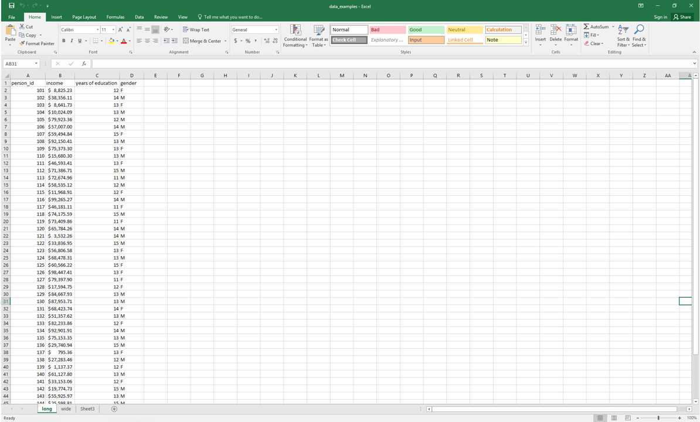
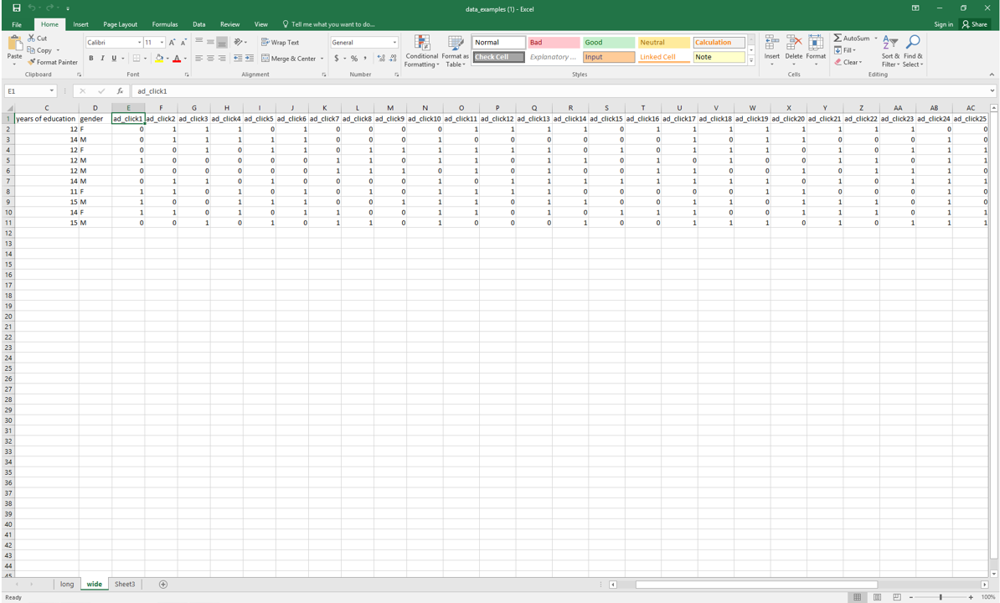

name: toc

```{css, echo=FALSE}
@media print {
  .has-continuation {
    display: block !important;
  }
}
```

```{r setup, include=FALSE}
options(htmltools.dir.version = FALSE)
if (!require("pacman")) install.packages("pacman")
knitr::opts_chunk$set(
  fig.align='center', fig.width=6, fig.height=4, 
  # out.width=748px, #out.length=520.75px,
  dpi=300, #fig.path='Figs/',
  root.dir='../../',
  #cache=F,#, echo=F, warning=F, message=F
  warning=F,
  message=F
  )
if (!require("pacman")) install.packages("pacman")
pacman::p_load(tidyverse,arrow,datasauRus,gganimate,jsonlite)
```

# Table of contents

- [Prologue](#prologue)
- [Empirical Workflow](#empirical-workflow)
- [Downloading data](#downloading-data)
- [File formats](#file-formats)
- [Archiving & file compression](#archiving)
- [Dictionaries](#dictionaries) (if time)
- [Big Data file types](#big-data) (if time)

---
class: inverse, center, middle
name: prologue

# Prologue

---
# Prologue

Today we'll focus on grappling with data

- Checklist to ensure data quality

- File formats and extensions

- Archiving & file compression

- If time:

  - Dictionaries (hash tables)

  - Big Data file types

---
# Student Presentation

---
# Why do we need to do this?

- We summarize data because we can't look at every data point and see a pattern
- But lots of data are messy or frankly bogus, but you wouldn't know it from sum stats
- Meet Anscombe's Quartet (Anscombe, 1973)
  
```{r data-viz-reason,echo=FALSE,warning=FALSE,fig.width=6,fig.height=3.5,cache=T}
# Reshape the data
data(anscombe) 
anscombe_df <-anscombe %>%
  mutate(x4=x4-5,y4=y4-3) %>%
  pivot_longer(cols= x1:y4, names_pattern='([a-z])(\\d)', names_to=c('.value','sample')) %>%
  mutate(sample=factor(sample, levels=1:4, labels=c('Linear','Quadratic','Single outlier','Low x variance')))

# Plot faceted scatterplot grid
ggplot(anscombe_df, aes(x = x, y = y)) +
  geom_point() +
  geom_smooth(method = "lm", se = FALSE) +
  facet_wrap(~ sample, nrow = 2) +
  labs(x = "x", y = "y") +
  theme_bw()

```

---
# DataSarus Dozen

```{r datasaurus_dozen,echo=FALSE,warning=FALSE,cache=T}
datasaurus_dozen <- datasaurus_dozen %>% 
  mutate(dataset_counter = as.integer(factor(dataset, levels = unique(dataset))))

ggplot(datasaurus_dozen, aes(x = x, y = y))+
    geom_point()+
    geom_smooth(method = "lm", se = FALSE) +
    theme_bw() +
    theme(legend.position = "none") +
    transition_states(dataset, transition_length=1, state_length=30) +
    ease_aes('linear') +
    labs(title='Sample: {closest_state}') + 
    # footnote data saurus dozen 
    labs(caption = "Data from the Datasaurus Dozen. Each dataset has the same summary statistics, but looks very different.")
```

---
# Not every odd dataset is wrong

- Sometimes bizarre looking dataaset is real (see the [Japan Phillips curve](https://twitter.com/BaldwinRE/status/1372920323943886849/photo/1))

- For example, sometimes there are real outliers in the data 
  - You'll need to decide what to do about them

- But sometimes they're a sign of nonsense or "NA"/missing values

- If you find an oddity in your data, you still have to decide what it is and how to handle it
  - Maybe that odd outlier is real, so you shouldn't drop it
  - Are the data missing? Due to randomness or a systematic error?

- Throughout this course we'll think about how to deal with these issues

- Today we're making sure you have safeguards in place so you don't write an entire paper only to discover your dataset looks like a T-rex

---
# Types of data

1. "Long" data (a.k.a. "Big-N" data because $N$ very, very large [and may not all fit onto a single hard drive!], government tax records, Medicare claims data, etc.)

2. "Wide" data (a.k.a. "Big-K" data because $K>N$, customer data sets where each click is a variable)

3. "Wild" data (unstructured; happenstance; collected without a particular intention; e.g. twitter, contrast with Census surveys)

4. "Big Data" is a catch-all for any combination of the above data types that is hard to analyze with classical methods like OLS regression
  - Too many variables
  - Too many observations
  - Needs special wrangling or analysis

---
# Long data
```{r img_long, echo=F, out.width="90%"}

```

- Main application: *identifying causal effects*
- Example: effects of improving schools on income

---
# Wide data

```{r img_wide, echo=F, out.width="90%"}

```

- Main application: *prediction*
- Example: predicting income to target ads from tons of information like location, links clicked, etc.

---
# Wild Data

.scroll-box-12[
```html
<caption>List of men's Olympic records in athletics
</caption>
<tbody><tr>
<th scope="col" width="12%">Event
</th>
<th class="unsortable" width="5%">Record
</th>
<th scope="col" width="10%">Athlete(s)
</th>
<th scope="col" width="15%">Nation
</th>
<th scope="col" width="10%">Games
</th>
<th scope="col" width="5%">Date
</th>
<th scope="col" class="unsortable" width="3%">Ref(s)
</th></tr>
<tr>
<th scope="row"><span data-sort-value="00100&#160;!"><a href="/wiki/100_metres" title="100 metres">100 metres</a></span>
</th>
<td align="right">9.63&#160;
</td>
<td><span data-sort-value="Bolt, Usain"><span class="vcard"><span class="fn"><a href="/wiki/Usain_Bolt" title="Usain Bolt">Usain Bolt</a></span></span></span>
</td>
<td><span class="mw-image-border" typeof="mw:File"><span></span></span>&#160;<a href="/wiki/Jamaica_at_the_2012_Summer_Olympics" title="Jamaica at the 2012 Summer Olympics">Jamaica</a>&#160;<span style="font-size:90%;">(JAM)</span>
</td>
<td><span data-sort-value="2012&#160;!"><a href="/wiki/Athletics_at_the_2012_Summer_Olympics_%E2%80%93_Men%27s_100_metres" title="Athletics at the 2012 Summer Olympics – Men&#39;s 100 metres">2012 London</a></span>
</td>
<td><span data-sort-value="000000002012-08-05-0000" style="white-space:nowrap">August 5, 2012</span>
</td>
<td align="center"><sup id="cite_ref-9" class="reference"><a href="#cite_note-9">&#91;9&#93;</a></sup>
</td></tr>
```]

---
# Why does data type matter?

--

1. Data type determines how much memory is required to store information

2. Data type determines what method you can use to read and analyze the data

--

  - A difference-in-difference model requires a different data shape than a regression discontinuity model
  - You cannot have a wide data set with one row per unit and one column per year

---
# The data you need depend on the question you're asking

- Any dataset, no matter how big, has simplified the world in some way

- You want the simplification to match the question

- How do you record where a person is? 
  - County? Lots of people have same location. 
  - IP address? Changes frequently 
  - GPS coordinates? Too precise, and changes every second!

- Your question and theory should guide your data collection
  - Are you curious about the effect of local government policies or firms on people?
  - Are you looking to measure the effect of air pollution on health?
  - Do you want to see how people change their commute patterns over time? When there is a road closure?


---
class: inverse, center, middle
name: empirical-workflow

# Empirical Workflow

---
# Workflow workflow workflow

## The Cunningham Empirical Workflow Conjecture

- The cause of most of your empirical coding errors is **not** due to insufficient knowledge of syntax in your chosen programming language

- The cause of most of your errors is due to a poorly designed .hi[Empirical Workflow]

- .[Empirical Workflow]: A fixed set of routines you always follow to identify the most common errors
	- Think of it as your morning routine: alarm goes off, go to wash up, make your coffee/tea, put pop tart in toaster, contemplate your existence in the universe until **ding**, eat pop tart repeat *ad infinitum*

- Finding weird errors is a different task; empirical workflows catch typical and common errors

- Empirical workflows follow a checklist

---
# Why do we use checklists?

- My weekly routine usually involves driving from Melrose, MA to Lewiston, ME by 11am
  - Last year it was 9:30am -- the checklist was extra important then

- I need to make sure I have everything I need for the next two days (minimum)

- I have a checklist of things I need to do before I leave the house

☐ Wake up by 7am, ideally 6am

☐ Start coffee

☐ Boil water for tea

☐ Prep breakfast

☐ Bring my fiance coffee in bed (bonus item)

☐ Pour tea into travel mug

☐ Make sure laptop, charger, lunch, and phone are in bag

☐ Eat breakfast

☐ etc

---
# To remember the obvious stuff

- When I stop to think, I know I need to do everything on my checklists

- But then I forget when I move onto the next task

- Programming is the same, except you have an **empirical checklist**:

- The **empirical checklist**:
    - Covers the intermediate step between "getting the data" and "analyzing the data"
    - It largely focuses on ensuring data quality for the most common, easy to identify problems
    - It'll make you a better coauthor

---
# Play along at home

#### On your computer

- Everyone sync your fork of the class exercises repository<sup>1</sup>

- Double-click `exercises.Rproj` on your computer to open RStudio at the correct working directory

- Run the housekeeping file to install the relevant packages

- Alternatively, you can open a codespace in your `exercises` repo

- We will tackle the class exercise after class, but you'll take what we do in class to fill it in

- We're going to explore a mangled version of the dataset from the Bertrand and Mullainathan (2004) resume audit study

- Suspend some disbelief, please as I mangled the data to make it more interesting

.footnote[<sup>1</sup> **Note**: I put data files on Github. This is bad practice for large files, but fine for small ones.]

---
# Simple data checklist items

- Simple, yet non-negotiable, programming commands and exercises to check for data errors

#### 1. Read the documentation
#### 2. Look at the data ("Real eyes realize real lies"<sup>1</sup>)
#### 3. Look at summaries and frequency tables of variables
#### 4. Plot histograms of key variables
#### 5. Visualize by key groups
#### 6. Check sum stats by key groups
#### 7. Check if the data are the right "size"

- There are many more potential checklist items: you'll develop your own with experience

- First, above all else, read any documentation associated with the file
  - Codebooks, READMEs, etc. -- check out `data/README.txt.` for this dataset
  - They're not riveting, but they clarify tons of small things
  - Your first problem set doesn't come with one -- you're gonna build it!

.footnote[<sup>1</sup> Attributed to Ray Charles, Woody Guthrie, Tupac Shakur, Machine Head, and others]

---
# 2. Look at the data

- Open the raw data and look at it: 

```{r open-data,cache=FALSE}
resumes <- read_csv('data/lakisha_aer.csv',
  show_col_types= FALSE) # Don't tell me the column types
head(resumes,10)
```

---
# Drop junk rows

- Oh weird, the first few rows are junk, let's skip them and give more informative names

```{r skip-rows}
resumes <- read_csv('data/lakisha_aer.csv',
  skip=4, # skip some rows
  col_names=c('firstname','gender','race','call','ofjobs'), # Column names
  show_col_types = FALSE) # Don't tell me the column types
head(resumes)
```

---
# 3. Look at summaries of variables

Do factor variables have multiple spellings?

```{r factor}
table(resumes$race,resumes$gender)
```

---
# 3a. Skim again

The `skimr` package is great!
.scroll-box-20[
```{r continuous}
skimr::skim(resumes)
```
]

- What's -99?

---
# 4. Visualize the raw data

- Go beyond the eyeball and graph the data
```{r funky_data1, dev="svg"}
# ggplot is a great tool for visualizing data
ggplot(data=resumes,mapping=aes(x=ofjobs))+
  geom_histogram()
```

- Wait a minute! What's going on with the -99 values?

---
# 5. Visualize by group
```{r funky_data2, dev="svg",fig.width=6,fig.height=3.5}
resumes <-  mutate(resumes,race=ifelse(race=='cauc' | race=='Caucasian','White',
    ifelse(race=="BLACK" | race=="afam", "Black",race))) # change the data up
ggplot(data=resumes,aes(x=ofjobs,fill=race))+
    geom_histogram(alpha=0.25) # alpha makes bars see through! 
```

- Oh! I bet -99 means NA or missing
- This only occurs for fake black name applicant profiles
- That could be bad news for an RCT...

---
# 6. Visualize summaries by group

```{r funky_data3, dev="svg"}
ggplot(data=resumes,aes(y=ofjobs,x=race)) + 
  geom_bar(stat='summary',fun='mean')
```

- Yep, the job counts differ meaningfully by race -- uh oh.

---
# 7. Are the data the right-size?

- Check if the data are the right-size

- If you have a panel dataset is 50 states over 20 years, check if there are 1000 observations

- If not, find out why! 
  - Maybe there are 1020 because DC is (rightfully) included
  - Alternatively, data are missing for a few states in a few years and dropped entirely

- Search for outliers or oddities and work out possible explanations using:
    - Codebooks
    - Intuition
    - Emails to the source/creator of data

---
# Wait, how does ggplot work?

See slides from [Lecture 1](https://raw.githack.com/big-data-and-economics/big-data-class-materials/main/lectures/01-intro/01-Intro.html#55) for a full explanations

- Basically, it is a useful data visualization tool that allows you to specify the data and the type of plot you want to make

- **Pro tip:** It works best when your are organized "long" instead of wide

- If you'd like to present on ggplot in class this month (instead of the topic you signed up for), let me know!

- Charlie will do a short session on it as well

---
class: inverse, center, middle
name: downloading-data

# Downloading data

---
# Downloading data


- Often it is good practice to have a script that downloads the data for you

- This way, you can rerun the script and get the latest version of the data

- Of course, there is a tradeoff to this -- your results may not replicate exactly with newer data

- But it's a good practice to get into for reproducibility

- Also, if you have to downloading thousands of files manually, you'll go insane

- Automate it

---
# R makes it easy to download

- The R function to download is `download.file()`

- Here is an example that downloads my copy of the Bertrand and Mullainathan (2004) data off of GitHub

```{r download-data,eval=FALSE}
download.file(
  url='https://raw.githubusercontent.com/big-data-and-economics/big-data-class-materials/main/lectures/03-data-tips/data/lakisha_aer.zip',
  destfile='data/lakisha_aer.zip')
```

- Several R packages will read files right off of the internet

```{r read-data,cache=FALSE}
readr::read_csv(
  file='https://raw.githubusercontent.com/big-data-and-economics/big-data-class-materials/main/lectures/03-data-tips/data/lakisha_aer.csv')
```

---
class: inverse, center, middle
name: file-formats
# File formats

---
# File extensions

- A file extension is the part of the file name after the period `.dta`, `.csv`, `.tab`, etc.

- Often, if you download a file, you will immediately understand what type of a file it is by its extension 

- File extensions in and of themselves don't serve any particular purpose other than convenience

- File extensions were created so that humans could keep track of which files on their workspace are scripts, which are binaries, etc.

### Why is the file format important?

- File formats matter because they may need to match the coding tools you're using

- If you use the wrong file format, it may cause your computations to run slower than otherwise

- To the extent that the tools you're using require a specific file format, then using the correct format is essential

---
# Open-format file extensions

The following file extensions are not tied to a specific software program 

- In this sense they are "raw" and can be viewed in any sort of text editor

.scroll-box-18[
| File extension                     | Description |
|------------------------------------|-------------|
| CSV                                | Comma separated values; data is in tabular form with column breaks marked by commas |
| TSV                                | Tab separated values; data is in tabular form with column breaks marked by tabs |
| DAT                                | Tab-delimited tabular data (ASCII file) |
| TXT                                | Plain text; not organized in any specific manner (though usually columns are delimited with tabs or commas) |
| TEX                                | LaTeX; markup-style typesetting system used in scientific writing |
| XML                                | eXtensible Markup Language; data is in text form with tags marking different fields |
| HTML                               | HyperText Markup Language; similar to XML; used for almost every webpage you view |
| [YAML](https://en.wikipedia.org/wiki/YAML) | YAML Ain't Markup Language; human readable version of XML |
| JSON                               | JavaScript Object Notation; similar to YAML in that it has a human readable element. YAML is technically a superset of JSON. |
| HDF                                | Hierarchical Data Format; bills itself as a "scientific data format" that can handle all types of data (tabular, text, images, etc.) |
| PDF                                | Portable Document Format; not a great way to store data, but there exists much data in PDF format. Good luck unpacking it! |
| TIFF, JPEG                         | These common image formats are used to store data in the form of images, or sometimes pictures of text data. There exist image processing libraries in almost every scientific programming language that can convert data in this format into more usable formats. |
| MP3, WAV                           | These common audio formats may be used to store data. For example, voice-to-text applications have some way of converting income audio (in some format) into data that the machine can comprehend. The same holds for MP4 and other video file formats (e.g. for video input to self-driving cars, etc.) |
| RDS                                | R data file; can be read in using the `readRDS()` function in R |
]

- Here's a more [complete list](https://en.wikipedia.org/wiki/List_of_file_formats) of almost every file extension (note: missed Stata's `.do` and `.dta` formats).

- Another great discussion about file formats is [here](https://opendata.stackexchange.com/questions/1208/a-python-guide-for-open-data-file-formats) on stackexchange

---
# Examples JSON

A possible JSON representation describing a person ([source](https://en.wikipedia.org/wiki/JSON#Example))
```JSON
{
  "firstName": "John",
  "lastName": "Smith",
  "isAlive": true,
  "age": 27,
  "address": {
    "streetAddress": "21 2nd Street",
    "city": "New York",
    "state": "NY",
    "postalCode": "10021-3100"
  },
  "phoneNumbers": [
    {
      "type": "home",
      "number": "212 555-1234"
    },
    {
      "type": "office",
      "number": "646 555-4567"
    },
    {
      "type": "mobile",
      "number": "123 456-7890"
    }
  ],
  "children": [],
  "spouse": null
}
```

---
# Examples: XML

The same example as previously, but in XML: ([source](https://en.wikipedia.org/wiki/JSON#Example))

```xml
<person>
  <firstName>John</firstName>
  <lastName>Smith</lastName>
  <age>25</age>
  <address>
    <streetAddress>21 2nd Street</streetAddress>
    <city>New York</city>
    <state>NY</state>
    <postalCode>10021</postalCode>
  </address>
  <phoneNumber>
    <type>home</type>
    <number>212 555-1234</number>
  </phoneNumber>
  <phoneNumber>
    <type>fax</type>
    <number>646 555-4567</number>
  </phoneNumber>
  <gender>
    <type>male</type>
  </gender>
</person>
```

---
# Examples: YAML

The same example, but in YAML: ([source](https://en.wikipedia.org/wiki/JSON#Example))

```YAML
firstName: John
lastName: Smith
age: 25
address: 
  streetAddress: 21 2nd Street
  city: New York
  state: NY
  postalCode: '10021'
phoneNumber: 
- type: home
  number: 212 555-1234
- type: fax
  number: 646 555-4567
gender: 
  type: male
```
 
Note that the JSON code above is also valid YAML; YAML simply has an alternative syntax that makes it more human-readable

---
# Read a JSON

```{r read-json}
library(jsonlite)

# Read in the JSON file
resumes_json <- read_json('data/lakisha_aer.json',
  simplifyVector = TRUE # Simplify the data to a dataframe
  ) 
head(resumes_json)
```

---
# Proprietary file extensions

The following file extensions typically require additional software to read, edit, or convert to another format

| File extension                     | Description |
|------------------------------------|-------------|
| DB                                 | A common file extension for tabular data for SQLite |
| SQLITE                             | Another common file extension for tabular data for SQLite |
| XLS, XLSX                          | Tab-delimited tabular data for Microsoft Excel |
| RDA, RDATA                         | Tabular file format for R |
| MAT                                | ... for Matlab |
| SAS7BDAT                           | ... for SAS |
| SAV                                | ... for SPSS |
| DTA                                | ... for Stata |

---
# Tips for opening files with r

- If you're working with tabular data, you can use the `read_csv()` function from the **readr** (tidyverse) package or `fread` from **data.table**
- If you're working with a proprietary file format, you can use the `read_*()` functions from the **haven** package
- If you're reading in any table format, `read_table()` might work!
- If you're working with a JSON file, you can use the **jsonlite** package
- When in doubt, Google/ChatGPT "How do I open file .XXX in R?"
  - I bet you someone has already needed to solve this problem

```{r read-types,warning=FALSE,message=FALSE,cache=FALSE}
df_csv   <- read_csv('data/lakisha_aer.csv')
df_fread   <- data.table::fread('data/lakisha_aer.tab')
df_stata <- haven::read_dta('data/lakisha_aer.dta')
df_xlsx <- readxl::read_xlsx('data/lakisha_aer.xlsx')
```

---
# Help! This file froze my computer!

- Sometimes we'll be reading quite large files
  - These can be too big to fit in memory

Just read in a single row to see the column names:

```{r read-in-1-row,cache=FALSE}
# I need to sete an environment variable to increase the size of the connection
# R will complain if you try to read in a file that's too big
# This will reset when I close this session.
df <- read_csv('data/lakisha_aer.csv',n_max=1)
```

- You can and should also consult the codebook (remember those?)

---

# Help! This file froze my computer!

Once you know your columns, read those in:

```{r read-in-columns,warning=FALSE,message=FALSE,cache=FALSE}
read_csv('data/lakisha_aer.csv',
  col_select=c('firstname', 'race', 'gender','call','ofjobs'))
```

---
class: inverse, center, middle
name: archiving
# Archiving & file compression

---
# Archiving & file compression

Because data can be big and bulky, it is often easier to store and share the data in compressed form

| File extension                     | Description |
|------------------------------------|-------------|
| ZIP                                | The most common format for file compression |
| Z                                  | Alternative to ZIP; uses a slightly different format for compression |
| 7Z                                 | Alternative to ZIP; uses [7-Zip](http://www.7-zip.org/) software for compression |
| GZ                                 | Another alternative to ZIP (primarily used in Linux systems), using what's called `gzip` |
| TAR                                | So-called "tarball" which is a way to collect many files into one archive file. TAR stands for "Tape ARchive" |
| TAR.GZ; TGZ                        | A compressed version of a tarball (compression via `gzip`) |
| TAR.BZ2; .TB2; .TBZ; .TBZ2         | Compressed tarball (via `bzip2`) |


```{r,include=F}
#Image source: By Th0msn80 - Own work, CC BY 3.0, https://commons.wikimedia.org/w/index.php?curid=4316146
```

---
# Can I just read a zip directly in?

- Yes, but it's a little more complicated
- And you can may still want to read in a few rows or columns like before

```{r read-in-zip,warning=FALSE,message=FALSE}
read_csv(unz('data/lakisha_aer.zip','lakisha_aer.csv'))  # Unzip the file
  head(5) # pipe to a read csv
```

Check appendix for what happens with "bigger" files when you attempt this.

---
# How do I zip a file?

- You can zip a file using the `zip` command in the R terminal

- It allows you to zip one or many files

```{r zip-file,eval=FALSE}
zip(zipfile='lakisha_aer_one.zip',
  files='lakisha_aer.csv')

zip(zipfile='lakisha_aer.zip',
  files=c('lakisha_aer.rds','lakisha_aer.csv','lakisha_aer.tsv','lakisha_aer.xlsx','lakisha_aer.dta','lakisha_aer.json'))
```

---
# Other file types that aren't data

- There are many file types that don't correspond to readable data. For example, script files (e.g. `.R`, `.py`, `.jl`, `.sql`, `.do`, `.cpp`, `.f90`, ...) are text files with convenient extensions to help the user remember which programming language the code is in

- As a rule of thumb, if you don't recognize the extension of a file, it's best to inspect the file in a text editor (though pay attention to the size of the file as this can also help you discern whether it's code or data)

---
# General Types of Data

- When you think of data, you probably think of rows and columns, like a matrix or a spreadsheet 

- But it turns out there are other ways to store data, and you should know their similarities and differences to tabular data

---
class: inverse, center, middle
name: dictionaries
# Dictionaries

---
# Dictionaries (a.k.a. Hash tables)

- A dictionary is a list that contains `keys` and `values` 

- Each key points to one value 

- While this may seem like an odd way to store data, it turns out that there are many, many applications in which this is the most efficient way to store things

- We won't get into the nitty gritty details of dictionaries, but they are the workhorse of computer science, and you should at least know what they are and how they differ from tabular data 

- In fact, dictionaries are often used to store multiple arrays in one file (e.g. Matlab `.mat` files, R `.RData` files, etc.)

---
# Dictionaries (a.k.a Hash tables) in R

- Dictionraies are a little clunky in R

- You'll mainly use them as lists or vectors

```{r dict}
phone_numbers_list <- list('Jenny'='1 (623) 867-5309',
  'Rejection Hotline'='1 (518) 935-4012',
  'Santa'='1 (951) 262-3062')

print(phone_numbers_list)

```

---
# Why are dictionaries useful?

- You might look at the previous example and think a vector would be a better way to store phone numbers

- The power of dictionaries is in their .hi[lookup speed]

- Looking up an index in a dictionary takes the same amount of time no matter how long the dictionary is!

    - Computer scientists call this $O(1)$ access time

- Moreover, dictionaries can index .hi[objects], not just scalars

- So I could have a dictionary of data frames, a dictionary of arrays, ...

---
class: inverse, center, middle
name: big-data
# Big Data File Types

---
# Big Data file types

- Big Data file systems like Hadoop and Spark often use the same file types as R, SQL, Python, and Julia

- That is, `CSV` and `TSV` files are the workhorse

- Because of the nature of distributed file systems (which we will discuss in much greater detail next time), it is often the case that JSON and XML are not good choices because they can't be broken up across machines 

- Note: there is a distinction between JSON files and JSON records; see the second link at the end of this document for further details

---
# Big Data File Types

## Sequence

- Sequence files are dictionaries that have been optimized for Hadoop and friends

- The advantage to taking the dictionary approach is that the files can easily be coupled and decoupled

## Avro

- Avro is an evolved version of Sequence---it contains more capability to store complex objects natively

## Parquet

- Parquet is a format that allows Hadoop and friends to partition the data column-wise (rather than row-wise)

- Other formats in this vein are RC (Record Columnar) and ORC (Optimized Record Columnar)

---
# Useful Links

- [A beginner's guide to Hadoop storage formats](https://blog.matthewrathbone.com/2016/09/01/a-beginners-guide-to-hadoop-storage-formats.html)

- [Hadoop File Formats: It's not just CSV anymore](https://community.hds.com/community/products-and-solutions/pentaho/blog/2017/11/07/hadoop-file-formats-its-not-just-csv-anymore)

---
# Your challenge

- With time left, try to download each of the following files to a folder and read in five columns of your choosing:
  - https://www2.census.gov/ces/opportunity/tract_covariates.csv
  - https://www2.census.gov/ces/opportunity/county_outcomes.zip
  - https://www2.census.gov/ces/opportunity/tract_outcomes.zip (challenge)

THese are all found on the webpage: https://www.census.gov/programs-surveys/ces/data/public-use-data/opportunity-atlas-data-tables.html

---
class: inverse, center, middle

# Next lecture: Coding in R
<html><div style='float:left'></div><hr color='#EB811B' size=1px width=796px></html>

```{r gen_pdf, include = FALSE, cache = FALSE, eval = TRUE}
infile=knitr::current_input() %>% str_replace('.Rmd','.html')
#infile = list.files(pattern = '.html')
pagedown::chrome_print(input = infile, timeout = 100)
```

---
class: inverse, center, middle
name: appendix

# Appendix

---
# What if there is only one file in the zip?

Turns out, you can read the file directly from the zip file with `read_csv()`:

```{r read_csv_zip_lakisha,warning=FALSE,message=FALSE,cache=FALSE}
read_csv(unz('data/lakisha_aer.zip','lakisha_aer.csv'),show_col_type=FALSE)
```

---
# What is VROOM_CONNECTION_SIZE?

- You'll often hit an error when reading zipped files

```{r read_csv_zip_county,warning=FALSE,message=FALSE,error=TRUE,cache=FALSE}
read_csv('data/county_outcomes.zip',show_col_type=FALSE)
```

---
# What is `VROOM_CONNECTION_SIZE`?

`VROOM_CONNECTION_SIZE` is an environment variable that tells R how much data to read in at a time

- It's a way to read in large files without crashing your computer

- It basically tells R to read in a certain number of bytes at a time

- When R unzips and reads simultaneously, it needs more memory than usual while it decompresses

- Think of it like having too narrow a space to squeeze the data through

- If the data are wide, this can be a problem because of how `read_csv()` works
  - It reads in the entire file and then tries to figure out the column types

---
# Two Fixes 

### Fix 1: Increase `VROOM_CONNECTION_SIZE`

```{r read_csv_zip_vroom,warning=FALSE,message=FALSE,eval=FALSE}
Sys.setenv("VROOM_CONNECTION_SIZE"=1e6) # Telling R to read in 1 million bytes at a time
read_csv(unz('data/county_outcomes.zip','county_outcomes.csv'),show_col_type=FALSE)
Sys.setenv("VROOM_CONNECTION_SIZE"=131072) # Returning to default
```

### Fix 2: Unzip then read

```{r unzip_read_csv,warning=FALSE,message=FALSE,eval=FALSE}
unz('data/county_outcomes.zip','county_outcomes.csv') %>% # Unzip the file
  read_csv(show_col_types = FALSE) # pipe to a read csv
rm('county_outcomes.csv') # remove the file
```

I don't evaluate the code because it will make knitting take awhile, but try it yourself
