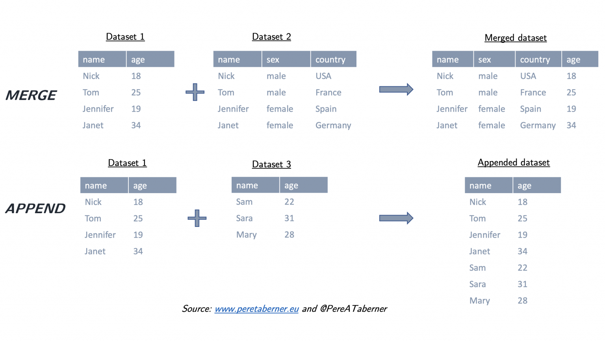
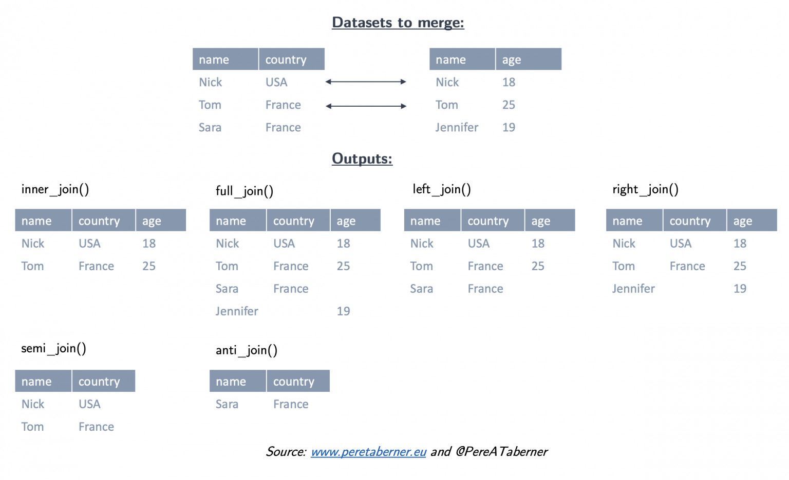

name: toc

```{css, echo=FALSE}
@media print {
  .has-continuation {
    display: block !important;
  }
}
```

```{r setup, include=FALSE}
options(htmltools.dir.version = FALSE)
library(knitr)
opts_chunk$set(
  fig.align="center", #fig.width=6, fig.height=4.5, 
  # out.width="748px", #out.length="520.75px",
  dpi=300, #fig.path='Figs/',
  cache=T#, echo=F, warning=F, message=F
  )
```

# Table of contents

1. [Prologue](#prologue)

2. [Tidyverse basics](#basics)

3. [Data wrangling with dplyr](#dplyr)
  - [filter](#filter)
  - [arrange](#arrange)
  - [select](#select)
  - [mutate](#mutate)
  - [summarise](#summarise)
  - [joins](#joins)

4. [Data tidying with tidyr](#tidyr)
  - [pivot_longer](#pivot_longer) / [pivot_wider](#pivot_wider)

5. [Summary](#summary)


---
class: inverse, center, middle
name: prologue

# Prologue

<html><div style='float:left'></div><hr color='#EB811B' size=1px width=796px></html>

---
# Why so many packages?

- You are probably wondering why there are so many packages in R that do similar things.

- How come you need to know this many packages? Isn't this a bit much?

- Think back to our clean code principles. 
  
  - One of the key practices of clean code is to abstract away complexity.
  - This is what packages do. They abstract away the complexity to make code easier to read, write, and debug.
  - They offer a consistent interface and set of help documentation. 
  - Different packages prioritize different goals -- so you can choose the one that best fits your needs.
  - e.g. the `tidyverse` packages prioritize relational database management (called "tidy" data)
  - `data.table` prioritizes speed and memory efficiency in completing data operations, assumes you're doing the RDBM yourself

--

- Of course, different packages have different ways of abstracting away complexity.
- So yes, it is a bit much, but it's also a good thing.

---

# Checklist

### R packages you'll need for this lecture

☑ [**tidyverse**](https://www.tidyverse.org/)
  - This is a meta-package that loads a suite of other packages, including **dplyr** and **tidyr**, which includes the `starwars` dataset that we'll use for practice.

☑ [**nycflights13**](https://github.com/hadley/nycflights13)

--

</br>

The following code chunk will install (if necessary) and load everything for you.

```{r libs, cache=FALSE, message=FALSE}
if (!require(pacman)) install.packages('pacman', repos = 'https://cran.rstudio.com')
pacman::p_load(tidyverse, nycflights13)
```

---

# What is "tidy" data?

### Resources:
- [Vignettes](https://cran.r-project.org/web/packages/tidyr/vignettes/tidy-data.html) (from the **tidyr** package)
- [Original paper](https://vita.had.co.nz/papers/tidy-data.pdf) (Hadley Wickham, 2014 JSS)

--

</br>

### Key points:
1. Each variable forms a column.
2. Each observation forms a row.
3. Each type of observational unit forms a table.

--

</br>

Basically, tidy data is more likely to be [long (i.e. narrow) format](https://en.wikipedia.org/wiki/Wide_and_narrow_data) than wide format.

---
# Relational Database Management with R

- Remember Relational Database Management from our work on [Empirical Organization](https://raw.githack.com/big-data-and-economics/big-data-class-materials/main/lectures/02-empirical-workflow/02-empirical-workflow.html#1)?

- Today, we'll learn how to implement it using packages in the `tidyverse`

- We'll cover:
  - Subsetting data
  - Variable creation, renaming, selection
  - Grouping and summarizing data
  - Joining and appending datasets

---
class: inverse, center, middle
name: basics

# Tidyverse basics

<html><div style='float:left'></div><hr color='#EB811B' size=1px width=796px></html>

---

# Tidyverse vs. base R

There is often a direct correspondence between a **tidyverse** command and its **base R** equivalent. 

These generally follow a `tidyverse::snake_case` vs `base::period.case` rule:

| tidyverse  |  base |
|---|---|
| `?readr::read_csv`  | `?utils::read.csv` |
| `?dplyr::if_else` |  `?base::ifelse` |
| `?tibble::tibble` |  `?base::data.frame` |

Etcetera.
  
If you call up the above examples, you'll see that the tidyverse alternative: 
  - Offers enhancements or other useful options (and some restrictions too)
  - Better documentation
  - More consistent syntax

--

**Remember:** There are (almost) always multiple ways to achieve a single goal in R.

---

# Tidyverse packages

Let's load the tidyverse meta-package and check the output.
```{r tverse, cache = FALSE}
library(tidyverse)
```

--

We have actually loaded a number of packages (which could also be loaded individually): **ggplot2**, **tibble**, **dplyr**, etc.

- We can also see information about the package versions and some [namespace conflicts](https://raw.githack.com/big-data-and-economics/big-data-class-materials/main/lectures/04-rlang/04-rlang.html#83). 
<!-- TK : change lecture notes to mine -->
---

# Tidyverse packages (cont.)

The tidyverse actually comes with a lot more packages than those loaded automatically.<sup>1</sup>
```{r tverse_pkgs}
tidyverse_packages()
```

We'll use most of these packages during the remainder of this course.

- **lubridate** for dates, **rvest** for webscraping, **broom** to `tidy()` R objects into tables
- However, packages still have to be loaded separately with `library()`

.footnote[
<sup>1</sup> It also includes a *lot* of dependencies upon installation. This is a matter of some [controversy](http://www.tinyverse.org/).
]

---

# Tidyverse packages (cont.)

Today, however, I'm only really going to focus on two packages: 
1. [**dplyr**](https://dplyr.tidyverse.org/)
2. [**tidyr**](https://tidyr.tidyverse.org/)

These are the workhorse packages for cleaning and wrangling data.
- Data cleaning and wrangling occupies an inordinate amount of time, no matter where you are in your research career.
- I cannot underscore this enough
- This course can add structure to the cleaning and wrangling, but it is still a time-consuming process.
- It can be a real bummer, so pick data projects that you are excited about.

---
class: inverse, center, middle
name: dplyr

# dplyr

<html><div style='float:left'></div><hr color='#EB811B' size=1px width=796px></html>

---

# Key dplyr verbs

There are five key dplyr verbs that you need to learn.

1. `filter`: Filter (i.e. subset) rows based on their values.

2. `arrange`: Arrange (i.e. reorder) rows based on their values.

3. `select`: Select (i.e. subset) columns by their names: 

4. `mutate`: Create new columns.

5. `summarise`: Collapse multiple rows into a single summary value.<sup>1</sup>

.footnote[
<sup>1</sup> `summarize` with a "z" works too, but Hadley Wickham is from New Sealand.
]

---
# Learn the verbs

Practice these commands together using the `starwars` data frame that comes pre-packaged with dplyr. **Stop** when you hit the last `summarise` slide (approx. 33). 

```{r see-starwars}
starwars
```

---
name: filter

# 1) dplyr::filter

Filter means "subset" the rows of a data frame based on some condition(s). 


```{r filter_pipe}
starwars %>% 
  filter(species == "Human", height >= 190)
```

We can chain multiple commands with the pipe `%>%` as we've seen<sup>1</sup>.

.footnote[<sup>1</sup> Pipes were invented by Doug McIlroy in 1964, are widely used in Unix shells (e.g. bash) and other programming languages (e.g. `F#`). They pass the preceding object as the first argument to the following function. In R, they allow you to chain together code in a way that reads from left to right.]

---

# 1) dplyr::filter *cont.*

A very common `filter` use case is identifying (or removing) missing data cases. 
```{r filter3}
starwars %>% 
  filter(is.na(height))
```

To remove missing observations, simply use negation: `filter(!is.na(height))`. Try this yourself.

---
name: arrange

# 2) dplyr::arrange

```{r arrange1}
starwars %>% 
  arrange(birth_year)
```

--

*Note:* Arranging on a character-based column (i.e. strings) will sort alphabetically. Try this yourself by arranging according to the "name" column.

---

# 2) dplyr::arrange *cont.*

We can also arrange items in descending order using `arrange(desc())`.
```{r arrange2}
starwars %>% 
  arrange(desc(birth_year))
```

---
name: select

# 3) dplyr::select

Select means subset the columns of a data frame based on their names. 

Use commas to select multiple columns out of a data frame. (You can also use "first:last" for consecutive columns). Deselect a column with "-".
```{r select1}
starwars %>% 
  select(name:skin_color, species, -height) %>% 
  head()
```

---

# 3) dplyr::select *cont.*

You can also rename some (or all) of your selected variables in place.
```{r select2}
starwars %>%
  select(alias=name, crib=homeworld, sex=gender) %>% 
  head()
```

--

If you just want to rename columns without subsetting them, you can use `rename`. Try this now by replacing `select(...)` in the above code chunk with `rename(...)`.

---
name: mutate

# 4) dplyr::mutate

You can create new columns from scratch, or (more commonly) as transformations of existing columns.
```{r mutate1}
starwars %>% 
  select(name, birth_year) %>%
  mutate(dog_years = birth_year * 7) %>%
  mutate(comment = paste0(name, " is ", dog_years, " in dog years.")) %>%
  head()
```

---

# 4) dplyr::mutate *cont.*

Boolean, logical and conditional operators all work well with `mutate` too.
```{r mutate3}
starwars %>% 
  select(name, height) %>%
  filter(name %in% c("Luke Skywalker", "Anakin Skywalker")) %>% 
  mutate(tall1 = height > 180) %>%
  mutate(tall2 = ifelse(height > 180, "Tall", "Short")) ## Same effect, but can choose labels

```

---

# 4) dplyr::mutate *cont.*

Lastly, combining `mutate` with the `across` feature allows you to easily work on a subset of variables. For example:

```{r, mutate4}
starwars %>% 
  select(name:eye_color) %>% 
  mutate(across(where(is.character), toupper)) %>% #<< 
  head(5)
```

---
name: summarise

# 5) dplyr::summarise

Particularly useful in combination with the `group_by`<sup>1</sup> command.
```{r summ1}
starwars %>% 
  group_by(species, gender) %>% 
  summarise(mean_height = mean(height, na.rm = TRUE)) %>%
  head()
```

.footnote[*Note:* **dplyr** 1.0.0 also notifies you about grouping variables every time you do operations on or with them. YMMV, but I switch them off with `options(dplyr.summarise.inform = FALSE)` in my `.Rprofile`.]

---

# 5) dplyr::summarise *cont.*

Note that including "na.rm = TRUE" (or,  its alias "na.rm = T") is usually a good idea with summarise functions. Otherwise, your output will be missing too. 
```{r summ2}
## Probably not what we want
starwars %>% 
  summarise(mean_height = mean(height))
## Much better
starwars %>% 
  summarise(mean_height = mean(height, na.rm = TRUE))
```

---

# 5) dplyr::summarise *cont.*

The same `across`-based workflow that we saw with `mutate` a few slides back also works with `summarise`. For example:

```{r summ4}
starwars %>% 
  group_by(species) %>% 
  summarise(across(where(is.numeric), ~mean(.x, na.rm=T))) %>% #<<
  head()
```

--

Try to intuit what `.x` does above!

---

# Other dplyr goodies

`group_by` and `ungroup`: For (un)grouping.
- Particularly useful with the `summarise` and `mutate` commands, as we've already seen.

--

`slice`: Subset rows by position rather than filtering by values.
- `starwars %>% slice(c(1, 5))`

--

`pull`: Extract a column as a vector or scalar.
- `starwars %>% filter(gender=="female") %>% pull(height)` returns `height` as a vector

--

`count` and `distinct`: Number and isolate unique observations.
- `starwars %>% count(species)`, or `starwars %>% distinct(species)`
- Or use `mutate`, `group_by`, and `n()`, e.g. `starwars %>% group_by(species) %>% mutate(num = n())`.

There are also [window functions](https://cran.r-project.org/web/packages/dplyr/vignettes/window-functions.html) for leads and lags, ranks, cumulative aggregation, etc.
- See `vignette("window-functions")`.


---
# Quick quiz

Write me code that will tells me the average birth year of characters by homeworld of the human characters in the `starwars` dataset.

---
name: combining

# Combining data frames

The final set of dplyr "goodies" are the family of **append** and **join** operations. However, these are important enough that I want to go over some concepts in a bit more depth...

- We will encounter and practice these many more times as the course progresses.

- Imagine you have two data frames, `df1` and `df2`, that you want to combine.

  - You can **append** or **bind**: stack the datasets on top of each other and match up the columns using `bind_rows()`
  - You can **merge** or **join**: match the rows based on a common identifier using `left_join()`, `inner_join()`, etc.

- The appropriate choice depends on the task you are trying to accomplish
  
  - Are you trying to add new observations or new variables?

---
# Visualize the difference

<div align="center">

</div>

Taken from [Pere A. Taberner](https://www.peretaberner.eu/merging-and-appending-datasets-with-dplyr/).

---
name: append
# Appending 

- One way to append in the `tidyverse` is with `bind_rows()`
  - Base R has `rbind()`, which requires column names to match 
  - `data.table` has `rbindlist()`, which requires column names to match unless you specify `fill`

```{r, append}
df1 <- data.frame(x = 1:3, y = 4:6)
df2 <- data.frame(x = 1:4, y = 10:13, z=letters[1:4])

## Append df2 to df1
bind_rows(df1, df2)
```

---
name: joins

# Joins

One of the mainstays of the dplyr package is merging data with the family [join operations](https://cran.r-project.org/web/packages/dplyr/vignettes/two-table.html).
- `inner_join(df1, df2)`
- `left_join(df1, df2)`
- `right_join(df1, df2)`
- `full_join(df1, df2)`
- `semi_join(df1, df2)`
- `anti_join(df1, df2)`

Joins are how you get .hi[Relational Database Managment] (RDBM) to work in R. 

(See visual depictions of the different join operations [here](https://r4ds.had.co.nz/relational-data.html).)

---

# Joins (cont.)

<div align="center">

</div>

---
# Relational Database Management with R

- Remember relational database management?
- Each dataframe has a unique identifier (a "key") that links it to other dataframes.
- All the dataframes have the keys in common, so you can match them up
- Let's get a less abstract example using flights

#### nycflights13 data

The `flights` data frame contains information flights that departed from NYC in 2013.

- All flight information is stored in the `flights` data frame.
- Information about the planes (like year built) in the `planes` data frame.

.pull-left[
```{r flights,echo=FALSE}
head(select(flights, flight,tailnum,year:day, dep_time))
```
]

.pull-right[
```{r planes,echo=FALSE}
head(select(planes, tailnum,year, manufacturer, model))
```
]

---

# Joins (cont.)

Let's perform a [left join](https://stat545.com/bit001_dplyr-cheatsheet.html#left_joinsuperheroes-publishers) on the flights and planes datasets. 
- *Note*: I'm going subset columns after the join, but only to keep text on the slide.

--

```{r join1}
left_join(flights, planes) %>%
  select(year, month, day, dep_time, arr_time, carrier, flight, tailnum, type, model)
```

---

# Joins (cont.)

(*continued from previous slide*)

Note that dplyr made a reasonable guess about which columns to join on (i.e. columns that share the same name). It also told us its choices: 

```
*## Joining, by = c("year", "tailnum")
```

However, there's a problem here: the variable "year" does not have a consistent meaning across our joining datasets!
- In one it refers to the *year of flight*, in the other it refers to *year of construction*.

--

Luckily, there's an easy way to avoid this problem. 
- See if you can figure it out before turning to the next slide.
- Get help with `?dplyr::join`

---

# Joins (cont.)

(*continued from previous slide*)

You just need to be more explicit in your join call by using the `by = ` argument.
- You can also rename any ambiguous columns to avoid confusion. 
```{r join2}
left_join(
  flights,
  planes %>% rename(year_built = year), ## Not necessary w/ below line, but helpful
  by = "tailnum" ## Be specific about the joining column
  ) %>%
  select(year, month, day, dep_time, arr_time, carrier, flight, tailnum, year_built, type, model) %>%
  head(3) ## Just to save vertical space on the slide
```

---

# Joins (cont.)

(*continued from previous slide*)

Last thing I'll mention for now; note what happens if we again specify the join column... but don't rename the ambiguous "year" column in at least one of the given data frames.
```{r join3}
left_join(
  flights,
  planes, ## Not renaming "year" to "year_built" this time
  by = "tailnum"
  ) %>%
  select(contains("year"), month, day, dep_time, arr_time, carrier, flight, tailnum, type, model) %>%
  head(3)
```

--

Make sure you know what "year.x" and "year.y" are. Again, it pays to be specific.

---
class: inverse, center, middle
name: tidyr

# tidyr

<html><div style='float:left'></div><hr color='#EB811B' size=1px width=796px></html>

---

# Key tidyr verbs

1. `pivot_longer`: Pivot wide data into long format.

2. `pivot_wider`: Pivot long data into wide format. 

3. `separate`, `unite`, `fill`, `expand`, `nest`, `unnest`: Various other data tidying operations.
  - There are many utilities in the `tidyr` package that help you clean and wrangle data.
  - But they are best learned through experience

--

</br>

Let's practice these verbs together in class.
- Side question: Which of `pivot_longer` vs `pivot_wider` produces "tidy" data?
  
---
name: pivot_longer

# 1) tidyr::pivot_longer

```{r pivot_longer1}
stocks = data.frame( ## Could use "tibble" instead of "data.frame" if you prefer
  time = as.Date('2009-01-01') + 0:1,
  X = rnorm(2, 0, 1), Y = rnorm(2, 0, 2), Z = rnorm(2, 0, 4))
stocks
tidy_stocks = stocks %>% pivot_longer(-time, names_to="stock", values_to="price")
tidy_stocks
```

---
name: pivot_wider

# 2) tidyr::pivot_wider

```{r pivot_wider1}
tidy_stocks %>% pivot_wider(names_from=stock, values_from=price)
tidy_stocks %>% pivot_wider(names_from=time, values_from=price)
```

--

</br>
Note that the second example &mdash; which has combined different pivoting arguments &mdash; has effectively transposed the data.

---
# 2) tidyr::pivot_longer with prefix

Let's pivot the pre-loaded billboard data: showing weekly rankings of top 100 in the year 2000

```{r billboard}
head(billboard)
```

---
# 2) tidyr::pivot_longer with prefix *cont.*

Wait, why is there 'wk' in the 'week' column?

```{r pivot_longer3}
billboard %>% 
  pivot_longer(cols=starts_with('wk'), names_to="week", 
    values_to="rank") %>%
  head()
```

---
# 2) tidyr::pivot_longer with prefix *cont.*

That fixed it. 

```{r pivot_longer4}
billboard %>% 
  pivot_longer(cols=starts_with('wk'), names_to="week", 
    values_to="rank",names_prefix='wk') %>%
  mutate(week=as.numeric(week)) %>% # Make week a numeric variable
  head()
```

---

# Aside: Remembering the pivot_* syntax 

There's a long-running joke about no-one being able to remember Stata's "reshape" command. ([Exhibit A](https://twitter.com/helleringer143/status/1117234887902285836).)

It's easy to see this happening with the `pivot_*` functions too. Remember the documentation is your friend! 

```{r pivot_help,eval=FALSE}
?pivot_longer
```

And GitHub CoPilot, ChatGPT and other AI tools are also your friends if you use precise language about what you want the AI tool to do and you try their suggestions carefully.<sup>1</sup>

.footnote[<sup>1</sup> Back in my day we had to scour StackOverflow for hours to find the right answer. And we liked it!]

---
# Other tidyr goodies

- `separate`: Split a single column into multiple columns.
  - `separate(df, col, into = c("A", "B"), sep = "-")` will split `col` into columns `A` and `B` at the `-` separator.

- `unite`: Combine multiple columns into a single column.
  - `unite(df, col, A, B, sep = "-")` combines columns `A` and `B` into column `col` with `-` as the separator.

- `fill`: Fill in missing values with the last non-missing value.
  - `fill(df, starts_with("X"))` will fill in all columns that start with "X".

- `drop_na`: Drop rows with missing values.

- `expand`: Create a complete set of combinations from a set of factors.

- `nest` and `unnest`: Combine columns into lists within a single cell or split a column of lists into separate rows.
  - Try with the `starwars` data frame: `unnest(starwars, films,names_sep='')`

- And much, much more

---
class: inverse, center, middle
name: summary

# Summary
<html><div style='float:left'></div><hr color='#EB811B' size=1px width=796px></html>

---

# Key verbs

### dplyr
1. `filter`
2. `arrange`
3. `select`
4. `mutate`
5. `summarise`

### tidyr
1. `pivot_longer`
2. `pivot_wider`

--

Other useful items include: pipes (`%>%`), grouping (`group_by`), joining functions (`left_join`, `inner_join`, etc.).

---
# Datacamp!

- Navigate to datacamp (link on class materials ReadMe and GitHub discussions)

---
class: inverse, center, middle

# Next lecture: Scraping data!
<html><div style='float:left'></div><hr color='#EB811B' size=1px width=796px></html>

```{r gen_pdf, include = FALSE, cache = FALSE, eval = TRUE}
infile = list.files(pattern = '.html')
pagedown::chrome_print(input = infile, timeout = 100)
```