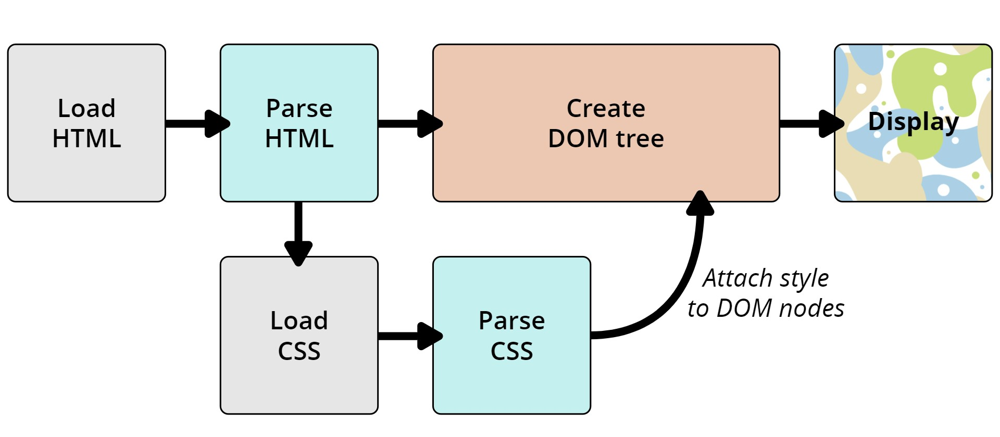
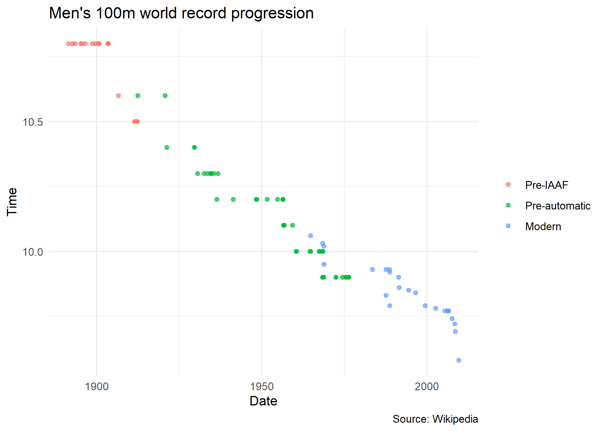
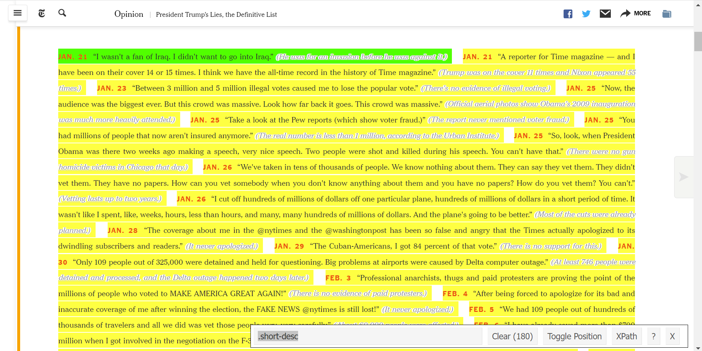

## Software requirements

### External software

Today we'll be using [SelectorGadget](https://selectorgadget.com/), which is a Chrome extension that makes it easy to discover CSS selectors.  (Install the extension directly [here](https://chrome.google.com/webstore/detail/selectorgadget/mhjhnkcfbdhnjickkkdbjoemdmbfginb).) Please note that SelectorGadget is only available for Chrome. If you prefer using Firefox, then you can try [ScrapeMate](https://addons.mozilla.org/en-US/firefox/addon/scrapemate/).

### R packages 

- New: **rvest**, **janitor**
- Already used: **tidyverse**, **lubridate**, **data.table**, **hrbrthemes**

Recall that **rvest** was automatically installed with the rest of the tidyverse. These lecture notes assume that you have at least installed **rvest** 1.0.0, which `install.packages("tidyverse")` should give you.


```r
## Load and install the packages that we'll be using today
if (!require("pacman")) install.packages("pacman")
pacman::p_load(tidyverse, rvest, lubridate, janitor, data.table, hrbrthemes,gsheet,polite)
## My preferred ggplot2 plotting theme (optional)
theme_set(theme_minimal())
```

## Webscraping basics

The next two lectures are about getting data, or "content", off the web and onto our computers. We're all used to seeing this content in our browsers (Chrome, Firefox, etc.). So we know that it must exist somewhere. However, it's important to realize that there are actually two ways that web content gets rendered in a browser: 

1. Server-side
2. Client side

You can read [here](https://www.codeconquest.com/website/client-side-vs-server-side/) for more details (including example scripts), but for our purposes the essential features are as follows: 

### 1. Server-side
- The scripts that "build" the website are not run on our computer, but rather on a host server that sends down all of the HTML code.
  - E.g. Wikipedia tables are already populated with all of the information --- numbers, dates, etc. --- that we see in our browser.
- In other words, the information that we see in our browser has already been processed by the host server. 
- You can think of this information being embedded directly in the webpage's HTML.
- **Webscraping challenges:** Finding the correct CSS (or Xpath) "selectors". Iterating through dynamic webpages (e.g. "Next page" and "Show More" tabs).
- **Key concepts:** CSS, Xpath, HTML
  
### 2. Client-side
- The website contains an empty template of HTML and CSS. 
  - E.g. It might contain a "skeleton" table without any values.
- However, when we actually visit the page URL, our browser sends a *request* to the host server.
- If everything is okay (e.g. our request is valid), then the server sends a *response* script, which our browser executes and uses to populate the HTML template with the specific information that we want.
- **Webscraping challenges:** Finding the "API endpoints" can be tricky, since these are sometimes hidden from view.
- **Key concepts:** APIs, API endpoints

Over the next two lectures, we'll go over the main differences between the two approaches and cover the implications for any webscraping activity. I want to forewarn you that webscraping typically involves a fair bit of detective work. You will often have to adjust your steps according to the type of data you want, and the steps that worked on one website may not work on another. (Or even work on the same website a few months later). All this is to say that *webscraping involves as much art as it does science*.

The good news is that both server-side and client-side websites allow for webscraping.^[As we'll see during the next lecture, scraping a website or application that is built on a client-side (i.e. API) framework is often easier; particularly when it comes to downloading information *en masse*.] If you can see it in your browser, you can scrape it. 

### Caveat: Ethical ~~and legal~~ considerations

The previous sentence elides some important ethical considerations. Just because you *can* scrape it, doesn't mean you *should*. Now, I first have to tell you that this paragraph used to contain a warning about the legal restrictions pertaining to webscraping activity. I've decided to drop those in the wake of the landmark [*hiQ Labs vs LinkedIn*](https://twitter.com/kjhealy/status/1255636154453549057) court ruling. (Short version: It is currently legal to scrape data from the web using automated tools, as long as the data are publicly available.) However, it's still important to realize that the tools we'll be using over these next two lectures are very powerful. A computer can process commands much, much faster than we can ever type them up manually. It's pretty easy to write up a function or program that can overwhelm a host server or application through the sheer weight of requests.Or, just as likely, the host server has built-in safeguards that will block you in case of a suspected malicious [attack](https://en.wikipedia.org/wiki/Denial-of-service_attack). We'll return to the "be nice" mantra at the end of this lecture, as well as in the next lecture. 

One way to stay ethical is to use the [**polite**](https://github.com/dmi3kno/polite) package. I'll show you how to use this package alongside the **rvest** package below when we start scraping the NYT website. Essentially, polite checks the robots.txt file of a website to see if it is okay to scrape. If it is, then it will automatically add a delay between each request that you make. This is a good way to avoid overwhelming a host server. A robots.txt function is a file that is hosted on a website that tells you what you can and cannot scrape. You can find the robots.txt file for any website by typing the url of the website followed by "/robots.txt". For example, here is the [robots.txt](https://www.nytimes.com/robots.txt) file for the New York Times and the [robots.txt](https://en.wikipedia.org/robots.txt) for Wikipedia. Technically these are not legally binding, but they give guidance on how to proceed. Here is a deeper dive into [robots.txt](https://developers.google.com/search/docs/crawling-indexing/robots/intro) files and how they are used to help regulate traffic from search engines like Google. 

If you scrape the site over and over -- likely if you are collecting big data -- please use the **polite** package alongside **rvest**. Nothing today will come close to causing problems, but it is good practice to be nice.

### Caveat: Stability and dependencies

Webscraping is extremely trick and code may stop working after just a small change to the underlying HTML. Organizations are constantly rewriting their webpages, which can break webscraping code -- whether intentionally or not. This is why it is important to be able to read HTML and CSS. You can often find the information you want by looking at the HTML and CSS. For example, these lecture notes used to feature a Craigslist example, but that company has made it far harder to scrape since 2021, so I need to find a new scraping example. (NYT below.) 

## Easy webscraping for popular platforms

Sometimes specific platforms are so popular they get dedicated packages for scraping them. Of course, these platforms are also very aware of the potential for abuse and are constantly building in safeguards that break open source tools. Google is one such platform. Tons of publicly available data is stored in Google Sheets, Google Docs, etc.

### Packages to scrape Google Sheets

- [**gsheet**](https://cran.r-project.org/web/packages/gsheet/gsheet.pdf): A simple package for reading Google Sheets into R.
- [**googlesheets4**](https://googlesheets4.tidyverse.org/): The latest and greatest version of the **googlesheets** package. There's a reference for it in the [RStudio cheatsheets](https://github.com/rstudio/cheatsheets/blob/main/data-import.pdf).
- [**googledrive**](Google is one such platform. ): A more general package for interacting with Google Drive. (E.g. Downloading files, etc.)

We'll work with **gsheet** because it is relatively straightforward to accomplish the task on the problem set. However, I recommend that you check out the other two packages as well. They are more powerful and will likely be more useful in the long run. 

Let's take the [Ask A Manager Survey for 2023](https://docs.google.com/spreadsheets/d/1ioUjhnz6ywSpEbARI-G3RoPyO0NRBqrJnWf-7C_eirs/edit?resourcekey#gid=1854892322). This sheet is publicly available and you just need to read it like you would any CSV. The function, `gsheet2tbl()` within **gsheet** is a convenient way to do this. It will read in the data. Try it for the [2021](https://docs.google.com/spreadsheets/d/1IPS5dBSGtwYVbjsfbaMCYIWnOuRmJcbequohNxCyGVw/edit?resourcekey#gid=1625408792) and [2022](https://docs.google.com/spreadsheets/d/1Uq5GwatBdujitJkP2X5SDChHSbg68rmuOz9T9eTzu40/edit?resourcekey#gid=1660826355) versions as well.


```r
gsheet2tbl('https://docs.google.com/spreadsheets/d/1IPS5dBSGtwYVbjsfbaMCYIWnOuRmJcbequohNxCyGVw/edit?resourcekey#gid=1625408792') 
```

```
## # A tibble: 27,985 × 18
##    Timestamp          `How old are you?` What industry do you work…¹ `Job title`
##    <chr>              <chr>              <chr>                       <chr>      
##  1 4/27/2021 11:02:10 25-34              Education (Higher Educatio… Research a…
##  2 4/27/2021 11:02:22 25-34              Computing or Tech           Change & I…
##  3 4/27/2021 11:02:38 25-34              Accounting, Banking & Fina… Marketing …
##  4 4/27/2021 11:02:41 25-34              Nonprofits                  Program Ma…
##  5 4/27/2021 11:02:42 25-34              Accounting, Banking & Fina… Accounting…
##  6 4/27/2021 11:02:46 25-34              Education (Higher Educatio… Scholarly …
##  7 4/27/2021 11:02:51 25-34              Publishing                  Publishing…
##  8 4/27/2021 11:03:00 25-34              Education (Primary/Seconda… Librarian  
##  9 4/27/2021 11:03:01 45-54              Computing or Tech           Systems An…
## 10 4/27/2021 11:03:02 35-44              Accounting, Banking & Fina… Senior Acc…
## # ℹ 27,975 more rows
## # ℹ abbreviated name: ¹​`What industry do you work in?`
## # ℹ 14 more variables:
## #   `If your job title needs additional context, please clarify here:` <chr>,
## #   `What is your annual salary? (You'll indicate the currency in a later question. If you are part-time or hourly, please enter an annualized equivalent -- what you would earn if you worked the job 40 hours a week, 52 weeks a year.)` <dbl>,
## #   `How much additional monetary compensation do you get, if any (for example, bonuses or overtime in an average year)? Please only include monetary compensation here, not the value of benefits.` <chr>,
## #   `Please indicate the currency` <chr>, …
```

This renders in the tibble format which we've seen before. Each column describes a different variable and each row describes a different respondent. Tibbles also let you know the type of a character. For example, the `How old are you?` column is a character. Why is a column with numbers a character? Because it includes non-numeric characters.

Let's inspect how `gsheet2tbl` works so you can learn a little bit about how to access data that lives on the internet. (Note: This functions more similarly to how APIs work, but it is a nice introduction and helps you with your problem set.) Type `gsheet2tbl` as I've done below without `()` after it. What do you see? 


```r
gsheet2tbl
```

```
## function (url, sheetid = NULL) 
## {
##     if (requireNamespace("readr", quietly = TRUE)) {
##         suppressMessages(table <- readr::read_csv(file = construct_download_url(url, 
##             format = "csv", sheetid = NULL)))
##     }
##     else {
##         table <- utils::read.csv(text = gsheet2text(url = url, 
##             format = "csv", sheetid = sheetid), stringsAsFactors = FALSE)
##         class(table) <- c("tbl_df", "tbl", "data.frame")
##     }
##     return(table)
## }
## <bytecode: 0x000001796b2399b8>
## <environment: namespace:gsheet>
```

The output is what is inside the function `gsheet2tbl`. See if you can interpret what it is doing. 

The function takes the argument `url` and `sheetid` for the google sheets url and its sheetid. It has some if/else logic based on whether the `sheetid` was specified. If so, the function will need to take an extra step to pinpoint the specific sheet you are requesting. If not, it continues. The function uses the `readr::read_csv()` function to read a csv like you would a file on your computer, but it does so with a csv on the internet. How does it do that? It uses a function called `construct_download_url()` to access it. Let's look inside of this one. 


```r
construct_download_url
```

```
## function (url, format = "csv", sheetid = NULL) 
## {
##     key <- stringr::str_extract(url, "[[:alnum:]_-]{30,}")
##     if (is.null(sheetid) & stringr::str_detect(url, "gid=[[:digit:]]+")) {
##         sheetid <- as.numeric(stringr::str_extract(stringr::str_extract(url, 
##             "gid=[[:digit:]]+"), "[[:digit:]]+"))
##     }
##     address <- paste0("https://docs.google.com/spreadsheets/export?id=", 
##         key, "&format=", format)
##     if (!is.null(sheetid)) {
##         address <- paste0(address, "&gid=", sheetid)
##     }
##     return(address)
## }
## <bytecode: 0x0000017968fa51f0>
## <environment: namespace:gsheet>
```

Again we see function output. `construct_download_url` takes a `url`, file `format` (defaults to "csv"), and `sheetid`. Then it creates a `key` using the `stringr` library. This library let's you use regular expressions to manipulate strings. It extracts all alphanumeric characters in a sequence of at least 30 (but possibly more). This is because Google uses these `key`s to identify specific google sheets similar to how APIs work. We'll talk more about these on Thursday. 

Next, `construct_download_url` creates the `address` for the `.csv` file using the paste function. It uses a preset url for google spreadsheets CSVs, "https://docs.google.com/spreadsheets/export?id=", followed by the `key`, followed by "&format" and the `format` specified (again "csv" by default). Then it returns the `address`, which is fed to `gsheet2tbl`. 

### Clean Code alert: Abstraction

Google does not host its spreadsheets as CSVs that you can immediately use a `read_csv` to read. This is for proprietary reasons. But when the spreadsheet is hosted publicly, it is straightforward, but tedious to remember how to construct a link to the relevant CSV file. `gsheet2tbl` abstracts this process for you so you do not need to remember. It is a function that takes a URL and returns a tibble. That said, if Google ever changed the way it hosted its spreadsheets, `gsheet2tbl` would break. If the package owner was slow to fix it and you knew a fix, you could write it, and pull request the fix to GitHub. 

## Webscraping with **rvest** (server-side)

The primary R package that we'll be using today is **rvest** ([link](https://rvest.tidyverse.org/)), a simple webscraping library inspired by Python's **Beautiful Soup** ([link](https://www.crummy.com/software/BeautifulSoup/)), but with extra tidyverse functionality. **rvest** is designed to work with webpages that are built server-side and thus requires knowledge of the relevant CSS selectors... Which means that now is probably a good time for us to cover what these are.

### Some notes on Cascading Style Sheets ([CSS](https://developer.mozilla.org/en-US/docs/Learn/CSS/Introduction_to_CSS/How_CSS_works)) and Seletor Gadgets ([SelectorGadget](http://selectorgadget.com/)).

When your web browser displays an HTML (Hypertext Markup Language) document (i.e. a webpage), it merges the content (words, pictures, data, videos) with style information to make it look good. The style information is specified using a language called Cascading Style Sheets (CSS), which provides rules. 

Here's a simplified version of how that works:

1. The browser downloads the HTML document from the web server.
2. The browser parses the HTML document and builds a "Document Object Model" (DOM) tree. This is a fancy way of saying that the browser creates a hierarchical representation of the document's content called a "tree" that is similar to the file paths on your computer. Each node in the tree represents an HTML element (e.g. a paragraph, a table, a header, etc.) and the relationship between nodes represents the nesting of these elements. For example, a paragraph element that is nested within a table element will be a child node of the table element.
3. The browser fetches the different resources linked to by the HTML document. This includes things like images, videos, and CSS files. 
4. The browser parses the fetched CSS and sorts the rules into "buckets," like `element`, `class`, `ID`, etc. It then applies the rules to the DOM tree to determine how the document should be displayed, which is called a render tree.
5. The render tree is then laid out in the browser window according to the specific screen dimensions of the user's device. This is called the layout.
6. The visual display of the page is shown on the screen. 

Here's a nice analogy to wrap your head around this. Imagine you are building a house. 


Taken from [Mozilla](https://developer.mozilla.org/en-US/docs/Learn/CSS/First_steps/How_CSS_works).

1. The web server is the contractor who provides the blueprint for the house from an architect. 
2. The HTML document is the blueprint for the house.
3. The DOM is a organized outline of the house by room, with the materials for each room listed. <-- This is the trickiest to fit into analogies! 
4. The CSS is the interior decorating plan for the house. 
5. The browser is the construction team that builds the house.
6. Bonus: The electrical appliances inside are the JavaScript that makes everything run.

In short, CSS is a language for specifying the appearance of HTML documents (including web pages). It does this by providing web browsers a set of display rules, which are formed by:

1. _Properties._ CSS properties are the "how" of the display rules. These are things like which font family, styles and colours to use, page width, etc.
2. _Selectors._ CSS selectors are the "what" of the display rules. They identify which rules should be applied to which elements. E.g. Text elements that are selected as ".h1" (i.e. top line headers) are usually larger and displayed more prominently than text elements selected as ".h2" (i.e. sub-headers).

The key point is that if you can identify the CSS selector(s) of the content you want, then you can isolate it from the rest of the webpage content that you don't want. This where SelectorGadget comes in. We'll work through an extended example (with a twist!) below, but I highly recommend looking over this [quick vignette](https://cran.r-project.org/web/packages/rvest/vignettes/selectorgadget.html) before proceding.

## Application 1: Wikipedia

Okay, let's get to an application. Say that we want to scrape the Wikipedia page on the [**Men's 100 metres world record progression**](http://en.wikipedia.org/wiki/Men%27s_100_metres_world_record_progression). 

First, open up this page in your browser. Take a look at its structure: What type of objects does it contain? How many tables does it have? Do these tables all share the same columns? What row- and columns-spans? Etc.

Once you've familiarised yourself with the structure, read the whole page into R using the `rvest::read_html()` function, which returns an [XML](https://en.wikipedia.org/wiki/XML) document that contains all the information about the web page.


```r
# library(rvest) ## Already loaded

m100 = read_html("http://en.wikipedia.org/wiki/Men%27s_100_metres_world_record_progression") 
m100
```

```
## {html_document}
## <html class="client-nojs vector-feature-language-in-header-enabled vector-feature-language-in-main-page-header-disabled vector-feature-sticky-header-disabled vector-feature-page-tools-pinned-disabled vector-feature-toc-pinned-clientpref-1 vector-feature-main-menu-pinned-disabled vector-feature-limited-width-clientpref-1 vector-feature-limited-width-content-enabled vector-feature-zebra-design-disabled vector-feature-custom-font-size-clientpref-disabled vector-feature-client-preferences-disabled vector-feature-typography-survey-disabled vector-toc-available" lang="en" dir="ltr">
## [1] <head>\n<meta http-equiv="Content-Type" content="text/html; charset=UTF-8 ...
## [2] <body class="skin-vector skin-vector-search-vue mediawiki ltr sitedir-ltr ...
```

As you can see, this is an [XML](https://en.wikipedia.org/wiki/XML) document^[XML stands for Extensible Markup Language and is one of the primary languages used for encoding and formatting web pages.] that contains *everything* needed to render the Wikipedia page. It's kind of like viewing someone's entire LaTeX document (preamble, syntax, etc.) when all we want are the data from some tables in their paper.

### Table 1: Pre-IAAF (1881--1912)

Let's start by scraping the first table on the page, which documents the [unofficial progression before the IAAF](https://en.wikipedia.org/wiki/Men%27s_100_metres_world_record_progression#Unofficial_progression_before_the_IAAF). The first thing we need to do is identify the table's unique CSS selector. Here's a GIF of me using [SelectorGadget](http://selectorgadget.com/) to do that.


</br>
As you can see, working through this iterative process yields *"div+ .wikitable :nth-child(1)"*. We can now use this unique CSS selector to isolate the pre-IAAF table content from the rest of the HTML document. The core **rvest** function that we'll use to extract the table content is `html_element()`, before piping it on to `html_table()` to parse the HTML table into an R data frame. Notice that I am using the `%>%` pipe-operator from the [magrittr](http://magrittr.tidyverse.org/) package, which can help to express complex operations as elegant pipelines composed of simple, easily understood pieces.


```r
pre_iaaf = 
  m100 %>%
  html_element("div+ .wikitable :nth-child(1)") %>% ## select table element
  html_table()                                      ## convert to data frame

pre_iaaf
```

```
## # A tibble: 21 × 5
##     Time Athlete               Nationality    `Location of races`     Date      
##    <dbl> <chr>                 <chr>          <chr>                   <chr>     
##  1  10.8 Luther Cary           United States  Paris, France           July 4, 1…
##  2  10.8 Cecil Lee             United Kingdom Brussels, Belgium       September…
##  3  10.8 Étienne De Ré         Belgium        Brussels, Belgium       August 4,…
##  4  10.8 L. Atcherley          United Kingdom Frankfurt/Main, Germany April 13,…
##  5  10.8 Harry Beaton          United Kingdom Rotterdam, Netherlands  August 28…
##  6  10.8 Harald Anderson-Arbin Sweden         Helsingborg, Sweden     August 9,…
##  7  10.8 Isaac Westergren      Sweden         Gävle, Sweden           September…
##  8  10.8 Isaac Westergren      Sweden         Gävle, Sweden           September…
##  9  10.8 Frank Jarvis          United States  Paris, France           July 14, …
## 10  10.8 Walter Tewksbury      United States  Paris, France           July 14, …
## # ℹ 11 more rows
```

Great, it worked! 

I'll tidy things up a bit so that the data frame is easier to work with in R. First, I'll use the `janitor::clean_names()` convenience function to remove spaces and capital letters from the column names. (Q: How else could we have done this?) Second, I'll use the `lubridate::mdy()` function to convert the date string to a format that R actually understands.  


```r
# library(janitor) ## Already loaded
# library(lubridate) ## Already loaded

pre_iaaf =
  pre_iaaf %>%
  clean_names() %>%         ## fix the column names
  mutate(date = mdy(date))  ## convert string to date format

pre_iaaf
```

```
## # A tibble: 21 × 5
##     time athlete               nationality    location_of_races       date      
##    <dbl> <chr>                 <chr>          <chr>                   <date>    
##  1  10.8 Luther Cary           United States  Paris, France           1891-07-04
##  2  10.8 Cecil Lee             United Kingdom Brussels, Belgium       1892-09-25
##  3  10.8 Étienne De Ré         Belgium        Brussels, Belgium       1893-08-04
##  4  10.8 L. Atcherley          United Kingdom Frankfurt/Main, Germany 1895-04-13
##  5  10.8 Harry Beaton          United Kingdom Rotterdam, Netherlands  1895-08-28
##  6  10.8 Harald Anderson-Arbin Sweden         Helsingborg, Sweden     1896-08-09
##  7  10.8 Isaac Westergren      Sweden         Gävle, Sweden           1898-09-11
##  8  10.8 Isaac Westergren      Sweden         Gävle, Sweden           1899-09-10
##  9  10.8 Frank Jarvis          United States  Paris, France           1900-07-14
## 10  10.8 Walter Tewksbury      United States  Paris, France           1900-07-14
## # ℹ 11 more rows
```

Now that we have our cleaned pre-IAAF data frame, we could easily plot it. I'm going to hold off doing that until we've scraped the rest of the WR data. But first, an aside on browser inspection tools.

#### Aside: Get CSS selectors via browser inspection tools

SelectorGadget is a great tool. But it isn't available on all browsers and can involve more work than I'd like sometimes, with all that iterative clicking.^[Historically, at least, it also had a tendency to provide CSS selectors that weren't exactly what we were looking for. To be fair, this may have reflected some issues coming from the R + **rvest** as much as anything else. These minor incompatibilities have been largely eliminated with **rvest** 1.0.0... [prompting a re-write](https://twitter.com/grant_mcdermott/status/1354518507208105984) of these notes!] I therefore wanted to mention an alternative (and very precise) approach to obtaining CSS selectors: Use the "[inspect web element](https://www.lifewire.com/get-inspect-element-tool-for-browser-756549)" feature of your browser.

Here's a quick example using Google Chrome. First, I open up the inspect console (**Ctrl+Shift+I**, or right-click and choose "Inspect"). I then proceed to scroll over the source elements, until Chrome highlights the table of interest on the actual page. Once the table (or other element of interest) is highlighted, I can grab its CSS by right-clicking and selecting **Copy -> Copy selector**.


</br>
In general, I prefer to obtain CSS selectors using this "inspect" method with my browser. But each to their own.

### Challenge

Your turn: Download the next two tables from the same WR100m page. Combine these two new tables with the one above into a single data frame and then plot the record progression. Answer below. (No peeking until you have tried first.)

.

.

.

.

.

.

.

.

.

.

.

.

.

.

.

#### Table 2: Pre-automatic timing (1912--1976)

Let's start with the second table. *Note*: Selector gadget may give you a slightly different CSS selector ("h3+ .wikitable :nth-child(1)") than the one I use below. That's fine. I pulled my selector from the browser inspection tool.


```r
# Refresh the m100, it was forgotten from the last code chunk when run within Rmarkdown.
m100 = read_html("http://en.wikipedia.org/wiki/Men%27s_100_metres_world_record_progression") 
iaaf_76 =
  m100 %>%
  html_element("#mw-content-text > div.mw-parser-output > table:nth-child(17)") %>%
  html_table()
```

As we did with the previous table, let's fix the column names and coerce the date string to a format that R understands.


```r
iaaf_76 =
  iaaf_76 %>%
  clean_names() %>%
  mutate(date = mdy(date))

iaaf_76
```

```
## # A tibble: 54 × 8
##     time wind   auto athlete       nationality location_of_race date       ref  
##    <dbl> <chr> <dbl> <chr>         <chr>       <chr>            <date>     <chr>
##  1  10.6 ""     NA   Donald Lippi… United Sta… Stockholm, Swed… 1912-07-06 [2]  
##  2  10.6 ""     NA   Jackson Scho… United Sta… Stockholm, Swed… 1920-09-16 [2]  
##  3  10.4 ""     NA   Charley Padd… United Sta… Redlands, USA    1921-04-23 [2]  
##  4  10.4 "0.0"  NA   Eddie Tolan   United Sta… Stockholm, Swed… 1929-08-08 [2]  
##  5  10.4 ""     NA   Eddie Tolan   United Sta… Copenhagen, Den… 1929-08-25 [2]  
##  6  10.3 ""     NA   Percy Willia… Canada      Toronto, Canada  1930-08-09 [2]  
##  7  10.3 "0.4"  10.4 Eddie Tolan   United Sta… Los Angeles, USA 1932-08-01 [2]  
##  8  10.3 ""     NA   Ralph Metcal… United Sta… Budapest, Hunga… 1933-08-12 [2]  
##  9  10.3 ""     NA   Eulace Peaco… United Sta… Oslo, Norway     1934-08-06 [2]  
## 10  10.3 ""     NA   Chris Berger  Netherlands Amsterdam, Neth… 1934-08-26 [2]  
## # ℹ 44 more rows
```


#### Table 3: Modern Era (1977 onwards)

For the final table, I'll just run the code all at once. By now you should recognise all of the commands. Again, SelectorGadget might tell you it is "p+ .wikitable :nth-child(1)" instead. I pulled my selector from the browser inspection tool.


```r
iaaf =
  m100 %>%
  html_element(".wikitable:nth-child(23) :nth-child(1)") %>%
  html_table() %>%
  clean_names() %>%
  mutate(date = mdy(date))

iaaf
```

```
## # A tibble: 24 × 9
##     time wind   auto athlete        nationality   location_of_race    date      
##    <dbl> <chr> <dbl> <chr>          <chr>         <chr>               <date>    
##  1 10.1  1.3      NA Bob Hayes      United States Tokyo, Japan        1964-10-15
##  2 10.0  0.8      NA Jim Hines      United States Sacramento, USA     1968-06-20
##  3 10.0  2.0      NA Charles Greene United States Mexico City, Mexico 1968-10-13
##  4  9.95 0.3      NA Jim Hines      United States Mexico City, Mexico 1968-10-14
##  5  9.93 1.4      NA Calvin Smith   United States Colorado Springs, … 1983-07-03
##  6  9.83 1.0      NA Ben Johnson    Canada        Rome, Italy         1987-08-30
##  7  9.93 1.0      NA Carl Lewis     United States Rome, Italy         1987-08-30
##  8  9.93 1.1      NA Carl Lewis     United States Zürich, Switzerland 1988-08-17
##  9  9.79 1.1      NA Ben Johnson    Canada        Seoul, South Korea  1988-09-24
## 10  9.92 1.1      NA Carl Lewis     United States Seoul, South Korea  1988-09-24
## # ℹ 14 more rows
## # ℹ 2 more variables: notes_note_2 <chr>, duration_of_record <chr>
```

### Combined eras plot

Let's combine our three separate tables into a single data frame. I'll use base R's `rbind()` to bind by row and include only the variables that are common to all of the three data frames. For good measure, I'll also add an extra column describing which era each record was recorded under.


```r
wr100 =
  rbind(
    pre_iaaf %>% select(time, athlete, nationality, date) %>% mutate(era = "Pre-IAAF"),
    iaaf_76 %>% select(time, athlete, nationality, date) %>% mutate(era = "Pre-automatic"),
    iaaf %>% select(time, athlete, nationality, date) %>% mutate(era = "Modern")
    )

wr100
```

```
## # A tibble: 99 × 5
##     time athlete               nationality    date       era     
##    <dbl> <chr>                 <chr>          <date>     <chr>   
##  1  10.8 Luther Cary           United States  1891-07-04 Pre-IAAF
##  2  10.8 Cecil Lee             United Kingdom 1892-09-25 Pre-IAAF
##  3  10.8 Étienne De Ré         Belgium        1893-08-04 Pre-IAAF
##  4  10.8 L. Atcherley          United Kingdom 1895-04-13 Pre-IAAF
##  5  10.8 Harry Beaton          United Kingdom 1895-08-28 Pre-IAAF
##  6  10.8 Harald Anderson-Arbin Sweden         1896-08-09 Pre-IAAF
##  7  10.8 Isaac Westergren      Sweden         1898-09-11 Pre-IAAF
##  8  10.8 Isaac Westergren      Sweden         1899-09-10 Pre-IAAF
##  9  10.8 Frank Jarvis          United States  1900-07-14 Pre-IAAF
## 10  10.8 Walter Tewksbury      United States  1900-07-14 Pre-IAAF
## # ℹ 89 more rows
```

All that hard works deserves a nice plot, don't you think?


```r
wr100 %>%
  ggplot(aes(x=date, y=time, col=fct_reorder2(era, date, time))) +
  geom_point(alpha = 0.7) +
  labs(
    title = "Men's 100m world record progression",
    x = "Date", y = "Time",
    caption = "Source: Wikipedia") +
  theme(legend.title = element_blank()) ## Switch off legend title
```

<!-- -->


## Application 2: New York Times

There are several features of the previous Wikipedia example that make it a good introductory application. Most notably, the HTML table format provides a regular structure that is easily coercible into a data frame (via `html_table()`). Oftentimes, however, the information that we want to scrape off the web doesn't have this nice regular structure. For this next example, then, I'm going to walk you through a slightly more messy application: Scraping items from [The New York Times](https://www.nytimes.com/interactive/2017/06/23/opinion/trumps-lies.html). The following is adapted from an R notebook of a Medium [blog post](https://towardsdatascience.com/web-scraping-tutorial-in-r-5e71fd107f32) from August 2, 2017 by José Roberto Ayala Solares, who in term adapted it from work by [Kevin Markham](https://twitter.com/justmarkham?lang=en). The post walks through a tutorial to scrape the [Trump Lies](https://www.nytimes.com/interactive/2017/06/23/opinion/trumps-lies.html) article from the NYT. I've made some minor modifications to the code and added some extra commentary.

## Examining the New York Times Article
For a nice description about the article that we'll be working with, look at Kevin's [tutorial](http://www.dataschool.io/python-web-scraping-of-president-trumps-lies/). In summary, the data that we are interested in consists of a record of lies, each with 4 parts:

- The date of the lie
- The lie itself
- An explanation of why it was a lie
- A URL for an article that supports the explanation (embedded within the text)



## Reading the web page into R

I will show you how to read with **rvest** and **polite** here. Note for yourself that the output is the same, but the polite version is requires to steps and a little slower.


```r
# library(polite)

nyt_session = polite::bow("https://www.nytimes.com/interactive/2017/06/23/opinion/trumps-lies.html") #start your session

webpage <- polite::scrape(nyt_session)
webpage
## {html_document}
## <html lang="en" class="no-js page-interactive section-opinion page-theme-standard tone-opinion page-interactive-default limit-small layout-xlarge app-interactive" itemid="https://www.nytimes.com/interactive/2017/06/23/opinion/trumps-lies.html" itemtype="http://schema.org/NewsArticle" itemscope="" xmlns:og="http://opengraphprotocol.org/schema/">
## [1] <head>\n<meta http-equiv="Content-Type" content="text/html; charset=UTF-8 ...
## [2] <body>\n<style>\n.lt-ie10 .messenger.suggestions {\n  display: block !imp ...

webpage_html <- rvest::read_html("https://www.nytimes.com/interactive/2017/06/23/opinion/trumps-lies.html")
webpage_html
## {html_document}
## <html lang="en" class="no-js page-interactive section-opinion page-theme-standard tone-opinion page-interactive-default limit-small layout-xlarge app-interactive" itemid="https://www.nytimes.com/interactive/2017/06/23/opinion/trumps-lies.html" itemtype="http://schema.org/NewsArticle" itemscope="" xmlns:og="http://opengraphprotocol.org/schema/">
## [1] <head>\n<meta http-equiv="Content-Type" content="text/html; charset=UTF-8 ...
## [2] <body>\n<style>\n.lt-ie10 .messenger.suggestions {\n  display: block !imp ...
```

## Collecting all of the records
Let's use the SelectorGadget to figure out what the records are called. Above, we see that every record has the following structure in the HTML code:

`<span class="short-desc"><strong> DATE </strong> LIE <span class="short-truth"><a href="URL"> EXPLANATION </a></span></span>`

Therefore, to collect all the lies, we need to identify all the `<span>` tags that belong to `class="short-desc"`. The function that will help us to do so is `html_elements()` (Note: In the original article, José uses `html_nodes`, [which are more generic than elements](https://stackoverflow.com/questions/9979172/difference-between-node-object-and-element-object).). This function requires the XML document that we have read and the nodes that we want to select. For the latter, it is encouraged to use the [SelectorGadget](http://selectorgadget.com/), an open source tool that makes CSS selector generation and discovery easy. Using such a tool, we find that all the lies can be selected by using the selector `".short-desc"`.


```r
results <- webpage %>% html_elements(".short-desc")
results
```

```
## {xml_nodeset (180)}
##  [1] <span class="short-desc"><strong>Jan. 21 </strong>“I wasn't a fan of Ira ...
##  [2] <span class="short-desc"><strong>Jan. 21 </strong>“A reporter for Time m ...
##  [3] <span class="short-desc"><strong>Jan. 23 </strong>“Between 3 million and ...
##  [4] <span class="short-desc"><strong>Jan. 25 </strong>“Now, the audience was ...
##  [5] <span class="short-desc"><strong>Jan. 25 </strong>“Take a look at the Pe ...
##  [6] <span class="short-desc"><strong>Jan. 25 </strong>“You had millions of p ...
##  [7] <span class="short-desc"><strong>Jan. 25 </strong>“So, look, when Presid ...
##  [8] <span class="short-desc"><strong>Jan. 26 </strong>“We've taken in tens o ...
##  [9] <span class="short-desc"><strong>Jan. 26 </strong>“I cut off hundreds of ...
## [10] <span class="short-desc"><strong>Jan. 28 </strong>“The coverage about me ...
## [11] <span class="short-desc"><strong>Jan. 29 </strong>“The Cuban-Americans,  ...
## [12] <span class="short-desc"><strong>Jan. 30 </strong>“Only 109 people out o ...
## [13] <span class="short-desc"><strong>Feb. 3 </strong>“Professional anarchist ...
## [14] <span class="short-desc"><strong>Feb. 4 </strong>“After being forced to  ...
## [15] <span class="short-desc"><strong>Feb. 5 </strong>“We had 109 people out  ...
## [16] <span class="short-desc"><strong>Feb. 6 </strong>“I have already saved m ...
## [17] <span class="short-desc"><strong>Feb. 6 </strong>“It's gotten to a point ...
## [18] <span class="short-desc"><strong>Feb. 6 </strong>“The failing @nytimes w ...
## [19] <span class="short-desc"><strong>Feb. 6 </strong>“And the previous admin ...
## [20] <span class="short-desc"><strong>Feb. 7 </strong>“And yet the murder rat ...
## ...
```

```r
#> {xml_nodeset (180)}
#> [1] <span class="short-desc"><strong>Jan. 21 </strong>"I wasn't a fan of Iraq. I didn't want to go into Ir ...
#> [2] <span class="short-desc"><strong>Jan. 21 </strong>"A reporter for Time magazine — and I have been on t ...
#> [3] <span class="short-desc"><strong>Jan. 23 </strong>"Between 3 million and 5 million illegal votes cause ...
#> [4] <span class="short-desc"><strong>Jan. 25 </strong>"Now, the audience was the biggest ever. But this cr ...
#> [5] <span class="short-desc"><strong>Jan. 25 </strong>"Take a look at the Pew reports (which show voter fr ...
#> [6] <span class="short-desc"><strong>Jan. 25 </strong>"You had millions of people that now aren't insured  ...
#> [7] <span class="short-desc"><strong>Jan. 25 </strong>"So, look, when President Obama was there two weeks  ...
#> [8] <span class="short-desc"><strong>Jan. 26 </strong>"We've taken in tens of thousands of people. We know ...
#> ...
```

This returns a list with 180 XML nodes that contain the information for each of the 180 lies in the web page.

## Extracting the date

You might be tempted to just immediately use the `html_table` function again. But if we try that, what happens? We don't get a table. We get 180 empty tibbles because we have not yet added structure.


```r
#Head keeps the output short.
html_table(results)
```

Let's start simple and focus on extracting all the necessary details from the first lie. We can then extend this to all the others easily. Remember that the general structure for a single record is:

`<span class="short-desc"><strong> DATE </strong> LIE <span class="short-truth"><a href="URL"> EXPLANATION </a></span></span>`

Notice that the date is embedded within the `<strong>` tag. To select it, we can use the `html_elements()` or `html_nodes()` function using the selector `"strong"`.


```r
first_result <- results[1]
first_result %>% html_elements("strong")
```

```
## {xml_nodeset (1)}
## [1] <strong>Jan. 21 </strong>
```

```r
#> {xml_nodeset (1)}
#> [1] <strong>Jan. 21 </strong>
```

We then need to use the `html_text()` function to extract only the text, with the trim argument active to trim leading and trailing spaces. Finally, we make use of the [stringr](http://stringr.tidyverse.org/) package to add the year to the extracted date.

## Extracting the lie
To select the lie, we need to make use of the `xml_contents()` function that is part of the xml2 package (this package is required by the rvest package, so it is not necessary to load it). The function returns a list with the nodes that are part of `first_result`.


```r
library(xml2)
xml_contents(first_result)
```

```
## {xml_nodeset (3)}
## [1] <strong>Jan. 21 </strong>
## [2] “I wasn't a fan of Iraq. I didn't want to go into Iraq.” 
## [3] <span class="short-truth"><a href="https://www.buzzfeed.com/andrewkaczyns ...
```

```r
#> {xml_nodeset (3)}
#> [1] <strong>Jan. 21 </strong>
#> [2] "I wasn't a fan of Iraq. I didn't want to go into Iraq."
#> [3] <span class="short-truth"><a href="https://www.buzzfeed.com/andrewkaczynski/in-2002-don ...
```

We are interested in the lie, which is the text of the second node.


```r
xml_contents(first_result)[2] %>% html_text(trim = TRUE)
```

```
## [1] "“I wasn't a fan of Iraq. I didn't want to go into Iraq.”"
```

```r
#> [1] ""I wasn't a fan of Iraq. I didn't want to go into Iraq.""
```

Notice that there is an extra pair of quotes ("…") surrounding the lie. To get rid of them, we simply use the `str_sub()` function from the stringr package to select just the lie.


```r
lie <- xml_contents(first_result)[2] %>% html_text(trim = TRUE)
str_sub(lie, 2, -2)
```

```
## [1] "I wasn't a fan of Iraq. I didn't want to go into Iraq."
```

```r
#> [1] "I wasn't a fan of Iraq. I didn't want to go into Iraq."
```

## Extracting the explanation
Hopefully by now it shouldn't be too complicated to see that to extract the explanation we simply need to select the text within the `<span>` tag that belongs to `class=".short-truth"`. This will extract the text together with the opening and closing quotations, but we can easily get rid of them.


```r
explanation <- first_result %>% html_element(".short-truth") %>% html_text(trim = TRUE)
str_sub(explanation, 2, -2)
```

```
## [1] "He was for an invasion before he was against it."
```

```r
#> [1] "He was for an invasion before he was against it."
```

## Extracting the URL
Finally, to get the URL, notice that this is an attribute within the `<a>` tag. We simply select this element with the `html_element()` function, and then select the href attribute with the `html_attr()` function.


```r
url <- first_result %>% html_element("a") %>% html_attr("href")
url
```

```
## [1] "https://www.buzzfeed.com/andrewkaczynski/in-2002-donald-trump-said-he-supported-invading-iraq-on-the"
```

```r
#> [1] "https://www.buzzfeed.com/andrewkaczynski/in-2002-donald-trump-said-he-supported-invading-iraq-on-the"
```

## Building the dataset
We found a way to extract each of the 4 parts of the first record. We can extend this process to all the rest using a for loop. In the end, we want to have a data frame with 180 rows (one for each record) and 4 columns (to keep the date, the lie, the explanation and the URL). One way to do so is to create an empty data frame and simply add a new row as each new record is processed. However, this is not considered a good practice. As suggested [here](http://r4ds.had.co.nz/iteration.html#unknown-output-length), we are going to create a single data frame for each record and store all of them in a list. Once we have the 180 data frames, we'll bind them together using the `bind_rows()` function from the [dplyr](http://dplyr.tidyverse.org/) package. This creates our desired dataset.


```r
library(dplyr)
records <- vector("list", length = length(results))

for (i in seq_along(results)) {
    date <- str_c(results[i] %>% html_elements("strong") %>% html_text(trim = TRUE), ", 2017")
    lie <- str_sub(xml_contents(results[i])[2] %>% html_text(trim = TRUE), 2, -2)
    explanation <- str_sub(results[i] %>% html_elements(".short-truth") %>% html_text(trim = TRUE), 2, -2)
    url <- results[i] %>% html_elements("a") %>% html_attr("href")
    records[[i]] <- data_frame(date = date, lie = lie, explanation = explanation, url = url)
}
```

```
## Warning: `data_frame()` was deprecated in tibble 1.1.0.
## ℹ Please use `tibble()` instead.
## This warning is displayed once every 8 hours.
## Call `lifecycle::last_lifecycle_warnings()` to see where this warning was
## generated.
```

```r
df <- bind_rows(records)
glimpse(df)
```

```
## Rows: 180
## Columns: 4
## $ date        <chr> "Jan. 21, 2017", "Jan. 21, 2017", "Jan. 23, 2017", "Jan. 2…
## $ lie         <chr> "I wasn't a fan of Iraq. I didn't want to go into Iraq.", …
## $ explanation <chr> "He was for an invasion before he was against it.", "Trump…
## $ url         <chr> "https://www.buzzfeed.com/andrewkaczynski/in-2002-donald-t…
```

Notice that the column for the date is considered a character vector. It'd be nice to have it as a datetime vector instead. To do so, we can use the lubridate package and use the `mdy()` function (month-day-year) to make the conversion.


```r
library(lubridate)
df$date <- mdy(df$date)
glimpse(df)
```

```
## Rows: 180
## Columns: 4
## $ date        <date> 2017-01-21, 2017-01-21, 2017-01-23, 2017-01-25, 2017-01-2…
## $ lie         <chr> "I wasn't a fan of Iraq. I didn't want to go into Iraq.", …
## $ explanation <chr> "He was for an invasion before he was against it.", "Trump…
## $ url         <chr> "https://www.buzzfeed.com/andrewkaczynski/in-2002-donald-t…
```

## Exporting the dataset to a CSV file
If you want to export your dataset, you can use either the `write.csv()` function that comes by default with R, or the `write_csv()` function from the [readr](http://readr.tidyverse.org/) package, which is twice faster and more convenient than the first one.


```r
write_csv(df, "trump_lies.csv")
```

Similarly, to retrieve your dataset, you can use either the default function `read.csv()` or the `read_csv()` function from the [readr](http://readr.tidyverse.org/) package.


```r
df <- read_csv("trump_lies.csv")
```

```
## Rows: 180 Columns: 4
## ── Column specification ────────────────────────────────────────────────────────
## Delimiter: ","
## chr  (3): lie, explanation, url
## date (1): date
## 
## ℹ Use `spec()` to retrieve the full column specification for this data.
## ℹ Specify the column types or set `show_col_types = FALSE` to quiet this message.
```

## Full code summary
The full code for this tutorial is shown below:


```r
# Load packages
library(rvest)
library(stringr)
library(dplyr)
library(lubridate)
library(readr)

# Read web page
webpage <- read_html("https://www.nytimes.com/interactive/2017/06/23/opinion/trumps-lies.html")

# Extract records info
results <- webpage %>% html_elements(".short-desc")

# Building the dataset
records <- vector("list", length = length(results))

for (i in seq_along(results)) {
    date <- str_c(results[i] %>%
                      html_elements("strong") %>%
                      html_text(trim = TRUE), ', 2017')
    lie <- str_sub(xml_contents(results[i])[2] %>% html_text(trim = TRUE), 2, -2)
    explanation <- str_sub(results[i] %>%
                               html_elements(".short-truth") %>%
                               html_text(trim = TRUE), 2, -2)
    url <- results[i] %>% html_elements("a") %>% html_attr("href")
    records[[i]] <- data_frame(date = date, lie = lie, explanation = explanation, url = url)
}

df <- bind_rows(records)

# Transform to datetime format
df$date <- mdy(df$date)

# Export to csv
write_csv(df, "trump_lies.csv")
```

I also want to mention that the stringr, dplyr, lubridate and readr packages are all part of the [tidyverse](http://tidyverse.org/) family. In fact, you could also use the popular [purrr](http://purrr.tidyverse.org/) package to avoid the for loop. However, this would require the creation of a function that maps each record to a data frame. For another example on how to do web scraping, have a look at this awesome [blog post](http://deanattali.com/blog/user2017/) from [Dean Attali](https://twitter.com/daattali).

Hopefully you find this tutorial useful. Its purpose is not to show which programming language is better, but instead to learn from both Python and R, as well as to increase your programming skills and tools to tackle a more diverse set of problems.


### *Quick aside on HTML elements, nodes, and attributes*

We played fast and loose with HTML nodes, elements, and attributes above. Let me more carefully explain them here (with help from ChatGPT and GitHub CoPilot). HTML nodes, elements, and attributes are related, but slightly different concepts. Here's a quick summary:

- **HTML nodes**: The building blocks of any HTML document. Everything from text on the page, comments in the code, whitespace, and HTML elements themselves are considered nodes. They are subdivided into text, element, and comment nodes (among others). 

- **HTML elements**: The structural and semantic parts of the webpage. These define the type of content and how to display/structure it on the web page. Each HTML element has an opening and closing tag. For example, `<p>` is the opening tag for a paragraph element, while `</p>` is the closing tag. Other examples:
  - `<a>`, `</a>`: Anchor element, used to create hyperlinks.
  - `<div>`, `</div>`: Division element, used to group other elements together.
  - `<divpath>`, `</divpath>`: Generic block container for other elements.
  - `<span>`, `</span>`: Generic inline container for other elements.
  - `<ul>`, `</ul>`: Unordered list element.
These can be nested, i.e. if you have an anchor element within a paragraph element. 

*Every HTML element is an HTML node, but not every HTML node is an HTML element. For example, text nodes are not elements.*

- **HTML attributes**: Additional information within a HTML element that modify the element in some way. As a result, they are always found within an HTML element and follow the syntax `attribute=value_of_attribute`. For example, the `<a>` element can have an `href` attribute with the syntax `<a href="https://www.google.com">`. Other examples:
  - `src`: Specifies the URL of an image to be displayed within an `` element.
  - `class`: Specifies one or more class names for an element. Used to reference elements from CSS.
  - `id`: Specifies a unique id for an element. Used to reference elements from JavaScript.
  - `style`: Specifies an inline CSS style for an element.
  - `width`: Specifies the width of an element.
  - `height`: Specifies the height of an element.

## Summary

- Web content can be rendered either 1) server-side or 2) client-side.
- To scrape web content that is rendered server-side, we need to know the relevant CSS selectors.
- We can find these CSS selectors using SelectorGadget or, more precisely, by inspecting the element in our browser.
- We use the `rvest` package to read into the HTML document into R and then parse the relevant nodes.
  - A typical workflow is: `read_html(URL) %>% html_elements(CSS_SELECTORS) %>% html_table()`.
  - You might need other functions depending on the content type (e.g. `html_text`).
- Just because you *can* scrape something doesn't mean you *should* (i.e. ethical and possibly legal considerations).
- Webscraping involves as much art as it does science. Be prepared to do a lot of experimenting and data cleaning.
- **Next lecture:** Webscraping: (2) Client-side and APIs.

## Further resources and exercises

In the next lecture, we're going to focus on client-side web content and interacting with APIs. For the moment, you can practice your `rvest`-based scraping skills by following along with any of the many (many) tutorials available online. Lastly, we spoke a bit about the "be nice" scraping motto at the beginning of the lecture. I also wanted to point you to the **polite** package ([link](https://github.com/dmi3kno/polite)). It provides some helpful tools to maintain web etiquette, such as checking for permission and not hammering the host website with requests. As a bonus, it plays very nicely with the **rvest** workflow that we covered today, so please take a look. For more advanced webscraping, you'll need to use **RSelenium**, which simulates clicking through webpages, so it can be used to scrape client-side content that relies on JavaScript. It is rare that you'll absolutely need to access data this way, so I've left it out.
