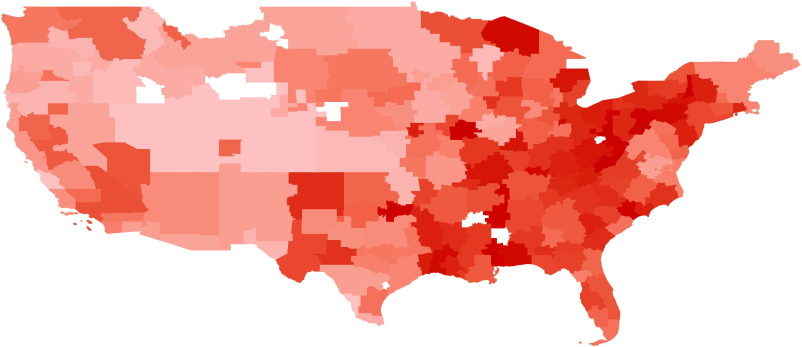
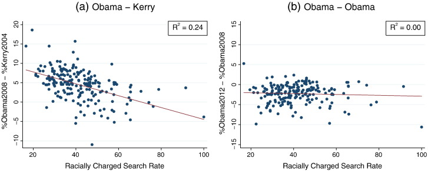

```{css, echo=FALSE}
# CSS for including pauses in printed PDF output (see bottom of lecture)
@media print {
  .has-continuation {
    display: block !important;
  }
}
```

```{r setup, include=FALSE}
# xaringanExtra::use_scribble() ## Draw on slides. Requires dev version of xaringanExtra.

options(htmltools.dir.version = FALSE)
library(knitr)
opts_chunk$set(
  fig.align="center",  
  fig.height=4, #fig.width=6,
  # out.width="748px", #out.length="520.75px",
  dpi=300, #fig.path='Figs/',
  message=FALSE,
  cache=T#, echo=F, warning=F, message=F
  )
library(tidyverse)
library(hrbrthemes)
library(fontawesome)
library(RefManageR)
theme_set(theme_minimal())
BibOptions(check.entries = FALSE,
           bib.style = "authoryear",
           style = "markdown",
           hyperlink = FALSE,
           dashed = TRUE)
#biblio <- ReadBib("../../References/References.bib", check = FALSE)
```

# Table of contents

1. [Prologue](#prologue)

2. [Worldwide Web of Data](#web-data)

3. [Examples of scraping in economics research](#examples-of-scraping-in-economics-research)

4. [Access methods](#access-methods)
  - [Click and Download](#click-and-download)
  - [Server-side scraping](#server-side-scraping)
  - [Client-side scraping](#client-side-scraping)

6. [Ethics of web scraping](#ethics-of-web-scraping)

---
class: inverse, center, middle
name: prologue

# Prologue

<html><div style='float:left'></div><hr color='#EB811B' size=1px width=796px></html>

---
# Check-in

- I graded Part IV of problem sets
  - Knit, knit, knit, knit, knit your R Markdown submission: ensures your code runs
  - New policy for PS submission: full points for pushing with GitHub, 10 points off if you upload a zip file

- Tip on debugging: just because R writes something in red text, it doesn't mean it's an error
  - Confirm a bug is a bug before you go down the rabbit hole

- GitHub message: "This branch is .hi-blue[2 commits ahead of, 2 commits behind] `big-data-and-economics/ps1-employment-discrimination:main.`"
  - This is not (necessarily) a bug. Can anyone explain what it means

- Ask and answer questions on GitHub issues: part of your grade is using it

- Final project annotated summaries were due yesterday. Thoughts?

- Data description has been punted to be due after winter break (nothing is stopping you from doing it sooner though)

---
# Prologue

- We've spent the first month of this class on learning: 
  - empirical organization skills ("Clean Code"), 
  - basics of R
  - basics of data wrangling and tidy data

- Now we're going to learn about a data acquisition skill: **scraping**

- Essentially, we're going to learn how to get data from the web

- These data are usually messy in one way or another, so it'll give you something to tidy

---
# Plan for today

- What is scraping? 

- Contrast Client-side and Server-side scraping

- Examples of scraping in economics research

- Ethical considerations

- Learn by doing with APIs (CSS will happen later -- potentially end of semester)

---
# Attribution

- These slides take inspiration from the following sources:

  - [Nathan Schiff's web data lecture](https://nathanschiff.com/wp-content/uploads/2017/02/web_data_lecture.pdf)

  - [Andrew MacDonald's slides](https://stat545.com/supporting-docs/webdata01_slides.html#1)

  - [Jenny Bryan's textbook](https://stat545.com/web-data-slides.html)

  - [Grant McDermott's notes on CSS](https://raw.githack.com/uo-ec607/lectures/master/06-web-css/06-web-css.html) and [APIs](https://raw.githack.com/uo-ec607/lectures/master/07-web-apis/07-web-apis.html)

  - [James Densmore's stance on ethics](https://towardsdatascience.com/ethics-in-web-scraping-b96b18136f01)

---
class: inverse, center, middle
name: web-data

# Worldwide Web of Data

<html><div style='float:left'></div><hr color='#EB811B' size=1px width=796px></html>

---
# Worldwide Web of Data

- Every website you visit is packed with data

- Every app on your phone is packed with data and taking data from you

- Guess what? 

--

  - These data often measure hard to measure things
  - These data are often public (at some level of aggregation/anonymity)
  - These data are often not easily accessibe and not **tidy**
  - Samples might be biased (have to navigate that)
  - This is legal (usually) and ethical (usually)

- Guess what? All this makes these data (and knowing how to access it) valuable 

  - It also makes this a hard skill to pick up

---
class: inverse, center, middle
name: examples-of-scraping-in-economics-research

# Examples of scraping in economics research

---
# What cool things can you do with web data?

- Can anyone think of examples of web data being used in economics research?

---
# Measuring hard to measure things

- Imagine you survey a ton of people about their beliefs that a candidate is unfit to be president because of their race

- Due to social desirability bias, you get a lot of "I don't know" or "I don't think that"

- There are lots of creative survey methods to get at this, but is there some way to measure this without asking people? 

- Say, why not find out the frequency that people search Google for racial epithets in connection to the candidate?

- Guess what? Stephens-Davidowitz (2014) did just that
  - Finds racial animus cost Barack Obama 4 percentage points in the 2008 election (equivalent of a home-state advantage)
  - Google search term data yield effects that are 1.5 to 3 times larger than survey estimates of racial animus

<!-- $y=\beta_0 + \beta_1 \text{Racially Charged Search Rate} + \epsilon$ -->
$\text{Racially Charged Search Rate}_j =\left[\frac{\text{Google searches including the word "Word 1 (s)"}}{\text{Total Google searches}}\right]_{j, 2004-2007}$

for $j$ geographical area (state, county, etc.)

---
# Racial Animus Map

<div align="center">

</div>

Map of media markets by racially charged search rate from 2004 to 2007. The darker red, the more racially charged.

---
# Election performance

<div align="center">

</div>

Obama underperformed Kerry in areas with more racially charged search rates. 

---
# Other uses

- "Billion prices project" (Cavallo and Rigobon 2015) : collect prices from online retailers to look at macro price changes

- Davis and Dingell (2016): use Yelp to explore racial segregation in consumption

- Halket and Pginatti (2015): scrape Craiglists to look at housing markets

- Wu (2018): undergraduate hacked into online economics job market forum to look at toxic language and biases in the academic economics against women

- Glaeser (2018) uses Yelp data to quantify how neighborhood business activity changes as areas gentrify (**Student presentation**)

- Tons leverage eBay, Alibaba, etc. to look at all kinds of commercial activity

- Edelman B (2012) gives an overview of using internet data for economic research

---
class: inverse, center, middle
name: access-methods

# Access methods

---
# Access methods

There are three ways to data off the web:

1. **click-and-download** on the internet as a "flat" file, like a CSV or Excel file
  - What you're used to

2. **Server-side** websites that sends HTML and JavaScript to your browser, which then renders the page
  - People often call this "scraping"
  - All the data is there, but not in a tidy format
  - **Key concepts**: CSS, Xpath, HTML

3. **Client-side**_ websites contain an empty template that _request_ data from a server and then fills in the template with the data 
  - The request is sent to an API (application programming interface) endpoint
  - Technically you can just source right from the API endpoint (if you can find it) and skip the website altogether
  - I consider this a form of scraping
  - **Key concepts**: APIs, API endpoints

- Key takeaway: if there's a structure to how the data is presented, you can exploit it to get the data

---
name: click-and-download
# Click and Download

- You've all seen this approach before

- You go to a website, click a link, and download a file

- Sometimes you need to login first, but if not you can automate this with R's `download.file()` function

- Below will download the Occupational Employment and Wage Statistics (OEWS) data for Massachusetts in 2021 from the BLS

```{r download-file,eval=FALSE}
download.file("https://www.bls.gov/oes/special.requests/oesm21ma.zip", "oesm21ma.zip")
```

---
name: client-side-scraping
# Client-side scraping

- The website contains an empty template of HTML and CSS.
  - E.g. It might contain a “skeleton” table without any values.
- However, when we actually visit the page URL, our browser sends a request to the host server.
- If everything is okay (e.g. our request is valid), then the server sends a response script, which our browser executes and uses to populate the HTML template with the specific information that we want.
- **Webscraping challenges:** Finding the “API endpoints” can be tricky, since these are sometimes hidden from view.
- **Key concepts:** APIs, API endpoints

---
# APIs 

- [Zapier](https://zapier.com/resources/guides/apis) offers a fantastic intro to APIs

- APIs is a collection of rules/methods that allow one software application to interact with another

- Examples include:
  - Web servers and web browsers
  - R libraries and R clients
  - Databases and R clients
  - Git and GitHub and so on

---
# Key API concepts

- **Server:** A powerful computer that runs an API.
- **Client:** A program that exchanges data with a server through an API.
- **Protocol:** The “etiquette” underlying how computers talk to each other (e.g. HTTP).
- **Methods:** The “verbs” that clients use to talk with a server. The main one that we’ll be using is GET (i.e. ask a server to retrieve information), but other common methods are POST, PUT and DELETE.
- **Requests:** What the client asks of the server (see Methods above).
- **Response:** The server’s response. This includes a Status Code (e.g. “404” if not found, or “200” if successful), a Header (i.e. meta-information about the reponse), and a Body (i.e the actual content that we’re interested in).

---
# API Endponts

- Web APIs have a URL called an **API Endpoint** that you can use to access view the data in your web browser

- Except instead of rendering a beautifully-formatted webpage, the server sends back a ton of messy text! 
  - Either a JSON (JavaScript object notation) or XML (eXtensible Markup Language) file

- It'd be pretty overwhelming to learn how to navigate these new language syntaxes

- Guess what? R has packages to help you with that
  - `jsonlite` for JSON
  - `xml2` for XML

- Today we're going to work through a few of these

- That means the hardest parts are: 
  - Finding the API endpoint
  - Understanding the rules
  - Identify the words you need to use to get the data you want

- To be clear, that's all still tricky! 

---
# You've likely used FRED before

<div style="display: flex; justify-content: center;">
  <iframe src="https://fred.stlouisfed.org/graph/graph-landing.php?g=yo2J&width=670&height=475" scrolling="no" frameborder="0" style="overflow:hidden; width:670px; height:525px;" allowTransparency="true" loading="lazy"  data-external="1"></iframe>
</div>
---
# Underneath is an API!

- The endpoint is https://api.stlouisfed.org/fred/series/observations?series_id=GNPCA&api_key=YOUR_API_KEY&file_type=json
- Just sub in your API key and you're good to go

.scroll-box-16[
```json
{"realtime_start":"2024-02-03","realtime_end":"2024-02-03","observation_start":"1600-01-01","observation_end":"9999-12-31","units":"lin","output_type":1,"file_type":"json","order_by":"observation_date","sort_order":"asc","count":94,"offset":0,"limit":100000,"observations":
[{"realtime_start":"2024-02-03","realtime_end":"2024-02-03","date":"1929-01-01","value":"1202.659"},
{"realtime_start":"2024-02-03","realtime_end":"2024-02-03","date":"1930-01-01","value":"1100.67"},
{"realtime_start":"2024-02-03","realtime_end":"2024-02-03","date":"1931-01-01","value":"1029.038"},
{"realtime_start":"2024-02-03","realtime_end":"2024-02-03","date":"1932-01-01","value":"895.802"},
{"realtime_start":"2024-02-03","realtime_end":"2024-02-03","date":"1933-01-01","value":"883.847"},
{"realtime_start":"2024-02-03","realtime_end":"2024-02-03","date":"1934-01-01","value":"978.188"},
{"realtime_start":"2024-02-03","realtime_end":"2024-02-03","date":"1935-01-01","value":"1065.716"},
{"realtime_start":"2024-02-03","realtime_end":"2024-02-03","date":"1936-01-01","value":"1201.443"},
{"realtime_start":"2024-02-03","realtime_end":"2024-02-03","date":"1937-01-01","value":"1264.393"},
{"realtime_start":"2024-02-03","realtime_end":"2024-02-03","date":"1938-01-01","value":"1222.966"},
{"realtime_start":"2024-02-03","realtime_end":"2024-02-03","date":"1939-01-01","value":"1320.924"},
{"realtime_start":"2024-02-03","realtime_end":"2024-02-03","date":"1940-01-01","value":"1435.656"},
{"realtime_start":"2024-02-03","realtime_end":"2024-02-03","date":"1941-01-01","value":"1690.844"},
{"realtime_start":"2024-02-03","realtime_end":"2024-02-03","date":"1942-01-01","value":"2008.853"},
{"realtime_start":"2024-02-03","realtime_end":"2024-02-03","date":"1943-01-01","value":"2349.125"},
{"realtime_start":"2024-02-03","realtime_end":"2024-02-03","date":"1944-01-01","value":"2535.744"},
{"realtime_start":"2024-02-03","realtime_end":"2024-02-03","date":"1945-01-01","value":"2509.982"},
{"realtime_start":"2024-02-03","realtime_end":"2024-02-03","date":"1946-01-01","value":"2221.51"},
{"realtime_start":"2024-02-03","realtime_end":"2024-02-03","date":"1947-01-01","value":"2199.313"},
{"realtime_start":"2024-02-03","realtime_end":"2024-02-03","date":"1948-01-01","value":"2291.804"},
{"realtime_start":"2024-02-03","realtime_end":"2024-02-03","date":"1949-01-01","value":"2277.883"},
{"realtime_start":"2024-02-03","realtime_end":"2024-02-03","date":"1950-01-01","value":"2476.097"},
{"realtime_start":"2024-02-03","realtime_end":"2024-02-03","date":"1951-01-01","value":"2677.414"},
{"realtime_start":"2024-02-03","realtime_end":"2024-02-03","date":"1952-01-01","value":"2786.602"},
{"realtime_start":"2024-02-03","realtime_end":"2024-02-03","date":"1953-01-01","value":"2915.598"},
{"realtime_start":"2024-02-03","realtime_end":"2024-02-03","date":"1954-01-01","value":"2900.038"},
{"realtime_start":"2024-02-03","realtime_end":"2024-02-03","date":"1955-01-01","value":"3107.796"},
{"realtime_start":"2024-02-03","realtime_end":"2024-02-03","date":"1956-01-01","value":"3175.622"},
{"realtime_start":"2024-02-03","realtime_end":"2024-02-03","date":"1957-01-01","value":"3243.263"},
{"realtime_start":"2024-02-03","realtime_end":"2024-02-03","date":"1958-01-01","value":"3215.954"},
{"realtime_start":"2024-02-03","realtime_end":"2024-02-03","date":"1959-01-01","value":"3438.007"},
{"realtime_start":"2024-02-03","realtime_end":"2024-02-03","date":"1960-01-01","value":"3527.996"},
{"realtime_start":"2024-02-03","realtime_end":"2024-02-03","date":"1961-01-01","value":"3620.292"},
{"realtime_start":"2024-02-03","realtime_end":"2024-02-03","date":"1962-01-01","value":"3843.844"},
{"realtime_start":"2024-02-03","realtime_end":"2024-02-03","date":"1963-01-01","value":"4012.113"},
{"realtime_start":"2024-02-03","realtime_end":"2024-02-03","date":"1964-01-01","value":"4243.962"},
{"realtime_start":"2024-02-03","realtime_end":"2024-02-03","date":"1965-01-01","value":"4519.102"},
{"realtime_start":"2024-02-03","realtime_end":"2024-02-03","date":"1966-01-01","value":"4812.8"},
{"realtime_start":"2024-02-03","realtime_end":"2024-02-03","date":"1967-01-01","value":"4944.919"},
{"realtime_start":"2024-02-03","realtime_end":"2024-02-03","date":"1968-01-01","value":"5188.802"},
{"realtime_start":"2024-02-03","realtime_end":"2024-02-03","date":"1969-01-01","value":"5348.589"},
{"realtime_start":"2024-02-03","realtime_end":"2024-02-03","date":"1970-01-01","value":"5358.035"},
{"realtime_start":"2024-02-03","realtime_end":"2024-02-03","date":"1971-01-01","value":"5537.202"},
{"realtime_start":"2024-02-03","realtime_end":"2024-02-03","date":"1972-01-01","value":"5829.057"},
{"realtime_start":"2024-02-03","realtime_end":"2024-02-03","date":"1973-01-01","value":"6170.549"},
{"realtime_start":"2024-02-03","realtime_end":"2024-02-03","date":"1974-01-01","value":"6145.506"},
{"realtime_start":"2024-02-03","realtime_end":"2024-02-03","date":"1975-01-01","value":"6118.231"},
{"realtime_start":"2024-02-03","realtime_end":"2024-02-03","date":"1976-01-01","value":"6454.905"},
{"realtime_start":"2024-02-03","realtime_end":"2024-02-03","date":"1977-01-01","value":"6758.055"},
{"realtime_start":"2024-02-03","realtime_end":"2024-02-03","date":"1978-01-01","value":"7127.776"},
{"realtime_start":"2024-02-03","realtime_end":"2024-02-03","date":"1979-01-01","value":"7375.014"},
{"realtime_start":"2024-02-03","realtime_end":"2024-02-03","date":"1980-01-01","value":"7355.39"},
{"realtime_start":"2024-02-03","realtime_end":"2024-02-03","date":"1981-01-01","value":"7528.705"},
{"realtime_start":"2024-02-03","realtime_end":"2024-02-03","date":"1982-01-01","value":"7397.849"},
{"realtime_start":"2024-02-03","realtime_end":"2024-02-03","date":"1983-01-01","value":"7730.794"},
{"realtime_start":"2024-02-03","realtime_end":"2024-02-03","date":"1984-01-01","value":"8280.163"},
{"realtime_start":"2024-02-03","realtime_end":"2024-02-03","date":"1985-01-01","value":"8598.506"},
{"realtime_start":"2024-02-03","realtime_end":"2024-02-03","date":"1986-01-01","value":"8876.436"},
{"realtime_start":"2024-02-03","realtime_end":"2024-02-03","date":"1987-01-01","value":"9179.633"},
{"realtime_start":"2024-02-03","realtime_end":"2024-02-03","date":"1988-01-01","value":"9569.566"},
{"realtime_start":"2024-02-03","realtime_end":"2024-02-03","date":"1989-01-01","value":"9920.542"},
{"realtime_start":"2024-02-03","realtime_end":"2024-02-03","date":"1990-01-01","value":"10120.114"},
{"realtime_start":"2024-02-03","realtime_end":"2024-02-03","date":"1991-01-01","value":"10100.371"},
{"realtime_start":"2024-02-03","realtime_end":"2024-02-03","date":"1992-01-01","value":"10452.604"},
{"realtime_start":"2024-02-03","realtime_end":"2024-02-03","date":"1993-01-01","value":"10738.246"},
{"realtime_start":"2024-02-03","realtime_end":"2024-02-03","date":"1994-01-01","value":"11155.769"},
{"realtime_start":"2024-02-03","realtime_end":"2024-02-03","date":"1995-01-01","value":"11459.835"},
{"realtime_start":"2024-02-03","realtime_end":"2024-02-03","date":"1996-01-01","value":"11893.706"},
{"realtime_start":"2024-02-03","realtime_end":"2024-02-03","date":"1997-01-01","value":"12408.947"},
{"realtime_start":"2024-02-03","realtime_end":"2024-02-03","date":"1998-01-01","value":"12954.457"},
{"realtime_start":"2024-02-03","realtime_end":"2024-02-03","date":"1999-01-01","value":"13583.582"},
{"realtime_start":"2024-02-03","realtime_end":"2024-02-03","date":"2000-01-01","value":"14144.962"},
{"realtime_start":"2024-02-03","realtime_end":"2024-02-03","date":"2001-01-01","value":"14294.624"},
{"realtime_start":"2024-02-03","realtime_end":"2024-02-03","date":"2002-01-01","value":"14529.585"},
{"realtime_start":"2024-02-03","realtime_end":"2024-02-03","date":"2003-01-01","value":"14949.293"},
{"realtime_start":"2024-02-03","realtime_end":"2024-02-03","date":"2004-01-01","value":"15542.707"},
{"realtime_start":"2024-02-03","realtime_end":"2024-02-03","date":"2005-01-01","value":"16075.089"},
{"realtime_start":"2024-02-03","realtime_end":"2024-02-03","date":"2006-01-01","value":"16483.539"},
{"realtime_start":"2024-02-03","realtime_end":"2024-02-03","date":"2007-01-01","value":"16867.78"},
{"realtime_start":"2024-02-03","realtime_end":"2024-02-03","date":"2008-01-01","value":"16940.097"},
{"realtime_start":"2024-02-03","realtime_end":"2024-02-03","date":"2009-01-01","value":"16514.062"},
{"realtime_start":"2024-02-03","realtime_end":"2024-02-03","date":"2010-01-01","value":"17013.917"},
{"realtime_start":"2024-02-03","realtime_end":"2024-02-03","date":"2011-01-01","value":"17306.204"},
{"realtime_start":"2024-02-03","realtime_end":"2024-02-03","date":"2012-01-01","value":"17686.281"},
{"realtime_start":"2024-02-03","realtime_end":"2024-02-03","date":"2013-01-01","value":"18049.236"},
{"realtime_start":"2024-02-03","realtime_end":"2024-02-03","date":"2014-01-01","value":"18499.72"},
{"realtime_start":"2024-02-03","realtime_end":"2024-02-03","date":"2015-01-01","value":"19021.225"},
{"realtime_start":"2024-02-03","realtime_end":"2024-02-03","date":"2016-01-01","value":"19372.908"},
{"realtime_start":"2024-02-03","realtime_end":"2024-02-03","date":"2017-01-01","value":"19905.052"},
{"realtime_start":"2024-02-03","realtime_end":"2024-02-03","date":"2018-01-01","value":"20490.925"},
{"realtime_start":"2024-02-03","realtime_end":"2024-02-03","date":"2019-01-01","value":"20977.326"},
{"realtime_start":"2024-02-03","realtime_end":"2024-02-03","date":"2020-01-01","value":"20451.945"},
{"realtime_start":"2024-02-03","realtime_end":"2024-02-03","date":"2021-01-01","value":"21590.414"},
{"realtime_start":"2024-02-03","realtime_end":"2024-02-03","date":"2022-01-01","value":"21992.687"}]}
```
]

---
# What did I need to know? 

- The base URL: https://api.stlouisfed.org/
- The API endpoint (fred/series/observations/)
- The parameters:
  - series_id="GNPCA"
  - api_key=YOUR_API_KEY
  - file_type=json

- What's an API Key? It is a unique identifier that is used to authenticate a user, developer, or calling program to an API.
  - It's like a password, but it's not a password
  - It tracks who is using the API and how much they're using it
  - Example: `asdfjaw523a3523414at43sad`

---
# Hide your API Key

- In general, you don't want to share your API key with anyone

- Instead, you can make it an environment variable either for a single session or permanently

```{r set_renviron_current}
Sys.setenv(FRED_API_KEY_TEST="abcdefghijklmnopqrstuvwxyz0123456789") 
FRED_API_KEY_TEST = Sys.getenv("FRED_API_KEY_TEST")
FRED_API_KEY_TEST
```

- You can also permanently add it to your `.Renviron` file, by running the `edit_r_environ()` function from the **usethis** package

```{r edit_r_environ, eval = F}
usethis::edit_r_environ() 
```

- Then just type in `FRED_API_KEY_TEST=abcdefghijklmnopqrstuvwxyz0123456789` and save the file and re-read using 

```{r readRenviron, eval = F}
readRenviron("~/.Renviron") 
```

- Any time you need it, you can just call `Sys.getenv("FRED_API_KEY_TEST")`

---
# Popular APIs

- Many popular APIs are free to use and have a lot of documentation

- Sometimes the documentation gets a bit cumbersome though

- So kind souls have developed R packages to help you "abstract" these details (**Clean Code**)

- For example, the `tidycensus` package is a wrapper for the US Census API
  - You'll use it on your problem set

- Others include: `fredr`, `blsAPI`, `rgithub`, `googlesheets4`, `googledrive`, `wikipediR`, etc.

- Here's a curated list: https://github.com/RomanTsegelskyi/r-api-wrappers

---
# Hidden APIs

- Sometimes the API endpoint is hidden from view

- But you can find it by using the "Inspect" tool in your browser

- It will require some detective work! 

- But if you pull it off, you can get data that no one else has

---
name: server-side-scraping
# Server-side scraping

- The scripts that “build” the website are not run on our computer, but rather on a host server that sends down all of the HTML code.
  - E.g. Wikipedia tables are already populated with all of the information — numbers, dates, etc. — that we see in our browser.

- In other words, the information that we see in our browser has already been processed by the host server.

- You can think of this information being embedded directly in the webpage’s HTML.
  - So if we can get our hands on the HTML, we can get our hands on the data.
  - We just have to figure out how to strip off the HTML and get the data into a tidy format.

- **Webscraping challenges:** Finding the correct CSS (or Xpath) “selectors”. Iterating through dynamic webpages (e.g. “Next page” and “Show More” tabs).

- **Key concepts:** CSS, Xpath, HTML

- **R package**: `rvest` has a suite of functions to help convert HTML to a tidy format

---
# Underneath Wikipedia

<div align="center">

</div>

---
# The HTML source

- If we can just cut out all the HTML and get the data into a tidy format, we're golden
- Better yet, we can use some of the HTML to help us find ha**rvest** the data we want

```html
<caption>List of men's Olympic records in athletics
</caption>
<tbody><tr>
<th scope="col" width="12%">Event
</th>
<th class="unsortable" width="5%">Record
</th>
<th scope="col" width="10%">Athlete(s)
</th>
<th scope="col" width="15%">Nation
</th>
<th scope="col" width="10%">Games
</th>
<th scope="col" width="5%">Date
</th>
<th scope="col" class="unsortable" width="3%">Ref(s)
</th></tr>
<tr>
<th scope="row"><span data-sort-value="00100&#160;!"><a href="/wiki/100_metres" title="100 metres">100 metres</a></span>
</th>
<td align="right">9.63&#160;
</td>
<td><span data-sort-value="Bolt, Usain"><span class="vcard"><span class="fn"><a href="/wiki/Usain_Bolt" title="Usain Bolt">Usain Bolt</a></span></span></span>
</td>
<td><span class="mw-image-border" typeof="mw:File"><span></span></span>&#160;<a href="/wiki/Jamaica_at_the_2012_Summer_Olympics" title="Jamaica at the 2012 Summer Olympics">Jamaica</a>&#160;<span style="font-size:90%;">(JAM)</span>
</td>
<td><span data-sort-value="2012&#160;!"><a href="/wiki/Athletics_at_the_2012_Summer_Olympics_%E2%80%93_Men%27s_100_metres" title="Athletics at the 2012 Summer Olympics – Men&#39;s 100 metres">2012 London</a></span>
</td>
<td><span data-sort-value="000000002012-08-05-0000" style="white-space:nowrap">August 5, 2012</span>
</td>
<td align="center"><sup id="cite_ref-9" class="reference"><a href="#cite_note-9">&#91;9&#93;</a></sup>
</td></tr>
```

---
# Stability and CSS scraping

- Websites change over time 

- That can break your scraping code

- This makes scraping as much of an "art" as it is a science

---
class: inverse, center, middle
name: ethics-of-web-scraping

# Ethics of web scraping

<html><div style='float:left'></div><hr color='#EB811B' size=1px width=796px></html>

---
# Legality of web scraping

- All of today is about how to get data off the web

- If you can see it in a browser window and work out its structure, you can scrape it

- And the legal restrictions are pretty obscure, fuzzy, and ripe for reform
  - hiQ Labs vs LinkedIn court ruling defended hiQ's right to scrape, then the Supreme Court vacated the ruling, and the final decision was against HiQ Labs
  - The Computer Fraud and Abuse Act (CFFA) protects the scraping of publicly available data
  - Legality gets messy around personal data and intellectual property (for good reason, but again reform is needed)

---
# Ethics of web scraping

- Technically, web scraping just automates what you (or a team of **well**-compensated RAs) could do manually
  - It's just a lot faster and more efficient (no offense)

- Webscraping is an integral tool to modern investigative journalism
  - Sometimes companies hide things in their HTML that they don't want the public to see
  - Pro Publica has developed a tool called [Upton](https://www.propublica.org/nerds/upton-a-web-scraping-framework) to make it more accessible

- So I stand firmly on the pro-scraping side with a few ethical caveats
  - Just because you can scrape it, doesn’t mean you should
  - It’s pretty easy to write up a function or program that can overwhelm a host server or application through the sheer weight of requests
  - Or, just as likely, the host server has built-in safeguards that will block you in case of a suspected malicious Denial-of-serve (DoS) attack

---
# Be nice

- Once you get over the initial hurdles, scraping is fairly easy to do (cleaning can be trickier)

- There's plenty of digital ink spilled on the [ethics of web scraping](https://towardsdatascience.com/ethics-in-web-scraping-b96b18136f01)

- The key takeaway is to be nice
  - If a public API exists, use it instead of scraping
  - Only take the data that is necessary
  - Have good reason to take data that is not intentionaly public
  - Do not repeatedly swarm a server with requests (use `Sys.sleep()` to space out requests)
  - Scrape to add value to the data, not to take value from the host server
  - Properly cite any scraped content and respect the terms of service of the website
  - Document the steps taken to scrape the data

---
# **polite** package and `robots.txt`

- Sites often have a "robot.txt," which is a file that tells you what you can and cannot scrape

- A "web crawler" should be written to start with the robots.txt and then follow the rules

- The `polite` package is a tool to help you be nice

- It explicitly checks for permissions and goes to the robots.txt of any site you visit

- As you get better at scraping and start trying to scrape at scale, you should use this

---
# Conclusion

- Web content can be rendered either 1) server-side or 2) client-side.

- Client-side content is often rendered using an API endpoint, which is a URL that you can use to access the data directly.
  - APIs are a set of rules/methods that allow one software application to interact with another they often require an access token
  - You can use R packages (**httr**, **xml2** **jsonlite**) to access these endpoints and tidy the data.
  - Popular APIs have packages in R or other software that streamline access

- Server-side content is often rendered using HTML and CSS.
  - Use the **rvest** package to read the HTML document into R and then parse the relevant nodes.
  - A typical workflow is: read_html(URL) %>% html_elements(CSS_SELECTORS) %>% html_table().
  - You might need other functions depending on the content type (e.g. html_text).

- Just because you can scrape something doesn’t mean you should (i.e. ethical and possibly legal considerations).
- Webscraping involves as much art as it does science. Be prepared to do a lot of experimenting and data cleaning.

---
class: inverse, center, middle

# Next: Onto scraping and API activities! 
<html><div style='float:left'></div><hr color='#EB811B' size=1px width=796px></html>

```{r gen_pdf, include = FALSE, cache = FALSE, eval = TRUE}
infile = list.files(pattern = '.html')
pagedown::chrome_print(input = infile, timeout = 100)
```

