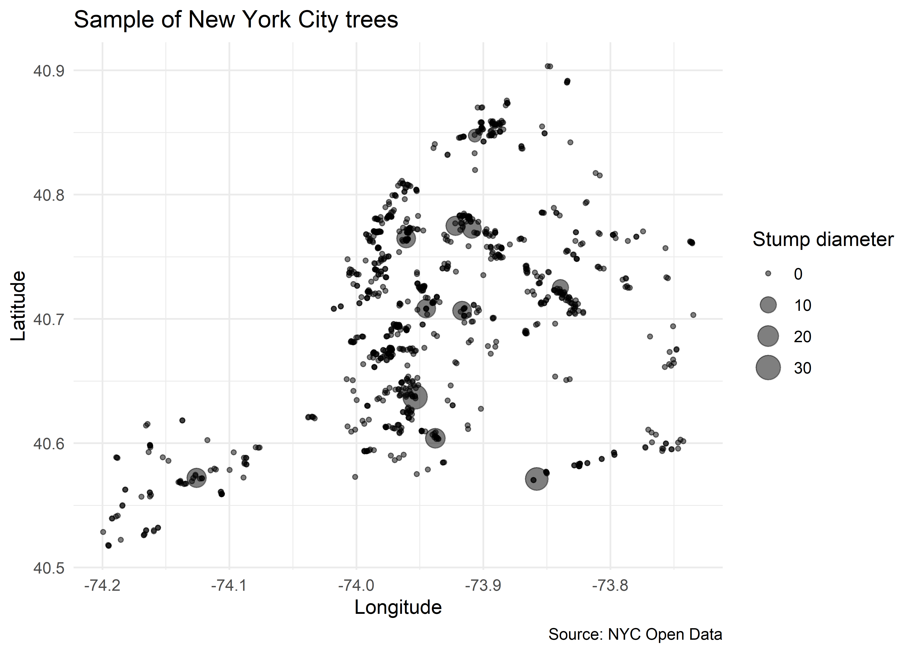
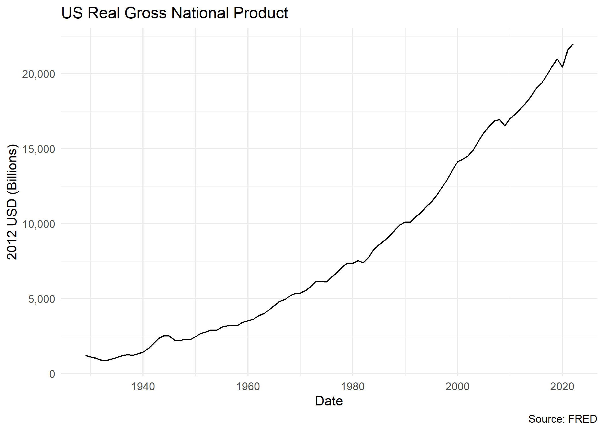
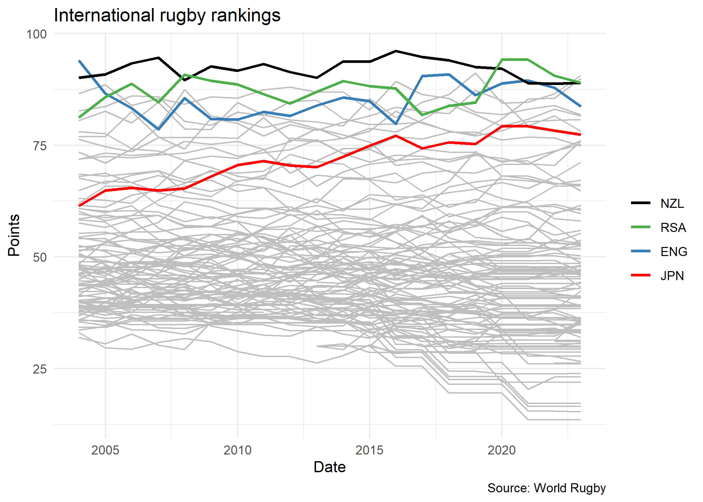

## Sign-up and software requirements

### Sign-up

We're going to be downloading economic data from the FRED API. This will require that you first [create a user account](https://research.stlouisfed.org/useraccount/apikey) and then [register a personal API key](https://research.stlouisfed.org/useraccount/apikey).

### External software

Today I'll be using [JSONView](https://jsonview.com/), a browser extension that renders JSON output nicely in Chrome and Firefox. (Not required, but recommended.)

### R packages 

- New: **jsonlite**, **httr**, **listviewer**, **usethis**, **fredr**, **tidycensus**
- Already used: **tidyverse**, **lubridate**, **hrbrthemes**, **janitor**

As a note, **httr2** is a newer version of **httr** that is currently in development. It is recommended to use it, but I'm sticking with **httr** for now since it has fewer bells and whistles to teach. I'll probably switch to **httr2** in the next iteration of this course once the package is more stable.

Here's a convenient way to install (if necessary) and load all of the above packages.


```r
## Load and install the packages that we'll be using today
if (!require("pacman")) install.packages("pacman")
pacman::p_load(tidyverse, httr, lubridate, hrbrthemes, janitor, jsonlite, fredr, 
               listviewer, usethis, tidycensus)
## My preferred ggplot2 plotting theme (optional)
theme_set(theme_minimal())
```

## Recap from last time

During the last lecture, we saw that websites and web applications fall into two categories: 1) Server-side and 2) Client-side. We then practiced scraping data that falls into the first category --- i.e. rendered server-side --- using the **rvest** package. This technique focuses on CSS selectors (with help from [SelectorGadget](http://selectorgadget.com/)) and HTML tags. We also saw that webscraping often involves as much art as science. The plethora of CSS options and the flexibility of HTML itself means that steps which work perfectly well on one website can easily fail on another website.

Today we focus on the second category: Scraping web data that is rendered **client-side**. The good news is that, when available, this approach typically makes it much easier to scrape data from the web. The downside is that, again, it can involve as much art as it does science. Moreover, as I emphasised last time, just because because we *can* scrape data, doesn't mean that we *should* (i.e. ethical, legal and other considerations). These admonishments aside, let's proceed...

## Client-side, APIs, and API endpoints

Recall that websites or applications that are built using a **client-side** framework typically involve something like the following steps:

- You visit a URL that contains a template of static content (HTML tables, CSS, etc.). This template itself doesn't contain any data.
- However, in the process of opening the URL, your browser sends a *request* to the host server.
- If your request if valid, then the server issues a *response* that fetches the necessary data for you and renders the page dynamically in your browser.
- The page that you actually see in your browser is thus a mix of static content and dynamic information that is rendered by your browser (i.e. the "client").

All of this requesting, responding and rendering takes places through the host application's **API** (or **A**pplication **P**rogram **I**nterface). Time for a student presentation to go over APIs in more depth...

### Student presentation: APIs

If you're new to APIs or reading this after the fact, then I recommend this excellent resource from Zapier: [An Introduction to APIs](https://zapier.com/learn/apis/). It's fairly in-depth, but you don't need to work through the whole thing to get the gist. The summary version is that an API is really just a collection of rules and methods that allow different software applications to interact and share information. This includes not only web servers and browsers, but also software packages like the R libraries we've been using.^[Fun fact: A number of R packages that we'll be using later in this course (e.g. **leaflet**, **plotly**, etc.) are really just a set of wrapper functions that interact with the underlying APIs and convert your R code into some other language (e.g. JavaScript).] Key concepts include:

- **Server:** A powerful computer that runs an API.
- **Client:** A program that exchanges data with a server through an API.
- **Protocol:** The "etiquette" underlying how computers talk to each other (e.g. HTTP).
- **Methods:** The "verbs" that clients use to talk with a server. The main one that we'll be using is `GET` (i.e. ask a server to retrieve information), but other common methods are `POST`, `PUT` and `DELETE`.
- **Requests:** What the client asks of the server (see Methods above).
- **Response:** The server's response. This includes a *Status Code* (e.g. "404" if not found, or "200" if successful), a *Header* (i.e. meta-information about the reponse), and a *Body* (i.e the actual content that we're interested in).
- Etc.

### A bit more about API endpoints

A key point in all of this is that, in the case of web APIs, we can access information *directly* from the API database if we can specify the correct URL(s). These URLs are known as an **API endpoints**. 

API endpoints are in many ways similar to the normal website URLs that we're all used to visiting. For starters, you can navigate to them in your web browser. However, whereas normal websites display information in rich HTML content --- pictures, cat videos, nice formatting, etc. --- an API endpoint is much less visually appealing. Navigate your browser to an API endpoint and you'll just see a load of seemingly unformatted text. In truth, what you're really seeing is (probably) either [JSON](https://en.wikipedia.org/wiki/JSON) (**J**ava**S**cript **O**bject **No**tation) or [XML](https://en.wikipedia.org/wiki/XML) (E**x**tensible **M**arkup **L**anguage). 

You don't need to worry too much about the syntax of JSON and XML. The important thing is that the object in your browser --- that load of seemingly unformatted text --- is actually very precisely structured and formatted. Moreover, it contains valuable information that we can easily read into R (or Python, Julia, etc.) We just need to know the right API endpoint for the data that we want.

Let's practice doing this through a few example applications. I'll start with the simplest case (no API key required, explicit API endpoint) and then work through some more complicated examples. 

## Application 1: Trees of New York City

[NYC Open Data](https://opendata.cityofnewyork.us/) is a pretty amazing initiative. Its mission is to "make the wealth of public data generated by various New York City agencies and other City organizations available for public use". You can get data on everything from arrest data, to the location of wi-fi hotspots, to city job postings, to homeless population counts, to dog licenses, to a directory of toilets in public parks... The list goes on. I highly encourage you to explore in your own time, but we're going to do something "earthy" for this first application: Download a sample of tree data from the [**2015 NYC Street Tree Census**](https://data.cityofnewyork.us/Environment/2015-Street-Tree-Census-Tree-Data/uvpi-gqnh).

I wanted to begin with an example from NYC Open Data, because you don't need to set up an API key in advance.^[Truth be told: To avoid rate limits --- i.e. throttling the number of requests that you can make per hour --- it's best to [sign up](https://data.cityofnewyork.us/profile/app_tokens) for an NYC Open Data app token. We're only going to make one or two requests here, though so we should be fine.] All you need to do is complete the following steps:

- Open the [web page](https://data.cityofnewyork.us/Environment/2015-Street-Tree-Census-Tree-Data/uvpi-gqnh) in your browser (if you haven't already done so). 
- You should immediately see the **API** tab. Click on it. 
- Copy the [API endpoint](https://data.cityofnewyork.us/resource/nwxe-4ae8.json) that appears in the popup box. 
- *Optional:* Paste that endpoint into a new tab in your browser. You'll see a bunch of JSON text, which you can render nicely using the JSONView browser extension that we installed earlier.

Here's a GIF of me completing these steps:


Now that we've located the API endpoint, let's read the data into R. We'll do so using the `fromJSON()` function from the excellent **jsonlite** package ([link](https://cran.r-project.org/web/packages/jsonlite/index.html)). This will automatically coerce the JSON array into a regular R data frame. However, I'll go that little bit further and convert it into a tibble, since the output is nicer to work with.


```r
# library(jsonlite) ## Already loaded

nyc_trees = 
  fromJSON("https://data.cityofnewyork.us/resource/nwxe-4ae8.json") %>%
  as_tibble()
nyc_trees
```

```
## # A tibble: 1,000 × 45
##    tree_id block_id created_at        tree_dbh stump_diam curb_loc status health
##    <chr>   <chr>    <chr>             <chr>    <chr>      <chr>    <chr>  <chr> 
##  1 180683  348711   2015-08-27T00:00… 3        0          OnCurb   Alive  Fair  
##  2 200540  315986   2015-09-03T00:00… 21       0          OnCurb   Alive  Fair  
##  3 204026  218365   2015-09-05T00:00… 3        0          OnCurb   Alive  Good  
##  4 204337  217969   2015-09-05T00:00… 10       0          OnCurb   Alive  Good  
##  5 189565  223043   2015-08-30T00:00… 21       0          OnCurb   Alive  Good  
##  6 190422  106099   2015-08-30T00:00… 11       0          OnCurb   Alive  Good  
##  7 190426  106099   2015-08-30T00:00… 11       0          OnCurb   Alive  Good  
##  8 208649  103940   2015-09-07T00:00… 9        0          OnCurb   Alive  Good  
##  9 209610  407443   2015-09-08T00:00… 6        0          OnCurb   Alive  Good  
## 10 192755  207508   2015-08-31T00:00… 21       0          OffsetF… Alive  Fair  
## # ℹ 990 more rows
## # ℹ 37 more variables: spc_latin <chr>, spc_common <chr>, steward <chr>,
## #   guards <chr>, sidewalk <chr>, user_type <chr>, problems <chr>,
## #   root_stone <chr>, root_grate <chr>, root_other <chr>, trunk_wire <chr>,
## #   trnk_light <chr>, trnk_other <chr>, brch_light <chr>, brch_shoe <chr>,
## #   brch_other <chr>, address <chr>, zipcode <chr>, zip_city <chr>,
## #   cb_num <chr>, borocode <chr>, boroname <chr>, cncldist <chr>, …
```

**Aside on limits:** Note that the full census dataset contains nearly 700,000 individual trees. However, we only downloaded a tiny sample of that, since the API defaults to a limit of 1,000 rows. I don't care to access the full dataset here, since I just want to illustrate some basic concepts. Nonetheless, if you were so inclined and [read the docs](https://dev.socrata.com/docs/queries/limit.html), you'd see that you can override this default by adding `?$limit=LIMIT` to the API endpoint. For example, to read in only the first five rows, you could use:


```r
## Not run
fromJSON("https://data.cityofnewyork.us/resource/nwxe-4ae8.json?$limit=5")
```

Getting back on track, let's plot our tree data just to show it worked. One minor thing I want to point out is that `jsonlite::fromJSON()` automatically coerces everything into a character, so we'll also need to convert some columns to numeric before we plot.


```r
nyc_trees %>% 
  select(longitude, latitude, stump_diam, spc_common, spc_latin, tree_id) %>% 
  mutate_at(vars(longitude:stump_diam), as.numeric) %>% 
  ggplot(aes(x=longitude, y=latitude, size=stump_diam)) + 
  geom_point(alpha=0.5) +
  scale_size_continuous(name = "Stump diameter") +
  labs(
    x = "Longitude", y = "Latitude",
    title = "Sample of New York City trees",
    caption = "Source: NYC Open Data"
    )
```

<!-- -->

Not too bad. This would probably be more fun / impressive with an actual map of New York behind it. We'll save that for the spatial lecture that's coming up later in the course, though.

Again, I want to remind you that our  first application didn't require prior registration on the Open Data NYC website, or creation of an API key. This is atypical. Most API interfaces will only let you access and download data after you have registered an API key with them. This is especially true if you want to access an API linked to a federal agency or institution (Census, BEA, etc.). So let's work through an application where an API key is required...

## Application 2: FRED data

Our second application will involve downloading data from the [**FRED API**](https://research.stlouisfed.org/docs/api/fred/). You will need to [register an API key](https://research.stlouisfed.org/useraccount/apikey) if you want to follow along with my steps, so please do so first before continuing. 

As nearly every economist could tell you, [FRED](https://fred.stlouisfed.org/) is a database maintained by the Federal Reserve Bank of St Louis. You know, the one that let's you plot cool interactive charts [like this one](https://fred.stlouisfed.org/series/GNPCA#0) of US GNP since 1929.

<iframe src="https://fred.stlouisfed.org/graph/graph-landing.php?g=yo2J&width=670&height=475" scrolling="no" frameborder="0" style="overflow:hidden; width:670px; height:525px;" allowTransparency="true" loading="lazy"  data-external="1"></iframe>

</br>


For this second example application, I'm going to show you how to download the data underlying the above chart using the FRED API. In fact, I'll go one better. First, I'll show you how to download it yourself, so that you get an understanding of what's happening underneath the hood. Then, I'll direct you to a package that does all of the API work for you.

### Do it yourself

As with all APIs, a good place to start is the [FRED API developer docs](https://research.stlouisfed.org/docs/api/fred/). If you read through these, you'd see that the endpoint path we're interested in is [**series/observations**](https://research.stlouisfed.org/docs/api/fred/series_observations.html). This endpoint "gets the observations or data values for an economic data series". The endpoint documentation gives a more in-depth discussion, including the various parameters that it accepts.^[Think of API *parameters* the same way that you think about function *arguments*. They are valid inputs (instructions) that modify the response to an API request.] However, the parameters that we'll be focused on here are simply:

- **file_type:** "json" (Not required, but our preferred type of output.)
- **series_id:** "GNPCA" (Required. The data series that we want.)
- **api_key:** "YOUR_API_KEY" (Required. Go and fetch/copy your key now.)

Let's combine these parameters with the endpoint path to view the data directly in our browser. Head over to [https://api.stlouisfed.org/fred/series/observations?series_id=GNPCA&api_key=<mark>YOUR_API_KEY</mark>&file_type=json](https://api.stlouisfed.org/fred/series/observations?series_id=GNPCA&api_key=YOUR_API_KEY&file_type=json), replacing "YOUR_API_KEY" with your actual key. You should see something like the following:


At this point you're probably tempted to read the JSON object directly into your R environment using the `jsonlite::readJSON()` function. And this will work. However, that's not what we're going to here. Rather, we're going to go through the **httr** package ([link](https://httr.r-lib.org/)). Why? Well, basically because **httr** comes with a variety of features that allow us to interact more flexibly and securely with web APIs. 

Let's start by defining some convenience variables such as the endpoint path and the parameters (which we'll store in a list).


```r
endpoint = "series/observations"
params = list(
  api_key= "YOUR_FRED_KEY", ## Change to your own key
  file_type="json", 
  series_id="GNPCA"
  )
```

Next, we'll use the `httr::GET()` function to request (i.e. download) the data. I'll assign this to an object called `fred`.


```r
# library(httr) ## Already loaded above

fred = 
  httr::GET(
    url = "https://api.stlouisfed.org/", ## Base URL
    path = paste0("fred/", endpoint),    ## The API endpoint
    query = params                       ## Our parameter list
    )
```

Take a second to print the `fred` object in your console. What you'll see is pretty cool; i.e. it's the actual API response, including the *Status Code* and *Content*. Something like:

```
## Response [https://api.stlouisfed.org/fred/series/observations?api_key=YOUR_API_KEY&file_type=json&series_id=GNPCA]
##   Date: 2019-02-01 00:06
##   Status: 200
##   Content-Type: application/json; charset=UTF-8
##   Size: 9.09 kB
```

To actually extract the content (i.e. data) from of this response, I'll use the `httr::content()` function. Moreover, since we know that this content is a JSON array, we can again convert it into an R object using `jsonlite::fromJSON()`.


```r
fred = 
  fred %>% 
  httr::content("text") %>% ## Extract the reponse content (i.e. text)
  jsonlite::fromJSON()      ## Convert from JSON to R object

## What type of object did we get?
typeof(fred)
```

```
## [1] "list"
```

It turns that the previous step has yielded a list object in R.^[complex nested lists are the law of the land when it comes to json information. don't worry too much about this now; just rest assured that r is well suited to handling these kinds of objects. it's one reason why r and json play so well together. we'll see more examples later in the course when we start working with programming and spatial data.] so now we need to inspect this list to better understand its structure before  extracting the information that we care about (and coerce it to a data frame.) I'd use the base `View()` function to do this in an interactive r session. but that won't work as well for these lecture notes. Instead, I'll use the `listviewer::jsonedit()` function to create an interactive widget that renders nicely in knitted r markdown documents.


```r
# View(fred) ## What I'd use in an interactive R session

## library(listviewer)        ## Already loaded
jsonedit(fred, mode = "view") ## Better for RMarkdown documents
```

```{=html}
<div class="jsonedit html-widget html-fill-item-overflow-hidden html-fill-item" id="htmlwidget-48c9e86dbd39665df362" style="width:100%;height:10%;"></div>
<script type="application/json" data-for="htmlwidget-48c9e86dbd39665df362">{"x":{"data":{"realtime_start":"2023-10-10","realtime_end":"2023-10-10","observation_start":"1600-01-01","observation_end":"9999-12-31","units":"lin","output_type":1,"file_type":"json","order_by":"observation_date","sort_order":"asc","count":94,"offset":0,"limit":100000,"observations":{"realtime_start":["2023-10-10","2023-10-10","2023-10-10","2023-10-10","2023-10-10","2023-10-10","2023-10-10","2023-10-10","2023-10-10","2023-10-10","2023-10-10","2023-10-10","2023-10-10","2023-10-10","2023-10-10","2023-10-10","2023-10-10","2023-10-10","2023-10-10","2023-10-10","2023-10-10","2023-10-10","2023-10-10","2023-10-10","2023-10-10","2023-10-10","2023-10-10","2023-10-10","2023-10-10","2023-10-10","2023-10-10","2023-10-10","2023-10-10","2023-10-10","2023-10-10","2023-10-10","2023-10-10","2023-10-10","2023-10-10","2023-10-10","2023-10-10","2023-10-10","2023-10-10","2023-10-10","2023-10-10","2023-10-10","2023-10-10","2023-10-10","2023-10-10","2023-10-10","2023-10-10","2023-10-10","2023-10-10","2023-10-10","2023-10-10","2023-10-10","2023-10-10","2023-10-10","2023-10-10","2023-10-10","2023-10-10","2023-10-10","2023-10-10","2023-10-10","2023-10-10","2023-10-10","2023-10-10","2023-10-10","2023-10-10","2023-10-10","2023-10-10","2023-10-10","2023-10-10","2023-10-10","2023-10-10","2023-10-10","2023-10-10","2023-10-10","2023-10-10","2023-10-10","2023-10-10","2023-10-10","2023-10-10","2023-10-10","2023-10-10","2023-10-10","2023-10-10","2023-10-10","2023-10-10","2023-10-10","2023-10-10","2023-10-10","2023-10-10","2023-10-10"],"realtime_end":["2023-10-10","2023-10-10","2023-10-10","2023-10-10","2023-10-10","2023-10-10","2023-10-10","2023-10-10","2023-10-10","2023-10-10","2023-10-10","2023-10-10","2023-10-10","2023-10-10","2023-10-10","2023-10-10","2023-10-10","2023-10-10","2023-10-10","2023-10-10","2023-10-10","2023-10-10","2023-10-10","2023-10-10","2023-10-10","2023-10-10","2023-10-10","2023-10-10","2023-10-10","2023-10-10","2023-10-10","2023-10-10","2023-10-10","2023-10-10","2023-10-10","2023-10-10","2023-10-10","2023-10-10","2023-10-10","2023-10-10","2023-10-10","2023-10-10","2023-10-10","2023-10-10","2023-10-10","2023-10-10","2023-10-10","2023-10-10","2023-10-10","2023-10-10","2023-10-10","2023-10-10","2023-10-10","2023-10-10","2023-10-10","2023-10-10","2023-10-10","2023-10-10","2023-10-10","2023-10-10","2023-10-10","2023-10-10","2023-10-10","2023-10-10","2023-10-10","2023-10-10","2023-10-10","2023-10-10","2023-10-10","2023-10-10","2023-10-10","2023-10-10","2023-10-10","2023-10-10","2023-10-10","2023-10-10","2023-10-10","2023-10-10","2023-10-10","2023-10-10","2023-10-10","2023-10-10","2023-10-10","2023-10-10","2023-10-10","2023-10-10","2023-10-10","2023-10-10","2023-10-10","2023-10-10","2023-10-10","2023-10-10","2023-10-10","2023-10-10"],"date":["1929-01-01","1930-01-01","1931-01-01","1932-01-01","1933-01-01","1934-01-01","1935-01-01","1936-01-01","1937-01-01","1938-01-01","1939-01-01","1940-01-01","1941-01-01","1942-01-01","1943-01-01","1944-01-01","1945-01-01","1946-01-01","1947-01-01","1948-01-01","1949-01-01","1950-01-01","1951-01-01","1952-01-01","1953-01-01","1954-01-01","1955-01-01","1956-01-01","1957-01-01","1958-01-01","1959-01-01","1960-01-01","1961-01-01","1962-01-01","1963-01-01","1964-01-01","1965-01-01","1966-01-01","1967-01-01","1968-01-01","1969-01-01","1970-01-01","1971-01-01","1972-01-01","1973-01-01","1974-01-01","1975-01-01","1976-01-01","1977-01-01","1978-01-01","1979-01-01","1980-01-01","1981-01-01","1982-01-01","1983-01-01","1984-01-01","1985-01-01","1986-01-01","1987-01-01","1988-01-01","1989-01-01","1990-01-01","1991-01-01","1992-01-01","1993-01-01","1994-01-01","1995-01-01","1996-01-01","1997-01-01","1998-01-01","1999-01-01","2000-01-01","2001-01-01","2002-01-01","2003-01-01","2004-01-01","2005-01-01","2006-01-01","2007-01-01","2008-01-01","2009-01-01","2010-01-01","2011-01-01","2012-01-01","2013-01-01","2014-01-01","2015-01-01","2016-01-01","2017-01-01","2018-01-01","2019-01-01","2020-01-01","2021-01-01","2022-01-01"],"value":["1202.659","1100.67","1029.038","895.802","883.847","978.188","1065.716","1201.443","1264.393","1222.966","1320.924","1435.656","1690.844","2008.853","2349.125","2535.744","2509.982","2221.51","2199.313","2291.804","2277.883","2476.097","2677.414","2786.602","2915.598","2900.038","3107.796","3175.622","3243.263","3215.954","3438.007","3527.996","3620.292","3843.844","4012.113","4243.962","4519.102","4812.8","4944.919","5188.802","5348.589","5358.035","5537.202","5829.057","6170.549","6145.506","6118.231","6454.905","6758.055","7127.776","7375.014","7355.39","7528.705","7397.849","7730.794","8280.163","8598.506","8876.436","9179.633","9569.566","9920.542","10120.114","10100.371","10452.604","10738.246","11155.769","11459.835","11893.706","12408.947","12954.457","13583.582","14144.962","14294.624","14529.585","14949.293","15542.707","16075.089","16483.539","16867.78","16940.097","16514.062","17013.917","17306.204","17686.281","18049.236","18499.72","19021.225","19372.908","19905.052","20490.925","20977.326","20451.945","21590.414","21992.687"]}},"options":{"mode":"view","modes":["text","tree","table"]}},"evals":[],"jsHooks":[]}</script>
```

Luckily, this particular list object isn't too complicated. We can see that what we're really interested in, is the `fred$observations` sub-element. I'll use `purrr::pluck()` to extract this element (there are various other ways to do this) and then coerce it to a tibble.


```r
fred =
  fred %>% 
  purrr::pluck("observations") %>% ## Extract the "$observations" list element
  # .$observations %>% ## I could also have used this
  # magrittr::extract("observations") %>% ## Or this
  as_tibble() ## Just for nice formatting
fred
```

```
## # A tibble: 94 × 4
##    realtime_start realtime_end date       value   
##    <chr>          <chr>        <chr>      <chr>   
##  1 2023-10-10     2023-10-10   1929-01-01 1202.659
##  2 2023-10-10     2023-10-10   1930-01-01 1100.67 
##  3 2023-10-10     2023-10-10   1931-01-01 1029.038
##  4 2023-10-10     2023-10-10   1932-01-01 895.802 
##  5 2023-10-10     2023-10-10   1933-01-01 883.847 
##  6 2023-10-10     2023-10-10   1934-01-01 978.188 
##  7 2023-10-10     2023-10-10   1935-01-01 1065.716
##  8 2023-10-10     2023-10-10   1936-01-01 1201.443
##  9 2023-10-10     2023-10-10   1937-01-01 1264.393
## 10 2023-10-10     2023-10-10   1938-01-01 1222.966
## # ℹ 84 more rows
```

Okay! We've finally got our data and are nearly ready for some plotting. Recall that `jsonlite::fromJSON()` automatically converts everything to characters, so I'll quickly change some variables to dates (using `lubridate::ymd()`) and numeric.


```r
# library(lubridate) ## Already loaded above

fred =
  fred %>%
  mutate(across(realtime_start:date, ymd)) %>%
  mutate(value = as.numeric(value)) 
```

Let's plot this sucker.


```r
fred %>%
  ggplot(aes(x=date, y=value)) +
  geom_line() +
  scale_y_continuous(labels = scales::comma) +
  labs(
    x="Date", y="2012 USD (Billions)",
    title="US Real Gross National Product", caption="Source: FRED"
    )
```

<!-- -->


### Aside: Safely store and use API keys as environment variables

In the above example, I assumed that you would just replace the "YOUR_FRED_KEY" holder text with your actual API key. This is obviously not very secure or scalable, since it means that you can't share your R script without giving away your key.^[The same is true for compiled R Markdown documents like these lecture notes.] Luckily, there's an easy way to safely store and use sensitive information like API keys or passwords: Simply save them as an R [**environment variables**](https://stat.ethz.ch/R-manual/R-devel/library/base/html/EnvVar.html). There are two, closely related approaches:

1. Set an environment variable for the current R session only.
2. Set an environment variable that persists across R sessions.

Let's briefly review each in turn.

#### 1) Set an environment variable for the current R session only

Defining an environment variable for the current R session is very straightforward. Simply use the base `Sys.setenv()` function. For example:


```r
## Set new environment variable called FRED_API_KEY. Current session only.
Sys.setenv(FRED_API_KEY="abcdefghijklmnopqrstuvwxyz0123456789") 
```

Once this is done, you can then safely assign your key to an object --- including within an R Markdown document that you're going to knit and share --- using the `Sys.getenv()` function. For example:


```r
## Assign the environment variable to an R object
FRED_API_KEY = Sys.getenv("FRED_API_KEY")
## Print it out just to show that it worked
FRED_API_KEY
```

```
## [1] "abcdefghijklmnopqrstuvwxyz0123456789"
```

**Important:** While this approach is very simple, note that in practice the `Sys.setenv()` part should only be run directly in your R console. *Never* include code chunks with sensitive `Sys.setenv()` calls in an R Markdown file or other shared documents.^[Since the new R environment variable is defined for the duration of the current session, R Markdown will have access to this variable irrespective of whether it was defined in the R Markdown script or not.] That would entirely defeat the purpose! Apart from the annoyance of having to manually set my API key each time I start a new R session, this is one reason that I prefer the next approach of persisting environment variables across sessions...

#### 2) Set an environment variable that persist across R sessions

The trick to setting an R environment variable that is available across sessions is to add it to a special file called `~/.Renviron`. This is a text file that lives on your home directory --- note the `~/` path --- which R automatically reads upon startup. Because `~/.Renviron` is just a text file, you can edit it with whatever is your preferred text editor. However, you may need to create it first if it doesn't exist. A convenient way to do all of this from RStudio is with the `usethis::edit_r_environ()` function. You will need to run the next few lines interactively:


```r
## Open your .Renviron file. Here we can add API keys that persist across R sessions.
usethis::edit_r_environ() 
```

This will open up your `~/.Renviron` file in a new RStudio window, which you can then modify as needed. As an example, let's say that you want to add your FRED API key as an environment variable that persists across sessions. You can do this by simply adding a line like the below to your `~/.Renviron` file and saving.^[I suggest calling it something that's easy to remember like "FRED_API_KEY", but as you wish.]

```
FRED_API_KEY="abcdefghijklmnopqrstuvwxyz0123456789" ## Replace with your actual key
```

Once you have saved your changes, you'll need to refresh so that this new environment variable is available in the current session. You could also restart R, but that's overkill.


```r
## Optional: Refresh your .Renviron file.  
readRenviron("~/.Renviron") ## Only necessary if you are reading in a newly added R environment variable
```

**Challenge:** Once you've refreshed your `~/.Renviron` file, try to re-download the FRED data from earlier. This time call your FRED API key directly as an environment variable in your parameter list using `Sys.getenv()` like this:


```r
params = list(
  api_key= Sys.getenv("FRED_API_KEY"), ## Get API directly and safely from the stored environment variable
  file_type="json", 
  series_id="GNPCA"
  )
```

We're going to be revisiting (and setting) environment variables once we get to the cloud computation part of the course. So please make sure that you've understood this section and that your new FRED API key works.

### Use a package

One of the great features about the R (and data science community in general) is that someone has probably written a package that does all the heavy API lifting for you. We'll come across many examples during the remainder of this course, but for the moment I want to flag the **fredr** package ([link](http://sboysel.github.io/fredr/index.html)). Take a look at the "Get started" page to see how you could access the same GDP data as above, but this time going through a package. 

The same goes for **censusapi** or **tidycensus**, which you can use on your problem set. These packages allow you to access data from the Census API. **censusapi** is a more general package that allows you to access any Census API endpoint. **tidycensus** is a more specific package that allows you to access a subset of the Census API endpoints (e.g. American Community Survey and the Decennial census), but does so in a more user-friendly way. As is always the case, you can use **httr** or **httr2** to do the same thing! See the [Census Available API](https://www.census.gov/data/developers/data-sets.html) webpage for more on how to access different API endpoints.

Do you learn to learn by doing? Well you're in luck! Many of these packages include a `show_call` option to see the actual API call that is being used. This can help you learn the ins and outs, so that you can eventually write your own API calls from scratch. For example, here's how to see the API call that **tidycensus** is using to get Median Household Income in the Past 12 Months (inflation-adjusted dollars) from 5-year American Community Survey for each county in Maine in 2017:


```r
#library(tidycensus) # Already loaded
get_acs(geography = "county", 
  state="ME", 
  variables = "B19013_001",
  year = 2017, 
  show_call = TRUE,
  survey='acs5')
```

```
## Getting data from the 2013-2017 5-year ACS
```

```
## Census API call: https://api.census.gov/data/2017/acs/acs5?get=B19013_001E%2CB19013_001M%2CNAME&for=county%3A%2A&in=state%3A23
```

```
## # A tibble: 16 × 5
##    GEOID NAME                       variable   estimate   moe
##    <chr> <chr>                      <chr>         <dbl> <dbl>
##  1 23001 Androscoggin County, Maine B19013_001    49538  1293
##  2 23003 Aroostook County, Maine    B19013_001    39021  1177
##  3 23005 Cumberland County, Maine   B19013_001    65702  1115
##  4 23007 Franklin County, Maine     B19013_001    45541  2739
##  5 23009 Hancock County, Maine      B19013_001    51438  1931
##  6 23011 Kennebec County, Maine     B19013_001    50116  1664
##  7 23013 Knox County, Maine         B19013_001    53117  2506
##  8 23015 Lincoln County, Maine      B19013_001    54041  2895
##  9 23017 Oxford County, Maine       B19013_001    44582  1758
## 10 23019 Penobscot County, Maine    B19013_001    47886  1189
## 11 23021 Piscataquis County, Maine  B19013_001    38797  2314
## 12 23023 Sagadahoc County, Maine    B19013_001    60457  2953
## 13 23025 Somerset County, Maine     B19013_001    41549  1522
## 14 23027 Waldo County, Maine        B19013_001    50162  2047
## 15 23029 Washington County, Maine   B19013_001    40328  1454
## 16 23031 York County, Maine         B19013_001    62618  1559
```

Curious how to figure out variable names in these APIs? Here are some options:

1. Read the documentation. For example, the Census Bureau has a [variable lookup tool](https://api.census.gov/data/2017/acs/acs5/variables.html) for each year that you can use to search for variables. The syntax of the link is simple: https://api.census.gov/data/<year>/<survey>/<sub-survey>/variables.html But be warned, these lists are large and may freeze your browser if you have too much happening on your computer. 
2. Ask ChatGPT or GitHub CoPilot to tell you the code for a given variable. 

Want to find a list of all the Census APIs? Navigate to: https://api.census.gov/data.html. If you want to look within a specific year, https://api.census.gov/data/<year>.html, and so on.

## Application 3: World rugby rankings

Our final application will involve a more challenging case where the API endpoint is *hidden from view*. In particular, I'm going to show you how to access data on [**World Rugby rankings**](https://www.world.rugby/tournaments/rankings/mru). Because --- real talk --- what's more important than teaching Americans about rugby?

*<b>Disclaimer:</b> World Rugby's [Terms & Conditions](https://www.world.rugby/terms-and-conditions) permits data downloading for own non-commerical use. It seems reasonable to me that these lecture notes fall under this use category.^[If you're reading this from World Rugby and disagree, please [contact me](mailto:kcoombs@bates.edu).] None of the methods presented below should be construed as an endorsement of data acquisition and use that violates these terms. Again: Just because you can scrape something, doesn't mean you should.*

Start by taking a look at the complicated structure of the website in a [live session](https://www.world.rugby/tournaments/rankings/mru). Pay attention to the various tables and other interactive elements like calendars. Now take a minute or two for a quick challenge: Try to scrape the full country rankings using the `rvest` + CSS selectors approach that we practiced last time...

.

.

.

.

.

If you're anything like me, you would have struggled to scrape the desired information using the `rvest` + CSS selectors approach. Even if you managed to extract some kind of information, you're likely only getting a subset of what you wanted. (For example, just the column names, or the first ten rows before the "VIEW MORE RANKINGS" button). And we haven't even considered trying to get information from a different date.^[Note that the URL doesn't change even when we select a different date on the calendar.]

### Locating the hidden API endpoint

Fortunately, there's a better way: Access the full database of rankings through the API. First we have to find the endpoint, though. Here's a step-by-step guide of how to that that. It's fairly tedious, but pretty intuitive once you get the hang of it. You can just skip to the GIF below if you would rather see what I did instead of reading through all the steps. 

- Start by inspecting the page. (**Ctr+Shift+I** in Chrome. **Ctrl+Shift+Q** in Firefox.) 
- Head to the **Network** tab at the top of the inspect element panel. 
- Click on the **XHR** button.^[XHR stands for **X**ML**H**ttp**R**equest and is the type of request used to fetch XML or JSON data.]
- Refresh the page (**Ctrl+R**). This will allow us to see all the web traffic coming to and from the page in our inspect panel. 
- Our task now is to scroll these different traffic links and see which one contains the information that we're after.
- The top traffic link item references a URL called [https://<b>api</b>.wr-rims-prod.pulselive.com/rugby/v3/<b>rankings</b>/mru?language=en](https://api.wr-rims-prod.pulselive.com/rugby/v3/rankings/mru?language=en). *Hmmm. "API" you say? "Rankings" you say? Sounds promising...* 
- Click on this item and open up the **Preview** tab.
- In this case, we can see what looks to be the first row of the rankings table ("New Zealand", etc.) 
- To make sure, you can grab that [https://api.wr-rims-prod.pulselive.com/rugby/v3/rankings/mru?language=en](URL), and paste it into our browser (using the [JSONView](https://chrome.google.com/webstore/detail/jsonview/chklaanhfefbnpoihckbnefhakgolnmc?hl=en) plugin) from before.

Sweet. Looks like we've located our API endpoint. As promised, here's GIF of me walking through these steps in my browser:


### Pulling the data into R

Let's pull the data from the API endpoint into R. Again, I'll be using `jsonlite::readJSON()` function. 


```r
endpoint = "https://api.wr-rims-prod.pulselive.com/rugby/v3/rankings/mru?language=en"
rugby = fromJSON(endpoint)
str(rugby)
```

```
## List of 3
##  $ label    : chr "Mens Rugby Union"
##  $ entries  :'data.frame':	112 obs. of  5 variables:
##   ..$ team       :'data.frame':	112 obs. of  6 variables:
##   .. ..$ id          : chr [1:112] "36" "42" "39" "37" ...
##   .. ..$ altId       : chr [1:112] "f683c048-abc7-4713-9286-4dd1921a3285" "6f456794-9a4a-4623-abba-c7f93fbaf7d7" "a49729a5-a9e7-4a53-b18b-13b81d4752f4" "ec6ede05-0367-4b75-a66d-2d7a58950dcd" ...
##   .. ..$ name        : chr [1:112] "Ireland" "France" "South Africa" "New Zealand" ...
##   .. ..$ abbreviation: chr [1:112] "IRE" "FRA" "RSA" "NZL" ...
##   .. ..$ countryCode : chr [1:112] "IRL" "FRA" "ZAF" "NZL" ...
##   .. ..$ annotations : logi [1:112] NA NA NA NA NA NA ...
##   ..$ pts        : num [1:112] 93.8 90.6 89.7 87.7 83.4 ...
##   ..$ pos        : int [1:112] 1 2 3 4 5 6 7 8 9 10 ...
##   ..$ previousPts: num [1:112] 93.8 90.6 89.7 87.7 83.4 ...
##   ..$ previousPos: int [1:112] 1 2 3 4 5 6 7 9 10 8 ...
##  $ effective:List of 3
##   ..$ millis   : num 1.7e+12
##   ..$ gmtOffset: num 0
##   ..$ label    : chr "2023-10-09"
```

We have a nested list, where what looks to be the main element of interest, `$entries`, is itself a list.^[I know that R says `rugby$entries` is a data.frame, but we can tell from the `str()` call that it follows a list structure. In particular, the `rugby$entries$team` sub-element is a itself data frame.] Let's extract the `$entries` element and have a look at its structure. Again, I'd just use the base `View()` base in an interactive R session. Here I'm using `listviewer::jsonedit()` because it plays nicely with R Markdown documents. 


```r
# str(rugby$entries) ## Base option
listviewer::jsonedit(rugby, mode = "view")
```

```{=html}
<div class="jsonedit html-widget html-fill-item-overflow-hidden html-fill-item" id="htmlwidget-cd3cf13a6fdfa2a379fb" style="width:100%;height:10%;"></div>
<script type="application/json" data-for="htmlwidget-cd3cf13a6fdfa2a379fb">{"x":{"data":{"label":"Mens Rugby Union","entries":{"team":{"id":["36","42","39","37","35","34","33","40","38","46","41","49","44","720","45","47","68","51","43","52","58","708","50","725","756","703","64","770","699","736","57","721","735","753","714","777","775","751","769","2537","713","776","711","740","1030","766","745","681","1247","774","738","741","712","707","760","759","743","723","704","3223","737","729","734","739","710","726","732","700","784","1031","1029","2340","722","752","3200","702","715","781","772","761","2476","709","698","750","2382","727","696","692","2861","2389","2857","701","2397","3224","1784","2744","3404","4756","2387","2585","748","697","2386","768","749","762","705","2576","744","2529","780","3674"],"altId":["f683c048-abc7-4713-9286-4dd1921a3285","6f456794-9a4a-4623-abba-c7f93fbaf7d7","a49729a5-a9e7-4a53-b18b-13b81d4752f4","ec6ede05-0367-4b75-a66d-2d7a58950dcd","84c81e4f-f67a-4812-9800-df4c554de009","b543a019-7df4-4ba0-b1e9-bc796d20df88","f035348b-384c-4de8-aa26-5d417a2d006b","04d2f378-4674-4932-a2bf-9f36537b4618","d655c863-3956-41fe-955d-02f7d2d00bc5","a33b6311-14e8-4ab9-82ef-5c4c0c5abcc0","0879dded-32cc-4bee-bb36-7372f5da4eab","c5fb3422-dc1c-4438-b9aa-65dba1179e08","ee3e3bb8-d200-4db8-ba27-03490248ae8a","54fa7c9a-b7d9-4b88-b21b-b5f672df97d8","37885802-c3b1-49a7-b337-cc1c58c086cb","8d7dd372-3b2b-40e4-a4a1-f1158648574e","56ef1ca9-ed13-4251-b82d-51d84adc9b4b","e9f8b7d1-bd42-4e48-9197-28fbe1ae32b2","449aea26-0789-476e-b426-60c200c1bf44","37f427f7-a268-4be3-9a2b-3764c8272eca","59d6c9f4-c551-4879-b440-03e76e4250af","dcc552dd-10c0-48d4-b15c-f6ab13187002","e890cd36-7a7e-4246-8ac9-c4687ff706cd","4133e5d5-d6b2-40d3-96de-55cd2312815c","6591fc6f-f051-4f51-ba33-443773205613","b807e2da-5a37-4526-a4ab-e45fa0289add","ec655423-5d0f-4142-9d78-dfa61782c804","93570717-63ce-4cb3-8bfc-621eced8a97d","dfa39656-7ebb-447a-8f66-d904118f83bf","8643572f-aace-4040-bce7-870f7b07dfe9","9581feea-5c79-47ae-a7ba-2be27d4ce640","7fa7fe00-831a-429e-b542-a913280be4d8","d76f3590-9ef0-4393-bb4a-9dd202a08844","5e0de057-30cc-4794-914b-60b6f022cba6","2dac289b-591e-4e08-9519-430cde29065d","bec028cc-7220-433f-93ad-7ae89fda46c8","dc674472-1cad-4ecd-95a5-63060db60469","73ee33f3-edf9-444d-b1a8-479260b3c404","f549c679-2901-4f81-9335-f70237cb3c64","f6c555fb-0ca8-4ae6-be23-0592bbd26191","45832bdb-f72f-49da-9dea-60230fcee4b5","28a136f8-652e-4820-bd5d-b38d856dddc7","fabf73d8-3362-4511-8a1c-b3584849bad1","9493ae9d-ba0c-4c24-92ec-2091ef70a7b3","f3186455-b7da-4a8d-8cf0-c11a26d214d3","668d4ecd-bc83-41b3-bc56-e50021b4644c","7e189e64-4930-44e3-a3a7-052648f901fe","b5e13e5f-1235-48fe-9e07-9811b3e5affb","b59358d8-28d0-4796-bef1-f1df6aef599a","03829482-8bfd-4f8e-81b6-24c6583ddd7d","4ac1889e-ee90-4bde-9b00-43958748a058","19ac3672-d307-449c-93bb-d660f366757e","58d64da8-e982-4096-802f-b84483f7ef13","10625778-d3d8-448c-bd9a-ada76f5388c4","1f41ba41-5805-46c9-a453-1fbfdff8d02e","0fc6b758-cc54-48b5-9016-5bbc8b5ff86c","e840538b-7851-4a52-a64b-dff9f7765af3","af27c38e-66ca-4006-8755-e68782651509","52d849e9-1665-4823-9e17-2c2060086dd7","2d92f6c2-9418-44b6-b48f-8d727b2c1798","1a72f373-2f03-4d77-afe4-76ea96c1793b","65e2568a-84e7-48df-b668-f9fe4324c86c","0283710c-7a4d-452d-967d-c32cd4a3861d","1653baad-5df1-4a99-a7d9-a7463776d6cc","f5e9d2d4-6a6d-40da-b282-ea300206a045","6734c0b6-1ca1-45e6-a4c3-d52c919bdd4c","59d77bbd-1504-4ad3-ba49-05027b68c3e7","2ed433fd-0ed3-4554-8e73-28b2b8dd817e","4afbcb37-0349-463f-9762-195850217c90","52a7ad47-aba3-4c1c-a7a3-24105af2a893","72d3504c-e742-4a0c-b32d-16c32777421c","bb06fb85-5f5f-49bf-8c9b-8cf2b34d16f5","69b812f6-8382-4c3b-ac9f-ba82214d0303","d2edeca0-16e1-4c23-a379-f6ce6fdcbf49","3c801b95-d0f3-461e-9bb9-d4ff408808d0","90eea497-0506-426b-a15e-c9cc67d1e210","9cbebbb3-555a-458a-922b-9fabc7be9385","c2d18baa-f50f-47fe-aaaf-3bb3be763539","3b91cbdc-7a8d-40e9-9c54-c25eeb717b39","89810088-1e7b-4042-bc62-f3477c7ee87e","3b068eb3-6e7f-4028-a972-1386bd3bd879","b107898c-98b2-4882-aa66-421b1c1b02ea","1116ec39-90d7-4822-adf6-7233c1e67bb4","b4b696d4-9607-4229-b4ca-59c1f1df8b1c","0bb7195b-abd7-45bc-8564-e449b39ec056","aa2d9c2e-45bf-4526-bd5f-4c8dbe59d98b","bc484281-666f-405a-8760-44484a821c3c","899e94cc-7e6d-4688-a3cf-70f14125b52d","e5545a06-9fac-4777-8a38-b8858bc89aaf","f4b8c41b-f1d1-4839-966d-4ac4258e4897","729090ea-84b2-45c8-a40e-d3f4c812b6dd","9e490d9c-1792-46e2-a334-69a36c47b25a","864dd82b-615a-4036-858c-229a03a8c795","d40fc29c-9e02-4ce8-9733-21537ed98162","0f8e5bd2-f04f-41a4-b505-336b22254816","78f7b289-b850-4021-8876-51b0cf33fcbd","cc3cd71f-952c-4be8-988c-71d9658e1810","fc56f3d5-d1c7-40ae-a5b5-0cd1d56ba93b","5d51d41d-e29b-404d-93e6-944ddce7bfcf","8df86259-6e37-44c6-8c79-d7669399e039","20629a6d-d0d7-429a-aa0d-3da9e58139f0","5cc9e267-8134-40f6-bd7f-5f65db14eab1","eefe30f1-36e0-4366-9990-23d0dc48bc9e","4cb0bc38-edea-41f3-b269-0f6c29b8d267","353dbf03-3a1c-4ca9-82dc-16928795d817","9d6958bc-9711-4fa6-8ecd-da162d748070","7c87068e-bc2a-4daa-927b-836f2261306e","212762d0-823d-4991-97a3-90c94c39b94c","05f9f15d-4953-48ae-b5d2-626decb01e66","b4f7d5e0-fe08-43ef-a832-175b23f992df","95e8fdb4-f2d9-4f97-8fe2-758b8c30d11e","bb557858-f4fa-4e6a-a2a5-d0e42f7d3ef6"],"name":["Ireland","France","South Africa","New Zealand","Scotland","England","Wales","Argentina","Australia","Fiji","Italy","Japan","Portugal","Georgia","Samoa","Tonga","Uruguay","USA","Spain","Romania","Namibia","Chile","Canada","Hong Kong China","Russia","Brazil","Netherlands","Switzerland","Belgium","Korea","Zimbabwe","Germany","Kenya","Poland","Czechia","Ukraine","Tunisia","Paraguay","Sweden","Philippines","Croatia","Uganda","Colombia","Madagascar","Malta","Sri Lanka","Morocco","Cote D'Ivoire","Mexico","Trinidad & Tobago","Lithuania","Malaysia","Cook Islands","Cayman Islands","Singapore","Senegal","Moldova","Guyana","Bulgaria","United Arab Emirates","Latvia","Israel","Kazakhstan","Luxembourg","Chinese Taipei","Hungary","Jamaica","Bermuda","Zambia","Nigeria","Finland","Serbia","Guam","Peru","Algeria","Botswana","Denmark","Venezuela","Thailand","Slovenia","St Vincent and Grenadines","China","Barbados","Papua New Guinea","Ghana","India","Austria","Andorra","Uzbekistan","Burkina Faso","Mauritius","Bosnia & Herzegovina","Pakistan","Qatar","Laos","Iran","Turkey","Nepal","Rwanda","Costa Rica","Niue Island","Bahamas","Burundi","Eswatini","Norway","Solomon Islands","Cameroon","Indonesia","Monaco","Greece","Vanuatu","American Samoa"],"abbreviation":["IRE","FRA","RSA","NZL","SCO","ENG","WAL","ARG","AUS","FIJ","ITA","JPN","POR","GEO","SAM","TGA","URU","USA","ESP","ROU","NAM","CHI","CAN","HKG","RUS","BRA","NED","SUI","BEL","KOR","ZIM","GER","KEN","POL","CZE","UKR","TUN","PAR","SWE","PHI","CRO","UGA","COL","MAD","MLT","SRI","MAR","CIV","MEX","TTO","LTU","MAS","COK","CAY","SGP","SEN","MDA","GUY","BUL","UAE","LAT","ISR","KAZ","LUX","TPE","HUN","JAM","BER","ZAM","NGR","FIN","SRB","GUM","PER","ALG","BOT","DEN","VEN","THA","SLO","VIN","CHN","BAR","PNG","GHA","IND","AUT","AND","UZB","BUR","MRI","BIH","PAK","QAT","LAO","IRI","TUR",null,"RWA","CRC","NIU","BAH","BDI","SWZ","NOR","SOL","CMR","INA","MON","GRE","VAN","ASA"],"countryCode":["IRL","FRA","ZAF","NZL","SCO","ENG","WAL","ARG","AUS","FJI","ITA","JPN","PRT","GEO","WSM","TON","URY","USA","ESP","ROU","NAM","CHL","CAN","HKG","RUS","BRA","NLD","CHE","BEL","KOR","ZWE","DEU","KEN","POL","CZE","UKR","TUN","PRY","SWE","PHL","HRV","UGA","COL","MDG","MLT","LKA","MAR","CIV","MEX","TTO","LTU","MYS","COK","CYM","SGP","SEN","MDA","GUY","BGR","ARE","LVA","ISR","KAZ","LUX","TPE","HUN","JAM","BMU","ZMB","NGA","FIN","SRB","GUM","PER","DZA","BWA","DNK","VEN","THA","SVN","VCT","CHN","BRB","PNG","GHA","IND","AUT","AND","UZB","BFA","MUS","BIH","PAK","QAT","LAO","IRN","TUR","NPL","RWA","CRI","NIU","BHS","BDI","SWZ","NOR","SLB","CMR","IDN","MCO","GRC","VUT","ASM"],"annotations":[null,null,null,null,null,null,null,null,null,null,null,null,null,null,null,null,null,null,null,null,null,null,null,null,null,null,null,null,null,null,null,null,null,null,null,null,null,null,null,null,null,null,null,null,null,null,null,null,null,null,null,null,null,null,null,null,null,null,null,null,null,null,null,null,null,null,null,null,null,null,null,null,null,null,null,null,null,null,null,null,null,null,null,null,null,null,null,null,null,null,null,null,null,null,null,null,null,null,null,null,null,null,null,null,null,null,null,null,null,null,null,null]},"pts":[93.79081360288983,90.58943835355805,89.69809778365205,87.69032331557807,83.42593285818039,83.24205521207973,83.16537065135731,80.54700172179052,77.47503631683716,77.16365887934337,75.93068631037083,74.26926623424008,72.77594531044969,72.67693804775645,72.22805358836959,71.57116120800283,67.38629847649784,66.22465152563301,64.04897215749159,63.27783715655296,60.55735464658216,60.48996532847948,60.45703096528077,59.79800825204525,58.06119262441148,56.35137712901354,55.83548521416078,55.72311865289307,54.58191022624913,53.45530939403538,52.43299312866253,52.31991292918767,51.79316966917276,51.54340218593461,50.77982266975299,49.30267537838218,48.54903005522828,48.49658775024442,48.30740348183075,47.79565441444189,47.51320076513891,47.25068034633669,47.20532403757122,46.89261821959884,46.75105625408958,46.7259708163274,46.33345200516988,46.23820366795943,45.82131438037246,45.50985632221536,45.38849587743423,45.14293080664316,45.10688374765299,44.36898840642245,44.04501371881927,43.21601181855701,43.13302143033079,42.86223208850565,42.40599434766207,41.88246950736715,41.3992051105655,41.23599329395556,41.1590368649243,41.08010526599023,39.22974847712263,39.13341905160454,39.00289216517771,38.91146457164229,38.8267057170795,38.37135695317232,37.31196087093002,36.56875903662771,36.37834645978975,36.34962670617964,36.25201886537931,36.21395294232694,36.09579986040047,35.87291615725871,35.48529404312245,35.4303989294073,34.91461494604602,34.91418975961267,34.72477764037733,33.68373495485308,33.26816978841376,33.14919662695718,31.81667920237276,31.67661053496361,31.2828007869781,31.05,30.5580989461403,30.47367889076419,30.13183083330269,30,30,30,30,30,29.78375819406979,29.35581647756111,28.62618599821591,27.75692421788799,26.15648565369965,26.04103478174641,25.95205925585125,23.97296037491691,23.1200853709647,21.94819879866199,17.17155807380264,16.5464517270594,15.28916765740312,13.5321067266958],"pos":[1,2,3,4,5,6,7,8,9,10,11,12,13,14,15,16,17,18,19,20,21,22,23,24,25,26,27,28,29,30,31,32,33,34,35,36,37,38,39,40,41,42,43,44,45,46,47,48,49,50,51,52,53,54,55,56,57,58,59,60,61,62,63,64,65,66,67,68,69,70,71,72,73,74,75,76,77,78,79,80,81,82,83,84,85,86,87,88,89,90,91,92,93,94,95,96,97,98,99,100,101,102,103,104,105,106,107,108,109,110,111,112],"previousPts":[93.79081360288983,90.58943835355805,89.69809778365205,87.69032331557807,83.42593285818039,83.24205521207973,83.16537065135731,79.30624688430733,77.47503631683716,81.16365887934337,75.93068631037083,75.51002107172327,68.77594531044969,72.67693804775645,72.22805358836959,70.29115424659025,67.38629847649784,66.22465152563301,64.04897215749159,64.55784411796554,60.55735464658216,60.48996532847948,60.45703096528077,59.79800825204525,58.06119262441148,56.35137712901354,55.83548521416078,55.72311865289307,54.58191022624913,53.45530939403538,52.43299312866253,52.31991292918767,51.79316966917276,51.54340218593461,50.77982266975299,49.30267537838218,48.54903005522828,48.49658775024442,48.30740348183075,47.79565441444189,47.51320076513891,47.25068034633669,47.20532403757122,46.89261821959884,46.75105625408958,46.7259708163274,46.33345200516988,46.23820366795943,45.82131438037246,45.50985632221536,45.38849587743423,45.14293080664316,45.10688374765299,44.36898840642245,44.04501371881927,43.21601181855701,43.03964908612431,42.86223208850565,42.40599434766207,41.88246950736715,41.3992051105655,41.23599329395556,41.1590368649243,41.08010526599023,39.22974847712263,39.13341905160454,39.00289216517771,38.91146457164229,38.8267057170795,38.37135695317232,36.58898099724621,36.66213138083419,36.37834645978975,36.34962670617964,36.25201886537931,36.21395294232694,36.81877973408427,35.87291615725871,35.48529404312245,35.4303989294073,34.91461494604602,34.91418975961267,34.72477764037733,33.68373495485308,33.26816978841376,33.14919662695718,31.81667920237276,31.67661053496361,31.2828007869781,31.05,30.5580989461403,30.47367889076419,30.13183083330269,30,30,30,30,30,29.78375819406979,29.35581647756111,28.62618599821591,27.75692421788799,26.15648565369965,26.04103478174641,25.95205925585125,23.97296037491691,23.1200853709647,21.94819879866199,17.17155807380264,16.5464517270594,15.28916765740312,13.5321067266958],"previousPos":[1,2,3,4,5,6,7,9,10,8,11,12,16,13,14,15,17,18,20,19,21,22,23,24,25,26,27,28,29,30,31,32,33,34,35,36,37,38,39,40,41,42,43,44,45,46,47,48,49,50,51,52,53,54,55,56,57,58,59,60,61,62,63,64,65,66,67,68,69,70,73,72,74,75,76,77,71,78,79,80,81,82,83,84,85,86,87,88,89,90,91,92,93,94,95,96,97,98,99,100,101,102,103,104,105,106,107,108,109,110,111,112]},"effective":{"millis":1696849294923,"gmtOffset":0,"label":"2023-10-09"}},"options":{"mode":"view","modes":["text","tree","table"]}},"evals":[],"jsHooks":[]}</script>
```

For completeness, let's take a peak at the `rugby$entries$team` data frame to confirm that it has information that is useful to us. 


```r
head(rugby$entries$team)
```

```
##   id                                altId         name abbreviation countryCode
## 1 36 f683c048-abc7-4713-9286-4dd1921a3285      Ireland          IRE         IRL
## 2 42 6f456794-9a4a-4623-abba-c7f93fbaf7d7       France          FRA         FRA
## 3 39 a49729a5-a9e7-4a53-b18b-13b81d4752f4 South Africa          RSA         ZAF
## 4 37 ec6ede05-0367-4b75-a66d-2d7a58950dcd  New Zealand          NZL         NZL
## 5 35 84c81e4f-f67a-4812-9800-df4c554de009     Scotland          SCO         SCO
## 6 34 b543a019-7df4-4ba0-b1e9-bc796d20df88      England          ENG         ENG
##   annotations
## 1          NA
## 2          NA
## 3          NA
## 4          NA
## 5          NA
## 6          NA
```

Okay, a clearer picture is starting to emerge. It looks like we can just bind the columns of the `rugby$entries$team` data frame directly to the other elements of the parent `$team` "data frame" (actually: "list"). Let's do that using `dplyr::bind_cols()` and then clean things up a bit. I'm going to call the resulting data frame `rankings`.


```r
# library(janitor) ## Already loaded above

rankings = bind_cols(
    rugby$entries$team,
    rugby$entries %>% select(pts:previousPos)
    ) %>% 
  clean_names() %>%
  select(-c(id, alt_id, annotations)) %>% ## These columns aren't adding much of interest
  select(pos, pts, everything()) %>% ## Reorder remaining columns
  as_tibble() ## "Enhanced" tidyverse version of a data frame
rankings
```

```
## # A tibble: 112 × 7
##      pos   pts name         abbreviation country_code previous_pts previous_pos
##    <int> <dbl> <chr>        <chr>        <chr>               <dbl>        <int>
##  1     1  93.8 Ireland      IRE          IRL                  93.8            1
##  2     2  90.6 France       FRA          FRA                  90.6            2
##  3     3  89.7 South Africa RSA          ZAF                  89.7            3
##  4     4  87.7 New Zealand  NZL          NZL                  87.7            4
##  5     5  83.4 Scotland     SCO          SCO                  83.4            5
##  6     6  83.2 England      ENG          ENG                  83.2            6
##  7     7  83.2 Wales        WAL          WAL                  83.2            7
##  8     8  80.5 Argentina    ARG          ARG                  79.3            9
##  9     9  77.5 Australia    AUS          AUS                  77.5           10
## 10    10  77.2 Fiji         FIJ          FJI                  81.2            8
## # ℹ 102 more rows
```

### BONUS: Get and plot the rankings history

*NOTE: This bonus section involves some programming and loops. I know that we haven't gotten to the programming section of the course, so don't worry about the specifics of the next few code chunks. I'll try to comment my code quite explicitly, but I mostly want you to focus on the big picture.*

The above table looks great, except for the fact that it's just a single snapshot of the most recent rankings. We are probably more interested in looking back at changes in the ratings over time. 

But how to do this? Well, in the spirit of art-vs-science, let's open up the Inspect window of the rankings page again and start exploring. What happens if we click on the calendar element, say, change the year to "2018" and month to "April"? (Do this yourself.)

This looks promising! Essentially, we get the same API endpoint that we saw previously, but now appended with a date, https://cmsapi.pulselive.com/rugby/rankings/mru?date=2018-05-01&client=pulse. If you were to continue along in this manner --- clicking on the website calendar and looking for XHR traffic --- you would soon realise that these date suffixes follow a predictable pattern: They are spaced out a week apart and always fall on a Monday. In other words, World Rugby updates its international rankings table weekly and publishes the results on Mondays. 

We now have enough information to write a function that will loop over a set of dates and pull data from the relevant API endpoint.  To start, we need a vector of valid dates to loop over. I'm going to use various functions from the `lubridate` package to help with this. Note that I'm only to extract a few data points --- one observation a year for the last decade or so --- since I only want to demonstrate the principle. No need to hammer the host server. (More on that below.)


```r
## We'll look at rankings around Jan 1st each year. I'll use 2004 as an
## arbitrary start year and then proceed until the present year.
start_date = ymd("2004-01-01")
end_date = floor_date(today(), unit="years")
dates = seq(start_date, end_date, by="years")
## Get the nearest Monday to Jan 1st to coincide with rankings release dates.
dates = floor_date(dates, "week", week_start = getOption("lubridate.week.start", 1))
dates
```

```
##  [1] "2003-12-29" "2004-12-27" "2005-12-26" "2007-01-01" "2007-12-31"
##  [6] "2008-12-29" "2009-12-28" "2010-12-27" "2011-12-26" "2012-12-31"
## [11] "2013-12-30" "2014-12-29" "2015-12-28" "2016-12-26" "2018-01-01"
## [16] "2018-12-31" "2019-12-30" "2020-12-28" "2021-12-27" "2022-12-26"
```

Next, I'll write out a function that I'll call `rugby_scrape`. This function will take a single argument: a date that it will use to construct a new API endpoint during each iteration. Beyond that, it will pretty do much exactly the same things that we did in our previous, manual data scrape. The only other difference is that it will wait three seconds after running (i.e. `Sys.sleep(3)`). I'm adding this final line to avoid hammering the server with instantaneous requests when we put everything into a loop.


```r
## First remove our existing variables. This is not really necessary, since R is smart enough
## to distinguish named objects in functions from named objects in our global environment.
## But I want to emphasise that we're creating new data here and avoid any confusion.
rm(rugby, rankings, endpoint)

## Now, create the function. I'll call it "rugby_scrape".
rugby_scrape = 
  function(x) {
    endpoint = paste0("https://api.wr-rims-prod.pulselive.com/rugby/v3/rankings/mru?language=en&date=",x)
    rugby = fromJSON(endpoint)
    rankings =
      bind_cols(
        rugby$entries$team,
        rugby$entries %>% select(pts:previousPos)
        ) %>%
      clean_names() %>%
      mutate(date = x) %>% ## New column to keep track of the date 
      select(-c(id, alt_id, annotations)) %>% ## These columns aren't adding much of interest
      select(date, pos, pts, everything()) %>% ## Reorder remaining columns
      as_tibble() ## "Enhanced" tidyverse version of a data frame
    Sys.sleep(3) ## Be nice!
    return(rankings)
  }
```

Finally, we can now iterate (i.e. loop) over our `dates` vector, by plugging the values sequentially into our `rugby_scrape` function. There are a variety of ways to iterate in R, but I'm going to use an `lapply()` call below.^[Again, don't worry too much about this now. We'll cover iteration and programming in more depth in a later lecture.] We'll then bind everything into a single data frame using `dplyr::bind_rows()` and name the resulting object `rankings_history`.


```r
rankings_history =
  lapply(dates, rugby_scrape) %>% ## Run the iteration
  bind_rows() ## Bind the resulting list of data frames into a single data frame
rankings_history
```

```
## # A tibble: 1,999 × 8
##    date         pos   pts name         abbreviation country_code previous_pts
##    <date>     <int> <dbl> <chr>        <chr>        <chr>               <dbl>
##  1 2003-12-29     1  94.0 England      ENG          ENG                  94.0
##  2 2003-12-29     2  90.1 New Zealand  NZL          NZL                  90.1
##  3 2003-12-29     3  86.6 Australia    AUS          AUS                  86.6
##  4 2003-12-29     4  82.7 France       FRA          FRA                  82.7
##  5 2003-12-29     5  81.2 South Africa RSA          ZAF                  81.2
##  6 2003-12-29     6  80.5 Ireland      IRE          IRL                  80.5
##  7 2003-12-29     7  78.0 Argentina    ARG          ARG                  78.0
##  8 2003-12-29     8  76.9 Wales        WAL          WAL                  76.9
##  9 2003-12-29     9  76.4 Scotland     SCO          SCO                  76.4
## 10 2003-12-29    10  73.5 Samoa        SAM          WSM                  73.5
## # ℹ 1,989 more rows
## # ℹ 1 more variable: previous_pos <int>
```

Let's review what we just did:

- We created a vector of dates --- creatively called `dates` --- with observations evenly spaced (about) a year apart, falling on the Monday closest to Jan 1st for that year.
- We then iterated (i.e. looped) over these dates using a function, `rugby_scrape`, which downloaded and cleaned data from the relevant API endpoint. 
- At the end of each iteration, we told R to wait a few seconds before executing the next step. Remember that R can execute these steps much, much quicker than we could ever type them manually. It probably doesn't matter for this example, but you can easily "overwhelm" a host server by hammering it with a loop of automated requests. (Or, just as likely: They have safeguards against this type of behaviour and will start denying your requests as a suspected malicious attack.) As ever, the "be nice" motto holds sway when scraping web data.
- Note that each run of our iteration will have produced a separate data frame, which `lapply()` by default appends into a list. We used `dplyr::bind_rows()` to bid these separate data frames into a single data frame.

Okay! Let's plot the data and highlight a select few countries in the process.


```r
teams = c("NZL", "RSA", "ENG", "JPN")
team_cols = c("NZL"="black", "RSA"="#4DAF4A", "ENG"="#377EB8", "JPN" = "red")

rankings_history %>%
  ggplot(aes(x=date, y=pts, group=abbreviation)) +
  geom_line(col = "grey") + 
  geom_line(data = rankings_history %>% filter(abbreviation %in% teams), 
    aes(col=fct_reorder2(abbreviation, date, pts)),
    lwd = 1) +
  scale_color_manual(values = team_cols) +
  labs(x = "Date", y = "Points", 
    title = "International rugby rankings", caption = "Source: World Rugby") +
  theme(legend.title = element_blank())
```

<!-- -->

New Zealand's extended dominance in the global game is extraordinary, especially given its tiny population size. They truly do have a legitimate claim to being the [greatest international team](https://www.dailytelegraph.com.au/sport/rugby/are-the-all-blacks-the-greatest-international-team-in-the-history-of-sport/news-story/f61ad2d65623a9586929bbfba386b157) in the history of professional sport.^[Obligatory link to the [best ever haka](https://www.youtube.com/watch?v=BFNCpzGnTTs).] OTOH, South African rugby supporters can finally (finally) rejoice after a long dry spell. Bring 'er home, Siya. Bing 'er home.

<iframe width="560" height="315" src="https://www.youtube-nocookie.com/embed/Forbz3lizUk" frameborder="0" allow="accelerometer; autoplay; clipboard-write; encrypted-media; gyroscope; picture-in-picture" allowfullscreen data-external="1"></iframe>


## Summary

- An API is a set of rules and methods that allow one computer or program (e.g. host server) to talk to another (e.g. client or browser).
- We can access information through an API directly by specifying a valid API endpoint.
  - The API endpoint for most web-based applications will be a URL with either JSON or XML content.
- Some APIs don't require an access key or token, but most do. You can add this key as a parameter to the API endpoint.
- Downloading content from an API endpoint to our local computer (i.e. R environment) can be done in a variety of ways.
   - E.g. `jsonlite::readJSON()` to read the the JSON array directly, or `httr::GET()` to download the entire response, or installing a package that does the job for us.
- **Next lecture:** Regression analysis in R. (The start of the analysis and programming section of the course.)


## Further resources and exercises

- There are thousands of easily accessible APIs out there. Here's a [list](https://github.com/public-apis/public-apis). Look out for one on one of the problem sets. 

- [Here](https://www.pscp.tv/w/1ynKOpVnERrGR) is a short, live video stream that I did for scraping traffic fatality data from [LA's Open Data portal](https://data.lacity.org/). As Grant mentions in the video, this covers very similar ground to today's lecture. But he expands a bit on using API parameters to query (i.e. wrangle and summarise) data directly up on the host server before scraping it.

- Hadley Wickham has started creating a package called [**httr2**](https://httr2.r-lib.org/index.html) that is a rewrite of **httr**. The goal is to be a more flexible tool for working with APIs, handle encryption, and report errors as R errors, which are more tractable for an R user. It's still in development, but you can take a look at the [introductory vignette](https://httr2.r-lib.org/articles/httr2.html) to see how it compares to the current version of **httr**.

- [Tyler Clavelle](https://twitter.com/tclavl) has written several cool [blog posts](https://tclavelle.github.io/blog/) on interacting with APIs through R. I especially recommend going over --- and replicating --- his excellent [tutorial on the GitHub API](https://tclavelle.github.io/blog/r_and_apis/). 

- Jonathan Regenstein has a nice post on RStudio's *R Views* blog, "[GDP Data via API](https://rviews.rstudio.com/2018/09/12/gdp-via-api/)", which treads a similar path to my FRED example. Except he uses the Bureau of Economic Analysis (BEA) API.

- Greg Reda's "[Web Scraping 201: finding the API](http://www.gregreda.com/2015/02/15/web-scraping-finding-the-api/)" covers much of the same ground as we have here. While he focuses on Python tools, I've found it to be a handy reference over the years. (You can also take a look at the earlier posts in Greg's webscraping series --- [Part 1](http://www.gregreda.com/2013/03/03/web-scraping-101-with-python/) and [Part 2](http://www.gregreda.com/2013/04/29/more-web-scraping-with-python/) --- to see some Python equivalents of the `rvest` tools that we've been using.) 

- Ian London (another Python user) has a nice blog post on "[Discovering hidden APIs](https://ianlondon.github.io/blog/web-scraping-discovering-hidden-apis/)" from Airbnb. Leon Yin has a similar post entitled "[Journalists, You Should Be Looking for Undocumented APIs. Here’s How to Start](https://themarkup.org/levelup/2023/03/03/journalists-you-should-be-looking-for-undocumented-apis-heres-how-to-start)" with a [step-by-step tutorial](https://inspectelement.org/apis.html)

- Finally, while the methods covered in the last two lectures should have you covered for 95% (99%?) of your webscraping needs, there are some corner cases where they won't work. In particular, you may run into cases where website content is rendered dynamically with JavaScript. In times like these, you'll need to spin up a so-called "headless" browser to extract the content. More [here](https://rud.is/b/2017/02/09/diving-into-dynamic-website-content-with-splashr/) and [here](https://twitter.com/grant_mcdermott/status/1192889722672041984).
