*Note: This lecture is adapted from work by Grant McDermott on [**vector-based** spatial analysis](https://raw.githack.com/uo-ec607/lectures/master/09-spatial/09-spatial.html) -- check it for stuff like this. We will not cover **raster-based** spatial analysis, although this is an equally important subject. Here is a link to it a lecture on it by [Grant McDermott](https://raw.githack.com/uo-ec607/lectures/master/09a-spatial-rasters/09a-spatial-rasters.html). There are further resources below. Rasters are used to make satellite images, relief maps, etc.*

## Working through interactively

I heavily suggest that you work through this lecture interactively, you'll get the most out of it if you're able to run the code chunks yourself. There are two ways to do this:

1. **GitHub Codespaces:** This is the easiest way to get started. Just click on the green "Code" button on the top right of the repository and select "Open with Codespaces". This will open an RStudio environment in your browser, with all the necessary packages pre-installed. 

2. **Fork the repository and clone it**: If you have not yet forked these materials, you can do so by clicking the "Fork" button on the top right of the repository. Once you have your own fork, you can clone it to your local machine, then navigate within it. 

Once you have access to these notes and your R environment setup, navigate to the directory `lectures/08-spatial-analysis` and open the `08-spatial.Rmd` file. You can then start running the code chunks. 

As a caveat, everything here is self-contained. Any installations are included in the code chunks, so you can run everything from start to finish with copy-and-paste. But it will be a bit slow and tedious. 

## Requirements

### External libraries (requirements vary by OS)

We're going to be doing all our spatial analysis and plotting today in R. Behind the scenes, R provides bindings to powerful open-source GIS libraries. These include the [Geospatial Data Abstraction Library (GDAL)](http://www.gdal.org/) and [Interface to Geometry Engine Open Source (GEOS)](https://trac.osgeo.org/geos/) API suite, as well as access to projection and transformation operations from the [PROJ library](https://proj.org). You needn't worry about all this, but for the fact that you *may* need to install some of these external libraries first. The requirements vary by OS:

- **Linux:** Requirements vary by distribution. See [here](https://github.com/r-spatial/sf#linux).
- **Mac:** You should be fine to proceed directly to the R packages installation below. An unlikely exception is if you've configured R to install packages from source; in which case see [here](https://github.com/r-spatial/sf#macos).
- **Windows:** Same as Mac, you should be good to go unless you're installing from source. In which case, see [here](https://github.com/r-spatial/sf#windows).

### R packages 

- New: **sf**, **lwgeom**, **maps**, **mapdata**, **spData**, **tigris**, **leaflet**, **mapview**, **tmap**, **tmaptools**, **nngeo**
- Already used: **tidyverse**, **data.table**, **hrbrthemes**, **tidycensus**

Truth be told, you only need a handful of the above libraries to do 95% of the spatial work that you're likely to encounter. But R's spatial ecosystem and support is extremely rich, so I'll try to walk through a number of specific use-cases in this lecture. Run the following code chunk to install (if necessary) and load everything.


```r
## Load and install the packages that we'll be using today
if (!require("pacman")) install.packages("pacman")
pacman::p_load(sf, tidyverse, data.table, hrbrthemes, lwgeom, rnaturalearth, maps, mapdata, spData, tigris, tidycensus, leaflet, mapview, tmap, tmaptools,nngeo)
## My preferred ggplot2 plotting theme (optional)
theme_set(theme_minimal())
```

### Census API key

Finally, we'll be accessing some data from the US Census Bureau through the [tidycensus package](https://walkerke.github.io/tidycensus/). This will require a Census API key, which you can request [here](https://api.census.gov/data/key_signup.html). Once that's done, you can set it using the `tidycensus::census_api_key()` function. I recommend using the "install = TRUE" option to save your key for future usage. See the function's help file for more information.


```r
tidycensus::census_api_key("PLACE_YOUR_API_KEY_HERE", install = TRUE)
```

Also tell the tigris package to automatically cache its results to save on repeated downloading. I recommend adding this line to your ~/.Rprofile file
so that caching is automatically enabled for future sessions. A quick way to do that is with the `usethis::edit_r_profile()` function.


```r
options(tigris_use_cache=TRUE)
```

### Data Downloads

Today we'll be mapping the [Opportunity Atlas datasets](https://www.census.gov/programs-surveys/ces/data/public-use-data/opportunity-atlas-data-tables.html) at the county level. Specifically, we're going to map the average income percentile of children born to parents at different percentiles. 

You can manually download or automate the download using `download.file`. `download.file` has a default "timeout" of 60 seconds, which means it will stop trying to download the file after 60 seconds. If you're downloading a large file, you may need to increase the timeout time. (I've set it to 600 seconds below.)


```r
options(timeout=600) # 600 seconds to download the file -- default is 60
download.file("https://www2.census.gov/ces/opportunity/county_outcomes.zip", "data/county_outcomes.zip")
options(timeout=60) # Reset the timeout to the default
```

On your problem set, you will be using the [Opportunity Atlas datasets](https://www.census.gov/programs-surveys/ces/data/public-use-data/opportunity-atlas-data-tables.html) at the Census tract level. It takes much longer to download and automating it may require your to increase the timeout even more. Alternatively, you can download manually. 

There a couple ways to open up this file. We'll go with a two-step approach of unzipping the file and then reading it in.^[If you're curious about reading in the file directly from the zip file, check the [Data Tips notes](https://raw.githack.com/ECON368-fall2023big-data-and-economics/big-data-class-materials/main/lectures/03-data-tips/03-data-tips.html#1).] The code block below shows you how to unzip then read with `readr::read_csv`. 


```r
unzip("data/county_outcomes.zip", exdir = "data")
op_atlas <- read_csv("data/county_outcomes.csv")
file.remove("data/county_outcomes.csv") # Remove the CSV
```

That read-in took a minute, huh? That's because the file is pretty big. Let's shrink it down to just the necessary variables and rows to save space. Today we're only mapping the mean household income percentile rank of children born to parents at the 25th and 75th percentile for a few race groups in Maine. So let's select and filter. 

If you checkout the [codebook](https://www2.census.gov/ces/opportunity/Codebook-for-Table-5.pdf), you can see that variables have the form `[outcome]_[race]_[gender]_p[pctile]`. We want the outcome of average household income for children born to parents at the 25th percentile and 75th percentile. Per the codebook:

- `kfr`: Average household income percentile rank of children
- `p25`: Raised at the 25th percentile
- `pooled`: Pooled across all races/genders
- `state` : State fips code
- `county` : County fips code

Also, a quick Google search confirms that Maine's FIPS code is 23. 

#### Quick comprehension test: 

- [How do I select a variable for mean percentile rank of white people born in the 25th percentile?](https://www.mentimeter.com/app/presentation/blkhnym4ou7ejzod9b1gc6b24id49nr5/6mksdbuegpmm)
- [Is the variable kfr_p25 a valid variable?](https://www.mentimeter.com/app/presentation/blkhnym4ou7ejzod9b1gc6b24id49nr5/hrp9wk5vka8z)

Armed with that knowledge, we can carefully select the groups we want and rename to simplify the variable names. 


```r
op_atlas <- select(op_atlas, czname, state, county, 
  kfr_p25  = kfr_pooled_pooled_p25, 
  kfr_p75  = kfr_pooled_pooled_p75) %>%
  filter(state==23) # Maine's fips code is 23! 
write_csv(op_atlas, "data/county_outcomes_p25_p75.csv") # Save the file
```


By shrinking down the file, we've made it much easier to work with. This is a good practice in general then you only have to get the big data open once.

The last thing we'll need to do is to create a 5-digit FIPS code for each county by combining the state and county codes. This is a common practice in the US for uniquely identifying counties. 

We'll use this to `join` the Opportunity Atlas data with Maine county shapefiles on the variable, `GEOID`, which is the FIPS code as a character variable. Below I create a character variable called `GEOID` that contains the 5-digit FIPS code.


```r
op_atlas <- op_atlas %>% 
  mutate(GEOID= as.character(state*1000+county)) # Create a 5-digit FIPS code as a string
```

## Introduction: CRS and map projections

Student presentation time. 

If you're reading this after the fact, I recommend [these](https://geocompr.robinlovelace.net/spatial-class.html#crs-intro) [two](https://proj.org/usage/quickstart.html) helpful resources. The very short version is that spatial data, like all coordinate-based systems, only make sense relative to some fixed point. That fixed point is what the Coordinate Reference Systems, or **CRS**, is trying to set. In R, we can define the CRS in one of two ways:

1. [EPSG code](https://epsg.org/home.html) (e.g. `3857`), or 

2. [PROJ string](https://proj.org/operations/index.html) (e.g. `"+proj=merc"`). 

We'll see examples of both implementations in in this lecture. For the moment, however, just know that they are equally valid ways of specifying CRS in R (albeit with with different strengths and weaknesses). You can search for many different CRS definitions [here](https://epsg.io/).

> **Aside:** There are some important updates happening in the world of CRS and geospatial software, which will percolate through to the R spatial ecosystem. Thanks to the hard work of various R package developers, these behind-the-scenes changes are unlikely to affect the way that you interact with spatial data in R. But they are worth understanding if you plan to make geospatial work a core component of your research. More [here](https://r-spatial.org/r/2023/04/10/evolution3.html).

Similarly, whenever we try to plot (some part of) the earth on a map, we're effectively trying to **project** a 3-D object onto a 2-D surface. This will necessarily create some kind of distortion. Different types of map projections limit distortions for some parts of the world at the expense of others. For example, consider how badly the standard (but infamous) Mercator projection distorts the high latitudes in a global map ([source](https://twitter.com/neilrkaye/status/1050740679008296967)): 


**Bottom line:** You should always aim to choose a projection that best represents your specific area of study. I'll also show you how you can "re-orient" your projection to a specific latitude and longitude using the PROJ syntax. But first I'm obliged to share this [XKCD summary](https://xkcd.com/977/). (Do yourself a favour and click on the link.)

## Simple Features and the **sf** package

R has long provided excellent support for spatial analysis and plotting (primarily through the **sp**, **rgdal**, **rgeos**, and **raster** packages). However, until recently, the complex structure of spatial data necessitated a set of equally complex spatial objects in R. I won't go into details, but a spatial object (say, a [SpatialPolygonsDataFrame](https://cran.r-project.org/web/packages/sp/vignettes/intro_sp.pdf)) was typically comprised of several "layers" --- much like a list --- with each layer containing a variety of "slots". While this approach did (and still does) work perfectly well, the convoluted structure provided some barriers to entry for newcomers. It also made it very difficult to incorporate spatial data into the tidyverse ecosystem that we're familiar with. Luckily, all this has changed thanks to the advent of the **sf** package ([link](https://r-spatial.github.io/sf/)).

The "sf" stands for [**s**imple **f**eatures](https://en.wikipedia.org/wiki/Simple_Features), which is a simple (ahem) standard for representing the spatial geometries of real-world objects on a computer.^[See the [first](https://r-spatial.github.io/sf/articles/sf1.html) of the excellent **sf** vignettes for more details.] These objects --- i.e. "features" --- could include a tree, a building, a country's border, or the entire globe. The point is that they are characterised by a common set of rules, defining everything from how they are stored on our computer to which geometrical operations can be applied them. Of greater importance for our purposes, however, is the fact that **sf** represents these features in R as *data frames*. This means that all of our data wrangling skills from previous lectures can be applied to spatial data; say nothing of the specialized spatial functions that we'll cover next.

Somewhat confusingly, most of the functions in the **sf** package start with the prefix `st_`. This stands for *<b>s</b>patial and <b>t</b>emporal* and a basic command of this package is easy enough once you remember that you're probably looking for `st_SOMETHING()`.^[I rather wish they'd gone with a `sf_` prefix myself --- or at least created aliases for it --- but the package developers are apparently following [standard naming conventions from PostGIS](https://github.com/r-spatial/sf/issues/140#issuecomment-270029715).] 

### Reading in spatial data

Vector-based spatial data is often stored in a shapefile, which is a file format for storing the geometric location and attribute information of geographic features. Rather than explain a shapefile, let's just read one in and see what it looks like. Where can we get shapefiles? Why from the Census! 

The Census Bureau maintains a database of shapefiles for all kinds of geographic entities, from states to counties to census tracts. You can download these shapefiles from the [TIGER](https://www.census.gov/geographies/mapping-files/time-series/geo/tiger-line-file.html) (Topologically Integrated Geographic Encoding and Referencing) website. Alternatively, you can use the **tidycensus** (or **tigris** explained below) package to download them for you by setting `geometry=TRUE` as an argument in functions like `tidycensus::get_acs()`. 

Let's demonstrate by reading in a shapefile for Maine. As you might have guessed, we're going to use the `st_read()` command and **sf** package will handle all the heavy lifting behind the scenes. Shapefile are a "geospatial vector data format" that is widely used in GIS software that typically have the file ending `.shp`.^[See [here](https://en.wikipedia.org/wiki/Shapefile) for more details.] Basically, it contains the shape of each feature (e.g. county) represented as coordinates, along with a bunch of other information about the feature (e.g. county name, population, etc.). 


```r
me = tidycensus::get_acs(
  geography = "county", 
  variables = "B01001_001", # Population size variable
  state = "ME", 
  geometry = TRUE,
  year=2010 # Opp Atlas data uses 2010 county boundaries
  )
```

### Simple Features as data frames

Let's print out the `me` object that we just created and take a look at its structure.


```r
me
```

```
## Simple feature collection with 16 features and 5 fields
## Geometry type: MULTIPOLYGON
## Dimension:     XY
## Bounding box:  xmin: -71.08433 ymin: 42.97776 xmax: -66.9499 ymax: 47.45969
## Geodetic CRS:  NAD83
## First 10 features:
##    GEOID                       NAME   variable estimate moe
## 1  23001 Androscoggin County, Maine B01001_001   107882  NA
## 2  23003    Aroostook County, Maine B01001_001    72412  NA
## 3  23005   Cumberland County, Maine B01001_001   279994  NA
## 4  23007     Franklin County, Maine B01001_001    30657  NA
## 5  23009      Hancock County, Maine B01001_001    54309  NA
## 6  23011     Kennebec County, Maine B01001_001   121925  NA
## 7  23013         Knox County, Maine B01001_001    40111  NA
## 8  23015      Lincoln County, Maine B01001_001    34719  NA
## 9  23017       Oxford County, Maine B01001_001    57867  NA
## 10 23019    Penobscot County, Maine B01001_001   152934  NA
##                          geometry
## 1  MULTIPOLYGON (((-70.16011 4...
## 2  MULTIPOLYGON (((-68.5918 47...
## 3  MULTIPOLYGON (((-70.10624 4...
## 4  MULTIPOLYGON (((-70.83471 4...
## 5  MULTIPOLYGON (((-68.53108 4...
## 6  MULTIPOLYGON (((-69.74428 4...
## 7  MULTIPOLYGON (((-69.11864 4...
## 8  MULTIPOLYGON (((-69.31302 4...
## 9  MULTIPOLYGON (((-71.01489 4...
## 10 MULTIPOLYGON (((-68.03364 4...
```

Now we can see the explicit data frame structure. The object has the familiar tibble-style output that we're used to (e.g. it only prints the first 10 rows of the data). However, it also has some additional information in the header, like a description of the geometry type ("MULTIPOLYGON") and CRS (e.g. EPSG ID 4267). One thing I want to note in particular is the `geometry` column right at the end of the data frame. This geometry column is how **sf** package achieves much of its magic: It stores the geometries of each row element in its own list column.^[For example, we could print out the coordinates needed to plot the first element in our data frame, Lincoln county, by typing `me$geometry[[1]]`. In contrast, I invite you to see how complicated the structure of a traditional spatial object is by running, say, `str(as(me, "Spatial"))`.] Since all we really care about are the key feature attributes --- county name, FIPS code, population size, etc. --- we can focus on those instead of getting bogged down by hundreds (or thousands or even millions) of coordinate points. In turn, this all means that our favourite **tidyverse** operations and syntax (including the pipe operator `%>%`) can be applied to spatial data. Let's review some examples, starting with plotting.

#### Concept check:

[What clean code principle is the **sf** package following by storing the geometries in their own list column?](https://www.mentimeter.com/app/presentation/blkhnym4ou7ejzod9b1gc6b24id49nr5/a55sgiyrhuom)

### Plotting and projection with **ggplot2**

Plotting **sf** objects is incredibly easy thanks to the package's integration with both base R `plot()` and **ggplot2**. I'm going to focus on the latter here, but feel free to experiment.^[Plotting **sf** objects with the base `plot` function is generally faster. However, I feel that you give up a lot of control and intuition by moving away from the layered, "graphics of grammar" approach of **ggplot2**.] The key geom to remember is `geom_sf()`. For example:


```r
# library(tidyverse) ## Already loaded

me_plot = 
  ggplot(me) +
  geom_sf(aes(fill = estimate), alpha=0.8, col="white") +
  scale_fill_viridis_c(name = "Population estimate") +
  ggtitle("Counties of Maine")

me_plot
```

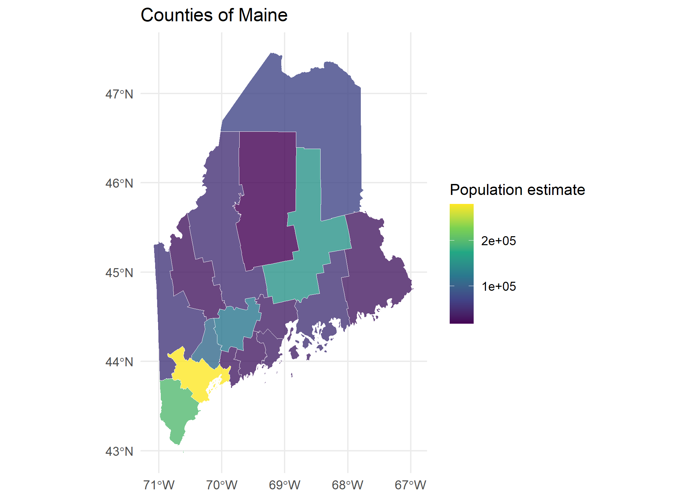<!-- -->

To reproject an **sf** object to a different CRS, we can use `sf::st_transform()`. 


```r
me %>%
  st_transform(crs = "+proj=moll") %>% ## Reprojecting to a Mollweide CRS
  head(2) ## Saving vertical space
```

```
## Simple feature collection with 2 features and 5 fields
## Geometry type: MULTIPOLYGON
## Dimension:     XY
## Bounding box:  xmin: -5752691 ymin: 5221221 xmax: -5348115 ymax: 5604910
## Projected CRS: +proj=moll
##   GEOID                       NAME   variable estimate moe
## 1 23001 Androscoggin County, Maine B01001_001   107882  NA
## 2 23003    Aroostook County, Maine B01001_001    72412  NA
##                         geometry
## 1 MULTIPOLYGON (((-5732558 52...
## 2 MULTIPOLYGON (((-5397957 55...
```

Or, we can specify a common projection directly in the ggplot call using `coord_sf()`. This is often the most convenient approach when you are combining multiple **sf** data frames in the same plot.^[Note that we used a PROJ string to define the CRS reprojection below. But we could easily use an EPSG code instead. For example, here's the [ME west plane](https://epsg.io/26984) projection, which we could use by setting `crs=26984`.]


```r
me_plot +
  coord_sf(crs = "+proj=moll") +
  labs(subtitle = "Mollweide projection") 
```

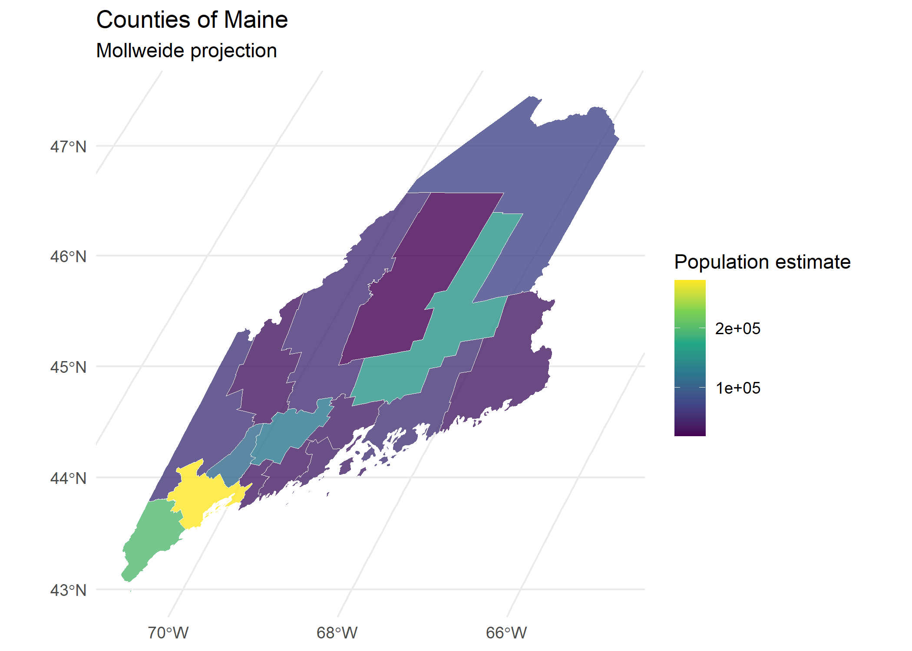<!-- -->

### Data wrangling with **dplyr** and **tidyr**

As I keep saying, the tidyverse approach to data wrangling carries over very smoothly to **sf** objects. For example, the standard **dplyr** verbs like `filter()`, `mutate()` and `select()` all work.

**Be sure to run the code in this block to split NAME into the COUNTY and STATE components.**


```r
me %>% 
  separate(NAME,c('COUNTY','STATE'),sep = ", ") %>% 
  filter(COUNTY %in% c("Sagadahoc County", "Androscoggin County", "Cumberland County")) %>%
  mutate(estimate_div_1000 = estimate/1000) %>% # Estimate in 1000s
  select(-variable,-moe) # Drop the variable and margin of error columns
```

```
## Simple feature collection with 3 features and 5 fields
## Geometry type: MULTIPOLYGON
## Dimension:     XY
## Bounding box:  xmin: -70.86658 ymin: 43.52726 xmax: -69.6888 ymax: 44.48722
## Geodetic CRS:  NAD83
##   GEOID              COUNTY STATE estimate estimate_div_1000
## 1 23001 Androscoggin County Maine   107882           107.882
## 2 23005   Cumberland County Maine   279994           279.994
## 3 23023    Sagadahoc County Maine    35688            35.688
##                         geometry
## 1 MULTIPOLYGON (((-70.16011 4...
## 2 MULTIPOLYGON (((-70.10624 4...
## 3 MULTIPOLYGON (((-69.86599 4...
```

```r
me <- me %>% separate(NAME,c('COUNTY','STATE'),sep = ", ") # Keeping this one
```

You can also perform `group_by()` and `summarise()` operations as per normal (see [here](http://strimas.com/r/tidy-sf/) for a nice example). Furthermore, the **dplyr** family of [join functions](https://dplyr.tidyverse.org/reference/join.html) also work, which can be especially handy when combining different datasets by FIPS code or some other *attribute*. **However, this presumes that only one of the objects has a specialized geometry column.** In other words, it works when you are joining an **sf** object with a normal data frame. In cases where you want to join two **sf** objects based on their *geometries*, there's a specialized `st_join()` function. I provide an example of this latter operation in the section on [geometric operations](#geometric) below.

Let's try this by joining on Maine's Opportunity Atlas county level data, which we read in and processed earlier.


```r
me_join <- inner_join(me,op_atlas, by="GEOID")
```


```r
ggplot(me_join) +
  geom_sf(aes(fill = kfr_p25), alpha=0.8, col="white") +
  scale_fill_viridis_c(name = "Average income percentile") +
  ggtitle("Average income percentile for children raised at 25th percentile")
```

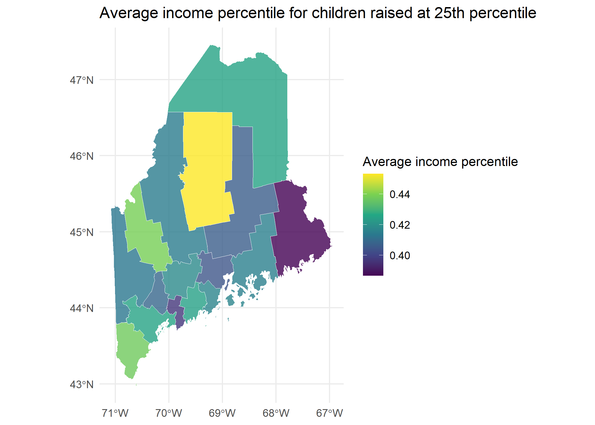<!-- -->

And, just to show that we've got the bases covered, you can also implement your favourite **tidyr** verbs. For example, we can `tidyr::gather()` the data to long format, which is useful for facetted plotting.^[In case you're wondering: the newer `tidyr::pivot_*` functions [do not](https://github.com/r-spatial/sf/pull/1151) yet work with **sf** objects.] Here I demonstrate this by plotting the average income percentile of children born to parents at the 25th percentile and 75th percentile. 


```r
me_join %>% 
  select(GEOID, kfr_p25, kfr_p75, geometry) %>% 
  pivot_longer(cols=c(kfr_p25,kfr_p75), names_to='parent_ptile',names_prefix = 'kfr_p',values_to='kfr') %>%
  mutate(kfr=kfr*100, # put in percent terms
    parent_ptile=paste0('Raised at ',parent_ptile,'th percentile')) %>%  # Make the parent_ptile variable more descriptive
  ggplot() +
  geom_sf(aes(fill = kfr), alpha=0.8, col="white") +
  scale_fill_viridis_c(name = "Average income percentile rank") +
  facet_wrap(~parent_ptile, ncol = 2) +
  labs(title = "Mean income percentile of children born to parents at the 25th percentile") +
  theme(legend.position="bottom")
```

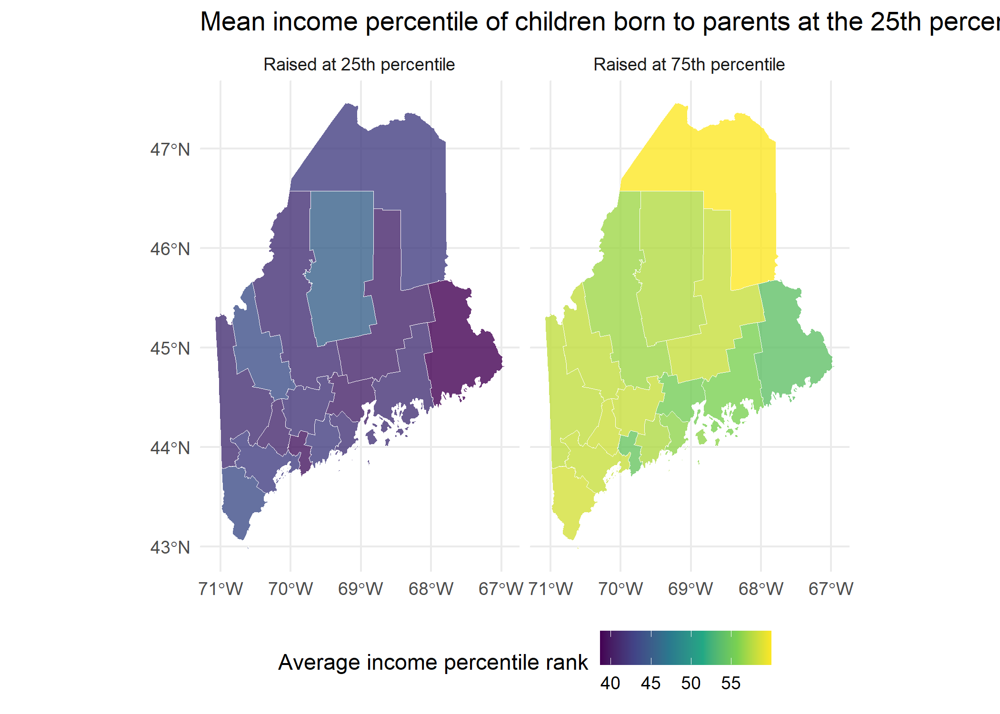<!-- -->

*On your problem set, you'll have to do something similar at the Census tract level and by race, so take note.*

### Specialized geometric operations {#geometric}

Alongside all the tidyverse functionality, the **sf** package comes with a full suite of geometrical operations. You should take a look at at the [third **sf** vignette](https://r-spatial.github.io/sf/articles/sf3.html#geometrical-operations) or the [*Geocomputation with R*](https://geocompr.robinlovelace.net/geometric-operations.html#geo-vec) book to get a complete overview. 

There are two types of operations: **unary** and **binary** shown below. These categories are helpful to keep in mind when you're trying to find a function to do something new, but you can still get pretty far without memorizing them. 

Here are a few examples to get you started:

#### Unary operations

So-called *unary* operations are applied to a single object. For instance, you can unite sub-elements of an **sf** object (e.g. counties) into larger elements (e.g. states) using `sf::st_union()`:


```r
me %>% 
  st_union() %>% 
  ggplot() +
  geom_sf(fill=NA, col="black") +
  labs(title = "Outline of Maine") 
```

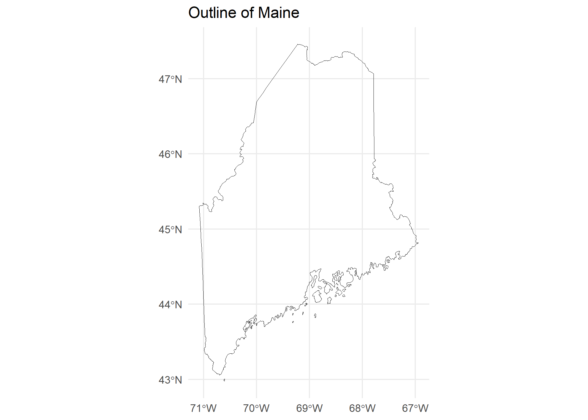<!-- -->

Or, you can get the `st_area()`, `st_centroid()`, `st_boundary()`, `st_buffer()`, etc. of an object using the appropriate command. For example:


```r
me %>% st_area() %>% head(5) ## Only show the area of the first five counties to save space.
```

```
## Units: [m^2]
## [1]  1284898459 17640149313  2469968814  4505380911  4615153654
```

And:


```r
me_centroid = st_centroid(me)

ggplot(me) +
  geom_sf(fill = "black", alpha = 0.8, col = "white") +
  geom_sf(data = me_centroid, col = "red") + ## Notice how easy it is to combine different sf objects
  labs(
    title = "Counties of Maine",
    subtitle = "Centroids in red"
    )
```

<!-- -->

#### Binary operations

Another set of so-called *binary* operations can be applied to multiple objects. So, we can get things like the distance between two spatial objects using `sf::st_distance()`. In the below example, I'm going to get the distance from Androscoggin county to  York county, as well as itself. The latter is just a silly addition to show that we can easily make multiple pairwise comparisons, even when the distance from one element to another is zero.


```r
andro_york = me %>% filter(COUNTY %in% c("Androscoggin County", "York County")) 
andro = me %>% filter(COUNTY %in% c("Androscoggin County"))

ay_dist = st_distance(andro_york, andro)

## We can use the `units` package (already installed as sf dependency) to convert to kilometres 
ay_dist = ay_dist %>% units::set_units(km) %>% round()

ggplot(me) +
  geom_sf(fill = "black", alpha = 0.8, col = "white") +
  geom_sf(data = andro_york, aes(fill = COUNTY), col = "white") +  
  labs(
    title = "Calculating distances",
    subtitle = paste0("The distance between Androscoggin and Cumberland is ", ay_dist[1], " km")
    ) +
  theme(legend.title = element_blank())
```

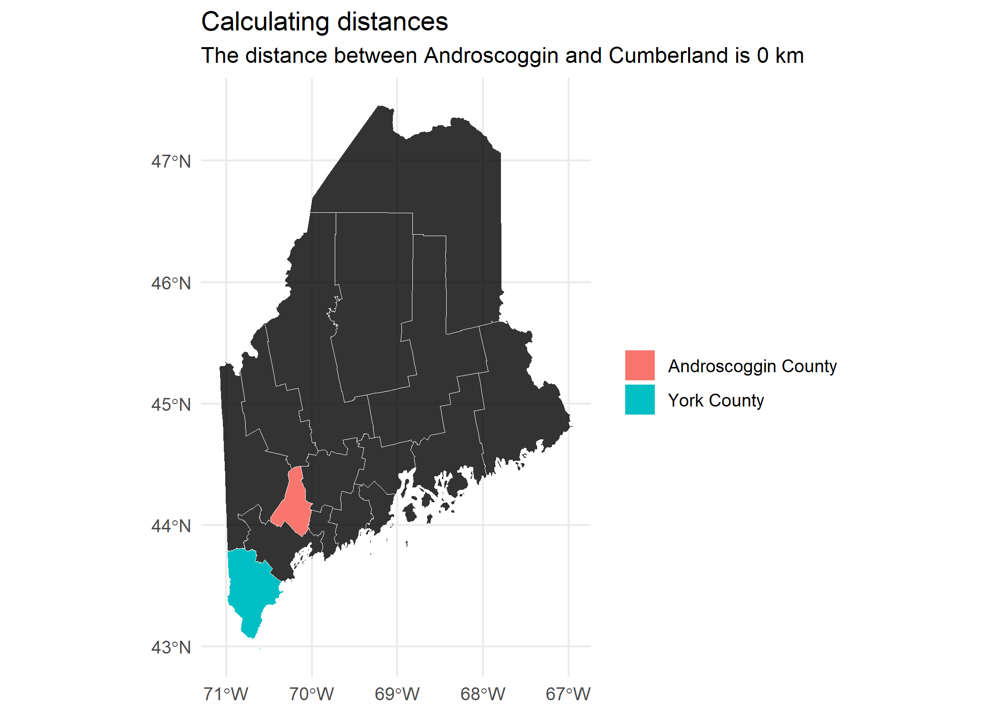<!-- -->

#### Binary logical operations

A sub-genre of binary geometric operations falls into the category of logic rules --- typically characterising the way that geometries relate in space. (Do they overlap, are they nearby, etc.) 

For example, we can calculate the intersection of different spatial objects using `sf::st_intersection()`. For this next example, I'm going to use the primary roads spatial object from the **tigris** package. Don't worry too much about the process used for loading these datasets; I'll cover that in more depth shortly. For the moment, just focus on the idea that we want to see which counties are intersected by the river network. 

First, I want to make sure the roads have the same projection as maine using the `st_crs()` package.


```r
road = tigris::primary_roads()
## Make sure they have the same projection
road = st_transform(road, crs = st_crs(me))
```

Second, let me plot all the data to see what we're working with. 


```r
ggplot() + 
  geom_sf(data = me, alpha = 0.8, fill = "white", col = "black") + 
  geom_sf(data = road, col = "red", lwd = 1) + 
  labs(
    title = "States of the US",
    subtitle = "Also showing the US road network"
    )
```

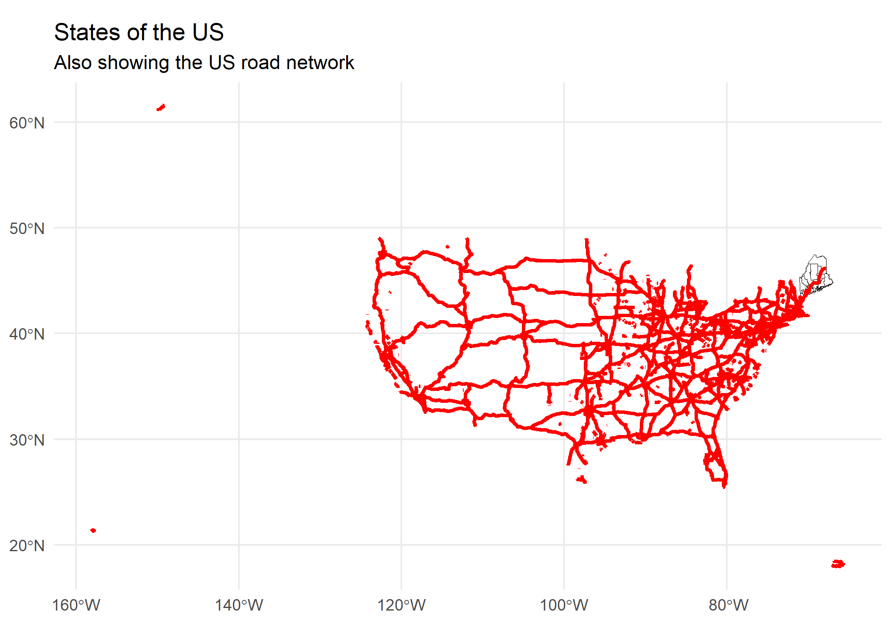<!-- -->

Uh oh, it looks like we mapped all of the roads in the USA! 


```r
# Turn off spherical geometry see: https://r-spatial.org/r/2020/06/17/s2.html
road = st_transform(road, crs = st_crs(me)) 
me_intersected = st_intersection(road, me)
me_intersected
```

```
## Simple feature collection with 84 features and 10 fields
## Geometry type: GEOMETRY
## Dimension:     XY
## Bounding box:  xmin: -70.76654 ymin: 43.09266 xmax: -67.78124 ymax: 46.14542
## Geodetic CRS:  NAD83
## First 10 features:
##            LINEARID   FULLNAME RTTYP MTFCC GEOID              COUNTY STATE
## 11240 1104470961382      I- 95     I S1100 23001 Androscoggin County Maine
## 11405 1106087854960      I- 95     I S1100 23001 Androscoggin County Maine
## 11407 1106087854909      I- 95     I S1100 23001 Androscoggin County Maine
## 11507 1105084078814      I- 95     I S1100 23001 Androscoggin County Maine
## 11520 1104471317791      I- 95     I S1100 23001 Androscoggin County Maine
## 14594 1103681344737 Maine Tpke     M S1100 23001 Androscoggin County Maine
## 14595 1103681783061 Maine Tpke     M S1100 23001 Androscoggin County Maine
## 14596 1103681783104 Maine Tpke     M S1100 23001 Androscoggin County Maine
## 14597 1103681344751 Maine Tpke     M S1100 23001 Androscoggin County Maine
## 11294  110469245634      I- 95     I S1100 23003    Aroostook County Maine
##         variable estimate moe                       geometry
## 11240 B01001_001   107882  NA LINESTRING (-70.00712 44.12...
## 11405 B01001_001   107882  NA LINESTRING (-70.29294 44.02...
## 11407 B01001_001   107882  NA LINESTRING (-70.00602 44.12...
## 11507 B01001_001   107882  NA LINESTRING (-70.29294 44.02...
## 11520 B01001_001   107882  NA LINESTRING (-70.00602 44.12...
## 14594 B01001_001   107882  NA LINESTRING (-70.00712 44.12...
## 14595 B01001_001   107882  NA LINESTRING (-70.00602 44.12...
## 14596 B01001_001   107882  NA LINESTRING (-70.00602 44.12...
## 14597 B01001_001   107882  NA LINESTRING (-70.00712 44.12...
## 11294 B01001_001    72412  NA LINESTRING (-68.42664 45.85...
```

Note that `st_intersection()` only preserves *exact* points of overlap. As in, this is the exact path that the road follow within these regions. We can see this more explicitly in map form:


```r
me_intersected %>%
  ggplot() + 
  geom_sf(alpha = 0.8, aes(fill = FULLNAME, col = FULLNAME)) + 
  labs(
    title = "Maine road system",
    caption = "Colours depict each road"
    ) +
  theme(legend.title = element_blank())
```

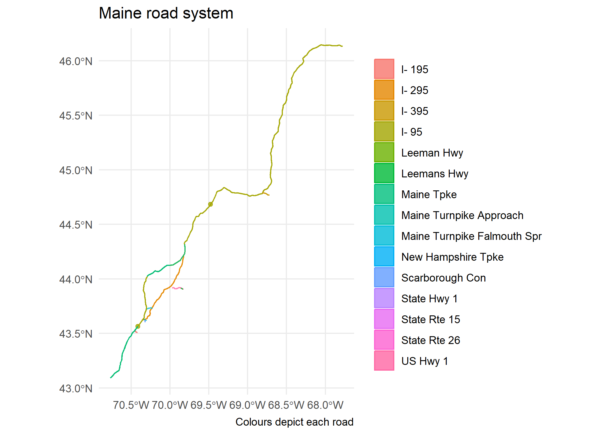<!-- -->

If we instead wanted to plot the intersected counties (i.e. keeping their full geometries), we have a couple options. We could filter the `me` object by matching its region IDs with the `me_intersected` object. However, a more direct option is to use the `sf::st_join()` function which matches objects based on overlapping (i.e. intersecting) geometries:


```r
# Select only the road variables
st_join(me,road,left=FALSE) %>%  # left=FALSE means we keep only the intersected geometries
  ggplot() + 
  geom_sf(alpha = 0.8, fill = "black", col = "gray50") + 
  geom_sf(data = me_intersected, col = "#05E9FF", lwd = 1) + 
  labs(title = "Counties with primary roads only") 
```

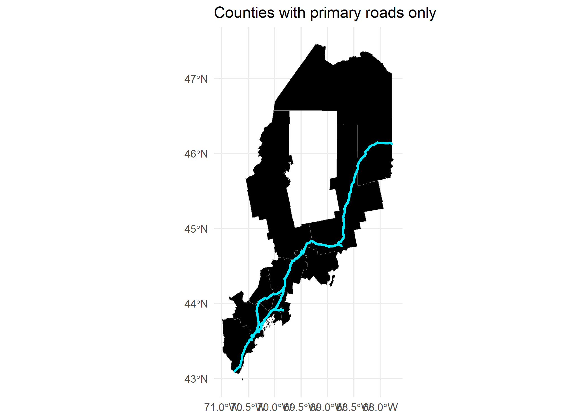<!-- -->

### Bordering counties

Did you note above that we used `st_join` to find the intersected counties? Let's do that to get bordering counties! 


```r
st_join(me,andro,left=FALSE) %>% 
  ggplot() + 
  geom_sf(alpha = 0.8, fill = "black", col = "gray50") + 
  labs(title = "Androscoggin County and its Neighbors")
```

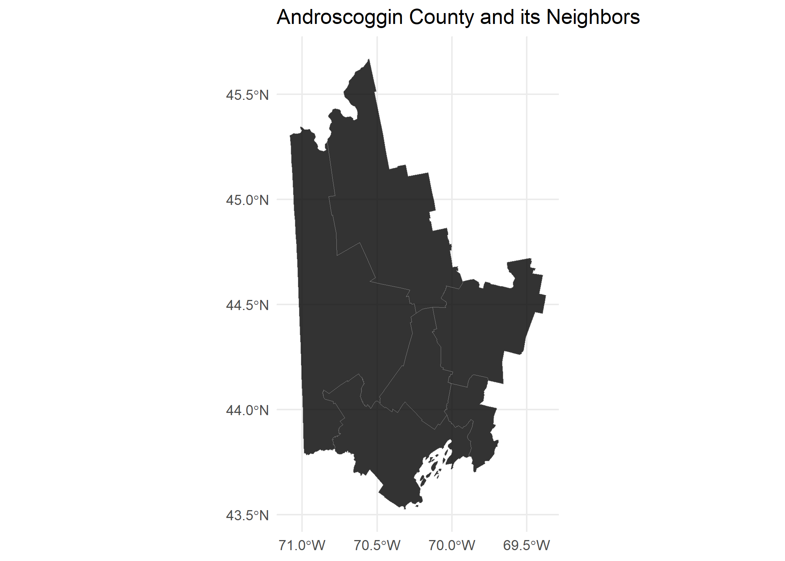<!-- -->

But what if we wanted to leave out Androscoggin? We tell `st_join` that we want to join using the `st_touches` predicate to only show the counties that touch Androscoggin. 


```r
st_join(me,andro,left=FALSE,join=st_touches) %>% # Note the new predicate! 
  ggplot() + 
  geom_sf(alpha = 0.8, fill = "black", col = "gray50") + 
  #geom_sf(data = andro, col = "red",fill='red', lwd = 1) + # Highlight androscoggin
  labs(title = "Androscoggin County and its Neighbors") 
```

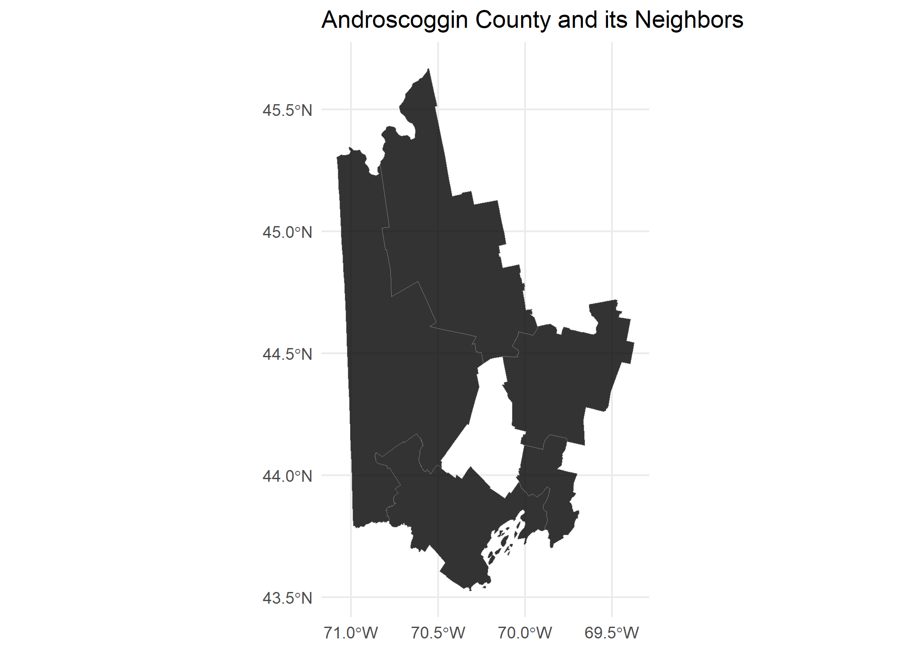<!-- -->

Wait, what's going on? How did we drop Androscoggin? `st_touches` is a predicate that returns `TRUE` if the geometries have at least one point in common, but their interiors do not intersect. In other words, it returns `TRUE` if the geometries are adjacent. Let's visualize that:


```r
st_join(me,andro,left=FALSE,join=st_touches)
```

```
## Simple feature collection with 5 features and 12 fields
## Geometry type: MULTIPOLYGON
## Dimension:     XY
## Bounding box:  xmin: -71.08433 ymin: 43.52726 xmax: -69.37242 ymax: 45.66783
## Geodetic CRS:  NAD83
##    GEOID.x          COUNTY.x STATE.x variable.x estimate.x moe.x GEOID.y
## 3    23005 Cumberland County   Maine B01001_001     279994    NA   23001
## 4    23007   Franklin County   Maine B01001_001      30657    NA   23001
## 6    23011   Kennebec County   Maine B01001_001     121925    NA   23001
## 9    23017     Oxford County   Maine B01001_001      57867    NA   23001
## 12   23023  Sagadahoc County   Maine B01001_001      35688    NA   23001
##               COUNTY.y STATE.y variable.y estimate.y moe.y
## 3  Androscoggin County   Maine B01001_001     107882    NA
## 4  Androscoggin County   Maine B01001_001     107882    NA
## 6  Androscoggin County   Maine B01001_001     107882    NA
## 9  Androscoggin County   Maine B01001_001     107882    NA
## 12 Androscoggin County   Maine B01001_001     107882    NA
##                          geometry
## 3  MULTIPOLYGON (((-70.10624 4...
## 4  MULTIPOLYGON (((-70.83471 4...
## 6  MULTIPOLYGON (((-69.74428 4...
## 9  MULTIPOLYGON (((-71.01489 4...
## 12 MULTIPOLYGON (((-69.86599 4...
```

Note the `.x` and the `.y` because the column names overlapped. R uses `.x` and `.y` to distinguish between the two objects' columns.^[I know it is confusing to keep all these ideas in your head at once. With practice, you'll get experience and greater familiarity with R's syntax, which will make it easier to try new stuff!]

So what if we `st_touches` join Maine to itself? That leaves you with a long dataset where each row is a pair of touching counties. 


```r
st_join(me,me,join=st_touches)
```

```
## Simple feature collection with 66 features and 12 fields
## Geometry type: MULTIPOLYGON
## Dimension:     XY
## Bounding box:  xmin: -71.08433 ymin: 42.97776 xmax: -66.9499 ymax: 47.45969
## Geodetic CRS:  NAD83
## First 10 features:
##     GEOID.x            COUNTY.x STATE.x variable.x estimate.x moe.x GEOID.y
## 1     23001 Androscoggin County   Maine B01001_001     107882    NA   23005
## 1.1   23001 Androscoggin County   Maine B01001_001     107882    NA   23007
## 1.2   23001 Androscoggin County   Maine B01001_001     107882    NA   23011
## 1.3   23001 Androscoggin County   Maine B01001_001     107882    NA   23017
## 1.4   23001 Androscoggin County   Maine B01001_001     107882    NA   23023
## 2     23003    Aroostook County   Maine B01001_001      72412    NA   23019
## 2.1   23003    Aroostook County   Maine B01001_001      72412    NA   23021
## 2.2   23003    Aroostook County   Maine B01001_001      72412    NA   23025
## 2.3   23003    Aroostook County   Maine B01001_001      72412    NA   23029
## 3     23005   Cumberland County   Maine B01001_001     279994    NA   23001
##                COUNTY.y STATE.y variable.y estimate.y moe.y
## 1     Cumberland County   Maine B01001_001     279994    NA
## 1.1     Franklin County   Maine B01001_001      30657    NA
## 1.2     Kennebec County   Maine B01001_001     121925    NA
## 1.3       Oxford County   Maine B01001_001      57867    NA
## 1.4    Sagadahoc County   Maine B01001_001      35688    NA
## 2      Penobscot County   Maine B01001_001     152934    NA
## 2.1  Piscataquis County   Maine B01001_001      17555    NA
## 2.2     Somerset County   Maine B01001_001      52261    NA
## 2.3   Washington County   Maine B01001_001      33154    NA
## 3   Androscoggin County   Maine B01001_001     107882    NA
##                           geometry
## 1   MULTIPOLYGON (((-70.16011 4...
## 1.1 MULTIPOLYGON (((-70.16011 4...
## 1.2 MULTIPOLYGON (((-70.16011 4...
## 1.3 MULTIPOLYGON (((-70.16011 4...
## 1.4 MULTIPOLYGON (((-70.16011 4...
## 2   MULTIPOLYGON (((-68.5918 47...
## 2.1 MULTIPOLYGON (((-68.5918 47...
## 2.2 MULTIPOLYGON (((-68.5918 47...
## 2.3 MULTIPOLYGON (((-68.5918 47...
## 3   MULTIPOLYGON (((-70.10624 4...
```

#### Comprehension check

[Why would you want know the neighboring counties of a given county?](https://www.mentimeter.com/app/presentation/blkhnym4ou7ejzod9b1gc6b24id49nr5/o68k5g2hmmx8)

### Nearest neighbors

Sometimes you'll want to know more than neighbors, you'll want to know the nearest $k$ neighbors, where $k$ is some arbitrary number. Consider this plot:


```r
knitr::include_graphics("../09-oppatlas/pics/spatial_correlation_decay.png")
```


This is plots the spatial correlation of income mobility with poverty for neighboring census tracts. The spatial correlation is highest within group, but then decays. 

It is possible to do this using the **sf** package using the `st_nearest_feature()` function to get the nearest feature and then repeating to get the next most nearest and so on. A for loop or some **purrr** magic (covered later) and you're off to the races. But it turns out, there's a package that makes this easier: **nngeo** and its functions `st_nn` for "nearest neighbors."


```r
st_nn(andro, # The object to find the nearest neighbors for
  me, # The object to find the nearest neighbors in
  k=3) # The number of nearest neighbors
```

```
## lines or polygons
```

```
## 
  |                                                                            
  |                                                                      |   0%
  |                                                                            
  |======================================================================| 100%
```

```
## [[1]]
## [1] 1 3 4
```


```r
st_join(me, me, 
  join = st_nn, # Use st_nn
  k = 5,# The number of nearest neighbors
  maxdist=100000) # The max distance in meters to look for neighbors
```

```
## lines or polygons
```

```
## 
  |                                                                            
  |                                                                      |   0%
  |                                                                            
  |====                                                                  |   6%
  |                                                                            
  |=========                                                             |  12%
  |                                                                            
  |=============                                                         |  19%
  |                                                                            
  |==================                                                    |  25%
  |                                                                            
  |======================                                                |  31%
  |                                                                            
  |==========================                                            |  38%
  |                                                                            
  |===============================                                       |  44%
  |                                                                            
  |===================================                                   |  50%
  |                                                                            
  |=======================================                               |  56%
  |                                                                            
  |============================================                          |  62%
  |                                                                            
  |================================================                      |  69%
  |                                                                            
  |====================================================                  |  75%
  |                                                                            
  |=========================================================             |  81%
  |                                                                            
  |=============================================================         |  88%
  |                                                                            
  |==================================================================    |  94%
  |                                                                            
  |======================================================================| 100%
```

```
## Simple feature collection with 80 features and 12 fields
## Geometry type: MULTIPOLYGON
## Dimension:     XY
## Bounding box:  xmin: -71.08433 ymin: 42.97776 xmax: -66.9499 ymax: 47.45969
## Geodetic CRS:  NAD83
## First 10 features:
##     GEOID.x            COUNTY.x STATE.x variable.x estimate.x moe.x GEOID.y
## 1     23001 Androscoggin County   Maine B01001_001     107882    NA   23001
## 1.1   23001 Androscoggin County   Maine B01001_001     107882    NA   23005
## 1.2   23001 Androscoggin County   Maine B01001_001     107882    NA   23007
## 1.3   23001 Androscoggin County   Maine B01001_001     107882    NA   23011
## 1.4   23001 Androscoggin County   Maine B01001_001     107882    NA   23017
## 2     23003    Aroostook County   Maine B01001_001      72412    NA   23003
## 2.1   23003    Aroostook County   Maine B01001_001      72412    NA   23019
## 2.2   23003    Aroostook County   Maine B01001_001      72412    NA   23021
## 2.3   23003    Aroostook County   Maine B01001_001      72412    NA   23025
## 2.4   23003    Aroostook County   Maine B01001_001      72412    NA   23029
##                COUNTY.y STATE.y variable.y estimate.y moe.y
## 1   Androscoggin County   Maine B01001_001     107882    NA
## 1.1   Cumberland County   Maine B01001_001     279994    NA
## 1.2     Franklin County   Maine B01001_001      30657    NA
## 1.3     Kennebec County   Maine B01001_001     121925    NA
## 1.4       Oxford County   Maine B01001_001      57867    NA
## 2      Aroostook County   Maine B01001_001      72412    NA
## 2.1    Penobscot County   Maine B01001_001     152934    NA
## 2.2  Piscataquis County   Maine B01001_001      17555    NA
## 2.3     Somerset County   Maine B01001_001      52261    NA
## 2.4   Washington County   Maine B01001_001      33154    NA
##                           geometry
## 1   MULTIPOLYGON (((-70.16011 4...
## 1.1 MULTIPOLYGON (((-70.16011 4...
## 1.2 MULTIPOLYGON (((-70.16011 4...
## 1.3 MULTIPOLYGON (((-70.16011 4...
## 1.4 MULTIPOLYGON (((-70.16011 4...
## 2   MULTIPOLYGON (((-68.5918 47...
## 2.1 MULTIPOLYGON (((-68.5918 47...
## 2.2 MULTIPOLYGON (((-68.5918 47...
## 2.3 MULTIPOLYGON (((-68.5918 47...
## 2.4 MULTIPOLYGON (((-68.5918 47...
```

This returns the five nearest neighbors to each county including itself. 

That's about as much **sf** functionality as I can show you for today. The remaining part of this lecture will cover some additional mapping considerations and some bonus spatial R "swag". However, I'll try to slip in a few more **sf**-specific operations along the way.

## BONUS 1: Where to get map data

As our first Maine examples demonstrate, you can easily import external shapefiles, KML files, etc., into R. Just use the generic `sf::st_read()` function on any of these formats and the **sf** package will take care of the rest. However, we've also seen with the France example that you might not even need an external shapefile. Indeed, R provides access to a large number of base maps --- e.g. countries of the world, US states and counties, etc. --- through the **maps**, (higher resolution) **mapdata** and **spData** packages, as well as a whole ecosystem of more specialized GIS libraries.^[The list of specialised maps packages is far too long for me to cover here. You can get [marine regions](https://github.com/ropensci/mregions), [protected areas](https://github.com/ropenscilabs/rwdpa), [nightlights](https://github.com/chrisvwn/Rnightlights), ..., etc., etc.] To convert these maps into "**sf**-friendly" data frame format, we can use the `sf::st_as_sf()` function as per the below examples.

### Example 1: The World


```r
# library(maps) ## Already loaded

world = st_as_sf(map("world", plot = FALSE, fill = TRUE))

world_map = 
  ggplot(world) + 
  geom_sf(fill = "grey80", col = "grey40", lwd = 0.3) +
  labs(
    title = "The world", 
    subtitle = paste("EPSG:", st_crs(world)$epsg)
    )
world_map
```

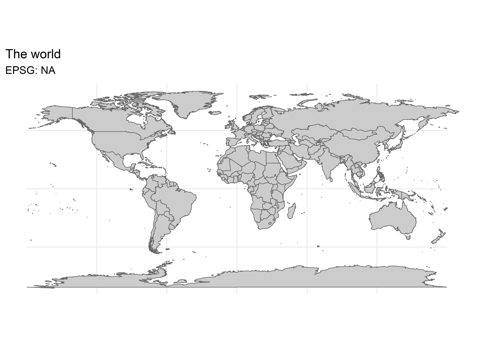<!-- -->

All of the usual **sf** functions and transformations can then be applied. For example, we can reproject the above world map onto the [Lambert Azimuthal Equal Area](https://proj.org/operations/projections/laea.html) projection (and further orientate it at the South Pole) as follows.


```r
world_map +
  coord_sf(crs = "+proj=laea +y_0=0 +lon_0=155 +lat_0=-90") +
  labs(subtitle = "Lambert Azimuthal Equal Area projection")
```

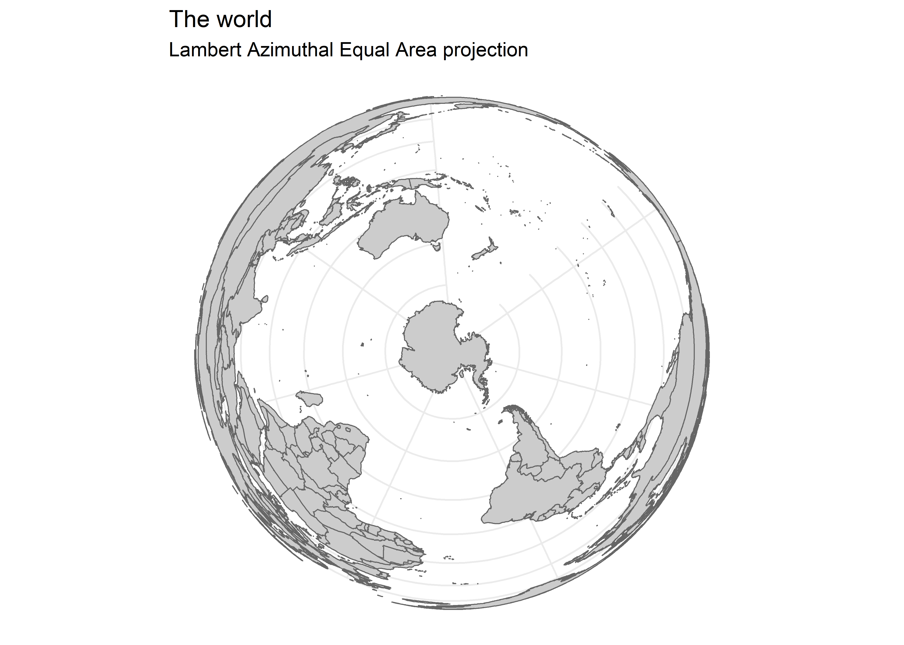<!-- -->

### Several digressions on projection considerations

#### Winkel tripel projection

As we've already seen, most map projections work great "out of the box" with **sf**. One niggling and notable exception is the [Winkel tripel projection](https://en.wikipedia.org/wiki/Winkel_tripel_projection). This is the preferred global map projection of *National Geographic* and requires a bit more work to get it to play nicely with **sf** and **ggplot2** (as detailed in [this thread](https://github.com/r-spatial/sf/issues/509)). Here's a quick example of how to do it:


```r
# library(lwgeom) ## Already loaded

wintr_proj = "+proj=wintri +datum=WGS84 +no_defs +over"

world_wintri = lwgeom::st_transform_proj(world, crs = wintr_proj)

## Don't necessarily need a graticule, but if you do then define it manually:
gr = 
  st_graticule(lat = c(-89.9,seq(-80,80,20),89.9)) %>%
  lwgeom::st_transform_proj(crs = wintr_proj)

ggplot(world_wintri) + 
  geom_sf(data = gr, color = "#cccccc", size = 0.15) + ## Manual graticule
  geom_sf(fill = "grey80", col = "grey40", lwd = 0.3) +
  coord_sf(datum = NA) +
  theme_ipsum(grid = F) +
  labs(title = "The world", subtitle = "Winkel tripel projection")
```

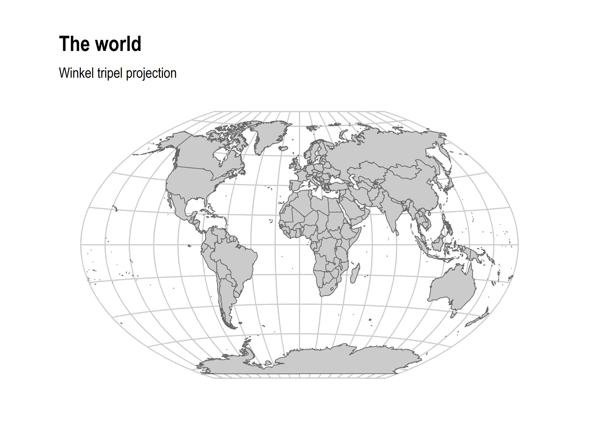<!-- -->


#### Equal Earth projection

The latest and greatest projection, however, is the "[Equal Earth](http://equal-earth.com)" projection. This _does_ work well out of the box, in part due to the `ne_countries` dataset that comes bundled with the **rnaturalearth** package ([link](https://github.com/ropensci/rnaturalearth)). I'll explain that second part of the previous sentence in moment. But first let's see the Equal Earth projection in action.


```r
# library(rnaturalearth) ## Already loaded

countries = 
  ne_countries(returnclass = "sf") %>%
  st_transform(8857) ## Transform to equal earth projection
  # st_transform("+proj=eqearth +wktext") ## PROJ string alternative

ggplot(countries) +
  geom_sf(fill = "grey80", col = "grey40", lwd = 0.3) +
  labs(title = "The world", subtitle = "Equal Earth projection")
```

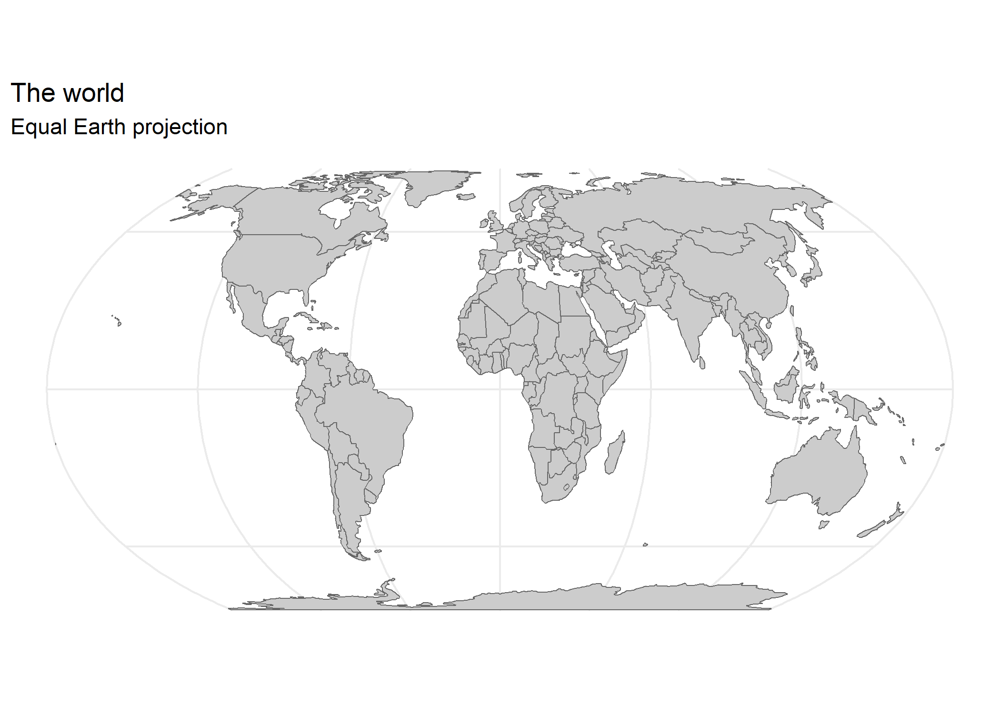<!-- -->

#### Pacfic-centered maps and other polygon mishaps

As noted, the `rnaturalearth::ne_countries` spatial data frame is important for correctly displaying the Equal Earth projection. On the face of it, this looks pretty similar to our `maps::world` spatial data frame from earlier. They both contain polygons of all the countries in the world and appear to have similar default projections. However, some underlying nuances in how those polygons are constructed allows us avoid some undesirable visual artefacts that arise when reprojecting to the Equal Earth projection. Consider: 


```r
world %>%
  st_transform(8857) %>% ## Transform to equal earth projection
  ggplot() +
  geom_sf(fill = "grey80", col = "grey40", lwd = 0.3) +
  labs(title = "The... uh, world", subtitle = "Projection fail")
```

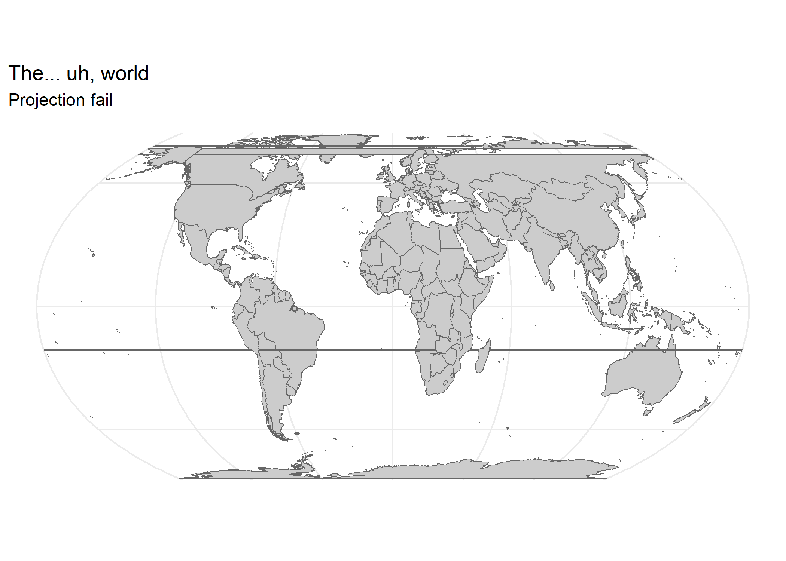<!-- -->

These types of visual artefacts are particularly common for Pacific-centered maps and, in that case, arise from polygons extending over the Greenwich prime meridian. It's a suprisingly finicky problem to solve. Even the **rnaturalearth** doesn't do a good job. Luckily, Nate Miller has you covered with an [excellent guide](https://github.com/natemiller/mapping) to set you on the right track. 


### Example 2: A single country (i.e. Norway)

The **maps** and **mapdata** packages have detailed county- and province-level data for several individual nations. We've already seen this with France, but it includes the USA, New Zealand and several other nations. However, we can still use it to extract a specific country's border using some intuitive syntax. For example, we could plot a base map of Norway as follows.


```r
norway = st_as_sf(map("world", "norway", plot = FALSE, fill = TRUE))

## For a hi-resolution map (if you *really* want to see all the fjords):
# norway = st_as_sf(map("worldHires", "norway", plot = FALSE, fill = TRUE))

norway %>%
  ggplot() + 
  geom_sf(fill="black", col=NA)
```

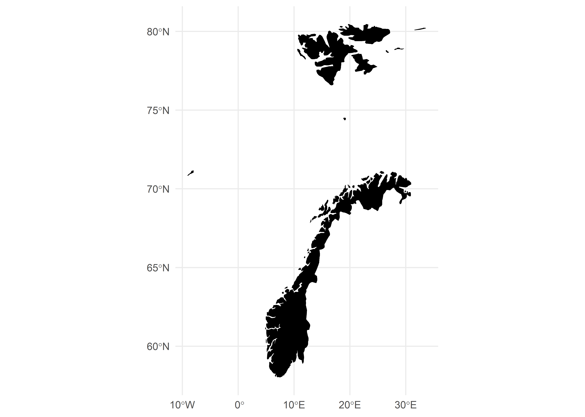<!-- -->

Hmmm. Looks okay, but I don't really want to include non-mainland territories like Svalbaard (to the north) and the Faroe Islands (to the east). This gives me the chance to show off another handy function, `sf::st_crop()`, which I'll use to crop our **sf** object to a specific extent (i.e. rectangle). While I am at, we could also improve the projection. The Norwegian Mapping Authority recommends the ETRS89 / UTM projection, for which we can easily obtain the equivalent EPSG code (i.e. 25832) from [this website](https://epsg.io/25832).


```r
norway %>%
  st_crop(c(xmin=0, xmax=35, ymin=0, ymax=72)) %>%
  st_transform(crs = 25832) %>%
  ggplot() + 
  geom_sf(fill="black", col=NA)
```

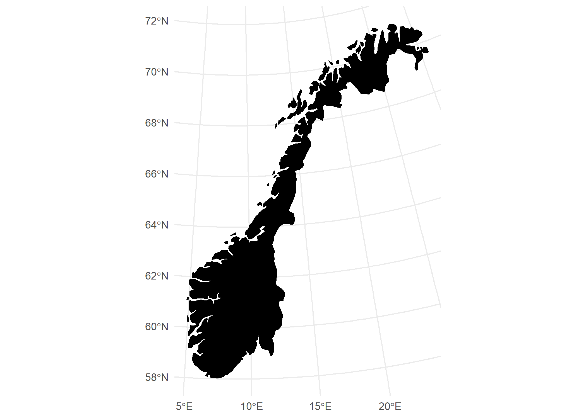<!-- -->

There you go. A nice-looking map of Norway. Fairly appropriate that it resembles a gnarly black metal guitar.

> **Aside:** I recommend detaching the **maps** package once you're finished using it, since it avoids potential namespace conflicts with `purrr::map`.


```r
detach(package:maps) ## To avoid potential purrr::map() conflicts
```


## BONUS 2: More on US Census data with **tidycensus** and **tigris** {#census}

> **Note:** Before continuing with this section, you will first need to [request an API key](https://api.census.gov/data/key_signup.html) from the Census. 

Working with Census data has traditionally quite a pain. You need to register on the website, then download data from various years or geographies separately, merge these individual files, etc. Thankfully, this too has recently become much easier thanks to the Census API and --- for R at least --- the **tidycensus** ([link](https://walker-data.com/tidycensus/)) and **tigris** ([link](https://github.com/walkerke/tigris)) packages from [Kyle Walker](http://walkerke.github.io/) (a UO alum). This next section will closely follow a [tutorial](http://walkerke.github.io/2017/06/comparing-metros/) on his website.

We start by loading the packages and setting our Census API key. Note that I'm not actually running the below chunk, since I expect you to fill in your own Census key. You only have to run this function once. 


```r
# library(tidycensus) ## Already loaded
# library(tigris) ## Already loaded

## Replace the below with your own census API key. We'll use the "install = TRUE"
## option to save the key for future use, so we only ever have to run this once.
census_api_key("YOUR_CENSUS_API_KEY_HERE", install = TRUE)

## Also tell the tigris package to automatically cache its results to save on
## repeated downloading. I recommend adding this line to your ~/.Rprofile file
## so that caching is automatically enabled for future sessions. A quick way to
## do that is with the `usethis::edit_r_profile()` function.
options(tigris_use_cache=TRUE)
```

Let's say that our goal is to provide a snapshot of Census rental estimates across different cities in the Pacific Northwest. We start by downloading tract-level rental data for Oregon and Washington using the `tidycensus::get_acs()` function. Note that you'll need to look up the correct ID variable (in this case: "DP04_0134").


```r
rent = 
  tidycensus::get_acs(
    geography = "tract", variables = "DP04_0134",
    state = c("WA", "OR"), geometry = TRUE
    )
rent
```

```
## Simple feature collection with 2785 features and 5 fields (with 11 geometries empty)
## Geometry type: MULTIPOLYGON
## Dimension:     XY
## Bounding box:  xmin: -124.7631 ymin: 41.99179 xmax: -116.4635 ymax: 49.00249
## Geodetic CRS:  NAD83
## # A tibble: 2,785 × 6
##    GEOID       NAME            variable estimate   moe                  geometry
##    <chr>       <chr>           <chr>       <dbl> <dbl>        <MULTIPOLYGON [°]>
##  1 53033010102 Census Tract 1… DP04_01…     2182   676 (((-122.291 47.57247, -1…
##  2 53053062901 Census Tract 6… DP04_01…     1296    72 (((-122.4834 47.21488, -…
##  3 53053072305 Census Tract 7… DP04_01…     1215    61 (((-122.5264 47.22459, -…
##  4 53067990100 Census Tract 9… DP04_01…       NA    NA (((-122.6984 47.10377, -…
##  5 53077001504 Census Tract 1… DP04_01…      766   264 (((-120.501 46.60201, -1…
##  6 53053062400 Census Tract 6… DP04_01…     1421   434 (((-122.442 47.22307, -1…
##  7 53063000700 Census Tract 7… DP04_01…     1168    87 (((-117.454 47.71541, -1…
##  8 53033005803 Census Tract 5… DP04_01…     1850   260 (((-122.393 47.64116, -1…
##  9 53053062802 Census Tract 6… DP04_01…     1189   229 (((-122.5088 47.19201, -…
## 10 53063012701 Census Tract 1… DP04_01…     1082    95 (((-117.2399 47.64983, -…
## # ℹ 2,775 more rows
```

This returns an **sf** object, which we can plot directly.


```r
rent %>%
  ggplot() + 
  geom_sf(aes(fill = estimate, color = estimate)) + 
  coord_sf(crs = 26910) + 
  scale_fill_viridis_c(name = "Rent ($)", labels = scales::comma) + 
  scale_color_viridis_c(name = "Rent ($)", labels = scales::comma) +
  labs(
    title = "Rental rates across Oregon and Washington", 
    caption = "Data: US Census Bureau"
    ) 
```

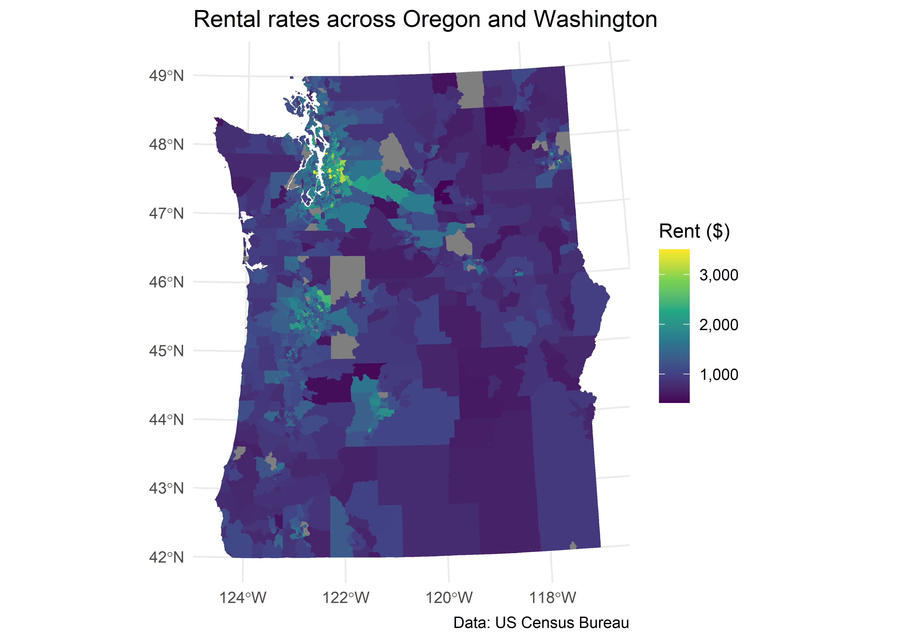<!-- -->

Hmmm, looks like you want to avoid renting in Seattle if possible... 

The above map provides rental information for pretty much all of the Pacific Northwest. Perhaps we're not interested in such a broad swatch of geography. What if we'd rather get a sense of rents within some smaller and well-defined metropolitan areas? Well, we'd need some detailed geographic data for starters, say from the [TIGER/Line shapefiles](https://www.census.gov/geographies/mapping-files/time-series/geo/tiger-line-file.html) collection. The good news is that the **tigris** package has you covered here. For example, let's say we want to narrow down our focus and compare rents across three Oregon metros: Portland (and surrounds), Corvallis, and Eugene.


```r
or_metros = 
  tigris::core_based_statistical_areas(cb = TRUE) %>%
  # filter(GEOID %in% c("21660", "18700", "38900")) %>% ## Could use GEOIDs directly if you know them 
  filter(grepl("Portland|Corvallis|Eugene", NAME)) %>%
  filter(grepl("OR", NAME)) %>% ## Filter out Portland, ME
  select(metro_name = NAME)
```

Now we do a spatial join on our two data sets using the `sf::st_join()` function.


```r
or_rent = 
  st_join(
    rent, 
    or_metros, 
    join = st_within, left = FALSE
    ) 
or_rent
```

```
## Simple feature collection with 682 features and 6 fields
## Geometry type: MULTIPOLYGON
## Dimension:     XY
## Bounding box:  xmin: -124.1587 ymin: 43.4374 xmax: -121.5144 ymax: 46.38863
## Geodetic CRS:  NAD83
## # A tibble: 682 × 7
##    GEOID      NAME  variable estimate   moe                  geometry metro_name
##  * <chr>      <chr> <chr>       <dbl> <dbl>        <MULTIPOLYGON [°]> <chr>     
##  1 530110407… Cens… DP04_01…     1370    45 (((-122.5528 45.7037, -1… Portland-…
##  2 530110404… Cens… DP04_01…       NA    NA (((-122.641 45.72918, -1… Portland-…
##  3 530110423… Cens… DP04_01…     1016   112 (((-122.6871 45.64037, -… Portland-…
##  4 530110411… Cens… DP04_01…     1302   210 (((-122.5861 45.6788, -1… Portland-…
##  5 530110413… Cens… DP04_01…     1564   189 (((-122.5277 45.6284, -1… Portland-…
##  6 530110407… Cens… DP04_01…     1688    85 (((-122.5759 45.68595, -… Portland-…
##  7 530110404… Cens… DP04_01…     1764    54 (((-122.6614 45.75089, -… Portland-…
##  8 530110412… Cens… DP04_01…     1445   104 (((-122.5822 45.60845, -… Portland-…
##  9 530110407… Cens… DP04_01…     1346   114 (((-122.5525 45.67782, -… Portland-…
## 10 530110413… Cens… DP04_01…     1404    45 (((-122.5589 45.62102, -… Portland-…
## # ℹ 672 more rows
```

One useful way to summarize this data and compare across metros is with a histogram. Note that "regular" **ggplot2** geoms and functions play perfectly nicely with **sf** objects (i.e. we aren't limited to `geom_sf()`).


```r
or_rent %>%
  ggplot(aes(x = estimate)) + 
  geom_histogram() + 
  facet_wrap(~metro_name) 
```

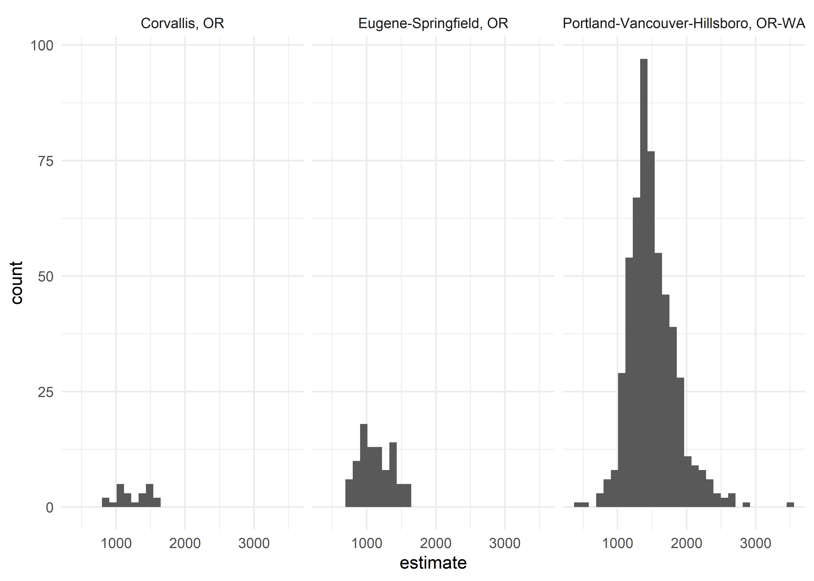<!-- -->

That's a quick taste of working with **tidycensus** (and **tigris**). In truth, the package can do a lot more than I've shown you here. For example, you can also use it to download a variety of other Census microdata such as PUMS, which is much more detailed. See the **tidycensus** [website](https://walker-data.com/tidycensus/) for more information. 

## Aside: **sf** and **data.table**

**sf** objects are designed to integrate with a **tidyverse** workflow. They can also be made to work a **data.table** workflow too, but the integration is not as slick. This is a [known issue](https://github.com/Rdatatable/data.table/issues/2273) and I'll only just highlight a few very brief considerations.

You can convert an **sf** object into a data.table. But note that the key geometry column appears to lose its attributes.


```r
# library(data.table) ## Already loaded

me_dt = as.data.table(me)
head(me_dt)
```

```
##    STATEFP10 COUNTYFP10 COUNTYNS10 GEOID10     NAME10        NAMELSAD10 LSAD10
## 1:        23        019   00581295   23019  Penobscot  Penobscot County     06
## 2:        23        029   00581300   23029 Washington Washington County     06
## 3:        23        003   00581287   23003  Aroostook  Aroostook County     06
## 4:        23        009   00581290   23009    Hancock    Hancock County     06
## 5:        23        007   00581289   23007   Franklin   Franklin County     06
## 6:        23        025   00581298   23025   Somerset   Somerset County     06
##    CLASSFP10 MTFCC10 CSAFP10 CBSAFP10 METDIVFP10 FUNCSTAT10     ALAND10
## 1:        H1   G4020    <NA>    12620       <NA>          A  8799125852
## 2:        H1   G4020    <NA>     <NA>       <NA>          A  6637257545
## 3:        H1   G4020    <NA>     <NA>       <NA>          A 17278664655
## 4:        H1   G4020    <NA>     <NA>       <NA>          A  4110034060
## 5:        H1   G4020    <NA>     <NA>       <NA>          A  4394196449
## 6:        H1   G4020    <NA>     <NA>       <NA>          A 10164156961
##      AWATER10  INTPTLAT10   INTPTLON10 geometry COUNTYFP STATEFP
## 1:  413670635 +45.3906022 -068.6574869  <XY[1]>      019      23
## 2: 1800019787 +44.9670088 -067.6093542  <XY[1]>      029      23
## 3:  404653951 +46.7270567 -068.6494098  <XY[1]>      003      23
## 4: 1963321064 +44.5649063 -068.3707034  <XY[1]>      009      23
## 5:  121392907 +44.9730124 -070.4447268  <XY[1]>      007      23
## 6:  438038365 +45.5074824 -069.9760395  <XY[1]>      025      23
```

The good news is that all of this information is still there. It's just hidden from display.


```r
me_dt$geometry
```

```
## Geometry set for 16 features 
## Geometry type: MULTIPOLYGON
## Dimension:     XY
## Bounding box:  xmin: -71.08392 ymin: 42.91713 xmax: -66.88544 ymax: 47.45985
## Geodetic CRS:  NAD83
## First 5 geometries:
```

```
## MULTIPOLYGON (((-69.28127 44.80866, -69.28143 4...
```

```
## MULTIPOLYGON (((-67.7543 45.66757, -67.75186 45...
```

```
## MULTIPOLYGON (((-68.43227 46.03557, -68.43285 4...
```

```
## MULTIPOLYGON (((-68.80096 44.46203, -68.80007 4...
```

```
## MULTIPOLYGON (((-70.29383 45.1099, -70.29348 45...
```

What's the upshot? Well, basically it means that you have to refer to this "geometry" column explicitly whenever you implement a spatial operation. For example, here's a repeat of the `st_union()` operation that we saw earlier. Note that I explicitly refer to the "geometry" column both for the `st_union()` operation (which, moreover, takes place in the
"j" data.table slot) and when assigning the aesthetics for the `ggplot()` call.


```r
me_dt[, .(geometry = st_union(geometry))] %>% ## Explicitly refer to 'geometry' col
    ggplot(aes(geometry = geometry)) +        ## And here again for the aes()
    geom_sf(fill=NA, col="black") +
    labs(title = "Outline of Maine", 
         subtitle = "This time brought to you by data.table") 
```

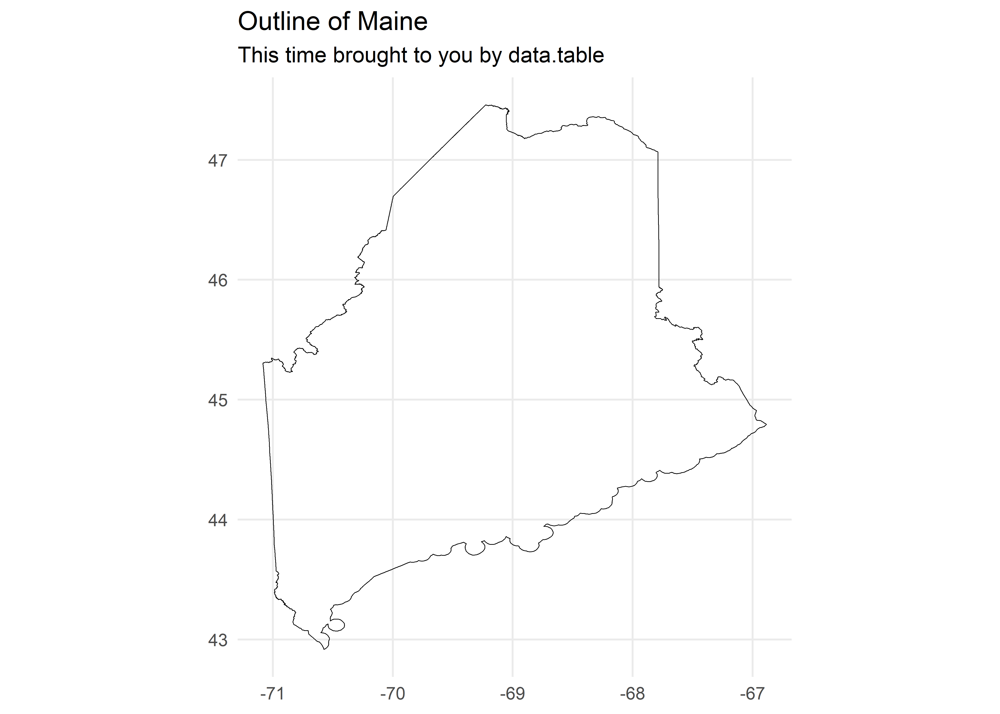<!-- -->

Of course, it's also possible to efficiently convert between the two classes --- e.g. with `as.data.table()` and `st_as_sf()` --- depending on what a particular section of code does (data wrangling or spatial operation). I find that often use this approach in my own work.

## Further reading

You could easily spend a whole semester (or degree!) on spatial analysis and, more broadly, geocomputation. I've simply tried to give you as much useful information as can reasonably be contained in one lecture. Here are some resources for further reading and study:

- The package websites that I've linked to throughout this tutorial are an obvious next port of call for delving deeper into their functionality: [**sf**](https://github.com/r-spatial/sf), [**leaflet**](https://rstudio.github.io/leaflet/), etc.
- The best overall resource right now may be [*Geocomputation with R*](https://geocompr.robinlovelace.net/index.html), a superb new text by Robin Lovelace, Jakub Nowosad, and Jannes Muenchow. This is a "living", open-source document, which is constantly updated by its authors and features a very modern approach to working with geographic data. Highly recommended.
- Similarly, the rockstar team behind **sf**, Edzer Pebesma and Roger Bivand, are busy writing their own book, [*Spatial Data Science*](https://www.r-spatial.org/book/). This project is currently less developed, but I expect it to become the key reference point in years to come. Imporantly, both of the above books cover **raster-based** spatial data.
- On the subject of raster data... If you're in the market for shorter guides, Jamie Afflerbach has a great introduction to rasters [here](https://rawgit.com/jafflerbach/spatial-analysis-R/gh-pages/intro_spatial_data_R.html). At a slightly more advanced level, UO's very own Ed Rubin has typically excellent tutorial [here](http://edrub.in/ARE212/section13.html). Finally, the **sf** team is busy developing a [new package](https://github.com/r-spatial/stars) called **stars**, which will provide equivalent functionality (among other things) for raster data. **UPDATE:** I ended up caving and wrote up a short set of bonus notes on rasters [here](https://raw.githack.com/uo-ec607/lectures/master/09a-spatial-rasters/09a-spatial-rasters.html).
- If you want more advice on drawing maps, including a bunch that we didn't cover today (choropleths, state-bins, etc.), Kieran Healy's [*Data Vizualisation*](https://socviz.co/maps.html#maps) book has you covered.
- Something else we didn't really cover at all today was **spatial statistics**. This too could be subject to a degree-length treatment. However, for now I'll simply point you to [*Spatio-Temporal Statistics with R*](https://spacetimewithr.org/), by Christopher Wikle and coauthors. (Another free book!) Finally, since it is likely the most interesting thing for economists working with spatial data, I'll also add that Darin Christensen and Thiemo Fetzer have written a very fast R-implementation (via C++) of Conley standard errors. The GitHub repo is [here](https://github.com/darinchristensen/conley-se). See their original [blog post](https://darinchristensen.com/post/2015-08-30-conley/) (and [update](https://darinchristensen.com/post/2017-08-21-correction/)) for more details.
