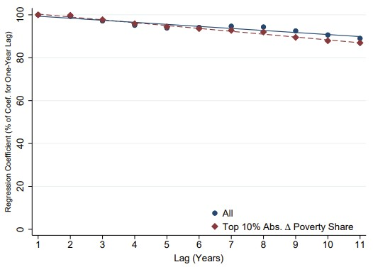
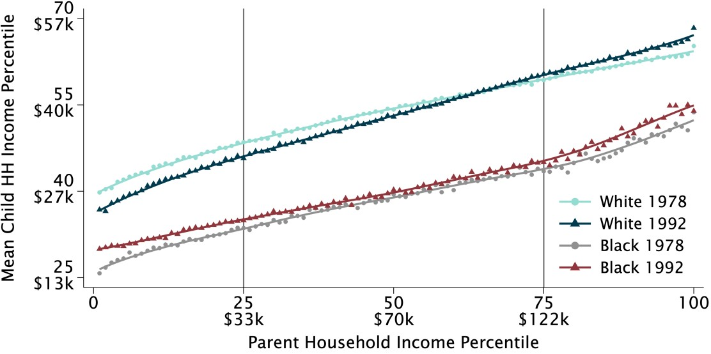

name: toc

```{css, echo=FALSE}
@media print {
  .has-continuation {
    display: block !important;
  }
}
```

```{r setup, include=FALSE}
options(htmltools.dir.version = FALSE)
library(knitr)
opts_chunk$set(
  fig.align="center", fig.width=6, fig.height=4, 
  # out.width="748px", #out.length="520.75px",
  dpi=300, #fig.path='Figs/',
  cache=T, warning=F, message=F#, echo=F 
  )

library(tidyverse)
library(gganimate)
library(broom)
library(fixest)

outcomes <- read_csv('data/national_estimates_by_cohort_primary_outcomes.csv', 
  col_select=c('cohort','kfr_pooled_pooled_p25','kfr_pooled_pooled_p75')) %>%
  rename(kfr_p25=kfr_pooled_pooled_p25, kfr_p75=kfr_pooled_pooled_p75)

outcomes <- mutate(outcomes, 
  kfr_p25_demean=(kfr_p25-mean(kfr_p25))/sd(kfr_p25), 
  kfr_p75_demean=(kfr_p75-mean(kfr_p75))/sd(kfr_p75))

results <- feols(kfr_p75_demean ~ kfr_p25_demean, data=outcomes)

```

# Table of contents

1. [Prologue](#prologue)

2. [Geographical Variation in Upward Mobility](#geo-vary)

3. [Characteristics of High-Mobility Areas](#characteristics)

4. [Spatial Correlation and Decay](#spatial)

---
class: inverse, center, middle
name: prologue

# Prologue

<html><div style='float:left'></div><hr color='#EB811B' size=1px width=796px></html>

---
# Prologue 

- Today's lecture is a little different than the last few

- We're talking about an application of big data to a big question: why do some people move up the income ladder and others don't?

- This is a big question in economics and public policy

- Chetty answered it using big data and spatial analysis
  - By big I mean: essentially all tax returns in the USA from 1989-2015

- He released summaries of the data publicly in 2018 as the Opportunity Atlas

- These show tons of descriptive measures of income mobility at various levels of geography: state, county, and Census Tract

---
class: white-slide

```{r img_wide, echo=F, out.width="90%"}
knitr::include_graphics('pics/fading_dream.png')
```
Source: [Chetty et al. (2014)](https://opportunityinsights.org/paper/recentintergenerationalmobility/)

---
# Why is the "American Dream" Fading? 

- Why are children's chances of climbing the income ladder falling in the USA?
  
  - What can be done to reverse this trend?

- Need to go beyond macroeconomic data to ansawer this question. Why?
  
  - Too many changes happening over time and across space to separate out the causal factors.

  - Also: only a handful of data points (classic macro problem)

---
# Enter the Opportunity Atlas 

- Created in 2018, the Opportunity Atlas offers one measure of how income mobility differs by location in the USA
  
  - If some areas have more mobility than others, can we learn why and apply those lessons elsewhere?

- Data sources: 
  - Anonymized Census data (2000, 2010 ACS) covering U.S. population
  - Federal income tax returns from 1989-2015.

- Method: Link parents based on dependent claiming on tax returns 

- Target sample: Children born between 1978-1983 (U.S. citizens and authorized immigrants who arrived as children)

There's bound to be a messy with this much data, so they create an analysis sample

- **Analysis sample**: 20.5 million children, 96% coverge of target sample

---
# Toolkit to use these data

- Data cleaning and wrangling

- Data visualization

- Spatial analysis

- Regression analysis

---
# Incomes in Tax Data

- Parent household incomes: average income reported on Form 1040 tax return from 1994-2000

- Children incomes measured from tax returns in 2014-15 (ages 31-37)

- But income levels differ over time! How do we compare them?

  - Use percentile ranks in the *national* distribution
  - Rank children relative to others born in same year and parents relative to other parents

- [What is a percentile?](https://www.mentimeter.com/app/presentation/blkhnym4ou7ejzod9b1gc6b24id49nr5/xeit9p23asph)

--

- **Income percentile**: The fraction of the national income distribution that a person's income exceeds

- Take average income percentile of children by parental income percentile

---
# Average Child Income Percentile by Parent Income Percentile

```{r oppatlas, echo=F,warning=FALSE,message=FALSE,dev="svg"}
opatlas <- read_csv(
    'https://opportunityinsights.org/wp-content/uploads/2018/10/national_percentile_outcomes.csv',
    col_select=c('par_pctile','kfr_pooled_pooled')) %>%
    mutate(kfr_pooled_pooled=kfr_pooled_pooled*100)

child25 <- opatlas %>% filter(par_pctile==25) %>% pull(kfr_pooled_pooled) %>% round(0)

opatlas %>%
  ggplot(aes(x=par_pctile, y=kfr_pooled_pooled)) +
    geom_point() +
    geom_smooth(method='lm') +
    geom_point(data=filter(opatlas, par_pctile==25), color='red', size=4) +
    geom_segment(x=25,xend=25,y=0,yend=child25, color='black', linetype='dashed') +
    geom_segment(x=0,xend=25,y=child25,yend=child25, color='black', linetype='dashed') +
    geom_text(aes(label=paste0('Predicted Value Given Parents at\n25th percentile=',child25,'st percentile'), 
              x=25, y=child25), hjust= -.35, vjust=-.1, color='black') +
    labs(x='Mean Child Rank in National Income Distribution',y='Parent Rank in National Income Distribution') +
    xlim(0,100) + ylim(20,70) + # Force axes
    scale_x_continuous(expand = c(0, 0)) + 
    scale_y_continuous(expand = c(0, 0)) +
    theme_bw()
```
Source: [The Opportunity Atlas](https://opportunityinsights.org/data/)

---
class: inverse, center, middle
name: geo-vary
# Geographic Variation in Upward Mobility

<html><div style='float:left'></div><hr color='#EB811B' size=1px width=796px></html>

---
# What is mobility for a given area?

- Run this same regression of income ranks by Census tract, county, or commuting zone in the USA<sup>1</sup>
  - Census tracts are small geographic areas that contain 1,200-8,000 people

- For simplicity, Chetty et al. (2018) report the average income percentile of children whose parents were at the 25th percentile of the national income distribution

- This is a single measure of upward mobility that is easy to understand and compare across areas
  - It is not the only measure, but it is a good one

- **Big data tip**: Sensibly summary statisics make big data more useful
  - The right statistic depends on the question you're asking

- [Where do you think has the lowest upward mobility? The highest?](https://www.mentimeter.com/app/presentation/blkhnym4ou7ejzod9b1gc6b24id49nr5/9zp5t7zs6ot5)

.footnote[<sup>1</sup> Technical detail: Weight each child by fraction of childhood (up to 23) in a given area to account for movement across areas during childhood]

---
```{r op_atlas_map, echo=F, out.width="90%"}
knitr::include_graphics('pics/op_atlas_map.png')
```

*Note: Blue = More Upward Mobility, Red = Less Upward Mobility*
Source: [The Opportunity Atlas](https://opportunityinsights.org/data/)

---
# All that data and still limitations?

- They worked with the near universe of tax returns in the USA from 1989-2015

- Yet, they still have limitations

- What are a few?

--

- Underscores a key point: data limitations are a fact of life no matter how much data you have 

- You are always simplifying the world to make it fit into data

- We use models to make sense of what those limitations are

- Even if you do not think you are using a model, you are

---
# What model? I didn't write one

- A model is a simplification of the world

- It outlines the variables that you assume are systematically related to each other

- e.g. Chetty et al. use tax data to measure income mobility
  - Unreported income is not included 
  - Do you think unreported income is systematically underreported for some groups? In some areas? 
  - To some extent this can be tested

- Can anyone think of examples of places where hidden models are used to interpret data?

--

- Economic wellbeing summarized by income percentile

- GDP per capita as an indicator of economic development

- More lead paint in old buildings $\Rightarrow$ Pre-1950s housing proxies for lead exposure

- New construction is slow, so pre-1950s housing measured today likely holds for the past

---
# Inferences about today

Chetty et al. extrapolate from cohorts born in the 80s to make inferences about today
- Assumption: mobility is not systematically changing over time, but it may lose precision
- Tests for "correlation" between mobility measures for cohorts born earlier in history

```{r autocovariance, echo=F, out.width="75%"}

```

---
# Sometimes more data is the answer

- After a few years, the Opp Atlas team (Chetty, Dobbie, Goldman, Porter, and Yang 2024) updated with more data

- They repeat the same analysis for cohorts born between 1978 and 1992<sup>2</sup>
  - Measure adulthood income from 2005 to 2019

- Able to look at how mobility has changed over time by cohort, location, other demographics

- Indications that mobility has increased over time for some, but not all groups

.footnote[<sup>2</sup> I'm in the data!]

---
# Mobility trends shift over time

```{r mobility_trends, echo=F, out.width="90%",warning=FALSE,message=FALSE,cache=TRUE}
# download.file('https://www2.census.gov/ces/opportunity/national_estimates_by_cohort_primary_outcomes.csv', destfile='data/national_estimates_by_cohort_primary_outcomes.csv')

outcomes_long <- read_csv('data/national_estimates_by_cohort_primary_outcomes.csv', 
  col_select=c('cohort','kfr_pooled_pooled_p1','kfr_pooled_pooled_p25','kfr_pooled_pooled_p50','kfr_pooled_pooled_p75','kfr_pooled_pooled_p100')) %>%
  pivot_longer(cols=-cohort, names_to='percentile', values_to='income_percentile',names_prefix='kfr_pooled_pooled_p') %>% 
  mutate(percentile=as.numeric(str_replace(percentile,'p',''),
    income_percentile=100*income_percentile),
    cohort=as.factor(cohort)) 

# Make gif of trends that changes over time with gganimate

ggplot(outcomes_long, aes(x = percentile, y = income_percentile,color=cohort))+
    geom_point()+
    geom_smooth(method = "lm", se = FALSE) +
    theme_bw() +
    theme(legend.position = "none") +
    transition_states(cohort, transition_length=1, state_length=30) +
    ease_aes('linear') +
    labs(title='Cohort: {closest_state}',y='Income Percentile',x='Parent Income Percentile') +
    shadow_mark(alpha=0.5)
```

---
# Racial differences 

```{r racial diff,echo=FALSE,warning=FALSE,message=FALSE,out.width="90%"}

```

---
class: inverse, center, middle
name: characteristics
# Characteristics of High-Mobility Areas

<html><div style='float:left'></div><hr color='#EB811B' size=1px width=796px></html>

---
# Why does upward mobility differ? 

Armed with a summary measure of upward mobility, we can ask:

- Why do some areas have more upward mobility than others?

- Spatial and correlational analysis is a good place to start

- What are potential characteristics of high mobility areas?

  - Better jobs?
  - Better schools? 
  - Institutional differences?
  - Culture? 

---
# Upward Mobility vs. Job Growth

```{r job_growth, echo=F, out.width="90%"}
knitr::include_graphics('pics/metro_areas.png')
```

---
# How to calculate a correlation

- Quick review: what is a correlation?

- Mathematically:

$$ \text{Correlation} = \frac{\text{Cov}(X,Y)}{\text{SD}(X)\text{SD}(Y)} $$

- Intuitively, what is it? 

--

- It is a measure of how two variables move together normalized to be between -1 and 1

- What are some ways to calculation a correlation in R?

```{r correlation}
corr <- cor(outcomes$kfr_p25, outcomes$kfr_p75)
print(paste("This correlation between 25th and 75th percentile mobility is:", corr))
```

---
# Z-score to get correlation with regression

- One handy way to calculate a correlation is to use regression, exploiting the formula for the coefficient

In a regression, the coefficient on $X$:

$$ \beta = \frac{\text{Cov}(X,Y)}{\text{Var}(X)} $$

$$ \text{Cov}(X,Y) = \frac{1}{n}\sum_{i=1}^{n}(X_i - \bar{X})(Y_i - \bar{Y})$$ 

$$\text{Var}(X) = \frac{1}{n}\sum_{i=1}^{n}(X_i - \bar{X})^2 $$

- Subtract means and divide by the standard deviation, or "z-score," we'll calculate the correlation with a regression coefficient

- Why do this? 
  - It is easy to interpret a coefficient
  - It is easy to get a confidence interval
  - It is easy to control for other variables
  - Great way to normalize wildly different variables

---
# Let's test it out

```{r correlation_regression,eval=FALSE}
# library(fixest); library(broom) # already loaded
# Finish this code! 
# I renamed kfr_pooled_pooled_p25 to kfr_p25 and kfr_pooled_pooled_p75 to kfr_p75
outcomes <- mutate(outcomes, 
  kfr_p25_demean=, 
  kfr_p75_demean=)

results <- feols(kfr_p75_demean ~ kfr_p25_demean, data=outcomes)
#diff <- round(results$coefficients[['kfr_p25_demean']] - corr,16)
diff <- NA
etable(results) %>% # table it
  kable() %>% # make it prettier
  print() # print it
print(paste("Correlation function and z-scored regression approach are within",diff,"of each other"))
```

---
# Correlation vs. Regression

```{r answer,echo=FALSE}
diff <- round(results$coefficients[['kfr_p25_demean']] - corr,16)

etable(results) %>% # table it
  kable() %>% # make it prettier
  print() # print it
print(paste("Correlation function and z-scored regression approach are within",diff,"of each other"))

```

---
# Actual correlates

1. Segregation: Greater racial and income segregation associated with lower levels of mobility

2. Income Inequality: Places with smaller middle class have less mobility

3. School Quality: Higher expenditure, smaller classes, higher test scores correlated with more mobility

4. Family Structure: 
  - Areas with more single parents have lower mobility
  - Strong correlation even for kids whose *own* parents are married
  - This result is a puzzling one and the focus of much recent and (somewhat controversially) reported on research

5. Social Capital
  - It takes a village to raise a child
  - Chetty et al. (2023) leveraged Facebook Data to create the Social Capital Atlas

---
# Why do we care about correlation? 

- We all know correlation is not causation

- We'll discuss this in-depth after break if you don't believe me

- So why are we talking about correlation at all?

- One of the first steps in understanding a complex system is to understand how variables are related

- This is especially true when we have a lot of data

- Plus, almost ever causal relationship is just a correlation with a story
  - Story might be: I ran an experiment and found a correlation with a randomly assigned treatment
  - But the story might be: I assume some natural variation in the data is like a random assignment and I found a correlation

---
class: inverse, center, middle
name: spatial

# Spatial Correlation and Decay

<html><div style='float:left'></div><hr color='#EB811B' size=1px width=796px></html>

---
# Big question: why don't people move? 

- If some areas have more mobility than others, why don't people move to those areas?

- Is it rent? 

---
# The Price of Opportunity in Seattle
Upward Mobility vs Median Rent by Neighborhood

```{r seattle, echo=F, out.width="90%"}
knitr::include_graphics('pics/seattle_opportunity.png')
```

---
# Big question: why don't people move? 

- Initial experiments indicate benefits exist from moving (we'll see later)

- If some areas have more mobility than others, why don't people move to those areas?

- Is it rent? 

- Other costs of moving? 

- Maybe they do not want to move as far? 

- Overall, this is not a highly effective approach

---
# Well what if we invest locally? 

- What if we invest in the areas that have low mobility? (place-based approach)

- Would there be spillovers between locations? 
  - It is tough to improve one neighborhood (e.g. a tract), let alone many at once
  - Do we have to improve them all at once to help people? 

- The answer to this question changes the policy approach

---
# Spatial decay suggests localized effects

```{r spatial, echo=F, out.width="90%"}
knitr::include_graphics('pics/spatial_correlation_decay.png')
```

---

# Overall Takeaways

- Correlation evidence is suggestive, but not causal

- Causality requires a more focused approach 

- We will build this toolkit in the next few lectures

---
class: inverse, center, middle

# Next lecture: Spatial Analysis and Opportunity Atlas
<html><div style='float:left'></div><hr color='#EB811B' size=1px width=796px></html>

```{r gen_pdf, include = FALSE, cache = FALSE, eval = TRUE}
infile=knitr::current_input() %>% str_replace(".Rmd", ".html")
#infile = list.files(pattern = '.html')
pagedown::chrome_print(input = infile, timeout = 100)
```