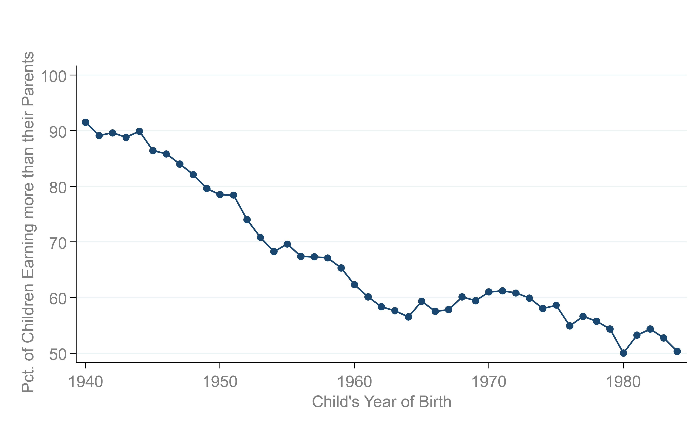
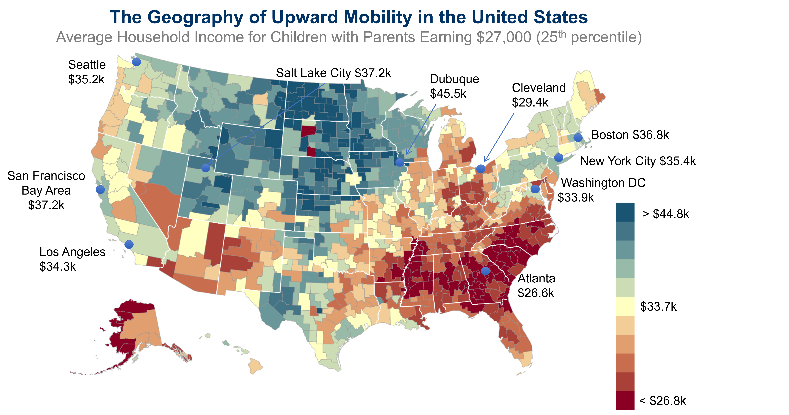
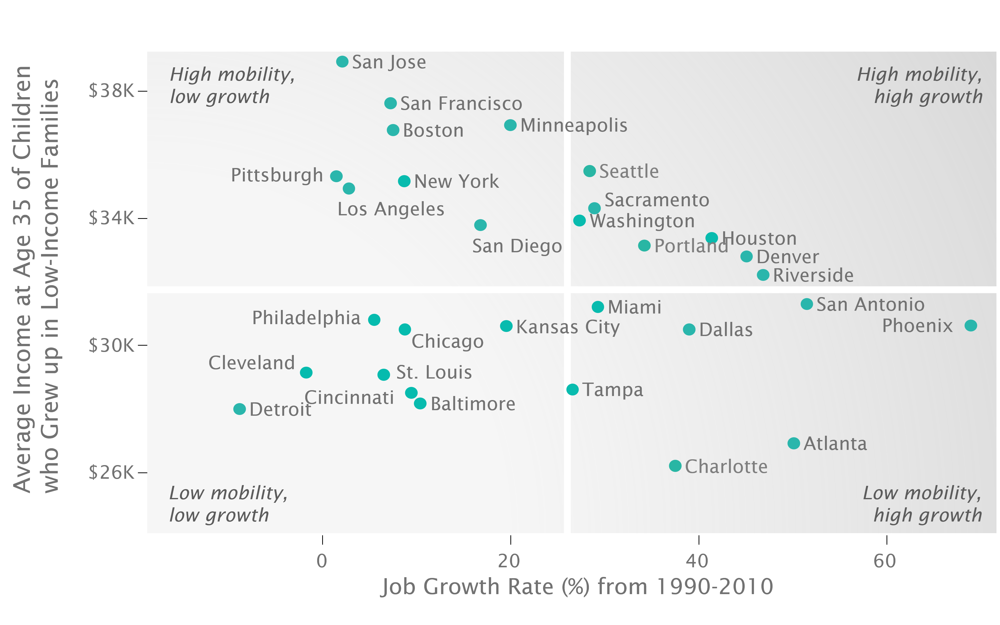
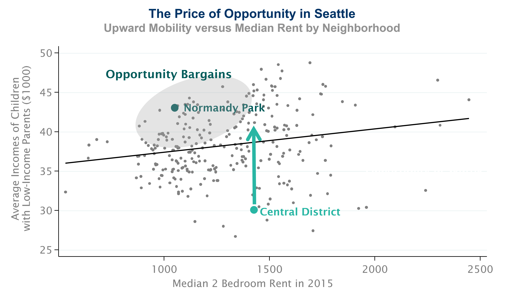
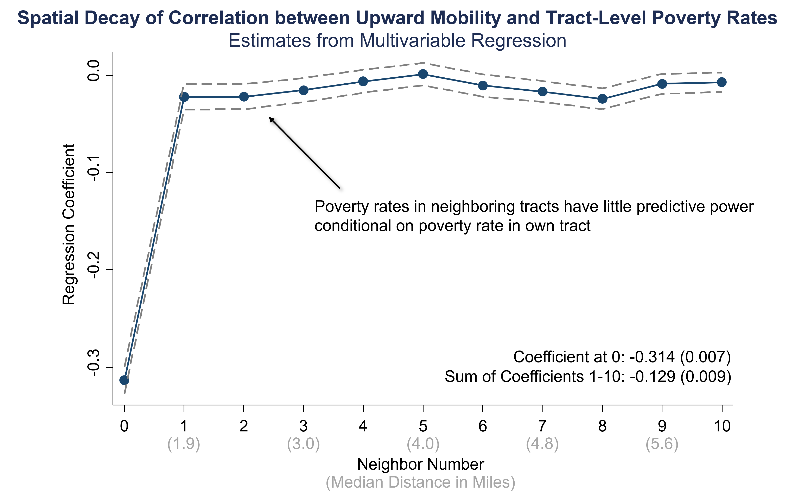

name: toc

```{css, echo=FALSE}
@media print {
  .has-continuation {
    display: block !important;
  }
}
```

```{r setup, include=FALSE}
options(htmltools.dir.version = FALSE)
library(knitr)
opts_chunk$set(
  fig.align="center", fig.width=6, fig.height=4, 
  # out.width="748px", #out.length="520.75px",
  dpi=300, #fig.path='Figs/',
  cache=T#, echo=F, warning=F, message=F
  )

library(tidyverse)
```

# Table of contents

1. [Prologue](#prologue)

2. [Geographical Variation in Upward Mobility](#geo-vary)

3. [Characteristics of High-Mobility Areas](#characteristics)

4. [Spatial Correlation and Decay](#spatial)

---
class: inverse, center, middle
name: prologue

# Prologue

<html><div style='float:left'></div><hr color='#EB811B' size=1px width=796px></html>

---

```{r img_wide, echo=F, out.width="90%"}

```
Source: [Chetty et al. (2014)](https://opportunityinsights.org/paper/recentintergenerationalmobility/)

---
# Why is the "American Dream" Fading? 

- Why are children's chances of climbing the income ladder falling in the USA?
  
  - What can be done to reverse this trend?

- Need to go beyond macroeconomic data to ansawer this question. Why?
  
  - Too many changes happening over time and across space to separate out the causal factors.

  - Also: only a handful of data points (classic macro problem)

---
# Enter the Opportunity Atlas 

- Created in 2018, the Opportunity Atlas offers one measure of how income mobility differs by location in the USA
  
  - If some areas have more mobility than others, can we learn why and apply those lessons elsewhere?

- Data sources: 
  - Anonymized Census data (2000, 2010 ACS) covering U.S. population
  - Federal income tax returns from 1989-2015.

- Method: Link parents based on dependent claiming on tax returns 

- Target sample: Children born between 1978-1983 (U.S. citizens and authorized immigrants who arrived as children)

There's bound to be a messy with this much data, so they create an analysis sample

- **Analysis sample**: 20.5 million children, 96% coverge of target sample

---
# Toolkit to use these data

- Data cleaning and wrangling

- Data visualization

- Spatial analysis

- Regression analysis (next class)

---
# Parent and Children Incomes in Tax Data

- Parent household incomes: average income reported on Form 1040 tax return from 1994-2000

- Children incomes measured from tax returns in 2014-15 (ages 31-37)

- But income levels differ over time! How do we compare them?

  - Use percentile ranks in the *national* distribution
  - Rank children relative to others born in same year and parents relative to other parents

- **Income percentile**: The fraction of the national income distribution that a person's income exceeds

- Take average income percentile of children by parental income percentile

---
# Average Child Income Percentile by Parent Income Percentile
```{r oppatlas, echo=F,warning=FALSE,message=FALSE,dev="svg"}
opatlas <- read_csv(
    'https://opportunityinsights.org/wp-content/uploads/2018/10/national_percentile_outcomes.csv',
    col_select=c('par_pctile','kfr_pooled_pooled')) %>%
    mutate(kfr_pooled_pooled=kfr_pooled_pooled*100)

child25 <- opatlas %>% filter(par_pctile==25) %>% pull(kfr_pooled_pooled) %>% round(0)

opatlas %>%
  ggplot(aes(x=par_pctile, y=kfr_pooled_pooled)) +
    geom_point() +
    geom_smooth(method='lm') +
    geom_point(data=filter(opatlas, par_pctile==25), color='red', size=4) +
    geom_segment(x=25,xend=25,y=0,yend=child25, color='black', linetype='dashed') +
    geom_segment(x=0,xend=25,y=child25,yend=child25, color='black', linetype='dashed') +
    geom_text(aes(label=paste0('Predicted Value Given Parents at\n25th percentile=',child25,'st percentile'), 
              x=25, y=child25), hjust= -.35, vjust=-.1, color='black') +
    labs(x='Mean Child Rank in National Income Distribution',y='Parent Rank in National Income Distribution') +
    xlim(0,100) + ylim(20,70) + # Force axes
    scale_x_continuous(expand = c(0, 0)) + 
    scale_y_continuous(expand = c(0, 0)) +
    theme_bw()
```
Source: [The Opportunity Atlas](https://opportunityinsights.org/data/)

---
class: inverse, center, middle
name: geo-vary
# Geographic Variation in Upward Mobility

<html><div style='float:left'></div><hr color='#EB811B' size=1px width=796px></html>

---
# What is mobility for each Census tract? 

- Run this same regression of income ranks by Census tract in the USA 
  - Census tracts are small geographic areas that contain 1,200-8,000 people
  
- Technical detail: Weight each child by fraction of childhood (up to 23) in a given area
  - Accounts for movement across areas during childhood

---
```{r op_atlas_map, echo=F, out.width="90%"}

```

*Note: Blue = More Upward Mobility, Red = Less Upward Mobility*
Source: [The Opportunity Atlas](https://opportunityinsights.org/data/)

---
class: inverse, center, middle
name: characteristics
# Characteristics of High-Mobility Areas

<html><div style='float:left'></div><hr color='#EB811B' size=1px width=796px></html>

---
# Why does upward mobility differ across areas? 

- Why do some areas have more upward mobility than others?

- Spatial and correlational analysis is a good place to start

- What are potential characteristics of high mobility areas?

  - Better jobs?
  - Better schools? 
  - Institutional differences?
  - Culture? 

---
# Upward Mobility vs. Job Growth in 30 Largest Metro Areas

```{r job_growth, echo=F, out.width="90%"}

```

*Note: You'll make a version of this on your problem set.*
*Source: [Using Big Data to Solve Economic and Social Problems: Neighborhood Effects lecture](https://opportunityinsights.org/wp-content/uploads/2019/05/Lecture-2-neighborhood-effects-1.pdf)*

---
# Actual correlates

1. Segregation: Greater racial and income segregation associated with lower levels of mobility

2. Income Inequality: Places with smaller middle class have less mobility

3. School Quality: Higher expenditure, smaller classes, higher test scores correlated with more mobility

4. Family Structure: 
  - Areas with more single parents have lower mobility
  - Strong correlation even for kids whose *own* parents are married

5. Social Capital
  - It takes a village to raise a child
  - Chetty et al. (2023) leveraged Facebook Data to create the Social Capital Atlas

We'll look at some of these relationships (and their applications) in more detail in the coming weeks.

---
class: inverse, center, middle
name: spatial

# Spatial Correlation and Decay

<html><div style='float:left'></div><hr color='#EB811B' size=1px width=796px></html>

---
# Big question: why don't people move? 

- If some areas have more mobility than others, why don't people move to those areas?

- Is it rent? 

---
# The Price of Opportunity in Seattle
Upward Mobility vs Median Rent by Neighborhood

```{r seattle, echo=F, out.width="90%"}

```

---
# Big question: why don't people move? 

- Initial experiments indicate benefits exist from moving (we'll see later)

- If some areas have more mobility than others, why don't people move to those areas?

- Is it rent? 

- Other costs of moving? 

- Maybe they do not want to move as far? 

- Overall, this is not a highly effective approach

---
# Well what if we invest locally? 

- What if we invest in the areas that have low mobility? (place-based approach)

- Would there be spillovers between locations? 
  - It is tough to improve one neighborhood (e.g. a tract), let alone many at once
  - Do we have to improve them all at once to help people? 

- The answer to this question changes the policy approach

---
# Spatial decay of Correlation between Upward Mobility and Tract-level poverty

```{r spatial, echo=F, out.width="90%"}

```

--- 

# Overall Takeaways

- Correlation evidence is suggestive, but not causal

- Causality requires a more focused approach 

- We will build this toolkit in the next few lectures

---
class: inverse, center, middle

# Next lecture: Regression and Opportunity Atlas 
<html><div style='float:left'></div><hr color='#EB811B' size=1px width=796px></html>

```{r gen_pdf, include = FALSE, cache = FALSE, eval = TRUE}
infile=knitr::current_input() %>% str_replace(".Rmd", ".html")
#infile = list.files(pattern = '.html')
pagedown::chrome_print(input = infile, timeout = 100)
```