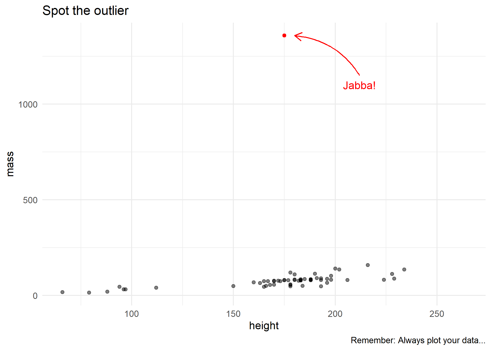

Today's lecture is about the bread-and-butter tool of applied econometrics and data science: regression analysis. My goal is to give you a whirlwind tour of the key functions and packages. I'm going to assume that you already know all of the necessary theoretical background on causal inference, asymptotics, etc. This lecture will *not* cover any of theoretical concepts or seek to justify a particular statistical model. Indeed, most of the models that we're going to run today are pretty silly. We also won't be able to cover some important topics. For example, we won't cover a Bayesian regression model and I won't touch times series analysis at all. (Although, I will provide links for further reading at the bottom of this document.) These disclaimers aside, let's proceed...

## Software requirements

### R packages 

It's important to note that "base" R already provides all of the tools we need for basic regression analysis. However, we'll be using several additional packages today, because they will make our lives easier and offer increased power for some more sophisticated analyses.

- New: **fixest**, **estimatr**, **ivreg**, **sandwich**, **lmtest**,  **mfx**, **margins**, **broom**, **modelsummary**, **vtable**, **rstanarm**
- Already used: **tidyverse**, **hrbrthemes**, **listviewer**

A convenient way to install (if necessary) and load everything is by running the below code chunk.


```r
## Load and install the packages that we'll be using today
if (!require("pacman")) install.packages("pacman")
pacman::p_load(mfx, tidyverse, hrbrthemes, estimatr, ivreg, fixest, sandwich, 
               lmtest, margins, vtable, broom, modelsummary,rstanarm)
## Make sure we have at least version 0.6.0 of ivreg
if (numeric_version(packageVersion("ivreg")) < numeric_version("0.6.0")) install.packages("ivreg")

## My preferred ggplot2 plotting theme (optional)
theme_set(theme_minimal())
```


While we've already loaded all of the required packages for today, I'll try to be as explicit about where a particular function is coming from, whenever I use it below. 

Something else that I want to mention up front is that we'll mostly be working with the `starwars` data frame that we've already seen from previous lectures. Here's a quick reminder of what it looks like to refresh your memory.


```r
starwars
```

```
## # A tibble: 87 × 14
##    name     height  mass hair_color skin_color eye_color birth_year sex   gender
##    <chr>     <int> <dbl> <chr>      <chr>      <chr>          <dbl> <chr> <chr> 
##  1 Luke Sk…    172    77 blond      fair       blue            19   male  mascu…
##  2 C-3PO       167    75 <NA>       gold       yellow         112   none  mascu…
##  3 R2-D2        96    32 <NA>       white, bl… red             33   none  mascu…
##  4 Darth V…    202   136 none       white      yellow          41.9 male  mascu…
##  5 Leia Or…    150    49 brown      light      brown           19   fema… femin…
##  6 Owen La…    178   120 brown, gr… light      blue            52   male  mascu…
##  7 Beru Wh…    165    75 brown      light      blue            47   fema… femin…
##  8 R5-D4        97    32 <NA>       white, red red             NA   none  mascu…
##  9 Biggs D…    183    84 black      light      brown           24   male  mascu…
## 10 Obi-Wan…    182    77 auburn, w… fair       blue-gray       57   male  mascu…
## # ℹ 77 more rows
## # ℹ 5 more variables: homeworld <chr>, species <chr>, films <list>,
## #   vehicles <list>, starships <list>
```


## Regression basics

### The `lm()` function

R's workhorse command for running regression models is the built-in `lm()` function. The "**lm**" stands for "**l**inear **m**odels" and the syntax is very intuitive.

```r
lm(y ~ x1 + x2 + x3 + ..., data = df)
```

You'll note that the `lm()` call includes a reference to the data source (in this case, a hypothetical data frame called `df`). We [covered this](https://raw.githack.com/uo-ec607/lectures/master/04-rlang/04-rlang.html#global_env) in our earlier lecture on R language basics and object-orientated programming, but the reason is that many objects (e.g. data frames) can exist in your R environment at the same time. So we need to be specific about where our regression variables are coming from --- even if `df` is the only data frame in our global environment at the time. 

Let's run a simple bivariate regression of mass on height using our dataset of starwars characters.


```r
ols1 = lm(mass ~ height, data = starwars)
ols1
```

```
## 
## Call:
## lm(formula = mass ~ height, data = starwars)
## 
## Coefficients:
## (Intercept)       height  
##    -13.8103       0.6386
```

The resulting object is pretty terse, but that's only because it buries most of its valuable information --- of which there is a lot --- within its internal list structure. If you're in RStudio, you can inspect this structure by typing `View(ols1)` or simply clicking on the "ols1" object in your environment pane. Doing so will prompt an interactive panel to pop up for you to play around with. That approach won't work for this knitted R Markdown document, however, so I'll use the `listviewer::jsonedit()` function that we saw in the previous lecture instead.


```r
# View(ols1) ## Run this instead if you're in a live session
listviewer::jsonedit(ols1, mode="view") ## Better for R Markdown
```

```{=html}
<div class="jsonedit html-widget html-fill-item-overflow-hidden html-fill-item" id="htmlwidget-a2a52faff9f091fb96c9" style="width:100%;height:10%;"></div>
<script type="application/json" data-for="htmlwidget-a2a52faff9f091fb96c9">{"x":{"data":{"coefficients":{"(Intercept)":-13.81031362873029,"height":0.638571004587035},"residuals":{"1":-19.02389916023971,"2":-17.8310441373046,"3":-15.49250281162508,"4":20.81897070214924,"5":-32.97533705932495,"6":20.14467481223808,"7":-16.55390212813047,"8":-16.13107381621211,"9":-19.0481802106971,"10":-25.40960920611006,"11":-22.24103523363227,"13":-19.78387541711366,"14":-21.13246719693599,"15":-22.66247016482675,"16":1260.060387825999,"17":-17.74675715106565,"18":8.867532803064009,"19":-11.33537267401403,"20":-19.74675715106565,"21":-24.84818021069709,"22":26.09611271132331,"23":5.481822757193662,"24":-20.21675418317489,"25":-18.93961217400082,"26":-18.13246719693599,"29":-22.3839347749288,"30":-20.3610471051953,"31":-20.43389025656744,"32":-18.15674824739337,"34":-45.34960327032854,"35":-47.22959139876551,"39":-17.70963888501763,"42":-17.93961217400082,"44":-44.85532518776192,"45":-1.215360802451011,"47":-25.2767601189564,"48":-22.24103523363227,"49":-30.62674527950262,"50":-24.34960327032854,"52":-53.68675121528413,"55":-26.24103523363227,"57":-19.32532221987117,"60":-23.0481802106971,"61":-38.54675715106563,"62":-42.1924731327175,"64":-29.43389025656744,"66":-24.0481802106971,"67":-38.46961514189157,"68":-10.62674527950262,"69":-44.42244642170069,"72":-21.6367957336455,"74":-61.43389025656744,"76":-42.85532518776192,"77":34.87897663793076,"78":0.3846985553641376,"79":-27.24103523363227,"80":-51.85532518776192,"81":-37.73531331619889,"87":-46.55390212813047},"effects":{"(Intercept)":-747.4666135053026,"height":172.7838894656719,"3":-8.915074731913563,"4":21.41940001574283,"5":-29.44279514348483,"6":22.09838686533007,"7":-13.86716192447685,"8":-9.61003251731303,"9":-17.37640206166727,"10":-23.6814442762678,"11":-20.85119098866461,"12":-20.64950240464334,"13":-19.29152870546887,"14":-20.4268242076726,"15":1262.183260221528,"16":-15.34195085147419,"17":10.70847129453113,"18":-3.066341169929515,"19":-17.34195085147419,"20":-23.17640206166727,"21":26.80931558654177,"22":6.75889344053645,"23":-18.20665534927047,"24":-16.81673977847153,"25":-16.29152870546887,"26":-15.35541244871782,"27":-17.39237299747951,"28":-19.32597991566195,"29":-16.93606434486302,"30":-44.41085327186035,"31":-47.86967126304546,"32":-12.03439929830505,"33":-15.81673977847153,"34":-42.90161313466994,"35":5.47484083888537,"36":-22.47724635367791,"37":-20.85119098866461,"38":-29.80076884265929,"39":-23.41085327186035,"40":-52.07135984706674,"41":-24.85119098866461,"42":-17.76631763246621,"43":-21.37640206166727,"44":-36.14195085147418,"45":-39.56211970987632,"46":-28.32597991566195,"47":-22.37640206166727,"48":-35.95203528067525,"49":-9.800768842659295,"50":-45.3444601900428,"51":-14.10079238012261,"52":-60.32597991566195,"53":-40.90161313466994,"54":34.68999102015029,"55":-0.8192491170401368,"56":-25.85119098866461,"57":-49.90161313466994,"58":-37.36043112585504,"59":-43.86716192447685},"rank":2,"fitted.values":{"1":96.02389916023971,"2":92.8310441373046,"3":47.49250281162508,"4":115.1810292978508,"5":81.97533705932494,"6":99.85532518776192,"7":91.55390212813047,"8":48.13107381621211,"9":103.0481802106971,"10":102.4096092061101,"11":106.2410352336323,"13":131.7838754171137,"14":101.132467196936,"15":96.66247016482674,"16":97.93961217400101,"17":94.74675715106565,"18":101.132467196936,"19":28.33537267401403,"20":94.74675715106565,"21":103.0481802106971,"22":113.9038872886767,"23":107.5181772428063,"24":99.21675418317488,"25":97.93961217400081,"26":101.132467196936,"29":42.3839347749288,"30":88.3610471051953,"31":109.4338902565675,"32":108.1567482473934,"34":111.3496032703285,"35":129.2295913987655,"39":57.70963888501763,"42":97.93961217400081,"44":99.85532518776192,"45":46.21536080245101,"47":90.2767601189564,"48":106.2410352336323,"49":112.6267452795026,"50":111.3496032703285,"52":103.6867512152841,"55":106.2410352336323,"57":104.3253222198712,"60":103.0481802106971,"61":94.74675715106564,"62":92.19247313271751,"64":109.4338902565675,"66":103.0481802106971,"67":93.46961514189158,"68":112.6267452795026,"69":132.4224464217007,"72":36.6367957336455,"74":109.4338902565674,"76":99.85532518776192,"77":124.1210233620692,"78":135.6153014446359,"79":106.2410352336323,"80":99.85532518776192,"81":117.7353133161989,"87":91.55390212813046},"assign":[0,1],"qr":{"qr":[[-7.681145747868608,-1336.649549040119],[0.1301889109808239,270.5789774739483],[0.1301889109808239,0.2874747075066835],[0.1301889109808239,-0.1042778262251945],[0.1301889109808239,0.08790266202063247],[0.1301889109808239,-0.0155791393425051],[0.1301889109808239,0.03246598271895163],[0.1301889109808239,0.2837789288865715],[0.1301889109808239,-0.03405803244306538],[0.1301889109808239,-0.03036225382295333],[0.1301889109808239,-0.05253692554362567],[0.1301889109808239,-0.2003680703481079],[0.1301889109808239,-0.02297069658272922],[0.1301889109808239,0.002899753758055178],[0.1301889109808239,-0.004491803482168935],[0.1301889109808239,0.01398708961839135],[0.1301889109808239,-0.02297069658272922],[0.1301889109808239,0.3983480661100453],[0.1301889109808239,0.01398708961839135],[0.1301889109808239,-0.03405803244306538],[0.1301889109808239,-0.09688626898497035],[0.1301889109808239,-0.05992848278384978],[0.1301889109808239,-0.01188336072239305],[0.1301889109808239,-0.004491803482168935],[0.1301889109808239,-0.02297069658272922],[0.1301889109808239,0.31704093646758],[0.1301889109808239,0.05094487581951192],[0.1301889109808239,-0.07101581864418595],[0.1301889109808239,-0.06362426140396184],[0.1301889109808239,-0.08210315450452212],[0.1301889109808239,-0.1855849558676597],[0.1301889109808239,0.2283422495848906],[0.1301889109808239,-0.004491803482168935],[0.1301889109808239,-0.0155791393425051],[0.1301889109808239,0.2948662647469076],[0.1301889109808239,0.03985753995917574],[0.1301889109808239,-0.05253692554362567],[0.1301889109808239,-0.08949471174474624],[0.1301889109808239,-0.08210315450452212],[0.1301889109808239,-0.03775381106317744],[0.1301889109808239,-0.05253692554362567],[0.1301889109808239,-0.0414495896832895],[0.1301889109808239,-0.03405803244306538],[0.1301889109808239,0.01398708961839135],[0.1301889109808239,0.02877020409883958],[0.1301889109808239,-0.07101581864418595],[0.1301889109808239,-0.03405803244306538],[0.1301889109808239,0.02137864685861546],[0.1301889109808239,-0.08949471174474624],[0.1301889109808239,-0.20406384896822],[0.1301889109808239,0.3503029440485885],[0.1301889109808239,-0.07101581864418595],[0.1301889109808239,-0.0155791393425051],[0.1301889109808239,-0.1560187269067632],[0.1301889109808239,-0.2225427420687803],[0.1301889109808239,-0.05253692554362567],[0.1301889109808239,-0.0155791393425051],[0.1301889109808239,-0.1190609407056427],[0.1301889109808239,0.03246598271895163]],"qraux":[1.130188910980824,1.025074425478728],"pivot":[1,2],"tol":1e-07,"rank":2},"df.residual":57,"na.action":{},"xlevels":{},"call":{},"terms":{},"model":{"mass":[77,75,32,136,49,120,75,32,84,77,84,112,80,74,1358,77,110,17,75,78.2,140,113,79,79,83,20,68,89,90,66,82,40,80,55,45,65,84,82,87,50,80,85,80,56.2,50,80,79,55,102,88,15,48,57,159,136,79,48,80,45],"height":[172,167,96,202,150,178,165,97,183,182,188,228,180,173,175,170,180,66,170,183,200,190,177,175,180,88,160,193,191,196,224,112,175,178,94,163,188,198,196,184,188,185,183,170,166,193,183,168,198,229,79,193,178,216,234,188,178,206,165]}},"options":{"mode":"view","modes":["text","tree","table"]}},"evals":[],"jsHooks":[]}</script>
```

As we can see, this `ols1` object has a bunch of important slots... containing everything from the regression coefficients, to vectors of the residuals and fitted (i.e. predicted) values, to the rank of the design matrix, to the input data, etc. etc. To summarise the key pieces of information, we can use the --- *wait for it* --- generic `summary()` function. This will look pretty similar to the default regression output from Stata that many of you will be used to.


```r
summary(ols1)
```

```
## 
## Call:
## lm(formula = mass ~ height, data = starwars)
## 
## Residuals:
##     Min      1Q  Median      3Q     Max 
##  -61.43  -30.03  -21.13  -17.73 1260.06 
## 
## Coefficients:
##             Estimate Std. Error t value Pr(>|t|)
## (Intercept) -13.8103   111.1545  -0.124    0.902
## height        0.6386     0.6261   1.020    0.312
## 
## Residual standard error: 169.4 on 57 degrees of freedom
##   (28 observations deleted due to missingness)
## Multiple R-squared:  0.01792,	Adjusted R-squared:  0.0006956 
## F-statistic:  1.04 on 1 and 57 DF,  p-value: 0.312
```

We can then dig down further by extracting a summary of the regression coefficients:


```r
summary(ols1)$coefficients
```

```
##               Estimate  Std. Error    t value  Pr(>|t|)
## (Intercept) -13.810314 111.1545260 -0.1242443 0.9015590
## height        0.638571   0.6260583  1.0199865 0.3120447
```

### Get "tidy" regression coefficients with the `broom` package

While it's easy to extract regression coefficients via the `summary()` function, in practice I always use the **broom** package ([link ](https://broom.tidyverse.org/)) to do so. **broom** has a bunch of neat features to convert regression (and other statistical) objects into "tidy" data frames. This is especially useful because regression output is so often used as an input to something else, e.g. a plot of coefficients or marginal effects. Here, I'll use `broom::tidy(..., conf.int = TRUE)` to coerce the `ols1` regression object into a tidy data frame of coefficient values and key statistics.


```r
# library(broom) ## Already loaded

tidy(ols1, conf.int = TRUE)
```

```
## # A tibble: 2 × 7
##   term        estimate std.error statistic p.value conf.low conf.high
##   <chr>          <dbl>     <dbl>     <dbl>   <dbl>    <dbl>     <dbl>
## 1 (Intercept)  -13.8     111.       -0.124   0.902 -236.       209.  
## 2 height         0.639     0.626     1.02    0.312   -0.615      1.89
```

Again, I could now pipe this tidied coefficients data frame to a **ggplot2** call, using saying `geom_pointrange()` to plot the error bars. Feel free to practice doing this yourself now, but we'll get to some explicit examples further below.

**broom** has a couple of other useful functions too. For example, `broom::glance()` summarises the model "meta" data (R<sup>2</sup>, AIC, etc.) in a data frame.


```r
glance(ols1)
```

```
## # A tibble: 1 × 12
##   r.squared adj.r.squared sigma statistic p.value    df logLik   AIC   BIC
##       <dbl>         <dbl> <dbl>     <dbl>   <dbl> <dbl>  <dbl> <dbl> <dbl>
## 1    0.0179      0.000696  169.      1.04   0.312     1  -386.  777.  783.
## # ℹ 3 more variables: deviance <dbl>, df.residual <int>, nobs <int>
```

By the way, if you're wondering how to export regression results to other formats (e.g. LaTeX tables), don't worry: We'll [get to that](#regression-tables) at the end of the lecture.

### Regressing on subsetted data

Our simple model isn't particularly good; the R<sup>2</sup> is only 0.018. Different species and homeworlds aside, we may have an extreme outlier in our midst...

<!-- -->

Maybe we should exclude Jabba from our regression? You can do this in two ways: 1) Create a new data frame and then regress, or 2) Subset the original data frame directly in the `lm()` call.

#### 1) Create a new data frame

Recall that we can keep multiple objects in memory in R. So we can easily create a new data frame that excludes Jabba using, say, **dplyr** ([lecture](https://raw.githack.com/uo-ec607/lectures/master/05-tidyverse/05-tidyverse.html)) or **data.table** ([lecture](https://raw.githack.com/uo-ec607/lectures/master/05-datatable/05-datatable.html)). For these lecture notes, I'll stick with **dplyr** commands since that's where our starwars dataset is coming from. But it would be trivial to switch to **data.table** if you prefer.


```r
starwars2 =
  starwars %>% 
  filter(name != "Jabba Desilijic Tiure")
  # filter(!(grepl("Jabba", name))) ## Regular expressions also work

ols2 = lm(mass ~ height, data = starwars2)
summary(ols2)
```

```
## 
## Call:
## lm(formula = mass ~ height, data = starwars2)
## 
## Residuals:
##     Min      1Q  Median      3Q     Max 
## -39.382  -8.212   0.211   3.846  57.327 
## 
## Coefficients:
##              Estimate Std. Error t value Pr(>|t|)    
## (Intercept) -32.54076   12.56053  -2.591   0.0122 *  
## height        0.62136    0.07073   8.785 4.02e-12 ***
## ---
## Signif. codes:  0 '***' 0.001 '**' 0.01 '*' 0.05 '.' 0.1 ' ' 1
## 
## Residual standard error: 19.14 on 56 degrees of freedom
##   (28 observations deleted due to missingness)
## Multiple R-squared:  0.5795,	Adjusted R-squared:  0.572 
## F-statistic: 77.18 on 1 and 56 DF,  p-value: 4.018e-12
```

#### 2) Subset directly in the `lm()` call

Running a regression directly on a subsetted data frame is equally easy.


```r
ols2a = lm(mass ~ height, data = starwars %>% filter(!(grepl("Jabba", name))))
summary(ols2a)
```

```
## 
## Call:
## lm(formula = mass ~ height, data = starwars %>% filter(!(grepl("Jabba", 
##     name))))
## 
## Residuals:
##     Min      1Q  Median      3Q     Max 
## -39.382  -8.212   0.211   3.846  57.327 
## 
## Coefficients:
##              Estimate Std. Error t value Pr(>|t|)    
## (Intercept) -32.54076   12.56053  -2.591   0.0122 *  
## height        0.62136    0.07073   8.785 4.02e-12 ***
## ---
## Signif. codes:  0 '***' 0.001 '**' 0.01 '*' 0.05 '.' 0.1 ' ' 1
## 
## Residual standard error: 19.14 on 56 degrees of freedom
##   (28 observations deleted due to missingness)
## Multiple R-squared:  0.5795,	Adjusted R-squared:  0.572 
## F-statistic: 77.18 on 1 and 56 DF,  p-value: 4.018e-12
```

The overall model fit is much improved by the exclusion of this outlier, with R<sup>2</sup> increasing to 0.58. Still, we should be cautious about throwing out data. Another approach is to handle or account for outliers with statistical methods. Which provides a nice segue to nonstandard errors.

## Nonstandard errors

Dealing with statistical irregularities (heteroskedasticity, clustering, etc.) is a fact of life for empirical researchers. However, it says something about the economics profession that a random stranger could walk uninvited into a live seminar and ask, "How did you cluster your standard errors?", and it would likely draw approving nods from audience members. 

The good news is that there are *lots* of ways to get nonstandard errors in R. For many years, these have been based on the excellent **sandwich** package ([link](http://sandwich.r-forge.r-project.org/articles/sandwich.html)). However, here I'll demonstrate using the **estimatr** package ([link](https://declaredesign.org/r/estimatr/articles/getting-started.html)), which is both fast and provides convenient aliases for the standard regression functions. Some examples follow below. 

### Robust standard errors

You can obtain heteroskedasticity-consistent (HC) "robust" standard errors using `estimatr::lm_robust()`. Let's illustrate by implementing a robust version of the `ols1` regression that we ran earlier. Note that **estimatr** models automatically print in pleasing tidied/summary format, although you can certainly pipe them to `tidy()` too.


```r
# library(estimatr) ## Already loaded

ols1_robust = lm_robust(mass ~ height, data = starwars)
# tidy(ols1_robust, conf.int = TRUE) ## Could tidy too
ols1_robust
```

```
##               Estimate  Std. Error    t value     Pr(>|t|)    CI Lower
## (Intercept) -13.810314 23.45557632 -0.5887859 5.583311e-01 -60.7792950
## height        0.638571  0.08791977  7.2631109 1.159161e-09   0.4625147
##               CI Upper DF
## (Intercept) 33.1586678 57
## height       0.8146273 57
```

The package defaults to using Eicker-Huber-White robust standard errors, commonly referred to as "HC2" standard errors. You can easily specify alternate methods using the `se_type = ` argument.^[See the [package documentation](https://declaredesign.org/r/estimatr/articles/mathematical-notes.html#lm_robust-notes) for a full list of options.] For example, you can specify Stata robust standard errors if you want to replicate code or results from that language. (See [here](https://declaredesign.org/r/estimatr/articles/stata-wls-hat.html) for more details on why this isn't the default and why Stata's robust standard errors differ from those in R and Python.)


```r
lm_robust(mass ~ height, data = starwars, se_type = "stata")
```

```
##               Estimate  Std. Error    t value     Pr(>|t|)    CI Lower
## (Intercept) -13.810314 23.36219608 -0.5911394 5.567641e-01 -60.5923043
## height        0.638571  0.08616105  7.4113649 6.561046e-10   0.4660365
##               CI Upper DF
## (Intercept) 32.9716771 57
## height       0.8111055 57
```

**estimatr** also supports robust instrumental variable (IV) regression. However, I'm going to hold off discussing these until we get to the [IV section](#instrumental-variables) below. 

#### Aside on HAC (Newey-West) standard errors

On thing I want to flag is that **estimatr** does not yet offer support for HAC (i.e. heteroskedasticity *and* autocorrelation consistent) standard errors *a la* [Newey-West](https://en.wikipedia.org/wiki/Newey%E2%80%93West_estimator). I've submitted a [feature request](https://github.com/DeclareDesign/estimatr/issues/272) on GitHub --- vote up if you would like to see it added sooner! --- but you can still obtain these pretty easily using the aforementioned **sandwich** package. For example, we can use `sandwich::NeweyWest()` on our existing `ols1` object to obtain HAC SEs for it.


```r
# library(sandwich) ## Already loaded

# NeweyWest(ols1) ## Print the HAC VCOV
sqrt(diag(NeweyWest(ols1))) ## Print the HAC SEs
```

```
## (Intercept)      height 
##  21.2694130   0.0774265
```

If you plan to use HAC SEs for inference, then I recommend converting the model object with `lmtest::coeftest()`. This function builds on **sandwich** and provides a convenient way to do [on-the-fly](https://grantmcdermott.com/better-way-adjust-SEs/) hypothesis testing with your model, swapping out a wide variety of alternate variance-covariance (VCOV) matrices. These alternate VCOV matrices could extended way beyond HAC --- including HC, clustered, bootstrapped, etc. --- but here's how it would work for the present case:


```r
# library(lmtest) ## Already loaded

ols1_hac = lmtest::coeftest(ols1, vcov = NeweyWest)
ols1_hac
```

```
## 
## t test of coefficients:
## 
##               Estimate Std. Error t value  Pr(>|t|)    
## (Intercept) -13.810314  21.269413 -0.6493    0.5187    
## height        0.638571   0.077427  8.2474 2.672e-11 ***
## ---
## Signif. codes:  0 '***' 0.001 '**' 0.01 '*' 0.05 '.' 0.1 ' ' 1
```

Note that its easy to convert `coeftest()`-adjusted models to tidied **broom** objects too. 


```r
tidy(ols1_hac, conf.int = TRUE)
```

```
## # A tibble: 2 × 7
##   term        estimate std.error statistic  p.value conf.low conf.high
##   <chr>          <dbl>     <dbl>     <dbl>    <dbl>    <dbl>     <dbl>
## 1 (Intercept)  -13.8     21.3       -0.649 5.19e- 1  -56.4      28.8  
## 2 height         0.639    0.0774     8.25  2.67e-11    0.484     0.794
```

### Clustered standard errors

Clustered standard errors is an issue that most commonly affects panel data. As such, I'm going to hold off discussing clustering until we get to the [panel data section](#high-dimensional-fes-and-multiway-clustering) below. But here's a quick example of clustering with `estimatr::lm_robust()` just to illustrate:


```r
lm_robust(mass ~ height, data = starwars, clusters = homeworld)
```

```
##               Estimate  Std. Error    t value     Pr(>|t|)    CI Lower
## (Intercept) -9.3014938 28.84436408 -0.3224718 0.7559158751 -76.6200628
## height       0.6134058  0.09911832  6.1886211 0.0002378887   0.3857824
##               CI Upper       DF
## (Intercept) 58.0170751 7.486034
## height       0.8410291 8.195141
```

## Dummy variables and interaction terms

For the next few sections, it will prove convenient to demonstrate using a subsample of the starwars data that comprises only the human characters. Let's quickly create this new dataset before continuing.


```r
humans = 
  starwars %>% 
  filter(species=="Human") %>%
  select(where(Negate(is.list))) ## Drop list columns (optional)
humans
```

```
## # A tibble: 35 × 11
##    name     height  mass hair_color skin_color eye_color birth_year sex   gender
##    <chr>     <int> <dbl> <chr>      <chr>      <chr>          <dbl> <chr> <chr> 
##  1 Luke Sk…    172    77 blond      fair       blue            19   male  mascu…
##  2 Darth V…    202   136 none       white      yellow          41.9 male  mascu…
##  3 Leia Or…    150    49 brown      light      brown           19   fema… femin…
##  4 Owen La…    178   120 brown, gr… light      blue            52   male  mascu…
##  5 Beru Wh…    165    75 brown      light      blue            47   fema… femin…
##  6 Biggs D…    183    84 black      light      brown           24   male  mascu…
##  7 Obi-Wan…    182    77 auburn, w… fair       blue-gray       57   male  mascu…
##  8 Anakin …    188    84 blond      fair       blue            41.9 male  mascu…
##  9 Wilhuff…    180    NA auburn, g… fair       blue            64   male  mascu…
## 10 Han Solo    180    80 brown      fair       brown           29   male  mascu…
## # ℹ 25 more rows
## # ℹ 2 more variables: homeworld <chr>, species <chr>
```

### Dummy variables as *factors*

Dummy variables are a core component of many regression models. However, these can be a pain to create in some statistical languages, since you first have to tabulate a whole new matrix of binary variables and then append it to the original data frame. In contrast, R has a very convenient framework for creating and evaluating dummy variables in a regression: Simply specify the variable of interest as a [factor](https://r4ds.had.co.nz/factors.html).^[Factors are variables that have distinct qualitative levels, e.g. "male", "female", "hermaphrodite", etc.]

Here's an example where we explicitly tell R that "gender" is a factor. Since I don't plan on reusing this model, I'm just going to print the results to screen rather than saving it to my global environment.


```r
summary(lm(mass ~ height + as.factor(gender), data = humans))
```

```
## 
## Call:
## lm(formula = mass ~ height + as.factor(gender), data = humans)
## 
## Residuals:
##     Min      1Q  Median      3Q     Max 
## -16.068  -8.130  -3.660   0.702  37.112 
## 
## Coefficients:
##                            Estimate Std. Error t value Pr(>|t|)  
## (Intercept)                -84.2520    65.7856  -1.281   0.2157  
## height                       0.8787     0.4075   2.156   0.0441 *
## as.factor(gender)masculine  10.7391    13.1968   0.814   0.4259  
## ---
## Signif. codes:  0 '***' 0.001 '**' 0.01 '*' 0.05 '.' 0.1 ' ' 1
## 
## Residual standard error: 15.19 on 19 degrees of freedom
##   (13 observations deleted due to missingness)
## Multiple R-squared:  0.444,	Adjusted R-squared:  0.3855 
## F-statistic: 7.587 on 2 and 19 DF,  p-value: 0.003784
```

Okay, I should tell you that I'm actually making things more complicated than they need to be with the heavy-handed emphasis on factors. R is "friendly" and tries to help whenever it thinks you have misspecified a function or variable. While this is something to be [aware of](https://rawgit.com/grantmcdermott/R-intro/master/rIntro.html#r_tries_to_guess_what_you_meant), normally It Just Works^TM^. A case in point is that we don't actually *need* to specify a string (i.e. character) variable as a factor in a regression. R will automatically do this for you regardless, since it's the only sensible way to include string variables in a regression.


```r
## Use the non-factored version of "gender" instead; R knows it must be ordered
## for it to be included as a regression variable
summary(lm(mass ~ height + gender, data = humans))
```

```
## 
## Call:
## lm(formula = mass ~ height + gender, data = humans)
## 
## Residuals:
##     Min      1Q  Median      3Q     Max 
## -16.068  -8.130  -3.660   0.702  37.112 
## 
## Coefficients:
##                 Estimate Std. Error t value Pr(>|t|)  
## (Intercept)     -84.2520    65.7856  -1.281   0.2157  
## height            0.8787     0.4075   2.156   0.0441 *
## gendermasculine  10.7391    13.1968   0.814   0.4259  
## ---
## Signif. codes:  0 '***' 0.001 '**' 0.01 '*' 0.05 '.' 0.1 ' ' 1
## 
## Residual standard error: 15.19 on 19 degrees of freedom
##   (13 observations deleted due to missingness)
## Multiple R-squared:  0.444,	Adjusted R-squared:  0.3855 
## F-statistic: 7.587 on 2 and 19 DF,  p-value: 0.003784
```


### Interaction effects

Like dummy variables, R provides a convenient syntax for specifying interaction terms directly in the regression model without having to create them manually beforehand.^[Although there are very good reasons that you might want to modify your parent variables before doing so (e.g. centering them). As it happens, I'm [on record](https://twitter.com/grant_mcdermott/status/903691491414917122) as stating that interaction effects are most widely misunderstood and misapplied concept in econometrics. However, that's a topic for another day.] You can use any of the following expansion operators:

- `x1:x2` "crosses" the variables (equivalent to including only the x1 × x2 interaction term)
- `x1/x2` "nests" the second variable within the first (equivalent to `x1 + x1:x2`; more on this [later](#nestedmarg))
- `x1*x2` includes all parent and interaction terms (equivalent to `x1 + x2 + x1:x2`) 

As a rule of thumb, if [not always](#nestedmarg), it is generally advisable to include all of the parent terms alongside their interactions. This makes the `*` option a good default. 

For example, we might wonder whether the relationship between a person's body mass and their height is modulated by their gender. That is, we want to run a regression of the form,

$$Mass = \beta_0 + \beta_1 D_{Male} + \beta_2 Height + \beta_3 D_{Male} \times Height$$

To implement this in R, we simply run the following,


```r
ols_ie = lm(mass ~ gender * height, data = humans)
summary(ols_ie)
```

```
## 
## Call:
## lm(formula = mass ~ gender * height, data = humans)
## 
## Residuals:
##     Min      1Q  Median      3Q     Max 
## -16.250  -8.158  -3.684  -0.107  37.193 
## 
## Coefficients:
##                        Estimate Std. Error t value Pr(>|t|)
## (Intercept)            -61.0000   204.0565  -0.299    0.768
## gendermasculine        -15.7224   219.5440  -0.072    0.944
## height                   0.7333     1.2741   0.576    0.572
## gendermasculine:height   0.1629     1.3489   0.121    0.905
## 
## Residual standard error: 15.6 on 18 degrees of freedom
##   (13 observations deleted due to missingness)
## Multiple R-squared:  0.4445,	Adjusted R-squared:  0.3519 
## F-statistic: 4.801 on 3 and 18 DF,  p-value: 0.01254
```

## Instrumental variables

As you would have guessed by now, there are a number of ways to run instrumental variable (IV) regressions in R. I'll walk through three different options using the `ivreg::ivreg()`, `estimatr::iv_robust()`, and `fixest::feols()` functions, respectively. These are all going to follow a similar syntax, where the IV first-stage regression is specified in a multi-part formula (i.e. where formula parts are separated by one or more pipes, **`|`**). However, there are also some subtle and important differences, which is why I want to go through each of them. After that, I'll let you decide which of the three options is your favourite.

The dataset that we'll be using for this section describes cigarette demand for the 48 continental US states in 1995, and is taken from the **ivreg** package. Here's a quick a peek:


```r
data("CigaretteDemand", package = "ivreg")
head(CigaretteDemand)
```

```
##        packs   rprice  rincome  salestax   cigtax  packsdiff  pricediff
## AL 101.08543 103.9182 12.91535 0.9216975 26.57481 -0.1418075 0.09010222
## AR 111.04297 115.1854 12.16907 5.4850193 36.41732 -0.1462808 0.19998082
## AZ  71.95417 130.3199 13.53964 6.2057067 42.86964 -0.3733741 0.25576681
## CA  56.85931 138.1264 16.07359 9.0363074 40.02625 -0.5682141 0.32079587
## CO  82.58292 109.8097 16.31556 0.0000000 28.87139 -0.3132622 0.22587189
## CT  79.47219 143.2287 20.96236 8.1072834 48.55643 -0.3184911 0.18546746
##    incomediff salestaxdiff  cigtaxdiff
## AL 0.18222144    0.1332853 -3.62965832
## AR 0.15055894    5.4850193  2.03070663
## AZ 0.05379983    1.4004856 14.05923036
## CA 0.02266877    3.3634447 15.86267924
## CO 0.13002974    0.0000000  0.06098283
## CT 0.18404197   -0.7062239  9.52297455
```

Now, assume that we are interested in regressing the number of cigarettes packs consumed per capita on their average price and people's real incomes. The problem is that the price is endogenous, because it is simultaneously determined by demand and supply. So we need to instrument for it using cigarette sales tax. That is, we want to run the following two-stage IV regression. 

$$Price_i = \pi_0 + \pi_1 SalesTax_i + v_i  \hspace{1cm} \text{(First stage)}$$
$$Packs_i = \beta_0 + \beta_2\widehat{Price_i} + \beta_1 RealIncome_i + u_i \hspace{1cm} \text{(Second stage)}$$

### Option 1: `ivreg::ivreg()`

I'll start with `ivreg()` from the **ivreg** package ([link](https://john-d-fox.github.io/ivreg/index.html)).^[Some of you may wondering, but **ivreg** is a dedicated IV-focused package that splits off (and updates) functionality that used to be bundled with the **AER** package.] The `ivreg()` function supports several syntax options for specifying the IV component. I'm going to use the syntax that I find most natural, namely a formula with a three-part RHS: `y ~ ex | en | in`. Implementing our two-stage regression from above may help to illustrate.


```r
# library(ivreg) ## Already loaded

## Run the IV regression. Note the three-part formula RHS.
iv =
  ivreg(
    log(packs) ~            ## LHS: Dependent variable
      log(rincome) |        ## 1st part RHS: Exogenous variable(s)
      log(rprice) |         ## 2nd part RHS: Endogenous variable(s)
      salestax,             ## 3rd part RHS: Instruments
    data = CigaretteDemand
    )
summary(iv)
```

```
## 
## Call:
## ivreg(formula = log(packs) ~ log(rincome) | log(rprice) | salestax, 
##     data = CigaretteDemand)
## 
## Residuals:
##       Min        1Q    Median        3Q       Max 
## -0.611000 -0.086072  0.009423  0.106912  0.393159 
## 
## Coefficients:
##              Estimate Std. Error t value Pr(>|t|)    
## (Intercept)    9.4307     1.3584   6.943 1.24e-08 ***
## log(rprice)   -1.1434     0.3595  -3.181  0.00266 ** 
## log(rincome)   0.2145     0.2686   0.799  0.42867    
## 
## Diagnostic tests:
##                  df1 df2 statistic  p-value    
## Weak instruments   1  45    45.158 2.65e-08 ***
## Wu-Hausman         1  44     1.102      0.3    
## Sargan             0  NA        NA       NA    
## ---
## Signif. codes:  0 '***' 0.001 '**' 0.01 '*' 0.05 '.' 0.1 ' ' 1
## 
## Residual standard error: 0.1896 on 45 degrees of freedom
## Multiple R-Squared: 0.4189,	Adjusted R-squared: 0.3931 
## Wald test: 6.534 on 2 and 45 DF,  p-value: 0.003227
```

**ivreg** has lot of functionality bundled into it, including cool diagnostic tools and full integration with **sandwich** and co. for swapping in different standard errors on the fly. See the [introductory vignette](https://john-d-fox.github.io/ivreg/articles/ivreg.html) for more. 

The only other thing I want to mention briefly is that you may see a number `ivreg()` tutorials using an alternative formula representation. (Remember me saying that the package allows different formula syntax, right?) Specifically, you'll probably see examples that use an older two-part RHS formula like: `y ~ ex + en | ex + in`. Note that here we are writing the `ex` variables on both sides of the `|` separator. The equivalent for our cigarette example would be as follows. Run this yourself to confirm the same output as above.


```r
## Alternative two-part formula RHS (which I like less but YMMV)
iv2 =
  ivreg(
    log(packs) ~                   ## LHS: Dependent var
      log(rincome) + log(rprice) | ## 1st part RHS: Exogenous vars + endogenous vars
      log(rincome) + salestax,     ## 2nd part RHS: Exogenous vars (again) + Instruments
    data = CigaretteDemand
    )
summary(iv2)
```

This two-part syntax is closely linked to the manual implementation of IV, since it requires explicitly stating *all* of your exogenous variables (including instruments) in one slot. However, it requires duplicate typing of the exogenous variables and I personally find it less intuitive to write.^[Note that we didn't specify the endogenous variable (i.e. `log(rprice)`) directly. Rather, we told R what the *exogenous* variables were. It then figured out which variables were endogenous and needed to be instrumented in the first-stage.] But different strokes for different folks. 


### Option 2: `estimatr::iv_robust()`

Our second IV option comes from the **estimatr** package that we saw earlier. This will default to using HC2 robust standard errors although, as before, we could specify other options if we so wished (including clustering). Currently, the function doesn't accept the three-part RHS formula. But the two-part version works exactly the same as it did for `ivreg()`. All we need to do is change the function call to `estimatr::iv_robust()`.


```r
# library(estimatr) ## Already loaded

## Run the IV regression with robust SEs. Note the two-part formula RHS.
iv_reg_robust = 
  iv_robust( ## Only need to change the function call. Everything else stays the same.
    log(packs) ~  
      log(rincome) + log(rprice) |
      log(rincome) + salestax,
    data = CigaretteDemand
    )
summary(iv_reg_robust, diagnostics = TRUE)
```

```
## 
## Call:
## iv_robust(formula = log(packs) ~ log(rincome) + log(rprice) | 
##     log(rincome) + salestax, data = CigaretteDemand)
## 
## Standard error type:  HC2 
## 
## Coefficients:
##              Estimate Std. Error t value  Pr(>|t|) CI Lower CI Upper DF
## (Intercept)    9.4307     1.2845   7.342 3.179e-09   6.8436  12.0177 45
## log(rincome)   0.2145     0.3164   0.678 5.012e-01  -0.4227   0.8518 45
## log(rprice)   -1.1434     0.3811  -3.000 4.389e-03  -1.9110  -0.3758 45
## 
## Multiple R-squared:  0.4189 ,	Adjusted R-squared:  0.3931 
## F-statistic: 7.966 on 2 and 45 DF,  p-value: 0.001092
```

## Other models

### Generalised linear models (logit, etc.)

To run a generalised linear model (GLM), we use the in-built `glm()` function and simply assign an appropriate [family](https://stat.ethz.ch/R-manual/R-devel/library/stats/html/family.html) (which describes the error distribution and corresponding link function). For example, here's a simple logit model.


```r
glm_logit = glm(am ~ cyl + hp + wt, data = mtcars, family = binomial)
summary(glm_logit)
```

```
## 
## Call:
## glm(formula = am ~ cyl + hp + wt, family = binomial, data = mtcars)
## 
## Coefficients:
##             Estimate Std. Error z value Pr(>|z|)  
## (Intercept) 19.70288    8.11637   2.428   0.0152 *
## cyl          0.48760    1.07162   0.455   0.6491  
## hp           0.03259    0.01886   1.728   0.0840 .
## wt          -9.14947    4.15332  -2.203   0.0276 *
## ---
## Signif. codes:  0 '***' 0.001 '**' 0.01 '*' 0.05 '.' 0.1 ' ' 1
## 
## (Dispersion parameter for binomial family taken to be 1)
## 
##     Null deviance: 43.2297  on 31  degrees of freedom
## Residual deviance:  9.8415  on 28  degrees of freedom
## AIC: 17.841
## 
## Number of Fisher Scoring iterations: 8
```

Alternatively, you may recall me saying earlier that **fixest** supports nonlinear models. So you could (in this case, without fixed-effects) also estimate:


```r
feglm(am ~ cyl + hp + wt, data = mtcars, family = binomial)
```

```
## GLM estimation, family = binomial, Dep. Var.: am
## Observations: 32 
## Standard-errors: IID 
##              Estimate Std. Error   t value Pr(>|t|)    
## (Intercept) 19.702883   8.540119  2.307097 0.021049 *  
## cyl          0.487598   1.127568  0.432433 0.665427    
## hp           0.032592   0.019846  1.642249 0.100538    
## wt          -9.149471   4.370163 -2.093623 0.036294 *  
## ---
## Signif. codes:  0 '***' 0.001 '**' 0.01 '*' 0.05 '.' 0.1 ' ' 1
## Log-Likelihood: -4.92075   Adj. Pseudo R2: 0.633551
##            BIC: 23.7         Squared Cor.: 0.803395
```

Remember that the estimates above simply reflect the naive coefficient values, which enter multiplicatively via the link function. We'll get a dedicated section on extracting [marginal effects](#marginal-effects) from non-linear models in a moment. But I do want to quickly flag the **mfx** package ([link](https://cran.r-project.org/web/packages/mfx/vignettes/mfxarticle.pdf)), which provides convenient aliases for obtaining marginal effects from a variety of GLMs. For example,


```r
# library(mfx) ## Already loaded
## Be careful: mfx loads the MASS package, which produces a namespace conflict
## with dplyr for select(). You probably want to be explicit about which one you 
## want, e.g. `select = dplyr::select`

## Get marginal effects for the above logit model
# logitmfx(am ~ cyl + hp + wt, atmean = TRUE, data = mtcars) ## Can also estimate directly
logitmfx(glm_logit, atmean = TRUE, data = mtcars)
```

```
## Call:
## logitmfx(formula = glm_logit, data = mtcars, atmean = TRUE)
## 
## Marginal Effects:
##          dF/dx  Std. Err.       z  P>|z|
## cyl  0.0537504  0.1132652  0.4746 0.6351
## hp   0.0035927  0.0029037  1.2373 0.2160
## wt  -1.0085932  0.6676628 -1.5106 0.1309
```

### Even more models

Of course, there are simply too many other models and other estimation procedures to cover in this lecture. A lot of these other models that you might be thinking of come bundled with the base R installation. But just to highlight a few, mostly new packages that I like a lot for specific estimation procedures:

- Difference-in-differences (with variable timing, etc.): **did** ([link](https://github.com/bcallaway11/did)) and **DRDID** ([link](https://pedrohcgs.github.io/DRDID/))
- Synthetic control: **tidysynth** ([link](https://github.com/edunford/tidysynth)), **gsynth** ([link](https://yiqingxu.org/software/gsynth/gsynth_examples.html)) and **scul** ([link](https://hollina.github.io/scul/))
- Count data (hurdle models, etc.): **pscl** ([link](https://cran.r-project.org/web/packages/pscl/vignettes/countreg.pdf))
- Lasso: **biglasso** ([link](https://github.com/YaohuiZeng/biglasso))
- Causal forests: **grf** ([link](https://grf-labs.github.io/grf/))
- etc.

Finally, just a reminder to take a look at the [Further Resources](#further-resources) links at the bottom of this document to get a sense of where to go for full-length econometrics courses and textbooks.

## Marginal effects

Calculating marginal effects in a linear regression model like OLS is perfectly straightforward... just look at the coefficient values. But that quickly goes out the window when you have interaction terms or non-linear models like probit, logit, etc. Luckily, there are various ways to obtain these from R models. For example, we already saw the **mfx** package above for obtaining marginal effects from GLM models. I want to briefly focus on two of my favourite methods for obtaining marginal effects across different model classes: 1) The **margins** package and 2) a shortcut that works particularly well for models with interaction terms.

### The **margins** package

The **margins** package ([link](https://cran.r-project.org/web/packages/margins)), which is modeled on its namesake in Stata, is great for obtaining marginal effects across an entire range of models.^[I do, however, want to flag that it does [not yet support](https://github.com/leeper/margins/issues/128) **fixest** (or **lfe**) models. But there are [workarounds](https://github.com/leeper/margins/issues/128#issuecomment-636372023) in the meantime.] You can read more in the package [vignette](https://cran.r-project.org/web/packages/margins/vignettes/Introduction.html), but here's a very simple example to illustrate. 

Consider our interaction effects regression [from earlier](#interaction-effects), where we were interested in how people's mass varied by height and gender. To get the average marginal effect (AME) of these dependent variables, we can just use the `margins::margins()` function.


```r
# library(margins) ## Already loaded

ols_ie_marg = margins(ols_ie)
```

Like a normal regression object, we can get a nice print-out display of the above object by summarising or tidying it.


```r
# summary(ols_ie_marg) ## Same effect
tidy(ols_ie_marg, conf.int = TRUE)
```

```
## # A tibble: 2 × 7
##   term            estimate std.error statistic p.value conf.low conf.high
##   <chr>              <dbl>     <dbl>     <dbl>   <dbl>    <dbl>     <dbl>
## 1 gendermasculine   13.5      26.8       0.505  0.613  -38.9        66.0 
## 2 height             0.874     0.420     2.08   0.0376   0.0503      1.70
```

If we want to compare marginal effects at specific values --- e.g. how the AME of height on mass differs across genders --- then that's easily done too.


```r
ols_ie %>% 
  margins(
    variables = "height", ## The main variable we're interested in
    at = list(gender = c("masculine", "feminine")) ## How the main variable is modulated by at specific values of a second variable
    ) %>% 
  tidy(conf.int = TRUE) ## Tidy it (optional)
```

```
## # A tibble: 2 × 9
##   term   at.variable at.value  estimate std.error statistic p.value conf.low
##   <chr>  <chr>       <fct>        <dbl>     <dbl>     <dbl>   <dbl>    <dbl>
## 1 height gender      masculine    0.896     0.443     2.02   0.0431   0.0278
## 2 height gender      feminine     0.733     1.27      0.576  0.565   -1.76  
## # ℹ 1 more variable: conf.high <dbl>
```

If you're the type of person who prefers visualizations (like me), then you should consider `margins::cplot()`, which is the package's in-built method for constructing *conditional* effect plots.


```r
cplot(ols_ie, x = "gender", dx = "height", what = "effect", 
      data = humans)
```

<!-- -->

In this case,it doesn't make much sense to read a lot into the larger standard errors on the female group; that's being driven by a very small sub-sample size.

Finally, you can also use `cplot()` to plot the predicted values of your outcome variable (here: "mass"), conditional on one of your dependent variables. For example:


```r
par(mfrow=c(1, 2)) ## Just to plot these next two (base) figures side-by-side
cplot(ols_ie, x = "gender", what = "prediction", data = humans)
cplot(ols_ie, x = "height", what = "prediction", data = humans)
```

<!-- -->

```r
par(mfrow=c(1, 1)) ## Reset plot defaults
```

Note that `cplot()` uses the base R plotting method. If you'd prefer **ggplot2** equivalents, take a look at the **marginsplot** package ([link](https://github.com/vincentarelbundock/marginsplot)).

Finally, I also want to draw your attention to the **emmeans** package ([link](https://cran.r-project.org/web/packages/emmeans/index.html)), which provides very similar functionality to **margins**. I'm not as familiar with it myself, but I know that it has many fans.

### Special case: `/` shortcut for interaction terms {#nestedmarg}

I'll keep this one brief, but I wanted to mention one of my favourite R shortcuts: Obtaining the full marginal effects for interaction terms by using the `/` expansion operator. I've [tweeted](https://twitter.com/grant_mcdermott/status/1202084676439085056?s=20) about this and even wrote an [whole blog post](https://grantmcdermott.com/2019/12/16/interaction-effects/) about it too (which you should totally read). But the very short version is that you can switch out the normal `f1 * x2` interaction terms syntax for `f1 / x2` and it automatically returns the full marginal effects. (The formal way to describe it is that the model variables have been "nested".)

Here's a super simple example, using the same interaction effects model from before.


```r
# ols_ie = lm(mass ~ gender * height, data = humans) ## Original model
ols_ie_marg2 = lm(mass ~ gender / height, data = humans)
tidy(ols_ie_marg2, conf.int = TRUE)
```

```
## # A tibble: 4 × 7
##   term                   estimate std.error statistic p.value conf.low conf.high
##   <chr>                     <dbl>     <dbl>     <dbl>   <dbl>    <dbl>     <dbl>
## 1 (Intercept)             -61.0     204.      -0.299   0.768  -4.90e+2    368.  
## 2 gendermasculine         -15.7     220.      -0.0716  0.944  -4.77e+2    446.  
## 3 genderfeminine:height     0.733     1.27     0.576   0.572  -1.94e+0      3.41
## 4 gendermasculine:height    0.896     0.443    2.02    0.0582 -3.46e-2      1.83
```

Note that the marginal effects on the two gender × height interactions (i.e. 0.733 and 0.896) are the same as we got with the `margins::margins()` function [above](#the-margins-package). 

Where this approach really shines is when you are estimating interaction terms in large models. The **margins** package relies on a numerical delta method which can be very computationally intensive, whereas using `/` adds no additional overhead beyond calculating the model itself. Still, that's about as much as say it here. Read my aforementioned [blog post](https://grantmcdermott.com/2019/12/16/interaction-effects/) if you'd like to learn more.

## Presentation

### Tables

#### Regression tables

There are loads of [different options](https://hughjonesd.github.io/huxtable/design-principles.html) here. We've already seen the excellent `etable()` function from **fixest** above.^[Note that `etable()` is limited to fixest models only.] However, my own personal favourite tool or creating and exporting regression tables is the **modelsummary** package ([link](https://vincentarelbundock.github.io/modelsummary)). It is extremely flexible and handles all manner of models and output formats. **modelsummary** also supports automated coefficient plots and data summary tables, which I'll get back to in a moment. The [documentation](https://vincentarelbundock.github.io/modelsummary/articles/modelsummary.html) is outstanding and you should read it, but here is a bare-boned example just to demonstrate.


```r
# library(modelsummary) ## Already loaded

## Note: msummary() is an alias for modelsummary()
msummary(list(ols1, ols_ie))
```

<table class="table" style="width: auto !important; margin-left: auto; margin-right: auto;">
 <thead>
  <tr>
   <th style="text-align:left;">   </th>
   <th style="text-align:center;">  (1) </th>
   <th style="text-align:center;">   (2) </th>
  </tr>
 </thead>
<tbody>
  <tr>
   <td style="text-align:left;"> (Intercept) </td>
   <td style="text-align:center;"> −13.810 </td>
   <td style="text-align:center;"> −61.000 </td>
  </tr>
  <tr>
   <td style="text-align:left;">  </td>
   <td style="text-align:center;"> (111.155) </td>
   <td style="text-align:center;"> (204.057) </td>
  </tr>
  <tr>
   <td style="text-align:left;"> height </td>
   <td style="text-align:center;"> 0.639 </td>
   <td style="text-align:center;"> 0.733 </td>
  </tr>
  <tr>
   <td style="text-align:left;">  </td>
   <td style="text-align:center;"> (0.626) </td>
   <td style="text-align:center;"> (1.274) </td>
  </tr>
  <tr>
   <td style="text-align:left;"> gendermasculine </td>
   <td style="text-align:center;">  </td>
   <td style="text-align:center;"> −15.722 </td>
  </tr>
  <tr>
   <td style="text-align:left;">  </td>
   <td style="text-align:center;">  </td>
   <td style="text-align:center;"> (219.544) </td>
  </tr>
  <tr>
   <td style="text-align:left;"> gendermasculine × height </td>
   <td style="text-align:center;">  </td>
   <td style="text-align:center;"> 0.163 </td>
  </tr>
  <tr>
   <td style="text-align:left;box-shadow: 0px 1.5px">  </td>
   <td style="text-align:center;box-shadow: 0px 1.5px">  </td>
   <td style="text-align:center;box-shadow: 0px 1.5px"> (1.349) </td>
  </tr>
  <tr>
   <td style="text-align:left;"> Num.Obs. </td>
   <td style="text-align:center;"> 59 </td>
   <td style="text-align:center;"> 22 </td>
  </tr>
  <tr>
   <td style="text-align:left;"> R2 </td>
   <td style="text-align:center;"> 0.018 </td>
   <td style="text-align:center;"> 0.444 </td>
  </tr>
  <tr>
   <td style="text-align:left;"> R2 Adj. </td>
   <td style="text-align:center;"> 0.001 </td>
   <td style="text-align:center;"> 0.352 </td>
  </tr>
  <tr>
   <td style="text-align:left;"> AIC </td>
   <td style="text-align:center;"> 777.0 </td>
   <td style="text-align:center;"> 188.9 </td>
  </tr>
  <tr>
   <td style="text-align:left;"> BIC </td>
   <td style="text-align:center;"> 783.2 </td>
   <td style="text-align:center;"> 194.4 </td>
  </tr>
  <tr>
   <td style="text-align:left;"> Log.Lik. </td>
   <td style="text-align:center;"> −385.503 </td>
   <td style="text-align:center;"> −89.456 </td>
  </tr>
  <tr>
   <td style="text-align:left;"> F </td>
   <td style="text-align:center;"> 1.040 </td>
   <td style="text-align:center;">  </td>
  </tr>
  <tr>
   <td style="text-align:left;"> RMSE </td>
   <td style="text-align:center;"> 166.50 </td>
   <td style="text-align:center;"> 14.11 </td>
  </tr>
</tbody>
</table>

</br>
One nice thing about **modelsummary** is that it plays very well with R Markdown and will automatically coerce your tables to the format that matches your document output: HTML, LaTeX/PDF, RTF, etc. Of course, you can also [specify the output type](https://vincentarelbundock.github.io/modelsummary/#saving-and-viewing-output-formats) if you aren't using R Markdown and want to export a table for later use. Finally, you can even specify special table formats like *threepartable* for LaTeX and, provided that you have called the necessary packages in your preamble, it will render correctly (see example [here](https://github.com/grantmcdermott/lecturenotes).

#### Summary tables

A variety of summary tables --- balance, correlation, etc. --- can be produced by the companion set of `modelsummary::datasummary*()` functions. Again, you should read the [documentation](https://vincentarelbundock.github.io/modelsummary/articles/datasummary.html) to see all of the options. But here's an example of a very simple balance table using a subset of our "humans" data frame.


```r
datasummary_balance(~ gender,
                    data = humans %>% select(height:mass, birth_year, eye_color, gender))
```

```{=html}
<div id="embidzzxva" style="padding-left:0px;padding-right:0px;padding-top:10px;padding-bottom:10px;overflow-x:auto;overflow-y:auto;width:auto;height:auto;">
<style>#embidzzxva table {
  font-family: system-ui, 'Segoe UI', Roboto, Helvetica, Arial, sans-serif, 'Apple Color Emoji', 'Segoe UI Emoji', 'Segoe UI Symbol', 'Noto Color Emoji';
  -webkit-font-smoothing: antialiased;
  -moz-osx-font-smoothing: grayscale;
}

#embidzzxva thead, #embidzzxva tbody, #embidzzxva tfoot, #embidzzxva tr, #embidzzxva td, #embidzzxva th {
  border-style: none;
}

#embidzzxva p {
  margin: 0;
  padding: 0;
}

#embidzzxva .gt_table {
  display: table;
  border-collapse: collapse;
  line-height: normal;
  margin-left: auto;
  margin-right: auto;
  color: #333333;
  font-size: 16px;
  font-weight: normal;
  font-style: normal;
  background-color: #FFFFFF;
  width: auto;
  border-top-style: solid;
  border-top-width: 2px;
  border-top-color: #A8A8A8;
  border-right-style: none;
  border-right-width: 2px;
  border-right-color: #D3D3D3;
  border-bottom-style: solid;
  border-bottom-width: 2px;
  border-bottom-color: #A8A8A8;
  border-left-style: none;
  border-left-width: 2px;
  border-left-color: #D3D3D3;
}

#embidzzxva .gt_caption {
  padding-top: 4px;
  padding-bottom: 4px;
}

#embidzzxva .gt_title {
  color: #333333;
  font-size: 125%;
  font-weight: initial;
  padding-top: 4px;
  padding-bottom: 4px;
  padding-left: 5px;
  padding-right: 5px;
  border-bottom-color: #FFFFFF;
  border-bottom-width: 0;
}

#embidzzxva .gt_subtitle {
  color: #333333;
  font-size: 85%;
  font-weight: initial;
  padding-top: 3px;
  padding-bottom: 5px;
  padding-left: 5px;
  padding-right: 5px;
  border-top-color: #FFFFFF;
  border-top-width: 0;
}

#embidzzxva .gt_heading {
  background-color: #FFFFFF;
  text-align: center;
  border-bottom-color: #FFFFFF;
  border-left-style: none;
  border-left-width: 1px;
  border-left-color: #D3D3D3;
  border-right-style: none;
  border-right-width: 1px;
  border-right-color: #D3D3D3;
}

#embidzzxva .gt_bottom_border {
  border-bottom-style: solid;
  border-bottom-width: 2px;
  border-bottom-color: #D3D3D3;
}

#embidzzxva .gt_col_headings {
  border-top-style: solid;
  border-top-width: 2px;
  border-top-color: #D3D3D3;
  border-bottom-style: solid;
  border-bottom-width: 2px;
  border-bottom-color: #D3D3D3;
  border-left-style: none;
  border-left-width: 1px;
  border-left-color: #D3D3D3;
  border-right-style: none;
  border-right-width: 1px;
  border-right-color: #D3D3D3;
}

#embidzzxva .gt_col_heading {
  color: #333333;
  background-color: #FFFFFF;
  font-size: 100%;
  font-weight: normal;
  text-transform: inherit;
  border-left-style: none;
  border-left-width: 1px;
  border-left-color: #D3D3D3;
  border-right-style: none;
  border-right-width: 1px;
  border-right-color: #D3D3D3;
  vertical-align: bottom;
  padding-top: 5px;
  padding-bottom: 6px;
  padding-left: 5px;
  padding-right: 5px;
  overflow-x: hidden;
}

#embidzzxva .gt_column_spanner_outer {
  color: #333333;
  background-color: #FFFFFF;
  font-size: 100%;
  font-weight: normal;
  text-transform: inherit;
  padding-top: 0;
  padding-bottom: 0;
  padding-left: 4px;
  padding-right: 4px;
}

#embidzzxva .gt_column_spanner_outer:first-child {
  padding-left: 0;
}

#embidzzxva .gt_column_spanner_outer:last-child {
  padding-right: 0;
}

#embidzzxva .gt_column_spanner {
  border-bottom-style: solid;
  border-bottom-width: 2px;
  border-bottom-color: #D3D3D3;
  vertical-align: bottom;
  padding-top: 5px;
  padding-bottom: 5px;
  overflow-x: hidden;
  display: inline-block;
  width: 100%;
}

#embidzzxva .gt_spanner_row {
  border-bottom-style: hidden;
}

#embidzzxva .gt_group_heading {
  padding-top: 8px;
  padding-bottom: 8px;
  padding-left: 5px;
  padding-right: 5px;
  color: #333333;
  background-color: #FFFFFF;
  font-size: 100%;
  font-weight: initial;
  text-transform: inherit;
  border-top-style: solid;
  border-top-width: 2px;
  border-top-color: #D3D3D3;
  border-bottom-style: solid;
  border-bottom-width: 2px;
  border-bottom-color: #D3D3D3;
  border-left-style: none;
  border-left-width: 1px;
  border-left-color: #D3D3D3;
  border-right-style: none;
  border-right-width: 1px;
  border-right-color: #D3D3D3;
  vertical-align: middle;
  text-align: left;
}

#embidzzxva .gt_empty_group_heading {
  padding: 0.5px;
  color: #333333;
  background-color: #FFFFFF;
  font-size: 100%;
  font-weight: initial;
  border-top-style: solid;
  border-top-width: 2px;
  border-top-color: #D3D3D3;
  border-bottom-style: solid;
  border-bottom-width: 2px;
  border-bottom-color: #D3D3D3;
  vertical-align: middle;
}

#embidzzxva .gt_from_md > :first-child {
  margin-top: 0;
}

#embidzzxva .gt_from_md > :last-child {
  margin-bottom: 0;
}

#embidzzxva .gt_row {
  padding-top: 8px;
  padding-bottom: 8px;
  padding-left: 5px;
  padding-right: 5px;
  margin: 10px;
  border-top-style: solid;
  border-top-width: 1px;
  border-top-color: #D3D3D3;
  border-left-style: none;
  border-left-width: 1px;
  border-left-color: #D3D3D3;
  border-right-style: none;
  border-right-width: 1px;
  border-right-color: #D3D3D3;
  vertical-align: middle;
  overflow-x: hidden;
}

#embidzzxva .gt_stub {
  color: #333333;
  background-color: #FFFFFF;
  font-size: 100%;
  font-weight: initial;
  text-transform: inherit;
  border-right-style: solid;
  border-right-width: 2px;
  border-right-color: #D3D3D3;
  padding-left: 5px;
  padding-right: 5px;
}

#embidzzxva .gt_stub_row_group {
  color: #333333;
  background-color: #FFFFFF;
  font-size: 100%;
  font-weight: initial;
  text-transform: inherit;
  border-right-style: solid;
  border-right-width: 2px;
  border-right-color: #D3D3D3;
  padding-left: 5px;
  padding-right: 5px;
  vertical-align: top;
}

#embidzzxva .gt_row_group_first td {
  border-top-width: 2px;
}

#embidzzxva .gt_row_group_first th {
  border-top-width: 2px;
}

#embidzzxva .gt_summary_row {
  color: #333333;
  background-color: #FFFFFF;
  text-transform: inherit;
  padding-top: 8px;
  padding-bottom: 8px;
  padding-left: 5px;
  padding-right: 5px;
}

#embidzzxva .gt_first_summary_row {
  border-top-style: solid;
  border-top-color: #D3D3D3;
}

#embidzzxva .gt_first_summary_row.thick {
  border-top-width: 2px;
}

#embidzzxva .gt_last_summary_row {
  padding-top: 8px;
  padding-bottom: 8px;
  padding-left: 5px;
  padding-right: 5px;
  border-bottom-style: solid;
  border-bottom-width: 2px;
  border-bottom-color: #D3D3D3;
}

#embidzzxva .gt_grand_summary_row {
  color: #333333;
  background-color: #FFFFFF;
  text-transform: inherit;
  padding-top: 8px;
  padding-bottom: 8px;
  padding-left: 5px;
  padding-right: 5px;
}

#embidzzxva .gt_first_grand_summary_row {
  padding-top: 8px;
  padding-bottom: 8px;
  padding-left: 5px;
  padding-right: 5px;
  border-top-style: double;
  border-top-width: 6px;
  border-top-color: #D3D3D3;
}

#embidzzxva .gt_last_grand_summary_row_top {
  padding-top: 8px;
  padding-bottom: 8px;
  padding-left: 5px;
  padding-right: 5px;
  border-bottom-style: double;
  border-bottom-width: 6px;
  border-bottom-color: #D3D3D3;
}

#embidzzxva .gt_striped {
  background-color: rgba(128, 128, 128, 0.05);
}

#embidzzxva .gt_table_body {
  border-top-style: solid;
  border-top-width: 2px;
  border-top-color: #D3D3D3;
  border-bottom-style: solid;
  border-bottom-width: 2px;
  border-bottom-color: #D3D3D3;
}

#embidzzxva .gt_footnotes {
  color: #333333;
  background-color: #FFFFFF;
  border-bottom-style: none;
  border-bottom-width: 2px;
  border-bottom-color: #D3D3D3;
  border-left-style: none;
  border-left-width: 2px;
  border-left-color: #D3D3D3;
  border-right-style: none;
  border-right-width: 2px;
  border-right-color: #D3D3D3;
}

#embidzzxva .gt_footnote {
  margin: 0px;
  font-size: 90%;
  padding-top: 4px;
  padding-bottom: 4px;
  padding-left: 5px;
  padding-right: 5px;
}

#embidzzxva .gt_sourcenotes {
  color: #333333;
  background-color: #FFFFFF;
  border-bottom-style: none;
  border-bottom-width: 2px;
  border-bottom-color: #D3D3D3;
  border-left-style: none;
  border-left-width: 2px;
  border-left-color: #D3D3D3;
  border-right-style: none;
  border-right-width: 2px;
  border-right-color: #D3D3D3;
}

#embidzzxva .gt_sourcenote {
  font-size: 90%;
  padding-top: 4px;
  padding-bottom: 4px;
  padding-left: 5px;
  padding-right: 5px;
}

#embidzzxva .gt_left {
  text-align: left;
}

#embidzzxva .gt_center {
  text-align: center;
}

#embidzzxva .gt_right {
  text-align: right;
  font-variant-numeric: tabular-nums;
}

#embidzzxva .gt_font_normal {
  font-weight: normal;
}

#embidzzxva .gt_font_bold {
  font-weight: bold;
}

#embidzzxva .gt_font_italic {
  font-style: italic;
}

#embidzzxva .gt_super {
  font-size: 65%;
}

#embidzzxva .gt_footnote_marks {
  font-size: 75%;
  vertical-align: 0.4em;
  position: initial;
}

#embidzzxva .gt_asterisk {
  font-size: 100%;
  vertical-align: 0;
}

#embidzzxva .gt_indent_1 {
  text-indent: 5px;
}

#embidzzxva .gt_indent_2 {
  text-indent: 10px;
}

#embidzzxva .gt_indent_3 {
  text-indent: 15px;
}

#embidzzxva .gt_indent_4 {
  text-indent: 20px;
}

#embidzzxva .gt_indent_5 {
  text-indent: 25px;
}
</style>
<table class="gt_table" data-quarto-disable-processing="false" data-quarto-bootstrap="false">
  <thead>
    
    <tr class="gt_col_headings gt_spanner_row">
      <th class="gt_col_heading gt_columns_bottom_border gt_left" rowspan="2" colspan="1" scope="col" id=" "> </th>
      <th class="gt_col_heading gt_columns_bottom_border gt_left" rowspan="2" colspan="1" scope="col" id="  ">  </th>
      <th class="gt_center gt_columns_top_border gt_column_spanner_outer" rowspan="1" colspan="2" scope="colgroup" id="feminine (N=9)    ">
        <span class="gt_column_spanner">feminine (N=9)    </span>
      </th>
      <th class="gt_center gt_columns_top_border gt_column_spanner_outer" rowspan="1" colspan="2" scope="colgroup" id="masculine (N=26)    ">
        <span class="gt_column_spanner">masculine (N=26)    </span>
      </th>
      <th class="gt_col_heading gt_columns_bottom_border gt_right" rowspan="2" colspan="1" scope="col" id="Diff. in Means">Diff. in Means</th>
      <th class="gt_col_heading gt_columns_bottom_border gt_right" rowspan="2" colspan="1" scope="col" id="Std. Error">Std. Error</th>
    </tr>
    <tr class="gt_col_headings">
      <th class="gt_col_heading gt_columns_bottom_border gt_right" rowspan="1" colspan="1" scope="col" id="Mean">Mean</th>
      <th class="gt_col_heading gt_columns_bottom_border gt_right" rowspan="1" colspan="1" scope="col" id="Std. Dev.">Std. Dev.</th>
      <th class="gt_col_heading gt_columns_bottom_border gt_right" rowspan="1" colspan="1" scope="col" id="Mean ">Mean </th>
      <th class="gt_col_heading gt_columns_bottom_border gt_right" rowspan="1" colspan="1" scope="col" id="Std. Dev. ">Std. Dev. </th>
    </tr>
  </thead>
  <tbody class="gt_table_body">
    <tr><td headers="" class="gt_row gt_left">height</td>
<td headers="" class="gt_row gt_left"></td>
<td headers="Mean" class="gt_row gt_right">160.2</td>
<td headers="Std. Dev." class="gt_row gt_right">7.0</td>
<td headers="Mean" class="gt_row gt_right">182.3</td>
<td headers="Std. Dev." class="gt_row gt_right">8.2</td>
<td headers="Diff. in Means" class="gt_row gt_right">22.1</td>
<td headers="Std. Error" class="gt_row gt_right">3.0</td></tr>
    <tr><td headers="" class="gt_row gt_left">mass</td>
<td headers="" class="gt_row gt_left"></td>
<td headers="Mean" class="gt_row gt_right">56.3</td>
<td headers="Std. Dev." class="gt_row gt_right">16.3</td>
<td headers="Mean" class="gt_row gt_right">87.0</td>
<td headers="Std. Dev." class="gt_row gt_right">16.5</td>
<td headers="Diff. in Means" class="gt_row gt_right">30.6</td>
<td headers="Std. Error" class="gt_row gt_right">10.1</td></tr>
    <tr><td headers="" class="gt_row gt_left" style="border-bottom-width: 1px; border-bottom-style: solid; border-bottom-color: #000000;">birth_year</td>
<td headers="" class="gt_row gt_left" style="border-bottom-width: 1px; border-bottom-style: solid; border-bottom-color: #000000;"></td>
<td headers="Mean" class="gt_row gt_right" style="border-bottom-width: 1px; border-bottom-style: solid; border-bottom-color: #000000;">46.4</td>
<td headers="Std. Dev." class="gt_row gt_right" style="border-bottom-width: 1px; border-bottom-style: solid; border-bottom-color: #000000;">18.8</td>
<td headers="Mean" class="gt_row gt_right" style="border-bottom-width: 1px; border-bottom-style: solid; border-bottom-color: #000000;">55.2</td>
<td headers="Std. Dev." class="gt_row gt_right" style="border-bottom-width: 1px; border-bottom-style: solid; border-bottom-color: #000000;">26.0</td>
<td headers="Diff. in Means" class="gt_row gt_right" style="border-bottom-width: 1px; border-bottom-style: solid; border-bottom-color: #000000;">8.8</td>
<td headers="Std. Error" class="gt_row gt_right" style="border-bottom-width: 1px; border-bottom-style: solid; border-bottom-color: #000000;">10.2</td></tr>
    <tr><td headers="" class="gt_row gt_left"></td>
<td headers="" class="gt_row gt_left"></td>
<td headers="Mean" class="gt_row gt_right">N</td>
<td headers="Std. Dev." class="gt_row gt_right">Pct.</td>
<td headers="Mean" class="gt_row gt_right">N</td>
<td headers="Std. Dev." class="gt_row gt_right">Pct.</td>
<td headers="Diff. in Means" class="gt_row gt_right"></td>
<td headers="Std. Error" class="gt_row gt_right"></td></tr>
    <tr><td headers="" class="gt_row gt_left">eye_color</td>
<td headers="" class="gt_row gt_left">blue</td>
<td headers="Mean" class="gt_row gt_right">3</td>
<td headers="Std. Dev." class="gt_row gt_right">33.3</td>
<td headers="Mean" class="gt_row gt_right">9</td>
<td headers="Std. Dev." class="gt_row gt_right">34.6</td>
<td headers="Diff. in Means" class="gt_row gt_right"></td>
<td headers="Std. Error" class="gt_row gt_right"></td></tr>
    <tr><td headers="" class="gt_row gt_left"></td>
<td headers="" class="gt_row gt_left">blue-gray</td>
<td headers="Mean" class="gt_row gt_right">0</td>
<td headers="Std. Dev." class="gt_row gt_right">0.0</td>
<td headers="Mean" class="gt_row gt_right">1</td>
<td headers="Std. Dev." class="gt_row gt_right">3.8</td>
<td headers="Diff. in Means" class="gt_row gt_right"></td>
<td headers="Std. Error" class="gt_row gt_right"></td></tr>
    <tr><td headers="" class="gt_row gt_left"></td>
<td headers="" class="gt_row gt_left">brown</td>
<td headers="Mean" class="gt_row gt_right">5</td>
<td headers="Std. Dev." class="gt_row gt_right">55.6</td>
<td headers="Mean" class="gt_row gt_right">12</td>
<td headers="Std. Dev." class="gt_row gt_right">46.2</td>
<td headers="Diff. in Means" class="gt_row gt_right"></td>
<td headers="Std. Error" class="gt_row gt_right"></td></tr>
    <tr><td headers="" class="gt_row gt_left"></td>
<td headers="" class="gt_row gt_left">dark</td>
<td headers="Mean" class="gt_row gt_right">0</td>
<td headers="Std. Dev." class="gt_row gt_right">0.0</td>
<td headers="Mean" class="gt_row gt_right">1</td>
<td headers="Std. Dev." class="gt_row gt_right">3.8</td>
<td headers="Diff. in Means" class="gt_row gt_right"></td>
<td headers="Std. Error" class="gt_row gt_right"></td></tr>
    <tr><td headers="" class="gt_row gt_left"></td>
<td headers="" class="gt_row gt_left">hazel</td>
<td headers="Mean" class="gt_row gt_right">1</td>
<td headers="Std. Dev." class="gt_row gt_right">11.1</td>
<td headers="Mean" class="gt_row gt_right">1</td>
<td headers="Std. Dev." class="gt_row gt_right">3.8</td>
<td headers="Diff. in Means" class="gt_row gt_right"></td>
<td headers="Std. Error" class="gt_row gt_right"></td></tr>
    <tr><td headers="" class="gt_row gt_left"></td>
<td headers="" class="gt_row gt_left">yellow</td>
<td headers="Mean" class="gt_row gt_right">0</td>
<td headers="Std. Dev." class="gt_row gt_right">0.0</td>
<td headers="Mean" class="gt_row gt_right">2</td>
<td headers="Std. Dev." class="gt_row gt_right">7.7</td>
<td headers="Diff. in Means" class="gt_row gt_right"></td>
<td headers="Std. Error" class="gt_row gt_right"></td></tr>
  </tbody>
  
  
</table>
</div>
```

</br>
Another package that I like a lot in this regard is **vtable** ([link](https://nickch-k.github.io/vtable)). Not only can it be used to construct descriptive labels like you'd find in Stata's "Variables" pane, but it is also very good at producing the type of "out of the box" summary tables that economists like. For example, here's the equivalent version of the above balance table.


```r
# library(vtable) ## Already loaded

## An additional argument just for formatting across different output types of
## this .Rmd document
otype = ifelse(knitr::is_latex_output(), 'return', 'kable')

## vtable::st() is an alias for sumtable()
vtable::st(humans %>% select(height:mass, birth_year, eye_color, gender),
   group = 'gender', 
   out = otype)
```

<table>
<caption>Summary Statistics</caption>
 <thead>
<tr>
<th style="border-bottom:hidden;padding-bottom:0; padding-left:3px;padding-right:3px;text-align: center; " colspan="1"><div style="border-bottom: 1px solid #ddd; padding-bottom: 5px; ">gender</div></th>
<th style="border-bottom:hidden;padding-bottom:0; padding-left:3px;padding-right:3px;text-align: center; " colspan="3"><div style="border-bottom: 1px solid #ddd; padding-bottom: 5px; ">feminine</div></th>
<th style="border-bottom:hidden;padding-bottom:0; padding-left:3px;padding-right:3px;text-align: center; " colspan="3"><div style="border-bottom: 1px solid #ddd; padding-bottom: 5px; ">masculine</div></th>
</tr>
  <tr>
   <th style="text-align:left;"> Variable </th>
   <th style="text-align:left;"> N </th>
   <th style="text-align:left;"> Mean </th>
   <th style="text-align:left;"> SD </th>
   <th style="text-align:left;"> N </th>
   <th style="text-align:left;"> Mean </th>
   <th style="text-align:left;"> SD </th>
  </tr>
 </thead>
<tbody>
  <tr>
   <td style="text-align:left;"> height </td>
   <td style="text-align:left;"> 8 </td>
   <td style="text-align:left;"> 160 </td>
   <td style="text-align:left;"> 7 </td>
   <td style="text-align:left;"> 23 </td>
   <td style="text-align:left;"> 182 </td>
   <td style="text-align:left;"> 8.2 </td>
  </tr>
  <tr>
   <td style="text-align:left;"> mass </td>
   <td style="text-align:left;"> 3 </td>
   <td style="text-align:left;"> 56 </td>
   <td style="text-align:left;"> 16 </td>
   <td style="text-align:left;"> 19 </td>
   <td style="text-align:left;"> 87 </td>
   <td style="text-align:left;"> 17 </td>
  </tr>
  <tr>
   <td style="text-align:left;"> birth_year </td>
   <td style="text-align:left;"> 5 </td>
   <td style="text-align:left;"> 46 </td>
   <td style="text-align:left;"> 19 </td>
   <td style="text-align:left;"> 20 </td>
   <td style="text-align:left;"> 55 </td>
   <td style="text-align:left;"> 26 </td>
  </tr>
  <tr>
   <td style="text-align:left;"> eye_color </td>
   <td style="text-align:left;"> 9 </td>
   <td style="text-align:left;">  </td>
   <td style="text-align:left;">  </td>
   <td style="text-align:left;"> 26 </td>
   <td style="text-align:left;">  </td>
   <td style="text-align:left;">  </td>
  </tr>
  <tr>
   <td style="text-align:left;"> ... blue </td>
   <td style="text-align:left;"> 3 </td>
   <td style="text-align:left;"> 33% </td>
   <td style="text-align:left;">  </td>
   <td style="text-align:left;"> 9 </td>
   <td style="text-align:left;"> 35% </td>
   <td style="text-align:left;">  </td>
  </tr>
  <tr>
   <td style="text-align:left;"> ... blue-gray </td>
   <td style="text-align:left;"> 0 </td>
   <td style="text-align:left;"> 0% </td>
   <td style="text-align:left;">  </td>
   <td style="text-align:left;"> 1 </td>
   <td style="text-align:left;"> 4% </td>
   <td style="text-align:left;">  </td>
  </tr>
  <tr>
   <td style="text-align:left;"> ... brown </td>
   <td style="text-align:left;"> 5 </td>
   <td style="text-align:left;"> 56% </td>
   <td style="text-align:left;">  </td>
   <td style="text-align:left;"> 12 </td>
   <td style="text-align:left;"> 46% </td>
   <td style="text-align:left;">  </td>
  </tr>
  <tr>
   <td style="text-align:left;"> ... dark </td>
   <td style="text-align:left;"> 0 </td>
   <td style="text-align:left;"> 0% </td>
   <td style="text-align:left;">  </td>
   <td style="text-align:left;"> 1 </td>
   <td style="text-align:left;"> 4% </td>
   <td style="text-align:left;">  </td>
  </tr>
  <tr>
   <td style="text-align:left;"> ... hazel </td>
   <td style="text-align:left;"> 1 </td>
   <td style="text-align:left;"> 11% </td>
   <td style="text-align:left;">  </td>
   <td style="text-align:left;"> 1 </td>
   <td style="text-align:left;"> 4% </td>
   <td style="text-align:left;">  </td>
  </tr>
  <tr>
   <td style="text-align:left;"> ... yellow </td>
   <td style="text-align:left;"> 0 </td>
   <td style="text-align:left;"> 0% </td>
   <td style="text-align:left;">  </td>
   <td style="text-align:left;"> 2 </td>
   <td style="text-align:left;"> 8% </td>
   <td style="text-align:left;">  </td>
  </tr>
</tbody>
</table>

</br>

Lastly, Stata users in particular might like the `qsu()` and `descr()` functions from the lightning-fast **collapse** package ([link](https://sebkrantz.github.io/collapse)).

### Figures

#### Coefficient plots

We've already worked through an example of how to extract and compare model coefficients [here](#comparing-our-model-coefficients). I use this "manual" approach to visualizing coefficient estimates all the time. However, our focus on **modelsummary** in the preceding section provides a nice segue to another one of the package's features: [`modelplot()`](https://vincentarelbundock.github.io/modelsummary/articles/modelplot.html). Consider the following, which shows both the degree to which `modelplot()` automates everything and the fact that it readily accepts regular **ggplot2** syntax.


```r
# library(modelsummary) ## Already loaded
mods = list('No clustering' = summary(ols1, se = 'standard'))

modelplot(mods) +
  ## You can further modify with normal ggplot2 commands...
  coord_flip() + 
  labs(
    title = "'Effect' of height on mass",
    subtitle = "Comparing fixed effect models"
    )
```

<!-- -->

Or, here's another example where we compare the (partial) Masculine × Height coefficient from our earlier interaction model, with the (full) marginal effect that we obtained later on.


```r
ie_mods = list('Partial effect' = ols_ie, 'Marginal effect' = ols_ie_marg2)

modelplot(ie_mods, coef_map = c("gendermasculine:height" = "Masculine × Height")) +
  coord_flip() + 
  labs(
    title = "'Effect' of height on mass",
    subtitle = "Comparing partial vs marginal effects"
    )
```

<!-- -->


#### Prediction and model validation

The easiest way to visually inspect model performance (i.e. validation and prediction) is with **ggplot2**. In particular, you should already be familiar with `geom_smooth()` from our earlier lectures, which allows you to feed a model type directly in the plot call. For instance, using our `starwars2` data frame that excludes that slimy outlier, Jabba the Hutt:


```r
ggplot(starwars2, aes(x = height, y = mass)) + 
    geom_point(alpha = 0.7) +
    geom_smooth(method = "lm") ## See ?geom_smooth for other methods/options
```

```
## `geom_smooth()` using formula = 'y ~ x'
```

<!-- -->

Now, I should say that `geom_smooth()` isn't particularly helpful when you've already constructed a (potentially complicated) model outside of the plot call. Similarly, it's not useful when you want to use a model for making predictions on a *new* dataset (e.g. evaluating out-of-sample fit). 

The good news is that the generic `predict()` function in base R has you covered. For example, let's say that we want to re-estimate our simple bivariate regression of mass on height from earlier.^[I'm sticking to a bivariate regression model for these examples because we're going to be evaluating a 2D plot below.] This time, however, we'll estimate our model on a training dataset that only consists of the first 30 characters ranked by height. Here's how you would do it.


```r
## Estimate a model on a training sample of the data (shortest 30 characters)
ols1_train = lm(mass ~ height, data = starwars %>% filter(rank(height) <=30))

## Use our model to predict the mass for all starwars characters (excl. Jabba).
## Note that I'm including a 95% prediction interval. See ?predict.lm for other
## intervals and options.
predict(ols1_train, newdata = starwars2, interval = "prediction") %>%
  head(5) ## Just print the first few rows
```

```
##        fit       lwr       upr
## 1 68.00019 46.307267  89.69311
## 2 65.55178 43.966301  87.13725
## 3 30.78434  8.791601  52.77708
## 4 82.69065 60.001764 105.37954
## 5 57.22718 35.874679  78.57968
```

Hopefully, you can already see how the above data frame could easily be combined with the original data in a **ggplot2** call. (I encourage you to try it yourself before continuing.) At the same time, it is perhaps a minor annoyance to have to combine the original and predicted datasets before plotting. If this describes your thinking, then there's even more good news because the **broom** package does more than tidy statistical models. It also ships the `augment()` function, which provides a convenient way to append model predictions to your dataset. Note that `augment()` accepts exactly the same arguments as `predict()`, although the appended variable names are slightly different.^[Specifically, we' re adding ".fitted", ".resid", ".lower", and ".upper" columns to our data frame. The convention adopted by `augment()` is to always prefix added variables with a "." to avoid overwriting existing variables.]


```r
## Alternative to predict(): Use augment() to add .fitted and .resid, as well as 
## .conf.low and .conf.high prediction interval variables to the data.
starwars2 = augment(ols1_train, newdata = starwars2, interval = "prediction")

## Show the new variables (all have a "." prefix)
starwars2 %>% select(contains("."), everything()) %>% head()
```

```
## # A tibble: 6 × 18
##   .fitted .lower .upper .resid name           height  mass hair_color skin_color
##     <dbl>  <dbl>  <dbl>  <dbl> <chr>           <int> <dbl> <chr>      <chr>     
## 1    68.0  46.3    89.7   9.00 Luke Skywalker    172    77 blond      fair      
## 2    65.6  44.0    87.1   9.45 C-3PO             167    75 <NA>       gold      
## 3    30.8   8.79   52.8   1.22 R2-D2              96    32 <NA>       white, bl…
## 4    82.7  60.0   105.   53.3  Darth Vader       202   136 none       white     
## 5    57.2  35.9    78.6  -8.23 Leia Organa       150    49 brown      light     
## 6    70.9  49.1    92.8  49.1  Owen Lars         178   120 brown, gr… light     
## # ℹ 9 more variables: eye_color <chr>, birth_year <dbl>, sex <chr>,
## #   gender <chr>, homeworld <chr>, species <chr>, films <list>,
## #   vehicles <list>, starships <list>
```

We can now see how well our model --- again, only estimated on the shortest 30 characters --- performs against all of the data.


```r
starwars2 %>%
  ggplot(aes(x = height, y = mass, col = rank(height)<=30, fill = rank(height)<=30)) +
  geom_point(alpha = 0.7) +
  geom_line(aes(y = .fitted)) +
  geom_ribbon(aes(ymin = .lower, ymax = .upper), alpha = 0.3, col = NA) +
  scale_color_discrete(name = "Training sample?", aesthetics = c("colour", "fill")) +
  labs(
    title = "Predicting mass from height",
    caption = "Line of best fit, with shaded regions denoting 95% prediction interval."
    )
```

<!-- -->

## Further resources

- [Ed Rubin](https://twitter.com/edrubin) has outstanding [teaching notes](http://edrub.in/teaching.html) for econometrics with R on his website. This includes both [undergrad-](https://github.com/edrubin/EC421S19) and [graduate-](https://github.com/edrubin/EC525S19)level courses. Seriously, check them out.
- Several introductory texts are freely available, including [*Introduction to Econometrics with R*](https://www.econometrics-with-r.org/) (Christoph Hanck *et al.*), [*Using R for Introductory Econometrics*](http://www.urfie.net/) (Florian Heiss), and [*Modern Dive*](https://moderndive.com/) (Chester Ismay and Albert Kim).
- [Tyler Ransom](https://twitter.com/tyleransom) has a nice [cheat sheet](https://github.com/tyleransom/EconometricsLabs/blob/master/tidyRcheatsheet.pdf) for common regression tasks and specifications.
- [Itamar Caspi](https://twitter.com/itamarcaspi) has written a neat unofficial appendix to this lecture, [*recipes for Dummies*](https://itamarcaspi.rbind.io/post/recipes-for-dummies/). The title might be a little inscrutable if you haven't heard of the `recipes` package before, but basically it handles "tidy" data preprocessing, which is an especially important topic for machine learning methods. We'll get to that later in course, but check out Itamar's post for a good introduction.
- I promised to provide some links to time series analysis. The good news is that R's support for time series is very, very good. The [Time Series Analysis](https://cran.r-project.org/web/views/TimeSeries.html) task view on CRAN offers an excellent overview of available packages and their functionality.
- Lastly, for more on visualizing regression output, I highly encourage you to look over Chapter 6 of Kieran Healy's [*Data Visualization: A Practical Guide*](https://socviz.co/modeling.html). Not only will learn how to produce beautiful and effective model visualizations, but you'll also pick up a variety of technical tips.
