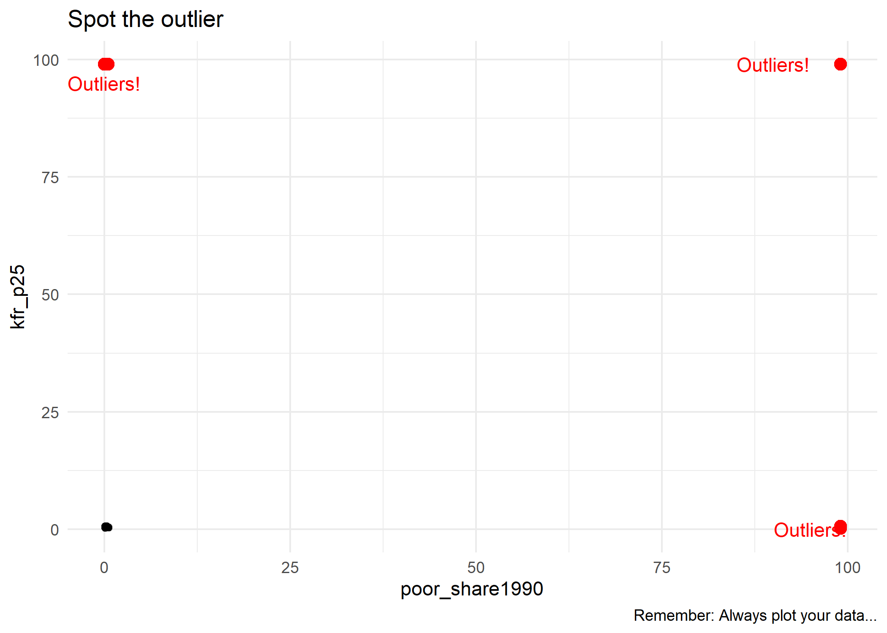
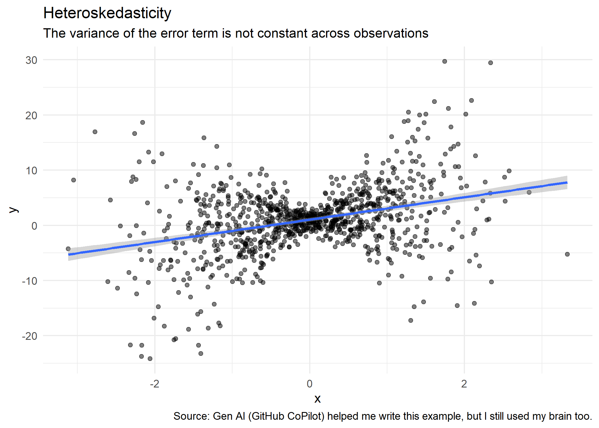
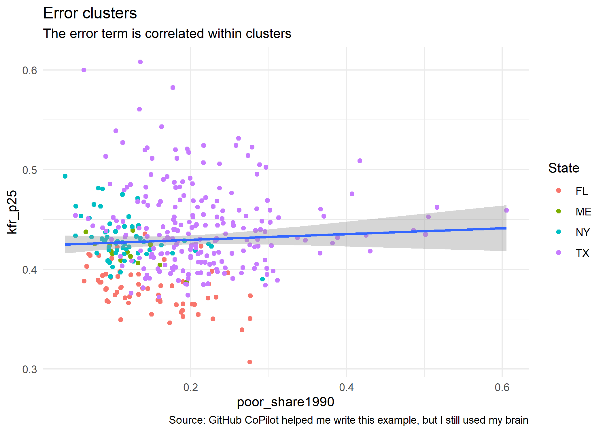
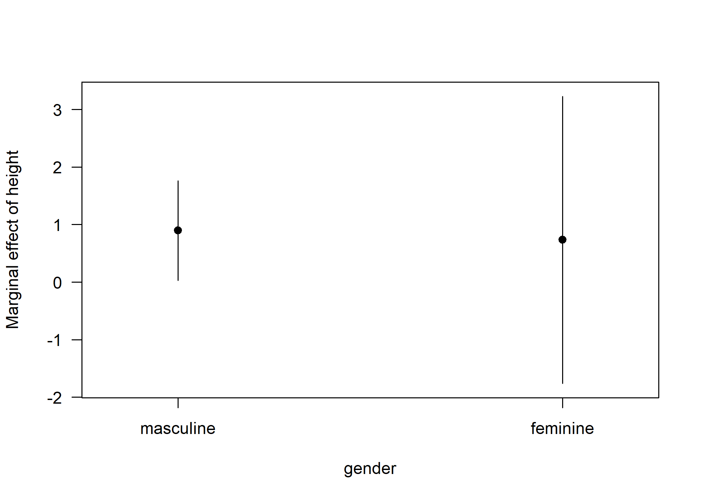
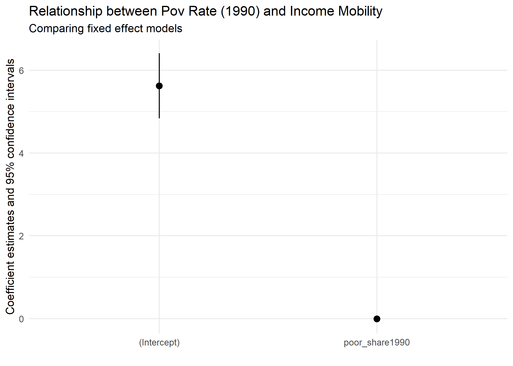
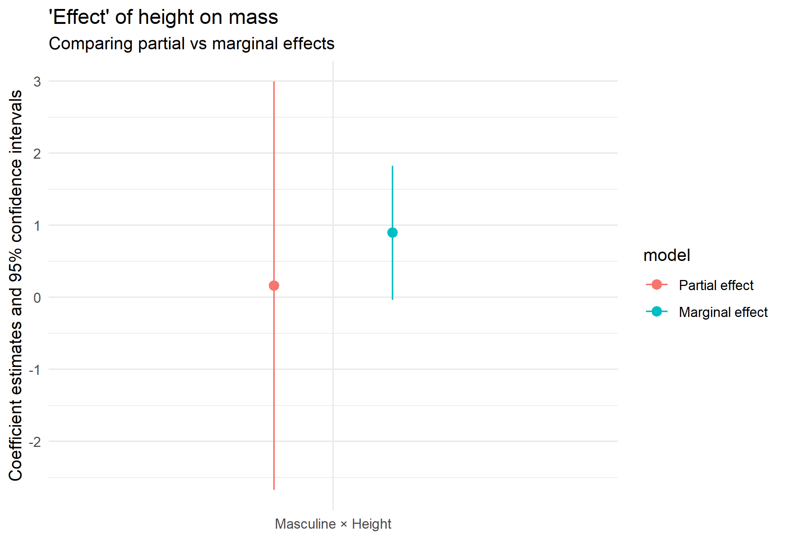
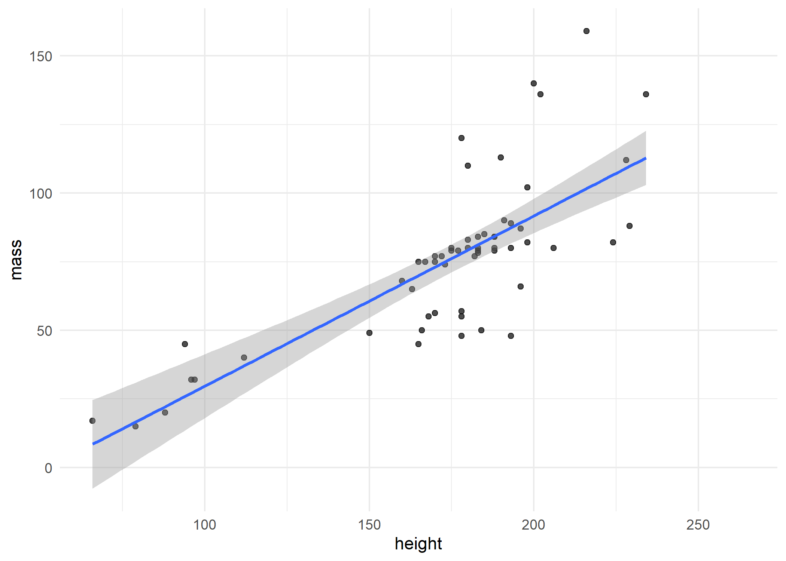
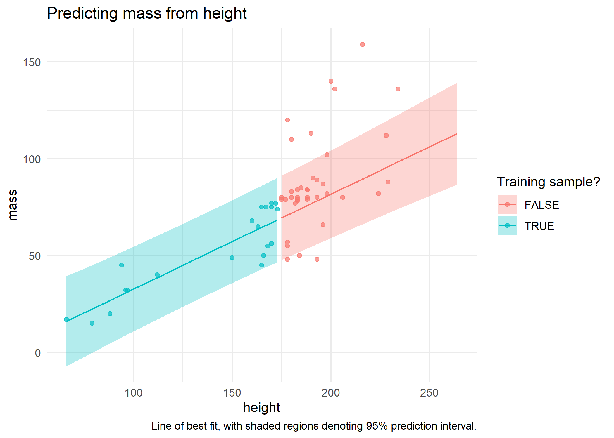

This lecture covers the bread-and-butter tool of applied econometrics and data science: regression analysis. My goal is to give you a whirlwind tour of the key functions and packages. This lecture will *not* cover any of theoretical concepts or seek to justify a particular statistical model. Indeed, most of the models that we're going to run today are pretty silly. We also won't be able to cover some important topics. For example, we won't cover a Bayesian regression model and I won't touch times series analysis at all. (Although, I will provide links for further reading at the bottom of this document.) These disclaimers aside, let's proceed...

## Software requirements

### R packages 

It's important to note that "base" R already provides all of the tools we need for basic regression analysis. However, we'll be using several additional packages today, because they will make our lives easier and offer increased power for some more sophisticated analyses.

- New: **fixest**, **estimatr**, **ivreg**, **sandwich**, **lmtest**,  **mfx**, **margins**, **broom**, **modelsummary**, **vtable**
- Already used: **tidyverse**, **hrbrthemes**, **listviewer**, **tidycensus**,  **tigris**

A convenient way to install (if necessary) and load everything is by running the below code chunk.


```r
## Load and install the packages that we'll be using today
if (!require("pacman")) install.packages("pacman")
pacman::p_load(mfx, tidyverse, hrbrthemes, estimatr, ivreg, fixest, sandwich, 
               lmtest, margins, vtable, broom, modelsummary,tidycensus,tigris)
## Make sure we have at least version 0.6.0 of ivreg
if (numeric_version(packageVersion("ivreg")) < numeric_version("0.6.0")) install.packages("ivreg")

## My preferred ggplot2 plotting theme (optional)
theme_set(theme_minimal())
```


While we've already loaded all of the required packages for today, I'll try to be as explicit about where a particular function is coming from, whenever I use it below. 

Something else to mention up front is that we are using the Opportunity Atlas today for our regressions. Some of these regressions will be a bit simple, but the point is to show you how to run them in R with data that are meaningful. We'll also use the `fips_codes` data from the **tidycensus** package to merge in county names and state abbreviations. 

The Opportunity Atlas file lives on GitHub, so we'll download it from there (*Note*: I am using the githack URL. You could also sync your fork, pull to your cloned repo, and navigate to `lectures/10-regression/` and the file is there too.). I've also amended the file to make it smaller so it can be easily pushed to GitHub. _Note_: This is bad practice generally, do not store data files on GitHub unless you have a really good reason to do so.


```r
# UNCOMMENT THIS DOWNLOAD THE FIRST TIME YOU RUN THIS
# Download the data from GitHub into your working directory -- uncomment the line 
# Create opp atlas object
opp_atlas <- read_csv("https://raw.githack.com/big-data-and-economics/big-data-class-materials/main/lectures/10-regression/opp_atlas_amended.csv") 
```

```
## Rows: 3219 Columns: 10
## ── Column specification ────────────────────────────────────────────────────────
## Delimiter: ","
## chr (4): czname, state_abb, state_name, county_name
## dbl (6): state, county, cz, kfr_pooled_pooled_p25, poor_share1990, ann_avg_j...
## 
## ℹ Use `spec()` to retrieve the full column specification for this data.
## ℹ Specify the column types or set `show_col_types = FALSE` to quiet this message.
```

```r
#Quickly renaming fips data to make it easier to merge
fips <- fips_codes %>% 
  rename(state_abb=state,
    state=state_code,
    county_name=county,
    county=county_code) %>%
  mutate(across(c(state,county),as.numeric))
```


```r
# Look at file to refresh your memory
opp_atlas 
```

```
## # A tibble: 3,219 × 10
##    state county    cz czname     kfr_pooled_pooled_p25 poor_share1990
##    <dbl>  <dbl> <dbl> <chr>                      <dbl>          <dbl>
##  1     1      1 11101 Montgomery                 0.362          0.140
##  2     1      3 11001 Mobile                     0.389          0.140
##  3     1      5 10301 Eufaula                    0.349          0.256
##  4     1      7 10801 Tuscaloosa                 0.363          0.213
##  5     1      9 10700 Birmingham                 0.392          0.148
##  6     1     11  9800 Auburn                     0.346          0.376
##  7     1     13 11101 Montgomery                 0.357          0.316
##  8     1     15  9600 LaGrange                   0.362          0.148
##  9     1     17  9600 LaGrange                   0.341          0.185
## 10     1     19  6600 Rome                       0.365          0.175
## # ℹ 3,209 more rows
## # ℹ 4 more variables: ann_avg_job_growth_2004_2013 <dbl>, state_abb <chr>,
## #   state_name <chr>, county_name <chr>
```


```r
# We want to join these now, note that I do not need to specify the variable names because they are the same

# Rename kfr for the kids with 25th percentile parents,
# This is the mean income percentile of the 25th percentile parents
opp_atlas <- opp_atlas %>%
  left_join(fips) %>%
  rename(kfr_p25=kfr_pooled_pooled_p25) 
```

```
## Joining with `by = join_by(state, county, state_abb, state_name, county_name)`
```

## Regression basics

### The `lm()` function

R's workhorse command for running regression models is the built-in `lm()` function. The "**lm**" stands for "**l**inear **m**odels" and the syntax is very intuitive.

```r
lm(y ~ x1 + x2 + x3 + ..., data = df)
```

You'll note that the `lm()` call includes a reference to the data source. We [covered this](https://raw.githack.com/uo-ec607/lectures/master/04-rlang/04-rlang.html#global_env) in our earlier lecture on R language basics and object-orientated programming, but the reason is that many objects (e.g. data frames) can exist in your R environment at the same time. So we need to be specific about where our regression variables are coming from --- even if `opp_atlas` is the only data frame in our global environment at the time. 

Let's run a simple bivariate regression of 


```r
ols1 = lm(kfr_p25 ~ poor_share1990, data = opp_atlas)
ols1
```

```
## 
## Call:
## lm(formula = kfr_p25 ~ poor_share1990, data = opp_atlas)
## 
## Coefficients:
##    (Intercept)  poor_share1990  
##        0.54146         0.08594
```

You might immediately notice that the coefficient seems wrong. A higher share that are poor in 1990 is associated with greater income mobility? We'll get there in a second. 

First, let's talk about the object we have. The resulting object is pretty terse, but that's only because it buries most of its valuable information --- of which there is a lot --- within its internal list structure. If you're in RStudio, you can inspect this structure by typing `View(ols1)` or simply clicking on the "ols1" object in your environment pane. Doing so will prompt an interactive panel to pop up for you to play around with. That approach won't work for this knitted R Markdown document, however, so I'll use the `listviewer::jsonedit()` function (used in the APIs lecture) instead.


```r
# View(ols1) ## Run this instead if you're in a live session
listviewer::jsonedit(ols1, mode="view") ## Better for R Markdown
```

```{=html}
<div class="jsonedit html-widget html-fill-item-overflow-hidden html-fill-item" id="htmlwidget-e733e1907a613ecfed3a" style="width:100%;height:10%;"></div>
<script type="application/json" data-for="htmlwidget-e733e1907a613ecfed3a">{"x":{"data":{"coefficients":{"(Intercept)":0.5414601141774132,"poor_share1990":0.08594436891560654},"residuals":{"1":-0.191790297417591,"2":-0.1646506233647508,"3":-0.2140996560503783,"4":-0.1963928038718074,"5":-0.1622810827755729,"6":-0.2281192707259035,"7":-0.2114043287512116,"8":-0.1923487477281981,"9":-0.2167972380220704,"10":-0.1910993715545554,"11":-0.1679237733452297,"12":-0.1700565511260724,"13":-0.1793733253988613,"14":-0.1496621119196704,"15":-0.1420070553715378,"16":-0.1670642784303746,"17":-0.1801179656909757,"18":-0.1989677426895381,"19":-0.2040067126627115,"20":-0.154390548561212,"21":-0.152612062153643,"22":-0.1500831376922253,"23":-0.1733795797610151,"24":-0.2350495067948437,"25":-0.1598452860960507,"26":-0.1750469568507043,"27":-0.1968982340485813,"28":-0.1899086647733398,"29":-0.1575194739313489,"30":-0.1536932161603629,"31":-0.1672883438140836,"32":-0.2524021720106637,"33":-0.2154838938902479,"34":-0.1976691072787323,"35":-0.1963083882103706,"36":-0.1614050620476047,"37":-0.2086761081875277,"38":-0.1277264689290975,"39":-0.1568800132180222,"40":-0.1704134548075837,"41":-0.1956748100880301,"42":-0.1863824173269029,"43":-0.2442771631127906,"44":-0.2569932289953669,"45":-0.1866027618891916,"46":-0.19680747395128,"47":-0.163204512845809,"48":-0.1691549260830807,"49":-0.1979552873982305,"50":-0.191902487960801,"51":-0.2256522663769471,"52":-0.1818673887530384,"53":-0.2412999113696278,"54":-0.1961893442962313,"55":-0.1994719048228316,"56":-0.1848776497324432,"57":-0.2258227346919657,"58":-0.1540779114651267,"59":-0.1350945015414841,"60":-0.2310118774788573,"61":-0.2021255028817417,"62":-0.1899226645258677,"63":-0.2013018831745644,"64":-0.1802658799112755,"65":-0.1442908526121277,"66":-0.230415642401491,"67":-0.1704202432171456,"68":-0.2021060006053575,"69":-0.2006327388388872,"70":-0.1572764142460378,"71":-0.321471925744961,"72":-0.2449404344767629,"73":-0.2385460673991485,"74":-0.2569452018251552,"75":-0.148304102939518,"76":-0.1121821882617168,"77":-0.3129944640024461,"78":-0.1747233874543118,"79":-0.1284375782972813,"80":-0.1495933091272313,"81":-0.1157740996954627,"82":-8.83405553682246,"83":-0.2505724488149862,"84":-0.1535155651174153,"85":-0.3127046409413205,"86":-0.2616924738485221,"87":-0.3150547779299705,"88":-0.09903211762470336,"89":-0.2506529996179165,"90":-0.1323171266309076,"91":-0.03101649052450043,"92":-0.1248852379848696,"93":-0.1525254280404526,"94":-0.1590473458676384,"95":-0.3935452973000859,"96":-0.289172420369505,"97":-0.2412320853969357,"98":-0.144867583236914,"99":-0.158796849145158,"100":-0.1609852015566588,"101":-0.1517138296889946,"102":-0.1067906935820657,"103":-0.1860544503308545,"104":-0.1534624322532117,"105":-0.1570960362964368,"106":-0.1919256454522667,"107":-0.1710117697008882,"108":-0.1937251343500099,"109":-0.178234822524097,"110":-0.1214747537886625,"111":-0.1748247357678792,"112":-0.1991127131901239,"113":-0.1859966211369837,"114":-0.1424546078704306,"115":-0.1213187604297819,"116":-0.1360511341595828,"117":-0.1929879849816984,"118":-0.1399520984221077,"119":-0.1239611187276523,"120":-0.2277714774740157,"121":-0.1661190512294681,"122":-0.1526303389218318,"123":-0.1385794993553912,"124":-0.1223895523839104,"125":-0.199224071239551,"126":-0.149409286186841,"127":-0.1593834829626795,"128":-0.1648290171406379,"129":-0.2317200591015342,"130":-0.1878828183405027,"131":-0.1857237724992195,"132":-0.2090353434077296,"133":-0.1934427980351172,"134":-0.1445584557533451,"135":-0.1430235078544914,"136":-0.1470262845194613,"137":-0.1784223581930929,"138":-0.1430570697747591,"139":-0.1602130011185968,"140":-0.2012047421134934,"141":-0.1796401907094708,"142":-0.1662913963291428,"143":-0.1487923868562496,"144":-0.1625731039379276,"145":-0.2013885053965786,"146":-0.223552209245,"147":-0.1520360894661556,"148":-0.2192001531905031,"149":-0.1646260059583579,"150":-0.2273981223505822,"151":-0.1862122361879765,"152":-0.1643683946483414,"153":-0.1589111346603887,"154":-0.1727333783856497,"155":-0.1187361057610324,"156":-0.152664100593306,"157":-0.1887147469026793,"158":-0.2222843612620169,"159":-0.1942464911046938,"160":-0.1425095498537353,"161":-0.1840913821124229,"162":-0.1315604438517382,"163":-0.1916369794502379,"164":-0.141055708449643,"165":-0.254972253936726,"166":-0.1382735685001446,"167":-0.2021859578390281,"168":-0.1313281188115932,"169":-0.147546770408205,"170":-0.1451491728503123,"171":-0.205161722593498,"172":-0.1418514535580867,"173":-0.2335841264598255,"174":-0.1631585636225688,"175":-0.1432939968737421,"176":-0.1369068140474287,"177":-0.1664117595732042,"178":-0.1398391842952044,"179":-0.1447376359307824,"180":-0.1330237516558498,"181":-0.2008418692027459,"182":-0.1315346189342953,"183":-0.1446899071805904,"184":-0.1320941943065275,"185":-0.2168803770331761,"186":-0.1660651309233027,"187":-0.1049314101662234,"188":-0.20207032648259,"189":-0.08124205139945011,"190":-0.1397066866036168,"191":-0.110748276880979,"192":-0.1184138255575745,"193":-0.1084806661942838,"194":-0.1608481707247246,"195":-0.07822888076655288,"196":-0.1664751263511526,"197":-0.148998043212334,"198":-0.1563245288249902,"199":-0.1942130955117528,"200":-0.09764197832727065,"201":-0.1302967321492412,"202":-0.1613289944012174,"203":-0.1334179472494987,"204":-0.123456625064933,"205":-0.1229184121832993,"206":-0.163620614125305,"207":-0.06734355702295368,"208":-0.08941935646734046,"209":-0.1547224706274452,"210":-0.1483500334843061,"211":-0.1081522745255007,"212":-0.1150927975812549,"213":-0.1458392299112782,"214":-0.1113108593035407,"215":-0.09498795492202652,"216":-0.08717612851509676,"217":-0.08597647890715091,"218":-0.1177605642905738,"219":-0.1415822011641988,"220":-0.1272414822509101,"221":-0.1361015267533185,"222":-0.1388494436138114,"223":-0.1252320009642204,"224":-0.04851781441833824,"225":-0.1428271653384831,"226":-0.1039015524872964,"227":-0.0716240450485001,"228":-0.1217419822665877,"229":-0.07319049651949024,"230":-0.1355498425287975,"231":-0.1287832153109361,"232":-0.09299279900392236,"233":-0.1051209015543986,"234":-0.1221458014497175,"235":-0.1032540717020405,"236":-0.1359742039232447,"237":-0.1212802884292633,"238":-0.1410777804033327,"239":-0.1287670111316656,"240":-0.158373737540015,"241":-0.1011408296716452,"242":-0.1190768538688557,"243":-0.1197208889261315,"244":-0.1451514506550094,"245":-0.1430976194251782,"246":-0.152882047610133,"247":-0.1047949529471777,"248":-0.1002031147720098,"249":-0.04063569658278705,"250":-0.1769403234855162,"251":-0.1015460415520686,"252":-0.07235247427011796,"253":-0.08779013748241363,"254":0.02951883855800359,"255":-0.04797421635166724,"256":-0.0714463497132431,"257":-0.1840580007384884,"258":-0.1554564251582773,"259":-0.06797797137597186,"260":-0.08762975156292066,"261":-0.1756798730653479,"262":-0.07396293651540893,"263":-0.06171245886768305,"264":-0.08918499678456938,"265":-0.0571121726920247,"266":-0.1389696250904195,"267":-0.1249358848979782,"268":-0.08279527702079219,"269":-0.1103669096793769,"270":-0.04182080828920981,"271":-0.06791883065403936,"272":-0.08394259203316728,"273":-0.1658335513130529,"274":-0.003583026029805311,"275":-0.09276484658395717,"276":-0.03806894346756818,"277":-0.04186236479457613,"278":-0.1466316292058167,"279":-0.06824103112218048,"280":-0.09233649015253845,"281":-0.1121290897960389,"282":-0.09377198637888982,"283":-0.08182642077734949,"284":-0.1020320890090428,"285":-0.2583313820958446,"286":-0.09023348881254982,"287":-0.1291026693851302,"288":-0.1165857193017962,"289":-0.1013291624919689,"290":-0.1381781740655127,"291":0.00656335023165751,"292":-0.08573336009190996,"293":-0.06203864143663651,"294":-0.0884436598432269,"295":-0.1207187429090008,"296":-0.1742026080115712,"297":-0.05130591937580579,"298":-0.1488129825835885,"299":-0.05259291055533849,"300":-0.1330108841150475,"301":-0.07947454476817098,"302":-0.03887059494016561,"303":-0.04716784615250852,"304":-0.02991975556079754,"305":-0.1070948115887059,"306":-0.05136085893912135,"307":-0.1235704976417354,"308":-0.04159217300255365,"309":-0.1148375191724261,"310":-0.1371833368716187,"311":-0.1030491418209757,"312":-0.09768556490266382,"313":-0.1313582895758636,"314":-0.1379943964148983,"315":-0.08854861536208421,"316":-0.1438393002489051,"317":-0.1704586324567726,"318":-0.1831287298410472,"319":-0.1691740368487213,"320":-0.2072812672287576,"321":-0.1894959972700459,"322":-0.1809808111763523,"323":-0.1725679777032212,"324":-0.1995535156589619,"325":-0.1616067625314973,"326":-0.1543762033429823,"327":-0.1924349395978906,"328":-0.1336684861637761,"329":-0.1574335766751287,"330":-0.158752043995748,"331":-0.1390221653294075,"332":-0.204923215292901,"333":-0.2007917141883383,"334":-0.2147167550055032,"335":-0.2014125134133179,"336":-0.1877928041378689,"337":-0.1340500787419567,"338":-0.2249825568013478,"339":-0.2582078884407079,"340":-0.1729664807208632,"341":-0.117966269861203,"342":-0.2101852967640703,"343":-0.191975136041585,"344":-0.1628869732396108,"345":-0.1987102683062491,"346":-0.1578716066180397,"347":-0.1732477447821325,"348":-0.1794185660345477,"349":-0.166315104362403,"350":-0.1694442715975565,"351":-0.1895859997918434,"352":-0.2108760932783322,"353":-0.1367439615470513,"354":-0.1759891346730955,"355":-0.1618588326684066,"356":-0.193543600044002,"357":-0.1853553038119201,"358":-0.185025929534362,"359":-0.2251362439892397,"360":-0.1823355743770812,"361":-0.178031728024951,"362":-0.1347001960258587,"363":-0.1458492585150009,"364":-0.1282646980857735,"365":-0.1799505084304853,"366":-0.1530602740543953,"367":-0.1938597734770119,"368":-0.1736325322293467,"369":-0.1553467945908613,"370":-0.15954875043492,"371":-0.1694228136293225,"372":-0.1686877825409202,"373":-0.18553191121065,"374":-0.205086732481756,"375":-0.1578850758305091,"376":-0.1808374753717772,"377":-0.157849633356852,"378":-0.1443478681422294,"379":-0.1321292303938443,"380":-0.1926026575192573,"381":-0.1703074797561503,"382":-0.1944376200584984,"383":-0.1856438547422493,"384":-0.1688249591100659,"385":-0.1678282334149938,"386":-0.1719162096281984,"387":-0.1754389122202702,"388":-0.1841170018488655,"389":-0.1891568689278825,"390":-0.1952539338341661,"391":-0.2353402434971143,"392":-0.2271813273710804,"393":-0.1670854373245599,"394":-0.1724524206244782,"395":-0.1831704548248453,"396":-0.1952191398562572,"397":-0.1818172748508002,"398":-0.2322423412449138,"399":-0.2085218674347094,"400":-0.1829270751468285,"401":-0.2121615827969429,"402":-0.1610124980332486,"403":-0.2122645577516887,"404":-0.2130721616671805,"405":-0.2010436062985407,"406":-0.2377923661476554,"407":-0.162236021804858,"408":-0.2176785744067116,"409":-0.1805713881840933,"410":-0.1637219694754286,"411":-0.1669006669704683,"412":-0.2100749944568207,"413":-0.1963780137978135,"414":-0.1870629600673831,"415":-0.1226151965463628,"416":-0.2224142298825119,"417":-0.2422016241262578,"418":-0.2112367856412773,"419":-0.2253565008115493,"420":-0.1534752392400042,"421":-0.1896835189015574,"422":-0.2125325313894167,"423":-0.1383197465289715,"424":-0.2171289113745512,"425":-0.1902416668385395,"426":-0.2042444160025145,"427":-0.2375940281967082,"428":-0.138761046056378,"429":-0.1597030712926175,"430":-0.2035578120830378,"431":-0.2206898834463613,"432":-0.1958333886613199,"433":-0.2345703081161275,"434":-0.2465039689283219,"435":-0.1748381277157367,"436":-0.2300294287897348,"437":-0.1724913075864018,"438":-0.1443218085866707,"439":-0.2055586316553176,"440":-0.1868662544257243,"441":-0.2176309322837595,"442":-0.1671813994822431,"443":-0.1006783691600164,"444":-0.1953689468519253,"445":-0.1241497807612406,"446":-0.1660986454444849,"447":-0.2258777247162605,"448":-0.1811984925016936,"449":-0.2016284653870672,"450":-0.2040486313772449,"451":-0.1783046283067196,"452":-0.2034541803635558,"453":-0.223324690864273,"454":-0.1204701363331577,"455":-0.1606163901761065,"456":-0.1749779519622855,"457":-0.250231648657386,"458":-0.1822966529683468,"459":-0.1850220327524121,"460":-0.1707657490761261,"461":-0.1963691862586064,"462":-0.1694514764152416,"463":-0.1793594932654988,"464":-0.2036739849279814,"465":-0.1773284505426094,"466":-0.2149588181585987,"467":-0.2028384249387825,"468":-0.2273415112746366,"469":-0.2212353820525999,"470":-0.1858260724758991,"471":-0.1815698576570784,"472":-0.1993180093771345,"473":-0.2254302345282336,"474":-0.2073598132448226,"475":-0.1466411083014204,"476":-0.1881038713691052,"477":-0.186729033147345,"478":-0.1958804649545584,"479":-0.2011138714691041,"480":-0.1654947251976584,"481":-0.2133787412767551,"482":-0.2157889000954823,"483":-0.2313734696142094,"484":-0.1829871960387533,"485":-0.1999709348289053,"486":-0.2185036440673991,"487":-0.1857335069815707,"488":-0.2189919521230274,"489":-0.1912908110197012,"490":-0.2179472142876394,"491":-0.2076173973243123,"492":-0.2021241745751602,"493":-0.2208993669013327,"494":-0.2075793131057286,"495":-0.1222189494209289,"496":-0.189617003861341,"497":-0.1653181293554861,"498":-0.2209746416844411,"499":-0.1694249366674773,"500":-0.1779676118416105,"501":-0.1695088124789012,"502":-0.1978746906754739,"503":-0.2182599350930998,"504":-0.2212314631102727,"505":-0.2523153261069978,"506":-0.1658944860521809,"507":-0.237539384052685,"508":-0.220791147787173,"509":-0.1684605921752947,"510":-0.1601469988652886,"511":-0.208353834011053,"512":-0.2167681975788717,"513":-0.220753394487375,"514":-0.1758164377373271,"515":-0.2478378800744398,"516":-0.2314472229979827,"517":-0.2217112682536516,"518":-0.2486011497274646,"519":-0.1889561494858031,"520":-0.2280239339191878,"521":-0.2116709606021933,"522":-0.2546603980439163,"523":-0.208960663475582,"524":-0.2246283447403409,"525":-0.201922883535876,"526":-0.1493622649808803,"527":-0.1946395219471831,"528":-0.2167134115160038,"529":-0.2263990668622761,"530":-0.2184905186333533,"531":-0.1543392087086273,"532":-0.2106247707051163,"533":-0.1869243359289219,"534":-0.1936807297989545,"535":-0.1974923250567428,"536":-0.2462698935359507,"537":-0.2257747764897429,"538":-0.1936617815844138,"539":-0.1972236431631902,"540":-0.2114483379191678,"541":-0.1283438312710143,"542":-0.1943184395794172,"543":-0.2015177027262362,"544":-0.2044406116074548,"545":-0.2318046247187012,"546":-0.2060888169448914,"547":-0.1408162398197525,"548":-0.09189750945598088,"549":-0.1095561527839475,"550":-0.1123841970558826,"551":-0.1180582673669449,"552":-0.04965885475524182,"553":-0.1246206001959028,"554":-0.02320143774182343,"555":-0.1156126156256381,"556":-0.08961690837641011,"557":-0.09201421503773236,"558":-0.1081205160413347,"559":-0.09282659449499578,"560":-0.1082666200005452,"561":-0.07429739735328919,"562":-0.05652107854039676,"563":-0.1328300982938883,"564":-0.1408773375155979,"565":-0.02989155707222596,"566":-0.09490485216846394,"567":-0.04251231388978227,"568":-0.07043471788644934,"569":-0.004132705461583754,"570":-0.1239896832056876,"571":-0.0215779736014377,"572":-0.0809250157657785,"573":-0.1070169823954822,"574":-0.09995244625142288,"575":-0.06038344589851564,"576":-0.05144610651767183,"577":-0.1065677001578055,"578":-0.1017810701046177,"579":-0.08035831622162097,"580":-0.08797911803003811,"581":-0.1007856103318139,"582":-0.0634455046719723,"583":-0.05393283459437047,"584":-0.09657921427143061,"585":-0.1175681958791061,"586":-0.01183947154074387,"587":-0.107146960751771,"588":-0.1347723029618154,"589":-0.09799273804877738,"590":-0.1340584675623858,"591":-0.0332159872231403,"592":-0.1061653242410846,"593":-0.09481512944810873,"594":-0.101279299989372,"595":-0.1236440014745152,"596":-0.2450021849682492,"597":-0.1354582730375743,"598":-0.1319183706091188,"599":-0.1294481330340899,"600":-0.09875226450103207,"601":-0.03152548707766362,"602":-0.07827346892788038,"603":-0.1320716725612458,"604":-0.1540893527561908,"605":-0.120936180429096,"606":-0.08190047132258699,"607":-0.1339411926278805,"608":-0.07169221433668922,"609":-0.1549414932884163,"610":-0.1676495292637403,"611":-0.113320606665613,"612":-0.1063736143447064,"613":-0.1235084827904577,"614":-0.1225325217892897,"615":-0.07576764854642046,"616":-0.05982376737731002,"617":-0.1364823470135673,"618":-0.08513069314629604,"619":-0.08414284460494259,"620":-0.1236467845018936,"621":-0.08426673330048182,"622":-0.1341938660562061,"623":-0.13682136595875,"624":-0.1057236556492334,"625":-0.1158694839135588,"626":-0.1112607650560323,"627":-0.08901130485625797,"628":-0.0567138464017864,"629":-0.1175852779642418,"630":-0.08252378134873478,"631":-0.09492624580347017,"632":-0.096388908234324,"633":-0.156531569418925,"634":-0.05320656933210302,"635":-0.1593663172802718,"636":-0.1079073446078251,"637":-0.03722166146238604,"638":-0.1347711294737995,"639":-0.1467864167262014,"640":-0.15513286293184,"641":-0.08989329758218237,"642":-0.1518446837736778,"643":-0.1312058046656904,"644":-0.119714995955617,"645":-0.1488054775868352,"646":-0.1025159137801567,"647":-0.1153662385548319,"648":-0.1230429011193945,"649":-0.1045234580495255,"650":-0.08227239003370493,"651":-0.1329618652000207,"652":-0.1753360571945739,"653":-0.1143948334552336,"654":-0.1516608327626352,"655":-0.15339378942309,"656":-0.1219832741319482,"657":-0.1632609099515955,"658":-0.1823629731554331,"659":-0.1139626606819724,"660":-0.07315078492249769,"661":-0.05646695212257991,"662":-0.1145274672241846,"663":-0.1447911821738938,"664":-0.07776872905134843,"665":-0.1122875571276565,"666":-0.1837509504768668,"667":-0.1311800936947359,"668":-0.09885007513298803,"669":-0.08230741909269634,"670":-0.1500505237737115,"671":-0.1820486292837665,"672":-0.08735588850906556,"673":-0.09944038979336782,"674":-0.1133177529589793,"675":-0.1430059900073764,"676":-0.1843390954019939,"677":-0.1356226389550165,"678":-0.1688169094712151,"679":-0.1233218010723835,"680":-0.09748242216339453,"681":-0.09265491460924782,"682":-0.1120635597085906,"683":-0.1491855377624529,"684":-0.1363248998158566,"685":-0.1412285338015309,"686":-0.1694569569378616,"687":-0.08038065965993553,"688":-0.1168200749346864,"689":-0.06433309144091214,"690":-0.106481546846149,"691":-0.09122423581069988,"692":-0.1260064093492024,"693":-0.1345755837613878,"694":-0.1475745224849433,"695":-0.1732795004941628,"696":-0.09458429046071075,"697":-0.1118814592227963,"698":-0.1629279789529418,"699":-0.1697136079821886,"700":-0.05825649473608695,"701":-0.1691708746697287,"702":-0.1326690373892257,"703":-0.1505247922480584,"704":-0.1196058550838233,"705":-0.1526478391257554,"706":-0.1617838183574445,"707":-0.1437288370265792,"708":-0.1499055254029915,"709":-0.1422232961506887,"710":-0.09589894024974638,"711":-0.1324633087167641,"712":-0.1331589567664872,"713":-0.1418172367335366,"714":-0.1990187728798978,"715":-0.047309243682792,"716":-0.1370276235916514,"717":-0.1907840115635201,"718":-0.1647421005743351,"719":-0.1205552522162986,"720":-0.1153742680832232,"721":-0.1302973860863292,"722":-0.1014062636991737,"723":-0.1940000883041587,"724":-0.1308691021322241,"725":-0.1052495205329013,"726":-0.1384660403369981,"727":-0.124222101950487,"728":-0.1132662281120458,"729":-0.1762515257725081,"730":-0.1778306842256847,"731":-0.1611613156763663,"732":-0.1403694755367964,"733":-0.0753113494636465,"734":-0.1433578591004656,"735":-0.1416396337072315,"736":-0.1592204921858905,"737":-0.1379677008623435,"738":-0.1263086856180071,"739":-0.1186350988920294,"740":-0.03806502664283773,"741":-0.1648007955426607,"742":-0.1654980758549149,"743":-0.1715173144164071,"744":-0.2000629127804457,"745":-0.2059500373129702,"746":-0.1239666786495067,"747":-0.1209283181880036,"748":-0.149645731068229,"749":-0.1714622358890542,"750":-0.1377550486152767,"751":-0.1581624549722569,"752":-0.1146003009402583,"753":-0.1247504423749633,"754":-0.1249457857956646,"755":-0.1468606923820864,"756":-0.164999081493538,"757":-0.1193277322476545,"758":-0.1218508547049593,"759":-0.132419042799916,"760":-0.1144400461063483,"761":-0.1223449826589818,"762":-0.1108818816691158,"763":-0.1356781205263203,"764":-0.1431419550355404,"765":-0.1133849607083535,"766":-0.1363039837451295,"767":-0.1655753155947881,"768":-0.19019244077829,"769":-0.1495806360066206,"770":-0.09027131124799823,"771":-0.1488485101096082,"772":-0.1266602550141742,"773":-0.1335209311282151,"774":-0.1308315551255842,"775":-0.1387489710178239,"776":-0.1363302971890703,"777":-0.1191757594219879,"778":-0.1695380845272792,"779":-0.1677866600206252,"780":-0.165680125757562,"781":-0.1638432995414303,"782":-0.1181385771323183,"783":-0.1199600573067822,"784":-0.153020370365475,"785":-0.1885406520646047,"786":-0.1124431581939195,"787":-0.08919606794037897,"788":-0.1019567306701995,"789":-0.04825915194070057,"790":-0.04613076507244306,"791":-0.02569915210414047,"792":-0.09878886605626569,"793":0.005579731167484692,"794":-0.02990242458725684,"795":-0.1254822501460758,"796":-0.06531639745823886,"797":-0.01833062645864139,"798":-0.02546805932263398,"799":-0.06451083457685712,"800":-0.007283878663826715,"801":-0.04226259173722021,"802":0.03910399943238142,"803":-0.05190756216888234,"804":-0.03696442708919728,"805":-0.0804393229514879,"806":-0.003775454901374927,"807":0.009485380078301504,"808":-0.09140748772942922,"809":-0.0461240851212335,"810":-0.01122054598628849,"811":-0.09126408211824322,"812":-0.03946717258686715,"813":-0.06207962374844961,"814":-0.07050914496203364,"815":-0.08688316879768912,"816":0.01510100483196195,"817":-0.1310898971440341,"818":-0.05243353666057951,"819":-0.03661479922457871,"820":-0.03823326475504203,"821":-0.03987578044086381,"822":-0.05208382377089978,"823":-0.04789627112559614,"824":-0.08540733741549049,"825":-0.05262869857447471,"826":-0.01201629107517149,"827":-0.03368351489927101,"828":-0.07339591754794748,"829":-0.01111244174926107,"830":-0.0438832408700666,"831":-0.063055033692633,"832":-0.08184554030505317,"833":-0.01209759651343445,"834":-0.0200131920834119,"835":-0.006002262995062394,"836":-0.01948764885184348,"837":-0.04058117614377423,"838":-0.08703317811918397,"839":-0.08095545493893401,"840":-0.07871474980982802,"841":-0.02522738841374469,"842":-0.04968765402833503,"843":0.03908150670538689,"844":-0.124765399512681,"845":-0.1101461775389986,"846":-0.09114880013666056,"847":-0.05927098853898789,"848":0.04856724874647134,"849":-0.04532165592275023,"850":-0.04885122402192442,"851":-0.07230206622766505,"852":-0.1171690132130551,"853":-0.04651135781775138,"854":-0.002341999546818977,"855":-0.08826422208157358,"856":-0.07047318119976187,"857":-0.06007781215839392,"858":-0.1204498640466715,"859":0.002328270826950125,"860":-0.008703230028806195,"861":-0.07678855611456969,"862":-0.01842836816643906,"863":0.002271777284408351,"864":-0.01051479456089042,"865":-0.121582420783669,"866":-0.1242655503553255,"867":-0.04481024028306275,"868":-0.04892015843444176,"869":0.03416920436676799,"870":-0.1332304744874857,"871":-0.01440437950778161,"872":0.03643392397086635,"873":-0.05887855892574369,"874":-0.05682337442600038,"875":-0.05826218744267765,"876":-0.08192455370810277,"877":-0.06265669803921924,"878":-0.1322731381588973,"879":-0.06996945539186586,"880":-0.07429804757809833,"881":-0.07104218245751279,"882":-0.1026370149256971,"883":-0.03275439013778197,"884":0.009951687885459803,"885":-0.1260148681122082,"886":-0.06514840244254315,"887":-0.06562748759979582,"888":-0.1431711490587194,"889":-0.09352901927462628,"890":-0.1328443045437695,"891":-0.03918820892671969,"892":-0.08734520020514243,"893":-0.1129993444045013,"894":-0.08498199842605661,"895":-0.1118028389016002,"896":-0.03778100618219592,"897":-0.1111897597264881,"898":-0.1392181965769415,"899":0.003638303724283392,"900":0.02788422642536787,"901":-0.06829796235563187,"902":-0.04341450030492106,"903":-0.05563580287872277,"904":-0.08545886794007332,"905":-0.1250375515670925,"906":-0.1285551124458432,"907":0.003495659187729842,"908":-0.08553918882283046,"909":-0.106520176109597,"910":-0.1314013483105257,"911":-0.06936073389782152,"912":-0.06714346601343747,"913":-0.02730657282140903,"914":-0.07259047525592095,"915":-0.1389841283397255,"916":-0.1393012027622968,"917":-0.1293869404368263,"918":-0.1770080471654671,"919":-0.01402959379334781,"920":-0.05134848968373079,"921":-0.08247486017834736,"922":-0.0186608958802366,"923":0.01805088060450471,"924":-0.07709931360370811,"925":-0.1067487138901712,"926":-0.09895012743062399,"927":-0.1132837878006906,"928":0.03820470322988118,"929":0.03049352652114084,"930":-0.0716115585359816,"931":-0.08306276978234804,"932":-0.04278342825061046,"933":-0.07675480095563675,"934":-0.09668440842697297,"935":-0.05993235810736652,"936":-0.09278147501673398,"937":-0.1176219329751941,"938":-0.08095411195519975,"939":-0.1553114293882435,"940":-0.07786354672350382,"941":-0.1091142763137634,"942":-0.07177339306517175,"943":-0.1237966606077869,"944":-0.06919929125302687,"945":-0.07630264228112715,"946":-0.01707220749996853,"947":-0.005449402936295485,"948":-0.09346689587683808,"949":-0.03823574201594167,"950":-0.1420541157328322,"951":-0.07165599083457865,"952":-0.0515201766841669,"953":0.05948461727572155,"954":-0.1057858888259253,"955":-0.0271785218903005,"956":-0.04067141760696348,"957":-0.09879183147652072,"958":-0.04611567070372737,"959":-0.07173517691483834,"960":-0.09950126389423995,"961":-0.02695771738718826,"962":-0.0641195763621132,"963":-0.08328487896331327,"964":-0.02189623248779272,"965":-0.1291944417077481,"966":-0.04278432633778947,"967":-0.09170846380036105,"968":-0.1224833120334015,"969":-0.05963245129414455,"970":-0.03982522808759863,"971":-0.05767583972627381,"972":-0.1286462832413437,"973":-0.0472657078998161,"974":-0.1574147138929449,"975":-0.1351134866447714,"976":-0.1587801428389353,"977":0.03389163281306947,"978":-0.05603195961571452,"979":-0.02115832319925613,"980":-0.08040200657716338,"981":-0.02919647635642452,"982":-0.05978147142100825,"983":-0.1112200921346056,"984":-0.02774183715994961,"985":-0.00759003160527731,"986":-0.05294774283168229,"987":0.03183387194494477,"988":-0.02943239346552335,"989":0.01798002345514579,"990":-0.1134845919384865,"991":-0.1031673798734399,"992":-0.1977146582829008,"993":-0.1472021121789873,"994":-0.1856519756528536,"995":-0.1517133094790807,"996":-0.1235738991207596,"997":-0.1534719864279595,"998":-0.1616365246938263,"999":-0.1979049923746922,"1000":-0.1395617380361277,"1001":-0.1923845129089831,"1002":-0.1748764194508062,"1003":-0.1853673836250819,"1004":-0.1882965850557095,"1005":-0.2073172302449605,"1006":-0.1128910410380843,"1007":-0.1500055299035189,"1008":-0.1543835239814804,"1009":-0.1478007799802123,"1010":-0.1464550481095263,"1011":-0.161205781542209,"1012":-0.1559410094322087,"1013":-0.1705475283484323,"1014":-0.1643797997020038,"1015":-0.1649704307659393,"1016":-0.1815768030403109,"1017":-0.2087221289681074,"1018":-0.2162552110985297,"1019":-0.1615428726314416,"1020":-0.1291274156830541,"1021":-0.1548670542072655,"1022":-0.1418164962925468,"1023":-0.1636631913485387,"1024":-0.152347207873128,"1025":-0.2004900307301356,"1026":-0.1921736357288242,"1027":-0.1703753287002776,"1028":-0.1841019691943555,"1029":-0.1863339003756884,"1030":-0.2164596102985324,"1031":-0.1105652597771906,"1032":-0.1902482701433864,"1033":-0.170067297000737,"1034":-0.1495122138552376,"1035":-0.1597336004544241,"1036":-0.1319285170515018,"1037":-0.1543835205784609,"1038":-0.08305001093158892,"1039":-0.1491801972174866,"1040":-0.1902420155877212,"1041":-0.183693857671395,"1042":-0.1570564015114623,"1043":-0.1720999806221959,"1044":-0.1575354531261673,"1045":-0.1731270433469646,"1046":-0.1458941147471312,"1047":-0.1750626551304047,"1048":-0.1889161110205654,"1049":-0.1962191420549896,"1050":-0.136969769732686,"1051":-0.1744608022652656,"1052":-0.2114037676692786,"1053":-0.192251993033194,"1054":-0.1299727438961306,"1055":-0.1789711903891966,"1056":-0.1836844827909631,"1057":-0.1825359926379816,"1058":-0.2056035028866156,"1059":-0.1734627225832765,"1060":-0.1510209826518384,"1061":-0.1915822203093411,"1062":-0.1416910694932096,"1063":-0.1553106060293257,"1064":-0.1225520459949319,"1065":-0.1734504162073044,"1066":-0.2256539960905375,"1067":-0.1317275677010351,"1068":-0.1892310599514235,"1069":-0.1667018176770078,"1070":-0.1191364297377887,"1071":-0.1260616715909667,"1072":-0.1574142216356507,"1073":-0.16920636862513,"1074":-0.1537310464475823,"1075":-0.1867780678401936,"1076":-0.1758465311669343,"1077":-0.1402676322332074,"1078":-0.1471300984339701,"1079":-0.1986586192365258,"1080":-0.1639768432819863,"1081":-0.1234905640338088,"1082":-0.1455071838835404,"1083":-0.1823590821098812,"1084":-0.1276807072265414,"1085":-0.108396021567213,"1086":-0.1607639501372717,"1087":-0.2418345382184977,"1088":-0.1772927871789011,"1089":-0.2038564200367695,"1090":-0.1697459555653779,"1091":-0.2015054820454261,"1092":-0.1855474943942191,"1093":-0.08963672498245245,"1094":-0.1702214428909351,"1095":-0.1924455624613285,"1096":-0.1765857325045268,"1097":-0.1917927380452243,"1098":-0.166423500083926,"1099":-0.1736743761845395,"1100":-0.116223748860318,"1101":-0.1540469862425103,"1102":-0.1270701576031799,"1103":-0.1485690938565369,"1104":-0.1437922064748108,"1105":-0.13349885477024,"1106":-0.1650677861912567,"1107":-0.1299416928069389,"1108":-0.1876808882050793,"1109":-0.1176703845527304,"1110":-0.2034861107760195,"1111":-0.1979291181873423,"1112":-0.1813383750520799,"1113":-0.1324342743123364,"1114":-0.1417905616838126,"1115":-0.1268237821677786,"1116":-0.128476533865046,"1117":-0.1591431808313311,"1118":-0.1183243745176598,"1119":-0.1875302241067607,"1120":-0.1681864729261126,"1121":-0.2069447671052079,"1122":-0.1513313580239568,"1123":-0.1521880382652202,"1124":-0.07501742767986971,"1125":-0.1648125229202256,"1126":-0.178646810624469,"1127":-0.1709304597364066,"1128":-0.190642605431727,"1129":-0.1829297266268873,"1130":-0.2404092502133356,"1131":-0.1767547914041119,"1132":-0.127034199009886,"1133":-0.1789373620402616,"1134":-0.1453632707918127,"1135":-0.1663419730051577,"1136":-0.1749232718666835,"1137":-0.1528127506440821,"1138":-0.1522385885533072,"1139":-0.1366535384505426,"1140":-0.1421019012544386,"1141":-0.1155727393371788,"1142":-0.1017996784316411,"1143":-0.1758802991607668,"1144":-0.131186224004925,"1145":-0.2370628872347981,"1146":-0.2175567329475986,"1147":-0.1906435206309676,"1148":-0.2233414219942702,"1149":-0.1959066551842184,"1150":-0.1378640940746154,"1151":-0.1823895631148989,"1152":-0.1812493418631245,"1153":-0.1864667183783147,"1154":-0.1884589054770449,"1155":-0.1022968645482093,"1156":-0.1334906933437618,"1157":-0.1189924005009601,"1158":-0.220475645617898,"1159":-0.1600249312122415,"1160":-0.1687909337517657,"1161":-0.1503991047325536,"1162":-0.1522491620930187,"1163":-0.1703559903748564,"1164":-0.1382124731169019,"1165":-0.1755519453629459,"1166":-0.175691044509924,"1167":-0.1250267927789525,"1168":-0.1770877930218493,"1169":-0.109785904680302,"1170":-0.1425811212337582,"1171":-0.2026817573736731,"1172":-0.1792676699361299,"1173":-0.1804399080737612,"1174":-0.1031297540554582,"1175":-0.170807357543423,"1176":-0.1664692125050027,"1177":-0.1420801602592955,"1178":-0.129248177600721,"1179":-0.1226858040159911,"1180":-0.1132778206531182,"1181":-0.1346228598898009,"1182":-0.1318268744660282,"1183":-0.1346426412368977,"1184":-0.1253005611975443,"1185":-0.1389767561302199,"1186":-0.1463920314103893,"1187":-0.1014014953133166,"1188":-0.1509609685274481,"1189":-0.1394599214640648,"1190":-0.150852205541239,"1191":-0.1715067775639123,"1192":-0.1096156996681853,"1193":-0.1412693011777317,"1194":-0.1354505973390104,"1195":-0.1375498908570179,"1196":-0.1121226236412685,"1197":-0.1779201101459093,"1198":-0.08790997107764685,"1199":-0.1570624003616037,"1200":-0.1260443811647936,"1201":-0.1796918990987815,"1202":-0.1107417612845792,"1203":-0.1035289047577008,"1204":-0.1348916274019879,"1205":-0.0862893807367644,"1206":-0.1640706597208865,"1207":-0.06643498318076356,"1208":-0.1579155372705912,"1209":-0.1170738835227119,"1210":-0.1252367070819982,"1211":-0.1764514563732941,"1212":-0.1371034003157794,"1213":-0.1426106484371146,"1214":-0.1700456374751313,"1215":-0.1585620284823871,"1216":-0.2377370702045725,"1217":-0.09707187232593455,"1218":-0.1385289319147652,"1219":-0.1127366699164443,"1220":-0.08520525152170856,"1221":-0.100422734383874,"1222":-0.1171863105955506,"1223":-0.1473545219425569,"1224":-0.1015384564568123,"1225":-0.06672268796356411,"1226":-0.03931042617399802,"1227":-0.04130002515139098,"1228":-0.09838602745354925,"1229":-0.1441169652413197,"1230":-0.1073217931566763,"1231":-0.1484772938214777,"1232":-0.1257455701819794,"1233":-0.1400932471471321,"1234":-0.1356652927229196,"1235":-0.1400237969908142,"1236":-0.1216036158173178,"1237":-0.1565860930835968,"1238":-0.1350675199693818,"1239":-0.1426523743505611,"1240":-0.15571717153611,"1241":-0.1789328754052091,"1242":-0.1479631944494776,"1243":-0.1830254926473723,"1244":-0.152470007798994,"1245":-0.1541711400875301,"1246":-0.1530951576327536,"1247":-0.1556715448591177,"1248":-0.1639020894499586,"1249":-0.1016385972362023,"1250":-0.1656810094617824,"1251":-0.1110587752756872,"1252":-0.1173396754298888,"1253":-0.1320518688556092,"1254":-0.1131615567623889,"1255":-0.1983231089847411,"1256":-0.1589626883591098,"1257":-0.08898465594971021,"1258":-0.118948404718751,"1259":-0.1456076171819498,"1260":-0.1392262686849824,"1261":-0.09461602068895679,"1262":-0.06882330524597606,"1263":-0.1741543156611947,"1264":-0.1464913917608483,"1265":-0.1651616177401164,"1266":-0.1140101017914097,"1267":-0.1534788950508634,"1268":-0.1679060017751182,"1269":-0.1717374977558859,"1270":-0.1689034560968262,"1271":-0.1648219748202172,"1272":-0.07140076030743904,"1273":-0.1667292154783979,"1274":-0.1274027852721837,"1275":-0.108872898688942,"1276":-0.1357134825467835,"1277":-0.1143177991455352,"1278":-0.1598360185211628,"1279":-0.1322283060327788,"1280":-0.1168180187406087,"1281":-0.1383567900998314,"1282":-0.1220387680053319,"1283":-0.1441473295031835,"1284":-0.1622730003369987,"1285":-0.08435008370709188,"1286":-0.1445414294280444,"1287":-0.1242602572043061,"1288":-0.1294089903179785,"1289":-0.1649905002039795,"1290":-0.1204278975698179,"1291":-0.1924729883747434,"1292":-0.1490071433545284,"1293":-0.1363451729074392,"1294":-0.1462552517789849,"1295":-0.1482862853429745,"1296":-0.1012150850107902,"1297":-0.1445034691955033,"1298":-0.1512387732450418,"1299":-0.1314786595768888,"1300":-0.1103260706400882,"1301":-0.07442481257290565,"1302":-0.1550523983256302,"1303":-0.1826317082988089,"1304":-0.1503048649378045,"1305":-0.15783431531704,"1306":-0.1073669435594892,"1307":-0.1297050625725673,"1308":-0.1496140837544283,"1309":-0.1321899866790481,"1310":-0.1685215048801864,"1311":-0.1542199754466903,"1312":-0.2094522289406592,"1313":-0.1700478604042856,"1314":-0.05726176246505514,"1315":-0.08861795052500999,"1316":-0.07269939213321396,"1317":-0.1181603891657793,"1318":-0.05676951096909651,"1319":0.04320712056746259,"1320":-0.06660831478591007,"1321":-0.008991291696404809,"1322":-0.107243997817491,"1323":-0.0284143206523971,"1324":-0.1196339926267767,"1325":-0.03951177485974507,"1326":-0.06084492713739506,"1327":-0.06495706030614135,"1328":-0.04289012933547178,"1329":-0.04432720036818587,"1330":-0.03857841351710624,"1331":-0.09233627789920987,"1332":-0.06494226797350061,"1333":-0.02168466102386653,"1334":-0.02288791441995561,"1335":-0.04692425171600365,"1336":0.001550998580392581,"1337":-0.06422892417734766,"1338":-0.0466961813223082,"1339":-0.0007894584542600613,"1340":-0.1205570129750429,"1341":-0.03096381890740666,"1342":-0.09057375048317592,"1343":-0.07539390694645555,"1344":-0.07686713229022438,"1345":-0.008521014529422373,"1346":-0.07979270236467058,"1347":-0.04338985190510474,"1348":0.01782533850763235,"1349":-0.1046931886209957,"1350":-0.03887674107640447,"1351":-0.09150353605986489,"1352":-0.02624832173873915,"1353":-0.04035096529000003,"1354":0.0298354251852199,"1355":-0.05468926530574685,"1356":-0.03763628794474955,"1357":-0.08587172203323011,"1358":0.006059944415324793,"1359":-0.04852687158104436,"1360":-0.02091467642960259,"1361":-0.1027389413090997,"1362":-0.05338811842714861,"1363":-0.08612375297444214,"1364":-0.0228048233568913,"1365":-0.03196428662662316,"1366":-0.04543938209545832,"1367":-0.02144355133876084,"1368":-0.06705396342829693,"1369":-0.0417996594205703,"1370":-0.03035491007038881,"1371":-0.08786517033422553,"1372":0.001764824881838412,"1373":-0.04969181502175508,"1374":0.007276329018246206,"1375":-0.1150636619801573,"1376":0.0373030081529285,"1377":-0.005241893179886842,"1378":0.007749594335440162,"1379":-0.0736303680454881,"1380":-0.008355748327280825,"1381":-0.04643997680565297,"1382":-0.1006779366135525,"1383":-0.048472134845725,"1384":-0.07747718319057728,"1385":0.003446374006504921,"1386":-0.01381521980608914,"1387":-0.071225146960715,"1388":-0.01503544237147491,"1389":-0.03052973920957703,"1390":-0.0282418290776815,"1391":0.04010040349949631,"1392":-0.01161143993195663,"1393":-0.03197972919739663,"1394":-0.04742421050901807,"1395":-0.05474843499314042,"1396":-0.08649424650972402,"1397":-0.04000499880218975,"1398":-0.04788366380778523,"1399":-0.05140387149723942,"1400":-0.008606470985534031,"1401":-0.1919392406734919,"1402":-0.1915316183633182,"1403":-0.1685981101727521,"1404":-0.1784063674334525,"1405":-0.2070363190026542,"1406":-0.2343834541345016,"1407":-0.1821218559736225,"1408":-0.1804764546962273,"1409":-0.2053434129836651,"1410":-0.1515667258841304,"1411":-0.2635293562010963,"1412":-0.1793213523555072,"1413":-0.2362836966653073,"1414":-0.2542299833948723,"1415":-0.2183954221812066,"1416":-0.1791576020788261,"1417":-0.1747508255350196,"1418":-0.2030857909290928,"1419":-0.1697409156468851,"1420":-0.1054808342588914,"1421":-0.1249351997158074,"1422":-0.2158478657230743,"1423":-0.1596155528959122,"1424":-0.191025985248138,"1425":-0.2283232582423225,"1426":-0.2344008179672345,"1427":-0.2651666069127981,"1428":-0.2146636828297962,"1429":-0.1714971176851298,"1430":-0.1808884635308496,"1431":-0.206248510517256,"1432":-0.2326747425033741,"1433":-0.1993650134791979,"1434":-0.1813267963009781,"1435":-0.2063312556972954,"1436":-0.1949396705082876,"1437":-0.1343324165309775,"1438":-0.2118251691091974,"1439":-0.1635786840163098,"1440":-0.1798237430776459,"1441":-0.1946594553347017,"1442":-0.2534826832371019,"1443":-0.1667494634154552,"1444":-0.2159163160839718,"1445":-0.1855752401121649,"1446":-0.1707301149037963,"1447":-0.2313575624090704,"1448":-0.1983262957679189,"1449":-0.205400767493408,"1450":-0.2162996165229244,"1451":-0.1882341556782103,"1452":-0.2266574010594796,"1453":-0.2135193884011217,"1454":-0.2402823025718533,"1455":-0.1646459065684963,"1456":-0.1650058444245716,"1457":-0.2016935735486134,"1458":-0.1818997900586193,"1459":-0.2057011793539103,"1460":-0.2507557935802146,"1461":-0.1568831096097042,"1462":-0.2019632621437872,"1463":-0.2121305855918022,"1464":-0.1727547825492237,"1465":-0.1601027282969381,"1466":-0.1692938227592534,"1467":-0.2564809881850713,"1468":-0.2515026043615108,"1469":-0.2067653945640594,"1470":-0.1820251655088153,"1471":-0.1513692356239391,"1472":-0.2973092982968213,"1473":-0.1834583740116916,"1474":-0.1771186916051553,"1475":-0.2103480789365389,"1476":-0.248542056818315,"1477":-0.1761184401256462,"1478":-0.1621994082829857,"1479":-0.2064167993590494,"1480":-0.2194436394844512,"1481":-0.2161929168467478,"1482":-0.2225910696262512,"1483":-0.1242555817837631,"1484":-0.08999311362996654,"1485":-0.08933292095845109,"1486":-0.1548825461409157,"1487":-0.1423370510933519,"1488":-0.1150353645603624,"1489":-0.1465948857344388,"1490":-0.1288785565656882,"1491":-0.1380571539132886,"1492":-0.1504016523622186,"1493":-0.1690379380347745,"1494":-0.1849999929945396,"1495":-0.1094545587696866,"1496":-0.1588284993617658,"1497":-0.1310439520697461,"1498":-0.1508689137534346,"1499":-0.09430633222568284,"1500":-0.1530923410204977,"1501":-0.1124394231816607,"1502":-0.1373364068760249,"1503":-0.06328472965888284,"1504":-0.120696700774599,"1505":-0.09199733453408188,"1506":-0.1165606822251628,"1507":-0.1035188250878667,"1508":-0.1210171697318679,"1509":-0.1239924981142428,"1510":-0.16216265458132,"1511":-0.1168638734006621,"1512":-0.1386114791111214,"1513":-0.1132457690065774,"1514":-0.08627916486385241,"1515":-0.1418641496735442,"1516":-0.1301153951958767,"1517":-0.1943957321340212,"1518":-0.1325802841103076,"1519":-0.139629889143161,"1520":-0.04829506644873063,"1521":-0.1516554581154138,"1522":-0.1299531970920103,"1523":-0.1171192522483259,"1524":-0.1311651824837412,"1525":-0.1391467910013782,"1526":-0.04821501262412916,"1527":-0.1138228175460131,"1528":-0.1405130290681615,"1529":-0.177562263195044,"1530":-0.1832588387478783,"1531":-0.151866222586322,"1532":-0.133983631980488,"1533":-0.1324427082084944,"1534":-0.07496908914542703,"1535":-0.1547041028045186,"1536":-0.1094501502031578,"1537":-0.1406900074730548,"1538":-0.08595882880788218,"1539":-0.1335082490409486,"1540":-0.1167800951138136,"1541":-0.1411264896490287,"1542":-0.1447213680393658,"1543":-0.1120324565704547,"1544":-0.1624049009458066,"1545":-0.1514907762991551,"1546":-0.1440997800963787,"1547":-0.1109593879232424,"1548":-0.1484765495519754,"1549":-0.2027367226429973,"1550":-0.09018582088528868,"1551":-0.1089494900075623,"1552":-0.1018244300353903,"1553":-0.1402236358756701,"1554":-0.1916429406993642,"1555":-0.1312576956533258,"1556":-0.06081512817566413,"1557":-0.1336729770811898,"1558":-0.04856387058676122,"1559":-0.1278383326043689,"1560":-0.2308180279129425,"1561":-0.09840342270354004,"1562":-0.1422205008207949,"1563":-0.1507062890514338,"1564":-0.1307485033469458,"1565":-0.1040844533847205,"1566":-0.1386504721831081,"1567":-0.1638535379898708,"1568":-0.09793382178205022,"1569":-0.1178156951351327,"1570":-0.1771771595586943,"1571":-0.1102743754295828,"1572":-0.1415831922307882,"1573":-0.1847855942789132,"1574":-0.09794499406257244,"1575":-0.1197888455369188,"1576":-0.1098998348060491,"1577":-0.1734872586831347,"1578":-0.1605207809122245,"1579":-0.1573692627076276,"1580":-0.0893322563803368,"1581":-0.1236303097951757,"1582":-0.1720720861452014,"1583":-0.1380915783799777,"1584":-0.07201709847184284,"1585":-0.153239609123884,"1586":-0.1326026063590049,"1587":-0.1101180195593765,"1588":-0.1377722572451233,"1589":-0.1461104522732711,"1590":-0.1598256325437091,"1591":-0.1248459271691308,"1592":-0.1729698809058418,"1593":-0.1577764863582427,"1594":-0.162780926484058,"1595":-0.1248907597044074,"1596":-0.1485039692125183,"1597":-0.2338430358726203,"1598":-0.06955686840730017,"1599":-0.170341571856498,"1600":-0.1316280377175324,"1601":-0.04402101697056883,"1602":-0.03248171145951856,"1603":-0.002417548132643087,"1604":-0.1090780075818372,"1605":-0.02913807246733848,"1606":-0.06297204909887924,"1607":0.03374222875977,"1608":0.007248454917453613,"1609":-0.1228606827056697,"1610":0.02731026434003367,"1611":-0.07038582638517311,"1612":-0.09576967407987703,"1613":-0.08155755766203764,"1614":-0.1400368920302083,"1615":-0.1826302394096419,"1616":-0.09880174895389121,"1617":-0.01197301845539762,"1618":-0.1271234835660265,"1619":-0.01770456710347391,"1620":-0.01765604885506977,"1621":-0.1328758354606077,"1622":-0.113111961719864,"1623":-0.01220900632435001,"1624":-0.09317637744662925,"1625":-0.01083505807758232,"1626":-0.0192849060135562,"1627":-0.07242626582217072,"1628":-0.142875643249696,"1629":-0.1118196025827286,"1630":-0.04295539551566204,"1631":-0.08711354179589574,"1632":98.43651560737722,"1633":-0.01071046100634229,"1634":-0.02773239166636305,"1635":0.005673454234650183,"1636":-0.1073613806907557,"1637":-0.05486927894554217,"1638":-0.07516991480173062,"1639":0.02088322779025421,"1640":-0.1231657406685213,"1641":-0.1747945429936868,"1642":-0.1014848685932263,"1643":0.01294638956121105,"1644":-0.09400505431919182,"1645":0.01201056185108361,"1646":0.02222719990714103,"1647":-0.03369096814381268,"1648":-0.05105295338750532,"1649":-0.05436587794739749,"1650":-0.08592949701057981,"1651":-0.05240338490511063,"1652":0.09047565569033685,"1653":-0.09259200823406963,"1654":-0.07582903601021639,"1655":0.01629025647113722,"1656":98.44865907916761,"1657":-0.02460699732316718,"1658":0.08256650132846935,"1659":0.03988859156292682,"1660":-0.03955615714118572,"1661":0.01627887176151037,"1662":-0.01907727385901739,"1663":-0.05938226701269498,"1664":-0.03250725445576848,"1665":0.002026265093504658,"1666":-0.06546281667481757,"1667":0.06049912251734789,"1668":-0.002216180869925835,"1669":-0.07328172279035512,"1670":-0.04921428863301446,"1671":0.03425902120480631,"1672":-0.06927168397318008,"1673":0.03700052155722336,"1674":0.01127914702522224,"1675":-0.1237315571601097,"1676":-0.04560870573837541,"1677":-0.100536477358213,"1678":-0.006023525319351712,"1679":-0.003692750061994638,"1680":-0.06747008167770857,"1681":-0.1503355022051567,"1682":-0.01116054385678886,"1683":-0.005769399267242332,"1684":-0.007283607508423461,"1685":0.07255700852905031,"1686":-0.002561515812884925,"1687":-0.06730459361368143,"1688":-0.01754610187662364,"1689":-0.01999539948719485,"1690":-0.04416437737545517,"1691":0.01145136758468754,"1692":0.04786840126557996,"1693":-0.09626192437341581,"1694":-0.0234058482248779,"1695":-0.04700820157338223,"1696":0.05868345159107181,"1697":0.03442863061733844,"1698":0.01412820243012131,"1699":0.06093719893275408,"1700":-0.03021098364676734,"1701":-0.0361634176311084,"1702":-0.01882073946397706,"1703":-0.009315577734144639,"1704":-0.0551509483099951,"1705":0.008156139160247875,"1706":-0.04805460397260546,"1707":0.01677742705787414,"1708":-0.1119048573296074,"1709":-0.08171925804789486,"1710":-0.01704683452216742,"1711":0.07378888134566328,"1712":-0.0138762106105751,"1713":-0.06963305642418788,"1714":-0.01330657196688977,"1715":-0.0290476504120357,"1716":0.008044285565585499,"1717":0.01562760735449322,"1718":0.0166562394214488,"1719":-0.05765760813414005,"1720":-0.03339817680737705,"1721":-0.009368029405000099,"1722":-0.01871160565686537,"1723":-0.003507338786748959,"1724":-0.02653802708416202,"1725":0.02476436764360078,"1726":-0.05013591490709001,"1727":-0.04397318781509917,"1728":0.06617001302196839,"1729":-0.03800024134395277,"1730":-0.08662036221077428,"1731":-0.03820490260824682,"1732":-0.09401465811328887,"1733":-0.01483313763915084,"1734":-0.02865570360133452,"1735":0.02805926628524071,"1736":0.01296063070462569,"1737":-0.01670871663195128,"1738":-0.01123188332250655,"1739":-0.009995305034791076,"1740":-0.1316149768733801,"1741":-0.0269317642472669,"1742":-0.01105411771661837,"1743":0.01306384887408864,"1744":0.0007828763302319256,"1745":-0.05771497718950181,"1746":-0.04566117771958401,"1747":-0.1302476260288326,"1748":-0.1608847826877922,"1749":-0.09021712841102793,"1750":-0.08621183877871386,"1751":-0.02143371131814922,"1752":-0.05199991869295231,"1753":-0.10628958090924,"1754":-0.0906970875589751,"1755":0.02865911456080306,"1756":-0.1441586216382343,"1757":-0.1616853716321895,"1758":-0.1477779886718444,"1759":-0.06314278149498712,"1760":-0.1317786751706547,"1761":-0.1438768713945348,"1762":-0.0959199950373967,"1763":-0.1435043265755922,"1764":-0.1297628403200387,"1765":-0.1130898772860095,"1766":-0.1254985443865714,"1767":-0.1291884191337935,"1768":-0.1135173505649107,"1769":-0.105268480026918,"1770":-0.1191133972376057,"1771":-0.09207566665313652,"1772":-0.1273587046755303,"1773":-0.1655924768702557,"1774":-0.1771648004510603,"1775":-0.02537671593560394,"1776":-0.12260080159616,"1777":-0.1571679221573145,"1778":-0.1195196550032866,"1779":-0.1829054791328787,"1780":-0.1671126338101271,"1781":-0.1124754575624647,"1782":-0.1091971850741312,"1783":-0.05024578282539237,"1784":-0.1610183863487383,"1785":-0.06234972589651455,"1786":-0.09361281891215227,"1787":-0.03600505546627902,"1788":-0.09375571577801246,"1789":-0.1245856583325553,"1790":-0.1361977918124959,"1791":-0.08231139657945065,"1792":-0.07399264590483742,"1793":-0.1162272358443049,"1794":-0.09158604377273308,"1795":-0.1652571287034692,"1796":-0.1340510943318879,"1797":-0.1555448536071177,"1798":-0.2009050125825411,"1799":-0.1472007701172068,"1800":-0.146070632750494,"1801":-0.0364339172345999,"1802":-0.1597140689777181,"1803":-0.09340626199925531,"1804":-0.1523008195431618,"1805":-0.1795503811531887,"1806":-0.002123004341787076,"1807":-0.1398563632235348,"1808":-0.0960454824060282,"1809":-0.1297992824721097,"1810":-0.07137475917548633,"1811":-0.1818744288161115,"1812":-0.2252365917963667,"1813":-0.1458106298376527,"1814":-0.1574424724533554,"1815":-0.1623213120352454,"1816":-0.192123948104639,"1817":-0.1468028620961055,"1818":-0.1635945691445699,"1819":-0.1589076182731305,"1820":-0.1819771094961788,"1821":-0.1511153576766169,"1822":-0.1587621544679026,"1823":-0.1971211507932682,"1824":-0.1529446532144524,"1825":-0.1549745129963676,"1826":-0.110062883255281,"1827":-0.1765492036908438,"1828":-0.1108431235155378,"1829":-0.1344221878739048,"1830":-0.1764762732612108,"1831":-0.1314552225440701,"1832":-0.12578978629221,"1833":-0.1338902747308005,"1834":-0.1385122366541394,"1835":-0.1537728475019248,"1836":-0.131348208124286,"1837":-0.1310974162207696,"1838":-0.1300601117911894,"1839":-0.129219585498054,"1840":-0.1094225995265441,"1841":-0.1123805056129698,"1842":-0.1225949697231296,"1843":-0.0989513446823829,"1844":-0.1405147700624098,"1845":-0.1441592842069681,"1846":-0.1153234766675568,"1847":-0.1041901626314955,"1848":-0.06821026937213566,"1849":-0.1197171593231223,"1850":-0.1359307633020357,"1851":-0.1379242154538888,"1852":-0.08164684623135969,"1853":-0.1118917380889459,"1854":-0.1172243555670089,"1855":-0.1571182348912021,"1856":-0.1259496399395504,"1857":-0.05151824741003712,"1858":-0.1404689253246166,"1859":-0.1426401728219641,"1860":-0.1238287331740327,"1861":-0.1476003954875403,"1862":-0.1155128158990679,"1863":-0.1244855143365502,"1864":-0.1277095033590889,"1865":-0.142875055936107,"1866":-0.1099356735475022,"1867":-0.02451932756277346,"1868":-0.07609047325635798,"1869":-0.1199443126363891,"1870":-0.06704363200854431,"1871":-0.08301558489558156,"1872":-0.1292310460079787,"1873":-0.09302743964130693,"1874":-0.1294057960443244,"1875":-0.1082995311427239,"1876":-0.1295662000775267,"1877":-0.1124891421159212,"1878":-0.1218868069226298,"1879":-0.08277219200407332,"1880":-0.1365184758193165,"1881":-0.1407699969437472,"1882":-0.1351061758267046,"1883":-0.1181042335877751,"1884":-0.1203908604632997,"1885":-0.1190553853380024,"1886":-0.1321010825340041,"1887":-0.09590058709031443,"1888":-0.08546837275892469,"1889":-0.1090675418493747,"1890":-0.1910702439882476,"1891":-0.1720480619268552,"1892":-0.1637194992354939,"1893":-0.2157634987061371,"1894":-0.1727378353657111,"1895":-0.1582389991227663,"1896":-0.194600478257505,"1897":-0.2040628612388651,"1898":-0.2132262465399459,"1899":-0.2010421506717232,"1900":-0.1729296881229367,"1901":-0.1909595005154411,"1902":-0.1864160324746842,"1903":-0.2118201973573499,"1904":-0.1611785721412231,"1905":-0.1656475766663966,"1906":-0.1880910728020183,"1907":-0.1881129329551408,"1908":-0.1783714459222292,"1909":-0.1739595890842995,"1910":-0.1932390568158905,"1911":-0.1582605168537783,"1912":-0.2124018068112105,"1913":-0.2039693852845835,"1914":-0.1882046253138838,"1915":-0.2041238204192908,"1916":-0.1449533638207999,"1917":-0.1242900045238503,"1918":-0.1961414580435953,"1919":-0.1658059322610842,"1920":-0.1715299092177516,"1921":-0.2160227457010596,"1922":-0.2319061092514411,"1923":-0.2045480867208764,"1924":-0.1904037028342813,"1925":-0.2078179173988272,"1926":-0.1578288255541794,"1927":-0.186259993268497,"1928":-0.2030437019464172,"1929":-0.2134904287905154,"1930":-0.202320789860655,"1931":-0.2154613589807851,"1932":-0.1963413597727734,"1933":-0.1607888683399726,"1934":-0.1510673764376804,"1935":-0.2248950030602823,"1936":-0.2428425349125042,"1937":-0.1798927074883623,"1938":-0.1954432703702882,"1939":-0.1610293923263456,"1940":-0.1701483236985081,"1941":-0.1774731906267276,"1942":-0.20164281498353,"1943":-0.2154849037795706,"1944":-0.1909902606505349,"1945":-0.1860957723667568,"1946":-0.1443725298088951,"1947":-0.1724911801386806,"1948":-0.2056902810063203,"1949":-0.1957292585758059,"1950":-0.152187282192091,"1951":-0.2020272151801836,"1952":-0.1778852521323046,"1953":-0.1933455498379332,"1954":-0.1940337371589786,"1955":-0.2108605611779261,"1956":-0.1737769685824935,"1957":-0.1723243461713719,"1958":-0.1880173910687504,"1959":-0.1910877925597154,"1960":-0.1959362273511938,"1961":-0.1768166896004693,"1962":-0.1976688235524743,"1963":-0.2106307549052906,"1964":-0.1542807302392348,"1965":-0.183126207732302,"1966":-0.2135373057139867,"1967":-0.2405255350727669,"1968":-0.2111399526179399,"1969":-0.206267591867928,"1970":-0.1986504075072928,"1971":-0.1997350908141227,"1972":-0.2460205300629356,"1973":-0.1688426967091175,"1974":-0.168543292193036,"1975":-0.1714107211277494,"1976":-0.1523139017997791,"1977":-0.177303198088124,"1978":-0.175990822229577,"1979":-0.1611881542342129,"1980":-0.2339615956708184,"1981":-0.1587351534184312,"1982":-0.2027898804728099,"1983":-0.197044064102916,"1984":-0.1474799498979548,"1985":-0.1924519082039208,"1986":-0.1691942789819228,"1987":-0.211895715719613,"1988":-0.1738973849435791,"1989":-0.1501333913092759,"1990":0.04742865896706085,"1991":-0.01105026168408713,"1992":-0.1618306080851853,"1993":0.09953967413643357,"1994":0.05517281177095251,"1995":0.1207429930294903,"1996":0.05246941759055627,"1997":-0.02102498917127792,"1998":-0.04465786492581682,"1999":0.0555514820816969,"2000":0.0003544471265134607,"2001":0.04269590913426112,"2002":0.09097841516212297,"2003":-0.008200075106295486,"2004":0.03534050009207244,"2005":-0.001086042905380623,"2006":0.1070368292972562,"2007":-0.06227281982674856,"2008":0.1044805007310067,"2009":0.02207002540333808,"2010":0.06708416408438868,"2011":0.04248544104415203,"2012":0.0799704388789631,"2013":0.06530321337073111,"2014":0.02492388873911106,"2015":0.05313485503698345,"2016":0.04277413291145367,"2017":0.006909860133121656,"2018":0.04092667001122461,"2019":-0.003417777592456268,"2020":0.05631564842621492,"2021":0.04077952240754483,"2022":0.07847124399287489,"2023":-0.0021015388572194,"2024":0.004706944142350495,"2025":-0.07361545667099015,"2026":0.01907664125268731,"2027":0.04020260664706681,"2028":-0.01495509585363236,"2029":-0.1698023499254228,"2030":0.008303348652742779,"2031":-0.008762338881481821,"2032":-0.2895127699870746,"2033":0.07457210386283836,"2034":0.0606128311370404,"2035":0.04774494667419811,"2036":-0.04006397206351441,"2037":0.03724547980602658,"2038":-0.01180099364712445,"2039":-0.02948513886053876,"2040":-0.04069161241235442,"2041":0.004207767548281704,"2042":0.03271257113115555,"2043":-0.1733754911521226,"2044":-0.1658330419396001,"2045":-0.1322890183785458,"2046":-0.160798815445775,"2047":-0.1934031611931729,"2048":-0.08551982829618762,"2049":-0.1060797665305607,"2050":-0.1595957296149121,"2051":-0.1692899913214698,"2052":-0.1110316385389192,"2053":-0.147318768392972,"2054":-0.1959203878257773,"2055":-0.1569878525204444,"2056":-0.169914329795461,"2057":-0.1445385301514347,"2058":-0.1476060857749585,"2059":-0.1514152982123274,"2060":-0.1809182085378175,"2061":-0.102144462513721,"2062":-0.1240820710669338,"2063":-0.1275012646027836,"2064":-0.1540839041267618,"2065":-0.1427791085670032,"2066":-0.1943433025579499,"2067":-0.1912547928502592,"2068":-0.09821798007784503,"2069":-0.1761027247199575,"2070":-0.0845914705111227,"2071":-0.1583865448646878,"2072":-0.14607566366942,"2073":-0.1941222338033405,"2074":-0.1319480983216964,"2075":-0.1376607667635546,"2076":-0.1007532851079675,"2077":-0.1169910798734615,"2078":-0.1698648486156948,"2079":-0.1777515043280131,"2080":-0.06575508913730248,"2081":-0.1326549664730919,"2082":-0.1818222901957384,"2083":-0.1588160572844184,"2084":-0.1248052817667126,"2085":-0.1167478350419594,"2086":-0.1751432970827598,"2087":-0.1583102328449896,"2088":-0.1481659344604946,"2089":-0.1737104784717876,"2090":-0.1837314379617679,"2091":-0.1494849236563513,"2092":-0.1576176098536119,"2093":-0.1811612252049638,"2094":-0.1005258300433522,"2095":-0.1543719671415354,"2096":-0.03937212009324514,"2097":-0.1393324425788792,"2098":-0.09308335238739208,"2099":-0.1985328734054883,"2100":-0.1447736039505602,"2101":-0.1397994914487745,"2102":-0.1648265131411945,"2103":-0.08723583471825426,"2104":-0.1046488609438421,"2105":-0.1088496853881407,"2106":-0.1640736431527727,"2107":-0.1748742357450003,"2108":-0.2081778471093131,"2109":-0.1305596391636722,"2110":-0.1351857736431761,"2111":-0.05489336948420927,"2112":-0.169355699272742,"2113":-0.1981448415112792,"2114":-0.1447626703190588,"2115":-0.1897850641424882,"2116":-0.1293024441630478,"2117":-0.1306039415233415,"2118":-0.1622395658389071,"2119":-0.1728709332521109,"2120":-0.161152744843938,"2121":-0.1166335802055797,"2122":-0.1192123127437691,"2123":-0.1281855564155617,"2124":-0.1825930609604428,"2125":-0.1269411230904325,"2126":-0.1356433457182455,"2127":-0.1249337257636466,"2128":-0.1320344451350096,"2129":-0.1190196759123198,"2130":-0.1065105456125056,"2131":-0.1920598870381521,"2132":-0.01416468263636549,"2133":-0.145738999821996,"2134":-0.03417005725568337,"2135":-0.08032263000117046,"2136":-0.1037508309290569,"2137":-0.1490837559341062,"2138":-0.1639876684456397,"2139":-0.08995559944128732,"2140":-0.1489814006599322,"2141":-0.1728507455074725,"2142":-0.1738951648927798,"2143":-0.001811520168918689,"2144":-0.1056859170698957,"2145":-0.1038809123995155,"2146":-0.1479954376225922,"2147":-0.1311048471562945,"2148":-0.1329129958471095,"2149":-0.1468021886314047,"2150":-0.09076749159345458,"2151":-0.1549670270603859,"2152":-0.002803632248157823,"2153":-0.001883645584972836,"2154":-0.1242202636249149,"2155":-0.1217879474860424,"2156":-0.1113562351258312,"2157":0.00671811018579439,"2158":-0.09237381230811284,"2159":-0.127408293248655,"2160":0.002787049433066235,"2161":-0.1252616405390498,"2162":-0.1457286190677436,"2163":-0.1445766643392057,"2164":-0.1050402727976879,"2165":-0.1137917217961965,"2166":-0.1326259681310532,"2167":-0.04929154043764052,"2168":-0.1516665174217936,"2169":-0.1179854428366672,"2170":-0.1378914959451414,"2171":-0.1377983880289778,"2172":-0.1233095096715343,"2173":-0.1234499470829623,"2174":-0.1059872466667027,"2175":-0.1687896611294961,"2176":-0.1577563038666462,"2177":-0.01425235212843194,"2178":-0.1173358283434811,"2179":-0.1400793835166373,"2180":-0.1115459154037261,"2181":-0.1804779974088468,"2182":-0.09986051192170511,"2183":-0.1247100136311831,"2184":-0.1426664061689423,"2185":-0.1627243056621084,"2186":-0.1607192066533407,"2187":-0.1457244735928216,"2188":-0.1481004263172439,"2189":-0.1148699582461931,"2190":-0.1161753678496777,"2191":-0.1462971380378882,"2192":-0.1400330028840729,"2193":-0.1595926638145117,"2194":-0.1472813831900588,"2195":-0.02208753171200155,"2196":-0.1124874179542578,"2197":-0.1666064034359368,"2198":-0.164887314266582,"2199":-0.1156802906003225,"2200":-0.0961062658709783,"2201":-0.1362341809692355,"2202":-0.1557238697201319,"2203":-0.1302038520462678,"2204":-0.1335086664442199,"2205":-0.06945496509948247,"2206":-0.06167179321641349,"2207":-0.08531501825230778,"2208":-0.1149021903314174,"2209":-0.109876933916347,"2210":-0.112626665885202,"2211":-0.1243132339715227,"2212":-0.1325461274086642,"2213":-0.1502237042173856,"2214":-0.1389313403551665,"2215":-0.1349637697241012,"2216":-0.1198380676469966,"2217":-0.1465560436252221,"2218":-0.1315715792146491,"2219":-0.08256902156792503,"2220":-0.1320454489640521,"2221":-0.1126766885618007,"2222":-0.1425378429170432,"2223":-0.1657055339531519,"2224":-0.1413130978907034,"2225":-0.1407504627755423,"2226":-0.09268356558718574,"2227":-0.1453305923103301,"2228":-0.1521926452297613,"2229":-0.1479464177826294,"2230":-0.1360358283043139,"2231":-0.1549605319260339,"2232":-0.09604900355940861,"2233":-0.1500619324158571,"2234":-0.1358568246326257,"2235":-0.1246689452588415,"2236":-0.1283903724547563,"2237":-0.1389393653335399,"2238":-0.1110485481486059,"2239":-0.07607404754362072,"2240":-0.1305215434513137,"2241":-0.1149772996173484,"2242":-0.06280210318297848,"2243":-0.1347940747443753,"2244":-0.09159027337481312,"2245":-0.124869179284938,"2246":-0.08725934252097689,"2247":-0.1157462034015678,"2248":-0.1118285197369514,"2249":-0.1235551111066363,"2250":-0.1306083330611417,"2251":-0.09755711018223827,"2252":-0.07704885826376195,"2253":-0.08595866517496972,"2254":-0.09715020384100914,"2255":-0.1398118023875565,"2256":-0.09089074968774402,"2257":-0.105646002756795,"2258":-0.0976291219808893,"2259":-0.0752516691786333,"2260":-0.1039864081136965,"2261":-0.1205345786875908,"2262":-0.1099834927586148,"2263":-0.1154923762898774,"2264":-0.09518922647579826,"2265":-0.1609196292975763,"2266":-0.1124517104561878,"2267":-0.09898356840142546,"2268":-0.1445378916239135,"2269":-0.1263649351131867,"2270":-0.1165489217584861,"2271":-0.1097959565541655,"2272":-0.1068802874377092,"2273":-0.08464518553476598,"2274":-0.1027823994703372,"2275":-0.0716955788108283,"2276":-0.09165399011142417,"2277":-0.08608839521095782,"2278":-0.102678080148083,"2279":-0.1072825874826244,"2280":-0.1158235763288281,"2281":-0.1035416762860593,"2282":-0.1142012631886504,"2283":-0.1089901293830016,"2284":-0.1192434865438116,"2285":-0.1144609218600318,"2286":-0.1281056296633694,"2287":-0.1293795814427995,"2288":-0.113867410517085,"2289":-0.07563830254961715,"2290":-0.1114897131388387,"2291":-0.1149302101099719,"2292":-0.09627107936562555,"2293":-0.1198920391639276,"2294":-0.1922868862825316,"2295":-0.08402670826629165,"2296":-0.09096389422626802,"2297":-0.100554940228414,"2298":-0.1088250578176108,"2299":-0.09980899596404022,"2300":-0.02651610149220587,"2301":-0.09224387032700285,"2302":-0.08112512124896309,"2303":-0.07481504861382242,"2304":-0.1368906580798469,"2305":-0.1234749398747917,"2306":-0.08763420509033742,"2307":-0.07510053970396702,"2308":-0.08724602429824559,"2309":-0.07960208178484333,"2310":-0.1253645053014661,"2311":-0.08133675370433661,"2312":-0.1115053141552,"2313":-0.1210314845581066,"2314":-0.1310252217350765,"2315":-0.1044358197826555,"2316":-0.189796960450639,"2317":-0.1878279679631971,"2318":-0.2580103491069269,"2319":-0.1929861648328635,"2320":-0.2371634989355322,"2321":-0.2233198698297812,"2322":-0.1800411508417036,"2323":-0.1721842199196236,"2324":-0.2014581095834515,"2325":-0.1913523908976705,"2326":-0.2193754716091167,"2327":-0.2171806374959384,"2328":-0.2080262589544713,"2329":-0.2063562296433454,"2330":-0.2017366656615675,"2331":-0.2201869505750663,"2332":-0.2369611624193124,"2333":-0.1632820812854045,"2334":-0.2080198408293975,"2335":-0.2294082648687118,"2336":-0.2064051309044775,"2337":-0.2070627591313576,"2338":-0.1844327354168986,"2339":-0.210033754082596,"2340":-0.2179041047039677,"2341":-0.1879188063879614,"2342":-0.2307163862244463,"2343":-0.187654953906892,"2344":-0.2100494311931445,"2345":-0.2038630135862042,"2346":-0.2285425056323096,"2347":-0.1675320441622264,"2348":-0.2185247217100142,"2349":-0.2292661720763366,"2350":-0.2353675025702104,"2351":-0.188842711309566,"2352":-0.1737475726618714,"2353":-0.214516409985886,"2354":-0.1918399566202119,"2355":-0.2146646057912238,"2356":-0.1932946774530576,"2357":-0.1962802148854481,"2358":-0.2029354679396849,"2359":-0.2131341499563383,"2360":-0.214415434662904,"2361":-0.1911567638185885,"2362":0.007180018571511218,"2363":-0.06529505655418086,"2364":-0.1509216412012883,"2365":0.009807070711869412,"2366":-0.02685080526844073,"2367":-0.04265328349475963,"2368":-0.01359526538563734,"2369":-0.2272323264610813,"2370":-0.06920879692596099,"2371":0.08355866238788869,"2372":-0.07369827782454609,"2373":0.02825480749640242,"2374":-0.07219357099168085,"2375":-0.05665405169945111,"2376":-0.08291987945785748,"2377":-0.02960996390272383,"2378":-0.05784220812282555,"2379":-0.03540341027280575,"2380":0.002765169507088677,"2381":-0.256762890377109,"2382":0.06216510154119864,"2383":0.06967589147059391,"2384":-0.07338722117651181,"2385":0.01347849302890966,"2386":-0.02696530567779888,"2387":0.01179809860185069,"2388":0.03640455444719887,"2389":-0.002074059542846422,"2390":0.02678754239379226,"2391":0.02325022779251822,"2392":0.1305853272038778,"2393":-0.09491293092153984,"2394":0.05084613298939167,"2395":0.005263122002509052,"2396":-0.09331928408409926,"2397":0.0278558681241917,"2398":-0.1078523779498887,"2399":0.03041012898519089,"2400":-0.00103747333121131,"2401":-0.048195728317148,"2402":-0.03141424609967627,"2403":-0.1724546331147426,"2404":0.03171861158820085,"2405":0.01167283596859318,"2406":-0.04548106385107923,"2407":-0.07818162339280617,"2408":-0.08902812962678562,"2409":0.01014954696256707,"2410":-0.09266537807371317,"2411":-0.04508668837219369,"2412":-0.34720919252742,"2413":-0.1243565806341743,"2414":0.0007864449763698221,"2415":0.0002564037611710525,"2416":-0.1072847666537161,"2417":-0.001391950579213388,"2418":0.01421922953982707,"2419":-0.02827195942385586,"2420":0.07139910412189676,"2421":-0.2825037634908095,"2422":-0.03128179115166006,"2423":0.01658544189754711,"2424":-0.03048025138543227,"2425":-0.05958346431919988,"2426":-0.05845386719910829,"2427":-0.2016782059075855,"2428":-0.1726238622067787,"2429":-0.1674583357887111,"2430":-0.1836795005464085,"2431":-0.1468512910622501,"2432":-0.177303420651878,"2433":-0.177800817321862,"2434":-0.2064601633257352,"2435":-0.1413103316448807,"2436":-0.1650078796546943,"2437":-0.1965108793503696,"2438":-0.1522707064243629,"2439":-0.1630162941111334,"2440":-0.17991913801774,"2441":-0.1437099572266209,"2442":-0.2124635426279653,"2443":-0.1586708549072576,"2444":-0.1801668679884699,"2445":-0.1640286477662933,"2446":-0.1965652812842426,"2447":-0.1467384529144296,"2448":-0.1714867082819855,"2449":-0.153169652363728,"2450":-0.1946587844346304,"2451":-0.2263927049754676,"2452":-0.2043724553073437,"2453":-0.1589761156059809,"2454":-0.1950303981623408,"2455":-0.1755917632088911,"2456":-0.1781599116447883,"2457":-0.1943925892701783,"2458":-0.173214752217967,"2459":-0.1953742259088559,"2460":-0.1988508233775035,"2461":-0.1915462136563882,"2462":-0.2142864817681155,"2463":-0.1692744986214088,"2464":-0.1875576892520675,"2465":-0.2454081209735696,"2466":-0.1700787003416481,"2467":-0.1818437124198834,"2468":-0.1725514299499663,"2469":-0.1462188480573188,"2470":-0.1650834889786474,"2471":-0.1829206800642543,"2472":-0.1830216143488627,"2473":-0.2096920639855067,"2474":-0.1924985460757296,"2475":-0.2334132069349175,"2476":-0.2069403228400118,"2477":-0.1725832448071888,"2478":-0.171443041550237,"2479":-0.1393040139323248,"2480":-0.1766226115387597,"2481":-0.1758966329728608,"2482":-0.1742046387837271,"2483":-0.1473060077959039,"2484":-0.2090797291936003,"2485":-0.1756939572638261,"2486":-0.1703376271591665,"2487":-0.1815206287453774,"2488":-0.1872225291561347,"2489":-0.1815489659680772,"2490":-0.1793939130913003,"2491":-0.09759546968021354,"2492":-0.17345140104017,"2493":-0.1793592563249173,"2494":-0.1594852667367107,"2495":-0.1847698835110802,"2496":-0.1345152324398559,"2497":-0.1829424593895276,"2498":-0.1607447444243696,"2499":-0.1869089074825597,"2500":-0.1983916323620408,"2501":-0.155909404332457,"2502":-0.1642764945280164,"2503":-0.1877926167964847,"2504":-0.2056335873167759,"2505":-0.1865709727466567,"2506":-0.2347858985004647,"2507":-0.1418045898547527,"2508":-0.1462053122205813,"2509":-0.1956117371153838,"2510":-0.1426863936624394,"2511":-0.1983802666959944,"2512":-0.1730381050482096,"2513":-0.1895903163888831,"2514":-0.1945277061228913,"2515":-0.1741860424092945,"2516":-0.181056008703567,"2517":-0.1975094897242784,"2518":-0.144507038304483,"2519":-0.1737616378527872,"2520":-0.1858116228876083,"2521":-0.1114584470925571,"2522":-0.1480634240918835,"2523":-0.1543240866799703,"2524":-0.01228682137302574,"2525":-0.1542758461102211,"2526":-0.1193697541808921,"2527":-0.07170067780926496,"2528":-0.06921446132582204,"2529":-0.1290067346342644,"2530":-0.112957606757809,"2531":-0.1113796642058405,"2532":-0.1416856592556125,"2533":-0.15699301498586,"2534":-0.08035574116464833,"2535":-0.1350593471997458,"2536":-0.1718947586553503,"2537":-0.1575492279725238,"2538":-0.1398830631281831,"2539":-0.04317611385113015,"2540":-0.1399191792061722,"2541":-0.183008263245906,"2542":-0.09814107333276947,"2543":-0.1606997640612033,"2544":-0.0833124321401751,"2545":-0.03242244402536083,"2546":-0.1125474429359247,"2547":-0.138746902647825,"2548":-0.1159087837407079,"2549":-0.1471179618634044,"2550":-0.166142106973727,"2551":-0.1130303869379389,"2552":-0.0956449138297623,"2553":-0.148022331721001,"2554":-0.1751449011340649,"2555":-0.03608520596690881,"2556":-0.1550730499855793,"2557":-0.1264110312173193,"2558":-0.101771583344995,"2559":-0.1632298258236983,"2560":-0.1429738864354378,"2561":-0.103251254530018,"2562":-0.1266902946253637,"2563":-0.1071396092982415,"2564":-0.1270320178108854,"2565":-0.0919762397346198,"2566":-0.105351104342951,"2567":-0.1338172538031273,"2568":-0.1173183595640355,"2569":-0.105165076084547,"2570":-0.03948773738193187,"2571":-0.1092925849022456,"2572":-0.1476479058544864,"2573":-0.1722283396357627,"2574":-0.01514360271831423,"2575":-0.08667168203427265,"2576":-0.1574806325489026,"2577":-0.09811260833510078,"2578":-0.09727703599964353,"2579":-0.1761534651572515,"2580":-0.1204062956710901,"2581":-0.1406536267328057,"2582":-0.1469165498280741,"2583":-0.1040920875734582,"2584":-0.1164820594992178,"2585":-0.1164758342996731,"2586":-0.1441874173465127,"2587":-0.1529696573433518,"2588":-0.1005886973429649,"2589":-0.09810266089840151,"2590":-0.07294574327437423,"2591":-0.06833021976571434,"2592":-0.1379028977577127,"2593":-0.142129758005941,"2594":-0.1048663489453708,"2595":-0.1627595233141639,"2596":-0.1564087765823407,"2597":-0.07482803261020583,"2598":-0.1048140307727882,"2599":-0.1430849128823927,"2600":-0.1168437295790552,"2601":-0.1109999653218621,"2602":-0.1144241350792108,"2603":-0.1184139463881778,"2604":-0.1472848156089543,"2605":-0.06121820812187529,"2606":-0.1436468037860236,"2607":-0.1327939787100436,"2608":-0.08964518075467422,"2609":-0.1651700148817204,"2610":-0.06964291801752577,"2611":-0.1431183687963355,"2612":-0.09704909408081054,"2613":-0.1528575664139018,"2614":-0.1513678051816907,"2615":-0.1609195649803984,"2616":-0.142771683186038,"2617":-0.1558515123311255,"2618":-0.1181939223404499,"2619":-0.1042212693151808,"2620":-0.06708486315964308,"2621":-0.1063858063286557,"2622":-0.09839865459445968,"2623":-0.1346222981047754,"2624":-0.1636882542405254,"2625":-0.01122076357302691,"2626":-0.09005554546060829,"2627":-0.147050364440831,"2628":-0.06420055234132573,"2629":-0.1471957877757101,"2630":-0.1437883592682295,"2631":-0.163303507216639,"2632":-0.1110537408786455,"2633":-0.1199255334478404,"2634":-0.1290340772989954,"2635":-0.1663171198008032,"2636":-0.1078975620733841,"2637":-0.1432132048036137,"2638":-0.1631503633968529,"2639":-0.08493007135485749,"2640":0.05504629381712676,"2641":-0.08768787970535222,"2642":-0.09691516319377523,"2643":-0.1455660297795395,"2644":-0.1228432055579779,"2645":-0.1555669099465432,"2646":-0.14212527172657,"2647":-0.1080405989997859,"2648":-0.1190604232204645,"2649":-0.1179119029717484,"2650":-0.1201644720357647,"2651":-0.1598742039571035,"2652":-0.08065537939077,"2653":-0.1427982916175974,"2654":-0.05320111820867002,"2655":-0.1414032901055883,"2656":-0.1728120867966281,"2657":98.45222758768536,"2658":-0.135915359381077,"2659":-0.1232384132182236,"2660":-0.1089324945018387,"2661":-0.1684975475261539,"2662":-0.1459923511604292,"2663":-0.1322964618308648,"2664":-0.1528456689055289,"2665":-0.04574654716734047,"2666":-0.1139341361996617,"2667":-0.09113936632681921,"2668":-0.1241015283677758,"2669":-0.1641336471211042,"2670":0.007853175917423376,"2671":-0.08832810205557021,"2672":-0.1208733224731738,"2673":98.45853988582259,"2674":-0.1606928661175845,"2675":-0.1712006064363885,"2676":-0.111322344306334,"2677":-0.184430366650445,"2678":-0.1549968002576841,"2679":-0.1647144215125634,"2680":-0.1695286584666858,"2681":-0.0559834716174572,"2682":-0.04294423880046391,"2683":-0.1143956145170727,"2684":-0.1321694172836066,"2685":-0.1316488931528495,"2686":-0.1793404904371334,"2687":-0.07145001773662349,"2688":-0.1304714773455637,"2689":-0.05212114128251998,"2690":-0.09290070327692286,"2691":-0.07480227419861941,"2692":-0.1084497663008949,"2693":-0.111496688508086,"2694":-0.1611575292808526,"2695":-0.1453064129607507,"2696":-0.1724498545084368,"2697":-0.167724941365869,"2698":-0.1680942309519169,"2699":-0.1342963573186031,"2700":-0.1388052973075293,"2701":-0.03388577195176486,"2702":-0.08732293947415606,"2703":-0.1208130915302247,"2704":-0.1398800182425503,"2705":-0.115940784941163,"2706":-0.10872082871661,"2707":-0.1159012973602003,"2708":-0.06475122858614539,"2709":-0.1438583826034864,"2710":-0.1755156000466591,"2711":-0.1236086867773988,"2712":-0.1394690876463987,"2713":-0.09156068533968446,"2714":-0.0239398873025915,"2715":-0.1348074322096378,"2716":-0.1602183879921267,"2717":-0.07062850396148214,"2718":-0.103552481345722,"2719":0.05333623330920092,"2720":-0.1705954478422423,"2721":-0.09640840004801465,"2722":-0.118805756734806,"2723":-0.1350061682640638,"2724":-0.08397915992495876,"2725":-0.1829136623103021,"2726":-0.1446392049273777,"2727":-0.1173095011615523,"2728":-0.1385633562142306,"2729":-0.06713719063181846,"2730":-0.09443406305325025,"2731":-0.1171309350267745,"2732":-0.1428215562955784,"2733":-0.03195836931836819,"2734":-0.1544498414199641,"2735":-0.05917698928740658,"2736":-0.1342218373251806,"2737":-0.129559179666163,"2738":-0.1128190477827578,"2739":-0.06554666891449093,"2740":-0.06978149278050262,"2741":-0.1351749564493134,"2742":-0.1496562356486891,"2743":-0.1338612216999457,"2744":-0.05078506777717375,"2745":-0.1472372981730527,"2746":-0.03693962146442997,"2747":-0.1731250373125105,"2748":-0.1399021857255875,"2749":-0.1629273370214674,"2750":-0.1543016770811222,"2751":-0.1164826928930653,"2752":-0.1260561168450457,"2753":0.02578112671602844,"2754":-0.1438271586635978,"2755":-0.1141007899016415,"2756":-0.1261371341865331,"2757":-0.1265095820063229,"2758":-0.1534260992438785,"2759":-0.1375054184410489,"2760":-0.03738541445959652,"2761":-0.1349780372052584,"2762":-0.1566738940937381,"2763":-0.152284274719611,"2764":-0.06290732623646822,"2765":-0.1414559646245076,"2766":-0.159283715458138,"2767":-0.1602127742714246,"2768":-0.1072454620974654,"2769":-0.1102208570547289,"2770":-0.03584558900635984,"2771":-0.08580059220120174,"2772":-0.116984509323328,"2773":-0.04103552338647024,"2774":-0.09079259009848267,"2775":-0.1006995265685252,"2776":-0.1497295954769362,"2777":-0.02487228585576527,"2778":-0.07244046504366801,"2779":-0.06021170497661447,"2780":-0.1071881152480305,"2781":-0.07451490300074677,"2782":-0.06914079866829546,"2783":-0.03533224573284028,"2784":-0.05974359734482624,"2785":0.02693431256491189,"2786":-0.08959150333114949,"2787":-0.09585152264297421,"2788":-0.07188110013452753,"2789":-0.08411669698968136,"2790":-0.01815016968387049,"2791":-0.007917939026045847,"2792":0.03099757926470003,"2793":-0.01348291999051605,"2794":-0.09587353848962617,"2795":-0.1006103835659679,"2796":-0.08124829413946413,"2797":-0.06678438629093922,"2798":0.01322169135285263,"2799":-0.109569154294028,"2800":-0.02179913273247339,"2801":-0.06327017460911734,"2802":-0.02500957139004105,"2803":-0.08489574138677135,"2804":-0.03166546062940894,"2805":-0.1115560743784276,"2806":-0.1043867877347584,"2807":-0.1167641793179831,"2808":-0.1098362727982197,"2809":-0.118742762775365,"2810":-0.1360429676091072,"2811":-0.09978772596984667,"2812":-0.1082951597025474,"2813":-0.1147938378057919,"2814":-0.1162332747442959,"2815":-0.1057173663703968,"2816":-0.1082144366500872,"2817":-0.08591371949969746,"2818":-0.1224247468999677,"2819":-0.1062518056217131,"2820":-0.1617454018446179,"2821":-0.1245784243550418,"2822":-0.1525408017045027,"2823":-0.1618029532627191,"2824":-0.1414264492194264,"2825":-0.1671343083923687,"2826":-0.08481980289648476,"2827":-0.1232471353192394,"2828":-0.08934774157364006,"2829":-0.1493844233886698,"2830":-0.1056397259402359,"2831":-0.1133848992703589,"2832":-0.2014498724472387,"2833":-0.09103187762872127,"2834":-0.1966803898193132,"2835":-0.1430326922934923,"2836":-0.1744822915455581,"2837":-0.1690660365377271,"2838":-0.1711408714959781,"2839":-0.1758342202446738,"2840":-0.135816646777215,"2841":-0.1124938624089538,"2842":-0.1805905074775325,"2843":-0.1610028383076062,"2844":-0.1985154427868058,"2845":-0.1418493530263633,"2846":-0.1891085119640118,"2847":-0.1458002782255841,"2848":-0.03328304463490458,"2849":-0.1263042270569037,"2850":-0.1251334384918508,"2851":-0.1613808246362539,"2852":-0.1545318852588886,"2853":-0.1334700334882783,"2854":-0.1581439565890425,"2855":-0.1434090616734796,"2856":-0.1635820616662756,"2857":-0.1702888462852827,"2858":-0.1704624125202528,"2859":-0.2134622640434868,"2860":-0.191102169344972,"2861":-0.1108686234481888,"2862":-0.1584671659726229,"2863":-0.1807649263391497,"2864":-0.09366045663025396,"2865":-0.17218003647783,"2866":-0.1576976378975012,"2867":-0.1493416902236877,"2868":-0.1594936203035568,"2869":-0.158217279718621,"2870":-0.1572284492051415,"2871":-0.185702275037923,"2872":-0.04882824249151334,"2873":-0.1786873034462733,"2874":-0.1877808474474705,"2875":-0.1516869053782471,"2876":-0.1213408013732148,"2877":-0.1957793621817502,"2878":-0.1379793682250787,"2879":-0.1602321117775921,"2880":-0.1491890352001394,"2881":-0.1052167149091751,"2882":-0.2013097000295684,"2883":-0.1385840683017765,"2884":-0.1957972828440237,"2885":-0.1483419982524691,"2886":-0.149314727661246,"2887":-0.1511934263595114,"2888":-0.1757589720157924,"2889":-0.1310400928464931,"2890":-0.1983130513315725,"2891":-0.1526169738109268,"2892":-0.1104315744104572,"2893":-0.1997338850411561,"2894":-0.07987805588009926,"2895":-0.1626653220676803,"2896":-0.1231898411057808,"2897":-0.1457854168776068,"2898":-0.1198560429311398,"2899":-0.1395372244206554,"2900":-0.1679635934337351,"2901":-0.1188599061976706,"2902":-0.17972343898984,"2903":-0.1717805632262478,"2904":-0.1414721017002987,"2905":-0.1189613820582194,"2906":-0.1654864023637586,"2907":-0.1973897934229593,"2908":-0.1404672235915497,"2909":-0.129807621445487,"2910":-0.1732895122573781,"2911":-0.169813842880386,"2912":-0.171537957289636,"2913":-0.1579020797283654,"2914":-0.1170911303123338,"2915":-0.1175904367093247,"2916":-0.1803198888201862,"2917":-0.1814246375069641,"2918":-0.2081880622221539,"2919":-0.1672580562927046,"2920":-0.1199163896395912,"2921":-0.1757519510338824,"2922":-0.2231073768543042,"2923":-0.2362050945271766,"2924":-0.03419877234855503,"2925":-0.0454546041028548,"2926":-0.1903419929443099,"2927":-0.1773045793783866,"2928":-0.1920041073160239,"2929":-0.1798029851043108,"2930":-0.1603628393570648,"2931":-0.2000038049319176,"2932":-0.1366921988275007,"2933":-0.1976958351588172,"2934":-0.1079143765152568,"2935":-0.1345886515778468,"2936":-0.2400642113569405,"2937":-0.1900840405821156,"2938":-0.2102894234494949,"2939":-0.1782976683441825,"2940":-0.2479803424153382,"2941":-0.08156853857586312,"2942":-0.2104471148790053,"2943":-0.209564451690011,"2944":-0.2482707945380808,"2945":-0.2176949743714579,"2946":-0.1412889243738533,"2947":-0.1661134335217518,"2948":-0.2013975428560526,"2949":-0.1422621402279421,"2950":-0.1774746595982618,"2951":-0.1916279029677581,"2952":-0.148466385789448,"2953":-0.1052384703001766,"2954":-0.1460639846355702,"2955":-0.1145949085977366,"2956":-0.1151701631273108,"2957":-0.1362660228262834,"2958":-0.1201280574082036,"2959":-0.1215096016978993,"2960":-0.1568445973547684,"2961":-0.1146652915203126,"2962":-0.126360691739397,"2963":-0.1383983198282633,"2964":-0.06787600403855759,"2965":-0.1292452478267059,"2966":-0.1401582535312756,"2967":-0.1003735168042489,"2968":-0.1135579486330032,"2969":-0.09534821013530594,"2970":-0.1239225653754998,"2971":-0.06260935271722977,"2972":-0.1232293230602071,"2973":-0.1317222389930961,"2974":-0.02733192965371349,"2975":-0.1564945370222123,"2976":-0.1179574446970646,"2977":-0.1180341673613455,"2978":-0.1017456440189933,"2979":-0.1345613209730029,"2980":-0.09117155780843259,"2981":-0.11328236102134,"2982":-0.1300480348911329,"2983":-0.09694605106615302,"2984":-0.1278272828078053,"2985":-0.1115764437053135,"2986":-0.1251298294540039,"2987":-0.1070783700393119,"2988":-0.1333092144958492,"2989":-0.1085802803533795,"2990":-0.08784996862643406,"2991":-0.150068684022149,"2992":-0.1105012839998264,"2993":-0.1705614136481869,"2994":-0.167824291634107,"2995":-0.130716947657269,"2996":-0.1492851942803426,"2997":-0.1892569577980868,"2998":-0.0943276443163939,"2999":-0.1498501784482532,"3000":-0.1289993331775293,"3001":-0.1461489608117787,"3002":-0.1337974726818057,"3003":-0.1565041699025236,"3004":-0.1471039854780751,"3005":-0.1548293971259893,"3006":-0.1549181230283158,"3007":-0.1417383178368307,"3008":-0.1321396117659558,"3009":-0.1656156196909723,"3010":-0.161032529305966,"3011":-0.1735912338490564,"3012":-0.1324239207643247,"3013":-0.1588594456482247,"3014":-0.1709149367912649,"3015":-0.2032894178421272,"3016":-0.1280630679312703,"3017":-0.09999720268456387,"3018":-0.1686592785321159,"3019":-0.177047364299461,"3020":-0.1365762093648102,"3021":-0.163384080867158,"3022":-0.1282204202540998,"3023":-0.1197449534251513,"3024":-0.1480083439170345,"3025":-0.1406836875718784,"3026":-0.1315797636389269,"3027":-0.120538057291524,"3028":-0.07600481893479262,"3029":-0.1445895340055265,"3030":-0.1087255144065263,"3031":-0.136538199322468,"3032":-0.1579316272114299,"3033":-0.1541597611740072,"3034":-0.1470756643146407,"3035":-0.148620931806527,"3036":-0.1641053831362571,"3037":-0.1492378206132006,"3038":-0.1008855303941822,"3039":-0.1143516821723516,"3040":-0.1191729202038673,"3041":-0.1681481933790364,"3042":-0.1392293591235788,"3043":-0.1239730618467014,"3044":-0.1329110849895392,"3045":-0.1607229536467764,"3046":-0.1411376091537402,"3047":-0.1442797658879171,"3048":-0.1156894904705636,"3049":-0.0749786463387128,"3050":-0.09574362199533754,"3051":-0.1001996710548839,"3052":-0.03867230868012037,"3053":-0.09921850596285853,"3054":-0.05252359099262202,"3055":-0.06694549544936038,"3056":-0.05758954848054808,"3057":-0.09173177686689279,"3058":-0.08661381457878042,"3059":-0.1202367430530956,"3060":-0.08815389662591315,"3061":-0.04853306217197431,"3062":-0.1182602985052672,"3063":-0.08257752747705314,"3064":-0.1060354112864636,"3065":-0.09543431920734481,"3066":-0.08736564165578939,"3067":-0.1002974192232872,"3068":-0.03835098475372182,"3069":-0.07369023591751825,"3070":-0.08719101137810001,"3071":-0.04075217658772384,"3072":-0.1282061667186031,"3073":-0.1127231756938826,"3074":-0.08247534333830833,"3075":-0.1036549773854319,"3076":-0.1636108284856204,"3077":-0.06501219986855866,"3078":-0.0966575683379181,"3079":-0.03156267870209151,"3080":-0.1182400257899819,"3081":-0.1134898903573102,"3082":-0.07904073253832371,"3083":-0.06976117720292102,"3084":-0.1031534083331258,"3085":-0.1088952787217992,"3086":-0.3090735827904796,"3087":-0.1907855023893112,"3088":-0.1030846429661446,"3089":-0.09438912746714265,"3090":-0.1006881929085872,"3091":-0.07838835355710824,"3092":-0.05347914478603303,"3093":-0.002610907850158935,"3094":-0.01802130914050171,"3095":-0.06348935952587972,"3096":-0.07452173024193817,"3097":-0.04740571083024353,"3098":-0.1572592044250634,"3099":-0.07723693186570871,"3100":-0.1523339775641788,"3101":-0.08127688226413515,"3102":-0.04735294994813416,"3103":-0.1083082635532865,"3104":-0.1470458394233456,"3105":-0.08955641759413371,"3106":-0.08436273858713053,"3107":-0.05087142803402146,"3108":-0.04501499164342402,"3109":-0.08328299487862766,"3110":-0.07621659176223572,"3111":-0.1055397763818811,"3112":-0.1121471557835111,"3113":-0.06443183673993495,"3114":-0.07257647718495287,"3115":-0.0770402691884798,"3116":-0.1203321458786387,"3117":-0.1097831394459196,"3118":-0.06773708965324252,"3119":-0.08299469573304817,"3120":-0.04553173154559505,"3121":-0.02736876961042795,"3122":-0.104841468178367,"3123":-0.03721707607259441,"3124":0.05235054008722425,"3125":-0.080998165173036,"3126":-0.05626206016627915,"3127":-0.000645873611063491,"3128":-0.01343047358337571,"3129":-0.1070599056751992,"3130":-0.01152783012683596,"3131":-0.07222210109433697,"3132":-0.001920269735768543,"3133":-0.04605468186635685,"3134":-0.03946163513332412,"3135":-0.05706160762794363,"3136":-0.0288424079667255,"3137":-0.06216431366786393,"3138":-0.01483884913081449,"3139":-0.06176845336725729,"3140":-0.09740871847252126,"3141":-0.06842102257706811,"3142":-8.927782216822459,"3143":-8.78993360682246,"3144":-8.639308076822459,"3145":-8.74389011682246,"3146":-8.792034576822459,"3147":-8.66187042682246,"3148":-8.656508216822459,"3149":-8.71094412682246,"3150":89.95004736317755,"3151":-8.72159088682246,"3152":-8.71532110682246,"3153":-8.71519390682246,"3154":-8.72408814682246,"3155":-8.74021876682246,"3156":-8.81582572682246,"3157":-8.72216505682246,"3158":-8.714583616822461,"3159":-8.69402302682246,"3160":-8.77709771682246,"3161":-8.72815320682246,"3162":-8.70675964682246,"3163":-8.70485503682246,"3164":-8.83401738682246,"3165":-8.63437921682246,"3166":89.95004736317755,"3167":-8.690429756822461,"3168":-8.74461356682246,"3169":89.95004736317755,"3170":-8.722379846822459,"3171":-8.67592463682246,"3172":-8.723873806822461,"3173":-8.68741081682246,"3174":-8.71293617682246,"3175":-8.77623064682246,"3176":89.95004736317755,"3177":-8.79926744682246,"3178":-8.73148513682246,"3179":-8.723476266822461,"3180":-8.741198046822459,"3181":-8.80786959682246,"3182":-8.71225855682246,"3183":-8.74139077682246,"3184":89.95004736317755,"3185":-8.778406926822459,"3186":-8.81282254682246,"3187":-8.723027326822461,"3188":-8.812599686822461,"3189":89.95004736317755,"3190":-8.79877755682246,"3191":-8.60969973682246,"3192":-8.710944636822459,"3193":-8.72305292682246,"3194":-8.730338616822459,"3195":-8.79630217682246,"3196":-8.75210947682246,"3197":-8.74973470682246,"3198":-8.642936686822461,"3199":-8.69967294682246,"3200":-8.735746666822459,"3201":-8.82202110682246,"3202":-8.68886871682246,"3203":-8.79803977682246,"3204":-8.76700086682246,"3205":-8.67281360682246,"3206":-8.67136920682246,"3207":-8.74462620682246,"3208":-8.729143686822461,"3209":-8.81608232682246,"3210":-8.706901436822459,"3211":-8.721917166822459,"3212":-8.74445430682246,"3213":-8.765734566822459,"3214":-8.78255821682246,"3215":-8.79737601682246,"3216":89.95004736317755,"3217":-8.837088016822459,"3218":-8.79393560682246,"3219":-8.74991104682246},"effects":{"(Intercept)":-43.34770373886164,"poor_share1990":74.56864420136752,"3":-0.2103530297626421,"4":-0.1926381911318853,"5":-0.1585143370279612,"6":-0.2243948516352882,"7":-0.2076688517156892,"8":-0.1885820787338325,"9":-0.2130374226978068,"10":-0.1873377197670756,"11":-0.1641609551264703,"12":-0.1663175719207593,"13":-0.1756271201905624,"14":-0.1459002907254476,"15":-0.1382410123946185,"16":-0.1632967025505974,"17":-0.1763495017965568,"18":-0.1952285694844759,"19":-0.2002453818285175,"20":-0.150636256437101,"21":-0.1488624709020853,"22":-0.1463174230930355,"23":-0.1696128833922584,"24":-0.2313191123046492,"25":-0.1560832064629511,"26":-0.1712777966662201,"27":-0.1931542131416519,"28":-0.1861432024884169,"29":-0.153763023771414,"30":-0.149937813173336,"31":-0.1635298806341757,"32":-0.248692257288374,"33":-0.2117542076389487,"34":-0.1939064564047825,"35":-0.1925417343411766,"36":-0.157641156420422,"37":-0.2049060160703329,"38":-0.1239656025120274,"39":-0.1531112210534207,"40":-0.1666551112420646,"41":-0.1919206962636771,"42":-0.1826131750934156,"43":-0.2405528021290164,"44":-0.2532653550834048,"45":-0.1828270657607428,"46":-0.1930689906984338,"47":-0.1594457071809869,"48":-0.1653927596318299,"49":-0.1941944872133541,"50":-0.1881488460651656,"51":-0.2218829858456426,"52":-0.1780944584568213,"53":-0.2375843989913635,"54":-0.1924478060127546,"55":-0.1957291364588611,"56":-0.1811184036056391,"57":-0.2220621503815043,"58":-0.1503102298092781,"59":-0.1313163489815142,"60":-0.2272907408786831,"61":-0.1983677969635668,"62":-0.1861576215736722,"63":-0.1975428691599009,"64":-0.1765029500124915,"65":-0.1405427162771012,"66":-0.2267039962151228,"67":-0.1666630082189727,"68":-0.1983314415671726,"69":-0.1968573623386725,"70":-0.15349530515077,"71":-0.3177322318535022,"72":-0.2411558351380978,"73":-0.2347679188000562,"74":-0.253197369028236,"75":-0.1445234117938875,"76":-0.1084050316003788,"77":-0.3092195411294357,"78":-0.1709396787629618,"79":-0.124658015410461,"80":-0.14580693324176,"81":-0.1119898167018847,"82":-8.848618532102002,"83":-0.246815369147894,"84":-0.1497385412223378,"85":-0.3089531336474133,"86":-0.2579166152855208,"87":-0.311294873651452,"88":-0.0952472820672754,"89":-0.2468756880720028,"90":-0.128532246108868,"91":-0.02723021436206502,"92":-0.1211171818859932,"93":-0.1487485458999594,"94":-0.1552660150271935,"95":-0.3897649550113372,"96":-0.2854354622297846,"97":-0.2375219288684516,"98":-0.1411076155391091,"99":-0.1550488090275098,"100":-0.1572249248785034,"101":-0.1479671181443914,"102":-0.1030211372504794,"103":-0.1823122883032502,"104":-0.1496911191246924,"105":-0.1533304000117771,"106":-0.1881894593230367,"107":-0.1672468453580744,"108":-0.1899722786425115,"109":-0.1744843913554614,"110":-0.1177062301055918,"111":-0.1710685355376372,"112":-0.1953556904691081,"113":-0.1822393510748173,"114":-0.1386909353529786,"115":-0.1175420096435327,"116":-0.1322823927200266,"117":-0.1892395878306382,"118":-0.1361867346352988,"119":-0.1201947593162706,"120":-0.224046822970683,"121":-0.1623703376717594,"122":-0.1488754069679166,"123":-0.1348173790602972,"124":-0.1186303040190185,"125":-0.1954730633878218,"126":-0.1456459457278179,"127":-0.155619203441329,"128":-0.1610636419594218,"129":-0.2279723088449961,"130":-0.1841318081524101,"131":-0.1819710060222602,"132":-0.2053007259981793,"133":-0.1896920411162337,"134":-0.1407889453813645,"135":-0.1392670813493088,"136":-0.1432808907264611,"137":-0.1746589369181474,"138":-0.1392905783477201,"139":-0.1564510802673496,"140":-0.1974522815703409,"141":-0.1758796043407845,"142":-0.1625316618430528,"143":-0.1450299903084352,"144":-0.1588185921047988,"145":-0.1976436287817214,"146":-0.2197979651053429,"147":-0.1482792783454932,"148":-0.2154702835495113,"149":-0.1608789195386851,"150":-0.2236909247299174,"151":-0.1824687855150359,"152":-0.1606099687519723,"153":-0.1551524391402666,"154":-0.1689647025218804,"155":-0.1149782856521694,"156":-0.148904759602731,"157":-0.1849604184425547,"158":-0.218536686199295,"159":-0.1905196295000516,"160":-0.1387596392213015,"161":-0.1803345897030644,"162":-0.1278192984926655,"163":-0.187881715888478,"164":-0.1372989310486379,"165":-0.2512550751695207,"166":-0.1345133105425644,"167":-0.1984382873859883,"168":-0.1275682214605777,"169":-0.1437811966138492,"170":-0.1413973311467787,"171":-0.2013904755933341,"172":-0.1380949595783584,"173":-0.2298579914938675,"174":-0.1593808025684965,"175":-0.1395404268639291,"176":-0.1331681752168857,"177":-0.1626412197976572,"178":-0.1360800486858059,"179":-0.1409840172671288,"180":-0.1292780380276806,"181":-0.1970871177681339,"182":-0.1277812057797619,"183":-0.1409227235762272,"184":-0.1283335046872674,"185":-0.2131502525987763,"186":-0.1623025847610809,"187":-0.101156480747687,"188":-0.1983097420033912,"189":-0.07746398716755265,"190":-0.1359464133020627,"191":-0.1069719263263885,"192":-0.1146440483877282,"193":-0.1046998351412795,"194":-0.1570826054747835,"195":-0.07444696406537116,"196":-0.1627171218197762,"197":-0.1452362168428808,"198":-0.1525636574885772,"199":-0.1904604019219144,"200":-0.09387064568640849,"201":-0.1265322387523643,"202":-0.1575684296587266,"203":-0.1296518410832209,"204":-0.1196862651726792,"205":-0.1191516420114189,"206":-0.1598589073053416,"207":-0.06355937102517092,"208":-0.08564880244553952,"209":-0.1509548760252384,"210":-0.1445918861844378,"211":-0.1043861454406105,"212":-0.1113164838568373,"213":-0.1420669572475836,"214":-0.1075288474315232,"215":-0.09120813515501769,"216":-0.0833969985758834,"217":-0.08219436733583196,"218":-0.1139885279481824,"219":-0.1378079545775329,"220":-0.1234678534042888,"221":-0.1323245832936699,"222":-0.135078144015803,"223":-0.1214584744670042,"224":-0.04474728522503402,"225":-0.1390596472948254,"226":-0.1001316818907281,"227":-0.06784187001654485,"228":-0.1179735250530556,"229":-0.06941035291397218,"230":-0.131776531203233,"231":-0.1250136972141222,"232":-0.08921574167585553,"233":-0.1013525179103539,"234":-0.1183646042142134,"235":-0.09947471672004007,"236":-0.1322061436300397,"237":-0.1175123033780852,"238":-0.1373116307269222,"239":-0.1250065816794495,"240":-0.1546208245359857,"241":-0.09736353665884148,"242":-0.1152962765985042,"243":-0.1159561440215894,"244":-0.141395106076449,"245":-0.1393215579390029,"246":-0.1491338943494518,"247":-0.1010115258224769,"248":-0.09643826405431111,"249":-0.03687658054692192,"250":-0.1731839899379286,"251":-0.09777080999909721,"252":-0.06856855983193205,"253":-0.084021605953983,"254":0.0332914157722296,"255":-0.04419692123891783,"256":-0.06771517354260961,"257":-0.1803270694688036,"258":-0.1517064679135395,"259":-0.06421790915372511,"260":-0.08386916081633441,"261":-0.1719157861233859,"262":-0.07019559787108343,"263":-0.05792410830084949,"264":-0.08540516845627211,"265":-0.05332957383410733,"266":-0.1351925059844543,"267":-0.1211725307359983,"268":-0.07901857108178006,"269":-0.1065923298623918,"270":-0.03804357117445659,"271":-0.06415395313120636,"272":-0.08017425505705428,"273":-0.1620873644563322,"274":0.0001925654937205978,"275":-0.08898123355463561,"276":-0.0343003119947034,"277":-0.03809664578781827,"278":-0.1428616067567532,"279":-0.06447450647242481,"280":-0.08856294596200512,"281":-0.1083835980204081,"282":-0.09001042897121989,"283":-0.0780586572857373,"284":-0.0982655516038555,"285":-0.2545614946051438,"286":-0.08645979456444175,"287":-0.125346309507098,"288":-0.1128172643041008,"289":-0.09756453282762406,"290":-0.1344278730842373,"291":0.01033972090956853,"292":-0.08195637262630057,"293":-0.05827056463313018,"294":-0.08466098956564733,"295":-0.1169634482865876,"296":-0.1704432985581935,"297":-0.04753711628592405,"298":-0.1450618802574823,"299":-0.04881724611780494,"300":-0.1292718801479908,"301":-0.07570429285855393,"302":-0.03509779581221065,"303":-0.0433950017195005,"304":-0.02614006101693309,"305":-0.1033201884099288,"306":-0.04759610805830994,"307":-0.1198016772664731,"308":-0.03782271912977359,"309":-0.1110539680044444,"310":-0.1334019882123236,"311":-0.09926213657464789,"312":-0.09389893304132493,"313":-0.1275782255242608,"314":-0.1342121256141094,"315":-0.08476364111515827,"316":-0.140060291349633,"317":-0.1666857325462595,"318":-0.1793480267577123,"319":-0.1653992076824257,"320":-0.2035187035827498,"321":-0.1857449813838226,"322":-0.1772160616380228,"323":-0.1687994373726342,"324":-0.1957871134791503,"325":-0.1578280297334529,"326":-0.1505989674689122,"327":-0.1886760251660811,"328":-0.1298874431786919,"329":-0.1536622247425802,"330":-0.1549695826170552,"331":-0.1352462668125525,"332":-0.2011679301902415,"333":-0.1970323922131654,"334":-0.2109738355084892,"335":-0.1976387409007446,"336":-0.1840284150392208,"337":-0.130274403103044,"338":-0.221237654838802,"339":-0.254464840234176,"340":-0.1692049498383348,"341":-0.1141982855035169,"342":-0.2064231824396828,"343":-0.1882322466224683,"344":-0.1591349395834274,"345":-0.1949512515194719,"346":-0.1540971719300151,"347":-0.1694804141815724,"348":-0.1756469563862826,"349":-0.1625668950642311,"350":-0.1656669504334281,"351":-0.1858330400178982,"352":-0.2071242673471058,"353":-0.1329893577557718,"354":-0.1722140274424706,"355":-0.1580804272940767,"356":-0.1897814013249767,"357":-0.1815976124589312,"358":-0.1812613444593271,"359":-0.2213893954521542,"360":-0.178558856544496,"361":-0.1742621946156857,"362":-0.1309211992426706,"363":-0.1420858775645751,"364":-0.1244901448458492,"365":-0.1761777507989402,"366":-0.1492863079500093,"367":-0.1901030284494739,"368":-0.1698578883830247,"369":-0.1515687319408302,"370":-0.1557695615998793,"371":-0.1656490659285576,"372":-0.1649105836448073,"373":-0.1817600342583071,"374":-0.2013278031046379,"375":-0.1541089788887214,"376":-0.1770604248104492,"377":-0.1540801321059599,"378":-0.1405660115651345,"379":-0.128347857448608,"380":-0.1888421685120256,"381":-0.1665485695965483,"382":-0.1906814428581242,"383":-0.1818789420608557,"384":-0.165051367797308,"385":-0.1640587653682758,"386":-0.1681520024840482,"387":-0.1716861213412932,"388":-0.1803582937012556,"389":-0.1854110057353708,"390":-0.1915043331147739,"391":-0.2315922681356716,"392":-0.2234185397976208,"393":-0.1633196706207579,"394":-0.1686846846407636,"395":-0.1793958915886233,"396":-0.1914649185443539,"397":-0.1780596094332994,"398":-0.2284774902175542,"399":-0.2047605494264087,"400":-0.1791671294813014,"401":-0.2084126162963743,"402":-0.1572378105099109,"403":-0.2085262930841808,"404":-0.2093332561203591,"405":-0.1972774765702233,"406":-0.2340552434241136,"407":-0.1584592419167922,"408":-0.2139296766693971,"409":-0.1768042696307625,"410":-0.1599498516551452,"411":-0.163140513238801,"412":-0.206307655074501,"413":-0.1926040829465552,"414":-0.1832960884880599,"415":-0.1188324581491416,"416":-0.2186699088140766,"417":-0.238473722113036,"418":-0.2074563888718719,"419":-0.2216109900520389,"420":-0.1496912328811236,"421":-0.1859308830755226,"422":-0.2087778031311587,"423":-0.1345384386026888,"424":-0.2133745496768759,"425":-0.1864677273853845,"426":-0.200473092310295,"427":-0.2338538458291453,"428":-0.1349938700655927,"429":-0.1559328752981101,"430":-0.1998066688279242,"431":-0.2169121340856024,"432":-0.1920800482789435,"433":-0.2308368976051542,"434":-0.2427485900466317,"435":-0.1710563087646618,"436":-0.2262932188703919,"437":-0.1687233377438368,"438":-0.140550343755851,"439":-0.2018004750526436,"440":-0.1831200187297372,"441":-0.2138821290838667,"442":-0.1634194492206309,"443":-0.09688922275382539,"444":-0.1915987511930383,"445":-0.1203685027255754,"446":-0.1623344160474004,"447":-0.2221100675551424,"448":-0.1774351073958785,"449":-0.1978654871719173,"450":-0.2002788932061247,"451":-0.1745312852566779,"452":-0.199700215278401,"453":-0.2195783864439713,"454":-0.1166836318757544,"455":-0.1568438315137184,"456":-0.1712037564455566,"457":-0.2464929444642956,"458":-0.1785292375522327,"459":-0.1812533334675268,"460":-0.1669976148778132,"461":-0.1926103778179621,"462":-0.1656692819686628,"463":-0.1755817518871294,"464":-0.1999291526057532,"465":-0.1735604381819392,"466":-0.2111959780299425,"467":-0.1990786149584867,"468":-0.2236039554208435,"469":-0.2174929375030334,"470":-0.1820739633700121,"471":-0.1777965751021602,"472":-0.1955523318259929,"473":-0.2216849337669988,"474":-0.2036011723065997,"475":-0.1428682501728727,"476":-0.1843422820626579,"477":-0.1829674222480789,"478":-0.1921290997412138,"479":-0.1973528099972128,"480":-0.1617288335911275,"481":-0.209624762881746,"482":-0.2120363787493996,"483":-0.2276325936971725,"484":-0.1792220737151013,"485":-0.1962259311140252,"486":-0.2147501332751268,"487":-0.1819802941905953,"488":-0.2152481576208365,"489":-0.1875222779670716,"490":-0.214199142163667,"491":-0.2038499877212928,"492":-0.1983501002081447,"493":-0.21713453148496,"494":-0.2038086198311065,"495":-0.1184394963752669,"496":-0.1858524807592724,"497":-0.1615399844283783,"498":-0.2172232535728809,"499":-0.1656547887538452,"500":-0.1742119889304721,"501":-0.165738954309561,"502":-0.1941104970395835,"503":-0.2145101405890523,"504":-0.2174638111021338,"505":-0.248582371732038,"506":-0.1621254477220276,"507":-0.2338116572073816,"508":-0.2170262202902686,"509":-0.1646777351488513,"510":-0.1563892351388079,"511":-0.2046021691609571,"512":-0.213027922609731,"513":-0.2169861423978963,"514":-0.1720519285811229,"515":-0.2441015044828267,"516":-0.2276991118419075,"517":-0.2179627190053344,"518":-0.2448660828794757,"519":-0.1852027680909779,"520":-0.2242841464526664,"521":-0.2079261043007179,"522":-0.2509198720065692,"523":-0.2052068625403526,"524":-0.2208742088762932,"525":-0.1981730617575672,"526":-0.1455943618859924,"527":-0.1908957226980952,"528":-0.2129479604215199,"529":-0.2226607802941427,"530":-0.2147446010925789,"531":-0.1505786421415479,"532":-0.2068574586934792,"533":-0.1831532801990413,"534":-0.189907629493361,"535":-0.1937331488446862,"536":-0.2425365175567992,"537":-0.2220209135110855,"538":-0.1899053334474729,"539":-0.1934710865268947,"540":-0.2077090169576633,"541":-0.1245728058656472,"542":-0.1905450148920173,"543":-0.1977751224061425,"544":-0.2006885423272924,"545":-0.2280386337147419,"546":-0.2023426555804913,"547":-0.1370486613755383,"548":-0.08811729685969144,"549":-0.1057750293165217,"550":-0.1086041261379674,"551":-0.1142797079135284,"552":-0.04588459333266837,"553":-0.1208517095776895,"554":-0.01943366190271612,"555":-0.1118487939332374,"556":-0.08585125442624728,"557":-0.08823473287783015,"558":-0.104350804654952,"559":-0.08906108040770455,"560":-0.1044901229363146,"561":-0.07052904371111729,"562":-0.05275201458441636,"563":-0.1290578874177342,"564":-0.1371087436136816,"565":-0.02611047070161526,"566":-0.09113737508904446,"567":-0.03873544539735976,"568":-0.06666342817904597,"569":-0.0003660786200348487,"570":-0.1202197033544625,"571":-0.01780380335266438,"572":-0.07715809766130144,"573":-0.103254085813982,"574":-0.09618985833134105,"575":-0.0566144097471139,"576":-0.04767753207432499,"577":-0.1028022187258284,"578":-0.09800828596091085,"579":-0.07660145758563153,"580":-0.08422221963507728,"581":-0.0970203086422064,"582":-0.05967657460259426,"583":-0.05019875326340131,"584":-0.09280979043389997,"585":-0.1137964850218038,"586":-0.008071399656580464,"587":-0.1033987952863724,"588":-0.1310111257212635,"589":-0.09422298384019132,"590":-0.1302944028956091,"591":-0.02945539320935381,"592":-0.1023957730457893,"593":-0.0910446158212892,"594":-0.09752119753655542,"595":-0.1198735362233977,"596":-0.2412634022770573,"597":-0.1316867132428539,"598":-0.1281359527832066,"599":-0.1256807130657757,"600":-0.09497722643974352,"601":-0.02775931722137789,"602":-0.07450055811433809,"603":-0.1283036008087346,"604":-0.1503282015994674,"605":-0.1171635653268435,"606":-0.07812842867386868,"607":-0.1301782833391593,"608":-0.06791665092184007,"609":-0.1511836359572051,"610":-0.1638786922044938,"611":-0.1095461015566288,"612":-0.1026016701495999,"613":-0.119743146240825,"614":-0.1187571511207121,"615":-0.07199135855667357,"616":-0.05603469158251076,"617":-0.1327178225374945,"618":-0.08135905192745702,"619":-0.08036527794446358,"620":-0.1198779869247169,"621":-0.08048976707167399,"622":-0.1304377558593965,"623":-0.1330565873475302,"624":-0.1019690887817669,"625":-0.1121037305789473,"626":-0.1074779427716834,"627":-0.08525428071488153,"628":-0.05294148110870017,"629":-0.113840761701916,"630":-0.07875374082437733,"631":-0.09115128086293889,"632":-0.09261164369752525,"633":-0.1527909560701944,"634":-0.0494365587280311,"635":-0.1555992776682098,"636":-0.1041307808433863,"637":-0.03344298458464331,"638":-0.1310047522430113,"639":-0.1430032265903362,"640":-0.1513595645953434,"641":-0.08610453607202029,"642":-0.1480770834177125,"643":-0.1274209548191751,"644":-0.1159405876740615,"645":-0.1450485461378951,"646":-0.0987384018323019,"647":-0.1115887407705312,"648":-0.1192679257264184,"649":-0.1007744688417298,"650":-0.07848437547968812,"651":-0.1291942738223662,"652":-0.1715642278929188,"653":-0.1106250142957451,"654":-0.147885452516822,"655":-0.1496290642608185,"656":-0.1182064102786904,"657":-0.159495389209377,"658":-0.1785999853129826,"659":-0.1101863184635635,"660":-0.06937510972842123,"661":-0.05268148824379171,"662":-0.110759198673851,"663":-0.1410179456267919,"664":-0.07399592701962754,"665":-0.1085064735187757,"666":-0.1799810741154146,"667":-0.1274144124851458,"668":-0.09506686328915473,"669":-0.0785458864374986,"670":-0.1463032919117088,"671":-0.1783102435833634,"672":-0.08357562251240933,"673":-0.09566631709889181,"674":-0.1095492912377493,"675":-0.1392365965815093,"676":-0.1805698665840536,"677":-0.1318657760746336,"678":-0.1650379677334903,"679":-0.11955826560675,"680":-0.09370969148717856,"681":-0.08887935855208912,"682":-0.108292527978354,"683":-0.1454089558170276,"684":-0.1325468685472652,"685":-0.1374680351206423,"686":-0.1656904374355224,"687":-0.07661008426411803,"688":-0.1130523329839739,"689":-0.06055606046127621,"690":-0.1027140631748471,"691":-0.08746496395793882,"692":-0.1222321327476839,"693":-0.1307897931531188,"694":-0.1438091080917616,"695":-0.1695017347083984,"696":-0.09080289274742651,"697":-0.1081095960957911,"698":-0.1591459082664989,"699":-0.1659342782781567,"700":-0.05447724970724185,"701":-0.1653947864633441,"702":-0.1288846908736355,"703":-0.1467432057351024,"704":-0.1158255731789428,"705":-0.148872833113439,"706":-0.1580073522283341,"707":-0.1399567395678882,"708":-0.1461287466877429,"709":-0.1384636137896077,"710":-0.0921342901273878,"711":-0.1286835966607434,"712":-0.1293811721807853,"713":-0.1380348785759349,"714":-0.1952547484189683,"715":-0.04352627550478713,"716":-0.133245778935758,"717":-0.1870094256664274,"718":-0.1609662807962642,"719":-0.1167792998197514,"720":-0.1115994933319437,"721":-0.1265228505768071,"722":-0.09762984433478722,"723":-0.190229372969445,"724":-0.1270991607902013,"725":-0.1014608730534049,"726":-0.1346797051231632,"727":-0.1204460818507642,"728":-0.1094784474493289,"729":-0.1724793101012463,"730":-0.174056530828396,"731":-0.1573791468378137,"732":-0.1365940837111503,"733":-0.07153219894385299,"734":-0.1395819761258045,"735":-0.137866923616973,"736":-0.1554500208305601,"737":-0.1341851546868247,"738":-0.1225441065971203,"739":-0.1148532429422296,"740":-0.03429329844081863,"741":-0.161026945536993,"742":-0.1617220382015006,"743":-0.1677405012652018,"744":-0.1962948743619066,"745":-0.2021743804628695,"746":-0.1201867640033366,"747":-0.117159736110682,"748":-0.1458708049094758,"749":-0.1677084537077767,"750":-0.1339783068434963,"751":-0.1543805147201612,"752":-0.1108225904308122,"753":-0.1209708307588342,"754":-0.1211701326963543,"755":-0.1430950326800194,"756":-0.1612302976100468,"757":-0.1155562418151131,"758":-0.1180771845473538,"759":-0.1286496635980517,"760":-0.1106572222277095,"761":-0.1185644920962679,"762":-0.1071078153217604,"763":-0.1318990216811369,"764":-0.1393688822063222,"765":-0.1096099974181107,"766":-0.1325306609658216,"767":-0.1617972988155437,"768":-0.18643241514609,"769":-0.145799936971128,"770":-0.08649532385458164,"771":-0.1450794821873975,"772":-0.1228766624562171,"773":-0.1297504881634085,"774":-0.1270653726436648,"775":-0.1349864042084542,"776":-0.1325480571991665,"777":-0.1153991990767985,"778":-0.1657645846182492,"779":-0.1640141857380408,"780":-0.161912384930529,"781":-0.1600659580922902,"782":-0.1143615709331539,"783":-0.1161765325426738,"784":-0.149252779236291,"785":-0.1847729444120777,"786":-0.1086591763204981,"787":-0.08541639460995246,"788":-0.09817209943535299,"789":-0.0444896398776379,"790":-0.04236732493414455,"791":-0.02192971615831382,"792":-0.09503247747619464,"793":0.009351480400482864,"794":-0.02612878288692835,"795":-0.1217174221801064,"796":-0.06153833101718001,"797":-0.01455366597561869,"798":-0.02170494059747696,"799":-0.06073322202612164,"800":-0.003509503419562243,"801":-0.0384905581725053,"802":0.04287868813688056,"803":-0.04813439930066904,"804":-0.03318918894619774,"805":-0.07666142884244737,"806":-1.838552443539365e-06,"807":0.01325965598818227,"808":-0.08763880258695958,"809":-0.042348266820078,"810":-0.00745314244297976,"811":-0.08748944370860182,"812":-0.03570262773436786,"813":-0.0582972368895508,"814":-0.06674806811464609,"815":-0.08312754596628377,"816":0.01887134506909516,"817":-0.1273161283288486,"818":-0.04865650254224332,"819":-0.03283881204254738,"820":-0.0344636683826374,"821":-0.03610793194270914,"822":-0.04831426620994136,"823":-0.04412312860043269,"824":-0.08163592321885751,"825":-0.04885726504907029,"826":-0.008237405500841316,"827":-0.02991039199399731,"828":-0.06961697619442464,"829":-0.007334196309018631,"830":-0.04010895259971092,"831":-0.0592861088207364,"832":-0.07806990180022619,"833":-0.008329213872542596,"834":-0.01623483102303491,"835":-0.002229533679870804,"836":-0.01570822452138554,"837":-0.03681365874910639,"838":-0.08325172141457823,"839":-0.07718654051206519,"840":-0.07495059185725281,"841":-0.0214534893741137,"842":-0.04591780816013358,"843":0.04285523602490549,"844":-0.1209947505455218,"845":-0.106366661036965,"846":-0.08737661791618895,"847":-0.05550103877493134,"848":0.0523368700456483,"849":-0.04154769385693527,"850":-0.04508145390381618,"851":-0.068525850515917,"852":-0.1133913176600432,"853":-0.04273548914460107,"854":0.001433165926007673,"855":-0.08449752297778826,"856":-0.06670829099195905,"857":-0.05630230593438304,"858":-0.1166735213392951,"859":0.006100179585357551,"860":-0.004926985328351174,"861":-0.07302024706541629,"862":-0.01466250819538115,"863":0.006049653508216235,"864":-0.006740171474826084,"865":-0.1178033438593225,"866":-0.1204903012592319,"867":-0.04103464758208386,"868":-0.0451578508872387,"869":0.03794142590675215,"870":-0.1294580406462391,"871":-0.01062702955798733,"872":0.04021328340957267,"873":-0.05511655778889146,"874":-0.05304879198709636,"875":-0.05450191781069758,"876":-0.07815897198123697,"877":-0.05889331900794906,"878":-0.1285070375609522,"879":-0.0661868701536491,"880":-0.07052126409944989,"881":-0.06728355400956279,"882":-0.09886459502289788,"883":-0.02898163641500992,"884":0.01372116573007001,"885":-0.1222456428600034,"886":-0.06137289967115817,"887":-0.06185155989675548,"888":-0.139405916341897,"889":-0.08975866968276822,"890":-0.1290796459085185,"891":-0.03541418665133661,"892":-0.0835732876733227,"893":-0.1092411734387553,"894":-0.08121872263238042,"895":-0.1080224795288432,"896":-0.03402069408773825,"897":-0.1074340607370531,"898":-0.1354611830326419,"899":0.007404227389057688,"900":0.03166805756366914,"901":-0.06452706746026576,"902":-0.03964974200522875,"903":-0.05185823116595062,"904":-0.08169657657311391,"905":-0.1212630796511569,"906":-0.1247949905276574,"907":0.007263196076197992,"908":-0.08176600944246157,"909":-0.1027554922564554,"910":-0.1276438226854347,"911":-0.0655900873133822,"912":-0.06338178696467617,"913":-0.02354133622919022,"914":-0.06881845442809506,"915":-0.1352096895130001,"916":-0.1355292685746134,"917":-0.1256146186909578,"918":-0.1732405678961705,"919":-0.01025598760388868,"920":-0.04758250406267861,"921":-0.0787086327232869,"922":-0.01488521300749787,"923":0.02182792651850923,"924":-0.07333226964712281,"925":-0.102975534218684,"926":-0.0951780282252232,"927":-0.1095055669475207,"928":0.04198479641389577,"929":0.03426934676759702,"930":-0.06783978442627603,"931":-0.07928435609538556,"932":-0.03901642326864596,"933":-0.07296705171237183,"934":-0.0929093898780273,"935":-0.0561596149520032,"936":-0.089013174293193,"937":-0.1138542688847188,"938":-0.07718127864587745,"939":-0.1515302701420082,"940":-0.07409864323736903,"941":-0.1053479782782773,"942":-0.06800079850808316,"943":-0.1200284855064264,"944":-0.06541829770743188,"945":-0.07252880967951242,"946":-0.01330288136136723,"947":-0.001676760611700995,"948":-0.08968674146081826,"949":-0.03446199715960649,"950":-0.1382880150217775,"951":-0.0678869234315351,"952":-0.04775607354712716,"953":0.06325164490186841,"954":-0.1020169190457866,"955":-0.02340455219978213,"956":-0.03690260894689473,"957":-0.09501759964788362,"958":-0.04234738008959371,"959":-0.06795747752944875,"960":-0.09572774689638058,"961":-0.02318782932537644,"962":-0.06034398326432339,"963":-0.07950840388185168,"964":-0.01812591058369514,"965":-0.1254200663837506,"966":-0.03901314245281387,"967":-0.08794409722536864,"968":-0.1187288099481,"969":-0.05586632144715484,"970":-0.03605334907888511,"971":-0.05390621305160678,"972":-0.1248730965997057,"973":-0.043488360729738,"974":-0.1536381004611289,"975":-0.1313467251341238,"976":-0.1550034225003222,"977":0.03765576455758102,"978":-0.05226819501958507,"979":-0.01739224899850889,"980":-0.076632760976346,"981":-0.0254297176067651,"982":-0.05600892527485263,"983":-0.1074400570854313,"984":-0.02397399499778996,"985":-0.003818272863650968,"986":-0.04917064626680276,"987":0.03559095314550725,"988":-0.02566584560603702,"989":0.02175515818995974,"990":-0.1097188865178672,"991":-0.09939544151553334,"992":-0.1939498981233891,"993":-0.1434536098433636,"994":-0.1819038307159305,"995":-0.1479369217130819,"996":-0.1198138224167683,"997":-0.1497173667679515,"998":-0.1578933774495918,"999":-0.194177589302999,"1000":-0.135778925337544,"1001":-0.1886218368690618,"1002":-0.1711119713126259,"1003":-0.1816050390446647,"1004":-0.1845422341535165,"1005":-0.2035963855400161,"1006":-0.1091402386454104,"1007":-0.1462303002455978,"1008":-0.1506337184501685,"1009":-0.1440434597103383,"1010":-0.1426946129981188,"1011":-0.1574291890115741,"1012":-0.1521794247817999,"1013":-0.1667940150195369,"1014":-0.160634857939693,"1015":-0.1612307522036202,"1016":-0.1778129916983709,"1017":-0.2049591904804065,"1018":-0.2125338052491625,"1019":-0.1578193169365022,"1020":-0.1253679484676652,"1021":-0.1511313195339054,"1022":-0.1380503621844753,"1023":-0.1599192578364343,"1024":-0.1486241226772743,"1025":-0.1967495835339275,"1026":-0.188403856854916,"1027":-0.1666285567217412,"1028":-0.1803649350430916,"1029":-0.1825587404062956,"1030":-0.2127218825755434,"1031":-0.1067976780750474,"1032":-0.1864838702270049,"1033":-0.1663001675925876,"1034":-0.1457491310192183,"1035":-0.1559836090246104,"1036":-0.1281744056154314,"1037":-0.1506225848010661,"1038":-0.07928702843496044,"1039":-0.1454105471068696,"1040":-0.1865096841057853,"1041":-0.1799311688908762,"1042":-0.1533130882185437,"1043":-0.1683317046789409,"1044":-0.153777557671439,"1045":-0.1693701197637813,"1046":-0.1421306658270731,"1047":-0.1713383422849878,"1048":-0.185144475687137,"1049":-0.1924487451981292,"1050":-0.1332289834819385,"1051":-0.1706831235171964,"1052":-0.2076845490510064,"1053":-0.1885288763057058,"1054":-0.1262155904963764,"1055":-0.1752225279626154,"1056":-0.1799559731990232,"1057":-0.178810823752725,"1058":-0.2018752890245081,"1059":-0.1697270727180533,"1060":-0.1472833627446032,"1061":-0.1878378770194939,"1062":-0.1379254984153398,"1063":-0.1515465843368013,"1064":-0.1187844043706304,"1065":-0.1696829637969156,"1066":-0.2219456488066361,"1067":-0.1279692347566982,"1068":-0.1854766050031807,"1069":-0.1629866295210838,"1070":-0.1153886122978232,"1071":-0.1222932868250967,"1072":-0.153685381381537,"1073":-0.1654493977176081,"1074":-0.149962244451712,"1075":-0.1830492137051146,"1076":-0.1720837701390132,"1077":-0.136525344405414,"1078":-0.1433858542559958,"1079":-0.1949028901487966,"1080":-0.1602518077752657,"1081":-0.1197343465181863,"1082":-0.1417407063597178,"1083":-0.1786066931744126,"1084":-0.1239294244349054,"1085":-0.1046132430295998,"1086":-0.1570057082666051,"1087":-0.2381372340361789,"1088":-0.1735334911002767,"1089":-0.2001223928278439,"1090":-0.1659985232100192,"1091":-0.1977601458957028,"1092":-0.1817944142196803,"1093":-0.08588853874937921,"1094":-0.1664833232837802,"1095":-0.1887036393176101,"1096":-0.1728389746443007,"1097":-0.1880246456140428,"1098":-0.1626549607509291,"1099":-0.1699087200074144,"1100":-0.1124621361179207,"1101":-0.1502886919575706,"1102":-0.1233106177917884,"1103":-0.1448083414743973,"1104":-0.1400287577958061,"1105":-0.1297459998619261,"1106":-0.1613052873329767,"1107":-0.1261824410988222,"1108":-0.1839557346285657,"1109":-0.1139058716787415,"1110":-0.1997534806845906,"1111":-0.1942168056886762,"1112":-0.1775585191470921,"1113":-0.1286949783054181,"1114":-0.1380505050849164,"1115":-0.1230585722193738,"1116":-0.1247338978189768,"1117":-0.1554172672135538,"1118":-0.1145631338281535,"1119":-0.1837935250270929,"1120":-0.164418457420623,"1121":-0.203189940066989,"1122":-0.1475683328886963,"1123":-0.1484470521181874,"1124":-0.07125435529444096,"1125":-0.161086922987048,"1126":-0.1749108400414505,"1127":-0.167191894338136,"1128":-0.1868996911136518,"1129":-0.1791699622168032,"1130":-0.2367185081823033,"1131":-0.1730051567203004,"1132":-0.1233029110572438,"1133":-0.1752068096749462,"1134":-0.141613813604866,"1135":-0.1625930163432749,"1136":-0.171180267637557,"1137":-0.1490617098459205,"1138":-0.1484698897987393,"1139":-0.1329084216037549,"1140":-0.1383429598357776,"1141":-0.111820081527077,"1142":-0.09804484923877599,"1143":-0.1721349526272063,"1144":-0.1274183873591789,"1145":-0.2333448948568542,"1146":-0.2138171512405222,"1147":-0.1869117281054193,"1148":-0.2195970229580507,"1149":-0.1921531344698187,"1150":-0.1341039465287482,"1151":-0.17864976026361,"1152":-0.1774940316612469,"1153":-0.18273788931464,"1154":-0.1847255186282408,"1155":-0.09855252812838308,"1156":-0.1297253991472055,"1157":-0.1152257219979664,"1158":-0.2167451645227917,"1159":-0.1562745468802748,"1160":-0.165026745127931,"1161":-0.1466701329634318,"1162":-0.1485055312808975,"1163":-0.1666099068391712,"1164":-0.1344437246200448,"1165":-0.17181389037849,"1166":-0.1719827178268142,"1167":-0.1212750567068581,"1168":-0.1733374069246303,"1169":-0.1060377946497606,"1170":-0.1388217068461416,"1171":-0.1989441847907764,"1172":-0.1755183794579828,"1173":-0.176682255845588,"1174":-0.09938627955902807,"1175":-0.1670739864057357,"1176":-0.1627239646846499,"1177":-0.138306378527358,"1178":-0.1254814587676447,"1179":-0.118905857083504,"1180":-0.1095069810294347,"1181":-0.1308471178021173,"1182":-0.1280508784063722,"1183":-0.1308704338838313,"1184":-0.1215241926154996,"1185":-0.1352053494173668,"1186":-0.1426224164546244,"1187":-0.09763579030990505,"1188":-0.1471799623545506,"1189":-0.1356925329272552,"1190":-0.147087793166107,"1191":-0.1677486475976353,"1192":-0.1058336622089093,"1193":-0.1375046423626178,"1194":-0.1316647561017466,"1195":-0.1337659928948296,"1196":-0.1083383493078108,"1197":-0.1741476624440942,"1198":-0.0841228867138957,"1199":-0.153281629080563,"1200":-0.1222587739606803,"1201":-0.1759234133130085,"1202":-0.1069554493307254,"1203":-0.09976182235681205,"1204":-0.1311055392164905,"1205":-0.082501001328081,"1206":-0.1602972641601502,"1207":-0.06264861021667362,"1208":-0.1541321190873015,"1209":-0.1132917592536288,"1210":-0.1214570162739046,"1211":-0.1726861701444787,"1212":-0.1333247032412876,"1213":-0.1388327815676607,"1214":-0.1662719218863833,"1215":-0.1547860638662885,"1216":-0.2339799479081196,"1217":-0.09329156996192781,"1218":-0.134750454736942,"1219":-0.1089581902531754,"1220":-0.08142361376636967,"1221":-0.09664555592333837,"1222":-0.1134100512468388,"1223":-0.143582873536619,"1224":-0.09776574466805471,"1225":-0.06294009664672315,"1226":-0.03552643933395017,"1227":-0.03751411178391387,"1228":-0.09460363980436626,"1229":-0.1403580723967664,"1230":-0.1035421773350931,"1231":-0.1447150958441551,"1232":-0.1219791783248146,"1233":-0.1363164893634745,"1234":-0.1318962130261543,"1235":-0.1362544824153574,"1236":-0.1178479652555041,"1237":-0.1528235693856945,"1238":-0.1312898604397558,"1239":-0.138881084096152,"1240":-0.1519474102368465,"1241":-0.175163562315012,"1242":-0.1441946864960662,"1243":-0.1792555441219592,"1244":-0.1486974693257525,"1245":-0.1503960356086222,"1246":-0.1493300213966139,"1247":-0.1519086325331241,"1248":-0.1601518621160494,"1249":-0.09785508153347536,"1250":-0.1619138283866253,"1251":-0.1072914959601579,"1252":-0.1135637315408566,"1253":-0.128269976702746,"1254":-0.1093833144181988,"1255":-0.1945534137860191,"1256":-0.1552097025625266,"1257":-0.08521823420192806,"1258":-0.11517107775766,"1259":-0.1418406170952229,"1260":-0.135455745002529,"1261":-0.09086258108716061,"1262":-0.06505666625719175,"1263":-0.1703877511504835,"1264":-0.1427181967880351,"1265":-0.1613943480092398,"1266":-0.1102472247556289,"1267":-0.149735974669369,"1268":-0.1641333555213538,"1269":-0.1679665735947869,"1270":-0.1651358889283468,"1271":-0.1610433632790623,"1272":-0.06764477119915224,"1273":-0.1629839129500565,"1274":-0.1236236875807188,"1275":-0.1050954568275388,"1276":-0.1319375498274226,"1277":-0.1105313299047308,"1278":-0.1560746560273905,"1279":-0.1284649550879343,"1280":-0.1130334290552037,"1281":-0.1345951580935616,"1282":-0.118270337061054,"1283":-0.1403790402241146,"1284":-0.1585254753485399,"1285":-0.08057989173075869,"1286":-0.1407675662052351,"1287":-0.1204980345523901,"1288":-0.1256301018078037,"1289":-0.1612249504222475,"1290":-0.116665518175732,"1291":-0.1887057863909882,"1292":-0.1452428933918833,"1293":-0.132561155251129,"1294":-0.1424944074609457,"1295":-0.1445323175932529,"1296":-0.09744561364495274,"1297":-0.140743348111733,"1298":-0.1474772430152118,"1299":-0.1277014591209752,"1300":-0.1065431086907169,"1301":-0.07065734641134941,"1302":-0.1512915240539288,"1303":-0.1788645127011136,"1304":-0.1465300284750089,"1305":-0.1540614884011947,"1306":-0.1035992361906634,"1307":-0.1259410424691409,"1308":-0.1458393292312346,"1309":-0.1284199276547719,"1310":-0.1647544532024763,"1311":-0.1504473144219174,"1312":-0.205688694980682,"1313":-0.1662809937016575,"1314":-0.0535015060910102,"1315":-0.08483321350723133,"1316":-0.06893789094104327,"1317":-0.1144112318473659,"1318":-0.05299365017764956,"1319":0.04697303915528214,"1320":-0.06285226941947611,"1321":-0.005212406231290351,"1322":-0.1034727969345446,"1323":-0.02462884112850372,"1324":-0.115879036257864,"1325":-0.03574126812705181,"1326":-0.05706520998624795,"1327":-0.06119313508502844,"1328":-0.03913797763360066,"1329":-0.04055348273604703,"1330":-0.03480986774056741,"1331":-0.0885688521808457,"1332":-0.06115582677777195,"1333":-0.01790433004849404,"1334":-0.01911823096980381,"1335":-0.04315238207870331,"1336":0.005317936996397127,"1337":-0.06045374240375068,"1338":-0.04291713665386887,"1339":0.002976748055117134,"1340":-0.11678025813817,"1341":-0.02718583102434188,"1342":-0.08681173655566124,"1343":-0.07161627737809412,"1344":-0.07310213865383913,"1345":-0.004748704140875942,"1346":-0.07602718771183106,"1347":-0.0396213996962114,"1348":0.02159612173224518,"1349":-0.1009228656729516,"1350":-0.03510656033501242,"1351":-0.08772689022695335,"1352":-0.02247386078331468,"1353":-0.03657283778678586,"1354":0.03360031270991334,"1355":-0.05091691893164135,"1356":-0.03385598794454919,"1357":-0.08212641718892211,"1358":0.009828436487027886,"1359":-0.04475443309488486,"1360":-0.01714025563552318,"1361":-0.09897109305014418,"1362":-0.04962347604631159,"1363":-0.08234840375405145,"1364":-0.01903700507014044,"1365":-0.02818774804465873,"1366":-0.04166663271350113,"1367":-0.01767622901560248,"1368":-0.0632714567838614,"1369":-0.03803177072583969,"1370":-0.02659173138969684,"1371":-0.08409887116393436,"1372":0.005531804757167691,"1373":-0.04592432849860642,"1374":0.0110449516722663,"1375":-0.1112909242484947,"1376":0.04106920110583523,"1377":-0.001471090131416025,"1378":0.01151974190603477,"1379":-0.06985255345160893,"1380":-0.00458343501271738,"1381":-0.04266657636265894,"1382":-0.09690952504069397,"1383":-0.04468507838668237,"1384":-0.07369658423580672,"1385":0.007221302182689349,"1386":-0.01004332813651113,"1387":-0.0674428898397047,"1388":-0.01128107595100797,"1389":-0.02676175202414949,"1390":-0.02448229321771098,"1391":0.04386718999439818,"1392":-0.007832932005366056,"1393":-0.0282266289468209,"1394":-0.04364705883637221,"1395":-0.05096126103652837,"1396":-0.08272266234265402,"1397":-0.03623116086402434,"1398":-0.04411448896725637,"1399":-0.04762135026388331,"1400":-0.004839790800729438,"1401":-0.1882001627827848,"1402":-0.1877757771264375,"1403":-0.1648608071765231,"1404":-0.1746677124504797,"1405":-0.2032968121741703,"1406":-0.2306646441406246,"1407":-0.1783669414460114,"1408":-0.1767351591979926,"1409":-0.2015884451591547,"1410":-0.1478191397422868,"1411":-0.2598170153916395,"1412":-0.1755696997564851,"1413":-0.2325367432143798,"1414":-0.2505171450364336,"1415":-0.2146589495062775,"1416":-0.1754205255819029,"1417":-0.1709771988745669,"1418":-0.199340994067669,"1419":-0.1660085098389251,"1420":-0.101731704761745,"1421":-0.1211901845119529,"1422":-0.2120928052395042,"1423":-0.1558588596688883,"1424":-0.187264180091381,"1425":-0.2245622952537111,"1426":-0.230704839875111,"1427":-0.2614574002736462,"1428":-0.2109609839380403,"1429":-0.1677318774140658,"1430":-0.1771219912490106,"1431":-0.2025111746413479,"1432":-0.2289678885524935,"1433":-0.1956325828983689,"1434":-0.1775735440477124,"1435":-0.2026023268430899,"1436":-0.1911938267799081,"1437":-0.1305698256125626,"1438":-0.2080696285010952,"1439":-0.1598360625984714,"1440":-0.1760843399262148,"1441":-0.1908937319277928,"1442":-0.2497591586547351,"1443":-0.1629974345061688,"1444":-0.2121611852016932,"1445":-0.181818532898483,"1446":-0.1669909107864212,"1447":-0.2276189236397179,"1448":-0.194569909948836,"1449":-0.2016695377254857,"1450":-0.2125550339356921,"1451":-0.1844786447715914,"1452":-0.2229401214225661,"1453":-0.2097811033034138,"1454":-0.2365505392415762,"1455":-0.160890071713967,"1456":-0.161264990804971,"1457":-0.197958919871657,"1458":-0.178137450432776,"1459":-0.2019469065196314,"1460":-0.2470387317276005,"1461":-0.1531082221103482,"1462":-0.1982195694328702,"1463":-0.2084239837308235,"1464":-0.1690027239291829,"1465":-0.1563535981396763,"1466":-0.1655454288828105,"1467":-0.2527634179471994,"1468":-0.2477856184332901,"1469":-0.2030132954303647,"1470":-0.1782731256223295,"1471":-0.1476124135779964,"1472":-0.29362042580709,"1473":-0.1796943969752305,"1474":-0.1733913542279215,"1475":-0.2065916542244225,"1476":-0.2448037690634574,"1477":-0.172378092605005,"1478":-0.15845011324893,"1479":-0.2027010428975635,"1480":-0.215698436663199,"1481":-0.2124478284108807,"1482":-0.2188686096152827,"1483":-0.1205116136230187,"1484":-0.08622289004597428,"1485":-0.08557233709301132,"1486":-0.1511171798249007,"1487":-0.1385735773540684,"1488":-0.1112678719088955,"1489":-0.1428324799932199,"1490":-0.1251218379742875,"1491":-0.1342991932387907,"1492":-0.1466391893318858,"1493":-0.1652710537649187,"1494":-0.1812502304170833,"1495":-0.1056934644978492,"1496":-0.1550534090345446,"1497":-0.1272727647451244,"1498":-0.1470987989512637,"1499":-0.09053853190853331,"1500":-0.1493490123650626,"1501":-0.1086598710929187,"1502":-0.1335815082727701,"1503":-0.05951720381436737,"1504":-0.1169210669310025,"1505":-0.08824058851637087,"1506":-0.1127759967970693,"1507":-0.09974681448626627,"1508":-0.1172365381481137,"1509":-0.1202221699223609,"1510":-0.1583980728828865,"1511":-0.1131016092300852,"1512":-0.1348600173151099,"1513":-0.1094944752154909,"1514":-0.08251187232191032,"1515":-0.1381158707424718,"1516":-0.1263680857313783,"1517":-0.1906565861123616,"1518":-0.1288014591685015,"1519":-0.1358557187553184,"1520":-0.04453583080033091,"1521":-0.1478852607116713,"1522":-0.1261965475420021,"1523":-0.113359555229346,"1524":-0.127404447876506,"1525":-0.1353929021855085,"1526":-0.04445282450403501,"1527":-0.110054960497881,"1528":-0.1367652884556123,"1529":-0.1738121243054691,"1530":-0.1794857438122121,"1531":-0.1480995581979299,"1532":-0.1302030988486768,"1533":-0.128678283476596,"1534":-0.0712169934736295,"1535":-0.1509412235918405,"1536":-0.105678174348473,"1537":-0.1369250546247534,"1538":-0.08219759848367061,"1539":-0.1297354889080113,"1540":-0.1130184887927071,"1541":-0.1373592566862075,"1542":-0.1409657015383618,"1543":-0.1082646786360373,"1544":-0.1586511076426977,"1545":-0.1477273756027501,"1546":-0.140335608789447,"1547":-0.1071991755525624,"1548":-0.1447146285894728,"1549":-0.1989965316549951,"1550":-0.08641323286074631,"1551":-0.1051894920761026,"1552":-0.09805579027028968,"1553":-0.1364605042411781,"1554":-0.1878978212899938,"1555":-0.1274896187941918,"1556":-0.05706217538855807,"1557":-0.1299295294306876,"1558":-0.04478843793038345,"1559":-0.1240853707221339,"1560":-0.2270900467489207,"1561":-0.09463059483275255,"1562":-0.1384514140648746,"1563":-0.1469470835921868,"1564":-0.1269879354522187,"1565":-0.100300243409174,"1566":-0.1348929920466415,"1567":-0.1600863888858071,"1568":-0.0941763919793808,"1569":-0.1140422495966166,"1570":-0.1734127902560904,"1571":-0.1064994868640293,"1572":-0.1378335397924692,"1573":-0.1810493427315082,"1574":-0.09415999802201167,"1575":-0.1160362074598164,"1576":-0.1061290630018031,"1577":-0.1697234963288016,"1578":-0.1567362525910333,"1579":-0.1535997418220117,"1580":-0.08557700485084849,"1581":-0.1198841831943795,"1582":-0.1683109674231356,"1583":-0.1343428553878111,"1584":-0.06825649809610174,"1585":-0.1494845371049832,"1586":-0.128834995652579,"1587":-0.1063625944436506,"1588":-0.1340032553362794,"1589":-0.1423593057175807,"1590":-0.1560638682658946,"1591":-0.1210716043706618,"1592":-0.1692263509115097,"1593":-0.1540366930285617,"1594":-0.1590228179826561,"1595":-0.1211383269231857,"1596":-0.1447567702858225,"1597":-0.2300913453521951,"1598":-0.06579719845675905,"1599":-0.1666125372113871,"1600":-0.127888776691166,"1601":-0.04025666216083496,"1602":-0.02871875586815426,"1603":0.001325799428792934,"1604":-0.1053089578201916,"1605":-0.02537461894686963,"1606":-0.05920870499995035,"1607":0.03750760293968747,"1608":0.01101615069717524,"1609":-0.1191012363469598,"1610":0.03108415546755147,"1611":-0.06661825645570549,"1612":-0.09200175298942825,"1613":-0.07779284190270169,"1614":-0.1362749072108147,"1615":-0.1789059134342335,"1616":-0.09505853744668361,"1617":-0.008219227520174427,"1618":-0.1233635057717941,"1619":-0.01392378168372616,"1620":-0.01389001766566009,"1621":-0.1291212297575897,"1622":-0.1093397948211152,"1623":-0.008448324778523475,"1624":-0.08940885304287122,"1625":-0.007075425623819437,"1626":-0.01552453875125429,"1627":-0.06866941538384999,"1628":-0.1391138410875636,"1629":-0.1080566541135642,"1630":-0.03920497550779725,"1631":-0.08334837875091322,"1632":98.44026223550622,"1633":-0.006948322009215663,"1634":-0.0239721116227318,"1635":0.009433705876632115,"1636":-0.1035986089174172,"1637":-0.05110347164093626,"1638":-0.07140531163656777,"1639":0.02465125630706277,"1640":-0.1194228137618976,"1641":-0.1710431649173637,"1642":-0.09772664620152594,"1643":0.01671108097786553,"1644":-0.09023748134318049,"1645":0.01578417489202111,"1646":0.02600199422268268,"1647":-0.02992812339805745,"1648":-0.04728494401033403,"1649":-0.05060111083998603,"1650":-0.08216679250040176,"1651":-0.04864871359107481,"1652":0.0942360584041719,"1653":-0.08881919679385042,"1654":-0.07205347348355617,"1655":0.02004931786391276,"1656":98.45243190693456,"1657":-0.02085333188774346,"1658":0.0863180677861439,"1659":0.04365665443540284,"1660":-0.03578355873095179,"1661":0.02003126819188442,"1662":-0.01531800204519571,"1663":-0.0556143512791937,"1664":-0.02874109607176872,"1665":0.005799531214146003,"1666":-0.06168284070800881,"1667":0.06426876757882399,"1668":0.00155185218054027,"1669":-0.06952806153071742,"1670":-0.04543916387039285,"1671":0.03803284878694826,"1672":-0.06549569654249293,"1673":0.04077702123539959,"1674":0.01504859953883217,"1675":-0.1199592355366222,"1676":-0.04185684287591898,"1677":-0.09676192767660718,"1678":-0.002252033447907115,"1679":7.415329743343246e-05,"1680":-0.06369265511948569,"1681":-0.1465589514021574,"1682":-0.007386485950009736,"1683":-0.001991634104508144,"1684":-0.00351399055933263,"1685":0.07631735711713336,"1686":0.001204226320162038,"1687":-0.06353670000887918,"1688":-0.01378001095233555,"1689":-0.01623365392995554,"1690":-0.04038601470836478,"1691":0.0152247494610096,"1692":0.05163463817364089,"1693":-0.09248748603435986,"1694":-0.01962818420387138,"1695":-0.04323981633282253,"1696":0.06244512502514393,"1697":0.03819305739633619,"1698":0.01789459731343293,"1699":0.06471033459716788,"1700":-0.02643975453461747,"1701":-0.03239103490800954,"1702":-0.01504797598781496,"1703":-0.00554073661716481,"1704":-0.05137537405145298,"1705":0.0119027120824772,"1706":-0.04428185886656413,"1707":0.02053437422349372,"1708":-0.1081275590905812,"1709":-0.07794709325558163,"1710":-0.01327760937009251,"1711":0.07755253481062813,"1712":-0.01014353387346559,"1713":-0.06585676714183991,"1714":-0.009533270780400671,"1715":-0.02528098427137107,"1716":0.01181523612017388,"1717":0.01939817596929411,"1718":0.02042039560320891,"1719":-0.0538848783553843,"1720":-0.02963352022664251,"1721":-0.005600998643305211,"1722":-0.01493371962274176,"1723":0.0002671786586047609,"1724":-0.02275970864535784,"1725":0.02854323086338348,"1726":-0.04636547061278137,"1727":-0.04020289161841598,"1728":0.06993562458011537,"1729":-0.03422640453317541,"1730":-0.08283381627717257,"1731":-0.03442851579830283,"1732":-0.09024878405358883,"1733":-0.0110557655061424,"1734":-0.02489507719553838,"1735":0.03181767520403583,"1736":0.0167242921725623,"1737":-0.01293836951552585,"1738":-0.007463201536241471,"1739":-0.006239726143705882,"1740":-0.1278780255869923,"1741":-0.02316227016122258,"1742":-0.007270420956853763,"1743":0.01682913334506875,"1744":0.004547672443780376,"1745":-0.0539472370559608,"1746":-0.04187921525108304,"1747":-0.1264728443259447,"1748":-0.1571058980446697,"1749":-0.08643538812419599,"1750":-0.08243434619449055,"1751":-0.01766839407503684,"1752":-0.04822483772787309,"1753":-0.1025138564290214,"1754":-0.08692282379076696,"1755":0.03242757681605901,"1756":-0.1403831962765022,"1757":-0.1579148452592097,"1758":-0.1440053640943404,"1759":-0.05937282927774901,"1760":-0.1280021820658183,"1761":-0.1400994584927268,"1762":-0.09214478586530328,"1763":-0.139725809450776,"1764":-0.1259803971859335,"1765":-0.1093125614200487,"1766":-0.1217172617200855,"1767":-0.125413202440835,"1768":-0.1097415897946642,"1769":-0.1014847241564178,"1770":-0.1153291134835971,"1771":-0.08828962679420346,"1772":-0.1235814655464981,"1773":-0.1618159990658182,"1774":-0.1733862900876056,"1775":-0.02159004194036174,"1776":-0.1188141397383256,"1777":-0.1533914845802336,"1778":-0.1157411806368874,"1779":-0.1791363995362434,"1780":-0.1633437205458772,"1781":-0.1086925508818092,"1782":-0.1054295945160582,"1783":-0.04645644263973794,"1784":-0.157236200229997,"1785":-0.0585654951495849,"1786":-0.08982760158645556,"1787":-0.03221603880465188,"1788":-0.08997384704904657,"1789":-0.1208094304785783,"1790":-0.1324218302025182,"1791":-0.07852186121214388,"1792":-0.07020482210877282,"1793":-0.1124467161189548,"1794":-0.0878013018428431,"1795":-0.1614889232850122,"1796":-0.1303044807050162,"1797":-0.151791745857928,"1798":-0.1971727961108748,"1799":-0.1434410472035326,"1800":-0.1423118224036738,"1801":-0.03268046241491929,"1802":-0.1559687681182076,"1803":-0.08964978288139416,"1804":-0.1485445967966811,"1805":-0.1758275426754553,"1806":0.001642773285440935,"1807":-0.1361047509286355,"1808":-0.09229212500899267,"1809":-0.1260424744647442,"1810":-0.06758494316513561,"1811":-0.1781382196088031,"1812":-0.2215242776010558,"1813":-0.1420835632022885,"1814":-0.1536817960771965,"1815":-0.1585731284926986,"1816":-0.1883807347617172,"1817":-0.1430569473459873,"1818":-0.1598212845648034,"1819":-0.1551623532267332,"1820":-0.1782387274208474,"1821":-0.1473450809403574,"1822":-0.1550037173736775,"1823":-0.1933826244697482,"1824":-0.1492009261367424,"1825":-0.1512180818852114,"1826":-0.1063076591409774,"1827":-0.1727904988697704,"1828":-0.107066133144679,"1829":-0.1306553562037478,"1830":-0.1727362803337799,"1831":-0.1276805766487945,"1832":-0.122021492583322,"1833":-0.1301153736286176,"1834":-0.1347446528956256,"1835":-0.1499990524953639,"1836":-0.1275757712272244,"1837":-0.127333336426967,"1838":-0.1262835217638009,"1839":-0.1254478158478357,"1840":-0.10565159873458,"1841":-0.1085959683698372,"1842":-0.1188204311577924,"1843":-0.09517952348753789,"1844":-0.1367533922320807,"1845":-0.1403885510639734,"1846":-0.1115427878816533,"1847":-0.1004138262209893,"1848":-0.06443219786506219,"1849":-0.1159470957522087,"1850":-0.132157831375927,"1851":-0.1341720580909721,"1852":-0.07787717160932386,"1853":-0.1081143150397184,"1854":-0.1134473817702379,"1855":-0.1533421077422754,"1856":-0.1221769146091563,"1857":-0.0477312435134227,"1858":-0.1367129704236567,"1859":-0.1388637612011388,"1860":-0.1200554076318823,"1861":-0.1438247214165871,"1862":-0.1117317777893808,"1863":-0.1207106004826442,"1864":-0.1239329168518213,"1865":-0.1391021740267175,"1866":-0.1061660888661858,"1867":-0.02073217973912769,"1868":-0.0723171583724749,"1869":-0.1161668664037614,"1870":-0.06326449387833755,"1871":-0.07923543056374499,"1872":-0.1254724627890572,"1873":-0.08924419891816779,"1874":-0.1256267904801184,"1875":-0.1045266548109385,"1876":-0.1257930187149574,"1877":-0.1087141493355804,"1878":-0.1181176992951964,"1879":-0.0789877119271174,"1880":-0.1327488280357916,"1881":-0.1369931638626205,"1882":-0.1313533473285684,"1883":-0.1143260257568643,"1884":-0.1166132357784941,"1885":-0.1152788220929409,"1886":-0.1283216542632507,"1887":-0.09211938647969242,"1888":-0.08168979098693335,"1889":-0.1052980589556236,"1890":-0.1872919204294699,"1891":-0.1682721006623256,"1892":-0.1599629897986821,"1893":-0.212000563691459,"1894":-0.1689775391919011,"1895":-0.1544714187352911,"1896":-0.1908414011035478,"1897":-0.2003159890711327,"1898":-0.2094721634740024,"1899":-0.1972768096514776,"1900":-0.1691560870345376,"1901":-0.1871839879016618,"1902":-0.1826342350658069,"1903":-0.2080450128505786,"1904":-0.1574141966305678,"1905":-0.1618740775602598,"1906":-0.1843268058154427,"1907":-0.1843310445436113,"1908":-0.174594505546024,"1909":-0.1702036745152762,"1910":-0.1894775681473693,"1911":-0.154499396169909,"1912":-0.2086267151192565,"1913":-0.2002193470904168,"1914":-0.1844334728400161,"1915":-0.2003540690421546,"1916":-0.1411774429273317,"1917":-0.1205109623434525,"1918":-0.192364923758129,"1919":-0.1620270643593034,"1920":-0.1677704045556494,"1921":-0.212248250406656,"1922":-0.228148847340587,"1923":-0.2007718459399491,"1924":-0.1866334113733696,"1925":-0.2040422951337655,"1926":-0.1540637049123382,"1927":-0.1825121045305085,"1928":-0.1992717562790309,"1929":-0.2097319143589533,"1930":-0.1985437020919982,"1931":-0.2117138669776981,"1932":-0.1925785421288335,"1933":-0.1570179409654468,"1934":-0.147292559374118,"1935":-0.221147104483608,"1936":-0.2390859973540358,"1937":-0.1761430514583481,"1938":-0.1916644952588485,"1939":-0.1572655511661042,"1940":-0.1663780914199063,"1941":-0.1737164108355857,"1942":-0.1978746694278951,"1943":-0.2117233774344082,"1944":-0.18721328910854,"1945":-0.1823223828527516,"1946":-0.140608996088117,"1947":-0.1687338240760902,"1948":-0.2019357090155426,"1949":-0.1919494636280225,"1950":-0.1484223808105375,"1951":-0.1982598784531594,"1952":-0.1741112025066358,"1953":-0.189575188035795,"1954":-0.1902610991585106,"1955":-0.2071099228424647,"1956":-0.1700035486178853,"1957":-0.1685557940143358,"1958":-0.1842577571111854,"1959":-0.1873268659775793,"1960":-0.1921729921379247,"1961":-0.1730625288708397,"1962":-0.1938974822281282,"1963":-0.2068715113355064,"1964":-0.1505047014842128,"1965":-0.1793474679120023,"1966":-0.209774294144468,"1967":-0.2367745779738969,"1968":-0.2073674767444033,"1969":-0.2024900401099244,"1970":-0.1948786056282395,"1971":-0.1959784974536543,"1972":-0.2422594960099376,"1973":-0.1650684585055459,"1974":-0.1647671674978471,"1975":-0.1676377874493682,"1976":-0.148571659213994,"1977":-0.1735335314097237,"1978":-0.1722430931449415,"1979":-0.1574073965969782,"1980":-0.2302023453496857,"1981":-0.154955513239147,"1982":-0.1990482769380413,"1983":-0.1932879960811741,"1984":-0.1437288341247792,"1985":-0.1886836471206787,"1986":-0.1654246807200306,"1987":-0.2081334909501359,"1988":-0.1701254421521449,"1989":-0.1463740506654469,"1990":0.05119742364972432,"1991":-0.007287464001220267,"1992":-0.158099854049061,"1993":0.1032789472488448,"1994":0.05894270030559978,"1995":0.1245089380089449,"1996":0.05622939286299958,"1997":-0.01724819829581423,"1998":-0.04088301970351274,"1999":0.05932035404237962,"2000":0.004116527284367649,"2001":0.04646678519779657,"2002":0.0947261223424245,"2003":-0.00442505549300648,"2004":0.03909059696048278,"2005":0.002675673647575955,"2006":0.1108014608640684,"2007":-0.05850523102651087,"2008":0.1082292144871208,"2009":0.02583533217546308,"2010":0.07084438636236209,"2011":0.04623498997230135,"2012":0.08372882502006937,"2013":0.06906290179337712,"2014":0.02868309149670609,"2015":0.05689772237871038,"2016":0.04652860398245817,"2017":0.01067448684734412,"2018":0.04470447221681501,"2019":0.0003542033595800853,"2020":0.06007005325204587,"2021":0.04454776625361692,"2022":0.08222957415768101,"2023":0.001675555752902763,"2024":0.008471771880246337,"2025":-0.06984570112177652,"2026":0.0228498943768437,"2027":0.04397526935921331,"2028":-0.01118383352062011,"2029":-0.1660862586630623,"2030":0.01207675303417796,"2031":-0.005011071239122811,"2032":-0.2858064470582172,"2033":0.07832740624531567,"2034":0.06438117987841194,"2035":0.05151595246338397,"2036":-0.03629202533920181,"2037":0.04099976370650923,"2038":-0.008029962788388495,"2039":-0.02571503116758794,"2040":-0.03692084558678752,"2041":0.007969196873172629,"2042":0.03648133939995141,"2043":-0.1696333723843262,"2044":-0.1620602714784531,"2045":-0.1285161918576571,"2046":-0.1570341600703073,"2047":-0.1896718351652244,"2048":-0.08173706796088501,"2049":-0.1023172557419933,"2050":-0.1558273147043915,"2051":-0.1655137414457845,"2052":-0.107259210725861,"2053":-0.1435409085568991,"2054":-0.1921487506084241,"2055":-0.1532090380175471,"2056":-0.1661426128840107,"2057":-0.1407729388807099,"2058":-0.1438364241401363,"2059":-0.1476423069221916,"2060":-0.1771462594326394,"2061":-0.09836671813479345,"2062":-0.1203040484742239,"2063":-0.1237156782907656,"2064":-0.1503050389258913,"2065":-0.1389981498593678,"2066":-0.1905794233613416,"2067":-0.1874808068942014,"2068":-0.09443528850616736,"2069":-0.1723504610766116,"2070":-0.08080794409264647,"2071":-0.1546094736549139,"2072":-0.1423134257347206,"2073":-0.1903495537242261,"2074":-0.1281673384063219,"2075":-0.1338973279881347,"2076":-0.09699564983140865,"2077":-0.1132094303129976,"2078":-0.1661006162480911,"2079":-0.1739865952271891,"2080":-0.06199334467963738,"2081":-0.1288782708457865,"2082":-0.1780728274627101,"2083":-0.1550539148272488,"2084":-0.1210336286138777,"2085":-0.1129629848079045,"2086":-0.1713925186730416,"2087":-0.1545335141460957,"2088":-0.1443907708753012,"2089":-0.1699352080554508,"2090":-0.1799630184953387,"2091":-0.1457070118788407,"2092":-0.1538486825785986,"2093":-0.1773892135464371,"2094":-0.09674212670820809,"2095":-0.1506257267264652,"2096":-0.03559001797437039,"2097":-0.1355527597006997,"2098":-0.08932930696100463,"2099":-0.1947592715086333,"2100":-0.1410188878877484,"2101":-0.1360260560641678,"2102":-0.1610581660056092,"2103":-0.08347099731226418,"2104":-0.1008665466358875,"2105":-0.1050736707759051,"2106":-0.1603137469977527,"2107":-0.1711017029847235,"2108":-0.2044337084737739,"2109":-0.1267876647738501,"2110":-0.1314107862383253,"2111":-0.05110964304094773,"2112":-0.1655810852799523,"2113":-0.1943827899590426,"2114":-0.1409849888051803,"2115":-0.1860382935564985,"2116":-0.1255277871385237,"2117":-0.1268238226968115,"2118":-0.1584642833995701,"2119":-0.169096922291402,"2120":-0.1573786039183795,"2121":-0.1128596261965099,"2122":-0.115431813292305,"2123":-0.1244045727409167,"2124":-0.1788427710620595,"2125":-0.1231565721632566,"2126":-0.131874443892905,"2127":-0.1211609003590205,"2128":-0.128254296844712,"2129":-0.1152486977663923,"2130":-0.1027320944406321,"2131":-0.1883149260898476,"2132":-0.01040040906903306,"2133":-0.1420029316531579,"2134":-0.03039252123753741,"2135":-0.07656635213134774,"2136":-0.09999313978559907,"2137":-0.1453323454583564,"2138":-0.1602449177379012,"2139":-0.08617485730619456,"2140":-0.1452225971479021,"2141":-0.1691096406268227,"2142":-0.1701607478542045,"2143":0.00194986954904991,"2144":-0.1019121652341385,"2145":-0.1001374374895861,"2146":-0.1442292297521906,"2147":-0.1273484735085523,"2148":-0.1291525966749047,"2149":-0.14303458021684,"2150":-0.08700894948711185,"2151":-0.1512040897983487,"2152":0.0009580788477213942,"2153":0.001884369850054968,"2154":-0.1204521678616342,"2155":-0.1180304628734003,"2156":-0.1075935640961115,"2157":0.01048684660773205,"2158":-0.08862139498026619,"2159":-0.123677476138136,"2160":0.006561339559532836,"2161":-0.1215177125915697,"2162":-0.1419846956910061,"2163":-0.1408154757747084,"2164":-0.1012887607828433,"2165":-0.1100503459029556,"2166":-0.1288555222902945,"2167":-0.04551728267351546,"2168":-0.1479235197419016,"2169":-0.1142348007722957,"2170":-0.1341389427021356,"2171":-0.1340361770941097,"2172":-0.1195454239088795,"2173":-0.1196851608581647,"2174":-0.1022188491824863,"2175":-0.1650505575870024,"2176":-0.1540052635932392,"2177":-0.01048705464984134,"2178":-0.1135802417572307,"2179":-0.1363195583444166,"2180":-0.1077919239862725,"2181":-0.1767236087984903,"2182":-0.09609758778780511,"2183":-0.1209537029966452,"2184":-0.1389259919080411,"2185":-0.1589553411610383,"2186":-0.1569684145425199,"2187":-0.1419588107218299,"2188":-0.1443430683262265,"2189":-0.1111077173224319,"2190":-0.1124218241851433,"2191":-0.1425381076798064,"2192":-0.1362784077688604,"2193":-0.1558294027250908,"2194":-0.1435433243821257,"2195":-0.01832595166200349,"2196":-0.1087120787338733,"2197":-0.1628557754398106,"2198":-0.1611386637146604,"2199":-0.1119189779063214,"2200":-0.09233611754570123,"2201":-0.132482022755215,"2202":-0.1519521317943908,"2203":-0.1264303273421177,"2204":-0.1297341047433224,"2205":-0.06569869410153495,"2206":-0.0579067802939047,"2207":-0.08154661928283174,"2208":-0.1111350074242548,"2209":-0.1061121571130274,"2210":-0.108845152670641,"2211":-0.1205446118849051,"2212":-0.1287711319860076,"2213":-0.1464603105931154,"2214":-0.1351568336144365,"2215":-0.1311921584440902,"2216":-0.1160633422801347,"2217":-0.1427893123778975,"2218":-0.1277995028611074,"2219":-0.07879812649825879,"2220":-0.1282706558111294,"2221":-0.1089112505138667,"2222":-0.138767389190131,"2223":-0.161945248153908,"2224":-0.1375527349043174,"2225":-0.1369866590490345,"2226":-0.0889154806156788,"2227":-0.1415631570221473,"2228":-0.1484252086102222,"2229":-0.1441765804662597,"2230":-0.1322774504851115,"2231":-0.1511904584793494,"2232":-0.09228540447422892,"2233":-0.1462925386284099,"2234":-0.1320878070330619,"2235":-0.1208931777025718,"2236":-0.1246240883484462,"2237":-0.1351762675707544,"2238":-0.1072847819096051,"2239":-0.07230896373473394,"2240":-0.126752299936535,"2241":-0.1111949902040751,"2242":-0.05904672105263059,"2243":-0.131021101612975,"2244":-0.08780856416680627,"2245":-0.1210945339867331,"2246":-0.08348895824339367,"2247":-0.1119750457024048,"2248":-0.1080594205945966,"2249":-0.1197749544580914,"2250":-0.1268396273475486,"2251":-0.09378764344462548,"2252":-0.07326159249066441,"2253":-0.08218105780354396,"2254":-0.09338078103815373,"2255":-0.1360383290759841,"2256":-0.08711376944891455,"2257":-0.1018885613056852,"2258":-0.09384382278438355,"2259":-0.07149194412700116,"2260":-0.1002176974918861,"2261":-0.1167696037921776,"2262":-0.106212889235578,"2263":-0.1117265774369733,"2264":-0.0914050261294066,"2265":-0.1571424208798555,"2266":-0.1086695985214346,"2267":-0.09520701066461884,"2268":-0.140766820911639,"2269":-0.1226090546457978,"2270":-0.1127774265567965,"2271":-0.106017092135235,"2272":-0.103108694577884,"2273":-0.08089047005789921,"2274":-0.09901259505960622,"2275":-0.06793831976850925,"2276":-0.08788487998816136,"2277":-0.08231237518299481,"2278":-0.09890387994564756,"2279":-0.103502528928151,"2280":-0.1120541152355726,"2281":-0.09976048939545315,"2282":-0.1104197712413008,"2283":-0.1052166508869276,"2284":-0.1154704206865984,"2285":-0.1106939278459954,"2286":-0.1243339492566701,"2287":-0.1256097859899825,"2288":-0.1100865548562406,"2289":-0.07185063218828494,"2290":-0.107710812833181,"2291":-0.1111491274999791,"2292":-0.09249756032993811,"2293":-0.1161118745715618,"2294":-0.1885292616234465,"2295":-0.08024563810114249,"2296":-0.08719728043497751,"2297":-0.09677979948209992,"2298":-0.1050514316151595,"2299":-0.09604097599906339,"2300":-0.02275540338786733,"2301":-0.08847210871313294,"2302":-0.07735815713666971,"2303":-0.07103996551263952,"2304":-0.1331241841681162,"2305":-0.1196988356925026,"2306":-0.0838627871777741,"2307":-0.071326837884929,"2308":-0.08347082258953523,"2309":-0.07582881153662666,"2310":-0.1215812640511617,"2311":-0.07755115621448858,"2312":-0.1077213021326779,"2313":-0.1172511062114828,"2314":-0.1272538672028602,"2315":-0.1006547578624586,"2316":-0.1860273216954898,"2317":-0.1840584729574415,"2318":-0.2542822040395959,"2319":-0.1892114837104198,"2320":-0.2334220373830506,"2321":-0.2195661117779457,"2322":-0.1762724041953947,"2323":-0.168413101091243,"2324":-0.1977003694616582,"2325":-0.1875891670621203,"2326":-0.2156072455064266,"2327":-0.2134152002008327,"2328":-0.2042672765381956,"2329":-0.2026136673317924,"2330":-0.1979851550337068,"2331":-0.2164288027726945,"2332":-0.2332194870005757,"2333":-0.1595073107265992,"2334":-0.2042544386872895,"2335":-0.2256518716474363,"2336":-0.2026437125363892,"2337":-0.2033035811373603,"2338":-0.1806546533079272,"2339":-0.2062662000274197,"2340":-0.2141621218884157,"2341":-0.1841522129897856,"2342":-0.2269696612958184,"2343":-0.1838830084379111,"2344":-0.2062790511414122,"2345":-0.2000918608712831,"2346":-0.2248025809303984,"2347":-0.163753105260958,"2348":-0.2147724211020617,"2349":-0.2255248585788324,"2350":-0.2316210185410455,"2351":-0.1850754852112029,"2352":-0.1699743028901987,"2353":-0.210768053018422,"2354":-0.1880693750905133,"2355":-0.210892706971632,"2356":-0.1895344587167144,"2357":-0.1925053896631564,"2358":-0.1991777888933976,"2359":-0.2093707425363985,"2360":-0.2106748510990981,"2361":-0.1873793195518436,"2362":0.0109464400485719,"2363":-0.06152489081928797,"2364":-0.1471972075269444,"2365":0.01357236472300005,"2366":-0.02309123617462802,"2367":-0.03888084816269072,"2368":-0.009835231262796063,"2369":-0.2235217874087188,"2370":-0.06545025957764086,"2371":0.08731885152287849,"2372":-0.0699631785882561,"2373":0.0320140209957063,"2374":-0.06844670691407026,"2375":-0.05288296193654374,"2376":-0.07920461283720856,"2377":-0.02583881973221744,"2378":-0.05407565733917646,"2379":-0.03164865187175148,"2380":0.006528788102756977,"2381":-0.2530510735490629,"2382":0.06591892401918192,"2383":0.07342629339203921,"2384":-0.06961986072983645,"2385":0.0172275556374554,"2386":-0.02319118937120615,"2387":0.01555254823950242,"2388":0.04017350291822003,"2389":0.001690021257817559,"2390":0.03055095631290156,"2391":0.0270132834043412,"2392":0.1343444568833635,"2393":-0.09113808937993523,"2394":0.05460430530874508,"2395":0.00902666455140308,"2396":-0.08960349067469509,"2397":0.03161628592425897,"2398":-0.1040862421841117,"2399":0.03417914512545472,"2400":0.002737330578254316,"2401":-0.04442687555914729,"2402":-0.02762973317270931,"2403":-0.1687062298539067,"2404":0.03549089098655567,"2405":0.01542716812425124,"2406":-0.04171967019281522,"2407":-0.07440752343519444,"2408":-0.08531063837839328,"2409":0.01391298298441579,"2410":-0.08888509125616514,"2411":-0.04131739632410114,"2412":-0.3435318817655886,"2413":-0.1205855570181649,"2414":0.004552423530849864,"2415":0.004015235934446387,"2416":-0.1035396856608352,"2417":0.002363168621248163,"2418":0.01798020225401467,"2419":-0.02450085884692363,"2420":0.0751689316904392,"2421":-0.2788020209374904,"2422":-0.02752597035239632,"2423":0.02035296968717781,"2424":-0.02670867229902552,"2425":-0.05582238488141578,"2426":-0.05468419128465557,"2427":-0.1979787830905426,"2428":-0.1688556923084623,"2429":-0.1636935040808517,"2430":-0.1799170749664975,"2431":-0.1430930847061614,"2432":-0.1735318407440355,"2433":-0.1740308536824028,"2434":-0.2027137271085784,"2435":-0.1375430597649206,"2436":-0.1612431164560559,"2437":-0.1927498134078654,"2438":-0.1484964921685162,"2439":-0.1592573117059832,"2440":-0.1761720776652074,"2441":-0.1399583032573031,"2442":-0.2087160984647002,"2443":-0.1549042932428304,"2444":-0.1764053266145574,"2445":-0.16026604379762,"2446":-0.1927931363695608,"2447":-0.1429811359302983,"2448":-0.167729953771779,"2449":-0.1494038740634048,"2450":-0.1908961559063276,"2451":-0.2226398113187523,"2452":-0.2006374378567523,"2453":-0.1552079763084622,"2454":-0.1912640804327947,"2455":-0.1718282854180567,"2456":-0.174403334381122,"2457":-0.1906299457576274,"2458":-0.1694652512798344,"2459":-0.1916054262419319,"2460":-0.1950791314577245,"2461":-0.1878261633316866,"2462":-0.2105362685061602,"2463":-0.1655171754143921,"2464":-0.183796570040478,"2465":-0.2416646497499024,"2466":-0.1663131985647668,"2467":-0.1780835096598156,"2468":-0.1687916497972431,"2469":-0.1424586625047528,"2470":-0.1613161219252555,"2471":-0.1791637522236977,"2472":-0.1792554551879294,"2473":-0.2059514494815742,"2474":-0.1887287175151598,"2475":-0.2296697637717165,"2476":-0.2031880590631595,"2477":-0.1688174143651683,"2478":-0.1676875584018403,"2479":-0.1355355426338591,"2480":-0.1728526077787491,"2481":-0.1721333322913517,"2482":-0.1704479631962469,"2483":-0.1435469645785521,"2484":-0.2053116993973546,"2485":-0.1719355956452641,"2486":-0.1665669104411774,"2487":-0.1777480145887959,"2488":-0.1834698875485276,"2489":-0.1777872878037963,"2490":-0.1756215449000109,"2491":-0.09381353103483134,"2492":-0.1696945923393124,"2493":-0.1755931273086346,"2494":-0.155724942194628,"2495":-0.1810098810348374,"2496":-0.1307672053390894,"2497":-0.1791814282477126,"2498":-0.1569815082339072,"2499":-0.1831499570373774,"2500":-0.1946262673755279,"2501":-0.1521335423832122,"2502":-0.1605001125118821,"2503":-0.1840498953841472,"2504":-0.201881773390007,"2505":-0.1828011555489718,"2506":-0.2310166816202288,"2507":-0.1380368668360007,"2508":-0.1424408059866855,"2509":-0.1918420526138684,"2510":-0.1389085126294314,"2511":-0.194620651779791,"2512":-0.16927585371836,"2513":-0.1858278165385757,"2514":-0.1907737235743473,"2515":-0.1704276973714957,"2516":-0.1772929449719541,"2517":-0.1937426489534298,"2518":-0.1407469374562157,"2519":-0.1699963746909246,"2520":-0.1820479845774831,"2521":-0.1076739592811258,"2522":-0.1442849736287069,"2523":-0.1505562526505804,"2524":-0.008522787868886467,"2525":-0.1505147791682726,"2526":-0.1156228074776046,"2527":-0.06792776632448175,"2528":-0.06544224161042644,"2529":-0.1252673861574453,"2530":-0.1091939379488702,"2531":-0.1076300566479498,"2532":-0.1379163847283912,"2533":-0.1532317173391518,"2534":-0.07660552004806176,"2535":-0.1313156180378512,"2536":-0.1681263726749422,"2537":-0.1537847019666892,"2538":-0.1361204204222339,"2539":-0.03940981682435968,"2540":-0.136154960669469,"2541":-0.1792436307352772,"2542":-0.09436552499673551,"2543":-0.1569583881512741,"2544":-0.07956881103694186,"2545":-0.02867674796441924,"2546":-0.1088213161824695,"2547":-0.1349897682745985,"2548":-0.1121551734434603,"2549":-0.1433557468806939,"2550":-0.1624031253430462,"2551":-0.1092709704698464,"2552":-0.09188788517697941,"2553":-0.1442989707823475,"2554":-0.1713919290867949,"2555":-0.03230789730417882,"2556":-0.151321459949177,"2557":-0.1226705254673943,"2558":-0.09799679878840617,"2559":-0.1594751729799131,"2560":-0.1392328656564533,"2561":-0.09947802886184004,"2562":-0.122948653451039,"2563":-0.1033784217368971,"2564":-0.123283262584321,"2565":-0.08819171589850461,"2566":-0.1016097486926302,"2567":-0.1300614307657758,"2568":-0.1135458455391681,"2569":-0.1014109912700395,"2570":-0.03574145916783958,"2571":-0.1055279654696891,"2572":-0.1438745219143767,"2573":-0.1684894593921276,"2574":-0.0113773657972735,"2575":-0.08292430831236391,"2576":-0.1537412699574817,"2577":-0.09437375835849729,"2578":-0.09351631827170673,"2579":-0.1723821734806276,"2580":-0.1166681688638565,"2581":-0.1369106020178516,"2582":-0.1431632978844693,"2583":-0.1003116851771255,"2584":-0.1127350855365031,"2585":-0.1127396845435419,"2586":-0.1404833598816932,"2587":-0.1492150476314308,"2588":-0.09686761612572883,"2589":-0.09435095209315145,"2590":-0.06918907291775211,"2591":-0.06461342401191125,"2592":-0.1341290421688781,"2593":-0.1383827416233966,"2594":-0.1011097388817583,"2595":-0.1590148667606333,"2596":-0.1526489455914626,"2597":-0.07106834325116021,"2598":-0.1010684978771617,"2599":-0.1393409617251819,"2600":-0.1130869236150805,"2601":-0.1072227236052146,"2602":-0.110660817444233,"2603":-0.1146538064633056,"2604":-0.1435634387230762,"2605":-0.05747755343249233,"2606":-0.1398756733370165,"2607":-0.1290426600422498,"2608":-0.08587786164494265,"2609":-0.1614172599957195,"2610":-0.06588192997976111,"2611":-0.1393765301974497,"2612":-0.09327868020558247,"2613":-0.1490892780990464,"2614":-0.1476046273966047,"2615":-0.1571707059284407,"2616":-0.1390057478209042,"2617":-0.1520989416692325,"2618":-0.1144537948904066,"2619":-0.1004602952177177,"2620":-0.06331341421794875,"2621":-0.1026292795823579,"2622":-0.09463056813213039,"2623":-0.130853256132862,"2624":-0.1599306440539136,"2625":-0.007445826998914051,"2626":-0.08629907120460811,"2627":-0.1432933058863051,"2628":-0.06042423994325791,"2629":-0.1434349324025927,"2630":-0.1400730685478067,"2631":-0.159548077910293,"2632":-0.1072963098873975,"2633":-0.1161495550344034,"2634":-0.1252738480768308,"2635":-0.1625680428940844,"2636":-0.1041401780968138,"2637":-0.1394911249783058,"2638":-0.159383493119218,"2639":-0.08116036632301238,"2640":0.05881536658082631,"2641":-0.08392823635968569,"2642":-0.09315975182921679,"2643":-0.1418089402978668,"2644":-0.1190855402498782,"2645":-0.1518053855780185,"2646":-0.1383955017592909,"2647":-0.104302355370674,"2648":-0.1152876915540755,"2649":-0.1141519302248027,"2650":-0.1164390549063346,"2651":-0.1561066633860816,"2652":-0.07688761432118538,"2653":-0.139043649660153,"2654":-0.0494470696448803,"2655":-0.1376371703531719,"2656":-0.1690537673994904,"2657":98.45600811453809,"2658":-0.1321741924588536,"2659":-0.119493872177466,"2660":-0.1051816801640434,"2661":-0.1647375121350011,"2662":-0.1422478347108235,"2663":-0.1285359647854305,"2664":-0.1491202073462548,"2665":-0.04198618152565889,"2666":-0.1101725127934343,"2667":-0.08738488312897613,"2668":-0.1203388689308687,"2669":-0.1603829709773494,"2670":0.01162250573116139,"2671":-0.08457458756961869,"2672":-0.1171087471348407,"2673":98.46233403150927,"2674":-0.1569310063993253,"2675":-0.1674663428431149,"2676":-0.1075784189344164,"2677":-0.1806725684422075,"2678":-0.1512361405327499,"2679":-0.1609724980647469,"2680":-0.165791203966562,"2681":-0.05223321632692032,"2682":-0.03920178449194453,"2683":-0.110639914092443,"2684":-0.1284689117457012,"2685":-0.1278979685850583,"2686":-0.1756040550401802,"2687":-0.06768226284690795,"2688":-0.1267205352031278,"2689":-0.04836916867959146,"2690":-0.08914986009060238,"2691":-0.07104159853820352,"2692":-0.1046754432632268,"2693":-0.1077273410770554,"2694":-0.1574066246185067,"2695":-0.1415548716041486,"2696":-0.1687027542560093,"2697":-0.1639672662320633,"2698":-0.1643492280269501,"2699":-0.1305397434111166,"2700":-0.1350462746501754,"2701":-0.03011778075928867,"2702":-0.08355862904976394,"2703":-0.1170456183113676,"2704":-0.1361207909475769,"2705":-0.1121847880542695,"2706":-0.1049453814282929,"2707":-0.1121519900695081,"2708":-0.06101207325797162,"2709":-0.1401030101375242,"2710":-0.1717615209580962,"2711":-0.1199102955315484,"2712":-0.1357027517710969,"2713":-0.08778419911766341,"2714":-0.02016659939628862,"2715":-0.1310697645126456,"2716":-0.1564742942778094,"2717":-0.06688716964809271,"2718":-0.09980303911150112,"2719":0.05711880119825063,"2720":-0.1668514302229099,"2721":-0.09262690556960473,"2722":-0.1150431291391944,"2723":-0.1312491222313332,"2724":-0.08022045045711812,"2725":-0.1791743481112717,"2726":-0.1408887943465538,"2727":-0.1135588075506998,"2728":-0.1348316743377401,"2729":-0.06337996598410625,"2730":-0.09067328055056542,"2731":-0.1133698683629645,"2732":-0.1390729900418733,"2733":-0.02819091020484152,"2734":-0.1506849698103556,"2735":-0.05541041089016727,"2736":-0.1305399425163828,"2737":-0.1258043120938934,"2738":-0.1090514101321283,"2739":-0.06178309417755548,"2740":-0.06602251874361276,"2741":-0.1314251289598941,"2742":-0.1458794854993771,"2743":-0.1300952862884555,"2744":-0.04704163680571025,"2745":-0.1434900079167991,"2746":-0.03317892471926157,"2747":-0.1693670144443899,"2748":-0.136138189577303,"2749":-0.1591595143197314,"2750":-0.1505520142756541,"2751":-0.1127215644120468,"2752":-0.1222947175405702,"2753":0.02954248928582523,"2754":-0.1400893066646188,"2755":-0.1103660483199395,"2756":-0.1223750451857288,"2757":-0.1227462278165292,"2758":-0.1496724266065219,"2759":-0.1337495814114766,"2760":-0.03362750649419857,"2761":-0.1312169660801069,"2762":-0.1529476172233719,"2763":-0.1485289635961678,"2764":-0.05914458817537011,"2765":-0.1376893974362498,"2766":-0.1555247799601186,"2767":-0.1564984263496565,"2768":-0.1034673532282328,"2769":-0.106460075013754,"2770":-0.03209157884793412,"2771":-0.0820323377932837,"2772":-0.1132237484524014,"2773":-0.03727794497810905,"2774":-0.08702792534789328,"2775":-0.09698087718479759,"2776":-0.1460284380009307,"2777":-0.02110319371693783,"2778":-0.06865967273702558,"2779":-0.05643946149335696,"2780":-0.1034202805251486,"2781":-0.07074828776128181,"2782":-0.06535890019352961,"2783":-0.03157263856001274,"2784":-0.05596904097491665,"2785":0.03070113077316547,"2786":-0.08582445201687375,"2787":-0.09208811393432614,"2788":-0.0681067477198711,"2789":-0.08035267169619059,"2790":-0.01438166594889298,"2791":-0.004140401026812068,"2792":0.03475281024531601,"2793":-0.009714810476067925,"2794":-0.09209782820059012,"2795":-0.09688146888199181,"2796":-0.07749231779031743,"2797":-0.06301829431899611,"2798":0.01700309204741074,"2799":-0.1057940515933522,"2800":-0.01803862628224931,"2801":-0.05949989309814691,"2802":-0.02123009515541602,"2803":-0.08112630716540339,"2804":-0.02790175925045191,"2805":-0.107779693807501,"2806":-0.100610387257274,"2807":-0.1129901212072357,"2808":-0.1060645504779028,"2809":-0.1149640188451054,"2810":-0.1322734799165398,"2811":-0.09601190779997254,"2812":-0.1045234213021166,"2813":-0.1110203483677493,"2814":-0.1124566600413869,"2815":-0.1019506797031109,"2816":-0.1044379693522388,"2817":-0.0821348363168021,"2818":-0.1186479044120115,"2819":-0.1024748674670929,"2820":-0.1579878661731643,"2821":-0.1207991814828827,"2822":-0.1487675841208838,"2823":-0.1580288603383029,"2824":-0.1376506339907742,"2825":-0.163363184188498,"2826":-0.0810389766691835,"2827":-0.11946609146933,"2828":-0.08558001855859657,"2829":-0.1456044456024644,"2830":-0.1018643597682307,"2831":-0.1096016325052975,"2832":-0.1977028283287231,"2833":-0.08727810444800563,"2834":-0.1929223270642774,"2835":-0.1392571053573974,"2836":-0.1707094682677644,"2837":-0.165298055258107,"2838":-0.1673756223226278,"2839":-0.1720755278434115,"2840":-0.1320301979629019,"2841":-0.1087159285574448,"2842":-0.1768146308855936,"2843":-0.1572249829158156,"2844":-0.1947503634336978,"2845":-0.1381030816637494,"2846":-0.1853355860976139,"2847":-0.1420306996169583,"2848":-0.02949526922900528,"2849":-0.1225176160201651,"2850":-0.121365254777468,"2851":-0.1576043831162816,"2852":-0.1507581372595883,"2853":-0.1296884876254494,"2854":-0.1543724272875728,"2855":-0.1396302949575578,"2856":-0.1598014768183189,"2857":-0.1665230409814198,"2858":-0.1666907438565609,"2859":-0.2096972460310434,"2860":-0.1873383151900999,"2861":-0.1070820613575217,"2862":-0.1546825840266998,"2863":-0.1769880446696376,"2864":-0.08989150350134006,"2865":-0.1684080887058624,"2866":-0.153915984557135,"2867":-0.1455755546785673,"2868":-0.1557109736301083,"2869":-0.1544402802780366,"2870":-0.1534597132133914,"2871":-0.1819600629231377,"2872":-0.04503980205071356,"2873":-0.1749154699725407,"2874":-0.1840215248752269,"2875":-0.1479175261819456,"2876":-0.1175647823510006,"2877":-0.1920160928687011,"2878":-0.1342074844917192,"2879":-0.1564833687279312,"2880":-0.1454227556089443,"2881":-0.1014319631650754,"2882":-0.1975645119236971,"2883":-0.134815145532607,"2884":-0.1920356173591498,"2885":-0.1445613699665104,"2886":-0.1455425123608355,"2887":-0.1474243836718549,"2888":-0.1719868573941017,"2889":-0.1272562608220426,"2890":-0.1945587665058157,"2891":-0.14883154454221,"2892":-0.1066436356159903,"2893":-0.1959644482386628,"2894":-0.07610357385475633,"2895":-0.1589000482568217,"2896":-0.1194032292794997,"2897":-0.1420166011824883,"2898":-0.1160744444886381,"2899":-0.1357838665748897,"2900":-0.1642083171944225,"2901":-0.1150861202714046,"2902":-0.1759597924727749,"2903":-0.1680153502164652,"2904":-0.1376867911331203,"2905":-0.1151749718315438,"2906":-0.1617176820423315,"2907":-0.1936307165174725,"2908":-0.1367074995634672,"2909":-0.1260266769620399,"2910":-0.1695230034893307,"2911":-0.1660428735737,"2912":-0.1677831753005827,"2913":-0.1541404144956705,"2914":-0.1133059421375915,"2915":-0.1138097258522042,"2916":-0.1765627882037021,"2917":-0.1776571695653215,"2918":-0.2044414042970906,"2919":-0.1634785902952451,"2920":-0.1161330427886282,"2921":-0.1719815814457205,"2922":-0.2193465999477659,"2923":-0.2324432699081417,"2924":-0.03041566945286994,"2925":-0.04166989829036152,"2926":-0.1865823126043687,"2927":-0.1735330557787562,"2928":-0.1882446082593396,"2929":-0.1760279021681567,"2930":-0.1566124977397547,"2931":-0.1962368622084748,"2932":-0.1329317345912838,"2933":-0.1939321611468342,"2934":-0.1041275017867178,"2935":-0.1308033393922731,"2936":-0.2362978427818224,"2937":-0.1863135048432853,"2938":-0.206529604900679,"2939":-0.174552801703372,"2940":-0.2442208354947514,"2941":-0.07777961281675835,"2942":-0.206680913086857,"2943":-0.2058374392768202,"2944":-0.2445149702509603,"2945":-0.2139306105593079,"2946":-0.1375044190591662,"2947":-0.1623399908276655,"2948":-0.1976300948829,"2949":-0.1384785665162788,"2950":-0.17370188287529,"2951":-0.187871633475467,"2952":-0.1446925150290854,"2953":-0.1014772043371519,"2954":-0.1423045439768453,"2955":-0.110819358978557,"2956":-0.1114041291639332,"2957":-0.1324938879041908,"2958":-0.1163500809351218,"2959":-0.1177513555587339,"2960":-0.1530740019107279,"2961":-0.1108927839074647,"2962":-0.1226102161891282,"2963":-0.134643252061173,"2964":-0.06410134576241031,"2965":-0.1254879348014126,"2966":-0.1363944575518521,"2967":-0.09659258327092915,"2968":-0.1097875416500471,"2969":-0.09156919711494849,"2970":-0.1201442742039107,"2971":-0.05885284447455921,"2972":-0.1194668472373576,"2973":-0.1279545855089689,"2974":-0.02356148273748593,"2975":-0.1527241688062003,"2976":-0.1142029090682601,"2977":-0.1142711159030575,"2978":-0.09798862680141121,"2979":-0.1307869068338507,"2980":-0.08739105672818945,"2981":-0.109508975258496,"2982":-0.1262712982461867,"2983":-0.09316383665108421,"2984":-0.1240574546069613,"2985":-0.10781362255312,"2986":-0.1213539028768682,"2987":-0.1033035489705551,"2988":-0.1295434473544426,"2989":-0.1048085194515441,"2990":-0.08411303302891188,"2991":-0.1463118609155714,"2992":-0.1067600519524005,"2993":-0.1667882211174298,"2994":-0.1640802667090033,"2995":-0.1269707654528782,"2996":-0.145513345360652,"2997":-0.1854989185123777,"2998":-0.09059272876276897,"2999":-0.1461288128306929,"3000":-0.1252479347563021,"3001":-0.1423995800869598,"3002":-0.130065480332288,"3003":-0.1527391856245717,"3004":-0.1433424628043409,"3005":-0.1510689734256773,"3006":-0.1511459408356581,"3007":-0.1379710507167475,"3008":-0.1283770904600446,"3009":-0.1618587408250426,"3010":-0.1572576673508497,"3011":-0.1698243567978218,"3012":-0.1286740536939426,"3013":-0.1551273161523214,"3014":-0.1671723291227397,"3015":-0.1995655303984197,"3016":-0.1243036255536495,"3017":-0.09623273850150071,"3018":-0.16490648721368,"3019":-0.1732898126461692,"3020":-0.1328083634533436,"3021":-0.1596476317709565,"3022":-0.1244662328806563,"3023":-0.1159896368835701,"3024":-0.1442338257707718,"3025":-0.1369340801938505,"3026":-0.1278115543691788,"3027":-0.1167744598325274,"3028":-0.0722472173667657,"3029":-0.1408347498303046,"3030":-0.1049653526218223,"3031":-0.1327655923084832,"3032":-0.1541734624222128,"3033":-0.1504059613772914,"3034":-0.1433293412609138,"3035":-0.1448789045184831,"3036":-0.1603554240316998,"3037":-0.1454854208006624,"3038":-0.0971229193329772,"3039":-0.1105921771282725,"3040":-0.1154181578328495,"3041":-0.1643945353569308,"3042":-0.1354999702097526,"3043":-0.1202169940789927,"3044":-0.1291577994430952,"3045":-0.1569544809668895,"3046":-0.1373952149973069,"3047":-0.1405116995795035,"3048":-0.1119257194253295,"3049":-0.0712059503426592,"3050":-0.0919802443102577,"3051":-0.09642109115624806,"3052":-0.03490022844191099,"3053":-0.09545320443642563,"3054":-0.0487379046938928,"3055":-0.06317063061643782,"3056":-0.05382095742862431,"3057":-0.08795140791041023,"3058":-0.0828461621423083,"3059":-0.1164617544819174,"3060":-0.08437218280785339,"3061":-0.0447571250289133,"3062":-0.1144929165640486,"3063":-0.07881536491232433,"3064":-0.1022696903735299,"3065":-0.09166462579983473,"3066":-0.0835854089346961,"3067":-0.09654379031857399,"3068":-0.03458288782782218,"3069":-0.06991066003736524,"3070":-0.08341541449391809,"3071":-0.03697654107381285,"3072":-0.124436155159589,"3073":-0.108957000117215,"3074":-0.07869445944177059,"3075":-0.09988489314141086,"3076":-0.1598341355163919,"3077":-0.06123291644714393,"3078":-0.09288783669748987,"3079":-0.02778877690147236,"3080":-0.1144729923451776,"3081":-0.1097147045840816,"3082":-0.07526156821711244,"3083":-0.06598088332844299,"3084":-0.09938086107997898,"3085":-0.1051226597107737,"3086":-0.3053697229004162,"3087":-0.1870178309188945,"3088":-0.09931444785982621,"3089":-0.09061632484947665,"3090":-0.09691159740353922,"3091":-0.0746045192040822,"3092":-0.04968912339302237,"3093":0.00115981130432341,"3094":-0.01424649333412534,"3095":-0.05971679596454552,"3096":-0.07075155228193111,"3097":-0.04363169354281088,"3098":-0.1534819994488429,"3099":-0.07346768983618965,"3100":-0.1485567826702935,"3101":-0.07751334522609193,"3102":-0.04357009522541919,"3103":-0.1045322907280228,"3104":-0.1432892506985188,"3105":-0.08578313544900629,"3106":-0.08057979671972973,"3107":-0.04710059574021455,"3108":-0.04124052600600148,"3109":-0.07951855618046808,"3110":-0.07244998105086553,"3111":-0.1017633191374415,"3112":-0.1083823450250436,"3113":-0.06064367527408984,"3114":-0.06878799092880861,"3115":-0.07326171946935456,"3116":-0.1165635499667083,"3117":-0.1060056796356829,"3118":-0.06395848541489202,"3119":-0.07923691704827904,"3120":-0.04176806544387104,"3121":-0.02358900955178164,"3122":-0.1010657256554894,"3123":-0.03344509205361754,"3124":0.05611954168826158,"3125":-0.07723994324860833,"3126":-0.05249993223535629,"3127":0.00312845666005987,"3128":-0.009660398478985754,"3129":-0.1032848655668113,"3130":-0.007756735872918946,"3131":-0.06844936264878557,"3132":0.001842373862078112,"3133":-0.04227802827894395,"3134":-0.03569663388706953,"3135":-0.05328627436157726,"3136":-0.02506380881645529,"3137":-0.05838517625321482,"3138":-0.01105990769440637,"3139":-0.0579903943823499,"3140":-0.09363562032157402,"3141":-0.06464494431228066,"3142":-8.942345212102001,"3143":-8.804496602102002,"3144":-8.653871072102001,"3145":-8.758453112102002,"3146":-8.806597572102001,"3147":-8.676433422102003,"3148":-8.671071212102001,"3149":-8.725507122102002,"3150":89.935484367898,"3151":-8.736153882102002,"3152":-8.729884102102002,"3153":-8.729756902102002,"3154":-8.738651142102002,"3155":-8.754781762102002,"3156":-8.830388722102002,"3157":-8.736728052102002,"3158":-8.729146612102003,"3159":-8.708586022102002,"3160":-8.791660712102003,"3161":-8.742716202102002,"3162":-8.721322642102002,"3163":-8.719418032102002,"3164":-8.848580382102002,"3165":-8.648942212102002,"3166":89.935484367898,"3167":-8.704992752102003,"3168":-8.759176562102002,"3169":89.935484367898,"3170":-8.736942842102001,"3171":-8.690487632102002,"3172":-8.738436802102003,"3173":-8.701973812102002,"3174":-8.727499172102002,"3175":-8.790793642102003,"3176":89.935484367898,"3177":-8.813830442102002,"3178":-8.746048132102002,"3179":-8.738039262102003,"3180":-8.755761042102002,"3181":-8.822432592102002,"3182":-8.726821552102002,"3183":-8.755953772102002,"3184":89.935484367898,"3185":-8.792969922102001,"3186":-8.827385542102002,"3187":-8.737590322102003,"3188":-8.827162682102003,"3189":89.935484367898,"3190":-8.813340552102002,"3191":-8.624262732102002,"3192":-8.725507632102001,"3193":-8.737615922102002,"3194":-8.744901612102002,"3195":-8.810865172102002,"3196":-8.766672472102002,"3197":-8.764297702102002,"3198":-8.657499682102003,"3199":-8.714235942102002,"3200":-8.750309662102001,"3201":-8.836584102102002,"3202":-8.703431712102002,"3203":-8.812602772102002,"3204":-8.781563862102002,"3205":-8.687376602102002,"3206":-8.685932202102002,"3207":-8.759189202102002,"3208":-8.743706682102003,"3209":-8.830645322102002,"3210":-8.721464432102001,"3211":-8.736480162102001,"3212":-8.759017302102002,"3213":-8.780297562102001,"3214":-8.797121212102002,"3215":-8.811939012102002,"3216":89.935484367898,"3217":-8.851651012102002,"3218":-8.808498602102002,"3219":-8.764474042102002},"rank":2,"fitted.values":{"1":0.553456527417591,"2":0.5534977033647508,"3":0.5634852460503783,"4":0.5597835438718074,"5":0.5541599227755729,"6":0.5737782307259035,"7":0.5686528987512116,"8":0.5541954977281981,"9":0.5573721580220704,"10":0.5565209615545554,"11":0.5559803233452297,"12":0.5670296511260724,"13":0.5636804153988614,"14":0.5564424419196705,"15":0.5544856553715378,"16":0.5537751584303746,"17":0.5533635656909757,"18":0.5669397326895381,"19":0.5566697226627115,"20":0.559932148561212,"21":0.562110992153643,"22":0.5546378576922253,"23":0.5541828097610151,"24":0.5710086467948438,"25":0.5563226560960507,"26":0.5530408368507043,"27":0.5646928340485814,"28":0.5547548047733397,"29":0.5589319039313488,"30":0.5594172661603629,"31":0.5579988738140835,"32":0.5805009720106638,"33":0.571336913890248,"34":0.5560578872787323,"35":0.5542025082103705,"36":0.5554763120476047,"37":0.5526088881875277,"38":0.5568849789290975,"39":0.5532114132180223,"40":0.5580543148075836,"41":0.5600147900880301,"42":0.5530028073269029,"43":0.5738051631127906,"44":0.5721769289953669,"45":0.5500114418891915,"46":0.5672595239512799,"47":0.557840132845809,"48":0.5562824160830807,"49":0.5569156773982304,"50":0.5602335279608009,"51":0.5529850563769471,"52":0.5512933987530384,"53":0.5779064713696278,"54":0.5658435242962313,"55":0.5652733848228315,"56":0.5576359797324433,"57":0.5570157346919657,"58":0.5537261314651267,"59":0.5488728915414841,"60":0.5752996574788573,"61":0.5583498628817417,"62":0.5549491645258677,"63":0.5577435631745644,"64":0.5559285599112755,"65":0.5627853426121276,"66":0.579698442401491,"67":0.5585681332171456,"68":0.5505384806053575,"69":0.5501595888388873,"70":0.5475025442460378,"71":0.5666983957449611,"72":0.5458848244767629,"73":0.5488747273991484,"74":0.5629260318251552,"75":0.547696262939518,"76":0.5493344882617168,"77":0.5503698440024462,"78":0.5462976374543118,"79":0.5482192082972812,"80":0.5450613991272313,"81":0.5460314496954627,"82":9.049952636822459,"83":0.5586401288149863,"84":0.5493960251174153,"85":0.5612229109413205,"86":0.5499361538485221,"87":0.5573309279299705,"88":0.5457753376247033,"89":0.5492626996179164,"90":0.5457544966309076,"91":0.5451076205245003,"92":0.5535525779848696,"93":0.5494617280404527,"94":0.5473997658676384,"95":0.5478579573000859,"96":0.567966410369505,"97":0.5803888953969357,"98":0.557301533236914,"99":0.5628299391451579,"100":0.5571583215566588,"101":0.5634457296889945,"102":0.5528572235820657,"103":0.5655544203308545,"104":0.5520429522532116,"105":0.5546741562964368,"106":0.5683242354522666,"107":0.5550041397008882,"108":0.5605979243500099,"109":0.561721692524097,"110":0.5533358537886625,"111":0.5590477457678791,"112":0.5586665231901239,"113":0.5585518811369836,"114":0.5555843578704307,"115":0.5495226104297819,"116":0.5532349241595829,"117":0.5626644549816984,"118":0.5548004584221078,"119":0.5543389887276522,"120":0.5736691174740156,"121":0.5625178012294682,"122":0.5596355889218319,"123":0.5563038093553911,"124":0.5576349423839104,"125":0.561454401239551,"126":0.5557382661868411,"127":0.5553030129626796,"128":0.5547951771406379,"129":0.5629642891015342,"130":0.5614533183405027,"131":0.5606392824992195,"132":0.5690513334077296,"133":0.5615707080351171,"134":0.5528785257533451,"135":0.5589428678544914,"136":0.5640565045194613,"137":0.5557008081930929,"138":0.5542777997747591,"139":0.5563962511185968,"140":0.5607810821134933,"141":0.5570147807094707,"142":0.5574096263291428,"143":0.5561757668562497,"144":0.5598303139379276,"145":0.5642962153965786,"146":0.559954389245,"147":0.5587645994661556,"148":0.5712519131905031,"149":0.5632719759583579,"150":0.5817603423505822,"151":0.5649571361879765,"152":0.5580161546483414,"153":0.5578911846603887,"154":0.5532653183856497,"155":0.5582969357610323,"156":0.5575920105933061,"157":0.5599153069026792,"158":0.5629991412620169,"159":0.5726461311046938,"160":0.5619629598537353,"161":0.5587732721124229,"162":0.5660256438517381,"163":0.5594818894502379,"164":0.5587802284496429,"165":0.5771341039367259,"166":0.5571669985001446,"167":0.5630012778390281,"168":0.5573341388115932,"169":0.5547031204082049,"170":0.5610679128503123,"171":0.552073602593498,"172":0.5589115935580867,"173":0.5729829264598254,"174":0.5490543536225688,"175":0.5602668468737422,"176":0.5671874140474287,"177":0.5524013995732042,"178":0.5576872042952044,"179":0.5602442959307824,"180":0.5639082616558498,"181":0.5597192592027459,"182":0.5603395489342953,"183":0.5539569771805903,"184":0.5569669243065275,"185":0.5711338170331761,"186":0.5561064209233026,"187":0.5503668101662234,"188":0.55701565648259,"189":0.54891383139945,"190":0.5571598866036168,"191":0.549708116880979,"192":0.5527548655575746,"193":0.5476314161942838,"194":0.5547070807247246,"195":0.5471282207665529,"196":0.5582114563511527,"197":0.5564400432123341,"198":0.5568826988249902,"199":0.5606730655117529,"200":0.5520339083272706,"201":0.5552038821492412,"202":0.5570248044012174,"203":0.5544563672494988,"204":0.552484775064933,"205":0.5541486021832993,"206":0.556495454125305,"207":0.5460764070229537,"208":0.5523947964673405,"209":0.5537664806274452,"210":0.558145283484306,"211":0.5544457445255008,"212":0.5497251875812549,"213":0.5515982099112782,"214":0.5470841093035407,"215":0.5481001449220265,"216":0.5484198785150968,"217":0.5470378989071509,"218":0.5517077442905738,"219":0.5506833011641987,"220":0.5509696222509101,"221":0.5494333067533185,"222":0.5520492236138115,"223":0.5510170609642204,"224":0.5524063044183383,"225":0.5538019653384831,"226":0.5527115624872965,"227":0.5470084850485001,"228":0.5533666622665877,"229":0.5479500465194902,"230":0.5511167925287975,"231":0.5528749453109361,"232":0.5493805290039223,"233":0.5534007615543987,"234":0.5474616914497175,"235":0.5483155717020405,"236":0.5535506339232448,"237":0.5535855084292634,"238":0.5544362004033327,"239":0.5570875111316657,"240":0.560571367540015,"241":0.5492712896716452,"242":0.5477490438688557,"243":0.5550873089261315,"244":0.5589808406550094,"245":0.5498420994251781,"246":0.562777497610133,"247":0.5464281429471777,"248":0.5550382647720098,"249":0.5576962765827871,"250":0.5589859534855162,"251":0.5502267715520686,"252":0.5462022742701179,"253":0.5533322174824137,"254":0.5514570514419964,"255":0.5492703163516672,"256":0.5706463397132431,"257":0.5707598507384883,"258":0.5619413551582774,"259":0.5572577213759718,"260":0.5570127515629206,"261":0.555392273065348,"262":0.5538851165154089,"263":0.544146138867683,"264":0.5480961767845693,"265":0.5468120426920247,"266":0.5493518950904195,"267":0.5557319148979781,"268":0.5495433970207921,"269":0.5505288496793769,"270":0.5492971982892099,"271":0.5550258406540394,"272":0.5534223920331673,"273":0.5636889213130529,"274":0.5500599260298054,"275":0.5463419765839572,"276":0.5532858934675682,"277":0.5546358147945761,"278":0.5526411792058167,"279":0.5542624011221805,"280":0.5510088601525385,"281":0.5640110897960389,"282":0.5565647063788898,"283":0.5536882007773495,"284":0.5542564890090428,"285":0.5527037320958446,"286":0.5509393088125498,"287":0.5589737493851302,"288":0.5533676893017961,"289":0.5551407224919689,"290":0.5617820340655126,"291":0.5496987897683424,"292":0.54941291009191,"293":0.5535429814366365,"294":0.5467789398432269,"295":0.5594674929090008,"296":0.5576066280115712,"297":0.5532063493758057,"298":0.5614106125835885,"299":0.5500261305553384,"300":0.5670181741150475,"301":0.552534824768171,"302":0.5513541949401657,"303":0.5513331961525085,"304":0.5481581855607975,"305":0.5505087515887059,"306":0.5550845389391214,"307":0.5531983376417354,"308":0.5529047130025537,"309":0.5463706491724261,"310":0.5473915068716186,"311":0.5447696918209757,"312":0.5449427549026639,"313":0.5479869195758635,"314":0.5469640964148983,"315":0.5457110553620842,"316":0.5484759802489051,"317":0.5513074824567726,"318":0.5476907298410472,"319":0.5504132768487213,"320":0.5560983172287577,"321":0.5614506772700459,"322":0.5550851611763523,"323":0.5533281377032213,"324":0.5543191656589619,"325":0.5486039525314972,"326":0.5492977733429822,"327":0.5577897195978906,"328":0.547533186163776,"329":0.5520249666751287,"330":0.546875763995748,"331":0.5499176353294075,"332":0.5594719052929009,"333":0.5576008241883383,"334":0.5652033350055032,"335":0.5509030334133179,"336":0.5552522241378689,"337":0.5500209387419567,"338":0.5642844668013478,"339":0.5651436784407078,"340":0.5565770007208632,"341":0.5535858298612031,"342":0.5563065767640702,"343":0.565217276041585,"344":0.5609789432396108,"345":0.5577422783062491,"346":0.5505961166180398,"347":0.5538888447821325,"348":0.5519055160345476,"349":0.5627515243624031,"350":0.5492582415975565,"351":0.5605496897918434,"352":0.5610752232783323,"353":0.5597876915470513,"354":0.5502843946730955,"355":0.5487557126684066,"356":0.556267460044002,"357":0.55835661381192,"358":0.555161389534362,"359":0.5633822339892397,"360":0.5495378843770812,"361":0.552867848024951,"362":0.5484815960258588,"363":0.5557194985150009,"364":0.5505411680857735,"365":0.5513734284304853,"366":0.5508133040543953,"367":0.5587952334770119,"368":0.5504991722293466,"369":0.5489145645908613,"370":0.54839258043492,"371":0.5509145336293225,"372":0.5493149125409201,"373":0.55178162121065,"374":0.557782792481756,"375":0.5498256658305091,"376":0.5493836653717772,"377":0.5528827533568521,"378":0.5471560881422294,"379":0.5473802503938443,"380":0.5570599075192573,"381":0.5577916997561503,"382":0.5590584200584985,"383":0.5550095447422493,"384":0.550987019110066,"385":0.5528981434149938,"386":0.5553365596281985,"387":0.5606279722202703,"388":0.5578853318488655,"389":0.5638389389278825,"390":0.5621066038341661,"391":0.5628599534971144,"392":0.5559945273710805,"393":0.5546137073245599,"394":0.5537009506244781,"395":0.5505365348248453,"396":0.5599649698562572,"397":0.5583686348508002,"398":0.5550381212449138,"399":0.5566756674347094,"400":0.5573117451468286,"401":0.5624005627969429,"402":0.5504789280332485,"403":0.5673608377516888,"404":0.5670637916671805,"405":0.5544454462985406,"406":0.5678901261476554,"407":0.549509121804858,"408":0.5624324344067116,"409":0.5539871281840933,"410":0.5516699794754286,"411":0.5572153069704684,"412":0.5538847744568207,"413":0.5508296437978135,"414":0.5541016000673831,"415":0.5467473665463627,"416":0.5645537098825119,"417":0.5721639041262578,"418":0.5478327056412773,"419":0.5640022908115493,"420":0.5461596692400041,"421":0.5606998389015574,"422":0.5597300013894166,"423":0.5474103865289714,"424":0.5598999013745511,"425":0.5508256568385395,"426":0.5520380560025145,"427":0.5664719881967082,"428":0.553960506056378,"429":0.5525607412926175,"430":0.5613916420830378,"431":0.5490597734463614,"432":0.5603732786613199,"433":0.5696107281161276,"434":0.5594284389283219,"435":0.5471735277157367,"436":0.5683132087897348,"437":0.5535925575864018,"438":0.5519726385866708,"439":0.5581409716553176,"440":0.5636662844257243,"441":0.5624762522837595,"442":0.5563826194822431,"443":0.5437772691600163,"444":0.5525608968519252,"445":0.5474242407612406,"446":0.5553262454444849,"447":0.5537374847162605,"448":0.5557175725016936,"449":0.5559061653870672,"450":0.5527729413772449,"451":0.5511020883067197,"452":0.5600837303635559,"453":0.5636344308642731,"454":0.5450018063331576,"455":0.5514656501761065,"456":0.5507069719622855,"457":0.5671571186573859,"458":0.5538495329683468,"459":0.5532544627524121,"460":0.5535163790761261,"461":0.5578388462586064,"462":0.5469994864152415,"463":0.5490634732654988,"464":0.5643167449279815,"465":0.5535728505426094,"466":0.5559701681585987,"467":0.5573746349387826,"468":0.5676893712746366,"469":0.5654234720525999,"470":0.5609439724758991,"471":0.5511301276570784,"472":0.5546550293771345,"473":0.5640996245282337,"474":0.5579164832448227,"475":0.5513268483014204,"476":0.5565499213691052,"477":0.5565399131473451,"478":0.5612887649545584,"479":0.5567945714691042,"480":0.5545558151976584,"481":0.5600775612767551,"482":0.5607529000954823,"483":0.5661505296142094,"484":0.5549123760387533,"485":0.5642373048289053,"486":0.5602942940673991,"487":0.5604324169815708,"488":0.5647977721230273,"489":0.5533315110197012,"490":0.5628151042876395,"491":0.5538522273243123,"492":0.5507631245751603,"493":0.5550453569013327,"494":0.5523302531057286,"495":0.548270119420929,"496":0.555190113861341,"497":0.5488764293554861,"498":0.5612781516844411,"499":0.5525830266674774,"500":0.5593153318416105,"501":0.5527173224789012,"502":0.5553428206754739,"503":0.5620167850930998,"504":0.5537398731102726,"505":0.5698221461069978,"506":0.5530973160521809,"507":0.572245094052685,"508":0.5550026777871729,"509":0.5466923821752947,"510":0.5583230688652886,"511":0.5611498840110529,"512":0.5664290675788717,"513":0.5539252344873751,"514":0.5551965777373271,"515":0.5682364200744399,"516":0.5627970129979827,"517":0.5625939582536517,"518":0.5688430197274645,"519":0.5603542694858031,"520":0.5666550239191878,"521":0.5643056306021933,"522":0.5663126980439164,"523":0.5601598134755821,"524":0.5600045747403408,"525":0.562004143535876,"526":0.5536234949808803,"527":0.5647955719471831,"528":0.5547599915160037,"529":0.5673506868622762,"530":0.5638137486333533,"531":0.5570239587086272,"532":0.5538974607051163,"533":0.5521622559289219,"534":0.5512145997989545,"535":0.5576683850567429,"536":0.5696267335359506,"537":0.5601310564897429,"538":0.5589328415844137,"539":0.5607365431631902,"540":0.5668712479191678,"541":0.5521763112710143,"542":0.5510642495794172,"543":0.5653605427262363,"544":0.5609624316074548,"545":0.5545097447187012,"546":0.5637007369448914,"547":0.5537739698197526,"548":0.5479180694559809,"549":0.5474958827839476,"550":0.5479837370558825,"551":0.5486842973669448,"552":0.5506764247552418,"553":0.5531657801959028,"554":0.5536824777418234,"555":0.555515215625638,"556":0.5546659683764101,"557":0.5482566250377323,"558":0.5527853560413347,"559":0.5547307944949957,"560":0.5496402100005452,"561":0.5534146673532891,"562":0.5530854385403967,"563":0.5516268482938883,"564":0.5533033075155979,"565":0.5475130770722259,"566":0.5538209521684639,"567":0.5494680538897823,"568":0.5520538078864494,"569":0.5542150354615837,"570":0.5526609232056876,"571":0.5507186836014376,"572":0.5540800357657785,"573":0.5559440023954823,"574":0.5560870662514229,"575":0.5530983258985157,"576":0.5533123265176718,"577":0.5547459301578055,"578":0.5513611401046177,"579":0.5587425762216209,"580":0.5587241480300381,"581":0.5548292403318138,"582":0.5531474946719723,"583":0.5692998045943705,"584":0.5529186342714306,"585":0.5518586058791061,"586":0.5535452615407438,"587":0.562771840751771,"588":0.5567409129618154,"589":0.5527655080487773,"590":0.5554025975623857,"591":0.5570112372231404,"592":0.5528596042410846,"593":0.5524135194481088,"594":0.558166069989372,"595":0.5524359414745151,"596":0.5671207349682492,"597":0.5519286230375743,"598":0.5468959506091189,"599":0.55384742303409,"600":0.5503164545010321,"601":0.5544268470776637,"602":0.5513024289278804,"603":0.5535453225612458,"604":0.5567530027561908,"605":0.5514394904290959,"606":0.551704821322587,"607":0.5559381126278805,"608":0.5500729543366892,"609":0.5582796832884163,"610":0.5522636092637403,"611":0.550563476665613,"612":0.5517504543447064,"613":0.5548130827904577,"614":0.5501622917892897,"615":0.5497361885464205,"616":0.5438099973773101,"617":0.5551894770135674,"618":0.5518908831462961,"619":0.5491444546049427,"620":0.5532089045018935,"621":0.5494227533004818,"622":0.5590894760562062,"623":0.55507168595875,"624":0.5598048056492334,"625":0.5546199039135588,"626":0.5467084850560323,"627":0.5586658648562579,"628":0.5515552764017865,"629":0.5644632379642418,"630":0.5526328013487347,"631":0.5503503458034702,"632":0.549284488234324,"633":0.5662722294189251,"634":0.552646669332103,"635":0.5540237172802718,"636":0.549609294607825,"637":0.5486298714623861,"638":0.5543307294737995,"639":0.5465379867262014,"640":0.55112281293184,"641":0.5439556675821824,"642":0.5537638137736778,"643":0.5457687146656904,"644":0.550608355955617,"645":0.5587088275868353,"646":0.5491698137801566,"647":0.5491763785548319,"648":0.5503455011193944,"649":0.5623900380495255,"650":0.5443018800337049,"651":0.5537679752000206,"652":0.5518037071945739,"653":0.5527354034552336,"654":0.5501578527626352,"655":0.5550964594230899,"656":0.5494702041319481,"657":0.5547277099515955,"658":0.5559017031554331,"659":0.5497119806819724,"660":0.5500211449224977,"661":0.54548411212258,"662":0.5534541072241845,"663":0.5511514521738938,"664":0.5513528490513484,"665":0.5475143571276565,"666":0.5527088904768669,"667":0.5546533336947359,"668":0.546527925132988,"669":0.5565761790926964,"670":0.5632045637737115,"671":0.5673047392837665,"672":0.5478933185090655,"673":0.5507638997933678,"674":0.5533645729589793,"675":0.5529327300073764,"676":0.5530090254019939,"677":0.5587406089550165,"678":0.5485071094712151,"679":0.5556478810723835,"680":0.5513859221633945,"681":0.5500763646092478,"682":0.5521733797085906,"683":0.549600867762453,"684":0.5489291098158566,"685":0.5570554238015309,"686":0.5542647869378616,"687":0.5523848896599356,"688":0.5536981849346864,"689":0.5493927414409121,"690":0.553817896846149,"691":0.5576240558107,"692":0.5506693893492024,"693":0.5453326737613878,"694":0.5547770024849432,"695":0.5490521604941627,"696":0.5473687704607108,"697":0.5517880292227964,"698":0.5470568489529418,"699":0.5483272879821885,"700":0.548366534736087,"701":0.5498297146697286,"702":0.5460020073892258,"703":0.5472812622480584,"704":0.5478859450838233,"705":0.5503313091257553,"706":0.5496545483574445,"707":0.5516794170265792,"708":0.5495096654029914,"709":0.5574337861506887,"710":0.5551312402497464,"711":0.5481500687167641,"712":0.5490434467664872,"713":0.5469236067335366,"714":0.5554212328798978,"715":0.546640863682792,"716":0.5471616135916514,"717":0.5505260315635201,"718":0.5499541305743352,"719":0.5498926622162986,"720":0.5504384980832232,"721":0.5505493860863292,"722":0.5496762236991738,"723":0.5523200283041587,"724":0.552678772132224,"725":0.5440085205329013,"726":0.545080250336998,"727":0.549861281950487,"728":0.5444102881120458,"729":0.5516246257725081,"730":0.5507264942256848,"731":0.5470113556763663,"732":0.5501524855367964,"733":0.5484103394636465,"734":0.5499248391004656,"735":0.5513954637072316,"736":0.5524331121858905,"737":0.5468364608623435,"738":0.5551641956180071,"739":0.5471563788920295,"740":0.5518505666428377,"741":0.5508671155426608,"742":0.549853145854915,"743":0.549493704416407,"744":0.5535607727804457,"745":0.5500296473129702,"746":0.5480561686495067,"747":0.5533087881880036,"748":0.550368321068229,"749":0.5601685058890542,"750":0.5495267886152767,"751":0.5471173049722569,"752":0.5490777809402584,"753":0.5481966223749634,"754":0.5500313857956646,"755":0.5546633023820864,"756":0.553215251493538,"757":0.5519607722476545,"758":0.5509504747049594,"759":0.552939322799916,"760":0.5467077461063483,"761":0.5477892326589818,"762":0.5507668416691158,"763":0.5484342905263202,"764":0.5512273350355404,"765":0.5503511107083535,"766":0.5511114837451295,"767":0.548935825594788,"768":0.55727468077829,"769":0.5476926060066206,"770":0.5498764412479982,"771":0.5531021401096081,"772":0.5463514650141742,"773":0.5524462711282151,"774":0.5544209951255842,"775":0.5560968510178239,"776":0.5469783771890704,"777":0.5496108794219879,"778":0.5510293845272792,"779":0.5515047600206252,"780":0.553698705757562,"781":0.5492488395414302,"782":0.5494042271323183,"783":0.5463828873067822,"784":0.553768090365475,"785":0.5537140820646047,"786":0.5461710181939194,"787":0.5481680179403789,"788":0.5458700406701995,"789":0.5528777419407005,"790":0.5556920650724431,"791":0.5529130221041404,"792":0.5589604460562657,"793":0.5518408188325153,"794":0.5509636645872569,"795":0.5550488101460758,"796":0.5489128074582388,"797":0.5494254164586414,"798":0.555841039322634,"799":0.5491231845768572,"800":0.5506236686638267,"801":0.5517090317372202,"802":0.5504783805676186,"803":0.5511856021688823,"804":0.5502237170891973,"805":0.5489926829514878,"806":0.5509754149013749,"807":0.5506697099216985,"808":0.5532610177294293,"809":0.5499548151212335,"810":0.5538550359862885,"811":0.5505016921182433,"812":0.5551800325868672,"813":0.5469103037484496,"814":0.5567874449620336,"815":0.5593153687976892,"816":0.552493885168038,"817":0.5509047471440341,"818":0.5493912866605795,"819":0.5498765392245787,"820":0.5528386647550421,"821":0.5536488004408638,"822":0.5528566537708998,"823":0.5511950311255961,"824":0.5519961074154904,"825":0.5519871485744747,"826":0.5485331410751715,"827":0.5512041248992711,"828":0.5485072875479474,"829":0.5488298417492611,"830":0.5506639808700665,"831":0.5531499036926331,"832":0.5500381503050532,"833":0.5534012265134345,"834":0.5487762520834119,"835":0.5513865529950623,"836":0.5482834288518436,"837":0.5538022661437743,"838":0.547341428119184,"839":0.553154744938934,"840":0.5553593598098281,"841":0.5508443884137447,"842":0.552723024028335,"843":0.5509230532946131,"844":0.552350789512681,"845":0.5482407075389986,"846":0.5516401301366606,"847":0.552674868538988,"848":0.5528271112535287,"849":0.5508151759227503,"850":0.5527581340219244,"851":0.549770616227665,"852":0.5490847132130551,"853":0.5499314678177514,"854":0.5502573995468191,"855":0.5541815420815737,"856":0.5550199611997619,"857":0.5500994621583939,"858":0.5497117540466715,"859":0.5517668791730499,"860":0.5497571800288062,"861":0.5534353361145696,"862":0.5545704781664391,"863":0.5490009727155917,"864":0.5505087945608904,"865":0.548444450783669,"866":0.5502186403553255,"867":0.5500593802830628,"868":0.5562170184344417,"869":0.551621905633232,"870":0.5515235044874858,"871":0.5492448995077817,"872":0.5483135060291336,"873":0.5563590389257437,"874":0.5505276344260004,"875":0.5571615874426776,"876":0.5546994437081028,"877":0.5557203880392192,"878":0.5544589481588973,"879":0.5468183553918659,"880":0.5495074575780983,"881":0.5579222724575128,"882":0.5515299649256971,"883":0.5513752401377819,"884":0.5528936021145403,"885":0.5530106781122082,"886":0.5501010624425431,"887":0.5499041075997958,"888":0.5548612090587194,"889":0.5524895492746262,"890":0.5551272945437695,"891":0.5507872689267197,"892":0.5517651302051424,"893":0.5581343144045013,"894":0.5557682384260566,"895":0.5478500389016002,"896":0.5571419061821959,"897":0.5592800697264881,"898":0.5586707765769415,"899":0.5545409562757165,"900":0.5462408835746321,"901":0.5522368023556319,"902":0.5550811003049211,"903":0.5491421128787227,"904":0.5562245179400733,"905":0.5505788615670926,"906":0.5572300524458432,"907":0.5537932308122702,"908":0.5511779488228304,"909":0.555115606109597,"910":0.5584334283105257,"911":0.5523518938978215,"912":0.5565083260134375,"913":0.554859412821409,"914":0.551714935255921,"915":0.5505941983397256,"916":0.5517550927622967,"917":0.5515754604368263,"918":0.5538199371654671,"919":0.5509801237933478,"920":0.5545122396837308,"921":0.5544001501783473,"922":0.5500175858802365,"923":0.5493858193954954,"924":0.5540217036037081,"925":0.5511778138901712,"926":0.551678607430624,"927":0.5488412378006906,"928":0.5479734167701188,"929":0.5499539134788592,"930":0.5518292885359816,"931":0.5487518597823481,"932":0.5540397682506104,"933":0.5444248509556368,"934":0.550325498426973,"935":0.5513801381073665,"936":0.553439195016734,"937":0.5537342729751941,"938":0.5513383519551998,"939":0.5474792993882435,"940":0.5550138067235038,"941":0.5543674363137634,"942":0.5514490130651718,"943":0.5534974206077869,"944":0.5475561012530269,"945":0.5508751822811271,"946":0.5529639174999685,"947":0.5514268729362954,"948":0.5479450358768381,"949":0.5509158520159417,"950":0.5544588957328322,"951":0.5530838408345786,"952":0.5553847666841668,"953":0.5540292727242785,"954":0.5531290888259253,"955":0.5508116418903004,"956":0.5532037676069634,"957":0.5506901414765207,"958":0.5534438807037273,"959":0.5490829369148383,"960":0.5510214638942399,"961":0.5527034673871882,"962":0.5500591963621132,"963":0.5496503989633132,"964":0.5525023824877927,"965":0.5506236317077481,"966":0.5521028563377895,"967":0.555262663800361,"968":0.5598348320334015,"969":0.5544453912941445,"970":0.5517806680875986,"971":0.5528246197262738,"972":0.5511745832413437,"973":0.5492461878998161,"974":0.5495862738929449,"975":0.5541526166447713,"976":0.5495367228389353,"977":0.5553715071869305,"978":0.5555416796157145,"979":0.5544711831992561,"980":0.5530012465771633,"981":0.5541538963564245,"982":0.5514714514210083,"983":0.5480003621346056,"984":0.5536517371599496,"985":0.5518364116052773,"986":0.5493623428316823,"987":0.5586394180550552,"988":0.5542516434655234,"989":0.5502716465448542,"990":0.5546421119384866,"991":0.5517531598734399,"992":0.5550802382829009,"993":0.5626157021789873,"994":0.5627813556528536,"995":0.5496908694790806,"996":0.5572510091207595,"997":0.5597803364279594,"998":0.5650977746938263,"999":0.5723951623746921,"1000":0.5467129280361277,"1001":0.5560462229089831,"1002":0.5552248594508062,"1003":0.556199853625082,"1004":0.5599049050557094,"1005":0.5754349502449605,"1006":0.5615496310380843,"1007":0.5502276499035189,"1008":0.5620116739814804,"1009":0.5585286099802124,"1010":0.5570848881095263,"1011":0.549595961542209,"1012":0.5565520794322087,"1013":0.5602931183484323,"1014":0.5642660197020037,"1015":0.5667055007659393,"1016":0.555520013040311,"1017":0.5559245789681073,"1018":0.5751748610985297,"1019":0.5741784126314415,"1020":0.5575335056830542,"1021":0.5685334842072656,"1022":0.5544434162925469,"1023":0.5647333413485387,"1024":0.574396487873128,"1025":0.5663492407301356,"1026":0.5527540757288243,"1027":0.5634177187002776,"1028":0.5679311791943554,"1029":0.5502599503756884,"1030":0.5676097102985324,"1031":0.5537724597771907,"1032":0.5552472101433864,"1033":0.553982097000737,"1034":0.5558576738552377,"1035":0.5619255104544241,"1036":0.5600158970515018,"1037":0.556852830578461,"1038":0.555904180931589,"1039":0.5528137572174866,"1040":0.5701108555877212,"1041":0.5560403176713949,"1042":0.5650208115114623,"1043":0.5534506806221959,"1044":0.5582620131261673,"1045":0.5587124733469646,"1046":0.5556879947471312,"1047":0.5738274751304048,"1048":0.5518936110205654,"1049":0.5524676420549897,"1050":0.566192089732686,"1051":0.5490925022652656,"1052":0.5761886376692786,"1053":0.574381873033194,"1054":0.5586059538961305,"1055":0.5625415003891966,"1056":0.571882292790963,"1057":0.5734307026379816,"1058":0.5720193628866155,"1059":0.5685727925832764,"1060":0.5676596826518384,"1061":0.5645434103093411,"1062":0.5547043794932096,"1063":0.5554225160293257,"1064":0.5537446859949319,"1065":0.5538323862073045,"1066":0.5812274760905375,"1067":0.5580592377010352,"1068":0.5598566799514235,"1069":0.5780567476770078,"1070":0.5629331497377887,"1071":0.5534002415909667,"1072":0.5717290316356507,"1073":0.55869053862513,"1074":0.5532068564475823,"1075":0.5717225978401936,"1076":0.5560068311669344,"1077":0.5654961122332074,"1078":0.5645893484339701,"1079":0.5592661192365258,"1080":0.5734925232819863,"1081":0.5590397340338088,"1082":0.5542842438835404,"1083":0.5608142721098812,"1084":0.5613269672265414,"1085":0.546728761567213,"1086":0.5581014501372717,"1087":0.5863459282184977,"1088":0.5576128271789011,"1089":0.5693248900367696,"1090":0.5631116355653779,"1091":0.564083222045426,"1092":0.5604938843942191,"1093":0.5627622149824525,"1094":0.5674280728909351,"1095":0.5656651424613285,"1096":0.5634242625045268,"1097":0.5535357380452243,"1098":0.553328600083926,"1099":0.5546649361845395,"1100":0.5565390588603181,"1101":0.5580771562425104,"1102":0.55749985760318,"1103":0.5569378338565369,"1104":0.5556881064748108,"1105":0.5605982947702399,"1106":0.5561283461912567,"1107":0.5576333928069389,"1108":0.5734377982050793,"1109":0.5551948545527303,"1110":0.5699724507760195,"1111":0.5793896081873423,"1112":0.5480833950520798,"1113":0.5668828143123364,"1114":0.5665302816838126,"1115":0.5548717621677786,"1116":0.565334713865046,"1117":0.5730855208313311,"1118":0.5567115045176598,"1119":0.5680864841067607,"1120":0.5535713929261126,"1121":0.5596842171052079,"1122":0.5558844180239568,"1123":0.5660994382652202,"1124":0.5558625176798697,"1125":0.5732309129202257,"1126":0.568424140624469,"1127":0.5672214497364066,"1128":0.565205735431727,"1129":0.5573957566268872,"1130":0.5893874702133356,"1131":0.5620908614041119,"1132":0.5705945290098859,"1133":0.5709354720402615,"1134":0.5621731307918126,"1135":0.5624051230051577,"1136":0.5651640618666836,"1137":0.5614391306440821,"1138":0.5532547085533072,"1139":0.5641848684505426,"1140":0.5577772112544386,"1141":0.5606896493371788,"1142":0.5596832184316411,"1143":0.5640784091607668,"1144":0.5536542940049249,"1145":0.5767569972347981,"1146":0.5667503929475987,"1147":0.5703606606309677,"1148":0.5645175719942702,"1149":0.5602896951842185,"1150":0.5572181740746154,"1151":0.5666478931148988,"1152":0.5594602718631245,"1153":0.5717342183783147,"1154":0.5696216954770449,"1155":0.5645465945482093,"1156":0.5548327133437618,"1157":0.5541910905009602,"1158":0.570968505617898,"1159":0.5617434012122414,"1160":0.5553451437517657,"1161":0.5716680747325535,"1162":0.5648736420930187,"1163":0.5637368103748563,"1164":0.5532316531169019,"1165":0.5674580253629459,"1166":0.581237024509924,"1167":0.5611168727789524,"1168":0.5617425830218493,"1169":0.562797534680302,"1170":0.5575579912337582,"1171":0.5676816173736731,"1172":0.5622503999361299,"1173":0.5583747480737612,"1174":0.5649460940554583,"1175":0.569628977543423,"1176":0.5641241625050027,"1177":0.5508987602592954,"1178":0.554172397600721,"1179":0.5480412040159911,"1180":0.5522624206531181,"1181":0.5499901398898008,"1182":0.5498724244660282,"1183":0.5516284812368977,"1184":0.5496997611975443,"1185":0.5519995761302199,"1186":0.5528300514103893,"1187":0.5546423053133166,"1188":0.5475502485274482,"1189":0.5538619914640648,"1190":0.5552414355412389,"1191":0.5581533175639123,"1192":0.5470722496681854,"1193":0.5551272111777317,"1194":0.5453092073390103,"1195":0.546209910857018,"1196":0.5460354636412685,"1197":0.5515170801459093,"1198":0.5447330210776469,"1199":0.5476591203616037,"1200":0.5454176811647935,"1201":0.5533534190987814,"1202":0.5450910312845791,"1203":0.5540038847577008,"1204":0.5451947474019879,"1205":0.5441327707367645,"1206":0.5510777497208865,"1207":0.5450627531807636,"1208":0.5464322872705911,"1209":0.5470320135227119,"1210":0.5481599170819982,"1211":0.5548364063732941,"1212":0.5486205103157794,"1213":0.5490053084371147,"1214":0.5509294174751314,"1215":0.5498869984823871,"1216":0.5586203702045726,"1217":0.5478764623259346,"1218":0.5487224319147652,"1219":0.5487212799164443,"1220":0.5472575115217085,"1221":0.549324384383874,"1222":0.5497503905955506,"1223":0.5518875519425569,"1224":0.5513946764568123,"1225":0.5468155379635641,"1226":0.5461687161739981,"1227":0.5452757751513909,"1228":0.5469099374535493,"1229":0.5577997252413197,"1230":0.5481946731566764,"1231":0.5562678038214777,"1232":0.5543239501819793,"1233":0.5495193671471321,"1234":0.5530781427229196,"1235":0.5529692769908141,"1236":0.5593025158173178,"1237":0.5561168330835968,"1238":0.5491014099693818,"1239":0.5520535543505611,"1240":0.5527622215361101,"1241":0.5529699654052092,"1242":0.5533431444494776,"1243":0.5526754426473722,"1244":0.5514750077989941,"1245":0.5502856700875302,"1246":0.5549059276327536,"1247":0.5559367048591177,"1248":0.5618161694499586,"1249":0.5463870872362023,"1250":0.5539581494617823,"1251":0.5539126152756871,"1252":0.5498966054298888,"1253":0.5471395988556093,"1254":0.5488312767623889,"1255":0.5527928589847411,"1256":0.5605376283591098,"1257":0.5543100959497101,"1258":0.549255554718751,"1259":0.5540420371819498,"1260":0.5524088586849825,"1261":0.5603272906889568,"1262":0.5542094052459761,"1263":0.5542439256611947,"1264":0.5511707217608484,"1265":0.5539170577401165,"1266":0.5559530617914097,"1267":0.5652029250508634,"1268":0.5514250517751181,"1269":0.552223237755886,"1270":0.5537791960968262,"1271":0.5486601548202172,"1272":0.5591456003074391,"1273":0.5640988054783979,"1274":0.5484348252721837,"1275":0.549202298688942,"1276":0.5499017825467836,"1277":0.5450181291455353,"1278":0.5566550485211629,"1279":0.5557334060327789,"1280":0.5458892987406087,"1281":0.5565301300998314,"1282":0.5533788380053319,"1283":0.5534444995031834,"1284":0.5630687003369987,"1285":0.5525626037070919,"1286":0.5508609894280444,"1287":0.556256367204306,"1288":0.5485317803179786,"1289":0.5547142502039795,"1290":0.556183717569818,"1291":0.5539484583747434,"1292":0.5553167133545285,"1293":0.5461544329074393,"1294":0.5568952217789849,"1295":0.5600824953429745,"1296":0.5528966050107902,"1297":0.5572304391955033,"1298":0.5565773032450417,"1299":0.5493141895768888,"1300":0.5466437506400882,"1301":0.5538260125729056,"1302":0.5568813383256302,"1303":0.5539514182988089,"1304":0.5504098949378045,"1305":0.55134131531704,"1306":0.5537142135594892,"1307":0.5554232525725673,"1308":0.5504478737544283,"1309":0.5526242266790481,"1310":0.5540181248801864,"1311":0.5514182054466903,"1312":0.5556485789406591,"1313":0.5541038604042856,"1314":0.5571677324650551,"1315":0.54582101052501,"1316":0.5565907621332139,"1317":0.5623121191657793,"1318":0.5499351209690965,"1319":0.5545433094325375,"1320":0.5591195247859101,"1321":0.5485331916964048,"1322":0.5520949778174911,"1323":0.5454768606523971,"1324":0.5596242726267767,"1325":0.5524167148597451,"1326":0.548147707137395,"1327":0.5554672303061414,"1328":0.5609242293354718,"1329":0.5509284703681858,"1330":0.5533256135171062,"1331":0.5538447578992098,"1332":0.5450311279735006,"1333":0.5478632010238665,"1334":0.5527983044199556,"1335":0.5517850117160037,"1336":0.5540706214196075,"1337":0.5502498441773477,"1338":0.5484594013223082,"1339":0.5544098584542601,"1340":0.5495207329750429,"1341":0.5489492189074067,"1342":0.5563531104831759,"1343":0.5491152969464556,"1344":0.5549720222902244,"1345":0.5515807245294223,"1346":0.5547305323646706,"1347":0.5533689819051046,"1348":0.5522885614923676,"1349":0.5525018986209957,"1350":0.5525678110764045,"1351":0.5495712560598649,"1352":0.5505839417387391,"1353":0.54888450529,"1354":0.5550212048147801,"1355":0.5515640453057469,"1356":0.5478775579447495,"1357":0.5640977320332301,"1358":0.5533505055846752,"1359":0.5515213515810444,"1360":0.5506025564296025,"1361":0.5536489113090998,"1362":0.5551348284271487,"1363":0.5501722329744421,"1364":0.5536628033568912,"1365":0.5496209666266232,"1366":0.5513772520954583,"1367":0.5538926813387609,"1368":0.546854783428297,"1369":0.5536301694205703,"1370":0.5558132500703888,"1371":0.5543669103342255,"1372":0.5540514051181616,"1373":0.5538165750217551,"1374":0.5532899809817539,"1375":0.5513826519801572,"1376":0.5544161418470714,"1377":0.5522793731798868,"1378":0.5525831856645598,"1379":0.549029538045488,"1380":0.5515793683272808,"1381":0.5510754868056529,"1382":0.5533878166135525,"1383":0.544745954845725,"1384":0.5477389931905773,"1385":0.5503673859934951,"1386":0.5517747998060891,"1387":0.546970436960715,"1388":0.5598977123714749,"1389":0.5535845192095771,"1390":0.5575016890776815,"1391":0.5541410365005037,"1392":0.5487081799319566,"1393":0.5604845791973967,"1394":0.549336800509018,"1395":0.5446914949931404,"1396":0.551917326509724,"1397":0.5508727088021897,"1398":0.5530340438077852,"1399":0.5468480214972394,"1400":0.5541903109855341,"1401":0.5669839106734919,"1402":0.5592141383633182,"1403":0.567806570172752,"1404":0.5671799274334525,"1405":0.5667850990026542,"1406":0.5763780341345016,"1407":0.5596436659736225,"1408":0.5659560546962272,"1409":0.5596189629836651,"1410":0.5630403558841304,"1411":0.5793764862010963,"1412":0.5611555623555072,"1413":0.5633336066653073,"1414":0.5791458733948723,"1415":0.5681914221812067,"1416":0.5679115520788262,"1417":0.5509706355350196,"1418":0.5643331809290928,"1419":0.5700764056468851,"1420":0.5623250142588914,"1421":0.5642319797158073,"1422":0.5595760157230742,"1423":0.5588192428959122,"1424":0.5564498752481379,"1425":0.5568402182423225,"1426":0.5869605679672345,"1427":0.5808291669127981,"1428":0.5838454928297961,"1429":0.5548577076851298,"1430":0.5542866735308496,"1431":0.5677913305172559,"1432":0.5819196325033741,"1433":0.5700649234791979,"1434":0.5604141263009781,"1435":0.5716879656972954,"1436":0.5638479605082876,"1437":0.5560856765309775,"1438":0.5593534791091974,"1439":0.5653414940163097,"1440":0.5668331530776459,"1441":0.5546337753347017,"1442":0.5741928332371019,"1443":0.5609811434154551,"1444":0.5595433860839718,"1445":0.5588127601121649,"1446":0.5669254049037963,"1447":0.5671874424090704,"1448":0.5589617257679189,"1449":0.5706214974934081,"1450":0.5644324965229244,"1451":0.5593672456782103,"1452":0.5770873510594796,"1453":0.5673513684011217,"1454":0.5703741925718533,"1455":0.5592170965684963,"1456":0.5661608644245716,"1457":0.5690345235486134,"1458":0.5562021500586193,"1459":0.5599410893539103,"1460":0.5771882935802146,"1461":0.5503862396097041,"1462":0.5648449521437873,"1463":0.5820364755918022,"1464":0.5609673725492238,"1465":0.562324708296938,"1466":0.5626659727592533,"1467":0.5769526581850712,"1468":0.5772234843615107,"1469":0.5609485945640594,"1470":0.5609760555088152,"1471":0.5587595356239391,"1472":0.5902539982968213,"1473":0.5554432140116916,"1474":0.5724256116051554,"1475":0.5589436989365388,"1476":0.567350136818315,"1477":0.5663954401256461,"1478":0.5622482882829857,"1479":0.5777933393590494,"1480":0.5641450194844512,"1481":0.5641980368467479,"1482":0.5746862596262512,"1483":0.5647172817837631,"1484":0.5525479536299666,"1485":0.5570159409584511,"1486":0.5547992861409157,"1487":0.5556764910933518,"1488":0.5538137345603624,"1489":0.5561715057344389,"1490":0.5588074865656881,"1491":0.5582317839132886,"1492":0.5561449523622186,"1493":0.5540957180347745,"1494":0.5620315829945397,"1495":0.5567793687696866,"1496":0.5502922293617658,"1497":0.5521012620697461,"1498":0.5525983737534346,"1499":0.5536711322256829,"1500":0.5650136910204977,"1501":0.5482242131816607,"1502":0.559651046876025,"1503":0.5537983496588829,"1504":0.550040310774599,"1505":0.5587947745340819,"1506":0.5458449222251628,"1507":0.5517196750878667,"1508":0.5477238697318679,"1509":0.5524994681142428,"1510":0.5551629545813199,"1511":0.5562371234006621,"1512":0.5612439991111213,"1513":0.5613218690065773,"1514":0.5539064848638524,"1515":0.5627192496735441,"1516":0.5631685951958767,"1517":0.5669523321340212,"1518":0.5485612441103076,"1519":0.550718619143161,"1520":0.5576408364487306,"1521":0.5525600881154138,"1522":0.5588394870920103,"1523":0.5574269922483259,"1524":0.5569460724837412,"1525":0.5601190810013782,"1526":0.5562723726241292,"1527":0.5536448375460131,"1528":0.5629687590681615,"1529":0.561857163195044,"1530":0.5512170887478783,"1531":0.554197632586322,"1532":0.547769501980488,"1533":0.5552357082084944,"1534":0.560950199145427,"1535":0.5559520528045185,"1536":0.5517357802031577,"1537":0.5549909274730548,"1538":0.5567163088078821,"1539":0.5513722690409486,"1540":0.5565420351138136,"1541":0.5539340996490287,"1542":0.5592951280393659,"1543":0.5536815065704547,"1544":0.5601633509458066,"1545":0.5557103462991551,"1546":0.5553531700963787,"1547":0.5571881279232425,"1548":0.5563961995519755,"1549":0.5664679926429973,"1550":0.5514520408852887,"1551":0.5572875200075623,"1552":0.5532820500353902,"1553":0.5558350558756701,"1554":0.5641836806993641,"1555":0.5535429556533258,"1556":0.5605529281756642,"1557":0.5649585370811898,"1558":0.5501335605867612,"1559":0.5605487126043689,"1560":0.5721272179129424,"1561":0.55134087270354,"1562":0.553074870820795,"1563":0.5576548290514338,"1564":0.5570233433469458,"1565":0.5460652933847204,"1566":0.558454512183108,"1567":0.5539729679898708,"1568":0.5584778417820502,"1569":0.5510545851351326,"1570":0.5552613995586944,"1571":0.5503857454295829,"1572":0.5620826322307882,"1573":0.5682939142789132,"1574":0.5457009540625725,"1575":0.5606987955369188,"1576":0.5522938548060491,"1577":0.5555427186831348,"1578":0.5459177409122246,"1579":0.5528736527076276,"1580":0.5594874663803368,"1581":0.5637168497951757,"1582":0.5567680361452014,"1583":0.5625134283799778,"1584":0.5570082884718428,"1585":0.559570669123884,"1586":0.5537590163590049,"1587":0.5594070095593765,"1588":0.5531141972451233,"1589":0.5613901122732711,"1590":0.5564688225437091,"1591":0.5506479771691307,"1592":0.5649203709058418,"1593":0.5666523063582427,"1594":0.558163266484058,"1595":0.5607939497044074,"1596":0.5632198292125183,"1597":0.5611379858726202,"1598":0.5574395384073002,"1599":0.5716389318564981,"1600":0.5668990277175324,"1601":0.5552681169705688,"1602":0.5559166514595186,"1603":0.565004928132643,"1604":0.5530920175818372,"1605":0.5556858624673384,"1606":0.5557365790988792,"1607":0.5547956412402301,"1608":0.5537195850825464,"1609":0.5575431727056697,"1610":0.5508480556599663,"1611":0.5537779163851732,"1612":0.553615154079877,"1613":0.5551008176620377,"1614":0.5563666020302083,"1615":0.5738213894096419,"1616":0.5650679889538912,"1617":0.5601644484553977,"1618":0.5572968535660265,"1619":0.5476525671034739,"1620":0.5544911188550697,"1621":0.5597868054606078,"1622":0.551647231719864,"1623":0.5569706663243501,"1624":0.5537990174466293,"1625":0.5574569180775824,"1626":0.5571163360135561,"1627":0.5587463758221708,"1628":0.5564512632496961,"1629":0.5559199525827286,"1630":0.5617268655156621,"1631":0.5548935017958957,"1632":0.563484392622783,"1633":0.5562951410063424,"1634":0.5571567616663631,"1635":0.5571699257653498,"1636":0.5560018506907557,"1637":0.5545948889455421,"1638":0.5551530048017306,"1639":0.5535653622097458,"1640":0.5651999006685213,"1641":0.5612828029936867,"1642":0.5581104785932263,"1643":0.5551121004387889,"1644":0.5537765043191918,"1645":0.5509769481489164,"1646":0.5504294300928589,"1647":0.5559680281438126,"1648":0.5535742333875053,"1649":0.5550770179473975,"1650":0.5560330270105798,"1651":0.5597563949051106,"1652":0.5570999043096632,"1653":0.5513484882340697,"1654":0.5500733660102164,"1655":0.5577216035288628,"1656":0.5513409208323878,"1657":0.5602226173231671,"1658":0.5611954886715307,"1659":0.5535494384370732,"1660":0.5514472271411858,"1661":0.5608107982384897,"1662":0.5576240738590174,"1663":0.553617637012695,"1664":0.5544321644557685,"1665":0.5511377449064954,"1666":0.5480277466748176,"1667":0.5528160974826521,"1668":0.5535632608699258,"1669":0.5602245527903551,"1670":0.5502762686330145,"1671":0.5508775087951937,"1672":0.54987642397318,"1673":0.5496389984427766,"1674":0.5529053429747778,"1675":0.5515755171601098,"1676":0.5610581057383753,"1677":0.550542817358213,"1678":0.5519601053193517,"1679":0.5540868700619946,"1680":0.5492093916777085,"1681":0.5496153022051566,"1682":0.5507707538567889,"1683":0.5490524492672423,"1684":0.5528291275084235,"1685":0.5571249914709496,"1686":0.5546250958128849,"1687":0.5536278936136815,"1688":0.5544634318766236,"1689":0.5564774994871948,"1690":0.5487755073754552,"1691":0.5510840924153124,"1692":0.55439576873442,"1693":0.5505944243734158,"1694":0.5490993282248779,"1695":0.5534000215733823,"1696":0.5565109284089282,"1697":0.5552347593826615,"1698":0.5543225475698786,"1699":0.551198211067246,"1700":0.5520818936467673,"1701":0.5515471976311084,"1702":0.5513707194639771,"1703":0.5504077377341446,"1704":0.5500679283099951,"1705":0.5635099808397522,"1706":0.5513792339726055,"1707":0.5587015429421259,"1708":0.5492688673296073,"1709":0.5516482080478948,"1710":0.5530107245221674,"1711":0.5555931886543367,"1712":0.5699508306105751,"1713":0.5497365164241879,"1714":0.5511214919668898,"1715":0.5541968204120358,"1716":0.5522110044344145,"1717":0.5523880326455068,"1718":0.5553601805785512,"1719":0.5513863381341401,"1720":0.555128246807377,"1721":0.5540278194050001,"1722":0.5489964256568654,"1723":0.550557758786749,"1724":0.548796007084162,"1725":0.5485435023563993,"1726":0.55244565490709,"1727":0.5525142978150992,"1728":0.5546856169780316,"1729":0.5508732313439527,"1730":0.5449825822107742,"1731":0.5496913126082468,"1732":0.5545639481132889,"1733":0.5492346176391508,"1734":0.5569962236013345,"1735":0.5580240237147593,"1736":0.5555894792953743,"1737":0.5524906966319513,"1738":0.5532625733225066,"1739":0.5593357350347911,"1740":0.5679695868733801,"1741":0.552886074247267,"1742":0.5463031677166184,"1743":0.5548372211259114,"1744":0.5550635736697681,"1745":0.5536990271895018,"1746":0.547107007719584,"1747":0.5504352760288326,"1748":0.5485335726877922,"1749":0.547209988411028,"1750":0.5491787887787138,"1751":0.5548220313181492,"1752":0.5502965686929523,"1753":0.54999830090924,"1754":0.550675337558975,"1755":0.5533643254391969,"1756":0.5501369416382342,"1757":0.5524076116321894,"1758":0.5514350986718444,"1759":0.5526737314949871,"1760":0.5496420451706547,"1761":0.5492157213945348,"1762":0.5502371450373967,"1763":0.5487039165755923,"1764":0.5468842203200387,"1765":0.5492606972860096,"1766":0.5474220943865713,"1767":0.5502336591337935,"1768":0.5499814805649107,"1769":0.546275770026918,"1770":0.5460310972376057,"1771":0.5452171466531365,"1772":0.5492962646755303,"1773":0.5496491368702557,"1774":0.5487070504510603,"1775":0.5449232259356039,"1776":0.54492885159616,"1777":0.5496677821573145,"1778":0.5487237350032866,"1779":0.5530781891328788,"1780":0.5531552838101271,"1781":0.5466693675624646,"1782":0.5537683550741312,"1783":0.5436874528253923,"1784":0.5470033463487383,"1785":0.5460556658965146,"1786":0.5455983889121523,"1787":0.5438374054662791,"1788":0.5471504557780125,"1789":0.5497649883325553,"1790":0.5498883918124959,"1791":0.5435969865794507,"1792":0.5443902959048375,"1793":0.547775715844305,"1794":0.545818733772733,"1795":0.5534833687034693,"1796":0.5634911143318878,"1797":0.5604811036071178,"1798":0.5701641625825411,"1799":0.5574149901172069,"1800":0.5578379627504939,"1801":0.5603202372345999,"1802":0.5640995789777181,"1803":0.5589184819992553,"1804":0.5590373095431618,"1805":0.5745108411531887,"1806":0.554608644341787,"1807":0.5611742432235347,"1808":0.5603653924060282,"1809":0.5587660424721097,"1810":0.5434669091754863,"1811":0.5683135388161115,"1812":0.5793888217963667,"1813":0.5725510998376527,"1814":0.5569730624533554,"1815":0.5627634620352454,"1816":0.5650671381046389,"1817":0.5638150420961056,"1818":0.5511291891445699,"1819":0.5641161782731304,"1820":0.5673064194961788,"1821":0.5525233176766169,"1822":0.5580109644679027,"1823":0.5672395607932682,"1824":0.5648290232144524,"1825":0.5589407329963676,"1826":0.559500173255281,"1827":0.5578868736908438,"1828":0.5494115635155378,"1829":0.5541200978739047,"1830":0.5665597932612109,"1831":0.5504982225440701,"1832":0.5534424462922101,"1833":0.5503799347308005,"1834":0.5537715066541394,"1835":0.5508926075019248,"1836":0.5515220881242859,"1837":0.5553955862207696,"1838":0.5495971217911894,"1839":0.5518313554980541,"1840":0.5521877195265441,"1841":0.5459136056129698,"1842":0.5505479697231296,"1843":0.5518074646823828,"1844":0.5566479400624098,"1845":0.5523117742069681,"1846":0.5476973566675568,"1847":0.5497146726314955,"1848":0.5489104593721357,"1849":0.5526221193231222,"1850":0.5512926433020356,"1851":0.5609216054538888,"1852":0.5528023962313596,"1853":0.5492110180889459,"1854":0.5494192455670089,"1855":0.5498116648912021,"1856":0.5513883999395504,"1857":0.5447703174100371,"1858":0.5591614553246167,"1859":0.549679812821964,"1860":0.5511102031740327,"1861":0.5500216654875403,"1862":0.5475354458990679,"1863":0.5503740243365501,"1864":0.5495987533590889,"1865":0.551315825936107,"1866":0.5528440835475021,"1867":0.5447036075627735,"1868":0.5511151432563579,"1869":0.5492002726363892,"1870":0.5484160820085443,"1871":0.5479450748955815,"1872":0.5579432360079787,"1873":0.5465145396413069,"1874":0.5484775260443244,"1875":0.551318411142724,"1876":0.5511770300775267,"1877":0.5503374421159213,"1878":0.5530651969226298,"1879":0.5459401020040733,"1880":0.5528148358193165,"1881":0.5494844669437472,"1882":0.5606105358267046,"1883":0.5488472735877752,"1884":0.5491175604632997,"1885":0.5496095353380024,"1886":0.548281602534004,"1887":0.5474601270903144,"1888":0.5486739527589247,"1889":0.5528912618493746,"1890":0.5487936339882475,"1891":0.5498885519268553,"1892":0.5589044292354939,"1893":0.5559261887061371,"1894":0.5571492853657111,"1895":0.5537730691227664,"1896":0.557714298257505,"1897":0.5633712812388652,"1898":0.5600290465399459,"1899":0.5548110106717232,"1900":0.5509824881229367,"1901":0.5500965005154411,"1902":0.5471835124746841,"1903":0.5502485773573499,"1904":0.5552585221412231,"1905":0.5510297566663966,"1906":0.5553088228020183,"1907":0.5471413329551409,"1908":0.5494347359222291,"1909":0.5591801490842995,"1910":0.5565965668158905,"1911":0.5567671268537783,"1912":0.5502915968112105,"1913":0.5619038352845835,"1914":0.5521174153138838,"1915":0.5527668204192907,"1916":0.5499072638207999,"1917":0.5484605545238502,"1918":0.5496229580435953,"1919":0.5485413322610841,"1920":0.5575161492177516,"1921":0.5505680257010597,"1922":0.5585556592514411,"1923":0.5497589967208764,"1924":0.5525164928342813,"1925":0.5500456773988273,"1926":0.5549131555541793,"1927":0.5629001032684969,"1928":0.5517497719464172,"1929":0.5579751187905153,"1930":0.5493664198606549,"1931":0.5630839889807852,"1932":0.5559805897727733,"1933":0.5522217483399726,"1934":0.5504188864376804,"1935":0.5628955430602823,"1936":0.5588913949125042,"1937":0.5620809674883623,"1938":0.5485843403702881,"1939":0.5555061923263456,"1940":0.5525439236985081,"1941":0.5587791206267276,"1942":0.55351111498353,"1943":0.5565791037795705,"1944":0.549420290650535,"1945":0.5510805523667568,"1946":0.555648689808895,"1947":0.5585120201386806,"1948":0.5598024310063203,"1949":0.548111648575806,"1950":0.555014782192091,"1951":0.5538860051801835,"1952":0.5507745921323046,"1953":0.5524838898379332,"1954":0.5514288771589786,"1955":0.5616256711779261,"1956":0.5510664385824935,"1957":0.5533226561713719,"1958":0.5574562210687504,"1959":0.5568570925597154,"1960":0.5557870473511939,"1961":0.5599930496004693,"1962":0.5520298835524743,"1963":0.5576371649052906,"1964":0.5498572702392348,"1965":0.548600697732302,"1966":0.5558907057139867,"1967":0.5614779250727669,"1968":0.55150402261794,"1969":0.549151361867928,"1970":0.5518164175072928,"1971":0.5588655308141227,"1972":0.5568072800629356,"1973":0.5506871867091174,"1974":0.549812802193036,"1975":0.5512918311277495,"1976":0.5655170817997791,"1977":0.552806078088124,"1978":0.562974102229577,"1979":0.5476654442342129,"1980":0.5576340356708184,"1981":0.5481833834184312,"1982":0.5658132804728099,"1983":0.559109024102916,"1984":0.5614043798979548,"1985":0.5534575682039208,"1986":0.5528377889819228,"1987":0.556255385719613,"1988":0.551751104943579,"1989":0.557592171309276,"1990":0.5532241510329392,"1991":0.5559898416840872,"1992":0.5708419980851853,"1993":0.5668934258635664,"1994":0.5527032482290475,"1995":0.5545310769705097,"1996":0.5572980224094438,"1997":0.5495040291712779,"1998":0.5504058349258169,"1999":0.5531744279183031,"2000":0.5563224128734866,"2001":0.5522455308657389,"2002":0.562984254837877,"2003":0.5503250051062955,"2004":0.5618766399079276,"2005":0.5564909429053806,"2006":0.5551398407027438,"2007":0.5537691698267486,"2008":0.5625177092689934,"2009":0.554826884596662,"2010":0.5571835359156113,"2011":0.562130608955848,"2012":0.558034581121037,"2013":0.5574309766292689,"2014":0.5576560812608888,"2015":0.5559575549630166,"2016":0.5598492070885462,"2017":0.5551420898668783,"2018":0.5490352799887753,"2019":0.5517334175924563,"2020":0.559879911573785,"2021":0.5534655575924552,"2022":0.5580605260071252,"2023":0.5493632488572194,"2024":0.5550489158576495,"2025":0.5527648866709901,"2026":0.5511437687473127,"2027":0.5514174233529332,"2028":0.5520664958536323,"2029":0.5776381599254228,"2030":0.5510736613472572,"2031":0.5613339888814818,"2032":0.5821657599870746,"2033":0.5594638961371616,"2034":0.5534169388629596,"2035":0.5521854033258018,"2036":0.5517492820635144,"2037":0.5599359601939734,"2038":0.5521737836471244,"2039":0.5526016688605387,"2040":0.5522961624123545,"2041":0.5566240724517183,"2042":0.5532224888688444,"2043":0.5655744711521226,"2044":0.5513674819396001,"2045":0.5513414983785457,"2046":0.555128805445775,"2047":0.5705768811931728,"2048":0.5467371982961876,"2049":0.5561228165305607,"2050":0.5533862696149121,"2051":0.5497547813214698,"2052":0.5515262985389191,"2053":0.549008568392972,"2054":0.5518927378257772,"2055":0.5485660825204445,"2056":0.551855799795461,"2057":0.5546950201514347,"2058":0.5528084157749585,"2059":0.5512651282123273,"2060":0.5517481785378175,"2061":0.549062082513721,"2062":0.5489331310669338,"2063":0.5454273646027836,"2064":0.5485425841267618,"2065":0.5475722485670032,"2066":0.55548856255795,"2067":0.5508041028502593,"2068":0.546769070077845,"2069":0.5608723447199575,"2070":0.5463821205111228,"2071":0.5493740948646879,"2072":0.5562492836694201,"2073":0.5514093738033405,"2074":0.5476643883216964,"2075":0.5556926967635546,"2076":0.5583826051079674,"2077":0.5472520398734615,"2078":0.5553248686156949,"2079":0.5550112043280131,"2080":0.5564780091373025,"2081":0.549548176473092,"2082":0.5621705601957384,"2083":0.5562935372844183,"2084":0.5518853517667126,"2085":0.5457685350419593,"2086":0.5615607470827598,"2087":0.5495374828449896,"2088":0.5502582744604947,"2089":0.5502087584717876,"2090":0.5533841579617679,"2091":0.5489844936563514,"2092":0.5531487898536118,"2093":0.5517191852049639,"2094":0.5463001200433523,"2095":0.5636640971415354,"2096":0.5470422800932451,"2097":0.5481635925788791,"2098":0.5600464923873921,"2099":0.5509821134054882,"2100":0.5597356539505602,"2101":0.5510592914487744,"2102":0.5534176831411944,"2103":0.5550444347182543,"2104":0.5469439309438421,"2105":0.5498638253881407,"2106":0.5573346931527727,"2107":0.5514776557450003,"2108":0.5646382671093131,"2109":0.5517364591636722,"2110":0.550339933643176,"2111":0.5462894094842092,"2112":0.550513009272742,"2113":0.5563356715112793,"2114":0.5490912203190588,"2115":0.5634183641424881,"2116":0.5504930641630478,"2117":0.5479615315233415,"2118":0.550203185838907,"2119":0.5507925132521109,"2120":0.5507322748439379,"2121":0.5508189102055796,"2122":0.5477851127437691,"2123":0.5475606764155617,"2124":0.5617871709604427,"2125":0.5459072630904325,"2126":0.5531605857182456,"2127":0.5513420157636466,"2128":0.5479478751350095,"2129":0.5521982159123198,"2130":0.5487344856125056,"2131":0.5642571270381521,"2132":0.5553057726363655,"2133":0.568378909821996,"2134":0.5491586572556834,"2135":0.5590117600011705,"2136":0.5583567109290569,"2137":0.5612677859341062,"2138":0.5652815684456397,"2139":0.5476726294412874,"2140":0.5578411306599321,"2141":0.5660444055074725,"2142":0.5691442048927798,"2143":0.5566424301689187,"2144":0.5509126170698957,"2145":0.5649459023995155,"2146":0.5544092276225923,"2147":0.5589673671562945,"2148":0.5571015458471095,"2149":0.5537600786314048,"2150":0.5579622915934546,"2151":0.5559251470603859,"2152":0.5564934722481578,"2153":0.5535714255849727,"2154":0.553534193624915,"2155":0.5584524374860425,"2156":0.5560485451258312,"2157":0.5532372498142056,"2158":0.5608011123081128,"2159":0.5708127632486549,"2160":0.5506631205669338,"2161":0.5647359205390499,"2162":0.5647380390677436,"2163":0.5567356643392057,"2164":0.561220722797688,"2165":0.5659187917961965,"2166":0.5524449381310532,"2167":0.5506781204376405,"2168":0.5651670974217936,"2169":0.5616239428366672,"2170":0.5607381159451414,"2171":0.5562617980289778,"2172":0.5553928196715343,"2173":0.5550681570829623,"2174":0.5533943466667027,"2175":0.5669720211294961,"2176":0.5614393738666461,"2177":0.5548311921284319,"2178":0.5593321683434811,"2179":0.5573675935166373,"2180":0.5600715254037262,"2181":0.5598874274088468,"2182":0.5559312319217051,"2183":0.558996573631183,"2184":0.5663645061689424,"2185":0.5531315356621084,"2186":0.5615543966533407,"2187":0.5546618335928216,"2188":0.5585111263172439,"2189":0.5562478982461931,"2190":0.5602790578496777,"2191":0.5577359880378883,"2192":0.5597917128840728,"2193":0.5557750538145116,"2194":0.5674562531900589,"2195":0.5565542117120015,"2196":0.5501768679542578,"2197":0.5616304634359368,"2198":0.562547004266582,"2199":0.5566781306003225,"2200":0.5525828358709783,"2201":0.5609212109692355,"2202":0.5518460597201319,"2203":0.5510178920462678,"2204":0.55053724644422,"2205":0.5590149450994825,"2206":0.5549630832164135,"2207":0.5533936582523078,"2208":0.5539573003314174,"2209":0.555072523916347,"2210":0.5473152358852019,"2211":0.5532902439715226,"2212":0.5503362174086642,"2213":0.5557136242173856,"2214":0.5505627203551665,"2215":0.5519047597241011,"2216":0.5504613876469966,"2217":0.5541666436252222,"2218":0.5516891992146491,"2219":0.552236721567925,"2220":0.5504299689640521,"2221":0.5547660385618007,"2222":0.5524412829170433,"2223":0.5571540939531519,"2224":0.5571183178907034,"2225":0.5555235427755423,"2226":0.5535391955871858,"2227":0.5538403223103301,"2228":0.5538397052297613,"2229":0.5527269877826294,"2230":0.5580384383043139,"2231":0.5526175419260339,"2232":0.5556183935594087,"2233":0.5529325624158571,"2234":0.5531069246326257,"2235":0.5499783352588415,"2236":0.5543738924547563,"2237":0.5558507553335399,"2238":0.555540918148606,"2239":0.5549302275436208,"2240":0.5530022134513137,"2241":0.5469461996173484,"2242":0.5594269331829785,"2243":0.5512735447443753,"2244":0.5472243933748131,"2245":0.550498499284938,"2246":0.5524734725209769,"2247":0.5521149934015678,"2248":0.5530691297369514,"2249":0.5479440011066363,"2250":0.5532514830611417,"2251":0.5528987501822382,"2252":0.5446489382637619,"2253":0.5491255851749697,"2254":0.5529191138410092,"2255":0.5510417123875565,"2256":0.5494162596877441,"2257":0.558472442756795,"2258":0.5455604419808893,"2259":0.5574139991786333,"2260":0.5532492081136965,"2261":0.5549807086875908,"2262":0.5523718527586148,"2263":0.5545988062898773,"2264":0.5460697564757983,"2265":0.5493104992975764,"2266":0.5470377304561879,"2267":0.5496120884014254,"2268":0.5521553116239135,"2269":0.5591959551131868,"2270":0.551958561758486,"2271":0.5485429465541655,"2272":0.5519132974377092,"2273":0.559735925534766,"2274":0.5527422394703372,"2275":0.5585569888108283,"2276":0.5530640401114242,"2277":0.5498613152109578,"2278":0.550704800148083,"2279":0.5479894674826244,"2280":0.5529013663288281,"2281":0.5474664862860592,"2282":0.5473250931886504,"2283":0.5510393093830016,"2284":0.5512305665438116,"2285":0.5540448518600318,"2286":0.5518727196633695,"2287":0.5527463914427995,"2288":0.547620010517085,"2289":0.5444614125496171,"2290":0.5485263131388387,"2291":0.5475148201099719,"2292":0.5510205193656256,"2293":0.5479403191639276,"2294":0.5583875262825316,"2295":0.5475205882662917,"2296":0.554221084226268,"2297":0.5502688602284139,"2298":0.5509708478176107,"2299":0.5535693259640402,"2300":0.5569629914922059,"2301":0.5518350803270028,"2302":0.5540587112489631,"2303":0.5502955786138224,"2304":0.5542859180798468,"2305":0.5498223098747916,"2306":0.5519943850903375,"2307":0.550935799703967,"2308":0.5502406042982456,"2309":0.5511358317848433,"2310":0.5465142953014661,"2311":0.5454221837043366,"2312":0.5461570441552001,"2313":0.5478412445581066,"2314":0.5520237617350765,"2315":0.5475244097826555,"2316":0.552819020450639,"2317":0.5528856479631972,"2318":0.572051249106927,"2319":0.5504818948328635,"2320":0.5658790889355323,"2321":0.5601796898297812,"2322":0.5532325108417036,"2323":0.5521330099196236,"2324":0.5583340095834515,"2325":0.5557923208976705,"2326":0.5534737816091168,"2327":0.5547663874959384,"2328":0.5577582089544714,"2329":0.5653688896433453,"2330":0.5612213656615674,"2331":0.5581450505750662,"2332":0.5657799624193124,"2333":0.5504404412854045,"2334":0.5547826808293975,"2335":0.5589582948687117,"2336":0.5566291509044775,"2337":0.5576675591313576,"2338":0.5489055454168986,"2339":0.553785274082596,"2340":0.5656374847039677,"2341":0.5542305363879614,"2342":0.5634395262244463,"2343":0.551749863906892,"2344":0.5524754311931446,"2345":0.5521173035862043,"2346":0.5665914156323096,"2347":0.5485084241622264,"2348":0.5608552117100142,"2349":0.5659477120763365,"2350":0.5635511825702104,"2351":0.553937281309566,"2352":0.5511360526618714,"2353":0.562683079985886,"2354":0.5523820466202118,"2355":0.5517714857912237,"2356":0.5571851774530576,"2357":0.5504151048854481,"2358":0.5583623179396849,"2359":0.5557072299563383,"2360":0.5662860346629039,"2361":0.5492011838185884,"2362":0.5543102214284888,"2363":0.5525747665541808,"2364":0.5737714712012882,"2365":0.5548327992881307,"2366":0.5574862852684408,"2367":0.5515228134947596,"2368":0.5572707453856374,"2369":0.5802115964610812,"2370":0.557964496925961,"2371":0.5571988976121113,"2372":0.5688280078245461,"2373":0.5576511025035976,"2374":0.5633750309916808,"2375":0.5521464816994511,"2376":0.5780203794578574,"2377":0.5521212639027239,"2378":0.5542502881228255,"2379":0.5597160302728057,"2380":0.5556093504929113,"2381":0.579619350377109,"2382":0.5601498284588013,"2383":0.561735248529406,"2384":0.5538750111765118,"2385":0.5623560169710903,"2386":0.5507436856777989,"2387":0.5598591413981493,"2388":0.5531389655528012,"2389":0.5553951195428465,"2390":0.5557042176062078,"2391":0.5558702922074819,"2392":0.5576899527961223,"2393":0.5504075409215399,"2394":0.5581336870106083,"2395":0.555644597997491,"2396":0.5777762140840993,"2397":0.5570929118758082,"2398":0.5544426479498887,"2399":0.553107601014809,"2400":0.5504249833312113,"2401":0.553183328317148,"2402":0.5459248760996762,"2403":0.5626616231147425,"2404":0.5515950884117992,"2405":0.5599135940314068,"2406":0.5566406038510792,"2407":0.5507512633928062,"2408":0.5769892696267857,"2409":0.555693973037433,"2410":0.5478836680737131,"2411":0.5529797183721936,"2412":0.59561283252742,"2413":0.5521771406341743,"2414":0.5545155150236302,"2415":0.5578278462388289,"2416":0.5642014866537161,"2417":0.5595488005792134,"2418":0.5568357104601729,"2419":0.5521414694238559,"2420":0.5527315058781033,"2421":0.5842887534908094,"2422":0.5592236111516601,"2423":0.5537974481024529,"2424":0.5519196813854323,"2425":0.5567862443191999,"2426":0.5528017971991083,"2427":0.5853639459075854,"2428":0.5534998322067788,"2429":0.555047075788711,"2430":0.5561623105464084,"2431":0.5581179110622501,"2432":0.551919300651878,"2433":0.552668437321862,"2434":0.5635733433257352,"2435":0.5539160616448807,"2436":0.5550788296546944,"2437":0.5567924993503696,"2438":0.5506982864243629,"2439":0.5577582141111335,"2440":0.5632840580177401,"2441":0.561154927226621,"2442":0.5631061626279653,"2443":0.5542452449072576,"2444":0.5565721379884699,"2445":0.5560796277662933,"2446":0.5516574212842427,"2447":0.5585301329144297,"2448":0.5587908382819855,"2449":0.554608332363728,"2450":0.5560682444346303,"2451":0.5605803349754677,"2452":0.5688659153073437,"2453":0.5535140156059808,"2454":0.5543583081623408,"2455":0.5556746132088911,"2456":0.5588729916447883,"2457":0.5560612992701783,"2458":0.5621528522179671,"2459":0.5532079359088559,"2460":0.5518673833775034,"2461":0.5758031436563882,"2462":0.5618226917681155,"2463":0.5585272486214088,"2464":0.5567678092520675,"2465":0.5649476109735696,"2466":0.5547365003416481,"2467":0.5571925824198833,"2468":0.5573884599499663,"2469":0.5572005580573187,"2470":0.5538719489786474,"2471":0.5587105000642543,"2472":0.5544318043488626,"2473":0.5662716939855067,"2474":0.5527310460757295,"2475":0.5649606169349175,"2476":0.5608722828400119,"2477":0.5545841648071889,"2478":0.5593801115502369,"2479":0.5533601339323249,"2480":0.5526498415387597,"2481":0.5557567029728608,"2482":0.5588274187837271,"2483":0.5577300277959039,"2484":0.5535647691936003,"2485":0.5580459472638261,"2486":0.5523193871591665,"2487":0.5514399287453774,"2488":0.5606971591561347,"2489":0.5565087359680772,"2490":0.5515539330913003,"2491":0.5471180496802135,"2492":0.55876572104017,"2493":0.5544457763249173,"2494":0.5571361367367107,"2495":0.5572854135110802,"2496":0.5628359724398558,"2497":0.5568086293895276,"2498":0.5557865944243696,"2499":0.5577730274825597,"2500":0.5547999023620408,"2501":0.549934584332457,"2502":0.5496935345280164,"2503":0.5652951467964846,"2504":0.5610807873167759,"2505":0.5527363127466567,"2506":0.5530145585004648,"2507":0.5537069598547527,"2508":0.5551979322205812,"2509":0.5527978171153838,"2510":0.5489987436624394,"2511":0.5574650466959944,"2512":0.5562430750482096,"2513":0.556127886388883,"2514":0.5600756361228914,"2515":0.5580536324092945,"2516":0.555866528703567,"2517":0.5541158797242784,"2518":0.5572398183044831,"2519":0.5548470978527872,"2520":0.5556002128876083,"2521":0.5459365170925572,"2522":0.5487348140918835,"2523":0.5536555066799703,"2524":0.5554170413730257,"2525":0.5567920361102211,"2526":0.5633367341808921,"2527":0.551302117809265,"2528":0.5516227513258221,"2529":0.5668584946342644,"2530":0.5555860767578089,"2531":0.5621034342058405,"2532":0.5529878392556125,"2533":0.55668510498586,"2534":0.5618190511646484,"2535":0.5648280571997458,"2536":0.5533996786553503,"2537":0.5551887679725238,"2538":0.5560616731281831,"2539":0.5543679038511302,"2540":0.5553312792061722,"2541":0.555139403245906,"2542":0.5500799433327694,"2543":0.5659187840612033,"2544":0.5648781421401751,"2545":0.5639164040253609,"2546":0.5729867329359247,"2547":0.558614772647825,"2548":0.5602481737407079,"2549":0.5562599218634044,"2550":0.567028526973727,"2551":0.5575570269379388,"2552":0.5586637738297623,"2553":0.574268681721001,"2554":0.560544001134065,"2555":0.5492640359669088,"2556":0.5611845599855794,"2557":0.5663221012173194,"2558":0.550433953344995,"2559":0.5597649558236983,"2560":0.5660833864354378,"2561":0.551156494530018,"2562":0.5657958346253636,"2563":0.5567361292982415,"2564":0.5624984878108854,"2565":0.5459198197346198,"2566":0.565928174342951,"2567":0.5592225738031273,"2568":0.5514863395640355,"2569":0.560028236084547,"2570":0.5636465773819319,"2571":0.5551454649022456,"2572":0.5510831358544864,"2573":0.5670755196357626,"2574":0.5543957627183143,"2575":0.5631388120342726,"2576":0.5668519525489025,"2577":0.5670895483351008,"2578":0.5569538959996435,"2579":0.5520528951572515,"2580":0.5674247356710901,"2581":0.5651545667328057,"2582":0.5604142698280742,"2583":0.5478300975734582,"2584":0.5633240994992178,"2585":0.5683410942996732,"2586":0.5832157973465126,"2587":0.5597849473433518,"2588":0.5753253273429649,"2589":0.5611295108984015,"2590":0.5588298432743742,"2591":0.5773116297657143,"2592":0.5508645277577127,"2593":0.5633044380059411,"2594":0.5588577889453709,"2595":0.564398213314164,"2596":0.5573648965823408,"2597":0.5574305426102059,"2598":0.5639920307727881,"2599":0.5647251628823926,"2600":0.5587669895790551,"2601":0.549295065321862,"2602":0.5557488450792109,"2603":0.5572217063881778,"2604":0.5751882856089543,"2605":0.5662530681218753,"2606":0.5521276237860235,"2607":0.5613103387100437,"2608":0.5538941707546742,"2609":0.5606446548817204,"2610":0.5568286080175258,"2611":0.5657043287963355,"2612":0.5524597540808106,"2613":0.5534449464139019,"2614":0.5558136651816907,"2615":0.5624503649803985,"2616":0.554535533186038,"2617":0.5607300423311254,"2618":0.56649744234045,"2619":0.5568350693151808,"2620":0.5519800031596431,"2621":0.5588964063286557,"2622":0.5535385045944596,"2623":0.5530956281047754,"2624":0.5583942342405255,"2625":0.5503634935730269,"2626":0.5589207354606083,"2627":0.558649914440831,"2628":0.5497258023413257,"2629":0.5568900977757101,"2630":0.5780092092682295,"2631":0.559405067216639,"2632":0.5584772908786455,"2633":0.5498806034478404,"2634":0.5571803172989954,"2635":0.5623493898008033,"2636":0.5584990820733841,"2637":0.5748624748036137,"2638":0.5541022033968529,"2639":0.5527883013548575,"2640":0.5530813561828732,"2641":0.5574518697053522,"2642":0.5594133831937752,"2643":0.5586355797795395,"2644":0.5583686855579779,"2645":0.5565800199465432,"2646":0.57129811172657,"2647":0.5673705889997859,"2648":0.5513854632204646,"2649":0.5572991929717485,"2650":0.5733156420357648,"2651":0.5537915239571035,"2652":0.5536874693907701,"2653":0.5597700016175974,"2654":0.56004503820867,"2655":0.5544500701055883,"2656":0.5580655167966281,"2657":0.547772412314643,"2658":0.566015649381077,"2659":0.5644517532182236,"2660":0.5615440945018387,"2661":0.5572701575261539,"2662":0.5644631511604292,"2663":0.5570561818308648,"2664":0.5732950489055288,"2665":0.5571170871673405,"2666":0.5565341161996616,"2667":0.5598435863268192,"2668":0.5560539183677758,"2669":0.5616081471211042,"2670":0.5529622140825766,"2671":0.5602925820555702,"2672":0.5551659024731738,"2673":0.5414601141774114,"2674":0.5564245861175845,"2675":0.5692153264363885,"2676":0.5647371143063341,"2677":0.558307086650445,"2678":0.556980780257684,"2679":0.5656650015125635,"2680":0.5677363484666859,"2681":0.5618032116174572,"2682":0.5654189488004639,"2683":0.5592794045170727,"2684":0.5848621072836067,"2685":0.5614930031528494,"2686":0.5682087004371335,"2687":0.5536921877366235,"2688":0.5614848573455636,"2689":0.56100724128252,"2690":0.5615307232769229,"2691":0.5569733941986195,"2692":0.5506478663008949,"2693":0.5529540485080859,"2694":0.5615022292808526,"2695":0.5612071229607507,"2696":0.5632655645084368,"2697":0.558364131365869,"2698":0.564237670951917,"2699":0.5588560073186032,"2700":0.5577395573075292,"2701":0.5535826619517649,"2702":0.5552886894741561,"2703":0.5538227415302247,"2704":0.5576447082425503,"2705":0.559141994941163,"2706":0.55012677871661,"2707":0.5622426073602003,"2708":0.5669480185861453,"2709":0.5594314126034864,"2710":0.5600308900466591,"2711":0.5858420767773989,"2712":0.5543498976463987,"2713":0.5496452353396845,"2714":0.5511276473025916,"2715":0.5676375322096379,"2716":0.5646590879921267,"2717":0.5659380639614822,"2718":0.5621800613457221,"2719":0.5468263966907991,"2720":0.5646943578422423,"2721":0.5473239200480147,"2722":0.556068676734806,"2723":0.5586557182640638,"2724":0.5578847199249588,"2725":0.5668743823103022,"2726":0.5617312349273778,"2727":0.5616000511615523,"2728":0.5704119462142306,"2729":0.5585729306318185,"2730":0.5569238730532502,"2731":0.5567921650267745,"2732":0.5625860762955783,"2733":0.5538292793183681,"2734":0.555028581419964,"2735":0.5542374892874066,"2736":0.5934881373251807,"2737":0.559665429666163,"2738":0.5537465277827578,"2739":0.5556296789144909,"2740":0.5577620927805026,"2741":0.5620014964493134,"2742":0.5495229056486891,"2743":0.5545355116999457,"2744":0.5649662677771737,"2745":0.5631774981730526,"2746":0.55696362146443,"2747":0.5582029573125106,"2748":0.5554343557255875,"2749":0.5536607570214673,"2750":0.5620778270811222,"2751":0.5567635128930654,"2752":0.5566379868450457,"2753":0.5566550132839716,"2754":0.5675521086635977,"2755":0.5689937799016416,"2756":0.5563183141865331,"2757":0.5557319020063228,"2758":0.5602192792438785,"2759":0.5592160884410489,"2760":0.5582562144595965,"2761":0.5567900972052584,"2762":0.5729171540937381,"2763":0.5594598447196111,"2764":0.5560174762364682,"2765":0.5542426846245075,"2766":0.557779955458138,"2767":0.5784461942714246,"2768":0.5488931420974654,"2769":0.5569240870547288,"2770":0.5600628390063598,"2771":0.5534606622012017,"2772":0.556933899323328,"2773":0.5584089633864702,"2774":0.5551244600984826,"2775":0.5764524765685252,"2776":0.5845599354769362,"2777":0.5530723758557653,"2778":0.547649375043668,"2779":0.5516117349766144,"2780":0.5536551852480305,"2781":0.5542204130007468,"2782":0.5471366686682955,"2783":0.5574686357328403,"2784":0.5505397173448262,"2785":0.5541263374350881,"2786":0.5540182933311495,"2787":0.5557066326429743,"2788":0.5506342501345276,"2789":0.5554208469896813,"2790":0.5533450996838705,"2791":0.5491577390260459,"2792":0.5594969907353,"2793":0.5535278199905161,"2794":0.5500048784896262,"2795":0.5716945335659679,"2796":0.5591515141394642,"2797":0.5544629462909392,"2798":0.5473673886471473,"2799":0.550286494294028,"2800":0.5570518227324733,"2801":0.5525211046091173,"2802":0.548259371390041,"2803":0.5529138213867714,"2804":0.5555709806294089,"2805":0.5496942043784276,"2806":0.5496849777347583,"2807":0.5507706593179831,"2808":0.5518532927982197,"2809":0.5485987927753651,"2810":0.5528890376091071,"2811":0.5499548759698467,"2812":0.5518458397025474,"2813":0.5510342378057919,"2814":0.5495856847442959,"2815":0.5541873063703968,"2816":0.5496540066500872,"2817":0.5485342494996974,"2818":0.5494801068999677,"2819":0.5494357656217131,"2820":0.5584287718446179,"2821":0.5483675343550418,"2822":0.5511602417045027,"2823":0.5507545232627191,"2824":0.5499562392194264,"2825":0.5521305183923687,"2826":0.5476336528964848,"2827":0.5475327853192394,"2828":0.5537069615736401,"2829":0.5480269033886698,"2830":0.5501643759402359,"2831":0.5465024692703589,"2832":0.5632915824472386,"2833":0.5601726776287212,"2834":0.5581844698193131,"2835":0.5500620522934924,"2836":0.5513430015455582,"2837":0.5535872565377271,"2838":0.5548535814959781,"2839":0.5578926302446738,"2840":0.545027596777215,"2841":0.5489742624089538,"2842":0.5499277974775325,"2843":0.5490106283076062,"2844":0.5549322927868058,"2845":0.5636497530263633,"2846":0.5512954519640119,"2847":0.5528468982255841,"2848":0.5444127246349046,"2849":0.5449524070569036,"2850":0.5534934284918508,"2851":0.5496659546362539,"2852":0.5509143952588886,"2853":0.5473001034882783,"2854":0.5519427565890425,"2855":0.5485882316734796,"2856":0.5477455316662756,"2857":0.5545958162852828,"2858":0.5518781625202529,"2859":0.5549607240434867,"2860":0.5555001693449719,"2861":0.5449750934481888,"2862":0.5458928859726229,"2863":0.5494619463391497,"2864":0.553136806630254,"2865":0.55174879647783,"2866":0.5472502878975012,"2867":0.5544427502236877,"2868":0.5467898803035568,"2869":0.549407359718621,"2870":0.5532374492051415,"2871":0.565531205037923,"2872":0.5441044824915133,"2873":0.5518017734462733,"2874":0.5576005474474705,"2875":0.5529393253782471,"2876":0.5498617813732147,"2877":0.5557712421817502,"2878":0.5517784782250788,"2879":0.5625041317775921,"2880":0.5543759852001393,"2881":0.5458141849091751,"2882":0.5641518400295683,"2883":0.5531508783017766,"2884":0.5565146128440237,"2885":0.5477253982524691,"2886":0.5516247976612459,"2887":0.5530952963595114,"2888":0.5516714620157924,"2889":0.5462404728464931,"2890":0.5599355313315725,"2891":0.5455001538109268,"2892":0.5443369944104571,"2893":0.552912625041156,"2894":0.5505741758800993,"2895":0.5548421620676803,"2896":0.5449520411057808,"2897":0.5532005068776068,"2898":0.5472757329311398,"2899":0.5603651844206554,"2900":0.5594760134337351,"2901":0.5508968161976706,"2902":0.55559640898984,"2903":0.5548703432262477,"2904":0.5455551717002987,"2905":0.5450454820582195,"2906":0.5532447123637585,"2907":0.5577144134229594,"2908":0.5574144735915496,"2909":0.547578841445487,"2910":0.5542697622573781,"2911":0.552202312880386,"2912":0.559705097289636,"2913":0.5565147297283654,"2914":0.5456119003123339,"2915":0.5476871267093247,"2916":0.5586304188201862,"2917":0.5538251875069641,"2918":0.5634705822221538,"2919":0.5482641162927046,"2920":0.5464653496395911,"2921":0.5524802810338824,"2922":0.5569264668543041,"2923":0.5564408545271766,"2924":0.546578422348555,"2925":0.5458354741028548,"2926":0.55743472294431,"2927":0.5519453993783866,"2928":0.5575187473160239,"2929":0.5502956551043108,"2930":0.5617631993570648,"2931":0.5540686249319176,"2932":0.5570713888275007,"2933":0.5555836651588172,"2934":0.5448301865152568,"2935":0.5455544215778467,"2936":0.5543347413569405,"2937":0.5524032705821156,"2938":0.5573706634494949,"2939":0.5643008383441825,"2940":0.5575151024153382,"2941":0.5438795385758631,"2942":0.5544120448790053,"2943":0.572576231690011,"2944":0.5592219945380807,"2945":0.555263944371458,"2946":0.5459284043738534,"2947":0.5510559035217518,"2948":0.5538344428560527,"2949":0.5463602002279421,"2950":0.5513645795982618,"2951":0.5590156429677581,"2952":0.550857495789448,"2953":0.5566997903001766,"2954":0.5575458146355702,"2955":0.5500793485977366,"2956":0.5544898331273108,"2957":0.5516620528262834,"2958":0.5489545074082036,"2959":0.5580994716978993,"2960":0.5523755973547684,"2961":0.5514893115203127,"2962":0.561701121739397,"2963":0.5595726398282632,"2964":0.5504924840385577,"2965":0.5585319678267059,"2966":0.5555271335312756,"2967":0.5475839168042489,"2968":0.5524629486330032,"2969":0.5484740701353059,"2970":0.5488086453754998,"2971":0.5589049827172298,"2972":0.556139023060207,"2973":0.553739188993096,"2974":0.5524444396537135,"2975":0.5524809170222124,"2976":0.5598192846970647,"2977":0.5558722173613455,"2978":0.5586690740189932,"2979":0.5506056409730029,"2980":0.5477843578084326,"2981":0.55108229102134,"2982":0.5495291648911329,"2983":0.5469902310661531,"2984":0.5527312128078052,"2985":0.5559789637053135,"2986":0.5499046294540039,"2987":0.5504170300393119,"2988":0.5546135044958492,"2989":0.5518354103533795,"2990":0.567976858626434,"2991":0.5587590440221489,"2992":0.5659854639998264,"2993":0.5511718536481869,"2994":0.564690971634107,"2995":0.563691077657269,"2996":0.5517946142803426,"2997":0.5581953477980868,"2998":0.5689131443163939,"2999":0.5751935084482532,"3000":0.5612733731775293,"3001":0.5622085708117788,"3002":0.5702680426818058,"3003":0.5549763599025236,"3004":0.5565808054780751,"3005":0.5570901771259893,"3006":0.5516401430283159,"3007":0.5539182678368307,"3008":0.5561179417659559,"3009":0.5587331996909723,"3010":0.550398079305966,"3011":0.5540990638490564,"3012":0.5619831507643247,"3013":0.5702044756482246,"3014":0.5653478667912649,"3015":0.5740246478421273,"3016":0.5575450179312703,"3017":0.5552174226845639,"3018":0.5606277685321159,"3019":0.558421364299461,"3020":0.5536499993648103,"3021":0.568202350867158,"3022":0.5599807002540997,"3023":0.5594573334251514,"3024":0.5505574339170345,"3025":0.5621035175718784,"3026":0.5534815836389269,"3027":0.555619147291524,"3028":0.5583982289347926,"3029":0.5597040840055265,"3030":0.5572115744065264,"3031":0.551443239322468,"3032":0.55813717721143,"3033":0.5601603411740073,"3034":0.5636257943146408,"3035":0.5656168718065271,"3036":0.5619404931362572,"3037":0.5608092306132006,"3038":0.5560763403941822,"3039":0.5575159721723516,"3040":0.5597141902038673,"3041":0.5602260533790364,"3042":0.5714747291235789,"3043":0.5591091418467014,"3044":0.5603986949895392,"3045":0.5533594936467764,"3046":0.5654468291537401,"3047":0.5535478458879171,"3048":0.5555386904705637,"3049":0.5514019963387128,"3050":0.5557210119953375,"3051":0.5486748210548839,"3052":0.5516873986801204,"3053":0.5548293159628586,"3054":0.545381020992622,"3055":0.5503967454493603,"3056":0.5533046284805481,"3057":0.5478455968668928,"3058":0.5537396745787804,"3059":0.5503393930530955,"3060":0.5472222566259132,"3061":0.5498997321719743,"3062":0.5538650485052672,"3063":0.5562842174770531,"3064":0.5546349312864636,"3065":0.5527936892073448,"3066":0.5479087416557894,"3067":0.5602395492232872,"3068":0.5535336547537217,"3069":0.5482131859175182,"3070":0.5500574413781,"3071":0.5500395365877238,"3072":0.5526462267186031,"3073":0.5544241956938826,"3074":0.5476069233383083,"3075":0.5526125373854319,"3076":0.5495494084856203,"3077":0.5483487398685587,"3078":0.5527759683379181,"3079":0.5508431087020915,"3080":0.5540265757899818,"3081":0.5502479903573102,"3082":0.5484039425383237,"3083":0.547880397202921,"3084":0.5514709383331259,"3085":0.5514376787217992,"3086":0.5833073727904796,"3087":0.5537308523893112,"3088":0.5525611529661446,"3089":0.5513525774671426,"3090":0.5495945829085872,"3091":0.5462393935571083,"3092":0.5433717147860331,"3093":0.552318257850159,"3094":0.5504194691405017,"3095":0.5514633795258798,"3096":0.5525691002419382,"3097":0.5507895808302434,"3098":0.5493120944250633,"3099":0.5530029018657087,"3100":0.5493167675641788,"3101":0.5556471522641351,"3102":0.5466934499481342,"3103":0.5498831935532864,"3104":0.5588676794233456,"3105":0.5511303175941337,"3106":0.5466530585871305,"3107":0.5522658180340214,"3108":0.550581771643424,"3109":0.5552292348786276,"3110":0.5542225117622357,"3111":0.5496586663818811,"3112":0.5550567857835111,"3113":0.5442337867399349,"3114":0.5440832471849529,"3115":0.5486888091884798,"3116":0.5533023758786387,"3117":0.5491939794459196,"3118":0.5486635396532425,"3119":0.5583161357330482,"3120":0.5555873315455951,"3121":0.548127819610428,"3122":0.5499899381783669,"3123":0.5517319960725944,"3124":0.5531143399127757,"3125":0.558110695173036,"3126":0.5563002701662791,"3127":0.5506445136110635,"3128":0.5526167735833757,"3129":0.5503155056751992,"3130":0.552144400126836,"3131":0.5513823210943369,"3132":0.5560612597357686,"3133":0.5495676618663569,"3134":0.5549684951333241,"3135":0.5501796276279436,"3136":0.5486658979667256,"3137":0.548416413667864,"3138":0.5485072491308145,"3139":0.5489162633672573,"3140":0.5512155984725213,"3141":0.5498343225770681,"3142":9.049952636822459,"3143":9.049952636822461,"3144":9.049952636822459,"3145":9.049952636822459,"3146":9.049952636822459,"3147":9.049952636822461,"3148":9.049952636822459,"3149":9.049952636822459,"3150":9.049952636822454,"3151":9.049952636822461,"3152":9.049952636822459,"3153":9.049952636822461,"3154":9.049952636822461,"3155":9.049952636822461,"3156":9.049952636822461,"3157":9.049952636822461,"3158":9.049952636822461,"3159":9.049952636822461,"3160":9.049952636822461,"3161":9.049952636822461,"3162":9.049952636822461,"3163":9.049952636822461,"3164":9.049952636822459,"3165":9.049952636822459,"3166":9.049952636822454,"3167":9.049952636822461,"3168":9.049952636822461,"3169":9.049952636822454,"3170":9.049952636822459,"3171":9.049952636822461,"3172":9.049952636822461,"3173":9.049952636822461,"3174":9.049952636822459,"3175":9.049952636822461,"3176":9.049952636822454,"3177":9.049952636822461,"3178":9.049952636822461,"3179":9.049952636822461,"3180":9.049952636822459,"3181":9.049952636822461,"3182":9.049952636822461,"3183":9.049952636822459,"3184":9.049952636822454,"3185":9.049952636822459,"3186":9.049952636822461,"3187":9.049952636822461,"3188":9.049952636822461,"3189":9.049952636822454,"3190":9.049952636822459,"3191":9.049952636822461,"3192":9.049952636822459,"3193":9.049952636822459,"3194":9.049952636822459,"3195":9.049952636822459,"3196":9.049952636822459,"3197":9.049952636822461,"3198":9.049952636822461,"3199":9.049952636822461,"3200":9.049952636822459,"3201":9.049952636822459,"3202":9.049952636822461,"3203":9.049952636822461,"3204":9.049952636822461,"3205":9.049952636822461,"3206":9.049952636822461,"3207":9.049952636822459,"3208":9.049952636822461,"3209":9.049952636822461,"3210":9.049952636822459,"3211":9.049952636822459,"3212":9.049952636822461,"3213":9.049952636822459,"3214":9.049952636822461,"3215":9.049952636822459,"3216":9.049952636822454,"3217":9.049952636822459,"3218":9.049952636822461,"3219":9.049952636822459},"assign":[0,1],"qr":{"qr":[[-56.73623181001713,-146.924078265244],[0.01762542150047131,867.6385101459124],[0.01762542150047131,0.002640376373730362],[0.01762542150047131,0.002690017911647756],[0.01762542150047131,0.002765433270964847],[0.01762542150047131,0.002502342689656266],[0.01762542150047131,0.00257107576143978],[0.01762542150047131,0.002764956194399943],[0.01762542150047131,0.002722355710940784],[0.01762542150047131,0.002733770649171608],[0.01762542150047131,0.002741020857554984],[0.01762542150047131,0.00259284426269824],[0.01762542150047131,0.002637759062519016],[0.01762542150047131,0.002734823633783651],[0.01762542150047131,0.002761065046231067],[0.01762542150047131,0.002770593138752698],[0.01762542150047131,0.002776112787712487],[0.01762542150047131,0.002594050110511316],[0.01762542150047131,0.002731775693922666],[0.01762542150047131,0.0026880250540466],[0.01762542150047131,0.002658805753953827],[0.01762542150047131,0.002759023942730829],[0.01762542150047131,0.002765126345906905],[0.01762542150047131,0.002539484090854076],[0.01762542150047131,0.002736430017068512],[0.01762542150047131,0.002780440730693451],[0.01762542150047131,0.002624182060274131],[0.01762542150047131,0.002757455628295626],[0.01762542150047131,0.00270143879705582],[0.01762542150047131,0.002694929865128571],[0.01762542150047131,0.002713951162370466],[0.01762542150047131,0.002412187620367277],[0.01762542150047131,0.002535081877310837],[0.01762542150047131,0.002739980689340403],[0.01762542150047131,0.002764862180592295],[0.01762542150047131,0.002747779882115816],[0.01762542150047131,0.002786233362003873],[0.01762542150047131,0.002728889007853857],[0.01762542150047131,0.002778153222731562],[0.01762542150047131,0.002713207673011179],[0.01762542150047131,0.00268691679295773],[0.01762542150047131,0.002780950724192847],[0.01762542150047131,0.002501981513894315],[0.01762542150047131,0.002523816886320112],[0.01762542150047131,0.002821066317948761],[0.01762542150047131,0.002589761561816798],[0.01762542150047131,0.00271607995215838],[0.01762542150047131,0.002736969654249809],[0.01762542150047131,0.002728477327187516],[0.01762542150047131,0.002683983416937373],[0.01762542150047131,0.002781188772639965],[0.01762542150047131,0.002803874683615366],[0.01762542150047131,0.002446981073685667],[0.01762542150047131,0.002608750771962886],[0.01762542150047131,0.002616396605939163],[0.01762542150047131,0.002718817739810983],[0.01762542150047131,0.00272713551261107],[0.01762542150047131,0.002771250613027213],[0.01762542150047131,0.00283633480458817],[0.01762542150047131,0.002481939653376764],[0.01762542150047131,0.002709244236672442],[0.01762542150047131,0.002754849174140404],[0.01762542150047131,0.002717374996104517],[0.01762542150047131,0.00274171502914022],[0.01762542150047131,0.002649762402479397],[0.01762542150047131,0.002422949913523708],[0.01762542150047131,0.00270631713054437],[0.01762542150047131,0.002813998485057193],[0.01762542150047131,0.002819079598848764],[0.01762542150047131,0.002854711795481899],[0.01762542150047131,0.002597286550534625],[0.01762542150047131,0.002876406165637086],[0.01762542150047131,0.002836310184887972],[0.01762542150047131,0.002647875695076651],[0.01762542150047131,0.002852113938224939],[0.01762542150047131,0.002830144579123078],[0.01762542150047131,0.002816259979881426],[0.01762542150047131,0.002870870152719457],[0.01762542150047131,0.002845100999162361],[0.01762542150047131,0.002887448680334121],[0.01762542150047131,0.002874439853653408],[0.01762542150047131,-0.1111670755608248],[0.01762542150047131,0.002705351636285869],[0.01762542150047131,0.002829319341432926],[0.01762542150047131,0.002670715333668381],[0.01762542150047131,0.002822075965388053],[0.01762542150047131,0.002722908625541035],[0.01762542150047131,0.00287787443495098],[0.01762542150047131,0.0028311072980322],[0.01762542150047131,0.002878153922314858],[0.01762542150047131,0.002886828830023524],[0.01762542150047131,0.002773578045450263],[0.01762542150047131,0.00282843823485333],[0.01762542150047131,0.002856090101061949],[0.01762542150047131,0.002849945542080694],[0.01762542150047131,0.002580281888077308],[0.01762542150047131,0.002413690619582676],[0.01762542150047131,0.002723302821967312],[0.01762542150047131,0.002649164342349594],[0.01762542150047131,0.002725223356821995],[0.01762542150047131,0.002640906306409263],[0.01762542150047131,0.00278290306953044],[0.01762542150047131,0.002612627789823048],[0.01762542150047131,0.002793822824577282],[0.01762542150047131,0.002758537161663528],[0.01762542150047131,0.002575483288255707],[0.01762542150047131,0.002754111931622328],[0.01762542150047131,0.002679096692857679],[0.01762542150047131,0.002664026442001938],[0.01762542150047131,0.002776484417136757],[0.01762542150047131,0.002699885304461568],[0.01762542150047131,0.002704997675510259],[0.01762542150047131,0.00270653507845446],[0.01762542150047131,0.002746330937670291],[0.01762542150047131,0.002827621773859821],[0.01762542150047131,0.002777837930133549],[0.01762542150047131,0.002651383561503059],[0.01762542150047131,0.00275684339175496],[0.01762542150047131,0.002763031913745642],[0.01762542150047131,0.002503805948819101],[0.01762542150047131,0.002653350256134575],[0.01762542150047131,0.002692002055942723],[0.01762542150047131,0.002736682760575671],[0.01762542150047131,0.002718831651134488],[0.01762542150047131,0.002667610941725766],[0.01762542150047131,0.002744266955978539],[0.01762542150047131,0.002750103902979829],[0.01762542150047131,0.002756914216181587],[0.01762542150047131,0.002647362647309874],[0.01762542150047131,0.002667625463902747],[0.01762542150047131,0.002678542060952372],[0.01762542150047131,0.002565732568455849],[0.01762542150047131,0.002666051213815841],[0.01762542150047131,0.002782617397563254],[0.01762542150047131,0.002701291765776655],[0.01762542150047131,0.002632715533504537],[0.01762542150047131,0.002744769284995639],[0.01762542150047131,0.0027638524858983],[0.01762542150047131,0.002735443073785121],[0.01762542150047131,0.002676640462555452],[0.01762542150047131,0.002727148305957458],[0.01762542150047131,0.002721853243617236],[0.01762542150047131,0.002738399869697244],[0.01762542150047131,0.002689390703434155],[0.01762542150047131,0.002629500899797775],[0.01762542150047131,0.002687726796192696],[0.01762542150047131,0.002703682427297259],[0.01762542150047131,0.002536221775999559],[0.01762542150047131,0.0026432364242825],[0.01762542150047131,0.002395298881763989],[0.01762542150047131,0.002620637646368986],[0.01762542150047131,0.002713719418392243],[0.01762542150047131,0.002715395323718017],[0.01762542150047131,0.002777430329507408],[0.01762542150047131,0.002709954013835165],[0.01762542150047131,0.002719407386298566],[0.01762542150047131,0.002688250908475269],[0.01762542150047131,0.002646895263721827],[0.01762542150047131,0.002517524669070463],[0.01762542150047131,0.00266079093554715],[0.01762542150047131,0.002703566123100499],[0.01762542150047131,0.002606308464509701],[0.01762542150047131,0.002694063236928914],[0.01762542150047131,0.002703472835401701],[0.01762542150047131,0.002457338878111025],[0.01762542150047131,0.002725106994997549],[0.01762542150047131,0.002646866611236132],[0.01762542150047131,0.002722865566133732],[0.01762542150047131,0.002758148739531432],[0.01762542150047131,0.002672793929741412],[0.01762542150047131,0.002793411789341029],[0.01762542150047131,0.002701711168552978],[0.01762542150047131,0.002513008087620729],[0.01762542150047131,0.002833901314171009],[0.01762542150047131,0.002683536594907845],[0.01762542150047131,0.002590728588971757],[0.01762542150047131,0.002789015880266686],[0.01762542150047131,0.002718130794737625],[0.01762542150047131,0.002683839013480709],[0.01762542150047131,0.002634703538854496],[0.01762542150047131,0.002690879998785721],[0.01762542150047131,0.002682561626657695],[0.01762542150047131,0.002768154865237562],[0.01762542150047131,0.002727790082450189],[0.01762542150047131,0.002537805500078115],[0.01762542150047131,0.00273932983072429],[0.01762542150047131,0.002816300665028048],[0.01762542150047131,0.002727136561434963],[0.01762542150047131,0.002835785782161861],[0.01762542150047131,0.002725202368818596],[0.01762542150047131,0.002825134046569297],[0.01762542150047131,0.002784275737970203],[0.01762542150047131,0.00285298356306429],[0.01762542150047131,0.002758095629855615],[0.01762542150047131,0.002859731646432576],[0.01762542150047131,0.002711100332248155],[0.01762542150047131,0.002734855801558218],[0.01762542150047131,0.002728919585104278],[0.01762542150047131,0.002678089015132709],[0.01762542150047131,0.002793944107806149],[0.01762542150047131,0.002751433293027081],[0.01762542150047131,0.002727013883616084],[0.01762542150047131,0.00276145781349072],[0.01762542150047131,0.002787897776368973],[0.01762542150047131,0.002765585085341987],[0.01762542150047131,0.002734112715592738],[0.01762542150047131,0.002873836955103052],[0.01762542150047131,0.002789104430969659],[0.01762542150047131,0.002770709512102681],[0.01762542150047131,0.002711987740991539],[0.01762542150047131,0.002761600269131583],[0.01762542150047131,0.002824905120584942],[0.01762542150047131,0.002799787025035754],[0.01762542150047131,0.002860323201549135],[0.01762542150047131,0.002846697694080579],[0.01762542150047131,0.002842409918749613],[0.01762542150047131,0.002860942904332855],[0.01762542150047131,0.002798318118359648],[0.01762542150047131,0.00281205637439671],[0.01762542150047131,0.002808216676226282],[0.01762542150047131,0.002828819377456077],[0.01762542150047131,0.002793738722731701],[0.01762542150047131,0.002807580501144672],[0.01762542150047131,0.002788950104025391],[0.01762542150047131,0.00277023364571919],[0.01762542150047131,0.002784856452166389],[0.01762542150047131,0.002861337357778613],[0.01762542150047131,0.002776071261201643],[0.01762542150047131,0.002848710583065539],[0.01762542150047131,0.002806243054746857],[0.01762542150047131,0.00278266541295159],[0.01762542150047131,0.002829527151480418],[0.01762542150047131,0.002775613973984259],[0.01762542150047131,0.002855259650371282],[0.01762542150047131,0.002843808721345173],[0.01762542150047131,0.002773604116215605],[0.01762542150047131,0.002773136432963588],[0.01762542150047131,0.002761728260223151],[0.01762542150047131,0.002726172957364577],[0.01762542150047131,0.002679452831959836],[0.01762542150047131,0.002830992101439574],[0.01762542150047131,0.00285140612155611],[0.01762542150047131,0.002752996593853564],[0.01762542150047131,0.00270078253296272],[0.01762542150047131,0.002823337278696767],[0.01762542150047131,0.00264986760758375],[0.01762542150047131,0.002869120013713128],[0.01762542150047131,0.002753654298638825],[0.01762542150047131,0.002718009131166027],[0.01762542150047131,0.002700713967541402],[0.01762542150047131,0.002818178647599068],[0.01762542150047131,0.002872149017116351],[0.01762542150047131,0.002776533181685017],[0.01762542150047131,0.002801680025381858],[0.01762542150047131,0.002831005154110551],[0.01762542150047131,0.002544342796352626],[0.01762542150047131,0.002542820561015496],[0.01762542150047131,0.002661080664503461],[0.01762542150047131,0.002723890359281572],[0.01762542150047131,0.002727175517750991],[0.01762542150047131,0.002748906883728315],[0.01762542150047131,0.002769118549986709],[0.01762542150047131,0.002899722743639828],[0.01762542150047131,0.002846750908638785],[0.01762542150047131,0.002863971740615788],[0.01762542150047131,0.002829911145501089],[0.01762542150047131,0.002744352129699087],[0.01762542150047131,0.002827343016062453],[0.01762542150047131,0.002814127640228027],[0.01762542150047131,0.002830644654897639],[0.01762542150047131,0.002753820911805841],[0.01762542150047131,0.002775323899261829],[0.01762542150047131,0.00263764499427649],[0.01762542150047131,0.002820416123203595],[0.01762542150047131,0.002870275544488071],[0.01762542150047131,0.002777154408144765],[0.01762542150047131,0.002759051338932959],[0.01762542150047131,0.002785800324516941],[0.01762542150047131,0.002764058988949865],[0.01762542150047131,0.002807690477821461],[0.01762542150047131,0.002633324565945837],[0.01762542150047131,0.002733184010849256],[0.01762542150047131,0.002771759281089821],[0.01762542150047131,0.002764138273120859],[0.01762542150047131,0.002784961461336608],[0.01762542150047131,0.002808623193451919],[0.01762542150047131,0.002700877630170871],[0.01762542150047131,0.002776057488184586],[0.01762542150047131,0.002752280293236737],[0.01762542150047131,0.002663217234029044],[0.01762542150047131,0.0028252591274627],[0.01762542150047131,0.002829092906117177],[0.01762542150047131,0.002773706739599605],[0.01762542150047131,0.002864415665125242],[0.01762542150047131,0.002694256301204003],[0.01762542150047131,0.002719211359960395],[0.01762542150047131,0.002778221131197254],[0.01762542150047131,0.002668198167850519],[0.01762542150047131,0.002820869336143549],[0.01762542150047131,0.002592998174723166],[0.01762542150047131,0.002787226586705086],[0.01762542150047131,0.002803059378633247],[0.01762542150047131,0.002803340982085772],[0.01762542150047131,0.002845919342276109],[0.01762542150047131,0.002814397164917475],[0.01762542150047131,0.002753033740660239],[0.01762542150047131,0.002778328572255841],[0.01762542150047131,0.00278226621444213],[0.01762542150047131,0.002869891031818222],[0.01762542150047131,0.002856200858017612],[0.01762542150047131,0.002891360610199278],[0.01762542150047131,0.002889039754247804],[0.01762542150047131,0.002848216098329116],[0.01762542150047131,0.002861932629880947],[0.01762542150047131,0.00287873648981744],[0.01762542150047131,0.002841657568557261],[0.01762542150047131,0.00280368581463585],[0.01762542150047131,0.002852188139633991],[0.01762542150047131,0.002815677525329109],[0.01762542150047131,0.002739438505015366],[0.01762542150047131,0.002667660881878829],[0.01762542150047131,0.002753025396171243],[0.01762542150047131,0.002776587893410516],[0.01762542150047131,0.002763297750263157],[0.01762542150047131,0.002839941401072083],[0.01762542150047131,0.00283063694316064],[0.01762542150047131,0.002716756017124539],[0.01762542150047131,0.002854300873195912],[0.01762542150047131,0.002794064019496079],[0.01762542150047131,0.002863117208467514],[0.01762542150047131,0.002822324307292521],[0.01762542150047131,0.002694197129095573],[0.01762542150047131,0.002719289191913692],[0.01762542150047131,0.002617336006381247],[0.01762542150047131,0.002809109663329713],[0.01762542150047131,0.002750785004605782],[0.01762542150047131,0.002820938960761744],[0.01762542150047131,0.002629658453892483],[0.01762542150047131,0.002618136028500924],[0.01762542150047131,0.002733019138038371],[0.01762542150047131,0.002773132122412643],[0.01762542150047131,0.002736645648345607],[0.01762542150047131,0.002617149050640921],[0.01762542150047131,0.002673987053361324],[0.01762542150047131,0.00271739222678276],[0.01762542150047131,0.002813225559475678],[0.01762542150047131,0.00276906855220596],[0.01762542150047131,0.002795665907821398],[0.01762542150047131,0.002650215920846089],[0.01762542150047131,0.002831167082146659],[0.01762542150047131,0.002679743540586816],[0.01762542150047131,0.002672695893521253],[0.01762542150047131,0.002689962289404811],[0.01762542150047131,0.002817405894900611],[0.01762542150047131,0.00283790622746078],[0.01762542150047131,0.002737170221649671],[0.01762542150047131,0.002709153703577056],[0.01762542150047131,0.002752003138641606],[0.01762542150047131,0.002641757813103999],[0.01762542150047131,0.002827416943163717],[0.01762542150047131,0.002782760590838503],[0.01762542150047131,0.002841582258391523],[0.01762542150047131,0.002744518639136267],[0.01762542150047131,0.002813962444702098],[0.01762542150047131,0.00280280144863431],[0.01762542150047131,0.002810312975524586],[0.01762542150047131,0.002703271611046214],[0.01762542150047131,0.002814525628556071],[0.01762542150047131,0.002835775949726001],[0.01762542150047131,0.002842775998627679],[0.01762542150047131,0.002808955440115281],[0.01762542150047131,0.002830407098590963],[0.01762542150047131,0.002797327394700026],[0.01762542150047131,0.002716848912955069],[0.01762542150047131,0.002823557660800332],[0.01762542150047131,0.002829485091337198],[0.01762542150047131,0.002782560703445341],[0.01762542150047131,0.002859357932038611],[0.01762542150047131,0.00285635181258967],[0.01762542150047131,0.002726543134571149],[0.01762542150047131,0.002716729462286631],[0.01762542150047131,0.002699742157288468],[0.01762542150047131,0.002754039447518333],[0.01762542150047131,0.002807983376300526],[0.01762542150047131,0.002782354315649149],[0.01762542150047131,0.00274965402668292],[0.01762542150047131,0.002678693737023064],[0.01762542150047131,0.002715473812626939],[0.01762542150047131,0.002635633188692035],[0.01762542150047131,0.002658864603347212],[0.01762542150047131,0.002648761836010933],[0.01762542150047131,0.002740830375000248],[0.01762542150047131,0.002759347810328583],[0.01762542150047131,0.002771588299744174],[0.01762542150047131,0.00281402457887361],[0.01762542150047131,0.002687584905303161],[0.01762542150047131,0.002708992495887028],[0.01762542150047131,0.002753656223403552],[0.01762542150047131,0.002731695971781254],[0.01762542150047131,0.002723165875533273],[0.01762542150047131,0.002654922477726918],[0.01762542150047131,0.002814797112586858],[0.01762542150047131,0.002588402896904839],[0.01762542150047131,0.002592386422255066],[0.01762542150047131,0.002761604268493022],[0.01762542150047131,0.00258130489476687],[0.01762542150047131,0.002827802662557321],[0.01762542150047131,0.002654495064702181],[0.01762542150047131,0.002767750526338473],[0.01762542150047131,0.002798824561993559],[0.01762542150047131,0.002724459156072205],[0.01762542150047131,0.002769123137150549],[0.01762542150047131,0.002810093852009692],[0.01762542150047131,0.002766215405450655],[0.01762542150047131,0.002864839077635987],[0.01762542150047131,0.002626047779673478],[0.01762542150047131,0.002523991555837691],[0.01762542150047131,0.002850284178501927],[0.01762542150047131,0.002633442564396578],[0.01762542150047131,0.002872720370271154],[0.01762542150047131,0.002677729971595157],[0.01762542150047131,0.002690735941095175],[0.01762542150047131,0.002855947673082375],[0.01762542150047131,0.002688457503731131],[0.01762542150047131,0.002810147318977165],[0.01762542150047131,0.002793888485563204],[0.01762542150047131,0.002600322780449727],[0.01762542150047131,0.002768107541381464],[0.01762542150047131,0.002786879034128208],[0.01762542150047131,0.002668452571035047],[0.01762542150047131,0.002833828631827772],[0.01762542150047131,0.002682109295421344],[0.01762542150047131,0.002558230826746729],[0.01762542150047131,0.002694780033143844],[0.01762542150047131,0.002859124059293652],[0.01762542150047131,0.002575631160899095],[0.01762542150047131,0.002773041900506763],[0.01762542150047131,0.002794765763359313],[0.01762542150047131,0.002712045564612106],[0.01762542150047131,0.002637948565403083],[0.01762542150047131,0.00265390744670916],[0.01762542150047131,0.002735625880332025],[0.01762542150047131,0.002904669456988545],[0.01762542150047131,0.002786876948005959],[0.01762542150047131,0.002855761881421315],[0.01762542150047131,0.002749792344655897],[0.01762542150047131,0.002771098360679657],[0.01762542150047131,0.002744544467865326],[0.01762542150047131,0.002742015350065298],[0.01762542150047131,0.002784033332869991],[0.01762542150047131,0.002806440245164295],[0.01762542150047131,0.002685992271984283],[0.01762542150047131,0.002638375736391537],[0.01762542150047131,0.002888247847258931],[0.01762542150047131,0.002801564712381306],[0.01762542150047131,0.002811738938048762],[0.01762542150047131,0.002591134864161111],[0.01762542150047131,0.002769595741806987],[0.01762542150047131,0.002777575908568875],[0.01762542150047131,0.002774063489555238],[0.01762542150047131,0.002716097205887698],[0.01762542150047131,0.002861458033611665],[0.01762542150047131,0.002833779015542307],[0.01762542150047131,0.002629225589288609],[0.01762542150047131,0.002773306181076746],[0.01762542150047131,0.002741157043303563],[0.01762542150047131,0.002722322494342323],[0.01762542150047131,0.00258399711044504],[0.01762542150047131,0.002614383866786188],[0.01762542150047131,0.002674456027473517],[0.01762542150047131,0.002806064224510318],[0.01762542150047131,0.002758793662495842],[0.01762542150047131,0.002632137274247793],[0.01762542150047131,0.002715056058002448],[0.01762542150047131,0.00280342610970417],[0.01762542150047131,0.002733382284667198],[0.01762542150047131,0.0027335164995489],[0.01762542150047131,0.002669832200899331],[0.01762542150047131,0.002730101413697649],[0.01762542150047131,0.00276012417052021],[0.01762542150047131,0.002686075002290926],[0.01762542150047131,0.002677018396448617],[0.01762542150047131,0.002604633688686582],[0.01762542150047131,0.002755342524763958],[0.01762542150047131,0.002630290917751087],[0.01762542150047131,0.00268316851534906],[0.01762542150047131,0.002681316223200651],[0.01762542150047131,0.002622774792171434],[0.01762542150047131,0.002776542655676666],[0.01762542150047131,0.002649363284648699],[0.01762542150047131,0.002769559609247594],[0.01762542150047131,0.002810985905544603],[0.01762542150047131,0.002753559189905136],[0.01762542150047131,0.002789969987294347],[0.01762542150047131,0.002844418257452452],[0.01762542150047131,0.002751617932134412],[0.01762542150047131,0.002836287360866484],[0.01762542150047131,0.002669974529759284],[0.01762542150047131,0.002786580176946365],[0.01762542150047131,0.002696296851478451],[0.01762542150047131,0.002784779208015494],[0.01762542150047131,0.002749570063143787],[0.01762542150047131,0.002660069114197963],[0.01762542150047131,0.002771066331211537],[0.01762542150047131,0.002555395613727442],[0.01762542150047131,0.002779683318485123],[0.01762542150047131,0.002522902761381298],[0.01762542150047131,0.002754131536561252],[0.01762542150047131,0.002865576443477312],[0.01762542150047131,0.00270960355682289],[0.01762542150047131,0.002671694658571626],[0.01762542150047131,0.002600898365781821],[0.01762542150047131,0.002768580549431707],[0.01762542150047131,0.002751531248568479],[0.01762542150047131,0.002576660933079043],[0.01762542150047131,0.002649605897208582],[0.01762542150047131,0.002652328955224533],[0.01762542150047131,0.002568526151234456],[0.01762542150047131,0.002682364217255049],[0.01762542150047131,0.002597868186773794],[0.01762542150047131,0.0026293746375368],[0.01762542150047131,0.002602458935055968],[0.01762542150047131,0.002684971962270447],[0.01762542150047131,0.002687053785493919],[0.01762542150047131,0.002660238643325912],[0.01762542150047131,0.002772627015741057],[0.01762542150047131,0.002622804297546887],[0.01762542150047131,0.002757386071678101],[0.01762542150047131,0.002588539025025731],[0.01762542150047131,0.002635971002189906],[0.01762542150047131,0.002727025224744774],[0.01762542150047131,0.002768953008694662],[0.01762542150047131,0.002792222907118838],[0.01762542150047131,0.002804931414027028],[0.01762542150047131,0.00271838316942759],[0.01762542150047131,0.00255801618666584],[0.01762542150047131,0.002685357606748058],[0.01762542150047131,0.00270142622269464],[0.01762542150047131,0.002677237750474256],[0.01762542150047131,0.002594968522950001],[0.01762542150047131,0.002792034418482053],[0.01762542150047131,0.002806947679994413],[0.01762542150047131,0.002615227778151852],[0.01762542150047131,0.002674208481983675],[0.01762542150047131,0.00276074199694646],[0.01762542150047131,0.002637486541189873],[0.01762542150047131,0.002770609078570765],[0.01762542150047131,0.002849139410273701],[0.01762542150047131,0.002854801128768854],[0.01762542150047131,0.002848258777393688],[0.01762542150047131,0.002838863939676505],[0.01762542150047131,0.00281214859022054],[0.01762542150047131,0.002778765182659332],[0.01762542150047131,0.002771836029642613],[0.01762542150047131,0.002747258167145],[0.01762542150047131,0.002758646965457258],[0.01762542150047131,0.002844599223371051],[0.01762542150047131,0.002783866846483885],[0.01762542150047131,0.002757777617230802],[0.01762542150047131,0.00282604470923671],[0.01762542150047131,0.002775427490790961],[0.01762542150047131,0.002779842601410424],[0.01762542150047131,0.002799402971082289],[0.01762542150047131,0.002776920877708264],[0.01762542150047131,0.002854570545412236],[0.01762542150047131,0.002769979023549454],[0.01762542150047131,0.002828353402288686],[0.01762542150047131,0.002793677245515814],[0.01762542150047131,0.002764694184360806],[0.01762542150047131,0.002785535548348855],[0.01762542150047131,0.002811581879552157],[0.01762542150047131,0.002766504592706714],[0.01762542150047131,0.002741507938286254],[0.01762542150047131,0.002739589385823985],[0.01762542150047131,0.002779669775978811],[0.01762542150047131,0.002776799928719978],[0.01762542150047131,0.002757574640993648],[0.01762542150047131,0.002802966240766434],[0.01762542150047131,0.002703977769190229],[0.01762542150047131,0.002704224899760728],[0.01762542150047131,0.002756457413036768],[0.01762542150047131,0.002779010399990643],[0.01762542150047131,0.002562400454947523],[0.01762542150047131,0.002782079523789162],[0.01762542150047131,0.002796294994697577],[0.01762542150047131,0.002773676162349184],[0.01762542150047131,0.00264994346867017],[0.01762542150047131,0.002730820999092602],[0.01762542150047131,0.002784133017241982],[0.01762542150047131,0.00274876842744889],[0.01762542150047131,0.002727195825747691],[0.01762542150047131,0.002782871143792156],[0.01762542150047131,0.00278885334713987],[0.01762542150047131,0.002711708984346725],[0.01762542150047131,0.002788552657397599],[0.01762542150047131,0.002591622786256603],[0.01762542150047131,0.00279535603222591],[0.01762542150047131,0.002862846496647726],[0.01762542150047131,0.002769624037001026],[0.01762542150047131,0.002816975957783208],[0.01762542150047131,0.002761853692645442],[0.01762542150047131,0.002803753584795096],[0.01762542150047131,0.002773675344036036],[0.01762542150047131,0.002730658869359591],[0.01762542150047131,0.002801915526685236],[0.01762542150047131,0.002798357316711959],[0.01762542150047131,0.002741586922793279],[0.01762542150047131,0.002820241407583868],[0.01762542150047131,0.002710185377470656],[0.01762542150047131,0.002790863712032164],[0.01762542150047131,0.002813663276330749],[0.01762542150047131,0.002797745356784188],[0.01762542150047131,0.002756674093137757],[0.01762542150047131,0.002819043351033997],[0.01762542150047131,0.002824757592555119],[0.01762542150047131,0.002904230556460794],[0.01762542150047131,0.002751626472557541],[0.01762542150047131,0.00279586214161924],[0.01762542150047131,0.002832693018333813],[0.01762542150047131,0.002778186865774902],[0.01762542150047131,0.002828960904138634],[0.01762542150047131,0.002699325681998615],[0.01762542150047131,0.00275320610507036],[0.01762542150047131,0.002689732781380822],[0.01762542150047131,0.002759264711204747],[0.01762542150047131,0.002865360496400495],[0.01762542150047131,0.002705006504071821],[0.01762542150047131,0.002800362783250907],[0.01762542150047131,0.002627261049932566],[0.01762542150047131,0.002785912675454411],[0.01762542150047131,0.002816521459745848],[0.01762542150047131,0.002830815102610909],[0.01762542150047131,0.002603001638030183],[0.01762542150047131,0.002785726699384753],[0.01762542150047131,0.002767259849639569],[0.01762542150047131,0.002826459298948663],[0.01762542150047131,0.002839593816223701],[0.01762542150047131,0.002763142674158966],[0.01762542150047131,0.002867646957843598],[0.01762542150047131,0.002806162318358165],[0.01762542150047131,0.00290227705165415],[0.01762542150047131,0.002770745275844881],[0.01762542150047131,0.002877963251893864],[0.01762542150047131,0.002813061424299179],[0.01762542150047131,0.0027044303539884],[0.01762542150047131,0.002832352940067866],[0.01762542150047131,0.002832264903403855],[0.01762542150047131,0.002816586429199532],[0.01762542150047131,0.00265506361945653],[0.01762542150047131,0.002897634182587258],[0.01762542150047131,0.002770689469193339],[0.01762542150047131,0.002797031211442834],[0.01762542150047131,0.002784536733762059],[0.01762542150047131,0.002819102880434082],[0.01762542150047131,0.002752873881458073],[0.01762542150047131,0.002828324566546948],[0.01762542150047131,0.002757818982384124],[0.01762542150047131,0.00274207519065489],[0.01762542150047131,0.002825082231211317],[0.01762542150047131,0.002820936195785349],[0.01762542150047131,0.002881779903599934],[0.01762542150047131,0.002774898583884878],[0.01762542150047131,0.002805778252879162],[0.01762542150047131,0.002803077427624638],[0.01762542150047131,0.002854553379277002],[0.01762542150047131,0.002784892285061814],[0.01762542150047131,0.002758816402380909],[0.01762542150047131,0.002867781888461166],[0.01762542150047131,0.002733030156452017],[0.01762542150047131,0.002644140452850652],[0.01762542150047131,0.002589155203300148],[0.01762542150047131,0.002849471331916912],[0.01762542150047131,0.002810975509509971],[0.01762542150047131,0.002776099279782787],[0.01762542150047131,0.002781890493452124],[0.01762542150047131,0.002780867336930578],[0.01762542150047131,0.002704004151145077],[0.01762542150047131,0.002841240111291631],[0.01762542150047131,0.002745479062158362],[0.01762542150047131,0.002802633901898774],[0.01762542150047131,0.002820195674251914],[0.01762542150047131,0.002792073732089738],[0.01762542150047131,0.002826572306841758],[0.01762542150047131,0.002835580891532962],[0.01762542150047131,0.002726603263299173],[0.01762542150047131,0.002764026994058357],[0.01762542150047131,0.002789237285837962],[0.01762542150047131,0.002771625388923163],[0.01762542150047131,0.002829363377053236],[0.01762542150047131,0.002770019996834508],[0.01762542150047131,0.002718977645115297],[0.01762542150047131,0.002812242938268769],[0.01762542150047131,0.002883810762050078],[0.01762542150047131,0.002757157946718587],[0.01762542150047131,0.002833930725037057],[0.01762542150047131,0.002856505763801422],[0.01762542150047131,0.002797241460294018],[0.01762542150047131,0.002860688775456114],[0.01762542150047131,0.002843651600610666],[0.01762542150047131,0.002843125283492811],[0.01762542150047131,0.002823503363994175],[0.01762542150047131,0.002874834688594452],[0.01762542150047131,0.002857679289397732],[0.01762542150047131,0.002849570212958954],[0.01762542150047131,0.002816776750396746],[0.01762542150047131,0.002825852425240496],[0.01762542150047131,0.002798698000068615],[0.01762542150047131,0.002827795372654986],[0.01762542150047131,0.002721529249238571],[0.01762542150047131,0.002752407454489621],[0.01762542150047131,0.002846028192907905],[0.01762542150047131,0.002834047580154499],[0.01762542150047131,0.002862475615230826],[0.01762542150047131,0.002748518519223904],[0.01762542150047131,0.002866267330284422],[0.01762542150047131,0.002859283833206841],[0.01762542150047131,0.00281416543246479],[0.01762542150047131,0.002821834889182289],[0.01762542150047131,0.00282265920828712],[0.01762542150047131,0.002815339296911896],[0.01762542150047131,0.002813852237514564],[0.01762542150047131,0.00282556174888502],[0.01762542150047131,0.002790107106611446],[0.01762542150047131,0.002785296185990486],[0.01762542150047131,0.002901568269145295],[0.01762542150047131,0.002887195876894169],[0.01762542150047131,0.002823080032162191],[0.01762542150047131,0.002896180380127766],[0.01762542150047131,0.002799432776121712],[0.01762542150047131,0.002811477135469296],[0.01762542150047131,0.002861298861331522],[0.01762542150047131,0.002819174857414438],[0.01762542150047131,0.00284253784184051],[0.01762542150047131,0.002822227701391539],[0.01762542150047131,0.002802505945383818],[0.01762542150047131,0.002788590599466346],[0.01762542150047131,0.002863644281660615],[0.01762542150047131,0.002751965507762365],[0.01762542150047131,0.002859354032949347],[0.01762542150047131,0.002796402804573356],[0.01762542150047131,0.002809591338583995],[0.01762542150047131,0.002823189140966022],[0.01762542150047131,0.002828009416865597],[0.01762542150047131,0.002773468149452235],[0.01762542150047131,0.002820822174797526],[0.01762542150047131,0.002847287436230122],[0.01762542150047131,0.002776847379356987],[0.01762542150047131,0.002816280403133498],[0.01762542150047131,0.00268485539298633],[0.01762542150047131,0.002827565742460303],[0.01762542150047131,0.002859878032281654],[0.01762542150047131,0.002833587143007774],[0.01762542150047131,0.002845403886824592],[0.01762542150047131,0.002820798860940702],[0.01762542150047131,0.002758682717673921],[0.01762542150047131,0.00277810174968204],[0.01762542150047131,0.002794924896452629],[0.01762542150047131,0.002808473453671491],[0.01762542150047131,0.002781802081055598],[0.01762542150047131,0.002865370406057454],[0.01762542150047131,0.002850867171296835],[0.01762542150047131,0.002810936057595838],[0.01762542150047131,0.002842216647014853],[0.01762542150047131,0.002804760628615514],[0.01762542150047131,0.002816511202017662],[0.01762542150047131,0.002806314247990677],[0.01762542150047131,0.002835490829832051],[0.01762542150047131,0.002723662925854296],[0.01762542150047131,0.002852162979386094],[0.01762542150047131,0.00282287673897276],[0.01762542150047131,0.002779618625644333],[0.01762542150047131,0.002870148300251319],[0.01762542150047131,0.002788414131964951],[0.01762542150047131,0.002761932170028826],[0.01762542150047131,0.002739458167581977],[0.01762542150047131,0.002861741118095731],[0.01762542150047131,0.002826438045857906],[0.01762542150047131,0.00280741523646552],[0.01762542150047131,0.002801040231281541],[0.01762542150047131,0.002771618404447567],[0.01762542150047131,0.002831293168066914],[0.01762542150047131,0.002829209348620385],[0.01762542150047131,0.002869726912777476],[0.01762542150047131,0.002770687924771343],[0.01762542150047131,0.002771412201059972],[0.01762542150047131,0.002872568175551284],[0.01762542150047131,0.002845787485519335],[0.01762542150047131,0.002876604423319276],[0.01762542150047131,0.002782627908853259],[0.01762542150047131,0.002744886534286456],[0.01762542150047131,0.002782154785547643],[0.01762542150047131,0.002701056033962531],[0.01762542150047131,0.002796533527217261],[0.01762542150047131,0.002808296571250753],[0.01762542150047131,0.002753512880296318],[0.01762542150047131,0.002835799513686984],[0.01762542150047131,0.002828925189956244],[0.01762542150047131,0.002742888720704267],[0.01762542150047131,0.002832978259245905],[0.01762542150047131,0.002812856073801343],[0.01762542150047131,0.002798300853104792],[0.01762542150047131,0.00281480445435411],[0.01762542150047131,0.002805320285655079],[0.01762542150047131,0.002818219609358585],[0.01762542150047131,0.002834728346387317],[0.01762542150047131,0.002808138994104971],[0.01762542150047131,0.002812238639243361],[0.01762542150047131,0.00277748800329599],[0.01762542150047131,0.002821825709091841],[0.01762542150047131,0.002769521943791741],[0.01762542150047131,0.002814491835680747],[0.01762542150047131,0.002751753126686784],[0.01762542150047131,0.00286265401441227],[0.01762542150047131,0.00273019698345283],[0.01762542150047131,0.002696296355880348],[0.01762542150047131,0.002787775605673735],[0.01762542150047131,0.002809086681408363],[0.01762542150047131,0.002829382886330202],[0.01762542150047131,0.00282287542506151],[0.01762542150047131,0.002783151951982608],[0.01762542150047131,0.002772287657821189],[0.01762542150047131,0.002782910710961661],[0.01762542150047131,0.002805193838985507],[0.01762542150047131,0.002794451035512627],[0.01762542150047131,0.002794571177713302],[0.01762542150047131,0.002840891015445311],[0.01762542150047131,0.002805071887275477],[0.01762542150047131,0.002841237723200306],[0.01762542150047131,0.002836912122208519],[0.01762542150047131,0.002812315468474914],[0.01762542150047131,0.002778978093909628],[0.01762542150047131,0.002820708145741827],[0.01762542150047131,0.002775607738668587],[0.01762542150047131,0.002837630784407935],[0.01762542150047131,0.002802625442154406],[0.01762542150047131,0.002844239771829478],[0.01762542150047131,0.00277022961178114],[0.01762542150047131,0.002856872437244659],[0.01762542150047131,0.002778913170558093],[0.01762542150047131,0.002749348265704243],[0.01762542150047131,0.002809896119892003],[0.01762542150047131,0.002784702747601135],[0.01762542150047131,0.002808841187464158],[0.01762542150047131,0.002789694584580883],[0.01762542150047131,0.002844812684389475],[0.01762542150047131,0.002799224855429061],[0.01762542150047131,0.002785348534980842],[0.01762542150047131,0.002783306889780352],[0.01762542150047131,0.002810287872904375],[0.01762542150047131,0.002784231906351902],[0.01762542150047131,0.002824295901429937],[0.01762542150047131,0.00283349417802402],[0.01762542150047131,0.002822138807227554],[0.01762542150047131,0.002817767912026784],[0.01762542150047131,0.002765143346074402],[0.01762542150047131,0.002753899758006418],[0.01762542150047131,0.002819885925437336],[0.01762542150047131,0.0028250852704955],[0.01762542150047131,0.002797525092241104],[0.01762542150047131,0.002824476087069662],[0.01762542150047131,0.002775150313144755],[0.01762542150047131,0.002759927533328563],[0.01762542150047131,0.002834617176817419],[0.01762542150047131,0.00281439658864061],[0.01762542150047131,0.002842080393265604],[0.01762542150047131,0.002818287690707337],[0.01762542150047131,0.002820423441919772],[0.01762542150047131,0.002737846666958561],[0.01762542150047131,0.002799469254447224],[0.01762542150047131,0.002800788859313319],[0.01762542150047131,0.002831346005740051],[0.01762542150047131,0.002843836422974041],[0.01762542150047131,0.002735942106498558],[0.01762542150047131,0.00281414393733775],[0.01762542150047131,0.002725179559780305],[0.01762542150047131,0.002758198045779944],[0.01762542150047131,0.002744506710205175],[0.01762542150047131,0.002761423202302249],[0.01762542150047131,0.002863887084391864],[0.01762542150047131,0.002827824980607722],[0.01762542150047131,0.002714978421983285],[0.01762542150047131,0.002800702221849535],[0.01762542150047131,0.00280277715280171],[0.01762542150047131,0.002782415216588172],[0.01762542150047131,0.002780845173322376],[0.01762542150047131,0.002819864464886908],[0.01762542150047131,0.002822505720401967],[0.01762542150047131,0.002756028697626318],[0.01762542150047131,0.002787833752009345],[0.01762542150047131,0.002752460368231303],[0.01762542150047131,0.00281066211862561],[0.01762542150047131,0.002797548546709482],[0.01762542150047131,0.002712134841423929],[0.01762542150047131,0.002743865014391205],[0.01762542150047131,0.00285005173146593],[0.01762542150047131,0.002725443494584169],[0.01762542150047131,0.002696769732747784],[0.01762542150047131,0.002704940635626228],[0.01762542150047131,0.002760323435534359],[0.01762542150047131,0.002871631248489502],[0.01762542150047131,0.002791223205065671],[0.01762542150047131,0.002753079854334923],[0.01762542150047131,0.002832724421965258],[0.01762542150047131,0.002737746095120197],[0.01762542150047131,0.002813456957687781],[0.01762542150047131,0.002724261412428978],[0.01762542150047131,0.002770350779754634],[0.01762542150047131,0.002805422920564616],[0.01762542150047131,0.002752617115538402],[0.01762542150047131,0.002708123585630989],[0.01762542150047131,0.00278967977426547],[0.01762542150047131,0.002733940097620796],[0.01762542150047131,0.002756052785999247],[0.01762542150047131,0.002798221684189171],[0.01762542150047131,0.002813251284474901],[0.01762542150047131,0.002797683153459453],[0.01762542150047131,0.00280009210600773],[0.01762542150047131,0.002769992635208989],[0.01762542150047131,0.002808075845686177],[0.01762542150047131,0.002760708538311717],[0.01762542150047131,0.002762211710410176],[0.01762542150047131,0.002820983924187806],[0.01762542150047131,0.002829456204883097],[0.01762542150047131,0.002767286853973432],[0.01762542150047131,0.00280542473007397],[0.01762542150047131,0.002798708857124739],[0.01762542150047131,0.002836759295889205],[0.01762542150047131,0.00284839717719798],[0.01762542150047131,0.002821837800533009],[0.01762542150047131,0.002796688153825498],[0.01762542150047131,0.002837957896444436],[0.01762542150047131,0.002767044598705205],[0.01762542150047131,0.002895985085661213],[0.01762542150047131,0.002816854674554341],[0.01762542150047131,0.002802711468764713],[0.01762542150047131,0.002775098563482339],[0.01762542150047131,0.002771141431612497],[0.01762542150047131,0.002803271840387589],[0.01762542150047131,0.002855023519773568],[0.01762542150047131,0.002753982292378928],[0.01762542150047131,0.002762650418461454],[0.01762542150047131,0.0028017878237321],[0.01762542150047131,0.002774317731382244],[0.01762542150047131,0.002853993571252899],[0.01762542150047131,0.002809483159891023],[0.01762542150047131,0.002781472254755067],[0.01762542150047131,0.002802084733098141],[0.01762542150047131,0.002848777778100474],[0.01762542150047131,0.002808937759941083],[0.01762542150047131,0.002761423905360023],[0.01762542150047131,0.00277986402738424],[0.01762542150047131,0.002749007547770976],[0.01762542150047131,0.002767185348566549],[0.01762542150047131,0.002779257230897174],[0.01762542150047131,0.002810335265913698],[0.01762542150047131,0.002778255753911264],[0.01762542150047131,0.002811964642645446],[0.01762542150047131,0.002775035726253051],[0.01762542150047131,0.002833517999004484],[0.01762542150047131,0.002807521455817153],[0.01762542150047131,0.002784965011202092],[0.01762542150047131,0.002820425908384752],[0.01762542150047131,0.002825908070534516],[0.01762542150047131,0.002787661652686582],[0.01762542150047131,0.002812856569399446],[0.01762542150047131,0.002793019483102867],[0.01762542150047131,0.002750645003904362],[0.01762542150047131,0.002689330113684639],[0.01762542150047131,0.002761605006127408],[0.01762542150047131,0.002797340176520877],[0.01762542150047131,0.002783340302312946],[0.01762542150047131,0.00280546805456863],[0.01762542150047131,0.002831328727807105],[0.01762542150047131,0.002826768017380207],[0.01762542150047131,0.002765531249557321],[0.01762542150047131,0.00282743251992736],[0.01762542150047131,0.002749185363760234],[0.01762542150047131,0.00274690327280087],[0.01762542150047131,0.002761259124753436],[0.01762542150047131,0.002780971654568559],[0.01762542150047131,0.002765514088032302],[0.01762542150047131,0.002801486915004621],[0.01762542150047131,0.002848035827400416],[0.01762542150047131,0.002772248275060281],[0.01762542150047131,0.002796592630172467],[0.01762542150047131,0.002829771036459619],[0.01762542150047131,0.002705361167905205],[0.01762542150047131,0.002764203254100081],[0.01762542150047131,0.002817576853195184],[0.01762542150047131,0.00275896689132126],[0.01762542150047131,0.00279770907439281],[0.01762542150047131,0.002753091414448821],[0.01762542150047131,0.00265203735913118],[0.01762542150047131,0.00264981586944687],[0.01762542150047131,0.002825365342204119],[0.01762542150047131,0.002723980373727781],[0.01762542150047131,0.00269006092495291],[0.01762542150047131,0.00261875161897294],[0.01762542150047131,0.002520890275790143],[0.01762542150047131,0.002865300913982938],[0.01762542150047131,0.002740137113932458],[0.01762542150047131,0.002751151977712988],[0.01762542150047131,0.002738076854989249],[0.01762542150047131,0.002688390402053049],[0.01762542150047131,0.00248012531482264],[0.01762542150047131,0.002666333866092258],[0.01762542150047131,0.002818166868499961],[0.01762542150047131,0.002660137656568206],[0.01762542150047131,0.00270684715542757],[0.01762542150047131,0.002726208133304376],[0.01762542150047131,0.002826638101523913],[0.01762542150047131,0.002733353344043071],[0.01762542150047131,0.002683184282284068],[0.01762542150047131,0.002629905838024803],[0.01762542150047131,0.002597191268917876],[0.01762542150047131,0.002747193831595866],[0.01762542150047131,0.002741768415428932],[0.01762542150047131,0.002483613230544006],[0.01762542150047131,0.002496976065255031],[0.01762542150047131,0.002720191964198279],[0.01762542150047131,0.002572677165692532],[0.01762542150047131,0.002761631491812093],[0.01762542150047131,0.002623638838650738],[0.01762542150047131,0.002494051575423922],[0.01762542150047131,0.002601968880736077],[0.01762542150047131,0.002784286329938969],[0.01762542150047131,0.002641281946720509],[0.01762542150047131,0.002580754354427299],[0.01762542150047131,0.002817733704232118],[0.01762542150047131,0.002585065400970601],[0.01762542150047131,0.002770629328939777],[0.01762542150047131,0.002750852244590312],[0.01762542150047131,0.002767817996833749],[0.01762542150047131,0.002742665643930084],[0.01762542150047131,0.002661293149308877],[0.01762542150047131,0.002686901948065704],[0.01762542150047131,0.0027293201321016],[0.01762542150047131,0.002742041962530892],[0.01762542150047131,0.002783485973578711],[0.01762542150047131,0.002551523886088895],[0.01762542150047131,0.002740216305899154],[0.01762542150047131,0.002619783730836957],[0.01762542150047131,0.00277494453620204],[0.01762542150047131,0.002710422342517269],[0.01762542150047131,0.00270438146265923],[0.01762542150047131,0.002744941119231046],[0.01762542150047131,0.002501682299420817],[0.01762542150047131,0.002795825559563893],[0.01762542150047131,0.002788127537954782],[0.01762542150047131,0.002604076348280012],[0.01762542150047131,0.002833389723232145],[0.01762542150047131,0.002470018017950207],[0.01762542150047131,0.002494247567185481],[0.01762542150047131,0.002705809937750534],[0.01762542150047131,0.002653032439443896],[0.01762542150047131,0.002527768094063788],[0.01762542150047131,0.002507003202015635],[0.01762542150047131,0.002525929920698556],[0.01762542150047131,0.002572150022193654],[0.01762542150047131,0.002584395248605069],[0.01762542150047131,0.002626185901712321],[0.01762542150047131,0.002758131854619307],[0.01762542150047131,0.002748501311596735],[0.01762542150047131,0.002771001788202732],[0.01762542150047131,0.002769825687801393],[0.01762542150047131,0.002402444864713683],[0.01762542150047131,0.002713141654733602],[0.01762542150047131,0.002689037123001276],[0.01762542150047131,0.002444965798914489],[0.01762542150047131,0.002647780240576843],[0.01762542150047131,0.002775620946934317],[0.01762542150047131,0.002529823397025963],[0.01762542150047131,0.002704675617421859],[0.01762542150047131,0.002778214331130256],[0.01762542150047131,0.002529909677198091],[0.01762542150047131,0.002740665375408453],[0.01762542150047131,0.002613409728374722],[0.01762542150047131,0.002625569850218813],[0.01762542150047131,0.00269695681526902],[0.01762542150047131,0.002506174158593071],[0.01762542150047131,0.002699992745520153],[0.01762542150047131,0.002763766067419725],[0.01762542150047131,0.002676195369356516],[0.01762542150047131,0.002669319890766941],[0.01762542150047131,0.002865088579009507],[0.01762542150047131,0.002712575566444232],[0.01762542150047131,0.002333804054856148],[0.01762542150047131,0.002719128226259946],[0.01762542150047131,0.002562064047565202],[0.01762542150047131,0.002645386663095306],[0.01762542150047131,0.002632357239126908],[0.01762542150047131,0.002680491916773912],[0.01762542150047131,0.00265007255468778],[0.01762542150047131,0.002587501242597368],[0.01762542150047131,0.002611142954854412],[0.01762542150047131,0.002641194191279608],[0.01762542150047131,0.002773803876827857],[0.01762542150047131,0.002776581692671456],[0.01762542150047131,0.002758660807627539],[0.01762542150047131,0.002733527955932963],[0.01762542150047131,0.002712901358806713],[0.01762542150047131,0.002720643200508588],[0.01762542150047131,0.002728180198836267],[0.01762542150047131,0.002744939620911198],[0.01762542150047131,0.002679091725351108],[0.01762542150047131,0.002739035802742571],[0.01762542150047131,0.002718852431678215],[0.01762542150047131,0.002506908047179797],[0.01762542150047131,0.002751554357270739],[0.01762542150047131,0.002553379958613533],[0.01762542150047131,0.00242709152314336],[0.01762542150047131,0.002846922317581865],[0.01762542150047131,0.002594813412269198],[0.01762542150047131,0.002599541037832187],[0.01762542150047131,0.002755887175553975],[0.01762542150047131,0.002615574155123927],[0.01762542150047131,0.002511632249658212],[0.01762542150047131,0.002731215379927476],[0.01762542150047131,0.002578671643737456],[0.01762542150047131,0.002773325728387984],[0.01762542150047131,0.002691349929517509],[0.01762542150047131,0.002742306992260799],[0.01762542150047131,0.00260531884730166],[0.01762542150047131,0.002742600686001937],[0.01762542150047131,0.002509682474515434],[0.01762542150047131,0.002574143513699361],[0.01762542150047131,0.002590272154644133],[0.01762542150047131,0.002617303815555606],[0.01762542150047131,0.002722039242737967],[0.01762542150047131,0.002293015570267044],[0.01762542150047131,0.002659075716613691],[0.01762542150047131,0.002545037601842414],[0.01762542150047131,0.002540465398149735],[0.01762542150047131,0.002657972446082466],[0.01762542150047131,0.002654861323226075],[0.01762542150047131,0.002617862677333097],[0.01762542150047131,0.002667815727472274],[0.01762542150047131,0.002777572612265211],[0.01762542150047131,0.002630994113832019],[0.01762542150047131,0.002716923759794208],[0.01762542150047131,0.002677866618365226],[0.01762542150047131,0.002691363322191836],[0.01762542150047131,0.002632421782135713],[0.01762542150047131,0.002772213986586853],[0.01762542150047131,0.002462396053361651],[0.01762542150047131,0.002596589244003246],[0.01762542150047131,0.002548173884946701],[0.01762542150047131,0.002626532405465306],[0.01762542150047131,0.00268323018849908],[0.01762542150047131,0.002724420706879816],[0.01762542150047131,0.002597963814156661],[0.01762542150047131,0.002694353138768285],[0.01762542150047131,0.002529753840408439],[0.01762542150047131,0.002558083749365414],[0.01762542150047131,0.002626143199596674],[0.01762542150047131,0.002756410838340593],[0.01762542150047131,0.002765015297355148],[0.01762542150047131,0.002540022402598585],[0.01762542150047131,0.002663735318455615],[0.01762542150047131,0.002749538909616501],[0.01762542150047131,0.002530640857283554],[0.01762542150047131,0.002621757340790844],[0.01762542150047131,0.002637002779813342],[0.01762542150047131,0.002777881796328462],[0.01762542150047131,0.002587099566097392],[0.01762542150047131,0.002402316815994429],[0.01762542150047131,0.002672137354458805],[0.01762542150047131,0.002663746290767112],[0.01762542150047131,0.002649598901207449],[0.01762542150047131,0.002719863601640983],[0.01762542150047131,0.00258410109384244],[0.01762542150047131,0.002656936231127175],[0.01762542150047131,0.002708910514740308],[0.01762542150047131,0.002620785726472044],[0.01762542150047131,0.002557986093487985],[0.01762542150047131,0.002631808208632722],[0.01762542150047131,0.002809166968301102],[0.01762542150047131,0.002765265977791132],[0.01762542150047131,0.002847488118885357],[0.01762542150047131,0.002790879651850232],[0.01762542150047131,0.00282135198761084],[0.01762542150047131,0.002822930605876377],[0.01762542150047131,0.002799381072561444],[0.01762542150047131,0.002825246100147905],[0.01762542150047131,0.002794404518444138],[0.01762542150047131,0.002783267460917294],[0.01762542150047131,0.002758964298075371],[0.01762542150047131,0.002854072059009268],[0.01762542150047131,0.00276942866761848],[0.01762542150047131,0.002750929684675341],[0.01762542150047131,0.002711880000268984],[0.01762542150047131,0.00286048224474326],[0.01762542150047131,0.00275246148620842],[0.01762542150047131,0.002884125457625259],[0.01762542150047131,0.002872046606954791],[0.01762542150047131,0.002874386024784065],[0.01762542150047131,0.002800875012704537],[0.01762542150047131,0.002891852381824224],[0.01762542150047131,0.002852612037369856],[0.01762542150047131,0.002882670773462164],[0.01762542150047131,0.002776248858205693],[0.01762542150047131,0.002887051299401891],[0.01762542150047131,0.002767525812937996],[0.01762542150047131,0.002885660418308109],[0.01762542150047131,0.002899902016456999],[0.01762542150047131,0.002806766636854714],[0.01762542150047131,0.002887430521850126],[0.01762542150047131,0.002869064436419778],[0.01762542150047131,0.00286102183005964],[0.01762542150047131,0.002845896121776137],[0.01762542150047131,0.002756361313106872],[0.01762542150047131,0.002839719353528381],[0.01762542150047131,0.002834559032786915],[0.01762542150047131,0.002808755840860551],[0.01762542150047131,0.002822735161577839],[0.01762542150047131,0.002705616608388088],[0.01762542150047131,0.00284969738112716],[0.01762542150047131,0.002838352537756452],[0.01762542150047131,0.002838367986586631],[0.01762542150047131,0.002857997797620648],[0.01762542150047131,0.002830280076797081],[0.01762542150047131,0.002824567136509119],[0.01762542150047131,0.002795906814601764],[0.01762542150047131,0.002802516502775972],[0.01762542150047131,0.002863924867408197],[0.01762542150047131,0.002872599046702906],[0.01762542150047131,0.002884573798720601],[0.01762542150047131,0.002862658926596262],[0.01762542150047131,0.002716621836819448],[0.01762542150047131,0.002845430026743158],[0.01762542150047131,0.002737165611434756],[0.01762542150047131,0.002763233587597083],[0.01762542150047131,0.00282766526777988],[0.01762542150047131,0.00277994044169645],[0.01762542150047131,0.002781400381504547],[0.01762542150047131,0.002696468720290469],[0.01762542150047131,0.002739190198840063],[0.01762542150047131,0.002833270266800938],[0.01762542150047131,0.002793680645549314],[0.01762542150047131,0.002784177090896567],[0.01762542150047131,0.002781391149549181],[0.01762542150047131,0.002776386646003954],[0.01762542150047131,0.002785340835921935],[0.01762542150047131,0.002801439222331328],[0.01762542150047131,0.002817388791003278],[0.01762542150047131,0.00275542900087022],[0.01762542150047131,0.002741605801623355],[0.01762542150047131,0.002662759462739094],[0.01762542150047131,0.002869670589781863],[0.01762542150047131,0.002768139144404703],[0.01762542150047131,0.002768749778895686],[0.01762542150047131,0.002822606327969495],[0.01762542150047131,0.002859579060996993],[0.01762542150047131,0.002836892878018911],[0.01762542150047131,0.002783766228543373],[0.01762542150047131,0.002679905289977097],[0.01762542150047131,0.002763419379258144],[0.01762542150047131,0.002831203114433879],[0.01762542150047131,0.002767014171286768],[0.01762542150047131,0.002788915850128575],[0.01762542150047131,0.002682726015396014],[0.01762542150047131,0.00276476968815557],[0.01762542150047131,0.002764306753424915],[0.01762542150047131,0.002805519838807659],[0.01762542150047131,0.002768690203393452],[0.01762542150047131,0.002741386447597716],[0.01762542150047131,0.002617341504062533],[0.01762542150047131,0.002802109155711651],[0.01762542150047131,0.002791405112620666],[0.01762542150047131,0.002770538991778525],[0.01762542150047131,0.002839187702391869],[0.01762542150047131,0.002698573029837187],[0.01762542150047131,0.002632148258084826],[0.01762542150047131,0.002842209475825553],[0.01762542150047131,0.002831917302419721],[0.01762542150047131,0.002822536900437989],[0.01762542150047131,0.002888028950797122],[0.01762542150047131,0.002731972480946298],[0.01762542150047131,0.002744332132891895],[0.01762542150047131,0.002876346163689972],[0.01762542150047131,0.002733647694739834],[0.01762542150047131,0.002775907978914903],[0.01762542150047131,0.002775027427866205],[0.01762542150047131,0.002645962444361534],[0.01762542150047131,0.002786854058288908],[0.01762542150047131,0.002809673492613775],[0.01762542150047131,0.00273731898175943],[0.01762542150047131,0.002840909263828496],[0.01762542150047131,0.00275799948382357],[0.01762542150047131,0.002738293246951806],[0.01762542150047131,0.002768269106363148],[0.01762542150047131,0.002749920174389943],[0.01762542150047131,0.00287279059191218],[0.01762542150047131,0.002728751646500475],[0.01762542150047131,0.002686008834181364],[0.01762542150047131,0.002782374946360892],[0.01762542150047131,0.002724256225937199],[0.01762542150047131,0.002733015081049246],[0.01762542150047131,0.002830416793872928],[0.01762542150047131,0.002866228614852123],[0.01762542150047131,0.00276991116118591],[0.01762542150047131,0.002728937830029803],[0.01762542150047131,0.002768229412412732],[0.01762542150047131,0.002815722878318332],[0.01762542150047131,0.002803232100335025],[0.01762542150047131,0.002771410437652767],[0.01762542150047131,0.002748491434211281],[0.01762542150047131,0.002815213564825636],[0.01762542150047131,0.002786027665739919],[0.01762542150047131,0.002767334846310694],[0.01762542150047131,0.002802200968141677],[0.01762542150047131,0.002745469703422085],[0.01762542150047131,0.002766185093287591],[0.01762542150047131,0.002725097152188706],[0.01762542150047131,0.002877261940238279],[0.01762542150047131,0.002732834591135337],[0.01762542150047131,0.00265610854771801],[0.01762542150047131,0.002822089816778764],[0.01762542150047131,0.002760291878613268],[0.01762542150047131,0.002698922714638463],[0.01762542150047131,0.002840890336591165],[0.01762542150047131,0.002793125137703173],[0.01762542150047131,0.002881877149168236],[0.01762542150047131,0.002692153812692176],[0.01762542150047131,0.002788810495192238],[0.01762542150047131,0.002846059862779261],[0.01762542150047131,0.002747901672468324],[0.01762542150047131,0.002674720792116065],[0.01762542150047131,0.002808768542002641],[0.01762542150047131,0.002776621743913527],[0.01762542150047131,0.002769659777692152],[0.01762542150047131,0.002887854630503323],[0.01762542150047131,0.002849875221320047],[0.01762542150047131,0.002783693202739125],[0.01762542150047131,0.002797281926455431],[0.01762542150047131,0.002766630843442152],[0.01762542150047131,0.002817869233025071],[0.01762542150047131,0.002841879899629181],[0.01762542150047131,0.002762081517940986],[0.01762542150047131,0.002827646951396024],[0.01762542150047131,0.002835311219316638],[0.01762542150047131,0.002736021609654761],[0.01762542150047131,0.002833084036016907],[0.01762542150047131,0.00275454264095073],[0.01762542150047131,0.00280002151209185],[0.01762542150047131,0.002757781132519675],[0.01762542150047131,0.002776040153776507],[0.01762542150047131,0.002790529091108121],[0.01762542150047131,0.002787668141564074],[0.01762542150047131,0.002786784225058488],[0.01762542150047131,0.0028269694134662],[0.01762542150047131,0.00281338883023688],[0.01762542150047131,0.002836179058850262],[0.01762542150047131,0.002753883080553964],[0.01762542150047131,0.002800245188193972],[0.01762542150047131,0.002849682688372227],[0.01762542150047131,0.002632162653480898],[0.01762542150047131,0.002776287929777094],[0.01762542150047131,0.002800817730784222],[0.01762542150047131,0.002813139198624789],[0.01762542150047131,0.002772286171026879],[0.01762542150047131,0.002752359335371449],[0.01762542150047131,0.002818910035144203],[0.01762542150047131,0.002772099872242178],[0.01762542150047131,0.002826302771779327],[0.01762542150047131,0.002802750171518922],[0.01762542150047131,0.002769017102207512],[0.01762542150047131,0.002863398567578648],[0.01762542150047131,0.002772537508418489],[0.01762542150047131,0.002743261387426893],[0.01762542150047131,0.002762657472090274],[0.01762542150047131,0.002766888542930343],[0.01762542150047131,0.002770037723110855],[0.01762542150047131,0.00277709959268943],[0.01762542150047131,0.00280267775656815],[0.01762542150047131,0.002761997254737884],[0.01762542150047131,0.002790652310627253],[0.01762542150047131,0.002786578044721968],[0.01762542150047131,0.002834234102534623],[0.01762542150047131,0.002800039699389688],[0.01762542150047131,0.00280679698359439],[0.01762542150047131,0.00277578757162687],[0.01762542150047131,0.002891678934013597],[0.01762542150047131,0.002851540905799354],[0.01762542150047131,0.002816292942918065],[0.01762542150047131,0.00279741887288947],[0.01762542150047131,0.002861847600229615],[0.01762542150047131,0.0026884868592746],[0.01762542150047131,0.002773149698857005],[0.01762542150047131,0.00272061863958863],[0.01762542150047131,0.002765686544646721],[0.01762542150047131,0.002838543663436169],[0.01762542150047131,0.002680616703766114],[0.01762542150047131,0.002830113570817562],[0.01762542150047131,0.002892409265819516],[0.01762542150047131,0.002795507523888005],[0.01762542150047131,0.002809516330387334],[0.01762542150047131,0.002780531828540164],[0.01762542150047131,0.002863489248200912],[0.01762542150047131,0.002765025751017467],[0.01762542150047131,0.002593457663318172],[0.01762542150047131,0.00269765390281519],[0.01762542150047131,0.002582425419027412],[0.01762542150047131,0.002590828987927061],[0.01762542150047131,0.002596123819756538],[0.01762542150047131,0.002467478123772816],[0.01762542150047131,0.002691893738943304],[0.01762542150047131,0.002607241687263799],[0.01762542150047131,0.002692225017461533],[0.01762542150047131,0.002646342556581246],[0.01762542150047131,0.002427267495046652],[0.01762542150047131,0.002671618509346773],[0.01762542150047131,0.002642409928003677],[0.01762542150047131,0.002430360119415698],[0.01762542150047131,0.002577264375634759],[0.01762542150047131,0.002581017563122314],[0.01762542150047131,0.002808203087617821],[0.01762542150047131,0.00262900517491354],[0.01762542150047131,0.002551985875725492],[0.01762542150047131,0.002655935618556562],[0.01762542150047131,0.002630362329980115],[0.01762542150047131,0.002692800960085283],[0.01762542150047131,0.002702949633636575],[0.01762542150047131,0.002734723949411659],[0.01762542150047131,0.002729489269361282],[0.01762542150047131,0.002325561451610244],[0.01762542150047131,0.00240778637496917],[0.01762542150047131,0.002367336049644055],[0.01762542150047131,0.002756075652665223],[0.01762542150047131,0.002763733484725816],[0.01762542150047131,0.002582629789854579],[0.01762542150047131,0.002393162727157748],[0.01762542150047131,0.002552139856903642],[0.01762542150047131,0.002681561509685185],[0.01762542150047131,0.002530374110248593],[0.01762542150047131,0.002635512205127137],[0.01762542150047131,0.002739608022617778],[0.01762542150047131,0.002695785278980447],[0.01762542150047131,0.002615483230160273],[0.01762542150047131,0.002595479392390231],[0.01762542150047131,0.00275907868903294],[0.01762542150047131,0.002496782678264899],[0.01762542150047131,0.00267395754798587],[0.01762542150047131,0.002693238538633907],[0.01762542150047131,0.002703036570764328],[0.01762542150047131,0.002594242252743421],[0.01762542150047131,0.002590728208629027],[0.01762542150047131,0.002701038872437511],[0.01762542150047131,0.002544675942007896],[0.01762542150047131,0.002627673306875772],[0.01762542150047131,0.00269560066292419],[0.01762542150047131,0.00245796585581388],[0.01762542150047131,0.002588529885274662],[0.01762542150047131,0.002547992415362124],[0.01762542150047131,0.002697614231915849],[0.01762542150047131,0.00260449509410071],[0.01762542150047131,0.002565957996439638],[0.01762542150047131,0.00273804605875362],[0.01762542150047131,0.002687905153882207],[0.01762542150047131,0.002456612169934029],[0.01762542150047131,0.002816040107206609],[0.01762542150047131,0.002622142086276547],[0.01762542150047131,0.002391595807312557],[0.01762542150047131,0.002674142221669814],[0.01762542150047131,0.002655939721647836],[0.01762542150047131,0.002651363207404211],[0.01762542150047131,0.002459772149542978],[0.01762542150047131,0.002456140245284291],[0.01762542150047131,0.00267439404313399],[0.01762542150047131,0.002674025779166608],[0.01762542150047131,0.002703750335762952],[0.01762542150047131,0.002281395027976564],[0.01762542150047131,0.002748223742082262],[0.01762542150047131,0.002520481937529614],[0.01762542150047131,0.002701280620582098],[0.01762542150047131,0.002588546401369594],[0.01762542150047131,0.002601349325479235],[0.01762542150047131,0.002656964549372288],[0.01762542150047131,0.002448498226260855],[0.01762542150047131,0.00263152850689385],[0.01762542150047131,0.002630817519549713],[0.01762542150047131,0.002490165602221289],[0.01762542150047131,0.002623854204840475],[0.01762542150047131,0.002787050522597495],[0.01762542150047131,0.002727132746482121],[0.01762542150047131,0.002756859112587819],[0.01762542150047131,0.002745095388547627],[0.01762542150047131,0.002770075815011587],[0.01762542150047131,0.002738457013311111],[0.01762542150047131,0.002703107291461119],[0.01762542150047131,0.002710827730240252],[0.01762542150047131,0.002738813106311119],[0.01762542150047131,0.002766294286227845],[0.01762542150047131,0.002659870667496962],[0.01762542150047131,0.002730305288926713],[0.01762542150047131,0.002817300828102707],[0.01762542150047131,0.002793040862974534],[0.01762542150047131,0.002786374365427038],[0.01762542150047131,0.002771988178260334],[0.01762542150047131,0.002619879219913377],[0.01762542150047131,0.002845033881348526],[0.01762542150047131,0.002691794757629086],[0.01762542150047131,0.002770282133654555],[0.01762542150047131,0.002820679172846195],[0.01762542150047131,0.002703277765683125],[0.01762542150047131,0.002876941273282229],[0.01762542150047131,0.002798158120851035],[0.01762542150047131,0.00285174371837388],[0.01762542150047131,0.002787700735783521],[0.01762542150047131,0.002751982150638207],[0.01762542150047131,0.002737577050064815],[0.01762542150047131,0.002670432531559979],[0.01762542150047131,0.002669388260254124],[0.01762542150047131,0.002768831990553152],[0.01762542150047131,0.002650648739347813],[0.01762542150047131,0.002644622808111634],[0.01762542150047131,0.002593881146134694],[0.01762542150047131,0.002840514140749022],[0.01762542150047131,0.002811582743967454],[0.01762542150047131,0.002718752608999776],[0.01762542150047131,0.002786887793536546],[0.01762542150047131,0.002702678149605788],[0.01762542150047131,0.002721620358610822],[0.01762542150047131,0.002728069715035837],[0.01762542150047131,0.00268551820358461],[0.01762542150047131,0.002737104341678541],[0.01762542150047131,0.002772340802073618],[0.01762542150047131,0.002647302702990446],[0.01762542150047131,0.002662209717661596],[0.01762542150047131,0.002804898036071046],[0.01762542150047131,0.002764927564965322],[0.01762542150047131,0.002851131768819093],[0.01762542150047131,0.002751006490855819],[0.01762542150047131,0.002674372524955876],[0.01762542150047131,0.002741399978578491],[0.01762542150047131,0.002797942143807821],[0.01762542150047131,0.002754289113707035],[0.01762542150047131,0.002731150952174044],[0.01762542150047131,0.00280281699658411],[0.01762542150047131,0.00273348804299734],[0.01762542150047131,0.002768461663514595],[0.01762542150047131,0.002696567793808985],[0.01762542150047131,0.002771849053499747],[0.01762542150047131,0.002684924523158975],[0.01762542150047131,0.002744641374582832],[0.01762542150047131,0.002749431272623781],[0.01762542150047131,0.002724823639663357],[0.01762542150047131,0.002735443765317358],[0.01762542150047131,0.002600376362672573],[0.01762542150047131,0.002801747219264239],[0.01762542150047131,0.00272349074585277],[0.01762542150047131,0.002777205950347511],[0.01762542150047131,0.002742968961494857],[0.01762542150047131,0.002631010042124549],[0.01762542150047131,0.002773707085365723],[0.01762542150047131,0.002679700112362321],[0.01762542150047131,0.002620618859743209],[0.01762542150047131,0.002819428649745489],[0.01762542150047131,0.002679756645122711],[0.01762542150047131,0.002524483534922308],[0.01762542150047131,0.002803238035986727],[0.01762542150047131,0.0027799843194169],[0.01762542150047131,0.002718564961727212],[0.01762542150047131,0.002727033477029471],[0.01762542150047131,0.002873985994130813],[0.01762542150047131,0.002707840841150274],[0.01762542150047131,0.002767940421090808],[0.01762542150047131,0.002707527980440628],[0.01762542150047131,0.002807077284661201],[0.01762542150047131,0.00275066195796971],[0.01762542150047131,0.002816046734390549],[0.01762542150047131,0.002659186073633211],[0.01762542150047131,0.00257588990921118],[0.01762542150047131,0.002878871952914832],[0.01762542150047131,0.002677743963597422],[0.01762542150047131,0.002790458105323973],[0.01762542150047131,0.00274688933842629],[0.01762542150047131,0.002875964741016669],[0.01762542150047131,0.002782682747359669],[0.01762542150047131,0.002693988447717462],[0.01762542150047131,0.002637270460416824],[0.01762542150047131,0.002730457264661374],[0.01762542150047131,0.002653408898068289],[0.01762542150047131,0.002727235369866121],[0.01762542150047131,0.002692872660452744],[0.01762542150047131,0.002770809611394015],[0.01762542150047131,0.002695067410890549],[0.01762542150047131,0.002779456933881739],[0.01762542150047131,0.002668473086491417],[0.01762542150047131,0.002734469857416638],[0.01762542150047131,0.002812530085504728],[0.01762542150047131,0.002621130685803033],[0.01762542150047131,0.002597904630522695],[0.01762542150047131,0.002711746580649354],[0.01762542150047131,0.002676467902211196],[0.01762542150047131,0.002643935736257367],[0.01762542150047131,0.002671854218109822],[0.01762542150047131,0.002721452108817512],[0.01762542150047131,0.002531031676727406],[0.01762542150047131,0.002594595983008285],[0.01762542150047131,0.002750571874370278],[0.01762542150047131,0.002741874726984864],[0.01762542150047131,0.002619996734291551],[0.01762542150047131,0.002779754373422495],[0.01762542150047131,0.002744969714089053],[0.01762542150047131,0.002744289580608233],[0.01762542150047131,0.002756907992391451],[0.01762542150047131,0.002771338403044726],[0.01762542150047131,0.002720062324954879],[0.01762542150047131,0.002809846940424401],[0.01762542150047131,0.002770556153303545],[0.01762542150047131,0.002772738871080423],[0.01762542150047131,0.002752815435458493],[0.01762542150047131,0.002735840681770435],[0.01762542150047131,0.002501763911750343],[0.01762542150047131,0.002619151059518682],[0.01762542150047131,0.00268490980504786],[0.01762542150047131,0.002723365578517838],[0.01762542150047131,0.002852699919591666],[0.01762542150047131,0.002760991778390536],[0.01762542150047131,0.002689974172233753],[0.01762542150047131,0.002799129619914462],[0.01762542150047131,0.002727739900260843],[0.01762542150047131,0.002770273178312084],[0.01762542150047131,0.002721219039402502],[0.01762542150047131,0.002725786402369521],[0.01762542150047131,0.002703926814789884],[0.01762542150047131,0.002734705335668941],[0.01762542150047131,0.002741830457396146],[0.01762542150047131,0.00266395706979301],[0.01762542150047131,0.00275559563708831],[0.01762542150047131,0.002640387818588887],[0.01762542150047131,0.002736799007144743],[0.01762542150047131,0.00272524427567217],[0.01762542150047131,0.002725067739017551],[0.01762542150047131,0.002740732165897029],[0.01762542150047131,0.002759600173493011],[0.01762542150047131,0.002752115581783374],[0.01762542150047131,0.002773406603083124],[0.01762542150047131,0.002617382062428245],[0.01762542150047131,0.002669912153551488],[0.01762542150047131,0.002712454490675036],[0.01762542150047131,0.002752664128204994],[0.01762542150047131,0.002770575089761306],[0.01762542150047131,0.002808118432546451],[0.01762542150047131,0.002815460902855807],[0.01762542150047131,0.002741185741891407],[0.01762542150047131,0.002773287636487252],[0.01762542150047131,0.002753134600637034],[0.01762542150047131,0.002740314077031957],[0.01762542150047131,0.002690381991845103],[0.01762542150047131,0.002726006759116904],[0.01762542150047131,0.002803135908200831],[0.01762542150047131,0.002820235886851507],[0.01762542150047131,0.002717669485107727],[0.01762542150047131,0.002803237390556639],[0.01762542150047131,0.002684129733633227],[0.01762542150047131,0.002671083078986585],[0.01762542150047131,0.002773620148237971],[0.01762542150047131,0.002801811773798582],[0.01762542150047131,0.002676241955578229],[0.01762542150047131,0.002718977403079014],[0.01762542150047131,0.002772705573803203],[0.01762542150047131,0.002761782384146249],[0.01762542150047131,0.002805962073673347],[0.01762542150047131,0.002847668588053298],[0.01762542150047131,0.00278345458954068],[0.01762542150047131,0.00277343478302179],[0.01762542150047131,0.002684103778123257],[0.01762542150047131,0.002817514868855656],[0.01762542150047131,0.002809451960261589],[0.01762542150047131,0.00282287697063606],[0.01762542150047131,0.002826060956786623],[0.01762542150047131,0.002782257766223299],[0.01762542150047131,0.00280009134532227],[0.01762542150047131,0.00267292544764739],[0.01762542150047131,0.002813940327196045],[0.01762542150047131,0.002794933840269564],[0.01762542150047131,0.002766412941634211],[0.01762542150047131,0.002831822182160494],[0.01762542150047131,0.002826378734290475],[0.01762542150047131,0.00281088359335011],[0.01762542150047131,0.002833926852456529],[0.01762542150047131,0.002783279850869877],[0.01762542150047131,0.002725670328683507],[0.01762542150047131,0.002759195085433998],[0.01762542150047131,0.002772568028041223],[0.01762542150047131,0.002761363073574224],[0.01762542150047131,0.002734353495592193],[0.01762542150047131,0.002837640771285994],[0.01762542150047131,0.002806681578389539],[0.01762542150047131,0.002762270467599263],[0.01762542150047131,0.002813248253258595],[0.01762542150047131,0.002833298183957354],[0.01762542150047131,0.002775623897471863],[0.01762542150047131,0.002733905198293892],[0.01762542150047131,0.002751019215048984],[0.01762542150047131,0.002763252397273935],[0.01762542150047131,0.002805151194497546],[0.01762542150047131,0.002793300602482825],[0.01762542150047131,0.002800471123301401],[0.01762542150047131,0.002802837777127838],[0.01762542150047131,0.002815751807416921],[0.01762542150047131,0.002820308808925919],[0.01762542150047131,0.002640044668767252],[0.01762542150047131,0.002802723593629939],[0.01762542150047131,0.002704528044442441],[0.01762542150047131,0.002831024586166416],[0.01762542150047131,0.002799116526904104],[0.01762542150047131,0.002780844550943362],[0.01762542150047131,0.00274621251277467],[0.01762542150047131,0.002553669895029516],[0.01762542150047131,0.002824753195562644],[0.01762542150047131,0.002806180033108974],[0.01762542150047131,0.002764938456598058],[0.01762542150047131,0.002791569167118404],[0.01762542150047131,0.002789195136948105],[0.01762542150047131,0.002749337258816134],[0.01762542150047131,0.002802628323538728],[0.01762542150047131,0.00275244759793599],[0.01762542150047131,0.002767204838250101],[0.01762542150047131,0.002834678154977541],[0.01762542150047131,0.002813739955730317],[0.01762542150047131,0.002837365860712972],[0.01762542150047131,0.002840752065872891],[0.01762542150047131,0.002788422395775186],[0.01762542150047131,0.00278750186263764],[0.01762542150047131,0.002758383468623811],[0.01762542150047131,0.002809509322860664],[0.01762542150047131,0.002888505651629512],[0.01762542150047131,0.002825359399637094],[0.01762542150047131,0.002760015104360867],[0.01762542150047131,0.002831483890352825],[0.01762542150047131,0.002727397165358551],[0.01762542150047131,0.002713613890572847],[0.01762542150047131,0.0027462622569936],[0.01762542150047131,0.002787818365417068],[0.01762542150047131,0.002777467142073501],[0.01762542150047131,0.002696023235223266],[0.01762542150047131,0.002580239289691497],[0.01762542150047131,0.002782516168769266],[0.01762542150047131,0.002870795989344679],[0.01762542150047131,0.002756350386897525],[0.01762542150047131,0.002753314894616809],[0.01762542150047131,0.002771614093896621],[0.01762542150047131,0.002860016123201546],[0.01762542150047131,0.002815382506151183],[0.01762542150047131,0.002840885227320485],[0.01762542150047131,0.002858635104510019],[0.01762542150047131,0.002832232581187089],[0.01762542150047131,0.002756554089243528],[0.01762542150047131,0.002817242635664947],[0.01762542150047131,0.002821242544566427],[0.01762542150047131,0.002812163170025208],[0.01762542150047131,0.002776102599137525],[0.01762542150047131,0.002819383308281804],[0.01762542150047131,0.002788932573683178],[0.01762542150047131,0.00280197442218077],[0.01762542150047131,0.002785363783266672],[0.01762542150047131,0.002826020098756942],[0.01762542150047131,0.002831737297730932],[0.01762542150047131,0.002818039534364018],[0.01762542150047131,0.002838600837016432],[0.01762542150047131,0.00286300380524849],[0.01762542150047131,0.00283113415022897],[0.01762542150047131,0.002855790665298135],[0.01762542150047131,0.002818086281943253],[0.01762542150047131,0.002821468113161771],[0.01762542150047131,0.002871163405032517],[0.01762542150047131,0.00287444458027625],[0.01762542150047131,0.002885360033992576],[0.01762542150047131,0.002830657175088793],[0.01762542150047131,0.002825924995786022],[0.01762542150047131,0.002838558810297271],[0.01762542150047131,0.002889301646726461],[0.01762542150047131,0.002889226204017044],[0.01762542150047131,0.002825674953864803],[0.01762542150047131,0.002838335062736818],[0.01762542150047131,0.002779939819317437],[0.01762542150047131,0.002778905944046214],[0.01762542150047131,0.002865885080077542],[0.01762542150047131,0.002770684374905858],[0.01762542150047131,0.002905873935567791],[0.01762542150047131,0.002861406270118604],[0.01762542150047131,0.002874115103199498],[0.01762542150047131,0.00288024739900908],[0.01762542150047131,0.002903863001313955],[0.01762542150047131,0.002859433464647219],[0.01762542150047131,0.002824371374105752],[0.01762542150047131,0.00282271647637679],[0.01762542150047131,0.002907087129758334],[0.01762542150047131,0.002896448484871021],[0.01762542150047131,0.002851048438031957],[0.01762542150047131,0.002877292472539105],[0.01762542150047131,0.00277450617391688],[0.01762542150047131,0.002640297677361768],[0.01762542150047131,0.002680663313038901],[0.01762542150047131,0.002550809014638692],[0.01762542150047131,0.00272178131273903],[0.01762542150047131,0.002716109054140028],[0.01762542150047131,0.002682820605480525],[0.01762542150047131,0.002632137885101269],[0.01762542150047131,0.002701618791371626],[0.01762542150047131,0.002700025259060839],[0.01762542150047131,0.00249251804506025],[0.01762542150047131,0.002759415707268739],[0.01762542150047131,0.002671367990268311],[0.01762542150047131,0.002682215053751486],[0.01762542150047131,0.002703663075920154],[0.01762542150047131,0.002908831527894541],[0.01762542150047131,0.002575626735092777],[0.01762542150047131,0.002427102069009977],[0.01762542150047131,0.002518799082304857],[0.01762542150047131,0.002727707767062888],[0.01762542150047131,0.002650055831133177],[0.01762542150047131,0.002619162469800596],[0.01762542150047131,0.00263595365625629],[0.01762542150047131,0.002806076810397035],[0.01762542150047131,0.002631915280874115],[0.01762542150047131,0.002589132670874753],[0.01762542150047131,0.002787380902123817],[0.01762542150047131,0.002713789021111917],[0.01762542150047131,0.002590029276996892],[0.01762542150047131,0.002622355700584617],[0.01762542150047131,0.002701320395211275],[0.01762542150047131,0.002693818042648679],[0.01762542150047131,0.002715453135813047],[0.01762542150047131,0.002829110964328998],[0.01762542150047131,0.002765967341311635],[0.01762542150047131,0.002599145273932839],[0.01762542150047131,0.002814538364274774],[0.01762542150047131,0.002775054962374783],[0.01762542150047131,0.002816124658548144],[0.01762542150047131,0.002770642110760628],[0.01762542150047131,0.002809249479622537],[0.01762542150047131,0.002800807853398768],[0.01762542150047131,0.002748862452782075],[0.01762542150047131,0.002826622542048576],[0.01762542150047131,0.002796660434908324],[0.01762542150047131,0.002791881428500111],[0.01762542150047131,0.002876020197291877],[0.01762542150047131,0.002813871231600011],[0.01762542150047131,0.002796980821793818],[0.01762542150047131,0.002732067808665195],[0.01762542150047131,0.002790217797871547],[0.01762542150047131,0.002852099270826189],[0.01762542150047131,0.002825046130923429],[0.01762542150047131,0.002835831002607405],[0.01762542150047131,0.002786055926357346],[0.01762542150047131,0.002803884814562641],[0.01762542150047131,0.002674755979581402],[0.01762542150047131,0.002783638329656103],[0.01762542150047131,0.002831800371233733],[0.01762542150047131,0.002829007944466516],[0.01762542150047131,0.002823745419870607],[0.01762542150047131,0.002802600673774777],[0.01762542150047131,0.002891352220760687],[0.01762542150047131,0.002698360406725323],[0.01762542150047131,0.002825513617088758],[0.01762542150047131,0.002806331421041234],[0.01762542150047131,0.002820929214767414],[0.01762542150047131,0.002854270569100724],[0.01762542150047131,0.002816203919668064],[0.01762542150047131,0.00282660066196859],[0.01762542150047131,0.002803573924719872],[0.01762542150047131,0.002783079283470015],[0.01762542150047131,0.002892246830659768],[0.01762542150047131,0.002806265172252911],[0.01762542150047131,0.00283194447272132],[0.01762542150047131,0.002842460831658022],[0.01762542150047131,0.002848777254841081],[0.01762542150047131,0.00271469729107779],[0.01762542150047131,0.002867961394094191],[0.01762542150047131,0.002841636838725897],[0.01762542150047131,0.002803539255903713],[0.01762542150047131,0.002805435241363975],[0.01762542150047131,0.002816694504162669],[0.01762542150047131,0.002780114050864599],[0.01762542150047131,0.002875664868434992],[0.01762542150047131,0.002783471509029417],[0.01762542150047131,0.002828133295645462],[0.01762542150047131,0.002678927567123535],[0.01762542150047131,0.002836678353193395],[0.01762542150047131,0.002833053681209355],[0.01762542150047131,0.002826456070645669],[0.01762542150047131,0.002844264263596212],[0.01762542150047131,0.002855280629154251],[0.01762542150047131,0.002839002665653501],[0.01762542150047131,0.002782446600626203],[0.01762542150047131,0.002837397685026528],[0.01762542150047131,0.002822714329169193],[0.01762542150047131,0.002701807245431799],[0.01762542150047131,0.002741746828097594],[0.01762542150047131,0.002725344536321026],[0.01762542150047131,0.002770621157333841],[0.01762542150047131,0.002717767452174664],[0.01762542150047131,0.00264190469455118],[0.01762542150047131,0.002686725607345219],[0.01762542150047131,0.002756701881208155],[0.01762542150047131,0.002808044138933102],[0.01762542150047131,0.002819925642438825],[0.01762542150047131,0.002858990159059117],[0.01762542150047131,0.002817886221667032],[0.01762542150047131,0.002750700545468546],[0.01762542150047131,0.002807410245907875],[0.01762542150047131,0.002750025990347771],[0.01762542150047131,0.002859555805920409],[0.01762542150047131,0.002828800211640122],[0.01762542150047131,0.002698109714763802],[0.01762542150047131,0.002732756747656503],[0.01762542150047131,0.002730469458679823],[0.01762542150047131,0.00281730931089815],[0.01762542150047131,0.002661583823359246],[0.01762542150047131,0.002792824240501232],[0.01762542150047131,0.002784115417746546],[0.01762542150047131,0.002822463394018835],[0.01762542150047131,0.00284186443466325],[0.01762542150047131,0.00282627606595688],[0.01762542150047131,0.002840781167854539],[0.01762542150047131,0.002720424722423782],[0.01762542150047131,0.002813602271661891],[0.01762542150047131,0.002706484412192548],[0.01762542150047131,0.002824451724388945],[0.01762542150047131,0.00278747242641541],[0.01762542150047131,0.002820607203933716],[0.01762542150047131,0.002755332071101639],[0.01762542150047131,0.002648223409011051],[0.01762542150047131,0.002797754508060794],[0.01762542150047131,0.002714269728221067],[0.01762542150047131,0.002829716361615838],[0.01762542150047131,0.002645757416578741],[0.01762542150047131,0.002741017284638425],[0.01762542150047131,0.002791425086376784],[0.01762542150047131,0.002815602298147239],[0.01762542150047131,0.002648284563511894],[0.01762542150047131,0.002701982041730288],[0.01762542150047131,0.002659208398598935],[0.01762542150047131,0.00284020440922275],[0.01762542150047131,0.002747379173760972],[0.01762542150047131,0.002787104565841832],[0.01762542150047131,0.002703487691819264],[0.01762542150047131,0.002774134083471119],[0.01762542150047131,0.00273299093504863],[0.01762542150047131,0.002828993929413175],[0.01762542150047131,0.002806729052077623],[0.01762542150047131,0.002745468216627775],[0.01762542150047131,0.002707069632873814],[0.01762542150047131,0.002689764626440345],[0.01762542150047131,0.002846543424763997],[0.01762542150047131,0.002753969210894108],[0.01762542150047131,0.002769106632581155],[0.01762542150047131,0.002810832120300587],[0.01762542150047131,0.002787909647672378],[0.01762542150047131,0.002802057855545189],[0.01762542150047131,0.002665314132655287],[0.01762542150047131,0.002806918324450943],[0.01762542150047131,0.00277666140328733],[0.01762542150047131,0.002721228386613241],[0.01762542150047131,0.002729262976962197],[0.01762542150047131,0.002743612778007687],[0.01762542150047131,0.002687208342948932],[0.01762542150047131,0.002793998081897263],[0.01762542150047131,0.002718801846095064],[0.01762542150047131,0.002823133831065137],[0.01762542150047131,0.002839985049434342],[0.01762542150047131,0.00274222267143001],[0.01762542150047131,0.002667295476244694],[0.01762542150047131,0.002801050120192532],[0.01762542150047131,0.002832600388743195],[0.01762542150047131,0.002796860760271903],[0.01762542150047131,0.002702328891249391],[0.01762542150047131,0.002729930985577792],[0.01762542150047131,0.002812004267442637],[0.01762542150047131,0.002823730168127116],[0.01762542150047131,0.002803895706195377],[0.01762542150047131,0.002613128516790466],[0.01762542150047131,0.002783588954254367],[0.01762542150047131,0.002647231048725135],[0.01762542150047131,0.002852527231313947],[0.01762542150047131,0.002718843810576325],[0.01762542150047131,0.002845581427353509],[0.01762542150047131,0.002609156355620003],[0.01762542150047131,0.002699063533653031],[0.01762542150047131,0.002668281751046922],[0.01762542150047131,0.002774852170546225],[0.01762542150047131,0.002783163696505103],[0.01762542150047131,0.002737332143923011],[0.01762542150047131,0.002797736631952462],[0.01762542150047131,0.002719405231023093],[0.01762542150047131,0.002777982402743437],[0.01762542150047131,0.002740893212229535],[0.01762542150047131,0.002541718927110565],[0.01762542150047131,0.00259467110646032],[0.01762542150047131,0.0027849679502141],[0.01762542150047131,0.002760455921585469],[0.01762542150047131,0.002723349903787128],[0.01762542150047131,0.002827870957128512],[0.01762542150047131,0.002815777324956474],[0.01762542150047131,0.002778649212703154],[0.01762542150047131,0.002736433278795565],[0.01762542150047131,0.002791106151708988],[0.01762542150047131,0.002647094897553168],[0.01762542150047131,0.002816861290212744],[0.01762542150047131,0.002661948525935607],[0.01762542150047131,0.002734173213137955],[0.01762542150047131,0.002752292118437993],[0.01762542150047131,0.00277067344869651],[0.01762542150047131,0.002653351489367065],[0.01762542150047131,0.002756489004534471],[0.01762542150047131,0.002724885220609079],[0.01762542150047131,0.00265854268356526],[0.01762542150047131,0.002713472310872818],[0.01762542150047131,0.002721566926219961],[0.01762542150047131,0.002718548169019386],[0.01762542150047131,0.002741326192088782],[0.01762542150047131,0.002689137337547983],[0.01762542150047131,0.002752261956106914],[0.01762542150047131,0.002834157100420011],[0.01762542150047131,0.002797973827509822],[0.01762542150047131,0.002688725576202881],[0.01762542150047131,0.002774745029151609],[0.01762542150047131,0.002713124377953209],[0.01762542150047131,0.002829758886238211],[0.01762542150047131,0.002753511462655232],[0.01762542150047131,0.002784141350205441],[0.01762542150047131,0.002805881291182505],[0.01762542150047131,0.002802211456380608],[0.01762542150047131,0.002793507094008852],[0.01762542150047131,0.002450579254222254],[0.01762542150047131,0.002806821463835587],[0.01762542150047131,0.002669225727127309],[0.01762542150047131,0.002389862043789605],[0.01762542150047131,0.002694304535577548],[0.01762542150047131,0.002775397028795912],[0.01762542150047131,0.002791912489823098],[0.01762542150047131,0.002797761077617048],[0.01762542150047131,0.002687973938288734],[0.01762542150047131,0.002792068315087213],[0.01762542150047131,0.002786330176517081],[0.01762542150047131,0.002790427159256359],[0.01762542150047131,0.002732387884361182],[0.01762542150047131,0.002778004693132549],[0.01762542150047131,0.002612358899038151],[0.01762542150047131,0.002802881193826796],[0.01762542150047131,0.002803229645395583],[0.01762542150047131,0.002752440106336753],[0.01762542150047131,0.002545274267225057],[0.01762542150047131,0.002864975438572732],[0.01762542150047131,0.002739109958049473],[0.01762542150047131,0.002775808317593986],[0.01762542150047131,0.002824508254844228],[0.01762542150047131,0.0028007513897916],[0.01762542150047131,0.002834515315271434],[0.01762542150047131,0.002795837269509776],[0.01762542150047131,0.002840449255431759],[0.01762542150047131,0.002796332625576818],[0.01762542150047131,0.002758257367720358],[0.01762542150047131,0.002783557604792948],[0.01762542150047131,0.002804253804638872],[0.01762542150047131,0.002797775876406923],[0.01762542150047131,0.002833797666166744],[0.01762542150047131,0.002835526964696552],[0.01762542150047131,0.002882540914081003],[0.01762542150047131,0.002840764379756928],[0.01762542150047131,0.002853777028305804],[0.01762542150047131,0.002747615597107333],[0.01762542150047131,0.002810436367926776],[0.01762542150047131,0.002864548023242888],[0.01762542150047131,0.002675416588802059],[0.01762542150047131,0.002869737195861843],[0.01762542150047131,0.002829613436262761],[0.01762542150047131,0.002737413975237746],[0.01762542150047131,0.002802319404562834],[0.01762542150047131,0.002852541391589058],[0.01762542150047131,0.00274487806301655],[0.01762542150047131,0.002708805148278434],[0.01762542150047131,0.002858071174953783],[0.01762542150047131,0.00274981080856663],[0.01762542150047131,0.002754017191705832],[0.01762542150047131,0.002734346660948582],[0.01762542150047131,0.002827278921397049],[0.01762542150047131,0.002658006918964491],[0.01762542150047131,0.002736820513797321],[0.01762542150047131,0.002795936319977217],[0.01762542150047131,0.002877965660731157],[0.01762542150047131,0.002666184794792993],[0.01762542150047131,0.002827422327894737],[0.01762542150047131,0.002817756179029827],[0.01762542150047131,0.002818420211335058],[0.01762542150047131,0.002775836635839099],[0.01762542150047131,0.002834838168621906],[0.01762542150047131,0.002778993031005952],[0.01762542150047131,0.002798164690407288],[0.01762542150047131,0.002870836860052451],[0.01762542150047131,0.002637977897895477],[0.01762542150047131,0.002860884150601429],[0.01762542150047131,0.002845846831663377],[0.01762542150047131,0.002686491650463838],[0.01762542150047131,0.002808049164067359],[0.01762542150047131,0.002690660137636441],[0.01762542150047131,0.00280701417081902],[0.01762542150047131,0.002775387047680622],[0.01762542150047131,0.002753571556806644],[0.01762542150047131,0.002862203058172518],[0.01762542150047131,0.002823045923487145],[0.01762542150047131,0.002722858132162183],[0.01762542150047131,0.002801403712150949],[0.01762542150047131,0.002624913828161996],[0.01762542150047131,0.002797933038633364],[0.01762542150047131,0.002816661091630075],[0.01762542150047131,0.002870980493603224],[0.01762542150047131,0.002814340067405757],[0.01762542150047131,0.002736255474331844],[0.01762542150047131,0.002833406914723562],[0.01762542150047131,0.002641273291042006],[0.01762542150047131,0.002814607540549568],[0.01762542150047131,0.002848556563853117],[0.01762542150047131,0.002818494942918825],[0.01762542150047131,0.002810591789797087],[0.01762542150047131,0.002811399614705507],[0.01762542150047131,0.002810237794444865],[0.01762542150047131,0.002850922421264926],[0.01762542150047131,0.002853932216207708],[0.01762542150047131,0.002663148345892682],[0.01762542150047131,0.002876105253451946],[0.01762542150047131,0.002778834843006694],[0.01762542150047131,0.002803222707022136],[0.01762542150047131,0.002848739702335494],[0.01762542150047131,0.002791740667113229],[0.01762542150047131,0.002838190892096007],[0.01762542150047131,0.002630025092759108],[0.01762542150047131,0.002750066894479601],[0.01762542150047131,0.002574750079675682],[0.01762542150047131,0.002832502554219937],[0.01762542150047131,0.002700367890233296],[0.01762542150047131,0.002709152401191343],[0.01762542150047131,0.002670113539264497],[0.01762542150047131,0.002616286859773121],[0.01762542150047131,0.002852430874364569],[0.01762542150047131,0.00271606657100959],[0.01762542150047131,0.002606056862030734],[0.01762542150047131,0.002564487118896655],[0.01762542150047131,0.00273214169888474],[0.01762542150047131,0.002808981142063429],[0.01762542150047131,0.00262078829666686],[0.01762542150047131,0.002762089977685355],[0.01762542150047131,0.002700963218810762],[0.01762542150047131,0.002725984745340687],[0.01762542150047131,0.002770795365829929],[0.01762542150047131,0.002714441746865071],[0.01762542150047131,0.002741760797048786],[0.01762542150047131,0.00273413929348172],[0.01762542150047131,0.002773325290417567],[0.01762542150047131,0.002773824588218361],[0.01762542150047131,0.002707868663797284],[0.01762542150047131,0.002740105971930709],[0.01762542150047131,0.002777806742029652],[0.01762542150047131,0.002676371848383449],[0.01762542150047131,0.002542110979786907],[0.01762542150047131,0.002812327005537737],[0.01762542150047131,0.00262360425051334],[0.01762542150047131,0.002623575840063929],[0.01762542150047131,0.002730891385548812],[0.01762542150047131,0.002670744677686313],[0.01762542150047131,0.002607741399983936],[0.01762542150047131,0.002788432008073282],[0.01762542150047131,0.002812125850335474],[0.01762542150047131,0.002617821969135401],[0.01762542150047131,0.00266533731051077],[0.01762542150047131,0.002677216658741022],[0.01762542150047131,0.002737246151889316],[0.01762542150047131,0.0027488995534866],[0.01762542150047131,0.002753253428926459],[0.01762542150047131,0.002775700000594566],[0.01762542150047131,0.002593617107600994],[0.01762542150047131,0.002667812465745223],[0.01762542150047131,0.00275643123854159],[0.01762542150047131,0.002696071066203006],[0.01762542150047131,0.002722416923069313],[0.01762542150047131,0.00268615594613929],[0.01762542150047131,0.002688624785379309],[0.01762542150047131,0.002741679196244796],[0.01762542150047131,0.002700571546477151],[0.01762542150047131,0.002601764164142793],[0.01762542150047131,0.002779224417692518],[0.01762542150047131,0.002666269956988004],[0.01762542150047131,0.002758702414817144],[0.01762542150047131,0.002707081619432592],[0.01762542150047131,0.002737432554403852],[0.01762542150047131,0.002683372840074077],[0.01762542150047131,0.002717476582190161],[0.01762542150047131,0.002689908361415846],[0.01762542150047131,0.002743773616880522],[0.01762542150047131,0.002587123331755277],[0.01762542150047131,0.002733324749185063],[0.01762542150047131,0.002818847877921616],[0.01762542150047131,0.002665249866259376],[0.01762542150047131,0.002652958629903112],[0.01762542150047131,0.002731662939591391],[0.01762542150047131,0.002786582735615643],[0.01762542150047131,0.002674761269803016],[0.01762542150047131,0.002796463244490887],[0.01762542150047131,0.002807569355950116],[0.01762542150047131,0.002814015035728737],[0.01762542150047131,0.002700325176592112],[0.01762542150047131,0.002754662518064048],[0.01762542150047131,0.002775709232549933],[0.01762542150047131,0.002768150531635543],[0.01762542150047131,0.002753194867671505],[0.01762542150047131,0.002857223687213899],[0.01762542150047131,0.002777096065875021],[0.01762542150047131,0.002816710928053302],[0.01762542150047131,0.002744597416183621],[0.01762542150047131,0.002813673418803561],[0.01762542150047131,0.00279567605029421],[0.01762542150047131,0.002815032337277341],[0.01762542150047131,0.002765343141263266],[0.01762542150047131,0.002798566816403219],[0.01762542150047131,0.002791224288466176],[0.01762542150047131,0.002815453676343928],[0.01762542150047131,0.002757304977997752],[0.01762542150047131,0.002788481026183363],[0.01762542150047131,0.002725280050939907],[0.01762542150047131,0.002725759824480538],[0.01762542150047131,0.00274714649621423],[0.01762542150047131,0.002773757509591353],[0.01762542150047131,0.002769719260990088],[0.01762542150047131,0.00276972753632586],[0.01762542150047131,0.002784649591823169],[0.01762542150047131,0.002713420584261475],[0.01762542150047131,0.002786117311368934],[0.01762542150047131,0.002745874503342665],[0.01762542150047131,0.002781892740931895],[0.01762542150047131,0.002779554462978258],[0.01762542150047131,0.002821510293170579],[0.01762542150047131,0.002762563838625357],[0.01762542150047131,0.002742758424505242],[0.01762542150047131,0.002746913484426906],[0.01762542150047131,0.002755103127828978],[0.01762542150047131,0.002780958688339112],[0.01762542150047131,0.002862172634211742],[0.01762542150047131,0.002694800225885171],[0.01762542150047131,0.002804140935052224],[0.01762542150047131,0.002858441927284666],[0.01762542150047131,0.002814534653051767],[0.01762542150047131,0.002788049348709829],[0.01762542150047131,0.002792856719465305],[0.01762542150047131,0.002780061310005975],[0.01762542150047131,0.002848791654847367],[0.01762542150047131,0.002777615867606648],[0.01762542150047131,0.002782346178619825],[0.01762542150047131,0.002892979971239124],[0.01762542150047131,0.002832946066115157],[0.01762542150047131,0.002782073092539355],[0.01762542150047131,0.00280724991415868],[0.01762542150047131,0.002829047986488157],[0.01762542150047131,0.002707600383865862],[0.01762542150047131,0.002880756284904343],[0.01762542150047131,0.002721794601683521],[0.01762542150047131,0.002777646375703846],[0.01762542150047131,0.002754426152345373],[0.01762542150047131,0.002789412116713063],[0.01762542150047131,0.002759547640094059],[0.01762542150047131,0.002873926142015684],[0.01762542150047131,0.002830466282224929],[0.01762542150047131,0.002860945163338163],[0.01762542150047131,0.002826421832884605],[0.01762542150047131,0.002792316033460115],[0.01762542150047131,0.002697897748607563],[0.01762542150047131,0.00279495454013453],[0.01762542150047131,0.002840759519437854],[0.01762542150047131,0.002795561555606805],[0.01762542150047131,0.002690656495566659],[0.01762542150047131,0.00278444505963848],[0.01762542150047131,0.002706466582186365],[0.01762542150047131,0.002780129564237786],[0.01762542150047131,0.002823079586123898],[0.01762542150047131,0.002811768063081485],[0.01762542150047131,0.002848181929721276],[0.01762542150047131,0.002782311094884324],[0.01762542150047131,0.00285519534939876],[0.01762542150047131,0.002857091496216544],[0.01762542150047131,0.002807282139560933],[0.01762542150047131,0.002804717292595317],[0.01762542150047131,0.002766976425152154],[0.01762542150047131,0.002796105722324256],[0.01762542150047131,0.002784389379767849],[0.01762542150047131,0.002853136518469621],[0.01762542150047131,0.002895494777779503],[0.01762542150047131,0.002840982581228838],[0.01762542150047131,0.002854547170470066],[0.01762542150047131,0.002807534122382631],[0.01762542150047131,0.002848841031401656],[0.01762542150047131,0.00270873915305193],[0.01762542150047131,0.002854469816826566],[0.01762542150047131,0.002764613067629382],[0.01762542150047131,0.002817614218987067],[0.01762542150047131,0.002808200240810112],[0.01762542150047131,0.002773353447305158],[0.01762542150047131,0.002727842823308813],[0.01762542150047131,0.002796610483229724],[0.01762542150047131,0.00276679056433787],[0.01762542150047131,0.0028172559130839],[0.01762542150047131,0.002763743615673091],[0.01762542150047131,0.002823602665718329],[0.01762542150047131,0.002794474132689349],[0.01762542150047131,0.00280867025222066],[0.01762542150047131,0.00281799314407644],[0.01762542150047131,0.002805987729519347],[0.01762542150047131,0.002867964670804441],[0.01762542150047131,0.002882610392324874],[0.01762542150047131,0.002872755573872242],[0.01762542150047131,0.002850169667678769],[0.01762542150047131,0.002794080178299355],[0.01762542150047131,0.002854418568525021],[0.01762542150047131,0.002783415391188368],[0.01762542150047131,0.002782521885435759],[0.01762542150047131,0.002525502311739685],[0.01762542150047131,0.002814757326432145],[0.01762542150047131,0.002608273833704428],[0.01762542150047131,0.002684705411169619],[0.01762542150047131,0.00277787029384225],[0.01762542150047131,0.002792615109627165],[0.01762542150047131,0.002709456836733232],[0.01762542150047131,0.002743542057310896],[0.01762542150047131,0.002774634741285312],[0.01762542150047131,0.002757300298629614],[0.01762542150047131,0.002717178589423615],[0.01762542150047131,0.002615115842133724],[0.01762542150047131,0.002670736056584422],[0.01762542150047131,0.002711990864412144],[0.01762542150047131,0.002609603166123993],[0.01762542150047131,0.00281531323767209],[0.01762542150047131,0.002757081797493734],[0.01762542150047131,0.00270108488238236],[0.01762542150047131,0.002732319779961355],[0.01762542150047131,0.002718394245468922],[0.01762542150047131,0.002835896901019395],[0.01762542150047131,0.002770457483178834],[0.01762542150047131,0.002611513858169834],[0.01762542150047131,0.002764486309770304],[0.01762542150047131,0.002640989497737398],[0.01762542150047131,0.002797753274828305],[0.01762542150047131,0.002788023082010353],[0.01762542150047131,0.002792825738821078],[0.01762542150047131,0.002598721203313915],[0.01762542150047131,0.002841222480677244],[0.01762542150047131,0.002675646350387868],[0.01762542150047131,0.002607353565654241],[0.01762542150047131,0.002639492134509731],[0.01762542150047131,0.00276841899597556],[0.01762542150047131,0.002805984767456264],[0.01762542150047131,0.002651133791584521],[0.01762542150047131,0.002789275412315306],[0.01762542150047131,0.002797463315361248],[0.01762542150047131,0.002724863206832862],[0.01762542150047131,0.002815653010511301],[0.01762542150047131,0.002709077208586084],[0.01762542150047131,0.002744683166181034],[0.01762542150047131,0.002602816503324748],[0.01762542150047131,0.002831932253346688],[0.01762542150047131,0.0027634176965297],[0.01762542150047131,0.002786690948885227],[0.01762542150047131,0.002502433338007025],[0.01762542150047131,0.002756409685786865],[0.01762542150047131,0.002720825211793418],[0.01762542150047131,0.002800798125845297],[0.01762542150047131,0.002723715701289531],[0.01762542150047131,0.002416068280297221],[0.01762542150047131,0.002714412172336393],[0.01762542150047131,0.002724679213155618],[0.01762542150047131,0.002568727467794241],[0.01762542150047131,0.002718614936456887],[0.01762542150047131,0.002641854408631999],[0.01762542150047131,0.002792434446830197],[0.01762542150047131,0.00244545351355031],[0.01762542150047131,0.002792772629145262],[0.01762542150047131,0.002764221429872382],[0.01762542150047131,0.002690923300229307],[0.01762542150047131,0.002745995775045995],[0.01762542150047131,0.002424010574143585],[0.01762542150047131,0.002685105865962643],[0.01762542150047131,0.002663844649702316],[0.01762542150047131,0.002769254067254126],[0.01762542150047131,0.002655519857850021],[0.01762542150047131,0.002811246590146952],[0.01762542150047131,0.002689004113862487],[0.01762542150047131,0.002779124779422675],[0.01762542150047131,0.002748868711148821],[0.01762542150047131,0.002744723563189223],[0.01762542150047131,0.002742496425991642],[0.01762542150047131,0.002718093936069382],[0.01762542150047131,0.00281575444676496],[0.01762542150047131,0.002712143255066148],[0.01762542150047131,0.002745523089710797],[0.01762542150047131,0.002448727884116829],[0.01762542150047131,0.002726100530888268],[0.01762542150047131,0.002761641795642427],[0.01762542150047131,0.002779545392380413],[0.01762542150047131,0.002815520535985728],[0.01762542150047131,0.002778529854239014],[0.01762542150047131,0.002875869054853562],[0.01762542150047131,0.002651421538148419],[0.01762542150047131,0.002799828885787179],[0.01762542150047131,0.002688273878871081],[0.01762542150047131,0.002732166190651474],[0.01762542150047131,0.002811144969484695],[0.01762542150047131,0.002459281173180105],[0.01762542150047131,0.00274486094759368],[0.01762542150047131,0.002849600748717442],[0.01762542150047131,0.002781260357752052],[0.01762542150047131,0.002209530582967646],[0.01762542150047131,0.002792023296338572],[0.01762542150047131,0.002760664614489117],[0.01762542150047131,0.002716244721239429],[0.01762542150047131,0.002630771256043044],[0.01762542150047131,0.002693165927749002],[0.01762542150047131,0.00272954972080435],[0.01762542150047131,0.002792501663763653],[0.01762542150047131,0.002784589002073654],[0.01762542150047131,0.002361391719211865],[0.01762542150047131,0.002697526868343217],[0.01762542150047131,0.002770294223943169],[0.01762542150047131,0.00279547594391584],[0.01762542150047131,0.002730213084628419],[0.01762542150047131,0.002783646362955592],[0.01762542150047131,0.002346972891723565],[0.01762542150047131,0.002774285390724618],[0.01762542150047131,0.002753536138830563],[0.01762542150047131,0.002738580325034541],[0.01762542150047131,0.002712354817828581],[0.01762542150047131,0.002795481049728858],[0.01762542150047131,0.002785434780576358],[0.01762542150047131,0.002639194948530796],[0.01762542150047131,0.002768703561491167],[0.01762542150047131,0.002753110304804433],[0.01762542150047131,0.002730129201768047],[0.01762542150047131,0.002811855415128581],[0.01762542150047131,0.002717178520270392],[0.01762542150047131,0.002643074398279325],[0.01762542150047131,0.002671627026718828],[0.01762542150047131,0.002645460057716747],[0.01762542150047131,0.00276428906172518],[0.01762542150047131,0.002733084349528338],[0.01762542150047131,0.002739689139349201],[0.01762542150047131,0.002798992973144392],[0.01762542150047131,0.002706826732175498],[0.01762542150047131,0.002703330552643898],[0.01762542150047131,0.002759419891038774],[0.01762542150047131,0.002739841795090562],[0.01762542150047131,0.002679332574503787],[0.01762542150047131,0.00256821911092114],[0.01762542150047131,0.002774095184782777],[0.01762542150047131,0.002762772831192976],[0.01762542150047131,0.002745120571846598],[0.01762542150047131,0.002702228838060206],[0.01762542150047131,0.002739934932957376],[0.01762542150047131,0.002658244391134745],[0.01762542150047131,0.002778199855055424],[0.01762542150047131,0.002796177284385269],[0.01762542150047131,0.002475187670919214],[0.01762542150047131,0.002662671995436626],[0.01762542150047131,0.002706865411878632],[0.01762542150047131,0.002730460307403218],[0.01762542150047131,0.002620765383898734],[0.01762542150047131,0.002757701099188757],[0.01762542150047131,0.0027247639028036],[0.01762542150047131,0.002722137094549531],[0.01762542150047131,0.00272465694581758],[0.01762542150047131,0.002769295132743477],[0.01762542150047131,0.00270440792529284],[0.01762542150047131,0.002761787213346373],[0.01762542150047131,0.002603008818439913],[0.01762542150047131,0.002784595168236102],[0.01762542150047131,0.002620590967942976],[0.01762542150047131,0.002675417418640744],[0.01762542150047131,0.002759743989147274],[0.01762542150047131,0.002695428125631009],[0.01762542150047131,0.002776158809182873],[0.01762542150047131,0.002785684158626628],[0.01762542150047131,0.002744019710152666],[0.01762542150047131,0.002702839991200367],[0.01762542150047131,0.002717556511791244],[0.01762542150047131,0.002773414555703852],[0.01762542150047131,0.002713319885642202],[0.01762542150047131,0.002790115704662262],[0.01762542150047131,0.00280190964866122],[0.01762542150047131,0.002677765908220416],[0.01762542150047131,0.00273393459993951],[0.01762542150047131,0.002800380797665686],[0.01762542150047131,0.002859868045403595],[0.01762542150047131,0.0027036673864711],[0.01762542150047131,0.002761599842686704],[0.01762542150047131,0.002725520865515974],[0.01762542150047131,0.00272351899494466],[0.01762542150047131,0.002649083433077842],[0.01762542150047131,0.002729912890484252],[0.01762542150047131,0.002743618851965837],[0.01762542150047131,0.00271697986610972],[0.01762542150047131,0.002756850848777585],[0.01762542150047131,0.002822097013324246],[0.01762542150047131,0.002825329602665546],[0.01762542150047131,0.002616104767809529],[0.01762542150047131,0.002672621277192859],[0.01762542150047131,0.002784524539743609],[0.01762542150047131,0.002780793135521526],[0.01762542150047131,0.002771507713187466],[0.01762542150047131,0.002751513084321716],[0.01762542150047131,0.002783699737718767],[0.01762542150047131,0.002834647069450926],[0.01762542150047131,0.002721110030870845],[0.01762542150047131,0.002737497235719105],[0.01762542150047131,0.002739041968905019],[0.01762542150047131,0.002686100819494449],[0.01762542150047131,0.002713216824287785],[0.01762542150047131,0.00274254689631942],[0.01762542150047131,0.002766023908648638],[0.01762542150047131,0.00272413044774879],[0.01762542150047131,0.002756217935423027],[0.01762542150047131,0.002746118314558427],[0.01762542150047131,0.002875712943756122],[0.01762542150047131,0.002838186487035657],[0.01762542150047131,0.002772197724053742],[0.01762542150047131,0.002748574729269251],[0.01762542150047131,0.002730135414032645],[0.01762542150047131,0.002642367986573491],[0.01762542150047131,0.002803757757039593],[0.01762542150047131,0.002799457913318534],[0.01762542150047131,0.002595139550397797],[0.01762542150047131,0.002746307886595717],[0.01762542150047131,0.002658907109528725],[0.01762542150047131,0.002781151452950231],[0.01762542150047131,0.00273156940985631],[0.01762542150047131,0.002662720817612572],[0.01762542150047131,0.002622368655288527],[0.01762542150047131,0.00277562849616124],[0.01762542150047131,0.002751635981125803],[0.01762542150047131,0.002739929919348656],[0.01762542150047131,0.002762644148569171],[0.01762542150047131,0.002749724839584009],[0.01762542150047131,0.002752297984936472],[0.01762542150047131,0.002820147681914653],[0.01762542150047131,0.002607741503713771],[0.01762542150047131,0.002621696993077612],[0.01762542150047131,0.002634594345914242],[0.01762542150047131,0.002512957041016086],[0.01762542150047131,0.002705691674212436],[0.01762542150047131,0.002683787010256472],[0.01762542150047131,0.002737271312137212],[0.01762542150047131,0.002592859338101011],[0.01762542150047131,0.002719876533293818],[0.01762542150047131,0.002705034545704039],[0.01762542150047131,0.002495765515022742],[0.01762542150047131,0.002679819828118116],[0.01762542150047131,0.002831089376974273],[0.01762542150047131,0.002671229637718723],[0.01762542150047131,0.002602332834152515],[0.01762542150047131,0.002815400243953067],[0.01762542150047131,0.002690267185968191],[0.01762542150047131,0.002605534109761562],[0.01762542150047131,0.002805710632551902],[0.01762542150047131,0.002609390312501384],[0.01762542150047131,0.00273088515023314],[0.01762542150047131,0.00265360925800848],[0.01762542150047131,0.00287593686304708],[0.01762542150047131,0.002607615575693377],[0.01762542150047131,0.002697540779666722],[0.01762542150047131,0.002801287258122205],[0.01762542150047131,0.002686736475926881],[0.01762542150047131,0.002638212845973065],[0.01762542150047131,0.00275221669532199],[0.01762542150047131,0.002806694406312539],[0.01762542150047131,0.002592229144773253],[0.01762542150047131,0.002762270548278024],[0.01762542150047131,0.002645022214080765],[0.01762542150047131,0.002595227282787623],[0.01762542150047131,0.002592041013428123],[0.01762542150047131,0.002727964798069917],[0.01762542150047131,0.002793689485636413],[0.01762542150047131,0.002587545996258653],[0.01762542150047131,0.002617990011469039],[0.01762542150047131,0.002681559584920458],[0.01762542150047131,0.002850319153897377],[0.01762542150047131,0.002642537423497141],[0.01762542150047131,0.002575257203316294],[0.01762542150047131,0.002375780557252146],[0.01762542150047131,0.002689999090445367],[0.01762542150047131,0.002481595408629087],[0.01762542150047131,0.002671967871433005],[0.01762542150047131,0.002702807477659682],[0.01762542150047131,0.002454958174654637],[0.01762542150047131,0.002809626041976766],[0.01762542150047131,0.002642801093213647],[0.01762542150047131,0.00270243271328927],[0.01762542150047131,0.002628133060558135],[0.01762542150047131,0.002722453090205318],[0.01762542150047131,0.002721572746616291],[0.01762542150047131,0.002633580156260705],[0.01762542150047131,0.002623748515663557],[0.01762542150047131,0.002703650374778065],[0.01762542150047131,0.002830673258976077],[0.01762542150047131,0.002744125088140078],[0.01762542150047131,0.002724373336921569],[0.01762542150047131,0.002483433201651588],[0.01762542150047131,0.002603258599883989],[0.01762542150047131,0.002792687340169341],[0.01762542150047131,0.002669542886862362],[0.01762542150047131,0.002768997128451395],[0.01762542150047131,0.002678470014818793],[0.01762542150047131,0.002729644967844487],[0.01762542150047131,0.002610617447981829],[0.01762542150047131,0.002788233319335998],[0.01762542150047131,0.002775021434586816],[0.01762542150047131,0.002743255820592383],[0.01762542150047131,0.00265425460741777],[0.01762542150047131,0.002760396161674637],[0.01762542150047131,0.002677324929638292],[0.01762542150047131,0.002599981428611909],[0.01762542150047131,0.002729558318855166],[0.01762542150047131,0.002794667001030304],[0.01762542150047131,0.00270191483632237],[0.01762542150047131,0.002773766776123331],[0.01762542150047131,0.002779705954640354],[0.01762542150047131,0.002708649196233408],[0.01762542150047131,0.002816345142076437],[0.01762542150047131,0.00270158857141286],[0.01762542150047131,0.002705220406518323],[0.01762542150047131,0.00282489687636812],[0.01762542150047131,0.002728820361753778],[0.01762542150047131,0.002445603310958424],[0.01762542150047131,0.002695093458604817],[0.01762542150047131,0.002707535368310029],[0.01762542150047131,0.002822820921948235],[0.01762542150047131,0.002724928383746218],[0.01762542150047131,0.002655608731268038],[0.01762542150047131,0.002707243138312126],[0.01762542150047131,0.002487802475209262],[0.01762542150047131,0.00276620731452348],[0.01762542150047131,0.002783827348467604],[0.01762542150047131,0.002779897347712536],[0.01762542150047131,0.002721286740408523],[0.01762542150047131,0.002694981937506032],[0.01762542150047131,0.002705412640954727],[0.01762542150047131,0.002708991815880328],[0.01762542150047131,0.002732978648825883],[0.01762542150047131,0.002535602232268254],[0.01762542150047131,0.002588272128158784],[0.01762542150047131,0.002802640056535685],[0.01762542150047131,0.002723334206005343],[0.01762542150047131,0.002508546217896494],[0.01762542150047131,0.002770373669471686],[0.01762542150047131,0.002771769089322052],[0.01762542150047131,0.002690199519538781],[0.01762542150047131,0.002686511151672927],[0.01762542150047131,0.00276154226110242],[0.01762542150047131,0.002713057449158186],[0.01762542150047131,0.002851092739892179],[0.01762542150047131,0.002606442494982807],[0.01762542150047131,0.002627415065687328],[0.01762542150047131,0.002666408113603459],[0.01762542150047131,0.002723723584757035],[0.01762542150047131,0.002627262214011833],[0.01762542150047131,0.002726593097775286],[0.01762542150047131,0.002508822381295419],[0.01762542150047131,0.002725776329049932],[0.01762542150047131,0.002733594239297899],[0.01762542150047131,0.002689212714561838],[0.01762542150047131,0.002740033914271593],[0.01762542150047131,0.002665549138360561],[0.01762542150047131,0.002781495098369969],[0.01762542150047131,0.002683191474219335],[0.01762542150047131,0.002751942618045314],[0.01762542150047131,0.002935743576780054],[0.01762542150047131,0.002735063088346318],[0.01762542150047131,0.002563533346109575],[0.01762542150047131,0.002623588241542049],[0.01762542150047131,0.002709817885714273],[0.01762542150047131,0.002727604267738054],[0.01762542150047131,0.002611144845042527],[0.01762542150047131,0.002583367124576954],[0.01762542150047131,0.002662933233264764],[0.01762542150047131,0.002614444525688927],[0.01762542150047131,0.002696778653513644],[0.01762542150047131,0.002353702779726137],[0.01762542150047131,0.002667093272218537],[0.01762542150047131,0.002577032666233149],[0.01762542150047131,0.002771705814122348],[0.01762542150047131,0.002667202511260939],[0.01762542150047131,0.002673607563520625],[0.01762542150047131,0.002666587427912564],[0.01762542150047131,0.002727703318205496],[0.01762542150047131,0.002812531572299038],[0.01762542150047131,0.002781604602499729],[0.01762542150047131,0.002666969545575765],[0.01762542150047131,0.002670927057788337],[0.01762542150047131,0.002643322404790658],[0.01762542150047131,0.00270905288970241],[0.01762542150047131,0.002630286007872203],[0.01762542150047131,0.002702456605728065],[0.01762542150047131,0.00271742871663381],[0.01762542150047131,0.002773174605543082],[0.01762542150047131,0.002750295987584248],[0.01762542150047131,0.002769955027380823],[0.01762542150047131,0.002718700686454299],[0.01762542150047131,0.002698621379466104],[0.01762542150047131,0.002819519597760218],[0.01762542150047131,0.002657040733173753],[0.01762542150047131,0.002593938992806335],[0.01762542150047131,0.002694740154784833],[0.01762542150047131,0.002686700885067739],[0.01762542150047131,0.002340560935667045],[0.01762542150047131,0.002762885620100863],[0.01762542150047131,0.002825977317115088],[0.01762542150047131,0.002806097487210927],[0.01762542150047131,0.002584692296277558],[0.01762542150047131,0.00262463461049569],[0.01762542150047131,0.00260748295133582],[0.01762542150047131,0.002657879504149787],[0.01762542150047131,0.002863779246854795],[0.01762542150047131,0.002624161625496521],[0.01762542150047131,0.00285710722857494],[0.01762542150047131,0.002739835997745307],[0.01762542150047131,0.002705142574565027],[0.01762542150047131,0.002715482018809487],[0.01762542150047131,0.002594926489315516],[0.01762542150047131,0.002663898473961445],[0.01762542150047131,0.002665657708921801],[0.01762542150047131,0.002547486121560197],[0.01762542150047131,0.002706252794995236],[0.01762542150047131,0.002728367419663951],[0.01762542150047131,0.002730133685202051],[0.01762542150047131,0.002652434655926988],[0.01762542150047131,0.002769867352618684],[0.01762542150047131,0.002753784156867434],[0.01762542150047131,0.002764393068173655],[0.01762542150047131,0.002238023728109213],[0.01762542150047131,0.002691601877762594],[0.01762542150047131,0.002770977088976327],[0.01762542150047131,0.002745723161512555],[0.01762542150047131,0.002717126505520617],[0.01762542150047131,0.002660274141980755],[0.01762542150047131,0.002827617814837763],[0.01762542150047131,0.00276039644981307],[0.01762542150047131,0.002620515187535316],[0.01762542150047131,0.002644503415070882],[0.01762542150047131,0.002727834375089982],[0.01762542150047131,0.002711214308286383],[0.01762542150047131,0.002748342535795075],[0.01762542150047131,0.002772127314546458],[0.01762542150047131,0.00265925051291218],[0.01762542150047131,0.002730517923564114],[0.01762542150047131,0.002732201285912512],[0.01762542150047131,0.002731972953493326],[0.01762542150047131,0.002585837865530625],[0.01762542150047131,0.002566504387585785],[0.01762542150047131,0.002736488244082884],[0.01762542150047131,0.002744352302582146],[0.01762542150047131,0.002684174498820048],[0.01762542150047131,0.002697627751371087],[0.01762542150047131,0.002710500105317342],[0.01762542150047131,0.002730161415644763],[0.01762542150047131,0.002513890125463737],[0.01762542150047131,0.002694358866960317],[0.01762542150047131,0.00274052262010362],[0.01762542150047131,0.002764323396300757],[0.01762542150047131,0.002716886958753652],[0.01762542150047131,0.002439743139999501],[0.01762542150047131,0.002836063235268408],[0.01762542150047131,0.002728364549805166],[0.01762542150047131,0.002686272434744646],[0.01762542150047131,0.002774810678611993],[0.01762542150047131,0.002728232962745965],[0.01762542150047131,0.00270845167157539],[0.01762542150047131,0.002752498379453275],[0.01762542150047131,0.002466479816309661],[0.01762542150047131,0.002357755043380742],[0.01762542150047131,0.002780017778051644],[0.01762542150047131,0.002852742726589703],[0.01762542150047131,0.002799605647655474],[0.01762542150047131,0.002772202034604687],[0.01762542150047131,0.002764622069074003],[0.01762542150047131,0.002859618356163817],[0.01762542150047131,0.002721061900227136],[0.01762542150047131,0.002813981899809038],[0.01762542150047131,0.002765883665910934],[0.01762542150047131,0.002767332587305386],[0.01762542150047131,0.002744691176429448],[0.01762542150047131,0.00281271417138627],[0.01762542150047131,0.002748523694190146],[0.01762542150047131,0.002776360425406627],[0.01762542150047131,0.002832514868103974],[0.01762542150047131,0.002693860721713251],[0.01762542150047131,0.002773910061602878],[0.01762542150047131,0.002821154336171911],[0.01762542150047131,0.002530286032092648],[0.01762542150047131,0.002698493722615118],[0.01762542150047131,0.002761369585502792],[0.01762542150047131,0.002856524294560272],[0.01762542150047131,0.00281737773801302],[0.01762542150047131,0.002726651555300404],[0.01762542150047131,0.00278741058038233],[0.01762542150047131,0.002844562393516651],[0.01762542150047131,0.002782144066797967],[0.01762542150047131,0.002746510332658157],[0.01762542150047131,0.002825320619661786],[0.01762542150047131,0.00282544435321988],[0.01762542150047131,0.002810884861159211],[0.01762542150047131,0.002796366245569083],[0.01762542150047131,0.002840010595787737],[0.01762542150047131,0.002782476428716701],[0.01762542150047131,0.002821824893083801],[0.01762542150047131,0.002796466195028433],[0.01762542150047131,0.002807350151756462],[0.01762542150047131,0.002826775918136017],[0.01762542150047131,0.002765066044295821],[0.01762542150047131,0.002825859689786648],[0.01762542150047131,0.002840876150959872],[0.01762542150047131,0.002828191765848671],[0.01762542150047131,0.002828786402893899],[0.01762542150047131,0.002708186030992008],[0.01762542150047131,0.002843111878140393],[0.01762542150047131,0.002805660381209332],[0.01762542150047131,0.002811101253121767],[0.01762542150047131,0.002821806611276557],[0.01762542150047131,0.002792648522159759],[0.01762542150047131,0.002852953567853502],[0.01762542150047131,0.002854306248706502],[0.01762542150047131,0.002771507690136391],[0.01762542150047131,0.002847679896910484],[0.01762542150047131,0.002819015401606077],[0.01762542150047131,0.002868123263350059],[0.01762542150047131,0.002642973492200381],[0.01762542150047131,0.002684799448028341],[0.01762542150047131,0.002711462234118955],[0.01762542150047131,0.002820387609024348],[0.01762542150047131,0.002803209487230868],[0.01762542150047131,0.002773112990020747],[0.01762542150047131,0.002756130986769737],[0.01762542150047131,0.002715375937764301],[0.01762542150047131,0.002887901985478373],[0.01762542150047131,0.002834975374380535],[0.01762542150047131,0.002822188028187091],[0.01762542150047131,0.002834487690863665],[0.01762542150047131,0.002755075431962878],[0.01762542150047131,0.002638170259112791],[0.01762542150047131,0.002803847149106788],[0.01762542150047131,0.002783041537335402],[0.01762542150047131,0.002896147705229559],[0.01762542150047131,0.002888910314396199],[0.01762542150047131,0.00277437126750294],[0.01762542150047131,0.002825699461767289],[0.01762542150047131,0.002808957295726784],[0.01762542150047131,0.002857426619654012],[0.01762542150047131,0.002795166494765231],[0.01762542150047131,0.002840152225047576],[0.01762542150047131,0.002851453221816786],[0.01762542150047131,0.002759587737438279],[0.01762542150047131,0.00279603273109662],[0.01762542150047131,0.0027546941556639],[0.01762542150047131,0.002747459944726277],[0.01762542150047131,0.002888606079398659],[0.01762542150047131,0.002876298057249891],[0.01762542150047131,0.002828435307366859],[0.01762542150047131,0.00277915373157234],[0.01762542150047131,0.002797767589545615],[0.01762542150047131,0.002858094669761542],[0.01762542150047131,0.00276164042410349],[0.01762542150047131,0.002864268948493244],[0.01762542150047131,0.002829167339189529],[0.01762542150047131,0.002777804068105001],[0.01762542150047131,0.002612939117636235],[0.01762542150047131,0.002900281374906573],[0.01762542150047131,0.002797057143901729],[0.01762542150047131,0.002719292903136698],[0.01762542150047131,0.002781802046478986],[0.01762542150047131,0.002823073334672473],[0.01762542150047131,0.002743824732638389],[0.01762542150047131,0.002797369543589884],[0.01762542150047131,0.002653533569805118],[0.01762542150047131,0.002762535773942064],[0.01762542150047131,0.002877353474902856],[0.01762542150047131,0.002631437040229943],[0.01762542150047131,0.002778965023950346],[0.01762542150047131,0.002733855788315544],[0.01762542150047131,0.002851723220205815],[0.01762542150047131,0.002799430471014254],[0.01762542150047131,0.002779710403497746],[0.01762542150047131,0.00279880468044174],[0.01762542150047131,0.002871636756543771],[0.01762542150047131,0.00268797968953184],[0.01762542150047131,0.002881564777141372],[0.01762542150047131,0.002897163282557785],[0.01762542150047131,0.00278216011034587],[0.01762542150047131,0.002813519794917068],[0.01762542150047131,0.002756284126583664],[0.01762542150047131,0.002888915221969976],[0.01762542150047131,0.00277829948179973],[0.01762542150047131,0.002857753440094419],[0.01762542150047131,0.00268221784293151],[0.01762542150047131,0.002694142037027343],[0.01762542150047131,0.002809193039066444],[0.01762542150047131,0.002746169326586458],[0.01762542150047131,0.002755906204216035],[0.01762542150047131,0.002880826961804092],[0.01762542150047131,0.002887662135589777],[0.01762542150047131,0.002777706665789392],[0.01762542150047131,0.002717765907752667],[0.01762542150047131,0.002721788239586939],[0.01762542150047131,0.002853688614756725],[0.01762542150047131,0.002763960272723005],[0.01762542150047131,0.002791685724876984],[0.01762542150047131,0.00269106991658913],[0.01762542150047131,0.002733854220842473],[0.01762542150047131,0.002880066204884844],[0.01762542150047131,0.002852236459296512],[0.01762542150047131,0.002705481851806133],[0.01762542150047131,0.002769922225701705],[0.01762542150047131,0.002640573022447546],[0.01762542150047131,0.002844498762177845],[0.01762542150047131,0.002868621054763129],[0.01762542150047131,0.002787958043403445],[0.01762542150047131,0.00272833263559242],[0.01762542150047131,0.00273484492145102],[0.01762542150047131,0.002867104697450015],[0.01762542150047131,0.002877067976971283],[0.01762542150047131,0.002721516686402929],[0.01762542150047131,0.002795131053738075],[0.01762542150047131,0.002720389880724565],[0.01762542150047131,0.002817254887311082],[0.01762542150047131,0.002663469816178681],[0.01762542150047131,0.002766657617265268],[0.01762542150047131,0.002726389164918537],[0.01762542150047131,0.002746340227253344],[0.01762542150047131,0.002890549348375639],[0.01762542150047131,0.002880837021293036],[0.01762542150047131,0.002763088872950912],[0.01762542150047131,0.002788990789172013],[0.01762542150047131,0.002722375753850125],[0.01762542150047131,0.00262943890393271],[0.01762542150047131,0.002720438760528197],[0.01762542150047131,0.002903297976831676],[0.01762542150047131,0.002762052196974129],[0.01762542150047131,0.002518462052543521],[0.01762542150047131,0.002697548547878853],[0.01762542150047131,0.002750627830853804],[0.01762542150047131,0.002875821739065339],[0.01762542150047131,0.002807059604487003],[0.01762542150047131,0.002769798107190666],[0.01762542150047131,0.002870031156995446],[0.01762542150047131,0.002802920115566213],[0.01762542150047131,0.002700315817855835],[0.01762542150047131,0.002809720343922845],[0.01762542150047131,0.002731372473000693],[0.01762542150047131,0.00272002689545326],[0.01762542150047131,0.002820155657586455],[0.01762542150047131,0.002761009020594316],[0.01762542150047131,0.002798930862023954],[0.01762542150047131,0.002835240298075498],[0.01762542150047131,0.002712602098231065],[0.01762542150047131,0.002789361899947105],[0.01762542150047131,0.002801247402814268],[0.01762542150047131,0.002664302305736894],[0.01762542150047131,0.002692846232395745],[0.01762542150047131,0.002814615320287236],[0.01762542150047131,0.002706802125153391],[0.01762542150047131,0.002747098342519446],[0.01762542150047131,0.002853620551848833],[0.01762542150047131,0.002788190478913904],[0.01762542150047131,0.00284168318406388],[0.01762542150047131,0.002837196375382065],[0.01762542150047131,0.002701799822985786],[0.01762542150047131,0.00273889262099286],[0.01762542150047131,0.002771075505539217],[0.01762542150047131,0.002788438692884909],[0.01762542150047131,0.002787949514505852],[0.01762542150047131,0.002689538610654154],[0.01762542150047131,0.00274247060878812],[0.01762542150047131,0.002704963467715593],[0.01762542150047131,0.002813097833471467],[0.01762542150047131,0.002850932545296878],[0.01762542150047131,0.002806705735915692],[0.01762542150047131,0.002827533875502259],[0.01762542150047131,0.002861582152122705],[0.01762542150047131,0.002784592932281868],[0.01762542150047131,0.002741039090954971],[0.01762542150047131,0.002822498722095726],[0.01762542150047131,0.002815627193307778],[0.01762542150047131,0.002759350530355383],[0.01762542150047131,0.002796606057423406],[0.01762542150047131,0.002580141772120515],[0.01762542150047131,0.002703756928370279],[0.01762542150047131,0.002606847294903388],[0.01762542150047131,0.002805504659675053],[0.01762542150047131,0.002624207036113431],[0.01762542150047131,0.002637616076703438],[0.01762542150047131,0.002797153151627327],[0.01762542150047131,0.002711316355393519],[0.01762542150047131,0.002567585748070628],[0.01762542150047131,0.002483363160961498],[0.01762542150047131,0.002670038611746597],[0.01762542150047131,0.002657497179026915],[0.01762542150047131,0.002549415934472395],[0.01762542150047131,0.002754484471564044],[0.01762542150047131,0.002732968114484803],[0.01762542150047131,0.002726137205147914],[0.01762542150047131,0.002799224682546002],[0.01762542150047131,0.002768673975436952],[0.01762542150047131,0.002739175330896963],[0.01762542150047131,0.002704103512802025],[0.01762542150047131,0.002815881331404948],[0.01762542150047131,0.002766249417311188],[0.01762542150047131,0.002660520166099675],[0.01762542150047131,0.002550268397786726],[0.01762542150047131,0.002615397768301292],[0.01762542150047131,0.002499038122182056],[0.01762542150047131,0.002720037579626325],[0.01762542150047131,0.00275125170818713],[0.01762542150047131,0.002678696468575401],[0.01762542150047131,0.002708285369597882],[0.01762542150047131,0.002772271579696674],[0.01762542150047131,0.002577117816902622],[0.01762542150047131,0.002687373953394204],[0.01762542150047131,0.002694392544580268],[0.01762542150047131,0.002813744312383411],[0.01762542150047131,0.002658905991551609],[0.01762542150047131,0.002774530112457825],[0.01762542150047131,0.002745864395446465],[0.01762542150047131,0.0027085956255361],[0.01762542150047131,0.002691083505197591],[0.01762542150047131,0.002724509211480641],[0.01762542150047131,0.002801865252291592],[0.01762542150047131,0.002712096449859226],[0.01762542150047131,0.002684964885590553],[0.01762542150047131,0.00263849155651573],[0.01762542150047131,0.002611790286656116],[0.01762542150047131,0.00266109222461736],[0.01762542150047131,0.00267626297815824],[0.01762542150047131,0.002739733224529322],[0.01762542150047131,0.002720427096684463],[0.01762542150047131,0.002690947976404638],[0.01762542150047131,0.002684083654535155],[0.01762542150047131,0.002533233711304778],[0.01762542150047131,0.002699061954654423],[0.01762542150047131,0.002681768450707167],[0.01762542150047131,0.002776167395708151],[0.01762542150047131,0.002614070637259349],[0.01762542150047131,0.002773641505058563],[0.01762542150047131,0.002746943358619553],[0.01762542150047131,0.002802418339774902],[0.01762542150047131,0.002744498342665105],[0.01762542150047131,0.00283899102140318],[0.01762542150047131,0.002798590962403834],[0.01762542150047131,0.002756456398789487],[0.01762542150047131,0.002883162403323002],[0.01762542150047131,0.002815899219038817],[0.01762542150047131,0.002776903162957455],[0.01762542150047131,0.002850111301205396],[0.01762542150047131,0.002771068993610651],[0.01762542150047131,0.002816668341193029],[0.01762542150047131,0.002858470582075467],[0.01762542150047131,0.002822564396912293],[0.01762542150047131,0.002769387671282352],[0.01762542150047131,0.002736945496723657],[0.01762542150047131,0.00275906318718529],[0.01762542150047131,0.002783755094874354],[0.01762542150047131,0.002849264500387534],[0.01762542150047131,0.002683902669023143],[0.01762542150047131,0.002773831814730239],[0.01762542150047131,0.002845181762059789],[0.01762542150047131,0.002820449443531891],[0.01762542150047131,0.002820689555050183],[0.01762542150047131,0.002785732635036456],[0.01762542150047131,0.002761889248927971],[0.01762542150047131,0.002853312023588653],[0.01762542150047131,0.002786184424572554],[0.01762542150047131,0.002827262399539348],[0.01762542150047131,0.002843363920894884],[0.01762542150047131,0.002783992739927667],[0.01762542150047131,0.002809913281417023],[0.01762542150047131,0.002767221515702554],[0.01762542150047131,0.002817894093608998],[0.01762542150047131,0.002842623627567089],[0.01762542150047131,0.002849644612607247],[0.01762542150047131,0.002801493795750381],[0.01762542150047131,0.002801939822517837],[0.01762542150047131,0.002374552488203181],[0.01762542150047131,0.002771187303250898],[0.01762542150047131,0.002786873513395847],[0.01762542150047131,0.002803081069694421],[0.01762542150047131,0.002826656589638274],[0.01762542150047131,0.002871651230313496],[0.01762542150047131,0.002910108128675912],[0.01762542150047131,0.002790130849218257],[0.01762542150047131,0.002815594483832959],[0.01762542150047131,0.002801595162850817],[0.01762542150047131,0.002786766936752558],[0.01762542150047131,0.002810631114930309],[0.01762542150047131,0.002830444890827725],[0.01762542150047131,0.002780949456383745],[0.01762542150047131,0.002830382221871283],[0.01762542150047131,0.00274548883581398],[0.01762542150047131,0.002865562124149787],[0.01762542150047131,0.002822786187436514],[0.01762542150047131,0.002702300077406175],[0.01762542150047131,0.002806061677366578],[0.01762542150047131,0.002866103790978201],[0.01762542150047131,0.002790834091401338],[0.01762542150047131,0.002813417932218528],[0.01762542150047131,0.002751093301202662],[0.01762542150047131,0.002764593923711949],[0.01762542150047131,0.002825797200628587],[0.01762542150047131,0.002753405923310298],[0.01762542150047131,0.002898547345143709],[0.01762542150047131,0.002900566150186959],[0.01762542150047131,0.002838803434063411],[0.01762542150047131,0.002776933371390683],[0.01762542150047131,0.002832028867315547],[0.01762542150047131,0.00283914231021582],[0.01762542150047131,0.002709696533332182],[0.01762542150047131,0.002746291059311279],[0.01762542150047131,0.002846326563712073],[0.01762542150047131,0.002821354692654441],[0.01762542150047131,0.002797992890748494],[0.01762542150047131,0.002779455020642549],[0.01762542150047131,0.00271245158623964],[0.01762542150047131,0.002736730222738217],[0.01762542150047131,0.002812576533419993],[0.01762542150047131,0.002786127615199269],[0.01762542150047131,0.002816988681976373],[0.01762542150047131,0.002792462361681506],[0.01762542150047131,0.002802682193900005],[0.01762542150047131,0.002739935463132091],[0.01762542150047131,0.002827017613263133],[0.01762542150047131,0.002754589941755753],[0.01762542150047131,0.002818810869421389],[0.01762542150047131,0.002839110684141505],[0.01762542150047131,0.002842456383953183],[0.01762542150047131,0.002841238238391823],[0.01762542150047131,0.002835753168349001],[0.01762542150047131,0.0028049180213527],[0.01762542150047131,0.002823441569826012],[0.01762542150047131,-0.1111670755608248],[0.01762542150047131,-0.1111670755608248],[0.01762542150047131,-0.1111670755608248],[0.01762542150047131,-0.1111670755608248],[0.01762542150047131,-0.1111670755608248],[0.01762542150047131,-0.1111670755608248],[0.01762542150047131,-0.1111670755608248],[0.01762542150047131,-0.1111670755608248],[0.01762542150047131,-0.1111670755608248],[0.01762542150047131,-0.1111670755608248],[0.01762542150047131,-0.1111670755608248],[0.01762542150047131,-0.1111670755608248],[0.01762542150047131,-0.1111670755608248],[0.01762542150047131,-0.1111670755608248],[0.01762542150047131,-0.1111670755608248],[0.01762542150047131,-0.1111670755608248],[0.01762542150047131,-0.1111670755608248],[0.01762542150047131,-0.1111670755608248],[0.01762542150047131,-0.1111670755608248],[0.01762542150047131,-0.1111670755608248],[0.01762542150047131,-0.1111670755608248],[0.01762542150047131,-0.1111670755608248],[0.01762542150047131,-0.1111670755608248],[0.01762542150047131,-0.1111670755608248],[0.01762542150047131,-0.1111670755608248],[0.01762542150047131,-0.1111670755608248],[0.01762542150047131,-0.1111670755608248],[0.01762542150047131,-0.1111670755608248],[0.01762542150047131,-0.1111670755608248],[0.01762542150047131,-0.1111670755608248],[0.01762542150047131,-0.1111670755608248],[0.01762542150047131,-0.1111670755608248],[0.01762542150047131,-0.1111670755608248],[0.01762542150047131,-0.1111670755608248],[0.01762542150047131,-0.1111670755608248],[0.01762542150047131,-0.1111670755608248],[0.01762542150047131,-0.1111670755608248],[0.01762542150047131,-0.1111670755608248],[0.01762542150047131,-0.1111670755608248],[0.01762542150047131,-0.1111670755608248],[0.01762542150047131,-0.1111670755608248],[0.01762542150047131,-0.1111670755608248],[0.01762542150047131,-0.1111670755608248],[0.01762542150047131,-0.1111670755608248],[0.01762542150047131,-0.1111670755608248],[0.01762542150047131,-0.1111670755608248],[0.01762542150047131,-0.1111670755608248],[0.01762542150047131,-0.1111670755608248],[0.01762542150047131,-0.1111670755608248],[0.01762542150047131,-0.1111670755608248],[0.01762542150047131,-0.1111670755608248],[0.01762542150047131,-0.1111670755608248],[0.01762542150047131,-0.1111670755608248],[0.01762542150047131,-0.1111670755608248],[0.01762542150047131,-0.1111670755608248],[0.01762542150047131,-0.1111670755608248],[0.01762542150047131,-0.1111670755608248],[0.01762542150047131,-0.1111670755608248],[0.01762542150047131,-0.1111670755608248],[0.01762542150047131,-0.1111670755608248],[0.01762542150047131,-0.1111670755608248],[0.01762542150047131,-0.1111670755608248],[0.01762542150047131,-0.1111670755608248],[0.01762542150047131,-0.1111670755608248],[0.01762542150047131,-0.1111670755608248],[0.01762542150047131,-0.1111670755608248],[0.01762542150047131,-0.1111670755608248],[0.01762542150047131,-0.1111670755608248],[0.01762542150047131,-0.1111670755608248],[0.01762542150047131,-0.1111670755608248],[0.01762542150047131,-0.1111670755608248],[0.01762542150047131,-0.1111670755608248],[0.01762542150047131,-0.1111670755608248],[0.01762542150047131,-0.1111670755608248],[0.01762542150047131,-0.1111670755608248],[0.01762542150047131,-0.1111670755608248],[0.01762542150047131,-0.1111670755608248],[0.01762542150047131,-0.1111670755608248]],"qraux":[1.017625421500471,1.00277431393948],"pivot":[1,2],"tol":1e-07,"rank":2},"df.residual":3217,"xlevels":{},"call":{},"terms":{},"model":{"kfr_p25":[0.36166623,0.38884708,0.34938559,0.36339074,0.39187884,0.34565896,0.35724857,0.36184675,0.34057492,0.36542159,0.38805655,0.3969731,0.38430709,0.40678033,0.4124786,0.38671088,0.3732456,0.36797199,0.35266301,0.4055416,0.40949893,0.40455472,0.38080323,0.33595914,0.39647737,0.37799388,0.3677946,0.36484614,0.40141243,0.40572405,0.39071053,0.3280988,0.35585302,0.35838878,0.35789412,0.39407125,0.34393278,0.42915851,0.3963314,0.38764086,0.36433998,0.36662039,0.329528,0.3151837,0.36340868,0.37045205,0.39463562,0.38712749,0.35896039,0.36833104,0.32733279,0.36942601,0.33660656,0.36965418,0.36580148,0.37275833,0.331193,0.39964822,0.41377839,0.34428778,0.35622436,0.3650265,0.35644168,0.37566268,0.41849449,0.3492828,0.38814789,0.34843248,0.34952685,0.39022613,0.24522647,0.30094439,0.31032866,0.30598083,0.39939216,0.4371523,0.23737538,0.37157425,0.41978163,0.39546809,0.43025735,0.2158971,0.30806768,0.39588046,0.24851827,0.28824368,0.24227615,0.44674322,0.2986097,0.41343737,0.51409113,0.42866734,0.3969363,0.38835242,0.15431266,0.27879399,0.33915681,0.41243395,0.40403309,0.39617312,0.4117319,0.44606653,0.37949997,0.39858052,0.39757812,0.37639859,0.38399237,0.36687279,0.38348687,0.4318611,0.38422301,0.35955381,0.37255526,0.41312975,0.42820385,0.41718379,0.36967647,0.41484836,0.43037787,0.34589764,0.39639875,0.40700525,0.41772431,0.43524539,0.36223033,0.40632898,0.39591953,0.38996616,0.33124423,0.3735705,0.37491551,0.36001599,0.36812791,0.40832007,0.41591936,0.41703022,0.37727845,0.41122073,0.39618325,0.35957634,0.37737459,0.39111823,0.40738338,0.39725721,0.36290771,0.33640218,0.40672851,0.35205176,0.39864597,0.35436222,0.3787449,0.39364776,0.39898005,0.38053194,0.43956083,0.40492791,0.37120056,0.34071478,0.37839964,0.41945341,0.37468189,0.4344652,0.36784491,0.41772452,0.32216185,0.41889343,0.36081532,0.42600602,0.40715635,0.41591874,0.34691188,0.41706014,0.3393988,0.38589579,0.41697285,0.4302806,0.38598964,0.41784802,0.41550666,0.43088451,0.35887739,0.42880493,0.40926707,0.42487273,0.35425344,0.39004129,0.4454354,0.35494533,0.46767178,0.4174532,0.43895984,0.43434104,0.43915075,0.39385891,0.46889934,0.39173633,0.407442,0.40055817,0.36645997,0.45439193,0.42490715,0.39569581,0.42103842,0.42902815,0.43123019,0.39287484,0.47873285,0.46297544,0.39904401,0.40979525,0.44629347,0.43463239,0.40575898,0.43577325,0.45311219,0.46124375,0.46106142,0.43394718,0.4091011,0.42372814,0.41333178,0.41319978,0.42578506,0.50388849,0.4109748,0.44881001,0.47538444,0.43162468,0.47475955,0.41556695,0.42409173,0.45638773,0.44827986,0.42531589,0.4450615,0.41757643,0.43230522,0.41335842,0.4283205,0.40219763,0.44813046,0.42867219,0.43536642,0.41382939,0.40674448,0.40989545,0.44163319,0.45483515,0.51706058,0.38204563,0.44868073,0.4738498,0.46554208,0.5809758900000001,0.5012961,0.49919999,0.38670185,0.40648493,0.48927975,0.469383,0.3797124,0.47992218,0.48243368,0.45891118,0.48969987,0.41038227,0.43079603,0.46674812,0.44016194,0.50747639,0.48710701,0.4694798,0.39785537,0.5464769,0.45357713,0.51521695,0.51277345,0.40600955,0.48602137,0.45867237,0.451882,0.46279272,0.47186178,0.4522244,0.29437235,0.46070582,0.42987108,0.43678197,0.45381156,0.42360386,0.55626214,0.46367955,0.49150434,0.45833528,0.43874875,0.38340402,0.50190043,0.41259763,0.49743322,0.43400729,0.47306028,0.5124836,0.50416535,0.51823843,0.44341394,0.50372368,0.42962784,0.51131254,0.43153313,0.41020817,0.44172055,0.44725719,0.41662863,0.4089697,0.45716244,0.40463668,0.38084885,0.364562,0.38123924,0.34881705,0.37195468,0.37410435,0.38076016,0.35476565,0.38699719,0.39492157,0.36535478,0.4138647,0.39459139,0.38812372,0.41089547,0.35454869,0.35680911,0.35048658,0.34949052,0.36745942,0.41597086,0.33930191,0.30693579,0.38361052,0.43561956,0.34612128,0.37324214,0.39809197,0.35903201,0.39272451,0.3806411,0.37248695,0.39643642,0.37981397,0.37096369,0.35019913,0.42304373,0.37429526,0.38689688,0.36272386,0.37300131,0.37013546,0.33824599,0.36720231,0.37483612,0.4137814,0.40987024,0.42227647,0.37142292,0.39775303,0.36493546,0.37686664,0.39356777,0.38884383,0.38149172,0.38062713,0.36624971,0.35269606,0.39194059,0.36854619,0.39503312,0.40280822,0.41525102,0.36445725,0.38748422,0.3646208,0.36936569,0.38216206,0.38506991,0.38342035,0.38518906,0.37376833,0.37468207,0.36685267,0.32751971,0.3288132,0.38752827,0.38124853,0.36736608,0.36474583,0.37655136,0.32279578,0.3481538,0.37438467,0.35023898,0.38946643,0.35509628,0.35399163,0.35340184,0.33009776,0.3872731,0.34475386,0.37341574,0.38794801,0.39031464,0.34380978,0.35445163,0.36703864,0.42413217,0.34213948,0.32996228,0.33659592,0.33864579,0.39268443,0.37101632,0.34719747,0.40909064,0.34277099,0.36058399,0.34779364,0.32887796,0.41519946,0.39285767,0.35783383,0.32836989,0.36453989,0.33504042,0.31292447,0.3723354,0.33828378,0.38110125,0.40765083,0.35258234,0.37680003,0.34484532,0.38920122,0.4430989,0.35719195,0.42327446,0.3892276,0.32785976,0.37451908,0.3542777,0.34872431,0.37279746,0.35662955,0.34030974,0.42453167,0.39084926,0.37572902,0.31692547,0.37155288,0.36823243,0.38275063,0.36146966,0.37754801,0.36970398,0.36064276,0.3762444,0.34101135,0.35453621,0.34034786,0.34418809,0.3751179,0.36956027,0.35533702,0.33866939,0.35055667,0.40468574,0.36844605,0.36981088,0.3654083,0.3556807,0.38906109,0.34669882,0.344964,0.33477706,0.37192518,0.36426637,0.34179065,0.37469891,0.34580582,0.3620407,0.34486789,0.34623483,0.34863895,0.33414599,0.34475094,0.42605117,0.36557311,0.3835583,0.34030351,0.38315809,0.38134772,0.38320851,0.35746813,0.34375685,0.33250841,0.31750682,0.38720283,0.33470571,0.33421153,0.37823179,0.39817607,0.35279605,0.34966087,0.33317184,0.37938014,0.32039854,0.33134979,0.34088269,0.32024187,0.37139812,0.33863109,0.35263467,0.3116523,0.35119915,0.33537623,0.36008126,0.40426123,0.37015605,0.33804658,0.34095162,0.34532323,0.40268475,0.34327269,0.36523792,0.35753387,0.36017606,0.32335684,0.33435628,0.36527106,0.3635129,0.35542291,0.42383248,0.35674581,0.36384284,0.35652182,0.32270512,0.35761192,0.41295773,0.45602056,0.43793973,0.43559954,0.43062603,0.50101757,0.42854518,0.53048104,0.4399026,0.46504906,0.45624241,0.44466484,0.4619042,0.44137359,0.47911727,0.49656436,0.41879675,0.41242597,0.5176215199999999,0.4589161,0.50695574,0.48161909,0.55008233,0.42867124,0.52914071,0.47315502,0.44892702,0.45613462,0.49271488,0.50186622,0.44817823,0.44958007,0.47838426,0.47074503,0.45404363,0.48970199,0.51536697,0.45633942,0.43429041,0.54170579,0.45562488,0.42196861,0.45477277,0.42134413,0.52379525,0.44669428,0.45759839,0.45688677,0.42879194,0.32211855,0.41647035,0.41497758,0.42439929,0.45156419,0.52290136,0.47302896,0.42147365,0.40266365,0.43050331,0.46980435,0.42199692,0.47838074,0.40333819,0.38461408,0.43724287,0.44537684,0.4313046,0.42762977,0.47396854,0.48398623,0.41870713,0.46676019,0.46500161,0.42956212,0.46515602,0.42489561,0.41825032,0.45408115,0.43875042,0.43544772,0.46965456,0.49484143,0.44687796,0.47010902,0.4554241,0.45289558,0.40974066,0.4994401,0.3946574,0.44170195,0.51140821,0.4195596,0.39975157,0.39598995,0.45406237,0.40191913,0.41456291,0.43089336,0.40990335,0.4466539,0.43381014,0.4273026,0.45786658,0.46202949,0.42080611,0.37646765,0.43834057,0.39849702,0.40170267,0.42748693,0.3914668,0.37353873,0.43574932,0.47687036,0.48901716,0.43892664,0.40636027,0.47358412,0.4352268,0.36895794,0.42347324,0.44767785,0.47426876,0.41315404,0.38525611,0.46053743,0.45132351,0.44004682,0.40992674,0.36866993,0.42311797,0.3796902,0.43232608,0.4539035,0.45742145,0.44010982,0.40041533,0.41260421,0.41582689,0.38480783,0.47200423,0.43687811,0.48505965,0.44733635,0.46639982,0.42466298,0.41075709,0.40720248,0.37577266,0.45278448,0.43990657,0.38412887,0.37861368,0.49011004,0.38065884,0.41333297,0.39675647,0.42828009,0.39768347,0.38787073,0.40795058,0.39960414,0.41521049,0.4592323,0.41568676,0.41588449,0.40510637,0.35640246,0.49933162,0.41013399,0.35974202,0.38521203,0.42933741,0.43506423,0.420252,0.44826996,0.35831994,0.42180967,0.438759,0.40661421,0.42563918,0.43114406,0.3753731,0.37289581,0.38585004,0.40978301,0.47309899,0.40656698,0.40975583,0.39321262,0.40886876,0.42885551,0.42852128,0.51378554,0.38606632,0.38435507,0.37797639,0.35349786,0.34407961,0.42408949,0.43238047,0.40072259,0.38870627,0.41177174,0.38895485,0.43447748,0.42344618,0.4250856,0.40780261,0.38821617,0.43263304,0.42909962,0.42052028,0.4322677,0.42544425,0.43988496,0.41275617,0.40808538,0.43696615,0.4148075,0.38336051,0.36708224,0.39811197,0.45960513,0.40425363,0.41969121,0.41892534,0.42358944,0.41734788,0.41064808,0.43043512,0.3814913,0.3837181,0.38801858,0.38540554,0.43126565,0.42642283,0.40074772,0.36517343,0.43372786,0.45897195,0.44391331,0.50461859,0.5095613,0.52721387,0.46017158,0.55742055,0.52106124,0.42956656,0.48359641,0.53109479,0.53037298,0.48461235,0.54333979,0.5094464399999999,0.58958238,0.49927804,0.51325929,0.46855336,0.54719996,0.56015509,0.46185353,0.50383073,0.54263449,0.45923761,0.5157128600000001,0.48483068,0.4862783,0.4724322,0.56759489,0.41981485,0.49695775,0.51326174,0.5146054,0.51377302,0.5007728299999999,0.50329876,0.46658877,0.49935845,0.53651685,0.51752061,0.47511137,0.5377174,0.50678074,0.49009487,0.46819261,0.54130363,0.52876306,0.54538429,0.52879578,0.51322109,0.46030825,0.47219929,0.47664461,0.525617,0.50303537,0.59000456,0.42758539,0.43809453,0.46049133,0.49340388,0.60139436,0.50549352,0.50390691,0.47746855,0.4319157,0.50342011,0.5479154000000001,0.46591732,0.48454678,0.49002165,0.42926189,0.55409515,0.54105395,0.47664678,0.53614211,0.55127275,0.539994,0.42686203,0.42595309,0.50524914,0.50729686,0.5857911099999999,0.41829303,0.53484052,0.58474743,0.49748048,0.49370426,0.4988994,0.47277489,0.49306369,0.42218581,0.4768489,0.47520941,0.48688009,0.44889295,0.51862085,0.5628452900000001,0.42699581,0.48495266,0.48427662,0.41169006,0.45896053,0.42228299,0.51159906,0.46441993,0.44513497,0.47078624,0.4360472,0.5193609,0.44809031,0.41945258,0.55817926,0.57412511,0.48393884,0.5116666,0.49350631,0.47076565,0.42554131,0.42867494,0.55728889,0.46563876,0.44859543,0.42703208,0.48299116,0.48936486,0.52755284,0.47912446,0.41161007,0.41245389,0.42218852,0.37681189,0.53695053,0.50316375,0.47192529,0.53135669,0.5674367,0.47692239,0.4444291,0.45272848,0.43555745,0.58617812,0.58044744,0.48021773,0.46568909,0.51125634,0.46767005,0.45364109,0.49144778,0.46065772,0.43611234,0.47038424,0.39216787,0.47715026,0.44525316,0.47967562,0.42970076,0.47835681,0.47457254,0.53589171,0.54597747,0.45447814,0.51268011,0.41240478,0.48142785,0.5038645899999999,0.61351389,0.4473432,0.52363312,0.51253235,0.45189831,0.5073282099999999,0.47734776,0.4515202,0.52574575,0.48593962,0.46636552,0.53060615,0.42142919,0.50931853,0.4635542,0.43735152,0.49481294,0.51195544,0.49514878,0.4225283,0.50198048,0.39217156,0.41903913,0.39075658,0.58926314,0.49950972,0.53331286,0.47259924,0.52495742,0.49168998,0.43678027,0.5259099,0.54424638,0.4964146,0.59047329,0.52481925,0.56825167,0.44115752,0.44858578,0.35736558,0.41541359,0.37712938,0.39797756,0.43367711,0.40630835,0.40346125,0.37449017,0.40715119,0.36366171,0.38034844,0.37083247,0.37160832,0.36811772,0.44865859,0.40022212,0.40762815,0.41072783,0.41062984,0.38839018,0.40061107,0.38974559,0.39988622,0.40173507,0.37394321,0.34720245,0.35891965,0.41263554,0.42840609,0.41366643,0.41262692,0.40107015,0.42204928,0.36585921,0.36058044,0.39304239,0.38382921,0.36392605,0.3511501,0.4432072,0.36499894,0.3839148,0.40634546,0.40219191,0.42808738,0.40246931,0.47285417,0.40363356,0.37986884,0.37234646,0.40796441,0.3813507,0.40072656,0.38558543,0.40979388,0.39876482,0.3629775,0.3562485,0.42922232,0.3746317,0.36478487,0.38212988,0.42863321,0.38357031,0.38819781,0.39089471,0.36641586,0.39511007,0.4166387,0.37296119,0.41301331,0.40011191,0.43119264,0.38038197,0.35557348,0.42633167,0.37062562,0.41135493,0.44379672,0.42733857,0.41431481,0.38948417,0.39947581,0.38494453,0.3801603,0.42522848,0.41745925,0.3606075,0.40951568,0.43554917,0.40877706,0.37845519,0.43364626,0.43833274,0.3973375,0.34451139,0.38032004,0.36546847,0.39336568,0.36257774,0.37494639,0.47312549,0.39720663,0.37321958,0.38683853,0.361743,0.3869051,0.38099056,0.44031531,0.40403017,0.4304297,0.40836874,0.4118959,0.42709944,0.39106056,0.4276917,0.38575691,0.43752447,0.36648634,0.38146049,0.36674502,0.43444854,0.42473972,0.42804798,0.43685818,0.41394234,0.43838713,0.38055626,0.38538492,0.35273945,0.40455306,0.4139114,0.48084509,0.40841839,0.38977733,0.39629099,0.37456313,0.37446603,0.34897822,0.38533607,0.44356033,0.39199811,0.41680986,0.39606315,0.39024079,0.40862638,0.40101612,0.42753133,0.41567531,0.44511691,0.45788354,0.38819811,0.42246807,0.33969411,0.34919366,0.37971714,0.34117615,0.36438304,0.41935408,0.38425833,0.37821093,0.3852675,0.38116279,0.46224973,0.42134202,0.43519869,0.35049286,0.40171847,0.38655421,0.42126897,0.41262448,0.39338082,0.41501918,0.39190608,0.40554598,0.43609008,0.38465479,0.45301163,0.41497687,0.36499986,0.38298273,0.37793484,0.46181634,0.39882162,0.39765495,0.4088186,0.42492422,0.4253554,0.4389846,0.41536728,0.41804555,0.41698584,0.4243992,0.41302282,0.40643802,0.45324081,0.39658928,0.41440207,0.40438923,0.38664654,0.43745655,0.41385791,0.40985861,0.40866002,0.43391284,0.37359697,0.45682305,0.39059672,0.4193733,0.37366152,0.43434927,0.45047498,0.41030312,0.45784339,0.38700709,0.47862777,0.38851675,0.42995813,0.42292321,0.37838495,0.41151711,0.40639466,0.38088378,0.39132497,0.3208833,0.45080459,0.4101935,0.43598461,0.46205226,0.44890165,0.43256408,0.40453303,0.44985622,0.48009285,0.50685829,0.5039757499999999,0.44852391,0.41368276,0.44087288,0.40779051,0.42857838,0.40942612,0.41741285,0.41294548,0.4376989,0.39953074,0.41403389,0.40940118,0.39704505,0.37403709,0.40537995,0.36964995,0.399005,0.39611453,0.40181077,0.40026516,0.39791408,0.44474849,0.38827714,0.44285384,0.43255693,0.41508773,0.43566972,0.35446975,0.40157494,0.46532544,0.43030715,0.40843442,0.41318259,0.46571127,0.4853861,0.38008961,0.40467933,0.38875544,0.44194296,0.41172403,0.38351905,0.38048574,0.38487574,0.38383818,0.48774484,0.39736959,0.42103204,0.4403294,0.4141883,0.43070033,0.39681903,0.4235051,0.42907128,0.41817334,0.43134007,0.40929717,0.4007957,0.46821252,0.40631956,0.43199611,0.41912279,0.38972375,0.43575582,0.36147547,0.40630957,0.40980926,0.41063997,0.41179621,0.45168152,0.41272697,0.40533853,0.41783553,0.43631768,0.4794012,0.40182894,0.37131971,0.40010503,0.393507,0.44634727,0.42571819,0.40083379,0.42043424,0.38549662,0.39719823,0.34619635,0.384056,0.49990597,0.45720306,0.48389137,0.44415173,0.49316561,0.5977504300000001,0.49251121,0.5395419,0.44485098,0.51706254,0.43999028,0.51290494,0.48730278,0.49051017,0.5180341000000001,0.50660127,0.5147472,0.46150848,0.48008886,0.52617854,0.52991039,0.50486076,0.55562162,0.48602092,0.50176322,0.5536204,0.42896372,0.5179854,0.46577936,0.47372139,0.47810489,0.54305971,0.47493783,0.5099791299999999,0.5701139,0.44780871,0.51369107,0.45806772,0.52433562,0.50853354,0.58485663,0.49687478,0.51024127,0.47822601,0.55941045,0.50299448,0.52968788,0.45090997,0.50174671,0.46404848,0.53085798,0.51765668,0.50593787,0.53244913,0.47980082,0.51183051,0.52545834,0.46650174,0.55581623,0.5041247599999999,0.56056631,0.43631899,0.59171915,0.54703748,0.56033278,0.47539917,0.54322362,0.50463551,0.45270988,0.49627382,0.47026181,0.55381376,0.53795958,0.47574529,0.54486227,0.5230547800000001,0.52925986,0.59424144,0.53709674,0.52850485,0.50191259,0.48994306,0.46542308,0.51086771,0.50515038,0.49544415,0.54558384,0.37504467,0.36768252,0.39920846,0.38877356,0.35974878,0.34199458,0.37752181,0.3854796,0.35427555,0.41147363,0.31584713,0.38183421,0.32704991,0.32491589,0.349796,0.38875395,0.37621981,0.36124739,0.40033549,0.45684418,0.43929678,0.34372815,0.39920369,0.36542389,0.32851696,0.35255975,0.31566256,0.36918181,0.38336059,0.37339821,0.36154282,0.34924489,0.37069991,0.37908733,0.36535671,0.36890829,0.42175326,0.34752831,0.40176281,0.38700941,0.35997432,0.32071015,0.39423168,0.34362707,0.37323752,0.39619529,0.33582988,0.36063543,0.36522073,0.34813288,0.37113309,0.35042995,0.35383198,0.33009189,0.39457119,0.40115502,0.36734095,0.37430236,0.35423991,0.3264325,0.39350313,0.36288169,0.36990589,0.38821259,0.40222198,0.39337215,0.32047167,0.32572088,0.3541832,0.37895089,0.4073903,0.2929447,0.37198484,0.39530692,0.34859562,0.31880808,0.390277,0.40004888,0.37137654,0.34470138,0.34800512,0.35209519,0.4404617,0.46255484,0.46768302,0.39991674,0.41333944,0.43877837,0.40957662,0.42992893,0.42017463,0.4057433,0.38505778,0.37703159,0.44732481,0.39146373,0.42105731,0.40172946,0.4593648,0.41192135,0.43578479,0.42231464,0.49051362,0.42934361,0.46679744,0.42928424,0.44820085,0.4267067,0.42850697,0.3930003,0.43937325,0.42263252,0.4480761,0.46762732,0.4208551,0.4330532,0.3725566,0.41598096,0.41108873,0.50934577,0.40090463,0.42888629,0.44030774,0.42578089,0.42097229,0.50805736,0.43982202,0.42245573,0.3842949,0.36795825,0.40233141,0.41378587,0.422793,0.48598111,0.40124795,0.44228563,0.41430092,0.47075748,0.41786402,0.43976194,0.41280761,0.41457376,0.44164905,0.39775845,0.40421957,0.41125339,0.44622874,0.40791965,0.36373127,0.46126622,0.44833803,0.45145762,0.41561142,0.37254074,0.42228526,0.4997378,0.43128556,0.50156969,0.43271038,0.34130919,0.45293745,0.41085437,0.40694854,0.42627484,0.44198084,0.41980404,0.39011943,0.46054402,0.43323889,0.37808424,0.44011137,0.42049944,0.38350832,0.44775596,0.44090995,0.44239402,0.38205546,0.38539696,0.39550439,0.47015521,0.44008654,0.38469595,0.42442185,0.48499119,0.40633106,0.42115641,0.44928899,0.41534194,0.41527966,0.39664319,0.42580205,0.39195049,0.40887582,0.39538234,0.43590319,0.41471586,0.32729495,0.48788267,0.40129736,0.43527099,0.5112471,0.52343494,0.56258738,0.44401401,0.52654779,0.49276453,0.58853787,0.56096804,0.43468249,0.57815832,0.48339209,0.45784548,0.47354326,0.41632971,0.39119115,0.46626624,0.54819143,0.43017337,0.529948,0.53683507,0.42691097,0.43853527,0.54476166,0.46062264,0.54662186,0.53783143,0.48632011,0.41357562,0.44410035,0.51877147,0.46777996,99,0.54558468,0.52942437,0.56284338,0.44864047,0.49972561,0.47998309,0.57444859,0.44203416,0.38648826,0.45662561,0.56805849,0.45977145,0.56298751,0.57265663,0.52227706,0.50252128,0.5007111400000001,0.47010353,0.50735301,0.6475755600000001,0.45875648,0.47424433,0.57401186,99,0.53561562,0.64376199,0.5934380299999999,0.51189107,0.57708967,0.5385468,0.49423537,0.52192491,0.55316401,0.48256493,0.61331522,0.55134708,0.48694283,0.50106198,0.58513653,0.48060474,0.58663952,0.56418449,0.42784396,0.5154493999999999,0.45000634,0.54593658,0.55039412,0.48173931,0.3992798,0.53961021,0.54328305,0.54554552,0.629682,0.55206358,0.4863233,0.53691733,0.5364821,0.50461113,0.56253546,0.60226417,0.4543325,0.52569348,0.50639182,0.61519438,0.58966339,0.56845075,0.61213541,0.52187091,0.51538378,0.53254998,0.54109216,0.49491698,0.5716661200000001,0.5033246300000001,0.57547897,0.43736401,0.46992895,0.53596389,0.62938207,0.55607462,0.48010346,0.53781492,0.5251491700000001,0.56025529,0.56801564,0.57201642,0.49372873,0.52173007,0.54465979,0.53028482,0.54705042,0.52225798,0.5733078700000001,0.5023097399999999,0.50854111,0.62085563,0.51287299,0.45836222,0.5114864099999999,0.46054929,0.53440148,0.52834052,0.58608329,0.56855011,0.53578198,0.54203069,0.54934043,0.43635461,0.52595431,0.53524905,0.56790107,0.55584645,0.49598405,0.50144583,0.42018765,0.38764879,0.45699286,0.46296695,0.53338832,0.49829665,0.44370872,0.45997825,0.5820234399999999,0.40597832,0.39072224,0.40365711,0.48953095,0.41786337,0.40533885,0.45431715,0.40519959,0.41712138,0.43617082,0.42192355,0.42104524,0.43646413,0.44100729,0.4269177,0.45314148,0.42193756,0.38405666,0.37154225,0.51954651,0.42232805,0.39249986,0.42920408,0.37017271,0.38604265,0.43419391,0.44457117,0.49344167,0.38598496,0.48370594,0.45198557,0.50783235,0.45339474,0.42517933,0.4136906,0.46128559,0.47039765,0.43154848,0.45423269,0.38822624,0.42944002,0.40493625,0.36925915,0.41021422,0.41176733,0.52388632,0.40438551,0.46551222,0.40673649,0.39496046,0.55248564,0.42131788,0.46431991,0.42896676,0.47209215,0.38643911,0.35415223,0.42674047,0.39953059,0.40044215,0.37294319,0.41701218,0.38753462,0.40520856,0.38532931,0.40140796,0.39924881,0.37011841,0.41188437,0.40396622,0.44943729,0.38133767,0.43856844,0.41969791,0.39008352,0.419043,0.42765266,0.41648966,0.41525927,0.39711976,0.42017388,0.42429817,0.41953701,0.42261177,0.44276512,0.4335331,0.427953,0.45285612,0.41613317,0.40815249,0.43237388,0.44552451,0.48070019,0.43290496,0.41536188,0.42299739,0.47115555,0.43731928,0.43219489,0.39269343,0.42543876,0.49325207,0.41869253,0.40703964,0.42728147,0.40242127,0.43202263,0.42588851,0.42188925,0.40844077,0.44290841,0.5201842800000001,0.47502467,0.42925596,0.48137245,0.46492949,0.42871219,0.4534871,0.41907173,0.44301888,0.42161083,0.4378483,0.43117839,0.46316791,0.41629636,0.40871447,0.42550436,0.43074304,0.4287267,0.43055415,0.41618052,0.45155954,0.46320558,0.44382372,0.35772339,0.37784049,0.39518493,0.34016269,0.38441145,0.39553407,0.36311382,0.35930842,0.3468028,0.35376886,0.3780528,0.359137,0.36076748,0.33842838,0.39407995,0.38538218,0.36721775,0.3590284,0.37106329,0.38522056,0.36335751,0.39850661,0.33788979,0.35793445,0.36391279,0.348643,0.4049539,0.42417055,0.3534815,0.3827354,0.38598624,0.33454528,0.32664955,0.34521091,0.36211279,0.34222776,0.39708433,0.37664011,0.34870607,0.34448469,0.34704563,0.34762263,0.35963923,0.39143288,0.39935151,0.33800054,0.31604886,0.38218826,0.35314107,0.3944768,0.3823956,0.38130593,0.3518683,0.3410942,0.35843003,0.36498478,0.41127616,0.38602084,0.35411215,0.35238239,0.4028275,0.35185879,0.37288934,0.35913834,0.35739514,0.35076511,0.37728947,0.38099831,0.36943883,0.3657693,0.35985082,0.38317636,0.35436106,0.34700641,0.39557654,0.36547449,0.3423534,0.32095239,0.34036407,0.34288377,0.35316601,0.35913044,0.31078675,0.38184449,0.38126951,0.37988111,0.41320318,0.37550288,0.38698328,0.38647729,0.32367244,0.38944823,0.3630234,0.36206496,0.41392443,0.36100566,0.38364351,0.34435967,0.37785372,0.40745878,0.60065281,0.54493958,0.40901139,0.6664331,0.6078760600000001,0.6752740699999999,0.60976744,0.52847904,0.50574797,0.60872591,0.5566768600000001,0.59494144,0.65396267,0.5421249299999999,0.59721714,0.5554049,0.66217667,0.49149635,0.66699821,0.57689691,0.6242677,0.60461605,0.63800502,0.62273419,0.5825799699999999,0.60909241,0.60262334,0.56205195,0.58996195,0.54831564,0.61619556,0.59424508,0.6365317700000001,0.54726171,0.55975586,0.47914943,0.57022041,0.59162003,0.5371114,0.40783581,0.55937701,0.55257165,0.29265299,0.634036,0.61402977,0.5999303499999999,0.5116853099999999,0.59718144,0.54037279,0.52311653,0.51160455,0.56083184,0.58593506,0.39219898,0.38553444,0.41905248,0.39432999,0.37717372,0.46121737,0.45004305,0.39379054,0.38046479,0.44049466,0.4016898,0.35597235,0.39157823,0.38194147,0.41015649,0.40520233,0.39984983,0.37082997,0.44691762,0.42485106,0.4179261,0.39445868,0.40479314,0.36114526,0.35954931,0.44855109,0.38476962,0.46179065,0.39098755,0.41017362,0.35728714,0.41571629,0.41803193,0.45762932,0.43026096,0.38546002,0.3772597,0.49072292,0.41689321,0.38034827,0.39747748,0.42708007,0.4290207,0.38641745,0.39122725,0.40209234,0.37649828,0.36965272,0.39949957,0.39553118,0.37055796,0.44577429,0.40929213,0.50767016,0.40883115,0.46696314,0.35244924,0.41496205,0.4112598,0.38859117,0.4678086,0.44229507,0.44101414,0.39326105,0.37660342,0.35646042,0.42117682,0.41515416,0.49139604,0.38115731,0.35819083,0.40432855,0.3736333,0.42119062,0.41735759,0.38796362,0.37792158,0.38957953,0.43418533,0.4285728,0.41937512,0.37919411,0.41896614,0.41751724,0.42640829,0.41591343,0.43317854,0.44222394,0.37219724,0.54114109,0.42263991,0.5149886,0.47868913,0.45460588,0.41218403,0.4012939,0.45771703,0.40885973,0.39319366,0.39524904,0.55483091,0.4452267,0.46106499,0.40641379,0.42786252,0.42418855,0.40695789,0.4671948,0.40095812,0.55368984,0.55168778,0.42931393,0.43666449,0.44469231,0.55995536,0.4684273,0.44340447,0.55345017,0.43947428,0.41900942,0.412159,0.45618045,0.45212707,0.41981897,0.50138658,0.41350058,0.4436385,0.42284662,0.41846341,0.43208331,0.43161821,0.4474071,0.39818236,0.40368307,0.54057884,0.44199634,0.41728821,0.44852561,0.37940943,0.45607072,0.43428656,0.4236981,0.39040723,0.40083519,0.40893736,0.4104107,0.44137794,0.44410369,0.41143885,0.41975871,0.39618239,0.42017487,0.53446668,0.43768945,0.39502406,0.39765969,0.44099784,0.45647657,0.42468703,0.39612219,0.42081404,0.41702858,0.48955998,0.49329129,0.46807864,0.43905511,0.44519559,0.43468857,0.42897701,0.41779009,0.40548992,0.41163138,0.41694099,0.43062332,0.4076106,0.42011762,0.4696677,0.41838452,0.44208935,0.40990344,0.39144856,0.41580522,0.41477308,0.46085563,0.40850973,0.40164706,0.40478057,0.42200261,0.39765701,0.45956939,0.40287063,0.4172501,0.42530939,0.42598352,0.41691139,0.44449237,0.47885618,0.42248067,0.4319689,0.49662483,0.41647947,0.45563412,0.42562932,0.46521413,0.43636879,0.44124061,0.42438889,0.42264315,0.45534164,0.46760008,0.46316692,0.45576891,0.41122991,0.45852551,0.45282644,0.44793132,0.48216233,0.4492628,0.43444613,0.44238836,0.43910643,0.45088053,0.38839087,0.43458602,0.45062852,0.40761742,0.43283102,0.43540964,0.43874699,0.44503301,0.47509074,0.44995984,0.48686141,0.46141005,0.46377292,0.44802672,0.44070688,0.43707779,0.44392481,0.43312383,0.44204918,0.43198708,0.43958393,0.42376709,0.42336681,0.4337526,0.46882311,0.4370366,0.43258461,0.45474944,0.42804828,0.36610064,0.46349388,0.46325719,0.44971392,0.44214579,0.45376033,0.53044689,0.45959121,0.47293359,0.47548053,0.41739526,0.42634737,0.46436018,0.47583526,0.46299458,0.47153375,0.42114979,0.46408543,0.43465173,0.42680976,0.42099854,0.44308859,0.36302206,0.36505768,0.3140409,0.35749573,0.32871559,0.33685982,0.37319136,0.37994879,0.3568759,0.36443993,0.33409831,0.33758575,0.34973195,0.35901266,0.3594847,0.3379581,0.3288188,0.38715836,0.34676284,0.32955003,0.35022402,0.3506048,0.36447281,0.34375152,0.34773338,0.36631173,0.33272314,0.36409491,0.342426,0.34825429,0.33804891,0.38097638,0.34233049,0.33668154,0.32818368,0.36509457,0.37738848,0.34816667,0.36054209,0.33710688,0.3638905,0.35413489,0.35542685,0.34257308,0.3518706,0.35804442,0.56149024,0.48727971,0.42284983,0.56463987,0.53063548,0.50886953,0.54367548,0.35297927,0.4887557,0.6407575599999999,0.49512973,0.58590591,0.49118146,0.49549243,0.4951005,0.5225113,0.49640808,0.52431262,0.55837452,0.32285646,0.62231493,0.63141114,0.48048779,0.57583451,0.52377838,0.57165724,0.58954352,0.55332106,0.58249176,0.57912052,0.68827528,0.45549461,0.6089798199999999,0.56090772,0.48445693,0.5849487799999999,0.44659027,0.58351773,0.54938751,0.5049876,0.51451063,0.39020699,0.5833137,0.57158643,0.51115954,0.47256964,0.48796114,0.56584352,0.45521829,0.50789303,0.24840364,0.42782056,0.55530196,0.5580842499999999,0.45691672,0.55815685,0.57105494,0.52386951,0.62413061,0.30178499,0.52794182,0.57038289,0.52143943,0.49720278,0.49434793,0.38368574,0.38087597,0.38758874,0.37248281,0.41126662,0.37461588,0.37486762,0.35711318,0.41260573,0.39007095,0.36028162,0.39842758,0.39474192,0.38336492,0.41744497,0.35064262,0.39557439,0.37640527,0.39205098,0.35509214,0.41179168,0.38730413,0.40143868,0.36140946,0.33418763,0.36449346,0.3945379,0.35932791,0.38008285,0.38071308,0.36166871,0.3889381,0.35783371,0.35301656,0.38425693,0.34753621,0.38925275,0.36921012,0.31953949,0.3846578,0.37534887,0.38483703,0.41098171,0.38878846,0.37578982,0.37141019,0.35657963,0.3602325,0.33154741,0.35393196,0.38200092,0.38793707,0.41405612,0.37602723,0.37986007,0.38462278,0.41042402,0.34448504,0.38235199,0.38198176,0.3699193,0.37347463,0.37495977,0.37216002,0.44952258,0.38531432,0.37508652,0.39765087,0.37251553,0.42832074,0.37386617,0.39504185,0.37086412,0.35640827,0.39402518,0.38541704,0.37750253,0.3554472,0.36616534,0.31822866,0.41190237,0.40899262,0.35718608,0.40631235,0.35908478,0.38320497,0.36653757,0.36554793,0.38386759,0.37481052,0.35660639,0.41273278,0.38108546,0.36978859,0.43447807,0.40067139,0.39933142,0.54313022,0.40251619,0.44396698,0.47960144,0.48240829,0.43785176,0.44262847,0.45072377,0.41130218,0.39969209,0.48146331,0.42976871,0.38150492,0.39763954,0.41617861,0.51119179,0.4154121,0.37213114,0.45193887,0.40521902,0.48156571,0.53149396,0.46043929,0.41986787,0.44433939,0.40914196,0.40088642,0.44452664,0.46301886,0.42624635,0.3853991,0.51317883,0.40611151,0.43991107,0.44866237,0.39653513,0.4231095,0.44790524,0.43910554,0.44959652,0.43546647,0.45394358,0.46057707,0.42540532,0.43416798,0.45486316,0.52415884,0.44585288,0.40343523,0.39484718,0.53925216,0.47646713,0.40937132,0.46897694,0.45967686,0.37589943,0.44701844,0.42450094,0.41349772,0.44373801,0.44684204,0.45186526,0.43902838,0.40681529,0.47473663,0.46302685,0.4858841,0.50898141,0.41296163,0.42117468,0.45399144,0.40163869,0.40095612,0.48260251,0.459178,0.42164025,0.44192326,0.4382951,0.44132471,0.43880776,0.42790347,0.50503486,0.40848082,0.42851636,0.46424899,0.39547464,0.48718569,0.42258596,0.45541066,0.40058738,0.40444586,0.4015308,0.41176385,0.40487853,0.44830352,0.4526138,0.48489514,0.4525106,0.45513985,0.41847333,0.39470598,0.53914273,0.46886519,0.41159955,0.48552525,0.40969431,0.43422085,0.39610156,0.44742355,0.42995507,0.42814624,0.39603227,0.45060152,0.43164927,0.39095184,0.46785823,0.60812765,0.46976399,0.46249822,0.41306955,0.43552548,0.40101311,0.42917284,0.45932999,0.43232504,0.43938729,0.45315117,0.39391732,0.47303209,0.41697171,0.50684392,0.41304678,0.38525343,99,0.43010029,0.44121334,0.4526116,0.38877261,0.4184708,0.42475972,0.42044938,0.51137054,0.44259998,0.46870422,0.43195239,0.3974745,0.56081539,0.47196448,0.43429258,99,0.39573172,0.39801472,0.45341477,0.37387672,0.40198398,0.40095058,0.39820769,0.50581974,0.52247471,0.44488379,0.45269269,0.42984411,0.38886821,0.48224217,0.43101338,0.5088861,0.46863002,0.48217112,0.4421981,0.44145736,0.4003447,0.41590071,0.39081571,0.39063919,0.39614344,0.42455965,0.41893426,0.51969689,0.46796575,0.43300965,0.41776469,0.44320121,0.44140595,0.44634131,0.5021967899999999,0.41557303,0.38451529,0.46223339,0.41488081,0.45808455,0.52718776,0.4328301,0.4044407,0.49530956,0.45862758,0.60016263,0.39409891,0.45091552,0.43726292,0.42364955,0.47390556,0.38396072,0.41709203,0.44429055,0.43184859,0.49143574,0.46248981,0.43966123,0.41976452,0.52187091,0.40057874,0.4950605,0.4592663,0.43010625,0.44092748,0.49008301,0.4879806,0.42682654,0.39986667,0.42067429,0.5141812,0.4159402,0.520024,0.38507792,0.41553217,0.39073342,0.40777615,0.44028082,0.43058187,0.58243614,0.42372495,0.45489299,0.43018118,0.42922232,0.40679318,0.42171067,0.5208708,0.42181206,0.41624326,0.40717557,0.49311015,0.41278672,0.39849624,0.41823342,0.44164768,0.44670323,0.52421725,0.46766007,0.43994939,0.51737344,0.46433187,0.47575295,0.43483034,0.52820009,0.47520891,0.49140003,0.44646707,0.47970551,0.47799587,0.52213639,0.49079612,0.58106065,0.46442679,0.45985511,0.47875315,0.47130415,0.53519493,0.5412398,0.5904945700000001,0.5400449,0.45413134,0.47108415,0.47790322,0.48767856,0.56058908,0.44071734,0.53525269,0.48925093,0.5232498,0.46801808,0.52390552,0.43813813,0.44529819,0.43400648,0.44201702,0.42985603,0.41684607,0.45016715,0.44355068,0.4362404,0.43335241,0.44846994,0.44143957,0.46262053,0.42705536,0.44318396,0.39668337,0.42378911,0.39861944,0.38895157,0.40852979,0.38499621,0.46281385,0.42428565,0.46435922,0.39864248,0.44452465,0.43311757,0.36184171,0.4691408,0.36150408,0.40702936,0.37686071,0.38452122,0.38371271,0.38205841,0.40921095,0.4364804,0.36933729,0.38800779,0.35641685,0.4218004,0.36218694,0.40704662,0.51112968,0.41864818,0.42835999,0.38828513,0.39638251,0.41383007,0.3937988,0.40517917,0.38416347,0.38430697,0.38141575,0.34149846,0.364398,0.43410647,0.38742572,0.36869702,0.45947635,0.37956876,0.38955265,0.40510106,0.38729626,0.39119008,0.396009,0.37982893,0.49527624,0.37311447,0.3698197,0.40125242,0.42852098,0.35999188,0.41379911,0.40227202,0.40518695,0.44059747,0.36284214,0.41456681,0.36071733,0.3993834,0.40231007,0.40190187,0.37591249,0.41520038,0.36162248,0.39288318,0.43390542,0.35317874,0.47069612,0.39217684,0.4217622,0.40741509,0.42741969,0.42082796,0.39151242,0.43203691,0.37587297,0.38308978,0.40408307,0.4260841,0.38775831,0.36032462,0.41694725,0.41777122,0.38098025,0.38238847,0.38816714,0.39861265,0.42852077,0.43009669,0.37831053,0.37240055,0.35528252,0.38100606,0.42654896,0.37672833,0.33381909,0.32023576,0.51237965,0.50038087,0.36709273,0.37464082,0.36551464,0.37049267,0.40140036,0.35406482,0.42037919,0.35788783,0.43691581,0.41096577,0.31427053,0.36231923,0.34708124,0.38600317,0.30953476,0.462311,0.34396493,0.36301178,0.3109512,0.33756897,0.40463948,0.38494247,0.3524369,0.40409806,0.37388992,0.36738774,0.40239111,0.45146132,0.41148183,0.43548444,0.43931967,0.41539603,0.42882645,0.43658987,0.395531,0.43682402,0.43534043,0.42117432,0.48261648,0.42928672,0.41536888,0.4472104,0.438905,0.45312586,0.42488608,0.49629563,0.4329097,0.42201695,0.52511251,0.39598638,0.44186184,0.43783805,0.45692343,0.41604432,0.4566128,0.43779993,0.41948113,0.45004418,0.42490393,0.44440252,0.4247748,0.44333866,0.42130429,0.44325513,0.48012689,0.40869036,0.45548418,0.38061044,0.39686668,0.43297413,0.40250942,0.36893839,0.4745855,0.42534333,0.43227404,0.41605961,0.43647057,0.39847219,0.40947682,0.40226078,0.39672202,0.41217995,0.42397833,0.39311758,0.38936555,0.38050783,0.42955923,0.41134503,0.39443293,0.37073523,0.42948195,0.45522022,0.39196849,0.381374,0.41707379,0.40481827,0.43176028,0.43971238,0.40254909,0.42141983,0.42190182,0.43508109,0.48239341,0.41511455,0.44848606,0.41490504,0.40020555,0.40600058,0.41655013,0.41699594,0.39783511,0.41157141,0.45519081,0.44316429,0.44054127,0.39207786,0.43224537,0.43513608,0.42748761,0.39263654,0.42430922,0.40926808,0.4398492,0.47642335,0.45997739,0.44847515,0.51301509,0.45561081,0.49285743,0.48345125,0.49571508,0.45611382,0.46712586,0.43010265,0.45906836,0.50136667,0.43560475,0.47370669,0.44859952,0.45735937,0.4605431,0.45994213,0.51518267,0.47452295,0.46286643,0.50928736,0.42444006,0.44170102,0.46513158,0.44895756,0.38593858,0.48333654,0.4561184,0.51928043,0.43578655,0.4367581,0.46936321,0.47811922,0.44831753,0.4425424,0.27423379,0.36294535,0.44947651,0.45696345,0.44890639,0.46785104,0.48989257,0.54970735,0.53239816,0.48797402,0.47804737,0.50338387,0.39205289,0.47576597,0.39698279,0.47437027,0.4993405,0.44157493,0.41182184,0.4615739,0.46229032,0.50139439,0.50556678,0.47194624,0.47800592,0.44411889,0.44290963,0.47980195,0.47150677,0.47164854,0.43297023,0.43941084,0.48092645,0.47532144,0.5100556000000001,0.52075905,0.44514847,0.51451492,0.60546488,0.47711253,0.50003821,0.54999864,0.5391863,0.4432556,0.54061657,0.47916022,0.5541409900000001,0.50351298,0.51550686,0.49311802,0.5198234900000001,0.4862521,0.5336684,0.48714781,0.45380688,0.4814133,0.12217042,0.26001903,0.41064456,0.30606252,0.25791806,0.38808221,0.39344442,0.33900851,99,0.32836175,0.33463153,0.33475873,0.32586449,0.30973387,0.23412691,0.32778758,0.33536902,0.35592961,0.27285492,0.32179943,0.34319299,0.3450976,0.21593525,0.41557342,99,0.35952288,0.30533907,99,0.32757279,0.374028,0.32607883,0.36254182,0.33701646,0.27372199,99,0.25068519,0.3184675,0.32647637,0.30875459,0.24208304,0.33769408,0.30856186,99,0.27154571,0.23713009,0.32692531,0.23735295,99,0.25117508,0.4402529,0.339008,0.32689971,0.31961402,0.25365046,0.29784316,0.30021793,0.40701595,0.35027969,0.31420597,0.22793153,0.36108392,0.25191286,0.28295177,0.37713903,0.37858343,0.30532643,0.32080895,0.23387031,0.3430512,0.32803547,0.30549833,0.28421807,0.26739442,0.25257662,99,0.21286462,0.25601703,0.30004159],"poor_share1990":[0.13958347,0.14006257,0.25627196,0.21320105,0.14776778,0.3760353,0.31639984,0.14818171,0.18514353,0.17523949,0.16894893,0.29751265,0.25854284,0.17432588,0.15155782,0.14329088,0.13850182,0.29646641,0.17697039,0.21493013,0.24028192,0.15332876,0.14803408,0.34380999,0.17293212,0.13474673,0.27032277,0.15468949,0.20329185,0.20893925,0.19243564,0.45425731,0.34762952,0.16985142,0.14826328,0.16308454,0.12972082,0.17947499,0.13673146,0.19308072,0.2158917,0.13430424,0.37634867,0.35740346,0.099498406,0.30018732,0.19058862,0.17246391,0.17983218,0.21843681,0.1340977,0.11441453,0.42406917,0.28371155,0.27707773,0.18821321,0.18099639,0.14272043,0.086250879,0.39373776,0.19651955,0.15695095,0.18946499,0.16834664,0.24812828,0.44491953,0.19905922,0.10563073,0.10122216,0.07030629400000001,0.29365835,0.051483423,0.08627224,0.24976526,0.072560295,0.091621757,0.10366857,0.056286681,0.078644991,0.041902512,0.053189471,99,0.19989692,0.092337765,0.22994871,0.098622397,0.1846638,0.050209496,0.090786465,0.049967002,0.042440318,0.14070106,0.093102247,0.069110423,0.074441679,0.30841225,0.45295325,0.18432178,0.24864718,0.18265545,0.25581217,0.13261031,0.2803477,0.12313591,0.15375111,0.3125757,0.15759061,0.22267672,0.23575225,0.13817938,0.20463972,0.20020403,0.19887012,0.1643417,0.09381064,0.13700502,0.2467217,0.15522069,0.14985129,0.37476572,0.24501532,0.21147953,0.17271283,0.18820114,0.2326422,0.16613249,0.16106813,0.15515924,0.2502104,0.2326296,0.22315794,0.3210358,0.23399548,0.13285817,0.20341942,0.2629188,0.16569665,0.14913933,0.17378843,0.22480784,0.18098529,0.18557949,0.171223,0.21374524,0.26570794,0.21518891,0.20134519,0.3466405,0.25379047,0.46891063,0.27339804,0.19263671,0.19118263,0.13735867,0.19590372,0.18770161,0.21473417,0.25061592,0.36286283,0.2385595,0.2014461,0.28583059,0.20969117,0.20152704,0.41508234,0.18275641,0.25064078,0.18470116,0.15408812,0.22814524,0.12349254,0.20305553,0.36678159,0.08836226899999999,0.21882449,0.29934829,0.1273066,0.18880923,0.2185621,0.26119393,0.21245307,0.21967041,0.14540642,0.18042846,0.3452664,0.17041613,0.10363327,0.18099548,0.086727232,0.18267366,0.09596908799999999,0.13141933,0.071805775,0.1541342,0.065950878,0.19490913,0.17429797,0.17944846,0.22355102,0.12303068,0.1599147,0.18110192,0.15121704,0.12827671,0.14763606,0.1749427,0.053712569,0.12722977,0.14318991,0.19413918,0.15109344,0.096167713,0.11796114,0.065437622,0.07725963700000001,0.08097987600000001,0.064899944,0.11923562,0.10731578,0.11064725,0.09277155300000001,0.12320888,0.11119922,0.12736367,0.14360279,0.13091548,0.064557701,0.13853785,0.075513177,0.11235964,0.13281651,0.092157461,0.13893461,0.069830954,0.079766221,0.14067844,0.14108422,0.15098239,0.18183154,0.22236772,0.090886414,0.073174424,0.15855832,0.20386125,0.097528033,0.248037,0.057805169,0.15798767,0.18891479,0.20392074,0.10200386,0.055177089,0.13813707,0.1163187,0.09087508900000001,0.33959439,0.34091514,0.23830812,0.18381201,0.18096168,0.16210671,0.14457029,0.031253062,0.07721346599999999,0.062272009,0.091824293,0.16605859,0.094052501,0.10551867,0.091187872,0.15784311,0.13918629,0.25864181,0.10006254,0.056802586,0.13759807,0.15330499,0.13009654,0.14896016,0.1111038,0.26239038,0.17574848,0.14227909,0.14889137,0.13082437,0.11029454,0.20377874,0.1385498,0.15917981,0.23645435,0.095860563,0.092534229,0.1405894,0.061886843,0.20952366,0.18787169,0.13667254,0.2321327,0.09966931499999999,0.29737911,0.12885906,0.11512192,0.11487759,0.07793496499999999,0.10528482,0.15852609,0.13657932,0.13316287,0.057136204,0.069014326,0.038508371,0.040522035,0.075942211,0.06404122,0.049461544,0.081632644,0.1145784,0.07249591499999999,0.10417393,0.17032184,0.23259887,0.15853333,0.1380896,0.14962064,0.083121657,0.09119456300000001,0.19000204,0.070662826,0.12292664,0.06301343399999999,0.09840692600000001,0.209575,0.18780416,0.27626267,0.10987246,0.16047718,0.099608906,0.26557124,0.27556854,0.17589153,0.14108796,0.17274503,0.27642488,0.22711004,0.18945004,0.10630135,0.14461367,0.12153678,0.24773479,0.090734594,0.22211549,0.2282303,0.21324931,0.10267433,0.084887452,0.17228989,0.1965981,0.15942028,0.25507337,0.09398835899999999,0.13273393,0.081697986,0.16591412,0.105662,0.11534571,0.10882842,0.20170163,0.10517336,0.08673576299999999,0.080662251,0.11000627,0.091393985,0.12009521,0.18992144,0.097336821,0.09219395399999999,0.13290736,0.066275127,0.06888335199999999,0.18151036,0.19002508,0.20476392,0.1576535,0.11084967,0.13308643,0.16145846,0.22302634,0.19111453,0.26038733,0.24023086,0.24899641,0.1691142,0.15304776,0.14242744,0.10560809,0.21531202,0.19673797,0.157986,0.17703956,0.1844406,0.2436512,0.10493781,0.30136615,0.29790989,0.15108997,0.30752465,0.093653694,0.24402204,0.14575724,0.11879621,0.1833185,0.14456631,0.10901854,0.14708917,0.061519474,0.268704,0.35725191,0.07414786499999999,0.262288,0.054681361,0.22386254,0.21257806,0.069233999,0.21455492,0.10897215,0.12307894,0.291024,0.14544748,0.12916061,0.23191197,0.088425331,0.22006287,0.3275446,0.20906925,0.066478044,0.3124474,0.14116624,0.12231778,0.19408901,0.25837842,0.24453188,0.17362982,0.026961103,0.12916242,0.069395199,0.16133845,0.14285253,0.16589171,0.16808607,0.13162965,0.11218855,0.21669385,0.25800779,0.041209124,0.11641875,0.1075912,0.29899579,0.14415626,0.13723236,0.14027987,0.19057365,0.064452998,0.08846838,0.26594681,0.14093694,0.16883077,0.18517235,0.30518878,0.27882406,0.22670314,0.1125148,0.15352856,0.26342052,0.19147699,0.11480373,0.17557645,0.17546,0.23071495,0.17842306,0.15237416,0.21662207,0.22447993,0.28728369,0.1565229,0.26502249,0.21914385,0.22075097,0.27154377,0.13812885,0.24847457,0.14418761,0.10824456,0.15807019,0.12647878,0.079237364,0.1597545,0.086292043,0.23059146,0.12941991,0.2077532,0.1309825,0.16153131,0.23918578,0.14288032,0.33000454,0.13540389,0.35819659,0.1575736,0.060879707,0.19620779,0.22909901,0.2905246,0.14503708,0.15982971,0.31155393,0.24826407,0.24590144,0.31861198,0.21984169,0.2931537,0.26581749,0.28917059,0.21757911,0.21577284,0.23903869,0.14152621,0.27151817,0.15474984,0.30124804,0.26009423,0.18109208,0.14471392,0.12452406,0.11349767,0.18859026,0.32773083,0.21724451,0.20330276,0.22428961,0.29566956,0.1246876,0.11174828,0.27809185,0.22691792,0.15183811,0.25877929,0.14327705,0.07514111,0.070228785,0.075905181,0.084056504,0.10723577,0.1362005,0.1422125,0.1635372,0.15365584,0.07908035099999999,0.1317741,0.15441012,0.09517896200000001,0.13909641,0.13526569,0.11829436,0.13780069,0.070428848,0.14382371,0.093175851,0.12326222,0.14840904,0.13032627,0.10772747,0.14683826,0.16852632,0.17019093,0.13541564,0.13790563,0.15458623,0.11520273,0.20108894,0.20087452,0.15555558,0.13598774,0.32392687,0.13332485,0.12099096,0.14061593,0.24797118,0.17779872,0.13154316,0.16222684,0.18094406,0.13263801,0.12744762,0.19438104,0.12770851,0.29857245,0.12180564,0.063248314,0.14413171,0.10304736,0.15087356,0.1145196,0.14061664,0.17793939,0.11611437,0.11920161,0.16845779,0.10021413,0.19570298,0.12570335,0.10592157,0.11973257,0.15536758,0.10125361,0.096295714,0.02734191,0.15974709,0.12136652,0.089410633,0.13670227,0.092648759,0.20512527,0.15837654,0.21344844,0.15311986,0.061067071,0.20019637,0.11746159,0.26765132,0.12999906,0.1034417,0.091039985,0.28869972,0.13016042,0.14618297,0.09481924799999999,0.083423235,0.14975519,0.059083249,0.11242969,0.029036846,0.14315888,0.050132435,0.10644376,0.20069626,0.089705698,0.089782082,0.10338533,0.24352874,0.033065178,0.1432073,0.12035219,0.13119288,0.10120196,0.15866479,0.09320087000000001,0.15437423,0.16803415,0.09601404500000001,0.099611305,0.046820961,0.13955531,0.11276292,0.11510626,0.070443742,0.13088439,0.15350883,0.058966178,0.17588197,0.2530061,0.30071342,0.07485312199999999,0.10825358,0.13851354,0.13348886,0.13437659,0.20106605,0.081994846,0.16508082,0.11549108,0.10025381,0.12465349,0.09472119800000001,0.08690500299999999,0.18145819,0.14898792,0.1271145,0.14239526,0.092299558,0.14378816,0.18807447,0.10715391,0.04505891,0.15494777,0.08833675100000001,0.068749778,0.12016977,0.065120436,0.07990254500000001,0.08035919800000001,0.09738393100000001,0.052846897,0.067731582,0.07476732899999999,0.1032202,0.095345795,0.11890602,0.093660019,0.1858606,0.15906948,0.077840522,0.088235363,0.063570105,0.16244367,0.060280267,0.066339418,0.10548588,0.098831564,0.098116353,0.10446739,0.10575762,0.095597997,0.12635981,0.13053395,0.029651813,0.042121854,0.09775122999999999,0.034326553,0.1182685,0.10781835,0.064591102,0.10113951,0.080868885,0.098490745,0.1156021,0.12767559,0.062556125,0.15945293,0.06627851,0.12089742,0.10945454,0.097656563,0.09347430599999999,0.14079641,0.09971023399999999,0.07674795399999999,0.13786446,0.10365085,0.21768025,0.093859255,0.06582386799999999,0.088634856,0.078382194,0.09973046200000001,0.15362482,0.13677612,0.12217971,0.11042446,0.13356557,0.061058473,0.07364203800000001,0.10828781,0.081147566,0.11364585,0.1034506,0.11229787,0.086983144,0.18400934,0.07251774499999999,0.097927615,0.13546002,0.056912988,0.1278287,0.15080547,0.17030478,0.06420738300000001,0.094837688,0.11134261,0.11687381,0.14240132,0.090625197,0.09243319899999999,0.0572786,0.14320864,0.14258023,0.054813411,0.07804936899999999,0.051311407,0.13284905,0.16559492,0.13325955,0.20362395,0.120784,0.11057793,0.15811037,0.086715318,0.09267974599999999,0.1673283,0.089163147,0.10662193,0.1192506,0.10493144,0.11316027,0.10196832,0.087644704,0.11071465,0.10715764,0.13730863,0.098839529,0.14422029,0.10520268,0.1596372,0.063415319,0.17834014,0.20775363,0.12838271,0.1098924,0.092282631,0.09792875500000001,0.13239437,0.14182065,0.13260368,0.11326998,0.12259085,0.12248661,0.082297735,0.11337579,0.081996918,0.08574997600000001,0.10709098,0.13601577,0.09980917,0.13894002,0.085126437,0.11549842,0.079392225,0.14360629,0.068431638,0.1360721,0.16172375,0.1091901,0.13104884,0.1101054,0.12671773,0.078895144,0.1184489,0.13048853,0.13225994,0.1088502,0.13145736,0.096696295,0.08871551599999999,0.098567873,0.10236023,0.14801933,0.1577747,0.10052256,0.09601140800000001,0.11992368,0.09653995899999999,0.1393369,0.15254477,0.087741159,0.10528532,0.08126578499999999,0.10190925,0.10005619,0.17170298,0.11823685,0.11709191,0.090579353,0.07974218600000001,0.17335545,0.10550453,0.18269345,0.15404534,0.16592447,0.15124707,0.06234546,0.09363433,0.19154435,0.11716708,0.11536679,0.13303359,0.13439582,0.10054118,0.098249525,0.15592755,0.12833226,0.15902357,0.10852549,0.11990333,0.19401155,0.16648123,0.074349545,0.18246445,0.20734291,0.20025352,0.15220127,0.055626325,0.12539144,0.15848608,0.089383386,0.17179024,0.10610058,0.18349007,0.14350116,0.11307122,0.15888757,0.19749187,0.12673058,0.17509247,0.15590665,0.11931929,0.10627903,0.11978654,0.11769644,0.1438119,0.11076944,0.15186714,0.15056293,0.09956989400000001,0.092219017,0.14615954,0.11306965,0.1188966,0.085882574,0.07578509999999999,0.09882903799999999,0.12064984,0.08484262200000001,0.14636973,0.034495998,0.10315259,0.11542378,0.1393818,0.14281516,0.11493758,0.07003582999999999,0.15770309,0.15018229,0.11622517,0.14005928,0.070929453,0.1095484,0.13385174,0.11596756,0.075454876,0.11002161,0.15124646,0.1352471,0.16201937,0.14624761,0.13577358,0.10880908,0.1366425,0.10739537,0.13943632,0.08869484800000001,0.11125045,0.13082129,0.10005405,0.095297515,0.12848158,0.1066215,0.12383292,0.16059865,0.21379781,0.15108933,0.12008412,0.13223095,0.11303206,0.09059434399999999,0.094551392,0.14768277,0.093974844,0.16186509,0.16384512,0.15138943,0.13428608,0.14769766,0.11648625,0.07609862100000001,0.14185482,0.12073272,0.09194585700000001,0.19988865,0.14883499,0.102526,0.15337826,0.11976405,0.15847605,0.24615444,0.24808189,0.095768407,0.18373391,0.21316373,0.27503443,0.3599427,0.061118767,0.1697157,0.16015878,0.17150326,0.21461314,0.39531195,0.23375024,0.10201408,0.23912631,0.19859935,0.18180102,0.09466411199999999,0.17560156,0.21913017,0.2653566,0.29374102,0.16359302,0.16830032,0.3922857,0.38069159,0.18702088,0.3150104,0.15106635,0.27079409,0.38322899,0.28959578,0.13141014,0.25548625,0.30800232,0.10238991,0.30426189,0.14325948,0.16041884,0.1456987,0.16752185,0.23812376,0.21590458,0.17910093,0.16806298,0.13210456,0.3333638,0.16964699,0.27413893,0.13951544,0.19549738,0.20073868,0.16554756,0.37660828,0.12139826,0.12807736,0.28776726,0.088806145,0.40408143,0.38305894,0.19949928,0.24529107,0.35397524,0.37199166,0.35557011,0.31546777,0.30484334,0.26858416,0.15410277,0.1624586,0.14293632,0.14395675,0.4627105,0.193138,0.21405202,0.4258177,0.24984808,0.13892856,0.35219198,0.20048346,0.13667844,0.35211712,0.16925736,0.27966926,0.26911867,0.20718059,0.37271097,0.2045465,0.14921431,0.22519402,0.23115945,0.061302997,0.19362916,0.52226591,0.18794382,0.32421875,0.25192484,0.26322967,0.22146617,0.24785918,0.30214846,0.281636,0.25556239,0.14050512,0.13809498,0.15364383,0.17545006,0.19334649,0.18662937,0.18008998,0.16554886,0.22268103,0.17067124,0.18818311,0.37207422,0.15980966,0.3317534,0.44132611,0.077064745,0.29580414,0.29170227,0.15605034,0.27779132,0.36797532,0.17745654,0.30980936,0.14091998,0.21204534,0.16783303,0.28668922,0.16757821,0.36966702,0.31373814,0.29974431,0.2762906,0.18541811,0.55765557,0.24004769,0.33899155,0.34295857,0.24100493,0.24370426,0.27580571,0.23246452,0.13723522,0.26441237,0.1898565,0.22374398,0.21203372,0.26317367,0.14188457,0.41069454,0.29426336,0.33627039,0.26828352,0.21909034,0.18335186,0.29307073,0.20943964,0.35225233,0.32767221,0.26862121,0.15559599,0.14813043,0.34334293,0.23600484,0.16155834,0.35148272,0.27242655,0.25919902,0.13696696,0.30249697,0.4628216,0.22871491,0.23599532,0.24827014,0.18730578,0.30509856,0.24190399,0.1968091,0.27326956,0.32775694,0.26370603,0.10982274,0.14791293,0.07657383399999999,0.12568952,0.09925054799999999,0.097880878,0.11831336,0.095871866,0.12263121,0.13229415,0.15338051,0.070861354,0.14430122,0.16035165,0.19423266,0.06529963,0.1590226,0.044785868,0.055265944,0.053236175,0.11701716,0.038081691,0.072128125,0.046048008,0.13838376,0.042247295,0.14595221,0.043454077,0.031097518,0.11190536,0.041918267,0.05785339,0.064831465,0.07795511199999999,0.15563896,0.083314314,0.08779160699999999,0.11017945,0.098050453,0.19966702,0.074656993,0.084500216,0.08448681199999999,0.067455232,0.091504194,0.096460961,0.12132776,0.11559294,0.062312678,0.054786626,0.04439687,0.06341105700000001,0.19011846,0.07835951400000001,0.17229389,0.14967631,0.093772903,0.1351808,0.1339141,0.20760408,0.17053728,0.08890979,0.12325927,0.13150492,0.13392211,0.13826421,0.13049521,0.11652763,0.10268917,0.15644787,0.16844141,0.23685153,0.057327468,0.14542006,0.14489025,0.098162234,0.066083267,0.085766673,0.1318614,0.22197515,0.14951511,0.090703331,0.14639613,0.12739339,0.21952778,0.14834353,0.14874519,0.11298713,0.14494194,0.16863173,0.2762579,0.11594637,0.12523361,0.14333786,0.08377559499999999,0.2057783,0.26341099,0.081153788,0.090083674,0.09822247200000001,0.041399047,0.17679965,0.16607594,0.051535483,0.17534617,0.13867952,0.13944352,0.25142527,0.12918228,0.10938326,0.17216082,0.082281902,0.15421762,0.17131551,0.1453073,0.16122754,0.054620434,0.17959417,0.21667948,0.13306853,0.18349457,0.17589505,0.091385573,0.060313858,0.14388259,0.17943263,0.14534174,0.10413458,0.11497206,0.14258176,0.16246717,0.10457648,0.12989929,0.1461179,0.11586671,0.16508894,0.14711547,0.18276495,0.05074092,0.17605165,0.24262212,0.098610379,0.15222865,0.2054749,0.08229832400000001,0.12374125,0.046736587,0.21134786,0.1274848,0.077813044,0.16297887,0.22647342,0.11016843,0.13806023,0.1441007,0.041550294,0.074502692,0.13192476,0.12013466,0.14672872,0.10227232,0.081439741,0.15067589,0.09378879499999999,0.087138981,0.17328647,0.089071371,0.15721691,0.11775769,0.15440707,0.13856484,0.12599368,0.12847595,0.12924287,0.094376653,0.10615969,0.08638601,0.15778917,0.11756362,0.074669741,0.2633985,0.13834986,0.11706686,0.10637628,0.14182194,0.15911123,0.10136928,0.14198358,0.094955057,0.1153902,0.14465831,0.06276931600000001,0.14160387,0.16700496,0.15017617,0.14650513,0.14377278,0.13764563,0.11545303,0.150749,0.12588677,0.12942176,0.088073529,0.11774191,0.11187903,0.13878399,0.038232181,0.07305747999999999,0.10363997,0.12001584,0.06411499499999999,0.21452945,0.14107271,0.18665068,0.14754803,0.084334388,0.2213579,0.09164866100000001,0.037598517,0.1216742,0.10951962,0.13466769,0.06269063800000001,0.14812136,0.29698044,0.20657577,0.30655244,0.29926118,0.29466718,0.40628514,0.21157351,0.28502089,0.21128608,0.25109547,0.44117343,0.22916508,0.25450757,0.43849015,0.31103036,0.30777395,0.11065904,0.26613805,0.33296296,0.24277216,0.26496053,0.21078637,0.20198099,0.17441237,0.17895418,0.52941751,0.458076,0.49317226,0.15588681,0.14924258,0.30637512,0.47076404,0.33282936,0.22053815,0.35171416,0.2604923,0.17017476,0.20819706,0.27787021,0.29522631,0.15328126,0.38085938,0.22713564,0.21040671,0.20190556,0.2962997,0.29934862,0.20363884,0.33930534,0.26729363,0.20835724,0.41453835,0.30125597,0.33642784,0.20661019,0.28740394,0.32084021,0.17152998,0.21503416,0.41571286,0.10385934,0.27209273,0.47212356,0.22697541,0.2427686,0.24673936,0.41297114,0.41612232,0.22675692,0.22707644,0.20128627,0.567738,0.16269943,0.36029699,0.20342909,0.30124164,0.29013333,0.24187942,0.42275283,0.26394871,0.26456559,0.38660061,0.27060723,0.12901182,0.18099879,0.15520705,0.16541371,0.14373973,0.17117342,0.2018442,0.19514565,0.17086446,0.14702073,0.23935796,0.17824617,0.10276549,0.12381437,0.12959848,0.14208049,0.27405608,0.078703225,0.21165939,0.14356072,0.099834308,0.20169629,0.051019143,0.11937444,0.072881512,0.12844767,0.15943849,0.17193691,0.23019408,0.23110013,0.14481892,0.24735926,0.25258759,0.29661301,0.082624726,0.10772672,0.18826972,0.12915301,0.20221654,0.18578155,0.18018584,0.21710517,0.17234705,0.14177454,0.25026241,0.23732851,0.11352663,0.14820655,0.073412463,0.16028501,0.22677559,0.16861999,0.11956183,0.15743688,0.17751244,0.11533222,0.17548469,0.14514023,0.20751812,0.1422012,0.21762027,0.16580763,0.16165173,0.18300226,0.17378783,0.29097751,0.1162604,0.18415873,0.13755335,0.16725868,0.26439855,0.1405891,0.22215317,0.27341434,0.10091931,0.22210412,0.35682505,0.11496691,0.13514273,0.18843253,0.18108492,0.053583257,0.19773719,0.14559248,0.19800864,0.11163583,0.16058394,0.10385359,0.23995194,0.3122229,0.049344011,0.2238504,0.12605527,0.16385721,0.05186642,0.13280147,0.20975606,0.25896677,0.17811431,0.24496444,0.18090975,0.21072416,0.14310306,0.20881991,0.13560031,0.23189417,0.17463283,0.10690477,0.27297026,0.29312208,0.19434842,0.22495756,0.25318372,0.22896057,0.18592753,0.35114363,0.29599279,0.1606621,0.16820808,0.27395412,0.13534224,0.16552275,0.16611286,0.15516464,0.14264426,0.18713336,0.10923277,0.14332297,0.14142916,0.1587155,0.17344345,0.37653747,0.27468786,0.21763304,0.18426733,0.072051875,0.15162139,0.213239,0.11853153,0.180472,0.14356849,0.18612975,0.18216693,0.20113315,0.17442852,0.16824649,0.23581244,0.15630329,0.25626203,0.17261197,0.1826373,0.18279047,0.16919941,0.1528288,0.15932272,0.14084981,0.27622271,0.23064558,0.19373421,0.15884678,0.14330654,0.11073249,0.10436188,0.16880587,0.14095303,0.15843858,0.16956216,0.21288516,0.18197574,0.11505552,0.10021892,0.18920948,0.11496747,0.21830986,0.22962964,0.14066453,0.11620439,0.2251536,0.18807468,0.14145805,0.15093543,0.11260343,0.076417252,0.13213179,0.14082536,0.21833238,0.10257978,0.10957547,0.097927414,0.095164865,0.1331702,0.1176971,0.22803113,0.10568119,0.12217195,0.14691778,0.090166204,0.09488914900000001,0.10833333,0.088340111,0.1322834,0.18226764,0.15318027,0.14157739,0.15129924,0.17473379,0.08511777199999999,0.11197916,0.15051195,0.10628166,0.088885568,0.138926,0.17512275,0.16027397,0.14965999,0.11330698,0.12358901,0.11736759,0.11531419,0.10410948,0.10015565,0.25655976,0.11541326,0.2006115,0.090858229,0.11854289,0.13439636,0.16444445,0.33150184,0.09629952899999999,0.11241432,0.1481971,0.12509127,0.12715107,0.1617333,0.11549592,0.15903465,0.1462307,0.08768825199999999,0.10585504,0.085356295,0.082418293,0.12782153,0.12862022,0.15388446,0.1095257,0.040985443,0.09577356300000001,0.15246879,0.09045971899999999,0.18076937,0.19272827,0.16440129,0.12834561,0.13732673,0.2079906,0.30844921,0.132946,0.056351028,0.15564844,0.15828215,0.14240506,0.065704055,0.1044299,0.082302757,0.06690227999999999,0.089810126,0.1554717,0.10281598,0.099345505,0.10722312,0.13851066,0.10095865,0.12737888,0.11606327,0.1304753,0.09520031499999999,0.09023985299999999,0.10212456,0.084284782,0.063111827,0.09076316700000001,0.06937022499999999,0.102084,0.099149793,0.056032244,0.05318537,0.043714702,0.091177009,0.09528283,0.084321246,0.040294807,0.040360264,0.09549977599999999,0.084515378,0.13518134,0.13607837,0.060611922,0.14321172,0.025916051,0.06449791000000001,0.053471237,0.048150621,0.027660815,0.066209592,0.096630812,0.098066665,0.024863437,0.034093935,0.07348476399999999,0.050714429,0.13989578,0.25634024,0.22131746,0.33398405,0.1856419,0.19056337,0.21944571,0.26341999,0.20313568,0.20451829,0.38455954,0.15298885,0.22938244,0.21997111,0.20136198,0.02334993,0.31245124,0.44131696,0.3617571,0.18049988,0.24787369,0.27467796,0.26010928,0.11250388,0.26361313,0.30073297,0.12872517,0.19257632,0.29995504,0.27190739,0.20339458,0.20990391,0.19113247,0.092518561,0.1473044,0.29204565,0.10516231,0.13941963,0.10378598,0.14324839,0.10975115,0.11707543,0.16214526,0.09467761199999999,0.12067389,0.12482034,0.051818304,0.10574114,0.12039591,0.17671694,0.12626377,0.072573021,0.09604536700000001,0.086687997,0.12987477,0.11440574,0.22644289,0.13197237,0.090185128,0.092607945,0.097173914,0.11551991,0.03851565,0.20596278,0.09563975800000001,0.11228297,0.099617362,0.07068911899999999,0.10371721,0.09469659599999999,0.11467548,0.13245742,0.037739452,0.11234045,0.0900601,0.080935702,0.07545533,0.19178827,0.058810432,0.08165063,0.11470556,0.11306053,0.10329156,0.13503017,0.052126601,0.13211711,0.093366824,0.22282346,0.08595280299999999,0.089097708,0.09482204900000001,0.079370975,0.06981275200000001,0.08393614000000001,0.13300636,0.085328683,0.098068528,0.20297217,0.16831905,0.18255031,0.14326657,0.18912448,0.25494593,0.21605758,0.15534347,0.11079695,0.1004881,0.066594221,0.10225758,0.16055046,0.11134694,0.16113573,0.066103444,0.092788182,0.20618029,0.17611919,0.17810373,0.10275813,0.23787156,0.12400232,0.13155843,0.09828624900000001,0.081453159,0.094978228,0.082393043,0.18681893,0.1059745,0.19891408,0.096561097,0.12864576,0.09989675100000001,0.15653197,0.24946357,0.11972463,0.19215924,0.091993295,0.25160316,0.16895203,0.12521628,0.1042392,0.24941051,0.20282051,0.23993257,0.082893461,0.16343221,0.12896493,0.20151415,0.14021862,0.175916,0.09262010499999999,0.11193797,0.16509023,0.19840632,0.21342081,0.077393487,0.15771444,0.14458063,0.10837799,0.12826641,0.11599088,0.234635,0.11177375,0.13802582,0.18612164,0.17915052,0.16670008,0.21563874,0.12298385,0.188227,0.097704552,0.08308378600000001,0.16790619,0.23291591,0.11686523,0.089491002,0.12050008,0.20251957,0.17857093,0.10736099,0.097187147,0.11439629,0.27991325,0.13201521,0.25032458,0.072201706,0.18819059,0.07822815299999999,0.28335965,0.20535272,0.23206018,0.13959558,0.13238418,0.1721494,0.11974014,0.18770348,0.13687967,0.16905968,0.34187096,0.29592761,0.13081874,0.15208632,0.18428093,0.093594439,0.10408734,0.13630112,0.17292929,0.125493,0.25044271,0.10314685,0.23755513,0.17489021,0.15916955,0.1432212,0.24501425,0.15552817,0.18294883,0.24051017,0.19285111,0.18582791,0.1884471,0.16868401,0.21396507,0.15919572,0.088140339,0.11953434,0.21432233,0.13968854,0.19315299,0.09195639899999999,0.1581116,0.13153593,0.11267352,0.11585761,0.12340985,0.42094725,0.11185779,0.23124115,0.47362784,0.20948181,0.13912284,0.12479339,0.11971893,0.21497448,0.12465819,0.12963682,0.12608212,0.17643923,0.13686033,0.280581,0.11527652,0.11497419,0.15904115,0.33878621,0.061401162,0.1706069,0.13876599,0.096512049,0.11712442,0.087829538,0.1213881,0.08268102300000001,0.12095831,0.15399387,0.13204241,0.11408559,0.11970609,0.088452198,0.086951792,0.046160679,0.08240760900000001,0.071117334,0.16322708,0.10872136,0.061772004,0.22586972,0.057269678,0.092082597,0.1720784,0.11576395,0.07218942,0.16560227,0.19690052,0.067391567,0.16132243,0.15767281,0.17473972,0.09410811199999999,0.24097502,0.17259331,0.12130216,0.050130345,0.23387958,0.093983687,0.10237041,0.10179427,0.13874142,0.087549418,0.13600281,0.11936874,0.056315567,0.25835297,0.06495092099999999,0.07799787800000001,0.21626057,0.11079259,0.21264383,0.11169059,0.1391315,0.15805946,0.063806586,0.097780824,0.18470761,0.11655844,0.26968786,0.11956973,0.10332055,0.056190945,0.10533436,0.17308356,0.088791229,0.25549376,0.10510229,0.07564680999999999,0.10172943,0.10858651,0.10788561,0.10889365,0.073594101,0.070982687,0.23651412,0.051744506,0.13614006,0.11498021,0.075487912,0.12494247,0.084640466,0.26525313,0.16110024,0.31321186,0.08957588700000001,0.20422101,0.19659923,0.23047085,0.27717295,0.07228530900000001,0.19060023,0.28604889,0.3221164,0.17665283,0.10998397,0.27326733,0.15066855,0.20370448,0.18199484,0.14311542,0.19200999,0.16830693,0.17491964,0.14092036,0.14048715,0.19771305,0.16974272,0.13703208,0.2250409,0.3415308,0.10708097,0.2708241,0.27084875,0.17773765,0.22992325,0.28458732,0.12781319,0.1072555,0.27584103,0.23461489,0.22430791,0.17222401,0.16211307,0.15833548,0.13885997,0.2968421,0.23246735,0.15557829,0.2079491,0.18509042,0.21655184,0.21440978,0.16837773,0.20404431,0.2897734,0.13580205,0.23380569,0.15360773,0.19839592,0.17206228,0.21896657,0.18937685,0.2132961,0.16656053,0.30247635,0.17562637,0.10142321,0.23469076,0.24535511,0.17706822,0.12941769,0.2264383,0.12084498,0.11120889,0.10561637,0.20425807,0.1571129,0.13885196,0.14541018,0.15838629,0.06812688,0.13764869,0.10327731,0.16584577,0.10591277,0.12152798,0.10473372,0.14784598,0.11901984,0.1253905,0.10436815,0.1548202,0.12777066,0.18260626,0.18218999,0.16363409,0.14054535,0.14404909,0.14404191,0.13109496,0.19289599,0.12982151,0.16473772,0.13348691,0.13551569,0.099113196,0.15025741,0.16744135,0.16383626,0.15673061,0.13429733,0.063832983,0.20905173,0.11418352,0.06706988799999999,0.10516553,0.1281452,0.12397414,0.13507593,0.075442836,0.13719769,0.13309349,0.037103351,0.08919107900000001,0.13333043,0.11148605,0.09257320300000001,0.19794582,0.047709092,0.18563037,0.13717122,0.15731798,0.12696281,0.15287438,0.053635187,0.09134263500000001,0.06489798400000001,0.094851755,0.12444326,0.2063642,0.12215399,0.08241182599999999,0.12162732,0.21264699,0.13127242,0.19892955,0.13501671,0.097751617,0.10756593,0.075971857,0.13312393,0.069886744,0.068241574,0.11145809,0.11368345,0.14642888,0.12115518,0.13132073,0.07167306499999999,0.034921408,0.082218289,0.070449129,0.11123946,0.075399995,0.19695778,0.07051624400000001,0.14847942,0.10249358,0.11066151,0.14089593,0.1803827,0.12071723,0.14659014,0.10280446,0.14923379,0.097297773,0.12257081,0.11025371,0.10216481,0.11258117,0.058807589,0.046100397,0.054650817,0.074247219,0.12291262,0.070560709,0.1321658,0.13294104,0.35594112,0.10497233,0.28412536,0.21781038,0.13697694,0.12418377,0.19633509,0.16676144,0.13978423,0.15482426,0.1896354,0.27818897,0.22993073,0.19413647,0.28297198,0.10449,0.15501384,0.20359892,0.17649832,0.18858065,0.086630821,0.14340858,0.28131419,0.1485894,0.25573999,0.1197257,0.12816799,0.12400102,0.29241359,0.08201014299999999,0.22567037,0.28492382,0.25703916,0.14517725,0.11258374,0.24693841,0.12708142,0.11997728,0.18296793,0.1041952,0.19666447,0.16577137,0.28886035,0.090070702,0.14951657,0.1293238,0.37595665,0.15559699,0.18647145,0.11708387,0.18396355,0.4508903,0.19203565,0.18312757,0.31843731,0.18838917,0.25498956,0.12434052,0.42539454,0.1240471,0.14881922,0.2124155,0.1646325,0.44399926,0.21746293,0.23590998,0.14445271,0.24313289,0.10801838,0.21408066,0.1358885,0.16213983,0.16573632,0.16766867,0.18884121,0.10410719,0.19400425,0.16504262,0.42255357,0.18189438,0.15105741,0.13552356,0.10431014,0.13640468,0.051949441,0.24668875,0.11792482,0.21471424,0.17663158,0.10810655,0.41339713,0.16561712,0.07474083500000001,0.13403559,0.63009036,0.12469725,0.15190525,0.19044566,0.26460573,0.21046971,0.17890173,0.1242822,0.13114753,0.49832979,0.20668599,0.14355023,0.1217016,0.17832617,0.1319654,0.51084012,0.14008734,0.15809019,0.17106643,0.19382069,0.12169717,0.1304137,0.25729701,0.14493035,0.15845966,0.17839895,0.10749014,0.18963546,0.25393105,0.22915769,0.25186116,0.14876054,0.17583495,0.17010438,0.11865009,0.19861707,0.20165049,0.15298522,0.16997193,0.22247206,0.31887838,0.14025237,0.15007608,0.16539186,0.20260638,0.16989112,0.24076898,0.136691,0.12109309,0.39959604,0.23692742,0.19858351,0.17811167,0.27328721,0.15447651,0.18305409,0.18533321,0.18314689,0.14441708,0.20071572,0.15093124,0.28869349,0.13114218,0.27343854,0.225869,0.15270402,0.20850694,0.13846189,0.13019733,0.16634701,0.20207612,0.1893075,0.14084291,0.19298336,0.12635235,0.11611947,0.22383136,0.17509724,0.11744596,0.065832533,0.20135824,0.15109381,0.18239732,0.18413422,0.24871738,0.17858663,0.16669481,0.18980782,0.15521422,0.098604135,0.095799416,0.27733094,0.22829504,0.13120346,0.13444097,0.14249736,0.15984547,0.13191909,0.08771522299999999,0.18622433,0.17200616,0.17066589,0.21659967,0.19307278,0.16762488,0.14725532,0.1836037,0.15576336,0.16452618,0.052084889,0.084644288,0.14189868,0.1623949,0.17839356,0.25454396,0.11451598,0.11824669,0.29552117,0.1643617,0.24019398,0.13413008,0.17714937,0.23688506,0.27189615,0.13892201,0.15973884,0.16989547,0.15018773,0.16139702,0.15916446,0.10029545,0.28458723,0.27247891,0.26128867,0.36682588,0.19960189,0.21860722,0.17220218,0.29749957,0.18729456,0.20017204,0.38174191,0.2220493,0.090802014,0.22950248,0.28928,0.10441451,0.21298477,0.28650245,0.11282159,0.28315666,0.17774306,0.2447906,0.051890608,0.28469649,0.20667392,0.11665948,0.21604815,0.25814912,0.15923499,0.11196803,0.29804635,0.15051188,0.25224105,0.29544505,0.29820958,0.18027687,0.1232516,0.30210963,0.27569523,0.22053982,0.07411751900000001,0.25439695,0.31277186,0.48584548,0.21321738,0.39403644,0.22886196,0.20210433,0.41714793,0.10942443,0.25416818,0.20242949,0.26689473,0.18505904,0.18582286,0.26216862,0.27069893,0.201373,0.09116305399999999,0.16625558,0.18339296,0.3924419,0.28847677,0.1241211,0.23096597,0.14467564,0.22322045,0.17881909,0.28209195,0.12798558,0.13944872,0.16700979,0.24423067,0.15213817,0.22421397,0.29132017,0.17889427,0.12240347,0.20287882,0.14053731,0.13538425,0.19703583,0.10359468,0.2031619,0.20001078,0.096174866,0.17953455,0.42526457,0.20879731,0.19800223,0.097976044,0.18291138,0.24305578,0.19825578,0.38865095,0.14709619,0.13180837,0.13521819,0.18607101,0.20889407,0.19984399,0.19673856,0.17592666,0.34717804,0.30147961,0.11548574,0.18429455,0.37065288,0.1434813,0.14227058,0.21304348,0.21624365,0.15114377,0.19321106,0.07344632600000001,0.2857143,0.26751769,0.23368582,0.18395671,0.26765031,0.18146701,0.37041327,0.18217567,0.17539255,0.21389967,0.16980524,0.2344311,0.13383192,0.21912393,0.15947279,0,0.17411812,0.32294393,0.27083799,0.19602183,0.18058968,0.28163436,0.30573538,0.23670076,0.27877143,0.20733517,0.50500101,0.23309135,0.3112314,0.14232548,0.23299657,0.2274393,0.23353024,0.18050374,0.10690348,0.13373691,0.2331987,0.22976501,0.25371587,0.19668557,0.26502675,0.20240876,0.18941838,0.1410511,0.16090147,0.14384453,0.18831477,0.20573635,0.1008404,0.24181332,0.29656282,0.20910385,0.21607903,0.51640338,0.14997822,0.095237434,0.11248594,0.30458561,0.26993012,0.28481156,0.24108557,0.062439024,0.2703405,0.068227924,0.16997696,0.20007831,0.19110741,0.29570603,0.23586328,0.2343369,0.33686712,0.19911504,0.17992754,0.17839506,0.24580973,0.1439206,0.157875,0.1486703,0.60536861,0.21182674,0.14295775,0.16486903,0.18968059,0.23900789,0.093814075,0.15213792,0.27350429,0.25269118,0.18039003,0.19481024,0.16259636,0.14195977,0.23989603,0.17806168,0.17660113,0.17679924,0.30359167,0.32036614,0.1728816,0.16605844,0.21827102,0.20659846,0.19542991,0.178371,0.3660163,0.20943467,0.16938122,0.14873075,0.18988843,0.43034908,0.08648650300000001,0.17993003,0.21645077,0.13963158,0.1800442,0.19720721,0.15899059,0.40715131,0.50148511,0.1351137,0.072014734,0.11811851,0.14189494,0.14847161,0.066049173,0.18626609,0.10564512,0.147377,0.14611986,0.16576442,0.10674505,0.16243918,0.13828696,0.089565203,0.20986688,0.14041299,0.099422038,0.35179058,0.20584711,0.15129359,0.06873369999999999,0.10269876,0.18141629,0.12869942,0.07911230599999999,0.13326885,0.16418605,0.09580721,0.095699854,0.10833223,0.12092914,0.083061621,0.13298048,0.098840237,0.12084242,0.11139908,0.094544537,0.1480864,0.095339492,0.08231063199999999,0.093316093,0.092800163,0.19743769,0.080370829,0.11286519,0.10814448,0.098856099,0.12415478,0.0718318,0.070658162,0.14249738,0.07640743999999999,0.10127786,0.058669988,0.2540186,0.21772879,0.19459513,0.10008728,0.11499168,0.14110456,0.1558388,0.19119945,0.041509207,0.08743037300000001,0.098525167,0.087853506,0.15675464,0.25818607,0.11443842,0.13249017,0.034354903,0.040634342,0.14001283,0.095478512,0.11000466,0.067950808,0.12197009,0.082938738,0.073133558,0.15283959,0.12121851,0.15708545,0.16336213,0.040898308,0.051577222,0.09310478699999999,0.13586338,0.11971328,0.067371182,0.1510586,0.06201414,0.092469648,0.1370344,0.28007758,0.030768372,0.12032969,0.18780094,0.1335656,0.097757041,0.16651618,0.12005864,0.24485627,0.15028176,0.050661501,0.26402807,0.13602711,0.17516562,0.072899297,0.1182705,0.13538039,0.11881346,0.055621546,0.21496949,0.047007613,0.033473749,0.13325493,0.10604606,0.15570593,0.040630084,0.13660456,0.067667246,0.21996869,0.2096228,0.10980012,0.16448192,0.15603383,0.04764777,0.04171731,0.13711891,0.18912582,0.18563589,0.071194045,0.14904581,0.12499014,0.21228829,0.17516698,0.048307832,0.072453991,0.19978394,0.14387299,0.25610134,0.07916751499999999,0.058238085,0.12822442,0.17995772,0.17430741,0.05955373499999999,0.05090921,0.1858715,0.12200084,0.18684916,0.10280535,0.2362352,0.14670549,0.18164395,0.16433364,0.039212253,0.047639042,0.14980187,0.12732837,0.18512614,0.26576173,0.18680675,0.028151052,0.15070133,0.36204952,0.20666718,0.16061355,0.051990494,0.11165117,0.14398068,0.057014626,0.11524275,0.20426619,0.10934261,0.17732024,0.1871641,0.10028853,0.15160643,0.11870398,0.08720051500000001,0.19360614,0.12700638,0.11669406,0.2355129,0.21074709,0.10509554,0.19863842,0.16367587,0.071253099,0.12802275,0.081610419,0.08550334699999999,0.20297861,0.17079547,0.14287236,0.12780739,0.12823182,0.21361691,0.16769107,0.20023371,0.10641217,0.073585317,0.1119582,0.09388690399999999,0.064345308,0.13114412,0.16893311,0.098255597,0.1042176,0.1530454,0.12072107,0.30853382,0.20128055,0.28536308,0.1130003,0.2703011,0.2586669,0.12024639,0.1947217,0.31942791,0.39250267,0.23053586,0.24141729,0.33519274,0.15726738,0.1759358,0.18186256,0.11844905,0.14495602,0.17055018,0.20097984,0.1039971,0.14705966,0.23879443,0.33445311,0.27794436,0.37890247,0.18715483,0.16007225,0.22302397,0.1973515,0.1418346,0.31115752,0.21549505,0.20940545,0.10585126,0.24019495,0.13987501,0.16474649,0.19708231,0.2122765,0.18327507,0.11615799,0.19404486,0.21758525,0.2579073,0.28107435,0.23829809,0.22513536,0.17006613,0.18681687,0.21239409,0.21834984,0.34923306,0.20535409,0.2203586,0.13845444,0.27909583,0.140646,0.16381034,0.11567811,0.16593173,0.083946243,0.11899889,0.15555646,0.045621451,0.10398158,0.13781606,0.07429785999999999,0.14287801,0.10331426,0.06704502599999999,0.098198615,0.14433679,0.17248487,0.15329471,0.13187106,0.075032577,0.21850687,0.14048088,0.07857491799999999,0.10003363,0.09982530000000001,0.13015527,0.15084271,0.07152079,0.12976328,0.094122447,0.08015214700000001,0.13166487,0.10917521,0.14621623,0.10225075,0.080794454,0.074702777,0.11648028,0.11609329,0.486911,0.14277536,0.1291654,0.1151031,0.094648071,0.055608988,0.022242302,0.12633921,0.10424598,0.11639233,0.12925787,0.10855239,0.09136119500000001,0.13430534,0.091415569,0.16507234,0.060892131,0.098006181,0.20254457,0.11251701,0.06042216,0.12572905,0.10613444,0.16020969,0.14849603,0.09539371000000001,0.15820317,0.032272883,0.03052129,0.084109001,0.13778985,0.08998687599999999,0.083814979,0.19612712,0.1643763,0.07758164400000001,0.09924820099999999,0.1195178,0.13560197,0.19373673,0.17267165,0.10686447,0.12981257,0.10303632,0.1243163,0.11544918,0.16989066,0.09433483300000001,0.15717587,0.10145532,0.083842419,0.08093956099999999,0.081996471,0.086755529,0.11350929,0.097437546,99,99,99,99,99,99,99,99,99,99,99,99,99,99,99,99,99,99,99,99,99,99,99,99,99,99,99,99,99,99,99,99,99,99,99,99,99,99,99,99,99,99,99,99,99,99,99,99,99,99,99,99,99,99,99,99,99,99,99,99,99,99,99,99,99,99,99,99,99,99,99,99,99,99,99,99,99,99]}},"options":{"mode":"view","modes":["text","tree","table"]}},"evals":[],"jsHooks":[]}</script>
```

As we can see, this `ols1` object has a bunch of important slots... containing everything from the regression coefficients, to vectors of the residuals and fitted (i.e. predicted) values, to the rank of the design matrix, to the input data, etc. etc. To summarise the key pieces of information, we can use the --- *wait for it* --- generic `summary()` function. This will look pretty similar to the default regression output from Stata that many of you will be used to.


```r
summary(ols1)
```

```
## 
## Call:
## lm(formula = kfr_p25 ~ poor_share1990, data = opp_atlas)
## 
## Residuals:
##    Min     1Q Median     3Q    Max 
## -8.928 -0.172 -0.135 -0.091 98.459 
## 
## Coefficients:
##                Estimate Std. Error t value Pr(>|t|)    
## (Intercept)    0.541460   0.100150   5.407  6.9e-08 ***
## poor_share1990 0.085944   0.006457  13.310  < 2e-16 ***
## ---
## Signif. codes:  0 '***' 0.001 '**' 0.01 '*' 0.05 '.' 0.1 ' ' 1
## 
## Residual standard error: 5.602 on 3217 degrees of freedom
## Multiple R-squared:  0.0522,	Adjusted R-squared:  0.0519 
## F-statistic: 177.2 on 1 and 3217 DF,  p-value: < 2.2e-16
```

We can then dig down further by extracting a summary of the regression coefficients:


```r
summary(ols1)$coefficients
```

```
##                  Estimate  Std. Error   t value     Pr(>|t|)
## (Intercept)    0.54146011 0.100149807  5.406502 6.895922e-08
## poor_share1990 0.08594437 0.006457027 13.310207 2.181347e-39
```

### Get "tidy" regression coefficients with the `broom` package

While it's easy to extract regression coefficients via the `summary()` function, in practice I always use the **broom** package ([link ](https://broom.tidyverse.org/)) to do so. **broom** has a bunch of neat features to convert regression (and other statistical) objects into "tidy" data frames. This is especially useful because regression output is so often used as an input to something else, e.g. a plot of coefficients or marginal effects. Here, I'll use `broom::tidy(..., conf.int = TRUE)` to coerce the `ols1` regression object into a tidy data frame of coefficient values and key statistics.


```r
# library(broom) ## Already loaded

tidy(ols1, conf.int = TRUE)
```

```
## # A tibble: 2 × 7
##   term           estimate std.error statistic  p.value conf.low conf.high
##   <chr>             <dbl>     <dbl>     <dbl>    <dbl>    <dbl>     <dbl>
## 1 (Intercept)      0.541    0.100        5.41 6.90e- 8   0.345     0.738 
## 2 poor_share1990   0.0859   0.00646     13.3  2.18e-39   0.0733    0.0986
```

Again, I could now pipe this tidied coefficients data frame to a **ggplot2** call, using saying `geom_pointrange()` to plot the error bars. Feel free to practice doing this yourself now, but we'll get to some explicit examples further below.

**broom** has a couple of other useful functions too. For example, `broom::glance()` summarises the model "meta" data (R<sup>2</sup>, AIC, etc.) in a data frame.


```r
glance(ols1)
```

```
## # A tibble: 1 × 12
##   r.squared adj.r.squared sigma statistic  p.value    df  logLik    AIC    BIC
##       <dbl>         <dbl> <dbl>     <dbl>    <dbl> <dbl>   <dbl>  <dbl>  <dbl>
## 1    0.0522        0.0519  5.60      177. 2.18e-39     1 -10114. 20233. 20251.
## # ℹ 3 more variables: deviance <dbl>, df.residual <int>, nobs <int>
```

By the way, if you're wondering how to export regression results to other formats (e.g. LaTeX tables), don't worry: We'll [get to that](#regression-tables) at the end of the lecture.

### Regressing on subsetted data

Our simple model isn't particularly good; the R<sup>2</sup> is only 0.052. Different species and homeworlds aside, we may have an extreme outlier in our midst...

<!-- -->

It looks like NAs were replaced with 99 by someone... ahem... someone who wants to remind you to plot your data and check for quirks like this. Maybe we should exclude outliers from our regression? You can do this in two ways: 1) Create a new data frame and then regress, or 2) Subset the original data frame directly in the `lm()` call.

#### 1) Create a new data frame

Recall that we can keep multiple objects in memory in R. So we can easily create a new data frame that excludes Jabba using, say, **dplyr** ([lecture](https://raw.githack.com/big-data-and-economics/big-data-class-materials/main/lectures/05-tidyverse/05-tidyverse.html)) or **data.table** ([lecture](https://raw.githack.com/big-data-and-economics/big-data-class-materials/main/lectures/05-datatable/05-datatable.html). For these lecture notes, I'll stick with **dplyr** commands. But it would take just a little elbow grease (with help from ChatGPT or CoPilot) to switch to **data.table** if you prefer.


```r
opp_atlas_filter =
  opp_atlas %>% 
  filter(kfr_p25!=99 & poor_share1990!=99)
  # filter(!(grepl("Jabba", name))) ## Regular expressions also work

ols2 = lm(kfr_p25 ~ poor_share1990, data = opp_atlas_filter)
summary(ols2)
```

```
## 
## Call:
## lm(formula = kfr_p25 ~ poor_share1990, data = opp_atlas_filter)
## 
## Residuals:
##      Min       1Q   Median       3Q      Max 
## -0.29396 -0.04179 -0.01081  0.03110  0.26356 
## 
## Coefficients:
##                Estimate Std. Error t value Pr(>|t|)    
## (Intercept)     0.46353    0.00247  187.67   <2e-16 ***
## poor_share1990 -0.20497    0.01355  -15.13   <2e-16 ***
## ---
## Signif. codes:  0 '***' 0.001 '**' 0.01 '*' 0.05 '.' 0.1 ' ' 1
## 
## Residual standard error: 0.06027 on 3134 degrees of freedom
## Multiple R-squared:  0.06804,	Adjusted R-squared:  0.06774 
## F-statistic: 228.8 on 1 and 3134 DF,  p-value: < 2.2e-16
```

#### 2) Subset directly in the `lm()` call

Running a regression directly on a subsetted data frame is equally easy.


```r
ols2a = lm(kfr_p25 ~ poor_share1990, data = opp_atlas %>% filter(kfr_p25!=99 & poor_share1990!=99))
summary(ols2a)
```

```
## 
## Call:
## lm(formula = kfr_p25 ~ poor_share1990, data = opp_atlas %>% filter(kfr_p25 != 
##     99 & poor_share1990 != 99))
## 
## Residuals:
##      Min       1Q   Median       3Q      Max 
## -0.29396 -0.04179 -0.01081  0.03110  0.26356 
## 
## Coefficients:
##                Estimate Std. Error t value Pr(>|t|)    
## (Intercept)     0.46353    0.00247  187.67   <2e-16 ***
## poor_share1990 -0.20497    0.01355  -15.13   <2e-16 ***
## ---
## Signif. codes:  0 '***' 0.001 '**' 0.01 '*' 0.05 '.' 0.1 ' ' 1
## 
## Residual standard error: 0.06027 on 3134 degrees of freedom
## Multiple R-squared:  0.06804,	Adjusted R-squared:  0.06774 
## F-statistic: 228.8 on 1 and 3134 DF,  p-value: < 2.2e-16
```

The overall model fit is much improved by the exclusion of this outlier, with R<sup>2</sup> increasing to 0.068. Still, we should be cautious about throwing out data. Another approach is to handle or account for outliers with statistical methods. Which provides a nice segue to nonstandard errors.

## Nonstandard errors

Dealing with statistical irregularities (heteroskedasticity, clustering, etc.) is a fact of life for empirical researchers. However, it says something about the economics profession that a random stranger could walk uninvited into a live seminar and ask, "How did you cluster your standard errors?", and it would likely draw approving nods from audience members. 

The good news is that there are *lots* of ways to get nonstandard errors in R. For many years, these have been based on the excellent **sandwich** package ([link](http://sandwich.r-forge.r-project.org/articles/sandwich.html)). However, here I'll demonstrate using the **estimatr** package ([link](https://declaredesign.org/r/estimatr/articles/getting-started.html)), which is both fast and provides convenient aliases for the standard regression functions. Some examples follow below. 

### Robust standard errors

One of the primary reasons that you might want to use robust standard errors is to account for heteroskedasticity. What is heteroskedasticity, well it is when the variance of the error term is not constant across observations. This is a problem because it violates one of the key assumptions of OLS regression, namely that the error term is homoskedastic (i.e. constant variance).^[See [Causal Inference: The Mixtape](https://mixtape.scunning.com/02-probability_and_regression#robust-standard-errors) for more details.] I present an example below with fake data (cause it is easier than forcing it out of real data.)


```r
# Create an example of heteroskedasticity

# This creates a simple regression, but with variance that increases with x
hetero_df <- tibble(
  x = rnorm(1000),
  y = 1 + 2 * x + rnorm(1000, sd = 1 + 5 * abs(x))
)

# Plot the data
hetero_df %>%
  ggplot(aes(x = x, y = y)) +
  geom_point(alpha = 0.5) +
  geom_smooth(method = "lm", se = TRUE) +
  labs(
    title = "Heteroskedasticity",
    subtitle = "The variance of the error term is not constant across observations",
    caption = "Source: GitHub CoPilot helped me write this example, but I still used my brain"
  )
```

```
## `geom_smooth()` using formula = 'y ~ x'
```

<!-- -->

There are many ways to deal with heteroskedasticity, but one of the most common is to use robust standard errors. You can obtain heteroskedasticity-consistent (HC) "robust" standard errors using `estimatr::lm_robust()`. Let's illustrate by implementing a robust version of the `ols1` regression that we ran earlier. Note that **estimatr** models automatically print in pleasing tidied/summary format, although you can certainly pipe them to `tidy()` too.


```r
# library(estimatr) ## Already loaded

ols1_robust = lm_robust(kfr_p25 ~ poor_share1990, data = opp_atlas_filter)
# tidy(ols1_robust, conf.int = TRUE) ## Could tidy too
ols1_robust
```

```
##                  Estimate  Std. Error   t value     Pr(>|t|)   CI Lower
## (Intercept)     0.4635271 0.002243062 206.64928 0.000000e+00  0.4591291
## poor_share1990 -0.2049684 0.012138310 -16.88607 2.699319e-61 -0.2287682
##                  CI Upper   DF
## (Intercept)     0.4679251 3134
## poor_share1990 -0.1811685 3134
```

The package defaults to using Eicker-Huber-White robust standard errors, commonly referred to as "HC2" standard errors. You can easily specify alternate methods using the `se_type = ` argument.^[See the [package documentation](https://declaredesign.org/r/estimatr/articles/mathematical-notes.html#lm_robust-notes) for a full list of options.] For example, you can specify Stata robust standard errors (`reg y x, robust`) if you want to replicate code or results from that language. (See [here](https://declaredesign.org/r/estimatr/articles/stata-wls-hat.html) for more details on why this isn't the default and why Stata's robust standard errors differ from those in R and Python. tl;dr: A few years ago several people realized Stata was reporting different SEs than they expected.)


```r
lm_robust(kfr_p25 ~ poor_share1990, data = opp_atlas_filter, se_type = "stata")
```

```
##                  Estimate  Std. Error   t value    Pr(>|t|)   CI Lower
## (Intercept)     0.4635271 0.002241778 206.76765 0.00000e+00  0.4591316
## poor_share1990 -0.2049684 0.012126374 -16.90269 2.08495e-61 -0.2287448
##                  CI Upper   DF
## (Intercept)     0.4679226 3134
## poor_share1990 -0.1811919 3134
```

**estimatr** also supports robust instrumental variable (IV) regression. However, I'm going to hold off discussing these until we get to the [IV section](#instrumental-variables) below. 

#### Aside on HAC (Newey-West) standard errors

On thing I want to flag is that **estimatr** does not yet offer support for HAC (i.e. heteroskedasticity *and* autocorrelation consistent) standard errors *a la* [Newey-West](https://en.wikipedia.org/wiki/Newey%E2%80%93West_estimator). See this [feature request](https://github.com/DeclareDesign/estimatr/issues/272) on GitHub --- vote up if you would like to see it added sooner! --- but you can still obtain these pretty easily using the aforementioned **sandwich** package. For example, we can use `sandwich::NeweyWest()` on our existing `ols1` object to obtain HAC SEs for it.


```r
# library(sandwich) ## Already loaded

# NeweyWest(ols1) ## Print the HAC VCOV
sqrt(diag(NeweyWest(ols1))) ## Print the HAC SEs
```

```
##    (Intercept) poor_share1990 
##     0.07192355     0.02334502
```

If you plan to use HAC SEs for inference, then I recommend converting the model object with `lmtest::coeftest()`. This function builds on **sandwich** and provides a convenient way to do [on-the-fly](https://grantmcdermott.com/better-way-adjust-SEs/) hypothesis testing with your model, swapping out a wide variety of alternate variance-covariance (VCOV) matrices. These alternate VCOV matrices could extended way beyond HAC --- including HC, clustered, bootstrapped, etc. --- but here's how it would work for the present case:


```r
# library(lmtest) ## Already loaded

ols1_hac = lmtest::coeftest(ols1, vcov = NeweyWest)
ols1_hac
```

```
## 
## t test of coefficients:
## 
##                Estimate Std. Error t value  Pr(>|t|)    
## (Intercept)    0.541460   0.071924  7.5283 6.638e-14 ***
## poor_share1990 0.085944   0.023345  3.6815 0.0002357 ***
## ---
## Signif. codes:  0 '***' 0.001 '**' 0.01 '*' 0.05 '.' 0.1 ' ' 1
```

Note that its easy to convert `coeftest()`-adjusted models to tidied **broom** objects too. 


```r
tidy(ols1_hac, conf.int = TRUE)
```

```
## # A tibble: 2 × 7
##   term           estimate std.error statistic  p.value conf.low conf.high
##   <chr>             <dbl>     <dbl>     <dbl>    <dbl>    <dbl>     <dbl>
## 1 (Intercept)      0.541     0.0719      7.53 6.64e-14   0.400      0.682
## 2 poor_share1990   0.0859    0.0233      3.68 2.36e- 4   0.0402     0.132
```

### Clustered standard errors

Another way that standard errors can violate homoskedasticity is for the error to be "clustered" by groups in the data. A classic example is students in the same classroom will all have the same teacher and so their learning outcomes will be correlated. For example, all of you have the same teacher (me), so you will all learn the same coding habits. This is a problem because it violates the assumption that the error term is independent across observations. Here's an example with the Opportunity Atlas data.


```r
# Let's look at just a few states, so we can easily see clusters
filter(opp_atlas_filter, state_abb %in% c('FL','NY','TX','ME')) %>% 
  ggplot(aes(x=poor_share1990,y=kfr_p25)) + 
  geom_point(aes(col=state_abb)) + 
  geom_smooth(method='lm') +
  labs(
    col = 'State',
    title = "Error clusters",
    subtitle = "The error term is correlated within clusters",
    caption = "Source: GitHub CoPilot helped me write this example, but I still used my brain"
  )
```

```
## `geom_smooth()` using formula = 'y ~ x'
```

<!-- -->

Clustered standard errors is an issue that most commonly affects panel data. As such, I'm going to hold off discussing clustering until we get to the [panel data section](#high-dimensional-fes-and-multiway-clustering) below. But here's a quick example of clustering with `estimatr::lm_robust()` just to illustrate:


```r
lm_robust(kfr_p25 ~ poor_share1990, data = opp_atlas_filter, clusters = state)
```

```
##                  Estimate Std. Error   t value     Pr(>|t|)   CI Lower
## (Intercept)     0.4635271 0.01092559 42.425831 6.474980e-29  0.4412395
## poor_share1990 -0.2049684 0.04822963 -4.249844 4.104134e-04 -0.3057273
##                  CI Upper       DF
## (Intercept)     0.4858147 30.83756
## poor_share1990 -0.1042095 19.53519
```

## Dummy variables and interaction terms

For the next section, we'll need to create a dummy variable. We'll create two: one for whether a county is in the South and one for all major regions of the US. 


```r
# Get the regions and do minor cleaning
options(tigris_use_cache=TRUE)
states <- tigris::states(year=2015) %>%
  as.data.frame() %>% 
  select(state=STATEFP, region=REGION) %>%
  mutate(state=as.numeric(state),
    region=as.numeric(region)) 

opp_atlas_filter <- mutate(opp_atlas_filter,
  in_south = ifelse(state_abb %in% c("AL", "AR", 
    "FL", "GA", "KY", "LA", "MS", "NC", "OK",
     "SC", "TN", "TX", "VA", "WV"), "South", "North")) %>%
  left_join(states) 
```

### Dummy variables as *factors*

Dummy variables are a core component of many regression models. However, these can be a pain to create in some statistical languages, since you first have to tabulate a whole new matrix of binary variables and then append it to the original data frame. In contrast, R has a very convenient framework for creating and evaluating dummy variables in a regression: Simply specify the variable of interest as a [factor](https://r4ds.had.co.nz/factors.html).^[Factors are variables that have distinct qualitative levels, e.g. "male", "female", "non-binary", etc.]

Here's an example where we explicitly tell R that "in_south" is a factor. Since I don't plan on reusing this model, I'm just going to print the results to screen rather than saving it to my global environment.


```r
summary(lm(kfr_p25 ~ poor_share1990 + as.factor(in_south), data = opp_atlas_filter))
```

```
## 
## Call:
## lm(formula = kfr_p25 ~ poor_share1990 + as.factor(in_south), 
##     data = opp_atlas_filter)
## 
## Residuals:
##       Min        1Q    Median        3Q       Max 
## -0.306973 -0.036301 -0.008869  0.029395  0.234286 
## 
## Coefficients:
##                           Estimate Std. Error t value Pr(>|t|)    
## (Intercept)               0.466033   0.002221 209.793  < 2e-16 ***
## poor_share1990           -0.063778   0.013226  -4.822 1.49e-06 ***
## as.factor(in_south)South -0.057829   0.002114 -27.351  < 2e-16 ***
## ---
## Signif. codes:  0 '***' 0.001 '**' 0.01 '*' 0.05 '.' 0.1 ' ' 1
## 
## Residual standard error: 0.05416 on 3133 degrees of freedom
## Multiple R-squared:  0.2477,	Adjusted R-squared:  0.2472 
## F-statistic: 515.7 on 2 and 3133 DF,  p-value: < 2.2e-16
```

Okay, I should tell you that I'm actually making things more complicated than they need to be with the heavy-handed emphasis on factors. R is "friendly" and tries to help whenever it thinks you have misspecified a function or variable. While this is something to be [aware of](https://rawgit.com/grantmcdermott/R-intro/master/rIntro.html#r_tries_to_guess_what_you_meant), normally It Just Works^TM^. A case in point is that we don't actually *need* to specify a string (i.e. character) variable as a factor in a regression. R will automatically do this for you regardless, since it's the only sensible way to include string variables in a regression.


```r
## Use the non-factored version of "in_south" instead; R knows it must be ordered
## for it to be included as a regression variable
summary(lm(kfr_p25 ~ poor_share1990 + in_south, data = opp_atlas_filter))
```

```
## 
## Call:
## lm(formula = kfr_p25 ~ poor_share1990 + in_south, data = opp_atlas_filter)
## 
## Residuals:
##       Min        1Q    Median        3Q       Max 
## -0.306973 -0.036301 -0.008869  0.029395  0.234286 
## 
## Coefficients:
##                 Estimate Std. Error t value Pr(>|t|)    
## (Intercept)     0.466033   0.002221 209.793  < 2e-16 ***
## poor_share1990 -0.063778   0.013226  -4.822 1.49e-06 ***
## in_southSouth  -0.057829   0.002114 -27.351  < 2e-16 ***
## ---
## Signif. codes:  0 '***' 0.001 '**' 0.01 '*' 0.05 '.' 0.1 ' ' 1
## 
## Residual standard error: 0.05416 on 3133 degrees of freedom
## Multiple R-squared:  0.2477,	Adjusted R-squared:  0.2472 
## F-statistic: 515.7 on 2 and 3133 DF,  p-value: < 2.2e-16
```

What happens if I use region? It thinks region is a numeric variable and so it does not create dummy variables for it. 


```r
summary(lm(kfr_p25 ~ poor_share1990 + region, data = opp_atlas_filter))
```

```
## 
## Call:
## lm(formula = kfr_p25 ~ poor_share1990 + region, data = opp_atlas_filter)
## 
## Residuals:
##      Min       1Q   Median       3Q      Max 
## -0.27441 -0.04197 -0.01136  0.03161  0.25427 
## 
## Coefficients:
##                 Estimate Std. Error t value Pr(>|t|)    
## (Intercept)     0.492303   0.003943 124.859   <2e-16 ***
## poor_share1990 -0.174849   0.013758 -12.709   <2e-16 ***
## region         -0.012640   0.001362  -9.284   <2e-16 ***
## ---
## Signif. codes:  0 '***' 0.001 '**' 0.01 '*' 0.05 '.' 0.1 ' ' 1
## 
## Residual standard error: 0.05947 on 3133 degrees of freedom
## Multiple R-squared:  0.09299,	Adjusted R-squared:  0.09241 
## F-statistic: 160.6 on 2 and 3133 DF,  p-value: < 2.2e-16
```

We can fix this by telling R that region is a factor.


```r
summary(lm(kfr_p25 ~ poor_share1990 + as.factor(region), data = opp_atlas_filter))
```

```
## 
## Call:
## lm(formula = kfr_p25 ~ poor_share1990 + as.factor(region), data = opp_atlas_filter)
## 
## Residuals:
##      Min       1Q   Median       3Q      Max 
## -0.29983 -0.03550 -0.00631  0.02925  0.22547 
## 
## Coefficients:
##                     Estimate Std. Error t value Pr(>|t|)    
## (Intercept)         0.445325   0.003856 115.500  < 2e-16 ***
## poor_share1990     -0.076094   0.013024  -5.843 5.66e-09 ***
## as.factor(region)2  0.031849   0.003994   7.973 2.15e-15 ***
## as.factor(region)3 -0.034673   0.004066  -8.528  < 2e-16 ***
## as.factor(region)4  0.014484   0.004449   3.255  0.00114 ** 
## ---
## Signif. codes:  0 '***' 0.001 '**' 0.01 '*' 0.05 '.' 0.1 ' ' 1
## 
## Residual standard error: 0.05323 on 3131 degrees of freedom
## Multiple R-squared:  0.2738,	Adjusted R-squared:  0.2729 
## F-statistic: 295.2 on 4 and 3131 DF,  p-value: < 2.2e-16
```

### Interaction effects

Like dummy variables, R provides a convenient syntax for specifying interaction terms directly in the regression model without having to create them manually beforehand.^[Although there are very good reasons that you might want to modify your parent variables before doing so (e.g. centering them). As it happens, Grant McDermott [has strong feelings](https://twitter.com/grant_mcdermott/status/903691491414917122) that interaction effects are most widely misunderstood and misapplied concept in econometrics. However, that's a topic for another day.] You can use any of the following expansion operators:

- `x1:x2` "crosses" the variables (equivalent to including only the x1 × x2 interaction term)
- `x1/x2` "nests" the second variable within the first (equivalent to `x1 + x1:x2`; more on this [later](#nestedmarg))
- `x1*x2` includes all parent and interaction terms (equivalent to `x1 + x2 + x1:x2`) 

As a rule of thumb, if [not always](#nestedmarg), it is generally advisable to include all of the parent terms alongside their interactions. This makes the `*` option a good default. 

For example, we might wonder whether the relationship between a location's income mobility for children in the 25th percentile and its 1990 poverty rate differs by region. That is, we want to run a regression of the form,

$$KFR_{P25} = \beta_0 + \beta_1 D_{South} + \beta_2  + \beta_3 D_{South} \times 1990 Poverty Share$$

To implement this in R, we simply run the following,


```r
ols_ie = lm(kfr_p25 ~ in_south * poor_share1990, data = opp_atlas_filter)
summary(ols_ie)
```

```
## 
## Call:
## lm(formula = kfr_p25 ~ in_south * poor_share1990, data = opp_atlas_filter)
## 
## Residuals:
##       Min        1Q    Median        3Q       Max 
## -0.307278 -0.036168 -0.008956  0.029301  0.234545 
## 
## Coefficients:
##                               Estimate Std. Error t value Pr(>|t|)    
## (Intercept)                   0.466705   0.003116 149.762  < 2e-16 ***
## in_southSouth                -0.059169   0.004842 -12.221  < 2e-16 ***
## poor_share1990               -0.068708   0.020780  -3.306 0.000955 ***
## in_southSouth:poor_share1990  0.008289   0.026944   0.308 0.758382    
## ---
## Signif. codes:  0 '***' 0.001 '**' 0.01 '*' 0.05 '.' 0.1 ' ' 1
## 
## Residual standard error: 0.05417 on 3132 degrees of freedom
## Multiple R-squared:  0.2477,	Adjusted R-squared:  0.247 
## F-statistic: 343.7 on 3 and 3132 DF,  p-value: < 2.2e-16
```

## Marginal effects

Calculating marginal effects in a linear regression model like OLS is perfectly straightforward... just look at the coefficient values. But that quickly goes out the window when you have interaction terms or non-linear models like probit, logit, etc. Luckily, there are various ways to obtain these from R models. For example, we already saw the **mfx** package above for obtaining marginal effects from GLM models. I want to briefly focus on two of my favourite methods for obtaining marginal effects across different model classes: 1) The **margins** package and 2) a shortcut that works particularly well for models with interaction terms.

### The **margins** package

The **margins** package ([link](https://cran.r-project.org/web/packages/margins)), which is modeled on its namesake in Stata, is great for obtaining marginal effects across an entire range of models.^[I do, however, want to flag that it does [not yet support](https://github.com/leeper/margins/issues/128) **fixest** (or **lfe**) models. But there are [workarounds](https://github.com/leeper/margins/issues/128#issuecomment-636372023) in the meantime.] You can read more in the package [vignette](https://cran.r-project.org/web/packages/margins/vignettes/Introduction.html), but here's a very simple example to illustrate. 

Consider our interaction effects regression [from earlier](#interaction-effects), where we were interested in how income mobility varied by 1990 poverty rate and region. To get the average marginal effect (AME) of these dependent variables, we can just use the `margins::margins()` function.


```r
# library(margins) ## Already loaded

ols_ie_marg = margins(ols_ie)
```

Like a normal regression object, we can get a nice print-out display of the above object by summarising or tidying it.


```r
# summary(ols_ie_marg) ## Same effect
tidy(ols_ie_marg, conf.int = TRUE)
```

```
## # A tibble: 2 × 7
##   term           estimate std.error statistic   p.value conf.low conf.high
##   <chr>             <dbl>     <dbl>     <dbl>     <dbl>    <dbl>     <dbl>
## 1 in_southSouth   -0.0578   0.00212    -27.3  2.17e-164  -0.0620   -0.0537
## 2 poor_share1990  -0.0650   0.0138      -4.70 2.61e-  6  -0.0922   -0.0379
```

If we want to compare marginal effects at specific values --- e.g. how the AME of 1990 poverty rate on income mobility differs across north and south --- then that's easily done too.


```r
ols_ie %>% 
  margins(
    variables = "poor_share1990", ## The main variable we're interested in
    at = list(in_south = c("North","South")) ## How the main variable is modulated by at specific values of a second variable
    ) %>% 
  tidy(conf.int = TRUE) ## Tidy it (optional)
```

```
## # A tibble: 2 × 9
##   term        at.variable at.value estimate std.error statistic p.value conf.low
##   <chr>       <chr>       <fct>       <dbl>     <dbl>     <dbl>   <dbl>    <dbl>
## 1 poor_share… in_south    North     -0.0687    0.0208     -3.31 9.45e-4  -0.109 
## 2 poor_share… in_south    South     -0.0604    0.0172     -3.52 4.27e-4  -0.0940
## # ℹ 1 more variable: conf.high <dbl>
```

If you're the type of person who prefers visualizations (like me), then you should consider `margins::cplot()`, which is the package's in-built method for constructing *conditional* effect plots.


```r
cplot(ols_ie, x = "in_south", dx = "poor_share1990", what = "effect", 
      data = opp_atlas_filter)
```

<!-- -->

In this case,it doesn't make much sense to read a lot into the larger standard errors on the female group; that's being driven by a very small sub-sample size.

Finally, you can also use `cplot()` to plot the predicted values of your outcome variable (here: "kfr_p25"), conditional on one of your dependent variables. For example:


```r
par(mfrow=c(1, 2)) ## Just to plot these next two (base) figures side-by-side
cplot(ols_ie, x = "in_south", what = "prediction", data = opp_atlas_filter)
cplot(ols_ie, x = "poor_share1990", what = "prediction", data = opp_atlas_filter)
```

<!-- -->

```r
par(mfrow=c(1, 1)) ## Reset plot defaults
```

Note that `cplot()` uses the base R plotting method. If you'd prefer **ggplot2** equivalents, take a look at the **marginsplot** package ([link](https://github.com/vincentarelbundock/marginsplot)).

Finally, I also want to draw your attention to the **emmeans** package ([link](https://cran.r-project.org/web/packages/emmeans/index.html)), which provides very similar functionality to **margins**. I'm not as familiar with it myself, but I know that it has many fans.

### Special case: `/` shortcut for interaction terms {#nestedmarg}

I'll keep this one brief, but I wanted to mention one of my favourite R shortcuts: Obtaining the full marginal effects for interaction terms by using the `/` expansion operator. Grant [tweeted](https://twitter.com/grant_mcdermott/status/1202084676439085056?s=20) about this and even wrote an [whole blog post](https://grantmcdermott.com/2019/12/16/interaction-effects/) about it too (which you should totally read). But the very short version is that you can switch out the normal `f1 * x2` interaction terms syntax for `f1 / x2` and it automatically returns the full marginal effects. (The formal way to describe it is that the model variables have been "nested".)

Here's a super simple example, using the same interaction effects model from before.


```r
# ols_ie = lm(kfr_p25 ~ in_south * poor_share1990, data = opp_atlas_filter) ## Original model
ols_ie_marg2 = lm(kfr_p25 ~ in_south / poor_share1990, data = opp_atlas_filter)
tidy(ols_ie_marg2, conf.int = TRUE)
```

```
## # A tibble: 4 × 7
##   term                  estimate std.error statistic  p.value conf.low conf.high
##   <chr>                    <dbl>     <dbl>     <dbl>    <dbl>    <dbl>     <dbl>
## 1 (Intercept)             0.467    0.00312    150.   0          0.461     0.473 
## 2 in_southSouth          -0.0592   0.00484    -12.2  1.38e-33  -0.0687   -0.0497
## 3 in_southNorth:poor_s…  -0.0687   0.0208      -3.31 9.55e- 4  -0.109    -0.0280
## 4 in_southSouth:poor_s…  -0.0604   0.0172      -3.52 4.34e- 4  -0.0940   -0.0268
```

Note that the marginal effects on the two south × poverty rate interactions (i.e. -0.069 and -0.06) are the same as we got with the `margins::margins()` function [above](#the-margins-package). 

Where this approach really shines is when you are estimating interaction terms in large models. The **margins** package relies on a numerical delta method which can be very computationally intensive, whereas using `/` adds no additional overhead beyond calculating the model itself. Still, that's about as much as say it here. Read the aforementioned [blog post](https://grantmcdermott.com/2019/12/16/interaction-effects/) if you'd like to learn more.

## Presentation

### Tables

#### Regression tables

There are loads of [different options](https://hughjonesd.github.io/huxtable/design-principles.html) here. A great tool for creating and exporting regression tables is the **modelsummary** package ([link](https://vincentarelbundock.github.io/modelsummary)). It is extremely flexible and handles all manner of models and output formats. **modelsummary** also supports automated coefficient plots and data summary tables, which I'll get back to in a moment. The [documentation](https://vincentarelbundock.github.io/modelsummary/articles/modelsummary.html) is outstanding and you should read it, but here is a bare-boned example just to demonstrate.


```r
# library(modelsummary) ## Already loaded

## Note: msummary() is an alias for modelsummary() add variable names
msummary(list("OLS"=ols1, "Interaction"=ols_ie),
         stars=TRUE, ## Output type
         coef_map = c("poor_share1990"="Poverty Rate (1990)",
          "in_southSouth:poor_share1990" = "South x Poverty Rate (1990)",
          "in_southSouth" = "South",
          "(Intercept)"="Constant"),
          title="Relationship between Average Income Percentile in 2015 of Children born in 25th percentile and 1990 poverty rate and region") ## Rename coefficients
```

<table style="NAborder-bottom: 0; width: auto !important; margin-left: auto; margin-right: auto;" class="table">
<caption>Relationship between Average Income Percentile in 2015 of Children born in 25th percentile and 1990 poverty rate and region</caption>
 <thead>
  <tr>
   <th style="text-align:left;">   </th>
   <th style="text-align:center;"> OLS </th>
   <th style="text-align:center;">  Interaction </th>
  </tr>
 </thead>
<tbody>
  <tr>
   <td style="text-align:left;"> Poverty Rate (1990) </td>
   <td style="text-align:center;"> 0.086*** </td>
   <td style="text-align:center;"> −0.069*** </td>
  </tr>
  <tr>
   <td style="text-align:left;">  </td>
   <td style="text-align:center;"> (0.006) </td>
   <td style="text-align:center;"> (0.021) </td>
  </tr>
  <tr>
   <td style="text-align:left;"> South x Poverty Rate (1990) </td>
   <td style="text-align:center;">  </td>
   <td style="text-align:center;"> 0.008 </td>
  </tr>
  <tr>
   <td style="text-align:left;">  </td>
   <td style="text-align:center;">  </td>
   <td style="text-align:center;"> (0.027) </td>
  </tr>
  <tr>
   <td style="text-align:left;"> South </td>
   <td style="text-align:center;">  </td>
   <td style="text-align:center;"> −0.059*** </td>
  </tr>
  <tr>
   <td style="text-align:left;">  </td>
   <td style="text-align:center;">  </td>
   <td style="text-align:center;"> (0.005) </td>
  </tr>
  <tr>
   <td style="text-align:left;"> Constant </td>
   <td style="text-align:center;"> 0.541*** </td>
   <td style="text-align:center;"> 0.467*** </td>
  </tr>
  <tr>
   <td style="text-align:left;box-shadow: 0px 1.5px">  </td>
   <td style="text-align:center;box-shadow: 0px 1.5px"> (0.100) </td>
   <td style="text-align:center;box-shadow: 0px 1.5px"> (0.003) </td>
  </tr>
  <tr>
   <td style="text-align:left;"> Num.Obs. </td>
   <td style="text-align:center;"> 3219 </td>
   <td style="text-align:center;"> 3136 </td>
  </tr>
  <tr>
   <td style="text-align:left;"> R2 </td>
   <td style="text-align:center;"> 0.052 </td>
   <td style="text-align:center;"> 0.248 </td>
  </tr>
  <tr>
   <td style="text-align:left;"> R2 Adj. </td>
   <td style="text-align:center;"> 0.052 </td>
   <td style="text-align:center;"> 0.247 </td>
  </tr>
  <tr>
   <td style="text-align:left;"> AIC </td>
   <td style="text-align:center;"> 20233.0 </td>
   <td style="text-align:center;"> −9381.3 </td>
  </tr>
  <tr>
   <td style="text-align:left;"> BIC </td>
   <td style="text-align:center;"> 20251.2 </td>
   <td style="text-align:center;"> −9351.1 </td>
  </tr>
  <tr>
   <td style="text-align:left;"> Log.Lik. </td>
   <td style="text-align:center;"> −10113.508 </td>
   <td style="text-align:center;"> 4695.656 </td>
  </tr>
  <tr>
   <td style="text-align:left;"> RMSE </td>
   <td style="text-align:center;"> 5.60 </td>
   <td style="text-align:center;"> 0.05 </td>
  </tr>
</tbody>
<tfoot><tr><td style="padding: 0; " colspan="100%">
<sup></sup> + p &lt; 0.1, * p &lt; 0.05, ** p &lt; 0.01, *** p &lt; 0.001</td></tr></tfoot>
</table>

</br>
One nice thing about **modelsummary** is that it plays very well with R Markdown and will automatically coerce your tables to the format that matches your document output: HTML, LaTeX/PDF, RTF, etc. Of course, you can also [specify the output type](https://vincentarelbundock.github.io/modelsummary/#saving-and-viewing-output-formats) if you aren't using R Markdown and want to export a table for later use. Finally, you can even specify special table formats like *threepartable* for LaTeX and, provided that you have called the necessary packages in your preamble, it will render correctly (see example [here](https://github.com/grantmcdermott/lecturenotes).

#### Summary tables

A variety of summary tables --- balance, correlation, etc. --- can be produced by the companion set of `modelsummary::datasummary*()` functions. Again, you should read the [documentation](https://vincentarelbundock.github.io/modelsummary/articles/datasummary.html) to see all of the options. But here's an example of a very simple balance table using a subset of our "humans" data frame.


```r
datasummary_balance(~ in_south,
                    data = opp_atlas_filter %>% 
                    select(kfr_p25:ann_avg_job_growth_2004_2013,in_south))
```

<table class="table" style="width: auto !important; margin-left: auto; margin-right: auto;">
 <thead>
<tr>
<th style="empty-cells: hide;border-bottom:hidden;" colspan="1"></th>
<th style="border-bottom:hidden;padding-bottom:0; padding-left:3px;padding-right:3px;text-align: center; " colspan="2"><div style="border-bottom: 1px solid #ddd; padding-bottom: 5px; ">North (N=1744)</div></th>
<th style="border-bottom:hidden;padding-bottom:0; padding-left:3px;padding-right:3px;text-align: center; " colspan="2"><div style="border-bottom: 1px solid #ddd; padding-bottom: 5px; ">South (N=1392)</div></th>
<th style="empty-cells: hide;border-bottom:hidden;" colspan="2"></th>
</tr>
  <tr>
   <th style="text-align:left;">   </th>
   <th style="text-align:right;"> Mean </th>
   <th style="text-align:right;"> Std. Dev. </th>
   <th style="text-align:right;"> Mean </th>
   <th style="text-align:right;"> Std. Dev. </th>
   <th style="text-align:right;"> Diff. in Means </th>
   <th style="text-align:right;"> Std. Error </th>
  </tr>
 </thead>
<tbody>
  <tr>
   <td style="text-align:left;"> kfr_p25 </td>
   <td style="text-align:right;"> 0.5 </td>
   <td style="text-align:right;"> 0.1 </td>
   <td style="text-align:right;"> 0.4 </td>
   <td style="text-align:right;"> 0.0 </td>
   <td style="text-align:right;"> -0.1 </td>
   <td style="text-align:right;"> 0.0 </td>
  </tr>
  <tr>
   <td style="text-align:left;"> poor_share1990 </td>
   <td style="text-align:right;"> 0.1 </td>
   <td style="text-align:right;"> 0.1 </td>
   <td style="text-align:right;"> 0.2 </td>
   <td style="text-align:right;"> 0.1 </td>
   <td style="text-align:right;"> 0.1 </td>
   <td style="text-align:right;"> 0.0 </td>
  </tr>
  <tr>
   <td style="text-align:left;"> ann_avg_job_growth_2004_2013 </td>
   <td style="text-align:right;"> 0.0 </td>
   <td style="text-align:right;"> 0.0 </td>
   <td style="text-align:right;"> 0.0 </td>
   <td style="text-align:right;"> 0.0 </td>
   <td style="text-align:right;"> 0.0 </td>
   <td style="text-align:right;"> 0.0 </td>
  </tr>
</tbody>
</table>

</br>
Another package that I like a lot in this regard is **vtable** ([link](https://nickch-k.github.io/vtable)). Not only can it be used to construct descriptive labels like you'd find in Stata's "Variables" pane, but it is also very good at producing the type of "out of the box" summary tables that economists like. For example, here's the equivalent version of the above balance table.


```r
# library(vtable) ## Already loaded

## An additional argument just for formatting across different output types of
## this .Rmd document
otype = ifelse(knitr::is_latex_output(), 'return', 'kable')

## vtable::st() is an alias for sumtable()
vtable::st(opp_atlas_filter %>% 
  select(kfr_p25:ann_avg_job_growth_2004_2013, in_south),
   group = 'in_south', 
   out = otype)
```

<table>
<caption>Summary Statistics</caption>
 <thead>
<tr>
<th style="border-bottom:hidden;padding-bottom:0; padding-left:3px;padding-right:3px;text-align: center; " colspan="1"><div style="border-bottom: 1px solid #ddd; padding-bottom: 5px; ">in_south</div></th>
<th style="border-bottom:hidden;padding-bottom:0; padding-left:3px;padding-right:3px;text-align: center; " colspan="3"><div style="border-bottom: 1px solid #ddd; padding-bottom: 5px; ">North</div></th>
<th style="border-bottom:hidden;padding-bottom:0; padding-left:3px;padding-right:3px;text-align: center; " colspan="3"><div style="border-bottom: 1px solid #ddd; padding-bottom: 5px; ">South</div></th>
</tr>
  <tr>
   <th style="text-align:left;"> Variable </th>
   <th style="text-align:left;"> N </th>
   <th style="text-align:left;"> Mean </th>
   <th style="text-align:left;"> SD </th>
   <th style="text-align:left;"> N </th>
   <th style="text-align:left;"> Mean </th>
   <th style="text-align:left;"> SD </th>
  </tr>
 </thead>
<tbody>
  <tr>
   <td style="text-align:left;"> kfr_p25 </td>
   <td style="text-align:left;"> 1744 </td>
   <td style="text-align:left;"> 0.46 </td>
   <td style="text-align:left;"> 0.062 </td>
   <td style="text-align:left;"> 1392 </td>
   <td style="text-align:left;"> 0.4 </td>
   <td style="text-align:left;"> 0.044 </td>
  </tr>
  <tr>
   <td style="text-align:left;"> poor_share1990 </td>
   <td style="text-align:left;"> 1744 </td>
   <td style="text-align:left;"> 0.14 </td>
   <td style="text-align:left;"> 0.062 </td>
   <td style="text-align:left;"> 1392 </td>
   <td style="text-align:left;"> 0.2 </td>
   <td style="text-align:left;"> 0.085 </td>
  </tr>
  <tr>
   <td style="text-align:left;"> ann_avg_job_growth_2004_2013 </td>
   <td style="text-align:left;"> 1739 </td>
   <td style="text-align:left;"> -0.0028 </td>
   <td style="text-align:left;"> 0.014 </td>
   <td style="text-align:left;"> 1392 </td>
   <td style="text-align:left;"> -0.0022 </td>
   <td style="text-align:left;"> 0.016 </td>
  </tr>
</tbody>
</table>

</br>

Lastly, Stata users in particular might like the `qsu()` and `descr()` functions from the lightning-fast **collapse** package ([link](https://sebkrantz.github.io/collapse)).

### Figures

#### Coefficient plots

We've already worked through an example of how to extract and compare model coefficients [here](#comparing-our-model-coefficients). I use this "manual" approach to visualizing coefficient estimates all the time. However, our focus on **modelsummary** in the preceding section provides a nice segue to another one of the package's features: [`modelplot()`](https://vincentarelbundock.github.io/modelsummary/articles/modelplot.html). Consider the following, which shows both the degree to which `modelplot()` automates everything and the fact that it readily accepts regular **ggplot2** syntax.


```r
# library(modelsummary) ## Already loaded
mods = list('No clustering' = summary(ols1, se = 'standard'))

modelplot(mods) +
  ## You can further modify with normal ggplot2 commands...
  coord_flip() + 
  labs(
    title = "Relationship between Pov Rate (1990) and Income Mobility",
    subtitle = "Comparing fixed effect models"
    )
```

<!-- -->

Or, here's another example where we compare the (partial) In South × Poverty Share coefficient from our earlier interaction model, with the (full) marginal effect that we obtained later on.


```r
ie_mods = list('Partial effect' = ols_ie, 'Marginal effect' = ols_ie_marg2)

modelplot(ie_mods, coef_map = c("in_southSouth:poor_share1990" = "South x Poverty Rate (1990)")) +
  coord_flip() + 
  labs(
    title = "Relationship between Pov Rate (1990) on Income Mobility",
    subtitle = "Comparing partial vs marginal effects"
    )
```

<!-- -->

#### Prediction and model validation

The easiest way to visually inspect model performance (i.e. validation and prediction) is with **ggplot2**. In particular, you should already be familiar with `geom_smooth()` from our earlier lectures, which allows you to feed a model type directly in the plot call. For instance, using our `opp_atlas_filter` data frame that excludes those bad NA outliers:


```r
ggplot(opp_atlas_filter, aes(x = poor_share1990, y = kfr_p25)) + 
    geom_point(alpha = 0.7) +
    geom_smooth(method = "lm") ## See ?geom_smooth for other methods/options
```

```
## `geom_smooth()` using formula = 'y ~ x'
```

<!-- -->

Now, I should say that `geom_smooth()` isn't particularly helpful when you've already constructed a (potentially complicated) model outside of the plot call. Similarly, it's not useful when you want to use a model for making predictions on a *new* dataset (e.g. evaluating out-of-sample fit). 

The good news is that the generic `predict()` function in base R has you covered. For example, let's say that we want to re-estimate our simple bivariate regression from earlier.^[I'm sticking to a bivariate regression model for these examples because we're going to be evaluating a 2D plot below.] This time, however, we'll estimate our model on a training dataset that only consists of the first 1000 counties ranked by poverty. Here's how you would do it.


```r
## Estimate a model on a training sample of the data (shortest 30 characters)
ols1_train = lm(kfr_p25 ~ poor_share1990, data = opp_atlas_filter %>% filter(rank(poor_share1990) <= 1000))

## Use our model to predict the average income percentile of children born at 25th
## percentile using the full dataset
## Note that I'm including a 95% prediction interval. See ?predict.lm for other
## intervals and options.
predict(ols1_train, newdata = opp_atlas_filter, interval = "prediction") %>%
  head(5) ## Just print the first few rows
```

```
##         fit       lwr       upr
## 1 0.4381707 0.3327544 0.5435870
## 2 0.4381430 0.3327216 0.5435643
## 3 0.4314182 0.3234046 0.5394317
## 4 0.4339106 0.3271717 0.5406494
## 5 0.4376971 0.3321882 0.5432060
```

Hopefully, you can already see how the above data frame could easily be combined with the original data in a **ggplot2** call. (I encourage you to try it yourself before continuing.) At the same time, it is perhaps a minor annoyance to have to combine the original and predicted datasets before plotting. If this describes your thinking, then there's even more good news because the **broom** package does more than tidy statistical models. It also ships the `augment()` function, which provides a convenient way to append model predictions to your dataset. Note that `augment()` accepts exactly the same arguments as `predict()`, although the appended variable names are slightly different.^[Specifically, we' re adding ".fitted", ".resid", ".lower", and ".upper" columns to our data frame. The convention adopted by `augment()` is to always prefix added variables with a "." to avoid overwriting existing variables.]


```r
## Alternative to predict(): Use augment() to add .fitted and .resid, as well as 
## .conf.low and .conf.high prediction interval variables to the data.
opp_atlas_filter = augment(ols1_train, newdata = opp_atlas_filter, interval = "prediction")

## Show the new variables (all have a "." prefix)
opp_atlas_filter %>% select(contains("."), everything()) %>% head()
```

```
## # A tibble: 6 × 16
##   .fitted .lower .upper  .resid state county    cz czname kfr_p25 poor_share1990
##     <dbl>  <dbl>  <dbl>   <dbl> <dbl>  <dbl> <dbl> <chr>    <dbl>          <dbl>
## 1   0.438  0.333  0.544 -0.0765     1      1 11101 Montg…   0.362          0.140
## 2   0.438  0.333  0.544 -0.0493     1      3 11001 Mobile   0.389          0.140
## 3   0.431  0.323  0.539 -0.0820     1      5 10301 Eufau…   0.349          0.256
## 4   0.434  0.327  0.541 -0.0705     1      7 10801 Tusca…   0.363          0.213
## 5   0.438  0.332  0.543 -0.0458     1      9 10700 Birmi…   0.392          0.148
## 6   0.424  0.311  0.538 -0.0788     1     11  9800 Auburn   0.346          0.376
## # ℹ 6 more variables: ann_avg_job_growth_2004_2013 <dbl>, state_abb <chr>,
## #   state_name <chr>, county_name <chr>, in_south <chr>, region <dbl>
```

We can now see how well our model --- again, only estimated on the 1000 counties with least poverty in 1990 --- performs against all of the data.


```r
opp_atlas_filter %>%
  ggplot(aes(x = poor_share1990, y = kfr_p25, col = rank(poor_share1990)<=30, fill = rank(poor_share1990)<=30)) +
  geom_point(alpha = 0.7) +
  geom_line(aes(y = .fitted)) +
  geom_ribbon(aes(ymin = .lower, ymax = .upper), alpha = 0.3, col = NA) +
  scale_color_discrete(name = "Training sample?", aesthetics = c("colour", "fill")) +
  labs(
    title = "Predicting average income percentile of children from 1990 poverty stare",
    caption = "Line of best fit, with shaded regions denoting 95% prediction interval."
    )
```

<!-- -->

## Other models

## Instrumental variables

As you would have guessed by now, there are a number of ways to run instrumental variable (IV) regressions in R. I'll walk through two different options today using the `ivreg::ivreg()` and `estimatr::iv_robust()` (we'll do another with `fixest::feols()`) functions, respectively. These are all going to follow a similar syntax, where the IV first-stage regression is specified in a multi-part formula (i.e. where formula parts are separated by one or more pipes, **`|`**). However, there are also some subtle and important differences, which is why I want to go through each of them. After that, I'll let you decide which of the three options is your favourite.

The dataset that we'll be using for this section describes cigarette demand for the 48 continental US states in 1995, and is taken from the **ivreg** package. Here's a quick a peek:


```r
data("CigaretteDemand", package = "ivreg")
head(CigaretteDemand)
```

```
##        packs   rprice  rincome  salestax   cigtax  packsdiff  pricediff
## AL 101.08543 103.9182 12.91535 0.9216975 26.57481 -0.1418075 0.09010222
## AR 111.04297 115.1854 12.16907 5.4850193 36.41732 -0.1462808 0.19998082
## AZ  71.95417 130.3199 13.53964 6.2057067 42.86964 -0.3733741 0.25576681
## CA  56.85931 138.1264 16.07359 9.0363074 40.02625 -0.5682141 0.32079587
## CO  82.58292 109.8097 16.31556 0.0000000 28.87139 -0.3132622 0.22587189
## CT  79.47219 143.2287 20.96236 8.1072834 48.55643 -0.3184911 0.18546746
##    incomediff salestaxdiff  cigtaxdiff
## AL 0.18222144    0.1332853 -3.62965832
## AR 0.15055894    5.4850193  2.03070663
## AZ 0.05379983    1.4004856 14.05923036
## CA 0.02266877    3.3634447 15.86267924
## CO 0.13002974    0.0000000  0.06098283
## CT 0.18404197   -0.7062239  9.52297455
```

Now, assume that we are interested in regressing the number of cigarettes packs consumed per capita on their average price and people's real incomes. The problem is that the price is endogenous, because it is simultaneously determined by demand and supply. So we need to instrument for it using cigarette sales tax. That is, we want to run the following two-stage IV regression. 

$$Price_i = \pi_0 + \pi_1 SalesTax_i + v_i  \hspace{1cm} \text{(First stage)}$$
$$Packs_i = \beta_0 + \beta_2\widehat{Price_i} + \beta_1 RealIncome_i + u_i \hspace{1cm} \text{(Second stage)}$$

### Option 1: `ivreg::ivreg()`

I'll start with `ivreg()` from the **ivreg** package ([link](https://john-d-fox.github.io/ivreg/index.html)).^[Some of you may wondering, but **ivreg** is a dedicated IV-focused package that splits off (and updates) functionality that used to be bundled with the **AER** package.] The `ivreg()` function supports several syntax options for specifying the IV component. I'm going to use the syntax that I find most natural, namely a formula with a three-part RHS: `y ~ ex | en | in`. Implementing our two-stage regression from above may help to illustrate.


```r
# library(ivreg) ## Already loaded

## Run the IV regression. Note the three-part formula RHS.
iv =
  ivreg(
    log(packs) ~            ## LHS: Dependent variable
      log(rincome) |        ## 1st part RHS: Exogenous variable(s)
      log(rprice) |         ## 2nd part RHS: Endogenous variable(s)
      salestax,             ## 3rd part RHS: Instruments
    data = CigaretteDemand
    )
summary(iv)
```

```
## 
## Call:
## ivreg(formula = log(packs) ~ log(rincome) | log(rprice) | salestax, 
##     data = CigaretteDemand)
## 
## Residuals:
##       Min        1Q    Median        3Q       Max 
## -0.611000 -0.086072  0.009423  0.106912  0.393159 
## 
## Coefficients:
##              Estimate Std. Error t value Pr(>|t|)    
## (Intercept)    9.4307     1.3584   6.943 1.24e-08 ***
## log(rprice)   -1.1434     0.3595  -3.181  0.00266 ** 
## log(rincome)   0.2145     0.2686   0.799  0.42867    
## 
## Diagnostic tests:
##                  df1 df2 statistic  p-value    
## Weak instruments   1  45    45.158 2.65e-08 ***
## Wu-Hausman         1  44     1.102      0.3    
## Sargan             0  NA        NA       NA    
## ---
## Signif. codes:  0 '***' 0.001 '**' 0.01 '*' 0.05 '.' 0.1 ' ' 1
## 
## Residual standard error: 0.1896 on 45 degrees of freedom
## Multiple R-Squared: 0.4189,	Adjusted R-squared: 0.3931 
## Wald test: 6.534 on 2 and 45 DF,  p-value: 0.003227
```

**ivreg** has lot of functionality bundled into it, including cool diagnostic tools and full integration with **sandwich** and co. for swapping in different standard errors on the fly. See the [introductory vignette](https://john-d-fox.github.io/ivreg/articles/ivreg.html) for more. 

The only other thing I want to mention briefly is that you may see a number `ivreg()` tutorials using an alternative formula representation. (Remember me saying that the package allows different formula syntax, right?) Specifically, you'll probably see examples that use an older two-part RHS formula like: `y ~ ex + en | ex + in`. Note that here we are writing the `ex` variables on both sides of the `|` separator. The equivalent for our cigarette example would be as follows. Run this yourself to confirm the same output as above.


```r
## Alternative two-part formula RHS (which I like less but YMMV)
iv2 =
  ivreg(
    log(packs) ~                   ## LHS: Dependent var
      log(rincome) + log(rprice) | ## 1st part RHS: Exogenous vars + endogenous vars
      log(rincome) + salestax,     ## 2nd part RHS: Exogenous vars (again) + Instruments
    data = CigaretteDemand
    )
summary(iv2)
```

This two-part syntax is closely linked to the manual implementation of IV, since it requires explicitly stating *all* of your exogenous variables (including instruments) in one slot. However, it requires duplicate typing of the exogenous variables and I personally find it less intuitive to write.^[Note that we didn't specify the endogenous variable (i.e. `log(rprice)`) directly. Rather, we told R what the *exogenous* variables were. It then figured out which variables were endogenous and needed to be instrumented in the first-stage.] But different strokes for different folks. 

### Option 2: `estimatr::iv_robust()`

Our second IV option comes from the **estimatr** package that we saw earlier. This will default to using HC2 robust standard errors although, as before, we could specify other options if we so wished (including clustering). Currently, the function doesn't accept the three-part RHS formula. But the two-part version works exactly the same as it did for `ivreg()`. All we need to do is change the function call to `estimatr::iv_robust()`.


```r
# library(estimatr) ## Already loaded

## Run the IV regression with robust SEs. Note the two-part formula RHS.
iv_reg_robust = 
  iv_robust( ## Only need to change the function call. Everything else stays the same.
    log(packs) ~  
      log(rincome) + log(rprice) |
      log(rincome) + salestax,
    data = CigaretteDemand
    )
summary(iv_reg_robust, diagnostics = TRUE)
```

```
## 
## Call:
## iv_robust(formula = log(packs) ~ log(rincome) + log(rprice) | 
##     log(rincome) + salestax, data = CigaretteDemand)
## 
## Standard error type:  HC2 
## 
## Coefficients:
##              Estimate Std. Error t value  Pr(>|t|) CI Lower CI Upper DF
## (Intercept)    9.4307     1.2845   7.342 3.179e-09   6.8436  12.0177 45
## log(rincome)   0.2145     0.3164   0.678 5.012e-01  -0.4227   0.8518 45
## log(rprice)   -1.1434     0.3811  -3.000 4.389e-03  -1.9110  -0.3758 45
## 
## Multiple R-squared:  0.4189 ,	Adjusted R-squared:  0.3931 
## F-statistic: 7.966 on 2 and 45 DF,  p-value: 0.001092
```

### Generalised linear models (logit, etc.)

To run a generalised linear model (GLM), we use the in-built `glm()` function and simply assign an appropriate [family](https://stat.ethz.ch/R-manual/R-devel/library/stats/html/family.html) (which describes the error distribution and corresponding link function). For example, here's a simple logit model using the cars dataset that comes bundled with R.

```r
glm_logit = glm(am ~ cyl + hp + wt, data = mtcars, family = binomial)
summary(glm_logit)
```

```
## 
## Call:
## glm(formula = am ~ cyl + hp + wt, family = binomial, data = mtcars)
## 
## Coefficients:
##             Estimate Std. Error z value Pr(>|z|)  
## (Intercept) 19.70288    8.11637   2.428   0.0152 *
## cyl          0.48760    1.07162   0.455   0.6491  
## hp           0.03259    0.01886   1.728   0.0840 .
## wt          -9.14947    4.15332  -2.203   0.0276 *
## ---
## Signif. codes:  0 '***' 0.001 '**' 0.01 '*' 0.05 '.' 0.1 ' ' 1
## 
## (Dispersion parameter for binomial family taken to be 1)
## 
##     Null deviance: 43.2297  on 31  degrees of freedom
## Residual deviance:  9.8415  on 28  degrees of freedom
## AIC: 17.841
## 
## Number of Fisher Scoring iterations: 8
```

Alternatively, you may recall me saying earlier that **fixest** supports nonlinear models. So you could (in this case, without fixed-effects) also estimate:


```r
feglm(am ~ cyl + hp + wt, data = mtcars, family = binomial)
```

```
## GLM estimation, family = binomial, Dep. Var.: am
## Observations: 32 
## Standard-errors: IID 
##              Estimate Std. Error   t value Pr(>|t|)    
## (Intercept) 19.702883   8.540119  2.307097 0.021049 *  
## cyl          0.487598   1.127568  0.432433 0.665427    
## hp           0.032592   0.019846  1.642249 0.100538    
## wt          -9.149471   4.370163 -2.093623 0.036294 *  
## ---
## Signif. codes:  0 '***' 0.001 '**' 0.01 '*' 0.05 '.' 0.1 ' ' 1
## Log-Likelihood: -4.92075   Adj. Pseudo R2: 0.633551
##            BIC: 23.7         Squared Cor.: 0.803395
```

Remember that the estimates above simply reflect the naive coefficient values, which enter multiplicatively via the link function. We'll get a dedicated section on extracting [marginal effects](#marginal-effects) from non-linear models in a moment. But I do want to quickly flag the **mfx** package ([link](https://cran.r-project.org/web/packages/mfx/vignettes/mfxarticle.pdf)), which provides convenient aliases for obtaining marginal effects from a variety of GLMs. For example,


```r
# library(mfx) ## Already loaded
## Be careful: mfx loads the MASS package, which produces a namespace conflict
## with dplyr for select(). You probably want to be explicit about which one you 
## want, e.g. `select = dplyr::select`

## Get marginal effects for the above logit model
# logitmfx(am ~ cyl + hp + wt, atmean = TRUE, data = mtcars) ## Can also estimate directly
logitmfx(glm_logit, atmean = TRUE, data = mtcars)
```

```
## Call:
## logitmfx(formula = glm_logit, data = mtcars, atmean = TRUE)
## 
## Marginal Effects:
##          dF/dx  Std. Err.       z  P>|z|
## cyl  0.0537504  0.1132652  0.4746 0.6351
## hp   0.0035927  0.0029037  1.2373 0.2160
## wt  -1.0085932  0.6676628 -1.5106 0.1309
```

### Even more models

Of course, there are simply too many other models and other estimation procedures to cover in this lecture. A lot of these other models that you might be thinking of come bundled with the base R installation. But just to highlight a few, mostly new packages that I like a lot for specific estimation procedures:

- Difference-in-differences (with variable timing, etc.): **did** ([link](https://github.com/bcallaway11/did)) and **DRDID** ([link](https://pedrohcgs.github.io/DRDID/))
- Synthetic control: **tidysynth** ([link](https://github.com/edunford/tidysynth)), **gsynth** ([link](https://yiqingxu.org/software/gsynth/gsynth_examples.html)) and **scul** ([link](https://hollina.github.io/scul/))
- Count data (hurdle models, etc.): **pscl** ([link](https://cran.r-project.org/web/packages/pscl/vignettes/countreg.pdf))
- Lasso: **biglasso** ([link](https://github.com/YaohuiZeng/biglasso))
- Causal forests: **grf** ([link](https://grf-labs.github.io/grf/))
- Bayesian regression: **rstanarm** ([link](https://mc-stan.org/rstanarm/))
- etc.

Finally, just a reminder to take a look at the [Further Resources](#further-resources) links at the bottom of this document to get a sense of where to go for full-length econometrics courses and textbooks.

## Further resources

- [Ed Rubin](https://twitter.com/edrubin) has outstanding [teaching notes](http://edrub.in/teaching.html) for econometrics with R on his website. This includes both [undergrad-](https://github.com/edrubin/EC421S19) and [graduate-](https://github.com/edrubin/EC525S19)level courses. Seriously, check them out.
- Several introductory texts are freely available, including [*Introduction to Econometrics with R*](https://www.econometrics-with-r.org/) (Christoph Hanck *et al.*), [*Using R for Introductory Econometrics*](http://www.urfie.net/) (Florian Heiss), and [*Modern Dive*](https://moderndive.com/) (Chester Ismay and Albert Kim).
- [Tyler Ransom](https://twitter.com/tyleransom) has a nice [cheat sheet](https://github.com/tyleransom/EconometricsLabs/blob/master/tidyRcheatsheet.pdf) for common regression tasks and specifications.
- [Itamar Caspi](https://twitter.com/itamarcaspi) has written a neat unofficial appendix to this lecture, [*recipes for Dummies*](https://itamarcaspi.rbind.io/post/recipes-for-dummies/). The title might be a little inscrutable if you haven't heard of the `recipes` package before, but basically it handles "tidy" data preprocessing, which is an especially important topic for machine learning methods. We'll get to that later in course, but check out Itamar's post for a good introduction.
- I promised to provide some links to time series analysis. The good news is that R's support for time series is very, very good. The [Time Series Analysis](https://cran.r-project.org/web/views/TimeSeries.html) task view on CRAN offers an excellent overview of available packages and their functionality.
- Lastly, for more on visualizing regression output, I highly encourage you to look over Chapter 6 of Kieran Healy's [*Data Visualization: A Practical Guide*](https://socviz.co/modeling.html). Not only will learn how to produce beautiful and effective model visualizations, but you'll also pick up a variety of technical tips.
