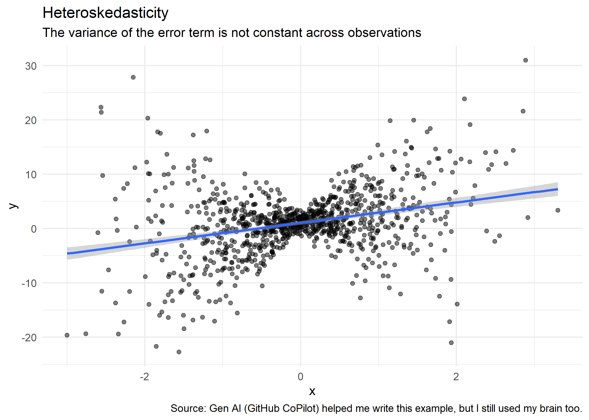

This lecture covers the bread-and-butter tool of applied econometrics and data science: regression analysis. This adapted from work by [Grant McDermott](https://raw.githack.com/uo-ec607/lectures/master/08-regression/08-regression.html). Today is focused on practical skills of using regression tools with R to do some analysis. I am not working through major econometric theory of regression analysis and inference. We're instead focusing on the practical skills of producing regression tables, interpreting coefficients, standardizing variables, and understanding the different types of standard errors.

There are also many R packages I'm leaving out! There are tons of ways to do regressions in R. I'll present just a few. 

## Software requirements

### R packages 

It's important to note that "base" R already provides all of the tools we need for basic regression analysis. However, we'll be using several additional packages today, because they will make our lives easier and offer increased power for some more sophisticated analyses.

- New: **fixest**, **broom**, **modelsummary**, **vtable**
- Already used: **tidyverse**, **hrbrthemes**, **listviewer**, **tidycensus**

A convenient way to install (if necessary) and load everything is by running the below code chunk.


``` r
## Load and install the packages that we'll be using today
if (!require("pacman")) install.packages("pacman")
pacman::p_load(tidyverse, fixest, vtable, broom, modelsummary,tidycensus)

## My preferred ggplot2 plotting theme (optional)
theme_set(theme_minimal())
```


While we've already loaded all of the required packages for today, I'll try to be as explicit about where a particular function is coming from, whenever I use it below. 

Something else to mention up front is that we are using the Opportunity Atlas today for our regressions. Some of these regressions will be a bit simple, but the point is to show you how to run them in R with data that are meaningful. We'll also use the `fips_codes` data from the **tidycensus** package to merge in county names and state abbreviations. 

The Opportunity Atlas file lives on GitHub, so we'll download it from there (*Note*: I am using the githack URL. You could also sync your fork, pull to your cloned repo, and navigate to `lectures/10-regression/` and the file is there too.). I've also amended the file to make it smaller so it can be easily pushed to GitHub. _Note: This is bad practice generally, do not store data files on GitHub unless you have a really good reason to do so._


``` r
# Create opp atlas object by reading in a CSV off the internet. 
opp_atlas <- read_csv("https://raw.githubusercontent.com/big-data-and-economics/big-data-class-materials/main/lectures/10-regression/opp_atlas_amended.csv") 
```

```
## Rows: 3219 Columns: 9
## ── Column specification ────────────────────────────────────────────────────────
## Delimiter: ","
## chr (1): czname
## dbl (8): state, county, cz, kfr_pooled_pooled_p25, kfr_white_pooled_p25, poo...
## 
## ℹ Use `spec()` to retrieve the full column specification for this data.
## ℹ Specify the column types or set `show_col_types = FALSE` to quiet this message.
```

``` r
#Quickly renaming fips data to make it easier to merge
fips <- fips_codes %>% 
  rename(state_abb=state,
    state=state_code,
    county_name=county,
    county=county_code) %>%
  mutate(across(c(state,county),as.numeric))
```


``` r
# Look at file to refresh your memory
View(opp_atlas)
```


``` r
opp_atlas <- opp_atlas %>%
  left_join(fips) %>% # Join together the data
  rename(kfr_p25=kfr_pooled_pooled_p25,
    kfr_white_p25=kfr_white_pooled_p25)  # Rename so you have to type less later.
```

```
## Joining with `by = join_by(state, county)`
```

## Regression basics

### The `lm()` function

R's base workhorse command for running regression models is the built-in `lm()` function. The "**lm**" stands for "**l**inear **m**odels" and the syntax is very intuitive. The syntax is straight-forward to run a simple regression, but it can be a bit cumbersome to run more complex models. 

```r
lm(y ~ x1 + x2 + x3 + ..., data = df)
```

Where `y` is the dependent variable, `x1`, `x2`, `x3`, etc. are the independent variables, and `df` is the data frame that contains these variables. You'll note that the `lm()` call includes a reference to the data source. We [covered this](https://raw.githack.com/uo-ec607/lectures/master/04-rlang/04-rlang.html#global_env) in our earlier lecture on R language basics and object-orientated programming, but the reason is that many objects (e.g. data frames) can exist in your R environment at the same time. So we need to be specific about where our regression variables are coming from --- even if `opp_atlas` is the only data frame in our global environment at the time. 

Here's an example using the Opportunity Atlas data. We'll run a simple bivariate regression of the 1990 poverty rate on income mobility for children in the 25th percentile. 


``` r
ols_lm = lm(kfr_p25 ~ poor_share1990, data = opp_atlas)
ols_lm
```

```
## 
## Call:
## lm(formula = kfr_p25 ~ poor_share1990, data = opp_atlas)
## 
## Coefficients:
##    (Intercept)  poor_share1990  
##       5.623064       -0.006886
```

You might immediately notice that the coefficient seems wrong. A higher share that are poor in 1990 is associated with greater income mobility? We'll get there in a second. 

First, let's note some limitations of `lm()`. If you want to throw in fixed effects, non-standard errors, or any other fancy stuff, you'll need to bring in other packages. So why not just teach you the same syntax, but with a more flexible package? That sounds better. Let's do that. 

### The **fixest** package and `feols()` function

The **fixest** package ([link](https://lrberge.github.io/fixest/)) is a powerful and flexible package for running linear models in R created by Laurent Bergé. It's particularly well-suited for high-dimensional fixed effects models, but it also has a bunch of other neat features. It is **extremely** fast too because it leverages some more complicated econometric theorems to speed up computation, reduce memory usage, and parallelize the computation. (We'll do parallelization later.)

**fixest** has many different linear models built in, but `feols()` is what is used for ordinary least squares (OLS) regression. The syntax is very similar to `lm()`, but with a few extra bells and whistles. 


``` r
#library(fixest) # already loaded
ols_fixest = feols(kfr_p25 ~ poor_share1990, data = opp_atlas)
ols_fixest
```

```
## OLS estimation, Dep. Var.: kfr_p25
## Observations: 3,219
## Standard-errors: IID 
##                 Estimate Std. Error   t value  Pr(>|t|)    
## (Intercept)     5.623064   0.402329 13.976276 < 2.2e-16 ***
## poor_share1990 -0.006886   0.014945 -0.460733   0.64502    
## ---
## Signif. codes:  0 '***' 0.001 '**' 0.01 '*' 0.05 '.' 0.1 ' ' 1
## RMSE: 21.9   Adj. R2: -2.448e-4
```

The output of `ols_lm` and `ols_fixest` differs a little, but check -- are the coefficients and standard errors the same? Always check if a new tool gives the same results as the simpler tool before diving into further. 

#### What's in these objects? 

First, let's talk about the object we have. The resulting **fixest** (and **lm**) object is pretty terse, but that's only because it buries most of its valuable information --- of which there is a lot --- within an internal list structure. If you're in RStudio, you can inspect this structure by typing `View(ols_fixest)` or simply clicking on the "ols_fixest" object in your environment pane. Doing so will prompt an interactive panel to pop up for you to play around with. That approach won't work for this knitted R Markdown document, however, so I'll use the `listviewer::jsonedit()` function (used in the APIs lecture) instead.


``` r
# View(ols_fixest) ## Run this instead if you're in a live session
listviewer::jsonedit(ols_fixest, mode="view") ## Better for R Markdown
```

```{=html}
<div class="jsonedit html-widget html-fill-item" id="htmlwidget-b5c3dd174902d0b51e58" style="width:100%;height:10%;"></div>
<script type="application/json" data-for="htmlwidget-b5c3dd174902d0b51e58">{"x":{"data":{"nobs":3219,"nobs_origin":3219,"fml":{},"call":{},"call_env":{},"method":"feols","method_type":"feols","fixef.algo":{"extraProj":0,"iter_warmup":15,"iter_projAfterAcc":40,"iter_grandAcc":4},"fml_all":{"linear":{}},"nparams":2,"obs_selection":[],"model_info":[],"means":0,"coefficients":{"(Intercept)":5.623064305017281,"poor_share1990":-0.006885865782179403},"residuals":[-5.26043692197745,-5.233252772959155,-5.271914060696985,-5.258205491202362,-5.23016795591727,-5.27481601641212,-5.263637048185537,-5.260197195650847,-5.281214511519262,-5.256436039409403,-5.233844395361258,-5.22404257284088,-5.236976923722097,-5.21508359040524,-5.209542098210521,93.37792237675021,-5.248865000074174,-5.253050887109096,-5.269182700664321,-5.216042724989554,-5.211910825966277,-5.217453783755372,-5.241241732211213,-5.284737735571569,-5.225396147649533,-4.563369712581521,-5.253408298705194,-5.257152993951228,-5.22025203462357,-5.215901527385152,-5.231028689028533,-4.61326479258152,-5.264817554800638,-5.263505950936248,-5.264149263970776,-5.227870076763693,-5.278238284861606,-5.192669954324884,-5.22579139053552,-5.234093917094234,-5.257237723747595,-5.255519114046663,-5.290944818588359,-5.305419572761634,-5.258970492348024,-5.250545205422249,-5.22711631736035,-5.234749251680751,-5.262865614762484,-5.253229138461734,-5.294808136253383,-5.25285045192017,-5.283537661630301,-5.251456525363126,-5.255354904957271,-5.249009964114788,-5.290624988168682,-5.222433331291926,-5.208692003040892,-4.597075812581521,-5.265486737772407,-5.256957061841195,-5.265317994525719,93.37809490735064,-5.202861236984439,-5.270717848849831,-5.233545719945655,-5.273904465988028,-5.272840452809339,-5.232354055313154,-5.375815743033364,-5.321765407076496,-5.312141585951913,-5.31536362495987,-5.223172504564796,-5.185281109895851,-5.384975077158431,-5.251102472486591,-5.202741136164814,-5.227307679943713,-4.511106242581521,-4.72546649258152,-5.313620161655891,-4.545483132581521,-5.372962639063436,-5.334141524428422,-5.379516584875653,-5.175975349166834,-4.642753892581521,-5.209282868947971,-5.10868093668378,-5.193428116402711,-5.22548691544042,-5.234235999920353,-5.468239049607087,-5.342146629658202,-5.280788519732178,-5.209361139979469,-5.217319063908684,-5.225633444104197,-5.209570916749213,-5.176084638221288,93.37886613161726,-5.223635887668054,-5.22442747550996,-5.24451336070031,-4.557371222581521,-5.254658193010544,-5.237954076665934,-5.190251720352737,-5.237432173371658,-5.262131916937649,-5.249139652062874,-5.208802920128665,-5.1942144875413,-5.204937116838076,-5.25168894250553,-5.207147116179324,-5.191654579147055,-5.2745860785696,-5.224978412409183,-5.214602835358023,-5.204150717651041,-5.186522987227187,-5.25923203205281,-5.215591358989082,-5.226035681492315,-5.232029739315776,-4.61011936258152,-5.247891948814718,-5.246612159394213,93.3791463044128,-5.253325133548365,-5.213829391490595,-5.205744226193672,-5.20422366144887,-5.244644890124824,-4.530142862581521,-5.225684371213806,-5.261939968404259,-4.563989002581521,-5.230668199557216,-4.533980212581521,-5.224335273983061,-4.578455882581521,-5.285180363065208,-5.214949359063054,-5.268625625059613,-5.222670767904065,-5.265473229355265,-5.24243682280873,-5.228090074487501,-5.222767797087218,-5.241586531651643,-5.182154508295131,-5.216843906923723,-5.250385114343813,-5.280623817429284,93.37943431972744,-5.201968206319218,-5.246995284210338,-5.186630913938099,-4.573518682581521,-5.203952096868361,-5.298044253735489,-5.202912438907188,-5.26052310624666,93.37820752238029,-5.214846924904332,-5.205574587515797,-5.275302071961741,-5.204605951891372,-5.281139896217167,93.37754414570726,-5.204584658949288,-5.190722432870216,93.3778123111435,-5.203916170001064,-5.20605265573161,-5.190381248672181,-5.262723991692249,-5.192746754057705,-4.53209652258152,-5.196949168858436,-5.266433406927785,-5.231849552418982,-5.176915300229493,-4.586418262581521,-5.154795332938069,-5.204353238712581,93.37759652524193,-5.187818329149717,-5.183419110088246,-5.228144047603638,-5.153710836123156,-5.22998585690838,-5.214422112589755,-5.221270477006902,-5.255064992698092,-5.167825202267711,-5.197056003856483,-5.226121451503266,-5.200984624775862,-5.193152858809242,-5.190817512923512,-5.228984833065509,-5.143961597476331,-5.159212777897563,-5.223034308515659,-5.211932238680738,-5.175730425868873,-5.187769717052984,-5.216493060439729,-5.186840460335084,-5.16942011552652,-5.161262938460087,-5.161555992713626,-5.188296084541506,-5.213224242959891,-5.198574262904614,93.37757450744508,-4.52816381258152,-5.196513542113278,93.37781270411986,-5.211100675479394,-5.173352828593192,-5.147235329352989,-5.19048567197643,-5.147784781415673,-5.206723661616907,-5.198058018355764,93.37757027888999,-5.173827759940322,-5.197267568440595,-5.177453545525523,-5.204519182160995,-5.189787598014378,-5.208666240544269,-5.193491737437874,-5.219335480743072,-5.174308013369053,-5.193888245754929,-5.186606073707113,-5.207831153811593,-5.215648260072043,-5.211460905526267,-5.181033076382031,-5.167141273126422,-5.104702883129073,-5.239614504171438,-5.173681190128057,-5.148834562988176,93.37788688830628,-5.041287460061123,-5.121142451351483,-5.12152591362736,-5.234014959120128,-5.214938417288157,-5.132518850187269,-5.152435227177084,-5.242235659969831,-5.14214663340425,-5.140415420627067,-5.163621443453827,-5.13293563832132,-5.212049745260139,-5.191124817854563,-5.155668552118916,-5.182175777618147,-5.114960007569727,-5.134870408547179,-5.152626086905621,-5.22342796222796,-5.075898387797017,-5.169096040034004,-5.106899873175374,-5.109235217432403,93.37783152229588,-5.136017215348629,-5.16362688916259,-5.169375520078066,-5.159061404572578,-5.150222810299931,-5.169814659027336,-5.327791115964423,-5.161599011618334,-5.19179003196438,-4.504581622581521,-5.168156654210388,-5.197832252099569,-5.066142082046659,-5.158747576736129,-5.130591885278484,-5.1643028805227,-5.18287280321633,-4.55795957258152,-5.120222766250731,-5.208868240401427,-5.124944775491588,-5.187009302379397,-5.149116718825303,-5.109787990927574,-5.118107923351161,-5.104289225308552,-5.17892538787786,-5.118249035638567,93.37787616184886,-5.110834823367291,-5.191137742785234,-5.212380911631397,-5.181078591543084,-5.17552808572305,-5.205912747145133,-5.213653625771834,-5.165561279463917,-5.217865513587252,-5.241426483533344,-5.258003107876834,-5.241107737317298,93.37810850831274,-5.249507980417374,-5.247868315784899,-5.241353278565766,-5.267268387371997,-5.235494750443587,-5.227514781496398,-5.256401196471501,-5.208713030281656,-5.227626458673187,-5.234506682968282,-5.211491218132808,-5.267072509695981,-5.264962000778186,-5.270675417351034,-5.272817218004564,-5.254499860694698,-5.206407551459855,-5.281933707103034,-5.31423098703705,-5.238242619549479,-5.186473232261239,-5.275753525926162,-5.247918740394746,-5.223408485764056,-5.262727767469412,-5.229607818188716,-5.241427414695393,-5.249740469062603,-5.224922016503765,-5.242625548781197,-5.250571157564998,-5.271293611804055,-5.198552168890479,-5.248062043361625,-5.235582901416218,93.37812206004088,93.37828944311235,-5.251831098366243,-4.603117602581521,-5.25521480379212,-5.247314196990559,-5.20872034365101,-5.212051602655593,-5.200060260667004,-5.250847129939671,-5.224561897123875,-5.256739954665054,-5.24547345537646,-5.228899284194749,-5.233665045583207,-5.240815096606863,-5.241807848303273,-5.255987635520138,-5.269060471472283,-5.230453466732211,-5.253883279824109,-5.227116002774857,-5.219799723388062,-5.207338963500782,-5.257357199040246,-5.234271597821153,-5.257033528147129,-5.25261303417619,-5.240138949067663,-5.237077979722871,-5.238532173732324,-5.236339515574151,-5.247979986014677,-5.24658924281152,-5.254557437558583,-5.293830039157776,-5.293086607334221,-5.234482168683658,-5.240835038781742,-4.573997512581521,-4.57661776258152,-5.245158233761603,-5.299180654625818,-5.273691434368985,-5.247409601800896,-5.271147575556414,-5.232875287342146,-5.265892858157089,-5.267021307499557,-5.268622079762827,-5.290848971552669,-5.235146318250392,-5.276630142001948,93.37793935977415,-5.234298280259789,-5.231487358430891,-5.278259060809996,-5.267861987983072,-4.574324952581521,-5.198508520176326,-5.279074565338147,-5.290642036314594,-4.604767672581521,-5.282612435053005,-5.230003346504648,-5.250506497613183,-5.274403051027885,-5.213496928992604,-5.278815918635255,-5.261729947418385,-5.274423159955829,-5.292182392813888,-5.206863313191644,-5.229317252392477,-5.26363356031858,-5.29408553005627,-5.25700909163082,-5.285768456864003,-5.3087002122226,-5.250271146128835,-5.28262905415689,-5.240991003235666,-5.214571211201427,-5.269145494144626,-5.24448511589615,-5.276535171312137,-5.232667493380977,-5.179779754480684,-5.26498295992906,-5.199311998991039,-5.232725750105076,-5.294220881669056,-5.247402916967845,-5.267629186899407,-5.273433610914426,-5.249494329719684,93.37842781974965,-5.280977958004584,-5.198248874520416,-5.231413401130252,-5.246594426454738,-5.304079990137904,-5.25051878435926,-5.253886911405349,-5.239347726660519,-5.260282380441761,-4.563815582581521,-5.252751143626634,-5.260590270978422,-4.565119192581521,93.37809824100484,-5.26725302306861,-5.280614956039974,-5.276956269963279,-5.246385357622843,-5.252729273205972,-5.266670107959389,-5.28258103667229,-5.271189150163766,-5.217588041941208,-5.25340925914807,-5.252045231007139,-5.256067332837638,-5.266155007773675,-5.232953987002849,-5.274873854517803,-5.276554566348508,-5.286309048086531,-4.569438412581521,-5.256973025721882,-5.279764659879191,-5.246845333466575,-5.275388671063074,-5.260072468295535,93.37864665752203,-4.59512876258152,-5.27367999750547,-5.287829864904777,-5.277442449113908,-5.196467517163843,-5.256391146972182,-5.238911809591113,-5.281172973173204,-5.239015046887479,-5.240286024366263,-5.238953867102467,-5.264483892097002,-5.277660453839195,-5.289572040310846,-5.303285118047331,-5.234929102004356,-5.285892101374907,-5.287767744356866,-5.24441330552602,-5.223537174509923,-4.58856754258152,-5.27140292161526,-5.288893759150961,-4.56198345258152,-5.30052044647139,-5.290005001952723,-5.280488370705797,-5.300628515686406,-5.250152384646613,-5.282414597985532,-5.268599251458586,-5.309420815146387,-5.270366934468814,-5.286202292201602,-5.261337056681192,-5.21782854453056,-5.251038617341238,-5.283952138389227,-5.280038331446696,-5.275950101058782,-5.219132579260186,-5.278795134387348,-4.57612567258152,-5.264748905295071,-4.581187532581521,-5.297450754509219,-5.287212108479506,-5.256393329498774,-5.258006976866484,-5.265605454111245,-5.198373242938979,93.37770517864018,-5.257306561863063,-5.264979958676589,-5.299313648171201,-5.263670465559133,-5.209119988481314,-5.166526333419097,-4.503423862581521,-5.186942092128743,-5.191859473212618,-5.121308323898012,-5.193581266654815,-4.410882552581521,-5.182035609807688,-5.156957191526393,-5.166277358334288,-5.177492086251114,-5.16009685765555,-4.499990002581521,93.37789349419276,-5.125568523631007,-5.203452995931532,-5.209689457961249,-5.10495782142276,-5.163157854253926,-5.115466968613156,-5.140596447914348,-4.39128126258152,-5.193495655814169,-4.412222882581521,-5.148898176467232,-5.172976835396996,-5.165757773115956,-5.129416971095432,93.3778852946415,-5.173821614985728,-5.17269096448076,-5.14329537356616,-5.150936080033501,-5.167949540171731,-5.132425921691619,-5.10546681806722,-5.165806827994752,-5.187940767505864,-5.080390252596465,-5.165731928753952,-5.199871396895118,-5.167385746472958,-5.200603102770774,-5.098023098506038,-5.175456697482805,-5.164588327811702,-5.164839053265241,-5.193392981358179,-5.298889825200325,-5.205755217728728,-4.52638601258152,-5.197672543407265,-5.170790544727113,-4.418462232581521,-5.149246778422253,-5.2006223877075,-5.219175388260378,-5.191761447050079,-5.152439148729801,-5.199907407285378,-5.143993503968622,-5.218378530563828,-5.23758464862081,-5.185092073302823,-5.176863002610506,-5.190689864714499,-5.19473731624886,-5.148432685655278,-5.138889802294792,-5.203257177996448,-5.155468401450111,-5.157447025398944,-5.192560871533942,-5.157270318097921,-5.196756229939528,-5.203723425419795,-5.167513377708025,-5.183259522212735,-5.187196085362665,-5.152031219683381,-5.12741405027398,-5.174343333951338,-5.152060128938312,-5.166927919354801,-5.16954183589976,-5.211335697494008,-5.122727937835009,-5.227400308706221,-4.499661642581521,-5.111081653817956,-5.202473510878756,-5.222905895694692,-5.226300179262009,-5.168801991192987,-5.220159402184073,-4.526800682581521,-5.191437987572571,-5.211778987507936,-5.175792703620956,-5.188635937650984,-5.195049807511054,-5.163520818799538,-5.160807132639509,-5.201272088770453,-5.245767925990349,93.37783907154598,-5.223870421903828,-5.220269090568983,-5.194935606335679,-5.230534504789274,-5.248368514413558,-5.186653845190206,-5.145508034940663,-5.133724742164042,-5.18317670588343,-5.215927564684954,-5.148687578760232,-5.187352438864675,-5.253205112674759,-5.198534023817522,-4.493685742581521,-5.147584445378356,-5.208168098970608,-5.235737522768261,-5.162011446465812,-5.170995375394961,-5.182063699371827,-4.53143685258152,-5.253469075854274,-5.198561821183628,-5.242809499512894,-5.189601500647549,93.37773095105864,-5.164952520737469,-5.182096137815861,-5.221996737561126,93.37753411116918,-5.205987918275864,-5.237230564196995,-5.150184781631312,-5.185205680368902,-5.137369092649139,-5.174737849046455,-5.155369429459806,-5.197663477574985,-5.21199694541073,-5.214794875469813,-5.246683370006261,-5.169806423273418,-5.182330262109986,-5.238487024435308,-5.243900426816756,-5.132400922365489,-5.241734892339075,-5.209367438377535,-5.225841444434415,-5.194269377224894,-5.224670074574072,-5.234537036670016,-5.214294954122868,-5.222815234697291,-5.206574003871486,-5.16273667392796,-5.206841545630374,-5.206572238150422,-5.217520199806492,-5.265543279708496,93.3773507768106,-5.212473510688865,-5.262595923405686,-5.237171734132534,-5.193051278979486,-5.187280726591126,93.37766392775949,-5.174136070040894,-5.263874268325359,-4.519553922581521,-5.184101126612765,-5.216160049584141,-5.196752023167458,-5.191683876980558,-5.246876824000021,-5.249426072330325,-5.236769499358186,-5.212584861926146,-5.149408462729216,-5.215819130966424,-5.212512454472543,-5.228972528040881,-5.213764791936678,93.37803366645727,-5.194086640093178,-5.10844628160975,-5.236244295745591,-5.238036785031714,-5.244444263492083,-5.268596939835408,-5.278298103728848,-5.19844633890698,-5.189734518849589,-5.221627989175972,-5.23285911803235,-5.210646262784936,-5.233656200696969,-5.187976497295242,-5.199078395749685,-5.197291974441554,-5.214203855125949,-5.233906313012754,-5.189589951932915,-5.193204317006652,-5.201624310429141,-5.190376164567339,-5.197112965827687,-5.182433689691775,-5.209749363769255,-5.21419637494748,-5.185385808070595,-5.207483536956836,-5.239104840762385,93.37820275860062,-5.224452987558385,-5.162784858604022,93.37786845449929,-5.20298119982065,-5.20325875374597,-5.198436438791643,-5.204543729160137,-5.211974101595718,-5.19197614542662,-5.240806314748983,-5.238541427648169,-5.234065168640556,-4.555958052581521,-5.191162172415149,-5.19624706226549,93.37792181045661,-5.256909086690309,-5.188959007226071,-5.163554917537963,-5.178797671555584,-5.117530934289691,-5.112362740623951,-5.094932827641788,-5.161490597827544,-5.064812052604647,-5.10124164023283,-5.19240901823069,-5.138870784976274,-5.091331334725599,-5.091539124801921,-5.137837989554322,-5.078990330717864,-5.112796721391237,-5.032759381205111,-5.123007058586186,-5.109102874851727,-4.472810232581521,-5.075101978797259,-5.062171341890705,93.37788118377964,-5.118552979286614,-5.079436733457274,-5.163102283482876,-5.106252204684238,93.37737236435788,-5.135557978749666,-5.149201541405341,-5.054585388907469,-4.521548742581521,-5.125471109206189,-5.109128240754135,-5.107547255155145,-4.42759057258152,-5.121378383874578,93.37771565686215,-5.155631390878058,93.37777912133929,-5.085980763859894,-5.104763004544393,-5.147388315245381,-5.08475644219172,-5.115546150902519,-5.132032848680801,93.37762296753117,-5.080803952687788,-5.093715075797584,-5.076884708399107,-5.093721840811782,-5.108854361378865,-5.162284843942759,-5.149928040799982,-5.14530608698099,-5.096695436643937,-5.119126550294131,-5.032301574010988,-5.194606353736279,-5.184426513644832,-5.161757351789834,-4.447959712581521,-5.020759220822082,-4.435870072581521,-5.118252197280242,-5.144929917308277,93.3775465781187,-5.118965469873368,-5.074444066212068,-5.156127743777733,-5.137431109609258,-5.13235047016104,-5.193141293348234,-5.068143376652696,-5.08134559381699,-5.145458069825376,-5.085871792205287,-5.071187381172835,-5.082345324434927,-5.195642689729087,-5.196409481599819,-5.117126191522265,-5.114585121342601,-5.036459031937674,-5.203964995840842,-5.087600067749886,-5.037767781027307,-5.124390122655972,-5.128633554984289,-5.122906902441298,-5.149228679481671,-5.128858081386882,-5.199837027993313,-5.145786102547593,-5.147210141588297,-5.134865266331847,93.37774249176969,-5.10364905478562,-5.059302963572019,-5.195143063439075,-5.137419331946218,-5.138111151974968,-5.210300548836237,-5.163220096299398,-5.199686300058058,-5.110717953059196,-5.157818736780064,93.37827163247621,-5.151131697612249,93.37744765597056,-5.102446979304562,-5.173546259568134,-5.202232806156152,-5.063837007500184,-5.048556159609375,-5.138262036391207,-5.110306391142058,-5.128942513018129,-5.151115730481953,-5.196792400663989,-5.193125877022899,-5.064787285289935,-5.156646951772534,-5.173374796535804,-5.194672322507389,-5.139200495252903,-5.132493781769391,-5.094437912750831,-5.143118228401116,-5.210722411881241,-5.209785580980329,-5.200065343128401,-5.245262145576001,-5.085351031520673,-5.118854818274518,-5.15010225888953,-5.091021990091251,-5.054992597243655,-5.145135480042056,-5.177856622583343,-4.48863511258152,-5.186915479139689,-5.036364338990392,-5.041936341526231,-4.461145862581521,-5.156791000109581,-5.110800082701927,93.37717322979498,-5.168712920127457,-5.13082173236013,-5.161446820650002,-5.18596855899386,-5.151888620268073,-5.230414177691958,-5.144828122706106,-5.17677700992548,-5.14258837409615,-5.192399115613652,-5.144219084323919,-5.147737429438229,-5.086250909900929,-5.076288297964034,-5.168066592868534,93.37769328902232,-5.209618062193691,-5.140705161639252,-5.118084071381348,-5.008543373603857,-5.174786186368635,-5.098681940296519,-5.10959105310214,-5.170426484913833,-5.1147759552326,-4.464015832581521,-5.170778049350374,-5.096417737172889,-5.136435726258018,-5.156042579119616,-5.091573448101919,-5.200900933678787,-5.112893078150746,-5.158404244268582,-5.184240601993097,-5.127210984169782,-5.110281981884389,-5.127005000443331,-5.199757681423038,-5.120460004523872,-5.23024167682245,-5.203008251284721,-5.231660626854596,-5.032686583732721,-5.122426369511897,-5.088708997721461,-5.149540389093986,-5.097089858754179,-5.130572216334311,-5.185760030126866,-5.096177611766206,-5.077986575711844,-5.126016578186752,-5.031214608601999,-5.097220197252449,-5.054106654742098,-5.180850642905017,-5.17365384584345,-5.264607480207292,-4.525950002581521,-5.244226666419752,-5.224427296620505,-5.188122027973386,-5.215288138182872,-5.217709204846822,-5.246095617895806,-5.215492259390947,-5.258233955485952,-5.241613033154364,-5.251050886587715,-5.249978187740149,-5.25222451998749,-4.492705002581521,-5.222139729754508,-4.533735442581521,-5.210968946548753,-5.211182607594497,-5.23402228064766,-5.22124406624398,-5.231809814077835,-5.221350875085266,-5.219306573778841,-5.247994615438659,-5.274702961602663,-5.261443428338813,-5.207807373824137,-5.193370414339136,-5.20722875568289,-5.209397162406977,-5.220129503258934,-5.198376161628301,-5.255210977345116,-5.261578992430824,-5.228262670990589,-5.237114232381161,-5.258433211839572,-5.269819098480109,-5.178870639465976,-4.576364652581521,-5.238146243324443,93.3780892279574,-5.219232706766373,-5.193490235057643,-5.219361730051838,-5.149052875894048,-5.218521090747907,-5.240899966633844,-5.24954967861379,-5.213212211139631,-5.240752920422899,-5.220991576297833,-5.236096615409509,-5.212130486738555,-5.221706210948743,-5.25925087289273,-5.265933881506585,-4.512141272581521,-5.247821097822178,93.37971814547477,-5.238296732569777,-5.19305736975156,-5.237804953631694,-5.232429069024426,-5.22960811037443,-5.254200036963666,-5.225781966294457,-5.20432649469345,-5.248253680540302,-5.208989864026399,-5.221833726902521,-5.190887424702362,-5.241691068158342,-5.264304662618276,-5.195402712671843,-5.250964751537157,-5.208777251487405,-5.177547164672466,93.37789233840019,-5.206324348313442,-5.232199632820174,-5.222647345624123,-5.235695143789354,-5.241738521553675,-5.19591006002952,-5.203751939976182,-5.261030187281868,-5.210982187302315,-5.186106655272066,-5.213259775305841,-5.243058459220611,-5.187826312070299,-5.184309440807894,93.37826899939,-5.274956662058413,-5.241450109098171,-5.255363308220716,-5.227963904381844,-5.258674000839774,-5.246592928695368,-5.14823208997092,-5.223777121275429,-5.247905417321851,-5.234466006700767,-5.260353805619252,-5.235208301519808,-5.241015774225641,-5.181540869452646,-5.217702777037685,-5.191349500224448,-5.213455489586285,-5.210028457786928,93.37846904666753,-5.230828525765763,-5.194076801379348,-5.234745341877352,-5.184439407147826,-5.2542935556321,-5.238564902657649,-5.255788627526673,-5.186578897411428,-5.196315962337704,-5.193941783320778,-5.184293291272307,-5.206588136352607,-5.183455233100672,-5.240374739346258,-5.236709028948974,-5.268864739266305,-5.217355569298885,-5.207178801527164,-5.141065293955204,-5.212100437533463,-5.23112661629449,-5.224709315929649,-5.246598675028803,-5.247321510798236,-5.270246143609576,-5.236075298842619,-5.177169724702687,-5.228704628335413,-5.204594917416458,-5.225323040192376,93.37883485608374,-5.212837205533442,-5.221103201711774,-4.513832262581521,-5.206081668640406,-5.17640672400143,-5.163720729280064,-5.233054016448257,-5.199619236911699,-5.280542207537367,93.3789619529843,-5.241031652245219,-5.28004079070699,-5.257172638341869,-5.202447688718409,-5.236787929305816,-5.243411201766773,-5.235371242751441,-5.239645208158671,-5.158964885418975,-5.200650871913895,-5.186845608758045,-5.270207231684041,-5.219720737365097,-5.235397625972049,-5.199375072182606,-5.208563932358479,-5.227898675354688,-5.207101988914128,-5.229075271482345,-5.214331397598587,-5.185399324844639,-5.236784482918539,-5.168343120155519,-5.206797672555974,-5.255963577282785,-5.238415856609967,-5.24377426396997,-5.159366267504765,-5.221985794719264,-5.22359351068875,-5.21348948036981,-5.197121576433852,-5.19718162787393,-5.183214223852334,-5.207013599064945,-5.204344760428731,-5.205263775100082,-5.198004944215718,-5.209197062964515,-5.215715325256613,93.37799185258818,-4.544774312581521,93.37792933381584,-5.21757091507743,-5.235080304990006,-5.185158110529475,-5.208111386737348,-5.212897305541295,-4.532703572581521,-5.188784887861475,-5.248661570559308,-5.165979029604297,-5.231970920429411,93.37725277538534,-5.248449893019488,-5.188424125814251,-5.171584317688609,-4.531060472581521,-4.483520202581521,93.37770626027199,-5.144147891456897,-5.234149184338697,-5.192659754250829,-5.199604306579014,-5.243607646028243,93.37750938616665,-5.216065123794677,-5.241421844112626,-5.231064172758041,-5.300806124716433,-5.171745636983783,-5.21228894787134,-5.186497930169485,-5.160547557343423,-5.173532569418891,-5.189836007786615,-5.217695828346269,-5.172412127547074,-5.142542378280044,-5.115828761663987,-5.118782844129312,-5.174103754989673,-5.208072414819006,-4.500490712581521,93.37812208758434,-5.193455274035849,-5.212992477393218,-5.204720618172153,-5.20919671049834,-5.183935871186568,-5.222359268196342,-5.20841819413662,-5.212814378227652,-5.225113729788465,-5.248105045342555,93.37788776377526,-5.252515782516004,-5.223256911397185,-5.226242671175378,-5.220176255982553,-5.22163928007586,-5.223519297171397,-5.177921065767,-5.233785822002085,-5.179212770202635,-5.189831443049078,-5.207521534510271,-5.186804007218419,93.37784367488497,-5.219960873927402,-5.156709324037413,-5.192132584054018,-5.213621820915071,-5.209004501232204,-5.155841396188741,-5.136656731380046,-5.241950455603196,-5.217606960804988,-5.233310814272232,-5.179960169557884,-5.209438000196614,93.37773408612446,-5.241716223187403,-5.237201559751816,-5.23864925751429,-4.45361875258152,-5.22388090229459,-5.201473450925397,-5.182114600928951,-5.208199658258295,-5.192078906736129,-5.225027856357045,-5.198415628384792,-5.193638158598324,-5.203683554825242,-5.190769306455824,-5.212806945654366,-5.220537324353813,-5.153962253175766,-5.215991546570104,-5.189882718717811,-5.203374932883806,-5.232278633184714,93.37811535059099,-5.26058826845231,-5.21564454381645,-5.212878936039792,93.3781723563326,-5.209776069200248,93.37785198702014,-5.209073816036502,-5.216514585311232,-5.204599506227176,-5.186331311886287,-5.142672348814149,-5.219999816010158,-5.250743791303093,-5.222242218276118,-5.228765622843421,-5.175735236154933,-5.19622738789065,-5.221510415412028,-5.201735595941141,-5.236561536769507,-5.225068232403599,-5.275731174734319,-5.237995287636378,-5.121899840101894,-5.165511849852496,-4.45747222258152,-5.177241911663174,-5.129219677182757,-5.024265648965178,-5.129138222434275,-5.082955709804119,93.37778776062194,-5.105679943152081,-5.18161871201997,93.37781353820479,-5.135225714840194,-5.131431884393129,-5.10347073944393,-5.115704429994867,-5.107366440803645,-5.160563566937963,-5.142689335269586,-5.096372749479758,-5.092245498826575,-5.117376313872733,93.37794604925503,-5.13633915154853,-5.12074030189142,-4.387743192581521,-5.193454767963039,-5.104478877689719,-5.156091717642993,-5.148729581511541,-5.143876840476332,-5.079193731369122,93.37799892134255,-5.112131036126912,-5.052082829447398,-5.174370926869343,93.37782564403884,-5.164346720051752,-5.097997683640463,-5.113935922546963,-5.03712115997078,-5.125379997709095,-5.112308869202765,-5.143024568299054,-5.062701196450338,-5.11926371833178,-5.092643932230794,-5.171177768173473,-5.120221976443063,-5.158317809760765,93.37791337485787,-5.10475377723944,-5.116331873587502,-5.089619077310345,-5.142831263932066,-5.110258729774223,-5.096455991277763,-5.15552847206698,-5.066239260355701,-5.11794954495107,93.3778835043164,-4.505044602581521,-5.030307117636483,-5.075159985615309,93.37782687585137,-4.46596442258152,-5.079029930028083,-5.117658411032861,-5.169398777089425,-5.126527223350355,-5.152299431015616,-5.068536894094192,-5.084278312051306,-5.146877527767086,-5.076724814018256,-5.099038117270693,-5.092519193486649,-5.027806869086276,-5.085386849740691,-5.093035214228056,-5.120520634638519,-5.13286234667561,-5.156803392806927,-5.111442457613445,-5.116986621378745,-5.127188475698214,-5.076460521212847,-5.245974667567508,-5.253959331991211,-5.221744966060242,-5.232230072697985,-5.261286486365387,-5.278272100073948,-5.244085628224356,-5.235622089423623,-5.267333867428759,-5.209861665312348,-5.304179313991638,-4.559529382581521,-4.61431368258152,-5.295129030697574,-5.271126591704139,-5.23219106490633,-5.246082511720256,-5.25998432412545,-5.220436076764284,-5.164548428507871,-5.181943042370126,-5.277884708364748,-5.222469801029589,-5.256439434846709,-5.293315090552641,-5.266859057100685,93.38008994483675,-5.250486577027427,-5.23863029936641,-5.248638430642415,-5.259411827061961,-4.592118702581521,-5.250072576715953,-5.242458378916531,-5.255285738517829,-5.25236230000219,-5.200139244460407,-5.274102378005876,-5.219388118046355,-5.234022006271253,-5.262034510833997,-5.299731608444717,93.37849972051411,-5.277988402652551,-4.568126072581521,-5.224828735051782,-5.28517315059788,-5.261026645297002,-5.255507163986865,-5.27309087695667,-5.250496495027896,-5.269779899577616,-5.267157916841781,-5.290655818065653,-4.546792402581521,-5.219930260061171,-5.253514092393694,-5.247580812597382,-5.267343698652937,-5.293769262059395,-5.228846013541816,-5.258309020998194,-5.249907435550516,-5.233288792808166,-5.219170653021553,-5.22799314090114,-5.299748971175328,-5.294478062572791,-4.587180392581521,-5.242549797129146,-5.214287974778265,-5.326210237349838,-5.249959138579464,-5.225276428302418,-5.27306789960735,-5.302181915516237,-5.230789485847964,-5.221349875795689,-5.248776745770865,-5.276545409626841,-5.273237421873958,-5.268307035105512,-5.180739239951814,-5.159621106940446,-5.154134951642604,93.37800442989747,-5.208585848411689,-5.183296162528935,-5.212309007821684,-5.191745502947169,-5.201545928263405,-5.216144455278776,-5.236994160003302,-5.244384528230825,-5.174512115814473,-5.230892945646101,-5.201154425883556,-4.53963413258152,-5.162721157832874,-5.209255841633611,-5.186737575173307,93.3783931531338,-5.131562145167768,-5.193033249371936,-5.154878011435578,-4.51207935258152,-5.174041458645618,-5.195855752707647,-5.193672861601628,-5.228966132974628,-5.182507120532018,-5.198846699478549,-5.173396880539857,-5.15443978137144,-5.200505922352942,93.37867497922571,-5.248465267641173,-5.206514402243756,-5.211233783282206,-5.112422134994512,-5.221270344725056,-5.192785579063904,-5.181477298199176,-5.196042679507191,-5.200597057956044,-5.113820186363027,-5.18226604456351,-5.198885301651696,-5.237135192751136,-5.254324325880398,-5.21971236460594,-5.208772926650324,-5.199167603951526,-5.135521648741866,-5.220655260397948,-5.179955388303229,-5.207679295792436,-5.151084498180774,-5.204406122830001,-5.182094000995114,-5.209257278873906,-5.207061603095591,-5.180436076640016,-5.223807351046579,-5.21770300593144,-5.210697802901044,-5.175575436017086,-5.213947975345325,-5.257329402937788,-5.160997531507099,-5.173458182719884,-5.170659511111292,-5.206301164195896,-5.248702952088978,-5.199810967344244,-5.121796788105575,93.37881838943088,-5.120799698193791,-5.188824545857292,-5.279298065615262,-5.169335208305629,-5.211279360317064,-5.214818243906705,-5.195542538562985,-5.180714497901406,-5.201898673266796,-5.231942344741106,-5.161156824098529,-5.189056705675418,-5.243874305559668,-5.182237813135544,-5.200912588164267,-5.237406060033758,-5.174968568780381,93.3784770987924,93.37780369465308,-5.239880546261778,-5.237310199810558,-5.226645461919185,-5.151464742941123,-5.181194554597016,-5.237141883784735,-5.196955662762035,-5.136827394760093,-5.215282226734458,-5.200922506553102,-5.172337409144374,-5.206788639482599,-5.206187852886991,-5.225218616788739,-5.196526123119587,-5.229234178444394,-5.212170085716608,-5.226343707882182,-5.185612087452435,-5.206605055903128,-5.29419276326285,-5.133901363000489,-5.219349017110834,-5.185755148392848,-5.110710907360398,-5.098471106754923,-5.058590513716486,-5.178118346517982,-5.095376747576884,-5.129155944158628,-5.033457992132101,-5.061114035788323,-5.187093239816953,-5.044153822824045,-5.138685312282358,-5.164244962803835,93.37802858861328,-5.205540286699782,-5.2292803685369,-5.154906601281326,-5.073374283114073,-5.191622094914861,-5.092620165476677,-5.085185190476034,-5.194684999883755,-5.183712842810745,-5.07705993904784,-5.161453071664591,-5.075160780540711,-5.083978497987349,-5.135359219142034,-5.208287593639978,-5.177805432268818,-5.102669062205673,-5.154208061541028,93.37870028092637,-5.076291042159463,-5.092382319082661,-5.058962254374599,-5.173258750589597,-5.12228633641283,-5.141984140151309,-5.047645842130176,-5.179128112510231,-5.234987850510148,-5.165104667249805,-5.053912017410269,-5.162306065417133,-5.059314305953414,-5.049689053118825,-5.099624870453217,-5.11957244137111,-5.121262178220682,-5.151793192741784,-5.114245396378503,-4.974235684496028,-5.163515568149062,-5.148129880985326,-5.047749573933285,94.05863640741848,-5.085945432622395,-4.977721116136631,-5.028657677943388,93.37773586281556,-5.044424257547306,-5.083222448013775,-5.127854873871172,-5.100100073904525,-4.388199582581521,-5.139973176076566,-5.008839243245783,-5.070747520489594,-5.134618067552697,-5.121295974420235,-5.037173253037842,-5.141785249988081,-5.035769492529711,-5.057962822893895,-4.513519632581521,-5.106044713261943,-5.17233025852724,-5.076286465367233,-5.071658528903185,-5.140704122638448,-5.223131111073082,-5.082708126247164,-5.079172956869752,-5.07660789927967,-4.992127234511806,-5.069945946237583,-5.135766122111949,-5.085105148757695,-5.08537901159173,-5.117867065463611,-5.059757771551119,-5.019763729930967,-4.487031092581521,-5.09675877092606,-5.115715859227626,-5.006664053265375,-5.032297289971484,-5.053583016413178,-5.010148678360817,-5.100342377682269,-5.106872347545363,-5.089720286982161,-5.081255261111349,-5.127457666654054,-5.049631548944813,-5.118944954799438,-5.046203951153919,-5.185074657447181,-5.15231908458731,-5.086174979720708,-4.992549892605957,93.3792183721595,-5.1422977393857,-5.084475315097766,-5.096894669677373,-5.061947653321539,-5.0541731198152,-5.049934211220973,-5.128540285613772,-5.100239143762665,-5.077397590043847,-5.092175675483335,-4.394313172581521,-5.100218573026247,-5.049188913713687,-5.119874403117628,-5.113637533445487,93.37799532272024,-5.109437135747382,-5.16441986475776,-5.110918411116982,-5.161465135393369,-5.088039931533554,-5.093479031397932,-4.35528030258152,-4.37281348258152,-5.086398554373089,-5.080088001586196,-5.072291679661726,-5.184585755156602,-5.096194546705003,-5.087427229401785,-5.054091460750236,-5.066127945376667,-5.126099672887418,-4.439917762581521,-5.202157564742235,-5.234848789279075,-5.165610764896679,-5.159478934543764,-5.088605427758154,-5.124059677978737,-5.178671505203788,-5.162347731004215,93.37788946079688,-5.216390797303831,-5.231464951146117,-5.21860799891782,-5.132634919613592,-5.20454539842577,-5.21710407550132,-5.168043939004058,-5.21728434132095,-5.20550834544729,-5.186268502031353,-5.200663080958652,-4.520318352581521,-5.185917442850352,-5.181671184505623,-5.195780377697885,-5.169621811446601,-5.200498912370887,-5.238351540238555,-5.250941430234739,-5.103240330384561,-5.200458339656444,-5.229906846377517,-5.193278263467843,-5.251960754453785,-5.236084637625603,-5.188453029457589,-5.177506998334926,-5.129444180568491,-5.23663522106579,-5.138990169256092,-5.170747176303747,-5.115041486357765,-5.169213654653276,-5.197219588215426,-5.208698431124385,93.37710690127278,-5.152431888756885,-5.191009818795342,-4.487130902581521,-5.233874761452708,-5.191859160530069,-4.53642734258152,-5.251505385675593,-5.211571779810332,-5.209984781228461,-5.097666911311746,-5.216864920321798,-5.15615331998923,-5.21491952952234,-5.225455819639584,-5.069525204330011,-5.200166928322652,-5.157229703477864,-5.192710993449367,-5.150811370533278,-5.234473697715165,-5.265873225663321,-5.19383282418093,-5.222290817069902,-5.220915330057007,-5.248229719451398,-5.204261047426502,-5.234754998399627,-5.216040540385681,-5.235664188149585,-5.220769960773873,-5.222489440324935,-5.250880444871153,-5.209307617224558,-5.217697537238578,-5.172181644865867,-5.240410522482245,-5.183858794623875,-5.202352076689756,-5.230969797869111,-5.203297171465277,-5.1944516201577,-5.205859988688929,-5.206818645830228,-5.225188813328941,-5.20208425931991,-5.197649624519705,-5.202875357688471,-5.199621590807328,-5.179439688909155,-5.189174391130877,-5.194383185719587,-5.169379154940298,-5.205714285887003,-5.214042379643909,-5.190190696935268,-5.176878439511118,-5.141767193105013,-5.189265044782569,-5.206914642446931,-5.198507659669413,-5.151000010990505,-5.185124022330324,-5.190231729137648,-5.229701748487948,-5.196830090421852,-5.129547021420868,-5.202953542958076,-5.215366102480253,-5.195009669556237,-5.219957083232974,93.37742245076842,-5.196461612229919,-5.200522986967195,-5.213833895053494,-5.179243811001307,93.37719556378389,-5.147266073756672,-5.193188203256351,-5.141134542636323,-5.157615239742351,-5.193031486731465,-5.169172244275937,93.37749793026192,-5.179255577926651,-5.200674955382439,-5.18450475319869,-5.190956115390116,-5.159537458239114,-5.205858204330292,-5.213706923598709,-5.196025612578601,-5.191729405552221,-5.193724090158493,-4.510809442581521,-5.20633724713643,-5.171024043777124,-5.159280752022966,-5.178324721074144,93.37752325684123,-5.244548528296018,93.37833333410286,-5.281742592630398,-5.237395838084126,-5.226543720645187,-5.258648199231877,-5.262000361561588,-5.274773761520179,-5.268225770732723,-5.244248572090506,-5.263235357447975,-5.261838266149606,-5.28393179304619,-5.227878826098454,-5.236915404933185,-5.254736996007788,93.37739087442584,-5.251362088049857,-5.23642401521341,-5.258494061913275,-5.223331296637196,93.37764327367393,-5.263491903381723,-5.258297651685083,-5.273515411325786,-5.217433619098434,-4.51719304258152,93.37758970231296,-5.239761557581798,-5.235791654939731,-5.287789298833947,-5.295045059360215,-5.277188488263559,-5.260065677580474,-5.280148669397819,-4.54427926258152,-4.56472348258152,-5.273533827284281,-5.277256432281836,-5.275385221535051,-5.273709169427149,-5.262261694015074,-5.230769202519458,-5.22299501787684,-5.283346357720756,-5.305618850207548,-5.239223901543487,-5.269352441770614,-5.227462132754736,-5.239780669818694,-5.240370775627171,-5.270230478419798,-5.280758771052343,-5.26399650540552,-5.257308735179931,-5.210651355851552,-5.235677265727426,93.3784052820355,-5.270148993853384,-4.538536092581521,-5.270209952204398,-5.249428688724398,-5.263042739733659,-5.264870467385644,-5.270683529899479,-5.24500517597681,-5.241115567746286,-5.252343866385082,-5.256061398581753,-5.262065610640522,-5.238403085596203,-4.58700253258152,-5.274761789158699,-5.226814984585902,-5.257017711218209,-5.279554725528944,-5.300508087322488,-5.281895516728897,93.37755191801121,-5.26906854763966,-5.262539342439996,-4.630576842581521,-5.240480541649899,-5.241125577367286,-5.242395477518361,-5.207933679947128,-5.246652386000015,-5.234357323557421,-4.55488630258152,-5.298096009873071,-5.233077406455335,-5.258089728499296,-5.259585313749356,-5.207541939764413,-5.261097408589616,-5.238509215322117,-5.277519237354398,-5.244386070484501,-5.214313024047153,93.37787823001865,-5.076960602751623,-5.211698837471896,-4.95459348721358,-5.014287444731847,-4.946742989030456,-5.012027931267086,-5.093940786272369,93.37765242643559,-5.013399843799,-5.065196677136534,-5.027258737062677,-4.967377120130095,-5.080229119652326,-5.024211392276233,-4.385958692581521,-4.959791614859371,-5.130581753056918,-4.95437895977706,-5.045096448913313,-4.997536843928894,-5.016792134267412,-4.983731338157877,-4.999050528970438,-5.03918671357964,-5.012810359564821,-5.018967630263186,-5.059916154656264,-5.032495432472931,-5.07392556759568,-5.005392950218777,-5.027857348479532,-4.985202509452714,-5.075169395595955,-5.062219709761075,-5.143009136257767,-4.371143182581521,-5.030646495064977,93.37778547864602,-5.212329908752404,-4.38198658258152,-5.068900359495064,-5.327149977280338,-4.987585841389813,-5.008076553813805,-5.022274644483238,-5.110554626533715,93.37841598039859,-5.081833135452292,-5.099055113274332,-5.110591570461428,-5.06101752816079,-5.036186843153996,-5.228933281910251,-5.236736086372725,-5.203220128176526,-5.227639179004537,-5.243557748646368,-5.16142413485688,-5.171846478802368,-5.22831824103501,93.3776002639985,-5.181763141981346,-5.220769722606902,-5.266256092853127,-4.54978536258152,-5.240289932329381,-5.211847433897183,-5.216952748704466,-5.222428896956861,-5.251410054948232,-5.175537615053715,-5.197614506648049,-4.523437492581521,-4.546904912581521,-5.217781460600571,-5.260795085252385,-5.262766354324665,-5.174087861288641,-5.236739376441102,-4.479572942581521,-5.231442686613464,-5.211705776250869,93.37773283000483,-5.206850928360268,-4.523331662581521,-5.16407915446412,-5.192339295732069,-5.236493440416646,-5.244718891210122,-5.131138150758546,-5.205523079189035,-5.241056713372704,-5.224398370649719,-5.195148964624433,-5.193698414189997,-5.235036391620209,-5.231189895962885,-5.220267056113954,-5.245865083336667,-5.252456230220732,-5.222961881475626,-5.226596627921622,-5.251684387895053,-5.176902233581472,-5.211993191141434,-5.114946901692846,-5.213696072098078,93.37842483624172,-5.269852162112881,-5.206638018144493,-5.211035418605409,-5.233515094182208,-5.154167328790118,-5.180329871430065,-5.181376859387146,-5.228531383205874,-5.245658279243661,-5.264746850610238,-5.201064143904889,-5.20719869357744,-5.131281341711838,-5.24118167675207,-5.263681644854019,-5.218124350531752,-5.247671709277737,-5.201149964754942,-5.205185821236771,-5.234400189816204,-5.244395012883666,-5.232741889186992,-5.18812914795885,-5.193984745915435,-5.203200407761741,-5.24224159053137,-5.203741859293999,-5.204609622836543,-5.195864276723614,-5.206631075387072,-5.189025427938367,-5.180257542128664,-5.249040567565798,-5.080813900387164,-5.198267660187934,-5.10745889748208,-5.14296893655252,-5.167104669106621,-5.209293283677477,-4.540069692581521,-5.164849528081484,-4.532503862581521,-5.2279009507536,-5.225597214720642,-5.067016987339859,-5.17708027016167,-5.160117632860246,-5.215613031604385,-5.193799103308772,-5.197622562975992,-5.215120941443801,-5.154547349997304,-5.22094724608709,-5.068169991853575,-5.070406166332345,-5.19278299935826,-5.185038389491596,-5.177203169429859,-5.062165360506548,-5.15308740358438,-5.177308099768001,-5.068876789830036,-5.181725166614101,-5.20218985687751,-5.209681427414941,-5.165300634377579,-5.16897760492845,-5.202365230545749,-5.120939178039881,-5.207664320707483,-5.177810278374241,-5.19867313085514,-5.203414983599952,-5.189864706175723,-5.190355818153444,-5.174701033901343,-5.222837930158181,-5.217780496046442,-5.08141417379372,-5.179636055425155,-5.204501587227594,-5.173047548112157,-5.242178478049815,-5.165834158567794,-5.187372723285003,93.37893103572236,-5.231721960328036,-4.54052840258152,93.3779934171946,93.37830182265957,93.37812049274898,-5.177452840605477,-5.210321431445929,-5.201836866700819,-5.225735001563092,-5.200806623468897,-5.08738828540565,-5.184676468406024,-4.546339532581521,-5.223715132660849,-5.180847197020072,-5.165696582174101,-5.196818051275536,-5.226109992704551,-5.201484495526956,-5.20530846486906,-5.132097831362334,93.37801755332477,-5.154029549057129,-5.183007920034439,-5.176778088282604,-4.506675022581521,-5.193139464612848,-5.204563061322277,-5.216432393304519,-5.210703623898442,-5.205286489658222,-5.191719802678493,-5.214435657442566,-5.202127130373625,-5.152533182863921,-5.203961119944447,-5.179908883899711,-5.212281053401621,-5.230358342819936,-5.206004549199284,-5.207164462636152,-5.161240898600871,-5.213562672317495,-5.220425391758012,-5.217381032718001,-5.19973343912022,-5.224513361523782,-5.162360553188098,-5.219274502071343,-5.204881062164561,-5.197072434852382,-5.196046132659244,-5.204999936354794,-4.496871222581521,-5.143128899072861,-5.199658881627997,-5.190655859663867,-5.124999972862969,-5.205798582624024,-5.166968350770487,-5.196710829292789,-5.156967784369451,-5.185841845728779,-5.180893580292897,-5.198155925774357,-5.199476430138316,-4.48602195258152,-5.155208736322226,-5.159283227218319,-5.166377299571621,-5.211066717040396,-5.163901348366396,-5.168874836668618,-5.174804466613179,-5.139623749204365,-5.172856962407184,-5.187534904521877,-5.179801696148293,-5.182905202555068,-5.171814450318397,-5.23404446189248,-5.188031406209923,-5.171782648563147,-5.214589985431424,-5.188812288833834,-5.186813529037384,-5.18374983824458,-5.177193785616314,-5.146509306385157,-5.172200540752259,-5.134833092835871,-5.160724548073869,-5.158618280502628,-5.174296900460566,93.37745882699325,-5.185069841502905,-4.49743878258152,-5.189470572697953,-5.180247639569203,93.37771850396108,-5.182472085402966,-5.198462956708985,-5.198793238096084,-5.188818173911494,-5.154000730888868,93.37750183908561,-5.189994591770516,-5.167548885026039,-5.194496830771734,-5.255607440179445,-5.159084859625634,-5.158784705659745,-5.172644627981867,-5.180156514712168,-5.168333784554046,-5.091375323955654,-5.162641852373905,-5.14912131498825,-5.146875877303911,-5.204641441169175,-5.196046955611497,-5.157860118870808,-5.146469852768234,-5.159366231847959,-5.15075533619106,-5.201509573852453,-5.158661433871034,-5.188036256826533,-5.195743288632547,-5.201219405213025,-5.179489843445611,-5.259132169057487,-5.257091210858898,-5.306572442238602,93.37765852035794,-4.612648002581521,-5.284704671974636,-5.248929740193187,-5.242260402244736,-5.264836467939209,-5.257476078123799,93.37789823042897,-5.284412455943096,-5.272026551105331,-5.262136073107778,-5.261996332871302,-5.283769407341435,-5.292296997942884,-5.235186440901701,-5.275234060520661,-5.292112320180764,-5.271624941274981,-4.590758792581521,-5.257994966811276,-4.597612072581521,-5.273393833262318,-5.255729408352227,-5.288580173771005,-5.258144979916403,-5.27975575744057,-5.273956160636708,-5.283001874283656,-5.241523214179805,-5.279179879138447,-5.284420817834615,-5.293110687860757,-5.256970063959155,-5.244900588494385,-5.273197250269556,-5.261647149415753,-5.28513127757029,-5.257913912408858,-4.587228702581521,-5.266283249872738,-5.279349745612933,-5.269204651417388,-5.264399670252403,-5.060544513984049,-5.134894088688039,-5.197625687985464,-5.05735301502803,-5.091144807640373,-5.113388551203203,-5.078122076703168,-5.266980264928995,-5.132986273305988,-4.981045753149244,93.37912841155942,-5.035861172477845,-5.130127021131264,-4.445871162581521,-5.125034595310368,-5.099698833336013,-5.125631475842552,-5.097289020394227,-5.063556147718896,-5.297150525705534,-4.999251954468702,-4.990028720558325,-5.141581833044349,-5.045555614569508,-5.098542124950592,-5.049932934325961,-5.032585075044939,-5.068626771909956,-5.039431306962529,-5.042789241059785,-4.933488689791076,-5.166852826879982,-5.012748597790608,-5.061020123687621,-5.13569772784848,-5.036863024730069,-5.175433873966617,-5.038613377972799,-5.072958529393521,-5.11713744069874,-5.108195958139095,-4.55115660258152,-5.038938590534373,-5.049999381579118,-5.110688503664507,-5.149750257823807,-5.132256567865363,-5.05608036775773,-5.167331359659022,-5.114248323934506,-5.370321947367676,-5.194385096490374,-5.066716345854173,93.37824707823629,-5.164325545475306,-5.063458188843006,-5.050777471716302,-5.098339004468967,-4.998030630728037,-5.31784788296808,-5.093699273031085,-5.051692947400499,-5.100786854134205,-5.124633594945211,-5.12780767898499,93.38045327148519,-5.241223712396258,-5.234386977187462,-5.249403554540464,-5.210463061760131,93.3777736853614,-5.247298673782923,-5.264179412340265,-5.209460604079417,-5.231902223066631,-5.261554253791899,-5.223896562340333,-5.227016580692179,-5.237950849889053,-5.204041385920987,-5.270687402873777,-5.226465569905156,-5.245448259151765,-5.229842009087641,-5.267155156422498,-5.209904974531211,-5.23437163680823,-5.220572189325704,-5.260484441120563,-5.287344762271836,-5.256375091291762,-5.227560646021828,-5.262702991273286,-5.241842588867856,-5.240956104677988,-5.260225747567377,-4.552425492581521,-5.264289359137649,-5.269213914252392,-5.23605581031875,93.37856714539696,-5.232444135620868,-5.252627731963421,-5.301642995969234,-5.237342800502922,-5.246454949122662,-5.236951095408241,-5.210821470114317,-5.233281408387747,-5.245892383508988,-5.250614822756304,-5.264496770392952,-5.261928777567419,-5.289634033931166,-5.267577041398926,93.37798719436884,-5.233691484213788,93.37788912497321,-5.246140553677703,-5.242058791833154,-5.237050055977178,-5.211336738980721,-5.277609439642649,-5.239383457502127,-5.240212499693918,-5.252345421932163,-5.248048402314478,-5.246898838923811,-5.250095567900062,-5.173088411030943,-5.236363459202505,-5.246937373321103,-5.224157471552732,-5.249280851492455,-5.193030930520906,-5.247968411452609,-5.226874616929035,-5.250893193844353,-4.58495532258152,-5.228360150178103,-5.236987603096694,-5.243652111387195,-5.266045096013103,-5.255995515601564,-5.303909902542235,-5.210180717322006,-5.212971010564972,-5.264969847869434,-5.216147959764649,-5.262697209275525,-5.238674923685814,-5.255351552605145,-5.256024898761197,-5.237867241768009,-5.247099542591847,-5.26544393464805,-5.20906725458197,93.37800826057347,-5.252142809824146,-5.188227585462347,-5.221810065810884,93.37791279024786,-5.07881585553217,-5.219319720906716,-5.177344569473057,-5.142674323349087,-5.139841784180754,-5.183177625904868,-5.17930406241135,-5.170686591509313,-5.210838523289048,-5.222152388232063,-5.139969836288317,-5.19142335462169,-5.24060278670223,-5.22432482480484,-5.205715817613861,-5.110838342466371,-5.206540846799917,-5.249837179908427,-5.170434814010018,-5.215885655548179,-4.459797882581521,-5.089771146305258,-5.160099101242171,-5.201822003192872,-5.177219615041346,-4.53222163258152,-5.220129342908005,-5.177247979815388,-4.478344732581521,-5.194189331461589,-5.236136203340454,-5.109260224536126,-5.215372471743324,-5.181161291763813,-5.173682950715709,-5.225062590477412,-5.197981987600316,-5.174382190691209,-5.182008986261191,-5.172243870162407,-5.185912239800942,-5.168763413255237,-5.160526853198483,-5.196235856143484,-5.188093023495782,-5.166713466453892,-5.097127884825174,-4.49551071258152,-5.218858078190806,-5.226164817854312,93.37797209958703,-5.144860277002225,-5.211658590056972,-5.152033933874441,93.37817705731317,-5.246316181042243,-5.173965578653597,-5.196664964666715,-5.208047977417135,-5.178815931729339,-5.174470521764185,-5.169045339968878,-5.180690458251123,-5.214780828756173,-4.466626962581521,-5.158461542278074,-5.135788541726904,-5.111210470359987,-5.20934919307901,93.3786858629563,-5.167678962718786,-5.21958781372853,-4.540407472581521,-5.13918224374406,-5.162081047087662,93.37879969148207,-5.179754417567126,-5.184141468463143,93.37808050859213,-5.182993725709325,93.37963799723342,-5.116043032697784,-5.213728803781945,-5.19295754434761,-5.15781909797829,-5.226052598958743,-5.134647290764249,-5.198535897711348,93.37781698650865,-5.221516699847864,-5.217468438019031,-5.21985176540377,-5.210252851998315,-5.216641867713371,-5.172754793427019,-5.16921866308486,-5.137326311151588,-5.169156708692714,-4.486223742581521,-5.20365873724276,-5.227001562737621,-5.083208235955053,-5.152800169441829,-5.210087507631212,-5.136876807798386,-5.212133744202717,-5.185915140266345,-5.225524994764941,-5.174277338236929,-5.192434585128428,-5.193658561804567,-5.225358385538618,93.37830085767433,-5.188738836739464,-5.231099580395871,-5.154298460272493,-5.014005560709632,-5.152019055016467,-5.159127668488568,-5.208618656124766,-5.186184109698942,-5.220839787649014,-5.191500843631322,-5.161658366886757,-5.189944045711886,-4.501976302581521,-5.167360869033823,-5.228158992043229,-5.149052558898648,-5.204625606208232,-5.114731360267132,-5.208976769303248,-5.236480449590489,93.37744143652574,-5.190996624695432,-5.180008874109582,-5.168843575825562,-5.23302499380249,-5.202750500906062,-5.197055027542528,-4.520914212581521,-5.110439327804882,-4.498763612581521,-5.152887200598808,-5.18994265892553,-5.223975543927512,-5.06132736637879,-5.149590967045638,-5.187673616789431,93.37693569498272,-5.226133631012716,-4.543348872581521,-5.167784580969426,-5.247837805005524,-5.219836808719155,-5.220174428614671,-5.222751362225738,-5.115614675353381,-5.098670012366394,-5.176752832864736,-5.166894245842556,-5.191615159266194,-5.232052997369681,-5.139842100864617,-5.190446541908553,-4.432477492581521,-5.152826227128561,-5.139650260490459,-5.180130082002353,-5.180686050604898,-5.221113830068503,-5.20558146399698,-5.230501541589653,-5.23107076458097,-5.225095926388094,-5.197110895462783,-4.52242933258152,-5.102396156074253,-5.153990609090705,-5.189064160890201,-5.204002904786258,-5.178446422124666,-4.499957642581521,-5.175057900951417,-5.118825423242776,-5.206051413971644,-5.237061123818357,-5.157275030653137,-5.207150765124111,93.37759148717068,-5.095101981932058,93.37903303061236,-4.53692289258152,-5.125793570841908,-5.162776642140241,-5.022471728278447,-4.54726468258152,-5.17167897669002,-5.184630946484658,-5.198037042628695,-5.147842805042041,-5.23706739298372,-5.204348152128256,-5.177160142576069,-5.188896093242532,-5.130257485576628,-5.159335538126324,-5.182174670577917,93.37862830779146,-5.100202377082391,-5.221398458956919,-5.126980081285684,-5.159629518020076,-5.191499444516564,-5.181152437138259,-5.131846029005063,-5.133777589933056,-4.51453705258152,93.37758168611165,-5.201342413719781,-5.106999791185491,-5.205384107467461,-5.101798163482258,-5.236644947851647,-5.20641251830565,-5.231353369094592,-5.213636263153023,-5.181557376187852,-5.191266383339119,-5.03941074918025,-5.197248863525074,-4.48647060258152,-5.191692685523472,-5.192698528887443,-5.214768140069421,-5.199931025750915,-5.100847800887197,-5.200024006251848,-5.204300705901391,-5.214446595989526,-5.12878781867034,-5.209253445035098,-5.223260518774712,-5.201867559012917,-5.180821090565653,-5.175122100980518,-5.097356604066611,-5.154442750698448,-5.181875154821221,-5.104332922637943,-5.157637647153912,-5.144507765743582,-5.184780805858059,-5.093933840213747,-5.147359511224618,-5.130850926811029,-5.175620165505271,-5.142336439438357,-5.14461362927698,-5.09964531172177,-4.450567472581521,-5.040988836775901,93.37794185672679,-5.1620677634697,-5.143576122930069,-5.150641620626033,-5.086917149571295,-5.08120777105067,-5.031124619849477,-5.082052540014066,-5.168248358207823,-4.47027944258152,93.37835313055383,-5.134343957662837,93.37740898601564,-5.181639795139925,-5.08656240679364,-5.132927168084917,-5.099269748296446,-5.154128553603235,-5.098028221913674,-5.184266459428256,-5.177107138667263,-5.188311863821617,-5.180214583190087,-5.192636323843425,-5.205302549280352,-5.17221655441142,-5.178681520332367,-5.186056825904143,-4.50801118258152,-5.173574661942715,-5.180968240071627,-5.159876995052883,-5.195366382925566,-5.179241335550299,-5.225021405583598,-5.198721772275984,-5.223667690467461,-5.233368066642917,-5.213853805187817,-5.237213181865985,-5.159755830883589,-5.198292112397334,-4.47700437258152,-5.223895693640681,-5.177842269266614,-5.189542741354471,-5.259473457031504,-5.152424253792425,-5.260220269070235,-5.215345757440698,-4.564502882581521,-5.237571457955868,-5.238278509956825,-5.239689321266955,-5.213567528189154,93.37753772879648,-5.253048583941152,-5.234451567566471,-4.58494674258152,-5.199486070392433,-5.260089357416836,-5.215105375489203,-5.111698061766264,-5.204136322392122,-5.193740205462118,-5.234121722798567,-5.225924317693107,-5.208766334873602,-5.228425635348101,-5.21731402999927,-5.23839724715272,-5.237704902114338,-5.240813860627105,-5.280484175692248,-5.25754141531621,-5.188676214757675,-5.235283431189172,-4.572666572581521,-5.162652418017887,-5.242671215438857,-4.551810942581521,-5.216923075772438,-5.235341023972643,-5.231237491432227,-5.226111704531339,-5.241306798392803,-5.127576198137353,-5.24912126092233,-5.251951432950674,-5.220892170222565,-5.193870183153692,-5.26192581695124,-5.20843848733625,-5.219106237606137,-5.216842534988412,-5.182117986721071,-5.258404103164533,-4.526796782581521,-5.261140808068309,93.37743766975748,-5.21993984022829,-5.220230223822202,-5.246333681478604,93.37731869748308,-5.259961573961877,-5.229857436903423,-5.18892838927444,-5.268967989454487,-5.151637966081392,-5.229815294881812,-5.201022331712139,-5.214708574351888,93.37740164255652,-5.200721670141659,-5.230108450551596,-5.190271326128094,-4.565490622581521,-5.238900097006422,-5.218653138868241,-5.196692945219827,-5.234361812606823,-5.261437390004816,-5.204838791194386,-5.204802852378921,-5.241057745574224,-5.239815169689145,-5.233435376345213,-5.223245478703531,-5.194210893769901,-5.192468706559872,-5.243378089621006,93.37792638508154,-5.266018305563405,93.37748083186531,-5.19611432538056,-5.245453038871164,-5.288006050310894,-5.301628287587182,-5.110274575991244,-5.122332881030144,-5.254691688815548,-5.247583403607728,-5.256263046780008,-5.251863731175491,-5.220037261137055,-5.267989290703633,-4.52098440258152,-5.264044895628744,-5.185878484706106,93.37726373103192,93.37796721055346,-5.259868308951198,-5.274708311264469,-5.235231135414461,-5.312243218809576,-5.160559460651582,-5.278061665885705,-5.257559500616058,-5.31069002255422,-5.284389371669182,-5.218066825453648,-5.237353020046237,-5.269635973379574,-5.218573649955024,-5.248380838908412,-5.254270015449104,-5.219920276480548,-5.170381981644177,-5.210293688145439,-5.18688929166021,-5.182700693488586,-5.20685089534319,-5.193637403974854,-4.504773722581521,-5.226658756131121,-5.185436745382544,-5.18610216479791,-5.200438808841556,-5.139724151234535,-5.192409787517977,-5.20656837494468,-5.175363265741002,-5.183277757543715,-5.16937648662562,-5.197589460445911,-4.445067962581521,-5.188978530334657,-5.200063555122338,-5.097071730483771,-5.226194937915756,-5.179731527646218,-5.184071556816392,-5.164762092565153,-5.20628724509707,-5.16594480640088,-5.184493445878867,-5.202936682397632,-5.17257705186268,-5.197257334208839,-5.177498534295656,-5.197612930163992,93.37765332338846,-5.200706164934301,93.37776696406782,-5.140812892543498,-5.212987954165418,-5.165615153149211,-5.241675760118135,-5.224336367921905,-5.188309029461589,-5.219726884514949,-5.252785087526203,-5.14627926730194,-5.195018254312513,-5.189202826027342,-5.205342327960844,-5.18428564279848,93.37801861705331,-5.2123760147122,-5.219551243838318,-5.225526660756954,-5.209886207319243,-5.197911589368675,-5.228562804814117,93.37765180505505,-5.241543841936548,-5.191860768622769,-5.209416275791389,-4.546930662581521,-5.249720003464325,-5.192293631977414,-5.166741848988329,93.37847140810635,-5.240331369076369,-5.205013860998412,-4.536545322581521,-5.189820155026257,-5.181909987194524,-5.219786337448046,93.37858964516998,-5.200199324472139,-5.186848792799056,-5.139313812682579,-5.20648804752957,-5.173316237484041,-5.207359416688614,-5.221522588155599,-5.215565462189599,-5.204738259965237,-5.204132924768368,-5.223588306353391,-5.209942643145498,93.37810674752799,-5.178613619124614,-5.181060517820613,-5.229482917325481,-4.50911822258152,-5.186514184315719,-5.194059335273732,-5.229474386326494,-5.196833268591535,-5.212827755538481,-5.182087129002308,-5.145844411077885,-5.161944331395497,-5.174011112455065,-4.428348502581521,-5.16638235411217,-5.129892731828907,-5.138897051813582,-5.126400242125492,-5.166438879925418,-5.154954606217196,93.37764710311046,-5.163534281966882,-5.121021452534395,-5.186465671253911,-5.148169907353005,-5.173409218219103,-5.164796888597568,-5.162004540762768,-5.161617566037977,-5.106914302532639,-5.148000298678087,-5.159509056867397,-5.113089561399815,-5.197728013297217,-5.180324602362001,-4.476232012581521,-5.173213212487745,-5.236477610480148,-5.139175848090885,-5.166039278394233,-5.10303210917448,-5.186270929682324,-5.185602120076655,-5.153144755251093,-5.144430691721303,-4.493046062581521,-5.17972250220413,-5.345477711223414,-5.259135823051318,-5.172698379409179,-5.165308270519568,-5.173506181103833,-5.15483034898963,-4.45147102258152,-5.072487000174195,-5.089948321190669,-5.134288823054826,-5.144126882673171,-5.118932957829406,-5.230382314090811,-4.46559762258152,-5.225452039678745,-5.147557369039691,-5.123304509976024,-5.180814517609091,-5.209847770293352,-5.160715627988209,-5.160357926133251,-5.12080416165406,-5.116766697508575,-5.150014882594936,-5.144035861285515,-5.178288546733756,-5.179065309222346,-5.14304012827654,-5.151347369510842,-5.150836601725321,-5.189145272604035,-5.183033827466987,-5.141560716321351,-5.146392359992715,-5.111876831877709,-5.101771038229536,-5.177232425226072,-5.1077264014879,-5.016665688052061,-5.144617729897423,-5.121837101210993,-5.072329810619977,-5.082984133083421,-5.179099210747072,93.37779172033906,-5.143109117459138,-5.067753470734875,-5.118901748018659,-4.42585673258152,-5.129247677300873,-5.102663487373193,-5.136254866063767,-5.088831288323363,-5.135319108088725,-5.168475815281311,-5.14098006315338,-4.819193172581521,-4.681344562581521,-4.530719032581521,-4.63530107258152,-4.683445532581521,-4.55328138258152,-4.547919172581521,-4.60235508258152,94.05863640741848,-4.613001842581521,-4.60673206258152,-4.606604862581521,94.05863640741848,-4.631629722581521,-4.707236682581521,-4.613576012581521,-4.605994572581521,-4.58543398258152,-4.66850867258152,-4.61956416258152,-4.59817060258152,-4.596265992581521,94.05863640741848,-4.52579017258152,94.05863640741848,-4.581840712581521,-4.636024522581521,94.05863640741848,-4.613790802581521,-4.567335592581521,-4.615284762581521,-4.578821772581521,-4.604347132581521,-4.66764160258152,94.05863640741848,-4.69067840258152,-4.622896092581521,-4.614887222581521,-4.63260900258152,-4.699280552581521,-4.60366951258152,-4.632801732581521,94.05863640741848,-4.669817882581521,-4.704233502581521,-4.614438282581521,-4.704010642581521,94.05863640741848,-4.69018851258152,-4.501110692581521,-4.602355592581521,-4.614463882581521,-4.62174957258152,-4.68771313258152,-4.64352043258152,-4.641145662581521,-4.534347642581521,-4.591083902581521,-4.627157622581521,-4.71343206258152,-4.58027967258152,-4.689450732581521,-4.65841182258152,-4.56422456258152,-4.562780162581521,-4.636037162581521,-4.620554642581521,-4.70749328258152,-4.598312392581521,94.05863640741848,-4.635865262581521,-4.657145522581521,-4.67396917258152,-4.688786972581521,94.05863640741848,-4.72849897258152,-4.685346562581521,-4.641322002581521],"multicol":false,"collin.min_norm":3219,"fitted.values":[5.62210315197745,5.622099852959154,5.621299650696985,5.621596231202362,5.622046795917271,5.62047497641212,5.620885618185538,5.622043945650847,5.621789431519262,5.621857629409403,5.621900945361258,5.621015672840881,5.621284013722097,5.62186392040524,5.622020698210521,5.62207762324979,5.622110600074174,5.621022877109096,5.621845710664321,5.621584324989555,5.621409755966277,5.622008503755373,5.622044962211213,5.620696875571569,5.621873517649533,4.941363592581521,5.621202898705194,5.621999133951228,5.62166446462357,5.621625577385152,5.621739219028533,4.941363592581521,5.620670574800638,5.621894730936249,5.622043383970776,5.621941326763692,5.622171064861607,5.621828464324883,5.62212279053552,5.621734777094234,5.621577703747595,5.622139504046664,5.620472818588359,5.620603272761635,5.622379172348024,5.620997255422249,5.62175193736035,5.621876741680751,5.621826004762484,5.621560178461734,5.622140926253382,5.62227646192017,5.620144221630301,5.621110705363127,5.621156384957271,5.621768294114788,5.621817988168682,5.622081551291926,5.622470393040892,4.941363592581521,5.621711097772407,5.621983561841195,5.621759674525719,5.62190509264936,5.621355726984438,5.620000648849831,5.621693609945655,5.622336945988027,5.622367302809339,5.622580185313154,5.621042213033364,5.622709797076496,5.622470245951913,5.62134445495987,5.622564664564796,5.622433409895851,5.62235045715843,5.622676722486591,5.622522766164814,5.622775769943713,4.941363592581521,4.941363592581521,5.62168784165589,4.941363592581521,5.621480909063436,5.622385204428422,5.621792734875654,5.622718569166834,4.941363592581521,5.622720238947971,5.62277206668378,5.622095456402711,5.62242321544042,5.622588419920353,5.622551709607087,5.620940619658201,5.619945329732179,5.621795089979469,5.621352153908684,5.621806564104197,5.621302816749213,5.622151168221288,5.621133868382739,5.622216407668055,5.62200559550996,5.62091195070031,4.941363592581521,5.621530983010545,5.621440946665934,5.622112820352736,5.621655183371658,5.62168572693765,5.621694912062875,5.621932670128666,5.6224183375413,5.622120906838076,5.62136541250553,5.621995476179324,5.622032449147055,5.620483718569599,5.621377162409184,5.621608085358023,5.621875027651041,5.621768377227188,5.62146236205281,5.621920338989082,5.621955211492314,5.621995899315776,4.941363592581521,5.621462448814719,5.621527669394213,5.620853695587207,5.621453043548365,5.622149461490595,5.621663586193672,5.62125388144887,5.621923340124824,4.941363592581521,5.621867621213806,5.621516308404259,4.941363592581521,5.621786429557216,4.941363592581521,5.621592483983061,4.941363592581521,5.621582543065208,5.621677869063054,5.620677385059613,5.621316737904065,5.619835449355264,5.62118172280873,5.621737834487501,5.621747847087217,5.622118471651643,5.621715338295131,5.621771816923722,5.621585674343813,5.621338597429284,5.620565680272559,5.621421616319218,5.621677174210338,5.621096113938099,4.941363592581521,5.621676616868361,5.620206103735488,5.621805868907188,5.62133842624666,5.621792477619708,5.622003274904332,5.621493327515798,5.622213951961741,5.621666091891372,5.620538696217166,5.622455854292738,5.621557508949287,5.621003032870216,5.622187688856496,5.621764190001064,5.62155931573161,5.621265758672181,5.621601381692249,5.621551684057705,4.941363592581521,5.621821898858435,5.620686846927785,5.621890842418982,5.622350700229493,4.941363592581521,5.622467112938069,5.621806438712581,5.622403474758075,5.622159369149717,5.622569860088245,5.622002957603637,5.622610176123156,5.62172218690838,5.621864112589755,5.621828647006902,5.621524962698092,5.622217132267711,5.621963153856483,5.621817261503266,5.622023044775863,5.622181008809242,5.622047702923512,5.621859673065509,5.622694447476331,5.622188217897564,5.622078318515658,5.621727488680738,5.622023895868873,5.622402107052983,5.622252040439728,5.622613710335084,5.622532305526519,5.622506688460088,5.622617412713626,5.622243264541506,5.622325342959891,5.622302402904614,5.622425492554918,4.941363592581521,5.622298602113278,5.622187295880135,5.622075475479394,5.622162838593192,5.622619769352989,5.622110351976429,5.622544331415673,5.622290611616907,5.622149748355763,5.622429721110008,5.622107619940322,5.622583458440595,5.622515045525524,5.622095612160995,5.622092818014377,5.622024660544269,5.621812237437874,5.621533110743072,5.622438473369053,5.622560435754929,5.621972493707113,5.621660543811593,5.622392740072043,5.621356355526267,5.622666266382031,5.621976423126422,5.621763463129072,5.621660134171439,5.622361920128057,5.622684362988176,5.622113111693718,5.622263350061123,5.622438551351483,5.62072590362736,5.620716809120128,5.621423347288157,5.621798600187269,5.621818227177084,5.621948059969831,5.62206881340425,5.622849100627067,5.622532623453828,5.62263550832132,5.62243201526014,5.621920847854563,5.622416672118916,5.622337717618147,5.622436397569727,5.621977418547179,5.622105886905621,5.621283332227961,5.622375287797017,5.622673170034004,5.622116823175374,5.622008667432403,5.622168477704115,5.622038585348629,5.622299259162591,5.621257520078066,5.621854124572579,5.622084590299931,5.622039059027336,5.622163465964423,5.622304831618334,5.62166111196438,4.941363592581521,5.621968214210388,5.621436112099569,5.622404222046659,5.622427126736129,5.622096225278484,5.6226381605227,5.62162155321633,4.941363592581521,5.622123196250731,5.621465870401426,5.622377995491589,5.621016592379397,5.622176998825303,5.622271590927574,5.622273273351161,5.622527655308552,5.62233932787786,5.621972715638567,5.62212383815114,5.622147363367291,5.622670872785234,5.622589081631397,5.622799141543084,5.62278527572305,5.622541377145133,5.622623325771834,5.622723719463917,5.622502193587253,5.622275333533344,5.622565107876834,5.622346977317298,5.621891491687268,5.621462660417374,5.621972665784899,5.622113438565767,5.622034037371997,5.622491940443587,5.622436351496399,5.6217559764715,5.622577730281655,5.622217848673187,5.622630402968283,5.622386688132808,5.621621199695981,5.621771110778186,5.621161997351035,5.622307738004563,5.621959280694698,5.622378411459855,5.621235617103034,5.621166777037049,5.621853139549479,5.622092792261239,5.621874805926162,5.621160880394746,5.621500455764056,5.621759777469412,5.622332328188716,5.622068514695393,5.622227419062603,5.621358436503765,5.622439518781197,5.621534847564998,5.621492741804055,5.621595898890479,5.622357303361626,5.622479781416218,5.621877939959115,5.62171055688765,5.621966558366243,4.941363592581521,5.62241711379212,5.62215031699056,5.622501743651011,5.621921842655593,5.622336730667004,5.62227004993967,5.622314927123875,5.621675414665054,5.62234009537646,5.622467054194749,5.622508875583207,5.622306816606863,5.622434978303272,5.622237345520138,5.621756531472283,5.622394056732211,5.622429469824109,5.622149122774857,5.622607943388062,5.622589983500783,5.621814449040246,5.621755817821153,5.621654328147129,5.62197872417619,5.622301009067662,5.622147889722871,5.621952523732324,5.621528575574151,5.621748316014677,5.621271312811521,5.621410107558583,5.621349749157776,5.621899807334221,5.622010438683658,5.622083568781742,4.941363592581521,4.941363592581521,5.621709593761603,5.621976434625818,5.621845234368985,5.621794271800896,5.621386555556414,5.622341717342145,5.620989138157089,5.621012937499557,5.622023919762827,5.620946731552669,5.622419418250391,5.621384002001948,5.62206064022586,5.622246290259789,5.62180199843089,5.622068840809996,5.622313617983072,4.941363592581521,5.622640690176326,5.621214045338147,5.620604316314594,4.941363592581521,5.621258225053005,5.622687776504648,5.621522817613183,5.621600521027885,5.622587568992603,5.621586908635255,5.622313937418386,5.622216799955829,5.621060352813888,5.622062773191645,5.622174922392476,5.62146739031858,5.62245542005627,5.62154898163082,5.620808876864003,5.6216246822226,5.622606546128835,5.62091283415689,5.622092253235667,5.622222041201427,5.621727834144625,5.62128514589615,5.621380491312137,5.621868713380977,5.622878654480684,5.622174909929059,5.622586458991039,5.621953350105076,5.622080641669056,5.621921996967845,5.621906886899407,5.622157920914426,5.622291789719684,5.621572180250357,5.621287698004584,5.622780544520416,5.622262661130252,5.622323446454738,5.621005460137904,5.62207166435926,5.622119341405349,5.622098356660519,5.621752040441761,4.941363592581521,5.622455123626634,5.621233030978423,4.941363592581521,5.621901758995159,5.62178923306861,5.620962816039974,5.621144359963279,5.621503257622843,5.622289543205972,5.62200712795939,5.621250426672289,5.621745820163765,5.622273781941208,5.62185530914807,5.62185611100714,5.621475632837639,5.621835707773675,5.622015077002849,5.621572674517803,5.621518566348508,5.621086108086532,4.941363592581521,5.621239395721882,5.621555309879191,5.621544243466575,5.621194491063074,5.622113168295535,5.621353342477977,4.941363592581521,5.62231894750547,5.621975854904777,5.622193389113908,5.622518687163844,5.621964256972181,5.622470109591113,5.621476483173204,5.622173136887479,5.621633744366263,5.622162377102467,5.621952022097002,5.621417303839195,5.622080450310846,5.620791938047331,5.622131932004356,5.620597811374907,5.621979274356867,5.62264509552602,5.621713244509923,4.941363592581521,5.62106379161526,5.622065599150962,4.941363592581521,5.62091898647139,5.621354791952723,5.621371060705797,5.620870385686406,5.621550504646613,5.621045687985532,5.621233921458585,5.621073115146388,5.621566084468815,5.621578522201601,5.621418316681193,5.62208977453056,5.621194667341238,5.621998718389228,5.620989951446696,5.621273331058782,5.621817329260185,5.622067824387348,4.941363592581521,5.622282775295071,4.941363592581521,5.620807594509219,5.621568388479505,5.621664389498775,5.621519876866484,5.621028364111245,5.622205722938979,5.622294821359811,5.621149401863063,5.621501778676589,5.622018768171201,5.621282385559133,5.622077718481314,5.622546893419097,4.941363592581521,5.622541632128743,5.622485503212618,5.622325893898013,5.622126446654815,4.941363592581521,5.621938209807688,5.622006251526393,5.622519768334287,5.622156926251114,5.622001057655551,4.941363592581521,5.622106505807238,5.622132883631007,5.622249745931533,5.62211542796125,5.622579341422759,5.622073954253926,5.622422708613155,5.622215537914347,4.941363592581521,5.622166895814169,4.941363592581521,5.622053196467232,5.621903855396996,5.621892393115957,5.622131851095433,5.622114705358494,5.621999844985728,5.62227103448076,5.621679633566161,5.621681110033501,5.621993170171732,5.622127911691619,5.62083378806722,5.622146247994752,5.622231177505864,5.622096042596465,5.621356808753952,5.621840006895118,5.622158516472958,5.621947232770774,5.621818348506038,5.622150977482805,5.622186717811703,5.621725823265241,5.622184921358179,5.621008375200325,5.622225567728728,4.941363592581521,5.622071833407265,5.622354734727113,4.941363592581521,5.622275738422252,5.6220960377075,5.621839038260378,5.622264757050079,5.622243498729802,5.621904327285378,5.622374243968623,5.621716720563828,5.622198728620811,5.622334943302823,5.622239842610505,5.621994464714499,5.62236708624886,5.622401225655278,5.622876032294792,5.621964307996447,5.622228591450111,5.622448635398944,5.622122991533942,5.622426338097921,5.621651839939528,5.621973745419795,5.621594527708026,5.622009942212735,5.622643805362665,5.621685779683381,5.62225548027398,5.621221293951338,5.622169148938312,5.622352019354801,5.62243741589976,5.621076357494008,5.622168037835009,5.622057708706221,4.941363592581521,5.622489863817956,5.622033110878756,5.622657465694692,5.622290129262009,5.622864361192987,5.622078532184074,4.941363592581521,5.622331347572571,5.621682337507936,5.622446603620956,5.622446077650984,5.622352407511054,5.621387398799538,5.622836622639509,5.622078198770453,5.62223557599035,5.622160928454023,5.622367441903828,5.621971760568983,5.622422536335678,5.622001304789274,5.621907244413558,5.622403165190207,5.622378394940664,5.622741902164043,5.62210334588343,5.622287834684954,5.622271698760232,5.622579238864675,5.622163052674758,5.622007263817522,4.941363592581521,5.621853205378356,5.621322138970609,5.620993632768261,5.622548876465812,5.622318885394961,5.622110519371827,4.941363592581521,5.622139005854274,5.621679791183628,5.622499699512894,5.621927580647549,5.622269048941362,5.622373970737469,5.622205957815861,5.622412067561126,5.622465888830823,5.621814808275864,5.622038394196995,5.622189011631312,5.622083790368903,5.622428742649139,5.622074199046454,5.621769249459806,5.622326457574985,5.62275403541073,5.621997355469813,5.622456030006261,5.622590903273418,5.622236832109985,5.622615894435308,5.622514106816756,5.62251096236549,5.622393732339074,5.622700408377534,5.622597914434414,5.622549467224895,5.622353544574072,5.622407766670016,5.622245534122868,5.622419374697291,5.621784493871486,5.62196897392796,5.622528305630374,5.622456728150421,5.622626569806492,5.621945739708496,5.622649223189405,5.622607500688865,5.622337943405686,5.622383764132534,5.622388688979486,5.622344956591126,5.622336072240518,5.622406030040894,5.622194208325359,4.941363592581521,5.622860126612765,5.622774259584141,5.622391203167458,5.622827936980558,5.622249924000021,5.622321882330325,5.622619539358186,5.622367871926146,5.622507452729216,5.622386110966424,5.622268284472543,5.622185148040881,5.622633551936678,5.621966333542725,5.622607920093178,5.622231821609749,5.622310615745591,5.622391855031714,5.622420653492083,5.622094799835408,5.622377713728848,5.62253582890698,5.622114988849589,5.622350579175972,5.62156538803235,5.622418002784936,5.622611050696969,5.622453977295242,5.622524575749685,5.622377574441554,5.622006465125949,5.622122483012753,5.622222991932915,5.622303937006651,5.622144590429141,5.622643864567339,5.622557215827687,5.622318649691775,5.622505533769255,5.62228175494748,5.622351958070595,5.622291036956836,5.622465350762385,5.621797241399373,5.622564957558385,5.622389988604022,5.62213154550071,5.62267240982065,5.622184093745971,5.622025878791643,5.621891609160137,5.622622181595718,5.622411265426621,5.622297614748984,5.622259527648169,5.622083748640556,4.941363592581521,5.622427822415149,5.62266989226549,5.622078189543393,5.622082516690309,5.622686867226071,5.622526867537963,5.622710981555584,5.622149524289691,5.62192404062395,5.622146697641788,5.621662177827544,5.622232602604647,5.62230288023283,5.62197557823069,5.622467194976274,5.622426124725599,5.621912104801921,5.622450339554322,5.622330120717864,5.622243161391236,5.62234176120511,5.622285098586186,5.622362164851727,4.941363592581521,5.62230193879726,5.622326431890706,5.622118816220366,5.622383709286614,5.622071223457274,5.622339893482875,5.621965064684238,5.622627635642113,5.621836278749666,5.621633741405341,5.622180278907469,4.941363592581521,5.622428859206189,5.622389980754135,5.622152655155145,4.941363592581521,5.622151213874578,5.622284343137851,5.622220160878058,5.622220878660707,5.622497613859894,5.622283614544393,5.622499685245381,5.62247384219172,5.622326890902519,5.622127718680801,5.62237703246883,5.622107582687788,5.622478135797584,5.622268998399107,5.622517620811783,5.622075451378865,5.622593093942759,5.622127330799982,5.62195069698099,5.622312436643938,5.622161920294131,5.622306134010988,5.622191743736279,5.622521043644832,5.622248681789834,4.941363592581521,5.622153580822082,4.941363592581521,5.622159107280241,5.622398467308277,5.622453421881309,5.622385579873368,5.622359466212068,5.622045063777733,5.621977889609258,5.62237212016104,5.622403183348235,5.622238526652696,5.62239954381699,5.622104849825377,5.622013902205287,5.622460131172835,5.622339324434927,5.622504719729087,5.622362571599819,5.622375331522265,5.621881981342601,5.622250141937673,5.622258025840842,5.622440587749886,5.622515211027308,5.621870602655972,5.622337814984289,5.621806302441298,5.622003569481671,5.621921771386882,5.622022837993313,5.622635002547593,5.622419551588297,5.621745356331846,5.622257508230311,5.62226990478562,5.62214825357202,5.622138873439075,5.622371991946219,5.622387771974968,5.621990608836237,5.622180626299397,5.621969290058058,5.622317013059196,5.622238666780064,5.621728367523788,5.621917937612249,5.622552344029445,5.621807879304562,5.621636569568135,5.621685386156152,5.622016267500184,5.622681269609375,5.622200876391207,5.621972991142058,5.622448823018129,5.621881380481953,5.622333710663989,5.621800817022899,5.622076175289934,5.622285711772534,5.621970226535804,5.621704402507389,5.622191655252903,5.621858641769391,5.621990752750832,5.622242688401117,5.622332481881241,5.622239470980329,5.6222538631284,5.622074035576001,5.622301561520674,5.622018568274518,5.622027548889529,5.622378680091251,5.622429297243655,5.622057870042056,5.622285722583343,4.941363592581521,5.622472929139689,5.622542458990392,5.622383781526231,4.941363592581521,5.622480090109581,5.622056422701927,5.62282677020503,5.622354010127457,5.62226951236013,5.622104540650002,5.62208089899386,5.622272860268072,5.622582047691957,5.621978382706106,5.62203016992548,5.62226399409615,5.622099875613652,5.622575894323919,5.622309969438229,5.62214261990093,5.622265767964034,5.622544732868534,5.622306710977682,5.622022842193691,5.622133011639252,5.621948661381348,5.622057263603857,5.622129386368635,5.622315060296518,5.622123403102139,5.622324794913833,5.6221041652326,4.941363592581521,5.622298249350374,5.622163487172889,5.622375346258018,5.622408099119616,5.622179598101919,5.622330123678786,5.622211608150746,5.621958444268582,5.621592121993097,5.622023924169782,5.62223742188439,5.622153780443331,5.622285981423038,5.622440484523873,5.62241323682245,5.62204738128472,5.622417206854596,5.621949723732721,5.621936089511896,5.62202185772146,5.622139629093986,5.622047278754179,5.622262196334312,5.622540300126866,5.622087511766206,5.622232955711843,5.622431178186751,5.621687898602,5.622039447252449,5.622358324742097,5.622008162905017,5.62223962584345,5.621973060207291,4.941363592581521,5.621356046419752,5.622404856620506,5.621799137973386,5.621596488182872,5.621170454846823,5.620585787895806,5.622643449390947,5.621895665485952,5.621961473154363,5.621883356587714,5.621586507740149,5.620342239987489,4.941363592581521,5.622361849754508,4.941363592581521,5.621696776548753,5.621812447594498,5.62241246064766,5.62185513624398,5.621555404077835,5.621237095085266,5.621041643778841,5.62193782543866,5.621905411602663,5.620363078338813,5.620442913824137,5.621776504339136,5.62089518568289,5.622024082406977,5.621199653258934,5.620425441628301,5.621070187345116,5.622159432430824,5.621305060990589,5.620943442381162,5.622359261839572,5.620969198480108,5.622077839465976,4.941363592581521,5.622061043324443,5.621910772042598,5.621424616766373,5.621577615057643,5.621831040051838,5.621907045894048,5.622154650747907,5.620768806633844,5.62189613861379,5.621176621139631,5.622103620422899,5.621718136297833,5.621682045409509,5.621924366738554,5.620471030948743,5.622228372892731,5.622182381506585,4.941363592581521,5.622452797822178,5.62028185452523,5.620426612569777,5.62169057975156,5.621375263631694,5.620626879024426,5.620502820374431,5.620615896963666,5.620892036294458,5.62096519469345,5.621214870540301,5.622003174026399,5.62194563690252,5.622080064702362,5.622073038158343,5.619878142618276,5.621734382671843,5.621590371537157,5.620132181487405,5.621343884672465,5.622107661599809,5.620639158313441,5.621683802820174,5.622123155624124,5.620639673789354,5.621898821553675,5.62113854002952,5.621211189976182,5.621637687281869,5.620497867302316,5.621655825272066,5.622036835305841,5.621513649220612,5.621472572070298,5.622642180807894,5.621731000610005,5.619468052058413,5.621770149098171,5.620831778220715,5.621329584381844,5.621251740839774,5.621539318695368,5.62135757997092,5.620983751275429,5.621124997321851,5.621304536700768,5.622096805619252,5.622113401519808,5.622006334225641,5.621856179452646,5.621732947037685,5.621779200224449,5.621824229586285,5.621924357786928,5.621530953332464,5.621889085765763,5.621768501379348,5.620502251877352,5.621963877147826,5.6207798956321,5.62002539265765,5.622533647526673,5.621027437411428,5.621055682337704,5.621989763320777,5.621151471272307,5.620530476352607,5.621842363100671,5.620930999346258,5.622093948948974,5.621604189266304,5.621908629298884,5.621090201527164,5.621910383955203,5.620518827533463,5.62090394629449,5.621000305929649,5.621161805028803,5.621787540798236,5.619224363609576,5.621411368842619,5.620730054702688,5.620702738335413,5.621404777416457,5.621386190192376,5.621165143916262,5.621463585533442,5.622119321711773,4.941363592581521,5.621756978640406,5.621523634001431,5.621604269280065,5.621252126448257,5.622087306911699,5.620236317537367,5.621038047015708,5.62074879224522,5.62121694070699,5.621555678341869,5.621801768718409,5.621046259305816,5.621622131766773,5.620638742751441,5.620807998158671,5.621214615418975,5.621992891913895,5.622044298758045,5.620700091684041,5.621439207365096,5.621951835972049,5.620644042182605,5.621188412358479,5.621279495354688,5.622121168914128,5.620981351482345,5.619877377598588,5.621489404844638,5.621439272918539,5.621354750155518,5.621774542555975,5.620963437282785,5.621398586609967,5.62170910396997,5.621182607504766,5.620807414719263,5.62124846068875,5.62230808036981,5.622045796433852,5.62253702787393,5.622198823852335,5.622380879064945,5.622390310428731,5.622249615100082,5.622404144215718,5.622219882964515,5.622153345256613,5.622008147411819,4.941363592581521,5.622070666184157,5.62196014507743,5.621726844990006,5.622614660529475,5.621969296737348,5.622755915541295,4.941363592581521,5.622697727861475,5.622258540559309,5.622802079604297,5.622567640429411,5.622747224614656,5.622111413019487,5.622773395814251,5.622059297688609,4.941363592581521,4.941363592581521,5.622293739728015,5.622775661456897,5.622665934338697,5.622617884250829,5.622527516579014,5.621992596028243,5.622490613833342,5.622459783794677,5.622305624112626,5.622389142758041,5.621689424716434,5.622550226983782,5.62248244787134,5.622482540169485,5.622599817343423,5.62243421941889,5.622400087786615,5.622228858346269,5.622268347547074,5.622635228280044,5.622687051663987,5.622758594129312,5.622627664989673,5.621755174819007,4.941363592581521,5.621877912415651,5.62203365403585,5.622418597393218,5.622133468172153,5.62214219049834,5.621634771186568,5.621890008196343,5.622452084136619,5.622215558227651,5.622158779788465,5.622142135342555,5.622112236224742,5.622165732516004,5.622261911397185,5.622357201175378,5.621987025982553,5.62190444007586,5.621433377171397,5.622669555767001,5.622062962002085,5.622066610202634,5.622388373049078,5.622609264510271,5.622473727218419,5.62215632511503,5.621535813927402,5.622034764037413,5.622439734054018,5.622056240915071,5.622187091232204,5.621552666188741,5.622042831380046,5.622040065603196,5.622286290804987,5.622066254272232,5.621903129557884,5.621162030196614,5.62226591387553,5.622201963187403,5.622077299751816,5.622487437514289,4.941363592581521,5.62125049229459,5.622505490925398,5.622444000928952,5.622387958258295,5.622779236736129,5.621846886357044,5.621920728384792,5.622709438598323,5.621856894825242,5.622109376455824,5.622104115654366,5.621333024353813,5.622174773175765,5.622311106570104,5.621878828717811,5.622497722883806,5.622002383184714,5.621884649409015,5.62206373845231,5.62195411381645,5.622688196039793,5.621827643667399,5.621572279200248,5.622148012979869,5.621800786036502,5.621853115311231,5.622435036227175,5.622648991886288,5.622073548814149,5.621828756010157,5.622063501303093,5.622347248276117,5.62227262284342,5.622082506154934,5.62194557789065,5.622344205412028,5.622169835941141,5.622058156769507,5.622266462403599,5.621927524734319,5.622051287636379,5.621805810101894,5.622714909852497,4.941363592581521,5.621393641663174,5.622385287182757,5.622016078965179,5.621649432434275,5.622497609804118,5.622212239378062,5.622742483152082,5.62160899201997,5.622186461795213,5.622528494840195,5.62194205439313,5.62150483944393,5.622305699994867,5.622113640803645,5.622072046937963,5.622778195269587,5.622551289479758,5.622155888826575,5.622237073872733,5.62205395074497,5.622360071548529,5.62250352189142,4.941363592581521,5.622418487963039,5.622464277689719,5.621871077642993,5.62245097151154,5.621981730476332,5.622253441369121,5.622001078657441,5.622110166126912,5.622196729447398,5.622179636869343,5.622174355961158,5.622414440051752,5.622333303640463,5.622469462546963,5.62197778997078,5.622254777709094,5.622550139202765,5.621250578299054,5.622111646450338,5.62225819833178,5.622331812230794,5.622087738173473,5.621968686443063,5.622366289760765,5.622086625142128,5.62241045723944,5.622269743587502,5.622068207310345,5.622632083932066,5.622089239774223,5.621914331277763,5.62203021206698,5.622055490355701,5.62207430495107,5.622116495683597,4.941363592581521,5.622026267636484,5.622197465615309,5.622173124148627,4.941363592581521,5.622253550028083,5.622293921032861,5.622108657089425,5.622801043350355,5.622561241015616,5.622350654094192,5.622237892051306,5.622622817767086,5.621587084018256,5.622092897270693,5.621779053486649,5.622048309086276,5.622483589740691,5.621540064228056,5.622433224638518,5.62280540667561,5.622226472806927,5.622310167613445,5.622137001378745,5.622632625698214,5.622044361212847,5.621019337567509,5.62164185199121,5.620953426060241,5.621003632697985,5.621035266365388,5.620266680073947,5.621607438224356,5.621101689423623,5.621609417428759,5.621335295312348,5.620026443991637,4.941363592581521,4.941363592581521,5.620044920697573,5.620922591704138,5.62094501490633,5.622302321720256,5.62123171412545,5.620771566764284,5.621392608507871,5.621239822370126,5.621612858364748,5.621673491029589,5.621863324846709,5.621832050552641,5.619418807100685,5.619910055163244,5.619668387027427,5.621990889366409,5.622036640642415,5.620954647061962,4.941363592581521,5.620772486715953,5.621545708916531,5.620642448517829,5.62127059000219,5.621892504460407,5.621630688005877,5.621150928046355,5.621031416271253,5.622008830833997,5.620441758444717,5.621500279485891,5.621615472652551,4.941363592581521,5.621024025051781,5.621003030597881,5.621662075297002,5.620727893986865,5.621223756956669,5.621629585027896,5.620209849577615,5.620989896841781,5.620747708065653,4.941363592581521,5.621085280061171,5.620855042393694,5.621883172597381,5.621583608652937,5.620201762059395,5.622349143541816,5.621190710998194,5.619813325550516,5.621501382808166,5.621392633021554,5.62136529090114,5.620220641175328,5.620198942572792,4.941363592581521,5.621500687129146,5.621678274778265,5.619154937349838,5.621943978579464,5.620583348302418,5.62166351960735,5.620989995516237,5.621066485847964,5.621398755795689,5.620153285770865,5.621246789626841,5.621242541873958,5.620402225105512,5.621200939951814,5.622175946940446,5.621817971642604,5.621995570102533,5.621925288411688,5.622074532528934,5.621885627821684,5.621674432947169,5.621720558263405,5.621887755278776,5.622051940003303,5.621416118230825,5.621836925814473,5.622356675646101,5.622211735883556,4.941363592581521,5.622085957832875,5.621177191633611,5.622522365173307,5.621606846866203,5.622075765167768,5.622376859371936,5.621675451435578,4.941363592581521,5.622242308645618,5.622562452707647,5.622179831601628,5.621966432974627,5.621880370532018,5.621479219478549,5.621472980539857,5.622067101371441,5.621361022352942,5.621325020774297,5.621021867641173,5.622495362243756,5.622322513282207,5.621767904994512,5.622174974725056,5.621671869063904,5.621785038199175,5.621823569507192,5.621569347956044,5.621877546363026,5.622088064563511,5.621341031651697,5.621430092751137,5.622282575880398,5.622043774605941,5.622558796650324,5.621960603951526,5.621502758741866,5.621903210397948,5.622241018303229,5.621980215792436,5.621841978180774,5.622270142830001,5.621855940995114,5.622064888873906,5.62163536309559,5.622085126640016,5.62156580104658,5.62192257593144,5.621951192901044,5.621804176017085,5.621867625345325,5.621060672937788,5.622263751507099,5.621796212719884,5.622117131111292,5.621912584195896,5.621243692088978,5.622096227344244,5.621534588105575,5.621181610569118,5.622369388193791,5.621534925857292,5.620607255615262,5.622272658305629,5.622133730317064,5.621766783906705,5.621817378562985,5.622695337901407,5.621702713266796,5.622061774741106,5.621700844098529,5.622295595675419,5.621958545559668,5.622349183135544,5.621412028164268,5.620914380033758,5.622724528780381,5.621522901207594,5.622196305346924,5.621936006261778,5.622707159810559,5.622149851919185,5.621619952941122,5.621281094597016,5.621837833784736,5.621377512762034,5.621818584760093,5.621613286734458,5.622078916553102,5.621626399144374,5.622130579482599,5.621467512886992,5.621861806788739,5.622328173119587,5.621184668444394,5.621045905716608,5.621726047882182,5.621515277452435,5.621320915903128,5.62148771326285,5.621784033000489,5.620646377110834,5.621026138392848,5.621958007360398,5.621906046754923,5.621177893716486,5.622132356517982,5.621924537576883,5.621920474158627,5.621995862132101,5.622082075788323,5.621775729816953,5.622312142824045,5.622077402282358,5.622090442803835,5.621971411386729,5.621869996699782,5.6204715185369,5.621172841281327,5.621565713114073,5.621795464914861,5.622568165476677,5.622020260476034,5.621595969883755,5.622248112810745,5.62182159904784,5.622075711664591,5.621782640540711,5.621809927987349,5.621679329142034,5.621863213639977,5.621905782268819,5.621440532205673,5.621988021541028,5.621299719073632,5.621875722159463,5.621806689082661,5.621805634374599,5.621899220589597,5.62201194641283,5.621967230151309,5.622094432130176,5.621162272510231,5.621476110510148,5.621730277249805,5.621970507410269,5.622077515417133,5.622301815953414,5.622345683118825,5.621901930453217,5.62209372137111,5.621973318220682,5.621896722741784,5.621598406378503,5.621811244496028,5.622272048149062,5.622374210985326,5.621761433933285,4.941363592581521,5.621561052622394,5.621483106136631,5.622095707943387,5.622264137184441,5.621513927547307,5.621769248013774,5.622090243871172,5.622024983904526,4.941363592581521,5.622538106076566,5.622154463245782,5.622094600489594,5.621560897552698,5.622357954420235,5.622309783037842,5.622389989988081,5.622409012529712,5.622147312893895,4.941363592581521,5.621494113261942,5.62233659852724,5.622223045367233,5.622052648903185,5.622443432638448,5.622410911073082,5.622318336247164,5.622456006869752,5.62215341927967,5.621809234511806,5.622009526237583,5.62208942211195,5.622022478757695,5.62186111159173,5.622478195463611,5.62229323155112,5.622027899930967,4.941363592581521,5.62245225092606,5.622107679227626,5.621858433265375,5.621960679971484,5.622033766413178,5.622284088360817,5.622213287682269,5.622256127545363,5.62227026698216,5.622347421111349,5.622374646654055,5.621297668944813,5.622269584799438,5.621682921153919,5.622438667447181,5.62224803458731,5.622138869720708,5.621931962605957,5.620781627840495,5.6224011993857,5.622290235097766,5.622043839677373,5.622202943321539,5.6221887598152,5.621950631220972,5.622269015613772,5.621969213762665,5.622057380043847,5.622460495483335,4.941363592581521,5.622476553026247,5.622496783713687,5.622184143117628,5.622178643445487,5.622004677279758,5.622310125747382,5.62278208475776,5.622404821116982,5.622014425393369,5.622441411533553,5.621819551397932,4.941363592581521,4.941363592581521,5.622180534373089,5.622118691586196,5.621632109661726,5.620940365156602,5.622148856705003,5.622676279401785,5.621992530750235,5.621974395376666,5.622083722887417,4.941363592581521,5.622345214742235,5.622497579279075,5.622603624896679,5.622445884543764,5.621993747758154,5.622356327978737,5.622380225203788,5.622325981004215,5.62211053920312,5.622369117303831,5.622187191146117,5.62226510891782,5.622165869613592,5.62240876842577,5.62244292550132,5.622361089004057,5.622483931320949,5.622629725447291,5.622439322031354,5.622586630958652,4.941363592581521,5.622381572850352,5.622678474505623,5.622698077697885,5.622763291446601,5.622436472370887,5.622408200238555,5.622483680234739,5.622786840384561,5.622786389656444,5.622406706377517,5.622482343467843,5.622133464453785,5.622127287625603,5.62264693945759,5.622078168334926,5.622885850568491,5.62262018106579,5.622696109256092,5.622732746303747,5.622873836357765,5.622608394653276,5.622398918215426,5.622389031124385,5.622893098727215,5.622829538756885,5.622558298795342,4.941363592581521,5.622101001452708,5.62129918053007,4.941363592581521,5.620764535675592,5.621785999810332,5.621752111228461,5.621553231311746,5.621250430321798,5.621665539989229,5.62165601952234,5.620416279639584,5.622010844330011,5.621484808322652,5.621549613477864,5.621677753449367,5.622903520533278,5.620912807715166,5.620025455663321,5.620573294180931,5.621821407069902,5.621357480057007,5.621172909451398,5.621273227426502,5.622289618399627,5.621249100385681,5.620993498149585,5.622177920773873,5.621738250324935,5.620998854871153,5.621191987224559,5.621663757238578,5.621618934865866,5.621748192482245,5.622427234623875,5.622049986689756,5.621053317869111,5.622340171465277,5.6221042801577,5.622349648688929,5.622077915830228,5.622308573328941,5.62225813931991,5.621947794519705,5.622412367688471,5.622233360807328,5.622204808909155,5.622707491130877,5.622336185719586,5.622235274940298,5.621847455887004,5.622194869643909,5.622564576935268,5.622402949511119,5.622467383105013,5.62217000478257,5.62227652244693,5.621505049669413,5.622155560990505,5.622443302330324,5.622426619137648,5.622395178487948,5.622268850421851,5.622799091420868,5.621646072958076,5.622405742480253,5.622291139556236,5.622378353232974,5.622577549231586,5.622350122229919,5.622412236967196,5.622274665053494,5.622152221001307,5.622804436216116,5.622290743756672,5.622444163256351,5.622506992636323,5.622544729742351,5.621743676731465,5.622659344275937,5.62250206973807,5.622274457926651,5.622285785382439,5.622353053198689,5.622134505390116,5.622705368239114,5.622154564330292,5.622421393598708,5.621529972578601,5.622472445552221,5.622450790158493,4.941363592581521,5.62251776713643,5.622583583777124,5.622486332022967,5.622148441074144,5.622476743158773,5.622389018296017,5.621666665897143,5.621905282630397,5.621807288084126,5.622077790645188,5.621762019231877,5.621308781561588,5.621576561520179,5.621994630732723,5.622301372090506,5.622372357447975,5.622605746149606,5.62236017304619,5.621958776098454,5.622297584933185,5.621954746007788,5.622609125574157,5.622425378049857,5.62164457521341,5.621851571913275,5.621837906637196,5.622356726326073,5.621426353381723,5.622210441685082,5.622158411325787,5.622387519098433,4.941363592581521,5.622410297687044,5.622496957581798,5.621777894939731,5.622334578833947,5.621694609360215,5.622399398263559,5.622178467580475,5.62237642939782,4.941363592581521,4.941363592581521,5.62223989728428,5.621741122281835,5.622430851535051,5.621331799427149,5.621900924015074,5.622202082519458,5.622346527876839,5.621346897720756,5.621667710207548,5.621412161543487,5.622493511770615,5.621938932754736,5.622176269818693,5.621676705627171,5.622098778419798,5.621852971052343,5.62242653540552,5.622293515179932,5.621927515851552,5.621698105727425,5.621594717964497,5.622531383853384,4.941363592581521,5.622068742204398,5.622318028724399,5.622181079733659,5.622265607385645,5.621448639899479,5.62229464597681,5.622113877746286,5.621782696385082,5.621830698581753,5.621916430640522,5.621579445596203,4.941363592581521,5.621768199158699,5.622391524585901,5.622492201218209,5.621908125528944,5.621460477322487,5.622259586728897,5.622448081988797,5.62223455763966,5.621669782439996,4.941363592581521,5.622325031649899,5.622395087367286,5.622276587518361,5.621136859947128,5.622155266000015,5.621340603557421,4.941363592581521,5.621768449873072,5.622525636455335,5.621113128499296,5.621650273749355,5.621466369764413,5.622103068589616,5.622152725322117,5.621878907354398,5.622239790484501,5.621771804047153,5.622121769981352,5.621900182751623,5.620710227471896,5.62102658721358,5.622163504731847,5.622017059030456,5.621795371267086,5.622419826272369,5.622347573564417,5.622125753799001,5.621873537136533,5.622200177062678,5.621339790130095,5.622354049652326,5.621428532276233,4.941363592581521,5.621968284859372,5.622078103056919,5.62137716977706,5.621993358913313,5.621804543928894,5.621408184267412,5.621736358157877,5.621784718970438,5.62176668357964,5.621902769564821,5.621590970263187,5.621968104656264,5.622457382472931,5.62224120759568,5.621588510218777,5.622102428479533,5.621734279452714,5.622431105595955,5.621975569761076,5.622158566257767,4.941363592581521,5.622266525064977,5.622214521353982,5.620165718752403,4.941363592581521,5.621472009495064,5.619802967280338,5.621621841389813,5.622106323813806,5.622204994483238,5.622239936533715,5.621584019601407,5.622205925452292,5.622171643274332,5.622196120461428,5.62184936816079,5.622121903153996,5.621132261910251,5.622270526372724,5.622272608176527,5.621969169004537,5.620731468646368,5.62264150485688,5.621889528802368,5.62210878103501,5.622399736001504,5.622257801981346,5.622459522606902,5.622228442853127,4.941363592581521,5.622231402329382,5.622003923897183,5.622155078704465,5.622278726956861,5.622240024948232,5.622455235053715,5.622465566648049,4.941363592581521,4.941363592581521,5.62257460060057,5.621940345252384,5.622315664324665,5.622638951288641,5.621508996441102,4.941363592581521,5.622430236613464,5.621879396250869,5.622267169995166,5.622567218360268,4.941363592581521,5.621708474464119,5.622600255732069,5.621953460416646,5.621978591210122,5.621861070758546,5.622416289189035,5.621404983372703,5.621875850649719,5.622229034624433,5.622719114189997,5.621453841620209,5.622417145962885,5.622359396113954,5.622363363336667,5.622108950220732,5.622461451475625,5.622127807921622,5.622242347895053,5.622676523581472,5.621285321141434,5.622617061692846,5.622527222098078,5.621575163758283,5.622301402112881,5.621600068144493,5.622295218605409,5.622106264182208,5.621975928790118,5.622624941430066,5.622390999387146,5.621792433205874,5.622261699243661,5.621207270610238,5.62224096390489,5.62235285357744,5.622677381711838,5.622338986752069,5.621872474854019,5.622452900531752,5.621305009277736,5.622340584754942,5.622543411236771,5.622363809816203,5.622316592883665,5.622321419186992,5.62231447795885,5.622557545915435,5.62257552776174,5.621435700531371,5.622707999294,5.622126862836543,5.622272566723614,5.622544505387072,5.622203967938367,5.622481482128664,5.621237807565798,5.621954990387164,5.620907570187934,5.62244749748208,5.62165806655252,5.621710549106621,5.621477313677476,4.941363592581521,5.622566558081484,4.941363592581521,5.6210946107536,5.620846254720642,5.621847897339859,5.62230697016167,5.621182622860246,5.622026821604385,5.621661623308772,5.621811112975992,5.622078831443801,5.621742149997304,5.62190536608709,5.621859831853574,5.622093946332344,5.622096929358261,5.621702879491596,5.621895479429859,5.622120720506548,5.62151470358438,5.620712569768001,5.622326959830035,5.621199446614101,5.62119927687751,5.621840427414941,5.621481084377579,5.621104674928451,5.622184200545749,5.622325758039881,5.621164900707483,5.621448778374241,5.62151975085514,5.621878393599952,5.621948016175724,5.621974028153444,5.622108133901343,5.621020290158181,5.621463566046442,5.62199301379372,5.621632395425156,5.621789797227594,5.621573158112157,5.621587908049815,5.621904878567793,5.621659283285004,5.621068964277636,5.622129190328036,4.941363592581521,5.622006582805396,5.621698177340429,5.621879507251025,5.621556530605477,5.621760281445929,5.621595576700819,5.621917391563092,5.620981493468897,5.62185496540565,5.622365918406024,4.941363592581521,5.621374822660849,5.621845037020072,5.622173152174101,5.621505081275536,5.62223218270455,5.622298535526956,5.62233704486906,5.621657811362334,5.621982446675232,5.622108189057129,5.622063030034439,5.621973678282604,4.941363592581521,5.622116474612848,5.622353151322277,5.621922313304519,5.622335003898442,5.622227479658221,5.622343122678493,5.622046257442566,5.622244750373625,5.622200882863921,5.622345639944447,5.621998233899711,5.622184493401621,5.621806902819936,5.621809769199285,5.621937542636152,5.622096528600872,5.622072402317496,5.622072451758013,5.622161602718001,5.62173604912022,5.622170371523781,5.621929943188099,5.622145132071343,5.622131162164561,5.622381824852382,5.622029652659243,5.621911326354794,4.941363592581521,5.621985079072862,5.622139551627996,5.622624759663867,5.621624802862969,5.622278052624024,5.622602470770487,5.622340149292789,5.622181914369451,5.62221063572878,5.622134190292898,5.622544815774358,5.622119580138316,4.941363592581521,5.622808816322226,5.622450147218319,5.62214620957162,5.622296627040396,5.622426858366397,5.621701276668618,5.62273578661318,5.621786079204365,5.622119762407183,5.621981034521878,5.622190056148293,5.622011632555068,5.622694980318397,5.62243533189248,5.622617426209923,5.622411168563147,5.622207405431424,5.621643308833834,5.622223169037383,5.62249682824458,5.622226795616315,5.621600046385157,5.622160380752259,5.621694502835871,5.62213459807387,5.622391200502628,5.622323620460565,5.622541173006756,5.622147631502905,4.941363592581521,5.622594402697953,5.622296819569203,5.622281496038926,5.622056015402967,5.622230046708985,5.622160048096084,5.622570773911494,5.622823840888868,5.622498160914387,5.622579201770516,5.622298325026039,5.622545110771734,5.621708080179445,5.622578739625633,5.622041895659745,5.622358547981866,5.622302304712168,5.622094114554046,5.621822213955654,5.622233062373905,5.62205490498825,5.622356407303911,5.622036701169175,5.622394325611498,5.622220298870808,5.622305112768234,5.622360811847959,5.62228908619106,5.622659363852454,5.622746863871034,5.622687986826532,5.622553048632547,5.622217945213025,5.622578433445612,5.622154229057487,5.622148890858898,5.620613342238602,5.622341479642058,4.941363592581521,5.621564491974635,5.622121100193187,5.622209192244736,5.621712367939209,5.621916008123798,5.622101769571036,5.621998205943096,5.621758501105331,5.621148733107779,5.621481032871302,5.621727507341435,5.621115797942884,5.622344800901701,5.621996900520661,5.621662350180764,5.62184896127498,4.941363592581521,5.622467776811275,4.941363592581521,5.621127213262318,5.622041138352227,5.621303313771005,5.622239889916403,5.622181757440569,5.622210450636707,5.621050784283656,5.622499594179805,5.621510369138447,5.621102357834615,5.621294367860757,5.622064633959155,5.622289068494386,5.621363920269556,5.622189239415753,5.62223815757029,5.621804412408858,4.941363592581521,5.621710099872738,5.621922825612933,5.621075251417388,5.622444090252403,5.62203475398405,5.622173798688039,5.620475517985463,5.62199288502803,5.621780287640373,5.622258081203203,5.621797556703168,5.619959534928994,5.621741973305988,5.621803313149244,5.620871588440583,5.621767082477845,5.621308481131264,4.941363592581521,5.620135095310369,5.622210133336012,5.622039555842552,5.621601640394227,5.621930667718896,5.620006985705534,5.621566884468701,5.621439860558325,5.622069623044349,5.621390124569507,5.622320504950593,5.621590174325961,5.62212859504494,5.621947831909956,5.621923066962529,5.621909761059785,5.621763969791076,5.622347436879982,5.621728417790608,5.621927843687621,5.62015465784848,5.621811804730068,5.622024143966617,5.622131107972798,5.622346039393521,5.62212504069874,5.622706588139096,4.941363592581521,5.622252290534373,5.621585811579118,5.621848043664507,5.622319897823806,5.620217707865363,5.62192388775773,5.622549649659023,5.622141353934506,5.618725587367676,5.622205656490374,5.622018305854173,5.621752921763722,5.621242265475305,5.621615038843006,5.621832411716301,5.622208514468967,5.622161240728037,5.619632872968079,5.621641093031085,5.6220758374005,5.622226284134205,5.621836374945211,5.62215560898499,5.619546728514808,5.622099682396258,5.621975717187462,5.621886364540464,5.621729681760131,5.62222631463859,5.622166293782923,5.621292592340265,5.622066334079417,5.621973173066631,5.621835873791899,5.622324142340333,5.621758500692179,5.621315769889053,5.621486355920987,5.621330022873777,5.622039959905156,5.621853529151765,5.62189298908764,5.622247296422498,5.621696654531211,5.62167576680823,5.622010869325704,5.621893901120563,5.621532392271836,5.620868551291762,5.622098546021829,5.622030901273286,5.621925438867856,5.621669184677987,5.621894457567377,4.941363592581521,5.62212306913765,5.622230474252392,5.62031274031875,5.621432854603043,5.621696885620867,5.621837851963421,5.621182485969235,5.622000600502922,5.621803819122662,5.621788125408241,5.621803180114317,5.622069868387746,5.621682203508987,5.622025012756303,5.621076400392952,5.622161277567419,5.621181443931166,5.621509001398926,5.622012805631162,5.621628554213788,5.622110875026794,5.622167783677703,5.621918861833154,5.621672835977177,5.621760758980721,5.62209447964265,5.621735447502127,5.622194259693918,5.622264721932163,5.621523032314478,5.621858608923811,5.622255587900062,5.622610991030943,5.621677779202505,5.622023893321103,5.621808341552732,5.621796381492455,5.621351670520906,5.621834581452609,5.621916466929036,5.621757313844353,4.941363592581521,5.622385330178103,5.622404643096694,5.621154641387196,5.621492296013104,5.622160855601564,5.622138562542235,5.622083087322006,5.621963630564972,5.622155927869434,5.622460309764649,5.621781989275525,5.621879893685813,5.621889122605145,5.621572828761197,5.621734831768009,5.621910062591847,5.62205032464805,5.62180003458197,5.62199173942654,5.621931399824146,5.622705655462347,5.622481455810885,5.622087209752133,5.62194607553217,5.621835910906716,5.621311549473057,5.622275763349086,5.622250074180754,5.621029385904868,5.62193253241135,5.621410361509313,5.622140703289048,5.621844478232063,5.621433146288317,5.62119206462169,5.622107706702231,5.62196436480484,5.621894427613861,5.622030132466371,5.621952946799917,5.621968319908428,5.622373684010018,5.621104675548179,4.941363592581521,5.621265106305257,5.620538391242171,5.621689873192872,5.621559005041346,4.941363592581521,5.621015762908005,5.621774619815389,4.941363592581521,5.620435681461588,5.621535303340454,5.622439054536126,5.621483981743324,5.621072361763813,5.622345320715709,5.621597720477412,5.621091487600316,5.622287430691209,5.621114526261191,5.621840390162407,5.621378709800942,5.622706993255237,5.621103923198484,5.621641176143484,5.622261003495782,5.621576626453892,5.621286724825174,4.941363592581521,5.622293308190806,5.621011997854312,5.622027900412977,5.621327407002225,5.621029910056972,5.621010873874441,5.62182294268683,5.622215611042242,5.620984018653597,5.621165904666714,5.621545697417135,5.622553941729339,5.621312561764185,5.620910599968878,5.619718838251123,5.621596118756173,4.941363592581521,5.621488392278074,5.621672641726904,5.620191880359987,5.62231082307901,5.6213141370437,5.621670402718786,5.62122650372853,4.941363592581521,5.62178475374406,5.621259047087662,5.621200308517921,5.621677677567126,5.622436568463144,5.621919491407863,5.621801485709325,5.620362002766577,5.621077892697785,5.622209623781945,5.62147390434761,5.62206808797829,5.621527238958743,5.62183298076425,5.621121857711348,5.622183013491346,5.622104079847865,5.621914298019031,5.62138256540377,5.622016701998315,5.621520397713372,5.621058313427019,5.62183246308486,5.622221451151588,5.621667308692714,4.941363592581521,5.62213206724276,5.621707542737621,5.622350965955053,5.621665359441828,5.621687057631212,5.622402057798386,5.621828054202717,5.620135990266345,5.621626554764941,5.621700888236929,5.622389655128428,5.621804801804568,5.621390655538618,5.62169914232566,5.620388106739465,5.622051420395871,5.622156690272493,5.622133210709632,5.621783045016467,5.621625888488568,5.621688206124766,5.621709589698942,5.621852897649014,5.620673683631321,5.620988356886757,5.622269085711886,4.941363592581521,5.620512039033823,5.622076312043228,5.622084648898649,5.621597316208232,5.621575280267132,5.622023549303249,5.621733879590488,5.622558563474251,5.621096914695432,5.621222214109582,5.621455175825562,5.62179760380249,5.621221300906062,5.621814747542528,4.941363592581521,5.621809867804882,4.941363592581521,5.621591420598809,5.621895048925531,5.621450043927513,5.62214275637879,5.621555447045638,5.621966196789431,5.623064305017281,5.621865351012715,4.941363592581521,5.621199350969426,5.621714525005524,5.621820788719154,5.621125008614671,5.620959052225738,5.621434415353381,5.621144722366394,5.621636622864735,5.619586935842556,5.621459269266194,5.620921207369681,5.622084270864617,5.621459921908553,4.941363592581521,5.621456247128561,5.621821380490459,5.622328182002353,5.622143410604898,5.621458530068502,5.62148217399698,5.621317251589653,5.62170995458097,5.621239366388094,5.621670545462783,4.941363592581521,5.622093046074252,5.621956359090706,5.622073810890201,5.621767594786259,5.621647632124666,4.941363592581521,5.621399210951417,5.621022213242776,5.621624443971644,5.621576413818357,5.619508420653137,5.622031575124111,5.622408512829318,5.622289741932058,5.620966969387638,4.941363592581521,5.621103130841908,5.62140422214024,5.622634358278447,4.941363592581521,5.62259449669002,5.621893866484658,5.621686592628696,5.621748365042041,5.62102811298372,5.621440182128256,5.621450692576069,5.620744683242532,5.621693225576628,5.621825348126324,5.621835900577917,5.621371692208547,5.62207328708239,5.62197719895692,5.622040581285685,5.618895818020077,5.621605694516564,5.622079917138259,5.621929039005063,5.621758189933057,4.941363592581521,5.622418313888351,5.622016703719781,5.621180991185491,5.621324307467461,5.621822163482258,5.621722867851647,5.62194468830565,5.622086789094592,5.621412413153023,5.621838196187852,5.621848253339119,5.62184688918025,5.620973813525073,4.941363592581521,5.621873865523472,5.621920848887443,5.621561320069421,5.621641695750916,5.621718600887197,5.621836066251848,5.620543965901391,5.621622165989526,5.621897968670339,5.622040165035098,5.621756758774712,5.620100979012917,5.622468770565653,5.621825330980518,5.621573854066612,5.622102820698448,5.621824544821221,5.621706362637943,5.621969517153912,5.620260715743583,5.61961114585806,5.622133930213748,5.622568421224618,5.62225095681103,5.622087235505271,5.622041949438357,5.62260949927698,5.62178170172177,4.941363592581521,5.622049486775901,5.62205814327321,5.621922873469701,5.622329272930069,5.621945770626033,5.622112079571296,5.622447571050669,5.621619189849477,5.622097440014066,5.622379698207823,4.941363592581521,5.621646869446171,5.622022517662837,5.622591013984368,5.622357135139925,5.62181509679364,5.622178098084917,5.622519548296446,5.622146633603236,5.621933741913675,5.622404589428256,5.622405328667263,5.622318343821616,5.622231603190087,5.622492353843425,5.622148619280352,5.62238370441142,5.622232200332367,5.622297225904143,4.941363592581521,5.622044601942715,5.622407810071627,5.622497525052883,5.622421742925566,5.622425295550299,5.621704775583598,5.622510882275985,5.622287130467461,5.622319636642917,5.622383595187817,5.622209391865985,5.622569680883589,5.622577762397333,4.941363592581521,5.622538173640681,5.622366919266614,5.622660311354471,5.621315167031504,5.621565053792425,5.621724349070235,5.622375117440698,4.941363592581521,5.622092677955868,5.621991219956825,5.621747731266955,5.622778478189154,5.622462271203517,5.622385873941152,5.622459357566471,4.941363592581521,5.621286470392433,5.622276297416836,5.622151995489203,5.622827741766264,5.622784502392122,5.622100195462118,5.622406852798567,5.622306827693107,5.622596404873603,5.622224435348101,5.62249319999927,5.622560717152719,5.622011872114338,5.622229610627105,5.621982635692248,5.62193941531621,5.622782684757675,5.622709151189172,4.941363592581521,5.622128768017888,5.622239975438856,4.941363592581521,5.622024135772437,5.622637283972644,5.622427571432228,5.62212070453134,5.621135728392804,5.622852438137353,5.62223573092233,5.621771132950674,5.622144590222565,5.622391163153692,5.62191769695124,5.62223759733625,5.621378257606136,5.622029484988412,5.622715456721071,5.621246243164533,4.941363592581521,5.621858138068309,5.622562330242523,5.62224991022829,5.622132093822202,5.622246171478604,5.622681302516928,5.621584053961877,5.622740616903423,5.62283380927444,5.622146729454487,5.622334086081392,5.621992134881812,5.622784531712139,5.622123664351887,5.622598357443476,5.62154963014166,5.621620870551596,5.622308236128094,4.941363592581521,5.621989877006421,5.622736208868241,5.622777045219827,5.622120122606822,5.621762010004816,5.621786041194386,5.622574072378921,5.622037995574225,5.622203639689145,5.621602516345213,5.621858128703531,5.622731663769901,5.622565396559872,5.621688619621006,5.62207361491846,5.621300825563405,5.622519168134683,5.62266328538056,5.622181368871163,5.621825140310894,5.621864047587182,5.622654225991243,5.622713751030144,5.621784418815548,5.622224223607728,5.621777686780008,5.622356401175491,5.621437621137055,5.622054110703632,4.941363592581521,5.621932725628744,5.622794294706106,5.622736268968078,5.622032789446542,5.622187538951198,5.621789551264468,5.621234305414461,5.621777978809576,5.622870460651582,5.622026595885705,5.620571280616058,5.62164122255422,5.621958341669182,5.622706305453648,5.622295490046238,5.622072873379574,5.622671709955024,5.622270758908412,5.621657755449104,5.622311386480548,5.621843301644177,5.621775518145439,5.622373731660209,5.622020363488586,5.62224692534319,5.622463853974854,4.941363592581521,5.622189756131121,5.622260765382544,5.62144259479791,5.621613128841556,5.622340631234535,5.621696507517977,5.62193725494468,5.622573665741003,5.622182757543715,5.62250234662562,5.622475540445912,4.941363592581521,5.621888230334656,5.622080505122338,5.622184240483771,5.622181317915756,5.621593367646217,5.621909606816391,5.621685522565153,5.62233156509707,5.62255760640088,5.622293375878867,5.622417812397632,5.62262123186268,5.622161264208839,5.621901054295655,5.622387730163991,5.62234667661154,5.622010454934301,5.62223303593218,5.620939782543498,5.621678314165417,5.621099333149211,5.622286200118135,5.621203047921906,5.621283159461589,5.622236304514949,5.621723477526203,5.620864767301939,5.620361584312514,5.621476866027342,5.621401937960844,5.62075621279848,5.621981382946686,5.6218528347122,5.621812023838317,5.622248680756955,5.622066157319242,5.621889919368675,5.621680384814117,5.622348194944945,5.622051671936548,5.621419998622769,5.620761305791389,4.941363592581521,5.620455233464325,5.621775581977414,5.62196206898833,5.621528591893652,5.621705369076369,5.622087650998412,4.941363592581521,5.621580435026257,5.621622367194524,5.622335427448046,5.621410354830024,5.62210114447214,5.621929882799056,5.621707222682579,5.62160259752957,5.621802297484042,5.622264456688614,5.621728138155599,5.621566042189599,5.621288389965237,5.621128864768368,5.621423416353391,5.621514053145498,5.621893252472006,5.621777909124615,5.621601787820613,5.621560777325481,4.941363592581521,5.621650264315719,5.621546945273732,5.622110926326494,5.621142488591535,5.622095835538481,5.621936329002308,5.622267761077885,5.621921721395497,5.622486262455065,4.941363592581521,5.62199316411217,5.622750161828907,5.622348301813582,5.622115322125492,5.622552699925418,5.622080466217196,5.622352896889536,5.622602641966882,5.622388122534395,5.622070421253911,5.621876597353005,5.622008738219103,5.622156258597568,5.622547640762768,5.621559696037977,5.622096972532638,5.622523248678087,5.622375486867397,5.622376921399815,5.622168073297217,5.622025622362001,4.941363592581521,5.622170772487745,5.622416190480148,5.622512388090885,5.622157678394233,5.62231253917448,5.622057479682325,5.622360220076654,5.622507965251093,5.622549911721303,4.941363592581521,5.62226490220413,5.619711501223414,5.622081173051319,5.622174889409179,5.622271720519568,5.622412571103833,5.62268138898963,4.941363592581521,5.622194350174195,5.622346481190669,5.622262843054826,5.622174252673171,5.622316827829406,5.622435204090811,4.941363592581521,5.622434829678745,5.621927639039691,5.622645009976024,5.622389447609091,5.621669610293352,5.622289527988209,5.622648246133251,5.62219855165406,5.622333477508574,5.621961122594937,5.622041781285515,5.622407436733757,5.621974939222346,5.622842078276539,5.622854139510842,5.622485141725321,5.622115502604035,5.622444667466987,5.622487166321351,5.621713799992715,5.62193243187771,5.622530088229536,5.622380895226073,5.6222413214879,5.622130568052062,5.621730259897423,5.621875311210993,5.622328450619977,5.622170433083421,5.622354810747072,5.622208279660944,5.622269337459138,5.621894460734875,5.622414728018659,4.941363592581521,5.622365697300873,5.622486977373193,5.622506966063766,5.622499688323363,5.622466918088725,5.622282695281311,5.62239336315338,4.941363592581521,4.941363592581521,4.941363592581521,4.941363592581521,4.941363592581521,4.941363592581521,4.941363592581521,4.941363592581521,4.941363592581521,4.941363592581521,4.941363592581521,4.941363592581521,4.941363592581521,4.941363592581521,4.941363592581521,4.941363592581521,4.941363592581521,4.941363592581521,4.941363592581521,4.941363592581521,4.941363592581521,4.941363592581521,4.941363592581521,4.941363592581521,4.941363592581521,4.941363592581521,4.941363592581521,4.941363592581521,4.941363592581521,4.941363592581521,4.941363592581521,4.941363592581521,4.941363592581521,4.941363592581521,4.941363592581521,4.941363592581521,4.941363592581521,4.941363592581521,4.941363592581521,4.941363592581521,4.941363592581521,4.941363592581521,4.941363592581521,4.941363592581521,4.941363592581521,4.941363592581521,4.941363592581521,4.941363592581521,4.941363592581521,4.941363592581521,4.941363592581521,4.941363592581521,4.941363592581521,4.941363592581521,4.941363592581521,4.941363592581521,4.941363592581521,4.941363592581521,4.941363592581521,4.941363592581521,4.941363592581521,4.941363592581521,4.941363592581521,4.941363592581521,4.941363592581521,4.941363592581521,4.941363592581521,4.941363592581521,4.941363592581521,4.941363592581521,4.941363592581521,4.941363592581521,4.941363592581521,4.941363592581521,4.941363592581521,4.941363592581521,4.941363592581521,4.941363592581521],"scores":[[-5.26043692197745,-0.7342700392857318],[-5.233252772959155,-0.7329828328402856],[-5.271914060696985,-1.351043749286375],[-5.258205491202362,-1.121054931840109],[-5.23016795591727,-0.7728503078730329],[-5.27481601641212,-1.983517023176337],[-5.263637048185537,-1.665413919863976],[-5.260197195650847,-0.7794650153887471],[-5.281214511519262,-0.9777826973499019],[-5.256436039409403,-0.9211351707637236],[-5.233844395361258,-0.8842524103827815],[-5.22404257284088,-1.554218749558708],[-5.236976923722097,-1.353982886873574],[-5.21508359040524,-0.9091240361709529],[-5.209542098210521,-0.7895468436030125],[93.37792237675021,13.38020466993623],[-5.248865000074174,-0.7269773554445732],[-5.253050887109096,-1.557353138048549],[-5.269182700664321,-0.9324893175178182],[-5.216042724989554,-1.121084740967559],[-5.211910825966277,-1.252327940131963],[-5.217453783755372,-0.7999857190205194],[-5.241241732211213,-0.7758823978854934],[-5.284737735571569,-1.816945628019484],[-5.225396147649533,-0.9036388336528667],[-4.563369712581521,-451.7736015455706],[-5.253408298705194,-1.420115883246975],[-5.257152993951228,-0.8132263154862885],[-5.22025203462357,-1.06123469358489],[-5.215901527385152,-1.089806553205708],[-5.231028689028533,-1.006636353631567],[-4.61326479258152,-456.7132144655705],[-5.264817554800638,-1.83020599946292],[-5.263505950936248,-0.8940139599449721],[-5.264149263970776,-0.780480036285893],[-5.227870076763693,-0.8525847866487715],[-5.278238284861606,-0.6846973984676411],[-5.192669954324884,-0.9319543881257589],[-5.22579139053552,-0.7145300864833518],[-5.234093917094234,-1.010602622060175],[-5.257237723747595,-1.134993989483999],[-5.255519114046663,-0.7058385004175104],[-5.290944818588359,-1.99124004551912],[-5.305419572761634,-1.89617531205673],[-5.258970492348024,-0.5232591811896636],[-5.250545205422249,-1.576147093754554],[-5.22711631736035,-0.9962288855051911],[-5.234749251680751,-0.9028053238144363],[-5.262865614762484,-0.9464325965497777],[-5.253229138461734,-1.14749861520463],[-5.294808136253383,-0.7100215930128652],[-5.25285045192017,-0.6010024156167338],[-5.283537661630301,-2.240585430831302],[-5.251456525363126,-1.489898870568387],[-5.255354904957271,-1.456141807409926],[-5.249009964114788,-0.9879330146680291],[-5.290624988168682,-0.9575840237023242],[-5.222433331291926,-0.7453479306883162],[-5.208692003040892,-0.4492542637025476],[-4.597075812581521,-455.1105054455705],[-5.265486737772407,-1.034771084238001],[-5.256957061841195,-0.8250844049651843],[-5.265317994525719,-0.9975934211796355],[93.37809490735064,15.71988852725359],[-5.202861236984439,-1.290977009811621],[-5.270717848849831,-2.345045308072878],[-5.233545719945655,-1.041785528846721],[-5.273904465988028,-0.5570863786925756],[-5.272840452809339,-0.5337282999687394],[-5.232354055313154,-0.3678674225249389],[-5.375815743033364,-1.578653181003202],[-5.321765407076496,-0.2739826995592864],[-5.312141585951913,-0.4582903538172241],[-5.31536362495987,-1.327593177782644],[-5.223172504564796,-0.3789949377671105],[-5.185281109895851,-0.475084565827568],[-5.384975077158431,-0.5582526657346542],[-5.251102472486591,-0.295567129767164],[-5.202741136164814,-0.4091695298290116],[-5.227307679943713,-0.2190373227865336],[-4.511106242581521,-446.5995180155706],[-4.72546649258152,-467.8211827655705],[-5.313620161655891,-1.062176304364915],[-4.545483132581521,-450.0028301255705],[-5.372962639063436,-1.235505827730833],[-5.334141524428422,-0.5260658230763651],[-5.379516584875653,-0.9934019747261607],[-5.175975349166834,-0.2598831135900908],[-4.642753892581521,-459.6326353655705],[-5.209282868947971,-0.260292247531289],[-5.10868093668378,-0.2168140435133975],[-5.193428116402711,-0.7307208410116648],[-5.22548691544042,-0.486504573496602],[-5.234235999920353,-0.3617402640363236],[-5.468239049607087,-0.4070648960261158],[-5.342146629658202,-1.647583461882803],[-5.280788519732178,-2.391950322575379],[-5.209361139979469,-0.9601987179838449],[-5.217319063908684,-1.297271672401134],[-5.225633444104197,-0.954490428267902],[-5.209570916749213,-1.332671640982505],[-5.176084638221288,-0.6864021884607628],[93.37886613161726,26.17855034860679],[-5.223635887668054,-0.6432171585366636],[-5.22442747550996,-0.8032615234741541],[-5.24451336070031,-1.639307434880252],[-4.557371222581521,-451.1797510355706],[-5.254658193010544,-1.170090051140715],[-5.237954076665934,-1.234859458970667],[-5.190251720352737,-0.7171857647622745],[-5.237432173371658,-1.071786653477767],[-5.262131916937649,-1.053500016162543],[-5.249139652062874,-1.043897032502502],[-5.208802920128665,-0.8560235268589091],[-5.1942144875413,-0.4872725853735214],[-5.204937116838076,-0.713102513791143],[-5.25168894250553,-1.295705623766167],[-5.207147116179324,-0.8082569683048648],[-5.191654579147055,-0.7779761359195932],[-5.2745860785696,-1.976734049437113],[-5.224978412409183,-1.280199757709528],[-5.214602835358023,-1.102781756758182],[-5.204150717651041,-0.8988235981920423],[-5.186522987227187,-0.976109538832362],[-5.25923203205281,-1.223519310247236],[-5.215591358989082,-0.86647917929134],[-5.226035681492315,-0.8417477945312427],[-5.232029739315776,-0.8117977580096338],[-4.61011936258152,-456.4018168955705],[-5.247891948814718,-1.220815004895988],[-5.246612159394213,-1.170823161469364],[93.3791463044128,29.97804893715421],[-5.253325133548365,-1.229254336220714],[-5.213829391490595,-0.6926998316456541],[-5.205744226193672,-1.058949471160666],[-5.20422366144887,-1.368288239999743],[-5.244644890124824,-0.8690200887333014],[-4.530142862581521,-448.4841433955705],[-5.225684371213806,-0.9081634825487844],[-5.261939968404259,-1.18292535850663],[-4.563989002581521,-451.8349112555706],[-5.230668199557216,-0.9707047368330464],[-4.533980212581521,-448.8640410455706],[-5.224335273983061,-1.116676796977975],[-4.578455882581521,-453.2671323755706],[-5.285180363065208,-1.137312201481406],[-5.214949359063054,-1.050004969540929],[-5.268625625059613,-1.826319020983477],[-5.222670767904065,-1.325464068841633],[-5.265473229355265,-2.469036369225111],[-5.24243682280873,-1.433271952179734],[-5.228090074487501,-1.007122071532927],[-5.222767797087218,-0.9985024833264405],[-5.241586531651643,-0.7199773546775825],[-5.182154508295131,-1.015203345789787],[-5.216843906923723,-0.9792100004482729],[-5.250385114343813,-1.127437089708974],[-5.280623817429284,-1.323408396178952],[93.37943431972744,33.88392580105543],[-5.201968206319218,-1.240978934315409],[-5.246995284210338,-1.056986736722564],[-5.186630913938099,-1.482497774243166],[-4.573518682581521,-452.7783495755706],[-5.203952096868361,-1.048737062383674],[-5.298044253735489,-2.19912460626408],[-5.202912438907188,-0.9508655988790221],[-5.26052310624666,-1.318501614557686],[93.37820752238029,17.24706324810437],[-5.214846924904332,-0.8035459587462898],[-5.205574587515797,-1.187627063606693],[-5.275302071961741,-0.6514604521338181],[-5.204605951891372,-1.056824020002457],[-5.281139896217167,-1.937024888146967],[93.37754414570726,8.25105167436236],[-5.204584658949288,-1.138890583656402],[-5.190722432870216,-1.553833884144339],[93.3778123111435,11.88761180076982],[-5.203916170001064,-0.98254740504245],[-5.20605265573161,-1.137845801147278],[-5.190381248672181,-1.355696076538994],[-5.262723991692249,-1.118081868597673],[-5.192746754057705,-1.140692808490025],[-4.53209652258152,-448.6775557355705],[-5.196949168858436,-0.9376775352354075],[-5.266433406927785,-1.818322503249691],[-5.231849552418982,-0.891591553465475],[-5.176915300229493,-0.5365006610758141],[-4.586418262581521,-454.0554079955706],[-5.154795332938069,-0.4470611307522372],[-5.204353238712581,-0.9506982540484809],[93.37759652524193,8.961362778159437],[-5.187818329149717,-0.6817796089785754],[-5.183419110088246,-0.3721994263496968],[-5.228144047603638,-0.8058358002621486],[-5.153710836123156,-0.3398917546004362],[-5.22998585690838,-1.019371993282317],[-5.214422112589755,-0.9088631889475057],[-5.221270477006902,-0.936948946342354],[-5.255064992698092,-1.174775139283951],[-5.167825202267711,-0.635801048756134],[-5.197056003856483,-0.8310856517399083],[-5.226121451503266,-0.9464606290204284],[-5.200984624775862,-0.7864775000441165],[-5.193152858809242,-0.6661605632551441],[-5.190817512923512,-0.7663518457870264],[-5.228984833065509,-0.9147727249555294],[-5.143961597476331,-0.2762953922377976],[-5.159212777897563,-0.656405455112968],[-5.223034308515659,-0.7478858125632694],[-5.211932238680738,-1.011840251033043],[-5.175730425868873,-0.782018914557193],[-5.187769717052984,-0.4988959492596425],[-5.216493060439729,-0.6153434682115593],[-5.186840460335084,-0.3394145054177132],[-5.16942011552652,-0.399387521626077],[-5.161262938460087,-0.4179584327598935],[-5.161555992713626,-0.3349846948799787],[-5.188296084541506,-0.618629700383879],[-5.213224242959891,-0.5594612259481502],[-5.198574262904614,-0.5752079461111727],[93.37757450744508,8.662782602428891],[-4.52816381258152,-448.2882174455705],[-5.196513542113278,-0.5778482526024337],[93.37781270411986,11.89294092256933],[-5.211100675479394,-0.7483285959697257],[-5.173352828593192,-0.6772719687646355],[-5.147235329352989,-0.3322936793690067],[-5.19048567197643,-0.7190787254514198],[-5.147784781415673,-0.3887255833569481],[-5.206723661616907,-0.5850255961987575],[-5.198058018355764,-0.6903879247755285],[93.37757027888999,8.605439791251563],[-5.173827759940322,-0.7188237420344821],[-5.197267568440595,-0.3629301524974671],[-5.177453545525523,-0.4129859037296225],[-5.204519182160995,-0.7321636394964846],[-5.189787598014378,-0.7321971352315321],[-5.208666240544269,-0.7864168777096886],[-5.193491737437874,-0.9443406005956044],[-5.219335480743072,-1.160611730767941],[-5.174308013369053,-0.4702743002665773],[-5.193888245754929,-0.3800597807034873],[-5.186606073707113,-0.822379545548796],[-5.207831153811593,-1.061674968804974],[-5.215648260072043,-0.5086719156246988],[-5.211460905526267,-1.292635128624019],[-5.181033076382031,-0.2994904925748532],[-5.167141273126422,-0.8163446103020769],[-5.104702883129073,-0.9643538731787233],[-5.239614504171438,-1.068466067005373],[-5.173681190128057,-0.5277354518024556],[-5.148834562988176,-0.2840977029282747],[93.37788688830628,12.89894769754205],[-5.041287460061123,-0.5863960036806117],[-5.121142451351483,-0.4653842760482442],[-5.12152591362736,-1.739241468507476],[-5.234014959120128,-1.784354942550533],[-5.214938417288157,-1.242762170139716],[-5.132518850187269,-0.9434186062158109],[-5.152435227177084,-0.9323933348011468],[-5.242235659969831,-0.8498015758823879],[-5.14214663340425,-0.7434016300137761],[-5.140415420627067,-0.1606537218466138],[-5.163621443453827,-0.398701108760993],[-5.13293563832132,-0.319638214265966],[-5.212049745260139,-0.4785927829393424],[-5.191124817854563,-0.8620308677669356],[-5.155668552118916,-0.4849035216538329],[-5.182175777618147,-0.5468162957604826],[-5.114960007569727,-0.4664223184553873],[-5.134870408547179,-0.8105039147320574],[-5.152626086905621,-0.7171749087936109],[-5.22342796222796,-1.350996862555252],[-5.075898387797017,-0.5079072854648746],[-5.169096040034004,-0.293618022356291],[-5.106899873175374,-0.7026995662321762],[-5.109235217432403,-0.7832712539161223],[93.37783152229588,12.14813279375363],[-5.136017215348629,-0.7650619461610862],[-5.16362688916259,-0.5736985691681427],[-5.169375520078066,-1.356394407075981],[-5.159061404572578,-0.9066972000802958],[-5.150222810299931,-0.7327690147467167],[-5.169814659027336,-0.7697407872286628],[-5.327791115964423,-0.6970049162376426],[-5.161599011618334,-0.5692961886508987],[-5.19179003196438,-1.057976431058261],[-4.504581622581521,-445.9535806355705],[-5.168156654210388,-0.8226661942674452],[-5.197832252099569,-1.22905004657924],[-5.066142082046659,-0.4856432322229848],[-5.158747576736129,-0.477360729618896],[-5.130591885278484,-0.721306834796171],[-5.1643028805227,-0.3196024015713561],[-5.18287280321633,-1.085934479044345],[-4.55795957258152,-451.2379976855705],[-5.120222766250731,-0.6997938508293138],[-5.208868240401427,-1.209148648588632],[-5.124944775491588,-0.5107997351860754],[-5.187009302379397,-1.542508209903306],[-5.149116718825303,-0.6635103402181128],[-5.109787990927574,-0.5882486043085249],[-5.118107923351161,-0.5879559035944861],[-5.104289225308552,-0.3978026021242991],[-5.17892538787786,-0.5452622272561507],[-5.118249035638567,-0.8113760072660527],[93.37787616184886,12.75348682922953],[-5.110834823367291,-0.6805734331755315],[-5.191137742785234,-0.2966019050638767],[-5.212380911631397,-0.3597289554715065],[-5.181078591543084,-0.1995148965832985],[-5.17552808572305,-0.2097229302331524],[-5.205912747145133,-0.3953485242912853],[-5.213653625771834,-0.3338887388518517],[-5.165561279463917,-0.2554966365089009],[-5.217865513587252,-0.4259481579105454],[-5.241426483533344,-0.6005542602008769],[-5.258003107876834,-0.3811837463783748],[-5.241107737317298,-0.5459867905497506],[93.37810850831274,15.90433125685548],[-5.249507980417374,-1.221029624301063],[-5.247868315784899,-0.8319620395028716],[-5.241353278565766,-0.7237763776958352],[-5.267268387371997,-0.7880920671703662],[-5.235494750443587,-0.4351829988716725],[-5.227514781496398,-0.4767209260746046],[-5.256401196471501,-0.9987269503880259],[-5.208713030281656,-0.3680623825427254],[-5.227626458673187,-0.6426145557397938],[-5.234506682968282,-0.3298442413897807],[-5.211491218132808,-0.5128468306524452],[-5.267072509695981,-1.103846721219535],[-5.264962000778186,-0.9887817659880666],[-5.270675417351034,-1.456090863500761],[-5.272817218004564,-0.5793373988725177],[-5.254499860694698,-0.8432273199546779],[-5.206407551459855,-0.5186045603910548],[-5.281933707103034,-1.40272968419315],[-5.31423098703705,-1.464434874320559],[-5.238242619549479,-0.9213625088637657],[-5.186473232261239,-0.7317489279343444],[-5.275753525926162,-0.9113602011087206],[-5.247918740394746,-1.450655308063369],[-5.223408485764056,-1.186288510138214],[-5.262727767469412,-0.9970239860561908],[-5.229607818188716,-0.5559143710440151],[-5.241427414695393,-0.7579820544777126],[-5.249740469062603,-0.6380365524455583],[-5.224922016503765,-1.294394958524937],[-5.242625548781197,-0.4756875006626891],[-5.250571157564998,-1.166233185442417],[-5.271293611804055,-1.203068922410123],[-5.198552168890479,-1.108587663014898],[-5.248062043361625,-0.5388412541005858],[-5.235582901416218,-0.4444352922359899],[93.37812206004088,16.08810637813102],[93.37828944311235,18.35799428576595],[-5.251831098366243,-0.8372483842142541],[-4.603117602581521,-455.7086426555705],[-5.25521480379212,-0.4939290156009283],[-5.247314196990559,-0.6964966353113511],[-5.20872034365101,-0.4255419617135154],[-5.212051602655593,-0.8647529550491924],[-5.200060260667004,-0.5494487672625971],[-5.250847129939671,-0.6056626903043536],[-5.224561897123875,-0.5685808164561938],[-5.256739954665054,-1.060293017342067],[-5.24547345537646,-0.5516840680927523],[-5.228899284194749,-0.4535325690647853],[-5.233665045583207,-0.4221592035567591],[-5.240815096606863,-0.5765225205374107],[-5.241807848303273,-0.4790697078607116],[-5.255987635520138,-0.6312189388451944],[-5.269060471472283,-1.000707552189095],[-5.230453466732211,-0.5091157128401427],[-5.253883279824109,-0.484376273421473],[-5.227116002774857,-0.6947221883425589],[-5.219799723388062,-0.3459428895821087],[-5.207338963500782,-0.3586989628061395],[-5.257357199040246,-0.9542647978463868],[-5.234271597821153,-0.9946428791176926],[-5.257033528147129,-1.076450792794836],[-5.25261303417619,-0.828092828983496],[-5.240138949067663,-0.5808676732582972],[-5.237077979722871,-0.6969840119529294],[-5.238532173732324,-0.8458053374312734],[-5.236339515574151,-1.167841637155876],[-5.247979986014677,-1.002965228476602],[-5.24658924281152,-1.366145364542413],[-5.254557437558583,-1.262306852144095],[-5.293830039157776,-1.318144674900446],[-5.293086607334221,-0.8951361071300409],[-5.234482168683658,-0.801125770676976],[-5.240835038781742,-0.7464387180359842],[-4.573997512581521,-452.8257537455705],[-4.57661776258152,-453.0851584955705],[-5.245158233761603,-1.031921783239043],[-5.299180654625818,-0.8371963549017144],[-5.273691434368985,-0.933652011116454],[-5.247409601800896,-0.9678353754019184],[-5.271147575556414,-1.284321432161411],[-5.232875287342146,-0.5491264726568055],[-5.265892858157089,-1.586961856975298],[-5.267021307499557,-1.569097738344849],[-5.268622079762827,-0.7960359519727032],[-5.290848971552669,-1.627066478179594],[-5.235146318250392,-0.4902907913346488],[-5.276630142001948,-1.287614051576805],[93.37793935977415,13.61051071796805],[-5.234298280259789,-0.6218147977043808],[-5.231487358430891,-0.9590284153165132],[-5.278259060809996,-0.7630584356453668],[-5.267861987983072,-0.5742946228514121],[-4.574324952581521,-452.8581703055706],[-5.198508520176326,-0.319809509745766],[-5.279074565338147,-1.418508452004621],[-5.290642036314594,-1.890091972599678],[-4.604767672581521,-455.8719995855706],[-5.282612435053005,-1.385565850365183],[-5.230003346504648,-0.2859837010214287],[-5.250506497613183,-1.175391720842191],[-5.274403051027885,-1.121222368245589],[-5.213496928992604,-0.360951241168377],[-5.278815918635255,-1.132595927117514],[-5.261729947418385,-0.5733820250895685],[-5.274423159955829,-0.6491704116388138],[-5.292182392813888,-1.540152088686269],[-5.206863313191644,-0.7573251476081754],[-5.229317252392477,-0.6754218062025363],[-5.26363356031858,-1.220699628331596],[-5.29408553005627,-0.4681312653375361],[-5.25700909163082,-1.156872508320371],[-5.285768456864003,-1.731324914896137],[-5.3087002122226,-1.10988597184422],[-5.250271146128835,-0.3490277562642831],[-5.28262905415689,-1.650543713135779],[-5.240991003235666,-0.7398509938006068],[-5.214571211201427,-0.6378347742060697],[-5.269145494144626,-1.022683232504491],[-5.24448511589615,-1.355061777958764],[-5.276535171312137,-1.290281065327079],[-5.232667493380977,-0.9085471149955902],[-5.179779754480684,-0.1396525754778684],[-5.26498295992906,-0.6800379403632004],[-5.199311998991039,-0.3608072908330709],[-5.232725750105076,-0.8442398617970402],[-5.294220881669056,-0.7562928473252554],[-5.247402916967845,-0.8705006429547838],[-5.267629186899407,-0.8854150882432169],[-5.273433610914426,-0.694140220502902],[-5.249494329719684,-0.5889331570844732],[93.37842781974965,20.23453103120866],[-5.280977958004584,-1.362533451983476],[-5.198248874520416,-0.2142152824529722],[-5.231413401130252,-0.6090346088928326],[-5.246594426454738,-0.564487390255577],[-5.304079990137904,-1.585897586874475],[-5.25051878435926,-0.7568951510129774],[-5.253886911405349,-0.7210033000252669],[-5.239347726660519,-0.7349750179807332],[-5.260282380441761,-1.002471213271475],[-4.563815582581521,-451.8177426755706],[-5.252751143626634,-0.4647023842197957],[-5.260590270978422,-1.399037201283747],[-4.565119192581521,-451.9468000655705],[93.37809824100484,15.76509622716449],[-5.26725302306861,-0.9753496203262189],[-5.280614956039974,-1.611584436083593],[-5.276956269963279,-1.471342371633617],[-5.246385357622843,-1.189372034223121],[-5.252729273205972,-0.5910097836289153],[-5.266670107959389,-0.8085842776700496],[-5.28258103667229,-1.391540243622354],[-5.271189150163766,-1.009311432194016],[-5.217588041941208,-0.5989985688182472],[-5.25340925914807,-0.9223749481183481],[-5.252045231007139,-0.9215238562325128],[-5.256067332837638,-1.212653311892269],[-5.266155007773675,-0.9396034909213029],[-5.232953987002849,-0.7973669680882101],[-5.274873854517803,-1.142654093354525],[-5.276554566348508,-1.184480599695093],[-5.286309048086531,-1.518670369814686],[-4.569438412581521,-452.3744028455706],[-5.256973025721882,-1.393216081139647],[-5.279764659879191,-1.157027954659866],[-5.246845333466575,-1.15824619680272],[-5.275388671063074,-1.432498927955757],[-5.260072468295535,-0.7265677609623237],[93.37864665752203,23.20221907540972],[-4.59512876258152,-454.9177474955706],[-5.27367999750547,-0.5708471709107807],[-5.287829864904777,-0.8358482714331725],[-5.277442449113908,-0.6674844824841392],[-5.196467517163843,-0.4117543881716877],[-5.256391146972182,-0.8397321394889674],[-5.238911809591113,-0.4520764031464442],[-5.281172973173204,-1.21779338639655],[-5.239015046887479,-0.6780328558568233],[-5.240286024366263,-1.088686190477369],[-5.238953867102467,-0.6862112748977488],[-5.264483892097002,-0.8503789795643274],[-5.277660453839195,-1.262341332226682],[-5.289572040310846,-0.7557757457826666],[-5.303285118047331,-1.750108165870055],[-5.234929102004356,-0.7088297642855966],[-5.285892101374907,-1.893388525820426],[-5.287767744356866,-0.8332125994421912],[-5.24441330552602,-0.3192783454273256],[-5.223537174509923,-1.024898684993436],[-4.58856754258152,-454.2681867155706],[-5.27140292161526,-1.531472225241105],[-5.288893759150961,-0.7670857072574788],[-4.56198345258152,-451.6363618055705],[-5.30052044647139,-1.651397976143516],[-5.290005001952723,-1.313318172105141],[-5.280488370705797,-1.298479694259809],[-5.300628515686406,-1.688843746627307],[-5.250152384646613,-1.154202372998242],[-5.282414597985532,-1.548559384333472],[-5.268599251458586,-1.4004858288386],[-5.309420815146387,-1.535328349674162],[-5.270366934468814,-1.146721746975153],[-5.286202292201602,-1.14061888140285],[-5.261337056681192,-1.257663117677528],[-5.21782854453056,-0.7384594983372265],[-5.251038617341238,-1.425752395979823],[-5.283952138389227,-0.8176907479833908],[-5.280038331446696,-1.590601198473188],[-5.275950101058782,-1.372244179053306],[-5.219132579260186,-0.9451435745739918],[-5.278795134387348,-0.7639151367741199],[-4.57612567258152,-453.0364415855705],[-5.264748905295071,-0.5975367338860412],[-4.581187532581521,-453.5375657255706],[-5.297450754509219,-1.736137932659432],[-5.287212108479506,-1.148617803772697],[-5.256393329498774,-1.06863927153269],[-5.258006976866484,-1.179316334218663],[-5.265605454111245,-1.556879247750672],[-5.198373242938979,-0.6481726835662782],[93.37770517864018,10.43479794406013],[-5.257306561863063,-1.462014107805638],[-5.264979958676589,-1.194718301064577],[-5.299313648171201,-0.8046377686355201],[-5.263670465559133,-1.362128905871362],[-5.209119988481314,-0.7463473450456366],[-5.166526333419097,-0.388218523537341],[-4.503423862581521,-445.8389623955705],[-5.186942092128743,-0.3937157783395509],[-5.191859473212618,-0.4364095565775343],[-5.121308323898012,-0.5491874415206127],[-5.193581266654815,-0.7073683653090191],[-4.410882552581521,-436.6773727055706],[-5.182035609807688,-0.8474555939282418],[-5.156957191526393,-0.7923965891080288],[-5.166277358334288,-0.4085510268604282],[-5.177492086251114,-0.6822593599228629],[-5.16009685765555,-0.7967711750022165],[-4.499990002581521,-445.4990102555706],[93.37789349419276,12.98852975840457],[-5.125568523631007,-0.6933135629912295],[-5.203452995931532,-0.6155391419438032],[-5.209689457961249,-0.7178988019927862],[-5.10495782142276,-0.3595362984513947],[-5.163157854253926,-0.7425845179144389],[-5.115466968613156,-0.4766379880629211],[-5.140596447914348,-0.6336413302940369],[-4.39128126258152,-434.7368449955705],[-5.193495655814169,-0.6768489170834644],[-4.412222882581521,-436.8100653755706],[-5.148898176467232,-0.7560552491496213],[-5.172976835396996,-0.8717827495147016],[-5.165757773115956,-0.8791651195613336],[-5.129416971095432,-0.6946032819677496],[93.3778852946415,12.87733609962527],[-5.173821614985728,-0.7998015781531552],[-5.17269096448076,-0.5959081205545167],[-5.14329537356616,-1.034259814777323],[-5.150936080033501,-1.034691812627411],[-5.167949540171731,-0.803903388132147],[-5.132425921691619,-0.6979470018082602],[-5.10546681806722,-1.653797886265374],[-5.165806827994752,-0.688730420471376],[-5.187940767505864,-0.6276939338836713],[-5.080390252596465,-0.7143838001317868],[-5.165731928753952,-1.280952641936794],[-5.199871396895118,-0.9245304785325639],[-5.167385746472958,-0.6797342500300116],[-5.200603102770774,-0.8436774074566979],[-5.098023098506038,-0.9224569974174625],[-5.175456697482805,-0.6864622771952913],[-5.164588327811702,-0.6582144906593813],[-5.164839053265241,-1.003946786606313],[-5.193392981358179,-0.6632404794937108],[-5.298889825200325,-1.582102517390133],[-5.205755217728728,-0.6340903459787871],[-4.52638601258152,-448.1122152455705],[-5.197672543407265,-0.7491494317013383],[-5.170790544727113,-0.532836314747091],[-4.418462232581521,-437.4277610255706],[-5.149246778422253,-0.589689681366205],[-5.2006223877075,-0.7312940460682059],[-5.219175388260378,-0.9286968848900649],[-5.191761447050079,-0.6028381096145082],[-5.152439148729801,-0.6141790419556218],[-5.199907407285378,-0.8759649100359247],[-5.143993503968622,-0.5155008337258671],[-5.218378530563828,-1.021252229199362],[-5.23758464862081,-0.6583819362402087],[-5.185092073302823,-0.5492130929987901],[-5.176863002610506,-0.6198391118404726],[-5.190689864714499,-0.8064649228112192],[-5.19473731624886,-0.5259859062719087],[-5.148432685655278,-0.4957720014461126],[-5.138889802294792,-0.140507062474262],[-5.203257177996448,-0.8312051927065446],[-5.155468401450111,-0.625701258853963],[-5.157447025398944,-0.4611306032048866],[-5.192560871533942,-0.7098348582518682],[-5.157270318097921,-0.4778146947993076],[-5.196756229939528,-1.065986024790528],[-5.203723425419795,-0.8241477112349351],[-5.167513377708025,-1.102997669150909],[-5.183259522212735,-0.7936599723848808],[-5.187196085362665,-0.3167668716357639],[-5.152031219683381,-1.031417948307285],[-5.12741405027398,-0.6022742069335216],[-5.174343333951338,-1.384919823465277],[-5.152060128938312,-0.6697629738254594],[-5.166927919354801,-0.5344758077555235],[-5.16954183589976,-0.4706350111971866],[-5.211335697494008,-1.504511156692525],[-5.122727937835009,-0.6667764199343387],[-5.227400308706221,-0.7641569025055922],[-4.499661642581521,-445.4665026155706],[-5.111081653817956,-0.426382965910644],[-5.202473510878756,-0.7790974090916152],[-5.222905895694692,-0.3085862495388975],[-5.226300179262009,-0.5875913090013721],[-5.168801991192987,-0.1500857074227641],[-5.220159402184073,-0.7473121734381415],[-4.526800682581521,-448.1532675755706],[-5.191437987572571,-0.5525961792040577],[-5.211778987507936,-1.045984550739429],[-5.175792703620956,-0.464298097181625],[-5.188635937650984,-0.4658465372223276],[-5.195049807511054,-0.5370919387159668],[-5.163520818799538,-1.25746571896602],[-5.160807132639509,-0.170643006464395],[-5.201272088770453,-0.7448601323981769],[-5.245767925990349,-0.6313396581246964],[93.37783907154598,12.25050763597264],[-5.223870421903828,-0.5286659254826943],[-5.220269090568983,-0.8282728989986188],[-5.194935606335679,-0.4841725181044628],[-5.230534504789274,-0.8074597366652755],[-5.248368514413558,-0.8819051422062449],[-5.186653845190206,-0.4979916156915156],[-5.145508034940663,-0.512550770248425],[-5.133724742164042,-0.2403659259375977],[-5.18317670588343,-0.7233398319743409],[-5.215927564684954,-0.5881632227023643],[-5.148687578760232,-0.5926461710995458],[-5.187352438864675,-0.3654165168664539],[-5.253205112674759,-0.687562546717317],[-5.198534023817522,-0.79802087571142],[-4.493685742581521,-444.8748885155705],[-5.147584445378356,-0.9053672929945026],[-5.208168098970608,-1.317698298864968],[-5.235737522768261,-1.574456536693972],[-5.162011446465812,-0.3863926725677018],[-5.170995375394961,-0.5597787615499484],[-5.182063699371827,-0.7177859875054874],[-4.53143685258152,-448.6122484055705],[-5.253469075854274,-0.7059432600837486],[-5.198561821183628,-1.045254291066198],[-5.242809499512894,-0.4298833575198968],[-5.189601500647549,-0.8567036712001278],[93.37773095105864,10.78429499548719],[-5.164952520737469,-0.5178061686730352],[-5.182096137815861,-0.6459663690942681],[-5.221996737561126,-0.4946337869338815],[93.37753411116918,8.114974882063759],[-5.205987918275864,-0.9446691448122061],[-5.237230564196995,-0.7802840883201367],[-5.150184781631312,-0.6546631634246733],[-5.185205680368902,-0.7383487110096068],[-5.137369092649139,-0.4741768965343766],[-5.174737849046455,-0.7440660337967475],[-5.155369429459806,-0.9695933730998554],[-5.197663477574985,-0.556949964486357],[-5.21199694541073,-0.234846901283537],[-5.214794875469813,-0.8080208369614753],[-5.246683370006261,-0.463474962432084],[-5.169806423273418,-0.3554230439030215],[-5.182330262109986,-0.6227594356617967],[-5.238487024435308,-0.3411325590115699],[-5.243900426816756,-0.4190009898292451],[-5.132400922365489,-0.412435621935751],[-5.241734892339075,-0.5104607490758409],[-5.209367438377535,-0.2752989044510914],[-5.225841444434415,-0.353954508312708],[-5.194269377224894,-0.3883616474415987],[-5.224670074574072,-0.5392914900315506],[-5.234537036670016,-0.4990910952182468],[-5.214294954122868,-0.6200110601008328],[-5.222815234697291,-0.4891689741152377],[-5.206574003871486,-0.9676969683039567],[-5.16273667392796,-0.8212338380986502],[-5.206841545630374,-0.4053032638831551],[-5.206572238150422,-0.4594037914189249],[-5.217520199806492,-0.3316783069413197],[-5.265543279708496,-0.8553541748996848],[93.3773507768106,5.6288116365788],[-5.212473510688865,-0.3457924590395161],[-5.262595923405686,-0.5551295620648614],[-5.237171734132534,-0.5175978734209106],[-5.193051278979486,-0.5095232524354528],[-5.187280726591126,-0.5419016787042785],[93.37766392775949,9.875399498159695],[-5.174136070040894,-0.4946370445013612],[-5.263874268325359,-0.6651421524094813],[-4.519553922581521,-447.4358383355706],[-5.184101126612765,-0.153717997179411],[-5.216160049584141,-0.2197143320492159],[-5.196752023167458,-0.5079889022696075],[-5.191683876980558,-0.1782126117624186],[-5.246876824000021,-0.6205402516592465],[-5.249426072330325,-0.5659844575656362],[-5.236769499358186,-0.3382487128835335],[-5.212584861926146,-0.5271982787686281],[-5.149408462729216,-0.4164269207904758],[-5.215819130966424,-0.5137099119941357],[-5.212512454472543,-0.6025773860131804],[-5.228972528040881,-0.667612152611411],[-5.213764791936678,-0.3261529220449899],[93.37803366645727,14.88940106575525],[-5.194086640093178,-0.3442563233162821],[-5.10844628160975,-0.6175979756552122],[-5.236244295745591,-0.5731307107184576],[-5.238036785031714,-0.5115286692937671],[-5.244444263492083,-0.4902207878856035],[-5.268596939835408,-0.7417995348658115],[-5.278298103728848,-0.5263003390445596],[-5.19844633890698,-0.3989701204899013],[-5.189734518849589,-0.7154799469845583],[-5.221627989175972,-0.5412261794618803],[-5.23285911803235,-1.139090081028061],[-5.210646262784936,-0.4890673762935283],[-5.233656200696969,-0.3444994949120588],[-5.187976497295242,-0.4598355497691482],[-5.199078395749685,-0.4075151714368606],[-5.197291974441554,-0.5183283297599484],[-5.214203855125949,-0.80103112868703],[-5.233906313012754,-0.7158733979373899],[-5.189589951932915,-0.6340625953460776],[-5.193204317006652,-0.5734567823751283],[-5.201624310429141,-0.6947579159483251],[-5.190376164567339,-0.3169164429040784],[-5.197112965827687,-0.3827259905197752],[-5.182433689691775,-0.5611943947269419],[-5.209749363769255,-0.4227584803399236],[-5.21419637494748,-0.5925717790978251],[-5.185385808070595,-0.5364312730763879],[-5.207483536956836,-0.5847893092603189],[-5.239104840762385,-0.4557138107951316],[93.37820275860062,17.18246145999628],[-5.224452987558385,-0.3788655495162471],[-5.162784858604022,-0.505579207961204],[93.37786845449929,12.64896792840384],[-5.20298119982065,-0.2961172065896183],[-5.20325875374597,-0.6651258022549675],[-5.198436438791643,-0.7839526504170999],[-5.204543729160137,-0.8863586747949966],[-5.211974101595718,-0.3346472173272372],[-5.19197614542662,-0.4923950137834125],[-5.240806314748983,-0.5835250535886333],[-5.238541427648169,-0.6122482954920808],[-5.234065168640556,-0.7453377889804378],[-4.555958052581521,-451.0398472055705],[-5.191162172415149,-0.4798357261241217],[-5.19624706226549,-0.2976337569806801],[93.37792181045661,13.37252518850183],[-5.256909086690309,-0.7495313066693942],[-5.188959007226071,-0.2844245427252346],[-5.163554917537963,-0.403012203110685],[-5.178797671555584,-0.2657313950958409],[-5.117530934289691,-0.6798591229659979],[-5.112362740623951,-0.8465812990446039],[-5.094932827641788,-0.6789484558917722],[-5.161490597827544,-1.051003103417506],[-5.064812052604647,-0.6117482589617996],[-5.10124164023283,-0.5640847410067511],[-5.19240901823069,-0.8209737110637912],[-5.138870784976274,-0.4456188142801272],[-5.091331334725599,-0.4718632949042094],[-5.091539124801921,-0.8519585861365934],[-5.137837989554322,-0.4581058039248165],[-5.078990330717864,-0.5415317515124769],[-5.112796721391237,-0.6097040767039378],[-5.032759381205111,-0.5280946890433612],[-5.123007058586186,-0.5797208619615186],[-5.109102874851727,-0.5209666368558009],[-4.472810232581521,-442.8082130255706],[-5.075101978797259,-0.561888139296846],[-5.062171341890705,-0.5424503342726411],[93.37788118377964,12.82158893764756],[-5.118552979286614,-0.5059153656342357],[-5.079436733457274,-0.7325578387358608],[-5.163102283482876,-0.5431721973365183],[-5.106252204684238,-0.8151478044496187],[93.37737236435788,5.921555855867539],[-5.135557978749666,-0.9158761289083325],[-5.149201541405341,-1.069765311828555],[-5.054585388907469,-0.6489213701543449],[-4.521548742581521,-447.6333255155706],[-5.125471109206189,-0.4729919590720355],[-5.109128240754135,-0.5003305677523927],[-5.107547255155145,-0.6762105010914947],[-4.42759057258152,-438.3314666855705],[-5.121378383874578,-0.6791136203742217],[93.37771565686215,10.57689198489846],[-5.155631390878058,-0.6320332344944234],[93.37777912133929,11.43752761390163],[-5.085980763859894,-0.4185646971192391],[-5.104763004544393,-0.5787565384029941],[-5.147388315245381,-0.4220699775993337],[-5.08475644219172,-0.4360177428837854],[-5.115546150902519,-0.5478288505353787],[-5.132032848680801,-0.6980373995786127],[93.37762296753117,9.319943044962223],[-5.080803952687788,-0.7059270028025203],[-5.093715075797584,-0.4336098154958332],[-5.076884708399107,-0.5863721623422576],[-5.093721840811782,-0.4044019104731432],[-5.108854361378865,-0.733663620987938],[-5.162284843942759,-0.3532636076935774],[-5.149928040799982,-0.7007615233605392],[-5.14530608698099,-0.8321181952843919],[-5.096695436643937,-0.5565086843966952],[-5.119126550294131,-0.6708555962292475],[-5.032301574010988,-0.5540835777271095],[-5.194606353736279,-0.6582487253890382],[-5.184426513644832,-0.409026076351427],[-5.161757351789834,-0.6114044803864189],[-4.447959712581521,-440.3480115455706],[-5.020759220822082,-0.6640453133003753],[-4.435870072581521,-439.1511371855706],[-5.118252197280242,-0.6728319216686598],[-5.144929917308277,-0.4974956610383667],[93.3775465781187,8.284037227491835],[-5.118965469873368,-0.5045655383258635],[-5.074444066212068,-0.5194212617396026],[-5.156127743777733,-0.7632065740283918],[-5.137431109609258,-0.8105566520892677],[-5.13235047016104,-0.5159170080777913],[-5.193141293348234,-0.4986008075173051],[-5.068143376652696,-0.6077904044958173],[-5.08134559381699,-0.4905528952919229],[-5.145458069825376,-0.7169521765294515],[-5.085871792205287,-0.7758231427914433],[-5.071187381172835,-0.4449518583302793],[-5.082345324434927,-0.5350963538336351],[-5.195642689729087,-0.4222279817603457],[-5.196409481599819,-0.5295621929627263],[-5.117126191522265,-0.5120001504729281],[-5.114585121342601,-0.8781895067981862],[-5.036459031937674,-0.5954950510903599],[-5.203964995840842,-0.6093422009361462],[-5.087600067749886,-0.4608315224595408],[-5.037767781027307,-0.4017226154194868],[-5.124390122655972,-0.8883409556885811],[-5.128633554984289,-0.5410940727608465],[-5.122906902441298,-0.9359215360358142],[-5.149228679481671,-0.793214682668505],[-5.128858081386882,-0.8510030588593352],[-5.199837027993313,-0.7864601149614966],[-5.145786102547593,-0.3208164016249369],[-5.147210141588297,-0.4819555729768253],[-5.134865266331847,-0.9835544297771105],[93.37774249176969,10.94079742475258],[-5.10364905478562,-0.5887916087371512],[-5.059302963572019,-0.6730572361416249],[-5.195143063439075,-0.6982055120282066],[-5.137419331946218,-0.5165222017886845],[-5.138111151974968,-0.5048169800787434],[-5.210300548836237,-0.8124293993436897],[-5.163220096299398,-0.6626077038355194],[-5.199686300058058,-0.8268726783153236],[-5.110717953059196,-0.5546431701075463],[-5.157818736780064,-0.6184396420763232],[93.37827163247621,18.11646321573774],[-5.151131697612249,-0.8575667409104754],[93.37744765597056,6.942570746482728],[-5.102446979304562,-0.9310151817329684],[-5.173546259568134,-1.072698136478472],[-5.202232806156152,-1.041765431292247],[-5.063837007500184,-0.7707224236145275],[-5.048556159609375,-0.280832625715183],[-5.138262036391207,-0.6442940758404259],[-5.110306391142058,-0.8099124275310515],[-5.128942513018129,-0.4584422484129094],[-5.151115730481953,-0.8849114076072701],[-5.196792400663989,-0.5513826878500416],[-5.193125877022899,-0.9528870306937431],[-5.064787285289935,-0.7268028505923565],[-5.156646951772534,-0.5830683619462016],[-5.173374796535804,-0.8219849501208184],[-5.194672322507389,-1.025905551009227],[-5.139200495252903,-0.6512938594996878],[-5.132493781769391,-0.8986610135096436],[-5.094437912750831,-0.7942567486099744],[-5.143118228401116,-0.613673215398879],[-5.210722411881241,-0.5537905235339987],[-5.209785580980329,-0.6240621888875234],[-5.200065343128401,-0.6120291786535912],[-5.245262145576001,-0.7543311151533613],[-5.085351031520673,-0.5633014859649673],[-5.118854818274518,-0.7773858413265708],[-5.15010225888953,-0.7754144858980262],[-5.091021990091251,-0.5069125199050549],[-5.054992597243655,-0.4661664482600867],[-5.145135480042056,-0.752010635000626],[-5.177856622583343,-0.5854584360656807],[-4.48863511258152,-444.3748761455705],[-5.186915479139689,-0.4454656524689598],[-5.036364338990392,-0.3816813750668207],[-5.041936341526231,-0.4982897182902769],[-4.461145862581521,-441.6534403955706],[-5.156791000109581,-0.4375156695552992],[-5.110800082701927,-0.7480664281890588],[93.37717322979498,3.221138780980661],[-5.168712920127457,-0.5331661246776104],[-5.13082173236013,-0.5922188388551546],[-5.161446820650002,-0.7194117484664745],[-5.18596855899386,-0.7406349295076775],[-5.151888620268073,-0.5921456104431513],[-5.230414177691958,-0.3663163981784237],[-5.144828122706106,-0.8113552924696521],[-5.17677700992548,-0.7774602261699614],[-5.14258837409615,-0.5976982080193486],[-5.192399115613652,-0.7272436816054849],[-5.144219084323919,-0.3648766457632565],[-5.147737429438229,-0.5639263990150709],[-5.086250909900929,-0.6808035343668226],[-5.076288297964034,-0.588684767771442],[-5.168066592868534,-0.3899558239246377],[93.37769328902232,10.27356415374443],[-5.209618062193691,-0.7879362898588556],[-5.140705161639252,-0.6952654650667401],[-5.118084071381348,-0.829228756852241],[-5.008543373603857,-0.7324874979709012],[-5.174786186368635,-0.7025992462578169],[-5.098681940296519,-0.5547828911362792],[-5.10959105310214,-0.6981872954735091],[-5.170426484913833,-0.5552798654051205],[-5.1147759552326,-0.7131855368221186],[-4.464015832581521,-441.9375674255706],[-5.170778049350374,-0.5752513848403513],[-5.096417737172889,-0.6667199427558382],[-5.136435726258018,-0.513921196976806],[-5.156042579119616,-0.4913580450242903],[-5.091573448101919,-0.6541734012981827],[-5.200900933678787,-0.5545278589002327],[-5.112893078150746,-0.633144479515195],[-5.158404244268582,-0.8284327577838045],[-5.184240601993097,-1.108379287219206],[-5.127210984169782,-0.7746668723668529],[-5.110281981884389,-0.6136637147464429],[-5.127005000443331,-0.6779487418633722],[-5.199757681423038,-0.5877393222320697],[-5.120460004523872,-0.4638847150880772],[-5.23024167682245,-0.4945266310399768],[-5.203008251284721,-0.7683946708825835],[-5.231660626854596,-0.4916444912696029],[-5.032686583732721,-0.8146162668176893],[-5.122426369511897,-0.839284563203841],[-5.088708997721461,-0.7703767546009231],[-5.149540389093986,-0.6915115926531062],[-5.097089858754179,-0.7528282449477228],[-5.130572216334311,-0.5976411178349726],[-5.185760030126866,-0.394629187129573],[-5.096177611766206,-0.7229173578051249],[-5.077986575711844,-0.6130791314091768],[-5.126016578186752,-0.4713159872775884],[-5.031214608601999,-1.005682695973732],[-5.097220197252449,-0.7586447170858663],[-5.054106654742098,-0.5181773388840883],[-5.180850642905017,-0.7946298569286527],[-5.17365384584345,-0.6196177378762873],[-5.264607480207292,-0.8343141982637048],[-4.525950002581521,-448.0690502555706],[-5.244226666419752,-1.300997662993812],[-5.224427296620505,-0.5003350796846623],[-5.188122027973386,-0.9532339457566796],[-5.215288138182872,-1.111710272559816],[-5.217709204846822,-1.435049677060799],[-5.246095617895806,-1.888293821163585],[-5.215492259390947,-0.3187644561920189],[-5.258233955485952,-0.8924048565190672],[-5.241613033154364,-0.8394903486221025],[-5.251050886587715,-0.9005723454756833],[-5.249978187740149,-1.126714303802423],[-5.25222451998749,-2.076267116834069],[-4.492705002581521,-444.7777952555705],[-5.222139729754508,-0.5327317801623547],[-4.533735442581521,-448.8398088155706],[-5.210968946548753,-1.034895045654767],[-5.211182607594497,-0.9473983134669394],[-5.23402228064766,-0.4954740713857255],[-5.22124406624398,-0.9168586031731861],[-5.231809814077835,-1.146447373966544],[-5.221350875085266,-1.385519915619651],[-5.219306573778841,-1.533124436674502],[-5.247994615438659,-0.858535288083349],[-5.274702961602663,-0.8877341963426759],[-5.261443428338813,-2.063989018296291],[-5.207807373824137,-1.982568469554835],[-5.193370414339136,-0.9712687050556699],[-5.20722875568289,-1.64033121321917],[-5.209397162406977,-0.7869646150251791],[-5.220129503258934,-1.413580218517155],[-5.198376161628301,-1.99216844606089],[-5.255210977345116,-1.521886922048821],[-5.261578992430824,-0.6914248320163936],[-5.228262670990589,-1.33574922382637],[-5.237114232381161,-1.613043333678417],[-5.258433211839572,-0.5384105033012647],[-5.269819098480109,-1.603405118861654],[-5.178870639465976,-0.7419223147971632],[-4.576364652581521,-453.0601006055706],[-5.238146243324443,-0.7631910980622549],[93.3780892279574,15.6428702569325],[-5.219232706766373,-1.242823316450186],[-5.193490235057643,-1.121298327934222],[-5.219361730051838,-0.934792539858693],[-5.149052875894048,-0.8653651705003239],[-5.218521090747907,-0.6893904325439724],[-5.240899966633844,-1.747126328296931],[-5.24954967861379,-0.8905703018322968],[-5.213212211139631,-1.429144417424753],[-5.240752920422899,-0.7311659496240858],[-5.220991576297833,-1.020690174168297],[-5.236096615409509,-1.051087122929772],[-5.212130486738555,-0.8628554844811801],[-5.221706210948743,-1.966537794770723],[-5.25925087289273,-0.6384639048726586],[-5.265933881506585,-0.6744469094779162],[-4.512141272581521,-446.7019859855706],[-5.247821097822178,-0.4660387613472555],[93.37971814547477,37.7330100412204],[-5.238296732569777,-2.006576393783642],[-5.19305736975156,-1.03601120626413],[-5.237804953631694,-1.284786781527619],[-5.232429069024426,-1.852150335490898],[-5.22960811037443,-1.945370602127648],[-5.254200036963666,-1.868236485105175],[-5.225781966294457,-1.648565783413128],[-5.20432649469345,-1.586504271092844],[-5.248253680540302,-1.409597806254825],[-5.208989864026399,-0.8027197669483914],[-5.221833726902521,-0.8483317967053658],[-5.190887424702362,-0.7419663460212328],[-5.241691068158342,-0.7545768106761034],[-5.264304662618276,-2.435849042592434],[-5.195402712671843,-1.003429689120015],[-5.250964751537157,-1.123979612015326],[-5.208777251487405,-2.217989549040688],[-5.177547164672466,-1.293600218202859],[93.37789233840019,12.97285611840897],[-5.206324348313442,-1.833625680754721],[-5.232199632820174,-1.048969485798518],[-5.222647345624123,-0.7138232918700461],[-5.235695143789354,-1.843577895229093],[-5.241738521553675,-0.887202823968478],[-5.19591006002952,-1.453136321515011],[-5.203751939976182,-1.40042680109631],[-5.261030187281868,-1.089983338208868],[-5.210982187302315,-1.942190225682167],[-5.186106655272066,-1.060799964962608],[-5.213259775305841,-0.777892960223016],[-5.243058459220611,-1.180705411526896],[-5.187826312070299,-1.199215076993699],[-5.184309440807894,-0.317813706096918],[93.37826899939,18.08075578860593],[-5.274956662058413,-2.754930041320499],[-5.241450109098171,-0.9850981558433271],[-5.255363308220716,-1.703887322587185],[-5.227963904381844,-1.317053970137171],[-5.258674000839774,-1.384239021878634],[-5.246592928695368,-1.161942841467246],[-5.14823208997092,-1.276036584269878],[-5.223777121275429,-1.578356212576604],[-5.247905417321851,-1.477999090112857],[-5.234466006700767,-1.337732643046204],[-5.260353805619252,-0.7391066427009898],[-5.235208301519808,-0.7229559856942119],[-5.241015774225641,-0.8052497366424428],[-5.181540869452646,-0.9091016564379188],[-5.217702777037685,-1.008824517803489],[-5.191349500224448,-0.9688582866767036],[-5.213455489586285,-0.9388910948504844],[-5.210028457786928,-0.8625142717541839],[93.37846904666753,20.79361366713504],[-5.230828525765763,-0.8927519907198148],[-5.194076801379348,-0.9774375260624178],[-5.234745341877352,-1.947713789977649],[-5.184439407147826,-0.8285234989468956],[-5.2542935556321,-1.743129751679038],[-5.238564902657649,-2.311915470472429],[-5.255788627526673,-0.4050360103542431],[-5.186578897411428,-1.534211510290935],[-5.196315962337704,-1.515777161851143],[-5.193941783320778,-0.8105163812274138],[-5.184293291272307,-1.440151676649679],[-5.206588136352607,-1.915895935582554],[-5.183455233100672,-0.9198380309109386],[-5.240374739346258,-1.623517144157031],[-5.236709028948974,-0.7379569316253088],[-5.268864739266305,-1.117238215051735],[-5.217355569298885,-0.8756445937828068],[-5.207178801527164,-1.492842029010357],[-5.141065293955204,-0.8615305194541368],[-5.212100437533463,-1.926741636683692],[-5.23112661629449,-1.641203934700727],[-5.224709315929649,-1.566076888853905],[-5.246598675028803,-1.449585895882913],[-5.247321510798236,-0.9729484370945535],[-5.270246143609576,-2.9389821172549],[-5.236075298842619,-1.25690778015323],[-5.177169724702687,-1.755016789590037],[-5.228704628335413,-1.793229062286295],[-5.204594917416458,-1.254333033750309],[-5.225323040192376,-1.273433484771033],[93.37883485608374,25.75441584645492],[-5.212837205533442,-1.211799698822473],[-5.221103201711774,-0.7165192465296196],[-4.513832262581521,-446.8693939955705],[-5.206081668640406,-0.9884084443222274],[-5.17640672400143,-1.158189842526842],[-5.163720729280064,-1.094882915270365],[-5.233054016448257,-1.377202030816928],[-5.199619236911699,-0.7377457395929445],[-5.280542207537367,-2.168689852875143],[93.3789619529843,27.47800709759732],[-5.241031652245219,-1.762403757702844],[-5.28004079070699,-1.416547929074455],[-5.257172638341869,-1.151795740773017],[-5.202447688718409,-0.9538784602792213],[-5.236787929305816,-1.534749261296844],[-5.243411201766773,-1.09817815447],[-5.235371242751441,-1.844171718674191],[-5.239645208158671,-1.716886124973262],[-5.158964885418975,-1.385807389868756],[-5.200650871913895,-0.8092004210598057],[-5.186845608758045,-0.768329670368941],[-5.270207231684041,-1.809488392633587],[-5.219720737365097,-1.231879357466532],[-5.235397625972049,-0.8458221496919851],[-5.199375072182606,-1.827490492670939],[-5.208563932358479,-1.418951102546854],[-5.227898675354688,-1.355066213311233],[-5.207101988914128,-0.7132009298315218],[-5.229075271482345,-1.581779425525337],[-5.214331397598587,-2.413305200366815],[-5.185399324844639,-1.185978139895902],[-5.236784482918539,-1.235856629817395],[-5.168343120155519,-1.283145270009047],[-5.206797672555974,-0.9752632993602814],[-5.255963577282785,-1.603586918841426],[-5.238415856609967,-1.267193696993219],[-5.24377426396997,-1.032022493495092],[-5.159366267504765,-1.40989774979987],[-5.221985794719264,-1.711542084800654],[-5.22359351068875,-1.377493107037493],[-5.21348948036981,-0.5725596996953888],[-5.197121576433852,-0.7687214799365499],[-5.19718162787393,-0.397968123240668],[-5.183214223852334,-0.6514757078531724],[-5.207013599064945,-0.5167989531506481],[-5.204344760428731,-0.5094058345654638],[-5.205263775100082,-0.6158522469183751],[-5.198004944215718,-0.4983424334791868],[-5.209197062964515,-0.6388101389597847],[-5.215715325256613,-0.6900086255967972],[93.37799185258818,14.32236401312582],[-4.544774312581521,-449.9326569455706],[93.37792933381584,13.47454912394341],[-5.21757091507743,-0.8366461052246759],[-5.235080304990006,-1.01682357295182],[-5.185158110529475,-0.3385889061090738],[-5.208111386737348,-0.8282074138085784],[-5.212897305541295,-0.2334641306235281],[-4.532703572581521,-448.7376536855705],[-5.188784887861475,-0.2762310603275488],[-5.248661570559308,-0.6141834707879898],[-5.165979029604297,-0.1967292171178707],[-5.231970920429411,-0.3773722525450977],[93.37725277538534,4.299836482818967],[-5.248449893019488,-0.7263002303676345],[-5.188424125814251,-0.2191968846283918],[-5.171584317688609,-0.7548041603679946],[-4.531060472581521,-448.5749867855706],[-4.483520202581521,-443.8685000555706],[93.37770626027199,10.44946583502999],[-5.144147891456897,-0.2156337648015772],[-5.234149184338697,-0.3028132740797285],[-5.192659754250829,-0.3366477391146213],[-5.199604306579014,-0.4053357360750493],[-5.243607646028243,-0.8161096406758839],[93.37750938616665,7.779683137537035],[-5.216065123794677,-0.4579267394345886],[-5.241421844112626,-0.5774969760023149],[-5.231064172758041,-0.5129082118109961],[-5.300806124716433,-1.058396162519879],[-5.171745636983783,-0.3861069778180788],[-5.21228894787134,-0.4404395419495409],[-5.186497930169485,-0.4381906755646183],[-5.160547557343423,-0.348105932727634],[-5.173532569418891,-0.4733999278974246],[-5.189836007786615,-0.5006165687435004],[-5.217695828346269,-0.6330513472145973],[-5.172412127547074,-0.5978943247148213],[-5.142542378280044,-0.3204455873191186],[-5.115828761663987,-0.2802789970453279],[-5.118782844129312,-0.2272579364890393],[-5.174103754989673,-0.3280953881315642],[-5.208072414819006,-0.9901507070738707],[-4.500490712581521,-445.5485805455706],[93.37812208758434,16.08847989536483],[-5.193455274035849,-0.7773372215677248],[-5.212992477393218,-0.488837437922324],[-5.204720618172153,-0.7035782969410062],[-5.20919671049834,-0.6975848892093458],[-5.183935871186568,-1.076206237316686],[-5.222359268196342,-0.8906069447809948],[-5.20841819413662,-0.4630793678728661],[-5.212814378227652,-0.6425276949058443],[-5.225113729788465,-0.6871281630267336],[-5.248105045342555,-0.7028373011739207],[93.37788776377526,12.91081988312705],[-5.252515782516004,-0.6854281500677403],[-5.223256911397185,-0.608653748766234],[-5.226242671175378,-0.5366785221215824],[-5.220176255982553,-0.8166854562730451],[-5.22163928007586,-0.8795402828473629],[-5.223519297171397,-1.23719853751957],[-5.177921065767,-0.2968371042042836],[-5.233785822002085,-0.7610974482626925],[-5.179212770202635,-0.7504174330778522],[-5.189831443049078,-0.5094454485331413],[-5.207521534510271,-0.344130035973292],[-5.186804007218419,-0.4448549232021918],[93.37784367488497,12.31293319595148],[-5.219960873927402,-1.158701597984166],[-5.156709324037413,-0.7710059618214795],[-5.192132584054018,-0.4709437203673369],[-5.213621820915071,-0.7632540578655195],[-5.209004501232204,-0.6635927419372296],[-5.155841396188741,-1.131850415737415],[-5.136656731380046,-0.7619897919311778],[-5.241950455603196,-0.7797149164892839],[-5.217606960804988,-0.589522435969378],[-5.233310814272232,-0.758526222043597],[-5.179960169557884,-0.8735056447236393],[-5.209438000196614,-1.439148402114516],[93.37773408612446,10.8268093061114],[-5.241716223187403,-0.6564390452253241],[-5.237201559751816,-0.7506892639634876],[-5.23864925751429,-0.4388709585445678],[-4.45361875258152,-440.9082565055705],[-5.22388090229459,-1.376027640115511],[-5.201473450925397,-0.4221192737240281],[-5.182114600928951,-0.4668239223407238],[-5.208199658258295,-0.511562245103685],[-5.192078906736129,-0.2149471186876776],[-5.225027856357045,-0.9237830962441758],[-5.198415628384792,-0.8633317619946951],[-5.193638158598324,-0.2676566510305952],[-5.203683554825242,-0.9124459812305911],[-5.190769306455824,-0.7198533958500265],[-5.212806945654366,-0.7268921495824934],[-5.220537324353813,-1.312575006320735],[-5.153962253175766,-0.6658005948991828],[-5.215991546570104,-0.5705421594962797],[-5.189882718717811,-0.8934944645582877],[-5.203374932883806,-0.4281435862968019],[-5.232278633184714,-0.8069095579865997],[93.37811535059099,15.99711945412532],[-5.26058826845231,-0.7644018777004803],[-5.21564454381645,-0.8409055393139484],[-5.212878936039792,-0.2847297098759517],[93.3781723563326,16.7701753604525],[-5.209776069200248,-1.128851569590754],[93.37785198702014,12.42565349847035],[-5.209073816036502,-0.9558367599718771],[-5.216514585311232,-0.9175590938090483],[-5.204599506227176,-0.4756253081120875],[-5.186331311886287,-0.3128076502860632],[-5.142672348814149,-0.7399410170687633],[-5.219999816010158,-0.9366382955862188],[-5.250743791303093,-0.7631522389221884],[-5.222242218276118,-0.5438160000584519],[-5.228765622843421,-0.6011619549154911],[-5.175735236154933,-0.737965439264986],[-5.19622738789065,-0.8442163583870861],[-5.221510415412028,-0.5460471795271276],[-5.201735595941141,-0.6757017606804812],[-5.236561536769507,-0.7651553749735331],[-5.225068232403599,-0.6054114656141204],[-5.275731174734319,-0.8709648673618434],[-5.237995287636378,-0.770590138598411],[-5.121899840101894,-0.9361037681812306],[-5.165511849852496,-0.2621028235324175],[-4.45747222258152,-441.2897500355705],[-5.177241911663174,-1.256113408360572],[-5.129219677182757,-0.5057942963412493],[-5.024265648965178,-0.764837176983343],[-5.129138222434275,-1.05390916334086],[-5.082955709804119,-0.4183187358831094],[93.37778776062194,11.55468417973406],[-5.105679943152081,-0.2386220548572823],[-5.18161871201997,-1.095124026121377],[93.37781353820479,11.90425188335533],[-5.135225714840194,-0.3995875444987915],[-5.131431884393129,-0.8363149700003628],[-5.10347073944393,-1.155800472231796],[-5.115704429994867,-0.5635891253965795],[-5.107366440803645,-0.7051241855116327],[-5.160563566937963,-0.7436408223902573],[-5.142689335269586,-0.2136802538311159],[-5.096372749479758,-0.3796934892716836],[-5.092245498826575,-0.6717932652937761],[-5.117376313872733,-0.6147742635591541],[93.37794604925503,13.70122650003625],[-5.13633915154853,-0.5253053213356997],[-5.12074030189142,-0.417031763914299],[-4.387743192581521,-434.3865760655706],[-5.193454767963039,-0.487087864574258],[-5.104478877689719,-0.4447990879379058],[-5.156091717642993,-0.893480932746591],[-5.148729581511541,-0.4586044027334892],[-5.143876840476332,-0.8087044222802517],[-5.079193731369122,-0.5981141208685083],[93.37799892134255,14.41822321590766],[-5.112131036126912,-0.7083616190799598],[-5.052082829447398,-0.6365305073468901],[-5.174370926869343,-0.6647822204819194],[93.37782564403884,12.06841818059518],[-5.164346720051752,-0.4873937583700123],[-5.097997683640463,-0.5412018537159896],[-5.113935922546963,-0.4417725197445012],[-5.03712115997078,-0.7948031670212266],[-5.125379997709095,-0.6025582264062729],[-5.112308869202765,-0.3817347791753734],[-5.143024568299054,-1.354664956753118],[-5.062701196450338,-0.7004240017507367],[-5.11926371833178,-0.5992961290170259],[-5.092643932230794,-0.5417365168752839],[-5.171177768173473,-0.7333864631672323],[-5.120221976443063,-0.8146848165448868],[-5.158317809760765,-0.5228949623866258],[93.37791337485787,13.2581304338922],[-5.10475377723944,-0.4847221858887363],[-5.116331873587502,-0.5903745581596366],[-5.089619077310345,-0.7362556942674738],[-5.142831263932066,-0.3228120007404313],[-5.110258729774223,-0.7236324128373142],[-5.096455991277763,-0.8511334289651031],[-5.15552847206698,-0.7742375202609709],[-5.066239260355701,-0.7422300414495159],[-5.11794954495107,-0.7358218339773502],[93.3778835043164,12.85305760301824],[-4.505044602581521,-445.9994156555705],[-5.030307117636483,-0.7583137676765822],[-5.075159985615309,-0.6388954978223578],[93.37782687585137,12.08512269924799],[-4.46596442258152,-442.1304778355705],[-5.079029930028083,-0.5980146849086729],[-5.117658411032861,-0.5725586588976977],[-5.169398777089425,-0.717429788185591],[-5.126527223350355,-0.1959983167045582],[-5.152299431015616,-0.3764140126354347],[-5.068536894094192,-0.5253030116478152],[-5.084278312051306,-0.6101939324146196],[-5.146877527767086,-0.329992026958399],[-5.076724814018256,-1.089106982152689],[-5.099038117270693,-0.7193351255966745],[-5.092519193486649,-0.9505221703773347],[-5.027806869086276,-0.7418429987541478],[-5.085386849740691,-0.4288729877161291],[-5.093035214228056,-1.127383579647573],[-5.120520634638519,-0.4692888597874905],[-5.13286234667561,-0.1929880122001428],[-5.156803392806927,-0.6274499273770686],[-5.111442457613445,-0.5598032356096906],[-5.116986621378745,-0.6890927680619802],[-5.127188475698214,-0.3214267166877686],[-5.076460521212847,-0.7519322363883558],[-5.245974667567508,-1.557951865003052],[-5.253959331991211,-1.08534069455477],[-5.221744966060242,-1.600738660403484],[-5.232230072697985,-1.565803345587085],[-5.261286486365387,-1.550328452109397],[-5.278272100073948,-2.144483519136638],[-5.244085628224356,-1.109509603103982],[-5.235622089423623,-1.492261667631181],[-5.267333867428759,-1.112914324900262],[-5.209861665312348,-1.308172663486587],[-5.304179313991638,-2.340062981288737],[-4.559529382581521,-451.3934088755705],[-4.61431368258152,-456.8170545755705],[-5.295129030697574,-2.321861922939934],[-5.271126591704139,-1.639480401423311],[-5.23219106490633,-1.610332111200928],[-5.246082511720256,-0.5805264545077523],[-5.25998432412545,-1.399881971053315],[-5.220436076764284,-1.738211848610223],[-5.164548428507871,-1.253808577413461],[-5.181943042370126,-1.373010374936201],[-5.277884708364748,-1.112506158954714],[-5.222469801029589,-1.054839620657059],[-5.256439434846709,-0.9167880595930752],[-5.293315090552641,-0.9472608615114735],[-5.266859057100685,-2.788367407531193],[93.38008994483675,42.77517808157104],[-5.250486577027427,-2.58939433129228],[-5.23863029936641,-0.8166333661375745],[-5.248638430642415,-0.7833203408762252],[-5.259411827061961,-1.611352929645528],[-4.592118702581521,-454.6197515555706],[-5.250072576715953,-1.747378295661921],[-5.242458378916531,-1.156162072338251],[-5.255285738517829,-1.848358409082778],[-5.25236230000219,-1.368199935960861],[-5.200139244460407,-0.884932447892631],[-5.274102378005876,-1.098052609239832],[-5.219388118046355,-1.450312472433046],[-5.234022006271253,-1.545221003370259],[-5.262034510833997,-0.8065712799841187],[-5.299731608444717,-2.018452494558658],[93.37849972051411,21.20958529625879],[-5.277988402652551,-1.110524175220279],[-4.568126072581521,-452.2444811855705],[-5.224828735051782,-1.548115186747222],[-5.28517315059788,-1.582109289092528],[-5.261026645297002,-1.071349363257373],[-5.255507163986865,-1.783221645148999],[-5.27309087695667,-1.409463601821632],[-5.250496495027896,-1.093978958333686],[-5.269779899577616,-2.18452586443407],[-5.267157916841781,-1.58676276738135],[-5.290655818065653,-1.77992390905526],[-4.546792402581521,-450.1324478555705],[-5.219930260061171,-1.500228523266805],[-5.253514092393694,-1.685538564641552],[-5.247580812597382,-0.9001174318332126],[-5.267343698652937,-1.132658827671127],[-5.293769262059395,-2.2006879601108],[-5.228846013541816,-0.543064495928084],[-5.258309020998194,-1.430747656707026],[-5.249907435550516,-2.47860498814258],[-5.233288792808166,-1.187827869396038],[-5.219170653021553,-1.267050752595128],[-5.22799314090114,-1.289951681670337],[-5.299748971175328,-2.188643374340102],[-5.294478062572791,-2.203150494586895],[-4.587180392581521,-454.1308588655706],[-5.242549797129146,-1.190459544454809],[-5.214287974778265,-1.049564577148971],[-5.326210237349838,-3.023891947732522],[-5.249959138579464,-0.8541653593701698],[-5.225276428302418,-1.882651369035312],[-5.27306789960735,-1.072695404325335],[-5.302181915516237,-1.597237975808453],[-5.230789485847964,-1.517626372058058],[-5.221349875795689,-1.262937079574533],[-5.248776745770865,-2.218935223312824],[-5.276545409626841,-1.392737354127426],[-5.273237421873958,-1.395117169728163],[-5.268307035105512,-2.036730713439082],[-5.180739239951814,-1.401945495075666],[-5.159621106940446,-0.6656521095168016],[-5.154134951642604,-0.9328921897440198],[93.37800442989747,14.49292460245132],[-5.208585848411689,-0.861571509039275],[-5.183296162528935,-0.7450455909119452],[-5.212309007821684,-0.8922087589656443],[-5.191745502947169,-1.047923717645969],[-5.201545928263405,-1.015059061175816],[-5.216144455278776,-0.8912537056332023],[-5.236994160003302,-0.7699467044094223],[-5.244384528230825,-1.255285182132893],[-5.174512115814473,-0.9223369662625263],[-5.230892945646101,-0.537555276696865],[-5.201154425883556,-0.6439776585134842],[-4.53963413258152,-449.4237791255705],[-5.162721157832874,-0.7335219518382621],[-5.209255841633611,-1.427628235675208],[-5.186737575173307,-0.4082129743948192],[93.3783931531338,19.76441373397248],[-5.131562145167768,-0.7366907562850293],[-5.193033249371936,-0.5184428808720387],[-5.154878011435578,-1.039719770309134],[-4.51207935258152,-446.6958559055705],[-5.174041458645618,-0.6176483016626039],[-5.195855752707647,-0.3786818233912314],[-5.193672861601628,-0.6671151778149617],[-5.228966132974628,-0.8336984645026138],[-5.182507120532018,-0.8910642603572728],[-5.198846699478549,-1.196743733047501],[-5.173396880539857,-1.195572691634355],[-5.15443978137144,-0.7464604023432481],[-5.200505922352942,-1.286393296578841],[93.37867497922571,23.58629447039592],[-5.248465267641173,-1.556763080915504],[-5.206514402243756,-0.4301868259004441],[-5.211233783282206,-0.5613891226261829],[-5.112422134994512,-0.9625142838772189],[-5.221270344725056,-0.6743427810449787],[-5.192785579063904,-1.050067132760199],[-5.181477298199176,-0.962622883749255],[-5.196042679507191,-0.9362533148828541],[-5.200597057956044,-1.129076508369047],[-5.113820186363027,-0.8813518233501179],[-5.18226604456351,-0.7347133846256112],[-5.198885301651696,-1.30108556490493],[-5.237135192751136,-1.24292149196419],[-5.254324325880398,-0.5965057336442233],[-5.21971236460594,-0.7735955615505885],[-5.208772926650324,-0.3823888497531186],[-5.199167603951526,-0.8333486313910464],[-5.135521648741866,-1.16461095185121],[-5.220655260397948,-0.8803068378017495],[-5.179955388303229,-0.6193249455438946],[-5.207679295792436,-0.8198807803701583],[-5.151084498180774,-0.9143815779182447],[-5.204406122830001,-0.6002357119275766],[-5.182094000995114,-0.9093781593154872],[-5.209257278873906,-0.7560727995849329],[-5.207061603095591,-1.080559634598583],[-5.180436076640016,-0.7366642266215023],[-5.223807351046579,-1.136806366162741],[-5.21770300593144,-0.8651349694573681],[-5.210697802901044,-0.8423183143461528],[-5.175575436017086,-0.9471420015916121],[-5.213947975345325,-0.9061207043681575],[-5.257329402937788,-1.529764618916624],[-5.160997531507099,-0.6000196374120279],[-5.173458182719884,-0.9527374886378017],[-5.170659511111292,-0.7112415374627203],[-5.206301164195896,-0.8707990604058687],[-5.248702952088978,-1.387749449913045],[-5.199810967344244,-0.7310367440690566],[-5.121796788105575,-1.137823392573472],[93.37881838943088,25.5311079999261],[-5.120799698193791,-0.5167875721899255],[-5.188824545857292,-1.152459309592033],[-5.279298065615262,-1.883785796228069],[-5.169335208305629,-0.5943024956531046],[-5.211279360317064,-0.7042665195459016],[-5.214818243906705,-0.9826413951894974],[-5.195542538562985,-0.9408344049522751],[-5.180714497901406,-0.277599556384677],[-5.201898673266796,-1.028608826316504],[-5.231942344741106,-0.7617314611878726],[-5.161156824098529,-1.021953643566469],[-5.189056705675418,-0.579284652255141],[-5.243874305559668,-0.8420819968515355],[-5.182237813135544,-0.5381940011278753],[-5.200912588164267,-1.247969065300437],[-5.237406060033758,-1.635238108541314],[-5.174968568780381,-0.2553537059825534],[93.3784770987924,20.90280944995552],[93.37780369465308,11.77076425673649],[-5.239880546261778,-0.858592207043731],[-5.237310199810558,-0.2716405304936583],[-5.226645461919185,-0.6941062005116968],[-5.151464742941123,-1.080550947708243],[-5.181194554597016,-1.341757218545578],[-5.237141883784735,-0.9328099130024183],[-5.196955662762035,-1.273069333633331],[-5.136827394760093,-0.9293021597791998],[-5.215282226734458,-1.098985966391548],[-5.200922506553102,-0.7442679255106189],[-5.172337409144374,-1.080087032267161],[-5.206788639482599,-0.7060421536183187],[-5.206187852886991,-1.207284611009311],[-5.225218616788739,-0.9124947144185029],[-5.196526123119587,-0.5555334299910911],[-5.229234178444394,-1.427425413290853],[-5.212170085716608,-1.52780213683903],[-5.226343707882182,-1.015731642003844],[-5.185612087452435,-1.166542642299806],[-5.206605055903128,-1.318227636624362],[-5.29419276326285,-1.212161392766537],[-5.133901363000489,-0.9545335996863143],[-5.219349017110834,-1.83274116010523],[-5.185755148392848,-1.534946134629663],[-5.110710907360398,-0.8210975468694269],[-5.098471106754923,-0.8576040358027207],[-5.058590513716486,-1.385821712625548],[-5.178118346517982,-0.7008181360028399],[-5.095376747576884,-0.8434007715449816],[-5.129155944158628,-0.8520187632701899],[-5.033457992132101,-0.7810146973043003],[-5.061114035788323,-0.7219388664106389],[-5.187093239816953,-0.9706781866002322],[-5.044153822824045,-0.5509868943731597],[-5.138685312282358,-0.7364916408516849],[-5.164244962803835,-0.7303748271235776],[93.37802858861328,14.82054049645605],[-5.205540286699782,-0.9028668664391993],[-5.2292803685369,-1.969019999889552],[-5.154906601281326,-1.415990262805841],[-5.073374283114073,-1.104133868291936],[-5.191622094914861,-0.956646341798968],[-5.092620165476677,-0.3669328315854049],[-5.085185190476034,-0.771022846987391],[-5.194684999883755,-1.107709434690212],[-5.183712842810745,-0.614433414339007],[-5.07705993904784,-0.9162671613198416],[-5.161453071664591,-0.741022023704747],[-5.075160780540711,-0.9446384072918473],[-5.083978497987349,-0.9261327551643667],[-5.135359219142034,-1.032890976127578],[-5.208287593639978,-0.9084738966929827],[-5.177805432268818,-0.8711475898821615],[-5.102669062205673,-1.203272842071232],[-5.154208061541028,-0.8056196773633852],[93.37870028092637,23.92941529275176],[-5.076291042159463,-0.8762285970804979],[-5.092382319082661,-0.9300589573249958],[-5.058962254374599,-0.9247300881893925],[-5.173258750589597,-0.8753123283770969],[-5.12228633641283,-0.7828328740503691],[-5.141984140151309,-0.8192348994057678],[-5.047645842130176,-0.7109599578113251],[-5.179128112510231,-1.430592802674761],[-5.234987850510148,-1.207426809073866],[-5.165104667249805,-1.000657472276954],[-5.053912017410269,-0.8027976503689251],[-5.162306065417133,-0.7397922206559431],[-5.059314305953414,-0.5602304707908434],[-5.049689053118825,-0.5269950429989004],[-5.099624870453217,-0.8608466129304927],[-5.11957244137111,-0.7216192479157554],[-5.121262178220682,-0.8114055073249918],[-5.151793192741784,-0.8735491816345932],[-5.114245396378503,-1.088746949487301],[-4.974235684496028,-0.9051902196205712],[-5.163515568149062,-0.5940909687214858],[-5.148129880985326,-0.5159400166920779],[-5.047749573933285,-0.9550820720541385],[94.05863640741848,9311.805004334428],[-5.085945432622395,-1.110312035363434],[-4.977721116136631,-1.143032307918853],[-5.028657677943388,-0.7073537687987981],[93.37773586281556,10.85090283551961],[-5.044424257547306,-1.135770281514103],[-5.083222448013775,-0.9560254352790073],[-5.127854873871172,-0.725376351140812],[-5.100100073904525,-0.7697857976978114],[-4.388199582581521,-434.4317586755706],[-5.139973176076566,-0.3927826254694833],[-5.008839243245783,-0.6618268950323106],[-5.070747520489594,-0.7140898450420544],[-5.134618067552697,-1.121053383079781],[-5.121295974420235,-0.5253414143709133],[-5.037173253037842,-0.5519506266730505],[-5.141785249988081,-0.5035217328746763],[-5.035769492529711,-0.4792283239277085],[-5.057962822893895,-0.6735699207173446],[-4.513519632581521,-446.8384436255706],[-5.106044713261943,-1.164337145795647],[-5.17233025852724,-0.5466180167941663],[-5.076286465367233,-0.6201798162325224],[-5.071658528903185,-0.7451168119845218],[-5.140704122638448,-0.4635177766254593],[-5.223131111073082,-0.4956184662451492],[-5.082708126247164,-0.5506266967344157],[-5.079172956869752,-0.4486947027980721],[-5.07660789927967,-0.6715509533835723],[-4.992127234511806,-0.9099032496141936],[-5.069945946237583,-0.7766156889300785],[-5.135766122111949,-0.7271083632190311],[-5.085105148757695,-0.7693725443271263],[-5.08537901159173,-0.8885875482818769],[-5.117867065463611,-0.4356214420044407],[-5.059757771551119,-0.5665874250617662],[-5.019763729930967,-0.7555344275311833],[-4.487031092581521,-444.2160781655706],[-5.09675877092606,-0.4530282983127447],[-5.115715859227626,-0.7107059414590571],[-5.006664053265375,-0.876780777333979],[-5.032297289971484,-0.8065462648839709],[-5.053583016413178,-0.7563191837005661],[-5.010148678360817,-0.5676848160960556],[-5.100342377682269,-0.6303462651187977],[-5.106872347545363,-0.5993812998690417],[-5.089720286982161,-0.5869169722199153],[-5.081255261111349,-0.5290068429815667],[-5.127457666654054,-0.5135438554512202],[-5.049631548944813,-1.29553225828571],[-5.118944954799438,-0.5907941249939558],[-5.046203951153919,-1.012326543946914],[-5.185074657447181,-0.4711067006084326],[-5.15231908458731,-0.6107707944891342],[-5.086174979720708,-0.6835634035975369],[-4.992549892605957,-0.8209971211871455],[93.3792183721595,30.95538270813268],[-5.1422977393857,-0.4952008502806077],[-5.084475315097766,-0.5715678351035011],[-5.096894669677373,-0.7553450090516446],[-5.061947653321539,-0.633205460627511],[-5.0541731198152,-0.6426435201497409],[-5.049934211220973,-0.8167425247636649],[-5.128540285613772,-0.5923254785440254],[-5.100239143762665,-0.8111147471445951],[-5.077397590043847,-0.7424714037704248],[-5.092175675483335,-0.4465239838600529],[-4.394313172581521,-435.0370040855706],[-5.100218573026247,-0.4353357610837074],[-5.049188913713687,-0.4161455313028064],[-5.119874403117628,-0.6544301796143319],[-5.113637533445487,-0.6577171845520159],[93.37799532272024,14.36942238611933],[-5.109437135747382,-0.5596146788987271],[-5.16441986475776,-0.2116660359950969],[-5.110918411116982,-0.4894908664349722],[-5.161465135393369,-0.7869623438206131],[-5.088039931533554,-0.4602626624673045],[-5.093479031397932,-0.9207449956140143],[-4.35528030258152,-431.1727499555705],[-4.37281348258152,-432.9085347755705],[-5.086398554373089,-0.6528169251641323],[-5.080088001586196,-0.6976318733700672],[-5.072291679661726,-1.05498898982785],[-5.184585755156602,-1.599181380355307],[-5.096194546705003,-0.6775186802062433],[-5.087427229401785,-0.2866817542519824],[-5.054091460750236,-0.7866614514830954],[-5.066127945376667,-0.8018776233693014],[-5.126099672887418,-0.7299825314835131],[-4.439917762581521,-439.5518584955706],[-5.202157564742235,-0.5432607942702752],[-5.234848789279075,-0.4308424878357799],[-5.165610764896679,-0.3455911377641318],[-5.159478934543764,-0.4633734532057212],[-5.088605427758154,-0.7911341364827873],[-5.124059677978737,-0.5268352173698683],[-5.178671505203788,-0.5144777359135804],[-5.162347731004215,-0.5535230302431927],[93.37788946079688,12.93383309862202],[-5.216390797303831,-0.5266397727682184],[-5.231464951146117,-0.6663781462362471],[-5.21860799891782,-0.6056887092025587],[-5.132634919613592,-0.6696820809270593],[-5.20454539842577,-0.4954743613619338],[-5.21710407550132,-0.47079070485894],[-5.168043939004058,-0.5277842133314562],[-5.21728434132095,-0.4397376733402498],[-5.20550834544729,-0.3285291421449256],[-5.186268502031353,-0.4707221541567116],[-5.200663080958652,-0.3607711680752949],[-4.520318352581521,-447.5115169055705],[-5.185917442850352,-0.5141826409737017],[-5.181671184505623,-0.2903406641379881],[-5.195780377697885,-0.2763395018266018],[-5.169621811446601,-0.2259884769400884],[-5.200498912370887,-0.4741659361377306],[-5.238351540238555,-0.4991249592887884],[-5.250941430234739,-0.4427659240704153],[-5.103240330384561,-0.2056340841874621],[-5.200458339656444,-0.2098918715095357],[-5.229906846377517,-0.4994549323299193],[-5.193278263467843,-0.4389118754961684],[-5.251960754453785,-0.7099670924144738],[-5.236084637625603,-0.7125178626701327],[-5.188453029457589,-0.3144821103221471],[-5.177506998334926,-0.7414796825435819],[-5.129444180568491,-0.1329349369852662],[-5.23663522106579,-0.3377520271911315],[-5.138990169256092,-0.2747881612809626],[-5.170747176303747,-0.2489746875730219],[-5.115041486357765,-0.1414862162714672],[-5.169213654653276,-0.3422515270354223],[-5.197219588215426,-0.5022115489515623],[-5.208698431124385,-0.5107996841311007],[93.37710690127278,2.321675814682061],[-5.152431888756885,-0.1756666779072045],[-5.191009818795342,-0.3814601314558584],[-4.487130902581521,-444.2259593555706],[-5.233874761452708,-0.7321969921757405],[-5.191859160530069,-1.330882423256476],[-4.53642734258152,-449.1063069155705],[-5.251505385675593,-1.753919037304746],[-5.211571779810332,-0.9674860871903717],[-5.209984781228461,-0.9928322575596084],[-5.097666911311746,-1.118661134696313],[-5.216864920321798,-1.374226505142519],[-5.15615331998923,-1.04739871084027],[-5.21491952952234,-1.066546424665513],[-5.225455819639584,-2.009498886290921],[-5.069525204330011,-0.7755808310564635],[-5.200166928322652,-1.192826978425955],[-5.157229703477864,-1.134441542398996],[-5.192710993449367,-1.045614567208732],[-5.150811370533278,-0.1202710849451561],[-5.234473697715165,-1.635517797598489],[-5.265873225663321,-2.323919163695131],[-5.19383282418093,-1.878905900360503],[-5.222290817069902,-0.9426228658062192],[-5.220915330057007,-1.294127548038798],[-5.248229719451398,-1.441573032950282],[-5.204261047426502,-1.353676593978153],[-5.234754998399627,-0.5889302481693518],[-5.216040540385681,-1.375016773057961],[-5.235664188149585,-1.574536841224863],[-5.220769960773873,-0.6720445007315101],[-5.222489440324935,-1.005727797656636],[-5.250880444871153,-1.575028053876544],[-5.209307617224558,-1.416449237906649],[-5.217697537238578,-1.061251399153675],[-5.172181644865867,-1.085661150487577],[-5.240410522482245,-1.001612606976022],[-5.183858794623875,-0.4796031561057955],[-5.202352076689756,-0.7663293512455386],[-5.230969797869111,-1.527681974749053],[-5.203297171465277,-0.5471907501677545],[-5.1944516201577,-0.724208522935287],[-5.205859988688929,-0.5402952806688694],[-5.206818645830228,-0.7458683880371604],[-5.225188813328941,-0.5734704812299867],[-5.20208425931991,-0.6090362515561099],[-5.197649624519705,-0.8427742497566499],[-5.202875357688471,-0.4925958143995903],[-5.199621590807328,-0.6274585638907085],[-5.179439688909155,-0.646499422979135],[-5.189174391130877,-0.2688942161086347],[-5.194383185719587,-0.5492599996548208],[-5.169379154940298,-0.6223721074940681],[-5.205714285887003,-0.9199378991162364],[-5.214042379643909,-0.6583446477936112],[-5.190190696935268,-0.3766678184426879],[-5.176878439511118,-0.4972151896372327],[-5.141767193105013,-0.4457294990105858],[-5.189265044782569,-0.6739546041601759],[-5.206914642446931,-0.5957009227859765],[-5.198507659669413,-1.177165098142678],[-5.151000010990505,-0.6797896793204431],[-5.185124022330324,-0.4676210736497352],[-5.190231729137648,-0.4806566945092342],[-5.229701748487948,-0.5081905879532175],[-5.196830090421852,-0.6003373443308242],[-5.129547021420868,-0.1975678377355887],[-5.202953542958076,-1.071614775918495],[-5.215366102480253,-0.4987963519226146],[-5.195009669556237,-0.5833111148764928],[-5.219957083232974,-0.5199983543848833],[93.37742245076842,6.60076772753564],[-5.196461612229919,-0.5389625002925891],[-5.200522986967195,-0.4924718242855458],[-5.213833895053494,-0.597898904555529],[-5.179243811001307,-0.6860292727562006],[93.37719556378389,3.524004189874035],[-5.147266073756672,-0.5782461869955577],[-5.193188203256351,-0.4676990489040874],[-5.141134542636323,-0.4161013332847197],[-5.157615239742351,-0.3891695599277882],[-5.193031486731465,-0.9959625248957558],[-5.169172244275937,-0.3040012527682774],[93.37749793026192,7.624331533829582],[-5.179255577926651,-0.5940894114492001],[-5.200674955382439,-0.587991066813265],[-5.18450475319869,-0.5355155837853076],[-5.190956115390116,-0.700935686723667],[-5.159537458239114,-0.2689491504301845],[-5.205858204330292,-0.6877829410259078],[-5.213706923598709,-0.4867872567232221],[-5.196025612578601,-1.157796405243383],[-5.191729405552221,-0.4462436948247371],[-5.193724090158493,-0.462748912417507],[-4.510809442581521,-446.5701348155706],[-5.20633724713643,-0.4132320634840344],[-5.171024043777124,-0.3610034191542495],[-5.159280752022966,-0.433050111501105],[-5.178324721074144,-0.6887501220480872],[93.37752325684123,7.967781081308133],[-5.244548528296018,-0.5143251541945568],[93.37833333410286,18.95320294780619],[-5.281742592630398,-0.8890178955360855],[-5.237395838084126,-0.956088233834967],[-5.226543720645187,-0.7487889918118742],[-5.258648199231877,-0.9945391061826653],[-5.262000361561588,-1.341525575838655],[-5.274773761520179,-1.139654853961547],[-5.268225770732723,-0.8183844719690457],[-5.244248572090506,-0.5810467468294832],[-5.263235357447975,-0.5288925209227678],[-5.261838266149606,-0.3504080203622237],[-5.28393179304619,-0.5403220780419643],[-5.227878826098454,-0.8393383503543669],[-5.236915404933185,-0.5831145053781711],[-5.254736996007788,-0.846725881809722],[93.37739087442584,6.17256712853372],[-5.251362088049857,-0.4872643411738701],[-5.23642401521341,-1.079647422019665],[-5.258494061913275,-0.9261217148039759],[-5.223331296637196,-0.9302947869568209],[93.37764327367393,9.595312006609811],[-5.263491903381723,-1.25203503010478],[-5.258297651685083,-0.6520411080595021],[-5.273515411325786,-0.6937754080948247],[-5.217433619098434,-0.5128019798276798],[-4.51719304258152,-447.2021112155705],[93.37758970231296,8.868838004836732],[-5.239761557581798,-0.4317198993235841],[-5.235791654939731,-0.9781449946787697],[-5.287789298833947,-0.5603708270492781],[-5.295045059360215,-1.053259016541183],[-5.277188488263559,-0.5095711095025008],[-5.260065677580474,-0.6766851467422551],[-5.280148669397819,-0.5274696968698154],[-4.54427926258152,-449.8836469955705],[-4.56472348258152,-451.9076247755705],[-5.273533827284281,-0.6313718862640944],[-5.277256432281836,-1.014073585312389],[-5.275385221535051,-0.4853000689233143],[-5.273709169427149,-1.326881891948846],[-5.262261694015074,-0.8890697955950857],[-5.230769202519458,-0.6549774610780532],[-5.22299501787684,-0.5444408222674675],[-5.283346357720756,-1.317722109585776],[-5.305618850207548,-1.076088321064709],[-5.239223901543487,-1.257060455502756],[-5.269352441770614,-0.4367948611271672],[-5.227462132754736,-0.8543356890474199],[-5.239780669818694,-0.6757479472985209],[-5.240370775627171,-1.05600886253535],[-5.270230478419798,-0.7389844447659638],[-5.280758771052343,-0.928969959968444],[-5.26399650540552,-0.4875519090502923],[-5.257308735179931,-0.5884924674793091],[-5.210651355851552,-0.8602276307873447],[-5.235677265727426,-1.038791459000641],[93.3784052820355,19.92889489180029],[-5.270148993853384,-0.407875207643855],[-4.538536092581521,-449.3150731655705],[-5.270209952204398,-0.7619702751219818],[-5.249428688724398,-0.568922529932286],[-5.263042739733659,-0.6750715979022007],[-5.264870467385644,-0.6106769585980721],[-5.270683529899479,-1.236686830037964],[-5.24500517597681,-0.586253897288338],[-5.241115567746286,-0.7234092739529466],[-5.252343866385082,-0.9775748542555323],[-5.256061398581753,-0.9416261327078485],[-5.262065610640522,-0.8771867582590238],[-5.238403085596203,-1.129602640990077],[-4.58700253258152,-454.1132507255705],[-5.274761789158699,-0.9928525872879744],[-5.226814984585902,-0.5106836164558525],[-5.257017711218209,-0.4367729345170635],[-5.279554725528944,-0.8864699188600608],[-5.300508087322488,-1.234572664621077],[-5.281895516728897,-0.6172699343984914],[93.37755191801121,8.356450685449845],[-5.26906854763966,-0.6349231815160628],[-5.262539342439996,-1.065767204739031],[-4.630576842581521,-458.4271074155706],[-5.240480541649899,-0.5626231790272694],[-5.241125577367286,-0.5093700419330542],[-5.242395477518361,-0.5997105933408788],[-5.207933679947128,-1.45776964213846],[-5.246652386000015,-0.692637916534793],[-5.234357323557421,-1.310288298589436],[-4.55488630258152,-450.9337439555705],[-5.298096009873071,-0.997051813974659],[-5.233077406455335,-0.4093739800130311],[-5.258089728499296,-1.489930465136156],[-5.259585313749356,-1.080070150250483],[-5.207541939764413,-1.208463119899279],[-5.261097408589616,-0.7344259441885644],[-5.238509215322117,-0.6934957468928619],[-5.277519237354398,-0.9085217701990173],[-5.244386070484501,-0.627963522293864],[-5.214313024047153,-0.9787447004229743],[93.37787823001865,12.78153315742514],[-5.076960602751623,-0.8583093348737963],[-5.211698837471896,-1.781728484797401],[-4.95459348721358,-1.46620100919268],[-5.014287444731847,-0.6559627655176399],[-4.946742989030456,-0.7523319371874424],[-5.012027931267086,-0.9236211683598748],[-5.093940786272369,-0.4767645301903813],[93.37765242643559,9.719431456512226],[-5.013399843799,-0.6833320137176288],[-5.065196677136534,-0.87592086508758],[-5.027258737062677,-0.6308857806902065],[-4.967377120130095,-1.244043387557377],[-5.080229119652326,-0.5240096309704105],[-5.024211392276233,-1.193527190439662],[-4.385958692581521,-434.2099105655706],[-4.959791614859371,-0.7894477994309395],[-5.130581753056918,-0.7348080753709155],[-4.95437895977706,-1.213893445045557],[-5.045096448913313,-0.784654618172986],[-4.997536843928894,-0.9142935184786838],[-5.016792134267412,-1.206589529067318],[-4.983731338157877,-0.961118120505532],[-4.999050528970438,-0.928963111782971],[-5.03918671357964,-0.9496201225326137],[-5.012810359564821,-0.8455809528209359],[-5.018967630263186,-1.073883760336997],[-5.059916154656264,-0.8055169953801353],[-5.032495432472931,-0.4435658534341158],[-5.07392556759568,-0.606508343931675],[-5.005392950218777,-1.072767479656462],[-5.027857348479532,-0.7023340523373771],[-4.985202509452714,-0.9629067704562949],[-5.075169395595955,-0.4666943019340105],[-5.062219709761075,-0.8003956578618592],[-5.143009136257767,-0.6764904897361621],[-4.371143182581521,-432.7431750755705],[-5.030646495064977,-0.5828386796731051],[93.37778547864602,11.52373849925188],[-5.212329908752404,-2.194115941182075],[-4.38198658258152,-433.8166716755705],[-5.068900359495064,-1.172138348365052],[-5.327149977280338,-2.523086537095335],[-4.987585841389813,-1.044808509584711],[-5.008076553813805,-0.6967378331039894],[-5.022274644483238,-0.6267466783961081],[-5.110554626533715,-0.611830131595166],[93.37841598039859,20.07397641860988],[-5.081833135452292,-0.6334921205475075],[-5.099055113274332,-0.6610252898896243],[-5.110591570461428,-0.6443542196579062],[-5.06101752816079,-0.8929620356851932],[-5.036186843153996,-0.6892541932957141],[-5.228933281910251,-1.46713932917166],[-5.236736086372725,-0.603672712195467],[-5.203220128176526,-0.5982360196287922],[-5.227639179004537,-0.8314097468139374],[-5.243557748646368,-1.776445056580036],[-5.16142413485688,-0.3169174394550571],[-5.171846478802368,-0.8823526950243877],[-5.22831824103501,-0.7255127567522818],[93.3776002639985,9.012063532181436],[-5.181763141981346,-0.6069110025819429],[-5.220769722606902,-0.4585377927409524],[-5.266256092853127,-0.6392608212248647],[-4.54978536258152,-450.4287508955705],[-5.240289932329381,-0.6338566141245764],[-5.211847433897183,-0.8025925561953964],[-5.216952748704466,-0.688859013795062],[-5.222428896956861,-0.5958038819423727],[-5.251410054948232,-0.628625764664538],[-5.175537615053715,-0.4577876778831789],[-5.197614506648049,-0.4519418954782438],[-4.523437492581521,-447.8203117655706],[-4.546904912581521,-450.1435863455706],[-5.217781460600571,-0.3710747068725386],[-5.260795085252385,-0.8587042202440978],[-5.262766354324665,-0.5721751154044195],[-5.174087861288641,-0.3196137760638734],[-5.236739376441102,-1.182820856669726],[-4.479572942581521,-443.4777213155705],[-5.231442686613464,-0.4817248286400249],[-5.211705776250869,-0.8968219912480075],[93.37773283000483,10.80977519444604],[-5.206850928360268,-0.3758795485447893],[-4.523331662581521,-447.8098345955706],[-5.16407915446412,-1.016809870835145],[-5.192339295732069,-0.3499198815350605],[-5.236493440416646,-0.8447638464870735],[-5.244718891210122,-0.8269495652371843],[-5.131138150758546,-0.8966136437448661],[-5.205523079189035,-0.4898819489549066],[-5.241056713372704,-1.262963746326122],[-5.224398370649719,-0.9016962075490418],[-5.195148964624433,-0.6301827909307074],[-5.193698414189997,-0.2603618933292974],[-5.235036391620209,-1.22436811255685],[-5.231189895962885,-0.4916465138197383],[-5.220267056113954,-0.5344008788438784],[-5.245865083336667,-0.5339990066767452],[-5.252456230220732,-0.7287332358686712],[-5.222961881475626,-0.457267272959376],[-5.226596627921622,-0.710831828133865],[-5.251684387895053,-0.6268869482607037],[-5.176902233581472,-0.291540184587707],[-5.211993191141434,-1.346533920551167],[-5.114946901692846,-0.3322205121310468],[-5.213696072098078,-0.4066572301605851],[93.37842483624172,20.19407138078779],[-5.269852162112881,-0.583860569957586],[-5.206638018144493,-1.107159449601854],[-5.211035418605409,-0.5820236204149352],[-5.233515094182208,-0.7281468053262119],[-5.154167328790118,-0.8146649047382085],[-5.180329871430065,-0.3305391634497714],[-5.181376859387146,-0.5066392987654073],[-5.228531383205874,-0.9657495356019512],[-5.245658279243661,-0.6114257458017255],[-5.264746850610238,-1.419838311582815],[-5.201064143904889,-0.6218898353993888],[-5.20719869357744,-0.5380106329797025],[-5.131281341711838,-0.2883315476516561],[-5.24118167675207,-0.5520765175644061],[-5.263681644854019,-0.9110567577979893],[-5.218124350531752,-0.4633236741585411],[-5.247671709277737,-1.340747376248996],[-5.201149964754942,-0.5466527719291636],[-5.205185821236771,-0.393755702833792],[-5.234400189816204,-0.5324925477018941],[-5.244395012883666,-0.5694705515104422],[-5.232741889186992,-0.5645375506874911],[-5.18812914795885,-0.5649543195926292],[-5.193984745915435,-0.3822466379833598],[-5.203200407761741,-0.369337145942424],[-5.24224159053137,-1.239864156611927],[-5.203741859293999,-0.2692650518606895],[-5.204609622836543,-0.7085558663295444],[-5.195864276723614,-0.5974215656691793],[-5.206631075387072,-0.3930377084352847],[-5.189025427938367,-0.6483296538594265],[-5.180257542128664,-0.4384594123657847],[-5.249040567565798,-1.392324440043804],[-5.080813900387164,-0.8185203387477082],[-5.198267660187934,-1.628159082625311],[-5.10745889748208,-0.4575051610579994],[-5.14296893655252,-1.050302310621382],[-5.167104669106621,-1.015848799275767],[-5.209293283677477,-1.200590250988439],[-4.540069692581521,-449.4668995655706],[-5.164849528081484,-0.3733427440758743],[-4.532503862581521,-448.7178823955706],[-5.2279009507536,-1.495435263993012],[-5.225597214720642,-1.68325056265584],[-5.067016987339859,-0.8951028904716604],[-5.17708027016167,-0.569395841121053],[-5.160117632860246,-1.41009156801764],[-5.215613031604385,-0.7858288528329369],[-5.193799103308772,-1.05800014556398],[-5.197622562975992,-0.9459404867292055],[-5.215120941443801,-0.7463642238855249],[-5.154547349997304,-0.9897245851275088],[-5.22094724608709,-0.8787216026808726],[-5.068169991853575,-0.8865224704338301],[-5.070406166332345,-0.7145234623057738],[-5.19278299935826,-0.7295192841482938],[-5.185038389491596,-1.025149754353471],[-5.177203169429859,-0.8787925479716452],[-5.062165360506548,-0.6936790486541622],[-5.15308740358438,-1.159655427081292],[-5.177308099768001,-1.768210177160245],[-5.068876789830036,-0.5427802434654864],[-5.181725166614101,-1.403336054695614],[-5.20218985687751,-1.409006619997953],[-5.209681427414941,-0.9259565341573772],[-5.165300634377579,-1.187622709083155],[-5.16897760492845,-1.471025483726606],[-5.202365230545749,-0.6649308956611376],[-5.120939178039881,-0.5492488920102564],[-5.207664320707483,-1.436487490118202],[-5.177810278374241,-1.214791388901642],[-5.19867313085514,-1.166103504755273],[-5.203414983599952,-0.8961529941696681],[-5.189864706175723,-0.8413449004027944],[-5.190355818153444,-0.8218174798381183],[-5.174701033901343,-0.7185588303265095],[-5.222837930158181,-1.550358179147808],[-5.217780496046442,-1.212963604797602],[-5.08141417379372,-0.7905577279405898],[-5.179636055425155,-1.077100656053211],[-5.204501587227594,-0.963303384670622],[-5.173047548112157,-1.120232964951176],[-5.242178478049815,-1.123974334199396],[-5.165834158567794,-0.8698114291761052],[-5.187372723285003,-1.058453888035509],[93.37893103572236,27.05873033458679],[-5.231721960328036,-0.710478567242566],[-4.54052840258152,-449.5123118555705],[93.3779934171946,14.34358160077021],[93.37830182265957,18.52587409814422],[93.37812049274898,16.06685231409711],[-5.177452840605477,-1.133689089844138],[-5.210321431445929,-0.9867142601747211],[-5.201836866700819,-1.109531516503504],[-5.225735001563092,-0.8704011914998995],[-5.200806623468897,-1.573121004522696],[-5.08738828540565,-0.8934795373463184],[-5.184676468406024,-0.5258465302372025],[-4.546339532581521,-450.0876137255706],[-5.223715132660849,-1.281665200982667],[-5.180847197020072,-0.9173633912683334],[-5.165696582174101,-0.6685325189058673],[-5.196818051275536,-1.176758644940145],[-5.226109992704551,-0.6315491575461816],[-5.201484495526956,-0.5784513170997628],[-5.20530846486906,-0.5497657847897427],[-5.132097831362334,-1.048272398085256],[93.37801755332477,14.67089113405376],[-5.154029549057129,-0.7156471047844986],[-5.183007920034439,-0.7536621145936333],[-5.176778088282604,-0.8199306755563742],[-4.506675022581521,-446.1608272355706],[-5.193139464612848,-0.7148288442912598],[-5.204563061322277,-0.5375132726987298],[-5.216432393304519,-0.8651232469205308],[-5.210703623898442,-0.5518800544561222],[-5.205286489658222,-0.6325879524094545],[-5.191719802678493,-0.5437481281321845],[-5.214435657442566,-0.7709333499215404],[-5.202127130373625,-0.6191563387167279],[-5.152533182863921,-0.6460787120658985],[-5.203961119944447,-0.5431277947605301],[-5.179908883899711,-0.80195452938713],[-5.212281053401621,-0.6659765902986203],[-5.230358342819936,-0.9550961754421463],[-5.206004549199284,-0.9484819167585721],[-5.207164462636152,-0.8520696183238058],[-5.161240898600871,-0.725388408528174],[-5.213562672317495,-0.7510089586053034],[-5.220425391758012,-0.7519600444413224],[-5.217381032718001,-0.6839723577889251],[-5.19973343912022,-1.0030077294752],[-5.224513361523782,-0.6782542136081933],[-5.162360553188098,-0.8504355073501461],[-5.219274502071343,-0.6967048257232922],[-5.204881062164561,-0.7053430485071633],[-5.197072434852382,-0.5150984588617213],[-5.196046132659244,-0.7807444341338944],[-5.204999936354794,-0.8715322160931607],[-4.496871222581521,-445.1902510355706],[-5.143128899072861,-0.806085729660318],[-5.199658881627997,-0.698300304713426],[-5.190655859663867,-0.331335047248774],[-5.124999972862969,-1.071390110576957],[-5.205798582624024,-0.5944164065750219],[-5.166968350770487,-0.3465479885857213],[-5.196710829292789,-0.5465148486193157],[-5.156967784369451,-0.6608406681215802],[-5.185841845728779,-0.6429102830002381],[-5.180893580292897,-0.6998140185890929],[-5.198155925774357,-0.392163625010623],[-5.199476430138316,-0.7133561554244233],[-4.48602195258152,-444.1161733055705],[-5.155208736322226,-0.19127551922203],[-5.159283227218319,-0.4601620379022041],[-5.166377299571621,-0.688835306894123],[-5.211066717040396,-0.5809612445693014],[-5.163901348366396,-0.4780388877942962],[-5.168874836668618,-1.023157168021736],[-5.174804466613179,-0.2468852223796591],[-5.139623749204365,-0.9540702582255933],[-5.172856962407184,-0.7095671004188876],[-5.187534904521877,-0.8160925123588746],[-5.179801696148293,-0.6576421785857535],[-5.182905202555068,-0.7923334194393804],[-5.171814450318397,-0.2773912351721294],[-5.23404446189248,-0.4780914128564162],[-5.188031406209923,-0.3366927791917091],[-5.171782648563147,-0.4905526606947627],[-5.214589985431424,-0.6489205773504388],[-5.188812288833834,-1.070785096935363],[-5.186813529037384,-0.6335899679578972],[-5.18374983824458,-0.4272022896969405],[-5.177193785616314,-0.6296882052651668],[-5.146509306385157,-1.094389713009791],[-5.172200540752259,-0.6789672817098577],[-5.134833092835871,-1.021470036482948],[-5.160724548073869,-0.6967840496971707],[-5.158618280502628,-0.5042632784048915],[-5.174296900460566,-0.5565780581941582],[93.37745882699325,7.094058949027719],[-5.185069841502905,-0.6902568746253438],[-4.49743878258152,-445.2464394755705],[-5.189470572697953,-0.3541376401075897],[-5.180247639569203,-0.5773805076333918],[93.37771850396108,10.61550119265913],[-5.182472085402966,-0.7588635830968208],[-5.198462956708985,-0.6298207152434093],[-5.198793238096084,-0.6827093231458414],[-5.188818173911494,-0.3718985022519398],[-5.154000730888868,-0.1799849623556684],[93.37750183908561,7.677338432303972],[-5.189994591770516,-0.3656305985049434],[-5.167548885026039,-0.5748353474938986],[-5.194496830771734,-0.3916650350677046],[-5.255607440179445,-1.035132773969226],[-5.159084859625634,-0.3637992867780669],[-5.158784705659745,-0.7659733610012296],[-5.172644627981867,-0.5301628659896297],[-5.180156514712168,-0.5732439419543858],[-5.168333784554046,-0.728197195125162],[-5.091375323955654,-0.9183960276484955],[-5.162641852373905,-0.6232198239006467],[-5.14912131498825,-0.7548104144411116],[-5.146875877303911,-0.5291217952532549],[-5.204641441169175,-0.776708367856738],[-5.196046955611497,-0.5055637971844286],[-5.157860118870808,-0.6322030926366912],[-5.146469852768234,-0.5674173946708515],[-5.159366231847959,-0.5271056707971626],[-5.15075533619106,-0.5798780621321329],[-5.201509573852453,-0.3058882371986802],[-5.158661433871034,-0.2378163400900439],[-5.188036256826533,-0.2835304200611918],[-5.195743288632547,-0.3857694898188809],[-5.201219405213025,-0.6392955042895746],[-5.179489843445611,-0.3654684756118213],[-5.259132169057487,-0.695077410429218],[-5.257091210858898,-0.6988831729464413],[-5.306572442238602,-1.888827338451543],[93.37765852035794,9.802070384826326],[-4.612648002581521,-456.6521522555706],[-5.284704671974636,-1.151063532790571],[-5.248929740193187,-0.7189823340866578],[-5.242260402244736,-0.6510036600724678],[-5.264836467939209,-1.033672141768127],[-5.257476078123799,-0.8767442815534772],[93.37789823042897,13.05275760315888],[-5.284412455943096,-0.8181552480261725],[-5.272026551105331,-0.99976286382948],[-5.262136073107778,-1.463868214177698],[-5.261996332871302,-1.209894658074421],[-5.283769407341435,-1.025772341035258],[-5.292296997942884,-1.497571760255954],[-5.235186440901701,-0.5470246312098188],[-5.275234060520661,-0.8177342886201001],[-5.292112320180764,-1.077468352907498],[-5.271624941274981,-0.9304329458051327],[-4.590758792581521,-454.4851204655706],[-5.257994966811276,-0.4555044207887285],[-4.597612072581521,-455.1635951855706],[-5.273393833262318,-1.483480514755184],[-5.255729408352227,-0.7809456793494125],[-5.288580173771005,-1.352501440754395],[-5.258144979916403,-0.6295350884219773],[-5.27975575744057,-0.6766956831220854],[-5.273956160636708,-0.6539759433542356],[-5.283001874283656,-1.544821544036012],[-5.241523214179805,-0.4298580683327055],[-5.279179879138447,-1.191354476621729],[-5.284420817834615,-1.505657365904963],[-5.293110687860757,-1.360536724994751],[-5.256970063959155,-0.7631924572179143],[-5.244900588494385,-0.5904905241808989],[-5.273197250269556,-1.302154944597936],[-5.261647149415753,-0.668657591286706],[-5.28513127757029,-0.6340956751258084],[-5.257913912408858,-0.9620296246716501],[-4.587228702581521,-454.1356415555705],[-5.266283249872738,-1.0356908042061],[-5.279349745612933,-0.8751650400394074],[-5.269204651417388,-1.522064299830055],[-5.264399670252403,-0.4741681739082025],[-5.060544513984049,-0.756635258063212],[-5.134894088688039,-0.6640640161466742],[-5.197625687985464,-1.95408194160896],[-5.05735301502803,-0.7869089065057863],[-5.091144807640373,-0.9493531544406715],[-5.113388551203203,-0.5986953203885642],[-5.078122076703168,-0.9341893645636871],[-5.266980264928995,-2.374830311747914],[-5.132986273305988,-0.9857163554353932],[-4.981045753149244,-0.9121668048330409],[93.37912841155942,29.73539846152155],[-5.035861172477845,-0.9487017065183281],[-5.130127021131264,-1.308128831862372],[-4.445871162581521,-440.1412450955706],[-5.125034595310368,-2.18016173415614],[-5.099698833336013,-0.6326028511487156],[-5.125631475842552,-0.7627924782423375],[-5.097289020394227,-1.08274319591155],[-5.063556147718896,-0.8336259074893311],[-5.297150525705534,-2.351930913521868],[-4.999251954468702,-1.08715197782699],[-4.990028720558325,-1.17719757566634],[-5.141581833044349,-0.7427154294700239],[-5.045555614569508,-1.22674051822601],[-5.098542124950592,-0.5507362606989206],[-5.049932934325961,-1.081092975536238],[-5.032585075044939,-0.6838704369702442],[-5.068626771909956,-0.8218262831309291],[-5.039431306962529,-0.8352167997087598],[-5.042789241059785,-0.8455177651388034],[-4.933488689791076,-0.9316459737014615],[-5.166852826879982,-0.5379065289500314],[-5.012748597790608,-0.9724945321529186],[-5.061020123687621,-0.8352840210861291],[-5.13569772784848,-2.170107409343264],[-5.036863024730069,-0.9161770770282005],[-5.175433873966617,-0.7817876366276636],[-5.038613377972799,-0.6828508224464992],[-5.072958529393521,-0.5291610144152322],[-5.11713744069874,-0.6980014951145307],[-5.108195958139095,-0.2653679245437854],[-4.55115660258152,-450.5645036555705],[-5.038938590534373,-0.5942159262798197],[-5.049999381579118,-1.08430677921623],[-5.110688503664507,-0.9027089852900977],[-5.149750257823807,-0.5567217337349423],[-5.132256567865363,-2.121660135579191],[-5.05608036775773,-0.8373734689965761],[-5.167331359659022,-0.3862106605426007],[-5.114248323934506,-0.6854912915050727],[-5.370321947367676,-3.383788089132799],[-5.194385096490374,-0.6477255369733343],[-5.066716345854173,-0.7696608131960646],[93.37824707823629,17.78348189445778],[-5.164325545475306,-1.366510130918141],[-5.063458188843006,-1.065704576602913],[-5.050777471716302,-0.9035928275350725],[-5.098339004468967,-0.633632787821213],[-4.998030630728037,-0.6554793720843242],[-5.31784788296808,-2.650042018771428],[-5.093699273031085,-1.05279627700871],[-5.051692947400499,-0.7251716844887196],[-5.100786854134205,-0.6207739214070993],[-5.124633594945211,-0.9138562816399108],[-5.12780767898499,-0.6766931914803258],[93.38045327148519,47.70248195485989],[-5.241223712396258,-0.7342290882145168],[-5.234386977187462,-0.8275052317570916],[-5.249403554540464,-0.8979967257045475],[-5.210463061760131,-1.009895545849861],[93.3777736853614,11.36381079840895],[-5.247298673782923,-0.684319635053124],[-5.264179412340265,-1.354457622898707],[-5.209460604079417,-0.7550089486604413],[-5.231902223066631,-0.8290454474203824],[-5.261554253791899,-0.9386557542445083],[-5.223896562340333,-0.5615173728314812],[-5.227016580692179,-0.9912276937071884],[-5.237950849889053,-1.330078359160719],[-5.204041385920987,-1.192546102662052],[-5.270687402873777,-1.327481443285176],[-5.226465569905156,-0.7774918404704988],[-5.245448259151765,-0.9223331323755375],[-5.229842009087641,-0.8896190324538075],[-5.267155156422498,-0.6249484333534935],[-5.209904974531211,-1.034776061019814],[-5.23437163680823,-1.055513605404481],[-5.220572189325704,-0.7986703849098745],[-5.260484441120563,-0.8941346931922335],[-5.287344762271836,-1.176286481192826],[-5.256375091291762,-1.676144373783469],[-5.227560646021828,-0.7331777699232924],[-5.262702991273286,-0.7898058351345689],[-5.241842588867856,-0.86695809560007],[-5.240956104677988,-1.061851144107708],[-5.260225747567377,-0.893665643707059],[-4.552425492581521,-450.6901237655705],[-5.264289359137649,-0.7195809767898844],[-5.269213914252392,-0.6380653947478172],[-5.23605581031875,-2.092307167022364],[93.37856714539696,22.12394299705566],[-5.232444135620868,-1.039077122330508],[-5.252627731963421,-0.9355542972283173],[-5.301642995969234,-1.448871222784473],[-5.237342800502922,-0.8090464374953177],[-5.246454949122662,-0.9603850364376453],[-5.236951095408241,-0.9705809571250256],[-5.210821470114317,-0.9543457465966652],[-5.233281408387747,-0.7557752198176458],[-5.245892383508988,-1.052933066798523],[-5.250614822756304,-0.792481805960989],[-5.264496770392952,-1.51982594573847],[-5.261928777567419,-0.6900608108949263],[-5.289634033931166,-1.446389807372448],[-5.267577041398926,-1.189782358763734],[93.37798719436884,14.25919402408864],[-5.233691484213788,-1.091260996277475],[93.37788912497321,12.92927901245424],[-5.246140553677703,-0.6830334928935586],[-5.242058791833154,-0.8720008062656575],[-5.237050055977178,-1.058282755557651],[-5.211336738980721,-0.9865451297145928],[-5.277609439642649,-0.7433138713227401],[-5.239383457502127,-1.011113823957178],[-5.240212499693918,-0.6621131638357008],[-5.252345421932163,-0.6098995666516892],[-5.248048402314478,-1.174677811235877],[-5.246898838923811,-0.9187175052547638],[-5.250095567900062,-0.616602514063768],[-5.173088411030943,-0.3405575135311121],[-5.236363459202505,-1.054384930145328],[-5.246937373321103,-0.7927797585664778],[-5.224157471552732,-0.9528723220691946],[-5.249280851492455,-0.9665722351504989],[-5.193030930520906,-1.291597047298122],[-5.247968411452609,-0.9372169929477748],[-5.226874616929035,-0.8712928711628083],[-5.250893193844353,-0.9966605901764339],[-4.58495532258152,-453.9105769355705],[-5.228360150178103,-0.5155379300767819],[-5.236987603096694,-0.5017003539759031],[-5.243652111387195,-1.454226969083996],[-5.266045096013103,-1.202211975836115],[-5.255995515601564,-0.6896047973914091],[-5.303909902542235,-0.7130627920903835],[-5.210180717322006,-0.7424369973412921],[-5.212971010564972,-0.8332698012801328],[-5.264969847869434,-0.6945500312083741],[-5.216147959764649,-0.4575355814917512],[-5.262697209275525,-0.9800422617902044],[-5.238674923685814,-0.9010843571114898],[-5.255351552605145,-0.8969092499882388],[-5.256024898761197,-1.138453258583459],[-5.237867241768009,-1.011289589639082],[-5.247099542591847,-0.8795444311750134],[-5.26544393464805,-0.7753646315386576],[-5.20906725458197,-0.9564040214900916],[93.37800826057347,14.54487231677468],[-5.252142809824146,-0.8641149933148332],[-5.188227585462347,-0.2702282578955444],[-5.221810065810884,-0.4419963950917954],[93.37791279024786,13.25020256609129],[-5.07881585553217,-0.8247737929775613],[-5.219319720906716,-0.9310930257907556],[-5.177344569473057,-1.317861788998167],[-5.142674323349087,-0.5889183899591576],[-5.139841784180754,-0.6077692781030685],[-5.183177625904868,-1.531738716325229],[-5.17930406241135,-0.8512792205148356],[-5.170686591509313,-1.241967791747256],[-5.210838523289048,-0.6989301879958419],[-5.222152388232063,-0.9251010056193053],[-5.139969836288317,-1.217582063067348],[-5.19142335462169,-1.411528023141722],[-5.24060278670223,-0.7280350727402752],[-5.22432482480484,-0.8345275872975283],[-5.205715817613861,-0.8844275355199411],[-5.110838342466371,-0.7675852090519868],[-5.206540846799917,-0.8403201771817831],[-5.249837179908427,-0.8355874998280477],[-5.170434814010018,-0.518571086366801],[-5.215885655548179,-1.484374450709191],[-4.459797882581521,-441.5199903755706],[-5.089771146305258,-1.329899533422476],[-5.160099101242171,-1.892857893700368],[-5.201822003192872,-1.038293503280883],[-5.177219615041346,-1.131777587373659],[-4.53222163258152,-448.6899416255705],[-5.220129342908005,-1.552986234859514],[-5.177247979815388,-0.969670382390412],[-4.478344732581521,-443.3561285255706],[-5.194189331461589,-1.98283975629377],[-5.236136203340454,-1.162680378656405],[-5.109260224536126,-0.4639311184379724],[-5.215372471743324,-1.196940916388823],[-5.181161291763813,-1.498806338481436],[-5.173682950715709,-0.540207570194335],[-5.225062590477412,-1.112858754068436],[-5.197981987600316,-1.48923457450336],[-5.174382190691209,-0.5837820260214654],[-5.182008986261191,-1.467320356639705],[-5.172243870162407,-0.919330452548909],[-5.185912239800942,-1.269462568728216],[-5.168763413255237,-0.2682102761219695],[-5.160526853198483,-1.469183881656354],[-5.196235856143484,-1.07392643363373],[-5.188093023495782,-0.6052402343126457],[-5.166713466453892,-1.11625888600745],[-5.097127884825174,-1.31581907799508],[-4.49551071258152,-445.0555605455705],[-5.218858078190806,-0.5843452578646104],[-5.226164817854312,-1.557639348459893],[93.37797209958703,14.05449413129639],[-5.144860277002225,-1.297744958374332],[-5.211658590056972,-1.539758732722311],[-5.152033933874441,-1.536385875566445],[93.37817705731317,16.83392548619823],[-5.246316181042243,-0.6466168634193461],[-5.173965578653597,-1.563104826599774],[-5.196664964666715,-1.432695742666732],[-5.208047977417135,-1.148581963490939],[-5.178815931729339,-0.3838409882174521],[-5.174470521764185,-1.316369518601717],[-5.169045339968878,-1.616731925406399],[-5.180690458251123,-2.517015042420437],[-5.214780828756173,-1.11188190558162],[-4.466626962581521,-442.1960692955706],[-5.158461542278074,-1.180575619150383],[-5.135788541726904,-1.037965102247393],[-5.111210470359987,-2.132130867504995],[-5.20934919307901,-0.5700300661236306],[93.3786858629563,23.73389063657934],[-5.167678962718786,-1.046090616906893],[-5.21958781372853,-1.393080480256366],[-4.540407472581521,-449.5003397855705],[-5.13918224374406,-0.9549775425937382],[-5.162081047087662,-1.353335664443128],[93.37879969148207,25.27754116116853],[-5.179754417567126,-1.043062686328745],[-5.184141468463143,-0.4726021686331448],[93.37808050859213,15.52462693424268],[-5.182993725709325,-0.9505245610192612],[93.37963799723342,36.64608255694647],[-5.116043032697784,-1.475859569253661],[-5.213728803781945,-0.6471337542270992],[-5.19295754434761,-1.199396476399064],[-5.15781909797829,-0.7462107790042318],[-5.226052598958743,-1.16656181286324],[-5.134647290764249,-0.9181729560054286],[-5.198535897711348,-1.466465128530394],[93.37781698650865,11.95101406615216],[-5.221516699847864,-0.7281338202524089],[-5.217468438019031,-0.8713683081651863],[-5.21985176540377,-1.274847893965246],[-5.210252851998315,-0.7926783341403044],[-5.216641867713371,-1.16964398322823],[-5.172754793427019,-1.506927805789474],[-5.16921866308486,-0.9247435992029419],[-5.137326311151588,-0.628826567007254],[-5.169156708692714,-1.048712413454661],[-4.486223742581521,-444.1361505155705],[-5.20365873724276,-0.7044934353975582],[-5.227001562737621,-1.029906591325304],[-5.083208235955053,-0.5265933305771282],[-5.152800169441829,-1.046852672744124],[-5.210087507631212,-1.042073666269575],[-5.136876807798386,-0.4940384386485175],[-5.212133744202717,-0.9357580863052498],[-5.185915140266345,-2.205385972181857],[-5.225524994764941,-1.091075562244684],[-5.174277338236929,-1.024518451609376],[-5.192434585128428,-0.5087341993796646],[-5.193658561804567,-0.9499792547884888],[-5.225358385538618,-1.270053558176629],[93.37830085767433,18.51278787161289],[-5.188738836739464,-2.016608278200688],[-5.231099580395871,-0.7694748177868312],[-5.154298460272493,-0.6793796785420271],[-5.014005560709632,-0.6779847565690914],[-5.152019055016467,-0.9586413891061596],[-5.159127668488568,-1.077711176320188],[-5.208618656124766,-1.040911134628411],[-5.186184109698942,-1.020322393637052],[-5.220839787649014,-0.9184849062362004],[-5.191500843631322,-1.802375087550269],[-5.161658366886757,-1.556134751402257],[-5.189944045711886,-0.5993645286776309],[-4.501976302581521,-445.6956539555705],[-5.167360869033823,-1.915297188106689],[-5.228158992043229,-0.7501430487850521],[-5.149052558898648,-0.732558694004995],[-5.204625606208232,-1.108811551243711],[-5.114731360267132,-1.10602817811363],[-5.208976769303248,-0.7873043867549133],[-5.236480449590489,-1.011745938334655],[93.37744143652574,6.858230004792978],[-5.190996624695432,-1.483141966927218],[-5.180008874109582,-1.385744008181296],[-5.168843575825562,-1.207885449468529],[-5.23302499380249,-0.9626500612076764],[-5.202750500906062,-1.392517784420163],[-5.197055027542528,-0.9430940366536102],[-4.520914212581521,-447.5705070455705],[-5.110439327804882,-0.9309977085372041],[-4.498763612581521,-445.3775976455706],[-5.152887200598808,-1.102200871755309],[-5.18994265892553,-0.8812794587850878],[-5.223975543927512,-1.224662333136025],[-5.06132736637879,-0.6773671591910169],[-5.149590967045638,-1.128398610591541],[-5.187673616789431,-0.8272927852788015],[93.37693569498272,0],[-5.226133631012716,-0.9099645627007077],[-4.543348872581521,-449.7915383855706],[-5.167784580969426,-1.399632388662751],[-5.247837805005524,-1.028690770080366],[-5.219836808719155,-0.9426486589388133],[-5.220174428614671,-1.470180484291258],[-5.222751362225738,-1.596779872375604],[-5.115614675353381,-1.210869881523299],[-5.098670012366394,-1.421363530445497],[-5.176752832864736,-1.073322928649992],[-5.166894245842556,-2.609286812713679],[-5.191615159266194,-1.210120586153822],[-5.232052997369681,-1.628379179245562],[-5.139842100864617,-0.731530494129765],[-5.190446541908553,-1.209356241033054],[-4.432477492581521,-438.8152717655706],[-5.152826227128561,-1.203340745499627],[-5.139650260490459,-0.927726094310502],[-5.180130082002353,-0.553773932618737],[-5.180686050604898,-0.6928489440880026],[-5.221113830068503,-1.217556957723996],[-5.20558146399698,-1.196060477131081],[-5.230501541589653,-1.32706124916076],[-5.23107076458097,-1.028876135041944],[-5.225095926388094,-1.384790191808876],[-5.197110895462783,-1.051940771933112],[-4.52242933258152,-447.7205039255705],[-5.102396156074253,-0.7196985904500451],[-5.153990609090705,-0.8292846653688898],[-5.189064160890201,-0.7464184953630953],[-5.204002904786258,-0.9799906100941561],[-5.178446422124666,-1.065394665558488],[-4.499957642581521,-445.4958066155705],[-5.175057900951417,-1.251397932221293],[-5.118825423242776,-1.518053302604571],[-5.206051413971644,-1.088605393959415],[-5.237061123818357,-1.13161908768538],[-5.157275030653137,-2.663234257418884],[-5.207150765124111,-0.7809592030249523],[93.37759148717068,8.893042206338379],[-5.095101981932058,-0.5731273358334906],[93.37903303061236,28.44190973683921],[-4.53692289258152,-449.1553663655705],[-5.125793570841908,-1.459885263149454],[-5.162776642140241,-1.244670949553066],[-5.022471728278447,-0.3135982327812994],[-4.54726468258152,-450.1792035755705],[-5.17167897669002,-0.3528529201740044],[-5.184630946484658,-0.8812678070053849],[-5.198037042628695,-1.040014466806547],[-5.147842805042041,-0.9837909055587194],[-5.23706739298372,-1.548632407621666],[-5.204348152128256,-1.227514625422909],[-5.177160142576069,-1.213199658614834],[-5.188896093242532,-1.747968482909863],[-5.130257485576628,-1.02151142445089],[-5.159335538126324,-0.9283065514096456],[-5.182174670577917,-0.9244743612882277],[93.37862830779146,22.95337541210857],[-5.100202377082391,-0.734024186231124],[-5.221398458956919,-0.8243282817078236],[-5.126980081285684,-0.7622296667787671],[-5.159629518020076,-3.123477749438783],[-5.191499444516564,-1.099698403043755],[-5.181152437138259,-0.7406858948203019],[-5.131846029005063,-0.8460824769114166],[-5.133777589933056,-0.9737779621872803],[-4.51453705258152,-446.9391682055705],[93.37758168611165,8.760131451619506],[-5.201342413719781,-0.7913214160311071],[-5.106999791185491,-1.396786351918336],[-5.205384107467461,-1.3153546524692],[-5.101798163482258,-0.9203135237645094],[-5.236644947851647,-1.020152059085767],[-5.20641251830565,-0.8465437241349321],[-5.231353369094592,-0.7426417210653934],[-5.213636263153023,-1.250730641394446],[-5.181557376187852,-0.922636811420401],[-5.191266383339119,-0.9167835094287016],[-5.03941074918025,-0.8909639905028989],[-5.197248863525074,-1.577841461883179],[-4.48647060258152,-444.1605896555705],[-5.191692685523472,-0.8975481381815947],[-5.192698528887443,-0.8622914170973438],[-5.214768140069421,-1.138232760996456],[-5.199931025750915,-1.07429774202636],[-5.100847800887197,-0.9968582266510829],[-5.200024006251848,-0.9275334820191484],[-5.204300705901391,-1.904858888461415],[-5.214446595989526,-1.09208590206369],[-5.12878781867034,-0.8687203378475209],[-5.209253445035098,-0.7747761718201539],[-5.223260518774712,-0.9918367393911155],[-5.201867559012917,-2.238618918303054],[-5.180821090565653,-0.4480710987916696],[-5.175122100980518,-0.9311598748830876],[-5.097356604066611,-1.103326761914803],[-5.154442750698448,-0.7197229852995704],[-5.181875154821221,-0.9329665667496629],[-5.104332922637943,-1.006611254584575],[-5.157637647153912,-0.8200158525272122],[-5.144507765743582,-2.094593076127673],[-5.184780805858059,-2.600090372751617],[-5.093933840213747,-0.6882602487064882],[-5.147359511224618,-0.3706857260032109],[-5.130850926811029,-0.6060484665070378],[-5.175620165505271,-0.7343943128471605],[-5.142336439438357,-0.7634909703250804],[-5.14461362927698,-0.3397974756182731],[-5.09964531172177,-0.9498909926012452],[-4.450567472581521,-440.6061797855706],[-5.040988836775901,-0.7429258117975219],[93.37794185672679,13.64437179119306],[-5.1620677634697,-0.855687168812252],[-5.143576122930069,-0.5490512904209763],[-5.150641620626033,-0.8366660013283639],[-5.086917149571295,-0.7034543083860797],[-5.08120777105067,-0.4550994054993307],[-5.031124619849477,-1.055866426858996],[-5.082052540014066,-0.7135861924804696],[-5.168248358207823,-0.5138377846631758],[-4.47027944258152,-442.5576648155705],[93.37835313055383,19.22166412848396],[-5.134343957662837,-0.7767933296496187],[93.37740898601564,6.418174816022103],[-5.181639795139925,-0.5321479817275243],[-5.08656240679364,-0.922785280693973],[-5.132927168084917,-0.6606047494347714],[-5.099269748296446,-0.4034149887037713],[-5.154128553603235,-0.6868847850908665],[-5.098028221913674,-0.8370251165445296],[-5.184266459428256,-0.4966901053743994],[-5.177107138667263,-0.4954483973128148],[-5.188311863821617,-0.5620613941432521],[-5.180214583190087,-0.6264388945606356],[-5.192636323843425,-0.4313087903219159],[-5.205302549280352,-0.6922036315485248],[-5.17221655441142,-0.5112231100533481],[-5.178681520332367,-0.6258044073262424],[-5.186056825904143,-0.5777219592334417],[-4.50801118258152,-446.2931070755705],[-5.173574661942715,-0.7661360468183137],[-5.180968240071627,-0.493950880076563],[-5.159876995052883,-0.4247127365050637],[-5.195366382925566,-0.4848112925581557],[-5.179241335550299,-0.4806344401554055],[-5.225021405583598,-1.031616156518979],[-5.198721772275984,-0.4178255785781701],[-5.223667690467461,-0.5895702463814712],[-5.233368066642917,-0.5659598682157037],[-5.213853805187817,-0.5154212479371736],[-5.237213181865985,-0.6502250504076714],[-5.159755830883589,-0.3706345488928638],[-5.198292112397334,-0.367301766201093],[-4.47700437258152,-443.2234328855705],[-5.223895693640681,-0.3991444967781086],[-5.177842269266614,-0.5244007844488665],[-5.189542741354471,-0.3044704103607539],[-5.259473457031504,-1.336004084292303],[-5.152424253792425,-1.121831098344878],[-5.260220269070235,-1.023613247088357],[-5.215345757440698,-0.5219897711217792],[-4.564502882581521,-451.8857853755705],[-5.237571457955868,-0.7390452160434212],[-5.238278509956825,-0.8163270370574596],[-5.239689321266955,-1.001825716397115],[-5.213567528189154,-0.2164110537360819],[93.37753772879648,8.164032953450249],[-5.253048583941152,-0.5175574889919156],[-5.234451567566471,-0.4598649221979104],[-4.58494674258152,-453.9097275155705],[-5.199486070392433,-1.342434874534365],[-5.260089357416836,-0.6019563151215981],[-5.215105375489203,-0.6909501977664783],[-5.111698061766264,-0.175611891077268],[-5.204136322392122,-0.2114666551387037],[-5.193740205462118,-0.7271902644515327],[-5.234121722798567,-0.4997461537196836],[-5.225924317693107,-0.5748760277535622],[-5.208766334873602,-0.3539398811378598],[-5.228425635348101,-0.637711545301715],[-5.21731402999927,-0.4327174413978336],[-5.23839724715272,-0.3831026289016838],[-5.237704902114338,-0.8005286697801455],[-5.240813860627105,-0.6352836473725654],[-5.280484175692248,-0.8294872329564957],[-5.25754141531621,-0.8588831641692706],[-5.188676214757675,-0.2122080779434335],[-5.235283431189172,-0.2700213757633657],[-4.572666572581521,-452.6939906855706],[-5.162652418017887,-0.7014154072770831],[-5.242671215438857,-0.6276173671617722],[-4.551810942581521,-450.6292833155706],[-5.216923075772438,-0.7880610961338783],[-5.235341023972643,-0.3246651712083829],[-5.231237491432227,-0.4837306894371411],[-5.226111704531339,-0.7161570817634294],[-5.241306798392803,-1.467972524131404],[-5.127576198137353,-0.1577671719226358],[-5.24912126092233,-0.6316251340991931],[-5.251951432950674,-0.9863214159424837],[-5.220892170222565,-0.697331595251079],[-5.193870183153692,-0.507737380443233],[-5.26192581695124,-0.8761957864820997],[-5.20843848733625,-0.6253180413132473],[-5.219106237606137,-1.277930886073972],[-5.216842534988412,-0.78399627780092],[-5.182117986721071,-0.2625338755663875],[-5.258404103164533,-1.388366286638613],[-4.526796782581521,-448.1528814755706],[-5.261140808068309,-0.9215709915525864],[93.37743766975748,6.807149561786639],[-5.21993984022829,-0.6173648948737199],[-5.220230223822202,-0.706716803590837],[-5.246333681478604,-0.6233350570110109],[93.37731869748308,5.193790827288715],[-5.259961573961877,-1.130731256974182],[-5.229857436903423,-0.245843114439128],[-5.18892838927444,-0.1736928864815469],[-5.268967989454487,-0.7021159606069984],[-5.151637966081392,-0.5463109088493452],[-5.229815294881812,-0.8143132542177967],[-5.201022331712139,-0.21131797422334],[-5.214708574351888,-0.7123529703275669],[93.37740164255652,6.318591607787676],[-5.200721670141659,-1.143995932835673],[-5.230108450551596,-1.096349977708287],[-5.190271326128094,-0.5698924144414239],[-4.565490622581521,-451.9835716355706],[-5.238900097006422,-0.8174456471232836],[-5.218653138868241,-0.248657184470572],[-5.196692945219827,-0.2167920505705486],[-5.234361812606823,-0.7177299862902718],[-5.261437390004816,-0.9950736607633206],[-5.204838791194386,-0.966204881309894],[-5.204802852378921,-0.3705509684883933],[-5.241057745574224,-0.7811576969458842],[-5.239815169689145,-0.65492523163357],[-5.233435376345213,-1.110997046869832],[-5.223245478703531,-0.9149401363031517],[-5.194210893769901,-0.2509210672288062],[-5.192468706559872,-0.3762150809328706],[-5.243378089621006,-1.047542733654158],[93.37792638508154,13.43456146902157],[-5.266018305563405,-1.348634344519317],[93.37748083186531,7.392463114418909],[-5.19611432538056,-0.3026117477512307],[-5.245453038871164,-0.6725951735464925],[-5.288006050310894,-0.9516175121601538],[-5.301628287587182,-0.9241130955920568],[-5.110274575991244,-0.3043359378758198],[-5.122332881030144,-0.2607739203302686],[-5.254691688815548,-0.9766974262376791],[-5.247583403607728,-0.6402095832102018],[-5.256263046780008,-0.9821283350298852],[-5.251863731175491,-0.5399196890358022],[-5.220037261137055,-1.233156546392164],[-5.267989290703633,-0.7728429502074289],[-4.52098440258152,-447.5774558555705],[-5.264044895628744,-0.8650596588220916],[-5.185878484706106,-0.2033499791695525],[93.37726373103192,4.448403388727706],[93.37796721055346,13.98819410493959],[-5.259868308951198,-0.6697304581934124],[-5.274708311264469,-0.9764863892903096],[-5.235231135414461,-1.391324083497611],[-5.312243218809576,-0.9923628909153558],[-5.160559460651582,-0.1452751777258946],[-5.278061665885705,-0.7954109128709913],[-5.257559500616058,-1.903496893569484],[-5.31069002255422,-1.097545330815417],[-5.284389371669182,-0.8487445365660566],[-5.218066825453648,-0.2712898719803469],[-5.237353020046237,-0.5847565923911958],[-5.269635973379574,-0.758725770799653],[-5.218573649955024,-0.2975350249056406],[-5.248380838908412,-0.6048378409231124],[-5.254270015449104,-1.07326971728703],[-5.219920276480548,-0.5707597070223047],[-5.170381981644177,-0.916813373876821],[-5.210293688145439,-0.9751799288774218],[-5.18688929166021,-0.5201855023333437],[-5.182700693488586,-0.7857307498983287],[-5.20685089534319,-0.6180739245438002],[-5.193637403974854,-0.4528878563498704],[-4.504773722581521,-445.9725985355706],[-5.226658756131121,-0.6638190081115165],[-5.185436745382544,-0.6051096666918754],[-5.18610216479791,-1.221393960527834],[-5.200438808841556,-1.095977345686424],[-5.139724151234535,-0.5401620851250352],[-5.192409787517977,-1.031412076185107],[-5.20656837494468,-0.8521896084835566],[-5.175363265741002,-0.368760671134807],[-5.183277757543715,-0.6635774725345797],[-5.16937648662562,-0.4218749810422647],[-5.197589460445911,-0.4444112952000495],[-4.445067962581521,-440.0617282955706],[-5.188978530334657,-0.8862540269084169],[-5.200063555122338,-0.7429453522703185],[-5.097071730483771,-0.6514434345159141],[-5.226194937915756,-0.6701644885637243],[-5.179731527646218,-1.106478243565365],[-5.184071556816392,-0.8693225063191065],[-5.164762092565153,-1.034159475061684],[-5.20628724509707,-0.5540123233941011],[-5.16594480640088,-0.3801376861835123],[-5.184493445878867,-0.5804465541123953],[-5.202936682397632,-0.4884876168183449],[-5.17257705186268,-0.3328310635558361],[-5.197257334208839,-0.6815897395083641],[-5.177498534295656,-0.8746509294190068],[-5.197612930163992,-0.5106945614281823],[93.37765332338846,9.731594922995569],[-5.200706164934301,-0.7959441552948361],[93.37776696406782,11.27266394211292],[-5.140812892543498,-1.586114639641695],[-5.212987954165418,-1.04927308255779],[-5.165615153149211,-1.474075850197331],[-5.241675760118135,-0.5923109333960773],[-5.224336367921905,-1.412143867019296],[-5.188309029461589,-1.342043812892838],[-5.219726884514949,-0.6276533146488695],[-5.252785087526203,-1.022831241977751],[-5.14627926730194,-1.64386523063059],[-5.195018254312513,-2.0390585355164],[-5.189202826027342,-1.196297336212644],[-5.205342327960844,-1.256659638338598],[-5.18428564279848,-1.737734909552284],[93.37801861705331,14.6853163374952],[-5.2123760147122,-0.9170435440492027],[-5.219551243838318,-0.9492409512556207],[-5.225526660756954,-0.6189586687163335],[-5.209886207319243,-0.7552043692658923],[-5.197911589368675,-0.8865047571909136],[-5.228562804814117,-1.050835715941492],[93.37765180505505,9.711004992535491],[-5.241543841936548,-0.7708196552702825],[-5.191860768622769,-1.239787432882636],[-5.209416275791389,-1.742305474723048],[-4.546930662581521,-450.1461355955706],[-5.249720003464325,-1.989131876121041],[-5.192293631977414,-0.9717628320028154],[-5.166741848988329,-0.8270519929367222],[93.37847140810635,20.82563740596737],[-5.240331369076369,-1.034187256184275],[-5.205013860998412,-0.7382510589691654],[-4.536545322581521,-449.1179869355706],[-5.189820155026257,-1.118380553798391],[-5.181909987194524,-1.085120192727964],[-5.219786337448046,-0.5525209607496609],[93.37858964516998,22.42906567089212],[-5.200199324472139,-0.7273779325125337],[-5.186848792799056,-0.8545151327743817],[-5.139313812682579,-1.01286783801839],[-5.20648804752957,-1.105215060021411],[-5.173316237484041,-0.9481398955570243],[-5.207359416688614,-0.6048764030501218],[-5.221522588155599,-1.013209619605491],[-5.215565462189599,-1.13483011498189],[-5.204738259965237,-1.342339991834332],[-5.204132924768368,-1.462748279142868],[-5.223588306353391,-1.244771116350348],[-5.209942643145498,-1.172942312543913],[93.37810674752799,15.88045324127897],[-5.178613619124614,-0.9674523872642325],[-5.181060517820613,-1.100426633917438],[-5.229482917325481,-1.141856758280752],[-4.50911822258152,-446.4027040355705],[-5.186514184315719,-1.065071900592247],[-5.194059335273732,-1.14455564343785],[-5.229474386326494,-0.7240439476531785],[-5.196833268591535,-1.450414494469167],[-5.212827755538481,-0.7331633725054651],[-5.182087129002308,-0.8488794545114918],[-5.145844411077885,-0.5952615558275528],[-5.161944331395497,-0.8565303530721481],[-5.174011112455065,-0.4343387941308532],[-4.428348502581521,-438.4065017555706],[-5.16638235411217,-0.8036641500121557],[-5.129892731828907,-0.2340331499003886],[-5.138897051813582,-0.5343506349049182],[-5.126400242125492,-0.7065002833527814],[-5.166438879925418,-0.3838553525992555],[-5.154954606217196,-0.7365296557766465],[93.37764710311046,9.647242510999002],[-5.163534281966882,-0.3461892901863609],[-5.121021452534395,-0.5028772140241659],[-5.186465671253911,-0.7485978064339848],[-5.148169907353005,-0.8879814172076951],[-5.173409218219103,-0.7930562658182241],[-5.164796888597568,-0.6810872403840632],[-5.162004540762768,-0.3873185031791321],[-5.161617566037977,-1.127848898491977],[-5.106914302532639,-0.7174238153043713],[-5.148000298678087,-0.4045037013326062],[-5.159509056867397,-0.5161244199763221],[-5.113089561399815,-0.510415699393605],[-5.197728013297217,-0.6765116929572629],[-5.180324602362001,-0.7814142016999566],[-4.476232012581521,-443.1469692455706],[-5.173213212487745,-0.6712931145917468],[-5.236477610480148,-0.4928700863591043],[-5.139175848090885,-0.4119159780350303],[-5.166039278394233,-0.6801858900046703],[-5.10303210917448,-0.5571246021558668],[-5.186270929682324,-0.7583169830967446],[-5.185602120076655,-0.530231705979428],[-5.153144755251093,-0.4163455168834757],[-5.144430691721303,-0.3843032587556122],[-4.493046062581521,-444.8115601955706],[-5.17972250220413,-0.6013310265679097],[-5.345477711223414,-2.602771897849504],[-5.259135823051318,-0.7508750104250482],[-5.172698379409179,-0.6681336552557384],[-5.165308270519568,-0.5945429943924408],[-5.173506181103833,-0.4896623803480544],[-5.15483034898963,-0.2866548990190001],[-4.45147102258152,-440.6956312355705],[-5.072487000174195,-0.6408540003372777],[-5.089948321190669,-0.5306066508918761],[-5.134288823054826,-0.5975918390083089],[-5.144126882673171,-0.6649188838640739],[-5.118932957829406,-0.5556724068221512],[-5.230382314090811,-0.4778539785222018],[-4.46559762258152,-442.0941646355705],[-5.225452039678745,-0.4776876714894431],[-5.147557369039691,-0.8497193401916254],[-5.123304509976024,-0.3119689293743509],[-5.180814517609091,-0.5077518453402243],[-5.209847770293352,-1.055226376399526],[-5.160715627988209,-0.5806682919215056],[-5.160357926133251,-0.3117999722700915],[-5.12080416165406,-0.6438338424808115],[-5.116766697508575,-0.5430651680507219],[-5.150014882594936,-0.8250822878359211],[-5.144035861285515,-0.7638689035785297],[-5.178288546733756,-0.4939761559234414],[-5.179065309222346,-0.8193445495560054],[-5.14304012827654,-0.1659807323241738],[-5.151347369510842,-0.1572257669555776],[-5.150836601725321,-0.4332317208853517],[-5.189145272604035,-0.7150115487403191],[-5.183033827466987,-0.4664050223360772],[-5.141560716321351,-0.430939803465699],[-5.146392359992715,-1.009347111955374],[-5.111876831877709,-0.8402713996797799],[-5.101771038229536,-0.3958037844574343],[-5.177232425226072,-0.5138310043625547],[-5.1077264014879,-0.6104642225077506],[-5.016665688052061,-0.6802697501312649],[-5.144617729897423,-0.9967014160903499],[-5.121837101210993,-0.8843960632973191],[-5.072329810619977,-0.5420518368771042],[-5.082984133083421,-0.6598352335847809],[-5.179099210747072,-0.5336353235902828],[93.37779172033906,11.60838156884319],[-5.143109117459138,-0.5937677302611812],[-5.067753470734875,-0.8609639818604385],[-5.118901748018659,-0.4828907415427483],[-4.42585673258152,-438.1598165255705],[-5.129247677300873,-0.5203894644598168],[-5.102663487373193,-0.4278196501243445],[-5.136254866063767,-0.4157262140433151],[-5.088831288323363,-0.4172662071568993],[-5.135319108088725,-0.4455173258060455],[-5.168475815281311,-0.5866700201747528],[-5.14098006315338,-0.5009244813885904],[-4.819193172581521,-477.1001240855705],[-4.681344562581521,-463.4531116955706],[-4.530719032581521,-448.5411842255706],[-4.63530107258152,-458.8948061855705],[-4.683445532581521,-463.6611077255706],[-4.55328138258152,-450.7748568755705],[-4.547919172581521,-450.2439980855706],[-4.60235508258152,-455.6331531755706],[94.05863640741848,9311.805004334428],[-4.613001842581521,-456.6871824155705],[-4.60673206258152,-456.0664741955705],[-4.606604862581521,-456.0538813955706],[94.05863640741848,9311.805004334428],[-4.631629722581521,-458.5313425355706],[-4.707236682581521,-466.0164315755706],[-4.613576012581521,-456.7440252455706],[-4.605994572581521,-455.9934626855705],[-4.58543398258152,-453.9579642755705],[-4.66850867258152,-462.1823585855705],[-4.61956416258152,-457.3368520955705],[-4.59817060258152,-455.2188896555705],[-4.596265992581521,-455.0303332655706],[94.05863640741848,9311.805004334428],[-4.52579017258152,-448.0532270855705],[94.05863640741848,9311.805004334428],[-4.581840712581521,-453.6022305455705],[-4.636024522581521,-458.9664277355706],[94.05863640741848,9311.805004334428],[-4.613790802581521,-456.7652894555706],[-4.567335592581521,-452.1662236655706],[-4.615284762581521,-456.9131914955705],[-4.578821772581521,-453.3033554855706],[-4.604347132581521,-455.8303661255705],[-4.66764160258152,-462.0965186555705],[94.05863640741848,9311.805004334428],[-4.69067840258152,-464.3771618555705],[-4.622896092581521,-457.6667131655706],[-4.614887222581521,-456.8738350355706],[-4.63260900258152,-458.6282912555705],[-4.699280552581521,-465.2287747055706],[-4.60366951258152,-455.7632817455705],[-4.632801732581521,-458.6473715255705],[94.05863640741848,9311.805004334428],[-4.669817882581521,-462.3119703755706],[-4.704233502581521,-465.7191167555706],[-4.614438282581521,-456.8293899755706],[-4.704010642581521,-465.6970536155706],[94.05863640741848,9311.805004334428],[-4.69018851258152,-464.3286627455705],[-4.501110692581521,-445.6099585655705],[-4.602355592581521,-455.6332036655706],[-4.614463882581521,-456.8319243755705],[-4.62174957258152,-457.5532076855705],[-4.68771313258152,-464.0836001255705],[-4.64352043258152,-459.7085228255705],[-4.641145662581521,-459.4734205955706],[-4.534347642581521,-448.9004166155706],[-4.591083902581521,-454.5173063555706],[-4.627157622581521,-458.0886046355706],[-4.71343206258152,-466.6297741955705],[-4.58027967258152,-453.4476875855705],[-4.689450732581521,-464.2556225255706],[-4.65841182258152,-461.1827704355705],[-4.56422456258152,-451.8582316955705],[-4.562780162581521,-451.7152360955706],[-4.636037162581521,-458.9676790955705],[-4.620554642581521,-457.4349096155706],[-4.70749328258152,-466.0418349755705],[-4.598312392581521,-455.2329268655706],[94.05863640741848,9311.805004334428],[-4.635865262581521,-458.9506609955706],[-4.657145522581521,-461.0574067355706],[-4.67396917258152,-462.7229480855705],[-4.688786972581521,-464.1899102855705],[94.05863640741848,9311.805004334428],[-4.72849897258152,-468.1213982855705],[-4.685346562581521,-463.8493096955706],[-4.641322002581521,-459.4908782555705]],"hessian":[[3219,24051.154365987],[24051.154365987,2332736.98538097]],"sigma2":480.9164269021403,"cov.iid":[[0.161868802332482,-0.001668911487378915],[-0.001668911487378915,0.0002233666624114349]],"cov.unscaled":[[0.161868802332482,-0.001668911487378915],[-0.001668911487378915,0.0002233666624114349]],"coeftable":{"Estimate":[5.623064305017281,-0.006885865782179403],"Std. Error":[0.4023292213256228,0.01494545624634574],"t value":[13.97627616132383,-0.4607330595118527],"Pr(>|t|)":[3.87517268998088e-43,0.6450212766545937]},"se":{"(Intercept)":0.4023292213256228,"poor_share1990":0.01494545624634574},"sq.cor":6.598102145134889e-05,"ssr_null":1547210.231855681,"ssr":1547108.145344185,"ll_null":-14506.44772605458},"options":{"mode":"view","modes":["text","tree","table"]}},"evals":[],"jsHooks":[]}</script>
```

As we can see, this `ols_fixest` object has a bunch of important slots... containing everything from the regression coefficients, to vectors of the residuals and fitted (i.e. predicted) values, to the rank of the design matrix, to the input data, etc. etc. To summarise the key pieces of information, we can use the --- *wait for it* --- generic `summary()` function. This will look pretty similar to the default regression output from Stata that many of you will be used to.


``` r
summary(ols_fixest)
```

```
## OLS estimation, Dep. Var.: kfr_p25
## Observations: 3,219
## Standard-errors: IID 
##                 Estimate Std. Error   t value  Pr(>|t|)    
## (Intercept)     5.623064   0.402329 13.976276 < 2.2e-16 ***
## poor_share1990 -0.006886   0.014945 -0.460733   0.64502    
## ---
## Signif. codes:  0 '***' 0.001 '**' 0.01 '*' 0.05 '.' 0.1 ' ' 1
## RMSE: 21.9   Adj. R2: -2.448e-4
```

We can then dig down further by extracting a summary of the regression coefficients:


``` r
summary(ols_fixest)$coefficients
```

```
##    (Intercept) poor_share1990 
##    5.623064305   -0.006885866
```

#### Presenting

I give more formaly coverage of this below, but let's shift from summaries to a nice looking table.


``` r
etable(ols_fixest)
```

```
##                        ols_fixest
## Dependent Var.:           kfr_p25
##                                  
## Constant        5.623*** (0.4023)
## poor_share1990   -0.0069 (0.0149)
## _______________ _________________
## S.E. type                     IID
## Observations                3,219
## R2                         6.6e-5
## Adj. R2                  -0.00024
## ---
## Signif. codes: 0 '***' 0.001 '**' 0.01 '*' 0.05 '.' 0.1 ' ' 1
```

Hmm... how can I clean that up a bit? Well `etable()` has a number of options including `dict` where you can assign variable names. 


``` r
etable(ols_fixest,
  dict=c("poor_share1990"="Poverty Rate (1990)",
  'kfr_p25'='Income Mobility (25th Percentile)'))
```

```
##                                            ols_fixest
## Dependent Var.:     Income Mobility (25th Percentile)
##                                                      
## Constant                            5.623*** (0.4023)
## Poverty Rate (1990)                  -0.0069 (0.0149)
## ___________________    ______________________________
## S.E. type                                         IID
## Observations                                    3,219
## R2                                             6.6e-5
## Adj. R2                                      -0.00024
## ---
## Signif. codes: 0 '***' 0.001 '**' 0.01 '*' 0.05 '.' 0.1 ' ' 1
```

#### Kable with etable

Sadly, `etable()` is not great with the markdown documents your turn in (the curse of open source). However, you can use `kable()` to make it look nicer in a markdown table.


``` r
etable_object <- etable(ols_fixest, dict = c("poor_share1990"="Poverty Rate (1990)",
  'kfr_p25'='Income Mobility (25th Percentile)'))
kable(etable_object, format = "markdown")
```


|                    |ols_fixest                        |
|:-------------------|:---------------------------------|
|Dependent Var.:     |Income Mobility (25th Percentile) |
|                    |                                  |
|Constant            |5.623*** (0.4023)                 |
|Poverty Rate (1990) |-0.0069 (0.0149)                  |
|___________________ |______________________________    |
|S.E. type           |IID                               |
|Observations        |3,219                             |
|R2                  |6.6e-5                            |
|Adj. R2             |-0.00024                          |

#### Multiple regression 

The `feols()` function can handle multiple regression models unlike `lm()`. It can split regressions by different dependent variables, independent variables, fixed effects, and subsets all in one. I need to briefly create an indicator for region to show you multiple subset regression.


``` r
# Indicator for south created.
opp_atlas <- opp_atlas %>% 
  mutate(insouth= ifelse(state_abb %in% 
    c("AL", "AR", "FL", "GA", "KY", "LA", "MS", 
    "NC", "OK", "SC", "TN", "TX", "VA", "WV"), "South", "North"))

ols_multi <- feols(c(kfr_p25, kfr_white_p25) ~  
  sw(poor_share1990,ann_avg_job_growth_2004_2013),
  fsplit=~insouth, # split by region
  data = opp_atlas)
etable(ols_multi) # explained below
```

```
##                                    ols_multi.1       ols_multi.2
## Sample (insouth)                   Full sample       Full sample
## Dependent Var.:                        kfr_p25           kfr_p25
##                                                                 
## Constant                     5.623*** (0.4023) 5.688*** (0.3943)
## poor_share1990                -0.0069 (0.0149)                  
## ann_avg_job_growth_2004_2013                       36.74 (25.58)
## ____________________________ _________________ _________________
## S.E. type                                  IID               IID
## Observations                             3,219             3,214
## R2                                      6.6e-5           0.00064
## Adj. R2                               -0.00024           0.00033
## 
##                                     ols_multi.3        ols_multi.4
## Sample (insouth)                    Full sample        Full sample
## Dependent Var.:                   kfr_white_p25      kfr_white_p25
##                                                                   
## Constant                     0.4620*** (0.0010) 0.4636*** (0.0010)
## poor_share1990               -1.49e-5 (4.65e-5)                   
## ann_avg_job_growth_2004_2013                    0.5987*** (0.0676)
## ____________________________ __________________ __________________
## S.E. type                                   IID                IID
## Observations                              3,131              3,126
## R2                                      3.28e-5            0.02450
## Adj. R2                                -0.00029            0.02419
## 
##                                    ols_multi.5       ols_multi.6
## Sample (insouth)                         North             North
## Dependent Var.:                        kfr_p25           kfr_p25
##                                                                 
## Constant                     5.594*** (0.5449) 5.848*** (0.5363)
## poor_share1990                 0.0172 (0.0188)                  
## ann_avg_job_growth_2004_2013                       25.63 (35.33)
## ____________________________ _________________ _________________
## S.E. type                                  IID               IID
## Observations                             1,825             1,820
## R2                                     0.00046           0.00029
## Adj. R2                               -8.67e-5          -0.00026
## 
##                                     ols_multi.7        ols_multi.8
## Sample (insouth)                          North              North
## Dependent Var.:                   kfr_white_p25      kfr_white_p25
##                                                                   
## Constant                     0.4816*** (0.0014) 0.4846*** (0.0014)
## poor_share1990                4.31e-5 (6.73e-5)                   
## ann_avg_job_growth_2004_2013                    0.9318*** (0.0950)
## ____________________________ __________________ __________________
## S.E. type                                   IID                IID
## Observations                              1,742              1,737
## R2                                      0.00024            0.05253
## Adj. R2                                -0.00034            0.05199
## 
##                                    ols_multi.9      ols_multi.10
## Sample (insouth)                         South             South
## Dependent Var.:                        kfr_p25           kfr_p25
##                                                                 
## Constant                     5.665*** (0.5949) 5.459*** (0.5825)
## poor_share1990               -0.0535* (0.0249)                  
## ann_avg_job_growth_2004_2013                       51.23 (37.07)
## ____________________________ _________________ _________________
## S.E. type                                  IID               IID
## Observations                             1,394             1,394
## R2                                     0.00329           0.00137
## Adj. R2                                0.00258           0.00065
## 
##                                    ols_multi.11       ols_multi.12
## Sample (insouth)                          South              South
## Dependent Var.:                   kfr_white_p25      kfr_white_p25
##                                                                   
## Constant                     0.4371*** (0.0012) 0.4377*** (0.0012)
## poor_share1990               -1.01e-5 (5.08e-5)                   
## ann_avg_job_growth_2004_2013                    0.3043*** (0.0754)
## ____________________________ __________________ __________________
## S.E. type                                   IID                IID
## Observations                              1,389              1,389
## R2                                      2.83e-5            0.01160
## Adj. R2                                -0.00069            0.01088
## ---
## Signif. codes: 0 '***' 0.001 '**' 0.01 '*' 0.05 '.' 0.1 ' ' 1
```

One function call produced 12 regressions and you could technically do thousands or even millions at once. This is a very powerful tool for running many regressions at once. Use it wisely.

### Get "tidy" regression coefficients with the `broom` package

While it's easy to extract regression coefficients via the `summary()` function, in practice I often use the **broom** package ([link ](https://broom.tidyverse.org/)) to do so. **broom** has a bunch of neat features to convert statistical objects like regressions into "tidy" data frames. This is especially useful because regression output is so often used as an input to something else, e.g. a plot of coefficients or marginal effects. Here, I'll use `broom::tidy(..., conf.int = TRUE)` to coerce the `ols_fixest` regression object into a tidy data frame of coefficient values and key statistics.


``` r
# library(broom) ## Already loaded
tidy(ols_fixest, conf.int = TRUE)
```

```
## # A tibble: 2 × 7
##   term           estimate std.error statistic  p.value conf.low conf.high
##   <chr>             <dbl>     <dbl>     <dbl>    <dbl>    <dbl>     <dbl>
## 1 (Intercept)     5.62       0.402     14.0   3.88e-43   4.83      6.41  
## 2 poor_share1990 -0.00689    0.0149    -0.461 6.45e- 1  -0.0362    0.0224
```

Again, I could now pipe this tidied coefficients data frame to a **ggplot2** call, using saying `geom_pointrange()` to plot the error bars. Feel free to practice doing this yourself now, but we'll get to some explicit examples further below.

**broom** has a couple of other useful functions too. For example, `broom::glance()` summarises the model "meta" data (R<sup>2</sup>, AIC, etc.) in a data frame.


``` r
glance(ols_fixest)
```

```
## # A tibble: 1 × 9
##   r.squared adj.r.squared within.r.squared pseudo.r.squared sigma  nobs    AIC
##       <dbl>         <dbl>            <dbl>            <dbl> <dbl> <int>  <dbl>
## 1 0.0000660     -0.000245               NA               NA  21.9  3219 29017.
## # ℹ 2 more variables: BIC <dbl>, logLik <dbl>
```

By the way, if you're wondering how to export regression results to other formats (e.g. LaTeX tables), don't worry: We'll [get to that](#regression-tables) at the end of the lecture.

### Regressing on subsetted data

Our simple model isn't particularly good; the R<sup>2</sup> is only 0. Let's check for outliers by plotting the data.

<!-- -->

It looks like NAs were replaced with 99 by someone... ahem... someone who wants to remind you to plot your data and check for quirks like this. Maybe we should exclude outliers from our regression? You can do this in two ways: 

1. Subset (`filter()`) the original data frame directly in the `feols()` call.
2. Create a new data frame and then regress

#### 1) Subset directly in the `lm()` call

Running a regression directly on a subsetted data frame is equally easy.


``` r
ols_fixest_sub = feols(kfr_p25 ~ poor_share1990, data = opp_atlas %>% filter(kfr_p25!=99 & poor_share1990!=99))
summary(ols_fixest_sub)
```

```
## OLS estimation, Dep. Var.: kfr_p25
## Observations: 2,824
## Standard-errors: IID 
##                 Estimate Std. Error  t value  Pr(>|t|)    
## (Intercept)     0.464994   0.002621 177.3889 < 2.2e-16 ***
## poor_share1990 -0.211911   0.014356 -14.7616 < 2.2e-16 ***
## ---
## Signif. codes:  0 '***' 0.001 '**' 0.01 '*' 0.05 '.' 0.1 ' ' 1
## RMSE: 0.060377   Adj. R2: 0.071352
```

#### 2) Create a new data frame

Recall that we can keep multiple objects in memory in R. So we can easily create a new data frame that excludes Jabba using, say, **dplyr** ([lecture](https://raw.githack.com/big-data-and-economics/big-data-class-materials/main/lectures/05-tidyverse/05-tidyverse.html)) or **data.table** ([lecture](https://raw.githack.com/big-data-and-economics/big-data-class-materials/main/lectures/05-datatable/05-datatable.html). For these lecture notes, I'll stick with **dplyr** commands. But it would take just a little elbow grease (with help from ChatGPT or CoPilot) to switch to **data.table** if you prefer.


``` r
opp_atlas =
  opp_atlas %>% 
  filter(kfr_p25!=99 & poor_share1990!=99)

ols_fixest_filter = feols(kfr_p25 ~ poor_share1990, data = opp_atlas)
summary(ols_fixest_filter)
```

```
## OLS estimation, Dep. Var.: kfr_p25
## Observations: 2,824
## Standard-errors: IID 
##                 Estimate Std. Error  t value  Pr(>|t|)    
## (Intercept)     0.464994   0.002621 177.3889 < 2.2e-16 ***
## poor_share1990 -0.211911   0.014356 -14.7616 < 2.2e-16 ***
## ---
## Signif. codes:  0 '***' 0.001 '**' 0.01 '*' 0.05 '.' 0.1 ' ' 1
## RMSE: 0.060377   Adj. R2: 0.071352
```


The overall model fit is much improved by the exclusion of this outlier, with R<sup>2</sup> increasing to 0.072. Still, we should be cautious about throwing out data. Another approach is to handle or account for outliers with statistical methods. Which provides a nice segue to nonstandard errors.

## Nonstandard errors

Dealing with statistical irregularities (heteroskedasticity, clustering, etc.) is a fact of life for empirical researchers. However, it says something about the economics profession that a random stranger could walk uninvited into a live seminar and ask, "How did you cluster your standard errors?", and it would likely draw approving nods from audience members. 

The good news is that there are *lots* of ways to get nonstandard errors in R. For many years, these have been based on the excellent **sandwich** package ([link](http://sandwich.r-forge.r-project.org/articles/sandwich.html)) and **estimatr** package ([link](https://declaredesign.org/r/estimatr/articles/getting-started.html)). However, I'll demonstrate using the **fixest** package, which has a built-in `vcov` argument that allows you to easily specify different types of standard errors.

### Robust standard errors

One of the primary reasons that you might want to use robust standard errors is to account for heteroskedasticity. What is heteroskedasticity, well it is when the variance of the error term is not constant across observations. This is a problem because it violates one of the key assumptions of OLS regression, namely that the error term is homoskedastic (i.e. constant variance).^[See [Causal Inference: The Mixtape](https://mixtape.scunning.com/02-probability_and_regression#robust-standard-errors) for more details.] I present an example below with fake data (cause it is easier than forcing it out of real data.)


``` r
# Create an example of heteroskedasticity

# This creates a simple regression, but with variance that increases with x
hetero_df <- tibble(
  x = rnorm(1000),
  y = 1 + 2 * x + rnorm(1000, sd = 1 + 5 * abs(x))
)

# Plot the data
hetero_df %>%
  ggplot(aes(x = x, y = y)) +
  geom_point(alpha = 0.5) +
  geom_smooth(method = "lm", se = TRUE) +
  labs(
    title = "Heteroskedasticity",
    subtitle = "The variance of the error term is not constant across observations",
    caption = "Source: Gen AI (GitHub CoPilot) helped me write this example, but I still used my brain too."
  )
```

```
## `geom_smooth()` using formula = 'y ~ x'
```

<!-- -->

There are many ways to deal with heteroskedasticity, but one of the most common is to use robust standard errors or "HC1" heteroskedasticity-consistent standard errors. **fixest** and `feols()` has an argument, `vcov` (for variance-covariance matrix) that you can set as "HC1" or "hetero" to generate standard errors. I'll illustrate below! 


``` r
ols_robust = feols(kfr_p25 ~ poor_share1990, data = opp_atlas, vcov = "HC1")
ols_robust = feols(kfr_p25 ~ poor_share1990, data = opp_atlas, vcov = "hetero")
# tidy(ols1_robust, conf.int = TRUE) ## Could tidy too
ols_robust
```

```
## OLS estimation, Dep. Var.: kfr_p25
## Observations: 2,824
## Standard-errors: Heteroskedasticity-robust 
##                 Estimate Std. Error  t value  Pr(>|t|)    
## (Intercept)     0.464994   0.002385 194.9884 < 2.2e-16 ***
## poor_share1990 -0.211911   0.012915 -16.4083 < 2.2e-16 ***
## ---
## Signif. codes:  0 '***' 0.001 '**' 0.01 '*' 0.05 '.' 0.1 ' ' 1
## RMSE: 0.060377   Adj. R2: 0.071352
```

If you use the package **estimatr**, there is a function `lm_robust()`, which defaults to using Eicker-Huber-White robust standard errors, commonly referred to as "HC2" standard errors. You can easily specify alternate methods using the `se_type = ` and `vcov` argument.^[See the [package documentation](https://declaredesign.org/r/estimatr/articles/mathematical-notes.html#lm_robust-notes) for a full list of options.] For example, you can specify Stata robust standard errors (`reg y x, robust`) if you want to replicate code or results from that language. (See [here](https://declaredesign.org/r/estimatr/articles/stata-wls-hat.html) for more details on why this isn't the default and why Stata's robust standard errors differ from those in R and Python. tl;dr: A few years ago several people realized Stata was reporting different SEs than they expected.) See Grant's notes for more advanced treatment of robustness.

### Clustered standard errors

Another way that standard errors can violate homoskedasticity is for the error to be "clustered" by groups in the data. A classic example is students in the same classroom will all have the same teacher and so their learning outcomes will be correlated. For example, all of you have the same teacher (me), so you will all learn the same coding habits. This is a problem because it violates the assumption that the error term is independent across observations. Here's an example with the Opportunity Atlas data.


``` r
# Let's look at just a few states, so we can easily see clusters
filter(opp_atlas, state_abb %in% c('FL','NY','TX','ME')) %>% 
  ggplot(aes(x=poor_share1990,y=kfr_p25)) + 
  geom_point(aes(col=state_abb)) + 
  geom_smooth(method='lm') +
  labs(
    col = 'State',
    title = "Error clusters",
    subtitle = "The error term is correlated within clusters",
    caption = "Source: GitHub CoPilot helped me write this example, but I still used my brain"
  )
```

```
## `geom_smooth()` using formula = 'y ~ x'
```

<!-- -->

Clustered standard errors is an issue that most commonly affects panel data. As such, I'm going to hold off discussing clustering until we get to the [panel data section](#high-dimensional-fes-and-multiway-clustering) below. But here's a quick example of clustering with `fixest::feols`:


``` r
fixest_cluster <- feols(kfr_p25 ~ poor_share1990, data = opp_atlas, cluster = ~state)
```

### Manipulating variables

#### Standardize variables

Regression coefficients can be tricky to understand! The units may be strange or the coefficients may be hard to interpret. One way to make coefficients easier to interpret is to manipulate the variables to be more informative. For example, you might want to standardize the variables to return a correlation coefficient. 

The statistical equation for a correlation coefficient is:

$$r = \frac{\sum_{i=1}^{n} (x_i - \bar{x})(y_i - \bar{y})}{\hat{\sigma}^2_x,\hat{\sigma}^2_y} $$

Where $x_i$ and $y_i$ are the individual observations, and $\bar{x}$ and $\bar{y}$ are the means of the variables. The $\hat{\sigma}^2_x$ and $\hat{\sigma}^2_y$ are the sample variances of the variables. Let's change the variables `kfr_p25` and `poor_share1990` to be standardized and then run a regression. 


``` r
opp_atlas <- opp_atlas %>% 
  mutate(
    kfr_p25_std = (kfr_p25-mean(kfr_p25))/sd(kfr_p25),
    poor_share1990_std = (poor_share1990-mean(poor_share1990))/sd(poor_share1990)
  )
```

Take a look at the variables to see if they are standardized. 


``` r
fixest_corr <- feols(kfr_p25_std ~ poor_share1990_std, data = opp_atlas)
summary(fixest_corr)
```

```
## OLS estimation, Dep. Var.: kfr_p25_std
## Observations: 2,824
## Standard-errors: IID 
##                         Estimate Std. Error       t value  Pr(>|t|)    
## (Intercept)        -1.990000e-16   0.018134 -1.100000e-14         1    
## poor_share1990_std -2.677334e-01   0.018137 -1.476157e+01 < 2.2e-16 ***
## ---
## Signif. codes:  0 '***' 0.001 '**' 0.01 '*' 0.05 '.' 0.1 ' ' 1
## RMSE: 0.963322   Adj. R2: 0.071352
```

Is that a correlation coefficient? Maybe? That'd be neat! How can we find out? Well use the `cor()` function and see if the coefficients are the same. 


``` r
cor(opp_atlas$kfr_p25, opp_atlas$poor_share1990)
```

```
## [1] -0.2677334
```

They are! This is a handy trick to standardized two radically different variables to tell you about the overall correlation when you're less interested in the individual coefficients. This regression trick also returns standard errors which are really nice to have. 

#### Convert variables to logs

Another useful trick is to log variables! You can do this directly or use the `log()` function. 


``` r
tidy(feols(log(kfr_p25) ~ log(poor_share1990), data = opp_atlas))
```

```
## # A tibble: 2 × 5
##   term                estimate std.error statistic  p.value
##   <chr>                  <dbl>     <dbl>     <dbl>    <dbl>
## 1 (Intercept)          -1.00     0.0107      -93.7 0       
## 2 log(poor_share1990)  -0.0766   0.00541     -14.2 4.67e-44
```

## Dummy variables and interaction terms

For the next section, we'll need to create a dummy variable. We'll create two: one for whether a county is in the South and one for having positive job growth.


``` r
# Get the regions and do minor cleaning
opp_atlas <- mutate(opp_atlas,
  in_south = ifelse(state_abb %in% c("AL", "AR", 
    "FL", "GA", "KY", "LA", "MS", "NC", "OK",
     "SC", "TN", "TX", "VA", "WV"), "South", "North"))
```

### Dummy variables as *factors*

Dummy variables are a core component of many regression models. However, these can be a pain to create in some statistical languages, since you first have to tabulate a whole new matrix of binary variables and then append it to the original data frame. In contrast, R has a very convenient framework for creating and evaluating dummy variables in a regression: Simply specify the variable of interest as a [factor](https://r4ds.had.co.nz/factors.html).^[Factors are variables that have distinct qualitative levels, e.g. "male", "female", "non-binary", etc.]

Here's an example where we explicitly tell R that "in_south" is a factor. Since I don't plan on reusing this model, I'm just going to print the results to screen rather than saving it to my global environment.


``` r
summary(feols(kfr_p25 ~ poor_share1990 + as.factor(in_south), data = opp_atlas))
```

```
## OLS estimation, Dep. Var.: kfr_p25
## Observations: 2,824
## Standard-errors: IID 
##                           Estimate Std. Error   t value   Pr(>|t|)    
## (Intercept)               0.467104   0.002368 197.24602  < 2.2e-16 ***
## poor_share1990           -0.072648   0.014080  -5.15974 2.6445e-07 ***
## as.factor(in_south)South -0.056854   0.002246 -25.31793  < 2.2e-16 ***
## ---
## Signif. codes:  0 '***' 0.001 '**' 0.01 '*' 0.05 '.' 0.1 ' ' 1
## RMSE: 0.054501   Adj. R2: 0.243025
```

Okay, I should tell you that I'm actually making things more complicated than they need to be with the heavy-handed emphasis on factors. R is "friendly" and tries to help whenever it thinks you have misspecified a function or variable. While this is something to be [aware of](https://rawgit.com/grantmcdermott/R-intro/master/rIntro.html#r_tries_to_guess_what_you_meant), normally It Just Works^TM^. A case in point is that we don't actually *need* to specify a string (i.e. character) variable as a factor in a regression. R will automatically do this for you regardless, since it's the only sensible way to include string variables in a regression.


``` r
## Use the non-factored version of "in_south" instead; R knows it must be ordered
## for it to be included as a regression variable
summary(feols(kfr_p25 ~ poor_share1990 + in_south, data = opp_atlas))
```

```
## OLS estimation, Dep. Var.: kfr_p25
## Observations: 2,824
## Standard-errors: IID 
##                 Estimate Std. Error   t value   Pr(>|t|)    
## (Intercept)     0.467104   0.002368 197.24602  < 2.2e-16 ***
## poor_share1990 -0.072648   0.014080  -5.15974 2.6445e-07 ***
## in_southSouth  -0.056854   0.002246 -25.31793  < 2.2e-16 ***
## ---
## Signif. codes:  0 '***' 0.001 '**' 0.01 '*' 0.05 '.' 0.1 ' ' 1
## RMSE: 0.054501   Adj. R2: 0.243025
```

What happens if I use job growth quartile as a dummy variable? First, let's check the values of this value. It is uneven because we removed missing values before (a bit haphazardly, I might add.)


``` r
table(opp_atlas$job_growth_quartile)
```

```
## 
##   1   2   3   4 
## 678 715 710 716
```


``` r
summary(feols(kfr_p25 ~ poor_share1990 + job_growth_quartile, data = opp_atlas))
```

```
## NOTE: 5 observations removed because of NA values (RHS: 5).
```

```
## OLS estimation, Dep. Var.: kfr_p25
## Observations: 2,819
## Standard-errors: IID 
##                      Estimate Std. Error   t value  Pr(>|t|)    
## (Intercept)          0.455969   0.004145 110.00006 < 2.2e-16 ***
## poor_share1990      -0.203346   0.014739 -13.79654 < 2.2e-16 ***
## job_growth_quartile  0.003074   0.001048   2.93406 0.0033727 ** 
## ---
## Signif. codes:  0 '***' 0.001 '**' 0.01 '*' 0.05 '.' 0.1 ' ' 1
## RMSE: 0.060123   Adj. R2: 0.075183
```

We can fix this by telling R that job_growth_quartile is a factor.


``` r
summary(feols(kfr_p25 ~ poor_share1990 + as.factor(job_growth_quartile), data = opp_atlas))
```

```
## NOTE: 5 observations removed because of NA values (RHS: 5).
```

```
## OLS estimation, Dep. Var.: kfr_p25
## Observations: 2,819
## Standard-errors: IID 
##                                  Estimate Std. Error    t value  Pr(>|t|)    
## (Intercept)                      0.459600   0.003791 121.241972 < 2.2e-16 ***
## poor_share1990                  -0.204437   0.014890 -13.729452 < 2.2e-16 ***
## as.factor(job_growth_quartile)2  0.002975   0.003279   0.907244  0.364355    
## as.factor(job_growth_quartile)3  0.004225   0.003333   1.267562  0.205059    
## as.factor(job_growth_quartile)4  0.009747   0.003315   2.940454  0.003304 ** 
## ---
## Signif. codes:  0 '***' 0.001 '**' 0.01 '*' 0.05 '.' 0.1 ' ' 1
## RMSE: 0.060116   Adj. R2: 0.074744
```

### Interaction effects

Like dummy variables, R provides a convenient syntax for specifying interaction terms directly in the regression model without having to create them manually beforehand.^[Although there are very good reasons that you might want to modify your parent variables before doing so (e.g. centering them). As it happens, Grant McDermott [has strong feelings](https://twitter.com/grant_mcdermott/status/903691491414917122) that interaction effects are most widely misunderstood and misapplied concept in econometrics. However, that's a topic for another day.] You can use any of the following expansion operators:

- `x1:x2` "crosses" the variables (equivalent to including only the x1 × x2 interaction term)
- `x1/x2` "nests" the second variable within the first (equivalent to `x1 + x1:x2`; more on this [later](#nestedmarg))
- `x1*x2` includes all parent and interaction terms (equivalent to `x1 + x2 + x1:x2`) 

As a rule of thumb, if [not always](#nestedmarg), it is generally advisable to include all of the parent terms alongside their interactions. This makes the `*` option a good default. 

For example, we might wonder whether the relationship between a location's income mobility for children in the 25th percentile and its 1990 poverty rate differs by region. That is, we want to run a regression of the form,

$$KFR_{P25} = \beta_0 + \beta_1 D_{South} + \beta_2  + \beta_3 D_{South} \times 1990 Poverty Share$$

To implement this in R, we simply run the following,


``` r
ols_ie = feols(kfr_p25 ~ in_south * poor_share1990, data = opp_atlas)
summary(ols_ie)
```

```
## OLS estimation, Dep. Var.: kfr_p25
## Observations: 2,824
## Standard-errors: IID 
##                               Estimate Std. Error    t value   Pr(>|t|)    
## (Intercept)                   0.468163   0.003317 141.120464  < 2.2e-16 ***
## in_southSouth                -0.058977   0.005170 -11.406464  < 2.2e-16 ***
## poor_share1990               -0.080372   0.022029  -3.648380 0.00026868 ***
## in_southSouth:poor_share1990  0.013060   0.028646   0.455913 0.64848794    
## ---
## Signif. codes:  0 '***' 0.001 '**' 0.01 '*' 0.05 '.' 0.1 ' ' 1
## RMSE: 0.054499   Adj. R2: 0.242813
```

## Presentation

### Tables

#### Regression tables

There are loads of [different options](https://hughjonesd.github.io/huxtable/design-principles.html) here. 

Fixest actually provides its own table function, `etable()` (for "estimation table"), which is a bit like Stata's `esttab` or `outreg` command. It's a bit more flexible than the default `summary()` function, but it only works with **fixest** list objects. 


``` r
etable(ols_fixest,ols_fixest_filter,ols_robust,fixest_cluster,fixest_corr,ols_ie)
```

```
##                                       ols_fixest   ols_fixest_filter
## Dependent Var.:                          kfr_p25             kfr_p25
##                                                                     
## Constant                       5.623*** (0.4023)  0.4650*** (0.0026)
## poor_share1990                  -0.0069 (0.0149) -0.2119*** (0.0144)
## poor_share1990_std                                                  
## in_southSouth                                                       
## in_southSouth x poor_share1990                                      
## ______________________________ _________________ ___________________
## S.E. type                                    IID                 IID
## Observations                               3,219               2,824
## R2                                        6.6e-5             0.07168
## Adj. R2                                 -0.00024             0.07135
## 
##                                         ols_robust      fixest_cluster
## Dependent Var.:                            kfr_p25             kfr_p25
##                                                                       
## Constant                        0.4650*** (0.0024)  0.4650*** (0.0108)
## poor_share1990                 -0.2119*** (0.0129) -0.2119*** (0.0464)
## poor_share1990_std                                                    
## in_southSouth                                                         
## in_southSouth x poor_share1990                                        
## ______________________________ ___________________ ___________________
## S.E. type                      Heteroskedast.-rob.           by: state
## Observations                                 2,824               2,824
## R2                                         0.07168             0.07168
## Adj. R2                                    0.07135             0.07135
## 
##                                        fixest_corr              ols_ie
## Dependent Var.:                        kfr_p25_std             kfr_p25
##                                                                       
## Constant                        -1.99e-16 (0.0181)  0.4682*** (0.0033)
## poor_share1990                                     -0.0804*** (0.0220)
## poor_share1990_std             -0.2677*** (0.0181)                    
## in_southSouth                                      -0.0590*** (0.0052)
## in_southSouth x poor_share1990                         0.0131 (0.0286)
## ______________________________ ___________________ ___________________
## S.E. type                                      IID                 IID
## Observations                                 2,824               2,824
## R2                                         0.07168             0.24362
## Adj. R2                                    0.07135             0.24281
## ---
## Signif. codes: 0 '***' 0.001 '**' 0.01 '*' 0.05 '.' 0.1 ' ' 1
```

Hmm... how can I clean that up a bit? Well `etable()` has a number of options including `dict` where you can assign variable names. 


``` r
dict = c("poor_share1990"="Poverty Rate (1990)",
          'poor_share1990_std'='Std. Poverty Rate (1990)',
          'kfr_p25'='Income Mobility (25th Percentile)',
          'kfr_p25_std'='Std. Income Mobility (25th Percentile)',
          'in_south'='In South')

etable(ols_fixest,ols_fixest_filter,ols_robust,fixest_cluster,fixest_corr, dict = dict)
```

```
##                                                 ols_fixest
## Dependent Var.:          Income Mobility (25th Percentile)
##                                                           
## Constant                                 5.623*** (0.4023)
## Poverty Rate (1990)                       -0.0069 (0.0149)
## Std. Poverty Rate (1990)                                  
## ________________________    ______________________________
## S.E. type                                              IID
## Observations                                         3,219
## R2                                                  6.6e-5
## Adj. R2                                           -0.00024
## 
##                                          ols_fixest_filter
## Dependent Var.:          Income Mobility (25th Percentile)
##                                                           
## Constant                                0.4650*** (0.0026)
## Poverty Rate (1990)                    -0.2119*** (0.0144)
## Std. Poverty Rate (1990)                                  
## ________________________    ______________________________
## S.E. type                                              IID
## Observations                                         2,824
## R2                                                 0.07168
## Adj. R2                                            0.07135
## 
##                                                 ols_robust
## Dependent Var.:          Income Mobility (25th Percentile)
##                                                           
## Constant                                0.4650*** (0.0024)
## Poverty Rate (1990)                    -0.2119*** (0.0129)
## Std. Poverty Rate (1990)                                  
## ________________________    ______________________________
## S.E. type                        Heteroskedasticity-robust
## Observations                                         2,824
## R2                                                 0.07168
## Adj. R2                                            0.07135
## 
##                                             fixest_cluster
## Dependent Var.:          Income Mobility (25th Percentile)
##                                                           
## Constant                                0.4650*** (0.0108)
## Poverty Rate (1990)                    -0.2119*** (0.0464)
## Std. Poverty Rate (1990)                                  
## ________________________    ______________________________
## S.E. type                                        by: state
## Observations                                         2,824
## R2                                                 0.07168
## Adj. R2                                            0.07135
## 
##                                                     fixest_corr
## Dependent Var.:          Std. Income Mobility (25th Percentile)
##                                                                
## Constant                                     -1.99e-16 (0.0181)
## Poverty Rate (1990)                                            
## Std. Poverty Rate (1990)                    -0.2677*** (0.0181)
## ________________________         ______________________________
## S.E. type                                                   IID
## Observations                                              2,824
## R2                                                      0.07168
## Adj. R2                                                 0.07135
## ---
## Signif. codes: 0 '***' 0.001 '**' 0.01 '*' 0.05 '.' 0.1 ' ' 1
```

There are tons of other tools to use too! 

As a note, here's what you need to do in Rmarkdown to get it to work in a PDF format. You must specify to output as a latex file, then you can report "asis" and ask `etable()` to output a tex file. (See PDF for that.)


``` r
etable(ols_fixest,ols_fixest_filter,ols_robust,fixest_cluster,fixest_corr, dict = dict, tex=TRUE)
```

\begingroup
\centering
\begin{tabular}{lccccc}
   \tabularnewline \midrule \midrule
   Dependent Variables: & \multicolumn{4}{c}{Income Mobility (25th Percentile)} & Std. Income Mobility (25th Percentile)\\
   Model:                   & (1)                  & (2)             & (3)             & (4)             & (5)\\  
   \midrule
   \emph{Variables}\\
   Constant                 & 5.623$^{***}$        & 0.4650$^{***}$  & 0.4650$^{***}$  & 0.4650$^{***}$  & $-1.99\times 10^{-16}$\\    
                            & (0.4023)             & (0.0026)        & (0.0024)        & (0.0108)        & (0.0181)\\   
   Poverty Rate (1990)      & -0.0069              & -0.2119$^{***}$ & -0.2119$^{***}$ & -0.2119$^{***}$ &   \\   
                            & (0.0149)             & (0.0144)        & (0.0129)        & (0.0464)        &   \\   
   Std. Poverty Rate (1990) &                      &                 &                 &                 & -0.2677$^{***}$\\   
                            &                      &                 &                 &                 & (0.0181)\\   
   \midrule
   \emph{Fit statistics}\\
   Observations             & 3,219                & 2,824           & 2,824           & 2,824           & 2,824\\  
   R$^2$                    & $6.6\times 10^{-5}$  & 0.07168         & 0.07168         & 0.07168         & 0.07168\\  
   Adjusted R$^2$           & -0.00024             & 0.07135         & 0.07135         & 0.07135         & 0.07135\\  
   \midrule \midrule
   \multicolumn{6}{l}{\emph{Signif. Codes: ***: 0.01, **: 0.05, *: 0.1}}\\
\end{tabular}
\par\endgroup

Alternatively, you can save this file to a tex file and then include it in your LaTeX document using `input()` or `include()`. 


``` r
etable(ols_fixest,ols_fixest_filter,ols_robust,fixest_cluster,fixest_corr, dict = dict, tex=TRUE,file="regression_table.tex")
```

Other neat tricks with `etable()` is that you can specify a "note" and "label" for the table. Also, you can change standard error calculations for all the models at once. 


``` r
etable(ols_fixest,ols_fixest_filter,ols_robust,fixest_cluster,fixest_corr, dict = dict, notes="This is a caption", label="tab:regression_table",se='IID')
```

```
##                                                 ols_fixest
## Dependent Var.:          Income Mobility (25th Percentile)
##                                                           
## Constant                                 5.623*** (0.4023)
## Poverty Rate (1990)                       -0.0069 (0.0149)
## Std. Poverty Rate (1990)                                  
## ________________________    ______________________________
## S.E. type                                              IID
## Observations                                         3,219
## R2                                                  6.6e-5
## Adj. R2                                           -0.00024
## 
##                                          ols_fixest_filter
## Dependent Var.:          Income Mobility (25th Percentile)
##                                                           
## Constant                                0.4650*** (0.0026)
## Poverty Rate (1990)                    -0.2119*** (0.0144)
## Std. Poverty Rate (1990)                                  
## ________________________    ______________________________
## S.E. type                                              IID
## Observations                                         2,824
## R2                                                 0.07168
## Adj. R2                                            0.07135
## 
##                                                 ols_robust
## Dependent Var.:          Income Mobility (25th Percentile)
##                                                           
## Constant                                0.4650*** (0.0026)
## Poverty Rate (1990)                    -0.2119*** (0.0144)
## Std. Poverty Rate (1990)                                  
## ________________________    ______________________________
## S.E. type                                              IID
## Observations                                         2,824
## R2                                                 0.07168
## Adj. R2                                            0.07135
## 
##                                             fixest_cluster
## Dependent Var.:          Income Mobility (25th Percentile)
##                                                           
## Constant                                0.4650*** (0.0026)
## Poverty Rate (1990)                    -0.2119*** (0.0144)
## Std. Poverty Rate (1990)                                  
## ________________________    ______________________________
## S.E. type                                              IID
## Observations                                         2,824
## R2                                                 0.07168
## Adj. R2                                            0.07135
## 
##                                                     fixest_corr
## Dependent Var.:          Std. Income Mobility (25th Percentile)
##                                                                
## Constant                                     -1.99e-16 (0.0181)
## Poverty Rate (1990)                                            
## Std. Poverty Rate (1990)                    -0.2677*** (0.0181)
## ________________________         ______________________________
## S.E. type                                                   IID
## Observations                                              2,824
## R2                                                      0.07168
## Adj. R2                                                 0.07135
## ---
## Signif. codes: 0 '***' 0.001 '**' 0.01 '*' 0.05 '.' 0.1 ' ' 1
```

#### Kable with etable

Sadly, `etable()` is not great with the markdown documents your turn in (the curse of open source). However, you can use `kable()` to make it look nicer in a markdown table.


``` r
etable_object <- etable(ols_fixest,ols_fixest_filter,ols_robust,fixest_cluster,fixest_corr, dict = dict)
kable(etable_object, format = "markdown")
```


|                         |ols_fixest                        |ols_fixest_filter                 |ols_robust                        |fixest_cluster                    |fixest_corr                            |
|:------------------------|:---------------------------------|:---------------------------------|:---------------------------------|:---------------------------------|:--------------------------------------|
|Dependent Var.:          |Income Mobility (25th Percentile) |Income Mobility (25th Percentile) |Income Mobility (25th Percentile) |Income Mobility (25th Percentile) |Std. Income Mobility (25th Percentile) |
|                         |                                  |                                  |                                  |                                  |                                       |
|Constant                 |5.623*** (0.4023)                 |0.4650*** (0.0026)                |0.4650*** (0.0024)                |0.4650*** (0.0108)                |-1.99e-16 (0.0181)                     |
|Poverty Rate (1990)      |-0.0069 (0.0149)                  |-0.2119*** (0.0144)               |-0.2119*** (0.0129)               |-0.2119*** (0.0464)               |                                       |
|Std. Poverty Rate (1990) |                                  |                                  |                                  |                                  |-0.2677*** (0.0181)                    |
|________________________ |______________________________    |______________________________    |______________________________    |______________________________    |______________________________         |
|S.E. type                |IID                               |IID                               |Heteroskedasticity-robust         |by: state                         |IID                                    |
|Observations             |3,219                             |2,824                             |2,824                             |2,824                             |2,824                                  |
|R2                       |6.6e-5                            |0.07168                           |0.07168                           |0.07168                           |0.07168                                |
|Adj. R2                  |-0.00024                          |0.07135                           |0.07135                           |0.07135                           |0.07135                                |

#### Other tools

Another great tool for creating and exporting regression tables is the **modelsummary** package ([link](https://vincentarelbundock.github.io/modelsummary)). It is extremely flexible and handles all manner of models and output formats. **modelsummary** also supports automated coefficient plots and data summary tables, which I'll get back to in a moment. The [documentation](https://vincentarelbundock.github.io/modelsummary/articles/modelsummary.html) is outstanding and you should read it, but here is a bare-boned example just to demonstrate.


``` r
# library(modelsummary) ## Already loaded

## Note: msummary() is an alias for modelsummary() add variable names
msummary(list("lm"=ols_lm, "fixest"=ols_fixest,"filter"=ols_fixest_filter,"robust"=ols_robust,"cluster"=fixest_cluster),
         stars=TRUE, ## Output type
         coef_map = c("poor_share1990"="Poverty Rate (1990)",
          "(Intercept)"="Constant"),
          title="Relationship between Average Income Percentile in 2015 of Children born in 25th percentile and 1990 poverty rate") ## Rename coefficients
```

```{=html}
<!DOCTYPE html> 
<html lang="en">
  <head>
    <meta charset="UTF-8">
    <meta name="viewport" content="width=device-width, initial-scale=1.0">
    <title>tinytable_7csvdl7kr5sdo02yjz3i</title>
    <style>
.table td.tinytable_css_nlj3aqfffbkua2bs721g, .table th.tinytable_css_nlj3aqfffbkua2bs721g {    border-bottom: solid 0.1em #d3d8dc; }
.table td.tinytable_css_v0abs34lriqmt4nncb9k, .table th.tinytable_css_v0abs34lriqmt4nncb9k {    text-align: left; }
.table td.tinytable_css_u5n8leymbcvgzs85assl, .table th.tinytable_css_u5n8leymbcvgzs85assl {    text-align: center; }
.table td.tinytable_css_d864dm1pqy4i94wgjlcj, .table th.tinytable_css_d864dm1pqy4i94wgjlcj {    text-align: center; }
.table td.tinytable_css_77k4bh2o9sujf01mz6bm, .table th.tinytable_css_77k4bh2o9sujf01mz6bm {    text-align: center; }
.table td.tinytable_css_qjr6ud1m3b1ipqqzz4uy, .table th.tinytable_css_qjr6ud1m3b1ipqqzz4uy {    text-align: center; }
.table td.tinytable_css_4piayvmwhum08rjeuv9v, .table th.tinytable_css_4piayvmwhum08rjeuv9v {    text-align: center; }
.table td.tinytable_css_4b3nxm9f0mqakr21cpxk, .table th.tinytable_css_4b3nxm9f0mqakr21cpxk {    border-bottom: solid 0.05em black; }
    </style>
    <script src="https://polyfill.io/v3/polyfill.min.js?features=es6"></script>
    <script id="MathJax-script" async src="https://cdn.jsdelivr.net/npm/mathjax@3/es5/tex-mml-chtml.js"></script>
    <script>
    MathJax = {
      tex: {
        inlineMath: [['$', '$'], ['\\(', '\\)']]
      },
      svg: {
        fontCache: 'global'
      }
    };
    </script>
  </head>

  <body>
    <div class="container">
      <table class="table table-borderless" id="tinytable_7csvdl7kr5sdo02yjz3i" style="width: auto; margin-left: auto; margin-right: auto;" data-quarto-disable-processing='true'>
        <thead>
        <caption>Relationship between Average Income Percentile in 2015 of Children born in 25th percentile and 1990 poverty rate</caption>
              <tr>
                <th scope="col"> </th>
                <th scope="col">lm</th>
                <th scope="col">fixest</th>
                <th scope="col">filter</th>
                <th scope="col">robust</th>
                <th scope="col">cluster</th>
              </tr>
        </thead>
        <tfoot><tr><td colspan='6'>+ p < 0.1, * p < 0.05, ** p < 0.01, *** p < 0.001</td></tr></tfoot>
        <tbody>
                <tr>
                  <td>Poverty Rate (1990)</td>
                  <td>-0.007    </td>
                  <td>-0.007  </td>
                  <td>-0.212***</td>
                  <td>-0.212***                </td>
                  <td>-0.212***</td>
                </tr>
                <tr>
                  <td>                   </td>
                  <td>(0.015)   </td>
                  <td>(0.015) </td>
                  <td>(0.014)  </td>
                  <td>(0.013)                  </td>
                  <td>(0.046)  </td>
                </tr>
                <tr>
                  <td>Constant           </td>
                  <td>5.623***  </td>
                  <td>5.623***</td>
                  <td>0.465*** </td>
                  <td>0.465***                 </td>
                  <td>0.465*** </td>
                </tr>
                <tr>
                  <td>                   </td>
                  <td>(0.402)   </td>
                  <td>(0.402) </td>
                  <td>(0.003)  </td>
                  <td>(0.002)                  </td>
                  <td>(0.011)  </td>
                </tr>
                <tr>
                  <td>Num.Obs.           </td>
                  <td>3219      </td>
                  <td>3219    </td>
                  <td>2824     </td>
                  <td>2824                     </td>
                  <td>2824     </td>
                </tr>
                <tr>
                  <td>R2                 </td>
                  <td>0.000     </td>
                  <td>0.000   </td>
                  <td>0.072    </td>
                  <td>0.072                    </td>
                  <td>0.072    </td>
                </tr>
                <tr>
                  <td>R2 Adj.            </td>
                  <td>0.000     </td>
                  <td>0.000   </td>
                  <td>0.071    </td>
                  <td>0.071                    </td>
                  <td>0.071    </td>
                </tr>
                <tr>
                  <td>AIC                </td>
                  <td>29018.7   </td>
                  <td>29016.7 </td>
                  <td>-7836.6  </td>
                  <td>-7836.6                  </td>
                  <td>-7836.6  </td>
                </tr>
                <tr>
                  <td>BIC                </td>
                  <td>29036.9   </td>
                  <td>29028.8 </td>
                  <td>-7824.7  </td>
                  <td>-7824.7                  </td>
                  <td>-7824.7  </td>
                </tr>
                <tr>
                  <td>Log.Lik.           </td>
                  <td>-14506.342</td>
                  <td>        </td>
                  <td>         </td>
                  <td>                         </td>
                  <td>         </td>
                </tr>
                <tr>
                  <td>RMSE               </td>
                  <td>21.92     </td>
                  <td>21.92   </td>
                  <td>0.06     </td>
                  <td>0.06                     </td>
                  <td>0.06     </td>
                </tr>
                <tr>
                  <td>Std.Errors         </td>
                  <td>          </td>
                  <td>IID     </td>
                  <td>IID      </td>
                  <td>Heteroskedasticity-robust</td>
                  <td>by: state</td>
                </tr>
        </tbody>
      </table>
    </div>

    <script>
      function styleCell_tinytable_9087534bnsghtwqxtdbm(i, j, css_id) {
        var table = document.getElementById("tinytable_7csvdl7kr5sdo02yjz3i");
        table.rows[i].cells[j].classList.add(css_id);
      }
      function insertSpanRow(i, colspan, content) {
        var table = document.getElementById('tinytable_7csvdl7kr5sdo02yjz3i');
        var newRow = table.insertRow(i);
        var newCell = newRow.insertCell(0);
        newCell.setAttribute("colspan", colspan);
        // newCell.innerText = content;
        // this may be unsafe, but innerText does not interpret <br>
        newCell.innerHTML = content;
      }
      function spanCell_tinytable_9087534bnsghtwqxtdbm(i, j, rowspan, colspan) {
        var table = document.getElementById("tinytable_7csvdl7kr5sdo02yjz3i");
        const targetRow = table.rows[i];
        const targetCell = targetRow.cells[j];
        for (let r = 0; r < rowspan; r++) {
          // Only start deleting cells to the right for the first row (r == 0)
          if (r === 0) {
            // Delete cells to the right of the target cell in the first row
            for (let c = colspan - 1; c > 0; c--) {
              if (table.rows[i + r].cells[j + c]) {
                table.rows[i + r].deleteCell(j + c);
              }
            }
          }
          // For rows below the first, delete starting from the target column
          if (r > 0) {
            for (let c = colspan - 1; c >= 0; c--) {
              if (table.rows[i + r] && table.rows[i + r].cells[j]) {
                table.rows[i + r].deleteCell(j);
              }
            }
          }
        }
        // Set rowspan and colspan of the target cell
        targetCell.rowSpan = rowspan;
        targetCell.colSpan = colspan;
      }

window.addEventListener('load', function () { styleCell_tinytable_9087534bnsghtwqxtdbm(0, 0, 'tinytable_css_nlj3aqfffbkua2bs721g') })
window.addEventListener('load', function () { styleCell_tinytable_9087534bnsghtwqxtdbm(0, 1, 'tinytable_css_nlj3aqfffbkua2bs721g') })
window.addEventListener('load', function () { styleCell_tinytable_9087534bnsghtwqxtdbm(0, 2, 'tinytable_css_nlj3aqfffbkua2bs721g') })
window.addEventListener('load', function () { styleCell_tinytable_9087534bnsghtwqxtdbm(0, 3, 'tinytable_css_nlj3aqfffbkua2bs721g') })
window.addEventListener('load', function () { styleCell_tinytable_9087534bnsghtwqxtdbm(0, 4, 'tinytable_css_nlj3aqfffbkua2bs721g') })
window.addEventListener('load', function () { styleCell_tinytable_9087534bnsghtwqxtdbm(0, 5, 'tinytable_css_nlj3aqfffbkua2bs721g') })
window.addEventListener('load', function () { styleCell_tinytable_9087534bnsghtwqxtdbm(0, 0, 'tinytable_css_v0abs34lriqmt4nncb9k') })
window.addEventListener('load', function () { styleCell_tinytable_9087534bnsghtwqxtdbm(1, 0, 'tinytable_css_v0abs34lriqmt4nncb9k') })
window.addEventListener('load', function () { styleCell_tinytable_9087534bnsghtwqxtdbm(2, 0, 'tinytable_css_v0abs34lriqmt4nncb9k') })
window.addEventListener('load', function () { styleCell_tinytable_9087534bnsghtwqxtdbm(3, 0, 'tinytable_css_v0abs34lriqmt4nncb9k') })
window.addEventListener('load', function () { styleCell_tinytable_9087534bnsghtwqxtdbm(4, 0, 'tinytable_css_v0abs34lriqmt4nncb9k') })
window.addEventListener('load', function () { styleCell_tinytable_9087534bnsghtwqxtdbm(5, 0, 'tinytable_css_v0abs34lriqmt4nncb9k') })
window.addEventListener('load', function () { styleCell_tinytable_9087534bnsghtwqxtdbm(6, 0, 'tinytable_css_v0abs34lriqmt4nncb9k') })
window.addEventListener('load', function () { styleCell_tinytable_9087534bnsghtwqxtdbm(7, 0, 'tinytable_css_v0abs34lriqmt4nncb9k') })
window.addEventListener('load', function () { styleCell_tinytable_9087534bnsghtwqxtdbm(8, 0, 'tinytable_css_v0abs34lriqmt4nncb9k') })
window.addEventListener('load', function () { styleCell_tinytable_9087534bnsghtwqxtdbm(9, 0, 'tinytable_css_v0abs34lriqmt4nncb9k') })
window.addEventListener('load', function () { styleCell_tinytable_9087534bnsghtwqxtdbm(10, 0, 'tinytable_css_v0abs34lriqmt4nncb9k') })
window.addEventListener('load', function () { styleCell_tinytable_9087534bnsghtwqxtdbm(11, 0, 'tinytable_css_v0abs34lriqmt4nncb9k') })
window.addEventListener('load', function () { styleCell_tinytable_9087534bnsghtwqxtdbm(12, 0, 'tinytable_css_v0abs34lriqmt4nncb9k') })
window.addEventListener('load', function () { styleCell_tinytable_9087534bnsghtwqxtdbm(0, 1, 'tinytable_css_u5n8leymbcvgzs85assl') })
window.addEventListener('load', function () { styleCell_tinytable_9087534bnsghtwqxtdbm(1, 1, 'tinytable_css_u5n8leymbcvgzs85assl') })
window.addEventListener('load', function () { styleCell_tinytable_9087534bnsghtwqxtdbm(2, 1, 'tinytable_css_u5n8leymbcvgzs85assl') })
window.addEventListener('load', function () { styleCell_tinytable_9087534bnsghtwqxtdbm(3, 1, 'tinytable_css_u5n8leymbcvgzs85assl') })
window.addEventListener('load', function () { styleCell_tinytable_9087534bnsghtwqxtdbm(4, 1, 'tinytable_css_u5n8leymbcvgzs85assl') })
window.addEventListener('load', function () { styleCell_tinytable_9087534bnsghtwqxtdbm(5, 1, 'tinytable_css_u5n8leymbcvgzs85assl') })
window.addEventListener('load', function () { styleCell_tinytable_9087534bnsghtwqxtdbm(6, 1, 'tinytable_css_u5n8leymbcvgzs85assl') })
window.addEventListener('load', function () { styleCell_tinytable_9087534bnsghtwqxtdbm(7, 1, 'tinytable_css_u5n8leymbcvgzs85assl') })
window.addEventListener('load', function () { styleCell_tinytable_9087534bnsghtwqxtdbm(8, 1, 'tinytable_css_u5n8leymbcvgzs85assl') })
window.addEventListener('load', function () { styleCell_tinytable_9087534bnsghtwqxtdbm(9, 1, 'tinytable_css_u5n8leymbcvgzs85assl') })
window.addEventListener('load', function () { styleCell_tinytable_9087534bnsghtwqxtdbm(10, 1, 'tinytable_css_u5n8leymbcvgzs85assl') })
window.addEventListener('load', function () { styleCell_tinytable_9087534bnsghtwqxtdbm(11, 1, 'tinytable_css_u5n8leymbcvgzs85assl') })
window.addEventListener('load', function () { styleCell_tinytable_9087534bnsghtwqxtdbm(12, 1, 'tinytable_css_u5n8leymbcvgzs85assl') })
window.addEventListener('load', function () { styleCell_tinytable_9087534bnsghtwqxtdbm(0, 2, 'tinytable_css_d864dm1pqy4i94wgjlcj') })
window.addEventListener('load', function () { styleCell_tinytable_9087534bnsghtwqxtdbm(1, 2, 'tinytable_css_d864dm1pqy4i94wgjlcj') })
window.addEventListener('load', function () { styleCell_tinytable_9087534bnsghtwqxtdbm(2, 2, 'tinytable_css_d864dm1pqy4i94wgjlcj') })
window.addEventListener('load', function () { styleCell_tinytable_9087534bnsghtwqxtdbm(3, 2, 'tinytable_css_d864dm1pqy4i94wgjlcj') })
window.addEventListener('load', function () { styleCell_tinytable_9087534bnsghtwqxtdbm(4, 2, 'tinytable_css_d864dm1pqy4i94wgjlcj') })
window.addEventListener('load', function () { styleCell_tinytable_9087534bnsghtwqxtdbm(5, 2, 'tinytable_css_d864dm1pqy4i94wgjlcj') })
window.addEventListener('load', function () { styleCell_tinytable_9087534bnsghtwqxtdbm(6, 2, 'tinytable_css_d864dm1pqy4i94wgjlcj') })
window.addEventListener('load', function () { styleCell_tinytable_9087534bnsghtwqxtdbm(7, 2, 'tinytable_css_d864dm1pqy4i94wgjlcj') })
window.addEventListener('load', function () { styleCell_tinytable_9087534bnsghtwqxtdbm(8, 2, 'tinytable_css_d864dm1pqy4i94wgjlcj') })
window.addEventListener('load', function () { styleCell_tinytable_9087534bnsghtwqxtdbm(9, 2, 'tinytable_css_d864dm1pqy4i94wgjlcj') })
window.addEventListener('load', function () { styleCell_tinytable_9087534bnsghtwqxtdbm(10, 2, 'tinytable_css_d864dm1pqy4i94wgjlcj') })
window.addEventListener('load', function () { styleCell_tinytable_9087534bnsghtwqxtdbm(11, 2, 'tinytable_css_d864dm1pqy4i94wgjlcj') })
window.addEventListener('load', function () { styleCell_tinytable_9087534bnsghtwqxtdbm(12, 2, 'tinytable_css_d864dm1pqy4i94wgjlcj') })
window.addEventListener('load', function () { styleCell_tinytable_9087534bnsghtwqxtdbm(0, 3, 'tinytable_css_77k4bh2o9sujf01mz6bm') })
window.addEventListener('load', function () { styleCell_tinytable_9087534bnsghtwqxtdbm(1, 3, 'tinytable_css_77k4bh2o9sujf01mz6bm') })
window.addEventListener('load', function () { styleCell_tinytable_9087534bnsghtwqxtdbm(2, 3, 'tinytable_css_77k4bh2o9sujf01mz6bm') })
window.addEventListener('load', function () { styleCell_tinytable_9087534bnsghtwqxtdbm(3, 3, 'tinytable_css_77k4bh2o9sujf01mz6bm') })
window.addEventListener('load', function () { styleCell_tinytable_9087534bnsghtwqxtdbm(4, 3, 'tinytable_css_77k4bh2o9sujf01mz6bm') })
window.addEventListener('load', function () { styleCell_tinytable_9087534bnsghtwqxtdbm(5, 3, 'tinytable_css_77k4bh2o9sujf01mz6bm') })
window.addEventListener('load', function () { styleCell_tinytable_9087534bnsghtwqxtdbm(6, 3, 'tinytable_css_77k4bh2o9sujf01mz6bm') })
window.addEventListener('load', function () { styleCell_tinytable_9087534bnsghtwqxtdbm(7, 3, 'tinytable_css_77k4bh2o9sujf01mz6bm') })
window.addEventListener('load', function () { styleCell_tinytable_9087534bnsghtwqxtdbm(8, 3, 'tinytable_css_77k4bh2o9sujf01mz6bm') })
window.addEventListener('load', function () { styleCell_tinytable_9087534bnsghtwqxtdbm(9, 3, 'tinytable_css_77k4bh2o9sujf01mz6bm') })
window.addEventListener('load', function () { styleCell_tinytable_9087534bnsghtwqxtdbm(10, 3, 'tinytable_css_77k4bh2o9sujf01mz6bm') })
window.addEventListener('load', function () { styleCell_tinytable_9087534bnsghtwqxtdbm(11, 3, 'tinytable_css_77k4bh2o9sujf01mz6bm') })
window.addEventListener('load', function () { styleCell_tinytable_9087534bnsghtwqxtdbm(12, 3, 'tinytable_css_77k4bh2o9sujf01mz6bm') })
window.addEventListener('load', function () { styleCell_tinytable_9087534bnsghtwqxtdbm(0, 4, 'tinytable_css_qjr6ud1m3b1ipqqzz4uy') })
window.addEventListener('load', function () { styleCell_tinytable_9087534bnsghtwqxtdbm(1, 4, 'tinytable_css_qjr6ud1m3b1ipqqzz4uy') })
window.addEventListener('load', function () { styleCell_tinytable_9087534bnsghtwqxtdbm(2, 4, 'tinytable_css_qjr6ud1m3b1ipqqzz4uy') })
window.addEventListener('load', function () { styleCell_tinytable_9087534bnsghtwqxtdbm(3, 4, 'tinytable_css_qjr6ud1m3b1ipqqzz4uy') })
window.addEventListener('load', function () { styleCell_tinytable_9087534bnsghtwqxtdbm(4, 4, 'tinytable_css_qjr6ud1m3b1ipqqzz4uy') })
window.addEventListener('load', function () { styleCell_tinytable_9087534bnsghtwqxtdbm(5, 4, 'tinytable_css_qjr6ud1m3b1ipqqzz4uy') })
window.addEventListener('load', function () { styleCell_tinytable_9087534bnsghtwqxtdbm(6, 4, 'tinytable_css_qjr6ud1m3b1ipqqzz4uy') })
window.addEventListener('load', function () { styleCell_tinytable_9087534bnsghtwqxtdbm(7, 4, 'tinytable_css_qjr6ud1m3b1ipqqzz4uy') })
window.addEventListener('load', function () { styleCell_tinytable_9087534bnsghtwqxtdbm(8, 4, 'tinytable_css_qjr6ud1m3b1ipqqzz4uy') })
window.addEventListener('load', function () { styleCell_tinytable_9087534bnsghtwqxtdbm(9, 4, 'tinytable_css_qjr6ud1m3b1ipqqzz4uy') })
window.addEventListener('load', function () { styleCell_tinytable_9087534bnsghtwqxtdbm(10, 4, 'tinytable_css_qjr6ud1m3b1ipqqzz4uy') })
window.addEventListener('load', function () { styleCell_tinytable_9087534bnsghtwqxtdbm(11, 4, 'tinytable_css_qjr6ud1m3b1ipqqzz4uy') })
window.addEventListener('load', function () { styleCell_tinytable_9087534bnsghtwqxtdbm(12, 4, 'tinytable_css_qjr6ud1m3b1ipqqzz4uy') })
window.addEventListener('load', function () { styleCell_tinytable_9087534bnsghtwqxtdbm(0, 5, 'tinytable_css_4piayvmwhum08rjeuv9v') })
window.addEventListener('load', function () { styleCell_tinytable_9087534bnsghtwqxtdbm(1, 5, 'tinytable_css_4piayvmwhum08rjeuv9v') })
window.addEventListener('load', function () { styleCell_tinytable_9087534bnsghtwqxtdbm(2, 5, 'tinytable_css_4piayvmwhum08rjeuv9v') })
window.addEventListener('load', function () { styleCell_tinytable_9087534bnsghtwqxtdbm(3, 5, 'tinytable_css_4piayvmwhum08rjeuv9v') })
window.addEventListener('load', function () { styleCell_tinytable_9087534bnsghtwqxtdbm(4, 5, 'tinytable_css_4piayvmwhum08rjeuv9v') })
window.addEventListener('load', function () { styleCell_tinytable_9087534bnsghtwqxtdbm(5, 5, 'tinytable_css_4piayvmwhum08rjeuv9v') })
window.addEventListener('load', function () { styleCell_tinytable_9087534bnsghtwqxtdbm(6, 5, 'tinytable_css_4piayvmwhum08rjeuv9v') })
window.addEventListener('load', function () { styleCell_tinytable_9087534bnsghtwqxtdbm(7, 5, 'tinytable_css_4piayvmwhum08rjeuv9v') })
window.addEventListener('load', function () { styleCell_tinytable_9087534bnsghtwqxtdbm(8, 5, 'tinytable_css_4piayvmwhum08rjeuv9v') })
window.addEventListener('load', function () { styleCell_tinytable_9087534bnsghtwqxtdbm(9, 5, 'tinytable_css_4piayvmwhum08rjeuv9v') })
window.addEventListener('load', function () { styleCell_tinytable_9087534bnsghtwqxtdbm(10, 5, 'tinytable_css_4piayvmwhum08rjeuv9v') })
window.addEventListener('load', function () { styleCell_tinytable_9087534bnsghtwqxtdbm(11, 5, 'tinytable_css_4piayvmwhum08rjeuv9v') })
window.addEventListener('load', function () { styleCell_tinytable_9087534bnsghtwqxtdbm(12, 5, 'tinytable_css_4piayvmwhum08rjeuv9v') })
window.addEventListener('load', function () { styleCell_tinytable_9087534bnsghtwqxtdbm(4, 0, 'tinytable_css_4b3nxm9f0mqakr21cpxk') })
window.addEventListener('load', function () { styleCell_tinytable_9087534bnsghtwqxtdbm(4, 1, 'tinytable_css_4b3nxm9f0mqakr21cpxk') })
window.addEventListener('load', function () { styleCell_tinytable_9087534bnsghtwqxtdbm(4, 2, 'tinytable_css_4b3nxm9f0mqakr21cpxk') })
window.addEventListener('load', function () { styleCell_tinytable_9087534bnsghtwqxtdbm(4, 3, 'tinytable_css_4b3nxm9f0mqakr21cpxk') })
window.addEventListener('load', function () { styleCell_tinytable_9087534bnsghtwqxtdbm(4, 4, 'tinytable_css_4b3nxm9f0mqakr21cpxk') })
window.addEventListener('load', function () { styleCell_tinytable_9087534bnsghtwqxtdbm(4, 5, 'tinytable_css_4b3nxm9f0mqakr21cpxk') })
    </script>

  </body>

</html>
```

</br>
One nice thing about **modelsummary** is that it plays very well with R Markdown and will automatically coerce your tables to the format that matches your document output: HTML, LaTeX/PDF, RTF, etc. Of course, you can also [specify the output type](https://vincentarelbundock.github.io/modelsummary/#saving-and-viewing-output-formats) if you aren't using R Markdown and want to export a table for later use. Finally, you can even specify special table formats like *threepartable* for LaTeX and, provided that you have called the necessary packages in your preamble, it will render correctly (see example [here](https://github.com/grantmcdermott/lecturenotes)).

#### Summary tables

A variety of summary tables --- balance, correlation, etc. --- can be produced by the companion set of `modelsummary::datasummary*()` functions. Again, you should read the [documentation](https://vincentarelbundock.github.io/modelsummary/articles/datasummary.html) to see all of the options. But here's an example of a very simple balance table using a subset of our "humans" data frame.


``` r
datasummary_balance(~ in_south,
                    data = opp_atlas %>% 
                    dplyr::select(kfr_p25:ann_avg_job_growth_2004_2013,in_south))
```

```{=html}
<!DOCTYPE html> 
<html lang="en">
  <head>
    <meta charset="UTF-8">
    <meta name="viewport" content="width=device-width, initial-scale=1.0">
    <title>tinytable_czxy8o6bwn642svjsvho</title>
    <style>
.table td.tinytable_css_n07954fx022hkoh15z8s, .table th.tinytable_css_n07954fx022hkoh15z8s {    border-bottom: solid 0.1em #d3d8dc; }
.table td.tinytable_css_r0qc9rbfkm67vvwug2at, .table th.tinytable_css_r0qc9rbfkm67vvwug2at {    text-align: center; }
.table td.tinytable_css_kb4x47gir7eptq71opbw, .table th.tinytable_css_kb4x47gir7eptq71opbw {    border-bottom: solid 0.05em #d3d8dc; }
.table td.tinytable_css_pktdby42sq3gzqiqwmpd, .table th.tinytable_css_pktdby42sq3gzqiqwmpd {    text-align: left; }
.table td.tinytable_css_aqu5utmee87lijtuepv0, .table th.tinytable_css_aqu5utmee87lijtuepv0 {    text-align: right; }
.table td.tinytable_css_tv02bc7vchgrt9gtdrhd, .table th.tinytable_css_tv02bc7vchgrt9gtdrhd {    text-align: right; }
.table td.tinytable_css_2gam86ca2o0dhxqzfaw0, .table th.tinytable_css_2gam86ca2o0dhxqzfaw0 {    text-align: right; }
.table td.tinytable_css_eugwd25sfoi9p8avqmfk, .table th.tinytable_css_eugwd25sfoi9p8avqmfk {    text-align: right; }
.table td.tinytable_css_pw9c5jb5a0lzo00bh3tq, .table th.tinytable_css_pw9c5jb5a0lzo00bh3tq {    text-align: right; }
.table td.tinytable_css_3h5mf2w378smuupzsrzp, .table th.tinytable_css_3h5mf2w378smuupzsrzp {    text-align: right; }
.table td.tinytable_css_7aichrv203creud4uukw, .table th.tinytable_css_7aichrv203creud4uukw {    text-align: center; }
    </style>
    <script src="https://polyfill.io/v3/polyfill.min.js?features=es6"></script>
    <script id="MathJax-script" async src="https://cdn.jsdelivr.net/npm/mathjax@3/es5/tex-mml-chtml.js"></script>
    <script>
    MathJax = {
      tex: {
        inlineMath: [['$', '$'], ['\\(', '\\)']]
      },
      svg: {
        fontCache: 'global'
      }
    };
    </script>
  </head>

  <body>
    <div class="container">
      <table class="table table-borderless" id="tinytable_czxy8o6bwn642svjsvho" style="width: auto; margin-left: auto; margin-right: auto;" data-quarto-disable-processing='true'>
        <thead>
<tr>
<th scope="col" align="center" colspan=1> </th>
<th scope="col" align="center" colspan=2>North (N=1581)</th>
<th scope="col" align="center" colspan=2>South (N=1243)</th>
<th scope="col" align="center" colspan=1> </th>
<th scope="col" align="center" colspan=1> </th>
</tr>
        
              <tr>
                <th scope="col"> </th>
                <th scope="col">Mean</th>
                <th scope="col">Std. Dev.</th>
                <th scope="col">Mean</th>
                <th scope="col">Std. Dev.</th>
                <th scope="col">Diff. in Means</th>
                <th scope="col">Std. Error</th>
              </tr>
        </thead>
        
        <tbody>
                <tr>
                  <td>kfr_p25                     </td>
                  <td>0.5</td>
                  <td>0.1</td>
                  <td>0.4</td>
                  <td>0.0</td>
                  <td>-0.1</td>
                  <td>0.0</td>
                </tr>
                <tr>
                  <td>kfr_white_p25               </td>
                  <td>0.5</td>
                  <td>0.1</td>
                  <td>0.4</td>
                  <td>0.0</td>
                  <td>0.0 </td>
                  <td>0.0</td>
                </tr>
                <tr>
                  <td>poor_share1990              </td>
                  <td>0.1</td>
                  <td>0.1</td>
                  <td>0.2</td>
                  <td>0.1</td>
                  <td>0.1 </td>
                  <td>0.0</td>
                </tr>
                <tr>
                  <td>ann_avg_job_growth_2004_2013</td>
                  <td>0.0</td>
                  <td>0.0</td>
                  <td>0.0</td>
                  <td>0.0</td>
                  <td>0.0 </td>
                  <td>0.0</td>
                </tr>
        </tbody>
      </table>
    </div>

    <script>
      function styleCell_tinytable_6s24wonpedk8sg3jf8iv(i, j, css_id) {
        var table = document.getElementById("tinytable_czxy8o6bwn642svjsvho");
        table.rows[i].cells[j].classList.add(css_id);
      }
      function insertSpanRow(i, colspan, content) {
        var table = document.getElementById('tinytable_czxy8o6bwn642svjsvho');
        var newRow = table.insertRow(i);
        var newCell = newRow.insertCell(0);
        newCell.setAttribute("colspan", colspan);
        // newCell.innerText = content;
        // this may be unsafe, but innerText does not interpret <br>
        newCell.innerHTML = content;
      }
      function spanCell_tinytable_6s24wonpedk8sg3jf8iv(i, j, rowspan, colspan) {
        var table = document.getElementById("tinytable_czxy8o6bwn642svjsvho");
        const targetRow = table.rows[i];
        const targetCell = targetRow.cells[j];
        for (let r = 0; r < rowspan; r++) {
          // Only start deleting cells to the right for the first row (r == 0)
          if (r === 0) {
            // Delete cells to the right of the target cell in the first row
            for (let c = colspan - 1; c > 0; c--) {
              if (table.rows[i + r].cells[j + c]) {
                table.rows[i + r].deleteCell(j + c);
              }
            }
          }
          // For rows below the first, delete starting from the target column
          if (r > 0) {
            for (let c = colspan - 1; c >= 0; c--) {
              if (table.rows[i + r] && table.rows[i + r].cells[j]) {
                table.rows[i + r].deleteCell(j);
              }
            }
          }
        }
        // Set rowspan and colspan of the target cell
        targetCell.rowSpan = rowspan;
        targetCell.colSpan = colspan;
      }

window.addEventListener('load', function () { styleCell_tinytable_6s24wonpedk8sg3jf8iv(1, 0, 'tinytable_css_n07954fx022hkoh15z8s') })
window.addEventListener('load', function () { styleCell_tinytable_6s24wonpedk8sg3jf8iv(1, 1, 'tinytable_css_n07954fx022hkoh15z8s') })
window.addEventListener('load', function () { styleCell_tinytable_6s24wonpedk8sg3jf8iv(1, 2, 'tinytable_css_n07954fx022hkoh15z8s') })
window.addEventListener('load', function () { styleCell_tinytable_6s24wonpedk8sg3jf8iv(1, 3, 'tinytable_css_n07954fx022hkoh15z8s') })
window.addEventListener('load', function () { styleCell_tinytable_6s24wonpedk8sg3jf8iv(1, 4, 'tinytable_css_n07954fx022hkoh15z8s') })
window.addEventListener('load', function () { styleCell_tinytable_6s24wonpedk8sg3jf8iv(1, 5, 'tinytable_css_n07954fx022hkoh15z8s') })
window.addEventListener('load', function () { styleCell_tinytable_6s24wonpedk8sg3jf8iv(1, 6, 'tinytable_css_n07954fx022hkoh15z8s') })
window.addEventListener('load', function () { styleCell_tinytable_6s24wonpedk8sg3jf8iv(0, 0, 'tinytable_css_r0qc9rbfkm67vvwug2at') })
window.addEventListener('load', function () { styleCell_tinytable_6s24wonpedk8sg3jf8iv(0, 1, 'tinytable_css_r0qc9rbfkm67vvwug2at') })
window.addEventListener('load', function () { styleCell_tinytable_6s24wonpedk8sg3jf8iv(0, 2, 'tinytable_css_r0qc9rbfkm67vvwug2at') })
window.addEventListener('load', function () { styleCell_tinytable_6s24wonpedk8sg3jf8iv(0, 3, 'tinytable_css_r0qc9rbfkm67vvwug2at') })
window.addEventListener('load', function () { styleCell_tinytable_6s24wonpedk8sg3jf8iv(0, 4, 'tinytable_css_r0qc9rbfkm67vvwug2at') })
window.addEventListener('load', function () { styleCell_tinytable_6s24wonpedk8sg3jf8iv(0, 5, 'tinytable_css_r0qc9rbfkm67vvwug2at') })
window.addEventListener('load', function () { styleCell_tinytable_6s24wonpedk8sg3jf8iv(0, 6, 'tinytable_css_r0qc9rbfkm67vvwug2at') })
window.addEventListener('load', function () { styleCell_tinytable_6s24wonpedk8sg3jf8iv(0, 1, 'tinytable_css_kb4x47gir7eptq71opbw') })
window.addEventListener('load', function () { styleCell_tinytable_6s24wonpedk8sg3jf8iv(0, 2, 'tinytable_css_kb4x47gir7eptq71opbw') })
window.addEventListener('load', function () { styleCell_tinytable_6s24wonpedk8sg3jf8iv(0, 0, 'tinytable_css_pktdby42sq3gzqiqwmpd') })
window.addEventListener('load', function () { styleCell_tinytable_6s24wonpedk8sg3jf8iv(1, 0, 'tinytable_css_pktdby42sq3gzqiqwmpd') })
window.addEventListener('load', function () { styleCell_tinytable_6s24wonpedk8sg3jf8iv(2, 0, 'tinytable_css_pktdby42sq3gzqiqwmpd') })
window.addEventListener('load', function () { styleCell_tinytable_6s24wonpedk8sg3jf8iv(3, 0, 'tinytable_css_pktdby42sq3gzqiqwmpd') })
window.addEventListener('load', function () { styleCell_tinytable_6s24wonpedk8sg3jf8iv(4, 0, 'tinytable_css_pktdby42sq3gzqiqwmpd') })
window.addEventListener('load', function () { styleCell_tinytable_6s24wonpedk8sg3jf8iv(5, 0, 'tinytable_css_pktdby42sq3gzqiqwmpd') })
window.addEventListener('load', function () { styleCell_tinytable_6s24wonpedk8sg3jf8iv(0, 1, 'tinytable_css_aqu5utmee87lijtuepv0') })
window.addEventListener('load', function () { styleCell_tinytable_6s24wonpedk8sg3jf8iv(1, 1, 'tinytable_css_aqu5utmee87lijtuepv0') })
window.addEventListener('load', function () { styleCell_tinytable_6s24wonpedk8sg3jf8iv(2, 1, 'tinytable_css_aqu5utmee87lijtuepv0') })
window.addEventListener('load', function () { styleCell_tinytable_6s24wonpedk8sg3jf8iv(3, 1, 'tinytable_css_aqu5utmee87lijtuepv0') })
window.addEventListener('load', function () { styleCell_tinytable_6s24wonpedk8sg3jf8iv(4, 1, 'tinytable_css_aqu5utmee87lijtuepv0') })
window.addEventListener('load', function () { styleCell_tinytable_6s24wonpedk8sg3jf8iv(5, 1, 'tinytable_css_aqu5utmee87lijtuepv0') })
window.addEventListener('load', function () { styleCell_tinytable_6s24wonpedk8sg3jf8iv(0, 2, 'tinytable_css_tv02bc7vchgrt9gtdrhd') })
window.addEventListener('load', function () { styleCell_tinytable_6s24wonpedk8sg3jf8iv(1, 2, 'tinytable_css_tv02bc7vchgrt9gtdrhd') })
window.addEventListener('load', function () { styleCell_tinytable_6s24wonpedk8sg3jf8iv(2, 2, 'tinytable_css_tv02bc7vchgrt9gtdrhd') })
window.addEventListener('load', function () { styleCell_tinytable_6s24wonpedk8sg3jf8iv(3, 2, 'tinytable_css_tv02bc7vchgrt9gtdrhd') })
window.addEventListener('load', function () { styleCell_tinytable_6s24wonpedk8sg3jf8iv(4, 2, 'tinytable_css_tv02bc7vchgrt9gtdrhd') })
window.addEventListener('load', function () { styleCell_tinytable_6s24wonpedk8sg3jf8iv(5, 2, 'tinytable_css_tv02bc7vchgrt9gtdrhd') })
window.addEventListener('load', function () { styleCell_tinytable_6s24wonpedk8sg3jf8iv(0, 3, 'tinytable_css_2gam86ca2o0dhxqzfaw0') })
window.addEventListener('load', function () { styleCell_tinytable_6s24wonpedk8sg3jf8iv(1, 3, 'tinytable_css_2gam86ca2o0dhxqzfaw0') })
window.addEventListener('load', function () { styleCell_tinytable_6s24wonpedk8sg3jf8iv(2, 3, 'tinytable_css_2gam86ca2o0dhxqzfaw0') })
window.addEventListener('load', function () { styleCell_tinytable_6s24wonpedk8sg3jf8iv(3, 3, 'tinytable_css_2gam86ca2o0dhxqzfaw0') })
window.addEventListener('load', function () { styleCell_tinytable_6s24wonpedk8sg3jf8iv(4, 3, 'tinytable_css_2gam86ca2o0dhxqzfaw0') })
window.addEventListener('load', function () { styleCell_tinytable_6s24wonpedk8sg3jf8iv(5, 3, 'tinytable_css_2gam86ca2o0dhxqzfaw0') })
window.addEventListener('load', function () { styleCell_tinytable_6s24wonpedk8sg3jf8iv(0, 4, 'tinytable_css_eugwd25sfoi9p8avqmfk') })
window.addEventListener('load', function () { styleCell_tinytable_6s24wonpedk8sg3jf8iv(1, 4, 'tinytable_css_eugwd25sfoi9p8avqmfk') })
window.addEventListener('load', function () { styleCell_tinytable_6s24wonpedk8sg3jf8iv(2, 4, 'tinytable_css_eugwd25sfoi9p8avqmfk') })
window.addEventListener('load', function () { styleCell_tinytable_6s24wonpedk8sg3jf8iv(3, 4, 'tinytable_css_eugwd25sfoi9p8avqmfk') })
window.addEventListener('load', function () { styleCell_tinytable_6s24wonpedk8sg3jf8iv(4, 4, 'tinytable_css_eugwd25sfoi9p8avqmfk') })
window.addEventListener('load', function () { styleCell_tinytable_6s24wonpedk8sg3jf8iv(5, 4, 'tinytable_css_eugwd25sfoi9p8avqmfk') })
window.addEventListener('load', function () { styleCell_tinytable_6s24wonpedk8sg3jf8iv(0, 5, 'tinytable_css_pw9c5jb5a0lzo00bh3tq') })
window.addEventListener('load', function () { styleCell_tinytable_6s24wonpedk8sg3jf8iv(1, 5, 'tinytable_css_pw9c5jb5a0lzo00bh3tq') })
window.addEventListener('load', function () { styleCell_tinytable_6s24wonpedk8sg3jf8iv(2, 5, 'tinytable_css_pw9c5jb5a0lzo00bh3tq') })
window.addEventListener('load', function () { styleCell_tinytable_6s24wonpedk8sg3jf8iv(3, 5, 'tinytable_css_pw9c5jb5a0lzo00bh3tq') })
window.addEventListener('load', function () { styleCell_tinytable_6s24wonpedk8sg3jf8iv(4, 5, 'tinytable_css_pw9c5jb5a0lzo00bh3tq') })
window.addEventListener('load', function () { styleCell_tinytable_6s24wonpedk8sg3jf8iv(5, 5, 'tinytable_css_pw9c5jb5a0lzo00bh3tq') })
window.addEventListener('load', function () { styleCell_tinytable_6s24wonpedk8sg3jf8iv(0, 6, 'tinytable_css_3h5mf2w378smuupzsrzp') })
window.addEventListener('load', function () { styleCell_tinytable_6s24wonpedk8sg3jf8iv(1, 6, 'tinytable_css_3h5mf2w378smuupzsrzp') })
window.addEventListener('load', function () { styleCell_tinytable_6s24wonpedk8sg3jf8iv(2, 6, 'tinytable_css_3h5mf2w378smuupzsrzp') })
window.addEventListener('load', function () { styleCell_tinytable_6s24wonpedk8sg3jf8iv(3, 6, 'tinytable_css_3h5mf2w378smuupzsrzp') })
window.addEventListener('load', function () { styleCell_tinytable_6s24wonpedk8sg3jf8iv(4, 6, 'tinytable_css_3h5mf2w378smuupzsrzp') })
window.addEventListener('load', function () { styleCell_tinytable_6s24wonpedk8sg3jf8iv(5, 6, 'tinytable_css_3h5mf2w378smuupzsrzp') })
window.addEventListener('load', function () { styleCell_tinytable_6s24wonpedk8sg3jf8iv(0, 0, 'tinytable_css_7aichrv203creud4uukw') })
window.addEventListener('load', function () { styleCell_tinytable_6s24wonpedk8sg3jf8iv(0, 1, 'tinytable_css_7aichrv203creud4uukw') })
window.addEventListener('load', function () { styleCell_tinytable_6s24wonpedk8sg3jf8iv(0, 2, 'tinytable_css_7aichrv203creud4uukw') })
window.addEventListener('load', function () { styleCell_tinytable_6s24wonpedk8sg3jf8iv(0, 3, 'tinytable_css_7aichrv203creud4uukw') })
window.addEventListener('load', function () { styleCell_tinytable_6s24wonpedk8sg3jf8iv(0, 4, 'tinytable_css_7aichrv203creud4uukw') })
window.addEventListener('load', function () { styleCell_tinytable_6s24wonpedk8sg3jf8iv(0, 5, 'tinytable_css_7aichrv203creud4uukw') })
window.addEventListener('load', function () { styleCell_tinytable_6s24wonpedk8sg3jf8iv(0, 6, 'tinytable_css_7aichrv203creud4uukw') })
    </script>

  </body>

</html>
```

</br>
Another package that I like a lot in this regard is **vtable** ([link](https://nickch-k.github.io/vtable)). Not only can it be used to construct descriptive labels like you'd find in Stata's "Variables" pane, but it is also very good at producing the type of "out of the box" summary tables that economists like. For example, here's the equivalent version of the above balance table.


``` r
# library(vtable) ## Already loaded

## An additional argument just for formatting across different output types of
## this .Rmd document
otype = ifelse(knitr::is_latex_output(), 'return', 'kable')

## vtable::st() is an alias for sumtable()
vtable::st(opp_atlas %>% 
  dplyr::select(kfr_p25:ann_avg_job_growth_2004_2013, in_south),
   group = 'in_south', 
   out = otype)
```

<table>
<caption>Summary Statistics</caption>
 <thead>
<tr>
<th style="border-bottom:hidden;padding-bottom:0; padding-left:3px;padding-right:3px;text-align: center; " colspan="1"><div style="border-bottom: 1px solid #ddd; padding-bottom: 5px; ">in_south</div></th>
<th style="border-bottom:hidden;padding-bottom:0; padding-left:3px;padding-right:3px;text-align: center; " colspan="3"><div style="border-bottom: 1px solid #ddd; padding-bottom: 5px; ">North</div></th>
<th style="border-bottom:hidden;padding-bottom:0; padding-left:3px;padding-right:3px;text-align: center; " colspan="3"><div style="border-bottom: 1px solid #ddd; padding-bottom: 5px; ">South</div></th>
</tr>
  <tr>
   <th style="text-align:left;"> Variable </th>
   <th style="text-align:left;"> N </th>
   <th style="text-align:left;"> Mean </th>
   <th style="text-align:left;"> SD </th>
   <th style="text-align:left;"> N </th>
   <th style="text-align:left;"> Mean </th>
   <th style="text-align:left;"> SD </th>
  </tr>
 </thead>
<tbody>
  <tr>
   <td style="text-align:left;"> kfr_p25 </td>
   <td style="text-align:left;"> 1581 </td>
   <td style="text-align:left;"> 0.46 </td>
   <td style="text-align:left;"> 0.062 </td>
   <td style="text-align:left;"> 1243 </td>
   <td style="text-align:left;"> 0.4 </td>
   <td style="text-align:left;"> 0.044 </td>
  </tr>
  <tr>
   <td style="text-align:left;"> kfr_white_p25 </td>
   <td style="text-align:left;"> 1577 </td>
   <td style="text-align:left;"> 0.48 </td>
   <td style="text-align:left;"> 0.058 </td>
   <td style="text-align:left;"> 1240 </td>
   <td style="text-align:left;"> 0.44 </td>
   <td style="text-align:left;"> 0.044 </td>
  </tr>
  <tr>
   <td style="text-align:left;"> poor_share1990 </td>
   <td style="text-align:left;"> 1581 </td>
   <td style="text-align:left;"> 0.14 </td>
   <td style="text-align:left;"> 0.062 </td>
   <td style="text-align:left;"> 1243 </td>
   <td style="text-align:left;"> 0.2 </td>
   <td style="text-align:left;"> 0.085 </td>
  </tr>
  <tr>
   <td style="text-align:left;"> ann_avg_job_growth_2004_2013 </td>
   <td style="text-align:left;"> 1577 </td>
   <td style="text-align:left;"> -0.003 </td>
   <td style="text-align:left;"> 0.014 </td>
   <td style="text-align:left;"> 1243 </td>
   <td style="text-align:left;"> -0.0021 </td>
   <td style="text-align:left;"> 0.015 </td>
  </tr>
</tbody>
</table>

</br>

Lastly, Stata users in particular might like the `qsu()` and `descr()` functions from the lightning-fast **collapse** package ([link](https://sebkrantz.github.io/collapse)).

### Figures

#### Coefficient plots

We've already worked through an example of how to extract and compare model coefficients [here](#comparing-our-model-coefficients). I use this "manual" approach to visualizing coefficient estimates all the time. However, our focus on **modelsummary** in the preceding section provides a nice segue to another one of the package's features: [`modelplot()`](https://vincentarelbundock.github.io/modelsummary/articles/modelplot.html). Consider the following, which shows both the degree to which `modelplot()` automates everything and the fact that it readily accepts regular **ggplot2** syntax.


``` r
# library(modelsummary) ## Already loaded
mods = list('No clustering' = summary(ols_fixest, se = 'standard'))

modelplot(mods) +
  ## You can further modify with normal ggplot2 commands...
  coord_flip() + 
  labs(
    title = "Relationship between Pov Rate (1990) and Income Mobility",
    subtitle = "Comparing fixed effect models"
    )
```

<!-- -->

## Further resources

- [Ed Rubin](https://twitter.com/edrubin) has outstanding [teaching notes](http://edrub.in/teaching.html) for econometrics with R on his website. This includes both [undergrad-](https://github.com/edrubin/EC421S19) and [graduate-](https://github.com/edrubin/EC525S19)level courses. Seriously, check them out.
- Several introductory texts are freely available, including [*Introduction to Econometrics with R*](https://www.econometrics-with-r.org/) (Christoph Hanck *et al.*), [*Using R for Introductory Econometrics*](http://www.urfie.net/) (Florian Heiss), and [*Modern Dive*](https://moderndive.com/) (Chester Ismay and Albert Kim).
- [Tyler Ransom](https://twitter.com/tyleransom) has a nice [cheat sheet](https://github.com/tyleransom/EconometricsLabs/blob/master/tidyRcheatsheet.pdf) for common regression tasks and specifications.
- [Itamar Caspi](https://twitter.com/itamarcaspi) has written a neat unofficial appendix to this lecture, [*recipes for Dummies*](https://itamarcaspi.rbind.io/post/recipes-for-dummies/). The title might be a little inscrutable if you haven't heard of the `recipes` package before, but basically it handles "tidy" data preprocessing, which is an especially important topic for machine learning methods. We'll get to that later in course, but check out Itamar's post for a good introduction.
- I promised to provide some links to time series analysis. The good news is that R's support for time series is very, very good. The [Time Series Analysis](https://cran.r-project.org/web/views/TimeSeries.html) task view on CRAN offers an excellent overview of available packages and their functionality.
- Lastly, for more on visualizing regression output, I highly encourage you to look over Chapter 6 of Kieran Healy's [*Data Visualization: A Practical Guide*](https://socviz.co/modeling.html). Not only will learn how to produce beautiful and effective model visualizations, but you'll also pick up a variety of technical tips.
