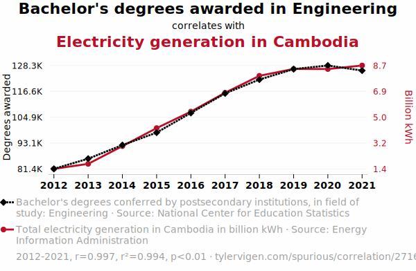
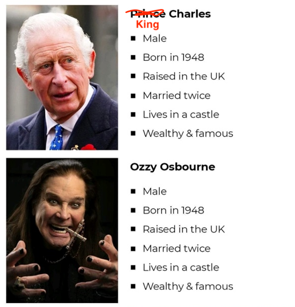

name: toc

```{css, echo=FALSE}
@media print {
  .has-continuation {
    display: block !important;
  }
}
```

```{r setup, include=FALSE}
options(htmltools.dir.version = FALSE)
library(knitr)
opts_chunk$set(
  #comment = "#>",
  fig.align='center', fig.width=4.5, fig.height=3,
  dpi=300, #fig.path='Figs/',
  cache=T, warning=F, message=F
  )

#knitr::opts_chunk$set(dev = "svg")

devtools::install_github("dill/emoGG")
library(pacman)
p_load(
  broom, here, tidyverse,
  emoGG, latex2exp, ggplot2, ggthemes, viridis, extrafont, gridExtra,
  kableExtra,
  data.table,
  dplyr,
  lubridate,
  magrittr, knitr, parallel,
  transformr,
  gganimate, fixest, magick, scales, Cairo
)
# Define pink color
red_pink <- "#e64173"
turquoise <- "#20B2AA"
grey_light <- "grey70"
grey_mid <- "grey50"
grey_dark <- "grey20"
purple <- "#6A5ACD"
# Dark slate grey: #314f4f
# Knitr options
# A blank theme for ggplot
theme_empty <- theme_bw() + theme(
  line = element_blank(),
  rect = element_blank(),
  strip.text = element_blank(),
  axis.text = element_blank(),
  plot.title = element_blank(),
  axis.title = element_blank(),
  plot.margin = structure(c(0, 0, -0.5, -1), unit = "lines", valid.unit = 3L, class = "unit"),
  legend.position = "none"
)
theme_simple <- theme_bw() + theme(
  line = element_blank(),
  panel.grid = element_blank(),
  rect = element_blank(),
  strip.text = element_blank(),
  axis.text.x = element_text(size = 18, family = "STIXGeneral"),
  axis.text.y = element_blank(),
  axis.ticks = element_blank(),
  plot.title = element_blank(),
  axis.title = element_blank(),
  # plot.margin = structure(c(0, 0, -1, -1), unit = "lines", valid.unit = 3L, class = "unit"),
  legend.position = "none"
)
theme_axes_math <- theme_void() + theme(
  text = element_text(family = "MathJax_Math"),
  axis.title = element_text(size = 22),
  axis.title.x = element_text(hjust = .95, margin = margin(0.15, 0, 0, 0, unit = "lines")),
  axis.title.y = element_text(vjust = .95, margin = margin(0, 0.15, 0, 0, unit = "lines")),
  axis.line = element_line(
    color = "grey70",
    size = 0.25,
    arrow = arrow(angle = 30, length = unit(0.15, "inches")
  )),
  plot.margin = structure(c(1, 0, 1, 0), unit = "lines", valid.unit = 3L, class = "unit"),
  legend.position = "none"
)
theme_axes_serif <- theme_void() + theme(
  text = element_text(family = "MathJax_Main"),
  axis.title = element_text(size = 22),
  axis.title.x = element_text(hjust = .95, margin = margin(0.15, 0, 0, 0, unit = "lines")),
  axis.title.y = element_text(vjust = .95, margin = margin(0, 0.15, 0, 0, unit = "lines")),
  axis.line = element_line(
    color = "grey70",
    size = 0.25,
    arrow = arrow(angle = 30, length = unit(0.15, "inches")
  )),
  plot.margin = structure(c(1, 0, 1, 0), unit = "lines", valid.unit = 3L, class = "unit"),
  legend.position = "none"
)
theme_axes <- theme_void() + theme(
  text = element_text(family = "Fira Sans Book"),
  axis.title = element_text(size = 18),
  axis.title.x = element_text(hjust = .95, margin = margin(0.15, 0, 0, 0, unit = "lines")),
  axis.title.y = element_text(vjust = .95, margin = margin(0, 0.15, 0, 0, unit = "lines")),
  axis.line = element_line(
    color = grey_light,
    size = 0.25,
    arrow = arrow(angle = 30, length = unit(0.15, "inches")
  )),
  plot.margin = structure(c(1, 0, 1, 0), unit = "lines", valid.unit = 3L, class = "unit"),
  legend.position = "none"
)
theme_metro_regtitle <- function(x) {
  theme_classic() + 
  theme(panel.background = element_rect(color = '#FAFAFA',fill='#FAFAFA'),
        plot.background = element_rect(color = '#FAFAFA',fill='#FAFAFA'),
        text = element_text(size = 12),
        axis.title = element_text(size = 12),
        axis.title.x= element_text(size=12),
        axis.title.y= element_text(size=12))
}

# theme_set(theme_gray(base_size = 20))
```

# Table of contents

- [Prologue](#prologue)

- [Correlation/Prediction vs. Causation](#prediction-vs-causation)

- [The challenges](#challenges)

- [The "solutions"](#solutions)
  - [Control for unobserved varation](#control-approach)
  - [Randomized control trials](#rcts)
  - [Inbetween: Quasi-experimental designs](#quasi-experiments)

- [Inference methods](#inference) (if time)
  - [Asymptotic standard errors](#asymptotic)
  - [Bootstrapping](#bootstrapping)
  - [Randomization inference](#randomization)

---
name: prologue
class: inverse, center, middle
# Prologue

---

# Prologue

- We see in the Opportunity Atlas that neighborhood income mobility is correlated with many outcomes 

- But are any of these correlations .pink[causal]?

- If so, we should be able to .pink[change] neighborhood characteristics to .pink[change] outcomes

### Goals today

1. Separate causality and correlation
2. Discuss common challenges to establishing causality
3. Discuss approaches and assumptions to establish causality
  - Control for all unobserved variables correlated with treatment
  - Use treatment that is truly random
  - Something between these two

---
# Warning

- This causality stuff is **really** tricky

- A causal paper may be intuitive -- that means it is a great paper, but finding your own intuitive causal relationship in the wild is hard

- Beyond intuition, the math and statistics are also hard

  - There are many interrelated frameworks to put some structure on the problem
  - Connections between frameworks can be hard to see and sometimes not particularly illuminating at first

- Be patient and comfortable with the fact that you won't understand everything at first, second, third, or even when you're trying to teach the material.super[†]

.footnote[.super[†] cough, cough --- me]

---
# Attribution

- These slides are adapted from work by [Ed Rubin](https://raw.githack.com/edrubin/EC421W19/master/LectureNotes/10Causality/10_causality.html) and [Nick Huntington-Klein](https://nickch-k.github.io/introcausality/Lectures/Lecture_13_Causality.html#/the-problem-of-causal-inference-3)

- They're both superb econometric instructors and I highly recommend their work

---
name: prediction_vs_causation
class: inverse, center, middle

# Correlation vs. Causation

---
# Spurious Correlations

- Everyone submit a correlation that you know about in the world

- If you're not sure, please check out this delightful https://www.tylervigen.com/spurious-correlations

---
# Spurious correlation and bad policy

<div align="center">

</div>

Someone with this graph argues Cambodia should disincentivize engineering to fight climate change. Does that make sense? 

--

No! But this is why this matters. One nice-looking correlation plus a bad actor = very bad policy

---

# Correlation ≠ Causation

You've likely heard the saying

> Correlation is not causation. 

- What does it mean?

--

The saying is pointing out that there are violations of .hi[exogeneity.]

--

Although correlation is not causation, .hi[causation (almost always) *requires* correlation].

--

.hi-slate[New saying:]

> Correlation plus .hi[exogeneity] is causation.

- Today we're going to unpack this a bit to kick off a unit on causal inference methods

---
# Causal questions

Occasionally, .hi[*causal*] relationships are simply/easily understood, _e.g._,

--

- Did flipping the switch .pink[cause] light to go on? 
- .pink[How] did this baby get here?

--

Generally, .hi[*causal*] relationships are complex and challenging to answer, _e.g._,

--

- Does job growth .pink[cause] higher economic mobility?
- What .pink[caused] the capital riot?
- .pink[How] does the number of police officers affect crime?
- What is the .pink[effect] of better air quality on test scores?
- Do tariffs .pink[reduce] the amount of trade?
- How did cannabis legalization .pink[affect] mental health/opioid addiction?

---
# Non-causal correlations

Examples of non-zero *correlations* that are not *causal* (or may be causal in the other direction!)

Some obvious:

- People tend to wear shorts on days when ice cream trucks are out
- Rooster crowing sounds are followed closely by sunrise*

Some less obvious:

- Colds tend to clear up a few days after you take Emergen-C
- The performance of the economy tends to be lower or higher depending on the president's political party

Find more at https://www.tylervigen.com/spurious-correlations

.footnote[*This case of mistaken causality is the basis of the film Rock-a-Doodle which I understand is extremely entertaining.]

---
# So what is causality? 

- We say that `X` *causes* `Y` if...

- Were we to intervene and *change* the value of `X` without changing anything else...

- then `Y` would also change as a result

---
# Important Note

- "X causes Y" *doesn't* mean that X is necessarily the *only* thing that causes Y

- And it *doesn't* mean that all Y must be X

- For example, using a light switch causes the light to go on

- But not if the bulb is burned out (no Y, despite X), or if the light was already on (Y without X), and it ALSO needs electricity (something else causes Y)

- But still we'd say that using the switch causes the light! The important thing is that X *changes the distribution* of Y, not that it necessarily makes it happen for certain

---

# Prediction vs. causation

Most tasks in econometrics boil down to one of two goals:

$$
\begin{align}
  y = \beta_0 + \beta_1 x_1 + \beta_2 x_2 + \cdots + \beta_k x_k + u
\end{align}
$$

--

1. .hi-purple[Prediction:] Accurately and dependably .purple[predict/forecast] $\color{#6A5ACD}{y}$ using on some set of explanatory variables—doesn't need to be $x_1$ through $x_k$. Focuses on $\color{#6A5ACD}{\hat{y}}$. $\beta_j$ doesn't really matter. 

--

1. .hi[Causal inference:].super[.pink[†]] Estimate the true, population model that explains .pink[how] $\color{#e64173}{y}$ .pink[changes when we change] $\color{#e64173}{x_j}$—focuses on $\color{#e64173}{\beta_j}$. Accuracy of $\hat{y}$ is not important. (So $R^2$ concerns can often take a hike.)

.footnote[
.pink[†] Often called *causal identification*.
]

---
# Why Causality?

- Many interesting questions to answer with data are causal

- Some are non-causal - for example, "how can we predict whether this photo is of a dog or a cat" is vital to how Google Images works, but it doesn't care what *caused* the photo to be of a dog or a cat

- Nearly every *why* question is causal and what we want to know! 

- Also, this is economists' comparative advantage! 

  - Plenty fields do statistics. But few make causal inference standard training for students
  
- This understanding of causality makes economists useful! *This* is one big reason why tech companies have whole economics departments

---
name: challenges
class: inverse, center, middle

# Fundamental Problem of Causal Inference

---

# The challenges

Causal inference can be pretty difficult—both .purple[practically] and .pink[econometrically].

--

.pull-left[.purple[
**Practical challenges**

- Which variables?
- Which functional form(s)?
- Do data exist? How much?
- Is the sample representative?
]]

--

.pull-right[.pink[
**Econometric challenges**

- Omitted-variable bias
- Reverse causality
- Selection bias
- Measurement error
]]

--

Many of these challenges relate to .hi-slate[exogeneity], _i.e._, $\color{#314f4f}{\mathop{\boldsymbol{E}}\left[ u_i | X \right] = 0}$.
--
<br>Causality requires us to .hi-slate[hold all else constant] (*ceterus paribus*) on average, i.e. 
  - The amount our model misses the mark ($u$) is equally likely to be positive as negative, or .hi-slide[unbiased] 

---
# Fund. Problem of Causal Inference

- The econometric problems largely fall under the umbrella problem that is fundamental to causal inference

- In short, it is impossible to observe a treated unit in the .pink[counterfactual] world where they were not untreated

- Unless your name is Evelyn Quan, Marty McFly, Loki, or Miles Morales, this sort of multiversal experimentation is not possible

- You're stuck with the rest of in 2024, using an extremely clever, but limited causal infernce toolbox that relies on .hi[exogeneity]

---
# What is exogeneity? 

- Can anyone tell me what exogeneity is?

--

$$
\begin{align}
  y = \beta_0 + \beta_1 x_1 + \beta_2 x_2 + \cdots + \beta_k x_k + u
\end{align}
$$

- Let's break this equation down into its component parts

--

  - $y$ is the outcome/dependent variable 
  - $x_k$ are the independent/explanatory variables
  - $\beta_k$ are the coefficients on the explanatory variables
  - $u$ is the error term: anything else that affects $y$ that we didn't/couldn't include

- Formally, exogeneity means $\mathbb{E}[u_i|X] = 0$: in expectation ("on average") the error term is zero after controlling for all the $x$ variables

- Intuition: anything we left out that explains $y$ is uncorrelated with our $x$ variables

- This is massive: it means you don't have to explain everything! Just the things that are correlated with the causal relationship you care about

---
# Causal inference approaches

- So how can we get $\mathbb{E}[u_i|X]=0$ to make a causal claim?

1. **Random assignment**: Randomly assign units to treatment/control
  - The treatment is completely exogenous by design

2. **Conditional independence assumption (CIA)**: Control for everything that could possibly affect $y$ that is related $x$
  - The treatment is then "as good as random," but you can't prove it
  - Sometimes called "selection on observables" and is often a tough sell

3. **Natural/quasi experiments**: A treatment is not randomly assigned, but due to something that "as good as random" with respect to treatment
  - This is the bread and butter of applied microeconomics

---
# Assumptions

- All causal inference tools require an assumption about the world

- Your goal is to pick the least objectionable assumption possible

- You **cannot** prove these assumptions, that's why they're assumptions

- You can potentially see whether other patterns in the data are consistent with your assumption
  - e.g. Check placebo outcomes like parent's income for those who do/do not win a school lottery
  - These tests will change depending on your assumption/question/topic

---
# Selection on observables

<div align="center">

</div>

Prince Charles and Ozzy Osbourne are very similar. Source: [Andrew Heiss' Mastodon](https://fediscience.org/@andrew/109954623159979197)

---
class: inverse, center, middle
# Causation

---
# Effect of education on mobility

- Let's explore the three causal inference approaches with two simple examples

1. What is the effect of fertilizer on crop yield?

2. What is the effect of education on income mobility of those born at the 25th percentile of the income distribution?

---
<!-- TK: Switch this to look at internet?. -->
name: education

# Example: The causal effect of fertilizer.super[.pink[†]]

Suppose we want to know the causal effect of fertilizer on crop yield.

--
<br>**Q:** Could we simply regress yield on fertilizer?
--
<br>**A:** Probably not (if we want the causal effect).
--
<br><br>**Q:** Why not?
--
<br>**A:** Omitted-variable bias: Farmers may apply less fertilizer in areas that are already worse on other dimensions that affect yield (soil, slope, water).<br>.pink[Violates *all else equal* (exogeneity). Biased and/or spurious results.]
--
<br><br>**Q:** So what *should* we do?
--
<br>**A:** .hi[Run an experiment!]
--
 💩
---

# Example: The causal effect of fertilizer

Randomized experiments help us maintain *all else equal* (exogeneity).

--

We often call these experiments .hi[*randomized control trials*] (RCTs)..super[.pink[†]]

.footnote[
.pink[†] Econometrics (and statistics) borrows this language from biostatistics and pharmaceutical trials.
]

--

Imagine an RCT where we have two groups:

- .hi-slate[Treatment:] We apply fertilizer.
- .hi-slate[Control:] We do not apply fertilizer.

--

By randomizing plots of land into .hi-slate[treatment] or .hi-slate[control], we will, on average, include all kinds of land (soild, slope, water, *etc.*) in both groups.

--

*All else equal*!
---
class: white-slide

.hi-slate[54 equal-sized plots]
```{r, fertilizer_plot1, echo = F}
xd <- 9
yd <- 6
set.seed(123)
fert_df <- expand.grid(x = 1:xd, y = 1:yd) %>%
  mutate(
    q = x + y + 1.25 * rnorm(xd*yd),
    trt = sample(x = c(T, F), size = xd*yd, replace = T, prob = c(0.51, 0.49)),
  ) %>%
  arrange(-y, x) %>%
  mutate(id = 1:(xd*yd) %>% str_pad(2, "left", "0")) %>%
  arrange(y, x)
ggplot(data = fert_df, aes(x, y)) +
geom_tile(color = "grey40", fill = "grey93", size = 0.2) +
geom_text(aes(label = id), color = "grey45", size = 5, family = "Roboto Mono") +
theme_void() +
coord_equal()
```
---
class: white-slide
count: false

.hi-slate[54 equal-sized plots] .hi[of varying quality]
```{r, fertilizer_plot2, echo = F}
ggplot(data = fert_df,
  aes(x, y)
) +
geom_tile(aes(fill = q), color = "white", size = 0.2) +
scale_fill_viridis(option = "magma", direction = -1) +
theme_void() +
theme(legend.position = "none") +
coord_equal()
```
---
class: white-slide
count: false

.hi-slate[54 equal-sized plots] .hi[of varying quality] .hi-orange[plus randomly assigned treatment]
```{r, fertilizer_plot3_1, echo = F}
set.seed(246)
ggplot(data = fert_df,
  aes(x, y)
) +
geom_tile(aes(fill = q), color = "white", size = 0.2) +
# geom_text(aes(label = trt)) +
geom_emoji(data = sample_n(fert_df, 1), emoji = "1f4a9") +
scale_fill_viridis(option = "magma", direction = -1) +
theme_void() +
theme(legend.position = "none") +
coord_equal()
```
---
class: white-slide
count: false

.hi-slate[54 equal-sized plots] .hi[of varying quality] .hi-orange[plus randomly assigned treatment]
```{r, fertilizer_plot3_2, echo = F}
set.seed(246)
ggplot(data = fert_df,
  aes(x, y)
) +
geom_tile(aes(fill = q), color = "white", size = 0.2) +
# geom_text(aes(label = trt)) +
geom_emoji(data = sample_n(fert_df, 2), emoji = "1f4a9") +
scale_fill_viridis(option = "magma", direction = -1) +
theme_void() +
theme(legend.position = "none") +
coord_equal()
```
---
class: white-slide
count: false

.hi-slate[54 equal-sized plots] .hi[of varying quality] .hi-orange[plus randomly assigned treatment]
```{r, fertilizer_plot3_3, echo = F}
set.seed(246)
ggplot(data = fert_df,
  aes(x, y)
) +
geom_tile(aes(fill = q), color = "white", size = 0.2) +
# geom_text(aes(label = trt)) +
geom_emoji(data = sample_n(fert_df, 3), emoji = "1f4a9") +
scale_fill_viridis(option = "magma", direction = -1) +
theme_void() +
theme(legend.position = "none") +
coord_equal()
```
---
class: white-slide
count: false

.hi-slate[54 equal-sized plots] .hi[of varying quality] .hi-orange[plus randomly assigned treatment]
```{r, fertilizer_plot3_4, echo = F}
set.seed(246)
ggplot(data = fert_df,
  aes(x, y)
) +
geom_tile(aes(fill = q), color = "white", size = 0.2) +
# geom_text(aes(label = trt)) +
geom_emoji(data = sample_n(fert_df, 4), emoji = "1f4a9") +
scale_fill_viridis(option = "magma", direction = -1) +
theme_void() +
theme(legend.position = "none") +
coord_equal()
```
---
class: white-slide
count: false

.hi-slate[54 equal-sized plots] .hi[of varying quality] .hi-orange[plus randomly assigned treatment]
```{r, fertilizer_plot3_5, echo = F}
set.seed(246)
ggplot(data = fert_df,
  aes(x, y)
) +
geom_tile(aes(fill = q), color = "white", size = 0.2) +
# geom_text(aes(label = trt)) +
geom_emoji(data = sample_n(fert_df, 5), emoji = "1f4a9") +
scale_fill_viridis(option = "magma", direction = -1) +
theme_void() +
theme(legend.position = "none") +
coord_equal()
```
---
class: white-slide
count: false

.hi-slate[54 equal-sized plots] .hi[of varying quality] .hi-orange[plus randomly assigned treatment]
```{r, fertilizer_plot3_6, echo = F}
set.seed(246)
ggplot(data = fert_df,
  aes(x, y)
) +
geom_tile(aes(fill = q), color = "white", size = 0.2) +
# geom_text(aes(label = trt)) +
geom_emoji(data = sample_n(fert_df, 6), emoji = "1f4a9") +
scale_fill_viridis(option = "magma", direction = -1) +
theme_void() +
theme(legend.position = "none") +
coord_equal()
```
---
class: white-slide
count: false

.hi-slate[54 equal-sized plots] .hi[of varying quality] .hi-orange[plus randomly assigned treatment]
```{r, fertilizer_plot3_7, echo = F}
set.seed(246)
ggplot(data = fert_df,
  aes(x, y)
) +
geom_tile(aes(fill = q), color = "white", size = 0.2) +
# geom_text(aes(label = trt)) +
geom_emoji(data = sample_n(fert_df, 7), emoji = "1f4a9") +
scale_fill_viridis(option = "magma", direction = -1) +
theme_void() +
theme(legend.position = "none") +
coord_equal()
```
---
class: white-slide
count: false

.hi-slate[54 equal-sized plots] .hi[of varying quality] .hi-orange[plus randomly assigned treatment]
```{r, fertilizer_plot3_8, echo = F}
set.seed(246)
ggplot(data = fert_df,
  aes(x, y)
) +
geom_tile(aes(fill = q), color = "white", size = 0.2) +
# geom_text(aes(label = trt)) +
geom_emoji(data = sample_n(fert_df, 8), emoji = "1f4a9") +
scale_fill_viridis(option = "magma", direction = -1) +
theme_void() +
theme(legend.position = "none") +
coord_equal()
```
---
class: white-slide
count: false

.hi-slate[54 equal-sized plots] .hi[of varying quality] .hi-orange[plus randomly assigned treatment]
```{r, fertilizer_plot3_9, echo = F}
set.seed(246)
ggplot(data = fert_df,
  aes(x, y)
) +
geom_tile(aes(fill = q), color = "white", size = 0.2) +
# geom_text(aes(label = trt)) +
geom_emoji(data = sample_n(fert_df, 9), emoji = "1f4a9") +
scale_fill_viridis(option = "magma", direction = -1) +
theme_void() +
theme(legend.position = "none") +
coord_equal()
```
---
class: white-slide
count: false

.hi-slate[54 equal-sized plots] .hi[of varying quality] .hi-orange[plus randomly assigned treatment]
```{r, fertilizer_plot3_10, echo = F}
set.seed(246)
ggplot(data = fert_df,
  aes(x, y)
) +
geom_tile(aes(fill = q), color = "white", size = 0.2) +
# geom_text(aes(label = trt)) +
geom_emoji(data = sample_n(fert_df, round(xd * yd / 2, 0)), emoji = "1f4a9") +
scale_fill_viridis(option = "magma", direction = -1) +
theme_void() +
theme(legend.position = "none") +
coord_equal()
```
---
class: white-slide
count: false

.hi-slate[54 equal-sized plots] .hi[of varying quality] .hi-orange[plus randomly assigned treatment]
```{r, fertilizer_plot3_11, echo = F}
set.seed(248)
ggplot(data = fert_df,
  aes(x, y)
) +
geom_tile(aes(fill = q), color = "white", size = 0.2) +
# geom_text(aes(label = trt)) +
geom_emoji(data = sample_n(fert_df, round(xd * yd / 2, 0)), emoji = "1f4a9") +
scale_fill_viridis(option = "magma", direction = -1) +
theme_void() +
theme(legend.position = "none") +
coord_equal()
```
---
class: white-slide
count: false

.hi-slate[54 equal-sized plots] .hi[of varying quality] .hi-orange[plus randomly assigned treatment]
```{r, fertilizer_plot3_12, echo = F}
set.seed(250)
ggplot(data = fert_df,
  aes(x, y)
) +
geom_tile(aes(fill = q), color = "white", size = 0.2) +
# geom_text(aes(label = trt)) +
geom_emoji(data = sample_n(fert_df, round(xd * yd / 2, 0)), emoji = "1f4a9") +
scale_fill_viridis(option = "magma", direction = -1) +
theme_void() +
theme(legend.position = "none") +
coord_equal()
```
---

# Example: The causal effect of fertilizer

We can estimate the .hi[causal effect] of fertilizer on crop yield by comparing the average yield in the treatment group (💩) with the control group (no 💩).

$$
\begin{align}
  \overline{\text{Yield}}_\text{Treatment} - \overline{\text{Yield}}_\text{Control}
\end{align}
$$

--

Alternatively, we can use the regression

--

$$
\begin{align}
  \text{Yield}_i = \beta_0 + \beta_1 \text{Trt}_i + u_i \tag{1}
\end{align}
$$

where $\text{Trt}_i$ is a binary variable (=1 if plot $i$ received the fertilizer treatment).

--

**Q:** Should we expect $(1)$ to satisfy exogeneity? Why?
--
<br>**A:** On average, .hi[randomly assigning treatment should balance] trt. and control across the other dimensions that affect yield (soil, slope, water).

---
layout: true
# Causality
## Example: Returns to education
---
name: returns

Labor economists, policy makers, parents, and students are all interested in the (monetary) *return to education.*

--

.hi-slate[Thought experiment:]
- Randomly select an individual.
- Give her an additional year of education.
- How much do her earnings increase?

This change in earnings gives the .hi-slate[causal effect] of education on earnings.
---

**Q:** Could we simply regress earnings on education?
--
<br>**A:** Again, probably not if we want the true, causal effect.

--
1. People *choose* education based upon many factors, *e.g.*, ability.
2. Education likely reduces experience (time out of the workforce).
3. Education is .hi[*endogenous*] (violates *exogeneity*).

--

The point (2) above also illustrates the difficulty in learning about educations while *holding all else constant*.

Many important variables have the same challenge—gender, race, income.

---

**Q:** So how can we estimate the returns to education?

--

.hi-slate[Option 1:] Run an .hi[experiment].

--

- Randomly .pink[assign education] (might be difficult).
- Randomly .pink[encourage education] (might work).
- Randomly .pink[assign programs] that affect education (*e.g.*, mentoring).

--

.hi-slate[Option 2:] Control for all that .hi-slate[unobserved variation] that affects both education and earnings. (CIA)

--

.hi-slate[Option 3:] Look for a .hi-purple[*natural experiment*]—a policy or accident in society that arbitrarily increased education for one subset of people.

---

- Let's try controlling for every variable that affects both education and earnings, under CIA it should work!

$$ 
\begin{align} \text{Earnings} = \beta_0 + \beta_1 \text{Educ} + \beta_2 \text{Race} + \beta_3 \text{Gender} + \beta_4 \text{Job Exp} + \\\
  \beta_5 \text{Ability} + \cdots + u 
\end{align}
$$

- Anyone see any problems?

--

- Should race and gender be interacted? Race or gender and education? 

- How do we measure ability? Specialized tests? Do those tests capture everything? 

- Uh oh, this is getting complicated and I'm not even sure we learn much

---

- Let's revisit a natural experiment approach

- What policies arbitrarily increase education for a subset of people? 

--

- Admissions .purple[cutoffs]: people just above and below the cutoff are similar, but one group gets more education
  - .purple[Regression discontinuity]

- .purple[Lottery] enrollment and/or capacity .purple[constraints]: people who win the lottery get more education
  - .purple[Instrumental variables] or .purple[Two-stage least squares]

- .purple[New] school built: people who live near the new school get more education
  - .purple[Difference-in-differences]

---
layout: true
# Causality
---
name: real

## Real-world experiments

RCTs and certain policy changes yield .hi-slate[real experiments] to isolate causal effects.

.hi-slate[Characteristics]

- .purple[Feasible]—we can actually (potentially) run the experiment.
- .purple[Compare individuals] randomized into treatment against individuals randomized into control.
- .purple[Require "good" randomization] to get *all else equal* (exogeneity).

--

*Note:* Your experiment's results are only as good as your randomization.

---
class: white-slide
count: false

.hi-slate[Unfortunate randomization]
```{R, fertilizer_plot3_bad, echo = F}
ggplot(data = fert_df,
  aes(x, y)
) +
geom_tile(aes(fill = q), color = "white", size = 0.2) +
# geom_text(aes(label = trt)) +
geom_emoji(data = filter(fert_df, x < xd/3 | y <= yd/3 | (x == xd & y == yd)), emoji = "1f4a9") +
scale_fill_viridis(option = "magma", direction = -1) +
theme_void() +
theme(legend.position = "none") +
coord_equal()
```
---
layout: true
# Causality
## The ideal experiment
---
name: ideal

The .hi[ideal experiment] would be subtly different.

Rather than comparing units randomized as .pink[treatment] vs. .pink[control], the ideal experiment would compare treatment and control .hi[for the same, exact unit].

--

$$
\begin{align}
  y_{\text{Treatment},i} - y_{\text{Control},i}
\end{align}
$$

--

which we will write (for simplicity) as

$$
\begin{align}
  y_{1,i} - y_{0,i}
\end{align}
$$

--

This .pink[*ideal experiment*] is clearly infeasible.super[.pink[†]], but it creates nice notation for causality (the Rubin causal model/Neyman potential outcomes framework).

.footnote[
.pink[†] Without (1) God-like abilities and multiple universes or (2) a time machine.
]
---

.pull-left[
The *ideal* data for 10 people
```{R, ideal_data, echo = F}
set.seed(3)
ideal_df <- data.frame(
  i = 1:10,
  trt = rep(c(1, 0), each = 5),
  y1i = c(runif(10, 4, 10) %>% round(2)),
  y0i = c(runif(10, 0, 5) %>% round(2))
)
ideal_df
```
]

--

.pull-right[
Calculate the causal effect of trt.
$$
\begin{align}
  \tau_i = y_{1,i} -  y_{0,i}
\end{align}
$$
for each individual $i$.
]

---
count: false

.pull-left[
The *ideal* data for 10 people
```{R, ideal_data_trt, echo = F}
ideal_df %>% mutate(effect_i = y1i - y0i)
```
]

.pull-right[
Calculate the causal effect of trt.
$$
\begin{align}
  \tau_i = y_{1,i} -  y_{0,i}
\end{align}
$$
for each individual $i$.
]

---
count: false

.pull-left[
The *ideal* data for 10 people
```{R, ideal_data_trt2, echo = F}
ideal_df %>% mutate(effect_i = y1i - y0i)
```
]

.pull-right[
Calculate the causal effect of trt.
$$
\begin{align}
  \tau_i = y_{1,i} -  y_{0,i}
\end{align}
$$
for each individual $i$.

The mean of $\tau_i$ is the<br>.hi[average treatment effect] (.pink[ATE]).

Thus, $\color{#e64173}{\overline{\tau} = `r transmute(ideal_df, effect_i = y1i - y0i) %>% unlist %>% mean %>% round(2)`}$
]

---

This model highlights the fundamental problem of causal inference.
$$
\begin{align}
  \tau_i = \color{#e64173}{y_{1,i}} &- \color{#6A5ACD}{y_{0,i}}
\end{align}
$$

--

.hi-slate[The challenge:]

If we observe $\color{#e64173}{y_{1,i}}$, then we cannot observe $\color{#6A5ACD}{y_{0,i}}$.
<br>If we observe $\color{#6A5ACD}{y_{0,i}}$, then we cannot observe $\color{#e64173}{y_{1,i}}$.
---

So a dataset that we actually observe for 6 people will look something like
.pull-left[
```{R, ideal_data_obs, echo = F}
obs_df <- ideal_df
obs_df$y0i[1:5] <- NA
obs_df$y1i[6:10] <- NA
obs_df
```
]

--

.pull-right[
We can't observe $\color{#e64173}{y_{1,i}}$ and $\color{#6A5ACD}{y_{0,i}}$.

But, we do observe
- $\color{#e64173}{y_{1,i}}$ for $i$ in 1, 2, 3, 4, 5
- $\color{#6A5ACD}{y_{0,j}}$ for $j$ in 6, 7, 8, 9, 10

]

--

**Q:** How do we "fill in" the `NA`s and estimate $\overline{\tau}$?

---
layout: true
# Causality
## Causally estimating the treatment effect
---
name: estimation

.hi-slate[Notation:] Let $D_i$ be a binary indicator variable such that

- $\color{#e64173}{D_i=1}$ .pink[if individual] $\color{#e64173}{i}$ .pink[is treated].
- $\color{#6A5ACD}{D_i=0}$ .purple[if individual] $\color{#6A5ACD}{i}$ .purple[is not treated (*control* group).]

--

Then, rephrasing the previous slide,

- We only observe $\color{#e64173}{y_{1,i}}$ when $\color{#e64173}{D_{i}=1}$.
- We only observe $\color{#6A5ACD}{y_{0,i}}$ when $\color{#6A5ACD}{D_{i}=0}$.

--

**Q:** How can we estimate $\overline{\tau}$ using only $\left(\color{#e64173}{y_{1,i}|D_i=1}\right)$ and $\left(\color{#6A5ACD}{y_{0,i}|D_i=0}\right)$?

---
class: white-slide
**Q:** How can we estimate $\overline{\tau}$ using only $\left(\color{#e64173}{y_{1,i}|D_i=1}\right)$ and $\left(\color{#6A5ACD}{y_{0,i}|D_i=0}\right)$?

--

**Idea:** What if we compare the groups' means? _I.e._,
$$
\begin{align}
  \color{#e64173}{\mathop{E}\left( y_i\mid D_i = 1 \right)} - \color{#6A5ACD}{\mathop{E}\left( y_i\mid D_i =0 \right)}
\end{align}
$$

--

**Q:** When does this simple difference in groups' means provide information on the .hi-slate[causal effect] of the treatment?

--

**Q.sub[2.0]:** Is $\color{#e64173}{\mathop{E}\left( y_i\mid D_i = 1 \right)} - \color{#6A5ACD}{\mathop{E}\left( y_i\mid D_i =0 \right)}$ a *good* estimator for $\overline{\tau}$?

--

Time for math! .bigger[🎉]

---

.hi-slate[Assumption:] Let $\tau_i = \tau$ for all $i$.

This assumption says that the treatment effect is equal (constant) across all individuals $i$.

--

.hi-slate[Note:] We defined

$$
\begin{align}
  \tau_i = \tau = \color{#e64173}{y_{1,i}} - \color{#6A5ACD}{y_{0,i}}
\end{align}
$$

which implies

$$
\begin{align}
   \color{#e64173}{y_{1,i}} = \color{#6A5ACD}{y_{0,i}} + \tau
\end{align}
$$

---
layout: false
class: white-slide
name: derivation

**Q.sub[3.0]:** Is $\color{#e64173}{\mathop{E}\left( y_i\mid D_i = 1 \right)} - \color{#6A5ACD}{\mathop{E}\left( y_i\mid D_i =0 \right)}$ a *good* estimator for $\tau$?

--

Difference in groups' means
--
<br> $\quad \color{#ffffff}{\Bigg|}=\color{#e64173}{\mathop{E}\left( y_i\mid D_i = 1 \right)} - \color{#6A5ACD}{\mathop{E}\left( y_i\mid D_i =0 \right)}$
--
<br> $\quad \color{#ffffff}{\Bigg|}=\color{#e64173}{\mathop{E}\left( y_{1,i}\mid D_i = 1 \right)} - \color{#6A5ACD}{\mathop{E}\left( y_{0,i}\mid D_i =0 \right)}$
--
<br> $\quad \color{#ffffff}{\Bigg|}=\color{#e64173}{\mathop{E}\left( \color{#000000}{\tau \: +} \: \color{#6A5ACD}{y_{0,i}} \mid D_i = 1 \right)} - \color{#6A5ACD}{\mathop{E}\left( y_{0,i}\mid D_i =0 \right)}$
--
<br> $\quad \color{#ffffff}{\Bigg|}=\tau + \color{#e64173}{\mathop{E}\left(\color{#6A5ACD}{y_{0,i}} \mid D_i = 1 \right)} - \color{#6A5ACD}{\mathop{E}\left( y_{0,i}\mid D_i =0 \right)}$
--
<br> $\quad \color{#ffffff}{\Bigg|}= \text{Average causal effect} + \color{#FFA500}{\text{Selection bias}}$

--

So our proposed group-difference estimator give us the sum of

1. $\tau$, the .hi-slate[causal, average treatment effect] that we want
2. .hi-orange[Selection bias:] How much trt. and control groups differ (on average).

---
class: inverse, center, middle
name: inference

# Inference: Did we just get lucky?

---
# Inference: Did we just get lucky? 

- Most of today's lecture covered causal identification 

- That's how you know whether the average treatment effect is causal

- But the other key part is inference: how do you know whether the average treatment effect is *statistically* different from zero?

- That's where "inference" comes in

- Inference is the practice of determining how special your results are. 

- Generally you get a confidence interval and p-value (except Bayesian inference)

---
# Types of inference

1. **Asymptotic** inference: what you saw in econometrics
  - Under a few assumptions, you can make inferences about the true average treatment effect

2. **Randomization**: maybe you saw it?
  - Assign many placebo treatments to see if your results are that unique
  - Are your results are driven by something about the treated group?

3. **Bootstrapping**: maybe you saw it?
  - Resample your data to see if your results are sensitive to the sample you have
  - Are your results are driven by something about the sample? 

4. **Bayesian**: I doubt you've seen this
  - Assume a prior distribution for $\beta$ and update it
  - Generates a "credibility" interval

---
class: inverse, center, middle

# Next lecture: Regression analysis
<html><div style='float:left'></div><hr color='#EB811B' size=1px width=796px></html>

```{r gen_pdf, include = FALSE, cache = FALSE, eval = TRUE}
infile=knitr::current_input() %>% stringr::str_replace('.Rmd', '.html')
#print(infile)
pagedown::chrome_print(input = infile, timeout = 100)
```


