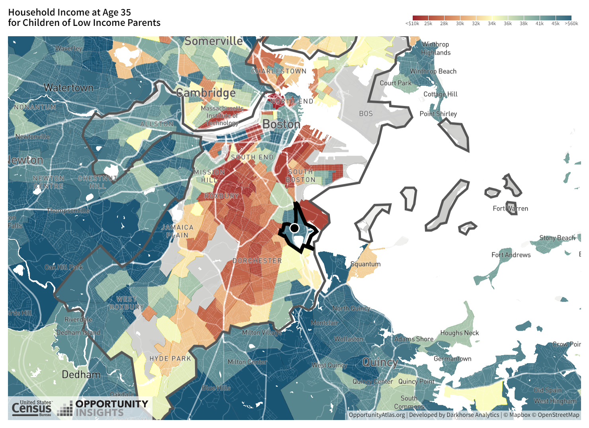
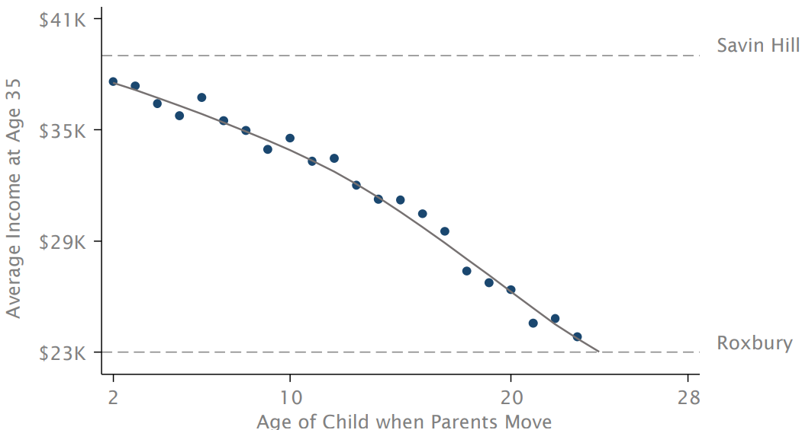

name: toc

```{css, echo=FALSE}
@media print {
  .has-continuation {
    display: block !important;
  }
}
```

```{r setup, include=FALSE}
options(htmltools.dir.version = FALSE)
library(knitr)
opts_chunk$set(
  #comment = "#>",
  fig.align='center', fig.width=4.5, fig.height=3,
  dpi=300, #fig.path='Figs/',
  cache=T, warning=F, message=F
  )

#knitr::opts_chunk$set(dev = "svg")

devtools::install_github("dill/emoGG")
library(pacman)
p_load(
  broom, here, tidyverse,
  emoGG, latex2exp, ggplot2, ggthemes, viridis, extrafont, gridExtra,
  kableExtra,
  data.table,
  dplyr,
  lubridate,
  magrittr, knitr, parallel,
  transformr,
  gganimate, fixest, magick, scales, Cairo
)
# Define pink color
red_pink <- "#e64173"
turquoise <- "#20B2AA"
grey_light <- "grey70"
grey_mid <- "grey50"
grey_dark <- "grey20"
purple <- "#6A5ACD"
# Dark slate grey: #314f4f
# Knitr options
# A blank theme for ggplot
theme_empty <- theme_bw() + theme(
  line = element_blank(),
  rect = element_blank(),
  strip.text = element_blank(),
  axis.text = element_blank(),
  plot.title = element_blank(),
  axis.title = element_blank(),
  plot.margin = structure(c(0, 0, -0.5, -1), unit = "lines", valid.unit = 3L, class = "unit"),
  legend.position = "none"
)
theme_simple <- theme_bw() + theme(
  line = element_blank(),
  panel.grid = element_blank(),
  rect = element_blank(),
  strip.text = element_blank(),
  axis.text.x = element_text(size = 18, family = "STIXGeneral"),
  axis.text.y = element_blank(),
  axis.ticks = element_blank(),
  plot.title = element_blank(),
  axis.title = element_blank(),
  # plot.margin = structure(c(0, 0, -1, -1), unit = "lines", valid.unit = 3L, class = "unit"),
  legend.position = "none"
)
theme_axes_math <- theme_void() + theme(
  text = element_text(family = "MathJax_Math"),
  axis.title = element_text(size = 22),
  axis.title.x = element_text(hjust = .95, margin = margin(0.15, 0, 0, 0, unit = "lines")),
  axis.title.y = element_text(vjust = .95, margin = margin(0, 0.15, 0, 0, unit = "lines")),
  axis.line = element_line(
    color = "grey70",
    size = 0.25,
    arrow = arrow(angle = 30, length = unit(0.15, "inches")
  )),
  plot.margin = structure(c(1, 0, 1, 0), unit = "lines", valid.unit = 3L, class = "unit"),
  legend.position = "none"
)
theme_axes_serif <- theme_void() + theme(
  text = element_text(family = "MathJax_Main"),
  axis.title = element_text(size = 22),
  axis.title.x = element_text(hjust = .95, margin = margin(0.15, 0, 0, 0, unit = "lines")),
  axis.title.y = element_text(vjust = .95, margin = margin(0, 0.15, 0, 0, unit = "lines")),
  axis.line = element_line(
    color = "grey70",
    size = 0.25,
    arrow = arrow(angle = 30, length = unit(0.15, "inches")
  )),
  plot.margin = structure(c(1, 0, 1, 0), unit = "lines", valid.unit = 3L, class = "unit"),
  legend.position = "none"
)
theme_axes <- theme_void() + theme(
  text = element_text(family = "Fira Sans Book"),
  axis.title = element_text(size = 18),
  axis.title.x = element_text(hjust = .95, margin = margin(0.15, 0, 0, 0, unit = "lines")),
  axis.title.y = element_text(vjust = .95, margin = margin(0, 0.15, 0, 0, unit = "lines")),
  axis.line = element_line(
    color = grey_light,
    size = 0.25,
    arrow = arrow(angle = 30, length = unit(0.15, "inches")
  )),
  plot.margin = structure(c(1, 0, 1, 0), unit = "lines", valid.unit = 3L, class = "unit"),
  legend.position = "none"
)
theme_metro_regtitle <- function(x) {
  theme_classic() + 
  theme(panel.background = element_rect(color = '#FAFAFA',fill='#FAFAFA'),
        plot.background = element_rect(color = '#FAFAFA',fill='#FAFAFA'),
        text = element_text(size = 12),
        axis.title = element_text(size = 12),
        axis.title.x= element_text(size=12),
        axis.title.y= element_text(size=12))
}

# theme_set(theme_gray(base_size = 20))
```

# Table of contents

- [Prologue](#prologue)

- [The challenges](#challenges)

- [Example: Causal Effects of Neighborhoods](#Neighborhoods)

---
name: prologue
class: inverse, center, middle
# Prologue

---

# Prologue

- We saw in the Opportunity Atlas that neighborhood income mobility is correlated with many outcomes 

- But are any of these correlations .pink[causal]?

- If so, we should be able to .pink[change] neighborhood characteristics to .pink[change] outcomes

- .pink[How] do we know if a correlation is causal?

---

# Prediction vs. causation

Most tasks in econometrics boil down to one of two goals:

$$
\begin{align}
  y = \beta_0 + \beta_1 x_1 + \beta_2 x_2 + \cdots + \beta_k x_k + u
\end{align}
$$

--

1. .hi-purple[Prediction:] Accurately and dependably .purple[predict/forecast] $\color{#6A5ACD}{y}$ using on some set of explanatory variables—doesn't need to be $x_1$ through $x_k$. Focuses on $\color{#6A5ACD}{\hat{y}}$. $\beta_j$ doesn't really matter.

--

1. .hi[Causal estimation:].super[.pink[†]] Estimate the actual data-generating process—learning about the true, population model that explains .pink[how] $\color{#e64173}{y}$ .pink[changes when we change] $\color{#e64173}{x_j}$—focuses on $\color{#e64173}{\beta_j}$. Accuracy of $\hat{y}$ is not important.

.footnote[
.pink[†] Often called *causal identification*.
]

--

For the next few weeks, we will focus on .hi[causally estimating] $\color{#e64173}{\beta_j}$.
---
name: challenges

# The challenges

As you saw in the data-analysis exercise, determining and estimating the true model can be pretty difficult—both .purple[practically] and .pink[econometrically].

--

.pull-left[.purple[
**Practical challenges**

- Which variables?
- Which functional form(s)?
- Do data exist? How much?
- Is the sample representative?
]]

--

.pull-right[.pink[
**Econometric challenges**

- Omitted-variable bias
- Reverse causality
- Measurement error
- How precise can/must we be?
]]

--

Many of these challenges relate to .hi-slate[exogeneity], _i.e._, $\color{#314f4f}{\mathop{\boldsymbol{E}}\left[ u_i | X \right] = 0}$.
--
<br>Causality requires us to .hi-slate[hold all else constant] (*ceterus paribus*).

---

# It's complicated

Occasionally, .hi[*causal*] relationships are simply/easily understood, _e.g._,

--

- What .pink[caused] the forest fire?
- .pink[How] did this baby get here?

--

Generally, .hi[*causal*] relationships are complex and challenging to answer, _e.g._,

--

- What .pink[causes] some countries to grow and others to decline?
- What .pink[caused] the capital riot?
- Did lax regulation .pink[cause] Texas's recent energy problems?
- .pink[How] does the number of police officers affect crime?
- What is the .pink[effect] of better air quality on test scores?
- Do longer prison sentences .pink[decrease] crime?
- How did cannabis legalization .pink[affect] mental health/opioid addiction?
---

# Correlation ≠ Causation

You've likely heard the saying

> Correlation is not causation.

The saying is just pointing out that there are violations of exogeneity.

--

Although correlation is not causation, .hi[causation *requires* correlation].

--

.hi-slate[New saying:]

> Correlation plus exogeneity is causation.

---
layout: false
class: clear, middle

Let's work through a few examples.

---
class: inverse, center, middle
# Causation

---
<!-- TK: Switch this to look at affordable housing cash grants. -->
name: fertilizer

# Example: The causal effect of fertilizer.super[.pink[†]]

.footnote[
.pink[†] Many of the early statistical and econometric studies involved agricultural field trials.
]

Suppose we want to know the causal effect of fertilizer on corn yield.

--

**Q:** Could we simply regress yield on fertilizer?
--
<br>**A:** Probably not (if we want the causal effect).
--
<br><br>**Q:** Why not?
--
<br>**A:** Omitted-variable bias: Farmers may apply less fertilizer in areas that are already worse on other dimensions that affect yield (soil, slope, water).<br>.pink[Violates *all else equal* (exogeneity). Biased and/or spurious results.]
--
<br><br>**Q:** So what *should* we do?
--
<br>**A:** .hi[Run an experiment!]
--
 💩
---

# Example: The causal effect of fertilizer

Randomized experiments help us maintain *all else equal* (exogeneity).

--

We often call these experiments .hi[*randomized control trials*] (RCTs)..super[.pink[†]]

.footnote[
.pink[†] Econometrics (and statistics) borrows this language from biostatistics and pharmaceutical trials.
]

--

Imagine an RCT where we have two groups:

- .hi-slate[Treatment:] We apply fertilizer.
- .hi-slate[Control:] We do not apply fertilizer.

--

By randomizing plots of land into .hi-slate[treatment] or .hi-slate[control], we will, on average, include all kinds of land (soild, slope, water, *etc.*) in both groups.

--

*All else equal*!
---
class: clear

.hi-slate[54 equal-sized plots]
```{r, fertilizer_plot1, echo = F}
xd <- 9
yd <- 6
set.seed(123)
fert_df <- expand.grid(x = 1:xd, y = 1:yd) %>%
  mutate(
    q = x + y + 1.25 * rnorm(xd*yd),
    trt = sample(x = c(T, F), size = xd*yd, replace = T, prob = c(0.51, 0.49)),
  ) %>%
  arrange(-y, x) %>%
  mutate(id = 1:(xd*yd) %>% str_pad(2, "left", "0")) %>%
  arrange(y, x)
ggplot(data = fert_df, aes(x, y)) +
geom_tile(color = "grey40", fill = "grey93", size = 0.2) +
geom_text(aes(label = id), color = "grey45", size = 5, family = "Roboto Mono") +
theme_void() +
coord_equal()
```
---
class: clear
count: false

.hi-slate[54 equal-sized plots] .hi[of varying quality]
```{r, fertilizer_plot2, echo = F}
ggplot(data = fert_df,
  aes(x, y)
) +
geom_tile(aes(fill = q), color = "white", size = 0.2) +
scale_fill_viridis(option = "magma", direction = -1) +
theme_void() +
theme(legend.position = "none") +
coord_equal()
```
---
class: clear
count: false

.hi-slate[54 equal-sized plots] .hi[of varying quality] .hi-orange[plus randomly assigned treatment]
```{r, fertilizer_plot3_1, echo = F}
set.seed(246)
ggplot(data = fert_df,
  aes(x, y)
) +
geom_tile(aes(fill = q), color = "white", size = 0.2) +
# geom_text(aes(label = trt)) +
geom_emoji(data = sample_n(fert_df, 1), emoji = "1f4a9") +
scale_fill_viridis(option = "magma", direction = -1) +
theme_void() +
theme(legend.position = "none") +
coord_equal()
```
---
class: clear
count: false

.hi-slate[54 equal-sized plots] .hi[of varying quality] .hi-orange[plus randomly assigned treatment]
```{r, fertilizer_plot3_2, echo = F}
set.seed(246)
ggplot(data = fert_df,
  aes(x, y)
) +
geom_tile(aes(fill = q), color = "white", size = 0.2) +
# geom_text(aes(label = trt)) +
geom_emoji(data = sample_n(fert_df, 2), emoji = "1f4a9") +
scale_fill_viridis(option = "magma", direction = -1) +
theme_void() +
theme(legend.position = "none") +
coord_equal()
```
---
class: clear
count: false

.hi-slate[54 equal-sized plots] .hi[of varying quality] .hi-orange[plus randomly assigned treatment]
```{r, fertilizer_plot3_3, echo = F}
set.seed(246)
ggplot(data = fert_df,
  aes(x, y)
) +
geom_tile(aes(fill = q), color = "white", size = 0.2) +
# geom_text(aes(label = trt)) +
geom_emoji(data = sample_n(fert_df, 3), emoji = "1f4a9") +
scale_fill_viridis(option = "magma", direction = -1) +
theme_void() +
theme(legend.position = "none") +
coord_equal()
```
---
class: clear
count: false

.hi-slate[54 equal-sized plots] .hi[of varying quality] .hi-orange[plus randomly assigned treatment]
```{r, fertilizer_plot3_4, echo = F}
set.seed(246)
ggplot(data = fert_df,
  aes(x, y)
) +
geom_tile(aes(fill = q), color = "white", size = 0.2) +
# geom_text(aes(label = trt)) +
geom_emoji(data = sample_n(fert_df, 4), emoji = "1f4a9") +
scale_fill_viridis(option = "magma", direction = -1) +
theme_void() +
theme(legend.position = "none") +
coord_equal()
```
---
class: clear
count: false

.hi-slate[54 equal-sized plots] .hi[of varying quality] .hi-orange[plus randomly assigned treatment]
```{r, fertilizer_plot3_5, echo = F}
set.seed(246)
ggplot(data = fert_df,
  aes(x, y)
) +
geom_tile(aes(fill = q), color = "white", size = 0.2) +
# geom_text(aes(label = trt)) +
geom_emoji(data = sample_n(fert_df, 5), emoji = "1f4a9") +
scale_fill_viridis(option = "magma", direction = -1) +
theme_void() +
theme(legend.position = "none") +
coord_equal()
```
---
class: clear
count: false

.hi-slate[54 equal-sized plots] .hi[of varying quality] .hi-orange[plus randomly assigned treatment]
```{r, fertilizer_plot3_6, echo = F}
set.seed(246)
ggplot(data = fert_df,
  aes(x, y)
) +
geom_tile(aes(fill = q), color = "white", size = 0.2) +
# geom_text(aes(label = trt)) +
geom_emoji(data = sample_n(fert_df, 6), emoji = "1f4a9") +
scale_fill_viridis(option = "magma", direction = -1) +
theme_void() +
theme(legend.position = "none") +
coord_equal()
```
---
class: clear
count: false

.hi-slate[54 equal-sized plots] .hi[of varying quality] .hi-orange[plus randomly assigned treatment]
```{r, fertilizer_plot3_7, echo = F}
set.seed(246)
ggplot(data = fert_df,
  aes(x, y)
) +
geom_tile(aes(fill = q), color = "white", size = 0.2) +
# geom_text(aes(label = trt)) +
geom_emoji(data = sample_n(fert_df, 7), emoji = "1f4a9") +
scale_fill_viridis(option = "magma", direction = -1) +
theme_void() +
theme(legend.position = "none") +
coord_equal()
```
---
class: clear
count: false

.hi-slate[54 equal-sized plots] .hi[of varying quality] .hi-orange[plus randomly assigned treatment]
```{r, fertilizer_plot3_8, echo = F}
set.seed(246)
ggplot(data = fert_df,
  aes(x, y)
) +
geom_tile(aes(fill = q), color = "white", size = 0.2) +
# geom_text(aes(label = trt)) +
geom_emoji(data = sample_n(fert_df, 8), emoji = "1f4a9") +
scale_fill_viridis(option = "magma", direction = -1) +
theme_void() +
theme(legend.position = "none") +
coord_equal()
```
---
class: clear
count: false

.hi-slate[54 equal-sized plots] .hi[of varying quality] .hi-orange[plus randomly assigned treatment]
```{r, fertilizer_plot3_9, echo = F}
set.seed(246)
ggplot(data = fert_df,
  aes(x, y)
) +
geom_tile(aes(fill = q), color = "white", size = 0.2) +
# geom_text(aes(label = trt)) +
geom_emoji(data = sample_n(fert_df, 9), emoji = "1f4a9") +
scale_fill_viridis(option = "magma", direction = -1) +
theme_void() +
theme(legend.position = "none") +
coord_equal()
```
---
class: clear
count: false

.hi-slate[54 equal-sized plots] .hi[of varying quality] .hi-orange[plus randomly assigned treatment]
```{r, fertilizer_plot3_10, echo = F}
set.seed(246)
ggplot(data = fert_df,
  aes(x, y)
) +
geom_tile(aes(fill = q), color = "white", size = 0.2) +
# geom_text(aes(label = trt)) +
geom_emoji(data = sample_n(fert_df, round(xd * yd / 2, 0)), emoji = "1f4a9") +
scale_fill_viridis(option = "magma", direction = -1) +
theme_void() +
theme(legend.position = "none") +
coord_equal()
```
---
class: clear
count: false

.hi-slate[54 equal-sized plots] .hi[of varying quality] .hi-orange[plus randomly assigned treatment]
```{r, fertilizer_plot3_11, echo = F}
set.seed(248)
ggplot(data = fert_df,
  aes(x, y)
) +
geom_tile(aes(fill = q), color = "white", size = 0.2) +
# geom_text(aes(label = trt)) +
geom_emoji(data = sample_n(fert_df, round(xd * yd / 2, 0)), emoji = "1f4a9") +
scale_fill_viridis(option = "magma", direction = -1) +
theme_void() +
theme(legend.position = "none") +
coord_equal()
```
---
class: clear
count: false

.hi-slate[54 equal-sized plots] .hi[of varying quality] .hi-orange[plus randomly assigned treatment]
```{r, fertilizer_plot3_12, echo = F}
set.seed(250)
ggplot(data = fert_df,
  aes(x, y)
) +
geom_tile(aes(fill = q), color = "white", size = 0.2) +
# geom_text(aes(label = trt)) +
geom_emoji(data = sample_n(fert_df, round(xd * yd / 2, 0)), emoji = "1f4a9") +
scale_fill_viridis(option = "magma", direction = -1) +
theme_void() +
theme(legend.position = "none") +
coord_equal()
```
---

# Example: The causal effect of fertilizer

We can estimate the .hi[causal effect] of fertilizer on crop yield by comparing the average yield in the treatment group (💩) with the control group (no 💩).

$$
\begin{align}
  \overline{\text{Yield}}_\text{Treatment} - \overline{\text{Yield}}_\text{Control}
\end{align}
$$

--

Alternatively, we can use the regression

--

$$
\begin{align}
  \text{Yield}_i = \beta_0 + \beta_1 \text{Trt}_i + u_i \tag{1}
\end{align}
$$

where $\text{Trt}_i$ is a binary variable (=1 if plot $i$ received the fertilizer treatment).

--

**Q:** Should we expect $(1)$ to satisfy exogeneity? Why?
--
<br>**A:** On average, .hi[randomly assigning treatment should balance] trt. and control across the other dimensions that affect yield (soil, slope, water).

---
# Example 2: The Causal Effect of Neighborhoods

- Fertilizer is relatively easy to randomize and run an RCT

- But most policy questions are not so easy to answer with an RCT

- Why?

  - "Noisy" economic outcomes require larger sample sizes, but it is infeasible to randomize at scale
  - Also, unethical to randomize certain types of characteristics

- When we cannot experiment happens, we look for .hi[quasi-experimental] designs

---
# Quasi-experimental designs

- Quasi-experimental designs are not true experiments, but they can be used to estimate causal effects

- Key idea: .hi[exploit] some kind of .hi[exogenous] variation in the explanatory variable of interest

  - If the variation is exogenous, then we can use it to estimate causal effects
  - Why? It is uncorrelated with the error term in the regression
  - We have .hi[as good as] random assignment because the assignment is unrelated to other factors that affect the outcome
  - Intuition: 

- Sometimes the term "natural" experiments is used to introduce a quasi-experimental design
  - This means that the as good as random assignment was created by "nature" or oftentimes, policy

---
# Quasi-experiments and assumptions

- Every quasi-experimental design requires an assumption 
- Leads to contentious debates over their validity

--

Common Examples:
  - **Difference-in-differences**: Compare outcomes in units that do and do not experience a treatment, before and after the treatment
    - Compare employment outcomes in states that change and do not change minimum wage (Card and Krueger (1993))
  - **Regression Discontinuity Design**: Compare outcomes for units just above and just below some cutoff that determines a treatment
    - Compare economic outcomes for students just above and just below GPA cutoff to be admitted to college (Zimmerman (2014))
  - **Instrumental variables**: Take a variable that moves the explanatory variable but is uncorrelated with the error term
    - Proximity of univerisities -> increased educational attainment -> higher earnings (Card (1995))

---
# Causality of Neighborhoods vs. Sorting

- Two very different explanations for variation in children's outcomes across areas

  1. Sorting: different people live in different places

  2. Causal effects: places have a causal effect on upward mobility for a given person

---
# Causal Effects of Neighborhoods

- Ideal experiment: randomly assign children to neighborhoods and compare outcomes in adulthood
  - Any issues with this?

- How can we approximate this same thing?

--

- Chetty and Hendren (2018) use a .hi[quasi-experimental] design:

  - Sample of 3 million families that move across Census tracts

  - Key idea: exploit variation in the _age of child_ when the family moves to identify causal effects of neighborhood


---
# Moving a short distance in Boston

<figure>
    
    <figcaption>Opportunity Atlas of MA: Savin Hill outlined, Roxbury nextdoor.</figcaption>
</figure>

---
## Moving to a Higher Mobility Area and Income 

<figure>
    
    <figcaption>Chetty and Hendren (2018).</figcaption>
</figure>

---
## Moving to a Higher Mobility Area and Income

<figure>
    
    <figcaption>Chetty and Hendren (2018).</figcaption>
</figure>

---
## Moving to a Higher Mobility Area and Income

<figure>
    
    <figcaption>Chetty and Hendren (2018).</figcaption>
</figure>

---
## Moving to a Higher Mobility Area and Income

<figure>
    
    <figcaption>Chetty and Hendren (2018).</figcaption>
</figure>

---
# One issue: families differ a ton

- Each family is different

1. Some families are rich, some are poor
2. Some families are more educated, some are less educated
3. Some families are religious, some are not

- Each of these differences could affect:

1. If they move
2. When they move
3. Where they move
4. Children's income mobility
5. Much more...

- We can't possible control for all of this, let alone measures some of it

---
# Fixed effects! 

- Fixed effects are a way to control for .pink[unobserved] variables that are .pink[constant] along some dimension
  - This dimension could be time, space, individual, etc.

- Fixed effects remove the variation between units, leaving only the variation within units

- Chetty and Hendren (2018) employ fixed effects to isolate .pink[within]-family variation
   - They do many other things too, but this is the simplest to folow

- Every family has its own unique characteristics that affect children's outcomes
- Fixed effects control for these characteristics by effectively removing the within-family mean from each observation

---
# Simplified dataset of mobility

- Let's look at a hypothetical dataframe for 5 families with 5 children each that move from the same low mobility neighborhood to a high mobility neighborhood

```{r family-creation, echo=FALSE}
set.seed(123)
num_families <- 5
num_children_per_family <- 5

df <- expand.grid(
  family_id = 1:num_families,
  child_id = 1:num_children_per_family
) %>%
group_by(family_id) %>%
mutate(
  average_age = round(runif(1, 4, 18),1),
  age_moved = average_age + sample(-4:4, n(), replace = FALSE),
  age_moved = round(ifelse(age_moved < 0, 0, age_moved),0),
  # Create a family effect that increases with average age
  family_effect = 2*average_age,
) %>%
ungroup() %>%
# Create random variable centered at average age running from 0 to 18
mutate(
  child_effect = rnorm(n(), mean = 0, sd = 1),
  income = 100 - .5*age_moved + family_effect + child_effect,
) %>%
group_by(family_id) %>%
mutate(family_label= case_when(income==max(income) ~
  paste("Family", family_id),TRUE ~ NA_character_),
  mean_income = mean(income),
  mean_age = mean(age_moved))

df %>% select(family_id,child_id,age_moved,income)
```

---
# Between and Within variation

- Below I plot the fake data

```{r between-within, echo=FALSE}
plot <- df %>% 
  ggplot(aes(x =  age_moved, y = income, label = family_label,color = factor(family_id))) + 
  geom_point() +
  geom_text(hjust = -.1, size = 14/.pt) + 
  theme_metro_regtitle() + 
  labs(x = 'Move age', 
       y = 'Adulthood income',
       caption = 'ChatGPT and GitHub copilot helped me create this.') + 
  guides(color = FALSE, label = FALSE) + 
  scale_color_manual(values = c('black','blue','red','purple','green'))

plot

```

---
# Between and Within

- If I just regress (pooled OLS), I get an increasing relationship with age moved! 

```{r with-ols, echo=FALSE}
plot +
  geom_smooth(method = 'lm', aes(color = NULL, label = NULL), se = FALSE) 
```

---
# Between and Within

- BETWEEN variation is the variation between means of each family

```{r with-between-ols, echo=FALSE}
plot+
  geom_point(aes(x = mean_age, y = mean_income, color = family_label), size = 30, shape = 3, color = 'darkorange')
  
```

---
# Between and Within

-Seriously, Only look at those means! The individual child variation within families does not matter

```{r between-only,echo=FALSE}
df %>% 
  ggplot(aes(x =  age_moved, y = income, label = family_label,color = factor(family_id))) + 
  theme_metro_regtitle() + 
  labs(x = 'Move age', 
       y = 'Adulthood income',
       caption = 'ChatGPT and GitHub copilot helped me create this.') + 
  guides(color = FALSE, label = FALSE) + 
  scale_color_manual(values = c('black','blue','red','purple','green')) +
  geom_smooth(method = 'lm', aes(color = NULL, label = NULL), se = FALSE) +
  geom_point(aes(x = mean_age, y = mean_income, color = family_label), 
    size = 50, shape = 3, color = 'darkorange')
```

---
# Between and Within

- Within variation treats the orange crosses as their own axes and looks at variation within family
- We basically slide the axes on top of each other and analyze *that* data

```{r anim, echo=FALSE}
dfanim <- df %>%
  ungroup() %>%
  mutate(all_mean_income = mean(income),
         all_mean_age = mean(age_moved),
         stage = '1. Raw Data')
dfanim <- dfanim %>%
  bind_rows(dfanim %>% 
              mutate(income = income - mean_income + all_mean_income,
                     age_moved = age_moved - mean_age + all_mean_age,
                     mcrm = all_mean_income,
                     mpr = all_mean_age,
                     stage = '2. Remove all between variation'))

p <- ggplot(dfanim, aes(x =  age_moved, y = income, color = factor(family_id), label = family_label)) + 
  geom_point() + 
  geom_text(hjust = -.1, size = 14/.pt)  + 
  labs(x = 'Age of Move', 
       y = 'Income',
       caption = 'ChatGPT and GitHub copilot helped write this') + 
  #scale_x_continuous(limits = c(.15, 2.5)) + 
  guides(color = FALSE, label = FALSE) + 
  scale_color_manual(values = c('black','blue','red','purple','green')) +
  geom_smooth(aes(color = NULL), method = 'lm', se = FALSE)+
  geom_point(aes(x = mpr, y = mcrm), size = 20, shape = 3, color = 'darkorange') + 
  transition_states(stage) + 
  theme_metro_regtitle()

animate(p, nframes = 80)

```

---
# Removing between variation

- Chetty and Hendren (2018) use fixed effects to remove between-family variation
- But what does that mean?
- How do we actually do this?
  - Let's look at a stylized model

---
# Stylized model of Chetty and Hendren (2018)

$$
\begin{aligned}
  \text{Income}_{i} = \sum_{m=0}^{m=30} \beta_{m} I(\text{Move age}_{i}=m) + \epsilon_{i}
\end{aligned}
$$

but $\epsilon_i$ includes all that family variation, which is an omitted variable! That will create bias.

- We really have something like this:

$$
\begin{aligned}
  \text{Income}_{i} = \sum_{m=0}^{m=30} \beta_{m} I(\text{Move age}_{i}=m) + (\alpha_f + \nu_{i})
\end{aligned}
$$

$I()$ means "indicator function", which equals one when the Move age was $m$

---
# De-meaning

- Just like we de-meaned our plots, we can de-mean our data

- What happens if we subtract the mean of each variable for each family from each observation?
  - Well $\bar{\alpha}_f=\alpha_f$, so it is just gone! 

$$
\begin{aligned}
  \text{Income}_{i} - \bar{\text{Income}}_{i} = \sum_{m=0}^{m=30} \beta_{m} (I(\text{Move age}_{i}=m)-\bar{I(\text{Move age}_{i}=m)}) + \nu_{i}
\end{aligned}
$$

- This is called a .hi[fixed effect] model
- By construction, $\nu_i$ is no longer correlated with family characteristics

- Yes, I know that the average of $I(\text{Move age}_i=m)$ is a strange concept
  - Think of it as the probability of moving at age $m$ for each family
  - We benchmark the observed moving indicator on this family probability

- This works because of the Frisch-Waugh-Lovell Theorem (not derived in this class)

---
# # Fixed effects don't make Causality

- Fixed effects don't just make a regression causal
  - There may be other omitted variables that are correlated with the explanatory variable, not "absorbed" by your fixed effects

- All causal work requires assumptions

- .pink[Key assumption:] _timing_ of moves between areas is unrelated to other determinants of a child's outcomes

- Why might this not hold? 

--

  1. Parents who move to good areas when their children ar young might be different from those who move later 

  2. Moving may be related to other factors (e.g., change in parents' job) that affect children directly

---
# "Testing" assumptions

- You cannot fully test assumptions, but you can look for evidence they are violated

- Two approaches to evaluate validity of timing of move assumption:

  1. Compare siblings' outcomes to control for family "fixed" effects

  2. Use differences in neighborhood effects across subgroups to implement "placebo" tests

  - Ex: some places (e.g. low-crime areas) have better outcomes for boys than girls

  - Move to place where boys have higher earnings --> son improves in proportion to exposure, but not daughter

- Conclude that ~2/3 of variation in upward mobility across areas is due to causal effects of neighborhoods

---
# Fixed effects elsewhere

- Fixed effects are extremely popular in applied economics

- Any time you have panel data, you can bet a fixed effects model is attempted
  - Panel data is (usually) a dataset where you track a unit (individual, county, etc.) over time

- Plus, they form the backbone of difference-in-difference analysis

---
# Too many fixed effects?

- One challenge with fixed effects:
   - Each fixed effect is like adding a variable for each level of the fixed effect (each individual, each year, etc.)
   - This reduces the degrees of freedom in your model
   - As you add more fixed effects, you need more data to keep statistical power

The actual model in Chetty and Hendren (2018):

  $$
\begin{aligned}
  \text{Income}_{i} = \alpha_{qosm} + \sum_{m=1}^{m=30} b_m I(m_i=m) \Delta_{odps} + \sum_{s=1980}^{1987} \kappa_s I(s_i=s) \Delta_{odps} + \epsilon_{2i}
\end{aligned}
$$

has over 200,000 fixed effects!

---

# Limits to Fixed Effects

- Okay! At this point we have the concept behind fixed effects, can execute them, and know what they're good for
- What aren't they good for?

1. They don't control for anything that has within variation
2. They control away *everything* that's between-only, so we can't see the effect of anything that's between-only ("effect of a family on mobility?" Nope!)
3. Anything with only a *little* within variation will have most of its variation washed out too ("effect of population density on mobility?" probably not)
4. The estimate pays the most attention to individuals with *lots of variation in treatment*

- 2 and 3 can be addressed by using "random effects" instead but we aren't covering that in this class (see the The Effect chapter on Fixed Effects for more)

---

# Concept Checks

- Why can't we use individual-person fixed effects to study the impact of race on traffic stops?
- The within $R^2$ from is .3, and the overall $R^2$ is .5. Interpret these two numbers in sentences
- In a sentence, interpret the slope coefficient in the estimated model $(Y_{it} - \bar{Y}_i) = 1 + .5(X_{it} - \bar{X}_i)$ where $Y$ is "school funding per child" and $X$ is "population growth", and $i$ is city

---
class: inverse, center, middle

# Next lecture: Fixed effects and difference-in-differences
<html><div style='float:left'></div><hr color='#EB811B' size=1px width=796px></html>

```{r gen_pdf, include = FALSE, cache = FALSE, eval = TRUE}
infile=knitr::current_input() %>% stringr::str_replace('.Rmd', '.html')
#print(infile)
pagedown::chrome_print(input = infile, timeout = 100)
```


