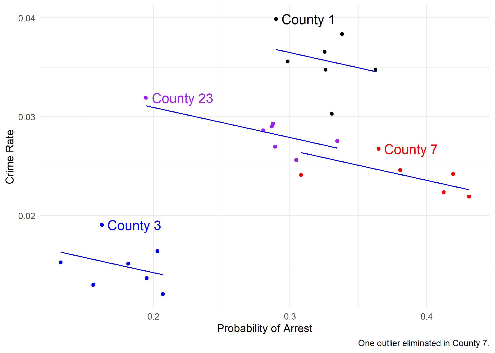
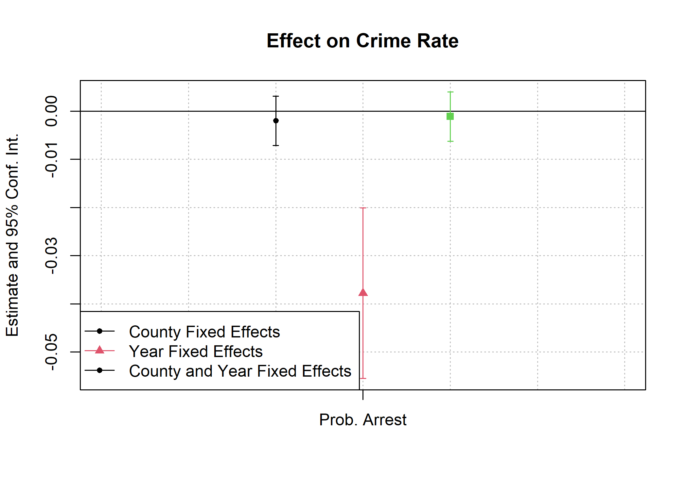
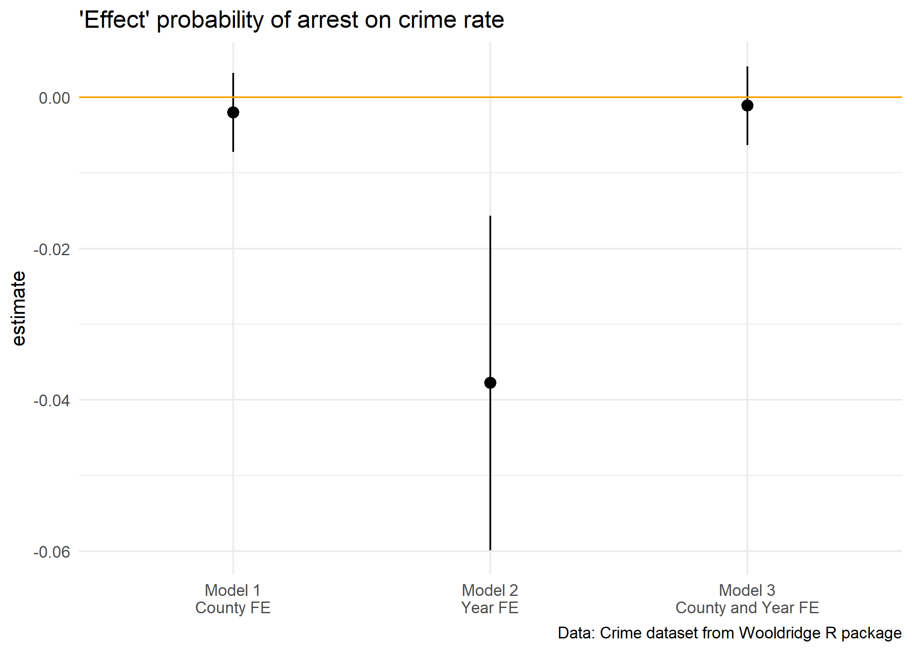
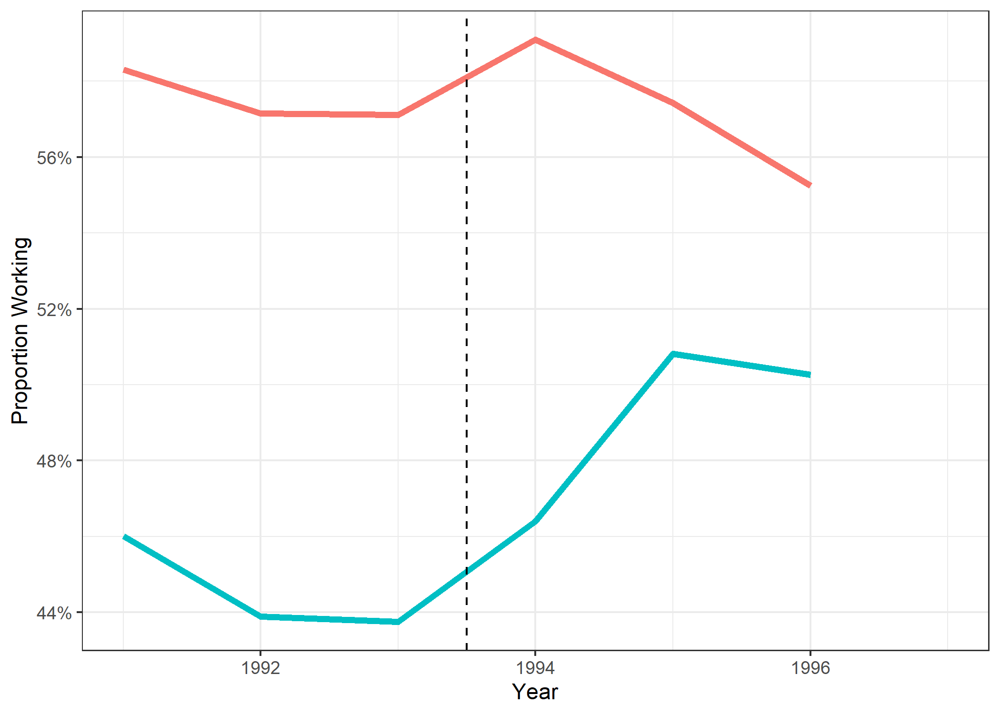
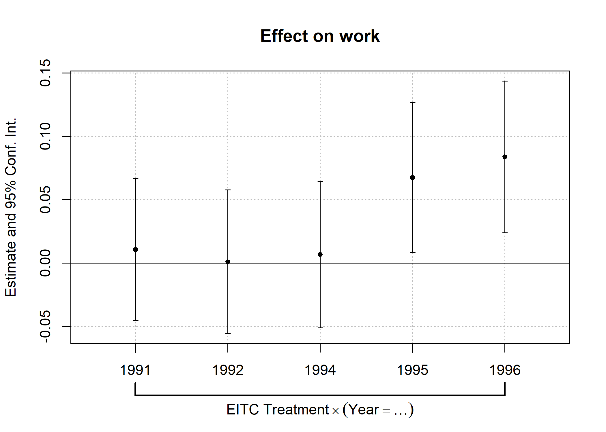
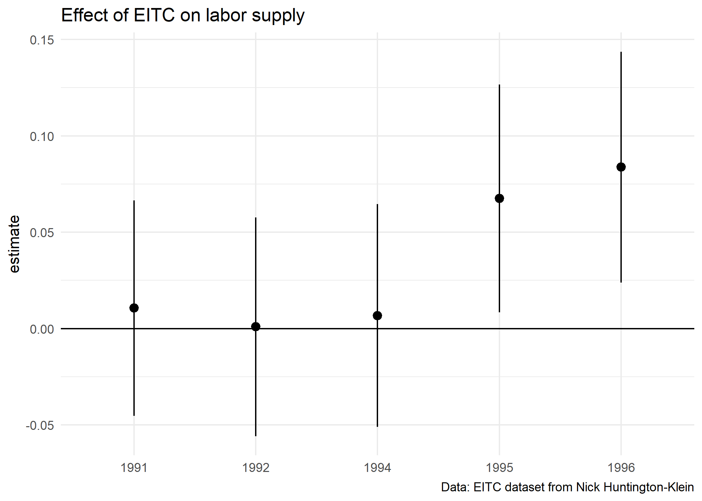
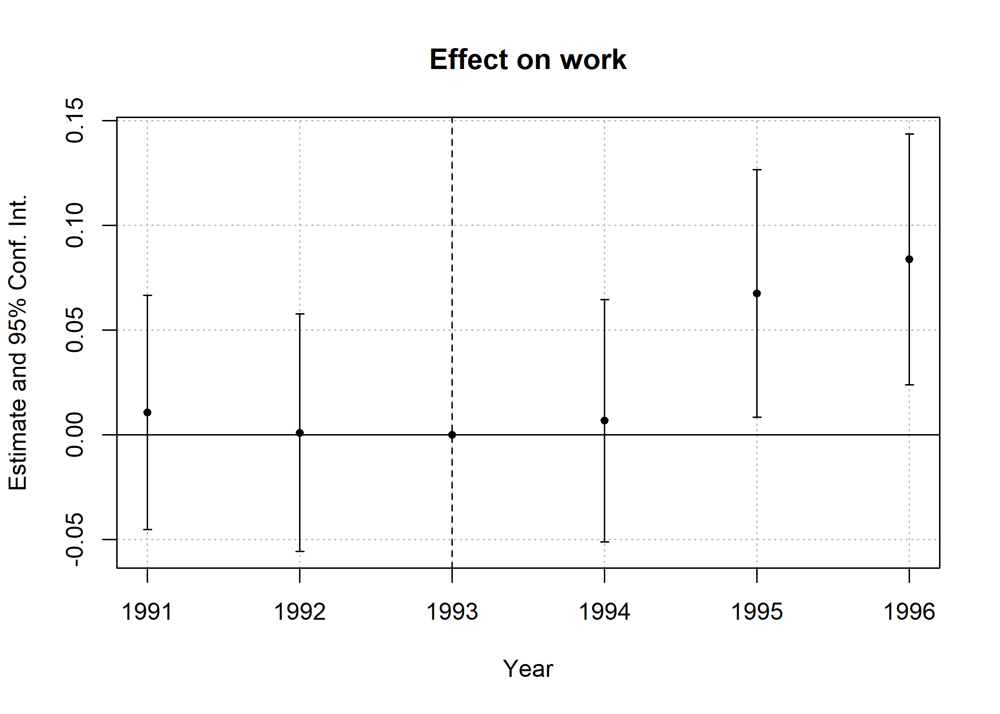

<!-- Build off: https://github.com/Mixtape-Sessions/Causal-Inference-2/tree/main/Lab/Lalonde -->

Today's lecture explores 

## Software requirements

### R packages 

It's important to note that "base" R already provides all of the tools to implement a fixed effects regression, **but** you'll quickly hit walls due to memory caps. Instead, I want to introduce **fixest**, short for Fixed-Effects Estimation, which provides lightning fast fixed effects estimation and make your life much easier. 

- New: **fixest**, **wooldridge**
- Already used: **modelsummary**, **broom**, **tidyverse**

A convenient way to install (if necessary) and load everything is by running the below code chunk.


```r
## Load and install the packages that we'll be using today
if (!require("pacman")) install.packages("pacman")
pacman::p_load(modelsummary, broom, fixest, wooldridge, tidyverse)

## My preferred ggplot2 plotting theme (optional)
theme_set(theme_minimal())
```


#### Note on fixest and feols

I'll be using fixest and feols throughout these notes. The fixest package is a new package that is very fast and has a lot of functionality. It has several bits of funtionality like `feols()` and `etable()`, which are powerful functions for making regressions and putting the output into tables that work well together. `feols()` works very much like `lm()` in base R, but with a few added bonuses. 

### Review of last lecture 

Last lecture we covered how fixed effects are extremely useful for removing variation between units. That means any of the average differences between groups of the fixed effect are removed. We can then look at underlying variation within these groups to see if there is a relationship between our variables of interest.

This is extremely useful for dealing with omitted variable bias. If we have an omitted variable that is correlated with our independent variable, we can't tell if the relationship we see is due to the independent variable or the omitted variable. But if we have a fixed effect for the omitted variable, we can remove the variation between units and then look at the variation within units.

In practice, fixed effects amount to de-meaning our variables of interest. There are a handful of ways to do this. 

## Panel models 

A panel dataset is one in which we view a single unit over multiple periods of time, so a balanced panel has the same number of observations for each unit. For example, we might have data on 100 countries over 10 years, or 50 US states over 20 years. We can then take unit fixed effects, which lets us compare between years within a single unit. Similarly, we can take time fixed effects to compare between units within a given point in time. If our dataset has other dimensions that vary in a way that is not collinear with unit or time, we can also take a fixed effect for that -- though again, you want to be careful about throwing in fixed effects. 

### Dataset

Let me introduce the dataset we'll be using, `crime4`. It comes from Jeffrey Wooldridge's R package -- Dr. Wooldridge is one of the most accomplished professors of econometrics on the planet. I was tipped off about his package by Nick Huntington-Klein's own [lecture notes.](https://github.com/NickCH-K/EconometricsSlides). The dataset shows county probability of arrest and county crime rate by year. 


```r
data(crime4)
crime4 %>%
  dplyr::select(county, year, crmrte, prbarr) %>%
  rename(County = county,
         Year = year,
         CrimeRate = crmrte,
         ProbofArrest = prbarr) %>%
  slice(1:9) 
```

```
##   County Year CrimeRate ProbofArrest
## 1      1   81 0.0398849     0.289696
## 2      1   82 0.0383449     0.338111
## 3      1   83 0.0303048     0.330449
## 4      1   84 0.0347259     0.362525
## 5      1   85 0.0365730     0.325395
## 6      1   86 0.0347524     0.326062
## 7      1   87 0.0356036     0.298270
## 8      3   81 0.0163921     0.202899
## 9      3   82 0.0190651     0.162218
```

### Let's visualize it

Below I visualize the data for just a few counties. Note the positive slope when pooling! Is that surprising? 


```r
crime4 %>% 
  filter(county %in% c(1,3,7, 23),
         prbarr < .5) %>%
  group_by(county) %>%
  mutate(label = case_when(
    crmrte == max(crmrte) ~ paste('County',county),
    TRUE ~ NA_character_
  )) %>%
  ggplot(aes(x =  prbarr, y = crmrte, color = factor(county), label = label)) + 
  geom_point() + 
  geom_text(hjust = -.1, size = 14/.pt) + 
  labs(x = 'Probability of Arrest', 
       y = 'Crime Rate',
       caption = 'One outlier eliminated in County 7.') + 
  #scale_x_continuous(limits = c(.15, 2.5)) + 
  guides(color = FALSE, label = FALSE) + 
  scale_color_manual(values = c('black','blue','red','purple')) + 
  geom_smooth(method = 'lm', aes(color = NULL, label = NULL), se = FALSE)
```

```
## `geom_smooth()` using formula = 'y ~ x'
```

<!-- -->

### Let's try the de-meaning approach

We can use `group_by` to get means-within-groups and subtract them out.


```r
crime4 <- crime4 %>%
  group_by(county) %>%
  mutate(mean_crime = mean(crmrte),
         mean_prob = mean(prbarr)) %>%
  mutate(demeaned_crime = crmrte - mean_crime,
         demeaned_prbarr = prbarr - mean_prob)
```

### And Regress!


```r
orig_data <- lm(crmrte ~ prbarr, data = crime4)
de_mean <- lm(demeaned_crime ~ demeaned_prbarr, data = crime4)
msummary(list(orig_data, de_mean))
```

<table class="table" style="width: auto !important; margin-left: auto; margin-right: auto;">
 <thead>
  <tr>
   <th style="text-align:left;">   </th>
   <th style="text-align:center;">  (1) </th>
   <th style="text-align:center;">   (2) </th>
  </tr>
 </thead>
<tbody>
  <tr>
   <td style="text-align:left;"> (Intercept) </td>
   <td style="text-align:center;"> 0.043 </td>
   <td style="text-align:center;"> 0.000 </td>
  </tr>
  <tr>
   <td style="text-align:left;">  </td>
   <td style="text-align:center;"> (0.001) </td>
   <td style="text-align:center;"> (0.000) </td>
  </tr>
  <tr>
   <td style="text-align:left;"> prbarr </td>
   <td style="text-align:center;"> −0.038 </td>
   <td style="text-align:center;">  </td>
  </tr>
  <tr>
   <td style="text-align:left;">  </td>
   <td style="text-align:center;"> (0.004) </td>
   <td style="text-align:center;">  </td>
  </tr>
  <tr>
   <td style="text-align:left;"> demeaned_prbarr </td>
   <td style="text-align:center;">  </td>
   <td style="text-align:center;"> −0.002 </td>
  </tr>
  <tr>
   <td style="text-align:left;box-shadow: 0px 1.5px">  </td>
   <td style="text-align:center;box-shadow: 0px 1.5px">  </td>
   <td style="text-align:center;box-shadow: 0px 1.5px"> (0.002) </td>
  </tr>
  <tr>
   <td style="text-align:left;"> Num.Obs. </td>
   <td style="text-align:center;"> 630 </td>
   <td style="text-align:center;"> 630 </td>
  </tr>
  <tr>
   <td style="text-align:left;"> R2 </td>
   <td style="text-align:center;"> 0.129 </td>
   <td style="text-align:center;"> 0.001 </td>
  </tr>
  <tr>
   <td style="text-align:left;"> R2 Adj. </td>
   <td style="text-align:center;"> 0.127 </td>
   <td style="text-align:center;"> −0.001 </td>
  </tr>
  <tr>
   <td style="text-align:left;"> AIC </td>
   <td style="text-align:center;"> −3347.3 </td>
   <td style="text-align:center;"> −4549.6 </td>
  </tr>
  <tr>
   <td style="text-align:left;"> BIC </td>
   <td style="text-align:center;"> −3334.0 </td>
   <td style="text-align:center;"> −4536.3 </td>
  </tr>
  <tr>
   <td style="text-align:left;"> Log.Lik. </td>
   <td style="text-align:center;"> 1676.651 </td>
   <td style="text-align:center;"> 2277.823 </td>
  </tr>
  <tr>
   <td style="text-align:left;"> F </td>
   <td style="text-align:center;"> 92.646 </td>
   <td style="text-align:center;">  </td>
  </tr>
  <tr>
   <td style="text-align:left;"> RMSE </td>
   <td style="text-align:center;"> 0.02 </td>
   <td style="text-align:center;"> 0.01 </td>
  </tr>
</tbody>
</table>

Note the coefficient has flipped! 

### Interpreting a Within Relationship
How can we interpret that slope of `-0.02`? This is all *within variation* so our interpretation must be *within-county*. So, "comparing a county in year A where its arrest probability is 1 (100 percentage points) higher than it is in year B, we expect the number of crimes per person to drop by .02." Or if we think we've causally identified it (and want to work on a more realistic scale), "raising the arrest probability by 1 percentage point in a county reduces the number of crimes per person in that county by .0002". We're basically "controlling for county" (and will do that explicitly in a moment). So your interpretation should think of it in that way - *holding county constant* i.e. *comparing two observations with the same value of county* i.e. *comparing a county to itself at a different point in time*.

#### Concept checks

- Do you think the model we've presented is sufficient to have a causal interpretation of the effect of arrest probability on crime? 
- What assumptions would we need to make to have a causal interpretation?
- What potential confounders are there? 
- Why does subtracting the within-individual mean of each variable "control for individual"?
- In a sentence, interpret the slope coefficient in the estimated model $(Y_{it} - \bar{Y}_i) = 2 + 3(X_{it} - \bar{X}_i)$ where $Y$ is "blood pressure", $X$ is "stress at work", and $i$ is an individual person, and $\bar{Y}_i$ means average of $Y_i$
- Is this relationship causal? If not, what assumptions are required for it to be causal? 

### Can we do that all at once? Yes, with the Least Squares Dummy Variable Approach

De-meaning takes some steps which could get tedious to write out. Another way is to include a dummy or category variable for each county. This is called the Least Squares Dummy Variable approach.

You end up with the same results as if we de-meaned. 


```r
lsdv <- lm(crmrte ~ prbarr + factor(county), data = crime4)
msummary(list(orig_data, de_mean, lsdv), keep = c('prbarr', 'demeaned_prob'))
```

<table class="table" style="width: auto !important; margin-left: auto; margin-right: auto;">
 <thead>
  <tr>
   <th style="text-align:left;">   </th>
   <th style="text-align:center;">  (1) </th>
   <th style="text-align:center;">   (2) </th>
   <th style="text-align:center;">   (3) </th>
  </tr>
 </thead>
<tbody>
  <tr>
   <td style="text-align:left;"> prbarr </td>
   <td style="text-align:center;"> −0.038 </td>
   <td style="text-align:center;">  </td>
   <td style="text-align:center;"> −0.002 </td>
  </tr>
  <tr>
   <td style="text-align:left;">  </td>
   <td style="text-align:center;"> (0.004) </td>
   <td style="text-align:center;">  </td>
   <td style="text-align:center;"> (0.003) </td>
  </tr>
  <tr>
   <td style="text-align:left;"> demeaned_prbarr </td>
   <td style="text-align:center;">  </td>
   <td style="text-align:center;"> −0.002 </td>
   <td style="text-align:center;">  </td>
  </tr>
  <tr>
   <td style="text-align:left;box-shadow: 0px 1.5px">  </td>
   <td style="text-align:center;box-shadow: 0px 1.5px">  </td>
   <td style="text-align:center;box-shadow: 0px 1.5px"> (0.002) </td>
   <td style="text-align:center;box-shadow: 0px 1.5px">  </td>
  </tr>
  <tr>
   <td style="text-align:left;"> Num.Obs. </td>
   <td style="text-align:center;"> 630 </td>
   <td style="text-align:center;"> 630 </td>
   <td style="text-align:center;"> 630 </td>
  </tr>
  <tr>
   <td style="text-align:left;"> R2 </td>
   <td style="text-align:center;"> 0.129 </td>
   <td style="text-align:center;"> 0.001 </td>
   <td style="text-align:center;"> 0.871 </td>
  </tr>
  <tr>
   <td style="text-align:left;"> R2 Adj. </td>
   <td style="text-align:center;"> 0.127 </td>
   <td style="text-align:center;"> −0.001 </td>
   <td style="text-align:center;"> 0.849 </td>
  </tr>
  <tr>
   <td style="text-align:left;"> AIC </td>
   <td style="text-align:center;"> −3347.3 </td>
   <td style="text-align:center;"> −4549.6 </td>
   <td style="text-align:center;"> −4371.6 </td>
  </tr>
  <tr>
   <td style="text-align:left;"> BIC </td>
   <td style="text-align:center;"> −3334.0 </td>
   <td style="text-align:center;"> −4536.3 </td>
   <td style="text-align:center;"> −3962.6 </td>
  </tr>
  <tr>
   <td style="text-align:left;"> Log.Lik. </td>
   <td style="text-align:center;"> 1676.651 </td>
   <td style="text-align:center;"> 2277.823 </td>
   <td style="text-align:center;"> 2277.823 </td>
  </tr>
  <tr>
   <td style="text-align:left;"> F </td>
   <td style="text-align:center;"> 92.646 </td>
   <td style="text-align:center;">  </td>
   <td style="text-align:center;"> 40.351 </td>
  </tr>
  <tr>
   <td style="text-align:left;"> RMSE </td>
   <td style="text-align:center;"> 0.02 </td>
   <td style="text-align:center;"> 0.01 </td>
   <td style="text-align:center;"> 0.01 </td>
  </tr>
</tbody>
</table>

Hey look, the coefficient is the same! 

### Why LSDV?

- A benefit of the LSDV approach is that it calculates the fixed effects $\alpha_i$ for you
- We left those out of the table with the `coefs` argument of `msummary` (we rarely want them) but here they are:


```r
lsdv
```

```
## 
## Call:
## lm(formula = crmrte ~ prbarr + factor(county), data = crime4)
## 
## Coefficients:
##       (Intercept)             prbarr    factor(county)3    factor(county)5  
##         0.0363976         -0.0020232         -0.0211038         -0.0227439  
##   factor(county)7    factor(county)9   factor(county)11   factor(county)13  
##        -0.0125058         -0.0240486         -0.0183143         -0.0032912  
##  factor(county)15   factor(county)17   factor(county)19   factor(county)21  
##        -0.0179836         -0.0146255         -0.0185499          0.0035485  
##  factor(county)23   factor(county)25   factor(county)27   factor(county)33  
##        -0.0073943         -0.0034639         -0.0012558         -0.0198379  
##  factor(county)35   factor(county)37   factor(county)39   factor(county)41  
##         0.0070240         -0.0143802         -0.0212591         -0.0115589  
##  factor(county)45   factor(county)47   factor(county)49   factor(county)51  
##        -0.0008915         -0.0053747         -0.0015888          0.0318754  
##  factor(county)53   factor(county)55   factor(county)57   factor(county)59  
##        -0.0186603          0.0221664         -0.0063204         -0.0178825  
##  factor(county)61   factor(county)63   factor(county)65   factor(county)67  
##        -0.0149666          0.0381621          0.0198140          0.0214212  
##  factor(county)69   factor(county)71   factor(county)77   factor(county)79  
##        -0.0211463          0.0228639          0.0022599         -0.0215523  
##  factor(county)81   factor(county)83   factor(county)85   factor(county)87  
##         0.0205261         -0.0064776          0.0051594         -0.0078661  
##  factor(county)89   factor(county)91   factor(county)93   factor(county)97  
##        -0.0088413         -0.0040777         -0.0018436          0.0021169  
##  factor(county)99  factor(county)101  factor(county)105  factor(county)107  
##        -0.0192747         -0.0027612          0.0143055          0.0108018  
## factor(county)109  factor(county)111  factor(county)113  factor(county)115  
##        -0.0170930         -0.0187163         -0.0239391         -0.0301032  
## factor(county)117  factor(county)119  factor(county)123  factor(county)125  
##        -0.0169581          0.0526182         -0.0023063         -0.0091250  
## factor(county)127  factor(county)129  factor(county)131  factor(county)133  
##         0.0028419          0.0386488         -0.0179728          0.0098405  
## factor(county)135  factor(county)137  factor(county)139  factor(county)141  
##         0.0188796         -0.0220273         -0.0066127          0.0337109  
## factor(county)143  factor(county)145  factor(county)147  factor(county)149  
##        -0.0139798         -0.0071850          0.0166929         -0.0200991  
## factor(county)151  factor(county)153  factor(county)155  factor(county)157  
##        -0.0114062         -0.0047028         -0.0026681         -0.0058717  
## factor(county)159  factor(county)161  factor(county)163  factor(county)165  
##        -0.0043145         -0.0154759         -0.0147833          0.0082355  
## factor(county)167  factor(county)169  factor(county)171  factor(county)173  
##        -0.0128534         -0.0232628         -0.0141934         -0.0242636  
## factor(county)175  factor(county)179  factor(county)181  factor(county)183  
##        -0.0175234         -0.0077435          0.0232585          0.0175664  
## factor(county)185  factor(county)187  factor(county)189  factor(county)191  
##        -0.0243118         -0.0078490         -0.0071590          0.0015451  
## factor(county)193  factor(county)195  factor(county)197  
##        -0.0152095          0.0097064         -0.0209701
```

THe interpretation is exactly the same as with a categorical variable - we have an omitted county, and these show the difference relative to that omitted county

**NOTE: See how I put `factor()` around county?** That is to ensure it reads county, which is the county fips code as a categorical variable instead of as a numerical variable. If you don't do that, it will read it as a numerical variable and you'll get a different result:


```r
lm(crmrte ~ prbarr + county, data = crime4)
```

```
## 
## Call:
## lm(formula = crmrte ~ prbarr + county, data = crime4)
## 
## Coefficients:
## (Intercept)       prbarr       county  
##   4.213e-02   -3.788e-02    1.094e-05
```

This is saying that as FIPS code increases by one, the crime rate increases by 0.000011... that's nonsense. There's an urban legend of an economist who took the log of the NAICS industry classification code for quite some time before realizing they meant to use a categorical variable. Correcting that mistake completely changed their results.

### Why LSDV?

This also makes clear another element of what's happening! Just like with a categorical var, the line is moving *up and down* to meet the counties. Graphically, de-meaning moves all the points together in the middle to draw a line, while LSDV moves the line up and down to meet the points


```r
crime4_small <- crime4 %>% 
  filter(county %in% c(1,3,7, 23), # filter down data points
         prbarr < .5) %>%
  ungroup() 
# Make lsdv for this small dataframe
lsdv_small <- lm(crmrte ~ prbarr + factor(county), 
  data = crime4_small)

crime4_small %>%
  mutate(pred = predict(lsdv_small)) %>%
  group_by(county) %>%
  mutate(label = case_when(
    crmrte == max(crmrte) ~ paste('County',county),
    TRUE ~ NA_character_
  )) %>%
  ggplot(aes(x =  prbarr, y = crmrte, color = factor(county), label = label)) + 
  geom_point() + 
  geom_text(hjust = -.1, size = 14/.pt) + 
  geom_line(aes(y = pred, group = county), color = 'blue') +
  labs(x = 'Probability of Arrest', 
       y = 'Crime Rate',
       caption = 'One outlier eliminated in County 7.') + 
  #scale_x_continuous(limits = c(.15, 2.5)) + 
  guides(color = FALSE, label = FALSE) + 
  scale_color_manual(values = c('black','blue','red','purple'))
```

```
## Warning: The `<scale>` argument of `guides()` cannot be `FALSE`. Use "none" instead as
## of ggplot2 3.3.4.
## This warning is displayed once every 8 hours.
## Call `lifecycle::last_lifecycle_warnings()` to see where this warning was
## generated.
```

```
## Warning: Removed 23 rows containing missing values (`geom_text()`).
```

<!-- -->

### The "Pros" don't use LSDV

Most people do not use LSDB -- it is computationally expensive. If you get too many fixed effects or too big of data, it just will not wrong. The professionally-written commands use de-meaning, like **fixest**, which is less computationally expensive. See for yourself! Look, we even used the **etable** function.


```r
pro <- feols(crmrte ~ prbarr | county, data = crime4)
de_mean <- feols(demeaned_crime ~ demeaned_prbarr, data = crime4)
etable(de_mean, pro)
```

```
##                            de_mean              pro
## Dependent Var.:     demeaned_crime           crmrte
##                                                    
## Constant        -1.01e-20 (0.0003)                 
## demeaned_prbarr   -0.0020 (0.0025)                 
## prbarr                             -0.0020 (0.0026)
## Fixed-Effects:  ------------------ ----------------
## county                          No              Yes
## _______________ __________________ ________________
## S.E. type                      IID       by: county
## Observations                   630              630
## R2                         0.00106          0.87076
## Within R2                       --          0.00106
## ---
## Signif. codes: 0 '***' 0.001 '**' 0.01 '*' 0.05 '.' 0.1 ' ' 1
```

To explain the **fixest** package, let's dive a bit deeper into the crime data. It has tons of variables we could use. We could account for variation by year for example. 


```r
crime_county_fe <- feols(crmrte ~ prbarr | county, data = crime4)
crime_year_fe  <-  feols(crmrte ~ prbarr | year, data = crime4)
crime_county_year_fe <- feols(crmrte ~ prbarr | county+year, data = crime4)

etable(list('County FE'=crime_county_fe, 
            'Year FE'=crime_year_fe, 
            'County and Year FE'=crime_county_year_fe))
```

```
##                        County FE            Year FE County and Yea..
## Dependent Var.:           crmrte             crmrte           crmrte
##                                                                     
## prbarr          -0.0020 (0.0026) -0.0378** (0.0090) -0.0011 (0.0026)
## Fixed-Effects:  ---------------- ------------------ ----------------
## county                       Yes                 No              Yes
## year                          No                Yes              Yes
## _______________ ________________ __________________ ________________
## S.E.: Clustered       by: county           by: year       by: county
## Observations                 630                630              630
## R2                       0.87076            0.13347          0.87735
## Within R2                0.00106            0.12764          0.00034
## ---
## Signif. codes: 0 '***' 0.001 '**' 0.01 '*' 0.05 '.' 0.1 ' ' 1
```

Pretty neat right? Just sticking something after the `|` allows you to residualize its fixed effect! 


```r
dict = c('prbarr'='Prob. Arrest',
  'avgsen'='Avg. Sentence',
  'county'='County',
  'year'= 'Year',
  'crmrte'='Crime Rate',
  'prbconv'='Prob. Conviction')

etable(list('County FE'=crime_county_fe, 
            'Year FE'=crime_year_fe, 
            'County and Year FE'=crime_county_year_fe),
       notes='Note: Estimates from various fixed effects regressions on the Crime Data',
       dict=dict  
       )
```

```
##                        County FE            Year FE County and Yea..
## Dependent Var.:       Crime Rate         Crime Rate       Crime Rate
##                                                                     
## Prob. Arrest    -0.0020 (0.0026) -0.0378** (0.0090) -0.0011 (0.0026)
## Fixed-Effects:  ---------------- ------------------ ----------------
## County                       Yes                 No              Yes
## Year                          No                Yes              Yes
## _______________ ________________ __________________ ________________
## S.E.: Clustered       by: County           by: Year       by: County
## Observations                 630                630              630
## R2                       0.87076            0.13347          0.87735
## Within R2                0.00106            0.12764          0.00034
## ---
## Signif. codes: 0 '***' 0.001 '**' 0.01 '*' 0.05 '.' 0.1 ' ' 1
```

```r
# I don't want to keep writing in ,dict=dct. So I'll use setFixestDict
# This applies to every etable in the session
setFixest_dict(dict)
```

##### Visualization

Similarly, the [`fixest::coefplot()`](https://lrberge.github.io/fixest/reference/coefplot.html) function for plotting estimation results:


```r
coefplot(list(crime_county_fe, crime_year_fe, crime_county_year_fe))

## Add legend (optional)
legend("bottomleft", col = 1:2, lwd = 1, pch = c(20, 17),
       legend = c("County Fixed Effects", 'Year Fixed Effects', "County and Year Fixed Effects"))
```

<!-- -->

`coefplot()` is especially useful for tracing the evolution of treatment effects over time, as in a difference-in-differences setup (see [Examples](https://lrberge.github.io/fixest/reference/coefplot.html#examples)). However, I realise some people may find it a bit off-putting that it produces base R plots, rather than a **ggplot2** object. We'll get to an automated **ggplot2** coefficient plot solution further below with `modelsummary::modelplot()`. Nevertheless, let me close this out this section by demonstrating the relative ease with which you can do this "manually". Consider the below example, which leverages the fact that we have saved (or can save) regression models as data frames with `broom::tidy()`. As I suggested earlier, this makes it simple to construct our own bespoke coefficient plots.


```r
# library(ggplot2) ## Already loaded

## First get tidied output of the ols_hdfe object
coefs_crime_county_fe = tidy(crime_county_fe, conf.int = TRUE)
coefs_crime_year_fe = tidy(crime_year_fe, conf.int = TRUE)
coefs_crime_county_year_fe = tidy(crime_county_year_fe, conf.int = TRUE)

bind_rows(
  coefs_crime_county_fe %>% mutate(reg = "Model 1\nCounty FE"),
  coefs_crime_year_fe %>% mutate(reg = "Model 2\nYear FE"),
  coefs_crime_county_year_fe %>% mutate(reg="Model 3\nCounty and Year FE")
  ) %>%
  ggplot(aes(x=reg, y=estimate, ymin=conf.low, ymax=conf.high)) +
  geom_pointrange() +
  labs(Title = "Marginal effect of probability of arrest on crime rate") +
  geom_hline(yintercept = 0, col = "orange") +
  labs(
    title = "'Effect' probability of arrest on crime rate",
    caption = "Data: Crime dataset from Wooldridge R package"
    ) +
  theme(axis.title.x = element_blank())
```

<!-- -->

##### What if we wanted to change the clustering of the standard errors? 

Did you notice the S.E. type above? It auto-clustered by the fixed effects -- specifically the fixed effect with the most levels. **fixest** does that by default, but maybe you disagree! 

Sometimes you want to cluster standard errors a new way. Well that is something you can do with **fixest** and its delightfully well-designed `etable()` function. You can specify the cluster variable with `cluster()` or the type of standard errors you want with `se()` and get different types of standard errors. Below I specify standard errors clustered by state and then an assumption of independent and identically distributed errors. (The most vanilla standard errors you can assume and rarely the ones we believe explain real world phenomena.)


```r
# IID standard errors
etable(list('County FE'=crime_county_fe, 
            'Year FE'=crime_year_fe, 
            'County and Year FE'=crime_county_year_fe),
        se='IID')
```

```
##                        County FE             Year FE County and Yea..
## Dependent Var.:           crmrte              crmrte           crmrte
##                                                                      
## prbarr          -0.0020 (0.0027) -0.0378*** (0.0040) -0.0011 (0.0026)
## Fixed-Effects:  ---------------- ------------------- ----------------
## county                       Yes                  No              Yes
## year                          No                 Yes              Yes
## _______________ ________________ ___________________ ________________
## S.E. type                    IID                 IID              IID
## Observations                 630                 630              630
## R2                       0.87076             0.13347          0.87735
## Within R2                0.00106             0.12764          0.00034
## ---
## Signif. codes: 0 '***' 0.001 '**' 0.01 '*' 0.05 '.' 0.1 ' ' 1
```

```r
etable(list('County FE'=crime_county_fe, 
            'Year FE'=crime_year_fe, 
            'County and Year FE'=crime_county_year_fe),
        cluster='county')
```

```
##                        County FE             Year FE County and Yea..
## Dependent Var.:           crmrte              crmrte           crmrte
##                                                                      
## prbarr          -0.0020 (0.0026) -0.0378*** (0.0103) -0.0011 (0.0026)
## Fixed-Effects:  ---------------- ------------------- ----------------
## county                       Yes                  No              Yes
## year                          No                 Yes              Yes
## _______________ ________________ ___________________ ________________
## S.E.: Clustered       by: county          by: county       by: county
## Observations                 630                 630              630
## R2                       0.87076             0.13347          0.87735
## Within R2                0.00106             0.12764          0.00034
## ---
## Signif. codes: 0 '***' 0.001 '**' 0.01 '*' 0.05 '.' 0.1 ' ' 1
```

We'd normally expect our standard errors to blow up with clustering and we see something similar here. Why is that? 

Yes, I know this is a lot on stuff you've only barely experienced before. But you're going to come across these terms when you read papers and I want you to know how to play with them when you're trying to learn by doing.

#### Aside on standard errors

We've now seen the various options that **fixest** has for specifying different standard error structures. In short, you invoke either of the `se` or `cluster` arguments. Moreover, you can choose to do so either at estimation time, or by adjusting the standard errors for an existing model post-estimation (e.g. with `summary.fixest(mod, cluster = ...)`). There are two additional points that I want to draw your attention to.

First, if you're coming from another statistical language, adjusting the standard errors post-estimation (rather than always at estimation time) may seem slightly odd. But this behaviour is actually extremely powerful, because it allows us to analyse the effect of different error structures *on-the-fly* without having to rerun the entire model again. **fixest** is already the fastest game in town, but just think about the implied time savings for really large models.^[To be clear, adjusting the standard errors via, say, `summary.fixest()` completes instantaneously.] I'm a huge fan of the flexibility, safety, and speed that on-the-fly standard error adjustment offers us. I even wrote a whole [blog post](https://grantmcdermott.com/better-way-adjust-SEs/) about it if you'd like to read more.

Second, reconciling standard errors across different software is a much more complicated process than you may realise. There are a number of unresolved theoretical issues to consider --- especially when it comes to multiway clustering --- and package maintainers have to make a number of arbitrary decisions about the best way to account for these. See [here](https://github.com/sgaure/lfe/issues/1#issuecomment-530643808) for a detailed discussion. Luckily, Laurent (the **fixest** package author) has taken the time to write out a [detailed vignette](https://lrberge.github.io/fixest/articles/standard_errors.html) about how to replicate standard errors from other methods and software packages.^[If you want a deep dive into the theory with even more simulations, then [this paper](http://sandwich.r-forge.r-project.org/articles/jss_2020.html) by the authors of the **sandwich** paper is another excellent resource.]

#### Multiple estimations

But won't it get tedious writing out all these variations of fixed effects over and over with the `feols()` repeated? Sure will. That's where the **fixest** package comes in handy. 

**fixest** allows you to do multiple estimations in one command and it does is it fast! Why is it so fast? It leverages the de-meaning trick mentioned above. If a fixed effect is used in multiple estimations, it saves the outcome variable de-meaned of that fixed effect to use in all the other estimations. That saves a bunch of time! 

This is also a really smart big data technique we'll get into more later in the course. It does a task once instead of multiple times to save time and processing power. 

Here's a demo using the stepwise `sw0()` function, which adds fixed effects -- starting with none step-by-step:


```r
crime_many_fes <- feols(crmrte ~ prbarr | 
  sw0(county,year,county+year),
  data=crime4)
etable(crime_many_fes)
```

```
##                    crime_many_fes.1 crime_many_fes.2   crime_many_fes.3
## Dependent Var.:              crmrte           crmrte             crmrte
##                                                                        
## Constant         0.0432*** (0.0014)                                    
## prbarr          -0.0379*** (0.0039) -0.0020 (0.0026) -0.0378** (0.0090)
## Fixed-Effects:  ------------------- ---------------- ------------------
## county                           No              Yes                 No
## year                             No               No                Yes
## _______________ ___________________ ________________ __________________
## S.E. type                       IID       by: county           by: year
## Observations                    630              630                630
## R2                          0.12856          0.87076            0.13347
## Within R2                        --          0.00106            0.12764
## 
##                 crime_many_fes.4
## Dependent Var.:           crmrte
##                                 
## Constant                        
## prbarr          -0.0011 (0.0026)
## Fixed-Effects:  ----------------
## county                       Yes
## year                         Yes
## _______________ ________________
## S.E. type             by: county
## Observations                 630
## R2                       0.87735
## Within R2                0.00034
## ---
## Signif. codes: 0 '***' 0.001 '**' 0.01 '*' 0.05 '.' 0.1 ' ' 1
```

These results are the same as above. Oh and guess what? You can get a lot more complicated than that! 

Wouldnt it be nice to have better names of our variables? We can do that uing a dict, which is just a fancy vector with names.

Here's the basics of how it works.^[You can find a more in-depth explanation at the [Multiple Estimation vignette.](https://cran.r-project.org/web/packages/fixest/vignettes/multiple_estimations.html)] You can specify:

1. One or more rhs variable using `c(var1,var2,var3)`
2. One or more fixed effects using the stepwise functions `sw()`, `sw0()`, `csw()`, and `csw0()`.
3. One or more independent variable using the stepwise functions `sw()`, `sw0()`, `csw()`, and `csw0()`.
4. Different samples using the `split` or `fsplit` option.

And here's multiple estimations used to their "fuller" potential: 


```r
crime_many_estimations <- feols(c(crmrte,prbconv) ~ csw(prbarr, avgsen, polpc) | 
  sw0(county,year,county+year),
  data=crime4,
  fsplit=~urban)

etable(crime_many_estimations[lhs='crmrte',sample=1],title='Crime Rate',notes='Note: Estimates from various fixed effects regressions on the Crime Data')
```

```
##                 crime_many_estim..1 crime_many_estim..2 crime_many_estim..3
## Sample (urban)          Full sample         Full sample         Full sample
## Dependent Var.:              crmrte              crmrte              crmrte
##                                                                            
## Constant         0.0432*** (0.0014)  0.0406*** (0.0026)  0.0397*** (0.0025)
## prbarr          -0.0379*** (0.0039) -0.0381*** (0.0039) -0.0478*** (0.0039)
## avgsen                                  0.0003 (0.0003)     0.0003 (0.0002)
## polpc                                                     2.089*** (0.2442)
## Fixed-Effects:  ------------------- ------------------- -------------------
## county                           No                  No                  No
## year                             No                  No                  No
## _______________ ___________________ ___________________ ___________________
## S.E. type                       IID                 IID                 IID
## Observations                    630                 630                 630
## R2                          0.12856             0.13055             0.22159
## Within R2                        --                  --                  --
## 
##                 crime_many_es..4 crime_many_es..5 crime_many_est..6
## Sample (urban)       Full sample      Full sample       Full sample
## Dependent Var.:           crmrte           crmrte            crmrte
##                                                                    
## Constant                                                           
## prbarr          -0.0020 (0.0026) -0.0019 (0.0027)  -0.0043 (0.0028)
## avgsen                           7.12e-5 (0.0001)  0.0002* (0.0001)
## polpc                                             1.735*** (0.3191)
## Fixed-Effects:  ---------------- ---------------- -----------------
## county                       Yes              Yes               Yes
## year                          No               No                No
## _______________ ________________ ________________ _________________
## S.E. type             by: county       by: county        by: county
## Observations                 630              630               630
## R2                       0.87076          0.87084           0.89669
## Within R2                0.00106          0.00164           0.20150
## 
##                 crime_many_esti..7 crime_many_esti..8 crime_many_esti..9
## Sample (urban)         Full sample        Full sample        Full sample
## Dependent Var.:             crmrte             crmrte             crmrte
##                                                                         
## Constant                                                                
## prbarr          -0.0378** (0.0090) -0.0379** (0.0088) -0.0478** (0.0086)
## avgsen                                0.0002 (0.0002)    0.0002 (0.0002)
## polpc                                                    2.134* (0.7683)
## Fixed-Effects:  ------------------ ------------------ ------------------
## county                          No                 No                 No
## year                           Yes                Yes                Yes
## _______________ __________________ __________________ __________________
## S.E. type                 by: year           by: year           by: year
## Observations                   630                630                630
## R2                         0.13347            0.13463            0.22896
## Within R2                  0.12764            0.12881            0.22377
## 
##                 crime_many_e..10 crime_many_e..11 crime_many_es..12
## Sample (urban)       Full sample      Full sample       Full sample
## Dependent Var.:           crmrte           crmrte            crmrte
##                                                                    
## Constant                                                           
## prbarr          -0.0011 (0.0026) -0.0012 (0.0026)  -0.0038 (0.0027)
## avgsen                           -9.4e-5 (0.0001)  5.05e-5 (0.0001)
## polpc                                             1.821*** (0.3223)
## Fixed-Effects:  ---------------- ---------------- -----------------
## county                       Yes              Yes               Yes
## year                         Yes              Yes               Yes
## _______________ ________________ ________________ _________________
## S.E. type             by: county       by: county        by: county
## Observations                 630              630               630
## R2                       0.87735          0.87746           0.90563
## Within R2                0.00034          0.00125           0.23086
## ---
## Signif. codes: 0 '***' 0.001 '**' 0.01 '*' 0.05 '.' 0.1 ' ' 1
```

```r
etable(crime_many_estimations[lhs='prbconv',sample=1],title='Probability of Conviction',notes='Note: Estimates from various fixed effects regressions on the Crime Data.')
```

```
##                 crime_many_esti..1 crime_many_es..2 crime_many_est..3
## Sample (urban)         Full sample      Full sample       Full sample
## Dependent Var.:            prbconv          prbconv           prbconv
##                                                                      
## Constant        0.5807*** (0.1385) 0.5018. (0.2628)   0.3759 (0.2338)
## prbarr             0.3512 (0.3937)  0.3464 (0.3942) -1.029** (0.3662)
## avgsen                              0.0090 (0.0254)   0.0068 (0.0226)
## polpc                                                296.5*** (22.92)
## Fixed-Effects:  ------------------ ---------------- -----------------
## county                          No               No                No
## year                            No               No                No
## _______________ __________________ ________________ _________________
## S.E. type                      IID              IID               IID
## Observations                   630              630               630
## R2                         0.00127          0.00146           0.21216
## Within R2                       --               --                --
## 
##                 crime_many_..4 crime_many_e..5 crime_many_e..6 crime_many_e..7
## Sample (urban)     Full sample     Full sample     Full sample     Full sample
## Dependent Var.:        prbconv         prbconv         prbconv         prbconv
##                                                                               
## Constant                                                                      
## prbarr          -2.941 (2.064)  -2.940 (2.074)  -3.394 (2.559) 0.3665 (0.3999)
## avgsen                         0.0008 (0.0342) 0.0301 (0.0299)                
## polpc                                           328.8* (142.5)                
## Fixed-Effects:  -------------- --------------- --------------- ---------------
## county                     Yes             Yes             Yes              No
## year                        No              No              No             Yes
## _______________ ______________ _______________ _______________ _______________
## S.E. type           by: county      by: county      by: county        by: year
## Observations               630             630             630             630
## R2                     0.33114         0.33114         0.43784         0.01355
## Within R2              0.04762         0.04762         0.19955         0.00139
## 
##                 crime_many_e..8 crime_many_e..9 crime_many..10 crime_many_..11
## Sample (urban)      Full sample     Full sample    Full sample     Full sample
## Dependent Var.:         prbconv         prbconv        prbconv         prbconv
##                                                                               
## Constant                                                                      
## prbarr          0.3571 (0.4001) -1.008 (0.7845) -2.939 (2.077)  -2.931 (2.079)
## avgsen          0.0138 (0.0358) 0.0074 (0.0274)                0.0104 (0.0277)
## polpc                            294.5. (125.8)                               
## Fixed-Effects:  --------------- --------------- -------------- ---------------
## county                       No              No            Yes             Yes
## year                        Yes             Yes            Yes             Yes
## _______________ _______________ _______________ ______________ _______________
## S.E. type              by: year        by: year     by: county      by: county
## Observations                630             630            630             630
## R2                      0.01398         0.22043        0.34289         0.34305
## Within R2               0.00182         0.21082        0.04784         0.04807
## 
##                 crime_many_..12
## Sample (urban)      Full sample
## Dependent Var.:         prbconv
##                                
## Constant                       
## prbarr           -3.388 (2.552)
## avgsen          0.0361 (0.0269)
## polpc            324.6* (139.9)
## Fixed-Effects:  ---------------
## county                      Yes
## year                        Yes
## _______________ _______________
## S.E. type            by: county
## Observations                630
## R2                      0.44589
## Within R2               0.19709
## ---
## Signif. codes: 0 '***' 0.001 '**' 0.01 '*' 0.05 '.' 0.1 ' ' 1
```

```r
etable(crime_many_estimations[lhs='crmrte',sample=2],title='Crime Rate in Urban Areas',notes='Note: Estimates from various fixed effects regressions on the Crime Data')
```

```
##                 crime_many_estim..1 crime_many_estim..2 crime_many_estim..3
## Sample (urban)                    0                   0                   0
## Dependent Var.:              crmrte              crmrte              crmrte
##                                                                            
## Constant         0.0370*** (0.0012)  0.0392*** (0.0023)  0.0385*** (0.0021)
## prbarr          -0.0270*** (0.0034) -0.0267*** (0.0034) -0.0356*** (0.0033)
## avgsen                                 -0.0003 (0.0002)    -0.0003 (0.0002)
## polpc                                                     1.819*** (0.2036)
## Fixed-Effects:  ------------------- ------------------- -------------------
## county                           No                  No                  No
## year                             No                  No                  No
## _______________ ___________________ ___________________ ___________________
## S.E. type                       IID                 IID                 IID
## Observations                    574                 574                 574
## R2                          0.10023             0.10240             0.21267
## Within R2                        --                  --                  --
## 
##                 crime_many_es..4 crime_many_es..5 crime_many_est..6
## Sample (urban)                 0                0                 0
## Dependent Var.:           crmrte           crmrte            crmrte
##                                                                    
## Constant                                                           
## prbarr          -0.0017 (0.0026) -0.0017 (0.0026)  -0.0041 (0.0027)
## avgsen                           1.95e-5 (0.0001)  0.0002. (0.0001)
## polpc                                             1.722*** (0.3264)
## Fixed-Effects:  ---------------- ---------------- -----------------
## county                       Yes              Yes               Yes
## year                          No               No                No
## _______________ ________________ ________________ _________________
## S.E. type             by: county       by: county        by: county
## Observations                 574              574               574
## R2                       0.80689          0.80690           0.84780
## Within R2                0.00084          0.00088           0.21251
## 
##                 crime_many_esti..7 crime_many_esti..8 crime_many_esti..9
## Sample (urban)                   0                  0                  0
## Dependent Var.:             crmrte             crmrte             crmrte
##                                                                         
## Constant                                                                
## prbarr          -0.0268** (0.0058) -0.0264** (0.0059) -0.0355** (0.0064)
## avgsen                              -0.0004* (0.0001)  -0.0004. (0.0002)
## polpc                                                    1.865* (0.7238)
## Fixed-Effects:  ------------------ ------------------ ------------------
## county                          No                 No                 No
## year                           Yes                Yes                Yes
## _______________ __________________ __________________ __________________
## S.E. type                 by: year           by: year           by: year
## Observations                   574                574                574
## R2                         0.10602            0.10988            0.22501
## Within R2                  0.09934            0.10323            0.21922
## 
##                 crime_many_e..10 crime_many_e..11 crime_many_es..12
## Sample (urban)                 0                0                 0
## Dependent Var.:           crmrte           crmrte            crmrte
##                                                                    
## Constant                                                           
## prbarr          -0.0010 (0.0026) -0.0011 (0.0026)  -0.0036 (0.0026)
## avgsen                           -0.0001 (0.0001)  3.91e-5 (0.0001)
## polpc                                             1.805*** (0.3295)
## Fixed-Effects:  ---------------- ---------------- -----------------
## county                       Yes              Yes               Yes
## year                         Yes              Yes               Yes
## _______________ ________________ ________________ _________________
## S.E. type             by: county       by: county        by: county
## Observations                 574              574               574
## R2                       0.81420          0.81446           0.85886
## Within R2                0.00030          0.00168           0.24061
## ---
## Signif. codes: 0 '***' 0.001 '**' 0.01 '*' 0.05 '.' 0.1 ' ' 1
```

```r
etable(crime_many_estimations[lhs='crmrte',sample=3],title='Crime Rate in Rural Areas',notes='Note: Estimates from various fixed effects regressions on the Crime Data')
```

```
##                 crime_many_estim..1 crime_many_estim..2 crime_many_estim..3
## Sample (urban)                    1                   1                   1
## Dependent Var.:              crmrte              crmrte              crmrte
##                                                                            
## Constant         0.1055*** (0.0078)  0.0990*** (0.0100)  0.0775*** (0.0138)
## prbarr          -0.1995*** (0.0368) -0.2033*** (0.0369) -0.2014*** (0.0357)
## avgsen                                  0.0007 (0.0007)     0.0004 (0.0007)
## polpc                                                        11.94* (5.472)
## Fixed-Effects:  ------------------- ------------------- -------------------
## county                           No                  No                  No
## year                             No                  No                  No
## _______________ ___________________ ___________________ ___________________
## S.E. type                       IID                 IID                 IID
## Observations                     56                  56                  56
## R2                          0.35269             0.36588             0.41909
## Within R2                        --                  --                  --
## 
##                 crime_many_est..4 crime_many_est..5 crime_many_est..6
## Sample (urban)                  1                 1                 1
## Dependent Var.:            crmrte            crmrte            crmrte
##                                                                      
## Constant                                                             
## prbarr          -0.1903. (0.0823) -0.1871. (0.0801) -0.1811* (0.0741)
## avgsen                              0.0008 (0.0005)   0.0007 (0.0005)
## polpc                                                   8.647 (6.132)
## Fixed-Effects:  ----------------- ----------------- -----------------
## county                        Yes               Yes               Yes
## year                           No                No                No
## _______________ _________________ _________________ _________________
## S.E. type              by: county        by: county        by: county
## Observations                   56                56                56
## R2                        0.88722           0.89616           0.90231
## Within R2                 0.20282           0.26602           0.30946
## 
##                 crime_many_estim..7 crime_many_estim..8 crime_many_estim..9
## Sample (urban)                    1                   1                   1
## Dependent Var.:              crmrte              crmrte              crmrte
##                                                                            
## Constant                                                                   
## prbarr          -0.1979*** (0.0149) -0.2011*** (0.0175) -0.1982*** (0.0137)
## avgsen                                  0.0005 (0.0007)   -4.93e-5 (0.0007)
## polpc                                                       13.42** (3.493)
## Fixed-Effects:  ------------------- ------------------- -------------------
## county                           No                  No                  No
## year                            Yes                 Yes                 Yes
## _______________ ___________________ ___________________ ___________________
## S.E. type                  by: year            by: year            by: year
## Observations                     56                  56                  56
## R2                          0.39994             0.40426             0.46292
## Within R2                   0.36403             0.36861             0.43078
## 
##                 crime_many_es..10 crime_many_es..11 crime_many_es..12
## Sample (urban)                  1                 1                 1
## Dependent Var.:            crmrte            crmrte            crmrte
##                                                                      
## Constant                                                             
## prbarr          -0.1694. (0.0771) -0.1723. (0.0733) -0.1709* (0.0703)
## avgsen                              0.0002 (0.0005)  3.84e-5 (0.0006)
## polpc                                                   11.27 (6.369)
## Fixed-Effects:  ----------------- ----------------- -----------------
## county                        Yes               Yes               Yes
## year                          Yes               Yes               Yes
## _______________ _________________ _________________ _________________
## S.E. type              by: county        by: county        by: county
## Observations                   56                56                56
## R2                        0.93501           0.93554           0.94120
## Within R2                 0.23564           0.24188           0.30840
## ---
## Signif. codes: 0 '***' 0.001 '**' 0.01 '*' 0.05 '.' 0.1 ' ' 1
```

##### Concept check

In our second table, the probability of conviction regressed on probability of arrest is almost certainly not causal. It is a pretty bogus regresion since both that are heavily affected by government decisions. 

Can we say any of the above are causal? What would we need to assume? 

## Difference-in-differences

One of the most popular uses of fixed effects is to implement difference-in-difference designs we've discussed. Here's a quick visualization. Let's walk through an example that uses the National Supported Work Demonstration dataset that [Lalonde (1986)](https://business.baylor.edu/scott_cunningham/teaching/lalonde-1986.pdf) published on.^[I take this example from an activity devised by Scott Cunningham and Kyle Butts.]

### Lalonde (1986)

The neat thing about these data is Lalonde (and a follow-up by [Dehejia and Wahba (2022)](https://business.baylor.edu/scott_cunningham/teaching/dehejia-and-wahba-2002.pdf)) compare experimental to non-experimental data. The experimental data is from a randomized control trial (RCT) of a job training program. The non-experimental data is a random sample of US households. 

### Earned Income Tax Credit

The Earned Income Tax Credit (EITC) was increased for parents in 1993. The EITC is a tax credit for low-income workers. It is a refundable tax credit, meaning that if the credit exceeds the amount of taxes owed, the excess is returned to the taxpayer. The EITC is designed to supplement wages for low-to-moderate income workers. The amount of the credit depends on income and number of children.

The EITC is also designed to incentivize work. It initially increases as earnings increase, before leveling off and falling once earnings reach a threshold level and the worker transitions out of "low-income." 

Effectively at low-income levels, the EITC increases the dollars earned from working -- either on the intensive margin (one more hour) or extensive margin (working vs. not working). But does it effect labor supply?

Let's focus on how this affects labor supply of single mothers who are the primary beneficiaries of  . This example is borrowed from Nick Huntington-Klein and pulled from work by [Bruce Meyer (2002)](https://www.jstor.org/stable/pdf/3083435.pdf).

We walked through this example in the lecture, but let's do it again.

### Diff-in-diff with data

Let's load in the data.


We do not have an individual identifier in these data, so we can't add an individual fixed effect. We can add other fixed effects if we believe there is endogenous variation in the treatment between the groups of the fixed effect. 

Still, let's work through how to visualize the data to check for no pre-trends and treatment effects change over time. We checked averages for our two groups before -- not bad! 


```
## `summarise()` has grouped output by 'year', 'treated'. You can override using
## the `.groups` argument.
```

```
## Warning: Using `size` aesthetic for lines was deprecated in ggplot2 3.4.0.
## ℹ Please use `linewidth` instead.
## This warning is displayed once every 8 hours.
## Call `lifecycle::last_lifecycle_warnings()` to see where this warning was
## generated.
```

```
## Warning: The `<scale>` argument of `guides()` cannot be `FALSE`. Use "none" instead as
## of ggplot2 3.3.4.
## This warning is displayed once every 8 hours.
## Call `lifecycle::last_lifecycle_warnings()` to see where this warning was
## generated.
```

<!-- -->

But the lines are a little far apart, so it makes it tricky to visualize the difference. And we don't know the confident interval on the difference between these. Let's try to get that! 

**Introducing** the `i()` function. This handy little guy is a function that creates an interaction term. It's a little tricky to use, but it's worth it. Basically, what you do is you feed it a factor variable, an interacted variable, then a reference value of the factor variable -- all coefficients will relative to the level when the factor variable equals the reference value. 


```
## OLS estimation, Dep. Var.: work
## Observations: 13,746 
## Fixed-effects: year: 6,  treated: 2
## Standard-errors: Heteroskedasticity-robust 
##                    Estimate Std. Error  t value  Pr(>|t|)    
## year::1991:treated 0.010618   0.028518 0.372334 0.7096501    
## year::1992:treated 0.000952   0.028960 0.032880 0.9737710    
## year::1994:treated 0.006720   0.029484 0.227919 0.8197125    
## year::1995:treated 0.067488   0.030154 2.238086 0.0252314 *  
## year::1996:treated 0.083754   0.030552 2.741312 0.0061274 ** 
## ---
## Signif. codes:  0 '***' 0.001 '**' 0.01 '*' 0.05 '.' 0.1 ' ' 1
## RMSE: 0.496477     Adj. R2: 0.012584
##                  Within R2: 0.001075
```

So what does this output mean? Well it tells us the difference between the treated and untreated groups over time! But relative to when? It is all relative to the reference value, when year=1993. That is often called the "omitted" year. I chose the period just before the EITC expansion.

**Challenge**: What regression did we just run? Write it out. We have a year fixed effect and a treated fixed effect. Note the treated fixed effect is defined across individuals because we do not have an individual identifier! 

But how do we visualize this? We have a few options. They both work the same way as the examples with `coefplot()` and `ggplot()` above though. Note, I introduce a `dict` to improve the labels. 

The plots show that prior to 1994, the labor supply decisions of women with and without children were on a similar trend (though it is a fairly short trend).


```r
coefplot(eitc_did,dict=c('treated'='EITC Treatment','year'='Year'))
```

<!-- -->


```r
coef_eitc_did <- tidy(eitc_did, conf.int = TRUE) %>%
  mutate(year=str_extract(term,'\\d{4}')) # Regular expressions to extract year

ggplot(coef_eitc_did, aes(x=year, y=estimate, ymin=conf.low, ymax=conf.high)) +
  geom_pointrange() +
  geom_hline(yintercept = 0, col = "black") +
  labs(
    title = "Effect of EITC on labor supply",
    caption = "Data: EITC dataset from Nick Huntington-Klein"
    ) +
  theme(axis.title.x = element_blank()) 
```

<!-- -->

And then we also have `iplot()`, which works directly with `i()`. It works well for quick visualization, but it can be a little clunky to make as beautiful plots as you can with ggplot. 


```r
iplot(eitc_did,dict=c('treated'='EITC Treatment','year'='Year'))
```

<!-- -->
```

## Further resources

- [Ed Rubin](https://twitter.com/edrubin) has outstanding [teaching notes](http://edrub.in/teaching.html) for econometrics with R on his website. This includes both [undergrad-](https://github.com/edrubin/EC421S19) and [graduate-](https://github.com/edrubin/EC525S19)level courses. Seriously, check them out.
- Several introductory texts are freely available, including [*Introduction to Econometrics with R*](https://www.econometrics-with-r.org/) (Christoph Hanck *et al.*), [*Using R for Introductory Econometrics*](http://www.urfie.net/) (Florian Heiss), and [*Modern Dive*](https://moderndive.com/) (Chester Ismay and Albert Kim).
- [Tyler Ransom](https://twitter.com/tyleransom) has a nice [cheat sheet](https://github.com/tyleransom/EconometricsLabs/blob/master/tidyRcheatsheet.pdf) for common regression tasks and specifications.
- [Itamar Caspi](https://twitter.com/itamarcaspi) has written a neat unofficial appendix to this lecture, [*recipes for Dummies*](https://itamarcaspi.rbind.io/post/recipes-for-dummies/). The title might be a little inscrutable if you haven't heard of the `recipes` package before, but basically it handles "tidy" data preprocessing, which is an especially important topic for machine learning methods. We'll get to that later in course, but check out Itamar's post for a good introduction.
- I promised to provide some links to time series analysis. The good news is that R's support for time series is very, very good. The [Time Series Analysis](https://cran.r-project.org/web/views/TimeSeries.html) task view on CRAN offers an excellent overview of available packages and their functionality.
- Lastly, for more on visualizing regression output, I highly encourage you to look over Chapter 6 of Kieran Healy's [*Data Visualization: A Practical Guide*](https://socviz.co/modeling.html). Not only will learn how to produce beautiful and effective model visualizations, but you'll also pick up a variety of technical tips.
