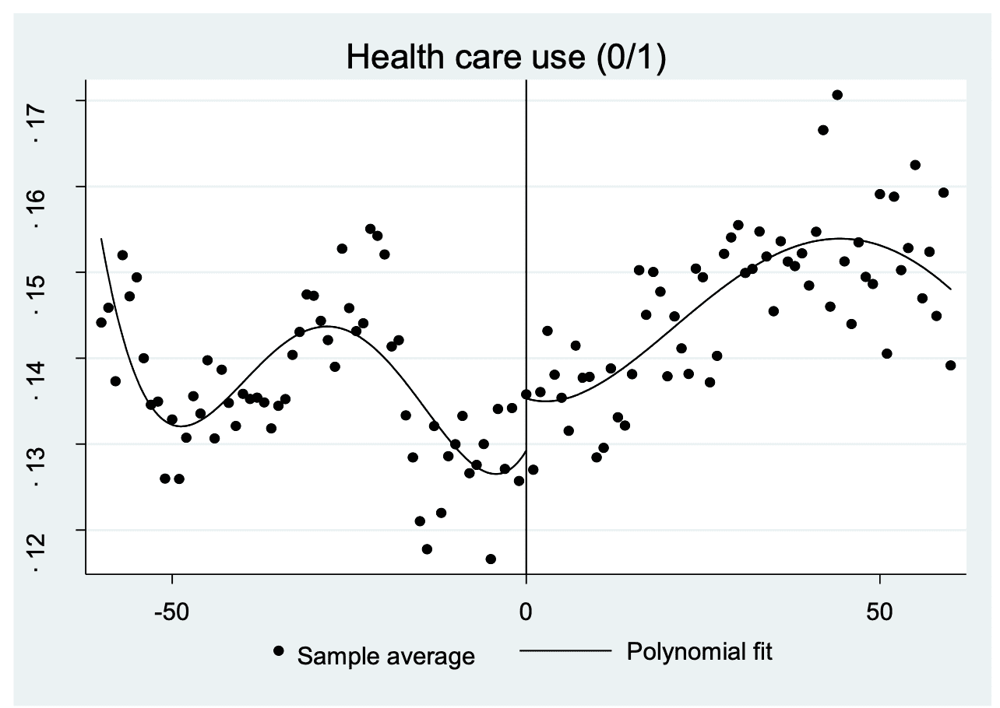
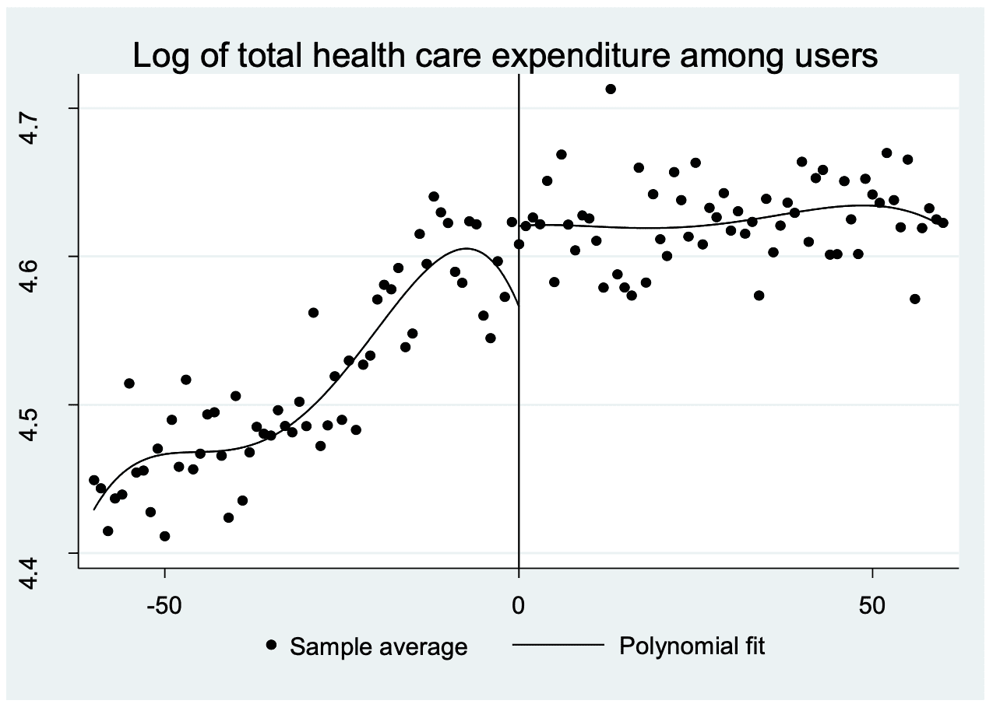
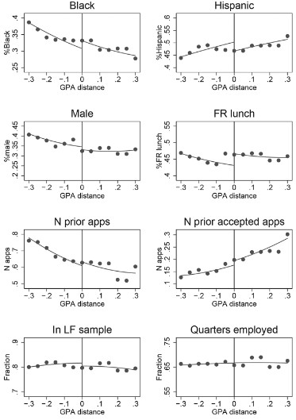

```{css, echo=FALSE}
@media print {
  .has-continuation {
    display: block !important;
  }
}
pre {
  max-height: 350px;
  overflow-y: auto;
}

pre[class] {
  max-height: 100px;
}
```

```{r setup, include=FALSE}
options(htmltools.dir.version = FALSE) 
knitr::opts_chunk$set(echo = TRUE, warning = FALSE, message = FALSE, cache=TRUE, fig.width = 8, fig.height = 6, fig.align='center')
if (!require("pacman")) install.packages("pacman")

pacman::p_load(tidyverse,gganimate,estimatr,magick,directlabels,ggthemes,fixest,jtools,rdrobust,rddensity,scales,Cairo)
theme_metro <- function(x) {
  theme_classic() + 
  theme(panel.background = element_rect(color = '#FAFAFA',fill='#FAFAFA'),
        plot.background = element_rect(color = '#FAFAFA',fill='#FAFAFA'),
        text = element_text(size = 16),
        axis.title.x = element_text(hjust = 1),
        axis.title.y = element_text(hjust = 1, angle = 0))
}
theme_void_metro <- function(x) {
  theme_void() + 
  theme(panel.background = element_rect(color = '#FAFAFA',fill='#FAFAFA'),
        plot.background = element_rect(color = '#FAFAFA',fill='#FAFAFA'),
        text = element_text(size = 16))
}
theme_metro_regtitle <- function(x) {
  theme_classic() + 
  theme(panel.background = element_rect(color = '#FAFAFA',fill='#FAFAFA'),
        plot.background = element_rect(color = '#FAFAFA',fill='#FAFAFA'),
        text = element_text(size = 16))
}

setFixest_dict(c('above_cutTRUE'='Above Cut','treatmentTRUE'='Treatment','treatedTRUE'='Treated','X_center:treatmentTRUE'='X_center x Treatment','treatedTRUE:I(X_centered^2)'='Treated x X_centered squared'))
setFixest_etable(digits=2,fitstat="n")
```

# Table of contents

- [Prologue](#prologue)

- [Regression Discontinuity](#rdd)
  - [Fitting Lines in RDD](#fitlines)
  - [Overfitting](#careful)
  - [Assumptions](#assumptions)

- [RDD Challenges](#rdd-challenges)

- [Appendix](#appendix)

  - [Fuzzy RDD](#fuzzy-rdd) (if time)
  - [How the pros do it](#how-the-pros-do-it) (if time)

---
name: prologue
class: inverse, center, middle

# Prologue

---

# Prologue

- We've covering difference-in-differences, which is one way of estimating a causal effect using observational data

- DID is *very* widely applicable, but it relies on strong assumptions like parallel trends

- Today we'll cover another causal inference method: Regression Discontinuity
  - This method can sometimes be easier to defend
  - But it is rarer to find situations where it applies
  - There's also plenty of room for "snake oil" here as with all causal inference

- Today I intentionally use simulated data to illustrate concepts to simplify the presentation

- But the fundamentals are the same no matter what you're studying and I don't want that lost in the econometric sauce

- As always, there's a ton here and we're just scratching the surface

---
name: rdd
class: inverse, center, middle

# Regression Discontinuity

---
# Line up in height order

1. Line up in height order

2. Those below the median height get a pill to increase their basketball ability

3. Those above the median height don't

4. We want to know the effect of the pill on free throw percentage

- Can we compare the average height of the treated and untreated groups after a year?

--

- Nope! Heights and the rate of growth is different for other reasons than the pill

- But what if we compared people right around 5'6"? They're basically the same, except for random chance

---

# Regression Discontinuity

The basic idea is this:

- We look for a treatment that is assigned on the basis of being above/below a *cutoff value* of a continuous variable

- For example, if your GPA exceeds a 3.0 in Florida, you're more likely to attend college (Zimmerman, 2014),

- Or if you are just on one side of a time zone line, your day starts one hour earlier/later

- Or if a candidate gets 50.1% of the vote they're in, 40.9% and they're out

- Or if you're 65 years old you get Medicare, if you're 64.99 years old you don't

- Class size must be below 40 students, so there are small classes when a grade reaches 41, 81, 121, etc. students

We call these continuous variables "Running variables" because we *run along them* until we hit the cutoff

---
# Running variables

There is a relationship between an outcome (Y) and a running variable (X)

There is also a treatment that triggers if $X< c$, a cutoff.

- Let's do the wrong thing

1. Assign $Treatment = 1$ if running variable above $c$ and $Treatment = 0$ if below

2. Regress $y = \beta_0 + \beta_1 Treatment + \varepsilon$

3. Get a biased estimate. Why?

--

- The running variable is omitted, so we have endogeneity! 

  - e.g. Older people receive Medicare, but they're also more likely to be sick
  - Shoot! Our treatment is endogenous! We have to control for the running variable

---
# Regression Discontinuity

- So what does this mean?

- If we can control for the running variable *everywhere except the cutoff*, then...

  - We will be controlling for the running variable, removing endogeneity

  - But leaving variation at the cutoff open, allowing for variation in treatment

- We focus on variation around the treatment, zooming in so sharply that it's basically controlled for. 
  - Then the effect of cutoff on treatment is like an experiment!

- How so? 

  - If your $GPA>3$, you're more likely to attend college, but also more likely to excel otherwise

---

# Regression Discontinuity

- The idea is that *right around the cutoff*, treatment is randomly assigned

- If you have a GPA over 2.99 (below standard FIU admission), you're basically the same as someone who has a GPA of 3.01 (just barely high enough)

- So if we just focus around the cutoff, we remove endogeneity because it's basically random which side of the line you're on

- But we get variation in treatment!

- This specifically gives us the effect of treatment *for people who are right around the cutoff* a.k.a. a "local average treatment effect" 
  - We don't know the effect of being in college for someone with a GPA of 2.0

---
# Terminology

- Some quick terminology before we go on

1. **Running Variable**: The continuous variable that triggers treatment, sometimes called the **forcing variable**

2. **Cutoff**: The value of the running variable that triggers treatment

3. **Bandwidth**: The range of the running variable we use to estimate the effect of treatment -- do we look at everyone within .1 of the cutoff? .5? 1? The whole running variable? 

---

# Regression Discontinuity

- A very basic idea of this, before we even get to regression, is to create a *binned scatterplot* 

- And see how the bin values jump at the cutoff

- A binned chart chops the Y-axis up into bins

- Then takes the average Y value within that bin. That's it!

- Then, we look at how those X bins relate to the Y binned values. 

- If it looks like a pretty normal, continuous relationship... then JUMPS UP at the cutoff X-axis value, that tells us that the treatment itself must be doing something!

---

# Regression Discontinuity

```{r rdd-gif, echo=FALSE}
df <- data.frame(xaxisTime=runif(300)*20) %>%
  mutate(Y = .2*xaxisTime+3*(xaxisTime>10)-.1*xaxisTime*(xaxisTime>10)+rnorm(300),
         state="1",
         groupX=floor(xaxisTime)+.5,
         groupLine=floor(xaxisTime),
         cutLine=rep(c(9,11),150)) %>%
  group_by(groupX) %>%
  mutate(mean_Y=mean(Y)) %>%
  ungroup() %>%
  arrange(groupX)


dffull <- rbind(
  #Step 1: Raw data only
  df %>% mutate(groupLine=NA,cutLine=NA,mean_Y=NA,state='1. Start with raw data.'),
  #Step 2: Add Y-lines
  df %>% mutate(cutLine=NA,state='2. Figure out how Y is explained by Running Variable.'),
  #Step 3: Collapse to means
  df %>% mutate(Y = mean_Y,state="3. Keep only what's explained by the Running Variable."),
  #Step 4: Zoom in on just the cutoff
  df %>% mutate(mean_Y = ifelse(xaxisTime > 9 & xaxisTime < 11,mean_Y,NA),Y=ifelse(xaxisTime > 9 & xaxisTime < 11,mean_Y,NA),groupLine=NA,state="4. Focus just on what happens around the cutoff."),
  #Step 5: Show the effect
  df %>% mutate(mean_Y = ifelse(xaxisTime > 9 & xaxisTime < 11,mean_Y,NA),Y=ifelse(xaxisTime > 9 & xaxisTime < 11,mean_Y,NA),groupLine=NA,state="5. The jump at the cutoff is the effect of treatment."))


p <- ggplot(dffull,aes(y=Y,x=xaxisTime))+geom_point()+
  geom_vline(aes(xintercept=10),linetype='dashed')+
  geom_point(aes(y=mean_Y,x=groupX),color="red",size=2)+
  geom_vline(aes(xintercept=groupLine))+
  geom_vline(aes(xintercept=cutLine))+
  geom_segment(aes(x=10,xend=10,
                   y=ifelse(state=='5. The jump at the cutoff is the effect of treatment.',
                            filter(df,groupLine==9)$mean_Y[1],NA),
                   yend=filter(df,groupLine==10)$mean_Y[1]),size=1.5,color='blue')+
  scale_color_colorblind()+
  theme_metro_regtitle() +
  scale_x_continuous(
    breaks = c(5, 15),
    label = c("Untreated", "Treated")
  )+xlab("Running Variable")+
  labs(title = 'The Effect of Treatment on Y using Regression Discontinuity \n{next_state}')+
  transition_states(state,transition_length=c(6,16,6,16,6),state_length=c(50,22,12,22,50),wrap=FALSE)+
  ease_aes('sine-in-out')+
  exit_fade()+enter_fade()

animate(p,nframes=175)
```

---
name: fitlines
# Fitting Lines in RDD

- Looking only at the cutoff ignores useful information from data further away

- Data away from the cutoff helps predict values at the cutoff more accurately

- Simplest approach uses OLS with an interaction term

$$Y = \beta_0 + \beta_1Treated + \beta_2XCentered + \beta_3Treated\times XCentered + \varepsilon$$

--

- First, we need to *transform our data*:
  - Create a "Treated" variable when treatment is applied (one side of cutoff)
  - Then, we are going to want a bunch of things to change at the cutoff. 

- This will be easier if the running variable is *centered around the cutoff*.

- So we'll turn our running variable $X$ into $X - cutoff$ and call that $XCentered$

```{r cutoff, eval = FALSE}
cutoff = .5
df <- df %>%
  mutate(treated = X >= cutoff,
         X_centered = X - cutoff) # center at cutoff
```

---
# Centering the Running Variable

Why do we center the running variable (subtract the cutoff)?

1. **Direct Treatment Effect Interpretation**
  - Without centering: intercept = outcome at X = 0 (usually meaningless)
  - With centering: intercept = treatment effect at the cutoff
  
2. **Numerical Stability with Polynomials**
  - Uncentered $X^2$: values get very large
  - Centered $(X-c)^2$: values stay closer to zero
  
3. **Clearer Interactions**
  - $\beta_1$: "jump" exactly at cutoff
  - $\beta_3$: how treatment effect changes away from cutoff

---

# Varying Slope

- Let the slope vary to either side, i.e. fit a different regression on each side of the cutoff

- We can do this by interacting both running variable and intercept with $Treated$!
  - $\beta_1$ estimates the intercept jump at treatment (RDD effect), $\beta_3$ is the slope change.<sup>1</sup>

$$Y = \beta_0 + \beta_1Treated + \beta_2XCentered + \beta_3Treated\times XCentered + \varepsilon$$

```{r data,echo=FALSE}
set.seed(2000)
treatment = .7
df <- tibble(X = runif(1000)) %>%
  mutate(treated = X > .5) %>%
  mutate(X_centered = X - .5) %>%
  mutate(Y = X_centered + treatment*treated + .5*X_centered*treated + rnorm(1000,0,.3))
```
```{r fixest}
etable(feols(Y ~ treated*X_centered, data = df,fitstat='N',vcov='HC1')) # True treatment is 0.7
```

.footnote[<sup>1</sup> Sometimes the change in slope is the effect of interest -- this is called a "regression kink" design, which measures how the relationship between $X$ and $Y$ changes at the cutoff.]

---
# Fitting Lines in RDD

- Visualizations can help! What's going on here?

```{r linear-fit, echo=FALSE,fig.caption="Linear fit exaggerates the jump",warning=FALSE}
set.seed(123)
cutoff_df <- tibble(Z = runif(10000)) %>%
    mutate(
        # Generate potential outcomes
        Y.without.X = rnorm(10000, mean = 0, sd = 1 + abs(Z - 0.7)) + 
               ifelse(Z > 0.7, 
                     -15*(Z-0.7)^2 + 2*(Z-0.7),  
                     20*(Z-0.7)^2 + 5*(Z-0.7)),
        Y.with.X = Y.without.X + 1,
        # Assign treatment based on cutoff
        X = ifelse(Z > .7, 1, 0),
        Zc=Z-0.7,
        # Observe only one potential outcome
        Observed.Y = ifelse(X==1, Y.with.X, Y.without.X))
# Fit linear model to get RDD estimate
model <- feols(Observed.Y ~ csw(X*Zc+X,X*Zc^2), data = cutoff_df)
# Get the coefficients
linear_intercept <- coef(model[rhs=1])["(Intercept)"]
linear_effect <- coef(model[rhs=1])["X"]

below_cutoff_linear = as.numeric(linear_intercept)
above_cutoff_linear = as.numeric(linear_intercept) + as.numeric(linear_effect)

# multiply coefficients by .69

p1<-ggplot(cutoff_df, aes(x = Z, y = Observed.Y)) +
  geom_point(alpha=0.1) +
  geom_smooth(aes(color = factor(X)), method = "lm", se = FALSE) +
  geom_vline(xintercept = 0.7, linetype = "dashed") +
  labs(title = "Linear fit exaggerates the jump",
       color = "Treatment") +
  theme_metro()
  
p1 + geom_segment(aes(x = .7, xend = .7, y = below_cutoff_linear, yend = above_cutoff_linear), color = 'blue', size = 2) +
  annotate("text", x = 0.7, y = 4, 
           label = paste0('Linear Effect=',round(linear_effect,2)),
           color = 'blue', size = 16/.pt,hjust=1.05)
```


---
# Non-linearities

- Key Point: The functional form matters! 

```{r quad-fit, echo=FALSE,fig.caption="Quadratic fit captures true relationship",warning=FALSE}
p1+geom_smooth(aes(color = factor(X)), method = "lm", se = FALSE, formula = y ~ poly(x, 2)) +
  labs(title = "Quadratic fit captures true relationship") +
  geom_segment(aes(x = .7, xend = .7, y = 0, yend = 1), color = 'blue', size = 2) + 
  annotate("text", x = 0.7, y = 4, 
           label = paste0('Quadratic Effect=',1),
           color = 'blue', size = 16/.pt,hjust=1.05)
```


---

# Polynomial Terms

- We can add quadratic (or higher-order) terms to better fit curved relationships
- Key points:
  1. Center X (as before)
  2. Add squared terms: $(X-c)^2$
  3. Interact everything with treatment
- Keep it simple: you could overfit with more complex polynomials
  - Squares are usually enough -- though there's a subfield dedicated to optimizing polynomial terms
  - The "jump" at cutoff is still our RDD estimate

$$Y = \beta_0 + \beta_1XC + \beta_2XC^2 + \beta_3Treated + \beta_4Treated\times XC + \beta_5Treated\times XC^2 + \varepsilon$$

```{r polynomial}
etable(feols(Y ~ X_centered*treated + I(X_centered^2)*treated, data = df,vcov='HC1'))
```

---
name: careful
# Careful with higher order polynomials

- Sometimes higher order polynomials can be a little too flexible and make it look like there's an effect where there isn't one
- "Overfitting" where your model too flexibly follows the data points can lie to you! 

.pull-left[
```{r gullible_top, echo=FALSE, out.width="90%", fig.cap="Health care use (0/1)", fig.align="center"}

```
]
.pull-right[
```{r gullible_bot, echo=FALSE, out.width="90%", fig.cap="Log of total health care expenditure among users", fig.align="center"}

```
]

.footnote[Running variable is age with cutoff at age 20 (voting eligibility). Chang & Meyerhoefer (2020) on whether voting makes you sick via [Andrew Gelman](https://statmodeling.stat.columbia.edu/2020/12/27/rd-gullible/)]

---
name: assumptions
# Assumptions

- There must be some assumptions lurking around here
- Some are more obvious (we use the correct functional form)
<br>

- Others are trickier. What are we assuming about the error term and endogeneity here?
- Specifically, we are assuming that *the only thing jumping at the cutoff is treatment*
- Sort of like parallel trends, but maybe more believable since we've narrowed in so far
<br>

- For example, if earning below 150% of the poverty line gets food stamps AND job training, then we can't isolate the effect of just food stamps
  - Or if the proportion of people who are self-employed jumps up just below 150% (based on *reported* income), that's endogeneity!
<br>

- The only thing different about just above/just below should be treatment

---

# Graphically

```{r rdd-graph,  echo=FALSE}
df <- data.frame(X = runif(1000)+1,Treatment=as.factor("Untreated"),time="1") %>%
  mutate(Y = X + rnorm(1000)/6) 

cutoff <- 1.75

#Add step 2 in which X is demeaned, and 3 in which both X and Y are, and 4 which just changes label
dffull <- rbind(
  #Step 1: Untreated only
  df %>% mutate(time="1. If NOBODY got treatment, looks smooth."),
  #Step 2: Treated only only
  df %>% mutate(Y= Y + .25,Treatment="Treated",time="2. If EVERYBODY got treatment, looks smooth."),
  #Step 3: And the jump
  df %>% mutate(Y=ifelse(X > cutoff,Y+.25,Y),Treatment = ifelse(X>cutoff,"Treated","Untreated"),time='3. Observed! Jump only BECAUSE of treatment')
)

p <- ggplot(dffull,aes(y=Y,x=X,color=Treatment))+geom_point()+
  geom_smooth(aes(x=X,y=Y,group=Treatment),method='lm',col='red',se=FALSE)+
  geom_vline(aes(xintercept=cutoff),col='black',linetype='dashed',size=1.5)+
  scale_color_colorblind()+
  theme_metro_regtitle() +
  labs(title = 'Checking for Smoothness in Potential Outcomes at the Cutoff \n{next_state}',
       x="Test Score (X)",
       y="Outcome (Y)")+
  transition_states(time,transition_length=c(12, 12, 12),state_length=c(100,100,100),wrap=FALSE)+
  ease_aes('linear')+
  exit_fade()+enter_fade()

animate(p,nframes=160)
```

---
name: rdd-challenges
class: inverse, center, middle

# RDD Challenges

---

# Windows

- The basic idea of RDD is that we're interested in *the cutoff*

- The points away from the cutoff are only useful to help predict values at the cutoff

- Do we really want that full range? Is someone's test score of 30 really going to help us much in predicting $Y$ at a test score of 89?

- So we might limit our analysis within just a narrow window around the cutoff, just like that initial animation we saw!

- This makes the exogenous-at-the-jump assumption more plausible, and lets us worry less about functional form (over a narrow range, not too much difference between a linear term and a square), but on the flip side reduces our sample size considerably

---

# Windows

- Pay attention to the sample sizes, accuracy (true value .7) and standard errors!

```{r windows, echo=FALSE}
set.seed(2000)
df <- tibble(X = runif(1000)) %>%
  mutate(treated = X > .5) %>%
  mutate(X_centered = X - .5) %>%
  mutate(Y = X_centered + .7*treated + .5*X_centered*treated + rnorm(1000,0,.3))
```

```{r windows-models}
m1 <- feols(Y~treated*X_centered, data = df)
m2 <- feols(Y~treated*X_centered, data = df %>% filter(abs(X_centered) < .25))
m3 <- feols(Y~treated*X_centered, data = df %>% filter(abs(X_centered) < .1))
m4 <- feols(Y~treated*X_centered, data = df %>% filter(abs(X_centered) < .05))
m5 <- feols(Y~treated*X_centered, data = df %>% filter(abs(X_centered) < .01))

etable(list('All'=m1,'|X|<.25'=m2,'|X|<.1'=m3,'|X|<.05'=m4,'|X|<.01'=m5),
  fitstat='N',vcov='HC1',keep='Treated$',se.below=TRUE) # robust standard errors
```

---

# Granular Running Variable

- We assume that the running variable varies more or less *continuously*

- That makes it possible to have, say, a test score of 89 compared to a test score of 90 it's almost certainly the same as except for random chance

- But what if our data only had test score in big chunks? i.e. I just know those earning "80-89" or "90-100"

  - Much less believable that groups only separated by random chance

- There are some fancy RDD estimators that allow for granular running variables

- But in general, if this is what you're facing, you might be in trouble

- Before doing an RDD, ask: 
  - Is it plausible that someone with the highest value just below the cutoff, and someone with the lowest value just above the cutoff are only at different values because of random chance?

---
# Looking for Lumping

- Ok, now let's go back to our continuous running variables

- What if the running variable is *manipulated*?

  - Imagine you're a teacher you learn a "B-student" needs a B+ for a 3.0 and admitted to FIU, you might fudge the numbers a bit

- Suddenly, that treatment is a lot less randomly assigned around the cutoff!

- If there's manipulation of the running variable around the cutoff, we can often see it in the presence of *lumping*

  - i.e. if there's a big cluster of observations to one side of the cutoff and a seeming gap missing on the other side

- "Bin" the running variable and plot a histogram of it to check for clustering at the cutoff

---

# Testing for Manipulation
- McCrary test checks if people manipulate the running variable
- Key idea: The density should be smooth at the cutoff: sharp change = 🚩 

```{r rdplot,fig.cap="McCrary test implemented with `rdplot` from the `rddensity` package", out.height="40%"}
mccrary <- rddensity(df$X_centered)
rdplotdensity(mccrary,df$X_centered)
```


---
# Placbo Tests for Lumping

.pull-left[

- Check if variables *other than treatment or outcome* vary at the cutoff

- We can do this by re-running our RDD but switching our outcome with another variable

- If we get a significant jump, that's bad! That tells us that *other things are changing at the cutoff* which implies some sort of manipulation (or just super lousy luck)

- If all placebo tests are passed, that's great, but doesn't prove zero manipulation
]

.pull-right[

<div class="footnote" style="font-size:80%">Placebo balance tests from Zimmerman (2014)</div>
]

---

# That's it!

- That's what we have for RDD

- Go explore the regression discontinuity activity on class sizes

- There's more neat details in the appendix -- check it out if you're curious!
  - If we have time, I'll show you how to do this stuff!

---
name: appendix
class: inverse, center, middle

# Appendix

---
name: fuzzy-rdd
class: inverse, center, middle

# Fuzzy Regression Discontinuity and RDD Standard Errors

---

# Fuzzy Regression Discontinuity

- So far, we've assumed that you're either on one side of the cutoff and untreated, or the other and treated

- What if it isn't so simple? What if the cutoff just *increases* your chances of treatment?

- For example, what if 30% of schools with fewer than 40 students make smaller classrooms for whatever reason
  - It can get more complicated than this -- it always can

- This is a "fuzzy regression discontinuity" (yes, that does sound like a bizarre Sesame Street episode)

- Now, our RDD will understate the true effect, since it's being calculated on the assumption that we added treatment to 100% of people at the cutoff, when really it's 70%. So we'll get roughly only about 70% of the effect

---

# Fuzzy Regression Discontinuity

- We can account for this with a model designed to take this into account

- Specifically, we can use something called two-stage least squares (or Wald instrumental variable estimator) to handle these sorts of situations

- Basically, two-stage least squares estimates how much the chances of treatment go up at the cutoff, and scales the estimate by that change

- So it would take whatever result we got on the previous slide and divide it by 0.7 (the increased in treated share) to get the true effect

---
# Fuzzy Regression Discontinuity

First let's make some fake data:

```{r fuzzy-fake-data}
set.seed(1000)
df <- tibble(X = runif(1000)) %>%
  mutate(treatassign = .05 + .3*(X > .5)) %>%
  mutate(rand = runif(1000)) %>%
  mutate(treatment = treatassign > rand) %>%
  mutate(Y = .2 + .4*X + .5*treatment + rnorm(1000,0,0.3)) %>% # True effect .5
  mutate(X_center = X - .5) %>%
  mutate(above_cut = X > .5)
```

---

# Fuzzy Regression Discontinuity

- Notice that the y-axis here isn't the outcome, it's "proportion treated"

```{r fuzzy-rdd, echo = FALSE}
df %>%
  mutate(X_bins = cut(X, breaks = 0:10/10)) %>%
  group_by(X_bins) %>%
  summarize(n = mean(treatment)) %>%
  ggplot(aes(x = X_bins, y = n)) + 
  geom_col() + 
  labs(x = "X", y = "Proportion Treated") + 
  theme_metro_regtitle() + 
  theme(axis.text.x = element_text(angle = 90)) + 
  geom_vline(aes(xintercept = 5.5), linetype = 'dashed')
```

---

# Fuzzy Regression Discontinuity

- We can perform this using the instrumental-variables features of `feols`

- The first stage is the interaction between the running variable and whether treated regressed on the interaction of the running variable and the "sharp" cutoff

- `feols(outcome ~ controls  | XC*treated ~ XC*above_the_cutoff)`

---

# Fuzzy Regression Discontinuity

- (the true effect of treatment is .5 - okay, it's not perfect)

```{r fuzzy-rdd-pred, echo = TRUE}
predict_treatment <- feols(treatment ~ X_center*above_cut, data = df)
without_fuzzy <-feols(Y ~ X_center*treatment, data = df)
fuzzy_rdd <- feols(Y ~ 1 | X_center*treatment ~ X_center*above_cut, data = df)
etable(predict_treatment, without_fuzzy, fuzzy_rdd, 
  dict=c('above_cutTRUE'='Above Cut','treatmentTRUE'='Treatment'))
```

---
# Standard Errors in RDD

- Oftentimes the error term is likely correlated with the running variable

- People tend to use "robust" standard errors, `vcov='HC1'` in R or `, r` in Stata

- Other times, it makes sense to clustered standard errors by a running variable bin

```{r robust-standard-errors,echo=FALSE,out.width='90%'}
set.seed(123)
n=1000
rdplot_df <- tibble(X = runif(n)) %>%
  mutate(treated = X > 0.5) %>%
  mutate(X_centered = X - 0.5) %>%
  mutate(
    # Generate outcome variable with continuously varying heterogeneity in standard deviations
    Y = X_centered + treated + 0.5 * X_centered * treated +
      rnorm(n, 0, .1) * (1 + abs(X_centered)*10) # Varying standard deviation based on distance from cutoff
  )

ggplot(rdplot_df, aes(x = X, y = Y,group=treated)) +
  geom_point() +
  geom_vline(xintercept = .5, col = 'black', linetype = 'dashed', size = 1.5) +
  geom_smooth(method = 'lm', color = 'red', se = FALSE, size = 1.5) + 
  theme_metro()
  labs(title = 'Heterogeneous errors', x = 'X', y = 'Y') 
```

---
name: how-the-pros-do-it
class: inverse, center, middle

# How professionals do it

---

# How professionals do it

- We've gone through all kinds of procedures for doing RDD in R already using regression

- But often, professional researchers won't do it that way because it's a bit too easy to mess up details

- Instead, they use packages like **rdrobust** (available in R, Stata, and Python) and written by a team of econometricians

- It abstracts the tedious stuff, like bandwidth selection and standard errors, and gives you loads of customization options for your RDD

- In general, packages like these written by experts who are well-published in discussing a method are a good idea to try

---
# RDrobust

- There are three major functions in RD robust:

1. `rdrobust()` - the main estimation approach, it returns info about the regression and you can customize a variety of complex RD stuff
2. `rdplot()` - a plotting function that shows the jump at the cutoff and let's you customize much of the complexities
3. `rdbwselect()` - a bandwidth selection tool that helps you pick the best bandwidth for your RDD

---

# Basics of **rdrobust**

- We can specify an RDD model by just telling it the dependent variable $Y$, the running variable $X$, and the cutoff $c$.

- We can also specify how many polynomials to use with `p`, defaults to 1
  - (it applies the polynomials more locally than our linear OLS models do - a bit more flexible)

- Use `c` to specify the cutoff (no need to center the running variable manually)

- Pick the bandwidth with `h` or use a data-driven technique with `rdbwselect()`

- Including a `fuzzy` option to specify actual treatment outside of the running variable/cutoff combo

- And many other options

- But output is pretty nasty, so you'll need to do some work to get it into a readable format

---

# rdrobust

```{r rdrobust, echo = TRUE}
summary(rdrobust(df$Y, df$X, c = .5))
```

---

# rdrobust

```{r rdrobust-fuzzy, echo = TRUE}
summary(rdrobust(df$Y, df$X, c = .5, fuzzy = df$treatment))
```

---

# rdrobust

- We can even have it automatically make plots of our RDD! Same syntax

```{r rdrobust-plots, echo = TRUE}
rdplot(df$Y, df$X, c = .5)
```


```{r gen_pdf, include = FALSE, cache = FALSE, eval = TRUE}
infile=knitr::current_input() %>% stringr::str_replace('.Rmd', '.html')
print(infile)
pagedown::chrome_print(input = infile, timeout = 100)
```
