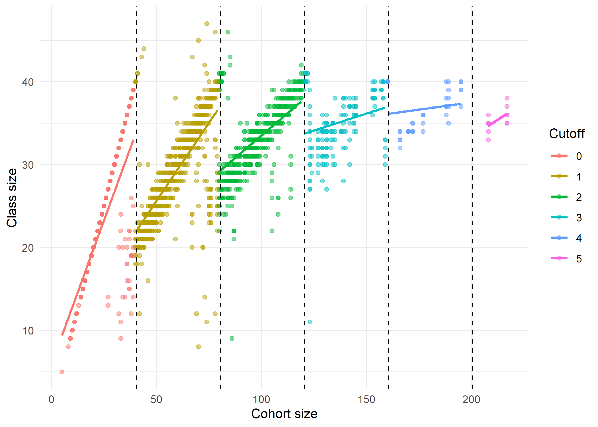
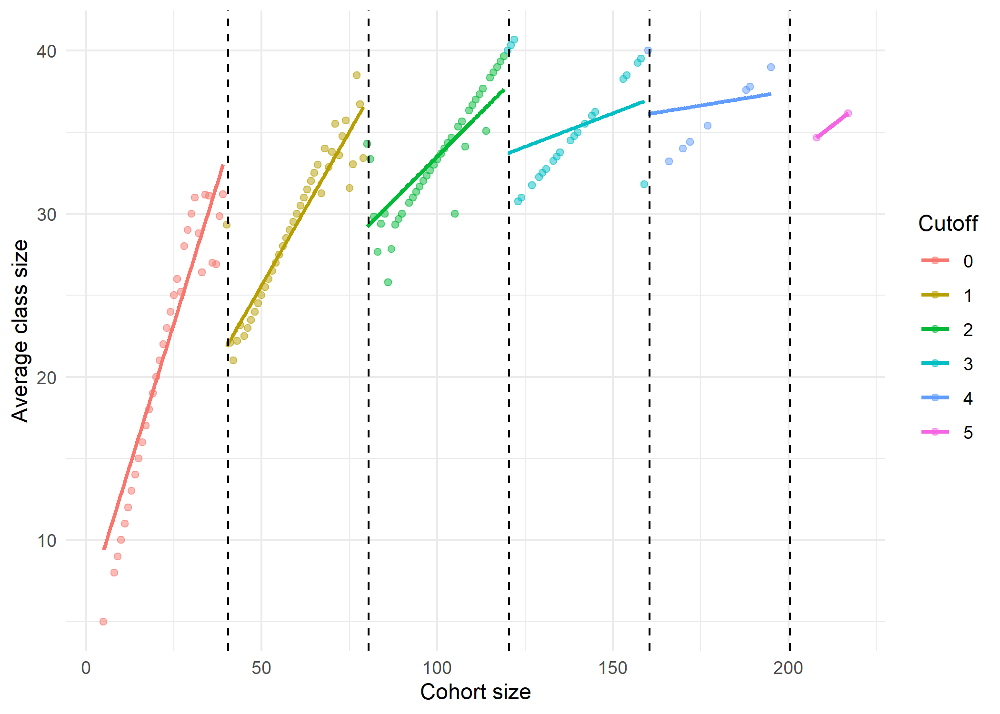
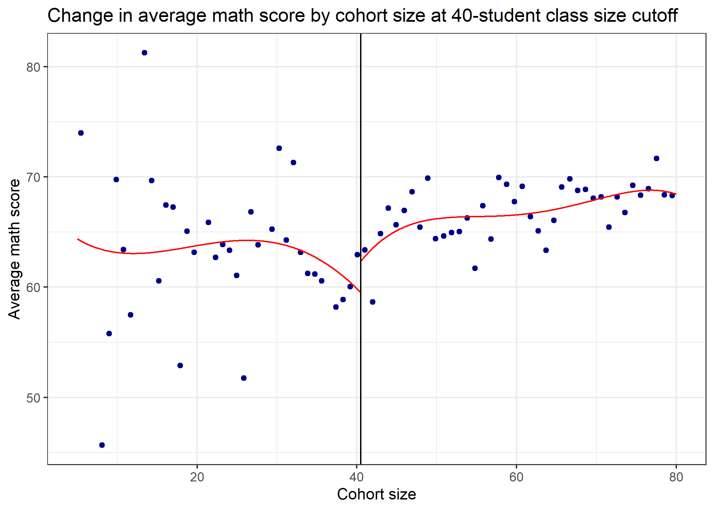
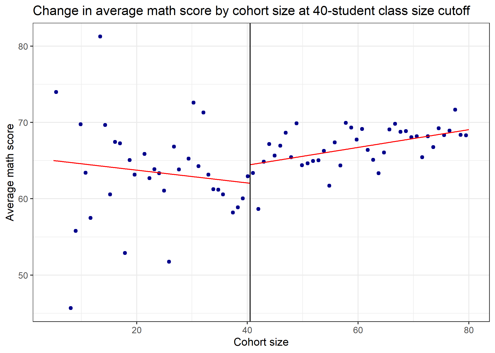
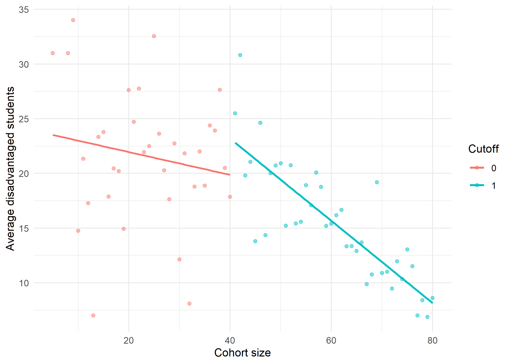
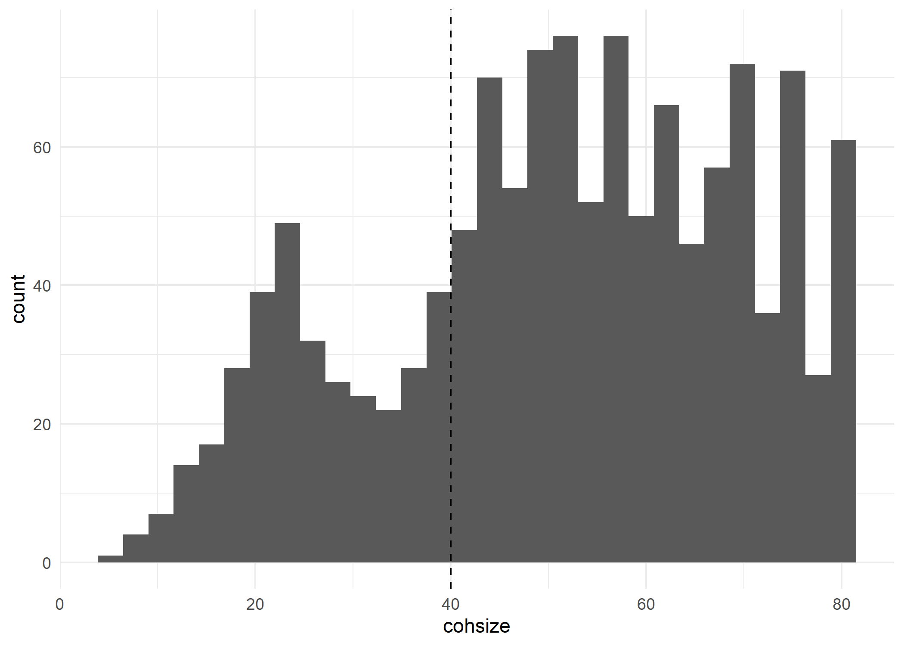
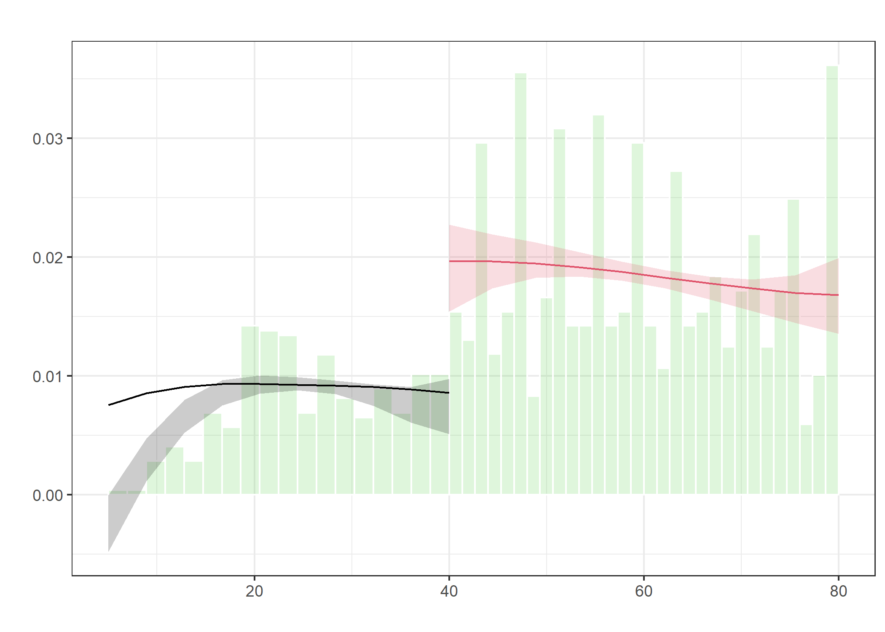
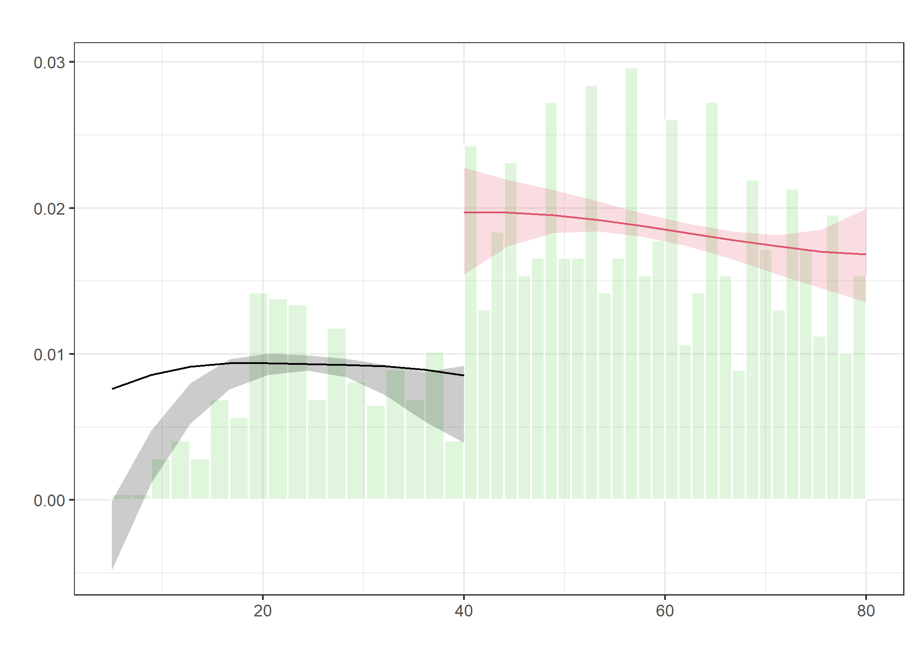

## Software requirements

### R packages 

It's important to note that "base" R already provides all of the tools to implement a regression discontinuity design, but there are some great other tools to use!

- New: **rdrobust**, **rddensity**
- Already used: **tidyverse**, **fixest**, **haven**

A convenient way to install (if necessary) and load everything is by running the below code chunk.


```r
## Load and install the packages that we'll be using today
if (!require("pacman")) install.packages("pacman")
pacman::p_load(rdrobust,rddensity,fixest,haven,tidyverse)

## My preferred ggplot2 plotting theme (optional)
theme_set(theme_minimal())
```


# Quick overview

In this activity, we will walk through using different tools to create visual evidence of an RDD design and then estimate the effect at the cutoff. 

# Regression Discontinuity Design 

Recall, an RDD design is a quasi-experimental design that exploits a discontinuity in the assignment of a treatment to estimate the causal effect of the treatment. Basically, we are looking for a "jump" in the outcome variable at a cutoff point in some running variable that is plausibly exogenous to the treatment. 

## Example: Class sizes and student achievement

We are going to use a dataset of class sizes taken from Israel in the 1990s. The data are from [Angrist and Lavy (1999)](https://www.jstor.org/stable/117148?seq=1#metadata_info_tab_contents) and are available in Stata format at the [Angrist Data Archive](https://economics.mit.edu/people/faculty/josh-angrist/angrist-data-archive).


```r
class5 <- haven::read_dta(
    'https://economics.mit.edu/sites/default/files/inline-files/final5.dta',
    col_select = c('schlcode','classize','cohsize','avgmath','avgverb','tipuach')
    )
```

The data are at the classroom level. I read in the school ID, class size, cohort size, average math score, average verbal score, and number of students qualifying as "disadvantaged."

Note, there is some messiness in the big dataset! This is because they converted over from SAS to Stata and that conversation was not perfect. 

### Maimonides' rule and class sizes
A little about these data, they come from schools in Israel that implement Maimonides' rule. Maimonides was a 12th-century rabbinic scholar who noted a correlation between class size and achievement. He created a rule stating that there should be no class size larger than 40. So if a school has more than 40 students in a grade, they should split the grade into tw classeso. This somewhat arbitrary cutoff point means that class size is determined by school size. 

# Implementing RDD

Before we can implement RDD, we need to identify the cutoff point in the data. First, we need to identify a few things:

1. What is the treatment?
2. What is the running variable?
3. Where is treatment assigned within the running variable?


## Subsetting the data

Let's first subset to only schools with between 20 and 60 students in 5th grade, so we focus on ONE cutoff. Let's also create a variable for that cutoff.


```r
class5 <- mutate(class5,
  cutoff=floor(cohsize/40))

class5subset <- filter(class5, cohsize<=80) %>%
  mutate(cutoff=ifelse(cohsize>40,1,0))
```

# Plotting RDDs

## Checking treatment assignment with a scatterplot

First, let's check how well class size changes as cohort size crosses thresholds at every 40 students! This shows that more or less class size grows up until 40 students, then drops down to about 20 students when the cohort exceeds 40 students. I keep standard errors off because they need to be calculated using a specific calculation --  

Also, the data look a little funny -- there are a bunch of vertical lines at each class size. What gives? 


```r
ggplot(class5,
  aes(x=cohsize,y=classize,color=as.factor(cutoff)))+
  geom_point(alpha=0.5)+
  geom_smooth(method='lm',se=FALSE) +
  labs(x='Cohort size',y='Class size',color='Cutoff') +
  geom_vline(xintercept = seq(from=40.5,to=200.5,by=40), 
    linetype='dashed')
```

```
## `geom_smooth()` using formula = 'y ~ x'
```

<!-- -->

The vertical stacking is because there are many different schools with each cohort size and they don't all split classes equally (though most do.)

## Making binned scatter plots

To more smoothly plot the data, I will make a binned scatterplot. This will plot the average class size for each cohort size. 


```r
ggplot(class5,aes(x=cohsize,y=classize,color=as.factor(cutoff)))+
  stat_summary(fun = "mean", geom = "point",alpha=0.5)+
  geom_smooth(method='lm',se=FALSE) +
  labs(x='Cohort size',y='Average class size',color='Cutoff') +
  geom_vline(xintercept = seq(from=40.5,to=200.5,by=40), 
    linetype='dashed')
```

```
## `geom_smooth()` using formula = 'y ~ x'
```

<!-- -->

# Outcome variables using **rdrobust**

Now, let's look at the outcome variables. Note that we could do the same thing as above, but I want to show you how to use the **rdrobust** package as well. I'll show you with average math score. 

First, we'll use `rdplot`. The syntax is relatively simple. The first argument `y` is the outcome variable, `x` is the running variable, and `c` is the cutoff. `p` is the polynomial order, i.e. do you try to estimate a linear, quadratic, cubic, or higher relationship on either side of the cutoff? `nbins` is the number of bins to use in the plot on either side of the cutoff.

There are a number of other more complicated options, but we'll stick with the basics. 

To simplify further, we are just going to look at the change around 40 students. 


```r
rdplot(y=class5subset$avgmath,
  x=class5subset$cohsize,
  c=40.5,
  nbins=c(40,40),
  x.label='Cohort size',
  y.label='Average math score',
  title='Change in average math score by cohort size at 40-student class size cutoff')
```

```
## [1] "Mass points detected in the running variable."
```

<!-- -->

## Polynomials

Wow, that made a weird looking dip-shape! What's going on? Well if you check the help documentation for `rdplot()`, it will tell you that the default for `p` is 4. So it is trying to estimate a 4th-order polynomial, that is: $ax+bx^2+cx^3+dx^4$. The red line makes the jump at the cutoff look very large because it is declining. This may be because we overfit the data! Let's check with just two straight lines, so `p=1`, for a linear relationship.


```r
rdplot(y=class5subset$avgmath,
  x=class5subset$cohsize,
  p=1,
  c=40.5,
  nbins=c(40,40),
  x.label='Cohort size',
  y.label='Average math score',
  title='Change in average math score by cohort size at 40-student class size cutoff')
```

```
## [1] "Mass points detected in the running variable."
```

<!-- -->

Hmm that looks a little cleaner. Not perfect, but better. 

### Challenge
Try to create a polynomial of order 2, 3, and 4 using **ggplot**. Hint: you'll need to use `geom_smooth()` argument and modify the `formula` argument. 

# Estimating the effect

Well let's estimate the actual effect of having a smaller class on average math scores.

It is helpful to reset the cohort size to be centered at the cutoff. This is because the default is to estimate the effect at the cutoff, so it is helpful to have the cutoff be at 0. It makes the math smoother.


```r
class5subset <- mutate(class5subset,
  center_size=cohsize-40,
  below40 = ifelse(classize<40,1,0))
```

What is an RDD estimating in its simplest term? 

$$
\begin{aligned}
y_i ~ \text{Cohort}_i + \text{Cutoff}_i + \text{Cohort}_i\times\text{Cutoff}_i + \varepsilon_i
\end{aligned}
$$

Well we could also estimate that ourselves using `feols()`. Note: I added the `cluster` argument to account for the fact that there are multiple observations per school and test score errors are likely clustered by school. 


```r
sharp <- feols(avgmath ~ center_size*cutoff, 
  data=class5subset,
  cluster=~schlcode) 
```

```
## NOTE: 1 observation removed because of NA values (LHS: 1).
```

```r
etable(sharp)
```

```
##                                 sharp
## Dependent Var.:               avgmath
##                                      
## Constant             62.07*** (1.278)
## center_size          -0.0838 (0.0805)
## cutoff                  2.331 (1.523)
## center_size x cutoff 0.2000* (0.0882)
## ____________________ ________________
## S.E.: Clustered          by: schlcode
## Observations                    1,265
## R2                            0.03703
## Adj. R2                       0.03474
## ---
## Signif. codes: 0 '***' 0.001 '**' 0.01 '*' 0.05 '.' 0.1 ' ' 1
```

## Fuzzy RDD

Above, we ran a regression looking for a sharp change in treatment at the cutoff. But wait a minute, what is the treatment? Class size. Does class size sharply change at the cutoff? Not exactly... 

Let's pause a minute and consider what we are estimating. The interesting effect is the change in test scores from the class size, but we are estimating the change in test scores from the cohort size. That's because the cohort size is the running variable. But the cohort size is not the treatment. The treatment is the class size, which drops at the cutoff for most, but _not all_ schools. Instead, the running variable changes the probability of treatment, which is called a _fuzzy_ RDD. 

We estimate a fuzzy RDD using an instrumental variables approach. Essentially, you estimate the treatment as a function of the running variable and then use the predicted values of the treatment as the treatment variable. 

_Note: The feols syntax for IVs is a little funky. Essentially, the second stage goes after the first |, then the outcome is regressed on 1 as a placeholder for the constant and the predicted value of the second stage._


```r
fuzzy <- feols(avgmath ~ 1 | center_size*below40 ~ center_size*cutoff, 
  data=class5subset,
  cluster=~schlcode) 
```

```
## NOTE: 1 observation removed because of NA values (LHS: 1).
```

```r
etable(sharp,fuzzy)
```

```
##                                 sharp            fuzzy
## Dependent Var.:               avgmath          avgmath
##                                                       
## Constant             62.07*** (1.278)    27.24 (23.38)
## center_size          -0.0838 (0.0805)  1.141* (0.5715)
## cutoff                  2.331 (1.523)                 
## center_size x cutoff 0.2000* (0.0882)                 
## below40                                  37.94 (23.61)
## center_size:below40                   -1.061. (0.5784)
## ____________________ ________________ ________________
## S.E.: Clustered          by: schlcode     by: schlcode
## Observations                    1,265            1,265
## R2                            0.03703         -0.09498
## Adj. R2                       0.03474         -0.09758
## ---
## Signif. codes: 0 '***' 0.001 '**' 0.01 '*' 0.05 '.' 0.1 ' ' 1
```

Here we see a weaker effect size than with the sharp RDD. 

## Advanced: Bandwidths with rdrobust

Above we estimated the change in the slope at the cutoff using all of the data. But we could also estimate the effect at the cutoff using only the data around the cutoff. That's actually what the "pros" do to to estimate regression discontinuity designs -- they zero in on the cutoff to get a highly precise estimate. At the same time, they lose a lot of observations. That creates a tradeoff. 

**rdrobust** provides the tool, `rdrobust()` that can be used to estimate the causal effect at the cutoff. The syntax is similar to `rdplot()`, but it also includes a number of bells and whistles to get the standard errors right and allow for various robustness checks (how many bins, how many polynomials, how are averages calculated within each bin, etc.) that are beyond the scope of this class.

`rdrobust` also allows you to specify the _bandwidth_ be specified. The bandwidth is the number of observations on either side of the cutoff to use in the estimation of a local polynomial regression. As you can imagine, there is a tradeoff here. The tighter the _bandwidth_, the more precise the estimate, but the fewer observations you have. There are tons of fancy tools for picking the bandwidth. 

This point is why RDD is often a big data tool -- you need a lot of observations on either side of the cutoff to get a precise estimate. 

The help documentation is very good, so I encourage you to check it out if you're curious. 


```r
rdrobust(y=class5subset$classize,
  x=class5subset$center_size,
  p=1,
  cluster=class5subset$schlcode,
  all=TRUE) %>% # Three separate estimation approaches used. 
  # Note that recentering enrollment at zero means we do not need to specify cutoff.
summary()
```

```
## Warning in rdrobust(y = class5subset$classize, x = class5subset$center_size, :
## Mass points detected in the running variable.
```

```
## Sharp RD estimates using local polynomial regression.
## 
## Number of Obs.                 1266
## BW type                       mserd
## Kernel                   Triangular
## VCE method                       NN
## 
## Number of Obs.                  315          951
## Eff. Number of Obs.              84          219
## Order est. (p)                    1            1
## Order bias  (q)                   2            2
## BW est. (h)                   8.320        8.320
## BW bias (b)                  13.655       13.655
## rho (h/b)                     0.609        0.609
## Unique Obs.                      33           41
## 
## =============================================================================
##         Method     Coef. Std. Err.         z     P>|z|      [ 95% C.I. ]       
## =============================================================================
##   Conventional    -5.865     3.526    -1.663     0.096   [-12.775 , 1.046]     
## Bias-Corrected    -5.346     3.526    -1.516     0.129   [-12.256 , 1.564]     
##         Robust    -5.346     4.330    -1.234     0.217   [-13.833 , 3.142]     
## =============================================================================
```

I output to `summary()` to get a cleaner table of results. The output is a little confusing and beyond the scope of this dataset and class. (We could spend weeks building the math skills needed to fully understand RDD estimation!) 

Note that the bandwidth is shrunk to just cohorts within 8.267 of the cutoff at 40! That's a pretty tight bandwidth and there are only 33 and 40 observations on either side. As a result, the change in average class size is estimated to only about 6 students and it is a very noisy effect. 

# "Mass points detected in the running variable"

You likely noticed that `rdplot()` warned you about mass points were detected in the running variable. This means that there are cohort sizes associated with many observations, i.e. a "mass" of observations. 
In some cases, mass points are fine. But in other cases, it can be a problem. Why?

A mass point means that there is a spike in observations at a certain point. If that spike in observations occurred one side of the cutoff, then that might suggest that there is something else going on. For example, if there is a spike in observations just below the cutoff, then that might suggest that schools are manipulating their enrollment to avoid the cutoff. If so, then the RDD design is not valid.

Why is the RDD invalid? Consider an example: a school is struggling financially. The principal wants to maximize enrollment without having to hire another teacher. So they enroll 39 students in 5th grade and only have one class. But how do think students perform in a financially-struggling school? Probably not great. So the outcome, a test score, is correlated with the level of the running variable right at the cutoff. In this case, that biases down the estimates. But one could easily craft stories going the other direction. 

What are some potential tests? First is to look for jumps in other cutoffs. Second is a McCrary Density test.

## Look at other variables

There are many varaibles to consider. Here we'll look at the number of disadvantaged students. Trying making that plot yourself first. 
.
.
.
.
.
.
.
.
.
.
.
.
.
.
.
.
.
.

```r
class5subset %>%
  group_by(cohsize,cutoff) %>%
  summarize(disadvantaged=mean(tipuach)) %>%
  ggplot(aes(x=cohsize,y=disadvantaged,color=as.factor(cutoff)))+
  geom_point(alpha=0.5)+
  geom_smooth(method='lm',se=FALSE) +
  labs(x='Cohort size',y='Average disadvantaged students',color='Cutoff') 
```

```
## `summarise()` has grouped output by 'cohsize'. You can override using the
## `.groups` argument.
## `geom_smooth()` using formula = 'y ~ x'
```

<!-- -->

It does not seem like the number of disadvantaged students is correlated with cohort size. The slopes differ, but that could just be because we explicitly estimated a different slope for each side of the cutoff. 

# Manipulation at cutoff

We got ahead of ourselves above and looked at some other variable at the cutoff. But let's look at the running variable itself. Does it show a jump at the cutoff? 


```r
ggplot(class5subset,aes(x=cohsize))+
  geom_histogram()+
  geom_vline(xintercept = 40, linetype='dashed')
```

```
## `stat_bin()` using `bins = 30`. Pick better value with `binwidth`.
```

<!-- -->

Uh oh! Looks like there is some manipulation here. This was confirmed by [Angrist, Lavy, Leder-Luis, and Shany (2019)](https://economics.mit.edu/sites/default/files/publications/maimonides_redux.pdf), in which the class size effects disappear. In the updated paper, they impute enrollment based on birthdays of students and find no maniplation at play, but also no effect size. Check it out if you're interested. 

## Advanced: McCrary Test 

A McCrary test, named for Justin McCrary (2006), looks for evidence of manipulation at the cutoff by contrasting against a true density function. Essentially, it suggests an underlying density function and then compares the actual density function to that. If there is a spike in the actual density function at the cutoff, then that suggests manipulation. The package **rddensity** is used to estimate that. 

It uses some complicated econometrics to do this, but ultimately what it is doing is looking for evidence of manipulation of our running variable -- the cohort size.

The `rddensity()` function estimates the deviation from a smooth density function. The `rdplotdensity()` function plots the results.


```r
class_rdd <- rddensity(X=class5subset$cohsize,
  c=40,
  p=1)

rdplotdensity(class_rdd,
  X=class5subset$cohsize)
```

<!-- -->

```
## $Estl
## Call: lpdensity
## 
## Sample size                                      330
## Polynomial order for point estimation    (p=)    1
## Order of derivative estimated            (v=)    1
## Polynomial order for confidence interval (q=)    2
## Kernel function                                  triangular
## Scaling factor                                   0.260079051383399
## Bandwidth method                                 user provided
## 
## Use summary(...) to show estimates.
## 
## $Estr
## Call: lpdensity
## 
## Sample size                                      951
## Polynomial order for point estimation    (p=)    1
## Order of derivative estimated            (v=)    1
## Polynomial order for confidence interval (q=)    2
## Kernel function                                  triangular
## Scaling factor                                   0.75098814229249
## Bandwidth method                                 user provided
## 
## Use summary(...) to show estimates.
## 
## $Estplot
```

<!-- -->

Wow, that shows some serious manipulation at the cutoff. Trade carefully using RDD! 
