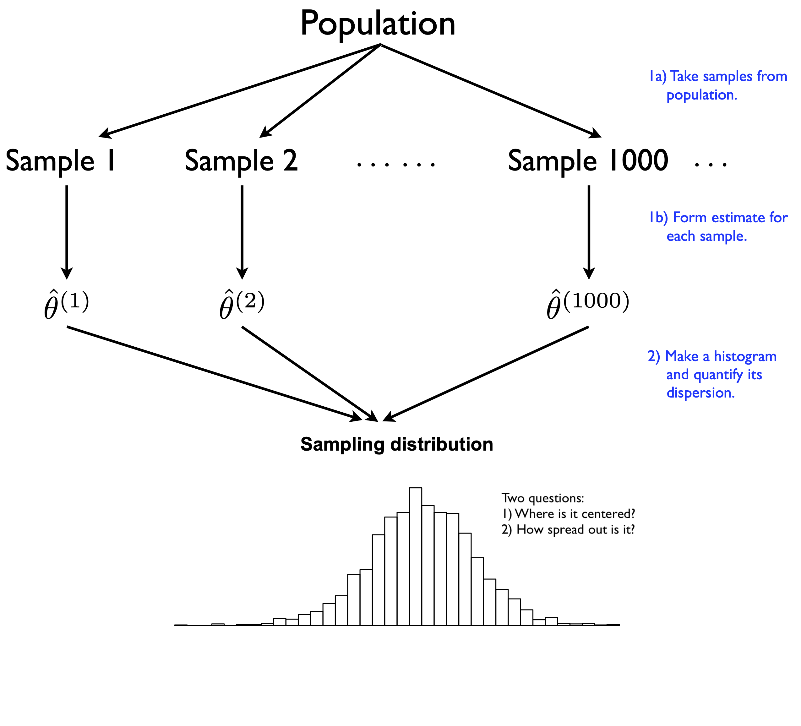
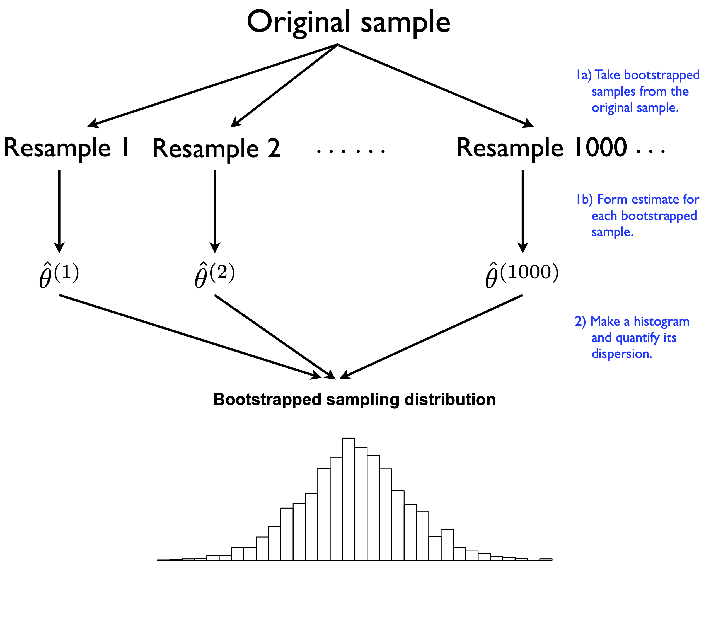

name: toc

```{css, echo=FALSE}
@media print {
  .has-continuation {
    display: block !important;
  }
}
```

```{r setup, include=FALSE}
options(htmltools.dir.version = FALSE)
library(knitr)
opts_chunk$set(
  fig.align="center", fig.width=5.5, fig.height=3.5, 
  # out.width="748px", #out.length="520.75px",
  dpi=300, #fig.path='Figs/',
  cache=T#, echo=F, warning=F, message=F
  )
if (!require("pacman")) install.packages("pacman")
pacman::p_load(tidyverse,boot,tictoc,future.apply,furrr)
plan(multisession)
theme_set(theme_minimal())
```

# Table of contents

- [Prologue](#prologue)

- [Bootstrapping](#bootstrapping)

- [Functions](#functions)

- [Iteration](#iteration)

- [Parallel Programming](#parallel-processing)

---
class: inverse, center, middle
name: prologue 


# Prologue

---
# Plan for the week

- Computers closed: Explanation of bootstrapping, basics of functions, iteration, and Parallel Programming
- Computers open: Work through practical examples

- By the end of the week you will:
  - Understand the intuition of bootstrapping
  - Be able to write basic functions in R
  - Be able to iterate tasks serially and in parallel in R
  - Be able to bootstrap in R

---
class: inverse, center, middle
name: Bootstrapping

# Bootstrapping

---
# Bootstrapping: Motivating example

- Imagine you gain powers to view every parallel, distinct universe where the world<sup>1</sup>

- With these powers, you **obviously** decide to replicate critical results in economics
  - You collect equivalent sample sizes
  - You run the same regressions to estimate the same parameters

- Do you think the results will be the same in each parallel universe?

--

- No! They'll differ a lot or a little, depending on how variable the data generating process is

.footnote[<sup>1</sup> Think _Everything, Everywhere, All At Once_, _Into The Spiderverse_, etc.]

---
# Return to earth

- We don't have powers to view parallel universes

- But we can view different random samples of a population of interest 

- And each sample will provide a distinct estimate of the true parameters of interest

- We have two ways to use these samples to get close to our parallel universe powers:

1. **Mathematical approximations**: Make simple assumptions that randomness obeys mathematical regularities for large samples
  - e.g. _Central Limit Theorem_ allows us to use the normal distribution to approximate the sampling distribution of the mean
2. **Resampling**: Use the same sample to estimate the variability of our estimates
  - e.g. _bootstrapping_ which we will cover today

---
# Visualizing samples

```{r sampling_schematic-1, echo=FALSE, out.width="75%", fig.cap="Population samples. [Schematics taken from Data Science in R: A Gentle Introduction](https://bookdown.org/jgscott/DSGI/the-bootstrap.html) by James Scott",cache=FALSE}

```

---
# What is bootstrapping?

- Bootstrapping is named for "pulling yourself up by your bootstraps," a joke<sup>2</sup> because the method seems preposterous and impossible

- Bootstrapping has two repeated steps:

1. Draw a random sample **with replacement** of size _N_ from your sample.
2. Perform the same analysis on the new sample.

- Repeat steps 1 and 2 a bunch of times saving each, the 2.5th and 97.th percentiles show the 95% confidence interval

Then plot the distribution of the estimates from each sample

.footnote[<sup>2</sup> Not a great one.]

---
# What is a bunch of times? 

How many bootstraps is enough? 

--

It depends. Intuively:

- The more bootstraps, the better
- But the more bootstraps, the longer it takes to run 
- Many econometricians and statisticians have purported to solve for "optimal" bootstrapping, but it is still an open question
- Arguably, you should do 1000s, if not more times! 
  - In this lecture, I did not do that because it would take too long to generate my slides

- See Parallel Programming before for speed ups! 


---
# Visualizing Bootstrapping vs. population

.pull-left[
```{r sampling_schematic-2, echo=FALSE, out.width="100%", fig.cap="Population samples",cache=FALSE}

```
]
.pull-right[
```{r sample-schematic-3, echo=FALSE, out.width="100%", fig.cap="Bootstrap analog", fig.align="center",cache=FALSE}

```
]

[Schematics taken from Data Science in R: A Gentle Introduction](https://bookdown.org/jgscott/DSGI/the-bootstrap.html) by James Scott

---
# What does bootstrapping show? 

- Bootstrapping shows how much your estimates vary across samples
- It shows the **sampling distribution** of your estimates
- The 95% confidence interval is the 2.5th and 97.5th percentile of the sampling distribution

--

- **Intuition**: Bootstrapping simulates the process of collecting new samples
  - If your sample is truly representative, then any shuffled sample should be representative too!
  - Your own sample is itself a random sample generated from some other random sample

---
# A "simple" example

- Imagine you have an RCT, and you want to estimate the effect of a treatment on some outcome
- There are two groups of treated users:
  - Those for whom treatment effect is zero
  - Those for whom treatment effect is one

On average the treatment effect is 0.5, but there is a lot of variation!

---
# Visualizing simple example

```{r simple-example,echo=FALSE,warning=FALSE}
set.seed(1)
het_df <- tibble(treatment = c(rep("Control", 100), rep("Treatment", 100)),
  zero_treat = c(rep(0, 150), rep(1, 50)),
  outcome = c(rnorm(150, mean = 0, sd = .5), rnorm(50, mean = 1, sd = .5))) 
ggplot(het_df, aes(x = as.factor(zero_treat), y = outcome)) +
    geom_boxplot() +
    facet_wrap(~treatment) +
    labs(x = "Treatment effect", y = "Outcome", title = "Heterogeneous treatment effect") + 
    geom_hline(yintercept = 0.5, color = "red", size = 1)
```

---
# Bootstrap to get random samples

- Let's take a bunch of random samples and see how the average treatment effect varies

```{r bootstrap-example,echo=FALSE,warning=FALSE}
set.seed(1)
boot_mean <- function(df=het_df) {
  sample <- df %>% group_by(treatment) %>% 
    slice_sample(n = nrow(het_df), replace = TRUE) %>%
    ungroup() %>%
    lm(outcome ~ treatment, data =.)
  return(coefficients(sample)[2])
}

future_map_dfr(1:100,function(i) boot_mean(),.options=furrr_options(seed=1)) %>%
  ggplot(aes(x = treatmentTreatment)) +
  geom_histogram(bins = 40) +
  geom_vline(xintercept = 0.5, color = "red", size = 1) +
  labs(x = "Average treatment effect", y = "Frequency", title = "Distribution of ATE across bootstramp samples")
```

---
# Now with a bigger sample

- With a larger baseline sample, the distribution of the average treatment effect is tighter

```{r bootstrap-example-big,echo=FALSE,warning=FALSE}
set.seed(1)
het_df_big<- tibble(treatment = c(rep("Control", 1000), rep("Treatment", 1000)),
  zero_treat = c(rep(0, 1500), rep(1, 500)),
  outcome = c(rnorm(1500, mean = 0, sd = .5), rnorm(500, mean = 1, sd = .5)))
future_map_dfr(1:100,function(i) boot_mean(df=het_df_big),.options=furrr_options(seed=1)) %>%
  ggplot(aes(x = treatmentTreatment)) +
  geom_histogram(bins = 40) +
  geom_vline(xintercept = 0.5, color = "red", size = 1) +
  labs(x = "Average treatment effect", y = "Frequency", title = "Distribution of ATE across bootstramp samples with bigger sample")
```

---
# Bootstrapping assumptions

- Your sample is just one random sample from the population of interest

- Bootstrapping assumes that randomness in data is driven by sampling

- Bootstrapping assumes a distribution that is not "highly" skewed

- (Basic) bootstrapping assumes independent and identically distributed
  - But you can do clustering and other forms of correlation, etc.

- Other technical assumptions!

---
# When should I do it?

- The bootstrap simulates the sample distribution of your estimates

- Use it to:

1. Calculate the standard error of your estimates 
  - Especially when you can't use analytical formulas (e.g. the median)
2. Look for bias in your estimate: is the average of your bootstraps far off from your actual estimate? 
3. Do power simulations on pilot data
4. Generate "training data sets" for machine learning models
5. Explore variation in model predictions as the sample changes
6. Other robustness checks and more

---
# How do I bootstrap?

There are two main requirements:

1. Always use the same sample size as your original sample 
  - This ensures the "same" data-generating process and approximates the same randomness

2. Always sample **with replacement**
  - That means you may sample the same observation twice

---
# Variations on sampling

I'm showing you index bootstrapping, where you just grab random observations from your sample with replcaement

There are two main variations on bootstrapping:

1. **Frequency bootstrap**: If your data is a frequency table, you can just randomly assign new frequencies
  - If an observation has frequency 7, that means it occurred 7 times
  - You randomly assign it new frequencies, representing a new sample where frequency still sums to the same amount

2. **Weight bootstrapping**: You can assign weights to each observation and sample with replacement
  - In your original sample, each observation got a weight of 1
  - You assign new weights, so a weight of 1.5 means the observation is 1.5 times more likely to be sampled, .5 means .5 times as likely to be sampled, etc.
  - The non-intger weights just needs to sum to $N$ the observations in your data

Both are powerful ways to do bootstrapping when your data are in a format that makes index bootstrapping hard

---
# Limitations of bootstrapping

- Bootstrapping cannot save you if your sample is biased

- Bootstrapping cannot save you if your sample is too small

- Bootstrapping cannot save you if your sample is not representative

---
# Limitations of packages

- I used the boot package above! 

- That handles many cases, but it can get a little slow for big data

- And it has built-in Parallel Programming, but it may not work on different systems

- Best to know how to do it yourself as well cause it is pretty easy once you get the hang of it!

---
class: inverse, center, middle
name: functions

# Functions

---
# What is a function?

- In math, a function is a mapping from domain to range

$$
\begin{align}
f(x) = x^2 \quad \text{Takes a number from the domain and returns its square in the range} \\
f(2) = 4 \quad \text{The function applied to 2 returns 4}
\end{align}
$$

- In programming, a function is a mapping from input to output

```{r}
square <- function(x) {
  x^2
}

square(2) # Returns 4
```

---
# Why use functions?

- **Abstraction**
  - They allow you to summarize complex details into a single line of code, so you only need to understand them once (instead of repeating yourself)

- **Automation**
  - Automate a task to happen many times without having to write the same code over and over

- **Documentation**
  - Well-written functions codify the steps you take to do something, so you can easily remember what you did

---
# How do I write a function?

In R, functions are defined using the `function` keyword

```{r,eval=FALSE}
some_function <- function(positional_input1=1,positional_input2="two",keyword_inputs) {
  # Do something with these inputs
  # Create output or ouputs
  return(output) # Return the output
  # If you do not specify return, it returns the last object
}
```

`function` takes keyword inputs and positional inputs. It does not require a specific order for these unlike in Python. But generally, position comes first.

---
# Control flow: If/else logic

Functions make great use of if/else logic

```{r, square-ifelse}
square = 
  function(x = NULL) {
    
    if (is.null(x)) { ## Start multi-line IF statement with `{`
      x = 1
      ## Message to users:
      message("No input value provided. Using default value of 1.")
      }               ## Close multi-line if statement with `}`
    
    x_sq = x^2 
    d = data.frame(value = x, value_squared = x_sq)
    
    return(d)
  }
square()
```

This function has a default value of 1 for when you fail to provide a value. 

---
# Each step of bootstrap

```{r bootstrapping-example}
# library(tidyverse) # Already loaded
set.seed(1)
df <- tibble(x = rnorm(1000, mean = 0, sd = 1),
  y= x+rnorm(1000, mean = 0, sd = 1))

bootstrap_sample <- function(df) {
  # 1. Draw a random sample with replacement of size N from your sample.
  sample <- df %>% slice_sample(n = nrow(df), replace = TRUE)
  # 2. Perform the same analysis, here a median, on the new sample.
  return(coef(lm(y ~ x, data = sample))[2])
}

bootstrap_sample(df)
```

---
# Wrapping up a function

- You can wrap functions inside of other functions
- This is a great way to make your code more readable and modular
- Also useful for various iteration tasks that need to take an iterated input

```{r function-within-function}
wrapper_bootstrap <- function(i,df) {
  # print(i) # if you want to visualize the i.
  bootstrap_sample(df)
}
wrapper_bootstrap(1,df)
```


---
# More on functions

- There is a lot more to functions than we can cover today
- Check out Grant McDermott's [Introudctory](https://grantmcdermott.com/ds4e/funcs-intro.htm) and [Advanced](https://grantmcdermott.com/ds4e/funcs-adv.html) chapters on functions
- There are some incredible tips on how to:
  - Debug functions
  - Write functions that are easy to read
  - Catch errors
  - Cache or `memoise` big functions

---
class: inverse, center, middle
name: Iteration

# Iteration

---
# Iteration: For loops

- You've likely heard of for loops before! 
- They're the most common way to iterate across programming languages 
- In R, the syntax is fairly simple: you iterative over a vector or list of values, and do stuff with those values

```{r for-loop}
for(i in 1:10) {
  square(i)
}
```

---
# Bootstrapping for loop

To save output, you have to pre-define a list where you deposit the output

```{r bootstrapping-forloop}
deposit <- vector("list",10) # preallocate list of 10 values
set.seed(1)
for (i in 1:10) {
  # perform bootstrap
  deposit[[i]] <- bootstrap_sample(df)
}

bootstrapped_for <- bind_rows(deposit)
head(bootstrapped_for)
```

---
# Binding output

- Did you notice the `bind_rows()` function I called?
- After any iteration that leaves you a bunch of dataframes in a list, you'll want to put them together
- The `bind_rows` function is a great way to bind together a list of data frames
- Other options include: 
  - `do.call(rbind, list_of_dataframes)`
  - `data.table::rbindlist()`

---
# Issues with for loops

- For loops are slow in R
- They clutter up your environment with extra variables (like the `i` indexer)
- They can also be an absolute headache to debug if they get too nested
- Look at the example below: this is a nested for loop that is hard to read and debug
- In some languages, this is all you have, but not in R!

```{r nested-for-loop, eval=FALSE}
for (i in 1:5) {
  for (k in 1:5) {
    if (i > k) {
      print(i*k)
    }
    else {
      for (j in 1:5) {
        print(i*j*k)
      }
    }
  }
}
```

---
# Tips on iterating

- Start small! Set your iteration to 1 or 2 and make sure it works
- Why?
  - You'll know faster if it broke
- Print where it is in the iteration (or use a progress bar with something like `pbapply`)

```{r print-iteration}
for (i in 1:2) {
  print(i)
  # complex function
}
```


---
# While loops

- I'm largely skipping while loops, but they're also important! 

- While loops iterate until one or more conditions are met
  - Typically one condition is a max number of iterations
  - Another conditions is that the some value of the loop is within a small amount of a target value

- These are critical for numerical solvers, which are common in computational economics and machine learning

---
# Iteration: apply family

- R has a much more commonly used approach to iteration: the `*apply` family of functions: `apply`, `sapply`, `vapply`, `lapply`, `mapply`
- The `*apply` family takes a function and applies it to each element of a list or vector
- `lapply` is the most commonly used and returns a list back

```{r lapply}
lapply(1:10, square)
```

---
# `*apply` syntax

- The `*apply` family is a little confusing at first, but it's very powerful
- The syntax is `*apply(list_or_vector, function, other_arguments)`
- The `function` is a function that takes arguments like any other
  - The first argument will be the element of the list or vector
- The `other_arguments` are arguments that are passed to the function

---
# Bootstrapping lapply

- One trick: `*apply` insists on iterating over some sequence indexed `i` like a for-loop
- But you can ignore it by using `function(i)` and then not using `i` in the function

```{r bootstrapping-lapply}
set.seed(1)
lapply(1:10, function(i) bootstrap_sample(df=df)) %>%
  bind_rows()
```

---
# Wrapper functions to get around `*apply`

- Maybe you don't like the ugly syntax of `function(i)` and then not using `i` in the function
- Well you can write a wrapper function to get around that

```{r wrapper-function-iteration}
set.seed(1)
lapply(1:10, wrapper_bootstrap, df=df) %>%
  bind_rows()
```

---
# Iteration: map

- Sometimes the `*apply` syntax is a little confusing
- The **purrr** package in the tidyverse has more intuitive syntax for iteration: `map`
- The variant `map_df` is especially useful beause it automatically binds the output into a data frame
  - The same iteration syntax applies here too. 

```{r map_df}
set.seed(1)
map_df(1:10, function(i) bootstrap_sample(df=df))
```

---
class: inverse, center, middle
name: parallel

# Parallel Programming

---
# Motivating example: Parallel Programming

- Imagine you get home from the grocery store with 100 bags of groceries
- You have to bring them all inside, but you can only carry 2 at a time
- That's 50 trips back and forth
- How can you speed things up?

--

  - Ask friends to carry to at a time with you (Parallel Programming)
  - Get a cart and carry 10 at a time (more RAM and a better processor)

---
# A warning

- Parallel Programming is an incredibly powerful tool, but it is full of pitfalls

- A friend of mine from the PhD said that he did not understand it until the 4th year of his PhD

- Many economists understand the intuition, but not the details and only do it if absolutely necessary

- That used to be me until I started teaching this class!

- So if it is hard, that's normal. But it is worth learning!

---
# "One trip?" okay

```{r one-trip, echo=FALSE, out.width="75%", fig.cap="One trip? Okay ,sure",cache=FALSE}
knitr::include_graphics("imgs/maxresdefault.jpg")
```

---
# Parallel Programming: What?

- Your computer has multiple cores, which are like multiple brains
- Each of these is capable of doing the same tasks
- Parallel Programming is the act of using multiple cores to do the same task at the same time

--
- Many coding tasks are "embarassingly parallel"
  - That means they can be broken up into many small tasks that can be done at the same time
  - Bootstrapping is one such example

- Some tasks are not embarrassingly parallel
  - These are called "serial" tasks
  - Parts of these tasks may be possible to do in parallel

---
# Parallel Programming vocab

The vocab for Parallel Programming can get a little confusing:

- **Socket**: A socket is a physical connection between a processor and the motherboard
- **Core**: A core is a physical processor that can do computations
- **Process**: A process is a task that is being done by a core (Windows users may know this from Task Manager)
- **Thread**: A thread is a subtask of a process that can be done in parallel and share memory with other threads
- **Cluster**: A cluster is a group of computers that can be used to do Parallel Programming
- **Node**: One computer within a cluster

---
# Parallel Programming in R

- In R, there are many ways to parallel process, I'll introduce you to the **future.apply** package
- There are many Parallel Programming packages in R, but **future.apply** follows the `*apply` family syntax

---
# Trivial example: square numbers

- Let's start with some trivial to understand examples

- Here is a function called `slow_square`, which takes a number and squares it, but after a pause.

```{r slow}
## Emulate slow function
slow_square = 
  function(x = 1) {
    x_sq = x^2 
    d = data.frame(value = x, value_squared = x_sq)
    Sys.sleep(2) # literally do nothing for two seconds
    return(d)
    }
```

Let's time that quickly.

```{r serial-tictoc}
# library(tictoc) ## Already loaded

tic()
serial_ex = lapply(1:12, slow_square)
toc(log = TRUE)

```

---
# Now in parallel

```{r parallel-tictoc}
# library(future.apply)  ## Already loaded
# plan(multisession)     ## Already set above

tic()
future_ex = future_lapply(1:12, slow_square)
toc(log = TRUE)

all.equal(serial_ex, future_ex)
```

---
# Example: bootstrapping in parallel

- The future_lapply works the same, but now I have to set the seed inside the function

```{r parallel-bootstrap, cache=FALSE}
set.seed(1)
tic()
serial_boot <- lapply(1:1e4, function(i) bootstrap_sample(df)) %>%
  bind_rows()
toc(log = TRUE)

tic()
parallel_boot <- future_lapply(1:1e4, 
  function(i) bootstrap_sample(df), 
  future.seed=1) %>%
  bind_rows()
toc(log = TRUE)

```

---
# Want to use `map`? Try **furrr**

The **furrr** package, i.e. future **purrrr** is a Parallel Programming version of **purrr**

- Again, the syntax is the same, but you have to set the seed inside the function with `.options`.

```{r furrr, cache=FALSE}
tic()
furrr_boot = future_map_dfr(1:1e4, 
  function(i) bootstrap_sample(df), 
  .options = furrr_options(seed=1))
toc(log = TRUE)
```

---
# Get standard errors from results

- Now that we have a bunch of estimates, we can get the standard error of our estimates
- The 95% confidence interval is just the 2.5th and 97.5th percentile of the sampling distribution

```{r bootstrapping-density,echo=FALSE}
lwr <- furrr_boot %>% pull(x) %>% quantile(0.025)
upr <- furrr_boot %>% pull(x) %>% quantile(0.975)

furrr_boot %>%
  ggplot(aes(x)) +
    geom_density(col=NA, fill="gray25", alpha=0.3) +
    geom_vline(xintercept=1, col="blue") +
    geom_vline(xintercept=lwr, col="red", linetype="dashed") +
    geom_text(x=lwr+.01, y=5, label="Lower 95% CI", hjust=0, col="red") +
    geom_vline(xintercept=upr, col="red", linetype="dashed") +
    geom_text(x=upr+.01, y=5, label="Upper 95% CI", hjust=0, col="red") +
    labs(
      title = "Bootstrapping example",
      x="Coefficient values", y="Density",
      caption = "Notes: Density based on 1,000 draws with sample size of 10,000 each."
      )
```

---
# R packages that use Parallel Programming

- Many R packages already use Parallel Programming
- `feols()` from **fixest** uses Parallel Programming to speed up OLS estimation
  - You can control how using the `nthreads` argument
- **data.table** uses Parallel Programming to speed up data wrangling
- **boot** and **sandwich** can use Parallel Programming to speed up bootstrapping
- And many others do the same

---
# Parallel Programming: Why?

- Parallel Programming is a great way to speed up your code and often there are straight-forward ways to do it
- It is not always worth doing:
  - Theoretically, the gain should be linear: each additional node should speed up your code by the same amount
  - In practice, there are "overhead" costs to Parallel Programming that can slow things down
  - **Overhead costs**: reading in and subsetting data, tracking each node 

---
# Across computer clusters

- Parallel Programming is also a way to speed up your code across multiple computers
- This is called "distributed computing"
- It is a way to speed up your code when you have a lot of data and a lot of computers
- Imagine you have 1000 computers, each with 1/1000th of your data
- You can run the same code on each computer, and then combine the results
- Same logic, but the "overhead" costs are higher

---
# What next?

- Go try how to bootstrap in R!

- Better yet, learn to do it in parallel

- Navigate to the lecture activity [13a-bootstrapping-functions-practice](https://github.com/ECON368-fall2023-big-data-and-economics/big-data-class-materials/blob/main/lectures/12a-rdd-class-sizes/13a-bootstrapping-practice.Rmd)

---
class: inverse, center, middle

# Next lecture: Decision Trees
<html><div style='float:left'></div><hr color='#EB811B' size=1px width=796px></html>

```{r gen_pdf, include = FALSE, cache = FALSE, eval = TRUE}
infile=knitr::current_input() %>% stringr::str_replace('.Rmd', '.html')
print(infile)
pagedown::chrome_print(input = infile, timeout = 100)
```