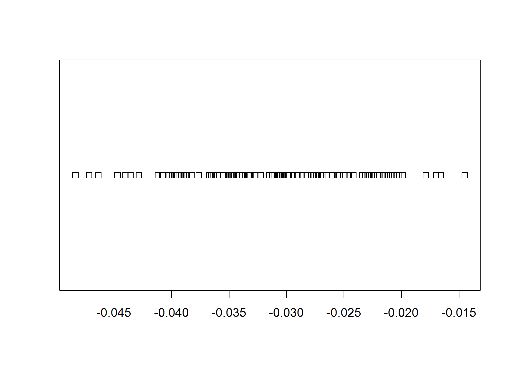

## Software requirements

### R packages 

It's important to note that "base" R already provides all of the tools to implement bootstrapping, but there are some great other tools to use!

- New: **boot**, **parallel**, **tictoc**, **pbapply**, **future**, **future.apply**, **furrr**
- Already used: **tidyverse**, **fixest**, **haven**, **sandwich**, **broom**, **stargazer**, **lmtest**, **AER**

A convenient way to install (if necessary) and load everything is by running the below code chunk.


```r
## Load and install the packages that we'll be using today
if (!require("pacman")) install.packages("pacman")
pacman::p_load(boot,doParallel,fixest,sandwich,haven,tidyverse,broom,stargazer,
  lmtest,tictoc,parallel,pbapply,future,future.apply,furrr,AER)

## My preferred ggplot2 plotting theme (optional)
theme_set(theme_minimal())
```


## Dataset

In this activity, we are going to work through bootstrapping to get standard errors for a regression model. We will use the `ResumeNames` dataset, which is in the AER package. The data come from the Resume Audit study by Bertrand and Mullainathan (2004). The data contain a row that corresponds to a ficitious resume that the authors sent to businesses in Boston and Chicago. The resumes were randomly assigned either a "white-sounding" name or a "black-sounding" name, among other characteristics. The data contain information on whether the business called the resume back for an interview. The outcome of interest way the average callback gap.


```r
# library(AER) # already loaded
data("ResumeNames")
cleaned_resumes <- ResumeNames %>% 
  mutate(female=gender=='female',
    afam=ethnicity=='afam',
    call=call=='yes') %>%
    select(name,female, afam,call) %>%
  as_tibble()

cleaned_resumes
```

```
## # A tibble: 4,870 × 4
##    name    female afam  call 
##    <fct>   <lgl>  <lgl> <lgl>
##  1 Allison TRUE   FALSE FALSE
##  2 Kristen TRUE   FALSE FALSE
##  3 Lakisha TRUE   TRUE  FALSE
##  4 Latonya TRUE   TRUE  FALSE
##  5 Carrie  TRUE   FALSE FALSE
##  6 Jay     FALSE  FALSE FALSE
##  7 Jill    TRUE   FALSE FALSE
##  8 Kenya   TRUE   TRUE  FALSE
##  9 Latonya TRUE   TRUE  FALSE
## 10 Tyrone  FALSE  TRUE  FALSE
## # ℹ 4,860 more rows
```

## Functions 

Functions are a great way to make your code more readable and reusable. They are also a great way to make sure you don't make mistakes when you're running the same code over and over again.

### Basic function to sample data

Let's start with a basic function. Here is a function that creates a random sample of the data with the same number of observations. This is the first step in bootstrapping. 


```r
set.seed(1000) # replication
random_sample <- function(data) {
  # Get the number of observations
  n <- nrow(data)
  # Sample the data
  data[sample(1:n, n, replace = TRUE), ]
}
random_sample(data=cleaned_resumes)
```

```
## # A tibble: 4,870 × 4
##    name     female afam  call 
##    <fct>    <lgl>  <lgl> <lgl>
##  1 Meredith TRUE   FALSE FALSE
##  2 Tremayne FALSE  TRUE  FALSE
##  3 Aisha    TRUE   TRUE  FALSE
##  4 Meredith TRUE   FALSE FALSE
##  5 Rasheed  FALSE  TRUE  FALSE
##  6 Brad     FALSE  FALSE FALSE
##  7 Ebony    TRUE   TRUE  FALSE
##  8 Keisha   TRUE   TRUE  FALSE
##  9 Sarah    TRUE   FALSE FALSE
## 10 Tanisha  TRUE   TRUE  FALSE
## # ℹ 4,860 more rows
```

Can you think of some way to improve on this sampling procedure? What is true in the experiment that we will lose through a random sample? Try to write up a better version that accounts for this. 

Now test yourself by amending the function to run a regression of callback on ethnicity. Test it out!

.
.
.
.
.
.
.
.
.
.
.
.
.
.
.
.
.
.
.
.
.
.
.
.
.
.
.
.
.
.
.
.
.
.
.
.


```r
set.seed(1000) # replication
random_sample_lm <- function(data) {
  # Get the number of observations
  n <- nrow(data)
  # Sample the data
  m1 <- lm(call ~ afam, data[sample(1:n, n, replace = TRUE), ])
  # Return the coefficients
  return(coef(m1)[2])
}

random_sample_lm(cleaned_resumes)
```

```
##    afamTRUE 
## -0.03381552
```

#### Challenge:

Can you repeat the above process, but now with a function that calculates the difference in means? Or runs a t-test? 

### Wrapper functions

You can include other functions that you wrote in the functions you create just like including pre-defined functions from packages in your functions. This is incredibly useful for any iteration work you're doing that automatically feeds the value it iterates over to the function you include. Here's the basic syntax:


```r
function_that_uses_x <- functiion(x) {
  # Do something with x
  return(something_with_x)
}

wrapper_function <- function(i,x) {
  # Do something with i if you want
  something <- function_that_uses_x(x)
  # or do something with i and x together, for example:
  something <- function_that_uses_x(x)*i
  # Return something
  return(something)
}
```

Can you write a wrapper for the `random_sample_lm()` function above?

## Iteration

Iteration is a great way to run the same code over and over again. It's especially useful for bootstrapping because bootstrapping is just running the same code over and over again with different data.

### For loop

The most basic way to iterate is with a for loop. This is a great way to start because it's easy to understand and you can see what's going on. The syntax is really simple too:


```r
for (i in 1:10) { # index from i to 100.
  print(i)
}
```

```
## [1] 1
## [1] 2
## [1] 3
## [1] 4
## [1] 5
## [1] 6
## [1] 7
## [1] 8
## [1] 9
## [1] 10
```

Note that you can also iterate by skipping numbers or even just feed it 


```r
# This example iterates through the odd numbers from 1 to 100
# because it skips every too.
for (i in seq(1,10,2)) { # index from i to 100.
  print(i)
}
```

```
## [1] 1
## [1] 3
## [1] 5
## [1] 7
## [1] 9
```


```r
# This example iterates through the odd numbers from 1 to 100
# because it skips every too.
for (i in c("words","too")) { # index from i to 100.
  print(i)
}
```

```
## [1] "words"
## [1] "too"
```

Look at your global environment, do you see a variable for `i`? That's cause R creates a variable for `i` and iterates through the values of `i` from 1 to 100. You can use `i` in your code to do something different each time. But if you have too many it get cluttered too.

Note, to record the results of each iteration, you need to create a list to store the results in. The length of this vector is the number of iterations, which you can define with `length()`. This can be inserted in your for loop to track how far you have gone through. Here's an example:


```r
deposit <- vector("list",10)
iterations <- length(deposit)
for (i in 1:iterations) {
  print(paste0(i, "/", iterations))
  deposit[[i]] <- i
}

deposit
```

Let's write a for loop that iterates through the `random_sample_lm()` function 10 times. Make sure to create a list to store the results in. Before you commit to running it 10 times, check that it runs through one iteration. 
.
.
.
.
.
.
.
.
.
.
.
.
.
.
.
.
.
.
.
.
.
.
.
.
.
.

```r
results <- vector("list",10)
set.seed(1000) # replication
for (i in 1:10) {
  results[[i]] <- random_sample_lm(cleaned_resumes)
}
```

### Apply

You can do the same thing using the `*apply` family. Here it is with `lapply()`:


```r
set.seed(1000) # replication
results <- lapply(1:10, function(x) random_sample_lm(cleaned_resumes))
```

**Challenge**: Try writing a lapply that iterates over the odd numbers from 1 to 10 or a vector of strings like we did for the loop above.

Note that the `lapply` takes each element of the vector as an input, which is the first thing passed to the function, `function(x)`. Can you think of a way to make the syntax less confusing?

#### Progress Bar: `pbapply`

Also, the `pbapply` package has a progress bar, which is nice for long simulations.


```r
set.seed(1000) # replication
results <- pbapply::pblapply(1:10, function(x) random_sample_lm(cleaned_resumes))
```

### Map

The `map()` function from the **purrr** package is a great way to iterate over a list. It's a bit more complicated than `lapply()`, but it's worth learning because it's very powerful. Here's an example with `map_df()`.


```r
set.seed(1000)
results <- map_df(1:10, function(x) random_sample_lm(cleaned_resumes))
```

## Parallel Programming 

Parallel Programming is a pretty handy trick to speed up your code. It's especially useful for computationally intensive simulations that can be broken up into smaller chunks. As a warning, parallel programming can get quite complex, so we're sticking with the basics today. For more advanced coverage, check work by [Grant McDermott](https://grantmcdermott.com/ds4e/parallel.html#general-parallel-programming-topics).

First, let's check how many cores you have on your machine. R runs things in parallel by splitting them up between cores! 


```r
# future::availableCores() ## Another option
detectCores()
```

```
## [1] 8
```

My computer has 8 cores, yours likely, but not necessarily, has fewer. That's okay! You can still split things into chunks and run them in parallel.

I'll show several different approaches.

### future.apply


```r
set.seed(123L)
tic()
future_lapply(1:1e3, 
  function(i) random_sample_lm(cleaned_resumes)) %>%
  bind_rows()
```

```
## # A tibble: 1,000 × 1
##    afamTRUE
##       <dbl>
##  1  -0.0339
##  2  -0.0425
##  3  -0.0380
##  4  -0.0347
##  5  -0.0318
##  6  -0.0261
##  7  -0.0316
##  8  -0.0358
##  9  -0.0329
## 10  -0.0230
## # ℹ 990 more rows
```

```r
toc(log=TRUE)
```

```
## 7.3 sec elapsed
```

#### pbapply


```r
set.seed(123L)
tic()
sim_pblapply = pblapply(1:1e3, function(i) random_sample_lm(cleaned_resumes), cl = parallel::detectCores())
toc(log=TRUE)
```

```
## 12.61 sec elapsed
```

### furrr


```r
tic()
future_map_dfr(1:1e3, 
  function(i) random_sample_lm(cleaned_resumes), 
  .options = furrr_options(seed=123L)) %>%
  bind_rows()
```

```
## # A tibble: 1,000 × 1
##    afamTRUE
##       <dbl>
##  1  -0.0266
##  2  -0.0198
##  3  -0.0420
##  4  -0.0461
##  5  -0.0310
##  6  -0.0372
##  7  -0.0226
##  8  -0.0328
##  9  -0.0177
## 10  -0.0241
## # ℹ 990 more rows
```

```r
toc(log=TRUE)
```

```
## 6.03 sec elapsed
```

This is the best way to make sure you understand the bootstrapping process. 

## Bootstrapping out of the box

### **sandwich** package

The sandwich package is great for estimating all sorts of funny standard errors in R. It is often combined with the `coeftest` function from the **lmtest** package to substitute new standard errors into the model after estimation and specify the number of replications. 


```r
#library(sandwich);  library(lmtest) #already loaded

# Run a regression assuming normal (iid) errors
m <- lm(call ~ afam, data = cleaned_resumes) 
 
# Obtain the boostrapped SEs
coeftest(m, vcov = vcovBS(m,
  R=1000 # Number of replications
  )
) 
```

```
## 
## t test of coefficients:
## 
##               Estimate Std. Error t value  Pr(>|t|)    
## (Intercept)  0.0965092  0.0060210 16.0287 < 2.2e-16 ***
## afamTRUE    -0.0320329  0.0078819 -4.0641 4.898e-05 ***
## ---
## Signif. codes:  0 '***' 0.001 '**' 0.01 '*' 0.05 '.' 0.1 ' ' 1
```

**sandwich** can be run in parallel by specifying the "cores" to use. This is useful for computationally intensive simulations. 


```r
coeftest(m, vcov = vcovBS(m,
  R=1000, # Number of replications
  cores=2 # Number of cores to use
  )
) 
```

```
## 
## t test of coefficients:
## 
##               Estimate Std. Error t value  Pr(>|t|)    
## (Intercept)  0.0965092  0.0056755 17.0045 < 2.2e-16 ***
## afamTRUE    -0.0320329  0.0074471 -4.3014 1.731e-05 ***
## ---
## Signif. codes:  0 '***' 0.001 '**' 0.01 '*' 0.05 '.' 0.1 ' ' 1
```

One challenge is **sandwich** only works for standard error calculations and does not give you as much information on the bootstrap needed to use it other ways! 

### **boot** package

The boot package is one of the most flexible packages for bootstrapping in R. It allows you to bootstrap any function that you can write in R and to implement bootstrapping random indices, random frequencies, and random weights -- which are more complicated approaches to bootstrapping. It also allows you to parallelize your bootstrap simulations directly. 

The way it works, is it will automatically create R samples of the data and feed that to your function. then you will need to pass an index to your function to make sure it knows how to iterate through these samples. Here's an example:


```r
#library(tidyverse); library(boot)
set.seed(1000) # replication

# Our estimation function. The first argument must be the data
# and the second the indices defining the bootstrap sample
est_model <- function(d, index) {
    # Run our model
    # Use index to pick the bootstrap sample
    m <- lm(call ~ afam, data = d[index,])
    # Return the estimate(s) we want to bootstrap
    return(c(coef(m)[2]))
}

# Now the bootstrap call!
boot_results <- boot(data=cleaned_resumes, # data
                statistic=est_model, # Estimation function,
                R=1000) # Number of bootstrap simulations

print(boot_results)
```

```
## 
## ORDINARY NONPARAMETRIC BOOTSTRAP
## 
## 
## Call:
## boot(data = cleaned_resumes, statistic = est_model, R = 1000)
## 
## 
## Bootstrap Statistics :
##        original       bias    std. error
## t1* -0.03203285 0.0001385447 0.007766129
```

```r
# confidence intervals
print(boot.ci(boot_results,
  type=c('norm', # assumes a normal distribution
    'basic', # the basic bootstrap uses a Reverse Percentile Interval formula
    'perc'))) # the actual 2.5th and 97.5th percentile
```

```
## BOOTSTRAP CONFIDENCE INTERVAL CALCULATIONS
## Based on 1000 bootstrap replicates
## 
## CALL : 
## boot.ci(boot.out = boot_results, type = c("norm", "basic", "perc"))
## 
## Intervals : 
## Level      Normal              Basic              Percentile     
## 95%   (-0.0474, -0.0170 )   (-0.0481, -0.0176 )   (-0.0464, -0.0160 )  
## Calculations and Intervals on Original Scale
```

The different types of confidence intervals are explained in the help file for `boot.ci` or on [Wikipedia](https://en.wikipedia.org/wiki/Bootstrapping_(statistics)#:~:text=The%20basic%20idea%20of%20bootstrapping,data%20(resampled%20%E2%86%92%20sample)). The "norm" is the default and assumes a normal distribution. The "basic" uses a Reverse Percentile Interval formula, which is easier to justify mathematically, though it is a little confusing to follow. The "perc" uses the actual 2.5th and 97.5th percentiles from your data. 

#### Stratifying

Maybe you noticed that you should be sampling equally for each group. Well that would be stratified sampling, which `boot()` handles incredibly well with the `strata` argument. Go to the help file for `boot` and try to figure out how to stratify the sampling.

.
.
.
.
.
.
.
.
.
.
.
.
.
.
.
.
.
.
.
.
.
.
.
.
.
.
.
.

```r
boot(data=cleaned_resumes, # data
                statistic=est_model, # Estimation function,
                R=1000, # Number of bootstrap simulations
                strata = cleaned_resumes$afam) # Stratify by afam
```

```
## 
## STRATIFIED BOOTSTRAP
## 
## 
## Call:
## boot(data = cleaned_resumes, statistic = est_model, R = 1000, 
##     strata = cleaned_resumes$afam)
## 
## 
## Bootstrap Statistics :
##        original        bias    std. error
## t1* -0.03203285 -0.0002632444 0.007709421
```

#### Parallel

The results tell you the original value(s) without sampling, the bias (the difference between the mean of the bootstraps and your estimate), and the bootstrapped standard errors.

Here's that again, but now in parallel:


```r
boot_results <- boot(data=cleaned_resumes, # data
                statistic=est_model, # Estimation function,
                R=1000, # simulations
                parallel = "multicore", # parallelization method
                ncpus = parallel::detectCores()) # number of cores to use
```

Sadly, if you are on a windows machine "multicore" will not work due to technical glitches. You can use "snow", but the documentation explains that more work is needed to make that work. 

There are a number of handy visualization tools and table shortcuts to use with the **boot** package too:


```r
# See the coefficient estimates and their bootstrap standard errors
plot(boot_results)
```

<!-- -->

```r
# Optional: print regression table with the bootstrap SEs
# This uses stargazer, but the method is similar
# with other table-making packages,
# see /Presentation/export_a_formatted_regression_table.html
# library(broom) # already loaded
tidy_results <- tidy(boot_results)

#library(stargazer) # already loaded
m1 <- lm(call~afam, data = cleaned_resumes)
stargazer(m1, se = list(tidy_results$std.error), type = 'text')
```

```
## 
## ===============================================
##                         Dependent variable:    
##                     ---------------------------
##                                call            
## -----------------------------------------------
## afam                          -0.032           
##                                                
##                                                
## Constant                     0.097***          
##                               (0.008)          
##                                                
## -----------------------------------------------
## Observations                   4,870           
## R2                             0.003           
## Adjusted R2                    0.003           
## Residual Std. Error      0.272 (df = 4868)     
## F Statistic          16.931*** (df = 1; 4868)  
## ===============================================
## Note:               *p<0.1; **p<0.05; ***p<0.01
```

That said, it can be a bit cumbersome to use. For example, if you want to bootstrap a function that takes more than two arguments, you need to use the `...` argument and define `extraPar` and `numCenter`. This can be a bit confusing and easy to screw up.

#### Frequency bootstrapping

The **boot** package also allows you to bootstrap using random frequencies. Frequencies are useful if you have survey data and want to account for the survey design. Essentially, each row is an observation that occurs multiple times in real life, but is recorded only once in the data. The frequency is the number of times that observation occurs in real life.

I'll create a frequency table below and just calculate the weighted mean of resume callbacks.^[Why am I doing the weighted mean? Cause I am writing these up quickly and don't want to write a new function to do the regression. You could figure this out for yourself if you wanted!]


```r
# Create a resume dataframe with frequencies by name
# The call variable is now the average
set.seed(1)
cleaned_resume_freq <- cleaned_resumes %>%
  group_by(name,female,afam) %>%
  summarise(frequency=n(),
    call=mean(call))
```

```
## `summarise()` has grouped output by 'name', 'female'. You can override using
## the `.groups` argument.
```

```r
# The weighted mean of calls:
weighted.mean(x=cleaned_resume_freq$call, # variable to average
  w=cleaned_resume_freq$frequency # the weight
  )
```

```
## [1] 0.08049281
```


```r
set.seed(1)
boot(cleaned_resume_freq$call, 
  weighted.mean, 
  R = 1000, stype = "f")
```

```
## 
## ORDINARY NONPARAMETRIC BOOTSTRAP
## 
## 
## Call:
## boot(data = cleaned_resume_freq$call, statistic = weighted.mean, 
##     R = 1000, stype = "f")
## 
## 
## Bootstrap Statistics :
##       original       bias    std. error
## t1* 0.07822643 2.130659e-05 0.004906084
```

#### Weight bootstrapping

Weights operate similar to frequencies, but can be applied to a dataset without a frequency column. The weights just up or down weight the observations. 


```r
boot(cleaned_resumes$call, 
  weighted.mean, 
  R = 1000, stype = "w")
```

```
## 
## ORDINARY NONPARAMETRIC BOOTSTRAP
## 
## 
## Call:
## boot(data = cleaned_resumes$call, statistic = weighted.mean, 
##     R = 1000, stype = "w")
## 
## 
## Bootstrap Statistics :
##       original       bias    std. error
## t1* 0.08049281 0.0001722793 0.004021416
```

The code below does not work. Can you figure out why?


```r
statFun <- function(funData, indices, addPars, centerMean)
    {
      # Check to see if extra parameters
      if(addPars)
      {
        result <- mean(funData[indices] - centerMean)
      }else
      {
        result <- mean(funData[indices])
      }

      # Return the value
      return(result)
    }

boot(testData, statFun, R = 100, extraPar = TRUE, numCenter = mean(testData)) 
```

## Other resources

- For more info on functions, check out Grant McDermott and Ed Rubin's [introductory](https://grantmcdermott.com/ds4e/) and [advanced](https://grantmcdermott.com/ds4e/funcs-adv.html) material.
- For more info on paralell programming, check out Grant McDermott and Ed Rubin's [chapter](https://grantmcdermott.com/ds4e/parallel.html) on all the nitty gritty details.
- For more explanations on bootstrapping in sections, see [13.3.2](https://theeffectbook.net/ch-StatisticalAdjustment.html#fixing-your-standard-errors) and [15.5](https://theeffectbook.net/ch-Simulation.html#simulation-with-existing-data-the-bootstrap) of _The Effect_ by Nick Huntington-Klein or The [Library of Statistical Techniques](https://lost-stats.github.io/Model_Estimation/Statistical_Inference/Nonstandard_Errors/bootstrap_se.html) also provides a concise summary. A much longer explanation is available in [Data Science for R](https://bookdown.org/jgscott/DSGI/the-bootstrap.html).
