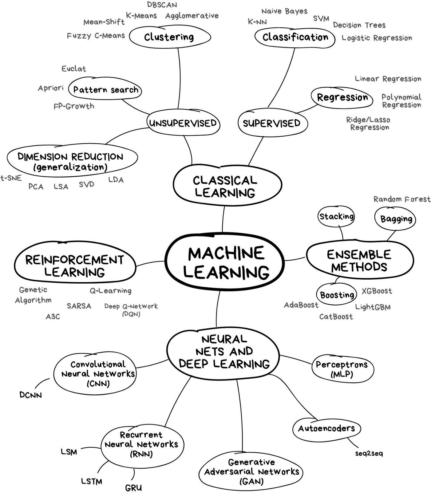
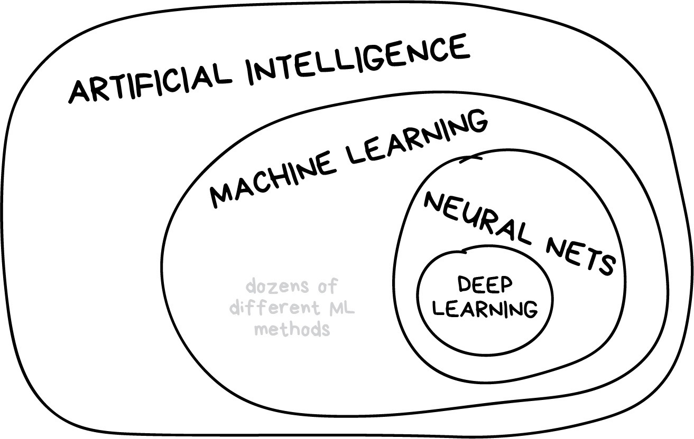
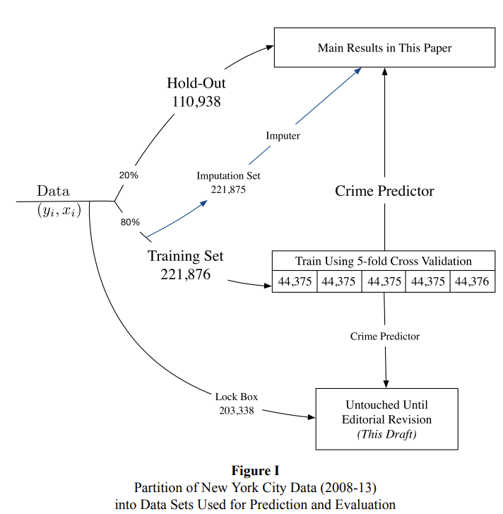

name: toc

```{css, echo=FALSE}
@media print {
  .has-continuation {
    display: block !important;
  }
}
```

```{r setup, include=FALSE}
options(htmltools.dir.version = FALSE)
library(knitr)
opts_chunk$set(
  fig.align="center", fig.width=6, fig.height=6, 
  # out.width="748px", #out.length="520.75px",
  dpi=300, #fig.path='Figs/',
  cache=T#, echo=F, warning=F, message=F
  )

if (!require("pacman")) install.packages("pacman")
pacman::p_load(tidymodels,tidyverse,causaldata,fixest)
theme_set(theme_minimal())
```

# Table of contents

- [Prologue](#prologue)

- [What is Machine Learning?](#what-is-ml)
  - [Artificial intelligence vs. Machine Learning](#ai-vs-ml)

- [Econometrics vs Machine Learning](#econometrics-vs-ml)
  - [Goals of Econometrics](#goals-of-econometrics)
  - [Goals of Machine Learning](#goals-of-machine-learning)
  
- [Fundamentals of Machine Learning](#fundamentals-of-ml)
  - [Measuring prediction accuracy](#measuring-prediction-accuracy)
  - [Bias-variance tradeoff](#bias-variance-tradeoff)
  - [Cross validation](#cross-validation)

---
class: inverse, center, middle
name: prologue 

# Prologue

---
# Prologue

- We'll discuss the differences between machine learning and econometrics
  - What can each camp learn from the other?

- Today we'll discuss the basics of machine learning
  - What is the intuition?
  - What are the goals? How do we measure accuracy?
  - What is the bias-variance tradeoff?
  - How do we tune models?

---
# Hack-a-thon

---
# Questions

---
# Attribution

These slides are largely adapted from [Tyler Ransom's graduate course at the University of Oklahoma])https://raw.githack.com/tyleransom/DScourseS23/master/LectureNotes/19-Intro-ML/19slides.html#1

- He gets more into the weeds than I do here

- Give it a look if you think this stuff is cool!

---
class: inverse, center, middle
name: what-is-ml

# What is Machine Learning?

---
# What is Machine Learning?

.hi[ML:] Allowing computers to learn for themselves without being explicitly programmed

* .hi[USPS:] Computers read handwritten addresses and sort mail accordingly
* .hi[Google:] AlphaGo, AlphaZero (computers that are world-class chess, go players)
* .hi[Apple/Amazon/Microsoft:] Siri, Alexa, Cortana voice assistants understand speech
* .hi[Facebook:] automatically finds and tags faces in a photo

In each of the above examples, the machine is "learning" to do something only humans had previously been able to do

Put differently, the machine was not programmed to read numbers or recognize voices -- it was given a bunch of examples of numbers and human voices and came up with a way to predict what's a number or a voice and what isn't

---
# Map of Machine Learning

<div align="center">

</div>

Map of Machine Learning from [Motaz Saad](https://mksaad.wordpress.com/2019/12/07/the-map-of-the-machine-learning-world/). We'll do trees, forests, and penalization!

---
name: ai-vs-ml
# Artificial intelligence vs. Machine Learning

.hi[AI:] Constructing machines (robots, computers) to think and act like human beings

Thus, machine learning is a (large) subset of AI

<div align="center">

</div>

Map of AI to Machine Learning from [Motaz Saad](https://mksaad.wordpress.com/2019/12/07/the-map-of-the-machine-learning-world/). 

---
class: inverse, center, middle
name: econometrics-vs-ml

# Econometrics vs. Machine Learning

---

# Econometrics vs. Machine Learning

* .hi[Econometrics] is all about understanding the causal relationship between a policy variable $x$ and an outcome $y$

* .hi[Machine Learning] is all about maximizing out-of-sample prediction

* .hi[Econometrics] is all about finding $\hat{\beta}$

* .hi[Machine Learning] is all about finding $\hat{y}$


---
# Important questions

- How we can combine the tools of economic theory, econometrics, and ML to build better empirical economic models?

    - Answers come from various lectures given by [Susan Athey](https://www.gsb.stanford.edu/faculty-research/faculty/susan-athey), who is an economics professor at Stanford and who is the foremost expert in these matters 
    
    - A nice podcast on the topic is available [here (11/16/2012 episode)](https://itunes.apple.com/us/podcast/uw-cse-colloquia-university-washington-computer-science/id431501588?mt=2&i=1000124767619)

- In what ways do econometrics and machine learning differ? 

    - It helps to lay out exactly what the strengths of limitations of each approach is, so that we know what the comparative advantage is of each

---
name: goals-of-econometrics
# Goal of econometrics

The goal of econometrics is to make counterfactual predictions:

- What *would happen* to a child's test scores if she were assigned to a smaller class?

- What *would happen* to a child's lifetime earnings if she were moved to a higher mobility neighborhood? 

- What *would happen* to labor supply if the earned income tax credit were increased?

- Knowing the counterfactual requires being able to measure a .hi[causal effect]

    - i.e. "the goal of econometrics is to find $\hat{\beta}$" where here we mean $\hat{\beta}$ to be the causal impact of $X$ on $y$
    
- Being able to measure a causal effect requires making assumptions. That's what economics is all about!

---
# Primary statistical concern of 'metrics

- A primary _statistical_ concern of econometrics is sampling error

    - In other words, the goal is to quantify the uncertainty around $\hat{\beta}$ due to randomness in the sampling of the population 
    
    - This is the infamous standard error that econometricians obsess over

- One wild thing about econometrics is that there is (almost) no formal attention paid to model misspecification error! 

    - The functional form and specification of the model are assumed to be 100% correct, such that the only error that remains is the sampling error
    
    - Sampling error is what generates the standard errors that we use in our hypothesis testing

---
name: goals-of-ml
# Goal of machine learning

- In contrast, the goal of machine learning is to come up with the best possible out-of-sample prediction 

    - Or the primary concern of machine learning being $\hat{y}$

- To get this prediction, a lot of effort is spent on validating many possible models

- However, if the world changes in a fundamental way, the trained predictive model is no longer useful!


---
# Primary statistical concern of ML

- The primary statistical concern of machine learning is model misspecification error 

- The goal is to make sure that the best prediction is had by tuning and validating many different kinds of models 

- This is what machine learning practitioners obsess about
  
- Concepts:

  - .hi[regularization] (i.e. penalizing overly complex models)
  - .hi[prediction accuracy] (i.e. how well does the model predict out-of-sample)
  - the .hi[bias-variance tradeoff] (i.e. the tradeoff between overly simple and overly complex models)
  - .hi[cross-validation] (i.e. tuning parameters to maximize out-of-sample fit)

---
# 'metrics and ML can learn from each other

| Econometrics                                                 | Machine Learning |
|--------------------------------------------------------------|------------------|
| Less emphasis on standard errors, more emphasis on model misspecification and model selection | Find ways to obtain causal estimates from observational data that still predict well out-of-sample |
| Do more model validation (e.g. [Delavande and Zafar, 2019](https://www.journals.uchicago.edu/doi/abs/10.1086/701808))    | Figure out how to implement methods like instrumental variables in machine learning models |
| Use more types of data   | (e.g. better click prediction leveraging quasi-experimental or experimental data) |
| Test assumptions that come baked-in to models                |  |

(Each cell is what the one field can learn from the other)

---
# Machine learning methods in economics

- .hi[Decision trees]: which variables give me the best prediction?
  - .hi[Random Forests]: (roughly) aggregate your trees to get better predictions
  - Example: [Kleinberg et al. (2018)](https://academic.oup.com/qje/article-abstract/133/1/237/4095198) use trees + qausirandom assignment of judges to predict optimal bail decisions that minimize crime to assess "mistakes" by judges

- .hi[Causal Forests]: split the sample to see how varied the causal effects of a treatment are?
  - Extension of random forests to causal inference
  - Sometimes leverages .hi[bootstrapping]
  - Example: [Jon Davis and Sara Heller (2017)](https://www.aeaweb.org/articles?id=10.1257/aer.p20171000) estimate how treatment effects vary for at-risk youth in a summer job program

- .hi[Regression penalization]: which of all these variables do I put in my regression?
  - .hi[LASSO:] penalizes the sum of the absolute values of coefficients in model
  - .hi[Ridge:] penalizes the sum of the squared values of coefficients in model
  - Example: [Derenoncourt (2022)](https://pubs.aeaweb.org/doi/pdfplus/10.1257/aer.20200002) predicts historical Black migration patterns to estimate the effect of the Great Migration on upward mobility in black communities

---
class: inverse, center, middle
name: fundamentals-of-ml

# Fundamentals of Machine Learning

---
# Objective of Machine Learning
The fundamental objective is to maximize out-of-sample "fit"

* But how is this possible given that -- by definition -- we don't see what's not in our sample?

* The solution is to choose functions that predict well in-sample, but penalize them from being too complex

* .hi[Regularization] is the tool by which in-sample fit is penalized, i.e. regularization prevents overly complex functions

* .hi[Overfitting] is when we put too much emphasis on in-sample fit, leading us to make poor out-of-sample fit

---
# Not the objective of ML

<div align="center">

</div>

Taken from the always poignant [XKCD](https://xkcd.com/1838/). Sometimes it's hard to tell what's going on inside the black box!


---
# Elements of Machine Learning

1. Loss function (this is how one measures how well a particular algorithm predicts in- or out-of-sample)
2. Algorithm (a way to generate prediction rules in-sample that can generate to out-of-sample)
3. Training data (the sample on which the algorithm estimates)
4. Validation data (the sample on which algorithm tuning occurs)
5. Test data (the "out-of-sample" data which is used to measure predictive power on unseen cases)

The algorithm typically comes with .hi[tuning parameters] which are ways to regularize the in-sample fit

.hi[Cross-validation] is how tuning parameters are chosen

---
# Typical ML workflow

1. Split a dataset into a train and test set or training, validation, and test set
  - Do not touch the "test" or "holdout" data until the very end of analysis

2. Train a model on the training set

3. Validate the model on the validation set based by measuring the prediction accuracy
  - Ideally you find ways to cross-validate

4. Tune model parameters to minimize some "loss" function on the validation set
  - Could be to minimize out-of-sample MSE, in-sample MSE, or a mix

5. Take the best model and make predictions using the test data

Lots of little deviations to the above! 

---
# Example

* Suppose you want to predict a person's earnings using Current Population Survey data

* You have a large number of relevant variables

* What would you do?

    * You would also want to have a model that you can estimate
    
    * You probably want to have a model that can detect non-linear relationships (like a USPS handwriting reader)
    
    * And a model that will predict well out-of-sample

```{r data,echo=FALSE}
data('cps_mixtape')
cps_mixtape <- cps_mixtape %>% mutate(id=row_number()) %>% dplyr::relocate(id) 
head(cps_mixtape,5)
```

---
# Test vs. Train

```{r test-vs-train}
set.seed(1)
cps_split <- rsample::initial_split(cps_mixtape, prop = 0.5)
cps_train <- rsample::training(cps_split)
cps_test <- rsample::testing(cps_split)
```

* Above I split the sample into a training and test set using syntax from **rsample**

* The training set is used to estimate the model

* The test set is used to see how well the model predicts out-of-sample

* All these functions do is create two random subsamples and reskins them

---
# Option 1: separate dummies for people

```{r dummies}
dummies <- feols(re74 ~ 0 | id, data = cps_train)
cps_train<-mutate(cps_train,
    pred_re74_fe = predict(dummies, newdata = cps_train), # predict earnings
    resid_re74_fe= residuals(dummies, newdata = cps_train)) %>% 
  dplyr::select(id,educ,re74,pred_re74_fe,resid_re74_fe) 
head(cps_train)
```

* What you get is a separate adulthood earnings prediction for every single person
  * Perfect in-sample prediction! 

---
# Option 1: new person from test?

```{r new_person}
cps_test <- mutate(cps_test,
    pred_re74_fe=predict(dummies,newdata=cps_test),
    resid_re74_fe=re74-pred_re74_fe) %>%
  dplyr::select(id,educ,re74,pred_re74_fe,resid_re74_fe) 
head(cps_test,5)
```

* But what to do when given a new person that's not in the sample?

* This prediction will have horrible out-of-sample fit, even though it has perfect in-sample fit

* This is a classic case of .hi[overfitting]

* We say that this predictionton has .hi[high variance] (i.e. the algorithm thinks random noise is something that is important to the model)

---
# Option 2: as a function of education

* Let's use education (highest grade completed) as a predictor

```{r feos_re74}
education <- feols(re74 ~ educ, data = cps_train)
cps_train <- mutate(cps_train,
    pred_re74_educ = predict(education, newdata = cps_train),
    resid_re75_educ=residuals(education,newdata = cps_train)) %>% 
  dplyr::select(id,re74,educ,pred_re74_fe,pred_re74_educ) 
head(cps_train)
```

* The in sample fit is pretty bad -- it returns the average earnings for a person of a given education level

---
# Option 2: add a new person

But if we add a new person, then it can make a prediction, just inaccurately

```{r new_person_educ}
cps_test <- mutate(cps_test,
    pred_re74_educ = predict(education, newdata = cps_test),
      resid_re75_educ=residuals(education,newdata = cps_test)) %>% 
  dplyr::select(id,educ,re74,educ,pred_re74_fe,pred_re74_educ) 
head(cps_test) 
```

* Out of sample it can return a value, but it is way off

* This algorithm will result in .hi[underfitting] because the functional form and variables used for prediction are too simple

* We say that this prediction has .hi[high bias] (i.e. the algorithm does not think enough variation is important to the model)

---
name: bias-variance-tradeoff
# Bias-variance tradeoff

The .hi[bias-variance tradeoff] refers to the fact that we need to find a model that is complex enough to generalize to new datasets, but is simple enough that it doesn't "hallucinate" random noise as being important

The way to optimally trade off bias and variance is via .hi[regularization]

---
# Visualizing the bias-variance tradeoff

The following graphic from p. 194 of Hastie, Tsibshirani, and Friedman's *Elements of Statistical Learning* illustrates this tradeoff:

.center[
```{r echo = FALSE, fig.retina=.25,fig.height=6}
knitr::include_graphics("imgs/biasVarianceHTFp194.png")
```
]

---
name: measuring-prediction-accuracy
# Prediction accuracy of continuous $y$

\begin{align*}
\text{Mean Squared Error (MSE)} &= \frac{1}{N}\sum_i (y_i - \hat{y}_i)^2 \\
\text{Root Mean Squared Error (RMSE)} &= \sqrt{\frac{1}{N}\sum_i (y_i - \hat{y}_i)^2} \\
\text{Mean Absolute Error (MAE)} &= \frac{1}{N}\sum_i \left|y_i - \hat{y}_i\right|
\end{align*}
where $N$ is the sample size

```{r mse_example}
bind_rows(list('In/Train'=cps_train, 'Out/Test'=cps_test),.id='sample') %>%
  group_by(sample) %>%
  summarise(`MSE Fixed Effect` = mean((re74 - pred_re74_fe)^2),
    `MSE Education` = mean((re74 - pred_re74_educ)^2),
    `Root MSE Fixed Effect` = sqrt(`MSE Fixed Effect`),
    `Root MSE Education` = sqrt(`MSE Education`)) %>%
  knitr::kable(digits=2,format.args=list(big.mark=","))
```

---
# Prediction accuracy of binary $y$

The .hi[confusion matrix] which compares how often $y$ and $\hat{y}$ align (i.e. for what fraction of cases $\hat{y} = 0$ when $y = 0$)

|   |  $\hat{y}$ |   | 
|--|--|--|
|  $y$ |  0 |  1 | 
|  0 |  True negative |  False positive | 
|  1 |  False negative |  True positive | 

Where are Type I and Type II errors in a confusion matrix?

--
- .hi[Type I error]: false positive (i.e. $\hat{y} = 1$ when $y = 0$)
- .hi[Type II error]: false negative (i.e. $\hat{y} = 0$ when $y = 1$)

The three most commonly used quantities that are computed from the confusion matrix are:

1. .hi[sensitivity or recall:] fraction of $y = 1$ have $\hat{y} = 1$ ? (What is the true positive rate?)
2. .hi[specificity:] fraction of $y = 0$ have $\hat{y} = 0$ ? (What is the true negative rate?)
3. .hi[precision:] fraction of $\hat{y} = 1$ have $y = 1$ ? (What is the rate at which positive predictions are true?)

The goal is to trade off Type I and Type II errors in classification<sup>1</sup>

.footnote[<sup>1</sup> The most common way to quantify this tradeoff is $F1$ score. Check Tyler Ransom's slides for more on different metrics in the confusion matrix.]
---
# Why use the confusion matrix?

- We do not want to "game" our accuracy measure by always predicting "negative" (or always predicting "positive")

- Consider the case of classifying emails as "spam" or "ham"
  
  - There are few "spam" messages relative to "ham" messages
  
  - If only 1% of messages are spam, we don't want to say an algorithm is superior if it always predicts "ham" correctly, but does not pin down the 1% of spam<sup>2</sup>

.footnote[<sup>2</sup> The F1 measure attempts to quantify the tradeoff between Type I and Type II errors (false negatives and false positives) that would be rampant if we were to always predict "ham" in the email example.]

---
name: cross-validation
# Cross validation

How do we decide what level of complexity our algorithm should be, especially when we can't see out-of-sample?

The answer is we choose values of the .hi[tuning parameters] that maximize out-of-sample prediction 

For example:

- .hi[Decision Trees]: the maximum depth of the tree or the min. number of observations within leaves

- .hi[Random Forests]: the same as decision trees plus the number of trees (bootstrap samples) in the forest

- .hi[Regression penalization]: the $\lambda$ that comes in front of LASSO, Ridge, and elastic net regularization

- There are many, many more!

---
# Splitting the sample
To peform cross-validation, one needs to split the sample. There are differing opinions:

Camp A ("Holdout")


1. Training data (~70%)
1. Test ("holdout") data (~30%)

Camp B ("Cross-validation")


1. Training data (~60%)
1. Validation data (~20%)
1. Test data (~20%)

Sample is split randomly to how it was generated (e.g. if it's panel data, sample *units*, not observations)

It is ideal to follow the "Cross-validation" camp, but in cases where you don't have many observations (training examples), you may have to go the "Holdout" route.

---
# Test/train/hold-out in Kleinberg et al.

```{r echo=FALSE,fig.retina=.6}

```

This shows the way the New York City data were randomly partitioned to do ML predictions of optimal bail decisions using data of judicial decisions in New York City. Source: Kleinberg et al. (2019) "Human Decisions and Machine Predictions"

---
# k-fold cross-validation

- To avoid overfitting one particular sample, it is usually better to do the cross validation multiple times. 

- To do so, we take the 80% training-plus-validation sample and randomly divide it into the 60/20 components k number of times. Typically k is between 3 and 10. (See graphic below)

.center[
```{r echo = FALSE, fig.retina=.3,fig.height=6}
knitr::include_graphics("imgs/k-foldCV.png")
```
]

---
# Try a demo from ISLR

- Navigate to this website based on activities in [Introduction to Statistical Learning](https://emilhvitfeldt.github.io/ISLR-tidymodels-labs/08-tree-based-methods.html#fitting-regression-trees)

- The demo will help you work through how to use `tidymodels` to estimate different types of decision trees

- Some of it will be beyond what we covered
  - This is okay
  - You can still learn from trying it out

- You'll need to install the packages at the top of the demo before you can load them in (as always)

- The first example uses the Carseats data, which is a simulated dataset of sales of child car seats at 400 different stores

- Questions:
  - There's no data dictionary provided in the lab -- how could you find the data dictionary?
  - Go to it and read up on the variables -- any odd ones? (Note: One is old and has some unfortunate language)

---
class: inverse, center, middle

# Next lecture: Decision Trees and Judicial Decisions
<html><div style='float:left'></div><hr color='#EB811B' size=1px width=796px></html>

```{r gen_pdf, include = FALSE, cache = FALSE, eval = TRUE}
infile=knitr::current_input() %>% str_replace(".Rmd", ".html")
#infile = list.files(pattern = '.html')
pagedown::chrome_print(input = infile, timeout = 100)
print(infile)
```


