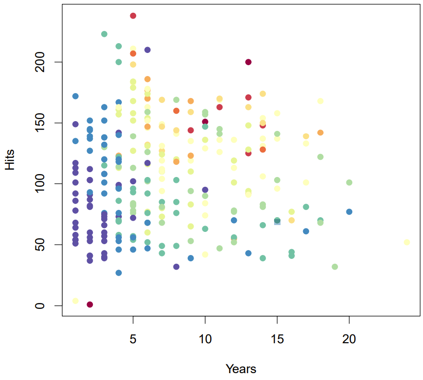

name: toc

```{css, echo=FALSE}
@media print {
  .has-continuation {
    display: block !important;
  }
}
```

```{r setup, include=FALSE}
options(htmltools.dir.version = FALSE)
library(knitr)
opts_chunk$set(
  fig.align="center", fig.width=12, fig.height=8, 
  # out.width="748px", #out.length="520.75px",
  dpi=300, #fig.path='Figs/',
  cache=T, warning=F, message=F
  )
if (!require(pacman)) install.packages(pacman)
pacman::p_load(tidyverse,grf,ISLR,rpart.plot,tidymodels)
theme_set(theme_minimal())
```

# Table of contents

- [Prologue](#prologue)

- [Decision Tree Review](#decision-tree-review)

- [Random Forests](#random-forests)

---
name: prologue
class: inverse, center, middle

# Prologue

---
# Prologue

- Last week we talked about the basics of machine learning

- You take a bunch of data, split it into training and testing sets, fit a model to the training data, then test it on the testing data

- Let's look at a particular type of machine learning model: decision trees

- Decision trees are a type of machine learning model that are easy to interpret
  - They allow for non-linear relationships between the dependent and independent variables
  - But the math is a lot more complicated than an OLS regression
  - The visualizations are more straight-forward

- Trees .hi[stratify], .hi[segment], or .hi[partition] the data into subgroups
  - Each subgroup predicts a different value of the dependent variable
  - These lend themselves to flowcharts! 

---
# Questions

---
# Hack-a-thon

- Fill out survey please

- Right now we have three participants

---
# Attribution 

- This lecture is based on the following resources:

- [Introduction to Statistical Learning, Chapter 8](https://www.statlearning.com/)

- Tyler Ransom's lecture notes

---
name: decision-tree-review
class: inverse, center, middle

# Decision Trees

---
# Motivating example

- Imagine you want to predict the income mobility of those raised in the 25th percentile for some county
  - **Remember we are not making causal inferences here, just predictions**

- You have tons of predictors: job growth, health, education, crime rates, share of each race, median HH income, college degrees, bankruptcies, religiosity, and more

- The correlations between these variables and mobility is likely non-linear

- The correrlations between mobility and median HH income could change depending on the rate of education

- Would a regression capture all of that?

- Probably not...

---
# Stratifying baseball data



---
# Opportunity Atlas data

<embed src="data/documentation/project4/training_data_descrip.pdf" type="application/pdf" width="100%" height="600px" />

---
# Stratify opp atlas data

```{r strata,echo=FALSE}
opp_atlas <- read_csv("data/atlas_training.csv") %>%
  filter(!is.na(kfr_pooled_p25)) 

opp_plot <- opp_atlas %>%
  ggplot(data=., aes(x=P_57, y=P_37, color=kfr_pooled_p25)) +
  geom_point() +
  scale_color_gradient2(low = "blue",mid='purple',high = "red", name='Mobility',midpoint=median(opp_atlas$kfr_pooled_p25)) + 
  labs(title='Income mobility by county broken up by predictors 37 and 57') + 
  theme(legend.position = c(0.1,.8))
opp_plot
```

---
# Strata lines

```{r strata-add-lines,echo=FALSE}
opp_plot+  
  geom_hline(yintercept = 0.085) +
  geom_vline(xintercept = 15) + 
  labs(title='Stratifying the data')
```

---
# What is a decision tree? 

- A decision tree organizes variables into tree-like structure
  - It is essentially, a really fancy flowchart

- At each node, pick the variable that best meets a decision rule

- At node 1, the algorithm cycles through each $X$ variable and finds the split in the data that best meets the decision rule
  - It picks the best $X$ variable
  - It follows the branch down and creates nodes by looking at the remaining $X$'s that best meet the decision rule

- When making a decision about an observation, follow the tree down the branches

---
# Types of decision trees 

### Regression trees

- The decision rule is what variable $X$ best predicts $y$ when split at some cutoff point $\bar{X}$
  - Typically the predicted $\hat{y}$ is the average of $y$ conditional on $X$ being less than or greater than $\bar{X}$
  - Alternatively, it could be the mode

- At the terminal node, the prediction $\hat{y}$ is the average of $y$ for all observations in that node

### Classification trees

- Your outcome is now a categorical variable 

- These predict the probability that an observation fits in some category

### Causal Trees 

- Instead of splitting based on prediction of $y$, split to maximize the difference in the average treatment effect (ATE) between the two branches

- At each node, the $X$ covariate that maximizes the difference in the ATE is selected

- The goal is to see how varied the treatment effect is across different subgroups of the population
  - This is the heterogeneity of treatment effect (HTE)
  - We want to find the subgroups that have the largest HTE

- The result gives a conditional average treatment effect (CATE) for each subgroup from a variety of $X$'s

---
# Regression Tree of income mobility

- Each node shows the share of observations and the average income mobility for thse observations
- Each branch shows the decision rule as a cutoff in whatever variable minimizes the residual sum of squares

```{r boston,echo=FALSE,warning=FALSE}
data("Boston", package = "MASS")

reg_tree_spec <- decision_tree() %>%
  set_engine("rpart") %>%
  set_mode("regression")

opp_atlas <- read_csv("data/atlas_training.csv")

reg_tree_fit <- fit(reg_tree_spec, kfr_pooled_p25 ~ ., opp_atlas)

reg_tree_fit %>%
  extract_fit_engine() %>%
  rpart.plot()
```

---
name: random-forests
class: inverse, center, middle

# Random Forests

---
# Many trees make a forest

- Decision trees are fairly easily to interpret once you make one

- But one drawback is that they are very sensitive to the data

  - Too many nodes and you could overfit
  - Too few nodes and you'll just have noise

- So what if we made many trees and averaged the predictions?
  - Technically this is just called "bagging" (bootstrap aggregating)
  - Random forests also randomize the variables available to split the nodes
  - See more at [Introduction to Statistical Learning, Chapter 8.2](https://www.statlearning.com/)

- But won't we just repeat the same tree over and over?
  
---
# Pull yourself up by your bootstraps

- How could we use bootstrapping?

--

- If you bootstrap the data $B$ times, you create $B$ new samples of the data indexed $b$

1. For each bootstrap sample $b$, create a decision tree $T_b$ using the bootstrap sample $b$ 
2. For each observation $i$ in the original sample, predict the outcome $y_i$ using all $B$ trees
3. Average the predictions as $\hat{y}_i = \frac{1}{B} \sum_{b=1}^B T_b(X_i)$

- This is called bagging (bootstrap aggregating)

- **Intuition**: With many trees, you can average out the noise and get a better prediction

- Random forests add a twist to bagging by randomly selecting a subset of $X$ variables to split the nodes in the tree
  - This ensures the trees are uncorrelated with each other
  - Minimizes variance

**Intuition**: By randomizing the $X$ variables available to a tree, they are less likely to only use the same variables to split the nodes in the tree. As a result, the algorithm evaluates other variables in the data. 

---
# Use cases of random forests

- Random forests are a very popular machine learning technique

- They are used for prediction, classification, and causal inference

- Kleinberg et al. (2018) use random forests to predict the judicial bail decisions in NYC

---
# What next?

- Get your hands dirty! 

- Navigate to the [Generalized Random Forest](https://grf-labs.github.io/grf/articles/grf.html) vignette

```{r install-grf}
#install.packages('grf')
library(grf)
```

- This will walk you through how to use the **grf** package to estimate causal forests

- Once you finish, try the **grf** [guided tour](https://grf-labs.github.io/grf/articles/grf_guide.html#a-grf-overview-1)
  - I recommend you try the [application to school program evaluation](https://grf-labs.github.io/grf/articles/grf_guide.html#application-school-program-evaluation-1) example

- This package is full of vignettes that you could use for the problem set

---
class: inverse, center, middle

# Next lecture: Least Absolute Shrinkage and Selection Operator (LASSO)
<html><div style='float:left'></div><hr color='#EB811B' size=1px width=796px></html>

```{r gen_pdf, include = FALSE, cache = FALSE, eval = TRUE}
infile=knitr::current_input() %>% str_replace(".Rmd", ".html")
#infile = list.files(pattern = '.html')
# pagedown::chrome_print(input = infile, timeout = 100)
```


