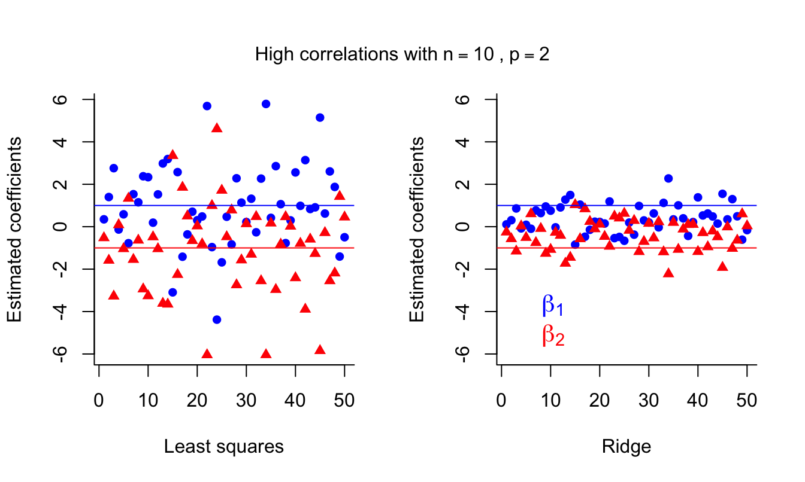
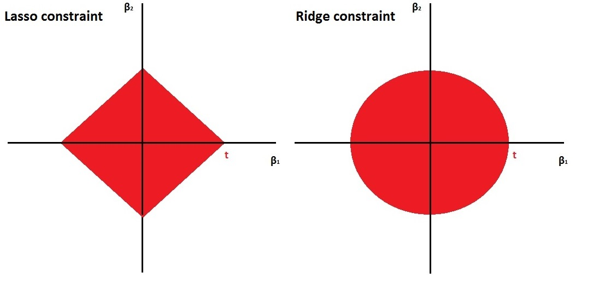

name: toc

```{css, echo=FALSE}
@media print {
  .has-continuation {
    display: block !important;
  }
}
```

```{r setup, include=FALSE}
options(htmltools.dir.version = FALSE)
library(knitr)
opts_chunk$set(
  fig.align="center", fig.width=6, fig.height=4, 
  # out.width="748px", #out.length="520.75px",
  dpi=300, #fig.path='Figs/',
  cache=T#, echo=F, warning=F, message=F
  )
if (!require(pacman)) install.packages(pacman)
pacman::p_load(tidyverse)
theme_set(theme_minimal())
```

# Table of contents

- [Prologue](#prologue)

- [Linear Model Selection](#linear-model-selection)

- [Ridge Regression](#ridge)

- [Least Absolute Shrinkage and Selection Operator (LASSO)](#lasso)

---
name: prologue
class: inverse, center, middle

# Prologue

---
# Regressions

- What do we typically do when we run OLS?

- We run a regression with all the variables we think are important

- But what happens when we have more variables than observations?

---
# Too many variables

- Most of the analysis we have done in this class has focused on the case where we have a small number of variables relative to the number of observations.

- But sometimes you have LONG data

- In this case, you have a large number of variables $J$ relative to the number of observations $n$.

- If you try to use OLS  with all the variables, you will run into problems. Why?

--

- The number of variables is larger than the number of observations! 

- Uh oh

---
# How can we cut down on variables?

- How can we cut down on the number of variables?

- What would be the regression tree approach?

--

- Iteratively split training data using variables that minimize residual sum of squares and use test data to determine the optimal number of leaves

- This is a form of **variable selection**

- But it forces us to turn continuous data binary ($X > c$ vs. $X geq c$) 

- But what other ways are available? 

---
class: inverse, center, middle
name: linear-model-selection

# Linear Model Selection

---
# Typical OLS

- Good old-fashioned regression minimizes the residual sum of squares (RSS)

$$ 
\begin{aligned}
\min_{\beta} \sum_{i=1}^n \underbrace{(y_i - \beta_0 - \sum_{j=1}^k \beta_j x_{ij})^2}_{\text{RSS}} 
\end{aligned}
$$

- What does that mean? 

--

- We are trying to find the $\beta$s that predict a dependent variable $y$ as a linear combination of the independent variables $x$.

---
# Adding dimensions with OLS

- Each additional variable $x_{j}$ adds a new dimension to the problem
  - As in each additional variable is a new axis in $J$-dimensional space where $J$ is the number of variables 
  - (You've likely never thought about it that way before, but any regression is a multi-dimensional problem)

- If you have more variables than observations, you have more dimensions than observations

- Why? Well solve this equation:

$$ x + y =5 $$

- How many solutions are there? Infinite

- Now solve this system of equations:

$$ x + y =5 $$
$$ x + 2y =10 $$

- The same logic applies to regression (though it is a bit more complicated)

---
class: inverse, center, middle
name: ridge

# Ridge Regression

---
# Shrinkage 

- In OLS, we are trying to minimize the residual sum of squares (RSS)

- In machine learning, there are shrinkage methods that add a penalty term to the RSS
  - These penalize coefficients that are too large

$$ 
\begin{aligned}
\min_{\beta} \sum_{i=1}^n \underbrace{\text{model fit}}_{\text{RSS}} + \text{penalty on size of coefficients} 
\end{aligned}
$$

- Why penalize large coefficients? 

- Large coefficients are more likely to be overfitting the data since they are more sensitive to small changes in the data
  - By penalizing large coefficients, we are reducing the variance of the model and thus complexity
  - Intuitively, a larger $\beta$ the further your model is from a null hypothesis of $\beta = 0$, which is the simplest model

- What happens if we reduce bias in the data?

--

- We increase variance! 

---
# Ridge Regression 

- So what form do these penalties take? 

- Well Ridge Regression is one such example

- Ridge regression adds a penalty term to the RSS that is proportional to the sum of the squared coefficients

- Essentially, it adds a constraint to the optimization problem

$$ 
\begin{aligned}
\min \underbrace{\sum_{i=1}^n (y_i - \beta_0 - \sum_{j=1}^J \beta_j x_{ij})}_{\text{model fit}} + \underbrace{\lambda \sum_{j=1}^J \beta_j^2}_{\text{penalty}} = RSS + \lambda \sum_{j=1}^J \beta_j^2 
\end{aligned}
$$

$\lambda$ is the "tuning parameter" that controls the strength of the penalty

- In order to minimize, we need to find the $\beta$s that minimize the RSS and the penalty

- That means we need smaller $\beta$s -- and necessarily a simpler, less variable model

- Literally, we shrink the $\beta$s towards zero

---
# Ridge Regression



Example taken from [Dr. Samuel E. Jackson online textbook](https://bookdown.org/ssjackson300/Machine-Learning-Lecture-Notes/ridge-regression.html#minimisation)

---
# Ridge Regression coefficients


---
# Ridge Regression flaws

- Ridge regression keeps all the variables in the model -- it just shrinks the coefficients

- But what if some variables are just truly noise 
  - i.e. they are not correlated with the dependent variable

- Sure, we can check by hand, but shouldn't we just toss them? 

---
class: inverse, center, middle
name: lasso

# LASSO

---
# LASSO

- LASSO stands for Least Absolute Shrinkage and Selection Operator

- It is another shrinkage method that adds a penalty term to the RSS

- But now the penalty term is proportional to the sum of the absolute value of the coefficients

$$ 
\begin{aligned}
\min \underbrace{\sum_{i=1}^n (y_i - \beta_0 - \sum_{j=1}^J \beta_j x_{ij})}_{\text{model fit}} + \underbrace{\lambda \sum_{j=1}^J |\beta_j|}_{\text{penalty}} = RSS + \lambda \sum_{j=1}^J |\beta_j| 
\end{aligned}
$$

- So now instead of the squared penalty on the coefficient size, you have the absolute value of the penalty

- The magic of the absolute value is that it can shrink coefficients to zero with a sufficiently large $\lambda$
  - This means that LASSO can be used for variable selection -- a zero means that variable is not in the model
  - **Intuition**: The absolute value has a "sharp" corner at zero, so it can "cut" coefficients to zero, Ridge is a circle, so it can only shrink coefficients to the edge of the circle

- Selection is a big advantage over Ridge Regression
  - Of course, that can also be a disadvantage if you want to keep all the variables in the model
  - It leads to more bias

---
# LASSO visualization



---
# Ridge Regression coefficients


---
class: inverse, center, middle
name: other-regularization

# Other details on Regularization

---
# K-fold cross-validation: How to pick $\lambda$

- The $\lambda$ in both of the examples above is a "tuning parameter," which controls the strength of the penalty

- You need to do $K$-fold cross-validation:

1. Choose the number of "folds" or groups, $K$ (usually 5 or 10)
2. Randomly split the data into $K$ folds
3. Create a grid of feasible $\lambda$ values to check
4. For each value of $\lambda$:
  - Run Ridge or LASSO on the $K-1$ folds
  - Calculate the $MSE_k$ on the remaining $k$-fold
5. Calculate the average $MSE_k$ for each $\lambda$
$$ MSE_{CV}(\lambda) = \frac{1}{K} \sum_{k=1}^K MSE_k(\lambda) $$
6. Pick the $\lambda$ with the lowest MSE

- You know what's neat? You can do this in R with the **glmnet** library! 

- It will even plot the results for you, so you can see the optimal $\lambda$

---
# Drawbacks of LASSO and Ridge

- Regularization/coefficient shinkage are useful for reducing variance and overfitting

- But they can also lead to bias

- The more you shrink the coefficients, the more bias you introduce

- You are no longer finding the best linear unbiased estimator (BLUE) that you find with OLS

- Instead, you get the best linear biased estimator (BLBE) because you trade some bias for less variance

- Sometimes you're okay with that! 

---
# Why are you okay with bias?

- Sometimes you don't mind being a little off in your predictions

- For example, if you are predicting the number of people who will show up to a party, you don't care if you are a little off
  
- You do care if someone tells you that between 0 and 100 people will show up, but 50 on average -- that's not helpful

- It is even less helpful if they tell you that to make am accurate prediction they need to know:
  - The number of invites
  - The weather
  - The day of the week
  - The time of day
  - The number of people who have already RSVP'd
  - The variety of chips you're serving
  - What is on TV that night
  - etc. 

- You'd rather just have a simple model that is a little off then a complicated model that is super sensitive

---
# Warning

- Regularization is a useful tool for reducing variance and overfitting

- But just cause you can run a regression techniques doesn't mean you should

- You should always think about the problem you are trying to solve and the data you have

- Is it worth trying a technique? 

- Will this technique help you solve your problem?

- Will it help you understand your data?

- Or are you just trying to seem flashy? 

---
# Conclusion

- Regularization is a useful tool for reducing variance and overfitting

- It recognizes that sometimes you are okay with a little bias if it means you get less variance

- It relies on a tuning parameter $\lambda$ that controls the strength of the penalty from adding more complexity to a regression model

- LASSO can be used to select variables, while Ridge just reduces the magnitude of the coefficients

---
# What next? 

- Try an activity: [ISLR lab using tidymodels](https://emilhvitfeldt.github.io/ISLR-tidymodels-labs/06-regularization.html)

- Before class: work through the lab sections on Ridge and LASSO in a .Rmd file that you create

- Write up short answers to the following questions:
  1. What are the coefficients in the Ridge and LASSO regressions when the penalty is zero? Why? 
  2. How does tidymodels pick the optimal $\lambda$ in each method? 
  3. What is the optimal $\lambda$ in Ridge and LASSO?

---
class: inverse, center, middle

# Next lecture: Regular expressions and word clouds
<html><div style='float:left'></div><hr color='#EB811B' size=1px width=796px></html>

```{r gen_pdf, include = FALSE, cache = FALSE, eval = TRUE}
infile=knitr::current_input() %>% str_replace(".Rmd", ".html")
#infile = list.files(pattern = '.html')
pagedown::chrome_print(input = infile, timeout = 100)
```


