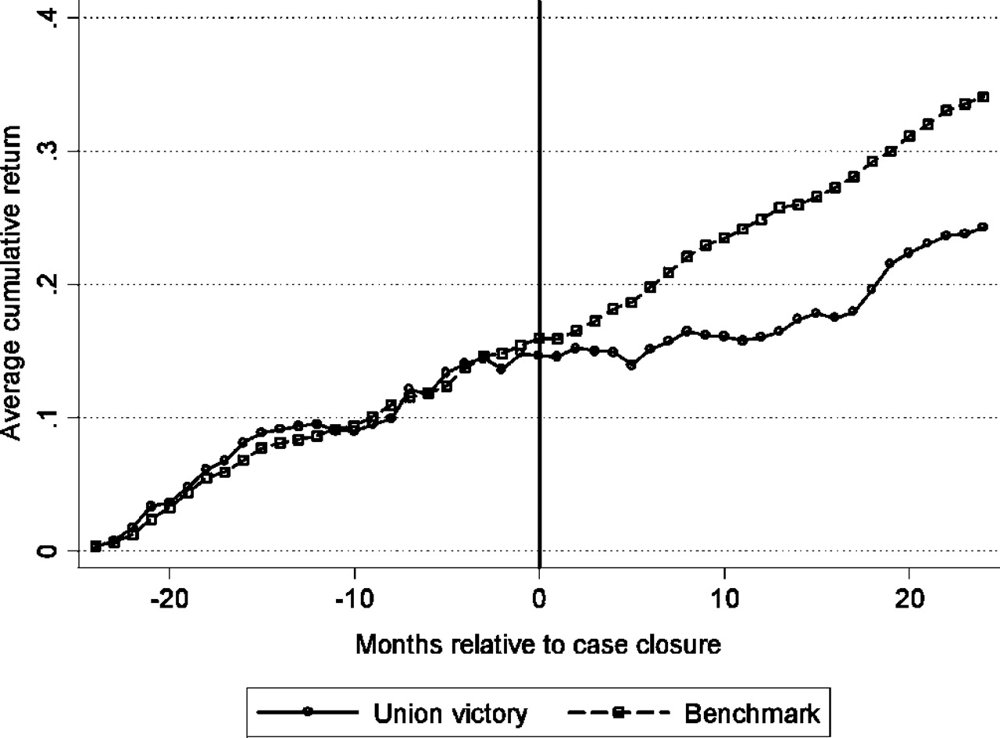
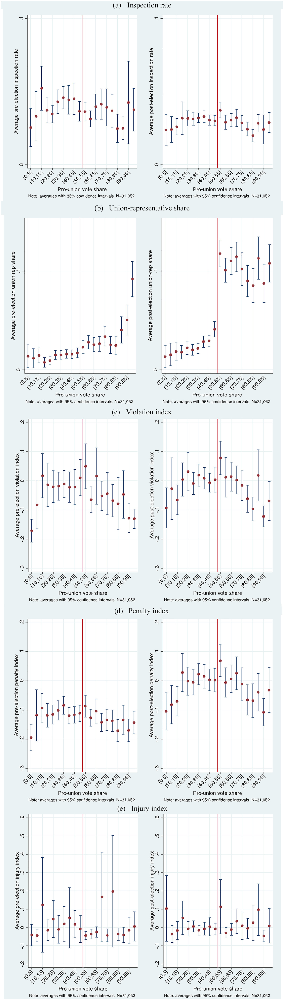

name: toc

```{css, echo=FALSE}
@media print {
  .has-continuation {
    display: block !important;
  }
}
```

```{r setup, include=FALSE}
options(htmltools.dir.version = FALSE)
library(knitr)
opts_chunk$set(
  fig.align="center", fig.width=6, fig.height=4, 
  # out.width="748px", #out.length="520.75px",
  dpi=300, #fig.path='Figs/',
  cache=T#, echo=F, warning=F, message=F
  )
if (!require(pacman)) install.packages(pacman)
pacman::p_load(tidyverse, # For data manipulation
  gsheet, # For reading Google Sheets
  fixest, # For fixed effects regression
  tidytext, # For text analysis/natural language processing
  janeaustenr, # For Jane Austen novels
  wordcloud, # For word clouds
  RColorBrewer,# For color palettes
  stringdist, # For string distance
  tidystringdist, # For string distance with tidy data
  fuzzyjoin) # For fuzzy merging
theme_set(theme_minimal())
```

# Table of contents

- [Prologue: Text as data](#prologue)

- [Tidying text data](#tidying-text-data)
  - [Regular expressions](#regex)
  - [Fuzzy Merges](#fuzzy-merge)

- [Summarizing text](#summarizing)
  - [Word counts](#word-counts)
  - [Word clouds](#word-clouds)
  - [Term Frequency-Inverse Document Frequency](#tf-idf)

---
name: prologue
class: inverse, center, middle

# Prologue: Text as data

---
# Prologue 

- Today we're going be talking about text as data
  - Many resources come from [Text Mining with R](https://www.tidytextmining.com/)

- We use text all the time in our daily lives to communicate

- As a result, it is a rich source of data that can be used to answer interesting questions

- Sometimes important numerical data is embedded in text (e.g. commodity prices, wages, etc. in historical documents)

- Sometimes we need to categorize numerical data based on text (e.g. categorizing purchases based on bank memos)

- Sometimes we need to link text across datasets a "fuzzy merge" (e.g. company names, addresses, etc.)

- Sometimes the stuff we struggle to quantify is in text (e.g. sentiment, political ideology, etc.)

- Before we can get to that, we need to learn how to work with text data

---
name: tidying-text-data
class: inverse, center, middle

# Tidying text data

---
# Tidying text data

- A library is basically a database of words

- Each word carries information

- How different words are combined together also carries information

- The problem is that text data is messy

- How could we tidy it?

---
# Tidying text data

- There's no one structure that makes sense for all text data

- Your goal is to find a structure that makes sense for your data/research question

- Key term: **Corpus** is a collection of documents

- String variable: each row is a group of words (e.g. a sentence, title, etc.)

- Term document matrix
  - Each row is a document
  - Each column is a word
  - Each cell is the frequency of that word in that document

- Document term matrix
  - Each row is a word
  - Each column is a document
  - Each cell is the frequency of that word in that document

- You could amend the above to account for combinations of words instead of single words

- Or singleton words and groups of words (bigrams, trigrams, etc.)

- The data get big quickly! 

---
# Wider tasks with text data

- Seriously, that's a ton of words -- are they all meaningful?!

- There are lots of words in sentences and many of them are not important

- Plus words are capitalized and some are not
  - To a computer "Kyle" and "kyle" are different words
  - But to a human, they're the same word
  - But what about "Bates" and "bates"?

- Then words like "and" and "or" are called **stop words**

- Often times you'll want to remove stop words from your corpus
  - Plus, there's loads of other bits of text that you might want to remove (e.g. punctuation, numbers, etc.)
  - The package **tidytext** has a list of common stop words in `data("stop_words")`

---
# Stop words

.pull-left[
```{r stop-words}
data('stop_words')
stop_words %>% head(10)
```
]
.pull-right[
```{r add-stop-words}
new_stop_words <- data.frame(word=c('new-stop-word','another-stop-word'),lexicon='kyle-words')
stop_words %>% 
  rbind(new_stop_words) %>%
  tail(10)
```
]

---
# Wider tasks with text data

- Seriously, that's a ton of words -- are they all meaningful?!

- There are lots of words in sentences and many of them are not important

- Plus words are capitalized and some are not
  - To a computer "Kyle" and "kyle" are different words
  - But to a human, they're the same word
  - But what about "Bates" and "bates"?

- Then words like "and" and "or" are called **stop words**

- Often times you'll want to remove stop words from your corpus
  - Plus, there's loads of other bits of text that you might want to remove (e.g. punctuation, numbers, etc.)
  - The package **tidytext** has a list of common stop words in `data("stop_words")`

- But how do we remove them?! How do we identify them?

---
# Simplest example: A string variable

- Let's say we have a database with job descriptions listed as string variables 

- Look familiar?

```{r ask-a-manager,echo=FALSE}

column_names <- c('timestamp','age','industry','area','jobtitle','jobtitle2',
        'annual_salary','additional_pay','currency','currency_other',
        'income_additional','country','state','city','remote','experience_overall',
        'experience_field','education','gender','race')

managers2023 <- read_csv(gsheet::gsheet2text('https://docs.google.com/spreadsheets/d/  1ioUjhnz6ywSpEbARI-G3RoPyO0NRBqrJnWf-7C_eirs/edit?resourcekey#gid=1854892322'),
  col_names = column_names,
  skip = 1)  

head(managers2023)
```

---
# Simplest example: Matching job titles

- The job titles are free form text

- How many unique job titles are there?

- Anyone notice any issues? 

```{r ask-a-manager-title-count}
managers2023 %>% 
  group_by(jobtitle) %>%
  summarise(n=n()) 
```

---
# Case-matching the job titles

- Let's say we want to group similar job titles together

- At the very least, let's make them all lower case

- There's a lot more we could do here! 

```{r ask-a-manager-title-manual-count}
managers2023 %>%
  mutate(jobtitle=tolower(jobtitle)) %>%
  group_by(jobtitle) %>%
  summarise(n=n())
```

---
# Ambiguous text data

- Sometimes text data is ambiguous

- For example, someone lists that they are a 24/5 live-in nanny, another says they are a live-in nanny
  - Should we group these?
  - That's a judgement call
  - Depends on the research question

- What about "Assistant Regional Manager" and "Assistant to the Regional Manager"?

- Today I'll give you the tools to implement whatever cleaning you decide

- We'll also preview ML tools to inform your decision
  - Spoiler: the more the text analysis maps to pattern recognition, the better ML will be

---
# Dwight disagrees 

<center>

</center>
Dwight Schrute would rather group them, Michael Scott would not.

---
name: regex

# Regexes: Swiss Army knife of text analysis

- Look at these cases where "Income - additional context" is not missing

```{r ask-a-manager-income,echo=FALSE}
managers2023 %>% select(income_additional) %>% 
  filter(!is.na(income_additional)) %>% 
  head(5)
```

- If you look at each line, you can immediately tell me what the additional pay Is

- How could we grab those paid a percentage?

--

- Well technically, we can go percent-by-percent!

```{r ask-a-manager-income-percentage,eval=FALSE}
managers2023 %>% select(income_additional) %>% 
  mutate(ifelse('1%' %in% income_additional,1,
    ifelse('2%' %in% income_additional, 2, ...))) 
```

- This would be absurd. Do not do this unless you are participating in an [International Obfuscated Code Contest](https://en.wikipedia.org/wiki/International_Obfuscated_C_Code_Contest)

---
# Regular expression for numbers

- Instead, we can use a regular expression to grab percentages
  - The tidyverse's own [stringr](https://stringr.tidyverse.org/) package has a great suite of regex functions
  - There's also `grep` and `grepl` in base R, which are based on Linux's `grep` command
 
```{r ask-a-manager-income-percentage-regex}
managers2023 %>% select(income_additional) %>% 
  filter(!is.na(income_additional)) %>%
  mutate(add_percentage=str_extract(income_additional, '\\d+\\s*(%|percent)')) %>%
  head(5)
```

---
# What is `stringr::str_extract()` doing? 

- `stringr::str_extract()` is extracting the first match of a regular expression with
  - A number '\\d' with at least one digit '+'
  - Followed by 0 or more spaces '\\s*'
  - Followed by a percent sign '%' or the word percent
  
- How can we search for the '%', but not extract it and make the string numeric? Use `group`!

```{r ask-a-manager-income-percentage-regex-group}
managers2023 %>% select(income_additional) %>% 
  filter(!is.na(income_additional)) %>%
  mutate(add_percentage=as.numeric(str_extract(income_additional, '(\\d+)(\\s*)(%|percent)',group=1))) %>%
  head(5)
```

- There's a little more clean-up needed, but that's the gist

---
# Regular expression codes 

- There are a lot of codes that you can use in regular expressions

- Here are some of the most common ones:
  - '\\d' or '[0-9]' match any digit as does '[[:digit:]]' in **stringr**
  - '\\D' or '[^0-9]' match any non-digit as does '[[^:digit:]]' in **stringr**
  - '\\s' or '[[:space:]]'' match any whitespace character
  - '\\S' or '[^[:space:]]' match any non-whitespace character
  - '\\w' or '[[:word:]]' match any word character (letter, number, underscore)
  - '\\W' or '[^[:word:]]' match any non-word character
  - '\\b' or '\\B' match word boundaries or non-word boundaries
  - '.' match any character except a newline
  - '^', '$' match the start and end of a string
  - '|' match either the expression before or after the pipe
  - '\\' precedes any special character to match it literally

And many, many, many, many more

---
# stringr functions

- There are a lot of functions in **stringr** that are useful for regular expressions
  - `str_extract()` extracts the first match
  - `str_extract_all()` extracts all matches
  - `str_detect()` detects if a string matches a pattern
  - `str_count()` counts the number of matches
  - `str_locate()` locates the position of the first match
  - `str_locate_all()` locates the position of all matches
  - `str_replace()` replaces the first match
  - `str_replace_all()` replaces all matches
  - `str_split()` splits a string into a vector of strings
  - `str_subset()` returns a subset of strings that match a pattern

And so on...

---
# Regular expressions

- Practice makes perfect

- It takes a lot of time to get good at regular expressions

- There are fantastic tools out there, like [regex101](https://regex101.com/), [RegExplain](https://www.regexplain.ai/), [**stringr** Cheatsheet](https://rstudio.github.io/cheatsheets/strings.pdf)

- StackOverflow is a great tool as well to see how others have solved similar problems

- Generative AI is getting better at writing regular expressions every day

- Your brain is also a critical tool for regular expressions -- and any coding task for that matter

- **Practice**: Create a regular expression that matches phone numbers in the following format: (xxx) xxx-xxxx or xxx-xxx-xxxx
  1. Create a string like `r number <- 'This is a number (123) 456-7890'`
  2. Use `str_extract()` to extract the phone number

---
# Back to the job titles

- We can create dummy variables for the job titles that mention certain words 
- We can create dummy variables for job titles containing "manager" and "assistant"
- Then we can regress the salary on these dummy variables
  - I also split by remote work and cluster by industry just cause `feols()` is so neat

```{r manager-assistant-manager}
managers2023 %>%
  mutate(jobtitle=tolower(jobtitle),
      manager=str_detect(jobtitle,'manager'),
      assistant=str_detect(jobtitle,'assistant')) %>%
  feols(annual_salary ~ manager + assistant, data=.,
  fsplit=~remote, cluster=~industry) %>%
  etable()
```

```{r tolower,echo=FALSE}
managers2023 <- managers2023 %>% mutate(jobtitle=tolower(jobtitle))
```

---
name: fuzzy-merge

# Fuzzy Merge: I see a match, but the @#%^ computer doesn't

- Sometimes you have two strings that you know match, but the computer doesn't

- Before, we wanted to match job titles and we could do that by case-matching (and probably some other tricks)

- But what if there are a ton of typos? Well then we could use fuzzy matching 

- Fuzzy matching is a way to match strings that are similar, but not identical

- There are a lot of ways to do this including the **stringdist**, **agrep**, and **fuzzyjoin** packages
  - True to its name **stringdist** has a suite of functions that measure the "distance" between strings
  - **fuzzyjoin** has a suite of functions that merge dataframes based on fuzzy matching
  - **agrep** is a base R function that does fuzzy matching (based on Linux) that only uses Levenshtein distance

---
# Fuzzy match application: Union votes

- The effect of unionization on several economic outcomes is ambiguous
  - Wages up for sure?
  - Productivity up or down?
  - Worker safety?

- The National Labor Relations Board maintains records of all labor union votes

- These records include firm name, location, vote counts, number of employees, etc.
  - No information on firm or worker outcomes

- Lee & Mas (2012) Link administrative records maintained by two separated offices:
  - NLRB union vote data + S&P Compustat firm data
  - Fuzzy match on firm name, address, etc.
  - Long-run event studies show a 10% decline in equity value of firm after union vote
  - Cannot decompose into wage premia and productivity change

- Sojourner & Yang (2022) link to Occupational Safety and Health Administration data
  - OSHA inspection increases after union vote, more violations cited and penalties assessed

(Recent work shows bias against unions when Republicans control NLRB compromising the validity of all union RDD results)

---
# Firm Cumulative Absolute Return



---
# OSHA Inspections

```{r osha-inspections,cache=FALSE,crop=TRUE,echo=FALSE,fig.cap="OSHA inspections by union vote",fig.align='center'}

```

---
# Distance between strings? 

- What does it mean to measure the distance between strings?

- Well, we can think of strings as vectors or groups of characters

- Think of the distance between strings as the changes between these characters

- **Levenshtein**: Measure number of characters missing, added, or substituted
  - "Kyle" and "Kile" have a Levenshtein distance of 1
  - "Kyle" and "Klye" have a Levenshtein distance of 2

- We can account for transpositions as well (Damerau-Levenshtein distance)
  - "Kyle" and "Klye" have a Damerau-Levenshtein distance of 1

- There are many other distance measures (Jaro-Winkler, Hamming, Phonetic, etc.)

- Normalize the distance by the length of the string to get a measure of similarity

- If the similarity exceeds a threshold you choose, we can say that the strings match

---
# String distance

Mock Harry Potter dataset examples from [R-Vogg-Blog](https://r-vogg-blog.netlify.app/posts/2021-03-27-fuzzy-matching-packages/)

```{r data-creation, echo=FALSE}
df1 <- data.frame(name = c("harry j potter", "harrypotter", "Voldemort", 
           "Harry POTTER", "Harrry Potter", "Ron Weasley"))

df2 <- data.frame(name = c("Harry Potter", "Voldemort"), 
                  bad_spells_index = c(0.02,0.87))

input <- df1$name
compare <- df2$name
```

.pull-left[
```{r string-dist, collapse=TRUE}
stringdistmatrix(input,compare, 
  method = "lv",
  useNames = "strings")
```
]
.pull-right[
```{r tidy-string-dist, collapse=TRUE}
tidy_comb(input,compare[1]) %>%
  tidy_stringdist(method=c('lv','dl','jw','cosine')) %>%
  rename(Levenshtein=lv,`Damerau-Levenshtein`=dl,`Jaro-Winkler`=jw,Cosine=cosine)
```
]

---
# Fuzzy matching to merge

.pull-left[
```{r fuzzy-merge-6}
fuzzyjoin::stringdist_join(df1, df2, 
                mode = "inner",
                by = "name",
                max_dist = 6,
                method='lv')
```
]
.pull-right[
```{r fuzzy-merge-10}
fuzzyjoin::stringdist_join(df1, df2, 
                mode = "inner",
                by = "name",
                max_dist = 10,
                method='lv')
```
]

<!-- Create key guidance -->

---
# Fuzzy matching to group rows

- Can be done with `tidystringdist`, but it gets slow fast (lots of comparisons!)

- Could parallelize comparisons to speed it up, but you need to write the code yourself

```{r fuzzy-groups-tidystringdist}
managers2023 %>% 
  head(1000) %>% 
  distinct(jobtitle) %>% 
  tidy_comb_all(jobtitle) %>% 
  tidy_stringdist() %>% 
  filter(lv<=1) # at most 1 character difference
```

<!-- Create key guidance -->

---
# Practical advice on fuzzy matching

- Fuzzy matching is a great tool, but it's not magic
  - It can also lie to you

- Don't use it when you: 
  - Have a reliable key/id between two dataframes
  - Can easily clean the data to make a reliable key/id

- Match on any many:many keys, then fuzzy match within the group to get the best unique link

- Use it to create a reliable key once that you can then reuse rather than re-running
  - This helps both stability, reproducibility, and speed

- It is as much an art as it is a science
  - You'll need to make judgement calls about what is a match and what is not
  - You'll need to make judgement calls about what distance threshold to use
  - You'll need to make judgement calls about what distance measure to use

- More than likely you'll get false positives and negatives in any given fuzzy merge
  - LLMs have made strides in putting some structure on this, but it's still an art
  - (One day this skill might be obsolete though)

---
# Fuzzy match guidelines

### When to fuzzy match

- Too much data to hand match (large $N$)
- No reliable key/id
- You can't clean the data to make a reliable key/id

### When not to fuzzy match

- You can match manually (small $N$)
- You have a reliable key/id
- You can clean the data to make a reliable key/id

### No unique match even after fuzzy match?

- Perform analysis on the group of matches, on each individual match, etc. to see how sensitive your results are to each match

- Hopefully, a mismatch is "classical measurement error," which is an endogeneity problem that puts a downward bias on results

---
class: inverse, center, middle
name: summarizing

# Summarizing text

---
# Summarizing text

- There are a lot of ways to summarize text

- We'll focus on three today:
  - Word counts: How many words are there? 
  - Word clouds: Let's see them all together
  - Sentiment analysis: How positive or negative is the text?

- None of these are machine learning tools, but they can be used to inform machine learning tools
  - For example, word counts can be used to create a term document matrix for topic modeling

- They're also useful for exploratory data analysis

- But don't mistake them for the cutting edge analysis
  - Especially sentiment analysis, which is a very blunt tool
  - But it is a bridge to topic modeling and other NLP tools

---
name: word-counts
# Word counts: Term frequency

- Word counts are the simplest way to summarize text

- Literally just count up the number of words

- We can do this manually, or we can use the **tidytext** package function `unnest_tokens()`
  - `unnest_tokens()` splits a string variable into a new row for each "token"
  - Then you can count

```{r word-count}
tokens <- managers2023 %>% 
  select(jobtitle) %>% 
  filter(!is.na(jobtitle)) %>% 
  mutate(jobtitle=tolower(jobtitle)) %>% 
  unnest_tokens(word,jobtitle) %>%
  count(word,sort=T)
tokens
```

---
# Stop words

- Did you notice that "of" was one of the most common words?

- It is in a lot of job titles, but it's not very informative

- Imagine if this weren't job titles, but a corpus of text from a novel
  - You'd be constantly panning for "gold" words amidst a see of "of"s and "the"s

- Let's get rid of it using the **tidytext** package's `stop_words` dataset and `anti_join()`

```{r word-count-stop-words}
data('stop_words')
tokens_no_stops <- tokens %>% 
  anti_join(stop_words) 
tokens_no_stops
```

- Much better

---
name: word-clouds
# Word Cloud

- Word clouds are a great way to visualize word counts
- The size of the word is proportional to the number of times it appears

```{r wordcloud}
pal <- brewer.pal(8,"Dark2") # define a nice color palette with function from RColorBrewer

tokens_no_stops %>%
  with(wordcloud(word, n, random.order = FALSE, max.words = 50, colors=pal))
```

---
# n-grams: phrases

- Sometimes words often go together

- For example, "machine learning" is a phrase

- If we just count the mentions of "machine" and "learning" separately, we lose the context

- We can use the **tidytext** package's `unnest_tokens()` function to create n-grams

- **ngram** literally means give me all groups of "n words"

---
# In practice

Bigrams will count a single word in multiple bigrams:
- "a machine learning algorithm" will count "a machine," "machine learning," and "learning algorithm"

```{r ngram}
 bigrams <- managers2023 %>% 
  select(jobtitle) %>% 
  filter(!is.na(jobtitle)) %>% 
  mutate(jobtitle=tolower(jobtitle)) %>% 
  unnest_tokens(word,jobtitle,token='ngrams',n=2) %>%
  count(word,sort=T) 
bigrams
```

---
# Separate out n-grams, remove stop words

.pull-left[
```{r ngram-separate}
 bigrams_separated <- bigrams %>%
  separate(word,c('word1','word2'),sep=" ") 
bigrams_separated
```
]
.pull-right[
```{r ngram-stop-words}
bigrams_separated %>%
  filter(!word1 %in% stop_words$word) %>%
  filter(!word2 %in% stop_words$word) 
```
]

---
name: tf-idf
# Term frequency-inverse doc frequency

- Frequencies are useful, but they don't tell us much about the context of the words

- We need to know how unique a word is to a document

- Effectively, a document is a group of words (e.g. a sentence, a job title, an essay, etc.)

- A term is a word/phrase

- Some words are uniquely common to a "document" (e.g. "manager" in a job title)

- So they may be valuable to predicting/classifying something about that "document" (e.g. salary, industry)

---
# Term frequency-inverse doc frequency

- Term frequency is the number of times a term appears in a document divided by the total number of terms in the document

- Inverse document frequency of a term is the log of the number of documents divided by the number of documents containing ta term

$$idf(\text{term}) = \ln{\left(\frac{n_{\text{documents}}}{n_{\text{documents containing term}}}\right)}$$

- **Note**: This is a heuristic with many variations and shaky theoretical foundations

- Roughly, the more documents a term appears in, the less valuable it is to predicting/classifying something about that document

- As such, the $idf$ falls as the number of documents containing a term increases

- The $tf-idf$ is the product of the term frequency and the inverse document frequency

---
# Where is this all headed?

- We can use the $tf-idf$ to predict the industry of a job title, the topics of a book, content of a tweet, etc.

- We have a bunch of job titles categorized by industry, salary, etc.

- We could use the $tf-idf$ to predict the industry or salary of a new job title

- Alternatively, say we have a bunch of tweets and we want to know if they are positive or negative
  - We could search for a bunch of terms OR we could flag several thousand tweets as positive or negative
  - Then we could feed the text to a machine learning algorithm that uses the $tf-idf$ to infer whether a word, its common ngrams, etc. are positive or negative
  - Then it could predict the sentiment of new tweets

- This is the basic idea behind topic modeling and sentiment analysis and how we get to GPT-4

---
class: inverse, center, middle

# Next lecture: Sentiment analysis, basics of topic modeling
<html><div style='float:left'></div><hr color='#EB811B' size=1px width=796px></html>

```{r gen_pdf, include = FALSE, cache = FALSE, eval = TRUE}
infile=knitr::current_input() %>% str_replace(".Rmd", ".html")
#infile = list.files(pattern = '.html')
pagedown::chrome_print(input = infile, timeout = 100)
```


