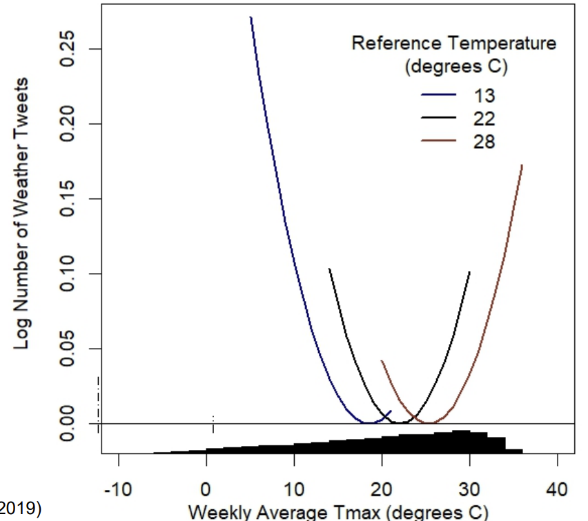
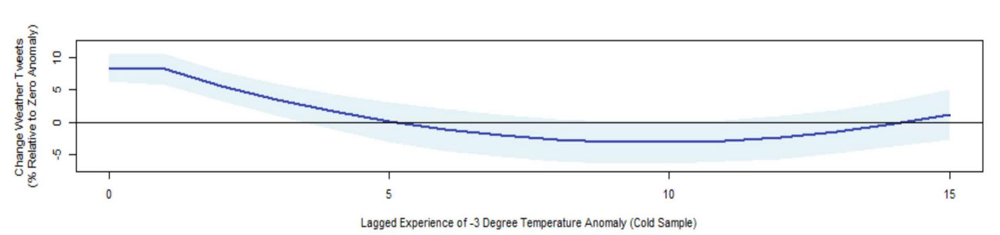
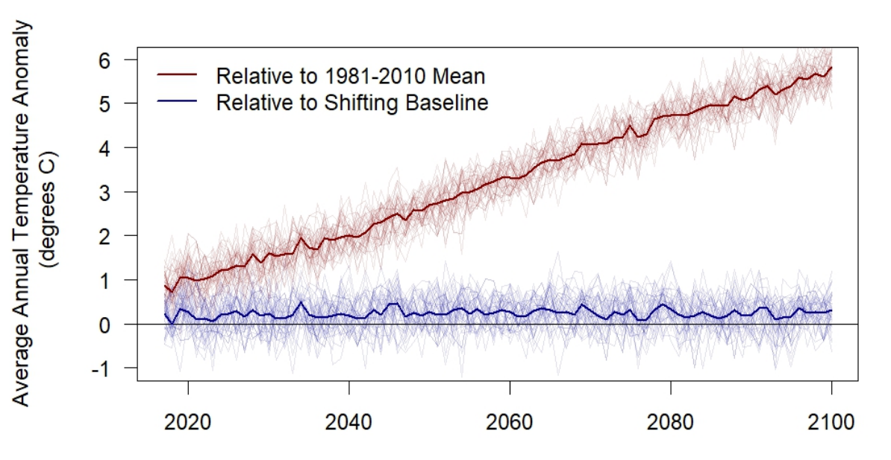

name: toc

```{css, echo=FALSE}
@media print {
  .has-continuation {
    display: block !important;
  }
}
```

```{r setup, include=FALSE}
options(htmltools.dir.version = FALSE)
library(knitr)
opts_chunk$set(
  fig.align="center", fig.width=6, fig.height=4, 
  # out.width="748px", #out.length="520.75px",
  dpi=300, #fig.path='Figs/',
  cache=T,#, echo=F, warning=F, message=F
  warning=F)
if (!require(pacman)) install.packages(pacman)
pacman::p_load(tidytext,janeaustenr,textdata,stringr,tidyverse,tm,topicmodels)
theme_set(theme_minimal())
```

# Table of contents

- [Prologue](#prologue)

- [ML and text intuition](#ml-and-text-intuition)
  - [Bag of words](#bag-of-words)
  - [Sentiment analysis](#sentiment-analysis)

- [Applications](#applications)
  - [Climate change and perceptions](#climate-change-and-perceptions)

---
class: inverse, center, middle
name: prologue

# Prologue

---
# Prologue

- We've covered a lot of ground this semester

- Today we'll wrap up text analysis and machine learning
  - There's a lot left uncovered
  - There's a lot that is insufficiently covered

- We'll cover some intuition and applications
  - Climate change perceptions and text analysis
  - Gendered language in anonymous economics forums (using analysis by an undergraduate!)

- I'll offer some closing thoughts on what you should do with all this knowledge

---
class: inverse, center, middle
name: ML and text intuition

# Intuition: Machine Learning and Text Data

---
# Intuition: Machine Learning and Text Data

- Text data usually starts fairly unstructured and messy

- Last class we covered how you clean it up

- Today we'll cover how you can use it to learn about the world

- We'll "cover" two uses
  - Sentiment analysis
  - Topics modeling

- Then we'll talk about some applications

---
name: bag-of-words
# Bag of words

- How do we know if a text is about a certain topic?

- One way is to look at the words it contains

- For example, is the following about finance?

  - "Stocks are doing well today."

- You know because it mentions the stock market

- This is the bag of words approach
  - If it mentions a word related to a topic it's about that topic
---
# Drawback of bag of words

- We miss a bunch of context

- Is this sentence about the economy?
  - "I place great stock in my friends."

- Not really, but it contains the word stock

- This is not to say that bag of words is useless
  - It's a good starting point
  - It's easy to implement
  - It's easy to understand

- You just need to be aware of its limitations and whether they matter for your application

---
name: sentiment-analysis
# Sentiment analysis

- Sentiment analysis is often a bag of words approach to classifying text
  - The simplest form is just searching for words that are related to positive or negative sentiment
  - Can you think of some words that are related to positive or negative sentiment?

- If you read the following sentences, which one is happy? 
  - "I love economics."
  - "I hate big data."
  - "If Professor Coombs can get a PhD, anyone can."
  - "I'm so happy I could cry."

- This can get ambiguous fast, no? (And I didn't spend along on these examples.)

---
# Sentiment Analysis lexicons

- Sentiment analysis lexicons are lists of words that are related to positive or negative sentiment"
  - [AFINN lexicon](http://corpustext.com/reference/sentiment_afinn.html)
  - [Bing lexicon](https://emilhvitfeldt.github.io/textdata/reference/lexicon_bing.html)
  - [NRC lexicon](https://saifmohammad.com/WebPages/NRC-Emotion-Lexicon.htm)

- If you find those words in a text, you can classify it as positive or negative

- Let's try one

---
# Sentiment Analysis lexicons

The package **tidytext** has the function `get_sentiments()` to get sentiment lexicons, which downloads them from the internet
  - **textdata** is where you get afinn
  - What's different about these?

```{r get_sentiments}
get_sentiments("afinn") %>%
  rename(afinn_value=value) %>%
  full_join(get_sentiments("bing"), by="word") %>%
  full_join(get_sentiments("nrc"), by="word",suffix = c('_bing','_nrc')) %>% 
  filter(!is.na(afinn_value), !is.na(sentiment_bing), !is.na(sentiment_bing))
```

---
# Jane Austen package

- The `janeaustenr` package contains the full text of Jane Austen's novels

- Let's use it to classify the sentiment of her novels

```{r tidy_jane}
tidy_books <- austen_books() %>%
  group_by(book) %>%
  mutate(
    linenumber = row_number(),
    chapter = cumsum(str_detect(text, 
                                regex("^chapter [\\divxlc]", 
                                      ignore_case = TRUE)))) %>%
  ungroup() %>%
  unnest_tokens(word, text)
tidy_books
```

---
# NRC sentiment analysis

- Only keep positve words

```{r nrc_sentiment}
nrc_joy <- get_sentiments("nrc") %>% 
  filter(sentiment == "joy")

tidy_books %>%
  filter(book == "Emma") %>%
  inner_join(nrc_joy) %>%
  count(word, sort = TRUE)
```

---
# Measuring net sentiment by line

```{r track-it}
jane_austen_sentiment <- tidy_books %>%
  inner_join(get_sentiments("bing")) %>%
  count(book, index = linenumber %/% 80, sentiment) %>% # Divide evey 80 lines of text
  pivot_wider(names_from = sentiment, values_from = n, values_fill = 0) %>% 
  mutate(sentiment = positive - negative)

ggplot(jane_austen_sentiment, aes(index, sentiment, fill = book)) +
  geom_col(show.legend = FALSE) +
  facet_wrap(~book, ncol = 2, scales = "free_x")
```

---
# Which words are most common?

```{r common-words,echo=FALSE}
tidy_books %>%
  inner_join(get_sentiments("bing")) %>%
  count(word, sentiment, sort = TRUE) %>%
  ungroup() %>% 
  group_by(sentiment) %>%
  slice_max(n, n = 10) %>% 
  ungroup() %>%
  mutate(word = reorder(word, n)) %>%
  ggplot(aes(n, word, fill = sentiment)) +
  geom_col(show.legend = FALSE) +
  facet_wrap(~sentiment, scales = "free_y") +
  labs(x = "Contribution to sentiment",
       y = NULL)
```

---
# How would ML come in handy?

- Well above we just took the lexicons as given

- But what if we went through half the Jane Austen books (or books by her peers) and marked off sentences as positive or negative?

- Then we could feed each line to a machine learning algorithm and have it learn what words are positive or negative
  - We could even have it learn what combinations of words are positive or negative
  - And train it on one book, test it on others
  - Train it on another, test on the others, etc.

- Potential algorithms: Lasso, Naive Bayes, Random Forest, Neural Networks, etc.

- Then we could use that to classify the sentiment of the other half of the books

- This is a very common use of machine learning called .hi[supervised learning] because we fed it trained data

---
class: inverse, center, middle
name: applications

# Applications

---
# Applications

Many applications of machine learning of text are relevant for economics

1. Measure perceptions of climate change/economic conditions

2. What are the political leanings of a newspaper? Political speech? 

3. Are there biases against certain groups in language used in a form of media? 

4. And many, many, many more

---
name: climate-change-and-perceptions
# Climate change and perceptions

- These next few slides are adapted from slides by [Raj Chetty and Gregory Bruich](https://opportunityinsights.org/wp-content/uploads/2019/05/Lecture-15-environment-2.pdf)

- You're likely aware that the Earth is getting warmer

- Have you heard the metaphor about the frog in the pot of water?
  - If you put a frog in a pot of boiling water, it will jump out
  - But if you put a frog in a pot of cold water and slowly heat it up, it will stay in the pot until it dies

- Are we the frog?

- Moore et al. (2019) hypothesize that the gradual pace of climate change has made it less salient

- This might explain why people are not more concerned about climate change given the evidence of how it will change our way of life/lead to major economic/social costs

- They look at tweets to see how often people discuss the climate, how they discuss it, and how that has changed over time/location with temperature

---
# Measuring Perceptions of Climate Change: Methods

- Data: 2.2 billion geocoded Tweets from 2014-16 and local area temperature
measurements from 1981-2016

- Goal: estimate a model that relates frequency of weather related tweets to
temperature anomalies

- "Bag of words" classification algorithm: define a tweet as weather-related if it
contains any word in a list of pre-defined weather related terms

- Validation: sample 6,000 tweets and manually define them as weather-related
or not to evaluate accuracy of classification of algorithm

---
# Words relatied to climate change

arid, aridity, autumnal, balmy, barometric, blizzard, blizzards, blustering, blustery, blustery, breeze, breezes, breezy, celsius, chill, chilled, chillier, chilliest, chilly, cloud, cloudburst, cloudbursts, cloudier, cloudiest, clouds, cloudy, cold, colder, coldest, cooled, cooling, cools, cumulonimbus, cumulus, cyclone, cyclones, damp, damp, damper, damper, dampest, dampest, deluge, dew, dews, dewy, downdraft, downdrafts, downpour, downpours, drier, driest, drizzle, drizzled, drizzles, drizzly, drought, droughts, dry, dryline, fahrenheit, flood, flooded, flooding, floods, flurries, flurry, fog, fogbow, fogbows, fogged, fogging, foggy, fogs, forecast, forecasted, forecasting, forecasts, freeze, freezes, freezing, frigid, frost, frostier, frostiest, frosts, frosty, froze, frozen, gale, gales, galoshes, gust, gusting, gusts, gusty, haboob, haboobs, hail, hailed, hailing, hails, haze, hazes, hazy, heat, heated, heating, heats, hoarfrost, hot, hotter, hottest, humid, humidity, hurricane, hurricanes, icy, inclement, landspout, landspouts, lightning, lightnings, macroburst, macrobursts, meteorologic, meteorologist, meteorologists, meteorology, microburst, microbursts, microclimate, microclimates, millibar, millibars, mist, misted, mists, misty, moist, moisture, monsoon, monsoons, mugginess, muggy, nor'easter, nor'easters, noreaster, noreasters, overcast, parched, parching, precipitation, rain, rainboots, rainbow, rainbows, raincoat, raincoats, rained, rainfall, rainier, rainiest, raining, rains, rainy, sandstorm, sandstorms, scorcher, scorching, shower, showering, showers, sleet, slicker, slickers, slush, smog, smoggier, smoggiest, smoggy, snow, snowed, snowier, snowiest, snowing, snowmageddon, snowpocalypse, snows, snowy, sprinkle, sprinkling, squall, squalls, squally, storm, stormed, stormier, stormiest, storming, storms, stormy, stratocumulus, stratus, subtropical, summery, sun, sunnier, sunniest, sunny, temperate, temperature, tempest, thaw, thawed, thawing, thaws, thermometer, thunder, thundering, thunderstorm, thunderstorms, tornadic, tornado, tornadoes, tropical, troposphere, tsunami, turbulent, twister, twisters, typhoon, typhoons, umbrella, umbrellas, vane, warm, warmed, warms, weather, wet, wetter, wettest, wind, windchill, windchills, windier, windiest, windspeed, windy, wintery, wintry

---
# Check-in

- Can anyone think of potential ways this could miss tweets?

- Would it pick up tweets we don't want?

- Any words missing?

- Weird words? 

---
# True positives

- it's too hot to be dressin cute
- I swear when it comes to driving in the rain, people in Southern California are
idiots on the road
- Thinking of another day full of rain makes me cringe
- It's pretty warm
- Its so hot dawg
- I want want to go swimming! Its too hot out here!!
- I cold af
- Hot as f**k
- Something about a rainy day so cozy
- I am so mad about this snow outside omg..
- the weather is nuts!- 

---
# False positives

- I need an ice cold Bud Light. @budlight
- In so tired of never being able to go out to dinner because everything is jam
packed due to the Heat game. every year. Same bs.
- "The cold never bothered me anyway." This movie never gets old
- me- he looks familiar. ash- he is familiar he's hot
- I live for all of the intense parts of songs by Arctic Monkeys.
- 1st degree burns from making hot coco. Hurts like hell
- dad never failed to buy the ocean breeze
- I wish I could freeze moments to be able to appreciate them more. Things are
so fleeting 

---
# Measuring Perceptions of Climate Change: Methods

- Data: 2.2 billion geocoded Tweets from 2014-16 and local area temperature
measurements from 1981-2016

- Goal: estimate a model that relates frequency of weather related tweets to
temperature anomalies

- "Bag of words" classification algorithm: define a tweet as weather-related if it
contains any word in a list of pre-defined weather related terms

- Validation: sample 6,000 tweets and manually define them as weather-related
or not to evaluate accuracy of classification of algorithm
  - 46% of tweets classified as “weather-related” are false positives
  - But frequency of errors is uncorrelated with temperature fluctuations, so unbiased
estimates of link between weather and climate perceptions despite error

---
# Weather-Related tweets

<center>

</center>

---
# Dynamic Adjustment Model 

- Next, relate tweets in a given week to rate of temperature anomalies both in that
week and to frequency of similar anomalies in previous years

- Dynamic adjustment model: captures how a sequence of anomalies (i.e., hotter
temperatures over time) affect perceptions

---
# Short Run vs. Long Run Impacts of Temperature Anomalies 



---
# Perceived vs. Actual Changes in Temperature



---
# Concluding thoughts on class

- Big data tools are powerful

- They're complicated too

- Start small and build up

- If you don't know how to do something, solve a simpler problem first

- Document, document, document (comments are great!)

- Abstract complicated tasks into language you understand

- Use version control when trying new things

---
class: inverse, center, middle

# Next lecture: None, we're done
<html><div style='float:left'></div><hr color='#EB811B' size=1px width=796px></html>

```{r gen_pdf, include = FALSE, cache = FALSE, eval = TRUE}
infile=knitr::current_input() %>% str_replace(".Rmd", ".html")
#infile = list.files(pattern = '.html')
pagedown::chrome_print(input = infile, timeout = 100)
```


